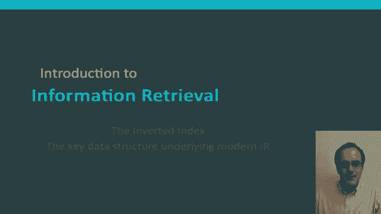
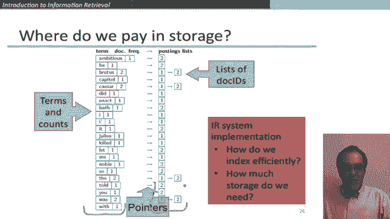
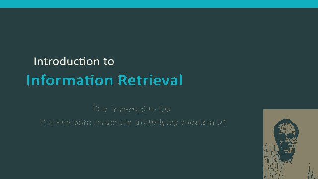

# P35：L6.3- 倒排索引：信息检索背后的核心数据结构 - ShowMeAI - BV1YA411w7ym

Hello again。 In this segment， we're going to talk about the inverted index and how it's constructed。

An inverted index is the key data structure that underlies all modern information retrieval systems from systems running on a single laptop to those running in the biggest commercial search engines。

 An inverted index is a data structure that exploits this sparsity of the term document matrix that we talked about in the preceding segment and allows for very inefficient。

 sorry。😊，And allows for very efficient retrieval。 It's essentially without peer as the data structure used in information retrieval systems。

So let me go through what's in an inverted index。 So for each term， each word。

 we must store a list of all the documents that contain the word。

Let's identify each document by a doc ID， which is just the document serial number so you can think of us starting with the first document called one。

 then2，3， etc。😊，And then the question is， what data structure should we use， I mean。

 one idea might be to use fixed arrays like the vectors that are in the term document matrix。

 but that's very inefficient because while for some words， they'll appear in a lot of documents。

 other words will appear in very few documents。 Moreover， there are perhaps other problems。

 if we think about a dynamic index where some documents are added later on。

 that then we have or documents are changed， Then we'll have difficult things in adjusting our vector sizes。

For these reasons， one way or another， we need to use variable size lists to store the documents in which a word occurs and in standard information retrieval terminology。

 these lists are called postings lists postings lists traditionally we usually stored on disk。

 though that may not be the case but now for big search engines and if you're storing postings lists on disk。

 the right way to store them is as one continuous run of postings because that gives the most efficient method of then being able to load them off disk back into memory when you interested in the postings for a particular word In memory。

 a postings lists can be represented as a data structure like a linked list or variable length arrays with some obvious trade offs in the size versus the ease of insertion。

😊，So the data structure that we end up with for an invert index is like the one that I'm showing here。

 so we have the terms that are in any of our documents and then for each term we've then got a pointer to a postings list that is then giving the different documents which are described by their document ID in which it occurs。

😊，Okay so one occurrence of a word document pair is referred to as a posting and the sum of all of the postings lists are then referred to as the postings and so overall then we have the parts of on the left hand side we have the dictionary and then on the right hand side we have the postings。

And these and of property of the postings is that they're sorted by document Id。

 and very soon now we'll explain why that's essential。So these two data structures。

 the dictionary and the postings have somewhat different statuses， because in global size。

 the dictionary is relatively small， but it's normally essential that it's in memory。

Whereas the postings are large， but at least for something like a small scale enterprise search engine。

 these will normally be stored on disk。Let me move now to how an inverted index is constructed。

 So the starting off point is we have a bunch of documents be indexed。

 and each of those documents we think of as being a sequence of characters willll assume that we've already dealt with。

 perhaps by someone else's software conversion from Pf and Microsoft Word documents and things like that。

 So then we're going to go through first and preprocessing steps。

 So we need a tokenizer that turns the document into a sequence of word tokens。

 which are the basic units of indexing。 but we often don't index exactly the words that are contained in the document。

 there might be various linguistic modules， then some way modify the tokens to put them into some kind of canonical form。

 So， for instance， here we're saying that for friends here。

 it's being both lowercase and as being stem to remove the S plural ending。😊，Okay。

 so then it's those modified tokens， which will be fed to the indexer。

 which is the thing that builds the inverted index that I was just talking about。

 So here' is the inverted index。 And it's this step here of the indexer that is the main thing that I want to talk about。

 But let me first just briefly mention those initial stages of text processing。

 So in just a fraction more detail。 the things that happen in those initial stages is firstly tokenizations。

 that's just how we decide to cut the character sequence into word tokens。

 And there are various issues there， there are punctuation that come up against words。

 how to treat possesss， hyphenated terms and all that kind of stuff we can talk about in more detail。

 then normalization is this issue that while certain things like USA with and without the dots。

 you probably want to treat as the same term and map both the text and。😊。

TheQu terms to the same form so that they will match。

You might want to do other kinds of mapping such as stemming so that author and authorization are both being mapped to the same stem so that they straightforwardly match in a query。

And finally， you may not want to index at all the most common words。 Traditionally。

 many search engines have left out very common words like that are to and of from the indexing。

 It's not clear that in the modern world when our amount of storage is so vast that that's such a good idea because there are queries that you might like to do such as for the song to be or not to be where you really need the stop words。

 And it turns out that with modern indexes， it's not that inefficient to store them。😊，Okay。

 now let's go through in detail how the indexer goes from the sequence of perhaps normalized tokens to building an inverted index。

 So for this example， we're assuming we have two documents， Doc 1 and doc2 here。

 So there are a key sequence of steps that we go through。So， our import is that we have。

The sequence of tokens of the first document in the order that they come in the text and the sequence of tokens of the second document in the order in which they come in the text。

 So the first step is that we do a sort。 and we sort as the primary key by the terms putting them in alphabetical order。

 So here we have this alphabetical list of terms。 And if we have the same term appearing in multiple document we do a secondary sort by the document I。

 So the word Caesar appears twice once in document I 1 and twice in document I 2。

 and we're sorting it secondarily by document I D。 And so that's a core and expensive indexing step。

Once we've got that far， what we then do is essentially a consolidation of what we found over here on the right。

 So we take that Here it is again。😊，And multiple entries in a single document are merged。

 So that's the two instances of Caesar。 And they're just treat as one。 And then we also merge。

All instances of a particular。Term， and so then we re represent that as over here。

 So we say we have the dictionary entry Caesar。We record its total frequency in the collection。

 I'll come back to that a bit later， and then we build for it the postings list。

 which is the list of documents in which it occurs。 And straightforwardly。

 because of a consequence of our sort in the previous step。

 that this postings list is itself going to be sorted by the document I D。

So in thinking about the size of an inverted index。

 we can think for a minute about where do we pay in storage。

 So we pay some amount for the list of terms and their accounts。

 But the number of terms will be relatively modest。 In our example beforehand。

 there are 500000 terms。We pay for a pointer two that identifies where the postings lists are。

 But again， that's of the order of 500000 things。 And then we pay for the actual postings lists themselves。

 And these postings lists are by far the biggest part。

 But even then theyre bounded by the size of the number of tokens in the collection。

 So an in our example before of the million documents of average length1000 words with still less than 1 billion items there。

 And so storage is manageable。So。When we are actually building an efficient IR system implementation。

 we think further about these questions， we think about how can we make the index as efficient as possible for retrieval and how can we minimize the storage on both sides of this both on this side and this side in terms of various sorts of compression we're not going to get into the details of that now。

 but what I hope you can start to see is that the inverted index gives an efficient basis on which to do retrieval operations。

😊。

And that's something that we'll talk about in more detail in the next segment。

 but at any rate now you know the underlying data structure。

 it's really not that complex that underlies all modern information retrieval systems。😊。

