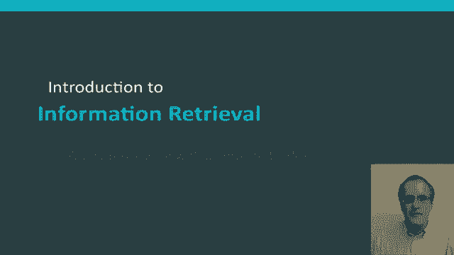
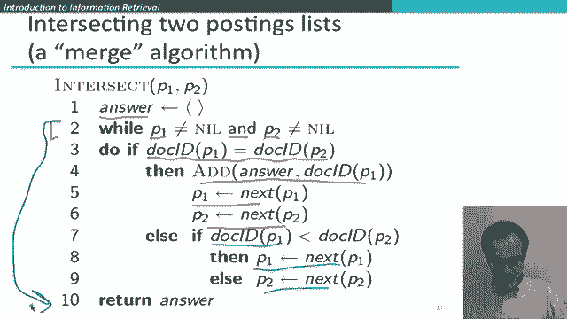
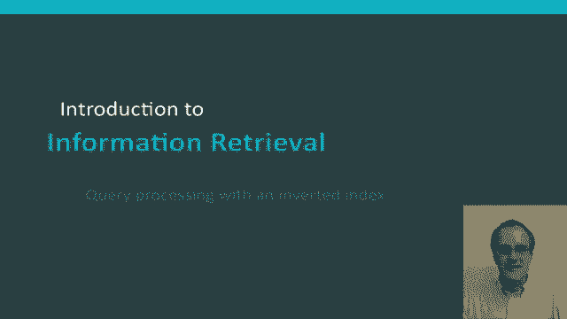

# 【双语字幕+资料下载】斯坦福CS124 ｜ 从语言到信息(2021最新·全14讲) - P36：L6.4- 基于倒排索引的请求预处理 - ShowMeAI - BV1YA411w7ym

In this segment， we're going to keep on looking at the inverted index and see how it's an efficient data structure for doing query operations in an IR system and in particular we'll step through in detail how you can perform a common kind of query and an query for two terms。

😊。

So starting off now， we'll look at the details of query processing。

 and then we'll have a later segment where we'll talk even in more detail about the kind of queries we can process。

😊，So suppose we want to process a query。So suppose our query is Brutus and Caesar。Well。

Let me even do a simpler example than that。 Suppose the very first kind of query one we want to look at is just a query for Brutus。

 Well， how to do that is totally straightforward。 What we do is locate Brutus in the。Dictionary。

 and then we return its postings list that we look up and say， okay。

 this is the set of documents where Brutus occurs， and we don't need to do anything else。

But now let's go to that fraction， more complicated case。 Well。

 then we're going to locate for Brutus and Caesar。 We're going to locate both the words in the dictionary。

 look up their postings lists。 And what we'd like to do is then work out what are the documents that contain both Brutus and Caesar。

 and doing the putting them together is standardly referred to as merging the two postings lists。

 Now， that term can actually be misleading， because what we're doing for an an query is we're actually intersecting the two sets of documents to find the documents that in which both words occur。

 whereas merging suggests doing some kind of putting them together in a union operation。

 But the term merge is used actually in both cases。

 So the merge algorithm family refers to a family of algorithms where you can step through a pair of sorted lists and do various boolean operations on it。

's。😊，In concrete detail， how that happens。Okay， so the way we do merge operation to do Brutus and Caesar is like this。

We start with a pointer which points at the head of both lists。

And what we're going to be wanting to do。Is then work out。What's in their intersection。

 So the way we do that is we ask， are these two pointers pointing at the same an equal doc I D。

 And the answer is no。 And so what we do is then advance the。Pointer that has the smaller dock Id。

 So now our two pointers like this。 And we say， does。This。

Are the two pointers pointing at the same document I D。 And here， the answer is yes。

 So we put that into a result list。 And then if we've done that， we can then advance both pointers。

We now say， are these pointers both pointing at the same doc I， No。

 is the first list greater first the thing pointed to by the first list pointer greater than the thing pointed to by the second list pointer。

 No， So we advance the bottom pointer one。Then we say is the doc ID pointed out by the two pointers equal。

 no， and so again， we advance the smaller one。Equal， no， advance a smaller one。 At this point。

 they're again， both pointing at the same dock I D。 So we add that to our results set。

 and we advance both pointers。Are they the same， no， what we do is advance the smaller one。

Are they the same， No， we advance the smaller one。Same， no， advance， the smaller one。Same， no。

 advance a smaller one。Same no。 And at this point， when we try and advance the smaller one。

 one of our lists is exhausted。 And so then there can be no other items in the intersection。

 And so we can stop。 And so this is our return documents set。

 documentsments 2 and 8 contained both Brutus and Caesar。

So I hope we went through that carefully enough that you can see that if the list lengths are x and y。

 then this merge algorithm takes Biggo x plus y time that it's linear in the sum of the lengths of the two postings lists。

😊，And you should also have seen what's crucial to make this operation linear。

 And what's crucial to making it linear is the fact that these postings lists were sorted in order of document I D。

 precisely because of that， we could do a linear scan through the two postings list。

 Where if that hadn't been the case， then it would have turned into an n squared algorithm。Okay。

 here's the postings list intersection algorithm one more times the real algorithm。

 but hopefully you can see it's doing exactly the same as what I was by hand so we start here with the answer set0 and then we're going to be doing this while loop while。

😊，The postings lists are both not equal to nil because as soon as one's nil， we can stop。

 So it's the end operation。 Okay， so then at each step。

 what we do is ask whether the two the document idea of the two pointers is the same If so。

 we add it to our answer。 If not， and sorry， and if。They are the same。 We can advance both pointers。

 and if not， we work out which doc ID。Is smaller and then we advanced that pointer so either this one or this one and that was exactly what I was doing and then where soon as one of the document lists runs out。

 we can return our answer set。

Okay， I hope that made sense and you now feel like you could write your own code to do the intersection of posting lists using the mergeG algorithm。

😊。

Okay。