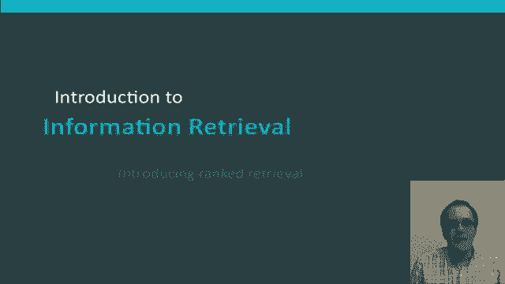
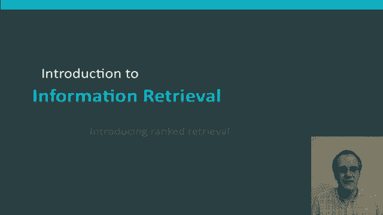

# 【双语字幕+资料下载】斯坦福CS124 ｜ 从语言到信息(2021最新·全14讲) - P39：L7.1- 检索排序介绍 - ShowMeAI - BV1YA411w7ym

Hello in this segment I'm going to start talking about ranked retrieval so so far all of our queries have been bullan we give a query like Ocean and liner and the search engine is going to return precisely the documents that contain the words ocean and liner and no others documents either match or they don't。

😊，Now this can be good for expert users with a precise understanding of their needs in the collection and it can also be good when information retrieval is a system is a component in a larger application and the system can consume thousands of results and adjust the query as needed。

 but such a system turns out not to actually be good for the vast majority of users most users are incapable of writing good bulloleing queries or even if they can write them they think it's far too much work to write them and in particular bullolean systems often produce thousands of results and users don't want to wade through thousands of results this is particularly true of web search applications。

In general， there's this problem with Boolean search the feast or famine problem。

 Boolean queries often result in either too few returned results one or two or even zero because documents don't precisely satisfy their search request or else they result in too many results in the order of thousands of more。

So for example here's a system giving results if I give it the query standard user Dlink 650。

 it returns 200，000 results so I try and make my query more specific and ask standard user Dlink 650 no card found。

 but then I get zero results。It takes a lot of skill to come up with a query that produces a manageable number of hits。

😊，The basic problem is if you're putting an and between words。

 you get too few results and if you put or between words， you get too many results。

So part of the solution of that has been the development of ranked retrieval models and the idea of these is that rather than a set of documents satisfying a query in ranked retrieval models the system returns and ordering over the top documents in the collection with respect to the query。

😊，The way along with that has been the adoption of free text queries rather than an explicit query language like the Boolean retrieval model with its ans。

 os and knots。😊，Instead， the user's query is now just some words in a human language。In principle。

 these are two separate choices which could be manipulated separately。

 but in practice ranked retrieval models have normally been associated with free check queries and the opposite for the Boolean Retrieval model。

The fe or famine problem doesn't exist in rank retrieval when a system produces a large result set。

 users don't really notice indeed the size of the results set basically isn't an issue because normally the system will start off by just showing the use of the top few results and so not overwhelm the user and so the total number of results is something they probably might even know or notice。

 this all depends on having a ranking algorithm that works well though so that the top results are good results。

So the basis of ranked retrieval is having a good system of scoring。

 we need to be able to return the documents that are most likely useful to the searcher and so that raises the question of how can we rank order the documents with respect to a query？

😊，And the method we'll look at to do that is the idea that what we should do is assign a score。

 say a number between 0 and 1 to each document。 This score measures how well the document and the query match each other。

So we need a way of assigning a score to a query document pair。 Let's start with a one term query。

Well， if the query term doesn't occur in the document， the score for the document should be0。

 And then beyond that， probably what we want to say is that the more frequently the query term appears in the document。

 the higher the score should be。 And after that， how exactly do we score documents isn't quite so clear。

 And so an upcoming segments will look at a number of alternatives for this。

Okay， but I hope that's given you an idea of what ranked retrieval models are and how they differ from the Boolean retrieval model。

😊。

