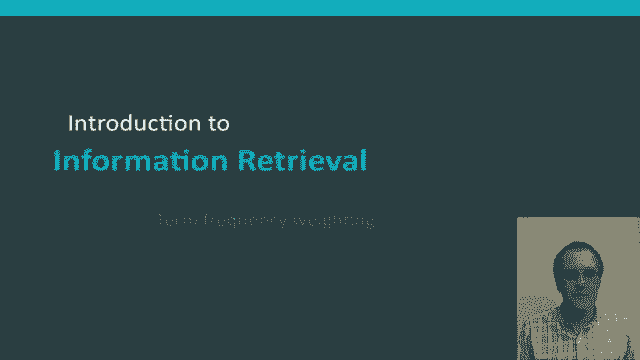
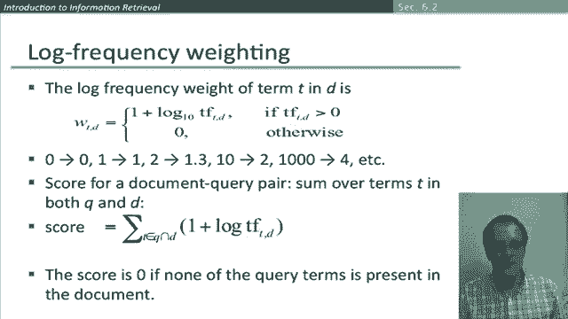

# 【双语字幕+资料下载】斯坦福CS124 ｜ 从语言到信息(2021最新·全14讲) - P41：L7.3- 词频权重 - ShowMeAI - BV1YA411w7ym

The next thing I'd like to introduce is term frequency weighting。

 which is one of the components of the kind of document scores that are regularly used in information retrieval systems。

Let's go back to where we began with the term document incidence matrix So with this matrix we recorded a number which was either one or0 in each cell of the matrix。

 depending on whether the word occurred in the document if we then think about what the representation of each document is Well what we have is a vector。

 it's a binary vector， which the dimensionality of the vector is the size of the vocabulary。

And it recording these ones or zeroes。 But we don't have to limit ourselves to a binary vector like this。

 An obvious alternative is instead to move to account vector。 So now we still have a vector。

For each document， but rather than simply putting ones and zeros in it。

 we're putting in the number of times the word occurs in the document。

So he's still got a vector of size， the vocabulary， where is now a vector in。

The natural number of vector space。Previously in the Boolean retrieval model。

 we were just looking at a set of words that occurred in the document and doing set operations like and or or。

 Now， with this count model， we've moved to the commonly used bag of words model。

 So in the bag of words model we're not considering the ordering of the words in the document。

 but we are considering how many times a word occurs in the document and this word bag is commonly used for an extension to sets which else record how often a word is used。

😊，So the BWs model has some huge limitations， so John is quicker than Mary and Mary is quicker than John have exactly the same vectors。

 there's no differentiation between them。😊，And that obviously has its limitations。 So in a sense。

 this is a step back Earl on， when we introduced positional indices。

 they were able to distinguish these two documents by either proximity or freeze queries。😊。

And we'll want to get back to that， we'll look later at recovering positional information。

 but for now we're going to develop the bag of words model and how it's used in vector space retrieval models。

😊，So we have this quantity of the term frequency of a term in a document。

 which is just the number of times that it occurs and so the question then is how can we use that in a retrieval score？

Thinking about it a little， I hope you can be convinced that raw term frequency is perhaps not what we really want。

 so the idea underlying making use of term frequency is if I'm searching for something like squirrels。

 then I should prefer a document that has the word squirrel in it three times over one that just has the wordirrel in at once。

😊，But on the other hand， if I find a document that has the words squirrel in it 30 times。

 it's not clear that I should prefer it 30 times as much as the document that only mentions squirrel once。

 And so the suggestion is that relevance goes up with number of mentions， but not linearly。

 And so we want to come up with some way of scaling term frequencies that is。😊。

Relative to its frequency， but less than linear。Before I go on to outline such a measure let me just highlight one last point we talk here about term frequency now the word frequency actually has two usages。

 one is the rate at which something occurs， the frequency of burglaries and the other sense of it is the one that's always used in information retrieval so when we talk about frequency in information retrieval frequency just means the count。

 so the count of a word in a document。Okay， so this now is what is standardly done with the term frequency。

 What we do is we take the log of the term frequency。 Now， if the term frequency is 0。

The word doesn't occur in the document。 Well the log of0 is negative infinity。

 So that's slightly problematic。 So the standard fix for that is we have this two case construction where we add one to the term frequency if the term does occur in the document。

 So if it occurs once， then this value will become one because the log will be 0 and then we'll add one to it。

 and we return an answer of0 of the word doesn't occur。 So that means that。If。

Going on a little and if we use base 10 logarithms as here you can see how we're getting this less than linear growth so if a word occurs twice in a document it gets a weight of 1。

3 a little more， if it occurs 10 times it gets a weight of two。

 a thousand times a weight of four and so on。😊，So in order to score a document query pair。

 we're just going to sum over these terms for each word in the query and the document。

 so it's sufficient to take the intersection of words that are in both the query in the document because everything else will contribute nothing to the score and then for each of those terms we're going to calculate this quantity and sum them up。

😊，And so note in particular that the score is indeed still zero of none of the query terms as present in the document。

😊。

Okay， so that's the idea of term frequency weighting and how it can be used to give a score for documents for a particular query which can be used to rank the documents returned。

😊。

