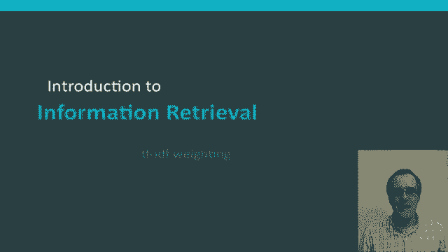
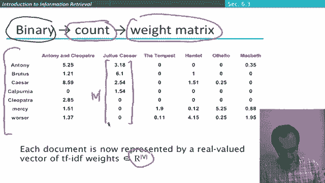
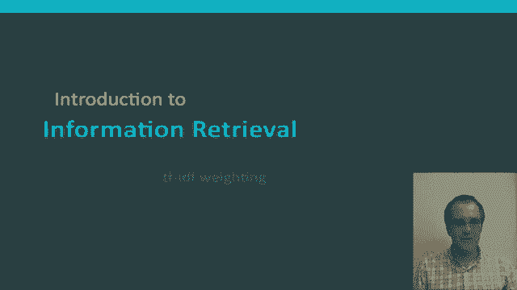

# P43：L7.5- TF-IDF权重 - ShowMeAI - BV1YA411w7ym

We've now introduced two weights for terms and documents to use in our information retrieval。

Ranking process， term frequency and inverse document frequency in this segment we're going to put them together to give the TF IDF weight of terms。

The TFIF weight of a term in a document。Right here is simply the product of its TF weight scaled with a log term。

 as we discussed before， times its inverse document frequency weight。

This is the best known waiting scheme for terms and information retrieval。

 There's been a lot of research， and there are many others。 But if you only know one。

 it's the one to know。 Note in particular， one fine point。 So this little。

Dash or hyphen here in this TF IDF weighting that's a hyphen It's not a minus sign that we're taking a product。

 so sometimes people indicate that more explicitly by using a dot or using a multiplication sign So what are the features of TF IDF weighting TF IDF weighting increases with the number of times the term occurs in the document so that the TFIf weight for a query term depends on the document it's not independent of the document and then the TF IDF weight for a term also goes up with the rarity of the term in the collection that's from the IDF weighting here。

😊，So using this to the ranking of documents for a query。

 what we're doing to work out the score of the query in the document is we're taking the terms that appear in both the query and the document。

 the rest of them have no waitinging and then we're working out this TF IDF weight for each of those terms and then we're summing them to give the score of the document with respect to the query。

😊，So what have we done here， what we've done is we've gradually moved from first binary vectors in the original model of doing balling information retrieval to count vectors which we used when we just had an unscaled term frequency to now we have weight vectors for a document and hence a weight matrix between terms and documents and that's now what we see here。

😊，So each document is now being represented by a real valued vector。

 so for example the document Julius Caesar is being represented by this vector。

 so that for each document it's in the vector space of real valued numbers where the dimensionality is the number of different terms in our collection again。

Okay， and then when we have a bunch of these vectors reached document in our collection。

 we have a a term document matrix which is now a real valued matrix。

We'll say a little bit more later about what some of the properties of this is。

 but hopefully seeing this kind of term document matrix of real numbers there's enough to see how we can do。

😊，A ranking of documents according to some query， according to these TF。

IDF scores that we've assigned for each term and each document。So that's a TF IDDF weighting。

 one of the most central concepts in information retrieval systems。

