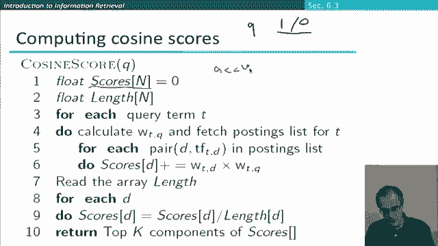
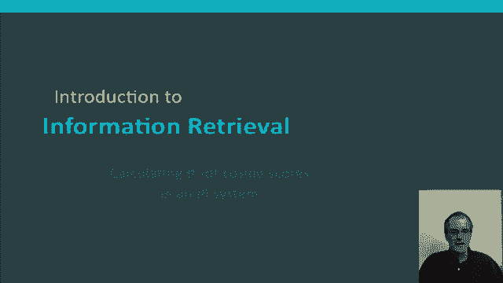

# P45：L7.7- 信息检索中计算TF-IDF的余弦得分 - ShowMeAI - BV1YA411w7ym

Okay， let me tell you a little bit more about how TF IDF scores and the cosine similarity measure get used together in a ranked IR retrieval system。

 I'm not going to get a lot into the details of making these systems practical and efficient。

 but least give you a little bit more of a sense。😊。

So the first thing that you might have already started to notice is that TFIDF weighting isn't really one thing。

 there's really a family of measures， let's just look at that in a little bit more detail。😊。

So first of all you have the term frequency and what you do with the term frequency and you could just have the natural term frequency but we suggested that that is usually muted by something like log weighting and that's indeed the most common thing to do but it's not the only method that's been used there have been a bunch of other methods that have being suggested for normalizing term frequency。

 then if we move on to the document frequency， we could not use document frequency weighting at all we could use this kind of log inverse document frequency weighting which is again extremely common but again there are other things that people have tried out doing so if we put these two things together we have TFIDF weighting giving us a vector。

 but well we may well want to normalize those vectors in some way to have better similarity computations and so we discussed using the cosine length normalization and it turns out that it has some advantages。

😊，Some disadvantages， so again， there are other things people have tried。

 including both of these and other ones have come up more recently。

 so things like pivoted length normalization。So in general we have a kind of a broad menu of choices and so at the beginning here of each column I've given some letter names to these choices。

 these were choices， these were choices that were developed in the context of the smart information retrieval system which is a very famous pioneering information retrieval system that was developed at Cornell by Jerry Sultan who was really the father of a lot of Mon information retrieval and so these choices could be given names by giving letters from these so if you are using the system that we've mainly been talking about they'll be coming out as LTC for logarithm。

 logarithmic IDF and cosine weighting。😊，this kind of waitinging， it then turns out。

 can be used both for queries and documents differently and so let's go through a little bit how that all comes out。

😊，We can have different weightings for queries versus documents and if we follow this smart notation。

 the standard way that they represented things is by these six letters with the dot in the middle where there's the document weighting scheme followed by the query weighting scheme and there are various variants。

 but one that was quite standard，😊，Coming out of the smart work in the 1990s was this one so we'll just mention this one in a little bit more detail。

 if we do the query part of it first， what we find out is that so there's log query normalization now this is actually only makes a difference if you have long queries which might mention words multiple times if really you have short queries and no word is mentioned more than once that you're just going to be getting a weight of one for words that appear and zero for words that don't appear there's then IDF weighting of the query terms and cosine normalization。

The treatment for the documents is the same except there's actually no IDF normalization of the documents and that's something that you might want to think about for a moment is that a bad idea theres some reasons to want to do that one of them is well you've already put in an IDF factor for the same words in the query because remember that you're only going to get non-zero scores for words that occur in both the query and the document and that there are some advantages in terms of efficiency of compressing indices if you're not putting IDF in there。

😊，Let's take this waiting scheme and again go through a concrete example。

 so we're just going to be working out the。😊，Score for precisely one document against one query using this waiting scheme。

 but we'll do it in great depth Okay so our document is car insurance auto insurance it's a bit of a fake document but we've wanted something short and then the query is best car insurance。

😊，So if we go to the query first， ScarR insurance， these are its raw weights。😊。

And so then we're going to scale those with logarithmic scaling but since each word only code once it stays one。

 we then get the document frequency of each of those words。

 which we map onto to an inverse document frequencies。😊。

The rarer words like insurance are getting the highest weighting there。🤢。

We then multiply this column by this column which ends up looking just like the document frequency score except the word that didn't occur。

 and then we turn that into a unit vector with cosine normalization and so this is our final representation of the query vector。

😊，We then move to the document。😡，So the document has some term frequencies that aren't just 01 so we reduce those with term frequency weightings that they look like that in this case there is no IDF component on the document so the weights go to being exactly the same just coming from term frequency and then we again do cosine normalization which gives us this is our final document vector okay so then to work out the score for this document for this query we then working out the cosine similarity which is simply the dot product of these two length normalized vectors and so that's then this vector here where only the bottom two components are nonzero so we add those up and the overall score is 0。

8。So the document is a good match for the query though I mean。

 do remember when you're looking at cosine similarities that because of the fact that the cosine kind of is sort of flat up the top here。

😊，You know flat descending， it means that you tend to get for fairly similar documents。

 that cosine scores are sort of biased， fairly high。

 so it's more important to remember the ordering than the precise values。Okay。

But that shows you how we evaluated that document and then we'd evaluate a bunch of other documents and then we'd want to rank according to their cosside similarity scores。

😊，A little exercise that you might like to do based on this example is well。

 if you know what the IDF scores are here and the document frequencies。

 you should actually be able to work out what is the number of documents as being used as the basis of this example。

Okay now let's go through how we can work out cosine scores in a vector space retrieval system for a document collection This is the rough kind algorithm that we're going to want to use so what we're going to assume here is that the query is a typical short web light query so we're only going to be thinking of the words is either occurring or not occurring in the query and also we're going to skip one other step then we're not actually going to do any length normalization of the query and part of the reason that is when you have a situation like this length normalization of the query is actually unnecessary because the query vector has some length and for whatever it is the effect length normalization would just be a rescaling that applies to all query document calculations and wouldn't change the final result。

😊，Okay so given that background what do we do so we start off by having a scores array for all documents which we set to zero and so we're going to accumulate in here the score of a document for different query terms and so these scores are often also referred to as accumulators。

😊。

Okay， and then we're also going to have another array for the lengths of the different documents and so then what we do is go through each term in the query and we say well。

😊，The query term is actually just going to be one。And then we fetch the postings list for that query so then for each document in the postings list。

 the term has a frequency in that document and we may then want to scale that by doing something like log weighting or something like that and to give us our document weight for the term and then we're doing the components of the dot product here and summing them into the scores array。

 so in essence we're kind of the outer iteration here is for each query term and we're working out the components of the cosine score for each query term and accumulating it in this scores array。

🤢，But we haven't actually done any length normalization of the documents either yet。

 So then the next step is to。Work out the length of each document and then divide these scores by the length of the document。

 so this then does the length normalization for different document sizes So given the assumptions I mentioned at the beginning that the query vector is 10 and we don't need to length normalize it。

 we have something that is now ordered the same as a length normalized cosine similarity score for all the documents and so then for our ranking what we just wanted to return is the sum number K of documents。

 their IDs or a representation of them that has the highest value for scores。

Now if you think about that a little， this isn't quite yet a practical algorithm so that if our document collection is huge。

 we wouldn't actually want to build an array which has a cell for every document see that we might have you know 20 billion documents or something like that and so systems use methods to work out which are likely documents and only have accumulators for those documents and similarly at the end it's not a good way to find the most relevant documents by simply doing a linear scan of this scores array and so there are more efficient data structures to do that but I hope that that's given you a general idea of how we can build cosine similarity scoring into a ranked retrieval engine。

😊，So to sum， the essence of what we've covered for vector space retrieval is the following steps that the query is represented as a TFIDF vector。

😊，Document is also weighted as a TFIF。The documents also represent as TFIDF vector。

 and then to score a pair of a query in a document， we're working out cosine similarity scores。

 which we straightforwardly use to rank the documents with。😊。

And then what we'll do in the first instance is return some top K， for example。

 the top 10 documents according to this score to the user is their initial results。

 and if they ask for more， we can then show them more。Okay。

 so that's the general idea of how we can start to build a TFIDF ranked retrieval system。

