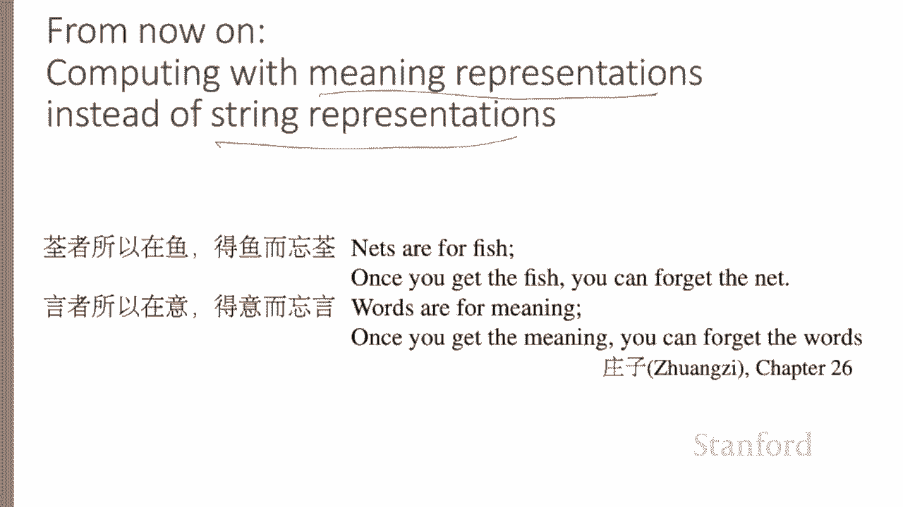
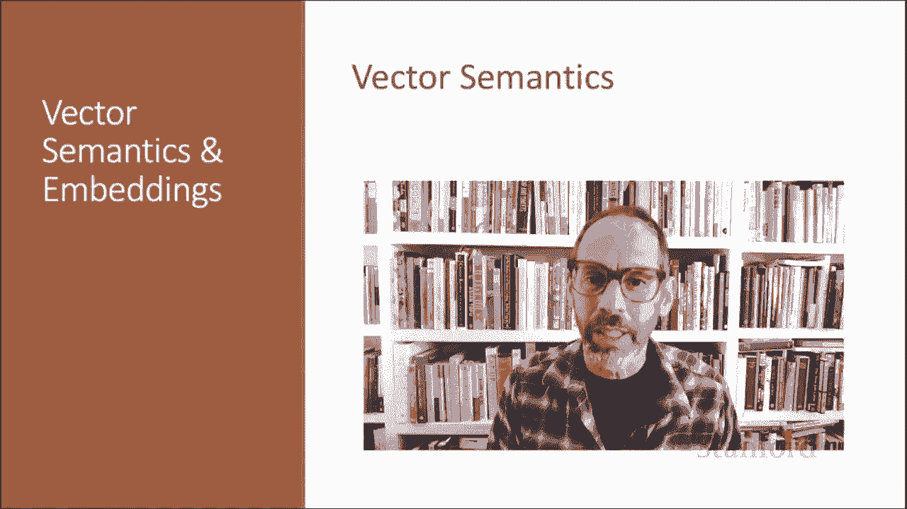

# 【双语字幕+资料下载】斯坦福CS124 ｜ 从语言到信息(2021最新·全14讲) - P48：L8.2- 语义向量 - ShowMeAI - BV1YA411w7ym

Here we introduce vector semantics， the standard way to represent meaning and language processing。

Vectctor semantics is the standard way to represent word meaning in NLP。

 helping us model many of the aspects of word meaning we saw in the previous section。

 The roots of the model lie in the 1950s when two big ideas converged。

The first draws on the philosopher Witgenstein's idea that the meaning of a word should be tied to how it is used。

Linguist like Harris and Fth had the related idea of defining the meaning of a word by its distribution in language use。

 meaning its neighboring words or its neighboring grammatical environments。

 Here's a quote from Zic Harris。 If A and B have almost identical environments。

 meaning surrounding words or grammatical structures， we say that they are synonyms。

Let's consider an example。 Sose you don't know the meaning of the word Eg Choi。

 a recent borrowing from Cantonese into English。But you see it in the following context。

 Onng Choi is delicious， sauteed with garlic。 It is superb over rice。

 Onng Choi leaves have salty sauces。😊，And you've also seen these very similar words。

 garlic and rice and leaves with words like spinach。 There's garlic or charrard。

 There's leaves or collared。We might conclude that engchoi is a leafy green。

 like spinach ch or collared。 And we could conclude this based on the fact that words like leaves or garlic or rice or delicious occur both for Onchoi and for words we already know like spinach and chard。

😊，Indeed， Eg Choi is Ipomaa aquaica water spinach here's a picture for you food fans。

So this first idea from the 50s is that we'll define the meaning of a word by its distribution in language use。

 meaning its neighboring words or grammatical environments。

And the second idea is Osgod's 1957 idea we mentioned in the prior lecture in which the connotation of a word is represented by three numbers。

 its valence， arousal and dominance。So remember， a word like love might have a high valence or a word like mellow might have a low arousal。

 but every word has some score on all three dimensions。

But if every word has a score in all three dimensions。

 that means we're essentially representing a word's connotation。

By a point in three dimensional space。 And if we can represent connotation as a point in space。

 perhaps we can represent more about meaning as a point in space。

So we're going to combine these two ideas， defining meaning bi linguistic distribution。

And representing meaning as a point in multidimensional space。In vector semantics。

 we define meaning as a point in space based on distribution。 So each word is a vector。

 rather than a string of letters like G， O， O D or an index like W sub 45。

 and similar words are near by in semantic space and crucially， as we'll see。

 we build the space automatically， by seeing which words are near by in text。

Here is a visualization of embeddings learned for a sentiment analysis project。

Showing the locations of selected words projected down from high dimensional space。 In this case。

 space of 60 dimensions， not just three down into a two dimensional space so we can look at it。

And notice the distinct regions containing positive words， negative words。

 and neutral function words。In summary， we define the meaning of a word as a vector。

 and these vectors are commonly called embeddings for historical reasons。

 involving them being embedded into a space。 And you can see the textbook for further details about embeddings。

 And these embeddings are the standard way to represent meaning an NLP。

 Every modern NLP algorithm uses some kind of embeddings to represent word meaning。

And these embeddings allow us to have a fine grain model of meaning that's especially good for questions involving similarity。

Why is it helpful to move from strings of letters or indices to vectors to represent word meaning？

Consider the task of sentiment analysis。So let's suppose we're doing sentiment classification using words。

 so we have a feature that's the identity of a word。

 so we might have a feature like the previous word was T ERR IBLE。

So that feature fires if we see the exact same word in the training set and the test set。

 and otherwise doesn't fire。With embeddings， by contrast， the feature is a vector。

 So we might represent the feature as the previous word was vector 35，22，17 and so on。

 So now in the test set， we might see a word like horrible， not the same word is terrible。

 but perhaps it as a similar vector， and our classifiers can generalize to similar but unseen words。

In the next lectures， we'll discuss two broad families of embeddings。

Will'll introduce T F I DF embeddings。 T F I DF， the workhorse for information retrieval。

 but also a common baseline model for embeddings。 TF I DF vectors are sparse。

 meaning theyre very long vectors， most of whose values are 0。

And the values in a TF IDF vector are some simple function of just counts of nearby words。

We'll also introduce Word to Vec。The simplest kind of dense vector model in dense vector models。

 most of the values are non0， and these vectors will be much shorter vectors than T F I D vectors。

 Word to V representations are created by training a classifier to predict whether a word is likely to appear nearby or not。

Later on， we'll discuss even richer kinds of embeddings called contextual embeddings。So from now on。

 as we're representing words for semantic or meaning related tasks。

 we're going to try to compute using meaning representations instead of string representations。

And I'll leave you with this inspiring quote from the Chinese philosopher Zhuangza。 Nes are for fish。

 Once you get the fish， you can forget the net。 Word are for meaning。 Once you get the meaning。

 you can forget the words。😊。

We've now seen the intuition for vectorctor semantics， and we'll see the details in further lectures。

