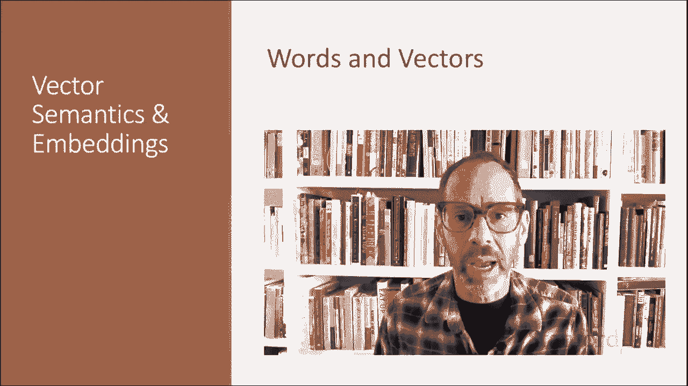
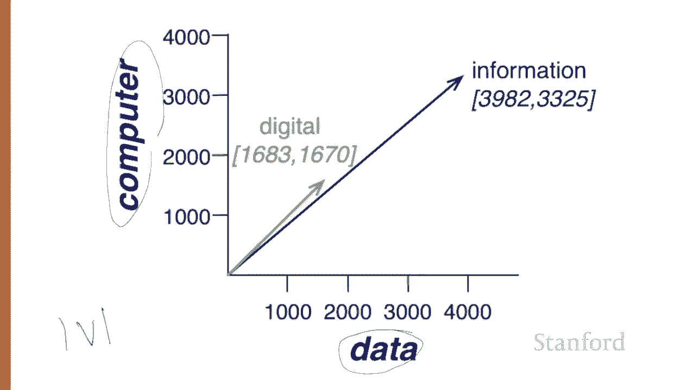
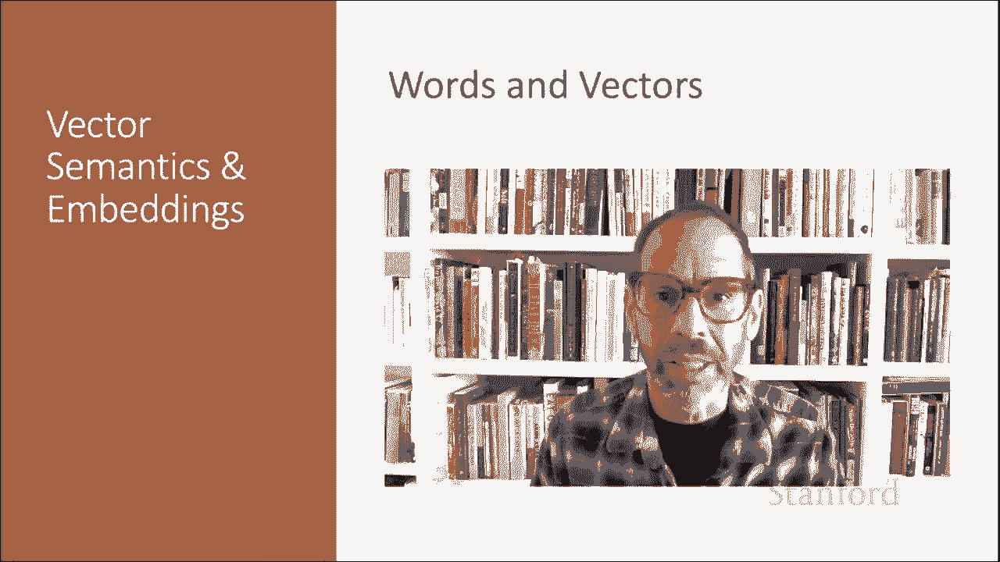

# P49：L8.3- 词与向量 - ShowMeAI - BV1YA411w7ym

Let's talk about how to represent words as simple vectors of context counts。

 Imagine we have a collection of documents such as all the works of Shakespeare。

We can represent documents in such a collection by a term document matrix in which each row represents a word in the vocabulary。

 and each column represents a document in the collection。

 So here's a small selection from a term document matrix showing the occurrence of four words in four plays by Shakespeare。

 Each cell in this matrix represents the number of times a particular word defined by the row occurs in a particular document defined by the column。

 Thus， fool appears 58 times in 12 night。 And we can think of each column as a vector represents a document as a point in be dimensional space。

 Thus， the document here are points in four space。Here's a spatial visualization of the document vectors from those four Shakespeare play documents Here。

 I'm showing just two of the dimensions corresponding to the words battle and fool。

 And notice that the comedies have high values for the full dimension。

And low values for the battle dimension。Two documents that are similar will tend to have similar words。

 And if two documents have similar words， their column vectors will tend to be similar。

So the vectors for the comedies， as you like it in 12th night， look a lot more like each other。

 more fools and wit and less battles than they look like Julius Caesar or Henry the V。

A real term document matrix， of course， wouldn't just have four rows in columns let alone too。

 more generally， the term document matrix has V rows。

 one for each word type in the vocabulary and D columns， one for each document in the collection。Now。

 here's a new idea。 vector semantics can also be used to represent the meaning of words。

 not just documents。 And we do this by associating each word with a word vector， now a row vector。

 rather than a column vector。 So the four dimensions of the vector for fool， for example，36，58，1。

4 correspond to the four Shakespeare plays。For documents。

 we saw that similar documents had similar vectors because similar documents have similar words。

 and the same principle applies to words。Similar words have similar vectors because they tend to occur in similar documents。

 The term document matrix thus lets us represent the meaning of a word by the document it tends to occur in。

An alternative to using the term document matrix to represent words as vectors of document counts is to use the term term matrix。

 also called the word word matrix or the term context matrix。

 in which the columns are labeled by words rather than documents。 So the matrix is now a V by V。

 and each cell records the number of times the target word in the row。

 and the context word in the column cooc in some context。The context could be the document。

 in which case the cell， let's say digital and computer。

 represents the number of times the two words appear in the same document。It's more common， however。

 to use smaller contexts， generally a window around the word， for example。

 four words to the left and four words to the right。 And in that case。

 the cell represents the number of times in some training corpus。

The column word occurs in such a plus or minus forward window around the row word。

 Here is one example， each of four words in their windows。 and then from examples like this。

 we compute this table showing how often each of these row words。

 how often they occur in a plus or minus forward window around each of these context words。

So for example， the 1670 here means the word digital occurred within four words on either side of the wordcomp in this corpus 1670 times。

Note that with this definition of vectors。The vector for digital and the vector for information are more similar to each other。

 high values for count and data and low values for pie and sugar。

Then either of them is say to strawberry， which is opposite appearing more in the context of pie and sugar。

Here's a spatial visualization of word vectors for digital and information。

 showing just two of the dimension corresponding to the words data and computer。 Of course。

 in real life， these vectors aren't just of length， too V。

 the length of the vector is generally the size of the vocabulary， often between 1000050000 words。

 perhaps using the most frequent words in the training corpus。

 keepinging words after about the most frequent 50000 or so is generally not helpful。

 Since most of these numbers are 0， these are sparse vectors。

 and they're efficient algorithms for storing and computing with sparse matrices。

We've seen that a word can be represented as a vector of counts。

 a fundamental idea that underlies all embedding representations。

