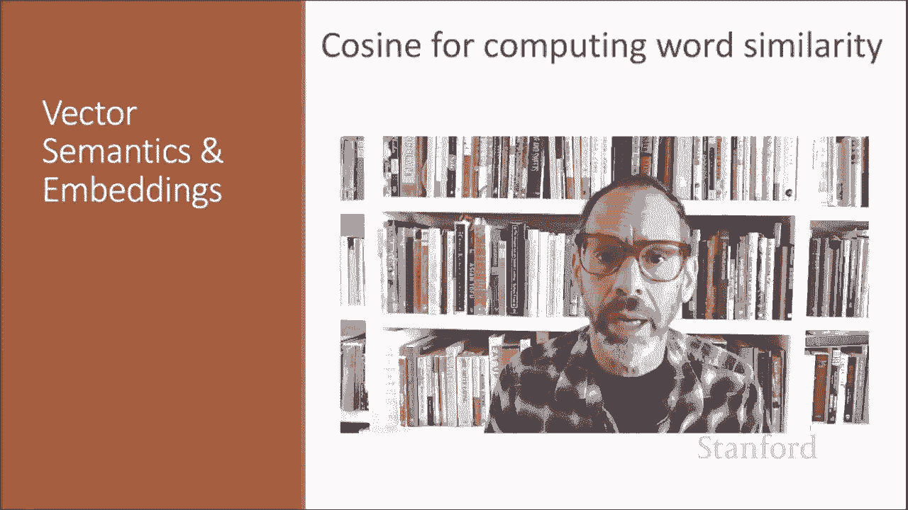
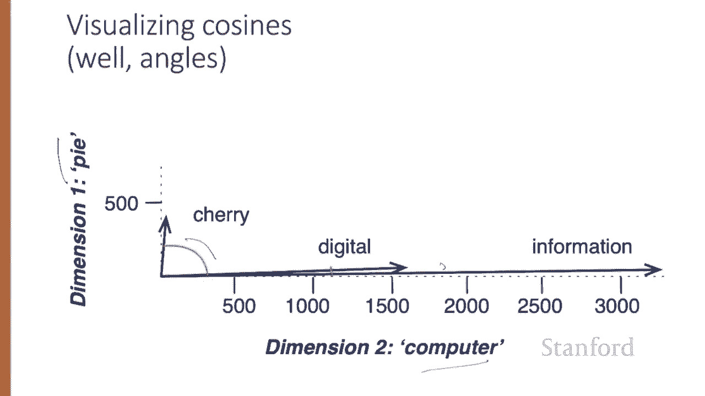
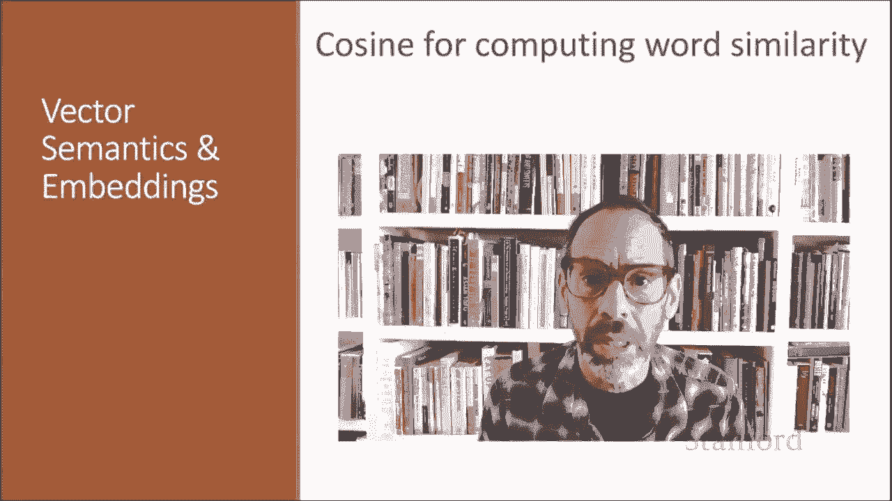

# 【双语字幕+资料下载】斯坦福CS124 ｜ 从语言到信息(2021最新·全14讲) - P50：L8.4- 基于余弦距离的相似度 - ShowMeAI - BV1YA411w7ym

To measure similarity between two words， we need a metric that compares their representations。

 By far， the most common similarity metric is the cosine of the angle between the two vectors。

 The cosine， like most measures for vector similarity used in NLP is based on the dot product operator from linear algebra。

 also called the inner product in which we multiply the vectors， element wise。

And add up to get a single scalealar value。The dot product acts as a similarity metric because it'll tend to be high just when the two vectors have large values in the same dimension。

Alternatively， vectors that have zeros in different dimensions。

 orthogonal vectors will have a dot product of 0 representing their strong dissimilarity。

The raw dot product， however， has a problem as a similarity metric。It favors long vectors。

The vector length is defined as the square root of the sum of the square of the values。

The dot product is higher if a vector is longer with higher values in each dimension。

 and more frequent words have longer vectors， since they tend to cooc with more words and have higher corence values with each of them。

The raw dot product will thus be higher for frequent words。But this is a problem。

 we'd like a similarity metric that tells us how similar two words are。

 regardless of their frequency。So we modify the dot product to normalize for the vector length by dividing the dot product by the length of each of the two vectors。

And this normalized dot product turns out to be the same as the cosine of the angle between the two vectors。

 This is based on the geometric definition of the dot product as the product of the Euclidean magnitudes of the two vectors and the cosine of the angle between them。

The cosine value ranges from one for vectors pointing in the same direction with an angle of 0 between them to -1 for vectors pointing in opposite directions。

180 degrees between them。But since raw frequency values are non negative。

The cosine for these values ranges from0 to 1。Let's see how the cosine computes which of the words cherry or digital is closer in meaning to information。

 just using raw counts from this shortened table。To compute the cosine between sherry and information。

 we take the dot product between these two vectors， so that will be 442 times 5。

Plus 8 times 3982 plus 2 times 3，3，2，5 in the numerator。And then the denominator。

 we have the length of the two vectors First， the length of cherry。

 which is the square root of the sum of 442 squared plus 8 squared plus 2 squared。

And then the length of information， the square root of five squared plus 39，82 squared plus 3，3，2。

5 squared。And we get a result 0。017。By contrast， the cosine between digital and information。

 we can compute the numbers the same way， but because both numbers are very high in the data dimension and the computer dimension。

 we get a much higher cosine value。The model decides that information is way closer to digital than it is to cherry。

 a result that seems sensible。Here's a rough graphical demonstration of cosine similarity showing vectors for the words cherry。

 digital and information in the tiny two dimensional space defined by counts of the words computer and pi nearby。

Note that the angle between digital and information is smaller than the angle between cherry and information。

 When two vectors are more similar， the cosine is larger， but the angle is smaller。

 The cosine has its maximum of one。 when the angle between the two vectors is smallest and the cosine of all other angles is less than one。

We've seen in detail the vector cosine， the most common similarity algorithm for two word vectors。

