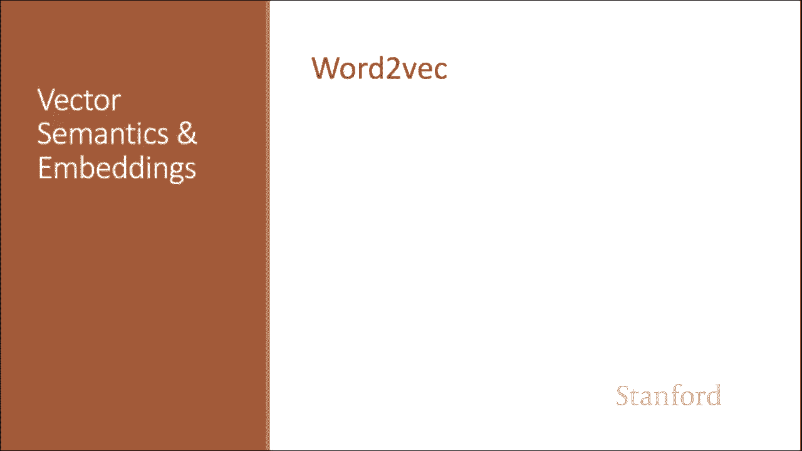
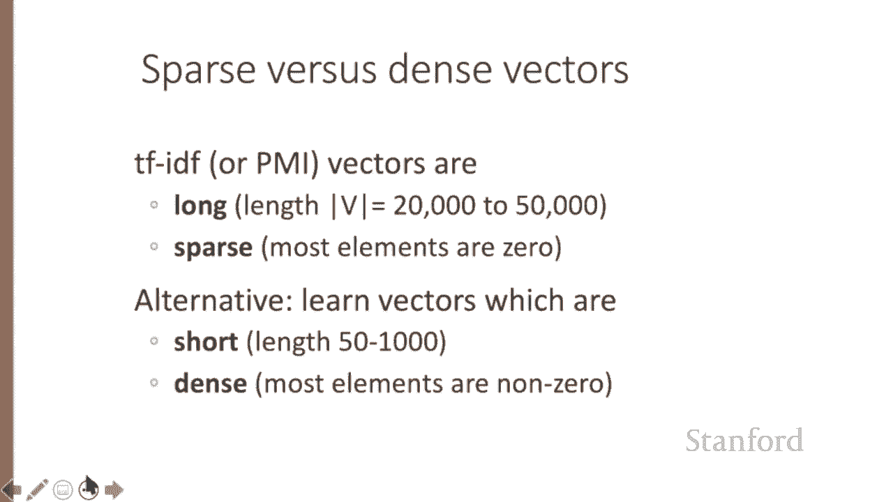
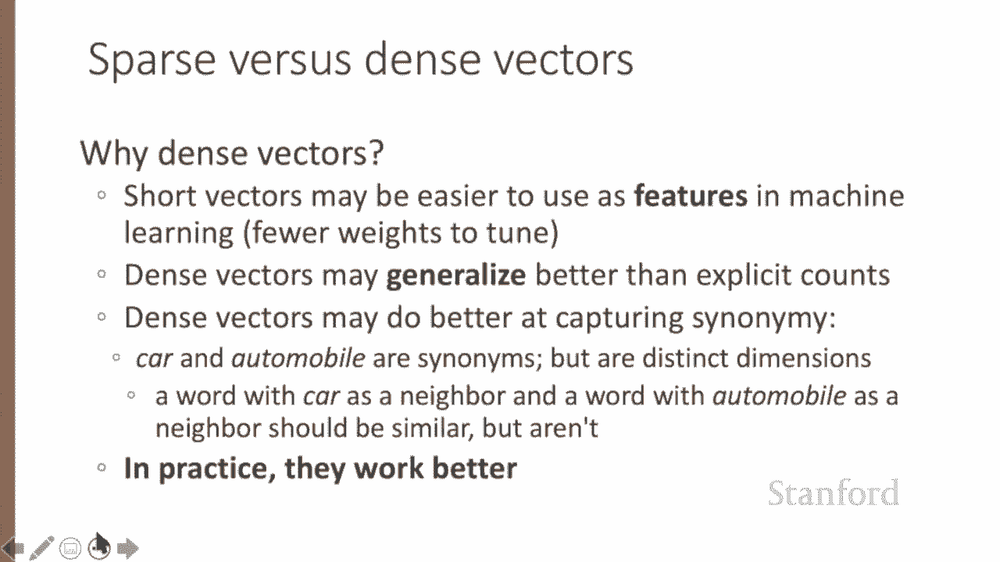
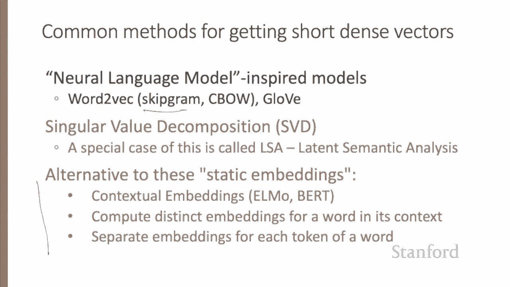
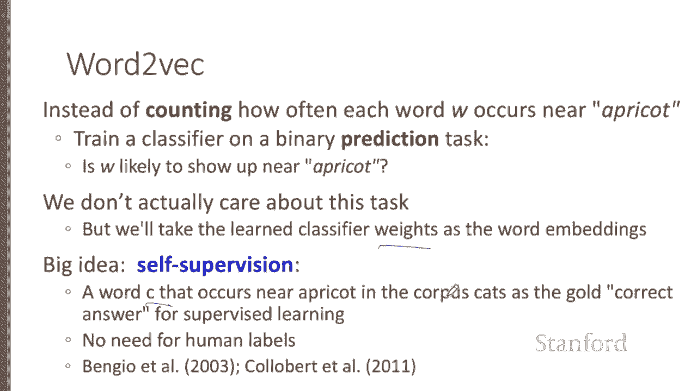
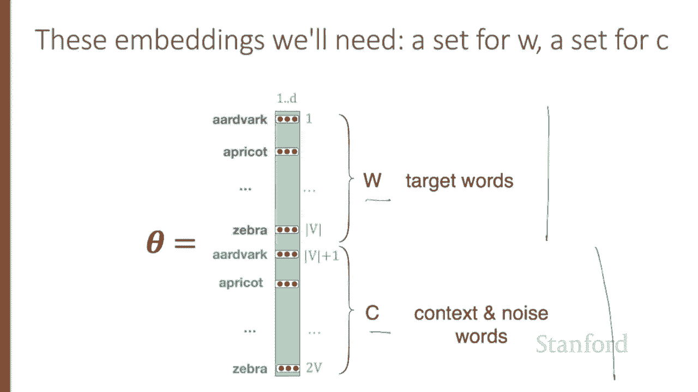
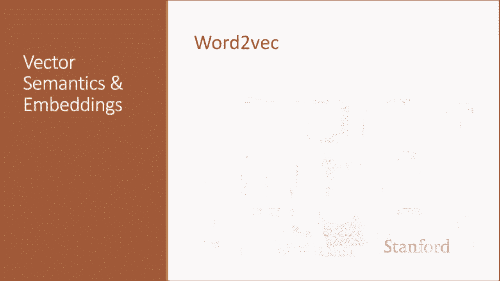
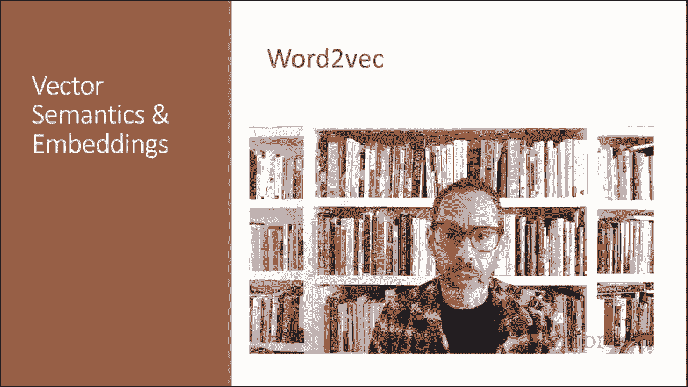

# 【双语字幕+资料下载】斯坦福CS124 ｜ 从语言到信息(2021最新·全14讲) - P52：L8.6- Word2Vec - ShowMeAI - BV1YA411w7ym

Let's now introduce the important word to Vc embedding method。In the previous lectures。

 we saw how to represent a word as a sparse， long vector with dimensions corresponding to words in the vocabulary or documents in a collection。

 We now introduce a more powerful word representation。 embeddings， short， dense vectors。

 Unlike the vectors we've seen so far。 embedding are short with the number of dimensions D ranging from 50 to 1000。

 rather than the much larger vocabulary size V， which could be 60000。

 or the number of documents that we've seen。 These D dimensions don't have a clear interpretation。

 and the vectors are dense instead of vector entries being sparse。

 mostly 0 counts or functions of counts。 The values will be real valued numbers that can be negative。

😊。

It turns out that dense vectors work better in every NL P task than sparse vectors。

 While we don't completely understand all the reasons for this， we have some intuitions。

 representinging words as 700 dimensional dense vectors requires our classifiers to learn far fewer weights than if we represented words as 50000 dimensional vectors and the smaller parameter space possibly helps with generalization and avoiding overfitting。

Dense vectors may also do a better job of capturing synonyomy。 For example。

 in a sparse vector representation， dimensions for synonyms like car and automobile are distinct and unrelated。

 Sprse vectors may thus fail to capture the similarity between a word with car as a neighbor and a word with automobile as a neighbor。

In this lecture， we introduce one method for computing embeddings， S graram with negative sampling。

 sometimes called SGNS。The Sip Gram algorithm is one of two algorithms in a software package called word to Vec。

 And so sometimes the algorithm is loosely referred to as word to Vec。

 The word to Vc methods are fast， efficient to train and easily available online。

Word tove embeddings are static embeddings， meaning that the method learns one fixed embedding for each word in the vocabulary。

An alternative to these static embeddings are more recent methods for learning dynamic contextual embeddings。

 like the popular burnt representations in which the vector for each word is different in different contexts。

The intuition of word tovec is that instead of counting how often each word W occurs near another word。

 say apricot will instead train a classifier on a binary prediction task。

 Is word W likely to show up near Apricot。And we don't actually care about this prediction task。

 instead， we'll take the learned classifier weights as the word embeddings。

The revolutionary intuition here is that we can just use running text as implicitly supervised training data for such a classifier。

 A word C that occurs near the target word acts as a gold， correct answer to the question。

Is word C likely to show up near the target word。This method， often called self supervision。

 avoids the need for any sort of hand labeled supervision signal。

 The idea was first proposed in the task of neural language modelling。

 but word tove is a much simpler model than the neural network language model。

The intuition of skipipgramham is to treat the target word T and a neighboring context word C as positive examples of words that can occur near each other。

 then randomly sample other words in the lexicon to get negative examples and use logistic regression to train a classifier to distinguish these two cases and then use the learned weights as the embedding representation of the words。

Let's start by thinking about the classification task， and in the next lecture。

 we'll turn to how to train。Imagine a sentence like the following with the target word apricot and assume we're using a window of plus or minus two context words。

Our goal to train a classifier such that given a tuple Wa C of a target word paired with a candidate context word like Apricot and jam。

 or maybe Apricot and Arvark， it'll return the probability that C is a real context word。

 true for jam false forardvark。 So we'd like P of plus given Apricota jam to be high。And P of minus。

 given aprico Arvark。To be high。And in fact， the probability that word C is not a real context word for W is just one minus the probability that it is a context word。

The intuition of the SkGram model is to base this probability on embedding similarity。

A word is likely to occur near the target if it's embedding similar to the target embedding。

To compute similarity between these dense embeddings。

 we rely on the intuition that two vectors are similar if they have a high dot product。 After all。

 cosine is just a normalized dot product。In other words。

 the similarity between a word embedding and a context embedding is proportional to W。c。

Will need to normalize to turn this similarity into a probability。That's because the dot product， C。

 dot W or W dot C is not a probability。 It's just a number ranging from negative infinity to positive infinity。

 Since the elements in words to vacuummb can be negative， the dot product can be negative。

So to turn the dot product into a probability， we'll use the logistic or sigmoid function sigma that we saw in logistic regression。

 So we model the probability that word C is a real context word for target word W as sigma of C dot W or 1 over 1 plus x of minus c dot W。

Now to make this a probability， we also need the total probability of the two possible events。

 C is a context word， C isn't the context word， to sum to1。

 and so we estimate the probability that word C is not a real context word for w as1 minus p of plus or1 over1 plus x of cw without the minus。

So the equation we just saw gives us the probability for one word。

 but there are many context words in the window。 Skipgramm makes the simplifying assumption that all context words are independent。

 allowing us just to multiply their probabilities。 So for all of the L words in the context window。

 we're simply going to multiply the probabilities or in log space。

 we're going to add their log probabilities。In summary。

 Sipgramm trains a probabilistic classifier that given a target word W and its context window of L words。

 C1 through L assigns a probability based on how similar the context window is to the target word。

 and this probability is based on applying the logistic function the sigmoid function to the dot product of the embeddings of the target word with each context word。

To compute this probability， we just need embeddings for each target word and context word in the vocabulary。

Here's the intuition of those parameters we're going to need。

 and we'll learn them in the next lecture。Skip graham stores two embeddings for each word。

 one for the word as a target and one for the word considered as a context。 Thus。

 the parameters we need to learn are two matrices。W and C。

 each containing and embedding for every one of the V words in the vocabulary。

We've seen how the skip graram classifier functions in the next lecture we'll talk about learning its weights。

 which is the purpose of the classifier。

