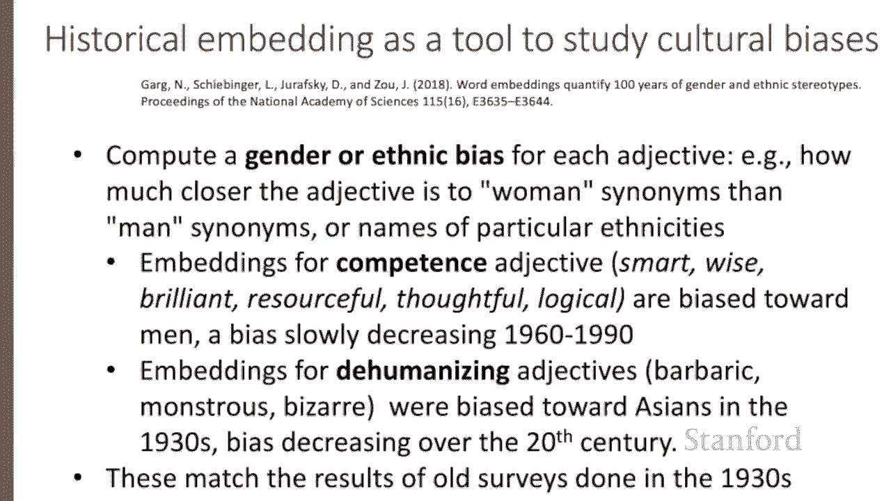

# 【双语字幕+资料下载】斯坦福CS124 ｜ 从语言到信息(2021最新·全14讲) - P54：L8.8 - 词嵌入性质 - ShowMeAI - BV1YA411w7ym

Let's talk about various properties and parameters of embeddings。

 One parameter of vector semantic models that is relevant both to sparse T F I DF vectors and dense word to vector vectors is the size of the context window we use to collect the counts or the predictions。

This is generally between one and 10 words on either side of the target word。

The choice depends on the goals of the representation。

Shorter context windows tend to lead to representations that are a bit more syntactic since the information is coming from immediately nearby words。

 When the vectors are computed from short context windows。

 the most similar words to a target word tend to be semantically similar words with the same parts of speech。

 When vectors are computed from large context windows。

 The highest cosine words to a target word tend to be words that are topically related。

 but not similar。 For example， using skip gram with a window of plus or -2。

 the most similar words to the word hogwarts from the Harry Potter series are names of other fictional schools。

 But with a window of plus or-5， the most similar words to hogwarts or other words topically related to the Harry Potter series like Dumbleddoran half blood。

Another semantic property of embeddings is their ability to capture relational meanings In an important early vector space model of cognition。

 Rumelhart and Abramson proposed the parallelogram model for solving simple analogy problems of the form A is to be as a star is to what。

 So in such problems a system is given a task like apple is to tree as grape is to what and must fill in the correct word vine。

In the parallelogram model， the vector from the word apple is subtracted from the word tree and added to grape to get fine。

 So we take this vector。Add it to grape。Find whatever word is in that point in space and return that word。

 hoping that word is vine。The parallelogram method has been shown to solve analogies with both sparks and dense embeddings。

So， for example， the vector for king minus the vector for man plus the vector for woman is close to the vector for queen。

Or the vector for Paris， minus France， plus Italy is close to Rome。And in general。

 for a problem a is to a star as B is to B star， where our goal is to find the missing B star。

 we compute the distance of all words in the embedding space to a star minus a plus B and return the word that has the maximum。

Here we can see in the space for glove embeddings， similar kinds analogy for gender and family names and names of royalty。

There are some caveats with this parallelogram method， it only seems to work for frequent words。

 very small distances and certain relations like relating countries to capitals but not for others。

 and understanding these kind of analogies is an open area of research。

Embbeddings can also be a useful tool for studying how meaning changes over time by computing multiple embedding spaces each from text written in a particular time period。

For example， these figures show a visualization of changes in meaning in three English words over the last two centuries。

 computed by building separate embedding spaces for each decade from historical corpora like Google Agramms or the corpus of historical American English。

In each case， we've shown in bold face the representation of meaning at a historical period and a more modern period and in light gray words that are near that meaning at these different periods。

 So， for example， the word broadcast in the 1850s was an agricultural word。

 meaning scattering of seeds。 and we can see its near words like seeds and scatter。

 whereas the modern meaning is most similar to words like radio or television。Alas。

 in addition to their ability to learn word meaning from text。

 embeddings also reproduce the implicit biases and stereotypes that are latent in that text。

So as we just saw， embeddings can roughly model relational similarity。

 Japan as the closest word to France minus Paris plus Tokyo。

But these same embedding analogies also exhibit gender stereotypes。For example。

 the embedding suggests the analogy father is to doctor as mother is to nurse。

 and the closest occupation to man minus computer programmer plus woman in word tovec embeddings is homemaker。

This could result in what Crawford calls an allocational harm when a system allocates resources like jobs or credit unfairly to different groups。

 for example， algorithms that use embeddings as part of a search for hiring potential programmers or doctors might thus incorrectly down weightigh documents with women's names。

Historical embeddings are also being used as a tool for measuring biases in the past。For example。

 embeddings from historical text can be used to measure the association between adjectives and names of various ethnicities or genders。

So for example， embeddings for adjectives related to competence like smart or wise or brilliant are historically biased toward men。

 but this bias is slowly decreasing since the 1960s。

Evidence from historical embeddings also replicates data from old surveys of ethnic stereotypes。

For example， embedding for Asian names are biased toward dehumanizing adjectives like barbaric or bizarre in the 1930s。

 matching the result of surveys done in the United States in the 1930s。

 but this bias decreased in both text and surveys over the 20th century。

 We've seen various properties of embeddings， including how they reflect cultural biases in the text they're trained on。

