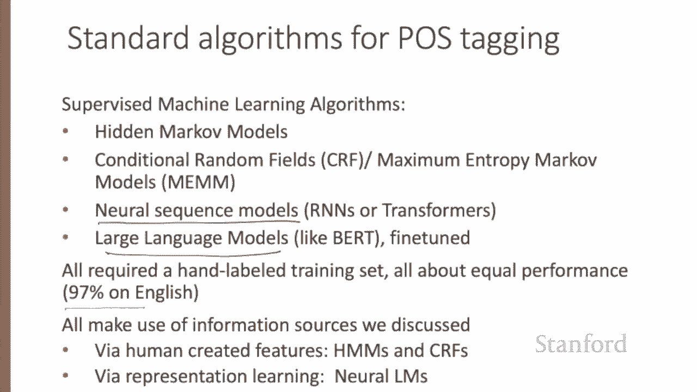
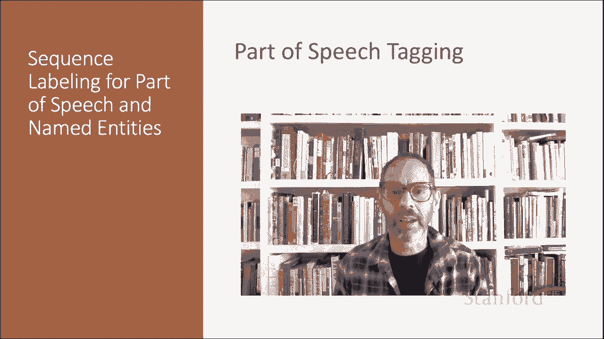

# 【双语字幕+资料下载】斯坦福CS124 ｜ 从语言到信息(2021最新·全14讲) - P55：L9.1 - 词性标注 - ShowMeAI - BV1YA411w7ym

Let's introduce the task of part of speech tagging。From the earliest linguistic traditions。

 the Sanskrit Gomerion， Yaska and Pooney in India， Aristotle and nostoics and Greece came the idea that words can be classified into grammatical categories。

 what we now call parts of speech or word classes， or sometimes just for short POS or POS tags。

And by 100 BCE， we have a set of eight parts of speech attributed to dynasus Thrs that looks very modern。

 noun， verb， pronoun， preposition adverb conjunction， participle article。

This set of eight became the basis for description of European languages for the next 2000 years。

And the durability of these parts of speech through to millennia speaks to their centrality in models of human language processing。

Let's talk about some parts of speech。 While word classes do have semantic tendencies， adjectives。

 for example， often describe properties， and nouns describe people。

Parts of speech are defined instead based on their grammatical relationship with neighboring words or the morphological properties around their affixes。

Parts of speech fall into two broad classes， closed class and open class words。

Closed class words are those with relatively fixed membership， such as prepositions。

New prepositions are rarely coined。By contrast， nouns and verbs are open class。

 meaning that new nouns and verbs like iPhone or to f are continually being created or borrowed。

Clotheed class words are generally function words like of it。

 words that tend to be very short occur frequently and often have structuring uses in grammar。

4 major open classes occur in the languages of the world， nouns， including proper nouns， verbs。

 adjectives and adverbs， as well as a smaller open class of interjections。English has all five。

 although not every language does。Nouns are words for people， places or things。

 but include others as well。 Commonmon nouns include concrete terms like cat or mango or abstractions like algorithm or beauty。

 proper nouns like Janet or Italy and verb like terms like pacing。

 as in his pacing to and fro became quite annoying。Verbs refer to actions and processes。

 including open class main verbs like eat or went or clothed class auxiliary verbs like can or had。

 Auxiliary verbs mark semantic features of a main verb， like its tense or aspect。

Adjectives are an open class that describes properties or qualities of nouns like color or age or value。

Another kind of cloth class or function word is a pronoun which acts as a shorthand for referring to an entity or event or conjunctions that join two phrases or clauses like coordinating conjunctions and or or or subordinating conjunctions like that in I thought that you might like some milk。

Part of speech tagging is the process of assigning a part of speech to every word in a text。

 Taging is therefore a disambiguation task。 Words are ambiguous。

 They have more than one possible part of speech。And the goal is to find the correct tag for the situation。

For example， the single word book can be a verb in book that flight or a noun in hand me that book。

The task of part of speech tagging is to decide the correct tag for each word in context。

Here's a sketch of part of speech tagging。 The input is a sequence X 1 to X N of tokenized words。

 as well as a tag set， a list of possible tags。And the output is a sequence y1 to yn of tags。

 each output y sub I， corresponding exactly to some input x sub I。

Here's the tag set for the Universal Dependencies Project which has syntactic trees and part of speech label data for many languages。

We can see the open class tags， adjective adverb noun verb， proper noun and interjection。

 and close class tags like add position， so English has prepositions。

 but some languages have post positions after the noun instead。

 auxiliaries and conjunctions and so on， as well as tags for punctuation and special symbols。

Here are some sample tag sentences。Notice that tagging requires that we make some decisions about segmentation。

 so often we'll pull off punctuation or the apostrophe as in English is often segmented off as a particle notice also the same word like word can have different tags in different situations here it's a main verb here it's an auxiliary verb were reported。

Part of speech tagging is useful for natural language processing tasks。

 most notably for parsing where it is long played a part。But also for machine translation， sentiment。

 or even text to speech systems， for example， LAD is pronounced lead when it is a noun referring to a metal。

 but lead when it is a verb。Or OBJ ECT is pronounced object when it's a noun。

 but object when it's a verb。Tgging is also important for linguistic or language analytic computational tasks。

 like studying the creation of new words or measuring meaning similarity or difference。

 where words with different parts of speech behave differently。How hard is part of speech tagging？

Well， in English， only 15% of word types are ambiguous。

 meaning that 85% cent of the word types are unambiguous。 Janet is always a proper noun。

 Hesitantly is always an adverb。 But it turns out that those 15 per cent of ambiguous words tend to be very common。

 occurring far more than 15% of the time。 And so， in fact。

 around 60% cent of word tokens in running text are ambiguous。 So， for example。

 the word back can have one of fivepart speech tags。 It can be an adjective in back seat。

 a noun in the back， a verb in senators backing a bill。

 a particle in by back and an adverb in back then。How accurate are modern part of speech taggers Ac is measured as the percentage of tokens that the tagger assigns the correct tag to。

For English， the accuracy is quite high， around 97%。

For English and for a few other languages where we have sufficient hand label training data and which have sufficiently simple morphology。

 tagging is a mostly solved problem。Different algorithms。

 classic ones like HMs or CRFs or neural ones like B perform relatively similarly， and in fact。

 human accuracy at tagging is about the same 97%。Of course， for English。

 the baseline itself is quite high。What's called the most frequent class baseline is simply to tag every word with its most frequent tag in the training set。

For unknown words， we tag them as nouns。 This baseline gets around 92%， simply because。

 as we've seen， many words are not ambiguous。Part of speech taggers generally make use of three sources of information。

Let's consider disambiguating the words in the sentence Janet will back the bill。

One source is the prior probability of the word having a tag， so for example， the word will。

Is usually an auxiliary， less frequently a noun like someone of strong will or a verb。

 like willing something to happen。 Another source is the identity of neighboring words。 For example。

 the word the usually precedes adjectives and nouns， not verbs。

And the final source is the makeup of the word itself， its morphology or word shape。So， for example。

 the prefix Un usually indicates an adjective， the suffix L Y， almost always an adverb。

And capitalization is a strong hint that a word is a proper noun。

Part of speech tagging can be done with classic supervised machine learning algorithms like hidden Markov models or CRfs。

 or with neural models， either neural sequence models trained from scratch or large language models that are fine tune。

 All of these need a hand labeled data set in which humans have marked the correct part of speech tag for each word。

And for English with sufficient training data， all achieve about equal performance。

All these algorithms make use of the information sources we just discussed。

 HMs and CRFs via human created features and neural models induce these features by representation learning。

We've now introduced part of speech tags and sketched at a high level the idea of part of speech tagging。

