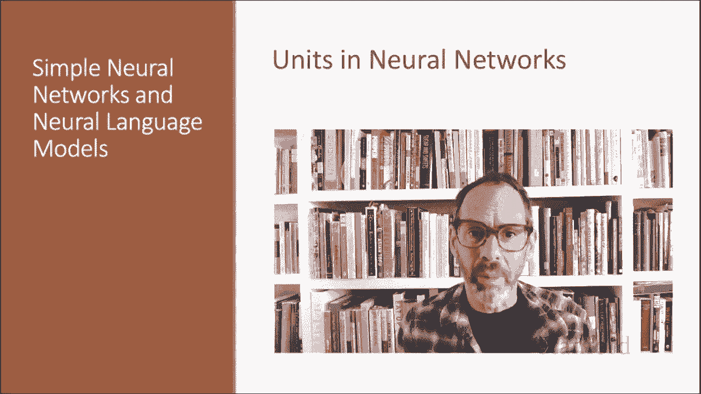

# 【双语字幕+资料下载】斯坦福CS124 ｜ 从语言到信息(2021最新·全14讲) - P57：L10.1 - 神经网络单元 - ShowMeAI - BV1YA411w7ym

Here we introduce the individual computing unit that makes up neural networks。

 neural networks are called neural because their origins lie in the McCullic pits neuron。

 which was a 1943 simplified model of the human neuron modeled as a kind of computing element described in propositional logic。

But the modern use of neural networks in language processing no longer draws on these early biological inspirations。

 So the name neural is really just kind of a historical remnant。Instead。

 a modern neural network is a network of small computing units。

 each of which takes a vector of input values and produces a single output values。

 Over the next few lectures， we'll introduce these units。

 see how they connect together and to feed forward networks。

 so called because the computation proceeds iteratively from one layer of units to the next。

The use of modern neural networks is often called deep learning because modern networks are often deep。

 meaning they have many layers。But the building block of a neural network is a single computational unit。

 A unit takes a set of real valued numbers as input， perform some computation on them。

 combining with weights and biases and a non nonlinear transform and produces an output。

Let's see this in more detail。At its heart， a neural unit is taking a weighted sum of its input。

Plus one additional term in the sum called a bias term。So given a set of inputs， x1 through xN。

 a unit has a set of corresponding weights， W1 through WN and a bias B。

And so we can represent the weighted sum Z as the bias plus the sum。 Often。

 it's more convenient to express this weighted sum using vector notation。

 So a scalar Z is computed from the dot product of the weight vector and an input vector plus a scalar bias B。

Finally， instead of just using Z a linear function of x as the output。

 neural networks apply a nonlinear function F to Z。

 we'll refer to the output of this function as the activation value for the unit， a for activation。

Since we're just modeling a single unit， the activation for the nose is， in fact。

 the final output of the network。Which we'll generally call why or why hat。

We've already seen the sigmoid for logistic regression，1 over1 plus E to the minus Z。

 and the sigmoid has a number of advantages。 it maps the input into the range 01。

 which is useful in squashing out wires toward one or0， and is differentiable。

 which as we saw is handy for learning， so we'll use the sigmoid nonlinear activation function as our example in this lecture。

 although we'll soon see that there are other kinds of nonlinear functions。

So here's the function that a simple unit with a sigmoid activation function is computing from an input X。

A weight vector W and a bias term B。 So we're just taking the sigmoid of w dot x plus B。

And here's our picture of the unit again， showing the pieces， the input， the weights。

 the weighted sum， the nonlinear activation， and the output value。

Let's walk through an example just to get an intuition。

 supposeose we have a unit with a weight vector of three weights and a bias。

 and let's suppose we have the input vector x1 is 0。5 x2 is 0。6 x3 is 0。1 Let's compute the sigmoid。

So we'll want to compute1 over1 plus x of minus w dot x plus B。And let's now write out W。t x+ B。

We'll have 0。5 times 0。2。Plus 0。6 times 0。3。Plus。01 times 0。9 plus the bias。

And here I put that all printed neatly。And if we just run that computation。

 we get one over one plus x of negative 0。87， or so our sigmoid output for this particular input is going to be 0。

7。We did that computation with the sigmoid， but in practice。

 the sigmoid is not commonly used as an activation function。A function that is very similar。

 but almost always better is the 10 H function， a variant of the sigmoid that ranges from minus1 to plus1。

 so that's e to the z minus e to the minus z over e to the z plus e to the minus E。

The TNH function has the nice properties of being smoothly differentiable and mapping out layerar values toward the meeting。

But the simplest activation function and perhaps the most commonly used is the rectified linear unit。

 also called the re。 It's just the same as Z when Z is positive。And 0 otherwise。

 the re function has nice properties that result from it being very close to linear in the sigmoid or 10 H functions。

 very high values of Z result in values of y that are saturated。

Meaning extremely close to1 with derivatives very close to 0。

0 derivatives cause problems for learning gradients that are almost 0 cause the error signal to get smaller and smaller until it's too small to be used for training。

 A problem called the vanished ingredient problem。 Ras don't have this problem。

 Since the derivative for high values of Z is just one rather than very close to 0。

We've introduced the basic neural computing unit that underlies modern neural networks。

