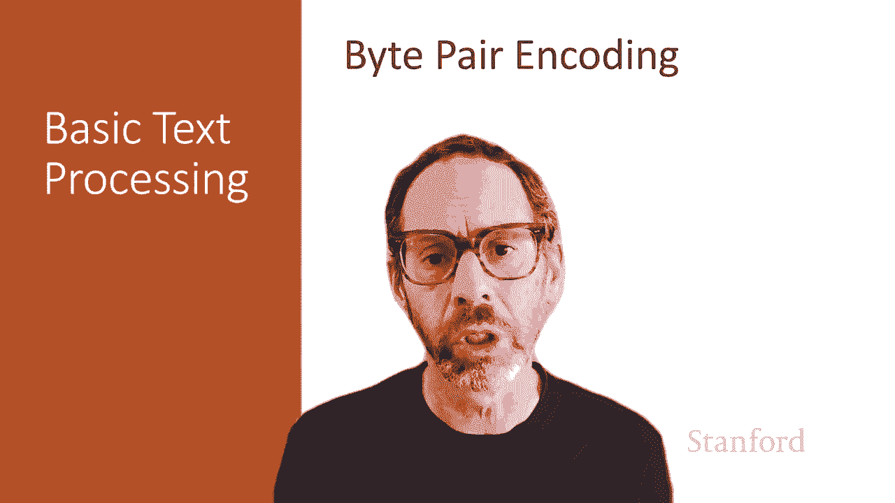
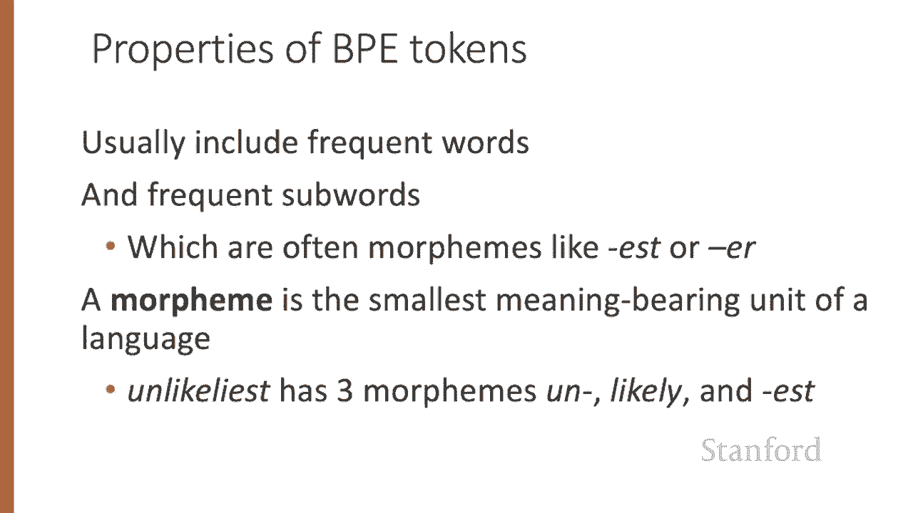
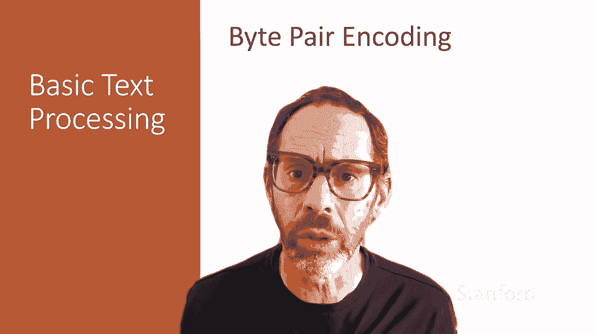

# 【双语字幕+资料下载】斯坦福CS124 ｜ 从语言到信息(2021最新·全14讲) - P5：L1.5- 字节对编码 - ShowMeAI - BV1YA411w7ym

In this lecture， we introduce the Bte pair encoding or BPE algorithm。

 which uses corpus statistics to decide how to segment a text into tokens。

Instead of just breaking up wordss at every white space。

Or as we saw for Chinese breaking up words at every character。

 the algorithms we're going to introduce now use the data to tell us how to tokenize。

 And this family of algorithms is often called subward tokenizations。

 because the tokens can be parts of words， as well as whole words。

There are three common subward tokenization algorithms， Bte pair encoding or B P E。

 which we'll talk about now。 an algorithm often called unigram for unigram language model。

 tokenization。 and the word piece algorithm。 These algorithms all have two parts。 First。

 a token learner that takes a training corpus and induces a vocabulary， set of tokens。

 That is the vocabulary that the tokenizer will try to map things into。

 And then the second part is a token segmenter that takes a test sentence and tokenizes it。

 according to the vocabulary it learned from the training corpus。

 So let's start by talking about the first part。 the token learner。

Let's imagine that we start with a vocabulary that is the set of all individual characters。

 So maybe we have all the capital letters and all the lowercase letters。 That's our vocabulary。

 And we're going to repeat the following K times。 We first choose the two symbols that are most frequently adjacent in the training corpus。

 Two letters that occur most often next to each other。 Let's just say that these are A and B。

 And now we're going to do is we're going to add a new symbol。

 The merge symbol A B to the vocabulary。 And we're going to replace in the entire training corpus。

 every adjacent A And B with this new symbol A B。 And we're going to do this until K merges have been done And K is a parameter of the algorithm。

😊，We can see this more formally here， so we begin with a vocabulary V。

 all the unique characters in the corpus， and then K times and the string corpus C and the number of merges K are parameters to the algorithm。

 K times we're going to choose the two most frequent adjacent tokens we'll make a new token with their concatenation。

 we'll add that to the vocabulary。 and now we just replace all the individual pairs of both two tokens in the corpus with this new token and then when we're done this K times。

 we return the new learned vocabulary。Now there is an addendum to the BPE algorithm。

 which is that in practice most subward algorithms are run inside space separated tokens。

 so we commonly first add a special end of token symbol and I'll use underbar to represent that before each space in the training corpus before we separate into letters。

 so let's walk through an example。Imagine the following corpus， lo， low， low， low， low， lowestest。

 lowest， newer， newer， newer， newer， newer， newer， wider， wider， wider， new， new。

And let's take that litarily fascinating corpus and add a little underbar for an end of word token before every space。

 And the result's going to be this vocabulary。 We have each of the letters in the original corpus D。

 E， I L， N O R S T W and the new token the underbar。 And for convenience。

 I'm going to represent the corpus in the following way。

 which is I'm going to use counts of different strings of letters followed by underbars。

 rather than copying this entire long corpus representation every time。 I'm just going to use this。

 So the word the sequence， L O W underbar occurs  five times There it is 1，2，3，4，5 and so on。

 I haven't written the underbars up here。 So we're going to refer to the corpus this way。

 And the vocabulary this way。 And let's walk through the algorithm seeing how we change the corpus and augment the vocabulary。

So we're going to begin with the corpus as we started with it and our original vocabulary and we're going to first say which two letters are next to each other most often and that is going to be E and R are next to each other six times in the context of NW and three times in the context of WID so that's nine times and we're going to merge the E next to R into a new symbol ER。

We're going to add ER to our vocabulary， we're going to merge all the cases of ER in the corpus。

And now we're going to move on。What's the next most frequent pair。

 It's another thing that occurs 9 times。 The new symbol。

 E R is now next to the underbar six times here and three times there。

 So it's going to appear in the corpus a total of9 times。

 So we're going to merge E R next to underbar to a new symbol E R underbar。

 We're going to add that symbol to our vocabulary。 And we're going to merge them in our corpus。

 The most frequent next symbol is N。Next to E occurs six times in this context。

 two times in that context for a total of eight times。

 So we're going to merge N next to E to a new symbol N。 So we add the new symbol N。

And now we merge them in our corpus。And we keep moving on in that way。

 We're next going to merge any with W producing a new token N W， L with O L OW。

 So we have a token L OW， and then NW with ER underbar。

 So we have a new token N underbar and low with an underbar。 So we have a token low underbar。

 So now we have the falling vocabulary that we've added a whole bunch of new words to。

So that's our training set。Next， we're going to take that set of merges we've learned in training and apply it to the segmentary algorithm running on our test set。

 and we're going to run those merges greedily in the order。 we learned them， not based on frequency。

 So remember in our training set， we picked our merges based on how frequently letters occurred together in our test set。

 we're not going to look at the test frequencies at all。

 we're just going to run our merges in the order we learned them in the training set。

 So we're just going to， for example， first， because the first merge we did is merge E with R in the training set in the test set。

 we're going to merge all the Ers to Er。 And next， we're going merge all the Er underbars to ER underbars and so on。

 And so the result is that the string N E W E underbar would be tokenized as a full word because if we look back at our vocabulary there it is N E WE underbar is a word。

It's in our vocabulary。But if we see the string L O W E R underbar。

 that's going to be tokenized as two separate tokens， low and ER underbar， because again。

 looking back at our vocabulary， there is no token L O W E R underbar， there's a token low。Low。

 sorry， there's a token low。 and there's a token E R under bar。 So it'll。

 it'll separate the words into those two tokens。Now， the resulting B。

 P E tokens will occur words that occur frequently in the corpus。

 So frequent words are going to be tokenized， and also frequent sub wordss。

 And often those frequent sub wordss are morphmes like E， S T or E， R。

 A morphme is the smallest meaning bearing unit of a language。 So， for example。

 the word unlikelyliest， has the three morphmes Un an S。

And often these BE tokens turn out to correspond to morphemes， although not always。

The B pair encoding algorithm we've described is one of a set of corpus based tokenizers that are extremely widely used throughout natural language processing。

