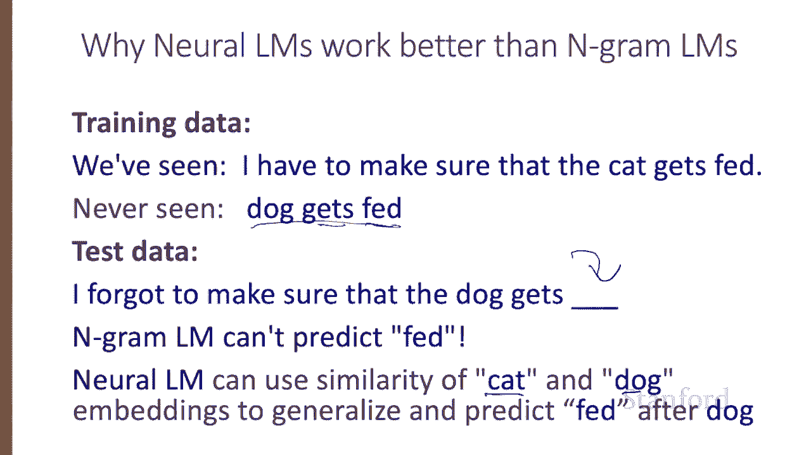
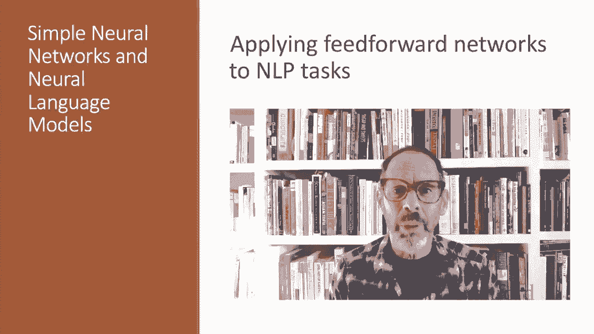

# 【双语字幕+资料下载】斯坦福CS124 ｜ 从语言到信息(2021最新·全14讲) - P60：L10.4 - 基于前馈神经网络的NLP问题方案 - ShowMeAI - BV1YA411w7ym

Let's see how the simple feed forward network can be applied to NLP tasks。

Let's consider two simplified sample tasks， text classification like the sentiment classification we've seen and language modeling。

 which we saw with Ngrams。 And now we're going to see a neural version State of the art neural systems use more powerful architectures。

 but simple models like the simple feed forward networks we'll look at today are useful to consider。

Let's think about sentiment analysis， We could build a neural system that does exactly what we did with logistic regression。

 the input layer we could have the same binary features we saw for logistic regression。

 our output layer outputs a 001 with a sigmoid， the only difference is this extra layer。

So our features， we could have features like the count of positive words in the lexicon or the count of negative words in the lexicon。

 or is the word no in the document， standard features that we talked about for sentiment analysis。

Architecturally， our logistic regression model， we have our set of features and we have our sigmoid and our weights and we're just talking about adding an extra layer。

 so we have an extra hidden layer， so now we have two sets of weight matrices W and U with the same sigmoid same features。

So just adding that hidden layer to logistic regression allows the network to model the interaction between features。

 feature X1 and feature X2 can get modeled differently here in this node than they are getting combined in this node in various ways。

And this gives the network more power， which may improve performance。

But the real power of deep learning comes from the ability to learn features from the data。

 so instead of using hand built human engineered features for classification。

 we're going to use learned representations like the embeddings we saw in previous lectures。

So here's the idea， imagine we have three input words the dessert is。

We look up the embedding for each word， so let's say that those word 534， we look up bits embedding。

And we look up the embedding for dessert and we look up the embedding for is。

 and now that's our input layer， the three embeddings。And now we have our W matrix。

 we multiply the embedding values by the W matrix， we get our hidden layers。

 we have our value or whateverlineity multiply by you。

 and we have our sigmoid at the out estimating the probability of positive sentiment from those three words the dessert is。

That looks great except for one big problem。It assumes that the input is always three words。

 that's kind of unrealistic。We'll wait for later lectures to see a complete solution to this problem。

 but here's some simple solutions。First， we could just make the input longer。

 make it the length of the longest review， maybe if a review is shorter。

 we pat it with zero embeddings。And if we get a longer review of test time， we just truncate it。

A second solution is we can create a single sentence embedding。

 the same dimensionality as a word to represent all the words in the review。

 and we can do that in one of two common ways， we could simply take the centroid the mean of all the word embeddings so we create one sentence embedding that's like an average of all the words。

Or we can do more sophisticated things we could take create the same sentence embedding as a single embedding by taking the element wise max of all the word embeddings。

So for each dimension in this single new sentence embedding。

 we choose the max value from all the words as the value for that dimension。

What if we want to have more than two output classes？As we saw for logistic regression。

 we can just add more output units， one for each class。

 and use a softmax layer so we could produce positive。

 negative or neutral sentiment or five values of sentiment。

Let's now turn to the language modeling task。Recall that the task of language modeling is to calculate the probability of the next word in a sequence。

 given some history。 and we've seen Ngram based language models。

 It turns out that neural network language models far outperform Ngramm language models。

Now the state of the art neural language models are based on more powerful technology like transformers。

 but simple feed forward language models can do almost as well， let's see how。

Recall that the task of a language model is to predict the next word W subt。

 given the prior words W subt minus1， w subt minus2， w subt minus3， and so on。This， of course。

 leads to a problem we're dealing with sequences of arbitrary length。

A simple solution for feed forward language models is to use sliding windows， fixed length windows。

By doing this， we're making the same simplification we saw in Agram language models。

 where approximating the probability of a word given the entire set of previous words。

 by the probability of the word， given some finite fixed set of previous words。

Here's a sketch of this simplified feed forward neural language model with n equals 3。

 We have a moving window at time T with an embedding vector representing each of the three previous words。

 just as we saw for sentiment。 So words W T -3， T -2 and t -1。

And they're concatenated together to produce X， the input layer。

And then at the output of the network， we have a softmax which gives us a probability distribution over words。

So for example， y 42， the value of output node 42 is the probability that the next word W subt is the word with vocabulary index 42。

 which happens to be the word fish。So given the three previous words。

 this network will give us a distribution over all possible next words， AVrk fish for zebra。

 hopefully it'll pick fish， and then we simply move our window one token over and predict the following word in the same way。

Neurural language models work a lot better than simple N gram language models。

 And here's an example to see why that's true。 Imagine that we've seen in training data the sentence I have to make sure the cat gets fed。

 And it just happens we've never seen the trigram dog gets fed。

And suppose the test data is I forgot to make sure the dog gets。And we need to predict the next word。

Now an Ngramm language model will not predict Fed after getss， it's never seen Fed after getss。

 and even if we have some kind of smoothing， Fed won't be a particularly likely word after getsS。

But a neural language model can use the similarity of cat and dog。 these the words are similar。

 the embeddings are similar， and we can generalize to predict feded after dog。

 having seen feded after cat in training。

We've seen how simple feed forward networks can be applied to various NLP tasks。

