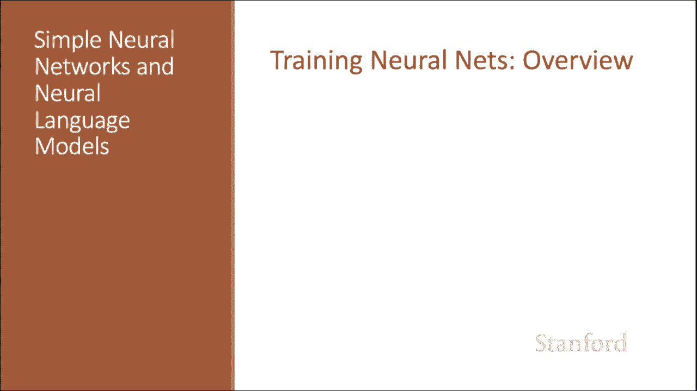
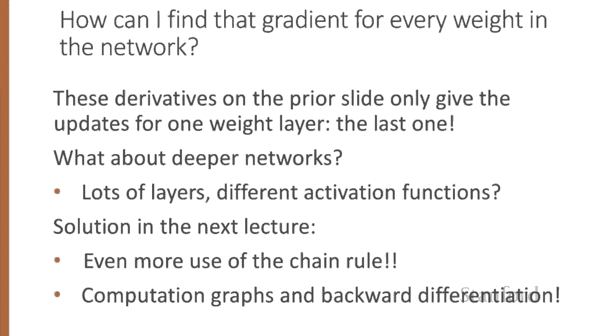
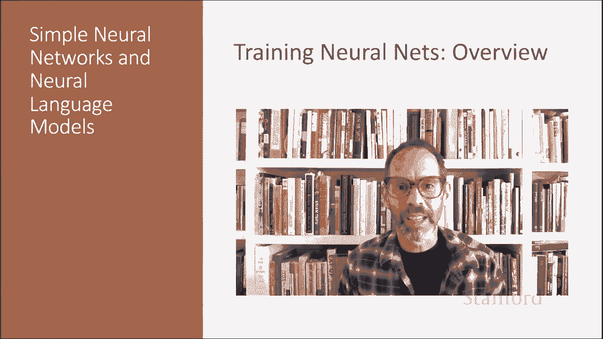

# P61：L10.5 - 训练神经网络 - ShowMeAI - BV1YA411w7ym

How do we train neural networks， Let's start with an overview。

The intuition of neural net training is the forward computation of the loss and the backward computation of the weight updates。

So given an input X。We run a forward pass through the network， computing the system output， Y hat。

Then we compare Y hat to the true answer， Y to get a loss for the example。

 and then we are going to do a backward path through the network。

 computing the gradients we need to update the weights。

Let's see that same thing in a slightly more formal way for every training tuupple， input X。

 correct answer y。We're going to run our forward computation to find what our network thinks Y hat is。

 our estimate of Y hat。 and then we're going to run a backward computation to update weights。

 And we're thinking here about a two layer network。 So first for every output node。

 we're going to compute the loss between the true y and the estimated y and we're going to take all the weights from the hidden layer to the output layer and update those weights from that loss。

And next， we're going to go to the hidden nodes。And we're going to find a way to assess how much blame that node deserves for the correct answer and then for every weight from the input layer to the hidden layer。

 we're going to update that weight， so we'll see how to do this in a more formal way。

Let's next get an intuition from what we did for logistic regression。 Remember。

 our loss function for binary logistic regression。 We want to learn weights that maximize the log probability of the correct label。

 So P of y given x。😊，And remember to turn this into a loss function because we're minimizing。

 we want to flip the sign。And now we can plug in our estimates of the probability that are computed by the sigmoid of the weights。

And let's recall from the lectureron logistic agression how gradient descent works for weight updates。

The magnitude of the amount to move in gradient descent。

Is the value of the gradient of the loss function with respect to the weights weighted by a learning rate Eta。

 So we have our old weight W super T and to compute our new weight。

 we move the old weight by the gradient of the loss weighted by the learning rate。

 higher learning rate means we should move the W more on each step。For logistic regression。

 we saw that this derivative of the loss function with respect to one weight w subj is sigma of w dot x plus b minus y。

 so our y hat minus RY times x subj。Where did that derivative come from， using the chain rule。

 Remember， the chain rule says if we have a composite function， F of x equals u of v of x。

 the derivative of f of x is the derivative of u of x with respect to V times the derivative of V of x with respect to x。

And you can see the text in chapter 5 for the details。

But the intuition we can see from this neural unit， which is the same as logistic regression。

 it's computing the loss as a function of y， which is computed as the sigmoid of the sum the sum of the weights times the values。

So if we want to do the derivative of the entire loss function with respect to one weight W sub I。

 we can compute this using the chain rule。The derivative of L with respect to W sub I is the product of the derivative of L with respect to Y。

 the derivative of the loss。Times the derivative of y with respect to Z。

 the derivative of the activation， times the derivative of Z with respect to W sub I。

 the derivative of that weighted sum。The derivatives we used on the prior slide for logistic agress only give the updates for that last weight layer。

Logistic regression only has one weight layer， but what about deeper networks where we have lots of layers and furthermore we have different activation functions。

 not just sigmoids。We'll see the solution in the next lecture and we'll have even more use of the chain rule and we'll introduce the big idea of computation graphs and backward differentiation。

We've seen an overview of neuralNe training in the next lecture we'll see the details。

