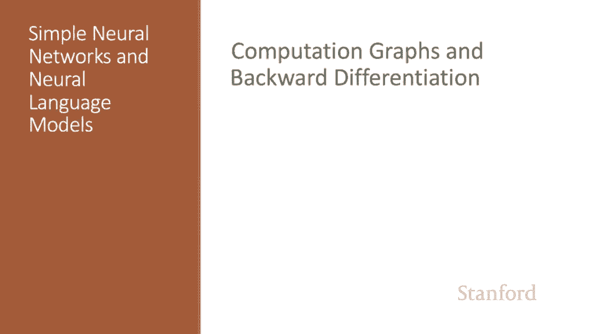
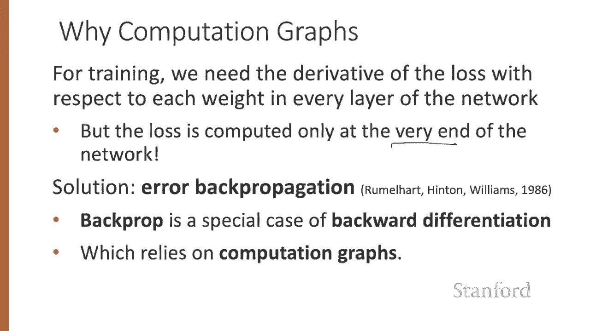
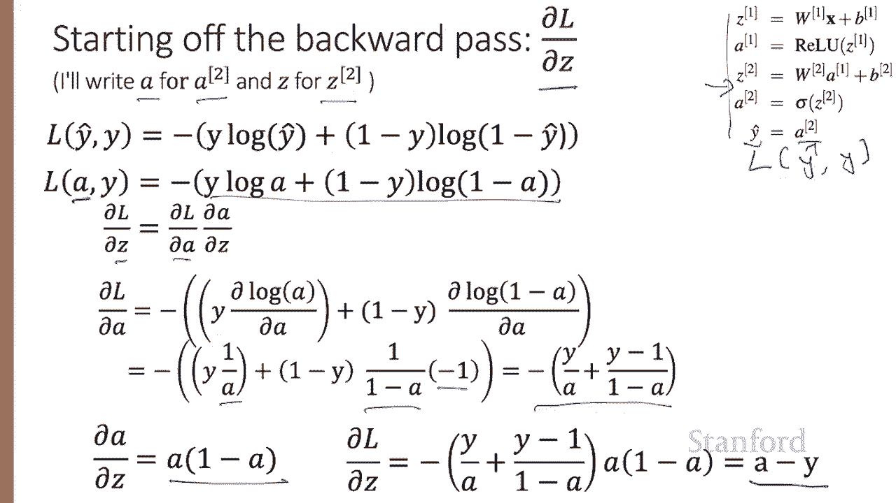
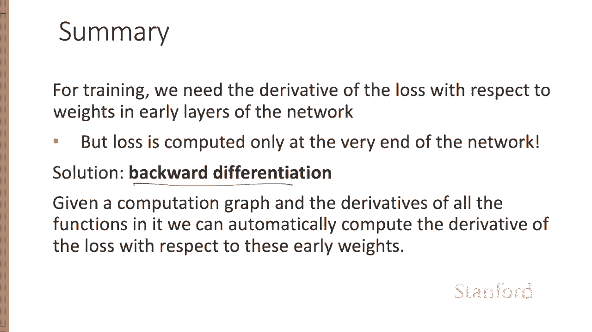

# 【双语字幕+资料下载】斯坦福CS124 ｜ 从语言到信息(2021最新·全14讲) - P62：L10.6 - 计算图与反向传播 - ShowMeAI - BV1YA411w7ym

Here we introduce the important back propagation algorithm。

For training a neural network with gradient descent， we need the relevant gradients for each weight。

 the derivative of the loss with respect to each weight in every layer of the network。

But the loss is computed only at the very end of the network。

 how do we find these gradients for weights in the early layers？

The solution is a method called error back propagation or backpro in the neural network world。

 it turns out that backpro is a special case of backward differentiation。

 a method that relies on computation graphs。

A computation graph is a representation of the process of computing any mathematical expression in which we break down the computation into separate operations。

 each of which is modeled as a node in a graph。Consider computing the simple function L of ABC equals C times a plus 2b。

If we make each of the component addition and multiplication operations explicit and give names to the intermediate outputs。

 the resulting series of computations is D equals 2 times B， E， which we've also created is a plus D。

 and then L is C times E。We can now represent this as a graph with nodes for each operation and directed edges showing the outputs from each operation as the inputs to the next。

 The simplest use of computation graphs is to compute the value of a function with some given inputs。

So let's assume we have inputs a equals3。B equals 1 and C equals minus2。

We can then walk forward and compute a value for D as 2 B， so that's 2。

And then a value for E as a plus D， so that's5。And then a value for L has5 times minus2。

Here it is without my messy handwriting。The importance of the computation graph， however。

 comes from the all important backward pass， and the backward pass is used to compute the derivatives that will need for the weight update。

Now in this example， our goal is to compute the derivative of the output function with respect to each of the input variables。

So that's the derivative of L with respect to A， the derivative of L with respect to B。

 and the derivative of L with respect to C。The derivative。

L with respect to A is telling us how much a small change in a affects the final output L while holding all the other variables constant。

Backward differentiation relies fundamentally on lots of application of the chain rule。

 let's remind ourselves of the chain rule。Suppose we have a composite function。

 f of x equal u of v of x。The chain rule tells us that the derivative of f of x is the derivative of u with respect to V times the derivative of V with respect to x。

And the chain rule extends to more than two functions。

If we're computing the derivative of a composite function， F of x equals u of v of w of x。

The derivative of F of x can be computed by the chain rule as the derivative of U with respect to V times the derivative of V with respect to W times the derivative of w with respect to x。

So let's now use the chain rule to compute these derivatives that we need。

Since in the computation graph， L equals C times E， we can directly compute the derivative。

 The partial derivative of L with respect to C is simply E。For the other two。

 we'll need to use the chain rule。 The derivative of L with respect to A is the derivative of L with respect to E。

Times the derivative of E with respect to A。And similarly。

 the derivative of L with respect to B is the derivative of L with respect to E。

E with respect to D and D with respect to B。And I put those equations up here on the top。

And you can see that they require five intermediate derivatives。Through root of L with respect to E。

 E with respect to A， E with respect to D and D with respect to B。And L with respect to C。

And we can compute them as follows。 The derivative L with respect to E we already saw was C。

 and the derivative of L with respect to C is just E。

Making use of the fact that the derivative of a sum is the sum of the derivatives。

The derivative E with respect to a is just one。And the derivative with with respect to D is just one。

And the derivative of D with respect to B is just 2。In the backward pass。

 we compute each of these partials along each edge of the graph from right to left。

 multiplying the necessary partials to result in the final derivative we need。Thus。

 we begin by annotating the final node with the partial of L with respect to L， which is1。

And then we move to the left。We can compute the partial of L with respect to C。

Which we can look up here。And we see that's E， and the forward pass conveniently will have computed the values of these intermediate variables we need like D and E。

 So we know that E is5。 So we know that the partial of L with respect to C is5。

 and now can also go after the partial of L with respect to E。 and we can look that up and thats C。

 which we know。From here is minus2。Partial of L with respect to E minus2。

 and now the partial of E with respect to D。You can look that up， that's one。

And now the partial of L with respect to D， we get that by multiplying the partial of L with respect to E and E with respect to D。

 just like here， these two。And so that's going to be minus2。And we can go one step further。

 the partial of D with respect to B。 We can look that up。 That's2。

And now the partial of L with respect to B， we multiply or minus2 times 2。And we get minus4。

And we can do similar things for the rest of the graph。

Here's the entire backward pass writtenden out neatly。Of course。

 computation graphs for real neural networks are much more complex。

Here is a sample computation graph for a two layer neural network with two input units。

 two hidden units， and one output unit， and we'll have a re in the middle and a sigmoid at the end。

 Here's the equations。 So we'll have our W X plus B， our re。

 and then the next layer of W X plus B and now is sigmoid and the final answer Y hat is the activation after the sigmoid。

In order to do the backward pass on this computation graph。

 we'll need to know the derivatives of all the functions in the graph。

So we've seen the derivative of the sigmoid， the derivative of sigma of Z is sigma of z1 minus sigma of z。

And the derivative of the re。Here's a picture of the entire computation graph。

 the weights that need updating， so those for which we need to know the partial derivative of the loss function are shown in orange。

So for a particular example， a particular observation x1x2， we would run the forward pass。

Assigned variables to all of our nodes， and then starting with these last nodes。

 run the backward pass。And for the backward pass， we'll need to know the derivative of all the relevant functions。

Let's show how to start off the backward pass just by computing the first couple of steps to compute the derivative of the loss function with respect to Z and here I mean Z2。

 the last Z， so I'll write a for a super2 and Z for z super2， so we have the loss。

And we have our two layer network。Here's the standard cross entropy loss function。And for y hat。

 I'll write， a， meaning a super2， just replace the y hats with A's。

 And now if we want to compute the partial of L with respect to Z， this Z here。

That's the partial of L with respect to A times the partial of a with respect to Z。

The partial of L with respect to a we can。Take the derivative of this with respect to a。

 so that's y times the derivative of log A with respect to a plus1 minus y times the derivative of log of 1 minus a with respect to a。

And conveniently， the derivative of log of x is1 over x times the derivative of x。

 so we have y times 1 minus a。And here we have one over 1 minus a times the derivative of 1 minus a。

 so that's minus1。And that simplifies neatly。And then the derivative a with respect to Z。

 the beautiful sigmoid derivative is just a times 1 minus a， and we can multiply these together。

And simplify even more beautifully to a minus y。So we've seen a couple of pieces of the backward pass for a simple two layer neural net。

So in summary， for training a neural network， we need the derivative of the loss with respect to weights in early layers of the network。

 but the loss is computed only at the end， and the solution is backwards differentiation。

 we take a computation graph and given the derivatives of all the functions in it。

 we can automatically compute the derivative of the loss with respect to these early weights。

We've seen the important back propagation algorithm。

 the idea of computation graphs and backward differentiation。

