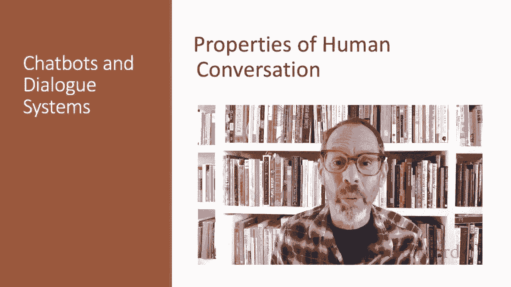
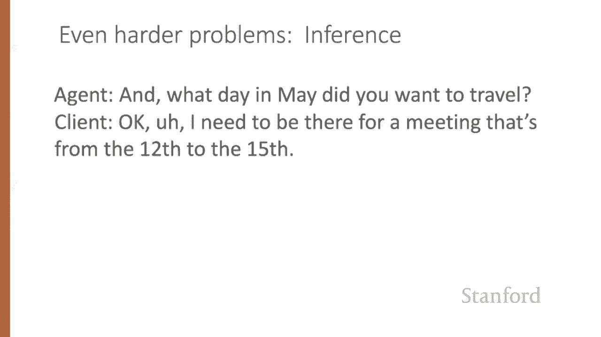
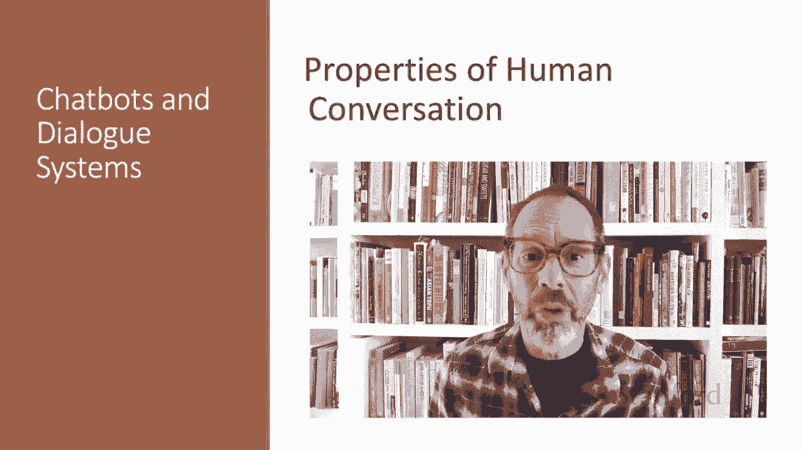

# P64：L11.2 - 人类对话的属性 - ShowMeAI - BV1YA411w7ym

Before we design a conversational agent to converse with humans。

 it's important to understand something about how humans converse with each other。

Consider some of the phenomena that occur in the conversation between a human travel agent and a human client excerpted here。

 so the client says， I need to travel in May and the agent says。

 and what day in May did you want to travel Okay， I need to be there for a meeting that's from the 12th to the 15th and you're flying into what city。

 Seattle and so on， you can pause the video and read the conversation。

Let's consider some of the properties of this conversation。 First of all。

 we call each of the contributions of the two conversants a turn as if conversation was the kind of game where everyone takes turns。

So there are 20 turns in this excerpt， and I've numbered them from 1 to 20。

 and a turn can consist of a sentence like C1 here， but it can also be as short as a single word。

Like C 13， or as long as multiple sentences， like the agent's response A 10。

The fact that there are two or more people who need to talk means that they have to negotiate turn taking。

 who takes the floor， when do I yield the floor， what happens when we both try to talk at the same time causing interruptions？

Look here at A 16 and C 17。 The client interrupts here。 So the agent says， O， there's two non stops。

 and the hash marks mean overlap。So these two phrases are overlapped and just at the same time the client interrupts to say。

 actually， what day of the week is the 15th？So notice that the human agent knows to stop talking。

And also knows that the client might be making a correction or change。

 systems need to be able to handle this。Allowing the user to talk over the system and stop the system is called barin。

A system also has to know when to start talking。 For example， most of the time in conversation。

 speakers start their turns almost immediately after the other person finishes without a long pause。

 People are able to， most of the time， detect when the other person is about to finish talking and time their responses to slip right in。

So spoken dialogue systems must detect whether a user is done speaking so they can process the utterance and respond quickly。

This task of detecting when the user is done， called endpointing。

Or end point detection can be quite challenging because of noise and because people often pause in the middle of turns。

A key insight into conversation due originally to the philosopher Witgenstein。

 but worked out more fully by the philosopher Austin。

 is that each utterance in a dialogue is a kind of action being performed by the speaker。

These actions are commonly called Sp Acts or dialogue acts。

Here's one taxonomy consisting of four major classes from Bachken Harnish。

Consttives committing the speaker to something's being the case。

 so stating something directives attempts by the speaker to get the addressee to do something so kind of commands。

Commissives， that's committing the speaker to some future action。

 That's promising stuff and acknowledgecknowledgments。

Various ways in which the speaker's attitude toward the heroer or some social action can be expressed。

So for example， a person asking another person or a dialogue system to do something like turn up the music。

Is issuing a directive a kind of command？Asking a question that requires an answer is also a way of issuing a directive in a sense。

 when an agent says what day and May did you want to travel。

 it's as if they're very politely commanding the client to answer。By contrast。

 a user stating a constraint like I need to travel in May is making a contive。

 a user thanking the system is issuing an acknowledgement。

The Speech Act expresses an important component of the intention of the speaker or writer in saying what they said。

A dialogue is not just a series of independent speech acts。

 but rather a collective act performed by the speaker and the hearer， like all collective acts。

 it's important for the participants to establish what they both agree on called the common ground。

Speakers do this by grounding each other's utterances。

 grounding means acknowledging that the hearers understood the speaker like an act used to confirm receipt and data communication。

Grounding is relevant for other kinds of human machine interactions too。As Don Norman points out。

 the reason an elevator button lights up when it's pressed is to acknowledge the elevators indeed been called。

 It's a non linguistic way of acknowledging your action。

Humans constantly ground each other's utterances。We can ground by explicitly saying， okay。

 as the agent does in this excerpt。Or we can ground by repeating what the other person says。

In this utterance， the agent repeats on the 11th。Demonstrating their understanding to the client。

Or notice when the client answers the agent's question， the agent begins the next question with and。

The and implies that the new question is， in addition to the old question， again。

 indicating to the client that the agent has successfully understood the answer to the last question。

All this kind of grounding is important for computers too。

Consider two ways to follow up a user responding no to a systems question。

 did you want to review some more of your profile？A user could say。No， and the system says。

 what's next？Somewhat awkward。 Compare that with。The user says no， system says， okay。

 what's next In this second method， the O grounds the user selection。

 making it clear the system understood and processed the users no。Conversations have structure。

Consider， for example， the local structure between speech acts discussed in the field of conversation analysis。

Questions set up an expectation for an answer。Proposals are followed by acceptance or rejection。

Compliments like nice jacket often give rise to downplayers。Oh， this old thing。These pairs。

 question answer， proposal acceptance， are called adjacency pairs。

 They're composed of a first pair part and a second pair part。

 and these expectations can help systems decide what actions to take。However。

 dialogue acts aren't always followed immediately by their second pair part。

 The two parts can be separated by a side sequence or sub dialogueo。 For example。

 these turns from our conversation excerpt are a correction sub dialogue。

The client question what day of the week is the 15th interrupts the prior discourse in which the agent was busy looking for a May 15th return flight。

The agent must answer the question and also realize that I would consider saying till Sunday means the client wants to change their plan。

And must now go back to finding return flights， but for the Sunday。

Another side sequence is the clarification question。

Wwhich can form a subdiague between a request and a response this is especially common in dialogue systems where speech recognition errors causes the system to ask for clarification of repetitions。

 like the following where the system didn't hear the name of the place the user wants to go。

 the ASR system returned unknown word and the system has to ask again before responding。

In addition to side sequences， questions often have pre sequences like this example。

 where a user starts with a question about the system's capabilities。

 can you make train reservations？Before actually making the request itself。

Sometimes a conversation is completely controlled by one participant。 For example。

 a reporter interviewing a chef might ask questions， and the chef responds。

 We say that the reporter in this case has the conversational initiative In normal human human dialogue。

 However， it's more common for initiative to shift back and forth between the participants as they sometimes answer questions or ask them。

 take the conversation in new directions。This kind of mixed initiative。

 while the norm for human human conversations is very difficult for dialogue systems to achieve。

It's much easier to design dialogue systems to be passive responders。

In search engines or simple QA systems， the initiative lies completely with the user。

In such user initiative systems， the user specifies a query and the system responds。

 then the user can specify another independent query。Alternatively。

 you may have had the experience of being stuck in a bad dialogue system that asks a question but gives you no opportunity to do anything until you answer it。

 Such purely system initiative architectures can be very frustrating。

Inference is also important in dialogue understanding。 Consider this excerpt。 The agent says。

 what they made did you want to travel。 The client says， O。

 I need to be there for a meeting that's from the 12th to the 15th。

Notice the client does not in fact answer the agent's question。

The client merely mentions a meeting at a certain time。

What is it that licenses the agent to infer the client is mentioning this meaning so as to inform the agent of the travel dates？

In other words， the speaker seems to expect the hearer to draw certain inferences。

 the speakers communicating more information than seems to be present in the words。

This kind of example was pointed out by the philosopher Grce as part of his theory of conversational implicature。

 implicature means a particular class of licensed inferences。

These are particularly hard for dialogue systems。

We've touched on a few of the properties of human conversation that we'll need to keep in mind if we're designing conversational agents。

