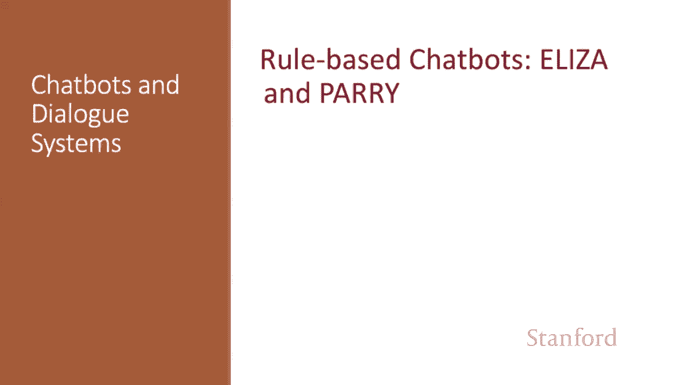
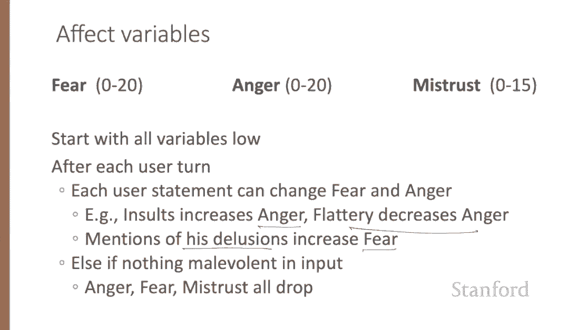
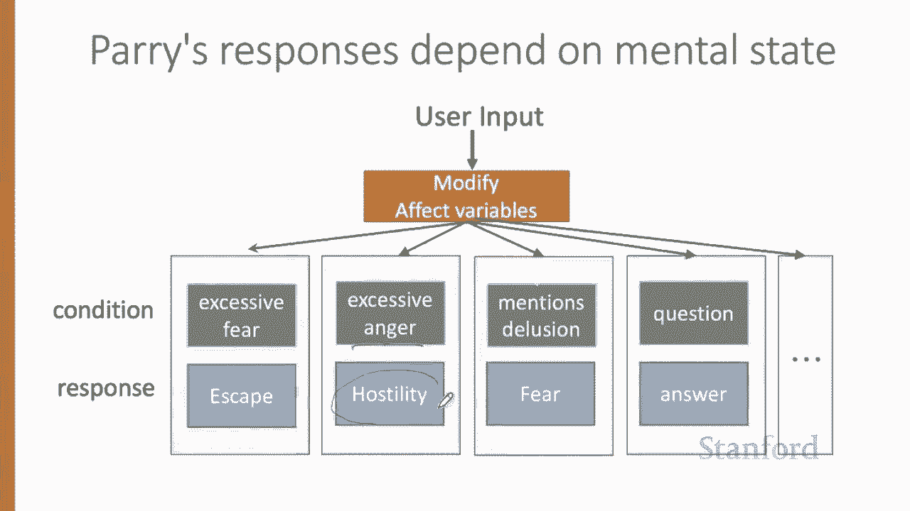
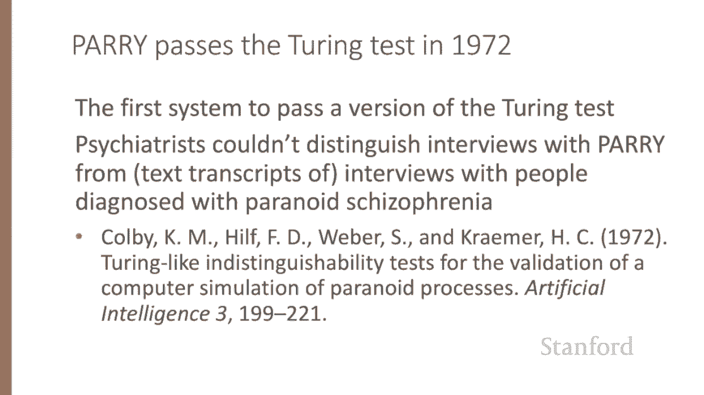
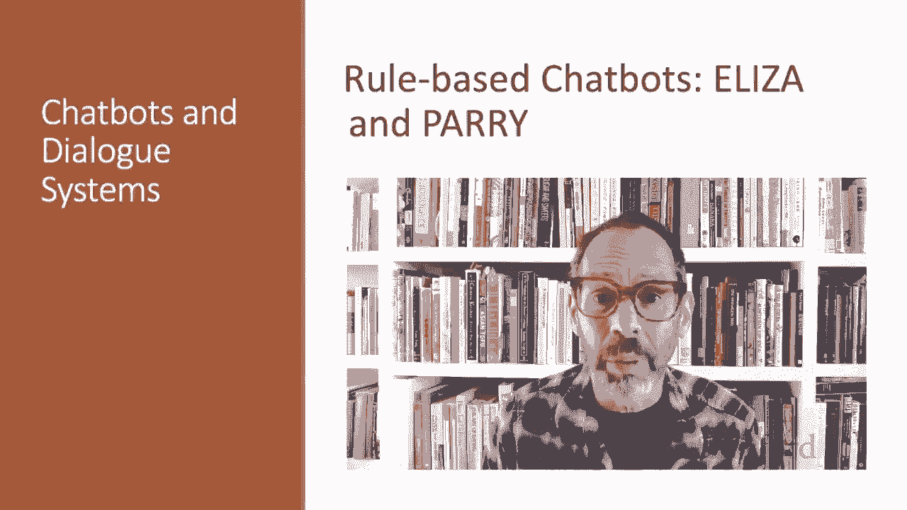

# 【双语字幕+资料下载】斯坦福CS124 ｜ 从语言到信息(2021最新·全14讲) - P65：L11.3 - 基于规则的聊天机器人 - ShowMeAI - BV1YA411w7ym

The chatbot Eliza， a simulated rogerarian psychotherapist。

 is one of the earliest and most important chatbots in the history of the field。

Let's walk through a sample conversation published in the paper that introduced Eliza in 1966。

 I have exerpt it it here by deleting some material from the full interaction given in the original paper。

Note that Eliza seems to give very linguistically coherent responses。

 Men are all alike in what way They're always bugging us about something。

 Can you think of a specific example， Eliza even seems to remember things from very far back in the discourse。

 This final line here。 Does that have anything to do with the fact that your boyfriend made you come here。

 Refs back to something mentioned much earlier。How does Eliza do this？

Eliza was designed to simulate a Rogerarian psychologist based on a branch of clinical psychology whose methods involve drawing the patient out by reflecting patient statements back at them。

 Rogerarian therapy is the rare type of conversation in which， as Weizenbaum points out。

 one can assume the pose of knowing almost nothing of the real world。If a patient says。

 I went for a long boat ride and the psychologist says， tellll me about boats。

You don't assume she didn't know what a boatde is， but rather assume she had some conversational goal related to your therapy。

 Most chatbots trying to pass the Tring test try to find some domain with similar properties。

Eliza worked by pattern transform rules like the following one。In the Eliza pattern。

0 means cleaningy star， and in the transform rules。

 the numbers are the index of the constituent in the pattern。

 So the number three here refers to this third element， the second0。In that pattern。 So this rule，0。

 U 0， me goes to what makes you think I3， U would translate you hate me into what makes you think I hate you where this Cly star matched nothing and this Cly star matched hate。

Each Eliza pattern transform rule is linked to a keyword that might occur in a user sentence。

Each keyword has a list of patterns， and each pattern has a list of transforms。

So the pattern you just saw0 U0 me might be organized under the keyword U。

And then I've shown two of the possible transforms that one we just saw and another。

For you history buffs， here's the lisp structure for Eliza's knowledge from the original paper。

Keywords are associated with a rank with specific words being more highly ranked and more general words ranked lower。

 so consider the following sentence。I know。 everybody laughed at me。Because it has the word I。

 this sentence could match the following rule， whose keyword is I keyword here says if you see I followed by anything。

 then say you say you to here I've used Cly stars。So this would translate the sentence I know everybody laughed at me。

To the sentence， you say you know， everybody laughed at you。

 Eliza has separate patterns for translating all theese to use。But I is a very general word。

 and its keywords lead like this to very general， vague responses。 The keyword。

 everybody is much more interesting。 Since， as Weizenbaum pointed out。

 someone using universals like everybody or always is probably referring to some specific event or person。

 So if instead we use the keyword， Everybody in the user sentence to select a pattern。

We'll select the pattern changing everybody's star to who in particular are you thinking of。

And Eliza gives that response。 This is a much more interesting response。

Eliza implements this idea by storing a rank with each keyword。

 so everybody is stored with the rank 5， and then its list of possible transformation rules like this one here。

 and I is stored with the rank0 with its list of transformation rules。

 So when Eliza's picking a transform， it'll be more likely to pick the transform associated with everybody if the sentence has everybody in it。

Here's the Eliza generator algorithm， given a user sentence and returning a response。

 We first find a word in the sentence with the highest keyword rank。

Then choose the highest ranked rule for that word if it matches the text of the sentence。

 apply the transform。And we do one little extra thing。 If there's a my in the sentence。

 we apply a special transform to that sentence and stick it onto a stack。 We'll come back to this。

Otherwise， we give the none response， we'll have some none responses。

 what to do if we don't really understand what the user said。

Or we'll go back to this memory stack and say something random。

So what do I mean by the none responses if no keyword matches。

 Eliza chooses a very non commitmtal response like please go on or I see。Finally。

 Eliza has a clever memory trick that accounts for that last sentence of the conversation we saw whenever the word my is the highest rank keyword。

 Eliza will randomly select a transform on the memory list。 memory is a special list here。

 apply it to the sentence and store it on a cue。 Transforms like， turn my。

 whatever you said into let's discuss further why your， whatever you said after my。

 or earlier said your or does it have anything to do with the fact that your。😊。

So now we've stored these on a queue， a first in first out queue， and then later。

If no keyword matches a sentence and we don't know what to say。

 we'll just pop something off the top of the memory queue and say that。

Let's talk about some ethical implications。 People became deeply emotionally involved with Eliza。

Weisenbaum tells the story of one of his staff who would ask Weizenbaum to leave the room when she talked with Eliza。

When Wiseimam suggested he might want to store the Eli conversations for later analysis。

 people immediately pointed out the privacy implications。

 which suggested they were having quite private conversations with Eliza despite knowing it was just software。

It worried Weisenbaum that people confided in Eliza。

 where people misled about how much computers understood from natural language。

Weisenbaum feared that society was making a mistake in removing humans from decisions and choice。

Professor Sherry Turkel， Weiseizeenbaum's colleague at MIT。

 studied users of Eliza and other computational systems over many decades。

Her more nuanced view was that while human face to face interaction is vital to the human experience。

 and she's shown that in a lot of her research。That humans also continue to develop relationships with artifacts。

 for example， some of the users she studied suggested they used Eliza more like a kind of diary。

 a way to privately explore their thoughts。The takeaway is that it's important to do value sensitive design。

 consider during the design process the benefits， harms and possible stakeholders of the resulting system you're designing。

A few years after Eliza， we see the development of another chatbot with the clinical psychology focus。

 Perry。But the goals here are very different than Eliza here。

 The authors were attempting to study schizophrenia by building a formal computational model of the mental processes and linguistic responses of a person with schizophrenia。

 So where Eliza is an exploration of what linguistic abilities it is possible to build。

 Perry shows the use of an NLP system as a cognitive model。

And Perry's relevant to our discussion here because of its innovations in chatbot architecture。

Most importantly， in addition to Eliza， like regular expressions and more powerful controll abilitiesities。

 the parry system included a model of its own mental state with affect variables for things like the agent's level of fear or anger and complex rules for the link between this mental state and linguistic input and output。

Certain types of statements or topics of conversation might lead Perry to become more angry or mistrustful or less angry。

 Menions of Perry's delusions， for example， increase the fear variable。

And then the outputs for Perry depended on the affect variables。For example， if anger is high。

 Perry chooses from a set of hostile outputs。

Perry was the first known system to pass a version of the Turing test in 1972。

Psychiatrists couldn't distinguish text transcripts of interviews with Perry from transcripts of interviews with people diagnosed with paranoid schizophrenia。

While rule based methods like Eliza and Perry are very simple， they have large implications。

 and rule based methods are still used as components in modern chatbots。

