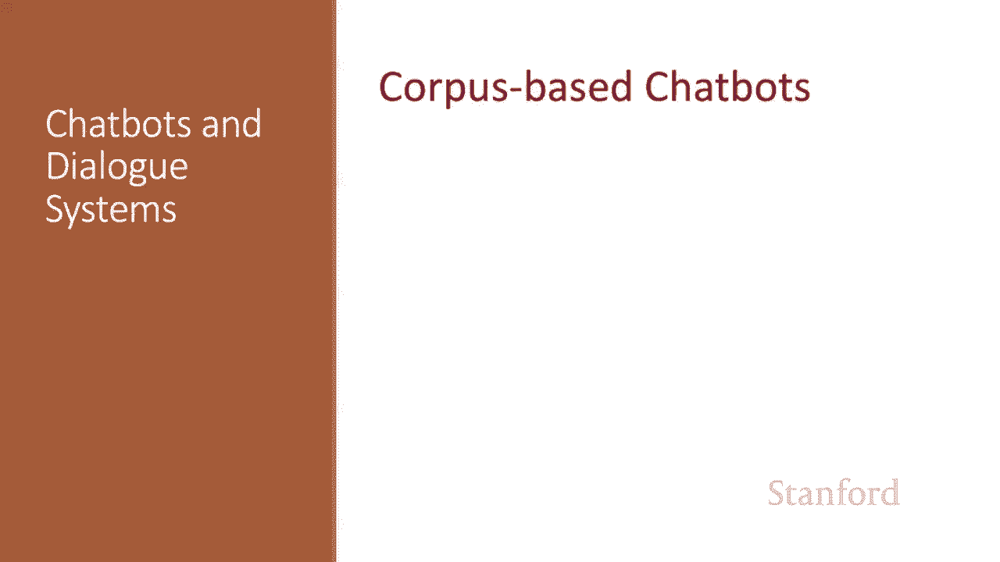
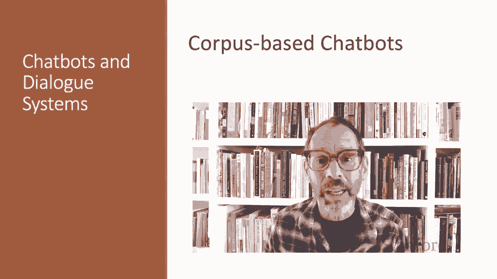
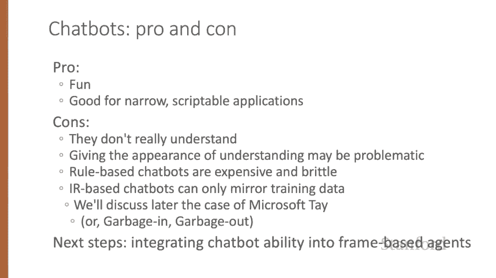

# P66：L11.4 - 基于语料库的聊天机器人 - ShowMeAI - BV1YA411w7ym

An alternative to writing rules is to build chatbots that automatically mine collections of human conversations to decide what to say。

Most corpus based chatbots produce their responses to a user's turn in context。

 either by retrieval methods， using information retrieval to grab a response from some corpus。

 a response that's appropriate given the dialogue context or by generation methods。

 using a language model or coder tor to generate the response given the dialogue context。

In either case， systems mostly generate a single response turn that's appropriate given the entire conversation so far。

 at least for conversations that are short enough to fit into a single model's window。

 For this reason， they're often called response generation systems。

Modern corpus based chatbots are very data intensive。

 commonly requiring hundreds of millions or billions of words of training。

Commonly used data sets include transcripts of spoken conversations between volunteers like the switchitchboard corpus of American English telephone and Converations。

Many systems train on movie dialogue， which resembles natural conversation in many ways。

Data sets have also been created specifically for training dialogue systems by hiring crowdworkers to have conversations。

 often having them take on personas or talk about knowledge provided to them。For example。

 the topical chat dataset has 11，000 crowdsource conversations， spanning eight broad topics。

 or the empathetic dialogues data set has 25，000 crowdsource conversations grounded in a specific situation where a speaker was feeling an emotion。

All these data sets， although large， don't reach the size of billions of words。

 and so many systems first pretrain on large data sets of pseudo conversationsations drawn from Twitter or Reddit or Weba and other social media platforms。

It's always necessary to remove personally identifiable information that might appear in the data。

The retrieval method of responding is to think of the user's turn as a query queuee。

 and our job is to retrieve and repeat some appropriate turn R as the response from a corpus of Con C。

Generally C is the training set for the system， and we score each turn in C as a potential response to the context Q。

 selecting the highest scoring one。And the scoring method is similarity。

 we choose the R that's most similar to Q using any IR method， TF IDF cosine， for example。

 so if we represent Q and R as TF IDF vector， then we can find the response in the entire conversation that has the highest cosine normalized dot product with the query。

 so the response to a query is this a maxax。And alternative， we can use neural Ir techniques。

 The simplest of these is called a buy encoder model in which we train two separate encoders。

1 to encode the user in query， and one to encode each potential response。

 And we use the dot product between the query vector and the candidate response vector as the score。

 For example， to implement this using Bert， we would have two encoders， Bt Q and Bt R。

 And we represent the query and candidate responses as the Cs token of the respective encoders。

And then again， we choose whichever turn in our corpus。Has the highest dot product with the query。

 and then we just say that term。The IR based approach can be extended in various ways。

 such as by using more sophisticated neural architectures or by using a longer context for the query than just the user's last turn up to the whole preceding conversation。

An alternative way to use a corpus to generate dialogue is to think of response production as an encoder decor task。

 transducing from the user's prior turn to the systems turn。

We can kind of think of this as a machine learning version of Eliza。

 the system learns from a corpus to transduce a question to an answer。

Encoder decoder models generate each token R subt of the response by conditioning on the encoding of the entire query and the response so far。

 So response tokens1 through t -1 will help us generate response token T。

 So to generate the next token， we take the argmax over all possible tokens in the vocabulary of the probability of that token given the query and the tokens we've generated so far。

And here on the bottom， I'm showing the intuition of the two paradigms response by retrieval where we take every sentence in the training set and choose the sentence with the highest dot product with the query。

 or response by generation where we build an encoder decoder model that reads in the query and generates the response one word at a time。

In the generator architecture， we normally include a longer context。

 forming the query not just from the user's turn， but from the entire conversation so far。

 as in this example， where we have， I finally got promoted at work。 congrats。

 that's great from the system。 The user says thank you。 And all of that is an input。

To the system's response， which is generated word by word， that is quite an accomplishment and so on。

An alternative to the encoder decoder architecture is to finet tune a large language model on a conversational data set and use the language model directly as a response generator。

For example， in the chirpy cardinal system， the neural chat component generates responses。From GPT2。

 fine tuned on the empathetic dialogueos data set。Here's a little intermission where the comic author PG Woodhouse seems to predict some properties of neural chatbots。

Here's what I mean。 Basic encoder decor models have a tendency to produce predictable but repetitive and therefore dull responses。

 like， I'm okay， or I don't know。 That shuts down the conversation。

 Here's some examples from some real chatbots。Pretty dull。

A number of modifications are generally required to the basic encoder decoder model to adapt it for the task of response generation。

 For example， instead of greedily choosing the most likely， most predictable response。

 we can use diversity enhanced versions of beam search or diversity focused training objectives。

Chatbots can be much more interesting and informative if they can generate responses from text knowledge sources other than just dialogue。

For example， the chatbot Shao I collects census from public lectures and news articles and searches them using IR based on query expansion from the user's turn to respond to turns like。

 tell me something about Beijing。One way to augment the encoder decoder architecture for this retrieve and refine step is to use IR to retrieve potentially useful passages from Wikipedia。

And then create multiple candidates by concatenating each retrieved Wikipedia sentence to the dialogue context with a separator token。

 each candidate can be given as the encoder context to the encoder decoder model。

 which learns to incorporate text from the Wikipedia sentence into its generated response。

Chatbots can also be built with architectures that are hybrids of the rule based and neural corpus architectures and even used elements of the frame based structure we'll describe in a future lecture。

For example， the chirpy Cardial system applies an NLP pipeline to the input and then generates responses with a set of different response generators。

Some used fine tune language models such as a GPT2 language model that learns in fine tuning to paraphrase content from Wikipedia in response from questions。

While other response generators are closer to rule based。

 the movie or music generators produce scripted conversation about a movie or musician。

 such as asking the user's opinion or giving a fun fact。

And these generators use redx's and sentiment classifiers to classify user responses and handwritten templates to generate bot utterances。

Here's a part of a conversation with chirpy Cardinal， notice the use of neural chat。

As well as scripted chat modules for movies。In summary。

 chatbots can be fun and play a useful role in narrow application domains。

 especially where scripting can be done。But on the other hand， they don't really understand。

 and the fact that they give the appearance of understanding may be problematic。

Rule based chatbots are expensive and brittle。But IR based chatbots can only mirror their training data。

 which as we'll discuss in the following lecture， can lead to problems。

One important next step in research is figuring out ways to integrate chatbot type abilities into frame based agents。

We've seen the two paradigms for corpus based chatbots。

 response by retrieval and response by generation。