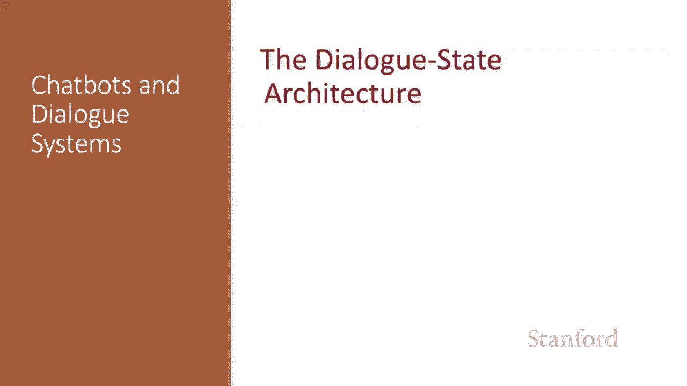
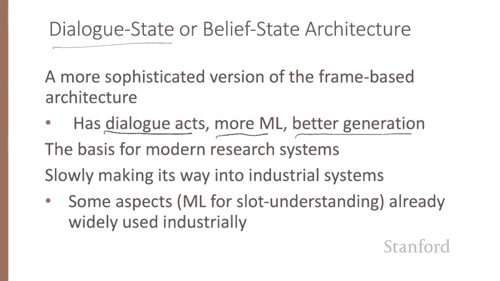
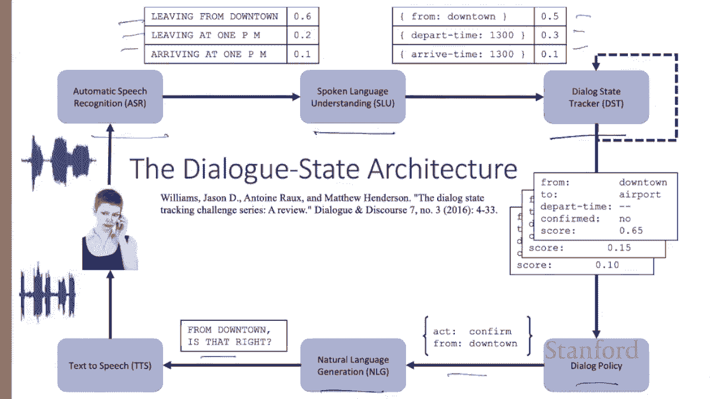
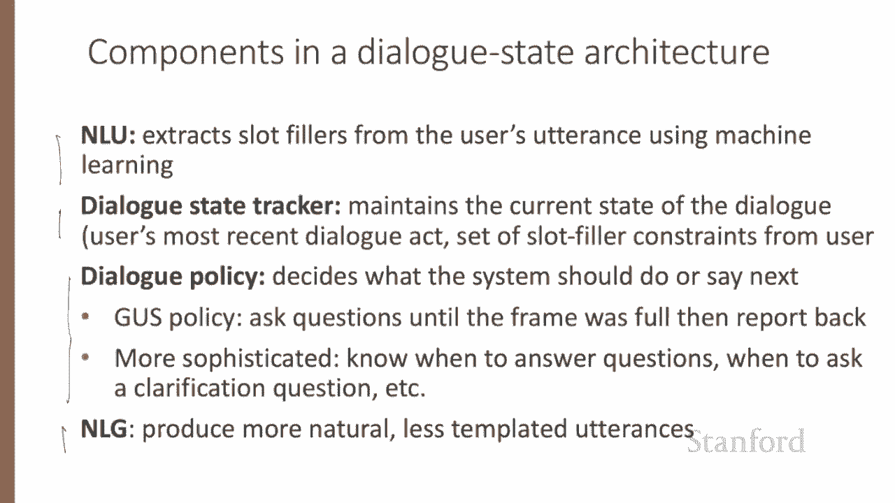
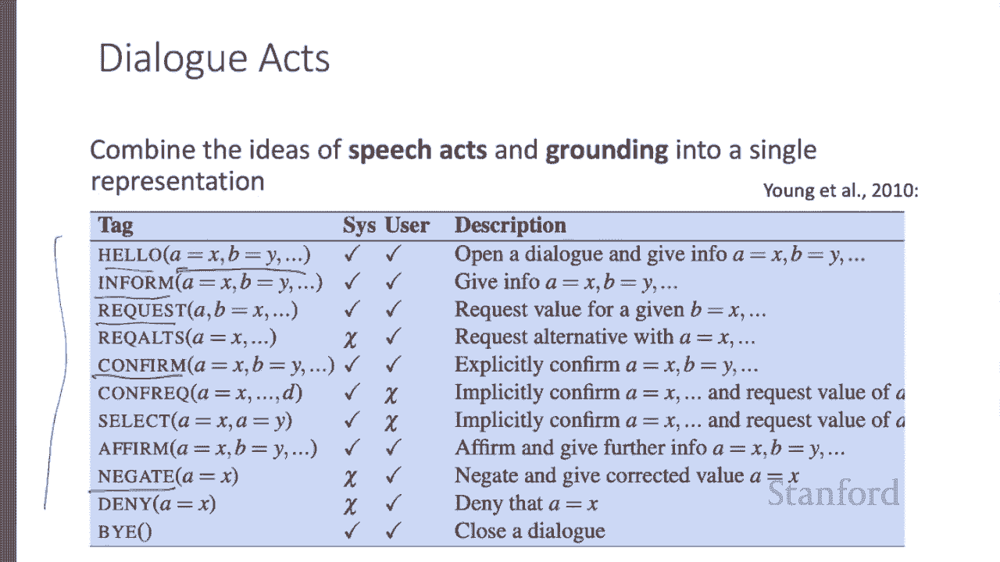
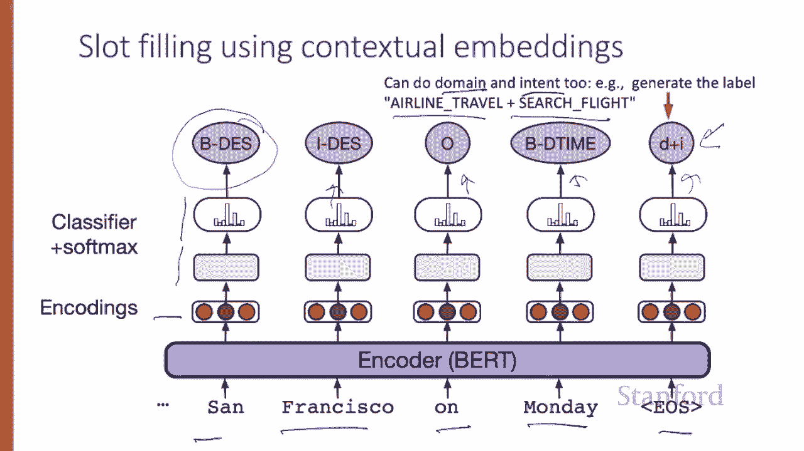
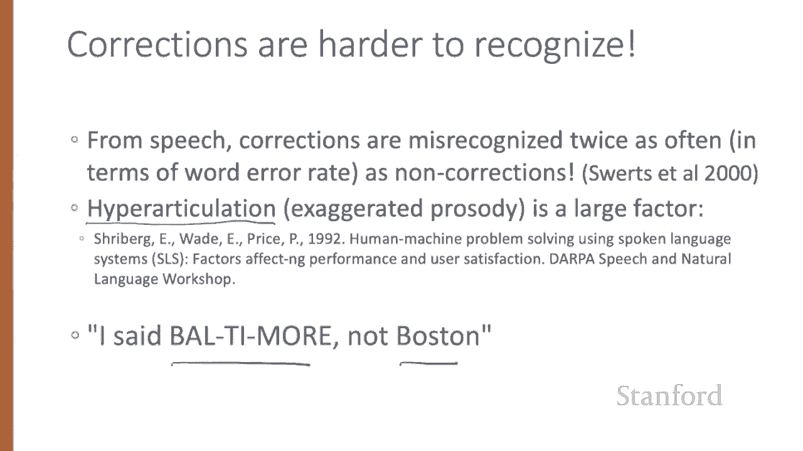
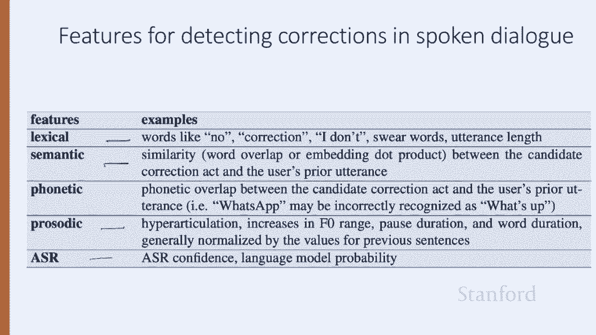

# P68：L11.6 - 对话状态架构 - ShowMeAI - BV1YA411w7ym

In this lecture， we introduce an extension of the frame based architecture called the dialogue state Arch modernern research systems for task based dialogue are based on a more sophisticated version of the frame based architecture called the dialogue state or belief state architecture。

The dialogue state architecture adds dialogueo acts。

 tends to use more machine learning and has less templated generation than the frame based architecture we've presented so far。

 and it's the basis for most modern research systems。

 aspects like the use of machine learning for a thought understanding are already widely used industrially。

Here are the six components of a typical dialogue state system here we're showing speech。

 so we have speech recognition as input， producing a set of sentences。

 gets passed to an understanding module which produces slot fillers。

 which gets sent to a dialogue state tracker， which stores which slots of the frame and which frames are being filled over time。

The dialogue policy module， which decides what to say， a natural language generation module。

 which decides how to word it and then text to speech if we're doing speech。

In this lecture， we'll focus on text rather than speech looking at four the components。

 These four are more complex than in the simple gust system Like the Gust system。

 the dialogue state architecture has an N LU component to extract slot fillers。

 but generally using machine learning rather than handwritten rules。

The dialogue state tracker maintains the current state of the dialogue。

 including the user's most recent dialogue Act and the entire set of slot filler constraints the user has expressed so far。

 The dialogue policy decides what the system should say or do next。In gus， the policy was simple。

 ask questions till the frame is full， and then report back the results of some database query。

But a more sophisticated dialogue policy can help a system decide when to answer the user's questions。

 when to instead ask a clarification question， when to make a suggestion and so on。 And finally。

 dialogue state systems have a true and natural language generation component in Gus。

 the sentences the generator produce were all prewritten templates。

But a more sophisticated component can condition on the exact context to produce turns that seem much more natural。

Dialogue state systems make use of dialogue acts。Dialogue acts represent the interactive function of the term。

 combining the idea of speech acts and grounding into a single representation。

Different types of dialogue systems require labeling different kinds of acts。

 And so the tag set defining what a dialogue Act is exactly tends to be designed for particular tasks。

 So here's a tag set for a restaurant recommendation system， So it has tags like inform。

 telling people something， request， asking a question， confirming a response， saying no and so on。

 saying hello and saying goodbye。 Each dialogue act is parameterized by a set of variables。

Let's look at an example， here are these same tags labeling a sample dialogue from the HIS system。

This example also shows the content of each dialogueo act。

 which are the slot fillers being communicated。 the user might inform the system that they want Italian food near a museum or ask the system to confirm that the price range is moderate。

Similarly， the system can use dialogueo Xs， affirming to the user that the restaurant whose name is Roma has a moderate price range。

The task of slot filling and the simpler tasks of domain and intent classification are generally solved by supervised semantic parsing。

 where we have a training set that associates each sentence with the correct meaning。

The input would consist of sentences like I want to fly to San Francisco on Monday， please。

 and the output are the two slots with their filler's destination SF and De time Monday。

 given a whole lot of labeled sentences of this type。

 we can build a classifier to map from one to the other。

One standard paradigm for building this classifier is BI O tagging。 Re that in B I O tagging。

 we introduce a tag for the begin and inside of each slot label and one tag for all tokens outside any slot label。

 Our training data would now be sentences paired with sequences of B O labels。 So heres outside。

 outside， outside， outside outside， begin destination inside destination begin to part time inside to part time and so on。

Given this training data。Heres a simple architecture for slot filling。

 The input is a series of words， W1 through W N， which is passed through a contextual embedding model to get contextual word representations。

This is followed by a feed forward layer， and then a softm at each token position over possible BIO tags。

 so the output will be a series of BIO tags for each input token。

We can also combine the domain classification and intent extraction tasks with slot filling simply by adding a domain concatenated with an intent as the desired output for this final EOS token。

 so this architecture will do slot filling domain and intent classification with the BIO tagging paradigm。

Once we've trained our BIO tagger， we can now run it on input sentences and then we extract the filler string for each slot。

 so the destination we have begin and insight so we have San Francisco。

 and then we can normalize it to some correct form。

 perhaps we'll have homominm dictionaries saying that San Francisco is the same as SFO。

The job of the dialogue state tracker is to determine both the current state of the frame that is the fillers of each slot and the user's most recent dialogue Act。

So the dialogue state includes more than just the slot fillers in the current sentence。

 it includes the entire state of the frame at this point， summarizing all the users' constraints。

 So here I'm looking for a cheaper restaurant， we have the users doing it inform form of prices cheap。

Then the user additionally tells us they want Thai food near downtown。

 but our state includes the previous fact that we knew that they wanted it cheap。

 and now after the user asks， where is it， the current state is。

 the user has posted these particular constraints and furthermore requested an address。

Since dialogueo Acts place some constraints on the slots and values。

 the tasks of dialogue Act detection and slot filling are often performed jointly。

Consider the task of determining that I'd like Cantonese'ese food near the mission district has the structure in food equals Cantonese's area equals mission。

So dialogueo Act interpretation， in this case， choosing inform form from the set of dialogue acts for the task is done by supervised classification trained on hand labelbeled dialog acts。

 predicting the dialo Act tag based on embeddings for the current sentence and the prior dialogue acts。

 so the simplest dialogue state tracker might just combine this with the output of a slot filling sequence model after every sentence。

Some dialogue acts are important because of their implications for dialogue control。

 If a dialogue system misrecognizes or misunderstands an utterance。

 the user will generally correct the error by repeating or reformulating the utterance。

 Deecting these user correction acts is therefore quite important。Ironically。

 it turns out that in spoken dialogue， corrections are actually harder to recognize than normal sentences。

 In fact， corrections in one early dialogue system had doubled the word error rate of non corrections from the speech recognizer。

One reason for this is that speakers sometimes use a specific proodotic style for corrections called hyper articulation。

In which the utterance has exaggerated energy or duration or pitch contours， I said Baltimore。

 not Boston。

User corrections tend to be either exact repetitions or repetitions with one or more words omitted。

 although they may also be paraphrases of the original sentence。

Detecting these reformulations or correctionction acts can be part of a general Dio Act detection classifier or can make use of extra features like some of these if we have speech。

 we can use confidence values from the speech recognizer。

 we can use hyper articulation measures from prosody。

And we can use lexical features like no and negative and anger terms。

 and we can look at the overlap and meaning between each sentence。

We've seen the understanding component of the dialogue state architecture。

 in the next lecture we'll continue to talk about the policy and generation components。

