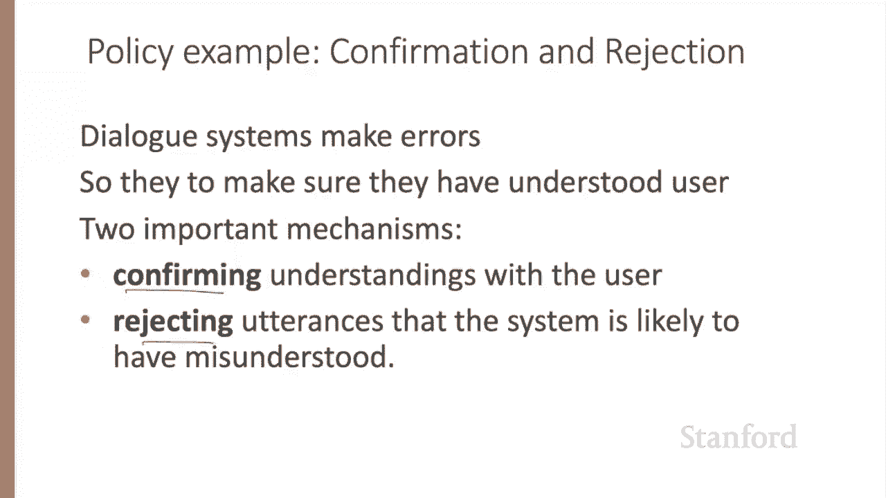
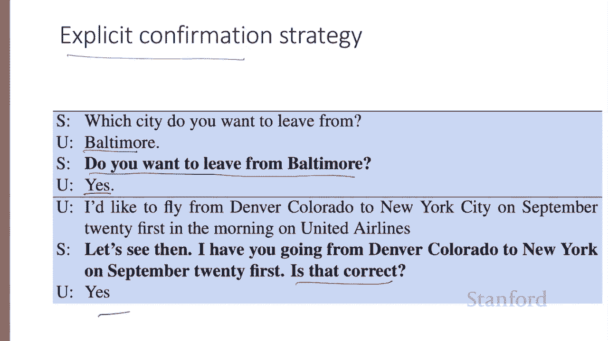
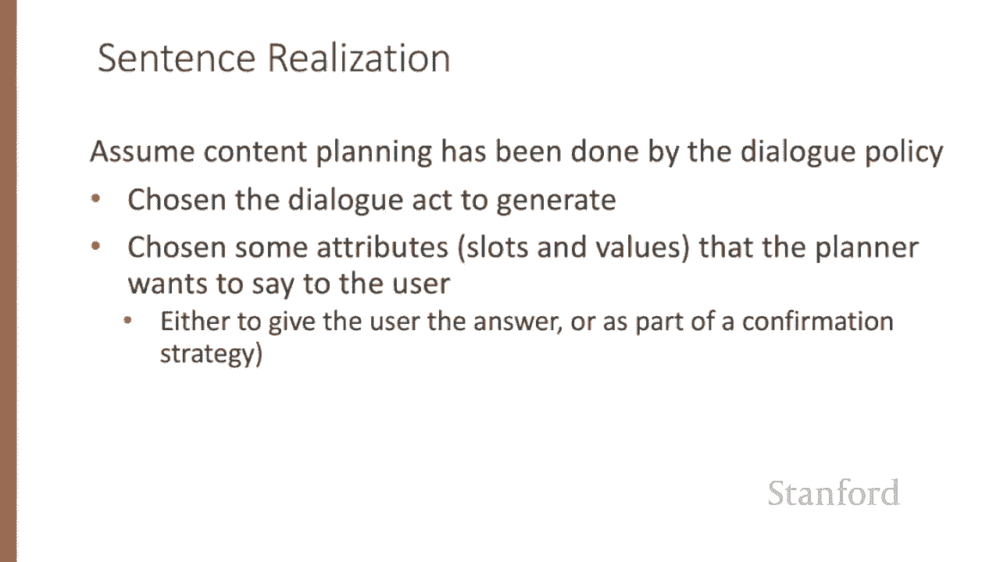
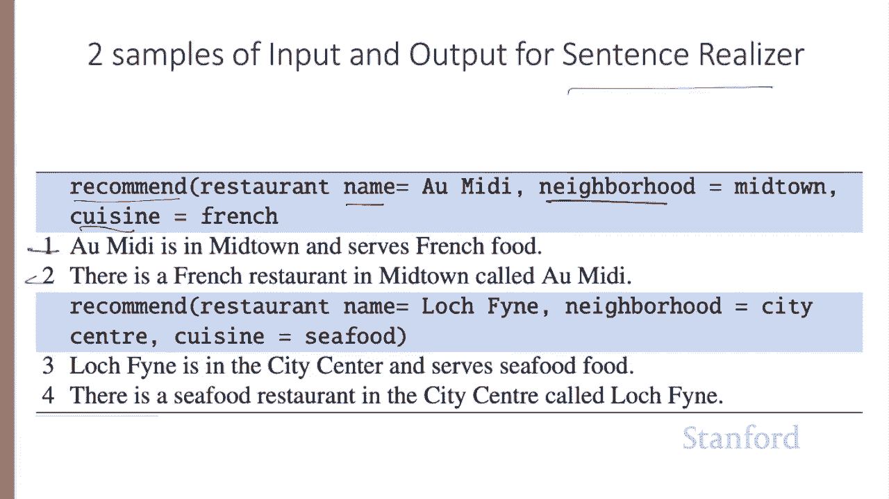
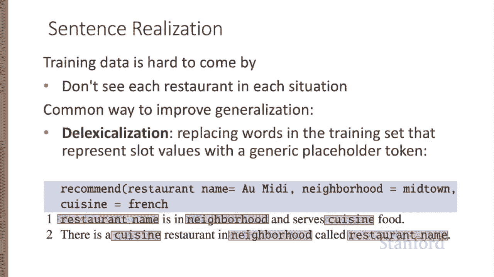
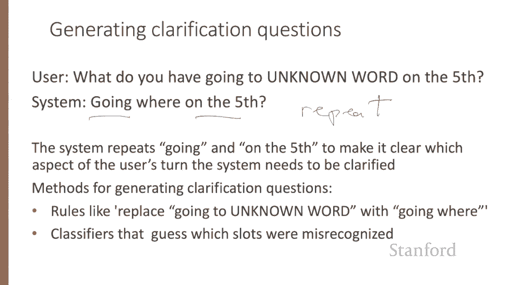

# P69：L11.7 - 对话状态架构：规则与泛化 - ShowMeAI - BV1YA411w7ym

Let's talk about dialogue policy， what to say， and dialogue generation， how to say it。

The goal of the dialogue policy is to decide what action the system should take next。

 That is what dialogue Act to generate more formally， at turn I in the conversation。

 we want to predict which action a sub I to take based on the entire dialogue state。

 The state could mean the entire sequence of dialogue acts from the system andll call those a for agent。

And from the user， in which case the task would be to compute the arg max over all possible next actions of the probability of the action。

 given this long sequence， Age said something user said something。

 Age said something user said something all the way。

We can simplify this by maintaining as a dialogueg state。

 mainly just the set of slot fillers that the user has expressed。

 collapsing across the many different conversational paths that could lead to the same set of filled slots。

So instead of conditioning on the entire previous state。

 we the condition simply on the current state of the frame and the previous thing that the agent said and the previous thing that the user said。

 and then again picking the AGmax over all possible next actions based on their probability。

These probabilities can be estimated by a neural classifier using neural representations of the slot fillers。

 for example， representations of the spans of words and the utterances， for example。

 a sentence embeddings computed over contextual embedding。

Modern dialogue systems often make mistakes， so it's important for dialogue systems to make sure they've achieved the correct interpretation。

 and this is generally done by two methods， confirming understandings with the user and rejecting utterances that the system is likely to have misunderstood。

When using the explicit confirmation strategy， the system asks the user a direct question to make sure it's understood user says Baltimore。

 the system says do you want to leave from Baltimore or the user says yes。

I'd like to fly from Denver to New York on September， so and so and the system says， let's see。

 I have you going from Denver to New York， blah， blah blah， is that correct， yes。

 an explicit question。

When using the implicit confirmation strategy， the system instead demonstrates its understanding as a grounding strategy。

 for example， repeating back the system's understanding only as part of asking the next question。

 I want to travel to Berlin， when do you want to travel to Berlin？

Explicit and implicit confirmation have complementary strengths。

Explicit confirmation makes it easier to correct the system's misrecognitions since the user can just answer no。

But explicit confirmation is awkward， increases the length of the conversation。

Those explicit confirmation dialogue fragments that we just saw sound non natural and non human。

 so implicit conversation， much more conversationally natural。

Confirmation is just one kind of conversational action by which a system can express lack of understanding。

 Another option is rejection in which a system gives the user a prompt like， I'm sorry。

 I didn't understand that。Sometimes utterances are rejected multiple times。

This might mean that the user is using language that the system is unable to follow。Thus。

 when an utterance is rejected， systems often follow a strategy of progressive prompting or escalating this detail。

 As in this example， the system didn't understand this long sentence from the caller。

 And instead of just repeating the question， when would you like to leave。

 the rejection prompt gives the caller more guidance about how to formulate an utterance the system will understand。

These， you can say， help messages are important in helping improve systems understanding performance。

It's common to use rich features other than just the dialogue state representation to make policy decisions。

For example， the confidence that the ASR system assigns to an utterance can be used by explicitly confirming only low confidence sentences。

Confidence is a metric that the speech recognizer assigns to its transcript of a sentence to indicate how confident it is in that transcription。

So a system might have a fourtered level of confidence with thresholds alpha beta and gamma。

 if the ASR confidence is very low， we reject， if it's slightly above that， we confirm explicitly。

 if we're pretty sure of the sentence， we confirm implicitly and if we're absolutely certainly know what they said and understood it。

 we don't have to confirm it all。Another common feature in confirmation is the cost of making an error。

 for example， explicit confirmation is common before a flight is actually booked or money in an account is moved。

Finally， once the policy has decided what Sp Act to generate。

 the natural language generation component needs to generate the text of the response to the user。

The task of natural language generation in the information state architecture is often modeled in two stages。

 content planning， what to say， and sentence realization how to say it。Here。

 let's assume content planning has been done by the dialogueo policy。

 which has chosen the dialogueog Act to generate and chosen some attributes like slots and values that the planner wants to say to the user。

 either to give the user an answer or as part of a confirmation strategy。

So here are some sample input outputs for the sentence realization phase。So in this first example。

 the Content Planner has chosen the Dialog Act recommend and some particular slots。

 the name of the restaurant Omi D and the neighborhood and the cuisine。

 and the goal of the sentence Realr is to generate a sentence like number one or number two here by training on many such examples of representation and sentence pairs from a large corpus of labeled dialogues。

Training data， however， is hard to come by， we're unlikely to see every possible restaurant with every possible attribute in the many different worded sentences。

So it's common in sentence realization to increase the generality of the training examples by delexicalization Dlexicalization is the process of replacing specific words in the training set that represent slot values with a generic placeholder token representing the slot。

😊，So we can delexicalize both of these two sentences by replacing Omidi， midtown and French。我了。

Restaurant name is in neighborhood and serves cuisine food。

Now， mapping from frames to delexxiicalized sentences can be done by encoder decor models trained on large hand labeled corpora of task oriented dialogue。

 The input to the encoder is a sequence of tokens that represent the dialogueo Act and its arguments。

 So the dialogueo Act recommend and the attribute value pairs。Service decent cuisine， no。

 might be represented as just a flat sequence of tokens， each map to a learned embedding。

And the encoder reads all the input slot value representations。

 then the decoder outputs the following delexxiicalized English sentence， name has decent service。

 and then we can use the input frame from the content planner to relexxiicalize。

 replacing restaurant name with OmiD， resulting in OmiD has decent service。

It's also possible to design NLG algorithms that are specific to a particular dialogue act。

 for example， consider the task of generating clarification questions in cases where the speech recognition fails to understand some part of the user's utterance。

While it's possible to use the generic dialogueog Act， reject， like please repeat。

 or I don't understand， we can do something more targeted。 For example， here。

 the system reprises the words going and on the fifth to make it clear which aspects of the user's turn the system needs to be clarified targeted clarification questions can be created by rules such as replace going to unknown word with going where。

Or by building classifiers to guess which slots might have been or misrecognized in the sentence。

We've now seen all the pieces of the dialogue state architecture。

