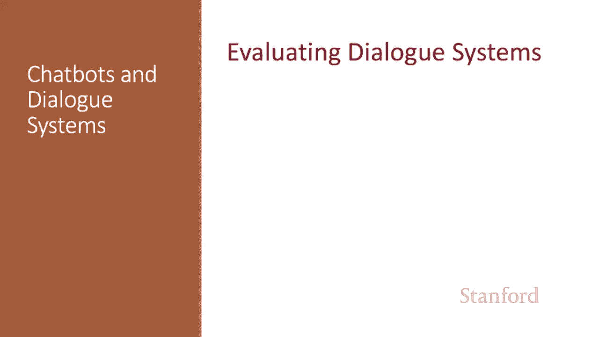
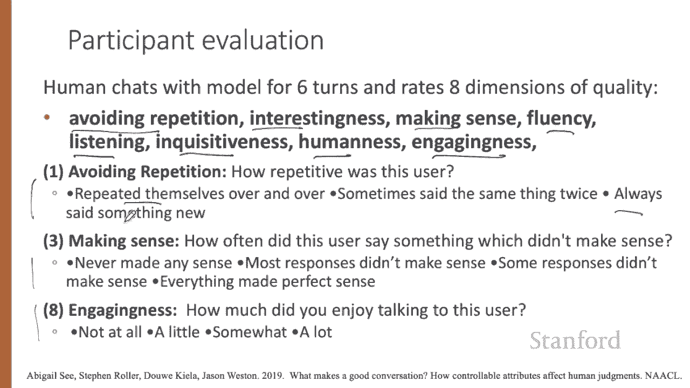
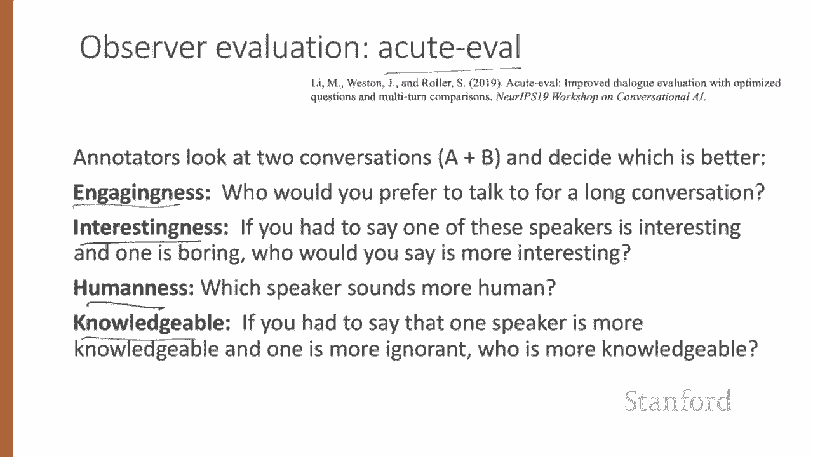
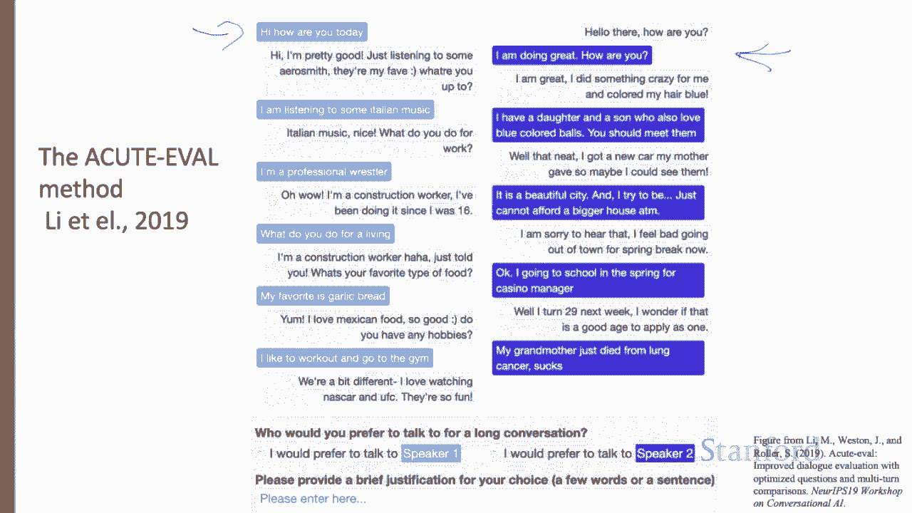
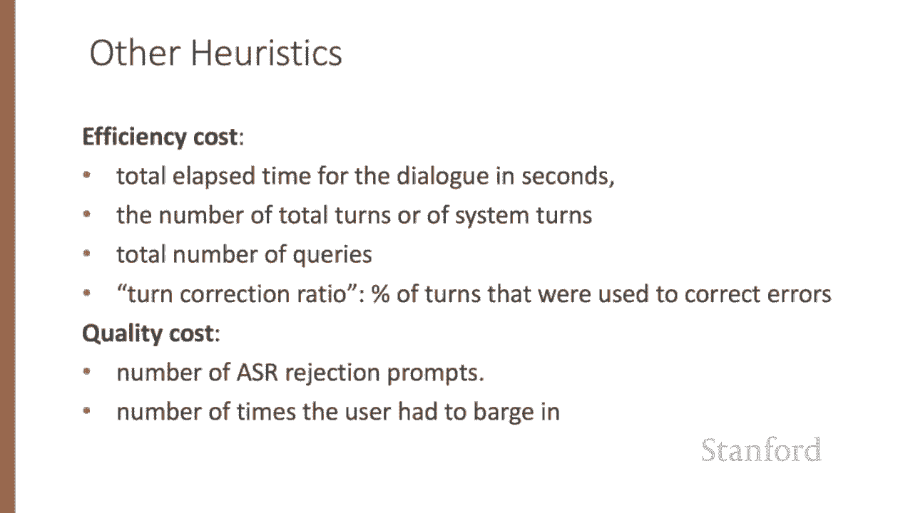
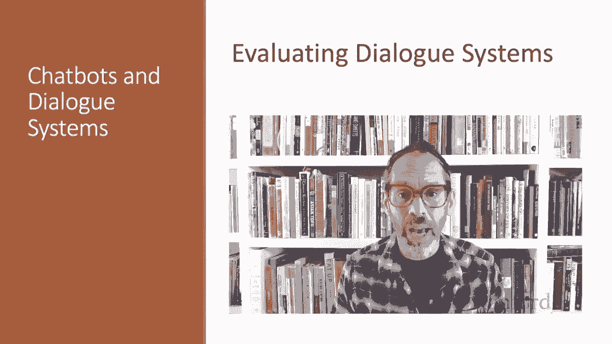

# P70：L11.8 - 评估对话系统 - ShowMeAI - BV1YA411w7ym

How do we evaluate dialogue systems？How can we tell if a dialogue system is fulfilling its goal？

Task based dialogue is evaluated mainly by measuring whether they succeed at their task。

 like booking the right flight。For chatbots， often the goal is to be enjoyable to humans。

 so chatbots are evaluated mainly with humans。Let's begin with chat box。

 we evaluate these by asking humans to assign a score。This can be the human who talk to the chatbot。

 which we call participant evaluation， or a third party who reads a transcript of a human chatbot conversation。

 which we call observer evaluation。In the participant evaluation used by C at all。

 the human evaluator chats with the model for six turns and rates the chatbot using liquid scales on eight dimensions。

 capturing conversational quality， avoiding repetition， interestingness， making sense， fluency。

 listening， inquisitiveness， humanness and engagingness。

So here we've shown three of those dimensions and a li scales。

 how repetitive was this user repeated themselves over and over to always had something new and so on。

Observer evaluations use third party annotators to look at the text of a complete conversation。

Sometimes we're interested in having Rars assign a score to each system turn。

 so we could ask Raers to mark how coherent each turn is。Often， however。

 we just want a single high level score to know if system A is better than system B。

The acute avalmetric is such an observer evaluation in which annotators look at two separate human computer conversations and choose the one in which the dialogue system performed better。

 answering questions about four properties， engaging this， interestingness。

 humanness and knowledgeability。

Here's an example of the acute Aval annotator task。

 comparing two dialogues and choosing between speakerea1 in light blue and speakerea 2 in dark blue。

Automatic evaluations like the blue scores used to evaluate machine translation， for example。

 are generally not used for chatbots， since blue scores correlate poorly with human judgments on chatbots。

Developing possible automatic evaluation metrics is an open research problem。

 One novel paradigm is called adversarial evaluation， inspired by the Tring test。

 The idea is to train a Tring like evaluator classifier to distinguish between human generated responses and machine generated responses。

 The more successful a response generation system is at fooling the evaluator， the better the system。

😊，How about evaluating task based dialogue？If the task is unambiguous。

 we can simply measure absolute task success。Did the system book the right plane flight or put the right event on the calendar？

A slightlylight more fine grained， we could measure the slot error rate。

 the percentage of slots filled with incorrect values。

 the number of mistaken slots over the number of total slots。Consider a system given this sentence。

 make an appointment with Chris at 1030 in Gs 104， which extracts the following candidate slot structure。

 person Chris， time 1130， room gates 104。Here， the slot error rate is one third since the time is wrong。

 Instead of error rate， slot precision recall and F score can also be used。

 and slot error rate is also sometimes called concept error rate。

We can also measure task success as well as the slide error rate。

To get a more fine grain idea of user happiness， we can also compute user satisfaction readings。

 where we have users interact with a dialogue system to form a task and complete a questionnaire。

 Here's some sample questions。 responsesses can be mapped to the same range and then averaged overall questions to get a total user satisfaction rating。

We can also measure other factors like efficiency via total elapsse time for the dialogue in seconds or the number of total terms or the number of system terms。

Quality cost measures other aspects of the interactions that affect users' perception of the system。

 One such measure is the number of times the AR system fail to return any sentence or the number of AR rejection prompts。

Similar metrics include the number of times the user had to barge in and interrupt the system。

We've seen standard ways to evaluate both chatbots and task based dialogue systems。

