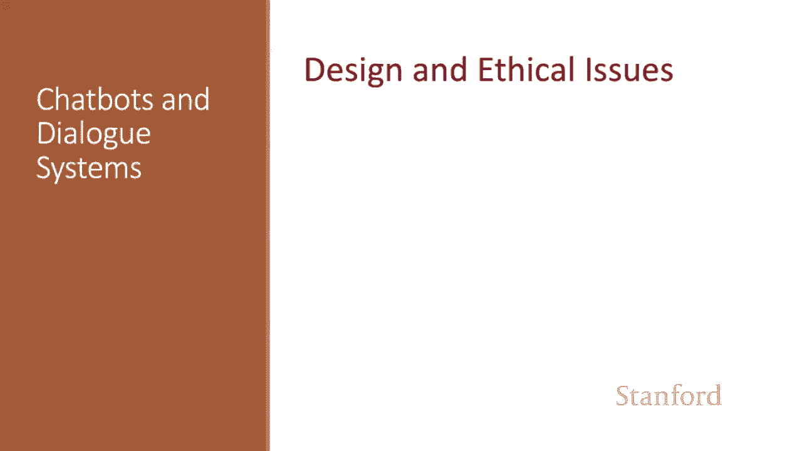
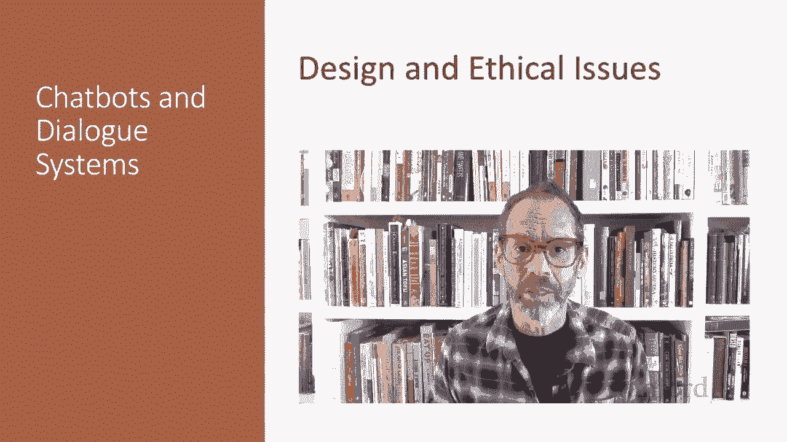
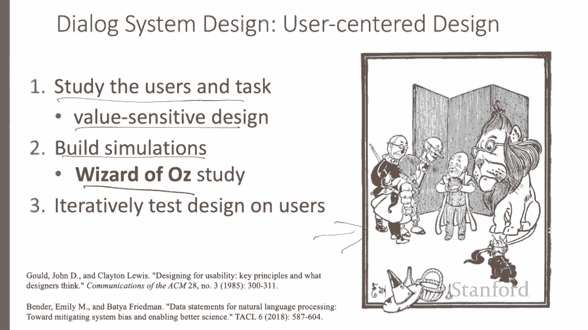
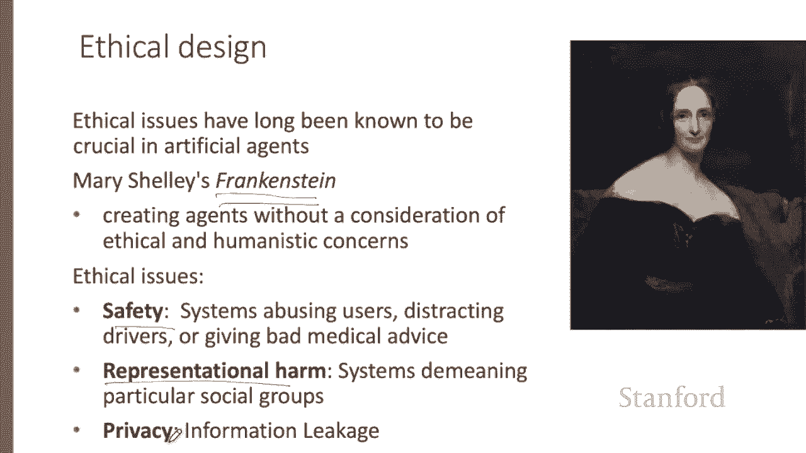
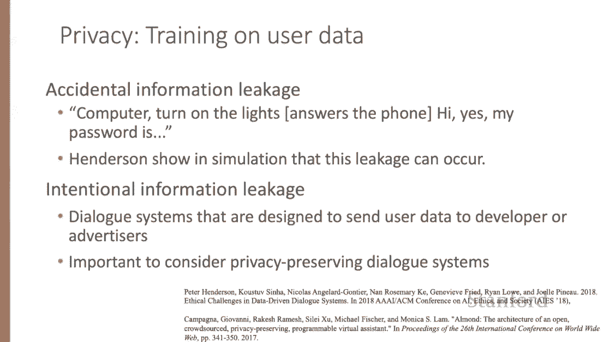
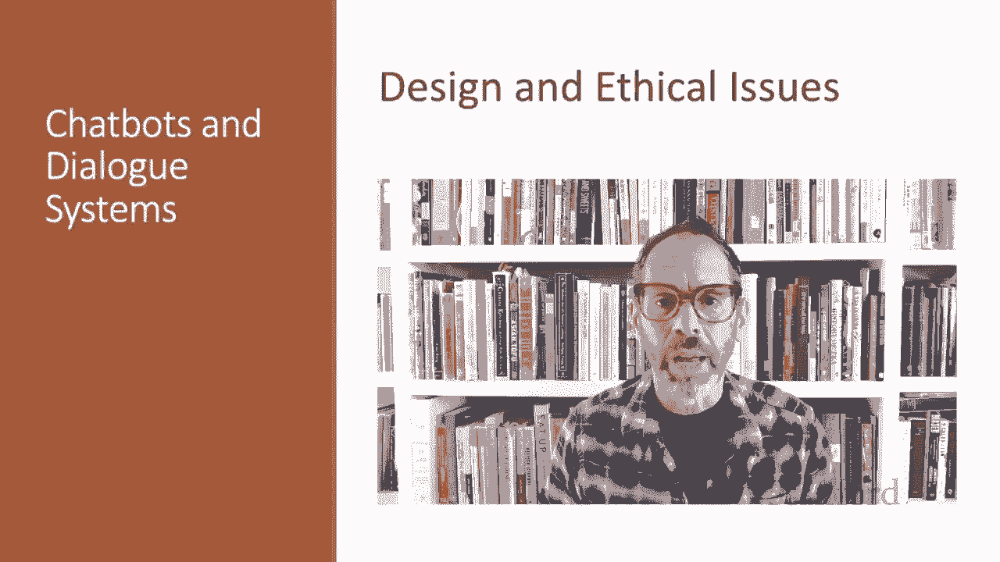

# P71：L11.9 - 设计方式与道德问题 - ShowMeAI - BV1YA411w7ym

Let's consider some of the ethical issues and design process for dialogue systems。

The user plays a more important role in dialogue systems than in most other areas of speech and language processing。

 and dialogue design is closely linked with the field of human computer interaction or HCI。

The design of dialogue systems follows user center design principles。 First。

 study the users in the task， understanding the potential users。

 the nature of the task by interviews with users or investigations of similar systems。

And it's important to incorporate value sensitive design in which we carefully consider during the design process the benefits。

 harms and possible stakeholders of the resulting system。Second， build simulations and prototypes。

 A crucial tool in building dialogue systems is called the Wizard of Oz system In wizard systems。

 the users interact with what they think is a software agent， but is， in fact。

 a human wizard disguised by a software interface。 The name comes from the children's book。

 The Wiizard of Oz in which the wizard turned out to be just a simulation controlled by a man behind a curtain。

Finally， we need to iteratively test the design on users。

Ethical issues have long been known to be crucial in artificial agents。

 Mary Shelley first raised these issues over 200 years ago in Frankenstein。

 which brought up these issues of creating agents without a consideration of ethical and humanistic concerns。

Among the many issues with ethical dimensions are safety。

 we don't want drivers crashing because they're distracted by a chatpot， representational harm。

 we don't want systems demeaning particular social groups， and privacy。

 we don't want systems divulging private information。

Safety is very important as dialogue systems migrate into the real world。

 If we're building chatbots for mental health， it's extremely important not to say the wrong thing。

 If we're building chatbots to talk to people in cars。

 the chatbots must be aware of the environment and the driver's level of attention。

A well publicized instance of abuse and representational harm occurred with Microsoft 2016 Tay chatbot。

 The chatbot was given the personality of a young woman communicating informally and was designed to learn from users via IR。

Tay began posting messages with racial slurs， conspiracy theories， and personal attacks on its users。

And was taken offline after 16 hours。So it's very important that user responses have to be modeled via prototyping。

These kinds of abuse turn out to exist in the data sets use to train most dialogue systems。

Henderson at all found bias in hate speech in lots of standard dialogue training sets and in the dialogue models trained on them。

Finally， privacy is important， especially for ubiquitous dialogue systems。

Henderson and all show that any dialogue system can have accidental leakage of things like passwords。

And many dialogue systems have intentional information leakage by sending information to the corporate developer or advertisers Compan you and all show that it's possible to design privacy preserving dialogue systems。

It's important to keep the user and the potential harms in mind when designing dialogue systems。

