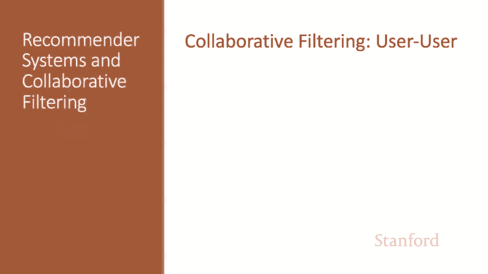
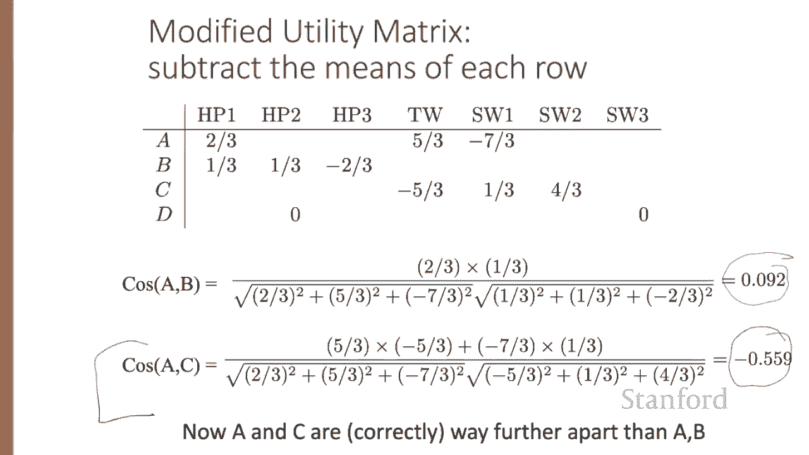
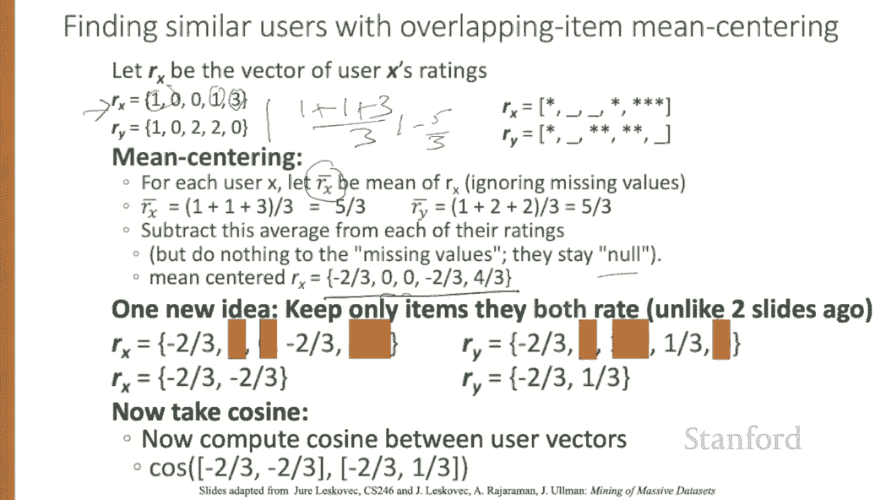
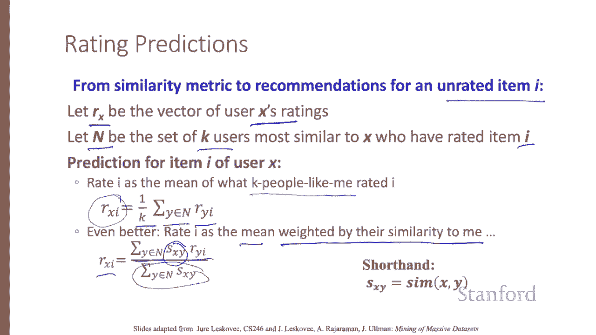
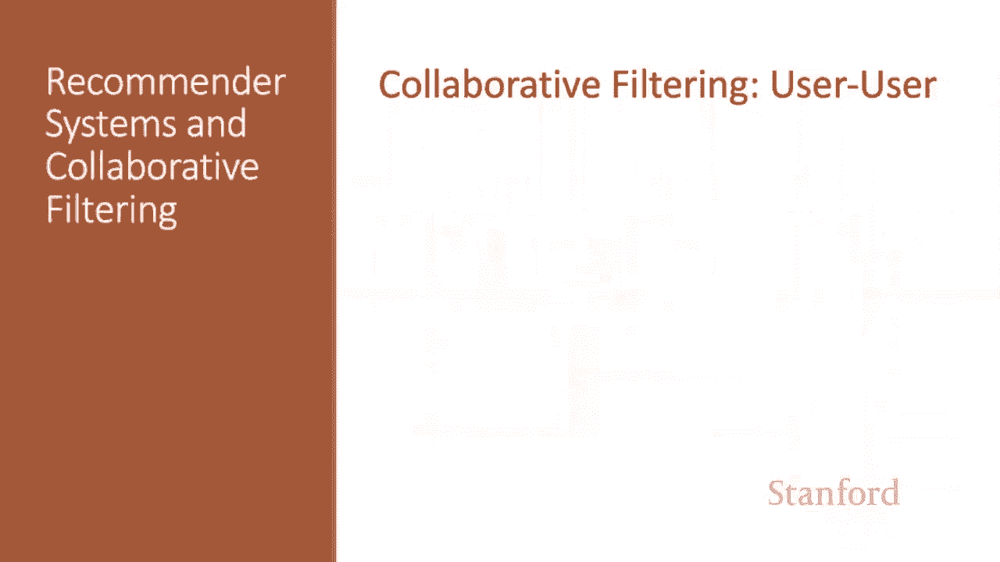

# 【双语字幕+资料下载】斯坦福CS124 ｜ 从语言到信息(2021最新·全14讲) - P74：L12.3 - 基于用户的协同过滤 - ShowMeAI - BV1YA411w7ym

We turn now to collaborative filtering， beginning with the user user version。

In collaborative filtering， instead of using the content features of items to determine what to recommend。

 we're going to find similar users and recommend items that they like。

Let's see the user user version of collaborative filtering。

Consider we have user X and we have some item I they haven't rated。

Let's say we've learned something about userX's preferences on other items。

Now we find a set of N other users whose ratings are similar to X's ratings。

And now we estimate x's unknown readings。Like the ratings for I。

Based on the ratings of the users in N。So we'll need to find similar users and recommend items they like。

To find similar users will represent them by their rows in the utility matrix and say that they're similar if their vectors are similar。

So perhaps users A and B are similar because they both love Harry Potter one。And maybe A and C。

 we'd like them to be dissimilar。 A loves twilight。S love Star Wars。

But they both hate the opposite one。Okay， let's turn those ratings into vectors。

 Suppose two users have the following star values for five items user X has one star for item one。

And three stars for item 5 and so on。 And no ratings for items 2 and 3。Let's for the moment。

 represent a blank rating by a zero。Now we can just compute the similarity with cosine。

 we know how to do that。But this representation has a problem leading to unintuitive results。

Consider our utility matrix again。We'd intuitively like A to be much more like B and very different than C。

 A and C had exactly opposite opinions。But cosine doesn't treat that one as a negative rating。

 and it doesn't properly treat a lack of rating as uninformative， treats a zero as very close to one。

So we'd like similarity of A B to be much greater than similarity of A C。 but in fact。

 if we compute the cosines， the simulatorities are very similar。 Yes。

 A is a little more similar to B than to C， but only a little。

The problem with cosine is that it doesn't really capture how opposite a is from C。

And another problem is we'd like to normalize for Raers。 For example。

 Raer D ratess everything the same。 Their ratings are not informative。

We'd like a way to treat the zeros as uninformative， the low numbers as negative ratings。

 and people who like everything the same as not helpful。The solution is to mean center the users。

 subtracting the means from each row。So this row。We added up four plus5 plus one。Over three。

That's 10 third or 3 and a third。 If we subtract 3 and a third from 4， we get two third。 So。

 and from 5， we get five third and so on。 So for each row， we compute its mean。

And then subtract it from every element。 We don't subtract from the null values。

 and we leave them as0 in the end。Now， a0 means no information。

 zeros can happen because we have no rating at all， or because the rateer is uninformative。

 Notice that Raer D rated everything the same。 And now these opinions about these movies is no longer informative。

Now a very low rating has become negative。And opposite opinions。

Are reflected in vectors that have opposite signs and will point in different directions。

This kind of mean centering is useful in many problems in processing natural language and data。

 whenever we have a scale like rating or sentiment that intuitively has both positive and negative ends。

 and when we have values with no ratings。Now， if we compute the cosine in the mean centered utility matrix。

 notice that A and C have opposite values， and their vectors are very， very different。 Indeed。

 their cosine is negative。

A quick terminological note subtracting the mean as mean centering， not normalizing。

 normalizing is dividing by a norm to turn something into a probability。

But the textbook and common usage sometimes overloads the term normalized。

 so you'll sometimes see this called normalization。All right。

 let's see the final modified version of cosine we're going to use。

 we're going to make one more change。So we have our vectors of user ratings。And for each user。

 we compute the mean ignoring missing values， so the mean for Rx is 1 plus1 plus3 over3。Or five3s。

 and it turns out to be the same for user Y。Then we subtract this average from each of their ratings。

Doing nothing to the missing values， the missing values stay no。 So now mean centering user X。

 we get1 minus5 thirds。 that's negative two thirds and so on。 We don't change the zeros。

Now we're going to add one more change， we're only going to keep items that both users rate。

So here we're going to remove these three items that weren't rated by both users。

Get two shorter vectors。And take the cosine between these shorter vectors。

In summary， here's the mean centered overlapping item cosine similarity algorithm for user user similarity instead of the basic cosine similarity between user X and user Y。

The mean centered overlapping item cosine similarity。

 We only look at items rated by both users X and Y， and for every such item。

 we subtract out the mean for each user and now take the mean centered overlapping item cosine。

It turns out， by the way， that mean centered overlapping item cosine similarity is a slight variant of the Pearson correlation。

Now that we have a similarity function， we can see how to make recommendations for some unrated item I。

 let R sub X be the vector of user X's rating and N be the set of K users most similar to X who've rated item I。

The prediction for item I of user X， we could just say。

 take the mean of what the K people like me rated。 So we take the K users in N。

 and for each user Y we take that user's rating for this missing item I。 and we just averaged them。

 That's our predicted rating that X would give to I。Even better。

 we could rate I as the as that same mean， but weighted by those those other users similarity to me。

 So our estimate of X's opinion about I is the sum over the similar neighbors of their opinion about I weighted。

By how similar they are to x。And divided by the sum of those similarities to normalize。

We've now seen the user user version of collaborative filtering。

