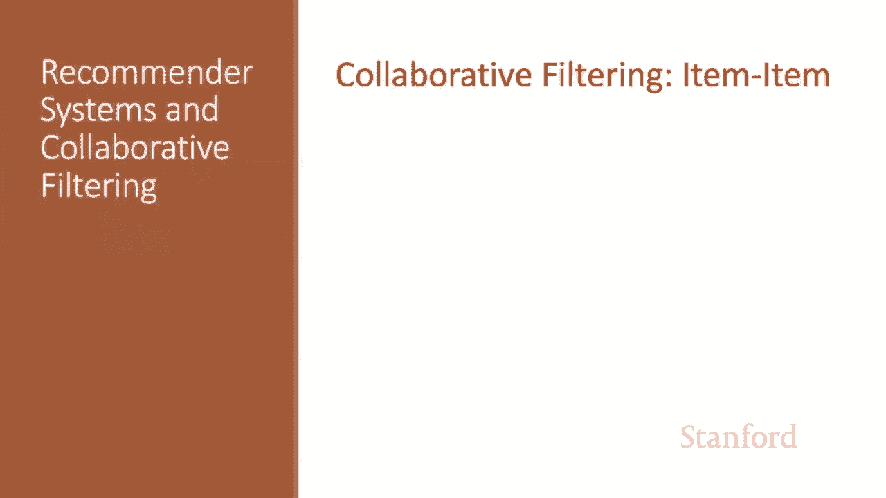
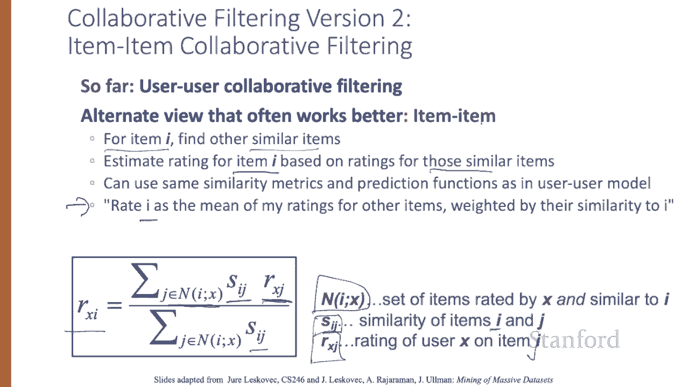
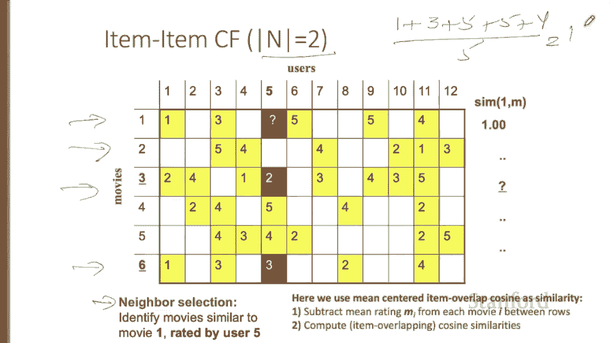
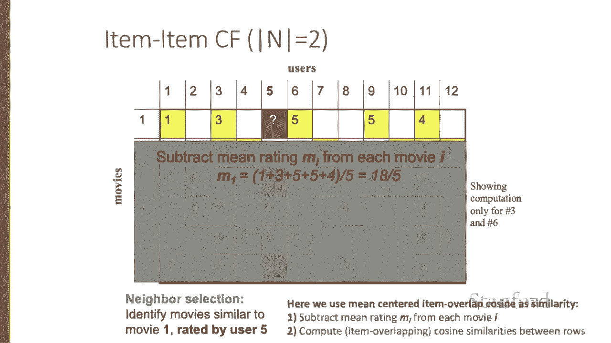
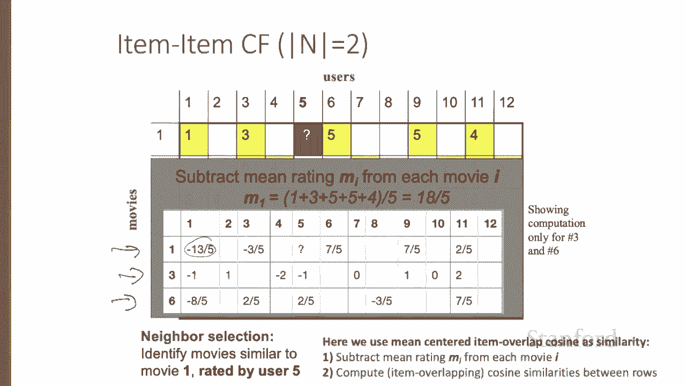
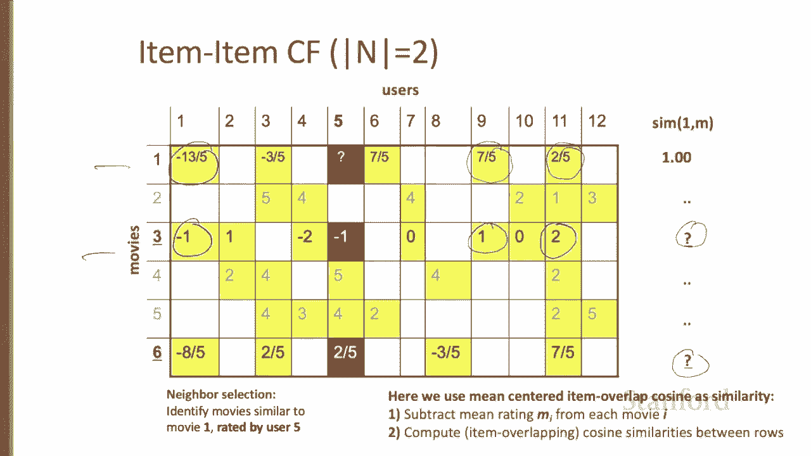
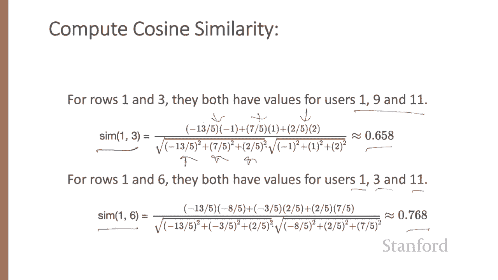
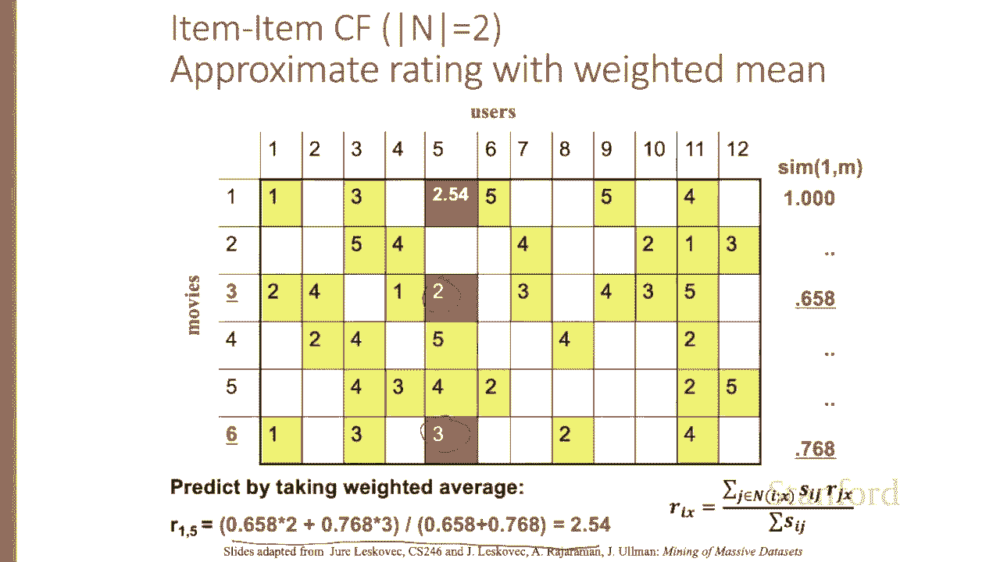
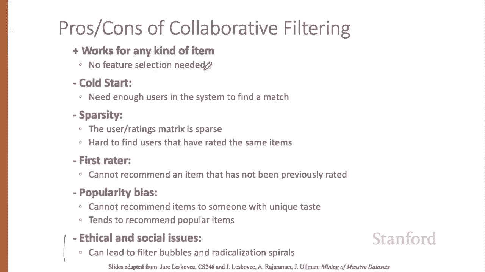

# 【双语字幕+资料下载】斯坦福CS124 ｜ 从语言到信息(2021最新·全14讲) - P75：L12.4 - 基于物品的协同过滤 - ShowMeAI - BV1YA411w7ym

Let's now see a different version of collaborative filtering called Item Item。

The user user collaborative filtering algorithm we saw recommended items that other users who are like you also liked。

An alternative view that often works better is called item item collaborative filtering。

Here we recommend items that are like items that you like for a given item I。

 we find items that are similar， and we estimate your rating for I based on ratings for those similar items。

All of the similarity metrics and prediction functions can just be as they were in the user user model。

So the algorithm is rate and unseen item I as the mean of my ratings for other items weighted by their similarity to I。

So more formally， let's suppose we have a set N of items rated by me and similar to this unseen unit I。

 let's call it too。 let's say we have two similar items for each of those similar items。

 we have my rating， I'm X my rating on that on that item， that should be a J。

We have the similarity of that rated item to my und item I。So my rating， I X again。

 my rating on I is the sum over all the items that are like I of my rating weighted by their similarity to I。

The weighted mean of my ratings for other items that are similar to I。

 weighted by their similarity to I。

Let's walk through an example again。Here's a utility matrix for users rating movies。

 and we'll set n equals2， meaning we'll be rating an unknown movie by averaging the two most similar movies that are rated by that user。

Let's say we want to know what would user5 think about Mo one？

So we're going to try to fill in that cell。First， we have to do neighbor selection。

 we want to find the two movies we picked n equals two that are most similar to Mo1 and are rateed by user 5。

And we're going to use mean centered item overlap cosineus similarity。

 so we're going to compute the mean rating for each movie。

 so for each row and subtract it from the whole row。

And then we'll compute item overlap cosine similarities between rows to find which movies are most like Movie one。

I'm going to give you a hint， it's going to be movies three and Mo six。

 so I'll just show the computation for those two。First we need to do mean centering for each movie。

 so we're going to take the mean of row1， what's the mean of row 1。

 it's one plus3 plus5 plus5 plus4 over5， it's going to be 185s。

There it is， written now needly。

And if we do that for the three movies we're talking about the unseen unrated movie one and the two that are going to be the nearest neighbors movie3 in Mo6。

 we computed separate means for Mo three and the separate mean for Mo6 and subtracted out those means。

 so now the low low ratings like one have become negative。

Now we just need to compute that cosine to see how similar these movies are to Mo one again I'm just computing it for Mo three and Mo6 so this video doesn't become endless。

So for movie one and movie three， we do the item overlap cosine。

 so we're going to be computing the dot product and that means we're going to be multiplying。

Elements for user one。User 9 and user 11， None of the rest have elements in both in both vectors。

 So we'll be treating these as if they're vectors with three elements。

So here are the cosines for rows1 and three， they both have values for those three users，  one。

9 and 11。And here's our cosine with our three values and our three values。And for worlds 1 and6。

 they have values for users one，3 and 11， so we get our two cosines。

 so our similarities of movie three to Mo one and Mo6 to Mo 1。658。786。

We can put that 6，58 and that 7，86，76，8， I'm sorry in this column in real life， of course。

 we'd have to compute the similarity of all the movies to Mo1 in order to find the two most similar。

 but I'm cheating by telling you that all the other estimates are smaller so we just need the two most similar movies because we're doing n equals 2。

So now we just take the weighted average of this two and this three to fill in the blank for Mo one。

If we took the non weighted average， the non weighted average of two and three is two and a half。

It turns out the weighted average， here's my computation down here， is slightly different。

 and it turns out weighted averages work slightly better。Basically。

 it's saying movie6 is slightly more similar to Mo1 than movie3 is to Mo1。

 so we're going to wait movie6 a little more。

In practice， item item works better than user user。Why is that？

Items tend to be classifiable in simple terms。 For example， music tends to belong to a single genre。

 It's hard to imagine how a single piece of music could be both a Beyonce song and Bach baroque。

On the other hand， there are individuals who like both Beyonce and Bach and who listen to both。

 Furthermore， items are relatively constant。 A bach fugue is always a bak fugue。

 but people are dynamic。 Their tastes change。The consequence is that it's easier to discover items that are similar than users that are similar。

In summary， collaborative filtering works for any kind of item。

 we don't need to define a set of features that define the item。On the other hand。

 collaborative filtering has some minuses。It has a cold start problem。

 whether we do item item or user user similarity， we need enough users in the system to find matches。

We have a sparsity problem， the user ratings matrix is sparse。

 it can be hard to find users that have rated the same items。

It's hard to recommend an item that hasn't already been rated， that's called the first Raer problem。

There's a popularity bias， we can't recommend items to someone with unique taste。

 we tend to recommend popular items， and it can lead to all sorts of problems we'll have to deal with。

 like filter bubbles and radicalization。

We've now seen both the user， user and item item versions of collaborative filtering。

