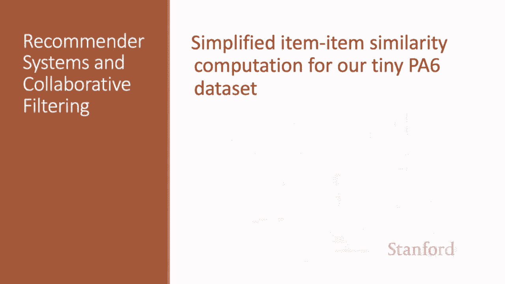
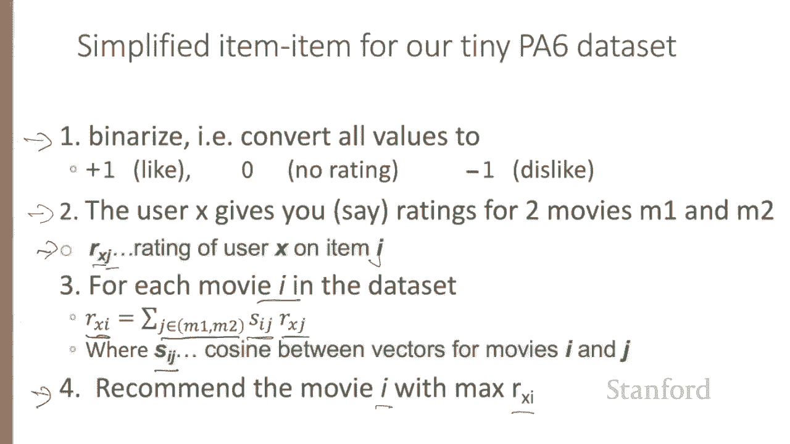

# P76：L12.5 - PA6数据集上的简单物品协同过滤 - ShowMeAI - BV1YA411w7ym

For our data in programming assignment6， you're going to implement a simplified version of item item collaborative filtering because it happens to work better on our tiny data。

First， for this problem， we're going to be converting all the values to plus 10 and minus-1。

 So instead of our movies by users utility matrix looking like this， it's going to look like this。

 so everything will be one for like，0 for no rating and minus1 for dislike。

So assuming you've boized in that way， here's some tricks that the TAs recommend that just happen to work better for our tiny little data set。

First， don't mean center the users， just keep the raw plus 10 and minus1。And second， don't normalize。

 so don't divide the product by the sum。 So when we're computing our rating of user X on item I as the sum over all the similar items J of our rating on J。

Waied by the similarity between I and J and then normalized。 Don't do the normalization。And finally。

 don't use mean centered item overlap cosine to compute the similarities just use plain old cosine。

So in summary， here's the algorithm you want to use for our tiny data set， by and rise。

Now the user X gives you ratings for let's say two movies M1 and M2。

 so we have ratings from user X on each item。Now for each movie I in the data set。

We get our ranking on Mo I by summing over the two movies the user gave you the rating that the user gave for movie J times the similarity of Movie J to the movie I we're trying to read。

And for similarity， we'll just use plain old cosineine between the vectors。

 and then we'll recommend the movie I that has the maximum R subx I。

So the computation for PA6 is much simpler。