# 【双语字幕+资料下载】斯坦福CS124 ｜ 从语言到信息(2021最新·全14讲) - P78：L13.2 - Pagerank：简介与马尔可夫链 - ShowMeAI - BV1YA411w7ym

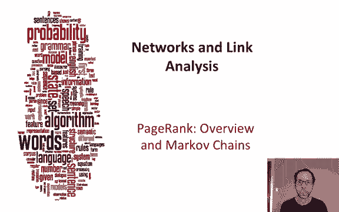

Let's talk about PageRnk， one of the most important uses of link analysis。

And we've talked a lot in information retrieval about using the overlap between the query and the document in terms of words and we talked about TFIDF counts。

 but there's more than just word overlap that tells us a page is good and one instinct is that a page that's very popular is a good page how do we measure popularity well one simple measure might be just look at who gets pointed at a page that's pointed to by lots of other pages that's probably a good page。

And one way to do that is to use link counts， we'll just count the number of links to a page and maybe will combine that with the text match score。

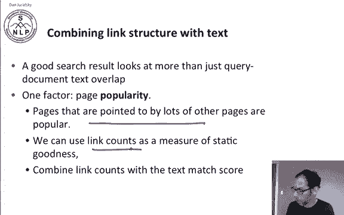

So you can imagine two ways of using link counts to simply measure the popularity of a page。

 One is the undirected popularity of a page。 undirected popularity is also called degree De is just the number of in links plus the number of out linkss。

 the total number of links related to a page So here's a page called that page B and B has five has three in linkss and two out linkss so it's a total of five links so that's the degree of B these degree is5 and we could use that as a page score。

Alternativelyly we might just choose to use the number of in links that people point to me maybe I'm important so we could use the number three the in linkss as a kind of directed measure popularity these is fine。

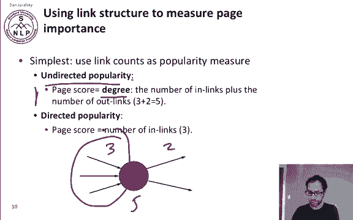

Now the problem with simple link counting popularity is that it's very easy to spam。

 and this is true whether we use the degree of a node。

 the total number of in linkss and out linkss or just the number of in links。

 let's look at a question about this。

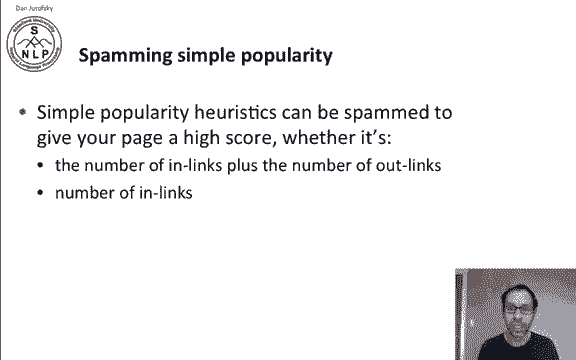

So the intuition of Page ranknk is instead of just counting the number of in linkss and out linkss。

 we're going to wait a link as more important if it comes from a page that's more important itself。

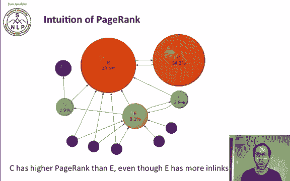

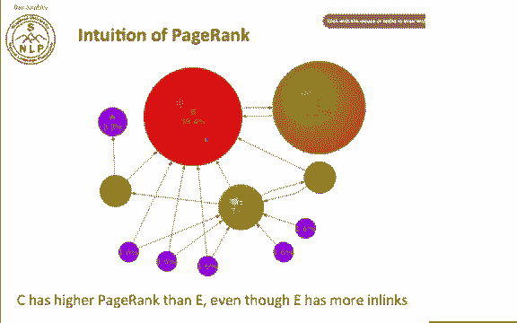

And here's a graphical representation of this idea。Here E has a lot of links。

 it's got six links coming in and some coming out。Whereas C only has one link coming in。

 but C's one link coming in is from B a very important page and so the institutiontu of Page rank is we'd like to measure not just how many links come in。

 but who the links are from and if a link is from a much more important page we're going to wait that more importantly and we're going to come up with an iterative algorithm for measuring the importance of a page and then passing this importance along the links。

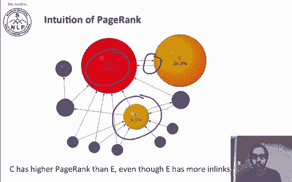

So imagine a browser doing a random walk on web pages we'll start at a random page and at each step we go out of the current page along one of the links on the page echo probably so if a page has three links with probability onet will take the first link and probability one third will walk along the second and probability one third will walk along the third and the intuition of page rank is that in the steady state after a lot of walking around each page has a long-term visit rate and we're going to use this as the page score so the long-term visit rate。

 we're going to use this as the score and that's going to be called the page rank of the page。

Now just a random walk isn't quite good enough because the web is full of dead ends if you do a random walk and you get to a page and imagine the page here's an node C and C has no out links。

 just in links and so if randomly walk we can't walk away from C we're stuck in C。

So we're going to add one more thing to our random walk。

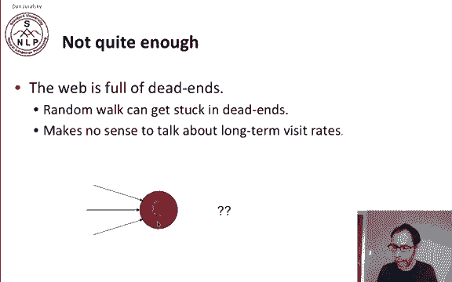

And that's called teleporting here's how teleporting works When we get to a dead end we just jump to any random web page whatever the number of pages in the entire collection is。

 the whole web if it is， we just jump to one of those random pages if we're at a nondead end with probability 10% let's say we still jump to a random web page but with the remaining probability the 90% probability will' go out on a random link and that 10% is a parameter that we'll call alpha so。

Teleporting， if we're at a dead end， we jump to someplace random， if we're not at a dead end。

 we still might jump to someplace random or we'll follow a random out。

 So now we've modified our random walk to solve the problem of dead ends。

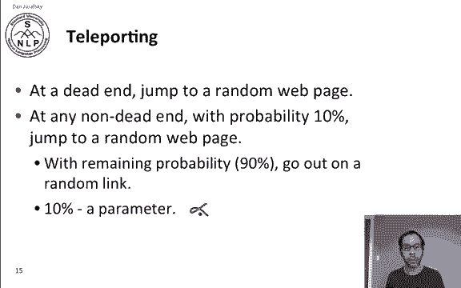

So teleporting means we can't get stuck locally， and it also lets us compute a long term rate the page rank at which any page is visited。

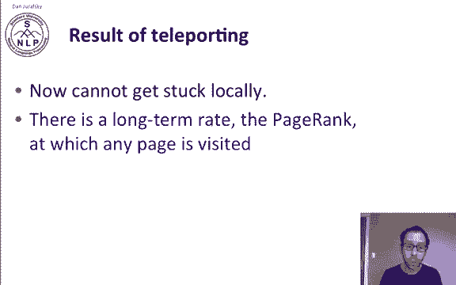

To see how to compute this， we're going to have to start with Markov chains。

So now we'll Markov chain。Has a set of states and states。

And a transition probability matrix and n by n transition probability matrix P。

At each step in a Markov chain， we're at one of the states。

And the entries of P P of Ij tells us the probability P of J given I。

 the probability that we're in state I， we're going to go next to state J so here we're in state I and P of Ij says here's the probability that we're going to go to state J。

 So if we look at I， we look at all the links out of I。Those probabilities must sum to one。

 so the probability for a given eye of all the Js we can go to， those sum to one。

 it's a probability conditioned on I。

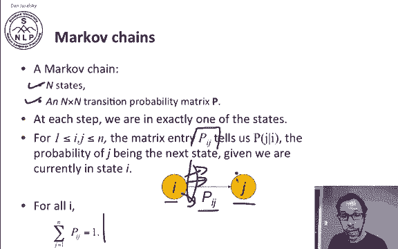

So let's look at an example， here's a little Markov chain， so we have three nodes， A， B， and C。

So if we're in A， the probability of going to B is 0。5， the probability of going to C is 0。5。

 If we're in C， we're definitely going to go to A and if we're in B。

 we're definitely going to go to A。So everything sums up to one， the given A。

 the probability of going to B is 0。5 and C is 0。5 that sums to one。

 and the other two also sum to one。So we can build a little transition probability matrix。

So here's ABC。ABC， So for in A， the probability of going to a and the next step is zero。

 there's no self loop here on A。If we're in A that probably going to be is 0。5， there's that。

 and they're probably going to C is 0。5， there's this and so on。

So we can fill out that probability matrix and we're going to be using this kind of transition probability matrix to talk about page rank。

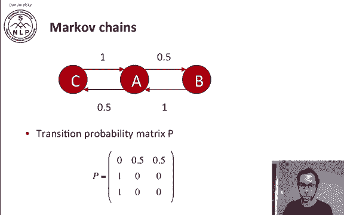

So a Markov chain is an abstraction of a random walk and we're going to use it to talk about the random surfer surfing the web。

 so each state of our Markov chain is got to represent one web page and the transition probability will represent the probability of moving from one page to another and we can generate this transition probability matrix P from the adjacency matrix of the web graph and adjacency matrix just has one if two pages link to each other and zero if they don't。

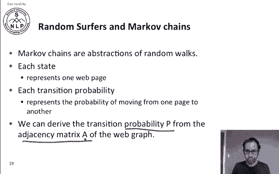

So， more formally。For at some node in the web and the node has no out links。

 the random surfer will teleport and the transition probability to each node in the entire end node graph is one over n。

 so if there's end pages on the web and we're at one page and a dead end page。

 then with probability one over N we'll go to any of the pages in the whole web。

But if a node does have outgoing links， let's say it has K， K greater than 0 outgoing links。

 Then with some probability alpha alpha between 0 and 1。The surf will teleport to a random node。

And the probability since there's n possible nodes in the web is alpha over n。

And with the remaining probability， 1 minus alpha， we'll take a normal random walk。

 and we said there there's k outgoing links from this particular page。

 and so with that probability 1 minus alpha we'll take one over k of those for each of the possible K outgoing links。

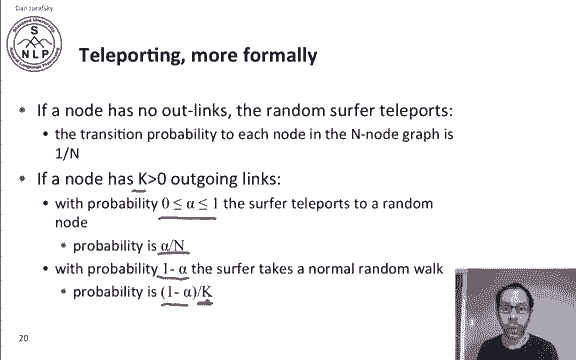

So let's suppose we had the adjacency matrix of the web graph。

 so a subi J in this matrix is one if there is a hyperlink from page I to page J。

 so just a 10 matrix。Expressing the structure of the web， one between I and J。

 if there's a link from I to J。

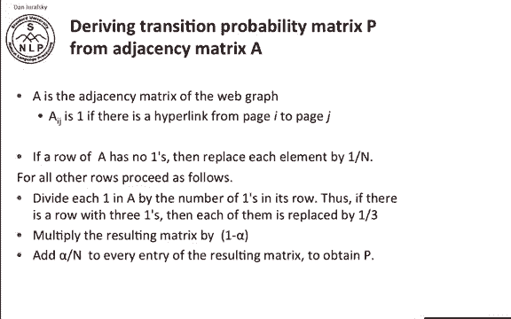

Now， here's how we're going to derive our transition probability matrix P。 If node I is a dead end。

 then it's row。 The row of the a matrix will have no ones because the there's a0。

There are no outgoing links， so there are no ones in its row。So if that's the case。

 we're going just going to replace each cell with one over n。

 So one the probability for that node of going to any place on the web is one over n for any other row。

 So rows that do have outgoing links， we're going to proceed as follows First。

 we're going to normalize， so we'll divide each one in a by the number of ones in its row。

So if there's a row that has three ones， it'll turn them all into one thirds。

 so we're getting a probability matrix here。 Now we're going to multiply that by one minus alpha。

 So if with probability 1 minus alpha， we're just going to go to a random outgoing node from on our link。

 take one of our random outgoing links。And now we're going to add alpha over n to every entry of the matrix。

 so with probability alpha over n， we're going to go to some other random place。

Let's look at an example here we have another little sample of the web。

 a little miniweb with only three nodes， node 1， node 2 and node 3。

 and the adjacency matrix A for this little example we'll have from node 2。

 we can get to node 3 and node 1， from node 1， we can only get to node 2 and from node 3。

 we can get to node 2。So here's our adjacency matrix，  one，2，3， one，2，3， so from node  two。

 we can get to nodes1 and nodes 3， from node 3， we can get to node2 and so on。

Now let's consider computing the transition probability matrix from this adjacency matrix。

 and let's start with the simple case where alpha equals0， meaning there's no teleporting。

 so in that case all we're really doing to compute P is we're going to normalize a into a probability matrix so each row sums to one because the outgoing nodes from each node must be a probability where going to each link with its probability。

So this row is already normalized。 This first row is already normalized。

 And here in the last row is normalized。 So we just need to normalize this and turn all those ones into 05s。

 So there is our。Alpha equals0 probability transition transition probability。

 So there's our alpha equals 0 transition probability matrix。Now the more interesting case。

 of course， happens when we have some other alpha， so let's think about a different alpha alpha equals 0。

5， where we do have a possibility of teleportation。So now。

Let's look just at this first row and we'll recompute that for alpha equals 0。5。

 So how do we compute that for the first row， We said with probability alpha。

 we're going to teleport。To any place on the web and there's three nodes in this little miniweb and equals 3。

So with probability alpha， this vector will be1 over n，1 over n。

1 over n with probability1 minus alpha， we're going to go to each node with its outlink probability and we can only go from node1 to node 2 and we do that with probability1。

So with 1 minus alpha， we're going to take that set of transitions。And alpha we said is 0。5。

 so that's 0。5 times this vector plus 0。5 times this vector， and that's going to be 1 sixth。Two。

 thirds。And then one， sixth。 So that's going to be the first new row of this vector。嗯。

Let me clear that off。And sure enough， 16， two thirds， 16。

 and we do the same computation for each of the two rows。

 so here's the new transition probability matrix， assuming a 0。5 teleportation probability。

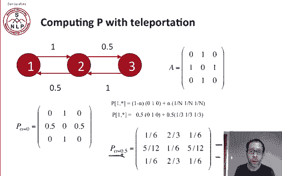

So we've introduced the intuition of Page ranknk， talked about Markov chains and how to think about the transition probability matrix and how to compute that with the teleportation probabilities。

In the next section， we'll look at actually the computation of Page ranknk itself。

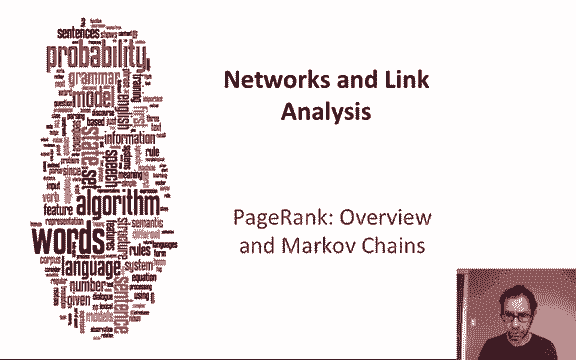