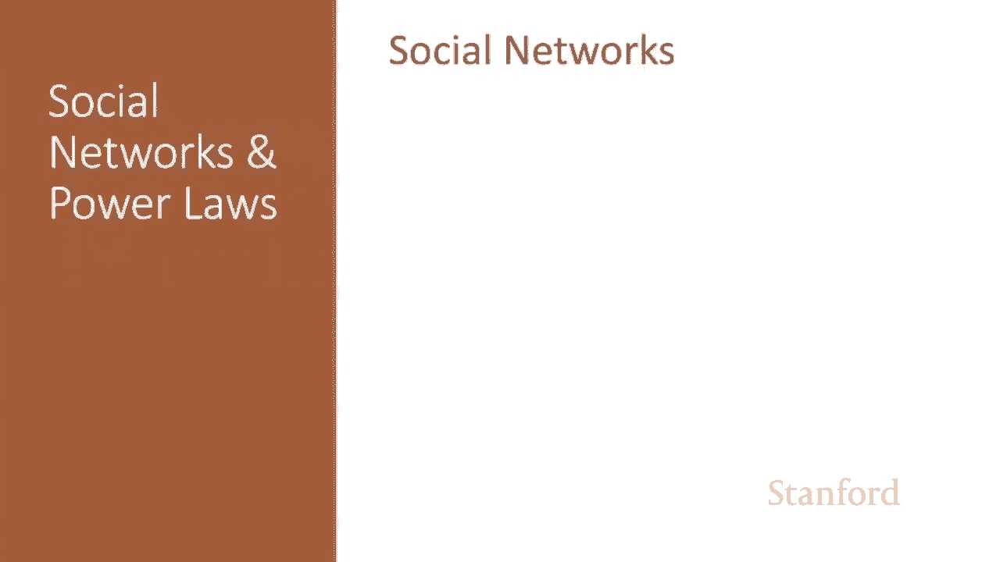
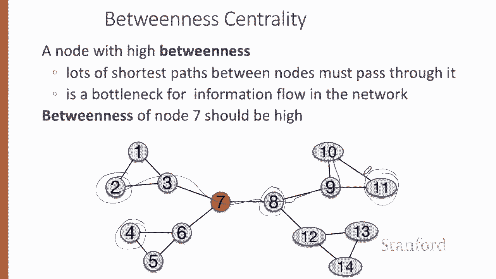
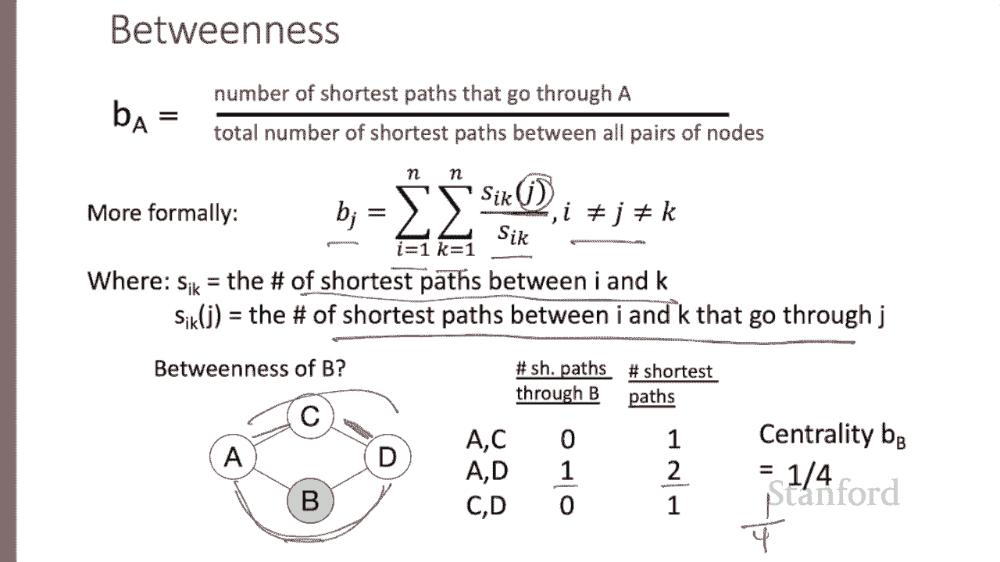
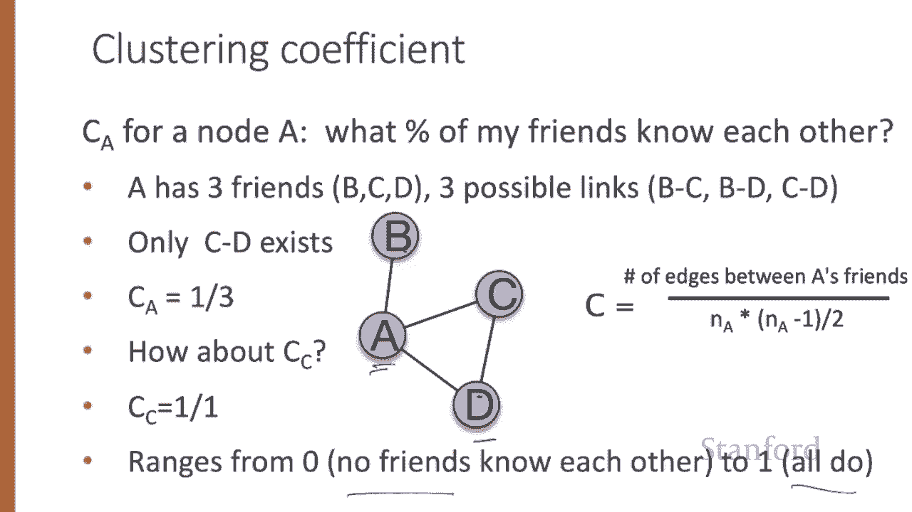

# 【双语字幕+资料下载】斯坦福CS124 ｜ 从语言到信息(2021最新·全14讲) - P80：L14.1 - 社交网络 - ShowMeAI - BV1YA411w7ym

Here we introduce some basic properties and metrics for social networks。What is a social network？

The term social network is commonly used to mean a company or an app that connects people in a graph。

 but here we mean something more abstract， the actual graph metaphor for studying the relationships among a group of people。

So we'll have nodes or vertices of the graph， those will represent people。

 and various specific relationships between people will be represented by the edges or links between the nodes。

So the whole system of people in relationships will be the network or graph。

Encompasssing these vertices and edges。Here's a graph， for example。

 where the nodes are actors and the edges are movies they appeared in together。

Or heres one where the nodes are people and the edges are social relationships like brother or friend。

But for many questions， we can abstract a way to just talk about the structure of these four nodes and these four edges。

 the fact that there's a link between one and two and two and three and one and three， but no link。

 for example， between nodes three and four。Networks can be undirected or directed in undirected networks。

 the edges between nodes are symmetric。 Things like friendship on Facebook or actor collaborations or Twitter conversations。

In directed networks， however， the edges are asymmetric。

 they're arrows that point in a particular direction。So in citation graph， the nodes are papers。

And the edges point， let's say， from paper2 to paper one， if paper2 cites paper one。

 following someone on Twitter or Instagram is a directed relation。

Let's introduce some useful properties of nodes。Two kinds of measures of how important or central a node is in a graph。

 no degree。And node between this。 And we also introduce the important clustering coefficient。

The degree of a node I in an undirected graph is the number of edges touching eye。 So in this graph。

 node 2 has four edges in on it。 So we'll say the degree of node2 is 4。

Nodes one and three both have a single edge incident on them。

And nodes four and five both have two edges in pseudoidoma。In a directed graph。

 we can measure a nodes in degree， how many people point to it， or it's out degree。

 how many nodes does it point to？For example， in this directed graph， node 2 and node 4。

 both have two people pointing at them for node2 and for node4。

Nodes one and five both have in degree of one， one for five， one for one。

And node 3 has an in degree of zero， nothing points to node 3。

Another kind of centrality is between this centrality。 A node has high between this。

 If lots of the shortest paths between pairs of nodes must pass through it。 So， for example。

 in this graph， the between this of node 7 is high because many of the shortest paths between pairs of nodes。

 like node 2 and node 11 or node 4 and node 8 must pass through node 7。

The betweenness of a node A， we could also compute between this for an edge like AB。

 is the number of shortest paths that go through A or AB if we're doing edges。

Divided by the total number of shortest paths that exist between all pairs of nodes。

So out of all shortest paths between all pairs of nodes。

 how many of them go through the specified node or edge？So we can define b sub J。

 the between this sub node J。As the sum over all pairs of nodes， I and K that aren't J。

Out of the total number of shortest paths between I and K。How many of them pass through J。

 the number of shortest paths that go through J？Let's walk through the between this computation for this node B。

 for example， take the pair of nodes A and C。The shortest path between A and C is this short path。

 and it doesn't go through B of the one shortest path， zero go through B。

There are two shortest paths between A and D。Both a length too。And one of the two。

 this one goes through node B。So of the two shortest paths， one goes through node B。

And of the one shortest paths between no C and D， that one does not go through B。

So in sum we have four shortest paths between all pairs of nodes that aren't B。

 and one of them goes through B， so that's a centrality of 14 or 0。25。

Finally， let's introduce a very important property of a node called its clustering coefficient。

The clustering coefficient for a node measures a property of its neighbors。

 The nodes that are adjacent to it connected to it by an edge。 Habit all informally call its friends。

So the clustering coefficient C sub A for a node A measures the percentage of my friends that are friends with each other。

 the percentage of the nodes adjacent to me that are also adjacent to each other。

 let's compute the clustering coefficient for this node A。A has three friends， B， C， and D。

 so there are three possible links among those friends， B C， B D， and C D。Of those three。

Only one exists C is in a real graph， so the clustering coefficient for node a is one out of three。

How about for nodedes C， what's its clustering coefficient？Here there are two neighbors， A and D。

And one possible link， the link A to D。 And that link is， in fact， there。

 So the clustering coefficient is one out of one or one。The clustering coefficient ranges from zero。

 no friends know each other to one， all the friends know each other。

And here's the equation we've just described。 If n sub a is the number of neighbors of a out of the n times n minus1 over two possible edges between those neighbors。

 what percentage of those exist。

We've seen some important metrics for nodes in social networks。

 including their degree between this and clustering coefficient。

