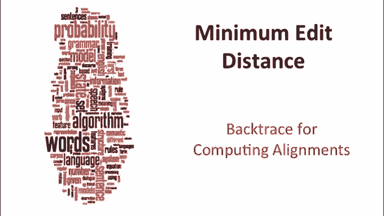
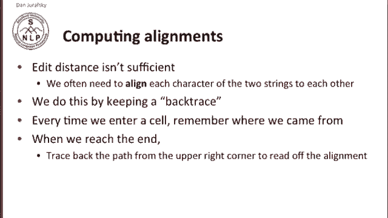
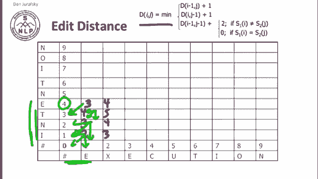
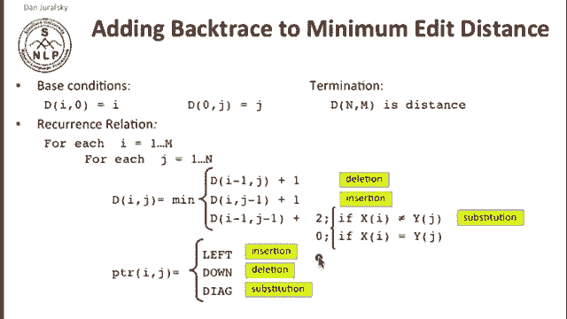
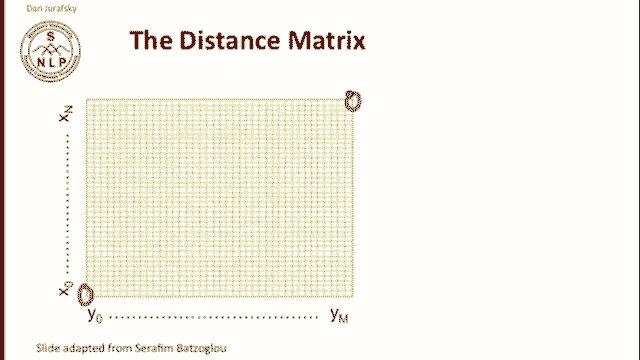
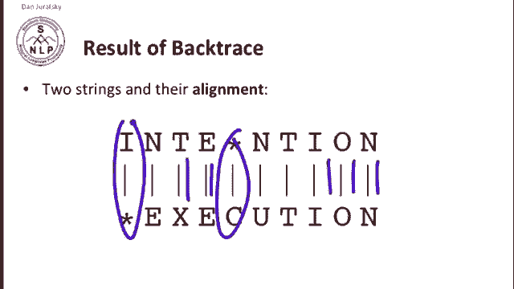
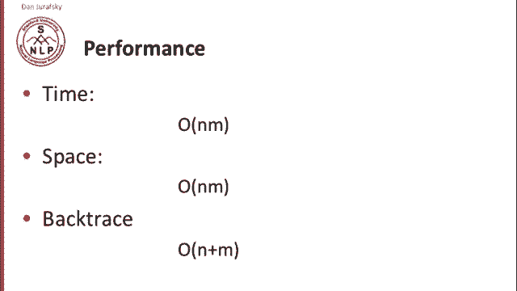
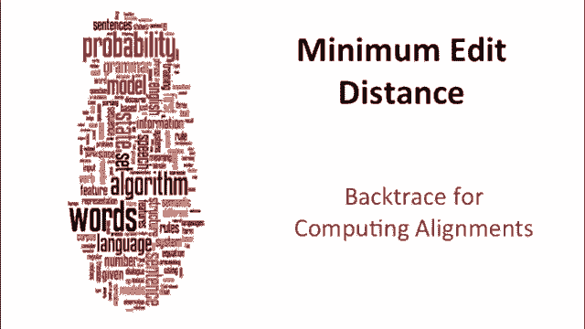

# P9：L2.3- 回溯与对齐计算 - ShowMeAI - BV1YA411w7ym

Knowing the edit distance between two strings is important， but it turns out not to be sufficient。

 We often need something more， which is the alignment between two strings。

 We want to know which symbol in string X corresponds to which symbol in string Y and this is going to be important for any application we have of edit distance often from spell checking to machine translation even in computational biology。

 And the way we compute this alignment is we keep a back trace。

 A back trace is simply a pointer when we enter each cell in the matrix that tells us where we came from and and when we reach the and the upper right corner of our matrix。

 we can use that pointer and then trace back through all the pointers to read off the alignment。

Let's see how this works in practice again I've given you the equation for each cell in edit a distance and if we put in some of our values that we saw earlier I'll start by putting in some values。

All right， so we can ask， how did we get to this value2？

Two is we pick the minimum of three values we could either take。

 so two is the distance this two here is a distance between the string I and the string E。

 and we got that by saying it's either the alignment between nothing and E plus the insertion of an extra I。

So that's distance of one plus one is2。Or0 plus2 is2 or one plus one is2。

 So we had three different values。 So if we were asking which of which minimum path did we come from really they're all the same we could have come from any of them and that's going to be true for this value 3 as well we computed it as the minimum of two plus1。

1 plus 2 or  two plus1 so this could have come from here here or here and similarly。

 that's going to be true。I didn't work out the arithmetic for you。

 but it's going to be true for this cell too， you can work it out for yourself。

Here we have a distant difference。So the distance between INTE and E。

We could compute that by taking the distance。What it cost us to to。

Convert I and T E to nothing and then add another insertion for E。

 but that would be that would be silly because4 plus 1 is 5。

 and there's a cheaper way to get from IT E to E。 And that is that it costs us nothing to match this E to that E。

 So our previous alignment between IN T and nothing we can add 0 from 3 to get a 3。 So。

The minimum path for this three came from that three。 So while in some cases。

 a cell came from many places， in this case， it unambiguously came from。

This previous three， and so we're going to do this for every cell in the array。

And the result will look something like this where we have for every cell。

 every place it could have come from。 and you'll see that in a lot of cases。

 any path could have worked。 So this six could have come from any place。

 but crucially this final alignment， this8 that tells us the final edit distance between intention and execution。

 our trace back tells us it came from the best alignment between Inio and executionio。

 which came from the best alignment from Inci from execution I and so on。

 and so we can trace back this alignment and get ourselves， alignment that tells us that this N。

Match this N and this O， match this O and so on。 But maybe here we have an insertion。

Rather than a clean lining up。Computing the back， very simple。

We take our same minimum edit distance algorithm that we've seen。

And here I've labeled the cases for you， so when we're looking at a cell， we're either deleting。

 inserting or substituting。And we simply add pointers。

 so in the case where we're inserting we point left and the case where we're deleting we point down and in the case where' substituting we point diagonal and I've shown you that arrows on the previous slide。

So we can look at this distance matrix and think about the paths from the origin。Here。😔。

To the end of the matrix and any non decreasinging path that goes from the origin to the point and M corresponds to some alignment of the two sequences。

An optimal alignment then。Is composed of optimal subsequences。

 and that's the idea that makes it possible to use dynamic programming for this task。

So the resulting of our back trace are two strings and then the alignment between them。

 so we will know which things line up exactly， which things line up with substitutions。

 and then when we should have insertions or deletions。

What's the performance of this algorithm。In time， it's order Nm because our distance matrix is of size Nm。

And we're filling in each cell one time， the same is true for space， and then the back trace。

 we have to in the worst case， go for if we had n deletions and M insertions。

 we'd have to go n plus M with to touch n plus M cells， but not more than that。

So that's our back trace algorithm for computing alignments。

