# P12：L12- 循环神经网络 - ShowMeAI - BV13P4y1t7gM

okay welcome back today we are we're on，okay welcome back today we are we're on。

lecture twelve and today we're going to，talk about a new species of neural。

network called a recalled recurrent，neural networks so before we talk about。

recurrent neural networks I wanted to，back up and remember we had this slide。

from a couple lectures ago where we were，talking about hardware and software and。

this was kind of our TL DR conclusions，about pi torque versus tensor flow and。

if you'll recall kind of my biggest，gripes with PI torch as of that lecture。

we're that it didn't have good TPU，support for a googol specialized tensor。

processing unit hardware and it did not，have good support for exporting your。

train models onto mobile devices like，iOS and Android devices well since that，lecture。

hayah torch has actually released a new，version 1。3 and two of the biggest。

features in the new version of Pi torch，actually address these two big concerns。

that I had with PI torch so PI torch 1。3，now offers some experimental mobile API。

that theoretically makes it really easy，to export your models and run them on。

mobile devices which seems awesome and，there's now also experimental support。

for teep running PI torch code on Google，TP use which also seems really cool so I。

just thought it's it's nice to keep you，guys up to date when things change in。

the field of deep learning as you can，see things are changing even within the。

scope of one semester and some of our，earlier lecture content becomes outdated。

even just a week or two later sometimes，but we're gonna so this is the new PI，torch version 1。

3 we're gonna continue，sticking with version 1。2 for the rest，of this quarter unless colab silently。

updates to 1。3 on us again，which may happen I don't know so these。

are really cool new features but like I，said this was just released so it's。

gonna take a little bit of time I think，before we see whether or not these these。

new features are really as awesome as，they're promised to be so then kind of。

stepping back to last lecture remember，the last two lectures we've been talking。

about all these nuts and bolts，strategies for how you can actually。

train your neural networks so we talked，in great detail about things like。

activation functions data pre-processing，weight initialization and many other。

many other strategies and little details，that you need to know in order to train。

your neural networks so now hopefully by，this point in the class you guys are all。

experts at training deep convolutional，neural networks for whatever type of。

image classification problem I might，want to throw at you so since you are。

now experts at that problem it's now，start - it's now the time in the。

semester when we need to start thinking，about new types of problems that we can。

solve with deep with deep neural。

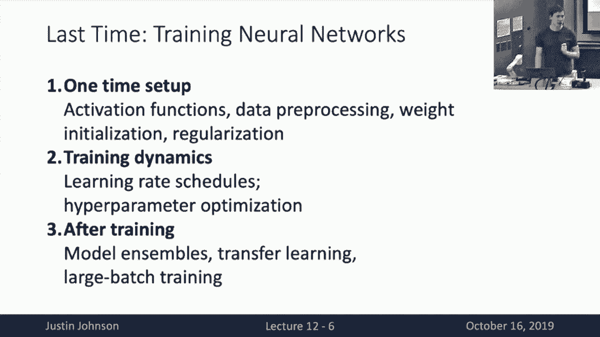

networks so that brings us to today's，topic of recurrent neural networks so。

basically all the problems all the，applications we've considered of deep。

neural networks in this class so far，have been what is called a feed-forward。

Network now these feed-forward networks，are something that receives some single。

input at the bottom of the network like，a single image goes through one or。

multiple hidden layers maybe with，special fancy layers like convolution or。

patch normalization but each each layer，sort of feeds into the next layer and at。

the very end of the network it's going，to output some single output like so the。

classical example of these kind of，feed-forward networks are these image。

classification networks that we've been，working with so far here there's a。

single input which is the image and，there's a single output which is the。

category label that we want our network，to assign to that image now as we've。

been the reason we covered image，classification in such detail is because。

I think it's a really important problem，that encapsulates a lot of important。

features of deep learning but there's a，whole lot of other types of problems。

that we might imagine wanting to solve，using deep neural networks so for。

example we might want to have problems，that are not one-to-one but instead are。

one-to-many so where the input is a，single input like maybe a single image。

and the output is no longer a single，label but maybe the output is a sequence。

an example of this would be a task like，image captioning where we want to have a。

neural network to look at an image and，then write a sequence of words that。

describe the content of the image in，natural language now you can imagine。

this would be much more general than，this single image class this single。

label image classification problem that，we've considered so far another type of。

application we might imagine is a，many-to-one，problem where now maybe our input is no。

longer a single item like an image but，maybe our input is a sequence of items。

for example a sequence of video frames，that make up a video and now at the end。

we then maybe want to assign a label to，this to this sequence of inputs maybe we，want to look at the。

of a video sequence and then say maybe，what type of event is happening in that。

video so this would be an example of a，many-to-one problem because the input is。

a sequence and the output is a single，label of course you can generalize this。

you can imagine problems that are many，to many that want to input a sequence。

and then output a sequence an example of，this type of problem would be something。

like machine translation where we want，to have neural networks that can input a。

sentence in English so that would be a，sequence of words in English and then。

output a translation of that sentence to，French which would then be a sequence of。

words in French and again and that's，sort of on every for passed the network。

we might have seek input sequences of，different lengths and output sequences。

of different lengths this would be an，example of something we call a。

many-to-many problem or a sequence the，sequence problem there's another sort of。

sequence to sequence problem where maybe，we want to process an input sequence and。

then we want to make a decision for each，element of that input sequence this is。

another example of a type of，many-to-many classification problem so。

here an example might be processing，frames of a video and rather than making。

a single classification decision about，the entire content at the video maybe。

instead we want to make a decision about，the content of each frame of the video。

and maybe say that the first three flav，frames were someone dribbling a。

basketball the next 10 frames were，someone shooting a basketball the next。

frame was him missing the shot and then，the next couple frames were him being。

booed by his team something like that so，maybe and maybe we'd like to this to。

build this network in a way that can，process sequences so this you can see。

that once we have the ability to work，not just with single single input and。

single output but now we have now if we，have the ability to process sequences of。

inputs and sequences of outputs that，allows us to build neural networks that。

can that can do much more general types，of things and now the general tool that。

we have in deep learning or rather one，of the general tools that we have for。

working with sequences about the input，and the output level is a recurrent。

neural network so the rest of the，lecture will talk about so whenever。

whenever you see a problem that involves，sequences at the input or sequences at。

the output you might consider using some，kind of recurrent neural network to。

solve that problem and an important task，here in an important point here is that，the。

sequence length ahead of time right for，each of these tasks we want to build one。

neural network that can process，sequences of arbitrary length so we'd。

like people to use the same video，classification network to process a。

video frame like a very short video，frame or a very or a very very long。

video sequence so then this recurrent，neural network movement will be this。

very general tool that allow us to。

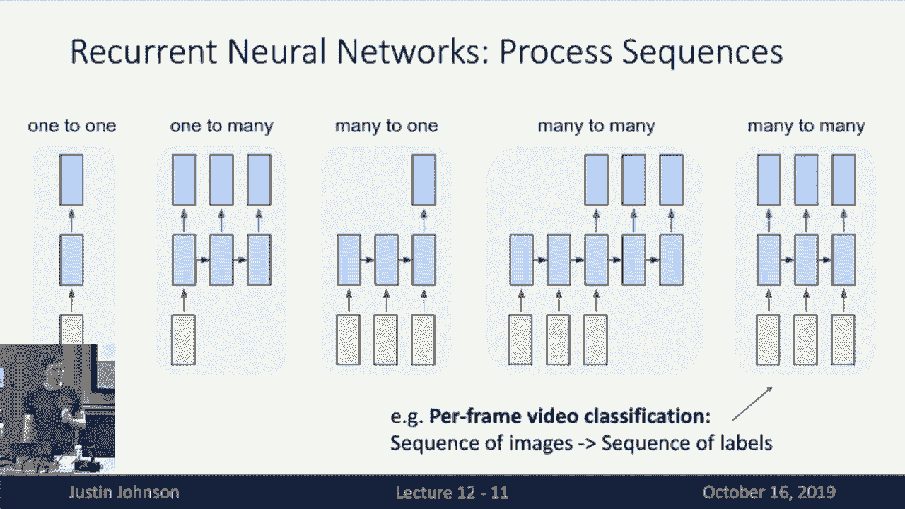

process different types of sequences in，deep learning problems but recurrent。

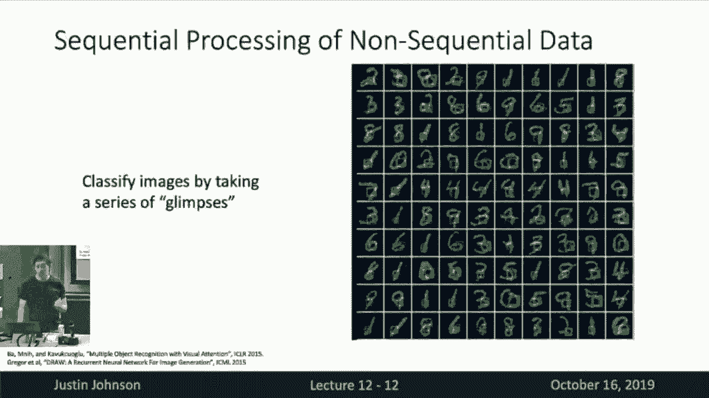

neural networks are actually useful even，for processing non sequential data so it。

turns out that sometimes people like to。

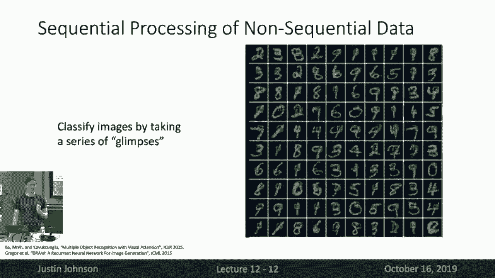

build use recurrent neural networks to，perform sequential processing of non。

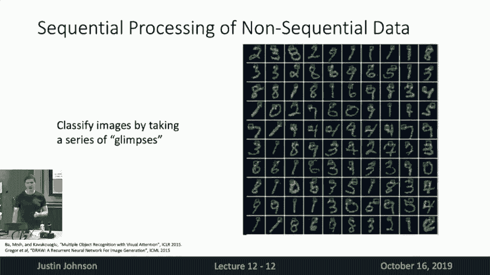

sequential data so what do I mean by，that as an example so this isn't this is。

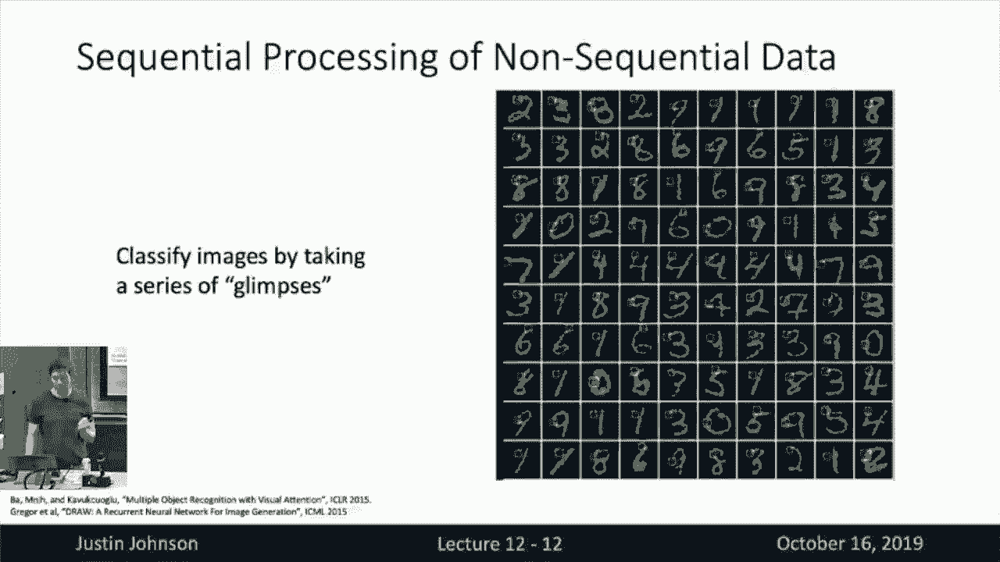

a project from a couple years ago where，they were doing our favorite image。

classification tasks so remember image。

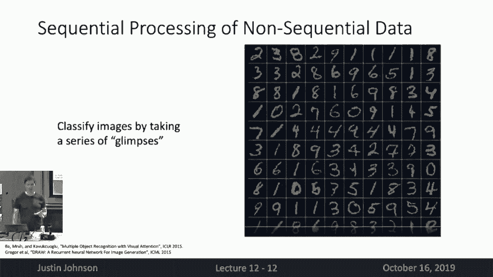

classification is no there's no，sequences involved it's just a single。

image as input and a single category。

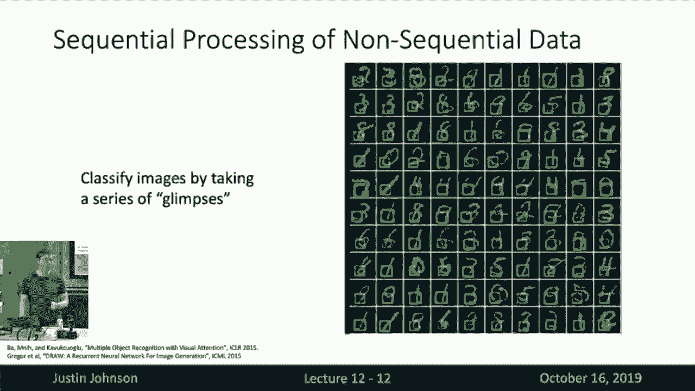

label as output but now the way that，they want to classify images is actually。

not with a single feed-forward neural，network instead they want to build a。

neural network that can take multiple。

glimpses at the image that it maybe，wants to look at one part of the image。

then look at another part of the image。

then look at another part of the image，where at each point in time the position。

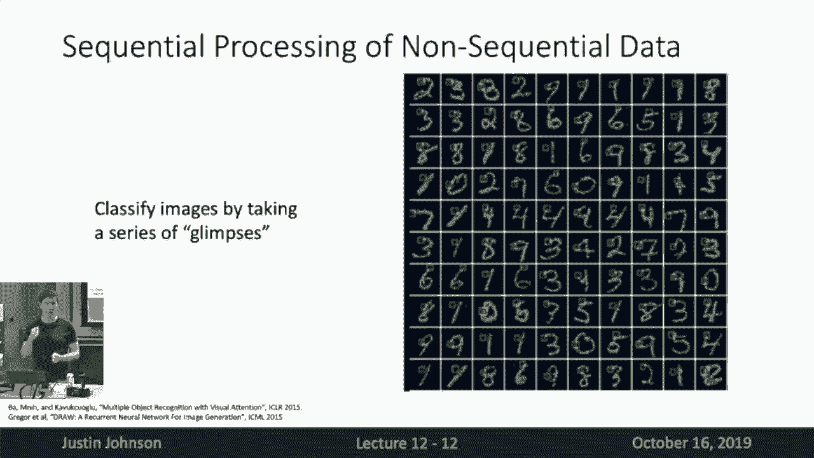

that the network the the decision of the，network of where to look in the image is。

conditioned upon all the information。

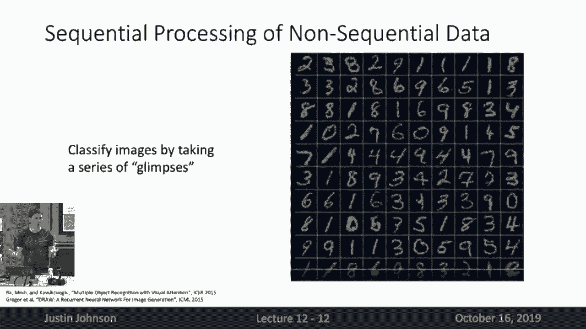

that it's extracted at all previous time，steps and then after looking at many。

that many glimpses in the image then the。

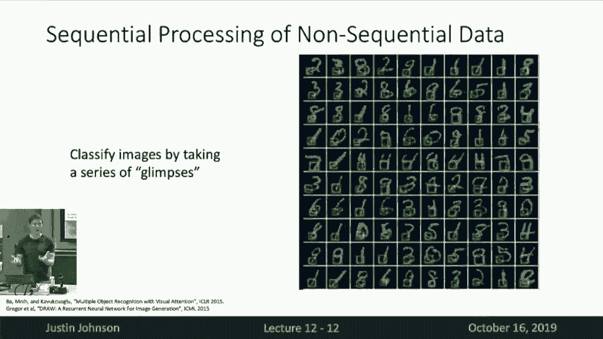

network finally makes some，classification decision about what is。

the object that it's seeing in the image。

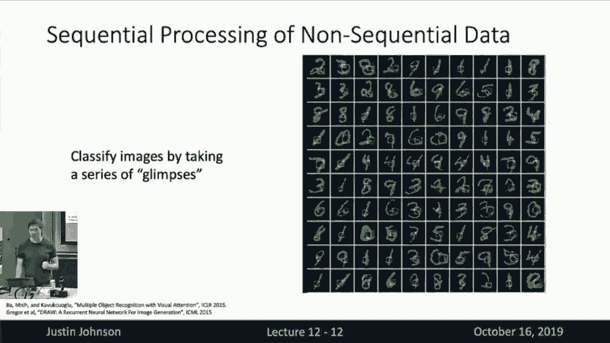

so here we can see it so this is an，example of using a sequential processing。

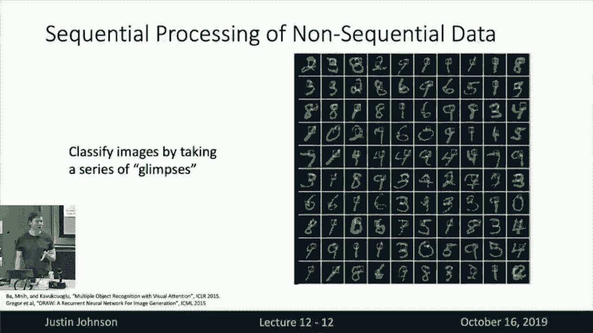

inside of a neural network even to，process non sequential data so here this。

visualization or so we're showing that。

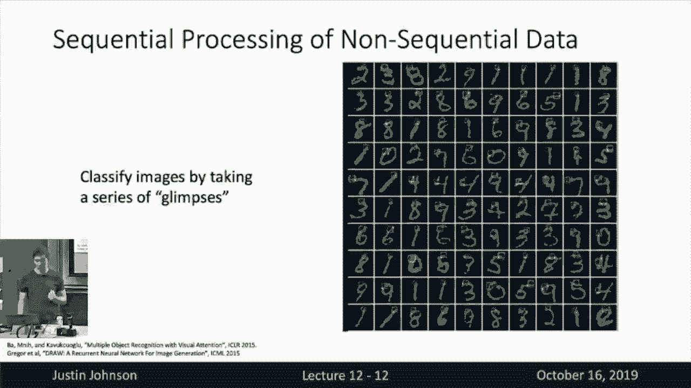

it's doing digit classification and each，of these little green squares is one of。

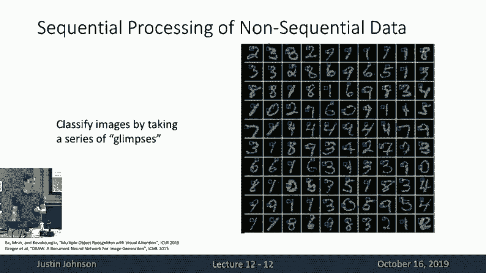

the glimpses that the neural network is，choosing to make to look at one little。

sub portion of the image in order to。

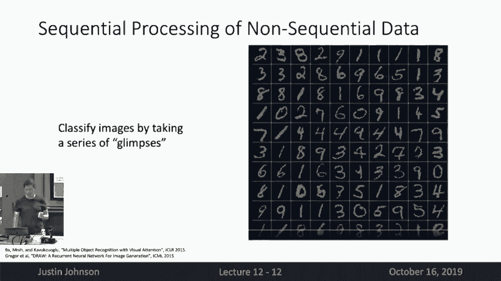

make its classification decision now，another example of using a sequential。

processing for non sequential data is，sort of doing the inverse and now。

generating images so here rather than，trying to class taking as so in the。

previous slide we saw the network was，taking the image as input and then using。

a proxy Qin sub glimpses to make，classification decisions now instead we。

have some tasks where we want to build，neural networks that can generate images。

of digits and now the way that it's，going to do this is by painting little。

sequences of the output canvas sort of，one time step at a time，so at each point in time the neural。

network will choose where it wants to，write and then what it wants to write。

and then over time those those writing，decisions will be integrated over time。

to allow the network to build up these，output images using some kind of。

sequential processing even though the，underlying task is not sequential so。

here these examples are from a couple，years ago here's one that I that I saw。

on Twitter just last week so here the，idea is again we're using we're building。

a neural network that can produce these，images which is a non sequential task。

but using sequential processing so here，the the here what they did is actually。

into integrated the neural network into，an oil paint simulator and now at every。

time step the neural network chooses，what type of brushstroke it wants to。

make on to this virtual oil paint canvas，and then at every time step its。

conditioned on what it saw in the，previous time step it chooses where to。

make one of these virtual oil paint，brush strokes and then over time it。

actually builds up this these sort of，stylized artistic images of faces so。

these are all examples of where you，might imagine using a recurrent neural。

network so now we've seen that recurrent，neural networks can be used to both to。

open open open the door to new types of，tasks involving processing sequential。

data and they can also give us a new way，to solve our old types of problems where。

we might want to use sequential，processing even to prop even for these。

inherently non sequential tasks so，hopefully this is good enough motivation。

as to why over current neural network is，an interesting thing to learn about so。

given that motivation what is a，recurrent neural network and how does it。

work well the basic I had the basic，intuition behind a recurrent neural。

network is like I said we're processing，sequences so then at every time step the。

recurrent neural network is going to，receive some input acts here shown in。

red and going to emit some output on Y，shown in blue and now the recurrent。

neural network will also will also have，some internal hidden state which is some。

kind of vector and at every time step，that worker in there，network will use the input of the。

current time stuff to update its hidden，state using some kind of update formula。

and then given the updated hidden state，it will then emit its output for the，current time step why。

so then concretely we now we can see so，then concretely what this might look。

like is that we in order to define the，architecture of our current neural。

network we need to write down some kind，of recurrence relation of recurrence。

formula or recurrence relation FW so，here H t8 now we have that now we have。

this intuition that the network is，working on this sequence of hidden。

states where H sub T is the hidden state，at time T which is just going to be some。

vector just like the hidden state，activations of the fully connected。

networks that we've worked with in the，past and now we'll write down this。

recurrence relation F F that depends on，learn ablates W and this learn about。

this dysfunction will take as input the，hidden state at the previous time step。

HT HT HT minus one as well as the input，at the current time step X T and it will。

output the hidden state but the next，time stuff on HT and then you can。

imagine that we can write down different，types of formulas FW that caused these。

inputs and hidden states be related to，each other using different algebraic。

formulations so the most simple way that，we can write and the in the important。

critical point part is that we use this，same function f W with the same weights。

W at every time step in the sequence and，by doing this we're sort of sharing。

weights and using the exact same weight，matrix to process every see every point。

in time and every point in the sequence，and by this construction allows us to。

have just a single weight matrix that，can now process sequences of arbitrary。

length because again we're using the。

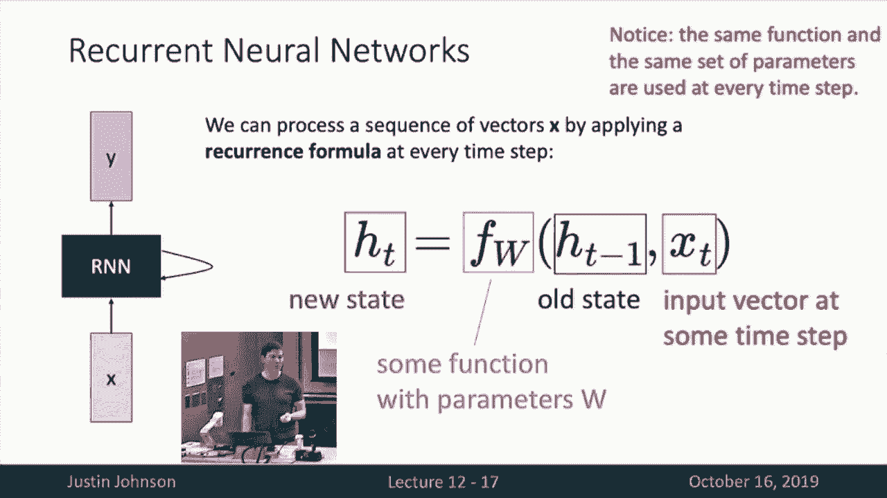

exact same weight matrix at every time，step of the sequence so now with this。

kind of general definition of a，recurrent neural network we can see our。

first concrete implementation of a，recurrent neural network so this。

simplest version is sometimes called a，vanilla render or recurrent neural。

network or sometimes an element，current neural network after of。

Professor Jeffrey element who worked on，these some time ago so here the hidden。

state consists of a single vector HT and，every time step and now the are wait we。

are gonna have to learn about weight，matrix matrices one is WH H which is。

going to be multiplied on the time the，hidden state at the previous time step。

and the other is WX H which is going to，be multiplied on the input at the。

current time step so what we'll do is，we'll take our input at our current time。

step multiply it by one Nate weight，matrix take our previous hidden state。

multiply it by the other way matrix add，them together also add a bias term or。

normal bias term which I've omitted from，this equation for clarity and then we're。

going to use the non-linearity that I，told you not to use and squash them。

through at an H and then based on and，that after squashing through at an H。

this will give us our new hidden state，HT at our new time step and now we can。

produce our output at the at this time，stuff YT by having another weight matrix。

that is going to be just a linear，transform on that hidden state HT so is。

this definition of the this element，recurrent neural network clear exactly。

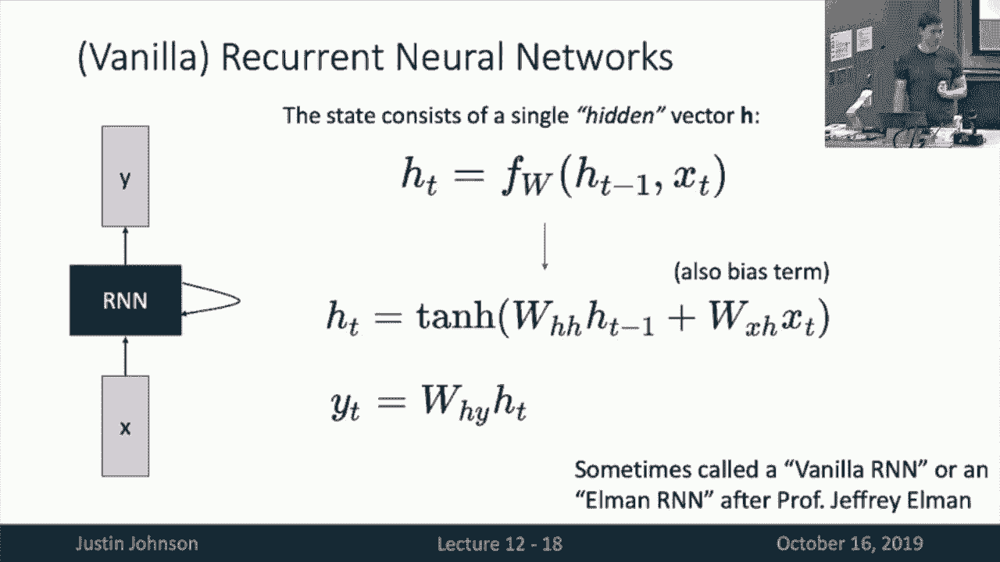

what's going on great so then one way to，think about this is another way to think。

about the processing of a recurrent，neural network is to think about the。

computational graph that we build when，we're unrolling this recurrent neural。

network over time so we can imagine that，at the very beginning of crossing our。

sequence we're going to have some，initial input to the this first element。

of the sequence x1 and we need to get，some initial hidden state h0 from。

somewhere and to kind of kick off this，recurrence it's very common to either。

initialize that first hidden state to be，all zeros is probably one very common。

thing sometimes you'll also see people，learn the initial hidden state as。

another learn about parameter of the，network but those are both kind of。

implementation details you can just，imagine that this initial hidden state。

is all zeros and that usually works，pretty well so then given this initial。

hidden state and this first element of，the sequence then we feed them to this a。

recurrence relation function FW that，will output our first hidden state h1。

and then now given our first hidden，state will then feed it again to the。

same function FW and slurpin the next，element of the sequence x2。

to produce the next hidden state and so，on and so forth and what's important。

here is that we're using the exact same，weight matrix at every time step of the。

sequence so you can see that in the，computational graph this is manifested。

as having a single node W for the wave，matrix that has then used at every time。

stuff in the sequence so then you can，imagine that maybe during back。

propagation if you remember the rules，for sort of copy nodes in a。

computational graph then in the forward，pass if we use the same node in multiple。

parts of the computational graph then，during the backward pass what do we have。

to do yes we need to sum so this will be，important when you implement recurrent。

neural networks on assignment 4 so，hopefully that will be and you can also。

see by this design that again because，we're using the exact same weight matrix。

at every time step in the sequence then，we can this this one recurrent neural。

network can process any sequence of，arbitrary likes and if we receive a。

sequence of two elements we'll just sort，of unroll this graph for two time steps。

if you receive a sequence of 100，elements will unroll this graph for 100。

time steps and no matter what length of，sequence we receive we can use the same。

recurrent neural network and the same，weights to process sequences of。

arbitrary length and now at every time，and now this is kind of the basic the。

basic operation of a recurrent neural，network and then remember we saw all。

these different one-to-many many-to-many，of these different types of sequence。

tasks that we might want to use well now，we can see how we can use this basic。

recurrent neural network to implement，all of these different types of。

sequential processing tasks so here in，the case of many-to-many where we want。

where we receive a sequence of inputs，and now we want to make a decision for。

each point in the sequence this again，might be something like video。

classification we want to classify every，frame of a video now we can have another。

weight matrix maybe W out or WY that's，going to produce our output Y our output。

Y and every time step in the sequence，and now maybe we have some desired label。

then then to train this thing we might，apply a loss function at each time step。

in the sequence so for example if this，was something like video classification。

and we're making a classification，decision I'm at every point in the。

sequence then we might apply we might，have a ground truth label at every point。

in time and we apply a cross entropy，loss，to the predictions at every time step to。

now get a loss per time point per per，element of the sequence then to get our。

final loss function we would sum，together all of these per time step。

losses and that would give us our final，loss that we could back propagate。

through so now this would be something，like the full computational graph for a。

many-to-many recurrent neural network，that is making one output per time step。

in our input sequence but now it maybe，if we were doing a many-to-one situation。

this might be something like video，classification but we just want to。

produce a single classification label，for the entire video sequence then we。

can just hook up our model to make a，single prediction at the very end of the。

sequence that only operates on the final，hidden state of the recurrent neural。

network and what you can see is that at，this final state of the recurrent neural。

network it's it kind of depends on the，entire input sequence so hopefully by。

the time we get to this final hidden，state that kind of encapsulates all the。

information that the network needs to，know about the entire sequence in order。

to make its classification decision if，we maybe if we're in someone's many。

situation something like image，captioning or we want to input maybe a。

single element like an image and then，output a sequence of elements like oh a。

sequence of words to describe the image，then we can also use this recurrent。

neural network but now we pass a single，input at the beginning which is our。

single input X and then we use this，recurrence relation to produce a whole。

sequence of outputs now there's another，very common application of recurrent。

neural networks which is the so called，sequence to sequence problem this is。

often used in something like machine，translation where you want to process。

one input sequence and then produce，another input sequence where the lengths。

of the two sequences might be different，again this might be something like we。

input the sequence of words in English，and then output a sequence of words in。

French giving a translation of the，sentence and I don't speak French but I。

think that all that an English sentence，does not always have the same number of。

words it says corresponding translation，in French so then it's important to be。

it that we are able to build recurrent，neural networks that can process secret。

and input sequence of one length and，produce an output sequence of another。

length so the way that we implement this，is the so called sequence to sequence。

recurrent neural network architecture，and this is，basically taking a many-to-one recurrent。

neural network and feeding it directly，into another one-to-many recurrent。

neural network so here the way that this，works is that we have one on recurrent。

neural network called the encoder that，will receive our input sequence this。

might be our English sentence that we're，receiving as input and it will process。

that input sequence one element at a，time and then it will then the entire。

content of that entire sequence will be，summarized in the hidden vector that's。

predicted at the very end of the，sequence and now we can take that hidden。

vector at the end of the encoder，sequence and feed it as a single input。

to the second to a second recurrent，neural network called the decoder and。

now this second recurrent this second，decoder network is now a one-to-many。

Network because it receives the single，vector which was output from the first。

Network and then it produces a variable，line of sequence as output and here from。

this computational graph you can see，that we're using different weight。

matrices in the encoder and the decoder，shown in orange and purple here which is。

pretty common in these sequence of，sequence models yeah question the。

question the question is why why do we，separate them like this well one problem。

is that the number of output tokens，might be different from the number of。

input tokens so we might want to process，the English sentence and then output the。

French sentence but you don't know how，like the number of words in the output。

might be different from the number of，words in the input so there it's。

important that we separate them somehow，you might imagine we just use the same。

weight matrix for both the encoder and，the decoder and that court that would be。

like we process for we process the whole，sequence where we give an input for the。

first K time steps then for the last K，time steps we don't give it any input at。

all and just expect it to produce an，output and people do do that sometimes。

yeah the question is how do we know how，many tokens we need in the second one so。

that I think is a detail we'll get to in，a couple slides was there another，question over here。

yes okay good good I'm glad you're，thinking about that because we'll get。

there so then so that's kind of a。

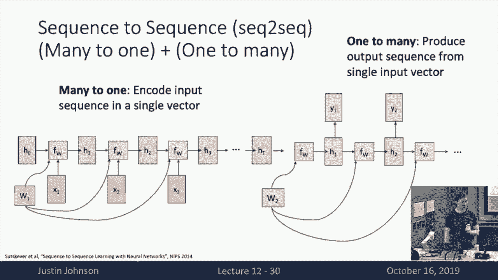

concrete example of how this works as a，more contrary task we can talk about。

this so-called language modeling task so，here the idea is we want to build a。

recurrent neural network it's going to，process an infinite stream of input data。

and then at every point in time，going to try to predict what is the next。

character in the sequence and this is，called a language model because it。

allows you to write down the problem it，allows the neural network to score the。

probability of any of any sequence being，part of that language that it's learning。

so here the way that we set this up is，we'll typically write down some fix。

we'll have some fixed us set of，vocabulary that the network knows about。

in this case our vocabulary consists of，the letters HDL and oh this will be some。

fixed vocabulary that we need to choose，this at the beginning of training and。

now we can see that our input sequence，we've encoded each of now we want to。

process this training sequence hello，h-e-l-l-o so now you can see that we。

process this input sequence by，converting each of its characters into a。

one hot vector so given our vocabulary，of size for，h-e-l-l-o then we convert the letter h。

into the vector 1 0 0 0 because it，consists of the it just having a 1 for。

that first slot in the vector on meaning，that the first element of our vocab then。

we process our input sequence in these 1，cutters and this gives us a sequence of。

vectors that we can feed to recurrent，neural network so then we can use our。

recurrent neural our recurrent neural，network to process the sequence of input。

vectors and produce this sequence of，hidden states and now at every time step。

then we can use our output but our，output matrix too at every time step。

predict a distribution over the elements，in our vocabulary at every point in the。

sequence and now because the task of the，network is to press at every point in。

time is trying to predict the next，element in the sequence so you can see。

that after it receives the first element，H in the input sequence it tries to。

predict the next element e so then that，would be a cross entropy classification。

loss at that point at that time step in，the sequence then after then once it。

receives the first two input characters，H and E it needs to predict L which is。

the third character in the sequence and，so on and so forth so then you can see。

that the target outputs in this sequence，are equal to the target inputs just kind。

of offset by by by 1 so then once you've，got a trained language model so that's。

kind of what a language model looks like，during training you got your your input。

sequence you shift the output input，input sequences and then try to predict。

the next character at every time step of，processing，but now once you've got a trained。

language model you can actually do，something really cool with it and you。

can use your trained language model to，generate new text that is in the style。

of the text that it was trained on so as，an example of what that might look like。

um given our trained given a language，model that we've now trained on a set of。

sequences then what we can do is we can，feed it some initial seed token unlike。

the letter H and now what we want to do，is have the recurrent neural network。

generate new text conditioned on this，initial seed token so then the way that。

this works is we give it our input token，H we give it the same one hot encoding。

we go through one layer we unroll one，tick of this recurrent neural network。

sequence and then get these this，distribution of predictions for the next。

character at the time in time and now，because our model has predicted a。

distribution of what characters it，thinks should happen at the next time。

step what we can do is sample from that，distribution to just give a new invented。

character for what the model thinks is，probable at the next time step and then。

we could after we take that sample，character we can take the sampled output。

from the first time step of the network，and feed it back as input in the next。

time step of the network then we have，this sampled character e that we can。

feed back as input at the next time step，and then go through another layer of。

processing of this recurrent neural，network so again compute the next hidden。

state compute a new distribution of，predicted outputs and then gives us a。

new distribution over what the model，thinks the yet next character should be。

and then you can imagine repeating this，this process over and over again。

so then given your trained language，model you can seed it with some initial。

initial token and then just have it，generate new tokens that a thinks are。

likely to follow that initial token that，you give it so it's kind of a one little。

ugly detail is that so far we've talked，about encoding our input sequence as a。

set of one-hot vectors and if you think，about what happens in this first layer。

in this first layer of the recurrent，neural network is that remember in this。

vanilla neural network we were taking，our input vector and then multiplying it。

with our weight matrix well if our input，vector is just a 1 hot back is just a。

one hot vector with a 1 in one slot and，zeros and all other slots but actually。

that that matrix multiplied is kind of，to take，matrix multiplied by a one hot vector。

then what it does is it just extracts，one of the columns of the vector so。

actually you don't need to implement，that with a matrix multiplication。

routine you can implement that much more，efficiently with an operator that just。

simply extracts out rows of a weight，matrix so for that reason it's very。

common to actually insert another layer，in between the input to the network and。

the recurrent neural network called an，embedding layer that does exactly this。

so here the embedding now at the now in，the input sequence at the input our。

sequence will be encoded as a set of，one-hot vectors and now the embedding。

layer will just perform this one hot，sparse matrix multiply implicitly so。

effectively this embedding layer just，learns a separate each row of the column。

of the embedding matrix corresponds to，an embedding vector corresponding to。

each element in our vocab each element，of our vocabulary so in a very common。

design for these recurrent neural，networks is actually to have this。

separate embedding layer that happens，between the raw inputs the raw input 0。

hot sequence and before the embed these，vectors to this embedding layer before。

passing to our current neural network，that computes these sequence of his。

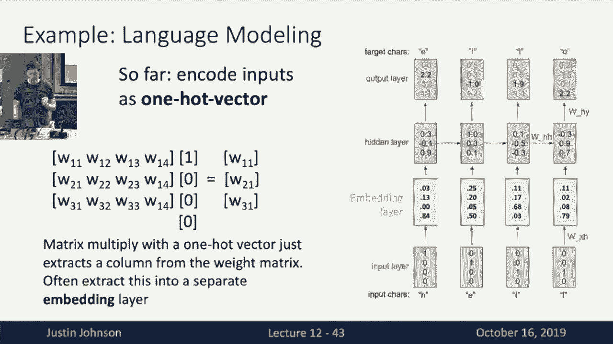

hidden states so now to train these，things this we've sort of seen this。

example of a computational graph using，recurrent neural networks already and。

what we saw is that in order to train，one of these recurrent neural networks。

we need to kind of unroll this，computational graph over time and then。

then it at me every time at every the，time point in the sequence we give rise。

to some loss per time step then these，get summed over the entire entire length。

of the sequence to give a single loss so，what was this kind of mean this is this。

is sometimes given a fancy name called，back propagation through time because。

during the forward pass we're kind of，stepping forward through time through a。

sequence and then during a backward pass，we're back propagating backwards in time。

through this sequence that we had，unrolled during the forward pass but now。

one problem with this back propagation，through time algorithm is that if we。

want to work on very very long sequences，and train on very very long sequences。

then this is going to take an enormous，amount of memory because say we want to。

train on sequences that are like a，million characters long well then you。

need to unroll this computational graph，for a million time steps that's probably。

not going to fit in your GPU memory，so in practice and when we're training。

recurrent neural networks and especially，recurrent neural network language models。

on very very long sequences sometimes we，use an alternative approximate algorithm。

called a truncated back propagation，through time so here the idea is that we。

we want to sort of approximate the，training of this network on this full。

possibly infinite sequence but then what，we'll do is we'll take some subset of。

the sequence maybe like the initial the，first ten tokens or the first hundred。

tokens of the sequence then we'll unroll，the forward pass of the network for that。

short prefix of the sequence and then，compute a loss only for that first chunk。

of the sequence and then back propagate，through the through the initial chunk of。

the sequence and make an update on the，weights and now what we'll do is we'll。

actually record the hidden weight the，hit the the the values of the hidden。

States from the end of this initial，chunk of the sequence and then we'll。

receive the second chunk of the sequence，and we'll pass in these recorded hidden。

weights that we remembered when，processing the first chunk and then。

we'll unroll a second chunk of the，sequence like the next hundred，characters in our possibly million。

character sequence so then we'll unroll，this next hundred characters of the。

sequence compute a loss for the second，chunk and then back propagates not。

through the entire sequence but instead，back back propagate only through the。

second chunk of the sequence and then，this will compute gradients of this loss。

with respect to our weight matrix then，we can make an update on the weight。

matrix and continue then we would next，then take the next chunk of the sequence。

remember what the hidden state was from，passing the second chunk and then used。

that recorded hidden States to continue，unrolling the sequence forward in time。

then again make a truncated back，propagation through time and another。

weight update so what this back，propagation through time algorithm does。

is basically the forward pass because，we're always carrying and from a hidden。

information forward throughout forever，perfectly through these remember in。

hidden States then the forward pass is，still sort of processing an infinite but。

potentially infinite sequence but now，we're only back property back。

propagating through small chunks of the，sequence at a time which means that this。

drastically reduces the amount of stuff，that we need to keep in GPU memory so。

this trick of truncated back propagation，through time makes it feasible to Train。

recurrent neural networks on even，infinite sequences even though you only。

have finite amounts of key to memory，so all this sounds really complicated。

but in practice you can implement this，whole idea of sort of training back with。

truncated back propagation through time，yeah question yeah the question is for。

this truncated back propagation through，time how do you set the h0 for passing。

the second like second chunk yeah then，you would use the final hidden state。

when processing the first job so then，right well when passing the first chunk。

we'll have this final hidden state and，then we'll just pass that final hidden。

state from the first chunk will become，the initial hidden state when crossing。

the second chunk and that's the trick，that means that it's sort of processing。

everything forward in time potentially，infinitely because it's carrying all。

this information forward in time through，the hidden States but then we're only。

back propagating through finite chunks，of the sequence at a time does that does。

that clarify yeah question yes the，question about weight updates so when。

doing back truncated back propagation，through time usually you'll go like。

forward through a chunk backward through，a chunk update the wave matrix then。

you'll copy this hidden state over go，forward backward update and then copy。

this one forward for backward update so，then you'll always every time you do。

back pop through some portion of the，sequence that will compute derivative of。

that chunk Schloss with there's the with，respect to the weight matrix then you。

can use that to make a weight update on，the weights of the network yeah yeah。

exactly so the idea is that with this，truncated back propagation through time。

once you process one chunk of data you，can throw it away like you can like like。

evict it from the memory of your of your，computer because then all the。

information about that sequence that's，needed for the rest of training is。

stored in that final hidden state of the，recurrent neural network at the end of。

crossing the choke so then all this，sounds maybe kind of complicated but in。

fact you can implement this whole，process of truncated back propagation。

through time for training or current，work language models and then sampling。

from them to generate new text you can，do it in like 112 lines of Python and。

this is no PI torch so no autograph this，is doing all the although gradients。

manually I did a version of this in PI，torch and then once you have pie charts。

you can do it about like 40 or 50 lines，so it's actually not a ton of code to。

actually do this stuff and now what's，fun is that once you've implemented。

these things you can have fun and just，sort of train recurrent neural network。

language models on different types of，data and then use them to generate new。

texts to kind of get an insight to what，types of，stuff these networks are learning when。

we train a language model on text so for，example what we can do is download the。

entire works of William Shakespeare，concatenate them into a giant text file。

and then that's a very very long a，sequence of characters and then we can。

train a recurrent neural network that，processes the entire works of William。

Shakespeare and tries to predict the，next character given the previous。

hundred characters or something like，that and just train a recurrent neural。

network whose entire purpose in life is，to predict next character from works of。

William Shakespeare and then once we，train this thing then we can sample from。

the train model and after the first，couple of iterations it doesn't look。

like it's doing too good then what we're，doing rumber is we're sampling what the。

network thinks is the next character and，then feeding that sample back fact the。

network as the next input and then，repeating this process to generate new。

data so at first this thing is basically，generating garbage because it's fairly。

random weights if you train this thing a，little bit longer then it starts to。

recognize some structure in the text so，it makes things that look like words and。

put spaces in there and maybe put some，quotes but if you actually read it it's。

still garbage we train a little bit more，and now I think it almost looks like。

sentences there's some spelling errors，but it says something like after fall。

ooh such that the hall for a Princeville，smoky so it's like starting to say。

something but you train it even longer，and now it starts to get like really。

really good and starts to generate text，that looks fairly realistic so now it。

says why do what they day replied，Natasha and wishing to himself the fact。

the Princess Mary was easier so you know，the grammar is not perfect but this does。

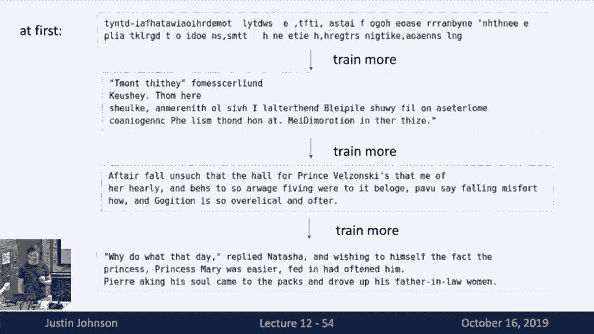

looked kind of like real English and now，we train this thing for a very long time。

and sample longer sequences and it，generates very plausible looking。

Shakespeare text so you can see these，look like stage directions pan drape。

andreas alas I think he shall come，approached in the day with little strain。

would be attained into being never fed，and who is but a chain and subjects of，his death。

I should not sleep so this sounds very，dramatic it sounds very much like。

Shakespeare but unfortunately it's still，gibberish now you can actually go。

further and imagine training these，things on different types of data so。

this was the entire concatenated works，of William Shakespeare。

years ago I did this one have you anyone，ever taken a abstract algebra course or。

an algebraic geometry course well that's，this sort of very abstract a part of。

part of mathematics it turns out there's，an open source textbook for algebraic。

geometry that's something like many many，thousands of pages written in low-tech。

so what I did is I downloaded the entire，latech source code of the several。

thousand page algebraic geometry，textbook and then train a recurrent。

neural network to generate the next，character of latech source code given。

the previous hundred characters on this，entire source code of this algebraic。

geometry textbook then you sample fake，math that the neural recurrent neural。

network is just inventing out of the，weights that it's trained unfortunately。

it tends not to compile so it's not so，good at like producing exactly。

grammatically correct low-tech source，code but you imagine you but you can。

manually fix some compile errors and，then you can actually get this thing to。

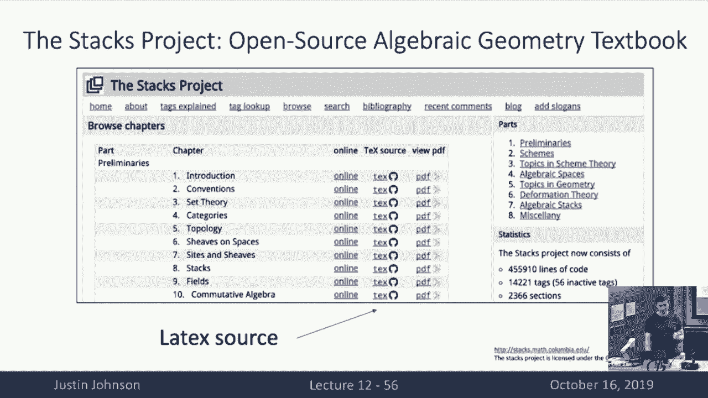

compile so now these are examples of，generated text from our current neural。

network that was trained on this，algebraic geometry textbook so you can。

see that it's like this kind of looks，like abstract math right it's like I'm。

having lemmas it's having proofs it even，put the little square at the end of the。

proof when it's done proving things it，tries to refer to previous lemmas that。

may or may not have been proven，elsewhere in this text and and it's kind。

of like very adversarial and kind of，rude in the way that some math math math。

books are so like the proof is see，discussion in sheaves of sets so like。

clearly you should have a reference back，somewhere else in this text work in。

order to understand this proof we can，look at some more in in algebraic。

geometry you actually have these cool，commutative diagrams that people draw。

they show relationships within different，mathematical spaces that are generated。

with some low-tech source code some，low-tech package and the recurrent。

neural network attempts to generate，commutative diagrams to explain the。

proofs that it's generating that are，also nonsense and actually one of my。

favorite examples of this is actually on，this page as well if you look at the up。

top left it says proof omitted，which is definitely something that。

you'll see in math books sometimes so we，can go further on this so what's another。

really basically at this point you've，got this idea that once you've got these。

character level recurrent neural network，language models you can train them on。

basically any kind of data you can，imagine so we also at one point we。

download the entire current source code，of the Linux kernel and trained a。

recurrent neural network language model，to predict this to this model the the C。

source code of a Linux kernel many of。

what you can do is you can sample from，this and just generate invented C source。

code and this looks like pretty，reasonable right like if you're not。

looking at this thing carefully this leg，definitely looks like it could be real a。

kernel source code you know it's saying，like static void do command struck SEC。

Phi M void star pointer it puts the，bracket it indents it puts like int。

column equals 32 left shift left shift，command of two like it even puts。

comments like free our user page pointer，to place to place camera if all - so the。

comments don't really make sense but it，knows that you're supposed to put。

comments it also knows that you're，supposed to recite this copyright notice。

at the top of files so when you sample，from this thing of it outputs this。

copyright notice it also kind of knows，the general structure of C source code。

files so after the copyright notice you，can see it's having a lot of includes，like includes。

Linux k XC h so includes a bunch of，headers has includes a bunch of other。

headers it defines some macros it，defines some constants and then after。

all of that it starts defining functions，so you can see that this thing and just。

by doing this very simple task of trying，to predict the next character then our。

recurrent neural network language model，has somehow been able to capture a lot。

of structure in this a relatively，complex data of this C source code of。

the Linux kernel so then one thing you，might you one question you might want to。

ask is how is it doing this what kinds，of representations are these recurrent。

neural networks learning from these data，that we're training them on well there。

was a paper from carpathia Johnson and，Feifei a couple years ago that attempted。

to answer some question like，that so here the idea is that we wanted。

to try to gain some interpretability，into what these recurrent neural network。

language models were learning on when we，trained them on different different。

types of sequence data sets so here what，the methodology here is that we take our。

recurrent neural network and we unroll，it for many time steps and we just make。

a skit to perform this prediction task，of predicting the next character so then。

in the in the process of predicting the，next character these recurrent neural。

networks are going to generate this，sequence of hidden states one hidden。

state for each character of input and，then trying to generate that character。

at output so then what we can ask is we，can ask what do the different dimensions。

of those hidden state capture so for，example what we can do is look at maybe。

look at dimension like 56 of those，hidden states and now because that's。

going to be the output of @nh because of，that's because it has that non-linearity。

then we know that each element of that，hidden state vector will be a real。

number between negative 1 and 1 so what，we can do is take the activation of。

element 56 and that recurrent neural，network hidden state and then use the。

value of that hidden state which is，between 0 & 1 to color the text on which。

the network was processing and that can，give us some sense for what different。

elements of that hidden state when they，light up when processing text so here's。

an example of a not very interpretable，result so basically what we've done is。

when we trained our neural network to，Don this Linux kernel data set and then。

we asked it to predict the next，character and now at every time step。

we've chosen like element 56 so there，are currently all Network hidden state。

and then we use the value of the hidden，state at each character to color the。

text that of the of the text that it's，processing is this is this visualization。

clear so then when when the when one of，the characters is colored red that means。

that the that the value of that cell is，very high close to positive one and when。

it's blue it means it's very low close，to negative one so then then what you。

can do is kind of look at these，different is hidden cell States and try。

to get some intuition for what they，might be looking for a lot of them look。

like this and you have no idea what，they're looking for they just look。

totally random but sometimes you get，some very interpretable cells and these。

recurrent neural networks so here's an，example，one where we trained on some actually。

Tolstoy swore in peace and then we test，and then we test the recurrent neural。

network and we found that one of these，cells is actually looking for quotes so。

what you can see is that this one，particular cell of the recurrent neural。

network is all blue which means it's all，off all off all off and then once it。

hits a quote then that one self flips，all the way on and turns all the way red。

and that remains red all the way all the，way all the way until the end quote。

when it flips all the way back to blue，so what that what that kind of gives us。

into this intuition is that somehow this，recurrent neural neural network has。

learned this kind of binary switch that，keeps track of whether or not we are。

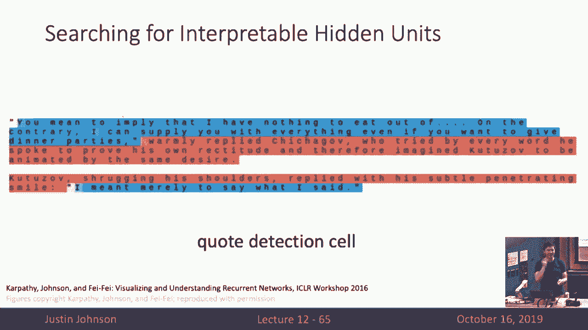

currently inside of a quote we found，another cell that tracks where we are in。

the current line so for example after we，hit a carriage return then it resets to。

negative one and then it slowly，increases over the over the over the。

course of a line because this data set，this data set always had line breaks。

that et characters so then after we get，about 80 characters then it knows we。

have to have a new line and then we，reset that with that cell back to blue。

when training on the lid on the linux，source code we found a cell that track。

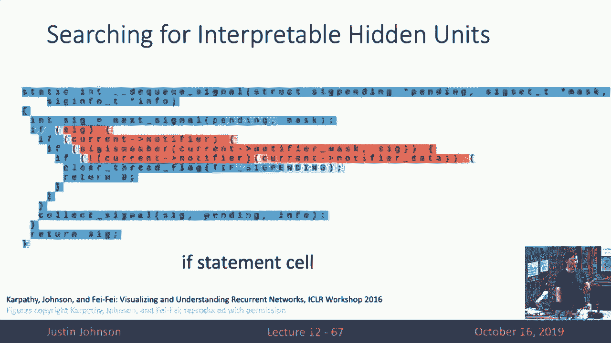

that tracked the conditions inside if，statements which was very interesting。

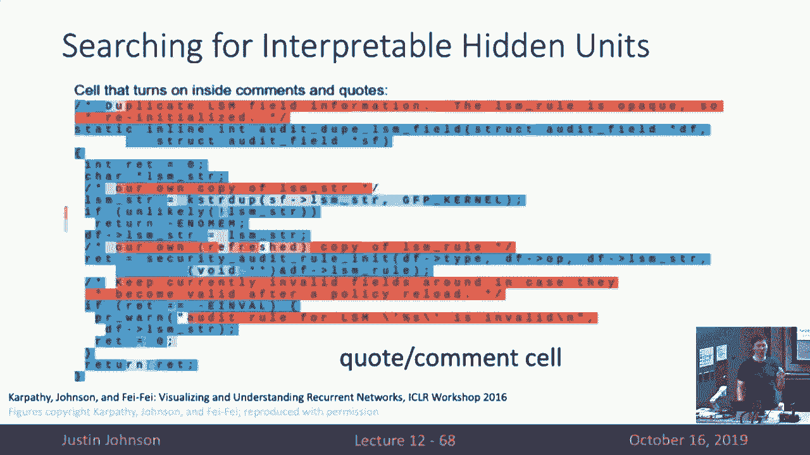

we also found another one that was，checking whether or not we were inside a。

comment inside the Linux source code and，we found ones that were also tracking。

what is our indentation level inside the，code so basically this is this I thought。

this was really cool this means that，even though we're just training this。

neural networks to do this seemingly，stupid task of trying to predict the。

next character then somehow in the，process of simply trying to predict the。

next character in sequences then the，recurrent neural network learns all of。

these stuff all of these features inside，its hidden state that detect all these。

meaningful all these different types of，structures in the data that is trying to。

process so I thought that was a really，cool result that gives us some insight。

into what types of things these，recurrent neural network language models。

are learning so now as an example back，to computer vision one thing that we can。

use these type of recurrent neural，network language models for is the task。

of image captioning so here what we want，to do is we want to input an image this。

is an example of a one-to-many problem，so we're going to input an image feed it。

to a convolutional network that you guys，are like all experts on now to extract，features about the。

image and then past the features of that，convolutional network to a recurrent。

neural network language model that will，now generate words one at a time to。

describe the content of that image and，then we can train this thing on if you。

had a data set of images and associated，captions then you could train this thing。

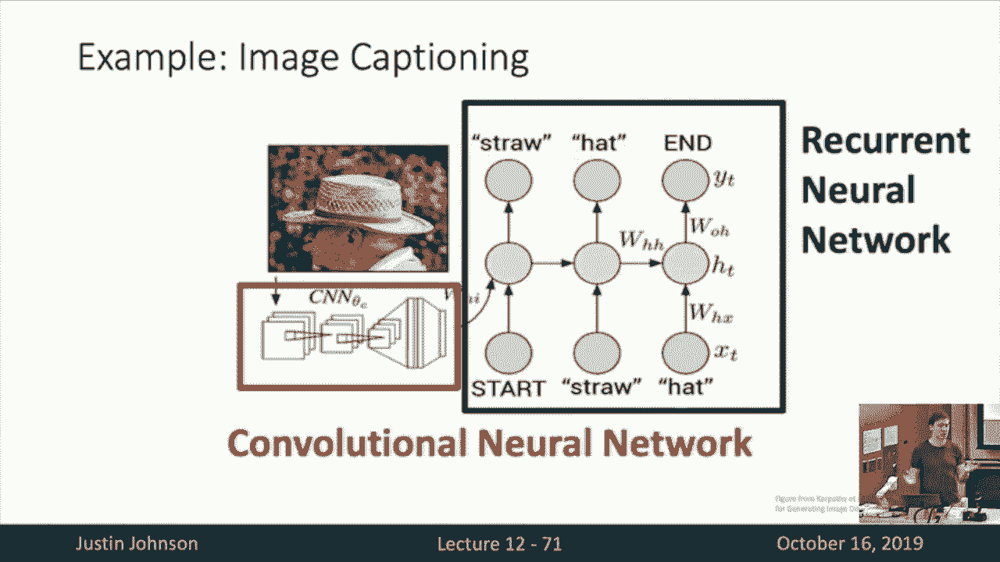

using normal gradient descent so to kind，of concretely look at what this looks。

like this is an example of transfer，learning so we're going to step one。

download a CNN model that had been pre，trained for classification on image net。

then we're going to chop off the last，two layers of that network and now we're。

going to have now here we actually want，to operate on sequences of finite length。

so unlike the language in the language，modeling case we're kind of mostly。

concerned with operating on these like，infinite streams of data and doing。

truncated back propagation through time，but now in image captioning we actually。

want to focus on sequences that have，some some actual start and actual end so。

then what we always do is then we start，the first element of the sequence is。

always a special token called start，which just means like this is the start。

of a new a new sentence that we want you，to generate so then now but now we need。

to somehow connect the data from the the，convolutional neural network into the。

recurrent neural network so the way that，we do this is we slightly modify the。

recurrence formula that we use for，proper producing hidden states of the。

recurrent neural network so recall that，previously we had seen this recurrent。

neural network that applies a linear，transform to the input a linear。

transform to the previous hidden state，and then squashes through at an H to。

give the next hidden state well now to，incorporate the image data we're gonna。

have three inputs at each time step of，the neural network we're going to have。

the current element of the sequence that，were processing we're going to have the。

previous hidden state and we're also，going to have this feature that was。

extracted from the top of this，convolutional neural network pre trained。

on image net so now given these three，inputs we will apply a separate weight。

or linear projection to each of these，three different inputs，add them together and again squash to。

@nh so now you can see that we've，modified the recurrence relation of this。

recurrent neural network that allows it，to incorporate this additional type of。

information which is the feature vector，coming out of the of the image and after。

that then things proceed very much like，they did，in the language modeling case so then。

what we do is in in sort of a test the，test time case um this is going to。

predict a distribution over the tokens，or the words in our vocabulary we sample。

from that distribution to get the first，word in this example man we say we pass。

that back to be processed by the，recurrent neural network as the next。

element of the input sequence pass it，again and then sample the next word and。

then this repeats so this would be man，in straw hat and then here's the answer。

to your question a special hope token，called stop or end so whatever we're。

whatever we're processing sequences of，finite length it's very common to add。

these two extra special tokens into the，vocabulary one called the start token。

that we put at the beginning of every，sequence and one called the end token。

that we insert that we that we do so，then during training we force the。

network to predict the end token at the，end of every sequence and then during。

testing once the network chooses to，sample the end token then we stop。

sampling and that's the end of the，output that we generate does that did。

that answer your question about how we，know when to stop good there was a。

question here yes the question is what's，the difference between blue and purple。

so here these these three inputs Green，is the input of the sequence of the。

current time step so that would be like，one of these one of these input tokens。

start man in straw hat that would be the，X at the current timestamp the H at the。

current time step is the blue thing，that's the previous hidden state from。

the previous time step of the sequence，which would be something like H when。

we're trying to predict h2 then then H，would be H 1 which is the privet the。

hidden state at the previous time step，and now the purple is the is the feature。

vector coming from the convolutional，neural network which we're calling V。

which is going to be a single vector，that we extract once from the。

convolutional Network and then pass it，to each of the time steps the recurrent。

neural network so with that so then for，each of these three inputs we have a。

separate Associated weight matrix with，width dimensions such that the they can。

be added in a way that doesn't crash，does that clarify a little bit ok。

so then once you once we've got this，then it's fun to look at some results。

for these things you know this computer。

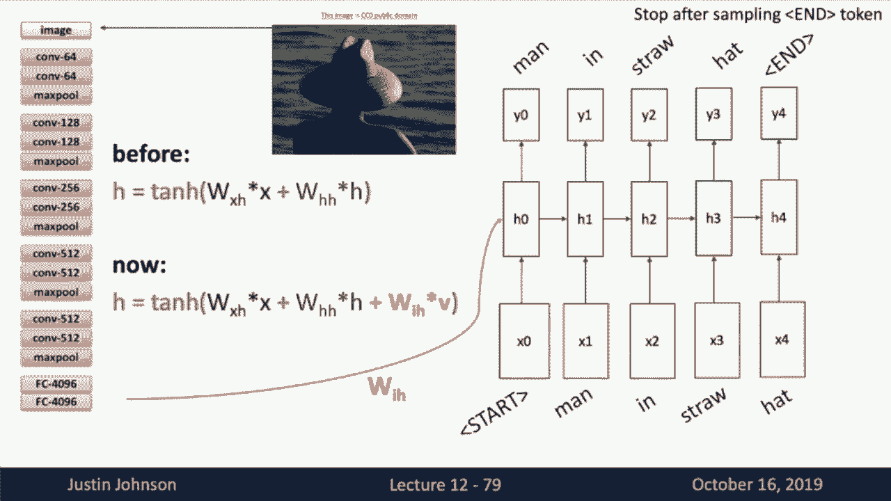

got a look at images we've got a look at，results and have a little fun so。

sometimes when you train this thing off，on a data set of images and associated。

captions sometimes these image，captioning models seem to produce really。

really shockingly good descriptions of，images so here the one at the upper left。

it says a cat sitting on a suitcase on，the floor which is like pretty good。

that's like a lot more detail than we，were able to get out of our previous。

with image classification models that，just output a single label or maybe in。

the upper right it says a white teddy，bear sitting in the grass that looks。

pretty correct at the bottom it says two，people walking on the beach with。

surfboards a tennis player in action on，the court so it's like giving us these。

really non-trivial descriptions that，seem really exciting so when these first。

papers came out that were first doing，these image captioning results they got。

people really excited because for the，first time these these networks were。

saying very non-trivial things about the，images that they were looking at they。

were no longer just single labels like，dog or cat or truck but these image。

captioning models actually it turns out，are not that smart and it's actually。

really instructive to look at the cases，where they fail as well so here's an。

example if we feed this image to to the，to a trained image caption model it says。

a woman is holding a cat in her hand，which I think it says that because。

somehow the texture of the woman's coat，maybe looks kind of like the texture of。

cat fur that it would have seen in the，training set or here if we look at this。

it says a person holding a computer，mouse on a desk，well that's because this data set came。

out before iPhones were prevalent so，whenever someone was holding something。

near a desk it was always a computer，mouse another cell phone here it says a。

woman is standing on a beach holding a，surfboard which is like completely wrong。

but the data set where this was trained，has a lot of images of people holding。

surfboards on beaches so basically，whatever it sees someone standing near。

water it just wants to say it's a person。

holding a surfboard on the beach even if，that's not actually what's in the image。

at all we have a similar problem in this，example so this is uh you can maybe this。

is hard to see it's a spiderweb kind of，in a branch and it says a bird is。

perched on a tree branch again maybe，it's just sort of copying whatever it。

saw a tree branch there was always a，bird there so whenever it sees that。

branch just wants to say a bird perched，on a tree branch even if that's actually。

not what it says at all maybe one more，example here it says a man in a baseball。

uniform throwing a ball so now this one，I think it's really interesting right。

because it knows it's a man of baseball，uniform but it kind of gets confused。

about exactly what action is happening，in the scene but when we look at this we。

have this human understanding of like，physics and we know that there's no way。

he could have like throwing a ball from，that position so we know that he's。

probably like scoot diving in there to，try to catch the ball but that kind of。

fine-grain distinction is just something，that's completely lost on this model so。

I think these image captioning models，are pretty exciting but they're actually。

like still pretty dumb and they're not，there they're pretty far from solving。

this computer vision task and I think，that's really in really get that sense。

when you look at these failure modes so，now and by the way these image。

captioning um you'll have fun you'll get，to implement your own image captioning。

model on the fourth homework assignment，which will be out shortly after the。

midterm so now another thing we need to，talk about is gradient flow through。

these recurrent neural networks so here，is a little diagram that kind of。

illustrates pictorially what's going on，in this vanilla or Elliman recurrent。

neural network that we've been，considering so far so here is showing。

the processing for one time step of the，recurrent neural network so here we have。

the input XT coming in at the bottom we，have the previous hidden state HT coming。

in at the left then you can imagine that，these are concatenated and then up then。

have this linear transform by the weight，matrix and then squash this tannish。

non-linearity so now you should be able，to point recognize some problems about。

what's going to happen during the，gradients in the backward pass of this。

model so if we imagine what happens，during the backward pass at this model。

then during back propagation we're going，to receive the derivative of the loss。

with respect to the output hidden state，at HT and we want to compute and we need。

to back propagate through this little RN，n cell to compute the gradient of the。

loss with respect to the input hidden，state HT minus 1 and now there's sort of。

two really bad things that are happening，in this back propagation one is that。

we're back propagating through at an H，non-linearity and we told you repeatedly。

that 10h nonlinearities were really bad，and you should have used them so that。

already seems like a potentially up，but you know these aren't ends were。

invented in the 90s they didn't really，know better back then so maybe we can。

excuse that but another big problem that，happens when back propagating through。

this recurrent neural network is that，when we back propagate through this。

matrix multiply stage that actually then，during back propagation it's going to。

cause us to multiply by the transpose of，elite matrix right because you know when。

you back propagate through a matrix，multiplication then you're going to。

multiply by the transpose of that way，matrix so now think about what happens。

when we have not just a single recurrent，neural network cell but now we're。

unrolling this recurrent neural network，for many many times steps now you can。

see that as the gradient flows backward，through this entire sequence then every。

time we flow through this recurrent，neural network cell then it's going to。

multiply the upstream gradient by this，weight matrix so then during back。

propagation we're going to take our，gradient and just multiply it over and。

over and over and over again by this，exact same weight matrix W transpose and。

now this is basically like really bad so，suppose here I'm only showing four in。

the slide but imagine we're unrolling，the sequence for like 100 or 200 or。

thousand time steps so then during back，propagation we're multiplying by the。

same matrix a thousand times now that，can go really bad in two ways one is。

that if the largest sink it's sort of，intuitively if the matrix is too big as。

measured by its largest singular value，then multiplying by the same matrix。

repeatedly is going to cause it to just，blow up and explode to infinity on the。

other hand if that weight matrix is，somehow to small as measured by its。

smaller say smallest largest singular，value being less than one then that then。

those gradients will just tend to shrink，and disappear and vanish towards zero。

during back propagation and the only，possible way that so then basically。

we're caught on this knife edge where if，the singular value is just a little bit。

greater than one then will our gradients，will explode to infinity if our great if。

our singular value just a little bit，less than 1 then our gradients will。

vanish to 0 and we'll have this either，this exploding gradient problem or this。

vanishing gradient problem as they're，called and the only way we can get this。

thing to Train is so if somehow we，arranged for our weight matrix have a。

say all its singular values exactly 1，and that's the only way we're gonna be，of this kind。

network I'm over sober very very long，sequences so that seems like a problem。

so there is one kind of a hack that，people sometimes use to deal with this。

exploding gradient problem called，gradient clipping so here remember here。

what we're doing is like we're not using，the true gradient in when we're doing。

back propagation so after we compute the，gradient of the loss with respect to the。

hidden state we check the nuke Lydian，norm of that vector because you know the。

grading of the loss or the spec of the，hidden state is just a vector and then。

if if the Euclidean norm of that Grady，of that local gradient is too high then。

we just we just multiple it we just clip，it down and cause it to be smaller and。

we continue back propagation so now，basically what we're doing with this。

idea of gradient clipping is that we're，computing the wrong gradients on purpose。

that will hopefully not explode or not，not explode at least so this is like。

kind of a horrible dirty hack it means，you're not actually computing the true。

gradients of the law of the law so we，can spec to the model weights anymore。

but this is a heuristic that people，sometimes use in practice to overcome。

this exploding gradient problem now the，other problem is what do we do how do we。

deal with these vanishing gradients and，how do we avoid this problem of singular。

values being very very small well here，kind of the the basic thing that people。

do is they throw away this architecture，and they use a different flavor of。

recurrent neural network instead so here，so far we've been talking about this of。

vanilla recurrent neural network but，there's another very common variant。

people use instead called long short，term memory or LST M LST M very common。

acronym you should get to know very well，and what's the mate and here this is a。

slightly complicated and confusing，looking functional form and it's not。

really clear at the outset when you，first see these equations like what's。

going on or why this is solving any，problems whatsoever but basically the。

intuition of this LST M is that rather，than keeping a single hidden type a。

hidden vector at every time step instead，we're going to keep two different hidden。

vectors at every time step one is called，CT the cell state and the other is HT。

the hidden state and then we're going to，use the at every time step we're going。

to use the previous hidden state，well as the current input to compute for。

different gait values I fo and G and，those will be used to compute that out。

the updated cell state and then also be，used to compute the updated didn't state。

I also think it's interesting to point，out that this paper actually was。

published in 1997 that proposed this LS，TM architecture and maybe for the first。

10 years it came out it wasn't very well，known and then stopped starting around。

about 2013 or 2014 people sort of，rediscovered this LS TM architecture and。

it became very very popular again，starting around that time and nowadays。

this LS TM architecture is what is a，very widely is one of the most commonly。

used recurrent neural network，architectures used to process sequences。

in practice but then to unpack a little，bit more about what this thing is。

actually doing let's look at it this way，so here what we're doing is that at，every time step。

we're receiving some input XT and we are，also receiving the previous hidden state。

HT minus 1 and now just like the，recurrent neural network we're going to。

concatenate the input vector XT and the，previous and the previous vector HT。

minus 1 concatenate them and then，multiplied by multiply them by the by。

some weight matrix but now in the，recurrent neural network in the vanilla。

or Elmen recurrent neural network case，the output of this matrix multiplication。

basically was the next hidden state up，to a non-linearity but now for the this。

LS TM instead what we did the the output，of this matrix multiplication we're。

going to carve up into four different，vectors each of size H where H is the。

number of elements in the hidden unit，and these will be called these four。

gates the input gates the for the the，forget gauge the output and this other。

one I don't know what to call it I just，called the gate gate because I can't。

think of a better name but the intuition，here is that now rather than using the。

rather than directly predicting the，output from this matrix multiply instead。

we predict these four days and then we，use these four gates to put up date the。

cell state and update the hidden state，so you'll notice that these four gates。

each go through different nonlinearities，so the input for get an output gate all。

will all go through a sigmoid，nonlinearity which means they're all。

going to be between zero and one and now，the gate gate goes through at an H。

non-linearity which means it's between，minus 1 and 1 so now if you look at this。

region in Ooty or in CT you can see that，in order to compute the next cell state。

what we do is we take the previous cell，state C t minus 1 and we multiply it。

element-wise by the forget gate so now，the forget gate remember is all elements。

between 0 and 1 so then the forget gate，has the interpretation that it tells us。

for each element of the cell state do we，want to reset it to 0 or continue。

propagating that element of the cell，state forward in time that's that's how。

we use the forget gate and then we add，then ER and then we also add on the。

element wise product of the input gate，and the gate gate so now the gate gate。

is kind of remember between negative 1，and 1 so that's kind of what we want to。

write into the cell state at every point，every element of the cell state and now。

the the input gate is again between 0 &，1 because it's a sigmoid that we element。

multiply element wise with the gate gate，so in kind of the entry into the。

interpretation is that the gate gate is，it all tells us at every at every point。

in a cell we can either add 1 or，subtract 1 and the input gate tells us。

how much do we actually want to add or，subtract at every point in the cell so。

that's how we use the input forget and，gate gates and now to compute the final。

output state we're going to do is take，the cell state squash it through at an H。

non-linearity and then multiply，element-wise by the output gate so now。

that the interpretation here is that the，cell state is this kind of internal。

hidden state that's internal to the，processing of the lsdm and the LS TM can。

choose to reveal parts of its cell state，at every time step as modulated by the。

output gate so then the output gate，tells us how much of each element of the。

cell do we want to reveal and put in，place into the hidden state because we。

could put we couldn't write we put could，put the out part if we put some element。

of the output 8 to 0 then it would be，sort of hiding that element of the cell。

and keeping it as kind of a private，variable internal to the lsdm so there's。

kind of a tradition in explaining L，STM's that you've got to have a number。

of very confusing diagrams to try to，explain them so here's mine so one way。

that you can look and at the processing，of a single LS TM is that we receive。

from the left and from we received two，things from the previous time step we。

were to receive the previous cell state，CT minus 1 and the previous hidden state。

- one and now we concatenate the，previous hidden state and the current。

input XT we multiply them by this weight，matrix W and then we divide them up into。

these four gates and then we use these，four gates to compute the the cell state。

the next cell states ECT that we're，going to pass along to the next time。

step as well as produce the next hidden，state HT that will pass on to the next。

time step and now what's interesting，about looking at the LOC on this way is。

that it gives us some different，perspective on gradient flow through the。

LST on especially compared to the，vanilla RN so now if you imagine back。

propagating from the next cell state C T，back to the previous cell state CT minus。

one now you can see that this is a，fairly friendly gradient pathway because。

in when we back propagate this then we，first back propagate through a sum node。

so then what I remember when we back，propagate through a sum node then what。

happens yeah that we copy the gradients，so back propagating through a sum is。

very friendly so that's not gonna kill，the information so you first hit this。

sum node and that's that's just going to，distribute the gradients down to the。

inner parts of the LST M as well as，backward in time to the previous cell。

state and then we back propagate through，this element wise multiplication with。

with the forget gate so now this this，has the potential to destroy information。

but this is not directly back，propagating through a sigmoid，non-linearity that from the perspective。

of computing the derivative with respect，to the previous cell state this is just。

multiplies just back propagating through，this element wise constant multiply we。

were multiplying by a constant between，zero and one so now this again has the。

potential to destroy information if that，forget gate is very close to zero but if。

the forget gate is very close to one，then back propagating backwards to the。

next cell state or to the previous cell，state is basically not going to destroy。

and for any information so now there's，no what you'll notice is that when we。

back propagate from the next cell state，to the previous cell state then we are。

not back back propagating through any，nonlinearities and we're also not back。

propagating through any matrix，multiplies so this top level pathway。

through the LS TM is now a very friendly，pathway for gradients to propagate。

backwards during the backward pass so，now if you imagine kind of chaining，after。

to process along sequence then this，upper pathway through all the cell。

states kind of forms this uninterrupted，gradient superhighway along which the。

model can ease very easily pass，information backwards through time even。

through many many time steps so this，this form because now we see that this。

kind of funny formulation of the lsdm，basically the whole point of it is to。

achieve these better dynamics of the，gradient flow during a backward pass。

compared to the vanilla RNN yeah yeah so，we do the question is we still do need。

to back propagate through the 1/2，through to the weights so that could。

potentially give us some problem but，kind of the hope here is that for the。

vanilla RNN our only source of gradient，is coming through this very long long。

set of time time dependencies so then if，our information gets very diluted across。

these many many time steps then we can't，learn but now for the LS TM there's。

always going to be some pathway along，which information is kind of preserved。

through the backward pass so you're，correct that when we back propagate into。

the weights then we are going to back，propagate through a matrix multiply and。

through these nonlinearities but there，exists a pathway along which we do not。

have to back propagate through any，matrix multiplies or any non linearities。

so the hope is that that would be enough，to keep the flow of information going。

during the learning process yeah yeah so，the solution still has some HT at the。

end and usually for an LS TM the cell，state is usually considered kind of a。

private variable to the LS TM and then，usually you use the hidden state HT to。

either predict your to do whatever，prediction you want on the output of the。

lsdm it's now also this design of the LS，TM as sort of giving us this。

uninterrupted gradient superhighway，should remind you of another。

architecture that we've already seen in，this class can anyone guess yeah the。

rezident so remember that in the，residual networks we had this problem of。

training very very deep convolutional，neural networks with perhaps hundreds of。

layers and there we saw that by adding，adding these additive skip connections。

between layers and a deep convolutional，network then it gave us very good。

gradient flow across many many many，layers and is basically the same idea。

with the LS TM that we've got these，additive connections that are now giving。

us this uninterrupted gradient flow not，across many many layers but。

many many time steps in time so I think，the LST m and the resna actually share a。

lot of intuition and kind of is as a fun，pointer there's another kind of a thing。

called the high highway network that，actually came out right before resonance。

that looks even more like an LS TM that，all that kind of cement these these。

connections a little bit more so you can，check that out if you're interested in。

those those connections any any，questions about this LS TM if we move on。

to something else yeah yeah the question，is like how do you how do you possibly。

come up with this well it's called，research so I mean it's this this。

iterative process of you have some idea，that maybe I have this idea this that I。

think if I do this thing then things，will improve and then I try it and it。

doesn't work then I have another idea，and I try it and it doesn't work and I。

have another idea and I try and it，doesn't work and then eventually you can。

have an idea or maybe not you but，somebody is gonna come up with an idea。

sorry I don't mean you specifically I，mean kind of you generically or me。

generically right any individual person，you know it'd be troubling but then as a。

community hopefully over time eventually，someone will come up with an idea that。

actually works well that then gets，adopted by the community and if you look。

at the development of the lsdm actually，it got more complex over time so kind of。

it I actually this would be kind of fun，to go to read this history of papers and。

see exactly how it developed but kind of，it they start with one thing and then。

they make it a little bit more，complicated it works better and you kind，of iteratively。

refine these things over long periods of，time but yeah if I knew how to come up。

with things as impactful as the LST I'm，like oh man that'd be awesome。

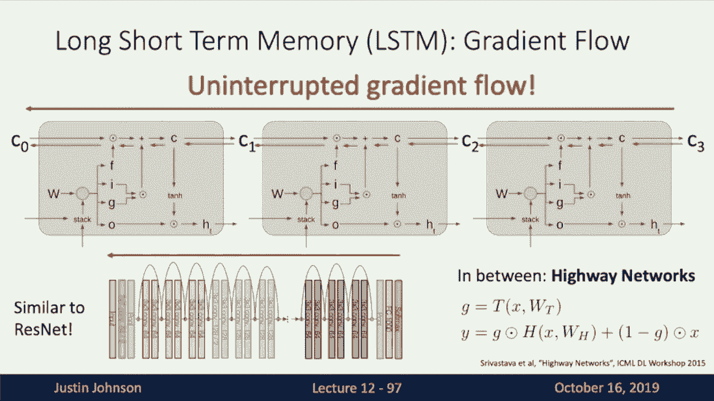

okay so then so far we've talked about，okay so then so far we've talked about。

single layer RNN so this is something i，just want to briefly mention right that。

we've got this process the sequence of，inputs we process we produce this。

sequence of hidden layers and we use，this sequence of hidden hidden hidden。

vectors to produce a sequence of outputs，well we've seen sort of from processing。

images that more layers is often better，and more layers often allows us to，achieve models。

perform better on whatever task we want，to use so clearly we'd like to have some。

way to apply this this intuition of，stacking layers I'm also too recurrent。

neural networks so we can do that by，just applying another recurrent neural。

network on top of the sequence of hidden，states that are produced by a first-year。

Network current or network so this is，called a multi-layer or deep recurrent。

neural network so here the idea is we've，got one recurrent neural network that。

processes our raw input sequence and，then produces the sequence of hidden。

states and now that sequence of hidden，states is just treated as the input。

sequence to another recurrent neural，network that n produces its own second。

sequence of hidden states you know and，you don't have to stop with two you can。

stack these things as far as your GPU，memory will take you or as far as much。

space you have on the slide in this case，but you can imagine stacking these。

recurrent neural networks to multiple to，many many layers I think in practice for。

recurrent neural networks it's actually，know you'll often see improvements from。

like maybe up to the three or five，layers or so but I think in recurrent。

neural networks it's really not so，common to have these extremely extremely。

deep models like we do for convolutional，networks yeah it was our question yeah。

so the question is do we use the same，weight matrix for the for these。

different layers or different weight，matrix for these different layers and。

usually you would use different weight，matrices for these different layers so。

this is kind of so you should think of，each of these layers in of RN n is kind。

of like the layers in our convolutional，Network so then at every layer in a。

convolutional Network we typically use，different weight matrices um and very。

similarly will often use we'll also use，different weight matrices at every layer。

in this deep recurrent neural networks，so then kind of going back to this other。

question about how people come up with，these things there's actually other。

different architectures I mean this is，something that you can imagine people。

play around with a lot but it's very，into it it's very appealing to think。

like oh maybe I can just like write down，a better equation for a current neural。

network and we'll just make all of our，problems go away so you'll see a lot of。

papers that try to play around the exact，architecture in the exact update rules。

of different recurrent neural networks，so there's like a ton of papers about。

this that you'll see I'm one that I want，to point out and highlight is this one。

on the left called the gated recurrent，unit that looks kind of like a，simplified version of an LSD。

I don't want to go into the details here，but it has this similar interpretation。

of using additive connections to improve，the gradient flow and as compass compute。

power has gotten cheaper and cheaper，then people have also started to take。

brute-force approaches to this as well，so there was a paper from a couple years。

ago I liked where they used evolutionary，search on the space of update formulas。

and they did a brute-force search over，tens of thousands of update formulas for。

different where each update formula then，gives rise to different recurrent neural。

network architecture so rather than，trying to come up with it yourself you。

just have some algorithm that，automatically searches through update。

formulas and then tries these different，update formulas on different tasks and。

what they found is that so here are，examples of three of the update formulas。

that this paper found um but kind of the，general takeaway is you know no nothing。

really works that much better than an LS，TM so let's just stick with that so I。

think maybe the interpretation here is，that there's actually a lot of different。

update formulas that actually would，result in similar performance across a。

large number of tasks and then maybe the，LST on is just happens to be the one。

that people discovered first and it has，kind of a nice historical precedent so。

people continue using it we also talked，a couple lectures ago about this area of。

neural architecture search where you，train one neural network to produce the。

architecture of another neural network，we saw that in the context of。

convolutional I mean we didn't see in，detail but we saw very briefly in the。

context of convolutional networks and it，turns out people have also applied。

similar ideas to recurrent neural，network architectures as well so here。

there was a paper from Google where they，now have actually one recurrent neural。

network predict the architect of predict，the architecture of the recurrent neural。

network cell encoded as a sequence and，then train that thing on hundreds of。

GPUs for a month and then eventually at，the end of training then you get this。

learned architecture on the right that I，guess worked a little bit better than。

lsdm but I think the takeaway is from a，lot of these papers is that the even。

this these lsdm and gru architectures，that we already have are actually pretty。

good in practice and even if they're not，perfectly optimal they tend to perform。

well across a wide variety of problems，so then kind of a summary today is that。

we introduced this whole，new flavor of neural networks called。

Roker neural networks I hope I convinced，you that they're cool and interesting。

and let you solve a lot of new types of，problems and we saw in particular how。

this LS TM improves the gradient flow，compared to these vanilla of recurrent。

neural networks and we finally saw this，image captioning example that let us。

build neural networks that write natural，language descriptions of images that。

you'll get to do on your fourth，assignment but before we get to the。

fourth assignment coming on next time，will be the midterm so hopefully that。

will be fun on Monday and I'll see you。

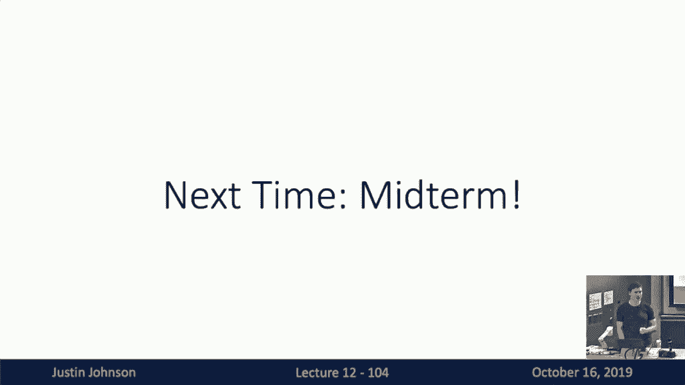