# P18：L18- 深度学习中的视频处理 - ShowMeAI - BV13P4y1t7gM

so welcome back to lecture 18，so welcome back to lecture 18，and today we're going to talk about。

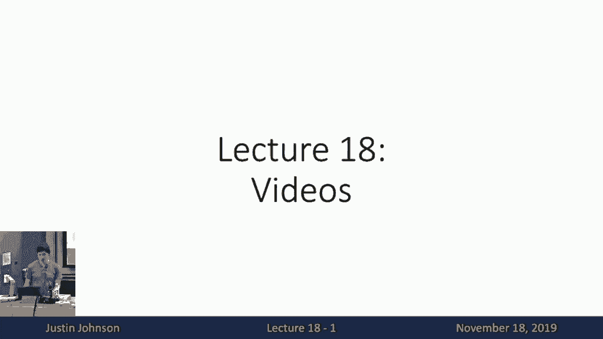

videos so uh last time we so for the，majority of the class，we have been talking about this this。

task of 2d image recognition，um so for example we spent a long time。

diving into a lot of details about，different ways to build image。

classification systems with with deep，learning，and over the past a couple weeks ago we。

spent two lectures talking about，moving beyond image classification and。

really stepping into understanding and，recognizing 2d shapes of objects in，images。

and that led us to tasks like semantic，segmentation object detection instant，segmentation。

key point prediction panoptix，segmentation and all these other sort of，2d shape prediction tasks。

and then in the last lecture we pushed，beyond the second dimension，and started talking about ways to。

represent 3d shapes with，deep neural networks so in the last，lecture we talked about predicting。

taking as input a 2d image and，predicting the 3d shape，or we talked about ways for processing。

3d input shapes，and then making different classification，decisions and of course we did that in。

the context，in order to do that we needed to define，these different types of 3d shape。

representations，um so it turns out that you know it's，pretty complicated to represent shapes，in 3d。

and we actually needed to define these，different sorts of representations。

to represent 3d shapes and they all had，their own pros and cons。

and we saw how we can build how we could，build neural network models that could。

deal with all these sorts of，all these different types of 3d shape，representations。

well um so last lecture was really about，pushing uh convolutional networks from。

two-dimensional stuff to。

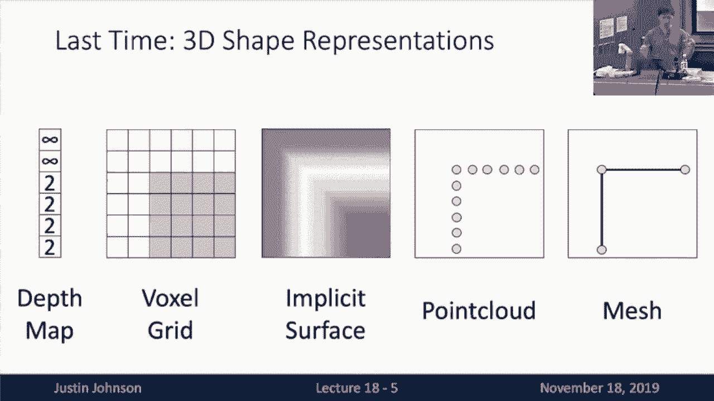

three-dimensional stuff and we did that，by adding this third spatial dimension。

and now today there's actually another，way that we can imagine augmenting our，neural network models。

with an additional dimension um so last，time we talked we added an extra，dimension of space。

um today we're instead going to add an，extra dimension of time。

so when you think about what is a video，a video is basically a sequence of。

images that unfold over time，um so this is basically another way to。

deal with 3d representation this is，another sort of 3d type of，representation。

um that that we can work with with deep，neural networks，except that now um unlike the unlike。

having three spatial dimensions like we，did in the previous，lecture um instead now we have two。

spatial dimensions，and one temporal dimension and that will，that will lead to a lot of additional。

challenges，because as it turns out we might want to，do different sorts of things to。

represent the spatial dimensions，and the temporal dimension in maybe。

different ways and we might want to，treat them differently depending on the。

the structure of the task we're working，about，um so then for all for pretty much。

everything that we're going to do in，videos，our networks are basically moving from。

these three-dimensional tensors that，we've worked with from 2d data，and instead moving to these。

four-dimensional tensors so for example，we can look at a video。

as a four-dimensional tensor that has t，being the time，or temporal dimension three is the。

channel dimension which is maybe three，uh colors rgb channels for the raw input，video。

and then two spatial dimensions h and w，um and actually we'll see that。

for exactly what type of architecture，you use for video stuff，you might sometimes transpose those。

first two dimensions so sometimes we'll，want to put the temporal axis first。

and sometimes we'll want to put the，channel axis first and we'll see cases。

where we want to use either those two，different representations。

but the basic idea is that a video is，just a four dimensional tensor。

we've got one spatial dimension one，temporal dimension two spatial。

dimensions and one channel dimension，and we need to figure out ways to to。

build deep neural networks that can work。

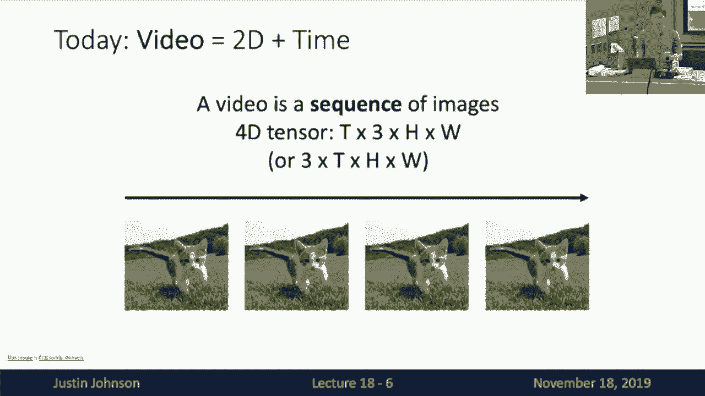

with this sort of data，so as a kind of motivating task that，we'll use to motivate a lot of our。

architectures on video，we'll imagine this task of video，classification。

so here this is basically the analog of，the image classification task that we've。

seen many many times，except extending it in time so now the，network will accept some input video。

that will be a stack of rgb frames and，the system will be we'll need to select，some category label。

that classifies the action or activity，or a semantic category of that input，video。

and just as in the image classification，case the system will be aware of some。

fixed set of categories at training time，um and we'll have a training data set。

that associates a set of videos，with some labeled with some labeled，category label。

and i think we don't even need to talk，point，because it's clear that we would train。

the system with a kind of cross-entropy，loss function，um so that just as we've seen in all the。

other classification problems in this，in this semester so then the entire the。

entire trick that we need to solve is，how do we go from this four-dimensional。

four-dimensional input tensor to this，vector of scores that we can use to。

train our cross-entropy loss function。

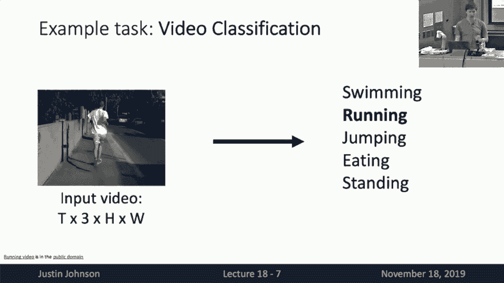

and train these video classification，systems，well um before we talk about concrete，architectures。

it's useful to to point out exactly what，are the types of things that we want to，recognize。

in videos so when we're doing 2d，recognition tasks，we're often recognizing objects and we。

all know and objects are like things，that have some kind of spatial extent or。

or identity in the world，so when we recognize 2d images we might。

want to recognize on like dogs or cats，different types of animals。

or maybe inanimate objects like bottles，or cars，so that's kind of what we usually try to，classify。

when we're working with two-dimensional，input images，and then when we are working with。

three-dimensional video sequences，the thing that we usually want to。

classify are actions or activities，so these are things like maybe swimming。

or running or jumping or eating or，standing，and you can see that kind of when in the。

two-dimensional case we're trying to，recognize nouns grammatically。

and then in the three-dimensional case，we're often trying to recognize verbs。

so the nature of the categories that，we're trying to recognize in video。

is often very different than the types。

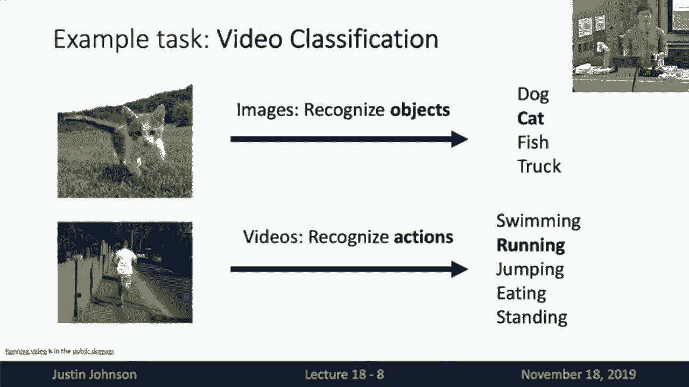

of categories we want to recognize，out。

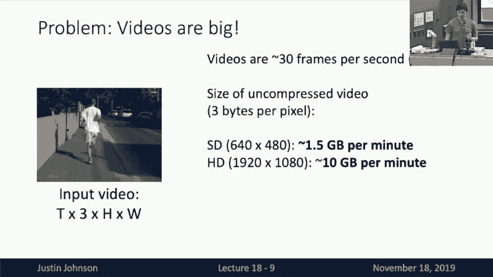

is that most of the time in，most of the verbs that we usually care，to recognize in videos。

are actually not just arbitrary actions，but actually actions that human beings，are performing。

so actually the majority of video of，video classification data sets that，you'll find out there。

most of them most of them have object，have a category labels，that correspond to different types of。

actions or activities，that people can do because it turns out，that that's maybe a thing that。

we are really interested in one really，important thing that we want to use deep。

learning for to analyze videos，is to recognize what people are doing in，videos。

so that's just kind of to point out the，types of category labels。

that we usually are trying to predict in，video classification data sets。

so maybe keep that in mind keep that，distinction in mind about。

nouns versus verbs as we move through uh，different concrete。

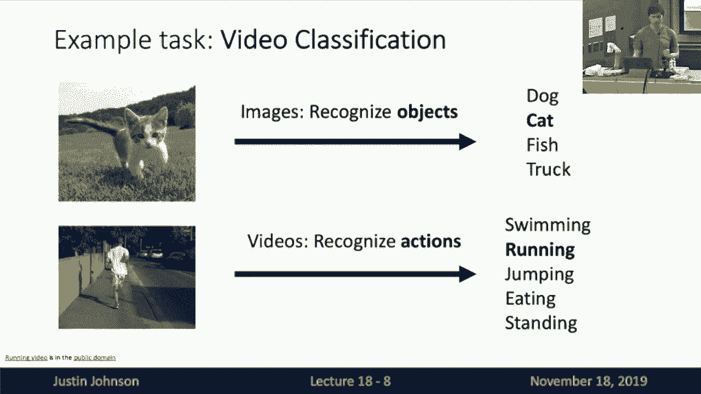

architectures so the big problem，with videos is that they are really big。

right this is the main constraint that，we have that we need to overcome。

when dealing with video data so if we，try to work at this naively。

well um something like a tv show or a，movie is often，shot at like 30 frames per second for。

most tv shows，or 24 frames per second for most movies，and now if we just。

figure out what is the size of raw，uncompressed video files，they end up being absolutely massive so。

if you imagine that we have，maybe a standard res a standard，definition video stream。

then it has a spatial resolution of 640，by 480 in pixels，and if we have that at 30 frames per。

second then just storing the，uncompressed video stream of a standard。

of a standard definition video stream，comes out to about 1。5 gigabytes of data。

per minute and this is um because this，is raw uncompressed video。

where we need to represent each pixel，with three bytes one for the red one for。

the green one for the blue，so when you multiply all that out um it。

actually takes a lot a lot of data to，just store on raw uncompressed video。

um and uh if we if we move to maybe high，definition video，then uh sort of a full hd video would be。

at 1920 by 1080，and that's up at 10 gigabytes per minute，if we're storing it in this sort of raw。

uncompressed form，um so this is going to be like，absolutely catastrophic for for dealing。

with videos in neural networks，if the uncompressed video just using a。

byte representation of pixel values，is going to be this big there's。

absolutely no way that we can possibly，fit such large video sequences into our，gpu memory。

right because um you know a standard，state-of-the-art gpu might have。

something like 12 or 16 or 32 gigabytes，of memory，and that memory needs to hold not just。

the raw video but also all the，activations of our network，as well that we need to process on top。

of those pixels so as a result there's，we can see from just running these，to。

build deep neural networks that actually，process the raw，temporal and spatial resolution of the。

types of videos that we usually watch，so the solution is of course we need to。

make the data a lot lot smaller，if we're actually going to process it。

with deep neural networks so when we，talk about video classification。

usually what we mean is that we're，training neural networks that classify。

very very short clips of video that are，typically something like three to five。

seconds in length and then um to make it，even more tractable，we'll often temporarily subsample those。

clips so they are so they're at a very，very low frame rate，so rather than something like 30 frames。

per second we might have like five，five frames per second and then we'll。

also tend to heavily spatially down，sample the spatial resolution of the。

video frames of the video clips that we，work with as well，so as if you recall that when we worked。

with um maybe image classification，it was common to use image resolutions。

of something like two two four by two to，four，but now um in order because of these。

these constraints of working with video，when we work with classifying video。

clips we'll often down sample the，spatial resolution to something like 112，by 112。

so that's actually a very very low，resolution video and like if your。

netflix stream dropped to a video，resolution of 112 by 112 you'd probably。

be very very sad as a viewer，but due to computational constraints um。

that's kind of the the world the video，world that our neural networks are going，to have to live with。

maybe until our memory gets much much，bigger so this is just to kind of ground，the problem。

that even though when we think about，processing videos with neural networks。

we think about kind of maybe processing，hours hours long video。

but in practice that's really not what，we do that just due to these，computational constraints。

we're really forced to to work only on，very very short clips that are very。

small in size and very small in time，um so this is kind of the what we this。

is kind of the setup of these video。

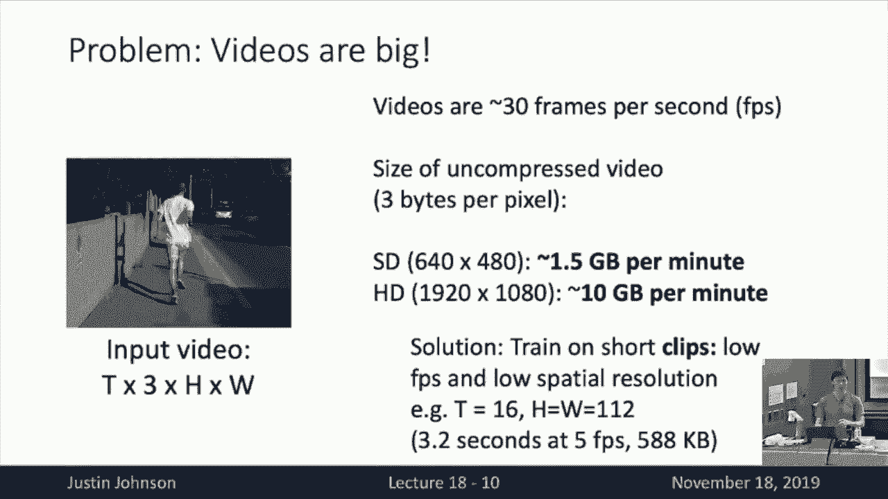

classification problems，that we're usually working with so then，maybe to make this a little bit more。

concrete um in in the raw video it would，be very very long and have a very very，high frame rate。

but during training we would um have to，take very very short clips of these very。

very long video sequences，and then actually subsample them in time，as well to reduce the frame rate。

um and then our the models that we would，train that we would train our models on。

these very very short clips，um so the idea is that maybe if this。

input video sequence had the category，label of running，then probably each of these little。

temporal clips that we could sample from，the video sequence，should also have the exact same label so。

when training our video classification，models，usually we'll take these these very very。

short clips from slightly longer videos，that we might get in the data set。

and then the model will be changed to，work on these very very short clips of，lower fps。

and then at test time often what we'll，do is take that model，which has been run on these very four。

very short clips and then apply it at，different positions at the full uh。

of the original video and this kind of，gives us uh，many different classification decisions。

for different sub clips of that raw，input video sequence，and then we'll make our final。

classification prediction for the video，by averaging the predictions of the the。

classifier when we run it on these，little different sub clips，so that's a little bit um of a kind of。

trick that we need to play，when we're working on video this video，classification problem。

um and then we then we get this kind of，mismatch between training and testing。

we're training we're doing these short，clips，and then testing will often ensemble a。

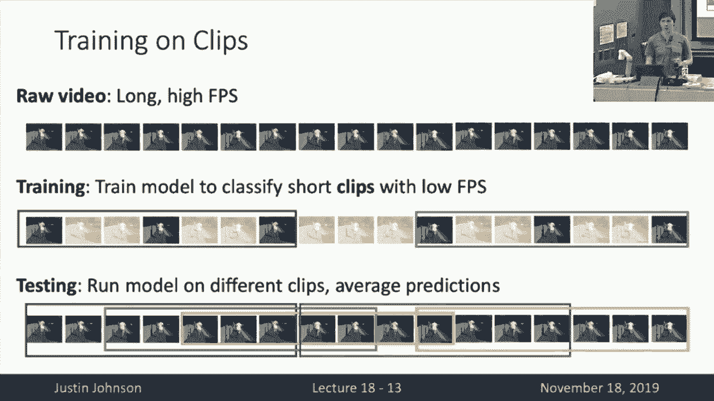

set of clips over this this longer video，sequence，okay so then let's actually talk about。

our very first video classification，model，um and this seems stupid but it actually。

works like really really well so the，idea is let's forget that we're working，on video。

and instead let's train a model that。

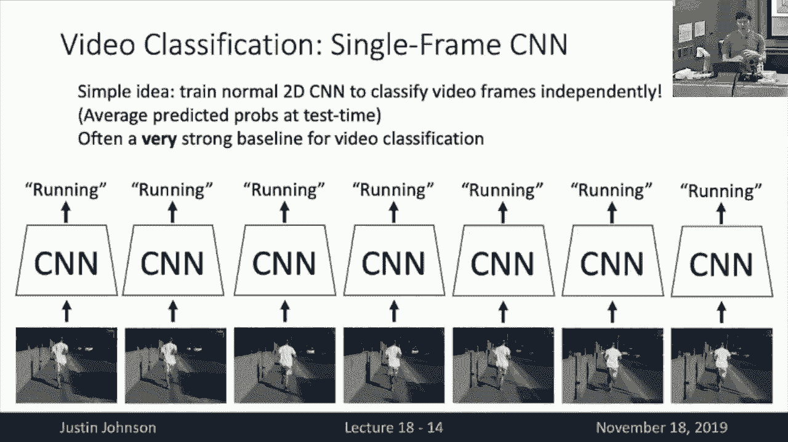

looks there's a standard two-dimensional，cnn，that is trained to classify the。

individual frames of the video，completely independently，so for example if this video sequence。

was uh was，supposed to have the action of running，then what we'll do is just。

chop up all the frames of that video，sequence into individual 2d rgb images。

and then train your favorite standard 2d，image recognition model。

on the individual frames of the video，sequence um and they will be trained to。

classify using the the label that we，should assign to the entire clip。

so and then at test time what we'll do，is simply uh，run this single frame model on every。

frame in the video，in the longer video sequence and then，average the predictions over all of the。

all of the video frames and this seems，like a really stupid model right because。

it's basically ignoring all of this，temporal structure in the data。

but it turns out that this is actually，like a really really strong baseline。

for many many different video，classification tasks，so we'll see some concrete numbers later。

but basically my advice is that you if，you find yourself in the regime of。

needing to build a practical video，classification system，do this first because it's very likely。

that this very simple straightforward，single frame baseline model，actually will work good enough in。

practice i think for many different，applications，that you might actually want to might。

might want to do in practice，um and then all of the kind of fancy。

temporal modeling that we'll talk about，the rest of the lecture，will be kind of like will not really。

will not usually make the difference，between the system working and the，system not working。

usually what it does is just kind of，bump the accuracy up from。

from pretty good to like maybe a little，bit better so uh i think you should，really not discount。

this very simple single frame baseline，when you're confronted with any kind of，video classification。

or video recognition task so definitely，do always try this first。

so then we can talk about a slightly，simpler a slightly more complex model。

that actually does take into account the，temporal structure of the video。

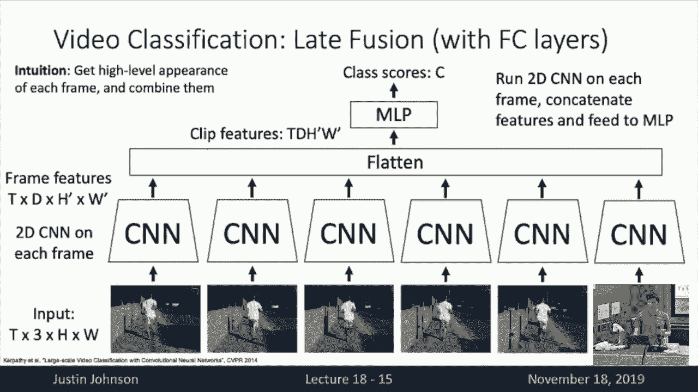

sequences that we're presented with，and this is this idea of late fusion so，basically。

what we did in this single frame，baseline is run a cnn，independently on every frame of the。

video and extracted in independent，classification decision，for every frame in the video and then at。

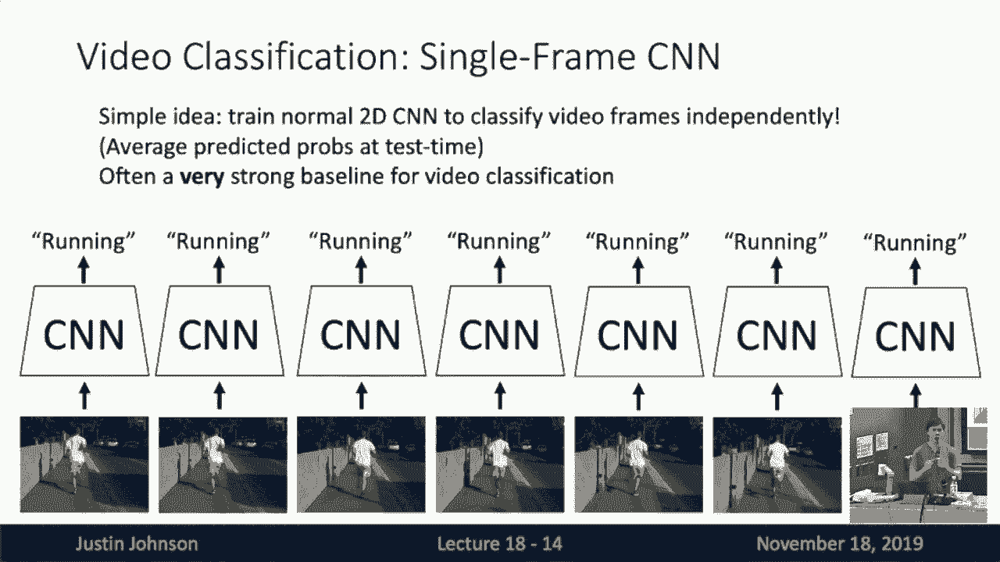

test time we kind of average those using，some averaging mechanism，now this late fusion approach is。

basically very similar，except that we're going to make the，averaging we're going to somehow build。

this this notion of averaging across，time，into the network itself so that the。

network can be trained in a way that's，aware，of the fact that we will be doing this。

this averaging at test time，so more concretely what we'll often do，with this idea of late fusion。

is that you'll be presented with this，the sequence of frames from your input。

video here at the bottom，that maybe has a temporal size of t for，tap for time，then。

we'll then we'll run your favorite cnn，architecture independently on each frame。

of the video sequence，and that will extract us some frame，level features。

so for each uh those will all come，operate completely and it can be。

operating completely independently，and will be your favorite 2d cnn。

architecture like a resnet or an alex，nat or a mobile mat or whatever suits，your fancy。

um and after running those those uh，frame，we will get these frame level features。

um that will maybe be，a one channel dimension and two spatial，dimensions。

and one temporal dimension so we've just，extracted uh convolutional features。

for each frame of the video sequence，completely independently，and now we need some way to kind of。

collapse or average or combine all of，these，all of these per frame independent。

features so one way that we can do that，is using a fully connected layer。

that we've seen in early image，classification architectures，so then what we could do is take it take。

our our per，frame features flatten them into one big，vector that now has shape。

t by d by h prime by w prime and then，apply some kind of，set of fully connected layers that moves。

from the flattened features，into our final class score c and then we，can train this thing with a。

cross-entropy loss as we often do，and this is called a late fusion，approach to video classification。

because we're kind of fusing the，temporal information at a very late。

phase of the classification pipeline，that we're doing all this independent。

per frame modeling with the cnns and at，the very end of the architecture we're。

kind of fusing information temporally，um so this approach to late so this is。

one of the earliest approaches to late，fusion that um people worked with。

and this was using fully connected，layers but just as we saw in the case of。

two-dimensional cnn architectures，using a lot of fully connected layers。

adds a lot of learnable parameters to，your network，and can lead to some kind of overfitting。

so in fact another way that we can，do late fusion is actually the same，trick that we did in image。

classification models，which is to replace the the fully，connected the flattened and fully。

connected operations，with instead some kind of average global，average pooling followed by fully。

conducted layers，so when we apply this this idea of，average pooling to the to the temporal，domain。

then we will still get these independent，per frame features using our favorite 2d，cnn architecture。

and now we will apply a global average，pooling layer that will pool。

both that will perform an average，pooling over all of the spatial，dimensions。

and over all of the temporal dimensions，so that will collapse out all the。

spatial information and all of the，temporal information，and leave us with just a d-dimensional。

vector that we can then apply，a class a set of a linear layer to to，get our final class scores。

so this is again a fairly simple，straightforward approach，that is a fairly easy and simple thing。

to try and this is a，this is again an example of late fusion，since we're doing all this independent。

modeling。

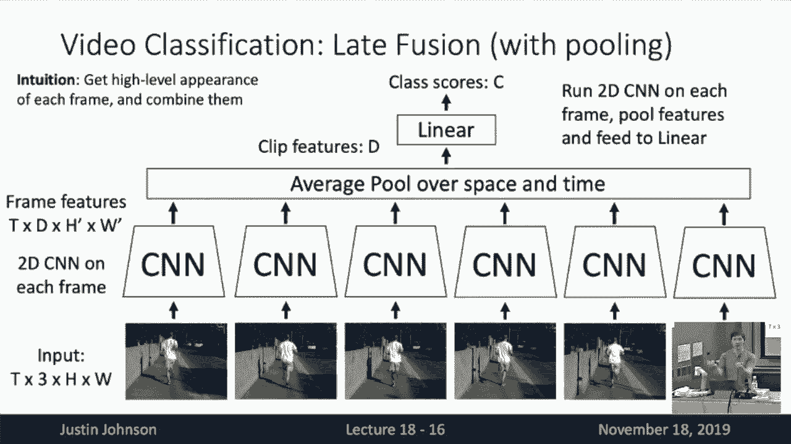

and then fusing all the temporal，information very late in the，but so now kind of a problem with this。

but so now kind of a problem with this，late fusion approach，actually。

somewhat difficult using this late，fusion approach to model very low level，pixel。

very low level motions of pixels or，features，between independent video frames so as。

an example if we look at，this this running these clips from this，running video here on this slide。

maybe one useful signal that the model，might want to use，when uh when classifying this video is。

running is the fact that his foot is，kind of moving up and down。

and maybe in one frame you see the foot，is down and then in the same location at，up。

and this motion kind of repeats，periodically at the very low level at。

the very low pixel level of the input，video sequence，now with this late fusion approach i。

think it's kind of difficult for the，network to learn to model，these very low level interactions。

between adjacent pixels in the input，video frames，because all because we're kind of um。

summarizing the entire，information about each frame in maybe a。

single vector so it's sort of difficult，for the network to compare these。

low-level pixel values between adjacent，frames so that i think is one。

intuitive shortcoming of this late，fusion approach，so given that this is called late fusion。

you should imagine that，you should anticipate that the the the，proposed solution to this。

would be early fusion so here the idea，is that um with late fusion we were kind。

of performing independent processing，on all of the video frames and then。

fusing the temporal information at the，end of the architecture，well we can actually do the opposite。

which is instead，fuse all of the temporal information of，the，of the architecture in the very first。

layer of the cnn，and we can actually do this using a two，our familiar friend of two-dimensional。

convolutions，so concretely again we have our input，video frame，our input sequence of video frames at。

the bottom here with a temporal，dimension，a channel dimension with rgb color。

values and then two spatial dimensions，of h by w，now we can actually trans we can。

actually reshape this four-dimensional，tensor，and interpret the the temporal dimension。

as a set of channels，so what we can do is then um sort of，imagine。

taking our our set of input video frames，channel，dimension and that will give us a。

three-dimensional tensor，with um a channel dimension of now three，by t。

which is just all of our rgb frames sort，of stacked along the channel dimension。

and then with our two of same spatial，dimensions and this sort of um concat。

and then basically we're concatenating，all of the frames along the channel，dimension。

and then we can then fuse all of this，temporal information，using a single two-dimensional。

convolution operator that now where the，number of input channels to the。

convolution is is 3t and the number of，output channels is whatever，we want in our convolutional。

architecture，so and then after this very first layer，that is performing this early fusion。

then the rest of the network can be，whatever kind of standard，two-dimensional convolutional。

architecture we want，because after this very first layer，we've collapsed all of the temporal。

information，and we just have a sort of，three-dimensional tensor to work with。

and after that we can use our favorite，2d architecture，and this hopefully maybe overcomes the。

problem of because now hopefully the，network，can better model very low level pixel。

motion between adjacent video frames，because you could for example try to。

learn convolutional kernels that kind of，compare，uh whether adjacent video frames have uh。

have local pixel motion between them，but the problem with this approach is，that uh maybe。

we're kind of maybe too aggressive in，this approach in the way that we pool or。

aggregate the temporal information，because using this early fusion approach。

we're kind of um destroying or，concatenate or we're kind of destroying，all the temporal information。

after one 2d convolution layer and it，might be the case that one 2d，convolution layer。

is just not enough computation to，properly model all the types of temporal，interactions。

that can happen in a video sequence so，for that reason，we might need we we might want to。

consider some kind of other alternative，that doesn't really fuse early or，doesn't really fuse late。

instead maybe we want some mechanism，that allows us to kind of，fuse slowly over the course of。

processing，a video sequence and for that we can use，a three-dimensional cnn。

and this is also sometimes called a slow，fusion network，so the idea here is that this is kind of。

like the cnns that we used in the，previous lecture for processing voxel，grids。

where now at each layer in the cnn it's，going to，we're going to maintain four dimensional。

tensors that have，a channel dimension a temporal dimension，and two spatial dimensions。

and then at each layer of processing，inside the cnn，we will use um three-dimensional analogs。

of convolution，and three-dimensional analogs of pooling，that will allow us to kind of fuse。

information slowly over the pros over，the course of many many layers of。

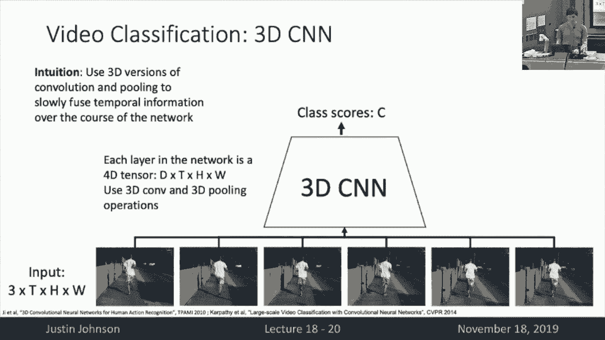

processing，example。

of maybe three tiny it's kind of so then，it's useful to kind of，draw distinctions between this late。

fusion approach，this early fusion approach and this 3d。

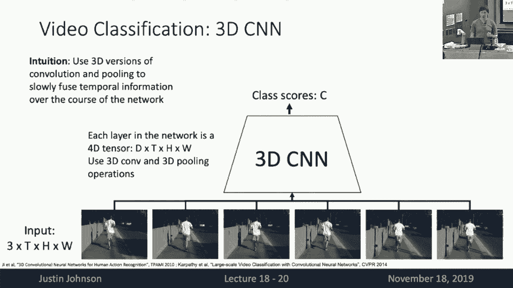

cnn approach，so to kind of make those distinctions，clear um let's walk through。

three little tiny toy examples of um，early verse late fusion versus 3d uh cnn，architectures。

so these will all be like tiny tiny，architectures that will just give you。

the flavor of these different types of，models，but in practice we would use much much。

deeper larger models，um so for a late fusion approach um it，would it。

it will have um the input will maybe be，three three channel dimensions 20。

temporal dimensions and 64 by 64，height and width dimensions then the。

first layer would be a two-dimensional，convolution，um that will maybe be a three by three。

convolution that outputs twelve features，and this is kind of uh，so then it will it will apply this。

convolution independently to every video，frame，and this will just sort of fuse。

information across space but it will not，fuse information across time。

so then we can write down both the size，of the of the resulting tensor after，this operation。

as well as the effective receptive field，in the original input video。

after the operation so you can see that，after a single，three by three 2d convolution operation。

then each，output of that 2d convolution is looking，at a 3x3 region in space。

and maybe only a one by one only a，single uh，input plane input frame in time。

so then we can then uh we can kind of，look at this by sort of building up。

receptive fields just as we did，in our familiar 2d convolution case so。

then we could imagine maybe we add a，four 4x4 four pooling layer after our。

three by three comb that is again，applied independently to every uh。

every slice in time that is now gonna，build up some larger receptive field in，space。

but not going to build up any receptive，field in time we could follow this with。

another three by three convolution that，will again build up more receptive field。

in space but no more receptive field in，time，um and then finally have a global。

average pooling layer where we flatten，everything and predict。

our number of output categories so then，at this global average pooling layer。

what we're doing is kind of all at once，building up a giant receptive field over，the entire。

temporal extent of the input video as，well as increasing our spatial receptive。

field over the entire spatial size of，the video，so this late fusion approach is kind of。

building up receptive fields slowly in，space，but kind of building it up all at once。

in time at the very end of the network，so in contrast if we look at an early。

fusion approach then we can see that，this is an identical architecture the。

only thing that's different，is the first convolutional layer because。

now in this idea of early fusion，we've taken our input video frames and。

stacked them along the channel dimension，at the very first layer of the network。

so now the first layer of the network is，building is a，sort of building up a temporal receptive。

field immediately over the entire，temporal extent of the video but we're，still building up this。

spatial receptive field kind of slowly，in space over the course of many many，layers。

now if we look at a 3d cnn in contrast，then we're replacing the two all of。

these two-dimensional convolutions and，two-dimensional pooling operations。

with instead three-dimensional analogs，so now we're going to maintain these，four-dimensional。

feature tensors at every layer of，processing inside the network。

and you can see that our now instead of，using a three by three convolution。

that slides um in the slides the filter，over 2d and space，instead we'll use a three by three by。

three convolution that is sliding the，filter over both space，and time and now our pooling operation。

instead of just，collapsing a four by four pooling region，in space it's going to average over a。

four by four by four，three dimensional pooling region um in，spa both space and。

time and you can see that by extending，these two dimensions these familiar，two-dimensional operators。

of convolution and pooling into the，temporal domain then it allows us to。

have this network architecture to build，up a receptive field。

slowly over both space and time over the，course of many layers of processing。

so for this reason because it's not kind，of because it's kind of building up this。

receptive field slowly over the course，of many layers，these three-dimensional cnns are。

sometimes called a slow fusion approach，because they are slowly fusing the，spatial and the temporal。

information over the over the over many，many layers of processing。

and again in practice these are like，really really tiny micro architectures。

to just give you a sense of what early，verse，late first 3d cnns look like but in。

practice we would use much larger much，deeper models that have many more layers。

and probably work on bigger images as，so then uh one thing that i always get。

so then uh one thing that i always get，kind of maybe tripped up on when i when，i first。

think about video models is like what，exactly is the difference。

between this 2d convolution operation，that we do in early fusion。

versus this 3d convolution operation，that we do in a 3d cnn，because it seems that in both contexts。

we're using a convolution operator，to build up some receptive field over。

both space and time but exactly the，mechanics or the trade-offs or what's。

exactly different between these two。

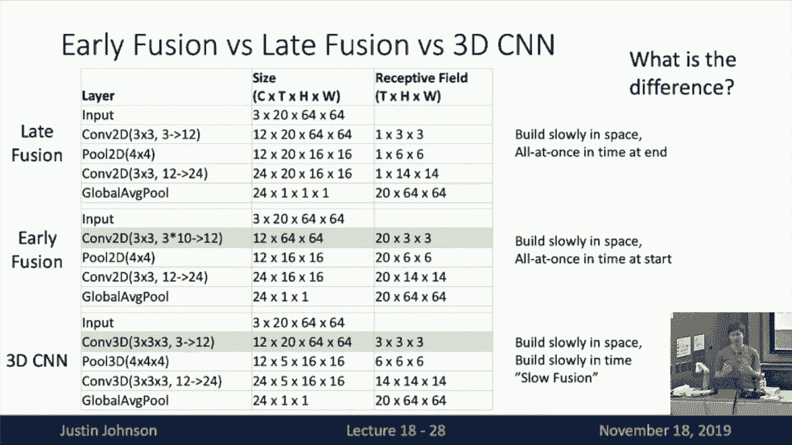

forms of，spatial temporal convolution are useful，i think to，to look at in a little bit more detail。

so in the early fusion approach recall，that what we've done is we've taken，our input tensor so now。

we're kind of drawing this this，three-dimensional tensor with two，spatial dimensions h and w。

and one temporal dimension t and now，we're imagining that at every point in，this 3d grid there is。

a there is a feature vector attached to，every point in this 3d grid，and now if we imagine using a 2d。

convolution，to process this kind of output what，we're doing is we're having a，convolutional filter。

that extends over a tiny region of space，but extends over the full depth in time。

so that means our 2d convolutional，filter has the same，temporal size as the input video，sequence。

and now this convolutional weight we're，going to slide over，every position in space because at every。

position in space the temporal extends，over the full，length of time so we can compute a。

familiar inner product and that gives us，a two dimensional output。

um that will that will that will uh we，can pass the further layers of the，network。

so one kind of shortcoming with so this，is kind of appealing because it feels。

like a pretty easy and straightforward，way to use，convolution to work with temporal data。

but one big shortcoming，with this early fusion approach using 2d，convolution。

is that it's not temp it's not，temporarily shift invariant，so what i mean by that is that suppose。

we wanted to，suppose that we wanted to learn to，recognize sort of，want。

and maybe an important feature that the，network might want to learn to recognize。

is having the entire the color shift，from blue to orange at some point in，time。

now um one problem with this is that，because，our filters extend over the entire，length in time。

then if we want to detect changes in，color，both at different positions in time we。

actually would need to learn separate，filters to represent those changes。

so for example if we wanted to learn a，field we would have we might be able to，learn one filter。

that can learn a shift from blue to，orange at time three，but if we wanted to recognize a shift。

from blue to orange at time，seven then we would actually need to use，a whole separate filter。

in order to learn that that same，temporal change but at a different，position in time。

so that that means that's sort of a，limit a limitation of this，this idea of using 2d convolution to。

process 3d data，is that it's kind of just not，temporarily shift in variant。

so in contrast if we're going to use 3d，convolution to process our temporal data。

then as input we're going to accept the，same space，the same cube with two spatial。

dimensions one temporal dimension，and a featured and a feature vector at，every point in this cube。

but now our convolutional kernel extends，over only a very，small region in both space and time so。

what this means is that now，our convolutional filter is going to，extend only。

only over a small region in time so，we're going to slide the filter over。

both all the spatial dimensions，as well as over the temporal dimension。

and at every at every position in 3d，space over which we slide the filter。

then we can compute the inner product，between the filter and the chunk of the，input at that position。

and then compute a single scalar output，to produce this full，3d output as output from this layer。

and now the key difference is that these，three this this idea of 3d convolution。

fixes this problem of temporal shift in，variance，in that that we had with 2d convolution。

so now if we wanted to learn to learn to，recognize，transitions from blue to orange we could。

actually do that，at all points in time using only a，single three-dimensional convolutional，filter。

because we're going to slide that filter，over all positions in time。

so that allows us to recognize so now we，no longer，need to learn separate filters if we。

want to recognize the exact same thing，happening at different moments in time。

for the input video so that means that，this 3d convolution，is maybe more somehow more。

representationally efficient，because we don't need to learn as many，might。

want to learn from video sequences，and also kind of a cool thing about，these 3d cnns。

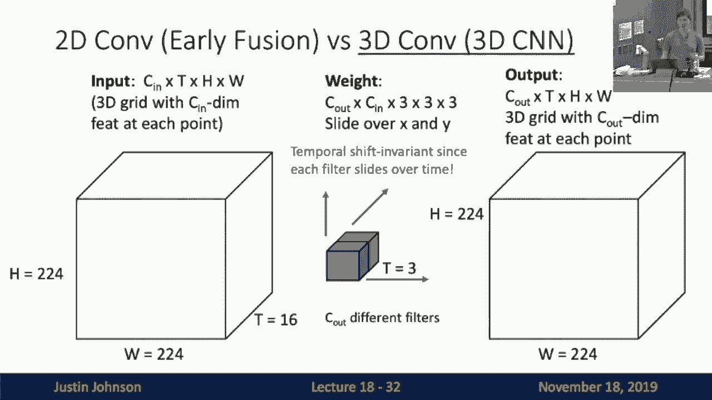

is that we can actually visualize these，learned filters as，video clips themselves right so what we。

can do，is that here on the right we're showing，these learned 3d convolutional filters。

from a three-dimensional cnn and because，the each of these little convolutional。

filters has a small extent，in both space and time we can actually，visualize those filters as little。

moving rgb video clips and that gives us，some sense，for what types of features that these uh。

these 3d convolutional networks，want to learn to recognize so it's。

actually kind of interesting to dive，into these like，you see some of them actually don't seem。

to learn any motion at all，they're just kind of recognizing the。

same oriented edges or blobs or opposing，colors that we often see in 2d cnn's。

but other convolutional filters seem to，want to recognize like。

local motion in different directions so，that gives you some intuition about the。

types of low-level features，that these three-dimensional，convolutional neural networks can learn。

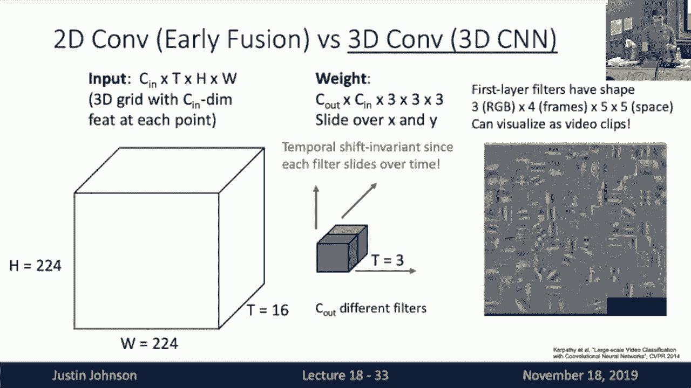

to represent，so now in order to kind of benchmark and，see the trade-offs of these different。

approaches we actually need some data，set to train on，so one example data set that people。

sometimes work with，for this video classification problem is，this sports 1m data set。

um so here what they what they've done，is they've some folks at google。

they went and took a million youtube，videos and for each of those youtube，videos。

they annotated it with um one with a，different type of sports category。

so they took like a million different，sports videos on youtube because a lot，of videos of people。

playing different sports on youtube and，then annotated them with different uh。

with different types of sports，and actually like the types of sports in。

this data set are like really fine，grained i don't actually know what all，of them are。

um so then if you so here's some example，of input frames from videos from this，data set。

and now the blue shows the type shows，the ground truth，sport category for each of these video。

frames and the next five，all show the top five predictions from a。

model that was trained to do this video，classification task，so for example this first one i don't。

know if you guys can necessarily see，that tiny text in the back。

this first video should the the correct，label，is track cycling um but the top model。

prediction was just normal cycling so，that was a wrong prediction。

and actually the second prediction from，the model was track cycling which was，the correct prediction。

um but then the next one the next uh the，next predictions from the model were。

like road bicycle racing，marathoning and ultra marathoning so，those are like different all。

different fine grains different types of，sports that exist in this data set。

or in the second category it's kind of，interesting apparently the correct label，was ultra marathon。

but the next category labels were half，marathon running，and marathon so i don't know exactly how。

a model is expected to tell the，difference between a full marathon and a。

half marathon just from a video a short，video clip，but like somehow this model managed to。

do it on this clip so that's pretty，surprising to me，um but um so that's just to say that i。

think this is a really challenging data，set since it involves all these really。

fine-grained distinctions of different，types of sports categories。

and then what we can see is we can now，compare a single frame version of the，model。

an early fusion model and a late fusion，model and a 3d cnn model。

and what we and what's kind of shocking，here is just how well。

this single frame baseline does so here，we see that if we took。

this uh this this just like train your，favorite two-dimensional cnn。

on independent frames of this video of，these videos we can already get up to，like。

over 77 accuracy which is just like，shocking how well，this simple single frame baseline model。

can do so，again always try single frame baselines，first whenever you're confronted with a。

video classification problem，and then as we move from the the single。

frame to the early fusion to the late，fusion to the 3d cnn，we actually see the early fusion works a。

little bit worse than the single frame，than the single frame baseline which is。

a little bit surprising um but the late，fusion and the 3d cnn approaches。

do a little bit better than the single，frame approach but not massively so。

which again just motivate which is again，just evidence as to how strong this，single frame model is。

as a baseline for video recognition，tasks，but of course if you read this like tiny。

tiny citation of the slide，down in the lower left corner of the，slide you'll see that this paper was。

actually from 2014，which is quite a long time ago like in，2014 people weren't even using gpu。

clusters at google to train their models，so these models were actually trained on。

cpu clusters at google，and there's a great line in the paper，that says that it took all the models a。

month to train，so um i think that the state of the art，in sort of convolutional architecture，design。

has advanced quite a lot since 2014 um，so，these these results are a little bit old。

and are to be taken with a big grain of，salt，um so as a result uh people people have。

made continual advances。

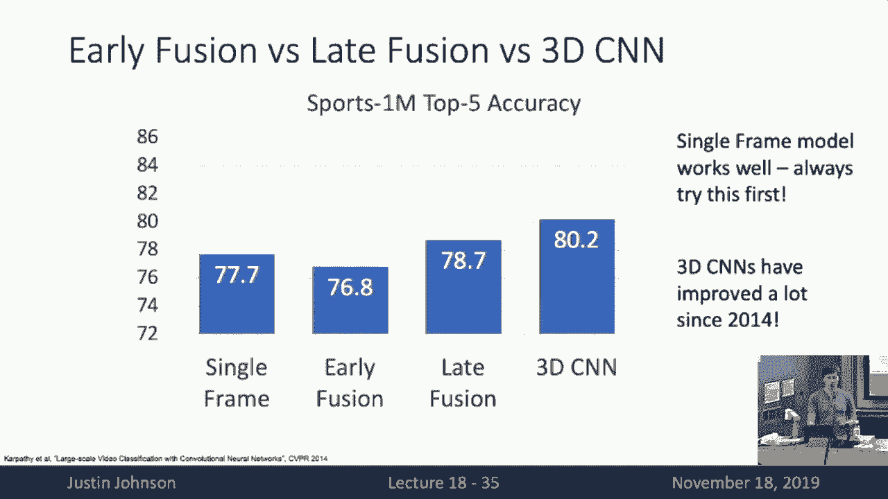

in both 2d cnn architectures and 3d cnn，architectures since that time。

so as an example of an improved 3d cnn，architecture，is the the very famous c3d model for。

convolutional 3d，um and basically this is the vgg of 3d，cnns，so we'll recall that vgg was this like。

very simple convolutional neural net，2d convolutional network that was that。

consisted entirely of three by three，convolutions，and uh two by two poolings and the vgg。

was just this simple architecture of com，kong pool comp compulsool。

i think you you remember now and now c3d，is basically the three-dimensional。

analog of this vgg architecture，um so it consists entirely of three by，three by three convolutions。

and two by two by two poolings with the，slight exception that the very first。

pooling only does pooling in space and，not time，but basically it's a it's a pretty。

straightforward architecture to look at，here，and this was a particularly influential。

video model because unlike the previous，google paper，the c3d authors actually released the。

pre-trained weights of their model，so as a result a lot of people who，couldn't afford to train。

these these video models on their own，data sets would would often use the，pre-trained c3d model。

as a fixed video feature extractor for，their other types of downstream video，classification tasks。

so just as we saw that in images it was，very common to pre-train like vgg on，imagenet。

and then use the features for other，tasks in video it was also very common。

to take this c3d model that was，pre-trained on a large video data set。

and then used the features from that，pre-trained c3d model for other types of。

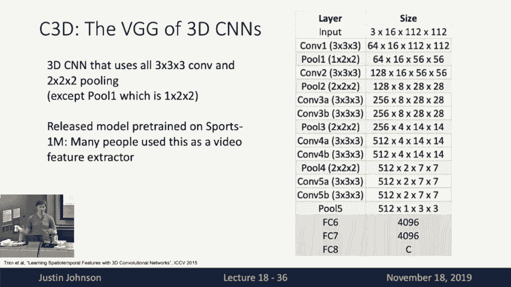

downstream video tasks，but the problem is that this c3d model，is like shockingly computationally。

expensive，right because if you imagine just how，much com computation like 3d convolution。

is really expensive，because now we need to take a，three-dimensional receptive a。

three-dimensional kernel，and slide it over an entire，three-dimensional spatial temporal grid。

um so now everything kind of spells，scales cubically which is like a really。

bad way for your models to scale，computationally，so then if we go and compute the number，of。

the number of floating point operations，that are needed to run the forward pass，of this c3d model。

and and kind of sum it up over the，entire model we see that it's like，really really really expensive。

so um so even though this model takes a，really really tiny input，of 16 uh 16 uh frames in time。

and a 112 by 112 spatial resolution at，each frame，that that's even though it takes that。

very very tiny low resolution input，the total computational cost of the，model is almost 40 gigaflops。

for a single forward pass and to and for，comparison a bgg 16 was like 13。6，gigaflops。

so this uh this c3d model is like almost，three times as expensive as a vgg。

and compared to alexnet um alexnet on，two to four by two to four，image inputs was only like 0。

7 gigaflops，so then c3d is just like way way way，more computationally expensive than。

something like alexnet，um so that's kind of a common problem，with these video models is that。

anytime you're using 3d convolution the，models just quickly become very very。

computationally expensive，but that said this c3d model was able to，do a pretty good job of。

pushing up the state of the art on this，sports 1m classification task。

so here it was a kind of it's kind of a，similar story that we saw in images。

right that in images we saw that for a，period of time people built like ever。

bigger and ever deeper and，ever more computationally expensive，models on images and that led to。

improvements in 2d image recognition，and it's kind of the same story here，deeper。

more expensive video model and that also，pushes leads to higher classification。

accuracies on this large scale video，benchmark，so that's kind of um one angle that you。

can imagine so then there's kind of this，question of like，what's the best way to build a。

convolutional neural network，architecture，that works over both space and time um。

and maybe one way is just like continue，scaling up this c3d，model and try to make it bigger and。

deeper and maybe add residual，connections and bash normalization all。

that kind of stuff that we know works，well in images，but um i think there's another。

interesting approach which is to think a，that，space and time really maybe should be。

treated differently in our models，right because when we're using 3d，convolution and 3d pooling。

we're basically inside the way that the，model is performing computation。

we're really treating sort of space and，time as interchangeable in a way。

because the way that we're processing，both of them is exactly the same。

so instead what we might want to do is，is think carefully about ways to，represent。

a space and time differently and one，interesting way，is to represent motion more explicitly。

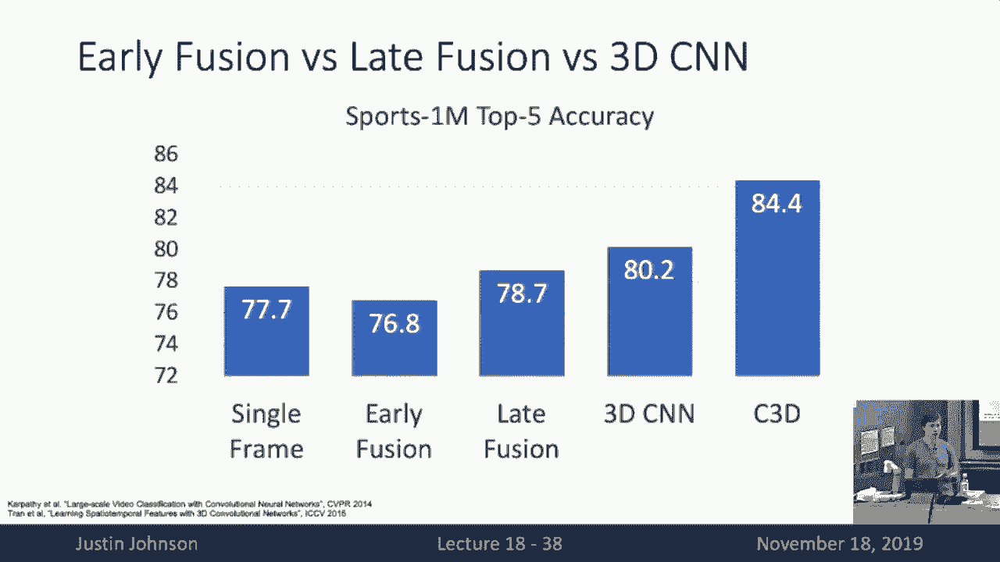

inside our neural network models，and to motivate why representing motion，might be a good idea。

it's interesting to realize that humans，can actually recognize a lot。

using only motion so with this 3d with，just three moving dots，you have some sense of what's going on。

in this video sequence，so any anyone you want to guess what's。

going on there or this one's like super，clear，like that's definitely a person walking。

that's like definitely a person walking，he's climbing and waving he's maybe。

so this is kind of amazing right it，so this is kind of amazing right it，turns out that human brains。

somehow must be doing something，different between processing motion。

and processing visual appearance right，because all i think all of us have no。

trouble recognizing the actions that are，going on in this video。

just from this very low level of motion，cues，and it turns out that we don't actually，all。

in order to tell what actions these，these people are performing，or even to recognize that they are。

people so kind of motivated by this fact，that human beings，seem to be able to do a lot with just。

motion information，um there's a class of neural network，architectures that try to more。

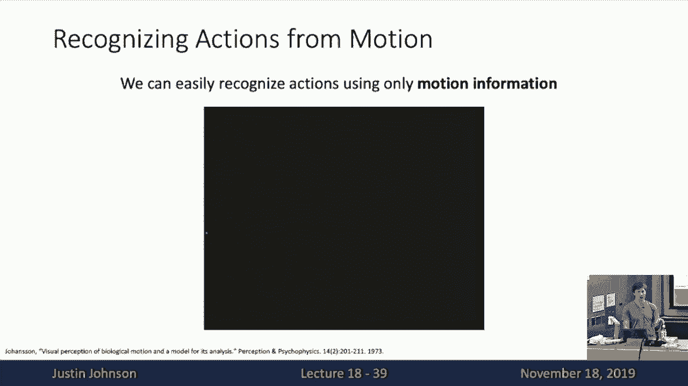

explicitly represent motion information，as a primitive inside the inside the，network。

so um to kind of make this concrete we，need to talk about um how can you even，measure。

motion information more quantitatively，using computers，so one way that we often measure motion。

information，is using this idea of optical flow so，optical flow，is going to take as input a pair of。

adjacent video frames，and then compute a kind of flow field or，distortion field between two adjacent。

video frames，so what it's going to do is say for，every pixel in the first frame。

what is the vector displacement telling，where that pixel is going to move。

in the second frame and there exists，many many algorithms that for computing。

this thing and lots of details about，optical flow that，we just don't want to go into at this。

time but basically the idea is that，there exist algorithms for computing。

optical flow on input image frames，and optical flow is just giving us some，kind of local motion cues。

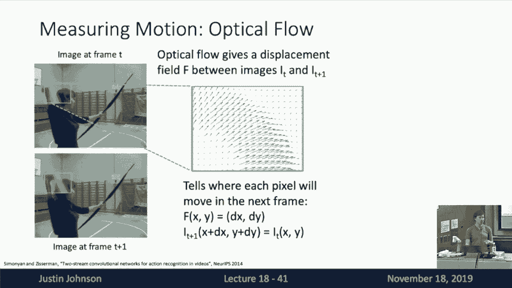

about how pixels move between adjacent，video between adjacent video frames。

so then um optical flow is kind of，highlighting local motion in the scene。

um and what we can what we're showing in，this visualization，is visualizing the horizontal components。

of the optical flow in the top，and the vertical component of the，optical flow in the bottom。

so here given these two input video，frames are this like person like drawing，a bow and arrow。

you can see that the optical flow，representation is just highlighting the。

local motion of the person's arm，and of the bow in these adjacent video，frames so now。

optical flow is now this this very low，level signal about motion。

that we can feed to cnns to allow them，to more explicitly disentangle the。

appearance of what's going on in visuals，in videos versus the motion of how the，pixels move。

so that leads us to this very famous，architecture for um，for video recognition called the two。

stream network，so what this two stream network does is，that it has，two parallel convolutional neural。

network stacks，the top stack is the spatial stream，which processes the appearance of the，input video。

so because we know that this single，frame baseline，is such a strong baseline for。

recognizing videos um the top，spatial stream in the two stream comnet。

is just going to input a single frame，from the video clip，and now and then from that single frame。

it's going to try to predict a，classification distribution over all the。

categories that we care about，and now on the lower stream is this，temporal stream。

which is processing only motion，information so what we're going to do。

is given our clip of maybe t video，frames，we're going to compute optical flow。

between every adjacent pair of video，frames in the input sequence。

so that will give us t so if we have t，video frames that will give us t。

minus one um sets of optical flow，between video frames，and then each of those optical flow。

fields will give us two channel，dimensions one in x and one and y。

so then we'll concatenate all of those，things into a single big tensor。

of size with number of channels equal to，two times t minus one。

and just stack all of those optical flow，fields in the channel dimension。

and then use an early fusion approach in，the temporal stream，to do early fusion to kind of fuse all。

those optical flow fields in the first，convolutional layer，and then use normal 2d cnn operations at。

the rest of the network，and then this this this temporal stream。

will also sort of try to be trained to，independently predict，the classification decisions uh given。

only the motion information，and then at test time what we're going。

to do is that the spatial stream will，predict a distribution over classes。

the temporal stream will predict a，different distribution of our classes。

and then at test time we'll just take an，average of the two probability，distributions。

that are predicted by the spatial and，the temporal streams，yeah question yeah the question is where。

does the two come one and come from in，the stack of optical flow。

well that's because each optical flow，gives us a vec a displacement vector。

in the image plane so if so optical flow，at every point in the image it gives us。

a two dimensional vector，telling us both so that's the x the x，component and the y component of that。

optical flow vector，at every point in the input image so。

that gives us the two，and then this two stream network if we，uh look so i've kind of like done a bit。

of a bait and switch on you and it's，actually a different data set than we've。

looked at in the previous slides but if，we look at this two stream network，using。

only the temporal stream is actually，able to outperform，this this spatial stream which means。

that this idea of recognizing activities，from motions，is maybe not particular to our own human。

brains it turns out that our neural，networks are also pretty good at，recognizing。

activities using only motion information，and then when we fuse，the the the appearance stream and the。

temporal stream，then we actually get a pretty a slight，improvement over using。

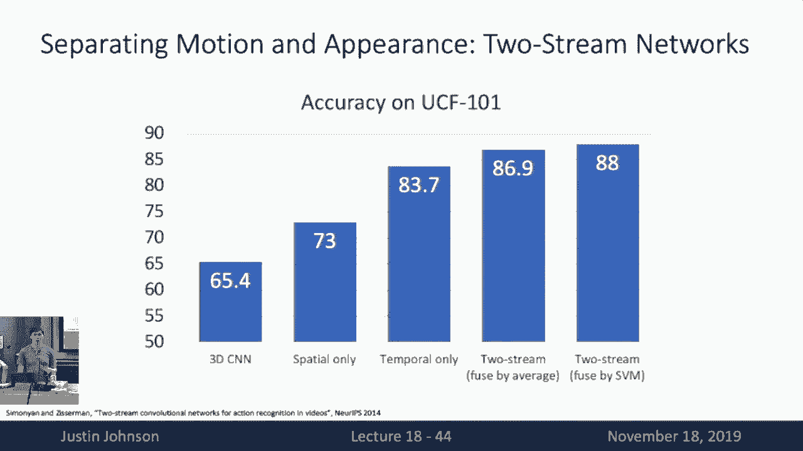

only the temporal stream alone，okay so basically at this point now，lot。

modeling short term structure in，in using different types of cnn，architectures。

so we've seen using maybe 2d convolution，or 3d convolution，or optical flow as ways to compute。

information over the temporal dimension，of our input videos，but all of these different types of。

processing operations we've seen so far，are very very local in what they are。

able to do right so 3d convolution is，maybe looking at a，so early fusion actually just like。

didn't really work that well，um 3d convolution only is looking at。

only a very tiny receptive field in time，and optical flow is also only looking。

between adjacent frames to compute，the motion between a pair of frames but，what happens。

if we actually want to build cnns that，can recognize，stuff which is like more distant in time，kind。

of operator um so we already，but it turns out we've already seen one。

thing in this class that lets us one，type of neural network architecture。

that lets us deal with very long term，sequence information and that's，recurrent neural networks。

so why don't we why don't we combine，together these two ideas，so here the idea is that we'll um have。

our video stream in time，at the bottom we'll apply some kind of，cnn either a 2d cnn or a 3d cnn。

to extract local features at every point，in time，and then we'll use uh some kind of。

recurrent neural network architecture，to fuse information temporally given the，outputs of these uh。

of these individual of these independent，rnns and then we could use kind of a。

many-to-one operation if we wanted to，make a single classification decision at，the end of the video。

we could use the final r and hidden，state to then make the prediction over，the entire video sequence。

or we could also do kind of a，many-to-many task，and maybe make a set of predictions at。

every point in time over the video，and actually turns out there was a paper。

all the way back in 2011 that proposed，this exact architecture，that used sort of 3d cnns to extract。

spatial temporal information locally，and then fuse them over long term using，an lstm。

so this was like way back in 2011 i，think this paper was way ahead of its。

time and people should cite it more，um but the one that people tend to，associate this idea with。

more is this a 2015 paper that i think，got a little bit more recognition。

and then another kind of a thing to，point out here is that one trick when。

combining cnns and rnns for processing，videos，is that sometimes we only back propagate。

through the rnn，remember like in c3d we talked about，people would sometimes use c3d as a。

fixed feature extractor，well that then that then here we could，do that same thing um in the cnn rnn。

setup，so we could use a pre-trained c3d that's，been trained on a video data set。

and then use c3d as a feature extractor，to extract features from every point in，video。

and then use an rnn to work on top of，those pre-extracted c3d features。

so that will be a way to get us around，this kind of memory constraint。

and if we're only using the the cnn as a，feature extractor，then we don't need to back propagate。

into the cnn and then we can actually，train these models over very uh very，wide time periods as well。

so that's kind of an appealing approach，okay so now we've kind of seen maybe two。

different approaches for merging，temporal information one is using kind，of operations。

inside the cnn that kind of merge，information locally，and the other is using some kind of。

recurrent information to kind of，fuse at the top outside after we run our，cnn architecture。

so is there some way that we can combine。

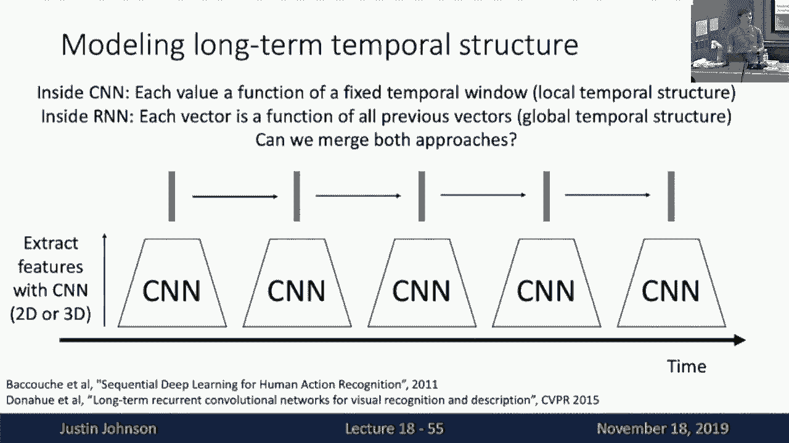

both approaches and it turns out we can，maybe take another inspiration from。

recurrent neural networks and look back，at this idea of a multi-layer rnn。

so now what we can do is remember in a，multi-layer rnn we had this，two-dimensional grid。

where at every point in the grid our，vector was going to depend，both on the previous vector in the。

previous layer at the same time step，as well as the vector from the previous。

time step at the same layer。

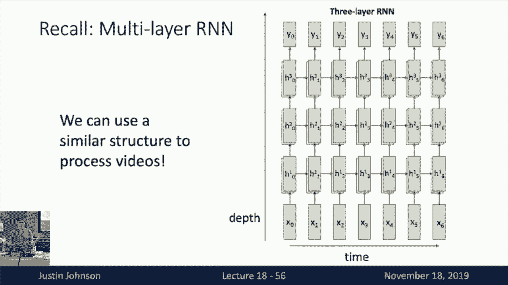

and then we would um you process video，sequences of arbitrary length。

by sharing weights over the sequence，thing，using our convolutional neural networks。

and now we can build a kind of，multi-layer，recurrent convolutional network so now。

what we're doing is we're building up，this two-dimensional，grid of features every point in this。

two-dimensional grid，is a three-dimensional tensor with，spatial with。

two spatial dimensions and one channel，dimension and now at every point in the，grid。

the this feature this feature tensor is，going to be computed，by combining both the the the features。

at the previous layer at the same time，step，as well as the features at the previous。

time step of the same layer，and then we can fuse these two things。

using some kind of convolution operation。

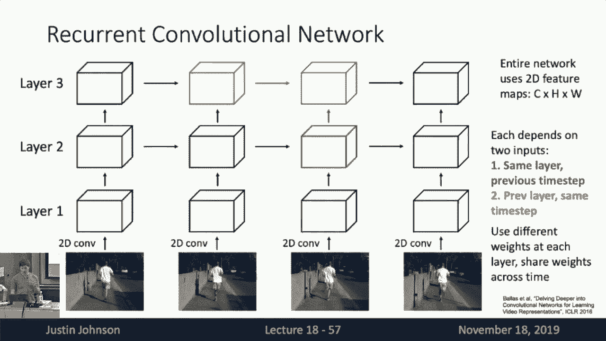

so then to see exactly the the way that，we might fuse these things。

remember that in a normal 2d cnn what，we're doing is we're kind of inputting，uh one two 3d tensor。

running two 2d convolution and then，outputting another 3d tensor，now what we want to do is build a。

recurrent convolutional network，where we're taking as input two 3d，tensors。

one gives us features from the same，layer and the previous time step。

and the other gives us features from the，previous layer，and the same time step and then we want。

to fuse these in using some kind of，rnn-like recurrence formula，that gives us the features for the。

current layer and the current time step，and this um if you'll recall this kind。

of structure looks very similar to the，structure that we saw when using。

recurrent neural networks so now，to use the exact functional form here，what we can do is just again。

copy and paste from our recurrent from，our favorite recurrent neural networks。

so if you recall what we did in a，vanilla tan hrn，we would take our two inputs process。

project each of them using a separate，learned weight matrix，add the two results and then squash with。

the tan h and this operation will give，us our next output vector。

well now in order to convert this this，vector，this vector version of an rnn that we've。

seen before what we can do is replace，all the matrix multiply operations。

with 2d convolution operator operations，instead，so now in order to take kind of a。

recurrent convolutional form，of this vanilla rnn we can use this，architecture。

here so then what we can do is given our，two feature tensors，one from the same layer in the previous。

time step and one from this，from the previous from the same time，step and the previous layer。

we can project each of them to some new，feature tensor，using some 2d convolution operation then。

sum them and then squash the result with，a tan h，and that will give us our next feature。

vector at the next，our output feature vector for the，recurrent rnn。

and then we could do this not we could，do this with kind of any rnn，architecture。

so then you could take your favorite rnn，architecture like a gru。

or an lstm or something else and just，translate it from，this kind of rnn that operates on。

vectors into an rnn that operates um，using convolution，over three-dimensional feature maps and。

the way that you do that is simply。

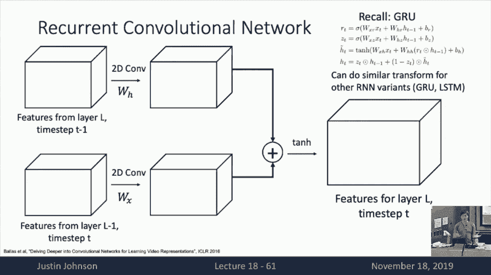

convert all the matrix multiply，operations，into convolution operations instead。

so then what we've done here is that，we're kind of contrast then we saw this，this previous approach。

on the left actually combined two，different ways of modeling spatial and。

modeling temporal information so if we，use a cnn and then an lstm on top。

then inside the cnn we're kind of，modeling local structure between。

adjacent frames and then the rnn is，maybe processing long-scale，long-term global structure well now。

using this recurrent cnn，then it's kind of like every layer in。

every neuron inside of our convolutional，network，is itself a little recurrent network so。

there's kind of like both spatial and，temporal fusing，happening in this very nice way uh。

inside every layer of the network，so this is actually a very beautiful，idea i think。

but it turns out that people have，actually not used this idea too much。

in practice so then to think about why，that might be the case。

it turns out that even though this idea，is very beautiful it's actually not very。

computationally effective，right because the problem is that rnns，are actually。

very slow for long sequences because，rnns，force you to compute the previous time。

step before you can compute the next，time step，so that means that r and n's just don't。

paralyze very well over very very long，sequences，and i think that's a reason why people。

have actually not used this kind of，recurrent cnn architecture too so much，in practice。

and and if you think about ways to solve，this problem，you should actually again think back to。

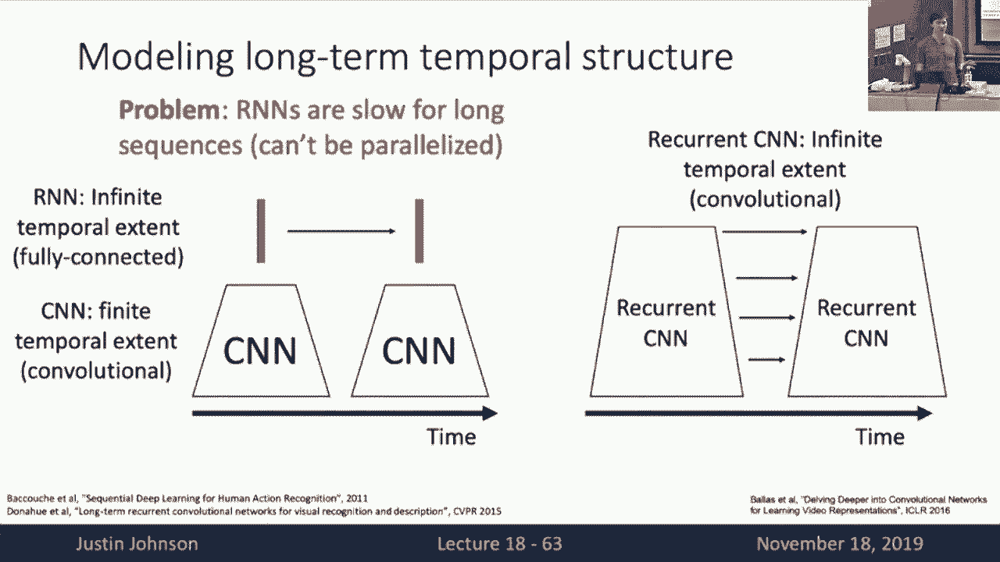

our discussions in uh previous lectures，where we talked about different ways to。

model sequences and their pros and cons，so um in a previous lecture we talked。

about these different approaches for，processing long sequences。

we saw one approach was recurrent neural，networks which are nice because they're。

good at modeling long-term temporal，information，but they were bad because of their。

sequential processing and now that's，kind of in in the video domain that's。

kind of equivalent to this architecture，of cnn，followed by an lstm now we had this。

other approach which is maybe 1d，convolution for processing sequences。

and this was nice because it's sort of，computationally effective we can。

paralyze the computation of the sequence，um at training time we don't no longer。

have the sequential dependence on the，time steps，um and now in video the equivalent of。

this is kind of 3d convolution，but if you'll recall we actually saw，another mechanism for processing。

sequences，in the past and that's this notion of，self-attention。

so if you'll recall self-attention kind，of like was really good at processing，long sequences。

because it computes this like a tension，between all pairs of vectors。

and it's highly parallelizable because，uh because there's no temporal。

dependency on the structure just like，with rnns，so now then the question is can we find。

some way to apply this idea of，self-attention。

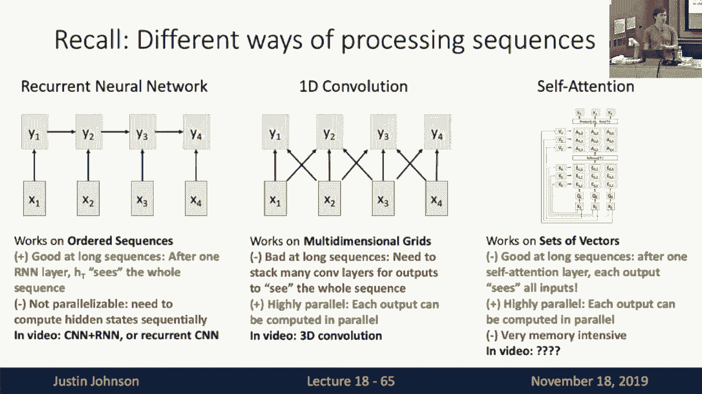

to our video to process video sequences，as well，and of course it turns out the answer is，yes。

so a quick reminder on self-attention，remember that the input was a set of，vectors。

then for every set every input vector in，the set then we would predict uh keys，queries and values。

then we would pre by using some kind of，linear projection operator on the on。

on the input vectors we would compute an，affinity matrix which tells us。

how much is every pair of vectors，related by computing some kind of。

dot scaled dot a square root scale the，dot product between the keys and the。

keys and the queries and then the output，for each vector would be this weighted。

linear combination of the values，that are weighted by the values in the，infinity matrix。

so now we can actually um just port this，whole architecture over into 3d。

where now um now what we're going to do，is is process some part of our network。

using a 3d cnn and that will give us，this four dimensional tensor，with a channel dimension and three。

spatial dimensions and now we can，interpret this four-dimensional。

tensor as a set of vectors where we have，a set，of vectors of dimension c and the number，of vectors。

is t times h times w and then we can，just run this exact same。

uh self-attention operator using uh the，set of vectors from。

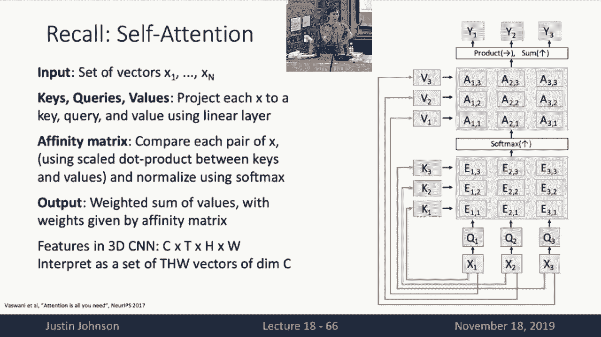

uh some layer in a 3d convolutional，network，so then we actually have seen this exact。

slide before in a previous lecture it，just it had 2d convolution instead of。

3d convolution but the idea is that，we'll receive some set of input features，from a 3d cnn，using。

one by one by one convolution then we'll，compute some inner product between。

every key and every value and then we'll，compute a soft max over one of the，dimensions。

and that will give us this big affinity，matrix or a set of attention weights。

then we'll use this to combine uh to，linearly weight the values，and then sum that out with a matrix。

multiply，and then it's very common to actually，project the output of this operation。

with another one by one con，and then actually to connect the whole，thing with a residual connection。

so that gives us so when we combine all，these three all these things together。

then this operator when can is a block，that we can slot into our 3d cnns。

that's computing a kind of spatial，temporal self-attention，and this is sometimes called a non-local。

block for the paper that introduced it，and now kind of a neat trick is that we。

can actually initialize this，if we initialize this last conflair to，be all zeros。

then everything inside this operator is，going to compute zeros，which means that the whole block is。

going to compute the identity because of，the residual connection。

so then actually a common trick that，people use with these non-local blocks。

is to initialize the the non-local block，such that it computes the identity。

function by initializing the last thing，the zeros，and then we can take a a non-local block。

that is computing identity，and insert it into an existing，pre-trained 3d cnn model。

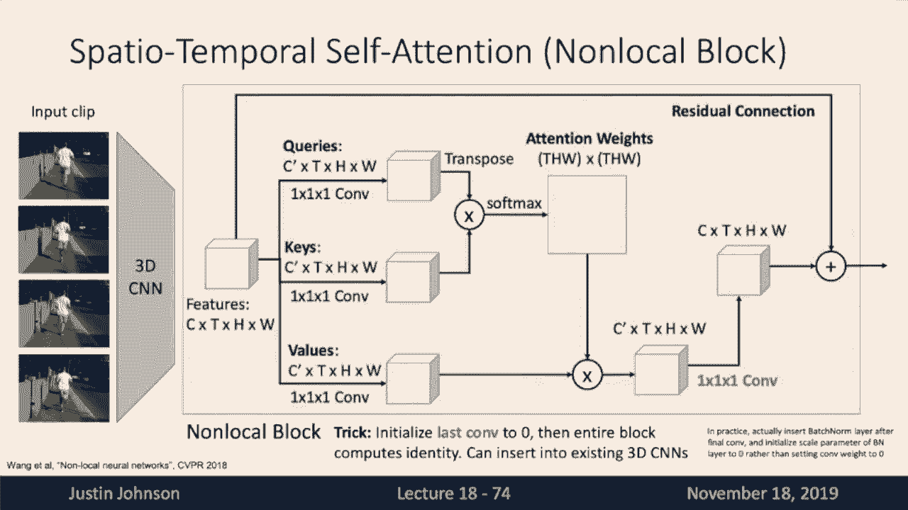

and then continue fine-tuning with this，additional inserted non-local block。

so that's kind of a trick that people，will use so then it looks something like，this that we。

now we now we have this notion of um we，have some kind of 3d cnn and we're going。

to slot in these non-local blocks at，different points in the 3d cnn。

and now um the 3d cnn chunks are kind of，going to do this slow。

fusion over space and time and now each，non-local block is going to give us this。

this global fusion over all of space，and all of time so this is actually a，pretty powerful。

pretty close to state-of-the-art，architecture for video recognition。

but then the problem is um what is the，actual so then now non-local blocks give。

us this power powerful way，to introduce global temporal processing，into our 3d combnets。

but the question is we still need to，choose some 3d cnn architecture。

that we can insert our non-local blocks，into。

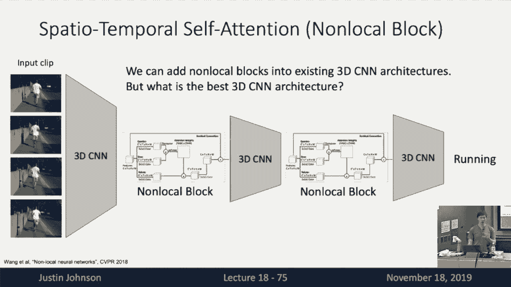

so then the question is what is actually，the best 3d cnn architecture。

for us to build so one really cool idea，is this idea of inflating existing，two-dimensional networks。

from 2d into 3d right because，we know that there's been a lot of work，design。

really good two-dimensional cnn，architectures and somehow we would。

not want to repeat all of that effort as，a community and we don't want to sort of。

start over from scratch in inventing the，best 3d cnn architectures。

so instead what if there was a way where，we could take a 2d cnn architecture that。

we know works well on images，and then somehow adapt it in a very tiny。

way to make it also work on video，so that's the idea of inflating a。

two-dimensional convolutional network，and sort of，blowing it up like a balloon and then。

adding this third dimension to an，existing network architecture。

so then the recipe is that we're going，to take an existing，two-dimensional cnn architecture that is。

that has maybe two-dimensional，convolutions and two-dimensional pooling。

operations and then for every uh every，one of those operations we're going to，replace it。

replace the 2d convolution with a 3d，convolution and replace each 2d pooling，with a 3d pooling。

and now the only choices that we need to，like，is that um here's an example using the，inception block。

so then the paper that introduced this，was uh from google and，inception architecture was from google。

so of course they had to apply that，thing on top of the，homegrown network architecture so then。

what this then here's an example，of the 2d inception module remember that。

it has these uh parallel branches of，convolution and pooling，and now and then kind of concatenates。

them a lot after having these parallel，branches of processing，and now after inflating the three。

dimensions all we do is add an，additional temporal dimension，to each convolution operation and each。

pooling operation，and this gives us this super simple，recipe for taking a 2d architecture。

and just applying it to 3d，about，taking this is about transferring。

architectures right so far this trick，has allowed us to take，an architecture that works on 2d。

networks and then，formulatedly change the architecture so，that it can be applied on 3d。

3d videos as well but it turns out we，can actually go a step further，and we can not only inflate the。

architecture we can also，transfer the weights the trained weights。

from a network which was trained on，images，and then we can use those trained those。

weights that were trained to operate on，images，to actually initialize the inflated。

version of our 3d cnn，is，remember that when we inflate the cnn。

we're going to add this extra temporal，dimension to all of the convolution。

layers so now what we can do is what，we're going then，um in order to initialize the weights of。

this inflated architecture，using weights of the image version what，we're going to do is。

copy the convolutional kernels for each，convolution layer，only，adding this extra temporal dimension。

we're actually just copying in time，the the weights of each convolutional，layer and just like。

duplicating them in time and then all，after you duplicate them in time。

you then divide them by the duplication，factor，and the reason that we do this is that，because um。

if you imagine taking an original input，image，and then making the world's most boring。

video by copying that input image many，many times in time，that will give us this sort of trivial。

constant input video，and now if you imagine running uh this，to this 3d convolution with duplicated。

weights，on the boring input video that will end，up computing，the exact same result as running the 2d。

convolution，on the original image so what that so，what that means，so that you can kind of like think。

through this all what's going on，but basically this works because。

convolution is a linear operator right，so when we duplicated，the the the frames in time then we can。

also duplicate the weight and time and，divide with a duplication factor。

and that that means we're computing the，trick，this this uh this super cool trick。

actually allows us to pre-train a model，on images and then initial and then。

inflate the architecture and inflate the，weights，and then continue fine-tuning that model。

on a video data set，and moreover it also lets us recycle all，of the existing architectures that we。

know work well on images，and also recycle all the pre-trained，models that we have laying around。

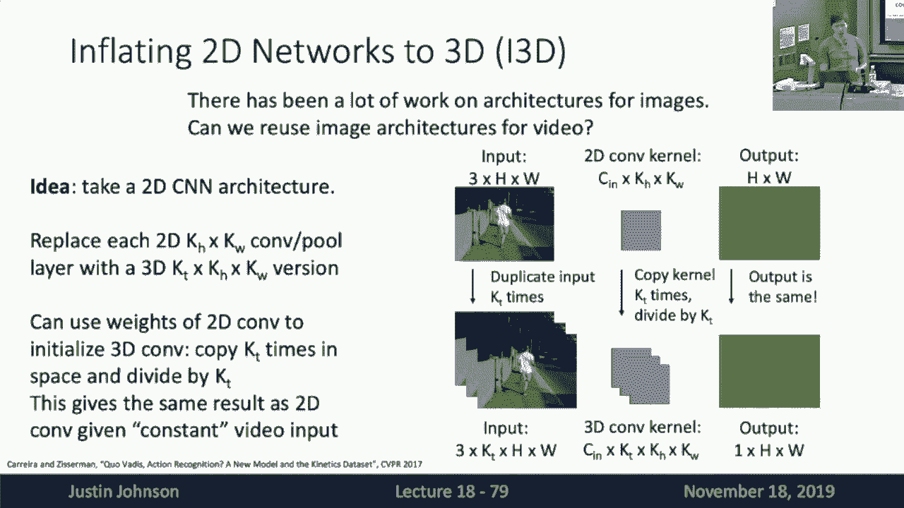

that work well on images so then this，actually works quite well。

um so then if we uh kind of look at yet，another 3d，yet another uh video data set called，kinetics 400。

um then if we run this per frame，baseline，then the the blue so the blue bars here。

are showing um training from scratch on，the video data set，and the orange bars are showing models。

where we initialize the video model，from the image model so we can see that，when for a per，to this。

cnn lstm model to this two-stream cnn，actually gives us steady improvements，but as we move。

from the two-stream cnn to an inflated，cnn，that actually does much better so then。

this kind of gives us some empirical，results，that actually this idea of taking 2d。

comnets and inflating them in time，is actually a pretty good way to。

generate good 3d cnn architectures，and it turns out that two stream，networks is still a good idea。

so we can actually take two inflated，networks and take one inflated network。

to work on the appearance stream，and a second inflated network to work on，these optical flow fields。

and that gives us a two stream inflated，network that actually works quite well。

okay so that kind of as a fun aside one，thing we can do is that now that we've。

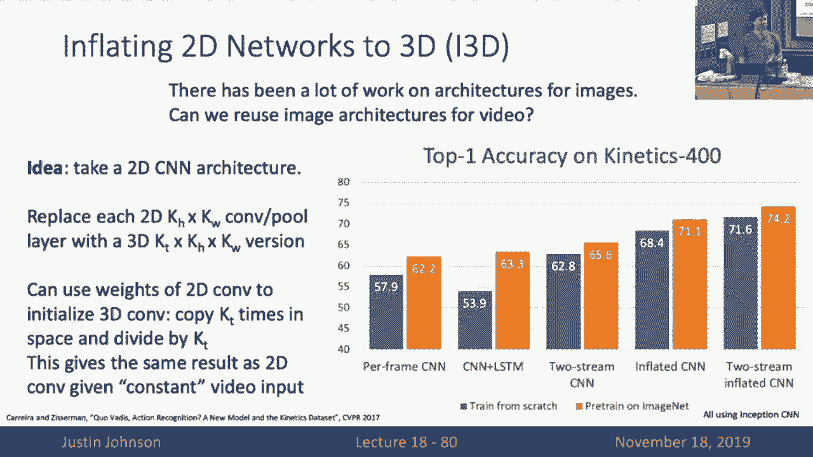

got these kind of two stream networks，that work really well at classifying，videos。

we might want to know like how can we，visualize what these learned what these。

video models have learned，and we can actually use this exact same。

trick that we've used for visualizing，trained models and images，we can take um take an input we can。

randomly initialize an input image，randomly initialize a flow field and。

then compute forward passes through the，trained network to compute the score the。

classification score，and then back propagate through the，network to compute the gradient of the。

score，with respect to the input image in，respect to the flow field and then we。

can use gradient descent，or gradient ascent to find the image and，the flow field。

that maximize the classification score，for the particular category。

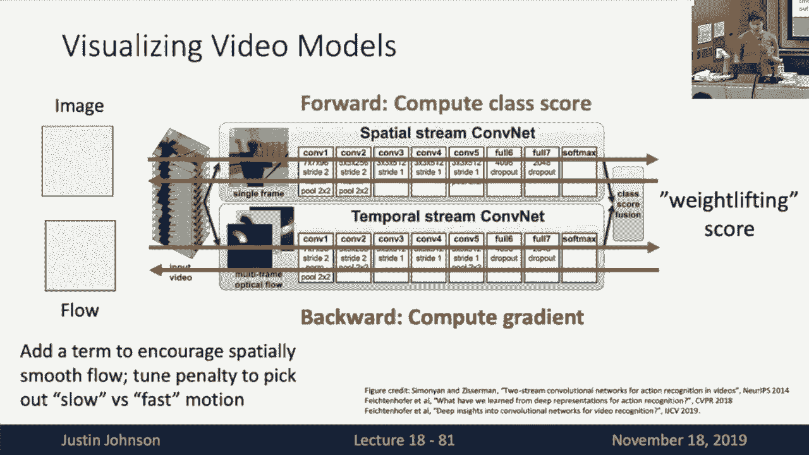

so then what does this look like so then，here's an example，so then here on the left we're showing。

uh the appear，the optimized image for the appearance，stream，and then in the middle we're showing an。

optimized flow field，that has been add we added some temporal。

constraints to constrain the flow field，from changing too fast in time。

and then on the right we've kind of，lifted that temporal constraint and。

allowed the flow field to change，faster in time so can anyone guess the。

action that's going on in this in this，i think i heard weightlifting was a good。

i think i heard weightlifting was a good，it was a good guess，right so this is actually pretty cool。

then we see that the appearance stream，is kind of looking for barbells anywhere，in the image。

um at the slow motion stream it kind of，looks like it's looking for kind of like。

the bar wiggling at the top of the lift，and in the fast motion stream it looks。

like he's looking for the part where it，pushes the bar overhead。

so that's actually pretty exciting okay，let's try it again，so here's the appearance stream here's。

the slow motion，and here's the fast motion i i don't，think anyone's going to guess this。

what eyes eyes or face。

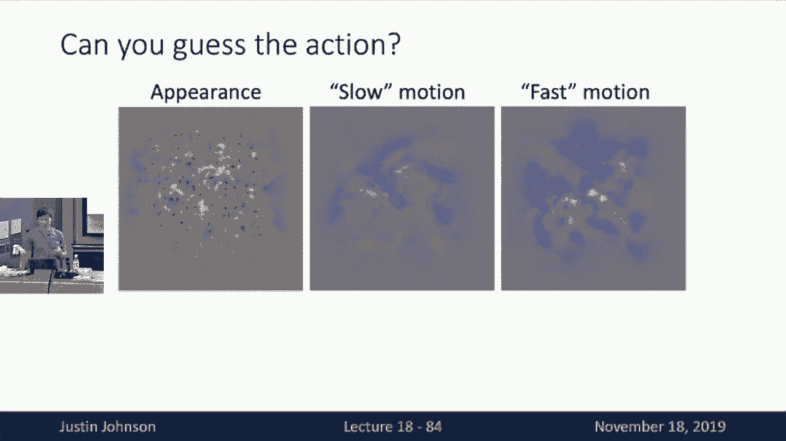

that's a good guess the it's actually，applying eye makeup，right so you can see that for the。

appearance stream it's look so there's，like a lot of youtube videos of like。

people doing makeup tutorials right，and then um so that on the appearance。

stream is kind of looking for eyes，anywhere in the input image and now for。

the slow motion it kind of looks like，maybe the motion of the head or the，hands。

and then the fast motion kind of looks，like the local brushing motion of。

actually applying the makeup，so it's i thought it's really cool that，we can take all these same。

techniques that we know and love for，visualizing images and then just kind of。

apply them on video sequences as well，okay so then i also wanted to briefly，mention so。

kind of looking at these two stream，networks we saw that they still rely on。

this external optical flow algorithm，and it would be really nice if we could。

relax that constraint and just build，networks that can train on the raw pixel，values。

and not rely on this external optical，flow um so that brings us to this uh。

state-of-the-art slow fast network that，was just published like a month ago。

that is actually current state of the，art on a lot of video recognition tasks。

so what the idea is is that we're，actually going to have we're still going。

to have two parallel network branches，just as we did in the two stream network。

except that both of them are going to，operate on raw pixels，the difference is that they are going to。

operate at different different temporal，resolutions，so one branch will be the slow branch。

that operates at a very low frame rate，but has a lot is a very expensive。

network that uses a lot of channels at，every layer of processing。

so to visualize this network we kind of，have three dimensions we can play with。

one is the spatial dimension of the，input image one is the channel dimension。

the number of features the number of，layers in every layer of the network and。

the other is the temporal dimension，which is what is the temporal frame rate。

at which the network is applied，so then the first branch is this slow，branch that uses a。

a small temporal res uses a very slow，temporal frame rate，but a lot of channels so it's a doing。

using fewer frames but putting a lot of，processing on each frame。

then so it's a low frame rate and then，the second branch of course is the fast，branch。

that operates at a higher frame rate but，uses a much thinner network，so then the the fast branch has。

operates at a high temporal frame rate，but uses only a little bit of processing，on each frame。

and then so it is a high frame rate and，it uses a very small number of channels。

at every at every layer，and moreover there's lateral connections，that fuse information。

from the fast branch back into the slow，branch so，unlike the traditional two stream。

networks that only fuse the information，at the very end through averaging。

these slow fast networks are actually，fusing information at multiple stages。

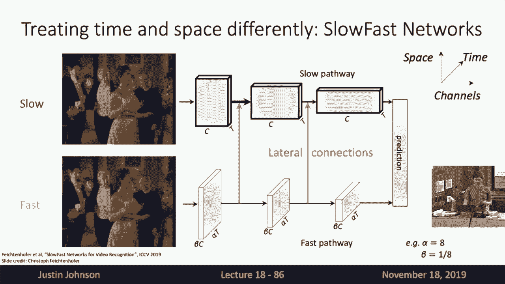

inside the network，and then at the very end there's some，kind of fully connected layer that does。

the predictions，and then i'm not going to walk through，this in detail but this sort of gives us。

the the concrete architecture，instantiation of these slow fast，networks。

and this kind of combines together all，of the techniques that we've talked，about in this lecture。

so it has two streams um one that's，operating on mostly appearance。

and one that's operating on temporal，information each of these streams。

is itself an inflated resnet 50，architecture，so this brings us back to this idea of。

inflation so they take，an existing resnet50 architecture that，we know works well on images。

and then inflate it in time to to form，each of these two streams。

um but now the difference is that the，slow pathway operates at a。

very low frame rate and the fast pathway，operates at a very high frame rate。

and then it turns out that we can also，well，and get it to work really well so i。

don't want to go through this in detail，but i think this，is actually the current state of the art。

in video understanding and video，recognition for a lot of tasks，so if you're looking for the for the。

model to use today i think it's this one，okay then i also wanted to very briefly，mention that so far。

we've talked mostly about this this this，task of classifying very short video，clips。

like taking these like two to like three，to five seconds of video。

and then predicting a classification，score um but this was a good this was a。

good task to motivate a lot of our，spatial temporal architectures in，comnets but it turns out that。

of course there's a lot of different。

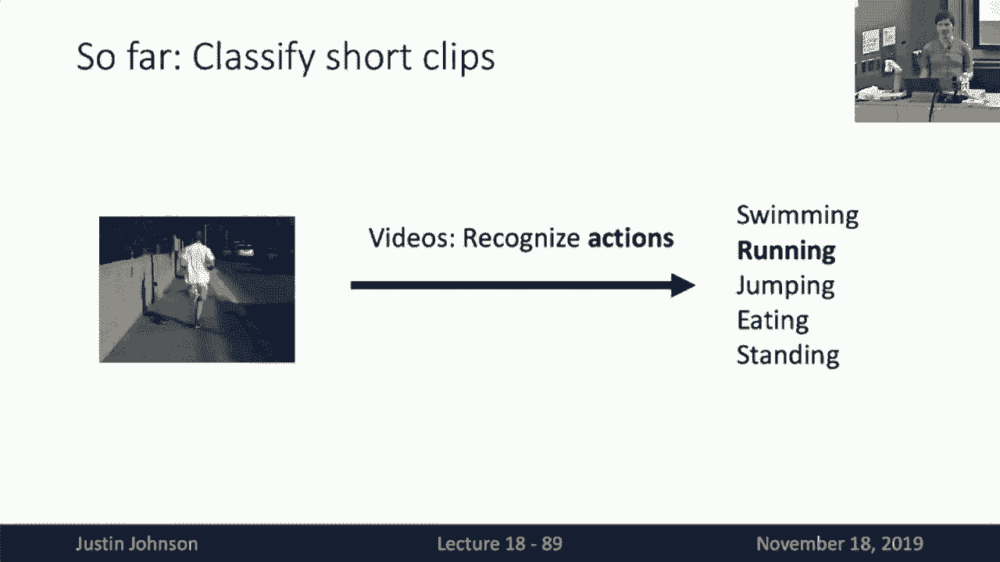

video tasks video understanding tasks，that people try to tackle with，convolutional neural networks。

so as an as just a very brief sample，another，thing that people sometimes want to do。

in video is work on this task of，temporal action localization so here。

we're going to be given a very long，untrained uh untrained untrimmed video，sequence。

and now we're going to want to detect，this the there might be multiple。

activities that happen in this video，sequence，and we want the model to both um detect。

all the activities and tell us for each，activity，which span and time um did that activity，occur for。

and you can imagine that you could，actually build an architecture similar，to faster rcnn。

that did this type of uh this type of，operation，and this is indeed what people have done。

so you can imagine this type of，architecture that does now kind of like。

some lightweight computation over the，video sequence，to get um action proposals instead of。

region proposals，that tells us what regions and video are，likely to contain an action。

and then have a second stage of some，kind of like 3d comnet that um。

works on that that processes to pick the，raw pixels or the features。

of each of those actions so you can，imagine the building a，kind of faster rcnn like architecture。

that works over space，that works over time and of course um，now we've seen how we can build models。

to detect，objects in space this model lets us。

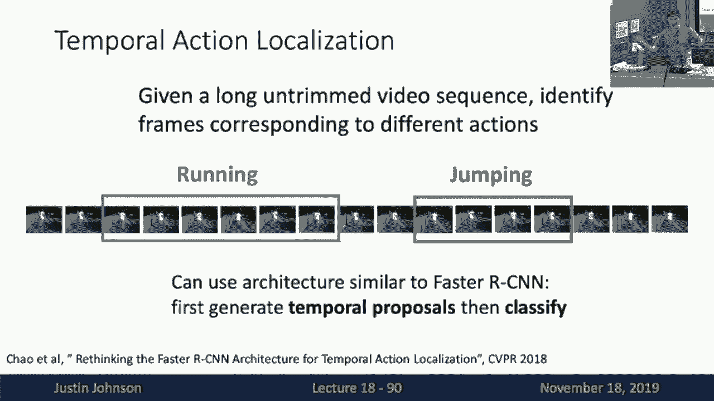

detect actions in time，so of course we've got to do both so，there's also some work on。

spatial temporal action detection so，here the task is that the input is this。

video is like a long video sequence and，the task，is that you need to detect the people。

all the people in the in each video，frame，actions，those p that those people are performing。

in the video so now this is a super，challenging task because it involves。

both um spatial detection in each frame，as well as temporal detection in time，and one。

really exciting data set for this，spatial temporal detection task。

is this uh very recent ava data set that，was published，just last year in 2018 so what they did。

is they went and annotated a bunch of，movies，with different kinds of actions that。

people are doing and now so this also，brings in the problem of very。

long temporal dependencies very long，video clips，so now you need to detect not just like。

classify little two three second clips，but instead the input is like 15 minutes。

of video and you need to both detect all，the people in that 15 minutes of video。

and say what activities they're，performing，so i think there's there's been not yet。

a ton of work on this data set，but i think that in the next couple of。

years we'll i i predict that we'll see a，lot of people moving to this kind of。

spatial temporal activity detection on a，long untrimmed video。

because i think that's an exciting task，that people will probably start working，on。

so that was kind of our whirlwind tool，uh tour of video models today。

um so today we saw many many different，video classification models。

um including building all the way up to，slow fast networks which again was like，just published this。

like a month ago and i think is the，current state of the art so if you're。

looking to work with video i think，that's a good one to，play with and actually there's code。

available as well so that gives us，that's our brief summary of video models。

and the next time we'll move to a，completely different topic and start。

talking about generative models，and in particular about generative。

