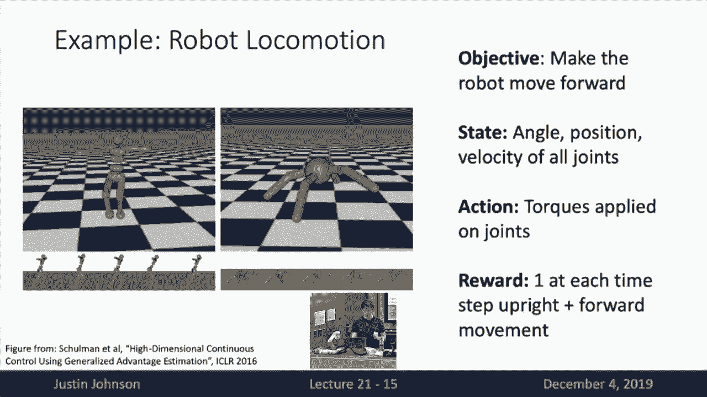
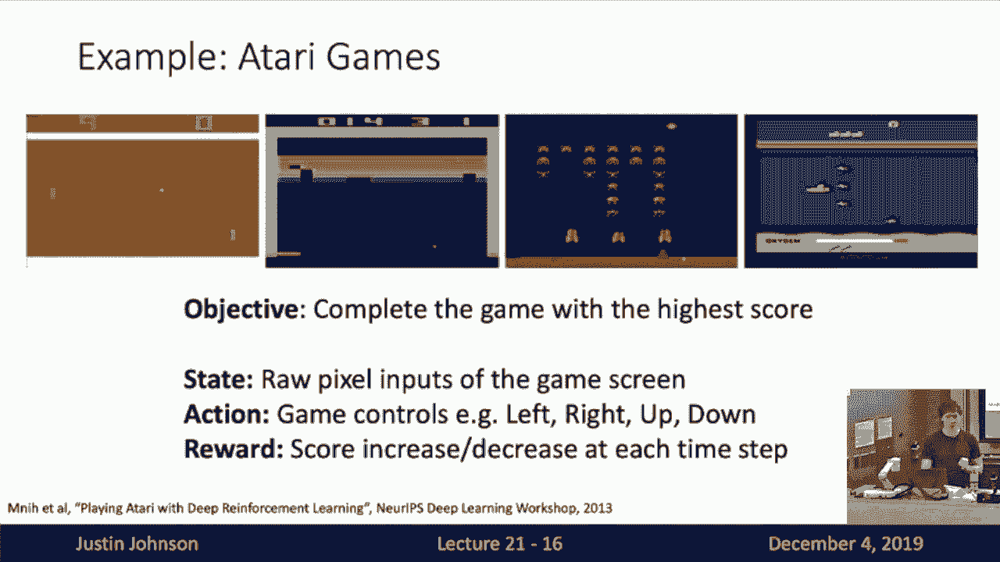
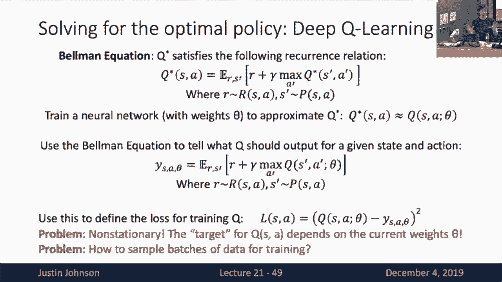
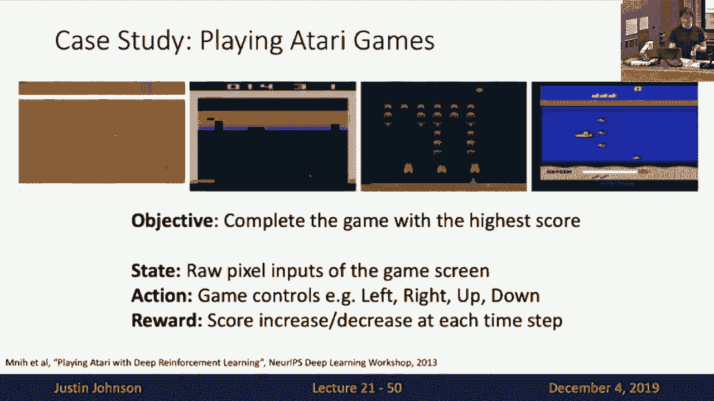
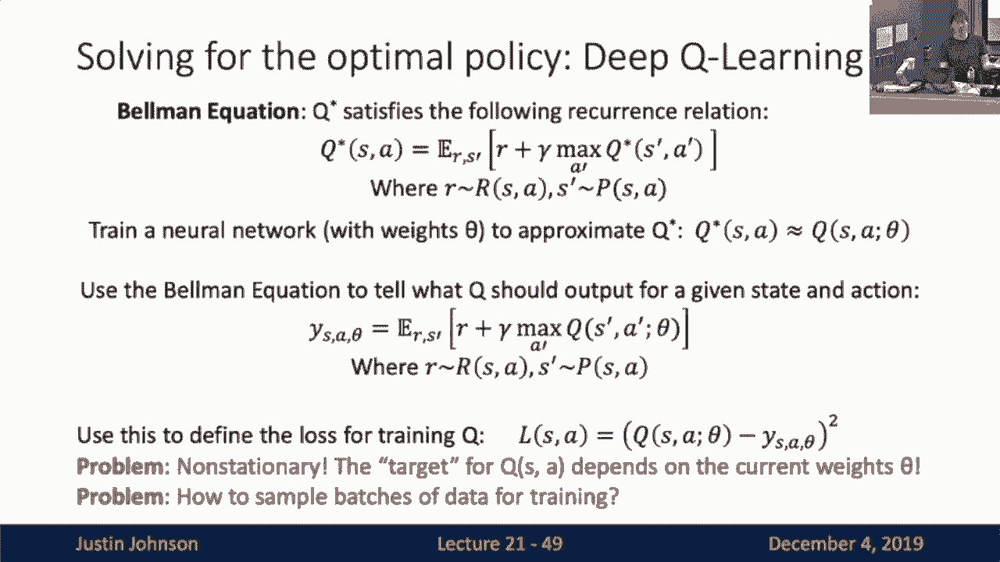
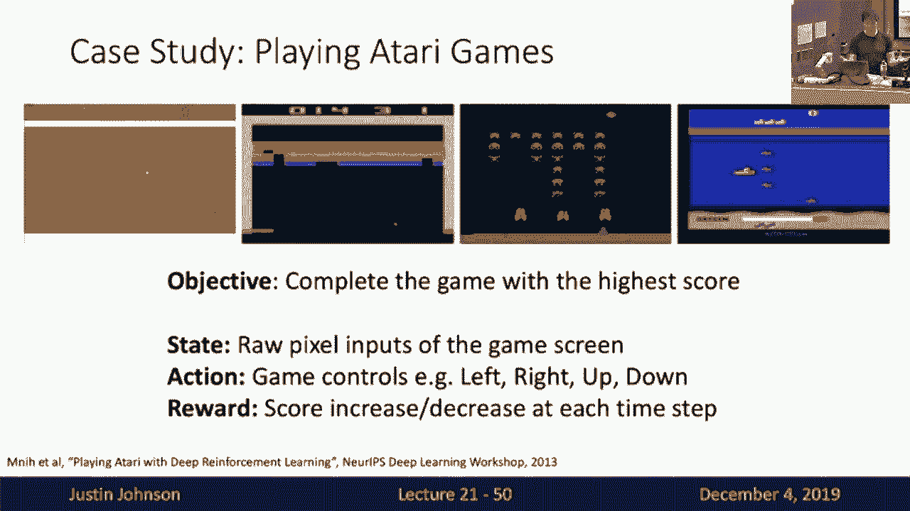
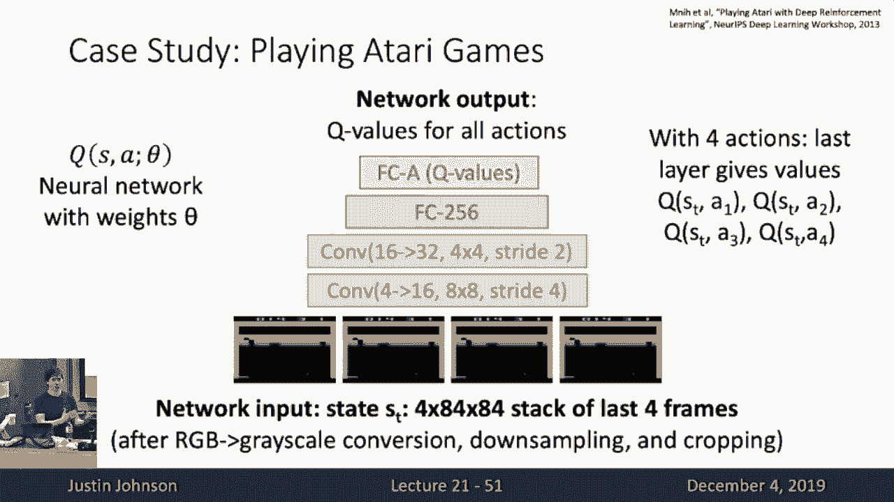
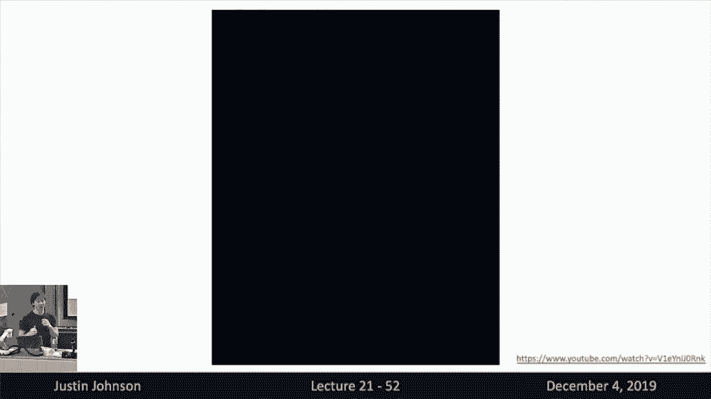
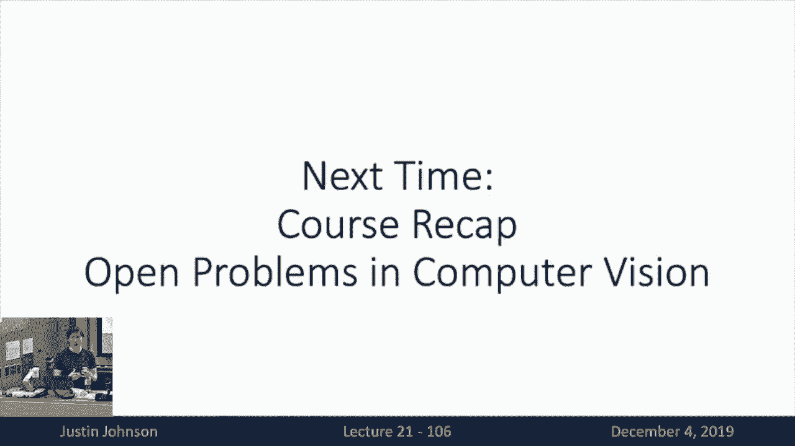

# P21：L21- 强化学习 - ShowMeAI - BV13P4y1t7gM

um so today we're up to lecture 21 this，um so today we're up to lecture 21 this。

is the second to last，lecture this semester and uh i was kind，of waffling a little bit on what i。

wanted to talk about on this lecture，if you looked on the lecture on the。

syllabus it kind of swapped between two，topics，computational graphs and reinforcement。

learning and i kind of，finally decided yesterday i wanted to，instead。

of computation stochastic graphs so，that's what we're going to talk about，today。

so then so far in this class we've，talked about a couple different major。

paradigms of machine learning，uh the first of which is of course。

supervised learning and i think we've，been we want to order this a couple。

times the last couple of lectures，so in supervised learning of course we。

get a big data set of the inputs x as，well as the outputs y，that we want to predict from the inputs。

and then we want our goal is to learn，some function that predicts the y's from，the x's。

and we've seen many many examples of，supervised learning throughout the class。

and supervised learning is very，effective it works very very well for a。

lot of different types of problems in，computer vision，and then the last two lectures we。

started talking about a different，paradigm of，machine learning which is that of。

unsupervised learning so then of course，in unsupervised learning。

you get no labels you only get data and，the idea is you want to learn some。

underlying hidden structure of the data，to be used for some maybe downstream。

task so we saw a bunch of examples of，this the last two lectures，um we thought we've so some example。

examples of unsupervised learning are，things like，clustering dimensionality reduction or。

any of these different types of，generative models that we talked about，in the last two lectures。

so today we're going to talk about a，third major paradigm of machine learning，models。

that is really quite different from，either the supervised learning or the。

the unsupervised learning paradigms，and that's this notion of reinforcement，learning so。

reinforcement learning is about building，agents that can interact with the world。

that can interact with some kind of，environment，so rather than just trying to model some。

function of inputs to outputs，instead there's going to be an agent，that like a little robot here。

that's going to go and make some，to，observe what he sees in the world based。

on what it sees it will perform some，actions，and then based on the actions that it。

performs it will get some reward signal，that tell it how well，goal。

is to um have this agent learn to learn，to perform actions，in such a way that will maximize the。

rewards that it that it captures that it，receives during its lifetime so i should。

point out that reinforcement learning is，really a quite massive topic。

in machine learning and you can and，people do in fact teach entire long。

semester-long classes just on，reinforcement learning，so uh this lecture today is not meant to。

give you any kind of comprehensive，understanding of the state of the art，and reinforcement learning。

it's really meant to just give you sort，of an introduction and a brief taste。

of how reinforcement learning works a，couple simple algorithms for，reinforcement learning。

and then how it could be integrated into，some of the deep neural network systems。

that we've talked about this semester，um so then kind of the overview for。

today is that first we're gonna talk，about a little bit of generality of what。

is this reinforcement learning problem，um what can it be used for and how is it。

different from other types of machine，learning paradigms that we've seen。

and then we'll cover two simple，algorithms to actually solve，reinforcement learning tasks。

um that will be q learning and policy，gradients um so that i think will give，you a very。

brief introduction and give you a taste，of what reinforcement，learning is and what it can do so then。

to be a little bit more，formal about the reinforcement learning。

problem there's going to be some there's，going to be two major actors in a。

reinforcement learning problem，one is going to be some agent which is。

like you can think of it as like a robot，that's roaming around in the world and。

performing some actions，and the other is the environment which，is the system with which the agent is。

interacting，so then what we should think about is，that the agent is the thing that we are。

trying to learn，we have control over what the agent is，doing and the environment is something。

given to us from the outside，um so we have control over the agent and。

the agent just has to interact with the，world which is the environment and we。

don't typically have much control or，over what happens，inside the environment and now um these。

these uh these this the environment and，forth，in a couple of different ways so first。

the environment will provide the agent，some state um st where the state。

encapsulates what is the current state，of the world，so this could be like if we're if we're。

building like a robot，then the state might be uh like the，image of what the robot is currently。

seeing，so the state gives the agent some kind，of information，about what is going on in the world at。

this at this point in time，and uh this this state might be noisy it，might be incomplete。

but it just provides some kind of signal，to the agent about what is happening in。

the world at this moment in time，now after the agent receives this state。

then it has some understanding of what，it is that it's doing in the world in。

this moment or what is around it in the，world at this moment，so then after the agent receives the。

state from the environment then the，agent will communicate back to the，environment。

by performing an action and now if we，are going with this running example of，like a robot that's。

moving around in the world then the，action might be the direction that the。

the agent decides to move in at each，point in time，so then the the environment tells the。

agent what's going on，the agent decides to do something which，modifies the environment back in some。

way，so the agent will then take an action，based on what it sees。

and now after the after the environment，gets sends the state，the agent sends the action then the。

environment sends back a reward，how，how good was that agent doing at this，moment in time。

and this reward is really kind of a，general concept right，it might be any number of things so you。

might imagine like，if you are uh if you're this little，robot who's delivering things。

then the reward might be like how much，money has this robot made。

at this point in time that maybe this，robot is going to like roll around the，world。

and like maybe deliver copies to people，and then its reward，is some instantaneous measure of how。

well that robot is doing at this moment，in time，so then maybe the reward signal is like。

the robot gets paid by someone when he，gets delivered a coffee，um so then that's kind of then that's。

sort of these three different mechanisms，of communication between the environment，and the agent。

um the environment tells the agent，what's going on that's the state the，agent。

does something which is the action then，then the agent gets a reward which tells。

it how well is it doing，instantaneously at this moment in time，but of course this would be kind of。

boring if this all just happened in a，single time step，so really reinforcement learning allows。

this whole thing to，unroll over time and this is an，interactive in is the long-term，interaction。

between the environment and the agent so，then in particular，after the agent makes its action that。

action will actually change the，environment in some way，so then after so then after this first。

iteration，then the environment will be changed by，the action of the agent and then。

similarly after the agent，observes the state and observes the。

reward that gives the agent some kind of，learning signal，to update its internal model of the。

world as well as in as well as its，internal model of what it wants to do in。

order to maximize its rewards in that，world，so then um after this first round of。

state action reward then the environment，updates as a result of the action。

and the agent updates as a result of the，learning signal and then this whole，thing repeats。

so then now in the second time step then，again the environment sends over a new，state。

the agent sends over a new action the，environment sends over a new reward。

and then they both transition into some，into some later thing down in time。

so then this can continue for maybe some，some very long period of time。

where the environment and the agent are，interacting with each other。

over some very large number of time，steps um is this sort of formalism。

clear on what's going on between the，environment and the agent in this。

okay good so then um here's a couple，okay good so then um here's a couple。

examples to kind of maybe formalize this，this intuition，so one kind of classical example of a。

problem that people might，solve with reinforcement learning is，called the carpool problem。

so here the idea is we've got some，imagine some kind of，cart that can move back and forth on a。

one-dimensional track and on top of that，cart is a pole，that can uh pivot back and forth and now。

the state，and now the objective is to move the the，cart in such a way that will cause the。

pole to balance on top of the cart，so the kind of high level objective of。

what the agent is trying to do，is balance the pole on top of this，movable cart but now we need to。

formalize this objective，through this uh notions of states，actions and rewards。

so the state is going to be something，like uh what，what is the current state of this of。

this system so that might be something，like the angle，at the the exact angle of the cart the。

exact x position of the cart，the velocities of all those things maybe。

giving all the physical variables，telling us the exact physics of the，situation。

now the action um that the the agent can，choose to apply at each time。

time step is maybe the horizontal force，that it wants to apply to the cart，moving left or right。

and now the reward signal that the agent，gets at each time step。

is maybe uh maybe a one if the pole is，balanced，and a zero if the pole has fallen down。

so then this is sort of you can imagine，that this this is our first example of，maybe formalizing。

on an agent interacting with an，environment through this notion of，states actions and rewards。

so then another kind of example of a，reinforcement learning problem。

would be robot locomotion so then maybe，we've got this robot and he wants to，learn how to walk。

through some environment so then the，state again might be，all the physical variables describing。

the state of the robot all of the，positions and angles of its joints as，well as the。

maybe the velocities of how all the，joints are moving at this point in time。

and the action that the agent could，choose to apply，is like applying muscular force to each。

of its joints so that might be the，torque that it choose to chooses to，apply。

um to to add additional force onto any，of the joints in in the robot's body。

and the reward now some now the reward，some somehow it needs to encapsulate，maybe maybe two notions。

one is that the agent should not fall，over so maybe it gets zero reward if the，robot falls over。

um and one reward if the robot is，standing but then also maybe we want to，give the robot reward。

based on how far forward it has learned，to move in this environment。

so then sometimes your rewards will，encapsulate multiple notions of success。

maybe in this case it would be both not，falling over as well as actually moving。

forward in this virtual simulated world，so then maybe another example of um，another example。

of a reinforcement learning problem，would be learning to play atari games。

so here you want to just learn to play，these video games，these old school video games and the。

high level objective is to just get the，highest score in each of the games。

and now the state that the agent might，be able to observe at each time step。

is the pixels that are on the screen of，the game，and the action that it that the agent。

can choose to make is maybe pushing one，of pushing some combination of buttons。

on the controller that lets it play the，game，and now the reward is the instantaneous。

increase or decrease in score，that the agent receives at every time，step of the game。

and now this this example is kind of，interesting because the state is，actually somehow only。

partially only giving us partial，information about the environment。

right because in many of these atari，games they might depend on some source，of randomness。

right like after you blow up a spaceship，then maybe some other spaceships will，fly in。

but you don't know exactly what the next，spaceship to appear will be。

or you don't know where that next，spaceship spaceship is going to appear。

um but the only thing that you can see，current，uh image on the screen and that might。

not give you enough，of fully enough information to fully，predict exactly what's going to happen。

in the next time step of the game so，that，unlike the previous examples the state。

that the agent gets to observe，might actually not might actually be。

some kind of incomplete information，and might not allow it to perfectly。

predict exactly what's going to happen，in the future，so these are all kind of examples of。

maybe single player games，where there's just kind of a an agent，that's interacting against an。

environment and it needs to learn to，succeed in this。

in this environment now another thing we，can do is actually have interactive，games。

where agents are learning to compete，against other agents，and here a very famous example of a。

reinforcement learning problem that a，task that has been，solved with reinforcement learning in。

this way is learning to play board game，competitive board games like go so here。

the objective is to win the game，um the state is now the positions of all，the pieces on the board。

um the action at each time step is，whether or not，uh is exactly where the agent wants to。

place its next piece，when playing the game of go and now the，reward in this case。

may be something very uh long-reaching，right so then，the reward maybe maybe in this example。

of playing go，the agent only gets a reward on the very，last time step of the game。

where there are all the time steps when，he's placing pieces and interacting with。

the with the opponent，then it always gets rewards of zero，maybe during all the intermediate terms。

turns of the game，but once the game is over then on the，very final term of the game。

then uh the agent gets a reward of one，if they won if they if they won the game。

and beat their opponent，and they get a reward of zero on that，last turn if they if they lost their。

opponent，so this gives us some sense that the，rewards might actually，uh capture some very non-local。

information about how well the agent is，doing，the rewards might be very sparse they。

might only and they might，and how what what causes the rewards，that we get。

might be affected by actions that have，that happened very very far in the past。

um so those are all some interesting um，facets of this particular example of，plane go。

okay so then it's kind of interesting to，contrast this notion of reinforcement，learning。

with this very familiar notion of，supervised learning that we've seen，throughout the semester。

so um we've now seen this kind of，abstract picture of reinforcement，learning。

where we've got an environment and an，agent and they communicate back and。

forth through states and actions and，rewards and then transition over time。

but we can actually we can actually draw，a quite similar picture。

about supervised learning too right so，draw，an analogy with supervised learning then。

the environment is now a data set，and the agent is now the model that。

we're learning and then these things，these these the data set and the model。

also kind of interact over time in a，supervised learning setting，so then the data set is first maybe。

giving the model some input，x which the model is supposed to make a。

prediction for and that's kind of，equivalent to the state in uh in，reinforcement learning。

and now the model receives that input，and then makes some prediction。

why which is kind of equivalent to the，action that the model is made that the。

agent is making in reinforcement，learning，and then the data set um responds to the。

model by giving it some loss，which tells it how well was the，prediction that it just made。

and that's kind of equivalent to the，reward signal that an agent is getting。

in reinforcement learning，and then similarly in supervised，learning these things kind of unroll。

over time，so the model will get inputs make，predictions get a loss。

and then they will all update that the，model will sort of learn，based on that loss signal in the。

previous time step and the data set will，then sort of move on to the next example。

in the data set that is that is being，shown，so if you kind of like flip back and。

forth between these two pictures，it feels like maybe reinforcement。

learning is not that different from，supervised learning，um but that would actually be a very。

incorrect uh，assertion to make so there's a couple，really big fundamental reasons。

why reinforcement learning is，fundamentally different from，supervised learning and also why it's。

fundamentally more challenging than，supervised learning，so i think the first reason is this idea。

of stochasticity，so in a reinforcement learning setting，everything might be noisy。

so the um the the states that we get，might be might be noisy or incomplete。

information about the scene，the rewards that we get might be noisy，or incomplete。

and then also the the the transitions，that we get，as the environment moves from one time。

step to the next the way in which that，environment transitions，can also be some unknown。

non-deterministic function，and what do i mean by the reward signal。

being random in reinforcement learning，well if you look back at this supervised。

learning situation then，when you make it when you have an input，and you make a prediction then we're。

always going to get the same loss，that typically in supervised learning。

our loss function is going to be，deterministic，but now in reinforcement learning if。

suppose that we receive a state，and then we make an action then we might。

get different rewards in different time，steps，um even if we saw the exact same state。

and even if we made the exact same，action，and that can be due to just that there's。

just some underlying stochasticity or，randomness in this reinforcement，learning problem。

so somehow our agent needs to learn to，deal with that，so another big problem in reinforcement。

learning is this，notion of credit assignment so，like kind of like we saw in the example。

of the go game the rewards that we get，that the that the agent is getting at，each time step。

might not reflect exactly the actions，that it that is taken at that moment in，time。

that the rewards that it's getting at，time t plus one might be a result of the。

actions that it took very very far in，the past，so that's kind of if you kind of like。

think back to our example of a robot，delivering coffee，then maybe his um his reward signal was。

getting paid when he delivers the coffee，but the reason he got paid was not just。

the result of that final action that he，took of like，giving the coffee to the person instead。

in order to achieve that reward of，getting paid，he had to first go and find a person and。

then take their order and then go to the，coffee shop and then purchase the coffee。

and then drive back to the person and，then hand the coffee to the and then。

hand the coffee to the person，and somehow the reward signal that he。

got of getting paid was a result of all，of those complex interactions and and，and。

uh and choices that the agent had made，over a very fairly long period of time。

so um the the technical term we，sometimes use to to denote this idea is，credit assignment。

that when the agent receives a reward it，doesn't know，what caused the reward that it got it。

doesn't know whether it was the action i，just took，or was it the action i took a year ago。

that's causing me to receive this reward，right now，so that's a really big uh difference。

between reinforcement learning and，supervised learning，right because in supervised learning，loss。

right away and that loss just tells you，how well how good was this instantaneous，prediction。

so in supervised learning there's not as，much a need for this uh this idea of。

long-term credit assignment，okay so then another big problem in，reinforcement learning。

is the the fact that everything is，non-differentiable right，so ultimately the agent wants to learn。

to perform actions that maximize its，reward，and then kind of the normal intuition or，instinct。

that you should that you might have as a，deep learning practitioner。

is you know we want to maximize the，reward so let's compute the gradient of，or。

the gradient of the reward with respect，to the model weights and then perform。

gradient descent on that kind of uh that，kind of a formulation，but the problem is that we can't back。

propagate through the world，because we don't understand we don't，have a model for how。

exactly the world behaves so in order to，compute the gradient of the reward with。

respect to the model's weights，that would force us to back propagate，through the real world itself。

and that's that that's something that we，just fundamentally don't know how to do。

um so that's another big challenge when，it comes to reinforcement learning。

we need to somehow deal with this uh，with this non-differentiable with this。

non-differentiability problem，okay so a third big issue maybe i think。

i wrote the four big issues now，so i think the fourth big issue with。

reinforcement learning compared to，supervised learning，this one's a little bit subtle and this。

is the notion of，non-stationarity so that means that um，in reinforcement learning the states。

that the agent sees，kind of depend on the actions that the，agent had made in previous time steps。

and then as the agent learns it's going，to learn to，make new actions in the world and as a。

result of learning how to make new，actions in the world，the agent will then maybe explore new。

parts of the world，and be exposed to novel situations and，novel states。

so as a result that means that the the，data on which the inv the agent is。

training is a function of how well the，agent is doing at this point in time。

right so maybe for example of the the，robot that's learning to deliver coffee。

maybe when that robot is just starting，out it only knows how to like。

um go to a person and then just give him，a copy that's that's right next to that，person。

but as the agent gets better at that，task then maybe people start asking the。

robot to now fetch me a coffee from the，room next door，or from the coffee shop across the。

street and the reason that the agent is，now，getting these novel states is because。

the agent has gotten better，at the task that it's trying to solve。

but now now that now it's being it's now，it's being exposed to some new，situations。

so somehow the data that it's being，trained on or the data that it's being，exposed to。

is a function of how well the agent has，learned to interact so far in the，environment。

um so we call that the the，non-stationarity problem，because the distribution of data on。

which the the model is training，is not a stationary distribution that。

distribution of data is going to change，over time，as the model itself learns to interact。

better in the environment，and this does not happen in supervised。

learning right because in supervised，learning we typically assume we have a，static data set。

and then at every iteration we're going，to try to classify one sample from that，data set。

but the underlying data set is not going，to change as the as the model is，training。

but actually in the last lecture we saw，an example of another。

um deep learning model that also suffers，from this non-stationary problem。

does anyone know about what that was，well that was actually the generative。

adversarial networks that we saw in the，previous network，in the previous lecture right because in。

a general adversarial network，remember we've got a generator we've got。

a discriminator the generator is，learning to fool the discriminator。

and the discriminator is learning to，classify the data coming out of the，generator。

well then from the perspective of the，discriminator is also learning on a。

non-stationary distribution，because the data of the discriminator is。

learning on is a function of how well，the generator is doing，and similarly the the signal that the。

generator is using to learn，um is a function of how well the，discriminator is currently doing。

so uh this non-stationary problem also，shows up in generative adversarial，networks。

and i think that's one of the reasons，why generative adversarial networks can，be difficult to train。

but now it also it also shows up in，reinforcement learning so now。

in reinforcement learning we're like in，a really bad situation right because we。

have to deal with non-stationarity，we have to deal with，non-differentiability we have to deal。

with credit assignment，we have to deal with stochasticity and，these are all like really bad。

difficult things for our learning，algorithm to learn to overcome，so as a result um uh reinforcement。

learning is a really hard problem，and uh it just it just is fundamentally。

much much more challenging than any kind，of supervised learning approach。

so in general if you find yourself，confronted with a problem in the world。

if you can find a way to not frame it as，reinforcement learning。

and instead find a way to frame it as，supervised learning then typically your。

life will be much much easier，and the reinforcement learning is uh。

much more interesting much more general，but because it's so much harder it just，it's harder to。

get things to work really well in，reinforcement learning contexts。

okay so kind of now that we've got this，this overview of what is reinforcement，learning。

we can talk about maybe a little bit，more of the mathematical formalism that，we use。

to talk about reinforcement learning，systems so，the the mathematical formalism that we。

use to talk about reinforcement learning，systems，is this uh scary sounding markov，decision process。

and this is a mathematical object，consisting of a tuple of these five，things。

there's a set s of possible states，there's a set a，of possible actions both of these might。

be finite or infinite sets，there's a function r which gives us a，distribution of rewards。

that we could possibly be given given，every state in action pair。

so this is now a parametrized family of，distributions of rewards in every state，action pair。

there's a transition probability that，tells us how likely is the environment。

to transition to different states，as a function of what was the current。

state and what was the action we took in，that state，and then there's um now this one's kind。

of kind of weird there's also a discount，factor gamma，that tells us how should the how should。

the agent choose to trade off between，getting rewards right now versus getting。

rewards in the future so this trade-off，factor gamma，tells us um how much do we prefer a。

reward right now versus a reward，sometime in in the in the far off future。

and the formalism uh that we and the，reason this is called a markov decision，process or mdp。

is because it is it has this markov，property or this markovian property。

and that means that the current state at，the current moment in time as。

t um completely characterizes the the，all the stuff that's going to happen in，the system。

so um the current state and the action，that we take in that state，is sufficient for determining the。

the，rewards that we get and the distribution，of the net over the next states that the。

environment might transition to，um so in particular what state we get to。

next does not reply does not depend on，the full history of states that we have，seen up to this point。

it only depends on the the immediate，previous state，and that property is called the。

markovian property of a markov decision，process，and that kind of makes everything all。

the math a lot easier to deal with，okay so then to formalize what the agent，is doing。

so we want to learn an agent that can，interact with this environment，and the environment is kind of。

formalized by this object called a，markov decision process，and now we formalize the agent by saying。

that the agent learns to，learns a policy usually called pi and，the policy pi。

is going to give a distribution over，actions，that the agent is going to take that is。

conditioned on the states that the agent，is exposed to at each moment in time。

and now the goal is to find some really，good policy pi，uh，cumulative discounted sum of rewards。

over all time，so um i told you that the we when we，were speaking kind of more informally。

we said that the agent wants to learn to，get high rewards，but um in particular how should the。

agent trade off between a reward a time，step zero versus，a reward at time step 100 well the。

discount factor gamma tells us exactly，how we should have that trade-off。

and that's kind of like an inflation，factor you know like in economics money。

now is worth more than money later，well the the get the discount factor。

gamma is sort of the inflation factor，for the environment，how much should the how much the。

environment um prefer a reward now，versus a reward in the future um right。

so like if gamma equals one then our，award now，is equivalent to reward in the future um。

if gamma equals zero，then we only care about rewards at the，first time step and we don't care about。

any rewards after that，and gamma and again when gamma takes，values between zero and one。

then it kind of interpolates between，those two extremes of only caring about，reward right now。

versus um caring about the future just，as much as the present。

okay so that gives us our formalization，of um of the environment as the mdp。

and of the agent as this policy which is，executing in the environment。

that is trying to maximize this，discounted sum of rewards，and then to talk about a little bit more。

formally about what's going on，when we run the agent in the environment。

or as the agent is interacting in the，environment，then what happens is at the very first。

time step t equals zero，then the environment is going to sample，some initial state um。

s0 from some prior distribution over，initial states，and then we're going to loop from t。

equals zero until whenever we're done，and at each time step the agent will。

first select an action a sub t，a，conditioned on st so then recall that st。

is the state of the environment at the，current time step that the environment，is giving to the agent。

and now the policy pi is giving us a，distribution over actions，that is conditioned on the state that。

the environment has passed the agent，so then the agent is going to sample。

from this distribution to give us the，action that the agent performs at this，at this time step。

then uh the agent will pass that that，action a t to the environment。

the environment will sample a reward for，that time step that is uh。

sampled from this reward function uh，capital r，and then the the environment will sample。

the next state as t，plus one that will sample from this，transition function where the transition。

function is dependent both on，gives us a distribution of our states。

which is conditioned both on the current，state，as well as the action that the agent。

decided to take um and then after that，the agent will be given the reward。

and given the next state as t plus one，and this whole loop will will uh。

will go on forever um so then that's，kind of this this this trade this loop，that happens。

more formally when we talk about an，agent interacting with an environment。

okay so then as a kind of classical，example，of a markov decision process that we can。

maybe specify more formally，people often talk about these so-called，grid worlds。

so here on the states in the middle we，imagine that there's some spatial grid。

over which the environment can can move，um and at each and the states are just。

the the agent can be in one of these，positions on the grid so the states so。

there's now 12 different states，giving the position of the agent and now。

the actions that the agent can take，are moving one direction at a time so。

the agent can move left move right move，up or move down，and then that causes a deterministic。

state transition，where the agent is then going to move to，right now。

as well as the action that it took and，now in this particular grid world。

we want the agent to learn to go from，wherever it starts，which is the initial state to go quickly。

to one of these uh，special star states so then at every，time step。

the agent will get a negative reward if，it's not in one of the goal states。

and it might get some zero reward or，positive reward if it does happen to be，in one of these。

star states for the goal okay so then a，policy，tells us what actions does the agents。

take in every state of the environment，so then on the left we're showing a bad。

policy where maybe at every no matter，now for this bad policy on the left the。

the agent does not care about which，state is in，and no matter where it is on the。

environment the agent is always going to，flip a coin and either go up or down，with 50 50 probability。

and you can imagine that this is，probably not a very good policy。

because there's many because there's，many cases where the agent will just not。

reach any of the goal states very，efficiently，so now on the right we have an example。

of what is the optimal policy for this，particular markov decision process。

so here it says for every state in the，environment um like，if if the agent is directly underneath。

the goal state then it's always going to，move up with probability 100。

and that will put it directly into the，goal state and then there are certain。

states where it might be，kind of the agent is kind of equidistant。

from the two goal states so then the，optimal policy is to flip some coin。

and then move in those maybe two or，three different directions with equal，probabilities。

so then on the right is this optimal，policy where if an agent executes this。

optimal policy in this simple grid world，environment，then it will maximize its expected sum。

of rewards and this is the best that the，agent can possibly do，in this particular environment so now。

we've seen this idea of an，optimal policy which is the best thing。

the agent can possibly do in a system，so that's kind of the goal of the，learning process。

throughout in this in this reinforcement，learning setting so what we want to do，is have the agent。

find this optimal policy pi star that is，going to maximize this discounted sum of，rewards。

but now there's a big problem in trying，to maximize this discounted sum of。

rewards which we've kind of talked about，already，which is one there's a lot of there's a。

lot of randomness in this situation，right um this policy uh the actions that，we take might be random。

and the rewards that we get at each time，step might also be non-deterministic。

so then the solution is that we want to，maximize the expected sum of rewards。

because the actual result the actual，rewards we're going to get are going to，be somehow random。

so the best we can do is maximize the，expected value of the rewards that we，will achieve。

if we follow this policy so then um，we kind of we can define this idea of an。

optimal policy a little bit more，formally，and we say that the optimal policy pi。

star is the policy that maximizes this，expected sum of discounted rewards。

so this is an expectation that ranges，over，that just says that if we execute this，policy pie。

in the environment then we will make，some actions we will，we will visit some states we will get。

some rewards and all of those things，will be random，but all of the all of the states that we。

visit and all the actions that we，perform，will all be dependent on the policy that。

we're executing so then this expectation，is kind of just the averaging out all of，the randomness。

and is just the expected value of this，sum of rewards，if we are up using a particular policy。

pi when operating in the environment and，then pi star is just the best possible。

policy that we can do，okay so then uh then we need we need to，define a couple more bits of。

machinery in order to actually uh，provide algorithms for learning optimal，policies。

right so our whole goal in reinforcement，learning is to somehow find this optimal，policy。

right so as we said that suppose we've，got some policy，maybe not optimal call it pi and then。

executing that policy in environment，is going to give us some kind of。

trajectory which is a set of states and，a set of actions that we perform。

along the course of executing this，environment this policy in this，environment。

and now what we want to do is somehow，measure how good，are we doing in different states um。

so one thing that we can one way that we，can quantify this，is with this this this notion called a。

value function，um called v of v of pi and the value，function，depends on a policy pi and it takes as。

input a state，s and the value function tells us if we，were to。

execute the policy pi and start from the，state s，then what is the x the expected reward。

that we will get over the rest of future，the rest of time，if we execute policy pi in the。

environment starting at state s，so this value function is really telling。

us that how good is the state s，um under the policy pi that if the value，of the state is high。

that means that on when operating with，policy pi starting from that state we're。

going to get a lot of reward，in the future and if the value function。

is low then we're going to get very，little reward in the future as we。

use policy pi going forward so this is，kind of intuitive，and it seems that this is this is a。

reasonable thing that we might want to，measure in the learning process。

how good is each is each state in the，environment as a function of the policy。

that we're trying to execute，but it turns out that um even though，this this kind of value。

function is quite an intuitive construct，we often want to use a slightly。

different version of the value function，instead，which ends up being a lot more。

mathematically convenient for learning，algorithms，so this um slightly this slightly。

modified slightly more general value，function，is now called a q function and the q，function。

um takes both depends on a policy pi，as well as a state s and an action a。

and the q function tells us if we start，in state s，and then take action a and then after。

that operate according to policy pi，then what is the future sum of expected。

rewards that we will get over the rest，of time，so this q function is telling us how。

good so that the value function is，telling us，how good is a state if we um start in。

that state and execute the policy，and the value func and the q function is，telling us um。

if we start with a state action pair and，then follow the policy。

how good would that initial state action，pair be assuming we follow the policy，for the rest of time。

okay are we maybe clear up to this point，i think we i think this is a lot of i。

know there's a lot of notation to kind，of uh introduce，all at once any questions on these q。

functions these value functions any any，of this stuff up at this point。

yeah well the the q so the q function is，a function that tells us。

for any state then how much reward will，we get，if we happen to start in that state so。

the q function so then，maybe um in the grid world maybe if you，started directly on the goal state。

then you might expect the q function to，be very large because we're going to。

calculate collect a lot of reward，but if we started maybe farther away。

from the goal state then the total，amount of reward we're going to，accumulate。

is going to be less oh well the the，environment chooses which state we start。

at because if we go back to this um，right if we go back to if we go back to，this。

then the environment is choosing the，initial state so we don't get to choose。

the initial state the environment，chooses that for us，but the q function is just measuring for。

any state that we happen to find，ourselves in，how much reward can we expect to get if。

yeah yeah so the question is that these，yeah yeah so the question is that these，two functions this。

the value function and the q function，seem like they're measuring kind of，similar things。

and in fact you can kind of write，recurrence relations that write one in，terms of the other。

um and the reason is that uh usually i，think it's more uh，i mean there's there's algorithms that。

depend only on value functions，and there's algorithms that depend only。

on q functions um i think it's a little，bit more intuitive to start with a value，function。

um but in practice we'll find that the，algorithms we use are mo。

are more often using q functions than，value functions，but you're right that they're kind of。

measuring a quite similar thing that one，is telling us how much reward are we。

going to get from a state，and then the other is telling us given a。

state and an action then how much reward，okay so then once we've got this this。

okay so then once we've got this this，value function and this q function。

then um our goal is to define the，optimal q function，us，um what is the q function of the optimal。

policy，so that's um the cube that's the best if，we found the best possible policy。

that achieved the best possible rewards，then what would the q function of that。

best possible policy be，so the q stock q star tells us um what，would the what is the。

assuming we had the best possible，behavior that it says，assume we start in state s and then we。

perform action a in state s，and then after that we do the best。

possible thing that we could possibly do，in this environment，then then how much reward are we going。

to get for the rest of time，after we take that initial action from。

that initial state and then after that，we're going to，act optimally for the rest of time and。

that's the that's this optimal q，function q star，and what's interesting is there's。

actually a very simple relationship，between q star the optimal q function。

and pi star the optimal policy so in，particular，q star actually encodes the optimal，policy pi star。

right so pi star is telling us for every，state，what what is the best possible action。

that we can take in that state，that will cause us to maximize our，rewards for the rest of time。

and that's just equal to the the and the，q function tells us for every state and，every action。

then what's the max possible reward if，we took that action in that state。

so in fact we can just write down the，optimal policy pi star，by checking all of the actions a prime。

from the optimal q function so one，reason that we want to define the q，function。

in this way is actually it lets us not，really worry about policy functions，anymore。

that by defining the q function to take，both the state and the action。

then it's kind of one function that，encompasses both kind of values of how，good are states。

as well as how good are actions in，states so then the reason why we want to。

use the q function in this way，is that we only need to worry about this。

one thing which is the q function，whereas in other formulations you might。

want to have two functions that you're，learning both the value function。

that depends on states and the policy，function that gives you actions，dependent on。

on states so this is kind of why we want，to use q functions and what makes things，very convenient。

okay but now there's actually a kind of，amazing recurrence relation。

um called the bellman equation on this，optimal q function，um which right so it says that um。

if we take our optimal q functions the，optimal q function tells us if we start，in state。

s and then take action a and then act，optimally after that，then what's the total reward we're going。

to get well the intuition，behind this bellman equation is that if，we start in state s。

and then take action a then，then we're going to get some in some。

immediate reward r that only depends on，that state，that state s and that action a so we're。

going to get some immediate reward r，like at that time step right immediately。

but then after that initial time step，then we just the optimal q function，would require us to act。

optimally after we took that very first，action in that very first state。

and then kind of that means that after，that very first action，we want to behave according to the。

optimal policy pi star，but we know that the optimal policy pi，star is just it can be encoded。

by the optimal q function q star so that，actually gives us this very nice，recurrence relation。

that we can define the optimal q，function q star，in terms of the reward we get at the。

very at the very next time step，um and then uh by then recursing over，the cube。

then the q function at the next state，that we get，um for the rest of time right so then。

this this q function is saying that，right away we get some state。

and then after that very first action，we're going to behave optimally but the，q function the q。

star function already tells us what we，would get in that next state in that，next action。

so then this bellman equation gives us，this this beautiful recurrence relation。

that the optimal q function must satisfy，and this kind of lets us take this。

infinite sum and actually turn it into，something more tractable that we can，work with。

okay so then the idea is that we're，going to，um one way that we can try to solve this。

reinforcement learning problem，is to find a q function is to actually，find an optimal q function。

and it turns out that if we find any q，function，that satisfies the bellman equation then。

it must be the optimal q function，and this is a this is an amazing fact。

that we'll have to state without proof，for the purpose of this lecture。

but it turns out that if we find any q，function that satisfies the bellman，equation。

then we've got the optimal q function，function，then we can use it to perform the。

optimal policy so what we want to do is，find some function，q that satisfies the bellman equation so。

then one thing we can do，is use the bellman equation as an，iterative update rule。

so we can start with some random q，function and then at every time step。

we're going to use the bellman the，bellman equation to provide some。

update rule to update our q function so，then here we start with some random q，function q zero。

and then we compute an updated q，function q one by applying sort of one。

recursion of the bellman rule，and then we apply some next q function q，of the。

of the bellman equation to our previous，q function and then we kind of iterate。

this process over and over and over，and then another kind of amazing fact。

that we need to state without proof，is that under certain assumptions then，this um this iteration of。

using the bellman equation to，iteratively update our q function。

will actually cause the q function to，converge to the optimal q function。

so this is kind of an amazing fact that，we need to state without proof。

but the problem with this particular so，this is like this is like a this is like。

real algorithm for reinforcement，learning，right like we can write down this random。

q function we can perform the spelman，our q，function and then that will just。

converge the optimal q function once，we've got the optimal q function。

then we're good to go we've got the，optimal policy yeah，well it's it's doesn't need to be。

strongly connected because，that's actually the problem here is that。

in for every iteration of this value，iteration update，we need to perform an expectation over。

all possible rewards and all possible，next states，and then we need to do that expectation。

for every possible state，and for every possible action so every，iteration of the spelman equation。

causes us to perform a computation for，every state，for every action for every for every。

state that we could get to after，performing that action，so there's no notion of strongly we。

don't need to a strongly connected thing，because it's already touching all the。

states in this in this formulation，but that's actually brings us to the。

problem with this with this update rule，is that we need to keep track we need to。

perform some explicit computation，for every state and for every action and。

then for every state and every action，we need to do something for every state。

that we might get to after performing，that action in that state，so this works fine if our states are。

small and finite，and the number of actions we can perform，in each state are small and finite。

but if the states if the state space is，large if the action space，is large or if either of them are。

infinite then we cannot actually perform，this computation in any kind of，tractable way。

so then the solution is that now now，finally on slide 44 neural networks，enter onto the scene。

so then the idea is that we'll train a，neural network，to approximate this uh this q function。

and then we will use the bellman，equation to provide a loss function that。

we can use to train this neural network，so then we've got this bellman equation。

and now what we want to do is train a，neural network with state with uh with，parameters theta。

that will in this neural network will，input a state or some representation of。

a state input an action，input the weights of the network and。

then tell us what is the value of this q，star for that particular state action，pair。

and then we can use the bellman equation，to tell us kind of to give us kind of a，loss function。

to train this neural network so from the，bellman equation，we know that we know that if the network。

was doing its job properly，then the network outputs should satisfy，the bellman equation。

so we can use now we can perform we can，use the bellman equation to give some。

approximate target for a particular，state for a particular action。

we can then sample a bunch of potential，next states and potential rewards。

to give us some target y for what the，network should predict，based on the current state and the。

current action and then we can use this，this put this uh this potential。

this this target y um to then train the，network，so then we say that the the current the。

current network output is q of，s comma a comma theta um and then we，want it to hit。

this target output which is y of s，a theta which is computed using this，bellman update。

and then the loss function we use to，train the network is then just maybe the。

square difference between，the current output of the network and。

what the network should be outputting，depending on the bellman equation。

and now this is just a loss function，that we could then perform gradient，descent on。

and we can use this to train a neural，network that can then approximate this，optimal q function。

and hopefully after we train this thing，for a long time the network will。

converge to something that approximates，the optimal q function。

and then we can perform a policy by just，taking the arg max action over the q。

functions that the network is uh，predicting，but now kind of a subtle problem with。

this approach is this a non-stationarity，problem right so，the network is supposed to be inputting。

the state inputting the action but now，the target that the network is supposed，to predict。

actually depends on the current outputs，of the network itself。

so that means that as the network learns，then the targets that is。

that is it is expected to predict in um，from different state action pairs。

is actually going to change over time，and that's this non-stationarity problem。

rearing its head again，there's another big problem here which。

is how do we actually choose to there's，a lot of sample，choices we need to make in sampling the。

the data that we actually use to train，this model，and that's just a problem we do we can't。

talk about today that's too complicated，but then there's a lot of decisions you。

need to make on exactly which state，action pairs you're going to sample for，training。

how do you form mini batches and that's。

a lot of a big hairy problem you need to，worry about in practice。

so then as kind of a case study for this，uh so this is called by the way deep q，learning。

because we're using a d q a deep neural，network to approximate，a q function so that's called deep q。

learning there's shallow q learning，where use some simpler function，approximators to learn。

these q functions so then one case study，for where deep q learning has been very，effective。

is this task of playing atari games so，here um we said the objective was to，observe the game state。

and then predict uh what what action，should we take to maximize the score in，the game。

and this actually you can use this was，solved using uh this actually。

uh you can use dq learning to solve this，problem so here the the，the we're going to have this neural。

network which is a convolutional neural，network，the input to the convolutional neural。

network is um four images，telling us that the last four images uh。

that it that were shown in the game，and then those images will be fed to a。

convolutional neural network that have，some convolution have some fully，connected layers。

and then at the end it will have um a an，output for every potential action。

and those outputs will tell us the q，functions um for all of the。

all of the actions that we could have，taken from that particular state that we。

pass this input to the network，um so then you can imagine training this。

thing up using this bellman equation。

loss function that we saw on the，previous slide，and actually this works pretty well so。

here's an example of，this was a paper from deepmind a couple，years ago that was fairly successful at。

using deep q learning，to learn to play atari games um so，uh here the idea is it's for performing。

this exact dp learning algorithm that we，just talked about，and it's learning to play this uh this。

breakout game in atari，so uh at first let me know it's at the，beginning it's training。

it's not doing so well at the beginning，because we started with a random network。

it's kind of hitting the ball sometimes，but it's missing a lot of the time。

so you know when you start off with a，so you know when you start off with a。

random neural network it performs pretty，garbage at the beginning that's uh but，it's pretty normal。

um after we train a bit longer then the，network will have gotten better。

and now it can actually like hit the，ball so that's pretty exciting。

and this was done of course the network，has sort of no，notion of what is the paddle or what is。

the ball or what are the rules of the，game，all it's seeing are these uh these。

images from the screen and how much the，score is incrementing，and it needs to kind of figure out for。

itself what are the actions that it，needs to take，in order to uh in order to make its uh。

make its predictions，and actually the network gets like，really really good at this game so it。

actually probably，works better than me for sure so uh，then you know eventually this network。

discovers some really pretty interesting，strategies for solving this breakout，game。

so so far it hasn't missed and now oh，boy，right so we kind of learned that um it。

learned it's able to learn these pretty，complex strategies for solving these。

pretty complex environments，even though it has no explicit knowledge，of how the game is working。

all it's doing is receiving these states，which are these images receiving these。

rewards which are how well it's doing，then we train a deep network using this，q learning formulation。

so that actually works pretty well，that's this notion of q learning。

so now the the problem is that for some，us，for the state for the action what's the。

total reward we're going to get in the，future，um and for some problems that might make。

sense but for some learning problems，that might be a very difficult function，to approximate。

um for other for some problems it might，be better to directly learn。

a mapping from the states to the actions，so imagine like picking up a bottle。

if i want to pick up a bottle i just，want to like move my hand until i touch，the bottle。

once i touch the bottle i want to close，it and then once i close it then i want，to pick it up。

so that's kind of a simple policy that，is described where my actions are。

conditioned upon the states that i'm，observing at every moment in time。

and sometimes it might be better to，learn neural networks that kind of。

parameterize the policy directly，rather than sort of indirectly through。

this q function so that gives us this，second category of algorithms for deep，reinforcement learning。

called policy gradient algorithms so in，a policy gradient algorithm。

we're going to learn a neural network，which inputs the state。

and then outputs a distribution over the，actions that we should take in that，state。

so this is kind of directly，parameterizing the optimal policy，and now the objective function is that。

we want to train the policy to maximize，the expected sum of future rewards。

so then we can write down some objective，function where the objective function。

takes as input the weights of the neural，network，and then it just gives us what is the。

expected rewards that we would achieve，if we were to execute the policy encoded，that network。

in the in the in the environment and，then our lowest function is like let's。

just use gradient ascent on this，let's compute gradient of the gradient，of this loss j。

with respect to the parameters theta and，then use direct gradient ascent on the。

network on the network，weights but of course the problem with，this is this non-differentiability。

problem，that in principle we'd like to just，perform gradient ascent on this，objective。

where the objective is just maximize the，reward and then we want to just compute。

gradient of the reward and then take，gradient steps with respect to that。

but we can't actually do that because we，would need to compute gradients through，the environment。

so that's a big problem so then to kind，of solve that problem we need to do some，tricky math。

so then let's let's take a slight，generalization of this problem。

and let's write our x let's write our，our cost function in the following way。

so let's write it as an expectation of x，sampled according to some probability，distribution p theta。

and inside the expectation is a function，f of x so then you can think of。

x as the trajectory of states and，actions and rewards that we would get by，executing the policy。

p theta is the in is the implied，distribution over those trajectories，that is implied by the policy。

and f of x is the reward function that，we would get after，observing the trajectory x and now what。

we want to do is compute，the derivative of j with respect to，theta。

okay so now we've got this general，formulation we can expand out the。

integral definition of the expectation，so we want to compute derivative of uh。

this thing with respect to theta，um so then we can expand out the，expectation into an integral。

so that's going to be the integral over，x of p theta of x，times this f of x um then we can。

uh push the x then we can push the，derivative inside the integral。

assuming all these functions are well，behaved this should work and in，particular f of x。

does not depend on theta so we can pull，the f of x out from the derivative。

so now we've got this term sitting，inside the integral which is the。

derivative of p theta of x with respect，to theta，and that's something that we'd like to。

get rid of um by the way uh this because，that p，theta involves the environment and also。

this integral involves integrating all，over all possible trajectories so we。

can't actually do it in practice，so we'd like to massage this equation。

into something that we can actually work，with，so now we can perform a little。

computation on the side um and we can，just notice like what if we for some。

crazy reason we just decided to take the，derivative with respect to theta。

of log of p theta of x and why would we，do that i don't know，but if we do happen to make that。

decision then we see that the derivative，of remember derivative of log of，something。

is one over the something times，derivative of the something so then that。

derivative is one over p theta of x，times derivative with respect to theta。

of p theta of x and oh boy there's that，term that we wanted to get rid of in the，previous equation。

so then we can reshuffle that and then，write um d d theta of p theta of x。

as uh as this other form by just moving，the multiplying that thing over and now，we get uh。

we can rewrite this term so then we can，sub out that blue term for the red term。

in the previous integral，um and that gives us this this other，this other expression。

but now this expression is interesting，right because this is this is，and then。

one of the terms inside the integral is，p theta of x，so that actually means that this。

integral is itself an expectation，right so then we can then rewrite that，integral as an expectation。

which is now the expectation of x，sampled according to p theta，the，the derivatives of the the log。

probabilities of the trajectory，um so now this is good we've managed to，kind of push the derivative。

inside the expectation and then rewrite，it again as an expectation，so then this expectation we can。

approximate by sampling some finite，number of trajectories from the policy。

okay so that's good but we still need to，deal with this dd theta log p theta。

term so then um we need to then we can，write out，using the definition using the。

definition of the markov decision，process，we can just write out what is the。

probability of observing the trajectory，x，then we can look at the log probability。

of observing the trajectory x，kind of depends on two terms um one，is a sum of these transition。

probabilities and these are，you know things that these are，properties of the environment that we。

don't get to observe，so this is bad we can't actually compute，good。

these are the action probabilities of，our that our model is taking。

and this is something we can actually，compute because we actually are learning。

the model so we can actually compute，this term，and now when we take the derivative of。

this thing with respect to theta，then the red term does not depend on，theta so it goes away。

so that's good so that means that now，we've got，this derivative of the log probability。

of the trajectories only depends on the，action probabilities of our model。

and that's good because we can actually，compute this，so now we put that on the side um we，pull up we。

we pull our other expression from before，and we put these things together finally。

to get an actual expression，um for now the exp the derivative of the，cost function。

with respect to the parameters of the，model and now this is a function。

where actually we could we can actually，evaluate every term of this function。

which is actually finally good so then，this this expectation，means we're taking an expectation over。

trajectories x，that are sampled by applying the pot by，uh by following。

the policy in the environment so we can，perform these samples by just letting。

the policy run in the environment and，collecting the trajectories x。

and now this f x is the reward that we，get when uh when observing the，trajectory x。

so then as we let the policy play out，and we observe the trajectories we'll。

also observe the rewards so this is，something we can compute，and now this term is the the now。

remember we're learning a model，a neural network which um predicts the。

policy uh the action probabilities of，the states，so now this is actually the model that。

we're that this mod this this pi，is the neural network model that we're。

learning so this we can also take the，derivative of，right this term is telling us the the。

gradient of the predicted scores from，our model，with respect to the weights of the model。

so that we can just um compute using，back propagation through the the model，pi。

which we're going to represent as a，normal neural network so then that gives，us um。

that actually gives us a very concrete，algorithm for using this policy gradient。

approach to learning a policy for，reinforcement learning，so what we're going to do is initialize。

um the weights of our，our policy network to some random value，theta。

and then we're going to run the the，policy pi theta，in the environment for some number of。

time steps to collect data which is，trajectories x，and the rewards of those trajectories f。

of x um use it，by running the policy pi theta in the，environment and then once we've。

collected all that data，we can actually plug all those terms，into this giant expectation。

to then compute an approximation to the，derivative of the cost function with。

respect to the model weights，and then once we've got that then we can，perform a gradient ascent step。

on the model weights and then we can go，back to two and loop and loop and loop。

and go over and over again，so now this gives us a very different，approach to actually learning uh。

to uh to work in a reinforcement，learning setting，and this um this equation looks kind of。

crazy right like how，how are you supposed to interpret this，thing right this is an equation over an。

expectation there's like it's kind of，hard to see what's going on，um but i think actually it's it's。

actually a bit intuitive when when you，when you think about it。

so the interpretation here is that when，we took something so we're going to。

sample some trajectories x，and we're going to get some rewards for，those trajectories f of x and。

when when we got high rewards when f x，is high，then all of the actions that we took in。

that trajectory，should be made more likely um so that's，just saying that when we take a。

trajectory and when we get high reward，then everything we did in that。

trajectory we're assuming is going to be，good and we should tell the model to do，those things more。

and then similarly when we run a，trajectory x and get a low reward，then we're going to assume that。

everything the model did in that，trajectory was bad，and all of the actions the model took。

along that trajectory should be less，likely，so that's kind of what this policy。

gradient method is is kind of doing，and that's the rough intuition the time。

behind what this is doing yeah question，how do you prevent the model from taking。

the greedy option every time，i don't know it's actually very very，difficult。

right because uh right the problem is，like there's a，there's this credit assignment problem。

right like if you had a very very long，trajectory，then the model doesn't really know which。

action was responsible for which reward，we're just saying that the entire reward。

the if the entire trajectory had a high，reward，then all of the actions should be good。

or all the action should be bad and，hopefully that'll kind of average out if。

we get enough data and see enough，trajectories，um but that's actually kind of a big。

downside with these policy gradient，methods，is they tend to require a lot a lot a。

lot of data because in order to kind of，tease out which actions were actually。

good and which actions were actually bad，we probably would have need to sample。

like a lot a lot a lot of trajectories，so that's a big downside of these，methods。

so that that gives us like these two，different uh，different formulations for actually uh。

learning doing reinforcement learning in，practice，um policy they can definitely be made。

better so a common thing in policy，gradients is to add a thing called a。

baseline to make it better which we，won't talk about，but these are really just the beginning。

so these are kind of like some fairly um，simple straightforward algorithms for，whole。

wide world of more interesting，algorithms that people are doing that，are state of the art today。

so we just you if you took a whole，semester long class on this stuff i。

think we cover a lot of these but，instead we'll just give a brief flavor。

so um another approach is this notion of，actor critic，so here in actor critic we actually。

train two networks one，is the actor that is going to predict，the actions that we're going to take。

given states，and the other is the critic that's going，to tell how good are those state action，pairs。

so this kind of looks like a combination，of the policy gradient method。

with um the q learning method because，we've got sort of one network that's。

telling us which actions to take，and another network that's telling us。

how good our state action pairs，kind of a whole different approach to。

reinforcement learning is this idea of，model-based reinforcement learning。

so for all of the algorithms we've，talked about so far the model。

we've the the network has not explicitly，tried to model the state。

transitions of the environment it just，sort of works directly on uh it sort of，just learns。

to it's not explicitly modeled how the，environment is going to change in，response to the actions。

so another category of reinforcement，learning models，attempts to learn a model of the world。

and then based on，our interactions with the world we try，to learn a model that tells us how the。

world is going to change in response to，our actions，and then if you've got a really good。

differentiable model of the world，then you can perform some kind of。

planning using your learned model of the，world，so that's a very different category a。

very different flavor of reinforcement，learning algorithms，now another thing is just do supervised。

learning so say you want to get an agent，to interact an environment。

then collect data of people that are，good interacting，in that environment and then train a。

supervised learning model to just do，what those expert people did，so that's this notion of imitation。

learning which is another another kind，of kind of idea，there's this idea of inverse。

reinforcement learning where now we're，going to collect some data of what。

agent what what expert agents did in the，environment and then try to infer。

what reward function those experts were，trying to optimize，and then once we try to infer the reward。

function that the experts were trying to，optimize then，we optimized our own model based on what。

reward function we had thought they were，trying to learn，that's kind of a much more involved idea。

called inverse reinforcement learning，you can also use adversarial learning。

for reinforcement learning so maybe，we've got some set of trajectories some。

set of actions that were done by experts，and then we want to train a。

discriminator that tries to say whether，or not trajectories were。

generated by our network or generated by，experts and then we need to learn to，fool the discriminator。

in order to learn to do good，trajectories in in the environment。

so these are these are just giving you a，very brief flavor of the wide。

variety of methods that people try to，use to solve reinforcement learning，problems。

and now it's kind of a case study of，where this has been really successful。

has been this task of learning to，reinforce using reinforcement learning。

algorithms to learn to play board games，so this was um a line of work coming out，of folks at。

google deep mind where starting back in，january 2016，they built a system called alphago that。

combined a lot of these different ideas，from reinforcement learning。

and trained on a lot of data and then，actually was able to，build a reinforcement learning system。

that learns to play the game of go，better than any human expert so at the，time they beat uh this。

very very famous champion in go called，lee sedol，who had one who was like 18 time world。

champion of go，and they actually beat him four out of，five in a match using this alphago，algorithm。

um so he was not too happy about that，and then uh they followed it up so then。

in october 2017 there was a thing called，things，clean things up even better and now um。

they beat who was at the time the number，one ranked，human player in the world um which was。

uh could ye，and they actually beat him and that i，assumed he was not very happy。

and then um in december 2018 there was，uh they generalized this approach even，further。

to beat not just go but also use similar，approach to play other board games like，chess and shoji，now。

just the just last month in november，2019，there was a new uh new approach called，mu0。

that um actually used this idea of，model-based reinforcement learning。

so they learned a model of how the state，was going to transition。

and then plan through that learned model，in order to do really well at these，board games。

and they got it to work uh just as well，so actually um another kind of。

interesting piece of news around this，that actually just happened about two，weeks ago。

is that lee sedol actually announced his，retirement from professional go。

and he said the reason he's retiring is，because ai got too good。

um so he said with the debut of ai and，go games i've realized that i'm not at。

the top even if i become the number one，through frantic effort，and even if i become the number one。

there is an entity that cannot be，defeated，so um this is actually i mean this is。

kind of sad in a way right，like i this this guy is like brilliant。

and he's worked his whole life to become，very very good at this this task of，playing go。

and then it's just like a machine comes，by and these like these like nerds from。

deepmind come and just like beat him at，this thing he's trained for his whole，life。

like i'd be pretty sad if i were him um，but i think it's kind of an interesting，development。

in this uh in this history of using，reinforcement learning to to play to，play games。

and then um sort of pushing this forward，um people have started to push this idea。

forward to play now even more complex，games，so there's some follow-up work from。

deepmind where they learn，they built a system called alpha star，that learns to play starcraft 2。

at very very good levels apparently and，open ai has a system called openai5 that，learns to play。

dota 2 very very well and open ai，doesn't seem to publish papers anymore。

they just write blog posts about what，they do，so there's no paper i can cite for this。

for this really cool system，unfortunately okay so then so far we've，talked about。

reinforcement learning as a mechanism to，learn systems to interact with the world。

but actually i think another really cool，application of reinforcement learning。

is actually learning using reinforcement，learning ideas，to build neural network models actually。

with non-differentiable model components，and this is this notion of stochastic，computation graphs。

um and as kind of a kind of a simple toy，example，imagine what we have i mean this is。

actually not a good idea like i don't，think anyone should do this，but imagine that we as kind of an。

instructive example what if we wanted to，build a neural network system。

that was doing something like image，classification it's not interacting with。

an environment it's just doing like a，normal image classification task。

and we're actually going to have four，networks involved one is this network in，gray。

which is going to input the image and，then tell which of the other networks we。

should actually use to get our，classification decision，so then this first network is just。

making a classification decision，over all of these other three networks，and then it's。

this first network is telling us which，other component which other neural。

network should we actually use to to um，classify this image，then we could sample from this。

distribution sample maybe the green，network and then feed the image to the，green network。

and then we could feed the image to the，green network get a classification loss，then。

use a policy gradient method to then use，the loss of the second network。

to actually um use perform a policy，gradient update，on that first neural network that was。

doing the routing，so now this is like i said kind of a，stupid toy example that i don't。

recommend anyone do in practice，but it gives us this this um freedom to，that。

do very wild and very crazy things and，even non-differentiable things。

where now you've got kind of like one，part of the neural network system which。

is deciding which other part of the，neural network system to use。

for other downstream tasks and then you，can use these ideas from reinforcement，learning。

to now train these very complicated，neural network models，that are making very complex decisions。

about how to process the data，so this was a very simple toy example，but another example。

is a more real example of this in，practice，is going all the way back to something。

we saw a few lectures ago on attention，so remember when we talked about on the。

image captioning with attention，um then we talked about building models，that could learn to。

use kind of a soft mixture of different，pieces of information，around different spatial positions in。

the image at every time step，so then when generating the caption a。

bird flying over a body of water period，then at every time step if the model is。

kind of focusing its attention，on different spatial positions of the，image but。

it always did this by taking a sort of a，soft average or a weighted sum。

of all of the different features across，positions in space but there's another。

version called heart attention，where um we're just we want the model to。

select exactly one region in space，to actually pull features from at every，moment in time。

and now this actually is called heart，attention because we're selecting，exactly one。

piece of the image that we want to，process at every moment in time。

and this you can actually train using a，reinforcement learning method。

because you've got sort of one part of，the neural network which is。

outputting this classification decision，over which positions in the image we。

want to pull features from，and then that part of the neural network。

which is making that classification，decision，you can then train using a policy。

gradient approach so this is just a bit，of a taste that you can actually use。

reinforcement learning algorithms to do，more than just interacting with，environments。

that you can use them to train actually，neural network systems that just。

do more complicated types of processing，on their data and i think that's a。

really powerful idea that um can be，leveraged to build really interesting。

network models so then kind of our，summary for today，lecture，tour of reinforcement learning um。

hopefully we didn't lose everyone，and the overall idea is that you know。

reinforcement learning is this，very different paradigm for machine。

learning that allows us to build um，agents build systems that learn to。

interact with environments over time，and then we saw these um very these two，simple i mean。

these two uh these two basic algorithms，that we can use，for actually training practical。

reinforcement learning systems of q，learning，and policy gradients so that's all we，have for today。

and then uh next time will be our final，lecture of the semester。

we'll talk about a recap of what we've，learned this semester。

as well as some of my thoughts about，where i think computer vision will be。

