# P22：L22- 课程总结 - ShowMeAI - BV13P4y1t7gM

all right welcome to lecture 22。 we made，all right welcome to lecture 22。 we made。

it to the end of the semester，um or at least i did so you guys i guess。

still have finals and a couple more，assignments to turn in，um but today is uh lecture 22。 um so。

we're gonna today talk about，uh kind of an overview a recap of all。

the major points that we covered this，semester，that'll be about half of the lecture and。

then the second half of the lecture i，about，what are some of the big problems some。

of the big open challenges that are，facing computer vision，and deep learning as we move forward。

beyond just the content of this，semester's class，this semester we've really talked about。

deep learning for computer vision and，we've spent a lot of time talking about，deep learning。

and computer vision right so to kind of，recap on all of that，um computer vision kind of zooming out。

from all of this details that we've been，dealing with，is that computer vision is really about，can。

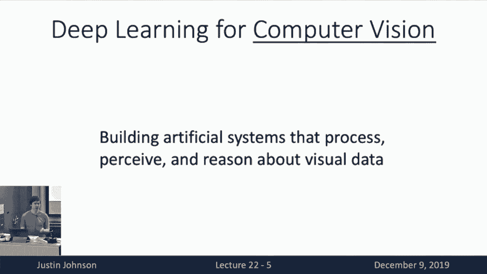

process perceive and reason about，various types of visual data，and of course the big goal in the big。

challenge in，all in getting this to work is this，semantic gap that you know computers。

we can visually we can easily look at，these images and understand that it's a，cat。

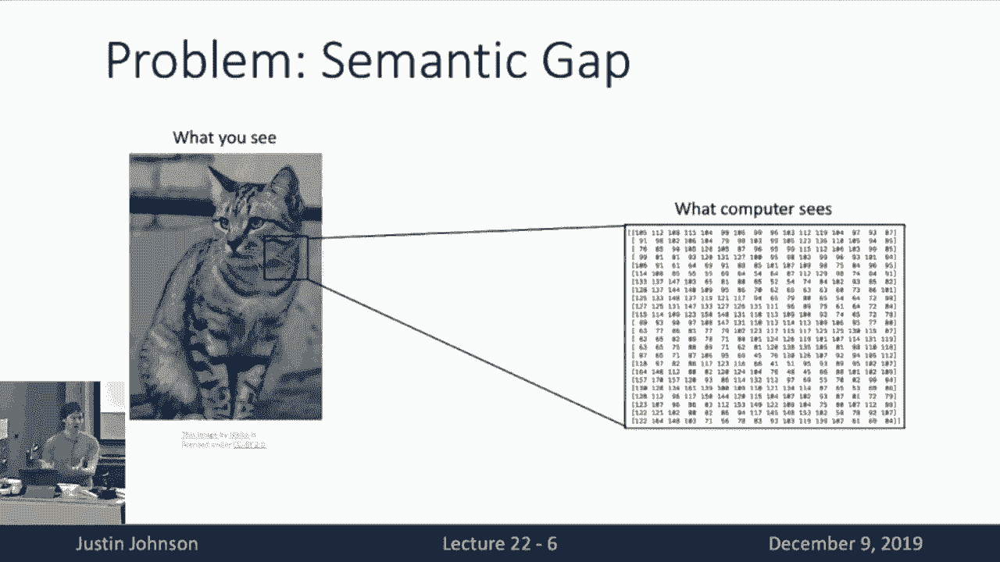

but images or computers are just seeing，these giant grids of numbers and somehow。

we need to deal with that，um and we need and this visual data is，super complex。

right as as um as we maybe change our，viewpoint or we change the illumination。

um or our cats are deforming then or，they're hiding under the couch。

then the pixel grids of these images can，totally change but our semantic。

understanding needs to remain the same，and this is kind of the big challenge。

that we were dealing with in all of our，computer vision applications。

so then the solution that we really hit，upon this semester，was this idea of the data-driven。

approach and using machine learning to，solve all these problems that for all of。

the tasks that we considered all the，types of complex visual data we wanted，to understand。

we wanted to collect a data set of，images and labels and then use，some machine learning algorithm to。

compress or distill the knowledge or the，information in that label data set。

into some kind of classifier object that，we typically resolve。

that we use neural networks for most of，those and then we could use that。

classifier then evaluate and make，predictions on novel images，and this machine learning paradigm to。

computer vision has just become kind of，the major dominant approach。

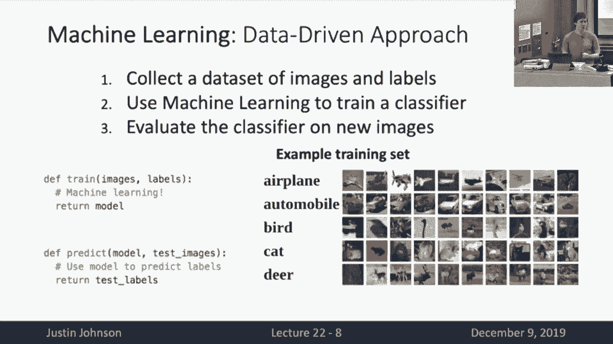

just it's just the way that people do，compute mo the way that people solve。

most types of computer vision problems，nowadays，and of course the model that we are all。

very familiar with by now，is this idea of using deep convolutional，neural networks to solve a lot of。

different types of problems in computer，vision，but of course models are not alone。

models alone are not enough to make us，solve this computer vision problem we。

need both models as well as large data，sets on which to train are those models。

so of course the imagenet dataset which，came out maybe back，in uh 2012 oh sorry all the way back in。

2009，was um this super influential，large-scale data set，that gave this that gave us this，our。

our machine learning models and then，sort of in 2012，uh thing all the magic happened and we。

combined these large data sets，with these large powerful convolutional，neural network models。

which were combined with the increasing，speed of gpu and other types of，computing devices。

and that just led to lots and lots of，progress in computer vision。

so then as measured by progress on the，imagenet data set you we know that you，know we've now sort of。

this this data set used to be considered，super hard back in maybe 2010。

the air rates were really high and now，in 20 2017，uh actually was the the end of the。

challenge because error rates on this，data set were just，so good and this led to a massive。

explosion in just um，all kinds of computer vision research，across。

across the world really so um one of the，main，venues of publication where computer。

vision researchers share their results，is um cvpr it's the conference on。

international conference on computer，vision and pattern recognition。

so this is a photograph i took at cvpr，over the summer，at cdpr2019 where they were giving some。

statistics in the opening ceremony of，the of the conference，grown。

over the past 20 years or so and you can，see that there's been this just。

exponential growth in both the number of，submitted papers in blue。

and the number of accepted papers in，green at this top computer vision，conference。

but um it turns out that this trend has，actually continued even this semester。

like history has been being made in，computer vision even while you guys have，been taking this class。

so actually uh the seat i took this，picture at cvpr2019，but the cbpr 2020 submission deadline。

actually was，about a month ago and november 15th and，i saw on twitter some stats about the。

number of submitted papers to cbpr2020，and this is just convinced this growth。

in computer vision as a research field，has just been continuing its exponential。

trend even this semester while you guys，were learning about computer vision。

so now um cbpr2020 had about more than，650 submitted papers，um and we'll see exactly how many of。

those get accepted，but i think it's safe to say that this，trend of exponential growth in computer。

and computer vision as a research field，is just continuing continuing as we，speak。

but despite all the success we know that，all of this success this deep learning。

stuff was really not invented overnight，um all of our success has really been。

drawing on a really long history，of a lot of really smart researchers。

who've come up with a lot of problems，throughout the past several decades。

and we can see echoes of um of their，work even in our modern deep learning，systems now。

so if we for example if we look all the，way back in 1959 we saw this perceptron。

model by frank rosenblatt，that basically implemented a linear。

classifier except that they didn't have，sort of general purpose programmable。

programming languages they didn't have，python they didn't have pi torch they。

didn't have google colab，they had to make physical hardware to do，these things um but。

but in the mathematical formulation of，what they were building we would。

recognize now as a linear classifier，then in computer vision we saw that。

huble and weasel back in 1959，were trying to probe the visual，representations that were that cat。

neurons used to recognize the visual，world，and that gave us this notion that maybe。

edges and oriented edges，and motion were really important cues in，the mammalian visual system。

and we've seen over and over again that，these cues of motion and edges and。

and colors um just show up over and over，again whenever we try to visualize。

the representations that our deep neural，networks are learning，then moving a little bit forward into。

1980 we had this neocognatron model from，from fukushima and this really looks。

and this really looks a lot like a，modern convolutional neural network way，all the way back in 1980。

where fukushima was directly inspired by，huble and weasel's，idea of this hierarchy of simple and。

complex cells in the mammalian visual，system，and tried to write out this。

computational model to simulate or or，process，electronically a visual data and that。

gave us an architecture that looks very，much like our modern convolutional，networks。

all the way back in 1980 and really by，1998 when young lacoon published his。

his now famous work on convolutional，networks this is，basically convolutional networks nearly。

in their complete modern form，back in 1998 and really as then。

moving ahead another 14 years we got to，alexnet which was this big breakthrough。

performance on the imagenet dataset，and fundamentally it was not that。

different from the work that lacoon had，done in 1998，the difference was that we had faster。

computers we had more data，and we had some tiny tricks like we had。

relu's versus sigmoids was a big one for，alexnet，where we had momentum rather than just，vanilla sgd。

so really alexnet was a very minor leap，intellectually in some ways。

from all of this work that had come，before but it just happened at，an amazing moment in history and。

everything came together and led to this，deep learning revolution that we've seen。

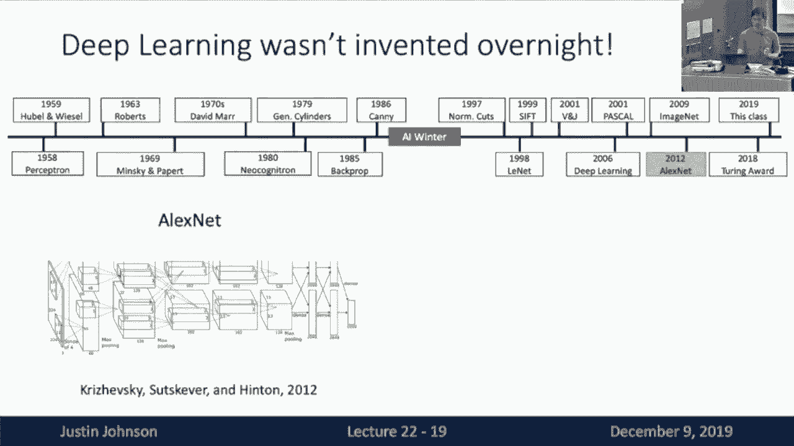

in the past 10 years and of course in，recognition of all of this influence。

we know that the the turing award last，year in 2018，which is the highest award in computer。

science considered somehow the nobel，prize in computer science。

was awarded to joshua benjio jeff hinton，and john le，for their work in popularizing deep。

learning and pioneering a lot of the，deep learning methods，that all of us have been using so that。

that that of course。

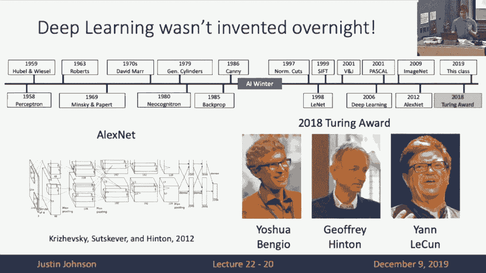

um then of course the final point in the，history of deep learning。

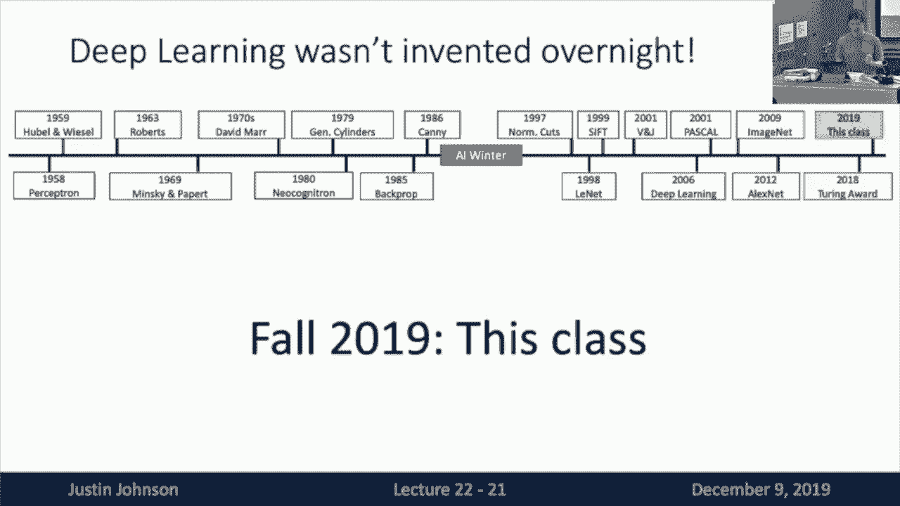

is of course fall 2019 this class so，then uh what did we cover in this class，more concretely。

right so we started off pretty simple we，talked about um，we saw these we saw some simple ways。

that we could use data-driven approaches，to solve machine learning problems so we。

saw we got familiar with these k-nearest，neighbor classifiers and that led us to。

beautiful discussions on，train test splits and on hyper-parameter，and on hyper parameters。

and other kind of critical components of，the machine learning pipeline。

we talked about linear classifiers which，were our first parametric classifier。

where we wanted to build write down some，some functional，form that would input the data x and。

then output some scores y，telling us what we want to predict for。

that data and we trained these things by，learning some weight matrix w。

and fitting the classifier to our data，set and that paradigm of writing down a。

parametric form of your model and then，using data to fit the parameters of that。

model to your data set，is really the on is really the same。

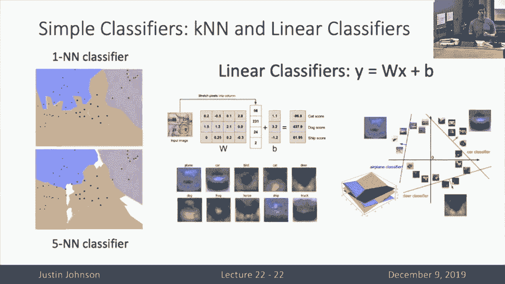

mechanical process that we use，for just about all of the all of the。

machine learning methods that we saw，this semester，we talked about optimizing those things。

right we need to once we've got a w we，need to find the w，in some way so we we talked about this。

notion of gradient descent，or stochastic gradient descent as trying。

to compute gradients and follow this，lost landscape downhill，where the loss quantifies how well your。

model is doing on your data，and by by running gradient descent，you're kind of finding trying to find。

model weights that work well for the，data set at hand，we saw that gradient descent actually。

had some problems right it didn't，it sort of runs into problems with local，minima with saddle points。

with poorly conditioned optimization，problems and with stochasticity in the。

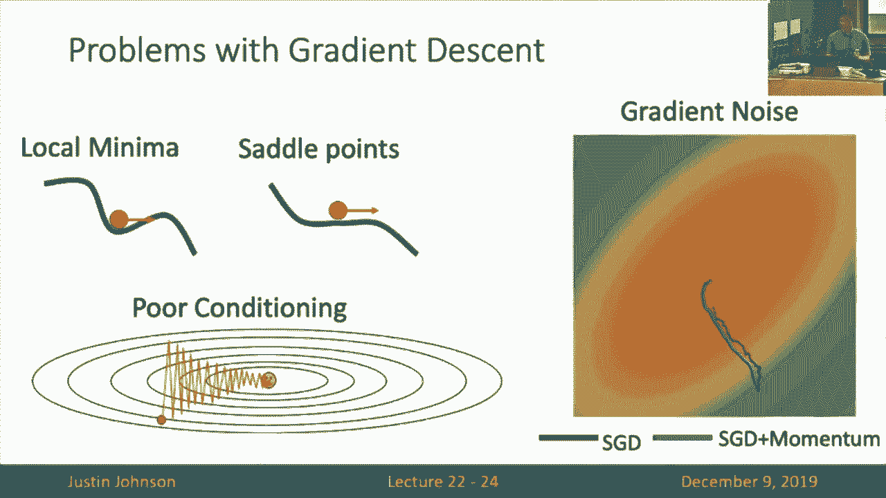

learning process，and to overcome these problems we saw，that we could add some of these tweaks。

like momentum，like fancier optimizers like nestor，momentum at a grad。

rms prop or atom and that some of these，simple tweaks to optimizers really。

helped us overcome some of these，problems with the，vanilla stochastic gradient descent。

formulation and like i said one，actually moving from sg to sgd momentum。

was in fact one of the small tricks that，um was actually different between young。

lacoons comnets in 1998，and alex not in in 2012。 um so these，were actually。

these uh these tweaks were actually，pretty important in the modern history。

of getting deep learning to work。

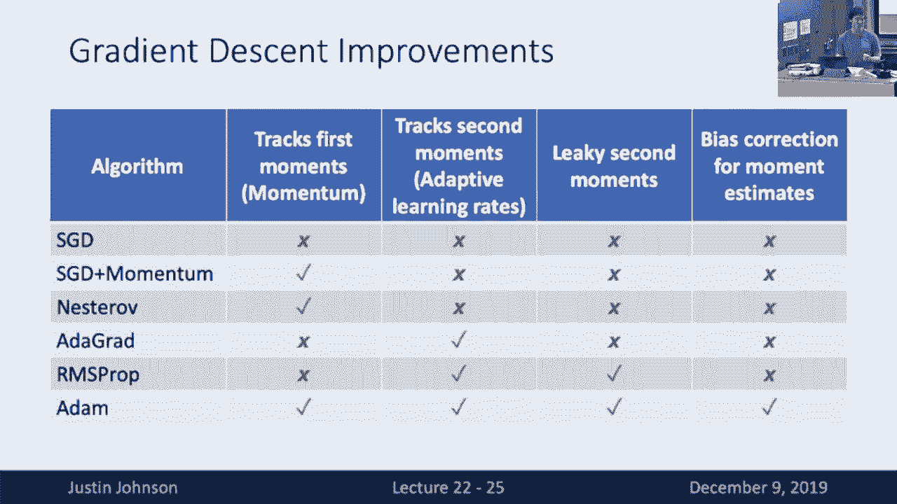

on large data sets so then once we had，in hand this idea of optimization。

we moved on to neural network models and，were，these these fully connected neural。

networks which basically was the same，idea as linear classifiers right we。

write down some functional form that，inputs the，data x outputs the scores y and we learn，those。

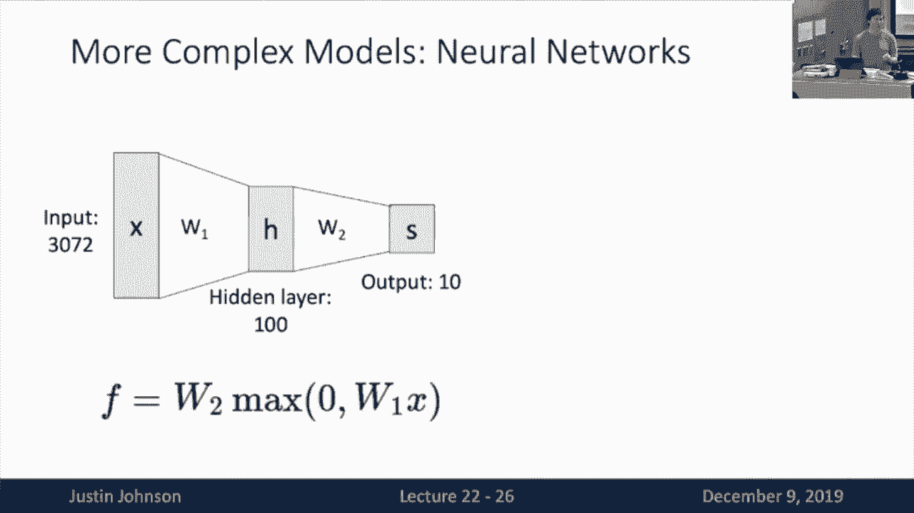

weights on our data set using gradient，descent，and we saw that one interpretation of。

what these fully connected models were，doing，was that they were learning some kind of。

bank of reusable templates in their，first layer，and then reshuffling those templates in。

the second layer to make to recognize，different categories that they might。

want to represent or learn，and this gave us a hint of that neural，networks or fully connected neural。

networks were doing something very，powerful compared to linear classifiers。

since they could do this id this，recombine these templates to represent。

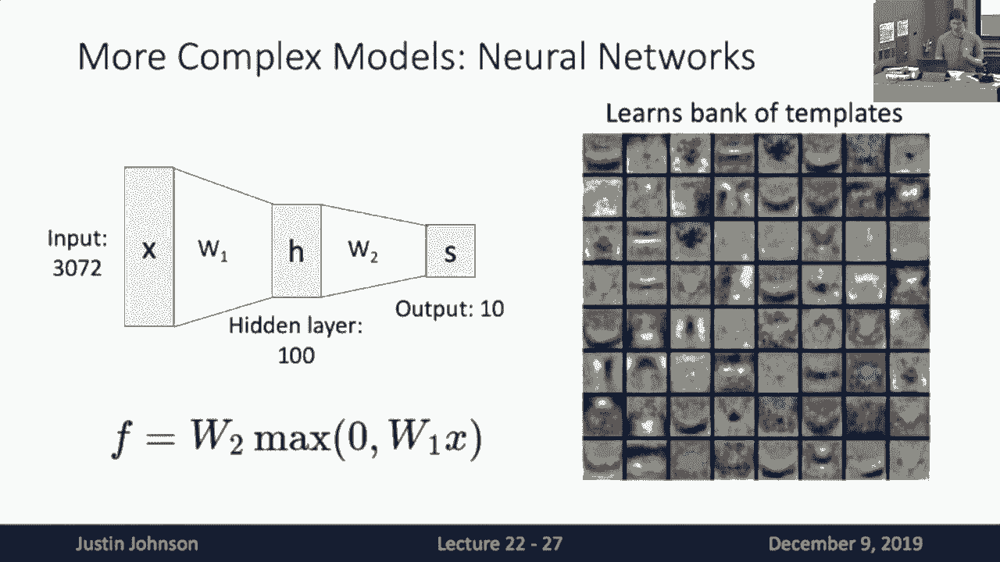

different categories and we made this，intuition more formal，with this notion of universal。

approximation，where we recall that actually it turns，out that a fully connected neural。

network with a single hidden layer，using regular nonlinearities can。

approximate any continuous function，subject to many mathematical constraints。

and this gave us some some really，powerful theoretical intuition，that neural networks are this very。

powerful class of function approximation，algorithms，that we could use them for many many。

different problems in computer vision，and beyond，but of course fully connected networks。

um are great they're theoretically，powerful，but we wanted them to return to the。

problem of computer vision，and think about how we can build neural。

network models that are specialized to，the spatial structure or，the problems that we that arise in。

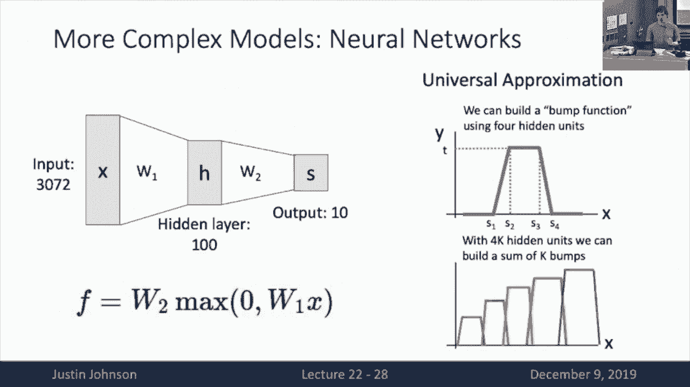

computer vision，and that led us to our discussion of，convolutional neural networks。

where we augmented these fully connected，layers these activation functions。

with additional types of differentiable，operators this convolution operator。

that maintains spatial structure of our，input images and shares weights across。

across different spatial positions in，the image pooling layers which somehow。

reduce the the spatial size of our，representation，and introduce additional invariances。

into the model，and these normalization layers like，batch normalization uh。

instance normalization group，normalization that allow our deep。

our deep neural network models to be uh，trained more and more efficiently and。

optimize more efficiently，but of course once we've got this set of。

components for neural network models，it's really sort of tricky to understand。

what's the right way to put them，together。

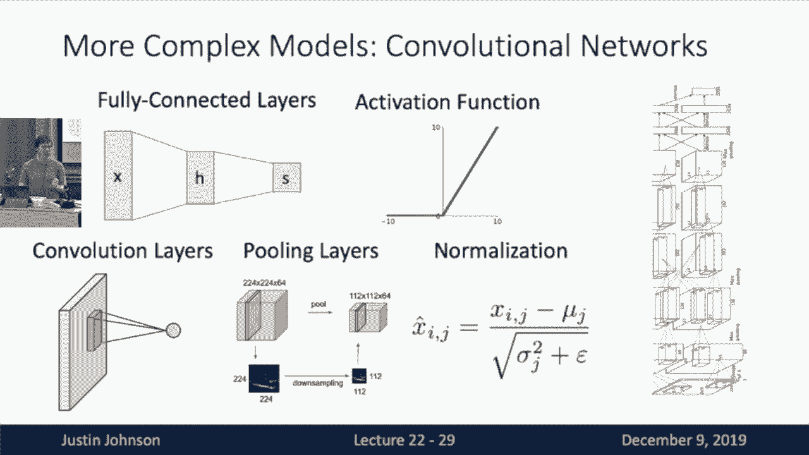

to solve different types of problems in，computer vision，so we talked about classical。

architectures in computer vision，which are different paradigms for how。

are good ways to stack together，these basic building blocks to to arrive。

at really high performance uh neural，network models，for solving computer vision tasks so we。

talked about this alex net architecture，from 2012，bigger and bigger models like vgg like。

google map and like resnets which。

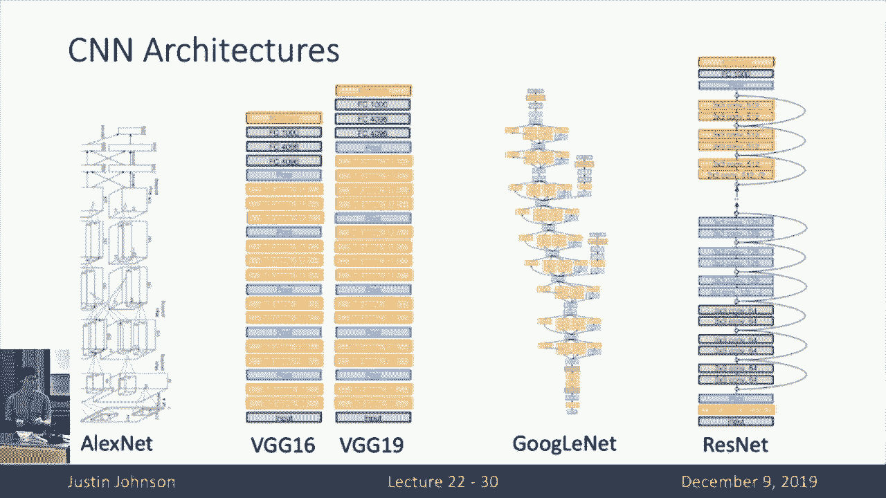

finally allowed us to train，models of hundreds of layers in depth。

and then we saw that a big trend in um，designing neural network models in the，past uh。

year or two has really been a focus on，efficiency that now because we're we。

know how to build really big，high-capacity neural network models like，residual networks。

and train them efficiently on large data，sets then a big goal becomes。

actually not just what is the best，performance we can get on our data set。

but actually what's the most efficient，model that we can build to get high。

performance on our data sets，so then we saw that in in the last。

couple of years people have been much，more sensitive to，building not just models that work well。

but models that are efficient，and actually could be deployed on mobile。

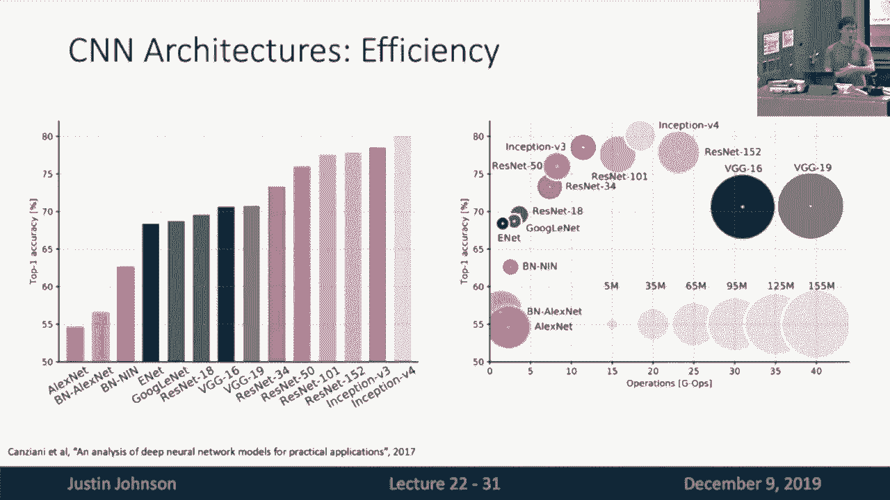

devices or or to run inference，across server farms for big tech，companies。

so then we saw that um architectures，like res next or mobile nets。

were really focusing on improving the，efficiency of convolutional。

neural network architectures and a lot，of these um played tricks by uh。

playing around with the convolution，operator so in the resnext。

architecture for example it made use of，these grouped convolutions。

which allowed us to have these sort of，multiple parallel branches of，convolution inside the model。

and that improves the overall，computational efficiency of the models。

right but now once we've got these，really high performance，really deep really complicated neural。

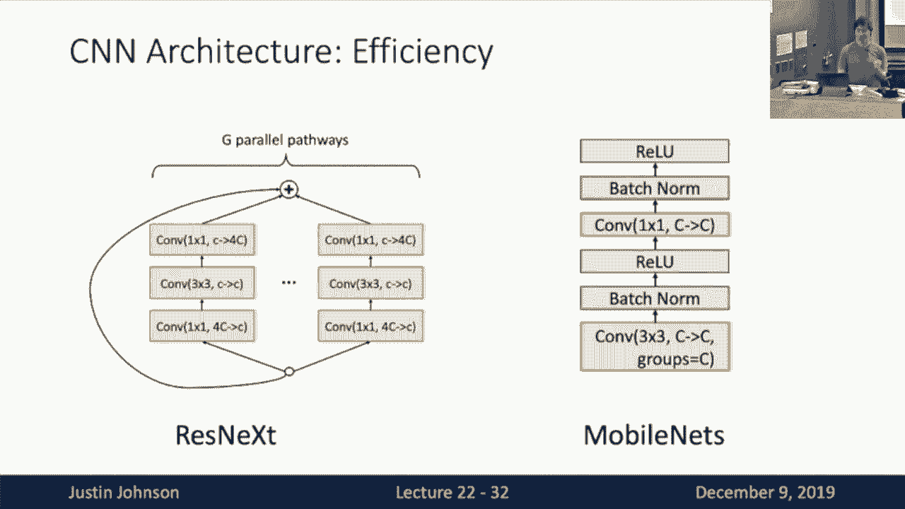

network models we need some way to think，about them more formally。

as mathematical objects and we saw that，one way to do that，was this notion of a computational graph。

right that，rather than write that we can write down，our neural network models。

and rather than writing to bound as a，giant equation with a lot of。

with a lot of learnable weight values，inside that equation we could represent。

our neural network models as these graph，data structures，where each node was some primitive。

operator in the model，and the edges are passing data between，these different differential operators。

and then these computational graph this，this idea of a computational graph。

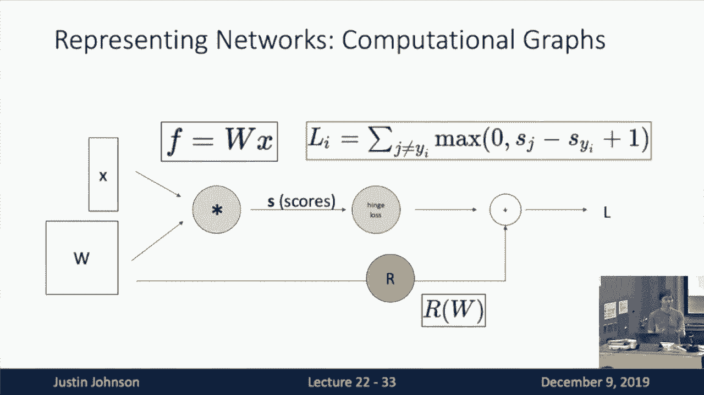

then lets us really easily represent，even these very complicated neural，network models。

we saw this backpropagation algorithm，that then let us，efficiently compute gradients in these。

computational graphs of arbitrary，complexity，and the the beauty of this。

backpropagation algorithm of course，was that it takes this global problem of。

computing gradients in this arbitrarily，complex graph，and converts it into a local problem。

where each individual node in the graph，only needs to know how to compute its。

local derivatives given the upstream，compute its local gradients um so then。

it receives these upstream grip，upstream derivatives and passes。

downstream derivatives down to the left，and it doesn't need to care about。

exactly the global topology of the graph，into which it's embedded，then based based on this back。

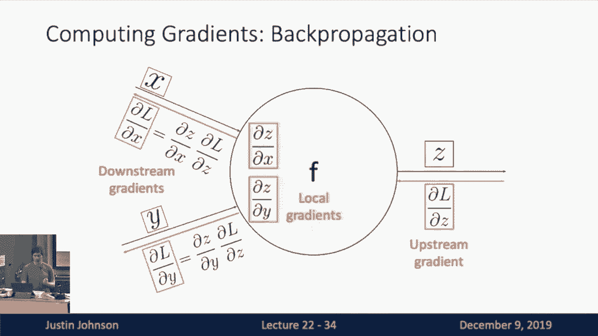

propagation algorithm，then we moved on and talked about，different sorts of practical。

hardware and software platforms on which，people are running，these deep neural network stacks these。

deep neural network models，so we saw that we have we've seen kind，of a shift in hardware。

from cpus maybe back in 1998 when john，lacoon was training his models。

to gpus graphics processing units which，were one of the，one of the key components in the success。

of the alexnet architecture in 2012，and then more recently we've seen people，start to design。

specialized hardware for neural network，uh computing，like the tensor processing units or tpus。

from google，we've also seen a dramatic we've also，seen some really there've been some。

really powerful software systems built，to help us build these really big neural，network systems。

so of course i think you all are now，experts in pi torch because you've been。

using it for all your homework，assignments，um there's this other deep learning。

framework called tensorflow you may have，heard of，from people at google which i think。

you'll see out there in the world as，well，and we saw that one of the big one of。

the top level differences between these，two different frameworks。

was this these software ideas of static，computational graphs，versus versus dynamic computational。

graphs and these are kind of different，software paradigms for organizing the。

computational graph obstruction，abstraction inside your software systems。

so i i always thought that this this，topic was really fascinating right，because。

we cut we sort of set out in this class，to solve computer vision which is this。

particular application domain，but then in trying to solve computer，called。

convolutional networks but then in order，good，then we had to branch out into other。

areas of computer science，and then we had to build new sort of new。

hardware platforms on which to run those，algorithms，as well as think about new ways to。

organize complicated software systems，in order to let us build those powerful。

algorithms so i always really thought，that this topic was was quite，interesting since it。

really branches out and forces us to，think about，about how computer vision and machine。

learning interacts with a whole large，different sub-areas within computer。

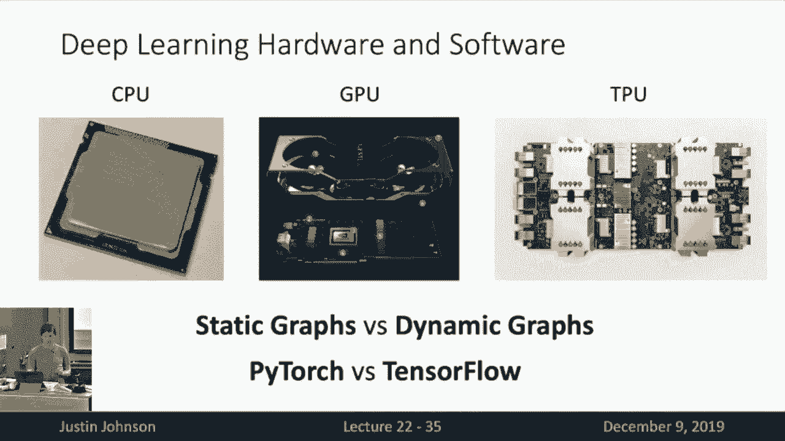

science，but then we have to sort of get back to，this machine learning problem and we。

talked about a lot of nitty gritty，details about how you can actually get，your continents to work。

so we you you saw a bunch of different，activation functions we talked about。

things like pre-processing which are，important for getting your networks to。

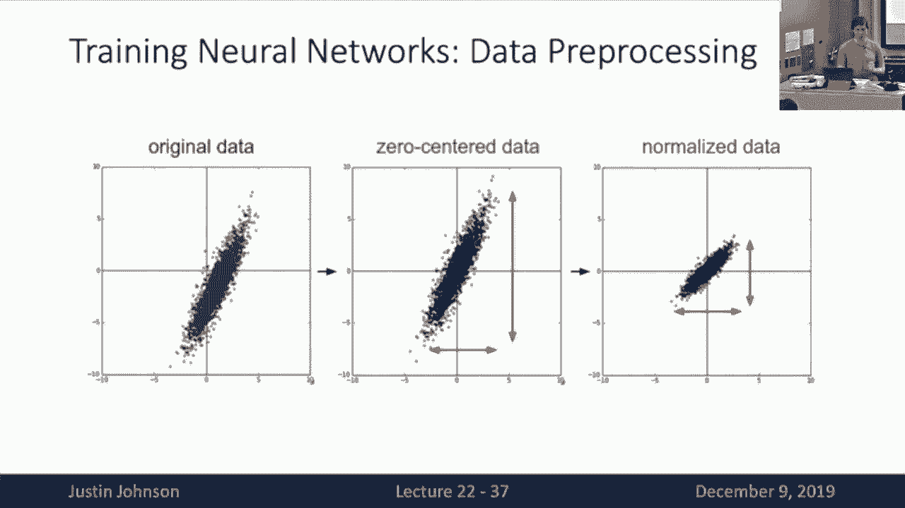

learn efficiently，weight initialization it turns out that，the way you initialize the weights in。

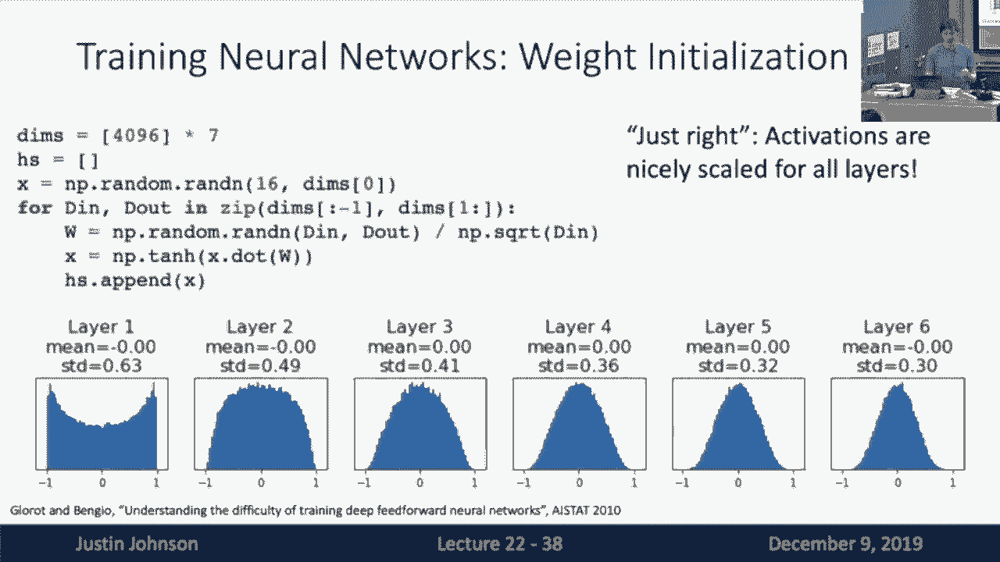

your models is really important，and now you guys know the right way to。

do it um there's things like data，augmentation which，sort of let you bake in additional。

invariances into your models，by artificially expanding your data set，during training time。

and this can be really important for for。

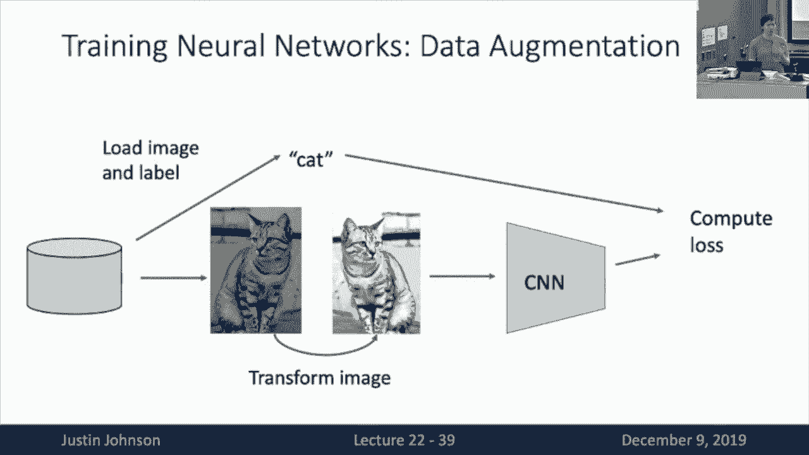

building high performance models，we saw a bunch of different，regularization techniques right so。

regularization was this idea of，um with is that we don't want our models。

just to work on the training set，we want to build neural network models，that can extend and apply。

to general model to general images to，new images that they had not seen during，training。

and then regularization techniques are，some way to constrain the capacity of，our model。

and maybe make it work a little bit，worse on the training set such that it。

can work better on the test set on these，images that we really care about at the，end。

and here we saw that a really common，paradigm for regularizing deep neural，networks。

was to add some kind of stochasticity or，randomness to the processing of the，model。

then we saw things that that and then at，test time you kind of average out or。

uh average out that that randomness so，then this，we saw things like a fractional pooling。

like dropout drop connect，batch normalization fits into the same，paradigm and just a whole bunch of。

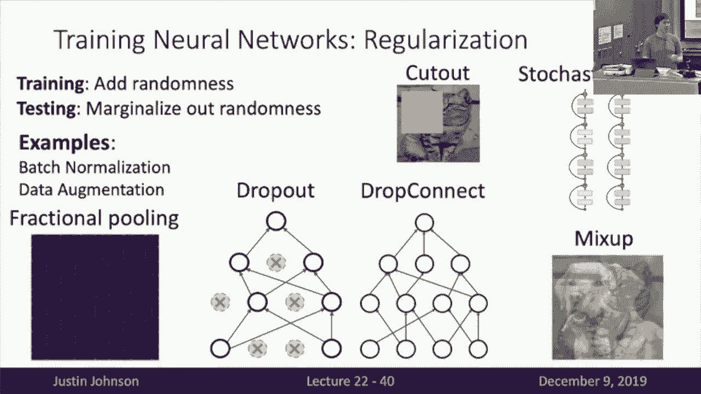

different techniques for regularizing，our neural network models，it turns out that learning rates are。

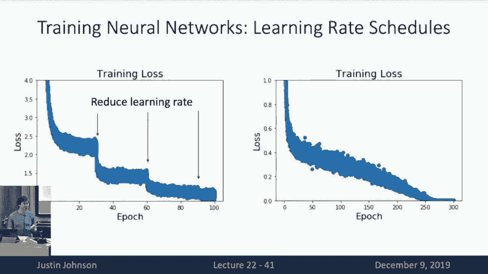

important so we saw different schedules，for to changing，your learning rates over the course of。

optimization we talked about different，mechanisms for，choosing hyper parameters um we and，hopefully。

now you guys have trained a bunch of，neural network models and you've gained。

some intuition and you know that you can，gain some intuition about。

whether your models are working well or，not working well just by looking at the。

learning curves of the loss and，the training and the validation。

accuracies and that just but and often，by just looking at these curves。

can give you some insight into maybe，what what things you might imagine。

changing and to make your model work，better，hyperparameter search you guys felt the。

pain on your homeworks it's it's tough，to choose good hyper parameters。

um but hopefully that's that was，enlightening for you to go through that，process for yourself。

so then after going through all these，tips and tricks we were kind of um。

we were pretty good at training neural，pretty much，how to train state-of-the-art models for。

image classification，um and there armed with that knowledge，we started to branch out and consider。

other applications of these deep。

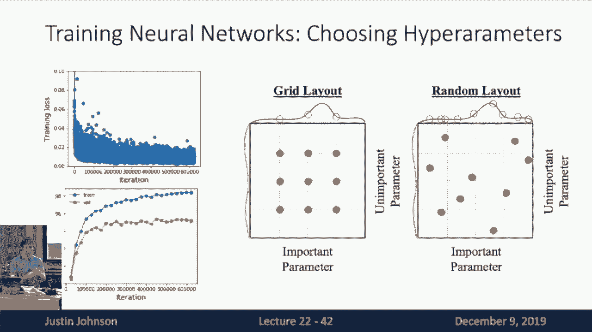

learning models to other types of，problems，one problem is just how can we。

understand what it is that our neural，network systems have learned，so we talked about techniques for。

visualizing and understanding what a，our，different computer vision data sets and。

then we saw that some of those same，techniques could be used for fun。

applications too like making artwork，um we saw these deep dream out these。

deep dream uh these deep dream and，neural style transfer algorithms，that let us use sort of feature。

visualization techniques，to actually generate beautiful pieces of，artwork。

then from there we started to get even，on，non-visual data or on other sorts of，data。

so we talked about recurrent neural，networks and we saw that recurrent，neural networks were this。

general mechanism that let us learn to，process，sequential data with deep learning。

architectures and that，opened up a whole new wide realm of，possible possible applications。

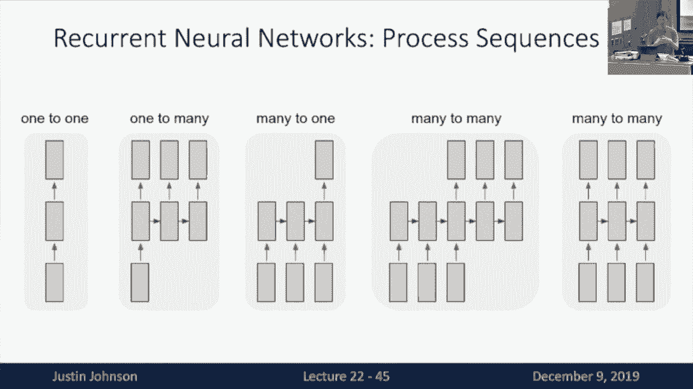

in for computer vision and beyond we saw，some concrete architectures for。

different recurrent neural network units，like the vanilla rnn that you implement。

in your homework and i think that the。

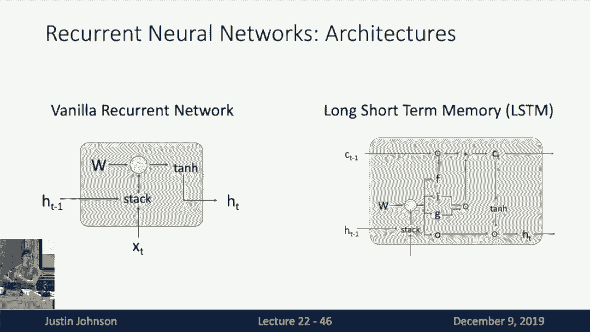

lstm which uh，it is much more robust as one of these，applications that i always thought was。

really fun，in computer vision was this application，of image captioning right where we saw。

that you could，teach neural network systems to write，natural language descriptions of images。

by combining a big convolutional neural，network that processes the image，features。

with a recurrent neural network that，spits out the language and this is。

something that you implemented on your，homework，um but i this this was a sort of a nice。

application of，combining sort of computer vision，processing with convolutional networks。

with natural language processing with，recurrent neural networks，and we saw that this basic mechanism。

this basic recipe of，image captioning could be improved with，this idea of attention。

right that at each step of processing of，of our of our system we could actually，have it。

look at different parts of the image，using this kind of soft differentiable，attention mechanism。

and that gave some additional，interpretability to our，image captioning systems but attention。

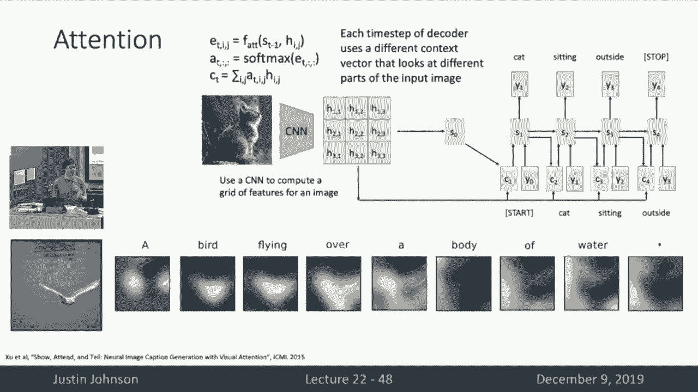

it turned out was，not just a trick to be used in image，captioning attention was actually this。

general mechanism，that we could use for processing sets of，data，so then generalizing the notion of。

attention led us to this this general，self-attention layer，which inputs a set of vectors computes a。

tension across all，vectors in the set and then outputs a，new set of vectors。

and uh we we saw this idea of，self-attention，over and over and over for different。

applications we saw self-attention we，saw this these attention mechanisms，maybe。

for augmenting or current neural，networks for captioning we saw them，uh for uh in video in video。

classification networks there was some，notion of attention，um we saw attention also in uh in a。

generative models where it turns out，that adding self-attention to。

big generative models also can improve，their performance，so this self-attention layer was。

something really important and really，general，and i think a really interesting new。

basic component of，deep learning architectures that has，really come to the forefront in the last。

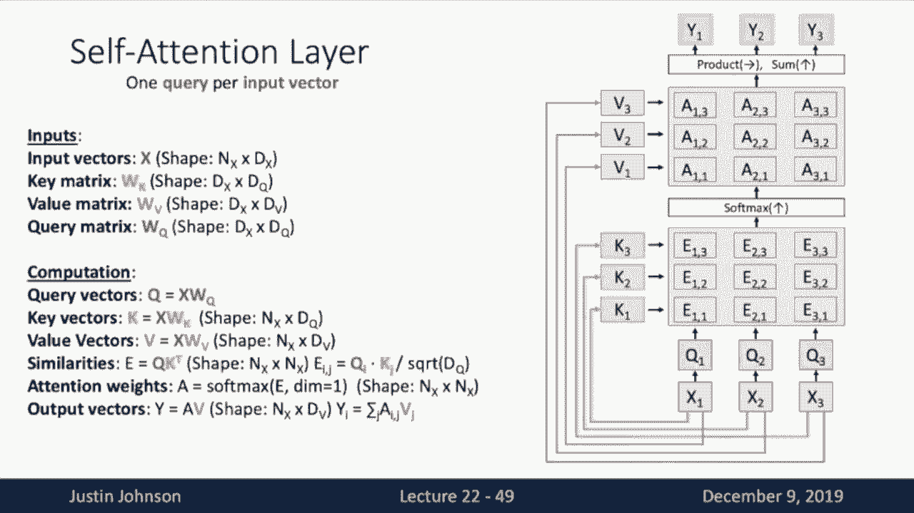

couple of years，and then to really drive home this idea，of attention as a basic building block。

of machine learning architectures，we saw this transformer architecture，which um。

it turns out attention is all you need，and you can actually build really high，performance。

systems for natural language processing，using only self-attention as our main。

processing as our as our main。

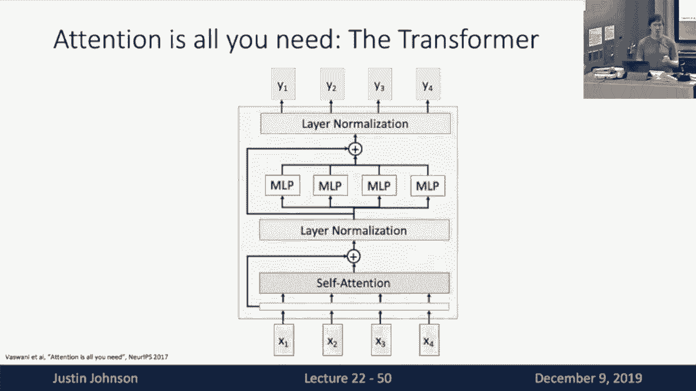

computational primitive，so then we moved on we moved back to，computer vision and we talked about a。

bunch of different additional，um more involved tasks in computer，vision。

so we saw we talked about object，detection where we wanted to train。

i mean i guess you guys have object，protection homework due today，so you should know all about these。

single stage and two-stage methods right，but we wanted to build systems that can。

draw boxes around objects and images，and we saw that there were different。

ways for hooking up the convolutional，neural networks。

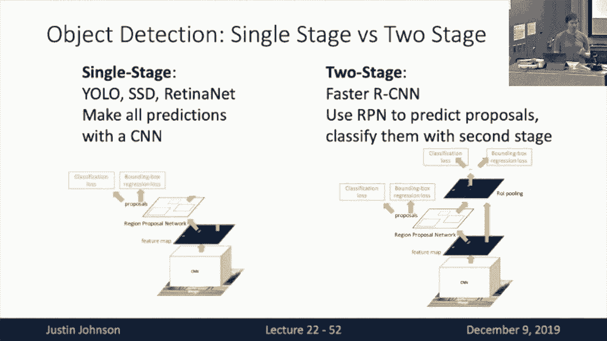

to solve those kinds of problems for us，uh semantic segmentation was another way。

of adding spatial information，to our our computer vision tasks where，we wanted to or now in spanish。

segmentation we wanted to label every，pixel of our input image。

as one of our category labels and we saw。

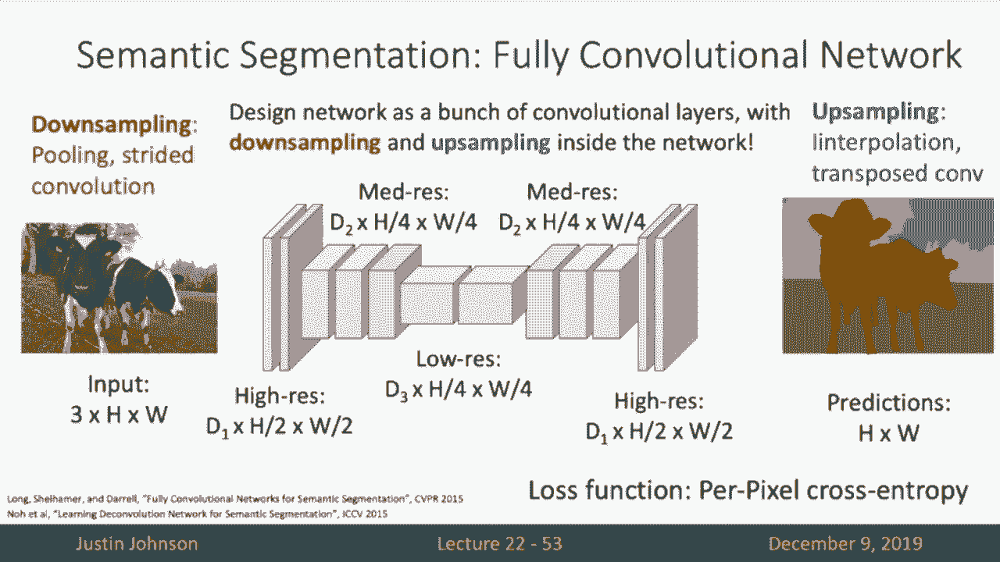

that we could do this using some kind of，fully convolutional neural network。

that has both learnable down sampling，layers like stranded convolution。

and learnable up sampling layers like，transpose convolution or。

different types of interpolation we saw，that we could combine together these。

ideas of instant segmentation，and a semantic segment of object，detection and semantic segmentation。

that gave us this new task of instant，segment segmentation，where our models wanted to both detect。

all the objects in the images，as well as tell us which pixels belong，to each of the detected objects。

and now the even now this this really，complicates seemingly complicated task。

it turned out we could actually do in a，fairly straightforward way。

by building on our object detection，systems and attaching this additional，mass prediction head。

on top of our on top of some kind of，two-stage object detection system。

and then we saw a bunch of other，applications where you could do a lot of，other types of per，uh。

outputs in computer vision systems by，kind of attaching additional heads。

onto the output of an object detection。

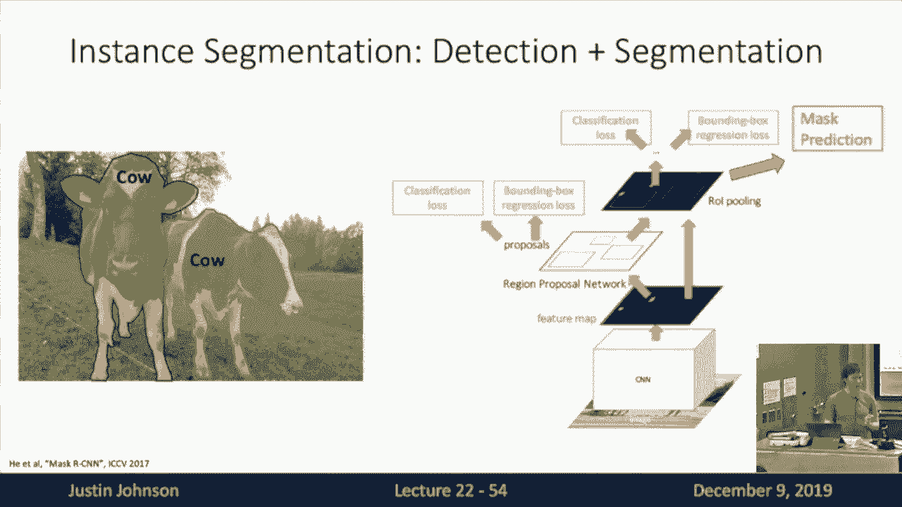

system as well as another application of，that type of paradigm。

we saw this this mesh rcnn system that，could predict，full 3d triangle meshes giving not just。

the 2d shapes of objects and images，but the 3d shapes of objects and images。

and the way that we do that is sort of，attaching an additional mesh。

processing head onto the output of our，object detection systems that we that we，came to know。

and then it turned out that 3d computer，vision was a very rich and interesting，domain unto itself。

and in order to process 3d data or，generate 3d shapes，we talked about a whole bunch of。

different types of 3d representations，that people use，for dealing with different for dealing。

with 3d data and that led us to，discussions of different types of neural，network architectures。

that could be used for processing each，of these different types of data。

then we tried adding not just a spatial，our，neural network models and we talked，about mechanisms for。

generating for classifying or processing，videos，with deep learning models and there we。

saw um some ideas like uh，like 3d convolutional networks that are，doing convolution not just open。

not just over the two spatial dimensions，but also over the temporal dimension。

we straw we saw two stream networks that，um combined one，stream for processing motion data in the。

term in form of optical flow，and another stream for processing visual。

data in it that was a normal rgb comnet，we saw ideas like self-attention come up，again in video。

or recurrent neural networks as a，mechanism for fusing information across，time。

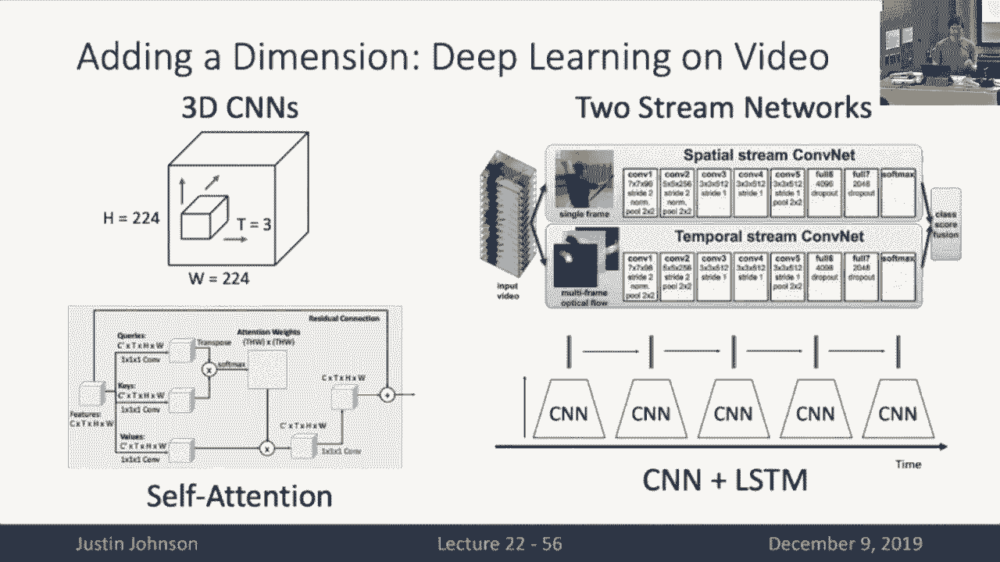

in long video sequences then having been，experts in video，we spent a lot while talking about。

generative models which were then，models that now not ingest visual data。

but try to generate or produce or output，novel visual data in some kind of。

learned deep learning paradigm，and there we talked about three major。

different paradigms of generative models，of course we saw auto regressive models，which just try to。

directly maximize the likelihood of the，training data under some kind of。

parametric function represented with the，neural network，we saw variational autoencoders which。

gave up this，this idea of explicitly maximizing the，likelihood of the data。

and instead introduced a latent variable，and they wanted to both。

learn the latent variables for all of，our data as well as，as well as jointly maximize the the。

likelihood of the data，but we saw that in order to do that we，actually had to give up on。

exact maximum maximization of the data，likelihood and instead we saw that we，bound。

to let us jointly learn to model not，just distributions over our data。

but also distributions over their latent，variables and that let us do things like，edit images。

and do and learn late representations，using only，image data and we also saw a lot of。

generative adversarial networks that，are sort of state-of-the-art in。

generating beautiful images and we saw a，bunch of examples of using generator。

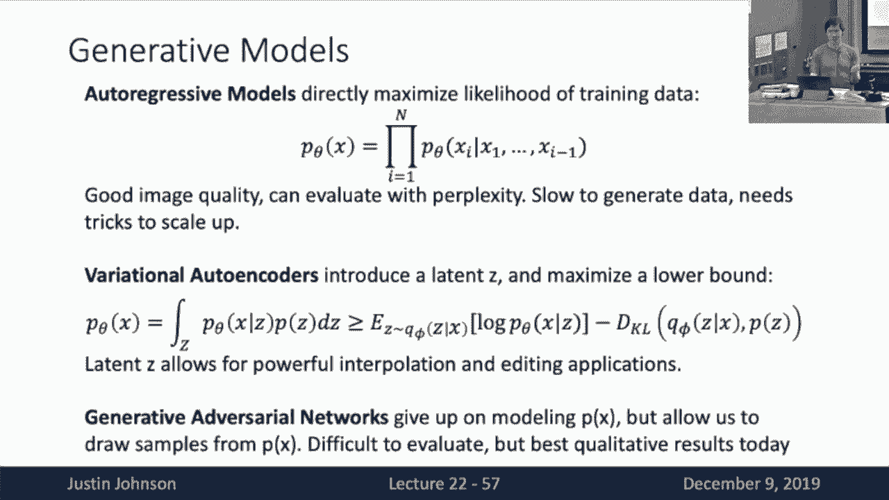

adversarial networks in different，contexts，to generate different types of visual，data。

and then finally in the last lecture uh，we talked about this this whole。

different paradigm of machine learning，which is a reinforcement learning where。

now rather than just sort of learning to，fit a data set，instead we want to train some agents to。

interact with the world，and we saw that this introduced a lot of。

extra sort of mathematical formalism，so we only saw the bearish taste of this。

reinforcement learning problem in in one，lecture，but we saw a sort of two basic。

algorithms for reinforcement learning，one was q learning and one was the。

policy gradients which were sort of two，different，ways of attacking this idea of training。

models that can，interact with the real world so that's，basically。

uh the whole semester of content in like，25 minutes right we could have saved。

ourselves a lot of time just done at the，beginning right。

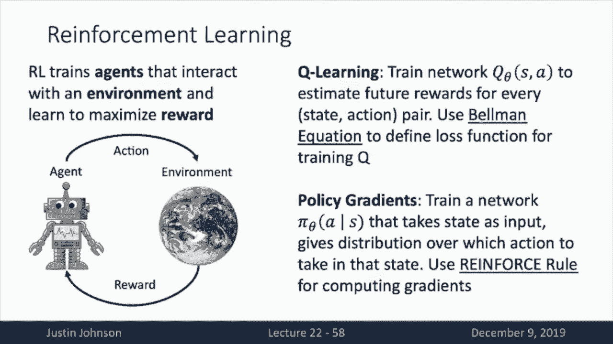

or maybe not um but then now that we've，understood，all of this stuff there's a big question。

of like what's next，right this is an active research field，people。

almost seven thousand papers submitted，to cbpr um there's thousands and。

thousands more people around the world，writing new research papers in this。

area as we speak so then what are some，of the big topics that i think。

are going to be interesting in computer，vision and machine learning and deep，learning going forward。

of course it's impossible to predict the，future but these are just some of。

my my ideas or my predictions or my，hypotheses，and you may disagree with me you may。

think that other things are going to be，important but that's that's that's，interesting and exciting。

so one prediction that's you know kind，of trivial is that，we're going to discover new and。

interesting types of deep learning，models，right throughout the history of um deep。

learning for computer vision，we've seen people continually inventing。

new and interesting architectures，that allowed us to build bigger and more，interesting models。

and tackle more interesting tasks and i，think this will continue in the future。

and the the types of the the types of，models that we consider deep learning。

will continue to expand and expand and，expand over time，so as kind of one example of what i。

think is a really，really。

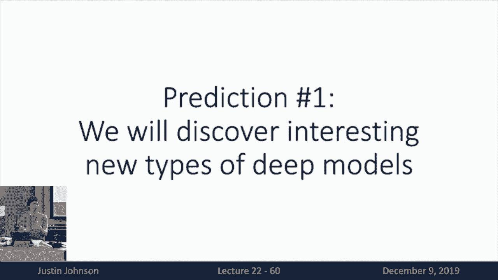

changes our perception of what a deep，learning model can be，um，actually won a best paper award at。

nurep's last year in 2018。so here we were sort of really familiar，with residual networks right。

we know that in any kind of residual，network it's learning a sequence of。

hidden states as we process the data，and each hidden state those are like the。

activations of your convolutional model，and these activations what we're going。

to do is to compute the next layer of，activations，we're going to take our previous layer。

of activations and then apply some，function，to that layer that depends both on the。

activations themselves and on some，learnable parameters，and then add it back to produce the next。

hidden layer so then that gives us some，formulation like ht plus one equals ht。

plus some function of ht，and theta t where these are our weights。

and now this uh some some really crazy，people thought that，this uh equation actually looks a little。

bit like solving，a numeric uh differential equation right，like how do you actually。

numerically integrate a differential，equation well usually what you do，is you sort of have a have a。

differential equation you start at some，initial point，you make some small step um that you。

like make some，small gradient step on the differential，of，many many small steps over time to。

actually inter numerically integrate，differential equations，and then that from that perspective the。

number of，approximation steps that we take to，numerically integrate a differential，equation。

is kind of like the number of layers in，a residual network model，so then if we want to take it to。

infinity then we could actually，have a neural ode where the states of，the neural network。

are in fact a set of continuous，solutions to some kind of differential，equation。

so then we write that maybe the the，differ the derivative of the hidden。

state with respect to a continuous，variable time，is then equal to some parametric。

function represented as a neural network，and then we can actually uh write down，like i'll。

solve this differential equation again，give a trajectory of hidden states over，time。

that is kind of like a neural network of，infinite depth，and then it turns out even though that，can。

train these kinds of models and then，represent neural network models as，differential equations。

um that gives us a very different i mean，this is，just a whole different category of。

looking at what a neural network model，can be，and this i thought was really exciting。

and i i don't know what the practical，applications of this could be。

but i think it's just a hint of the fact，that i think we will discover。

new and more interesting types of neural，network models that will push our。

perceptions of what it means to be a，deep learning model，and some of them might be dead ends some。

of them might end up being the next big，thing in，computer vision or deep learning and。

it's just impossible to say which is，going to be which at this point，so another kind of safe boring。

prediction is that deep learning will，continue to find new applications。

right we at this point we know that，supervised learning on large label data，sets。

works really well for a lot of problems，it turns out that for a lot of problems。

if you can collect a large data set of，images and labels that you want to。

predict from them from those images，then for many such problems if you get。

enough data and spend enough time tuning，the model，you can probably train a neural network。

that works pretty well for a lot of，those applications，and i think that people will use those。

basic ideas，in supervised learning and just apply，them to more and more and more things。

out in the world，even beyond the beyond the small set of。

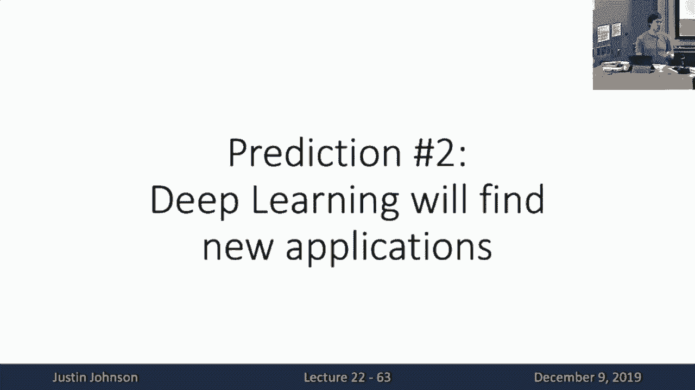

data sets that we work on within，computer vision，so i think we'll see a lot more deep。

learning for many different types of，scientific and medical applications。

moving uh more and more throughout time，so i i think that like medical imaging。

or different types of medical，applications i think it'll be more and。

more common for people to try to train，computer vision systems that try to。

diagnose or or aid in the diagnosis of，different types of diseases，by using deep learning models on。

different types of medical data，and i think in a lot of different，scientific disciplines people are。

like scientists in lots of different，disciplines are always generating more。

and more types of data that they need to，be able to analyze，and i think that deep learning will help。

build help scientists in different，domains，just analyze the data that they're。

already collecting and i think it will，lead to improvements across many，different areas in science。

now i think also that deep learning will，as these are all kind of obvious，applications i think that。

anything that uses images i think we，will see deep learning applications for，in the future。

but i think that sort of interesting and，surprising applications of deep learning。

will pop up as well，so as kind of an example of that there's，this really interesting。

paper um at sigmod 2018，about using deep learning to improve，traditional computer science data。

structures like a hash table，right so how can deep learning right a。

hash table should be an implementation，detail inside the deep learning system。

um now they're kind of flipping it，around and using deep learning to。

improve these basic data structures，like hash tables and here the idea is，like what is a hash table。

well if you kind of remember back to，your data your your um your uh。

your data structures course then a hash，table is going to input some。

key and then that key is going to go，through some kind of a hash function。

the hash function is going to assign the，key to one of these buckets。

and then when there's a hash collision，then you'll maybe have some kind of，linked list。

of all of the bits of data that had been，hashed to each different bucket。

and now to get a really good performing，hash table，you need a really good hash function。

that is going to minimize the collisions，of your of your data set and assign。

different data different data elements，to different buckets and usually these。

hash functions are kind of，hand designed functions but it turns out。

you can put a neural network in there，instead，and kind of now learn a neural network。

that learns to assign，your data elements to hash buckets，inside a hash table。

and the idea here is that then you could，actually use the hash table。

you could learn a good hash function for，your hash table，that is customized the type of data that。

you want to hash，because it's always to get good good，performing hash tables you need to。

reduce collisions，but exact but you know even if we're，always working with images maybe that。

whale data set is going to collide in，different ways from that galaxy data set。

and now you can maybe use a neural，network to learn a hash function。

that will minimize the hash collisions，for the particular data set or。

types of data on which you want to learn，things，so i thought this was a beautiful idea。

and this is just sort of a surprising，example of，place i think deep learning will find。

homes in more and more areas，across science broadly and also within，computer science。

and we'll just continue to see more and，more surprising applications。

where we can slot neural networks into，things and then lead to better versions，of those things。

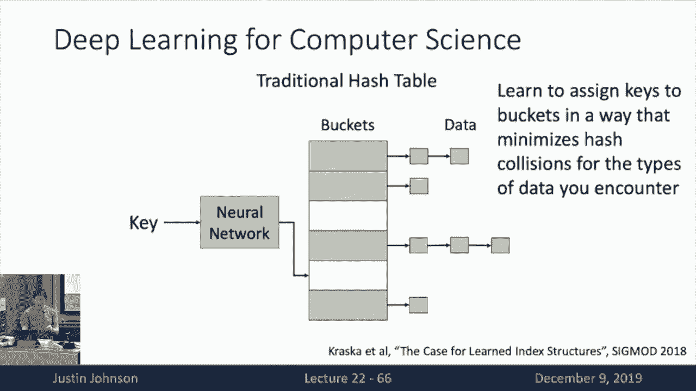

um kind of another example that i really，like in the last year or so。

is this idea of using deep learning for，symbolic mathematics，right this is um sort of surprising to。

me that this can work in some way，right the idea is um suppose you want to，do things like。

automated theorem proving or symbolic，integration right like the kinds of。

things that mathematica is usually used，for，um right then you can actually train。

neural networks to do these types of，tasks as well，and the idea is is you know we need to。

convert the data into some format that，can be processed with a neural network。

so it turns out that you know we can，write down sort of mathematical formulas。

as we can actually convert them in some，nice way from，a sequence of formulas from a sequence。

of symbols，actually into some kind of graph，structure that represents the structure。

the underlying structure kind of like a，parse tree，of that sequence of symbols and then we。

can actually run sort of graph，neural networks on these sequences of，symbols and that lets us。

process these mathematical expressions，using deep neural networks。

as well and there have been applications，and this is not just theoretical people。

have actually done this，and people have then for example used，deep learning to do theorem proving。

right so what is theorem proving um it's，like you start at some，some original set of mathematical。

statements that you take as assumptions，you want to arrive at some some。

mathematical statement at the end，and there's certain types and there's a。

very wide tree of possible different，mathematical transforms，you can imagine applying at every。

different step all right this is kind of，like this massive tree search problem。

where from every equation that you know，is true there's a large number of。

potential mathematical transforms that，you could imagine applying to those，equations。

well that actually looks like a，reinforcement learning problem where the。

state of the reinforcement learning，system，is all of the all of this mathematical。

statements that you currently know to be，true，the actions that we can take in this。

reinforcement learning system，are the potential uh the potential。

mathematical transforms that we can make，on the statements we know to be true and。

then we can use a deep reinforcement，learning system，that is trained to discover proofs to。

discover mathematical proofs，um that actually there's been papers，about this that can then。

use deep reinforcement learning to，improve upon，some some aspects of mathematical。

theorem proving or you can use this for，like symbolic integration。

where you like write down uh write down，a random equation and then actually want。

to generate another equation，that represents the integral of that。

input equation and people have been，training neural networks to do that kind，of thing as well。

so i think deep learning will continue，to find new and surprising applications。

to lots of different areas within within，science within computer science。

within mathematics and i think that deep，learning will just become a standard。

scientific or engineering tool，that gets slotted into all kinds of，different disciplines。

so then prediction sort of safe boring，prediction number three。

is that deep learning will continue to，use more and more data。

and more and more compute right so we've，seen this plot i think。

a little a couple times before in the，past in the semester，so here on the x-axis it's showing us uh。

time，from 2004 to 2017 and the y-axis，and each dot is a is a gpu that was a。

different computing device，and the y-axis shows us the cost of，computation。

in terms of how many gigaflops of，computation can you buy for a dollar。

and you can see that the cost of，computation has just been，decreasing at kind of actually an。

exponential rate um as gpus have gotten，better and better and better in the last，10 years。

and i think that this this increase this，exponential increase in the，affordability of gpu computing。

has really allowed us to scale up our，models and build ever bigger models on，ever bigger data sets。

and that's led to a lot of improvements，in in deep learning，but i think this trend will continue。

forward going forward in，the kind of obviously um and i'm not the，only one who thinks so。

there's this really cool plot from open，ai they have a nice blog post about this。

i think last year where they wanted to，track they tracked this trend of。

the the role of computing in ai systems，going all the way back to the perceptron，back in the 1950s。

and now the x-axis is showing a，different milestone，sort of high-profile uh projects in。

artificial intelligence，starting with the perceptron although，back in the 1950s going up。

something like alphago zero um that we，talked about in just the last lecture。

and now the y-axis is the is the amount，of computation that we use to train，these models。

and what's crazy is that this y-axis is，actually on a log scale。

already and you can see that this uh the，train，these state-of-the-art deep machine，learning systems。

has been growing super exponentially，since the 50s，and this is likely to contin this trend。

is likely to continue going forward，but you know how can this trend possibly，continue going forward。

um we've already like we are like you，already see large uh，large industrial players like google and。

facebook training machine learning，models，distributed across maybe thousands of。

gpus in order to train the biggest，machine learning models，so i think we will also in order to。

continue scaling deep learning models，i think we'll also we'll also see，innovations in hardware。

that will lead to new types of hardware，that are specialized to building。

large-scale deep learning models，so um it's kind of a bit of free。

advertising for this startup um there's，one really there's one one one example。

of this is this uh this company cerebrus，which makes wafer scale chips for deep，learning。

so they basically build like a gigantic，computer chip that's like absolutely，massive。

that is specialized for doing deep，learning so on the right so i mean this。

is obviously marketing material from the，startup so take it with a grain of salt。

but the idea is that kind of the largest，chip that we have from the biggest，baddest nvidia gpu。

is this relatively small chip over here，on the right and cerebrus's wafer scale，computing engine。

is this like massive piece of silicon，which is like orders of magnitude bigger。

than the largest gpu that nvidia is，currently making，and the idea here is you've just got。

like tons and tons of compute elements，tiled out over this like massive piece，of silicon。

with a lot of memory with a lot of，compute and this type of，novel hardware platform might be able to。

i mean it's，it's impossible to say but maybe some，kind of innovations in hardware。

maybe by cerebrus maybe by others um，would uh，can will help us i think push deep。

learning to the next level，and train ever ever bigger models um on，these ever bigger data sets。

so those are my three kind of um safe，predictions about，things i'm relatively certain are going。

to happen in the future，around deep learning models but i think。

there's also a lot of problems with the，way that we're doing ai right now。

the way that we're doing machine，learning and computer vision right now。

and some of these problems are things，that i don't know how to solve。

but i think that as a community we need，to find ways to solve them。

so one of the biggest problems i think，facing machine learning。

models right now is that they're biased，right that，um machine learning models are deployed。

in the world，and they treat people they treat，different types of people in different，ways。

and that's not fair that's not a good，thing that's just a thing that we need，to avoid。

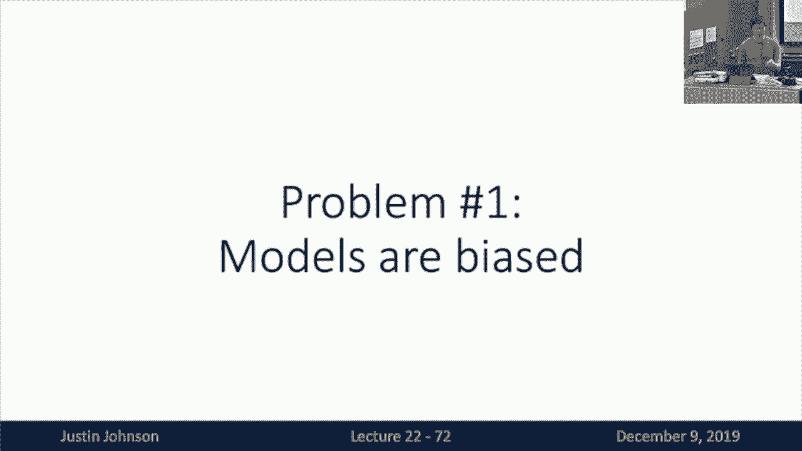

um and it's kind of a concrete example，of that，you remember we could do something like。

vector arithmetic with gender，adversarial networks，remember with gender adversarial。

networks we could do something like，taking the smiling woman vector subtract，the neutral man vector。

add the neutral man vector and then get，an image of a smiling man。

well this idea of sort of analogies or，vector arithmetic，with deep learning models actually。

didn't really didn't actually originate，with generative adversarial networks。

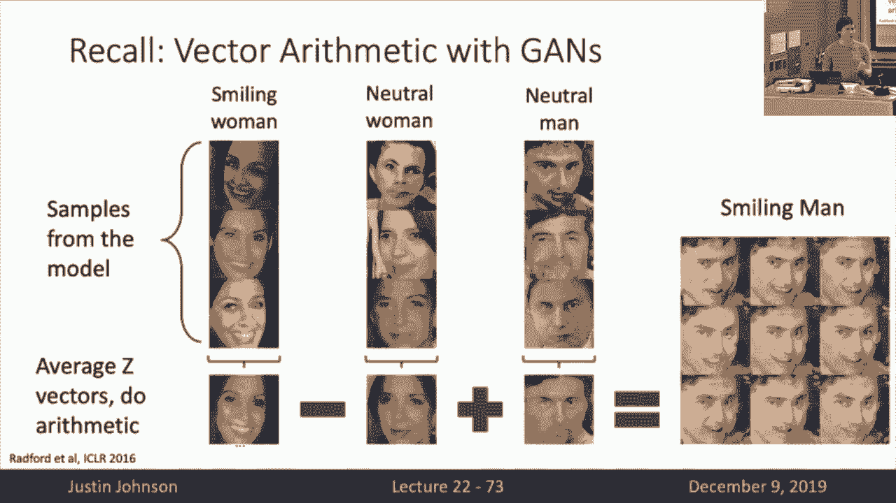

this idea actually originated with uh，with another type of，model called a word vector so here the。

idea is that，this is a this is a technique from，natural language processing where you。

input a large corpus of text data，and then somehow you process that corpus，of text data。

to uh give some vector representation，some vector，that represents every word in your。

corpus of your data and then it turns，out that you can use those。

learned uh word vectors from your text，corpus of text data to do these similar。

kinds of analogy problems，so for example you could solve the，analogy man is to king。

as woman is to what and the way that you，can solve that，problem or that query using a word。

vector approach is to take your your，learned vector for man，subtract to learn the vector for king。

add the learn vector for woman，and then do a nearest neighbor search。

among all the other word vectors in your，data set，um and it turns out that if you um，perform a lot。

perform a large scale analysis of a，different types of analogies with。

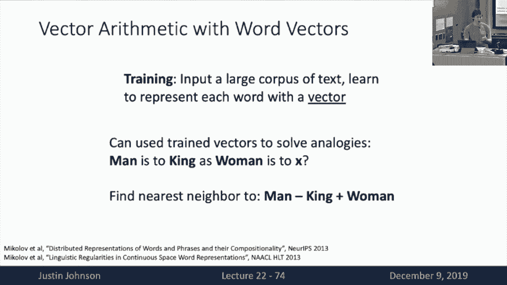

trained word vector with trained word，vector models，that have been trained on large corpus。

of text data they actually reveal some，pretty ugly gender biases。

that these machine learning models have，picked up on by just training on all the，data set。

on all the data out there in the web so，for example you can uh probe these。

machine learning models these are word，vector models，and you can ask like what types of，occupations。

are more situated in that learned word，vector space corresponding to men or，women。

and it gives these really really kind of，troubling stereotypical occupations for，men and women。

it says that extreme she occupations are，things like，home homemaker nurse receptionist，librarian。

and extreme masculine professions are，things like maestro，skipper prodigy philosopher captain。

architect，so you can or if you look at um solving，some of these analogies。

um with uh this idea of vector，arithmetic you can see that uh they，learn very gender stereotyped。

representations of the types of things，that men and women do，so they learn things like a registered。

nurse on the female side is equivalent，to physician on the male side。

or interior designer on the female side，is equivalent to architect on the male，side。

so somehow these machine learning models，have actually，become biased and and slurped up these。

very ugly biases，on the training data just based on the，data on which they're trained。

and this is a problem right this means，that if we're training。

neural network models on data out there，in the world they could slurp up。

biases in that data and then make，predictions that stereotype different，groups of people。

and this is not just a theoretical，problem this has actually been observed，in uh。

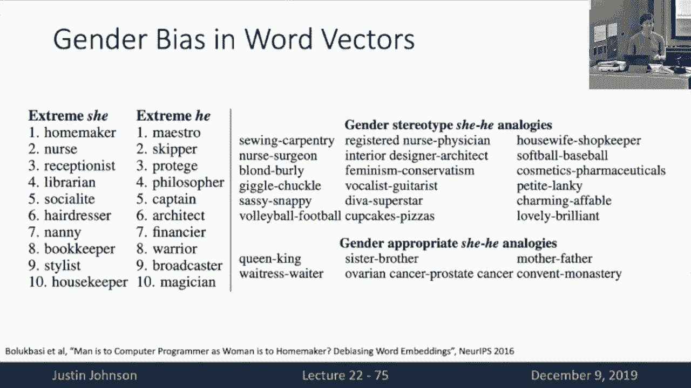

in in systems that have been deployed by，big tech companies，so as another example um we can look at。

economic bias，in visual classifiers so here there was，this uh this nice。

the this nice paper from just this year，in 2019 where they want were they they。

tried to make the argument that，deployed classifiers that have been。

deployed out in practice by major tech，companies，are actually biased towards high-income，western the。

high-income western households so for，an example they collected these data，sets of household items。

from different cultures across the world，and at different income levels across，the world。

so for this example this is an image of，soap that was collected from a household。

in the united kingdom within with a，monthly income of，about two thousand dollars a month and。

if you run this type of uh，image through a lot of commercial image。

classification uh pieces of software，you can see that it's not perfect it。

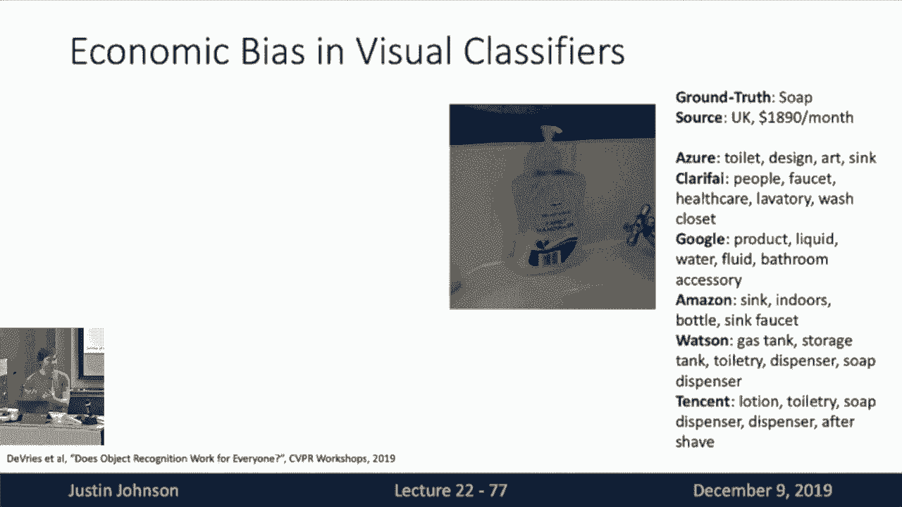

makes some errors but it produces like，kind of reasonable，predictions for this type of image but。

then what if you，take an image of soap from a different，type of household from a different type。

of person at a different part of a part，of the world，so here's an image of soap that was。

taken from a household in nepal that。

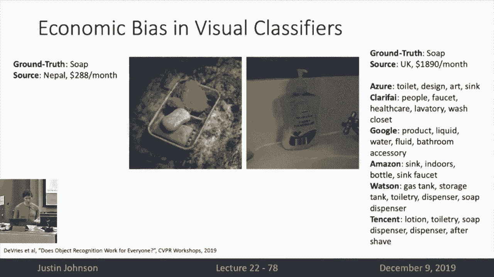

earns just about 300，a month and if you take this image of，soap and run it through the exact same。

deployed classifiers out there on the，web that have been deployed by major，tech companies。

you see that it just fails，catastrophically it thinks that this，this soap is food or cheese or bread。

um it like it just doesn't recognize，that this is soap，so somehow it seems that the types of。

data on which these systems have been，trained，has somehow biased their predictions。

towards the types of images，that are seen in wealthy western，households。

and that's a problem i think that we，should be building machine learning。

systems that are good for everyone，and as another really ugly example of，this。

there's actually been racial bias in，visual classifiers as well，so this was a really uh high profile。

image that circulated twitter back in，2015，where google's image classification，system。

categorized these african-americans as，gorillas，which was just shockingly racist and was。

a very bad thing and this is，not something that we want our machine，learning systems to do。

so i think that this is a really big，problem in，machine learning this is not a。

theoretical problem this is something，that is facing all machine learning。

systems all computer vision systems，today，then i think it's important that we。

build machine learning systems that take，all different viewpoints and all。

different types of people into account，and actually actually treat them fairly。

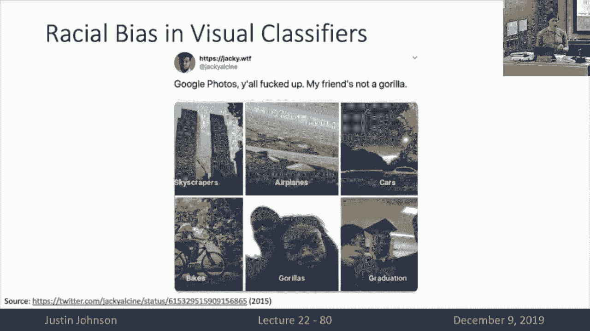

in in unbiased ways，so there's been some academic work，that's really pushing towards。

understanding these biases，um in machine learning models and，measuring it and improving it。

but i think that this is still a really，big open problem in computer vision。

and machine learning and machine，learning more broadly so i put a couple。

of citations here if you want to get，started in this research area。

but i think that this is a really big，important problem that's facing。

a lot of machine learning models，so then another sort of more uh maybe，more academic。

problem with deep learning is that i，think we might need new theory to。

actually understand what's going on，inside of our machine learning models。

and the the way that i see that is that，there's certain number of empirical。

mysteries that there's experiments that，we can run，that give us very strange results that。

are seemingly，counterintuitive and this makes me think，back to，like in the early 1900s right before。

quantum mechanics was discovered，people knew about classical mechanics。

but there were certain experiments that，you could run around like black body，radiation。

or other types of phenomenon that just，could not be explained with the。

classical physics at that time，and it could be the case that there。

might be some experimental results in，deep learning，that hint that we might need a better。

theoretical understanding of the systems，that we built，so one problem that kind of mystifies me。

is this i，this empirical observation of really，good sub networks within deep learning，models。

so here's something that you can do you，can start with a randomly。

initialized neural network model and，train it up and then step two train it。

on your favorite data set，and then what then what you can do is uh，this process of。

pruning the trained neural network so，you can remove，a large number of the learned weights in。

inside that trained neural network model，and it turns out that you can actually。

remove like a large fraction of the，weights of the trained model。

and still retreat and still retain the，same performance of the trained model。

so somehow these trained neural networks，even though they might have a lot of，weights。

it seems that they don't actually need，all of those weights to actually get，their good performance。

so i feel that feels like something，funny is going on，and you know the mystery deepens it。

turns out what we can do，is we can take that trained pruned model。

and then go back to the initialization，and then uh，take the the initialized values of the。

non-pruned weights，and then go back to the initialization，right so that's kind of like we took。

step one we had a random network we，trained it we pruned it，and then we applied the pruning of the。

trained network back to the original，initialization，of the original unoptimized weights from。

step one，and now we can train the pruned network，and it turns out that it works。

almost as good as training the full，dense network from step two，and this has been called the lottery。

ticket hypothesis，of the deep neural networks that it's，like each weight inside the neural，network。

is playing the initialization lottery，and then some weights inside the network。

have won the lottery and got good，good，sub networks to emerge within these。

initialized neural network models，and then the question is what the hell，is going on。

like this this feels like we're maybe，missing something fundamental。

in the way that neural networks learn on，data or the way in which neural networks。

are initialized or optimized，and the mystery deepens even further，there was this paper from。

actually just about to a week or two ago，on archive，where you can take a randomly。

initialized neural network model，and you can train and you prune the ra，the random model。

we don't change the weights the only，learning in this model，is removing connections from this。

randomly initialized neural network，model，through，some kind of gradient descent procedure，you can。

prune an untrained model to result in a，sub-network of the randomly initialized。

untrained neural network model，that actually achieves non-trivial。

classification performance on data sets，like cfar and imagenet，this is very mysterious and very。

shocking to me this means that，inside a random model there exists sub，networks that actually。

do a good job on image classification，and this actually happens at the scales。

of networks like a resnet50，that we are using in practice so it，feels to me like we're maybe missing。

something kind of fundamental here，in the way that neural networks learn or。

represent functions on their data，i don't know what the answer is but i。

think that this is one of those，empirical mysteries that maybe we should，pay attention to。

that hint that maybe we need to develop，some new theory，another empirical mystery in deep。

learning is this question of，generalization so there's been a lot of。

work on classical statistical learning，theory，going back over several decades and from。

classical statistical learning theory，we can expect this plot on the left that，um。

if we on the x-axis we plot the，complexity of our model，that's maybe like the size of our neural。

network or something like that and the，y-axis we plot the error rate on the。

training data and the test data，then we see sort of two regimes in uh in，our model。

on the left as we start with a very，small model we get high error on both。

the training and the test set，as we increase the size of the model，then both the error。

on the training set and the test set，should decrease as the bigger model is。

able to better fit the training data，but at some point when we make the model。

even bigger even bigger，then classical statistical learning，theory tells us。

that the the model should start to get，worse on the test set，as it continues to get better on the。

training set and this is overfitting，this is where a machine learning model。

would have over fit to the noise in the，training set，and then no longer generalizes to the。

test set and this is a，phenomenon that we have been familiar，with in the community for decades。

from statistical learning theory but，then here's，some funny facts about neural networks，one。

is that deep neural networks can，actually fit，random data on image classification data，sets。

so what this means is if you take，something like your your favorite，resnet50 classifier。

and you trade it on cfar but you train，it on a version of cfar，where all of the labels have been。

assigned randomly to all of the images，or where all the pixels of the images。

have been randomly shuffled，or where um where the the pixels are，just random gaussian noise。

then it turns out that the same resnet50，that gives us really strong performance。

when trained on the real data，can actually achieve perfect accuracy on，the training set。

on when trained on a training set of，these random data sets，so some classical results in statistical。

learning theory，um say that one way to measure the，complexity of a machine learning model。

is something called the rottermocker，complexity which is something like its。

ability the the ability of the model to，fit random data，so the classical statistical theory。

tells us that，if a model is able to fit random data，perfectly then，that model is likely too big to。

generalize and give useful predictions，on the test set，but a resnet50 model can be trained to。

achieve，perfect accuracy on random data but when，we train it on real data。

it generalizes great and gives us really，good and meaningful and useful，predictions on the test set。

and that's a mystery i think that means，that there's something we don't。

understand about the way that neural，network models in particular。

generalize to unseen data now another，mystery around generalization。

is this so-called uh double descent，phenomenon，so here's an empirical plot on the right。

corresponding to the theoretical plot on，the left，so on the right we're showing uh on the，x-axis。

is the the size of a fully connected，neural network that has been trained on，the cfr data set。

and the y-axis gives us this training，and test performance，of of this of these models of increasing。

size，and you can see that up to a point when，up to up to the model size of 40。

then the empirical results that we see，actually match these theoretical，predictions。

from classical statistical learning，theory but，as we make the model even bigger even。

bigger even bigger，then something qualitatively different，happens and it seems that we push beyond。

this regime of overfitting，into some other regime where now if the，model is just in the middle。

then it overfits but if you make the，model even bigger，then it no longer overfits and this is。

something extremely mysterious about，neural network models that i think is，not well understood。

and this phenomenon was actually um uh，scaled up，by a blog post from open ai just a week，or two ago。

where this this initial phenomenon was，reserved was uh observed by a paper by，belkin at all at。

pnas this this year and open ai observed，similar results on a wide variety of。

deep learning models so here's a plot，from this new open ai paper。

where they're training now no longer，fully connected networks but now。

like resnet18 the same type of residual，networks that we're using in practice。

and we see the same empirical mystery of，double descent in these。

practical uh large-scale convolutional，neural network models。

so that means that somehow we're there's，just something we don't understand about，the way that。

large neural network models generalize，to unseen data。

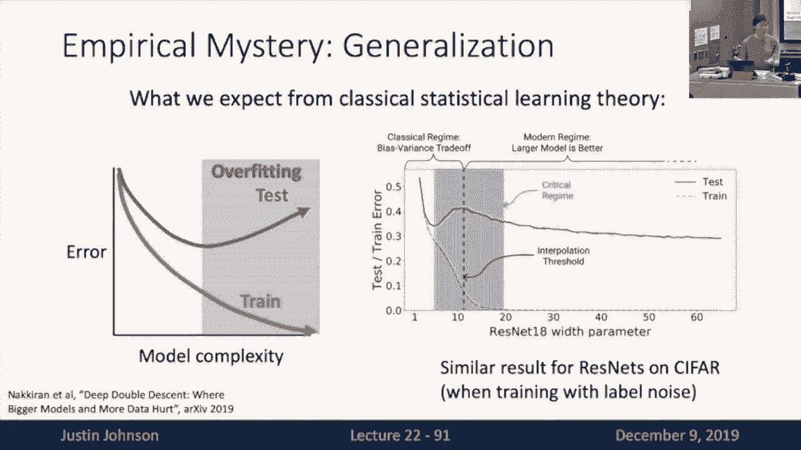

and i think that there's a possibility，that we might need some new statistical，learning theory。

to explain some of these empirical，observations，okay now another big problem in in deep。

learning is that we need a lot of，training data，and training data is expensive to。

collect so as a practical concern，we would all like to be able to build。

deep learning models that will that rely。

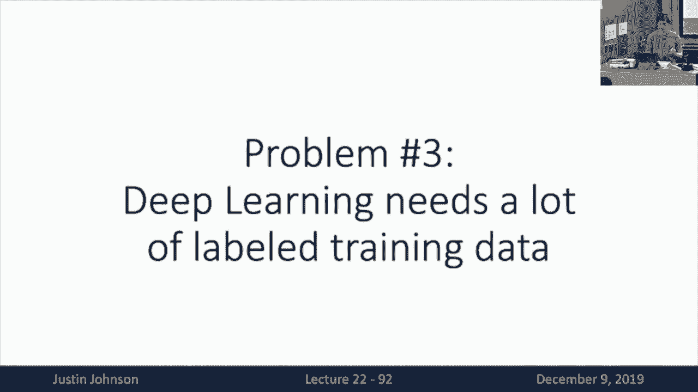

less on a large label data sets，so one way to that people have started。

to make progress on this problem，is by building new data sets that。

special that are specialized towards，this problem of low shot learning。

that is learning where you have very few，numbers of samples，per category that you want to learn so i。

think one of the initial high profile，data sets in this regime。

was the omni data set from brendon lake，at all that's kind of like。

a a low a low shot learning version of，mnist，so mnist of course was this super。

classical image classification data set，that's uh classifying uh binary digits，from zero to nine。

and it gives you six thousand training，and test example six thousand examples。

in the data set of each of these，categories，and now the omniglot data set said it，now scales it up。

and uh now gives us 1 623 categories，giving handwritten letters from，handwritten symbols。

from 50 different alphabets of natural，languages around the world。

and it provides just 20 examples of each，of those types of letters。

and somehow from this very few numbers，of examples um you need，the goal is to build machine learning。

models that can learn to recognize these，characters，even though they only get a very few。

number of samples of each type of，character during training，another example of a data set in this。

flavor is the kms data set，that provides a large data set of，japanese kanji characters。

that now gives something like almost 4，000 different categories，but provides a variable number of。

samples per category，and now this is then one way to make，progress on this task of learning with。

few data of，your data is actually providing，well-structured data sets。

and challenges around uh learning with，small data，so um these are kind of some of these uh。

these early class these uh sort of，now from a couple years ago these these，data sets on。

learning with low data and they're a，little bit like they're they're they're。

definitely interesting they're，definitely important，but the problem they're trying to solve。

is this uh handwritten character，recognition，it's not really as realistic as many of。

the types of problems that we've been，solving in computer vision。

this semester so then there's another，really。

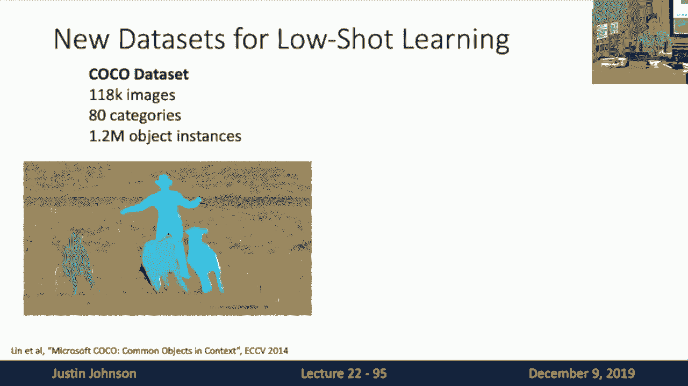

there's a new data set that just came，out this year that i'm really excited，about。

called elvis and elvis tries to push，this idea of low shot recognition。

um with learning from very few examples，per category into this uh，computer vision regime of very。

complicated images，so here um rather than doing image，classification。

elvis is a data set for instance，segmentation，and it annotates more than a thousand。

different category labels，for instance segmentation and uh this，data set is actually still being。

collected right now，so v 1。0 of the data set is not even out，but zv 0。5。

gives you about 57 000 images and about，almost 700 million labeled object。

instances from these thousand different，categories，on this uh on the uh for this instant。

segmentation problem，so i think that um the cocoa data set，that was uh back from 2014。

really drove a lot of progress on，instant segmentation and i'm hoping that，the elvis data set。

will similarly help to drive progress in，low shot recognition，or learning with small amounts of data。

for these complex real-world computer，vision types of tasks，so expect to see so i expect to see a。

lot more work on this type of data set，moving forward，so now another type of idea towards。

reducing our reliance，on label data is this idea of，self-supervised learning。

and self-supervised learning kind of，pushes towards this，holy grail challenge of unsupervised。

learning that we talked about，several lectures ago so here the idea is。

that we're going to have a two-stage，process，when building our neural network system，in stage one。

we're going to train the neural network，on some kind of pretext task。

that we don't actually care about but，that can be，defined and trained without any kind of。

human labeling of the data，and now on step two we'll take the the，network that we learned。

for this pretext task and fine-tune it，on whatever small amount of label data。

we can afford to collect，so we've seen this paradigm a little bit，already in the context of learning。

generative models as a pretext，task but it turns out there's been a lot。

of work on people defining other types。

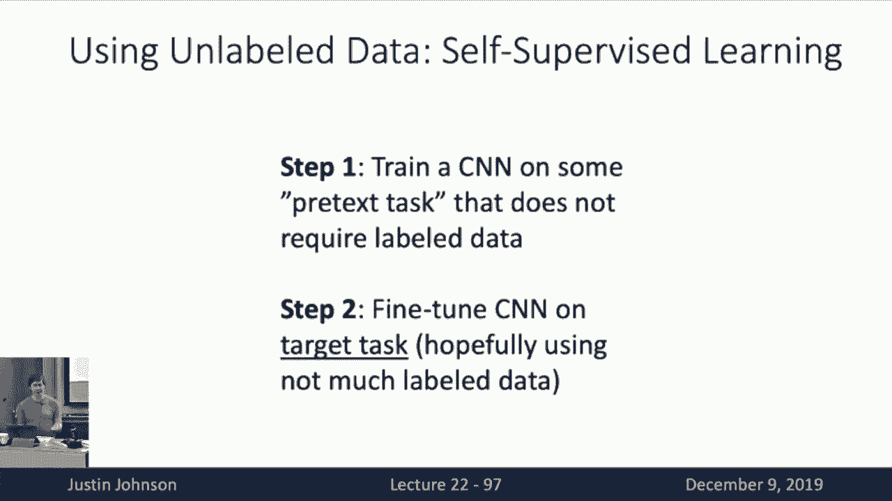

of pretext tasks，for self-supervised learning one example，is solving jigsaw puzzles。

so here's a concrete example what we can，do is take an image，cut it up into a nine by nine grid of。

patches，and then shuffle the patches and now，these shuffled patches will be fed to a。

neural network system，and the neural network system needs to，solve the jigsaw puzzle so it needs to。

classify what was the correct，permutation of those patches，that would unscramble the the puzzle。

pieces and now，in order to solve this task it's likely，that the network would have to learn。

something non-trivial，about the visual world right because for。

it to know that the tiger head should go，tail，and the leg should go at the bottom then。

it should be able to recognize that，what these body parts of the tiger are，and it should understand。

their kind of relative orientation so，the hope is that by so if a network，could solve this type of。

task of solving jigsaw puzzles then it，could be fine-tuned for a lot of other。

computer vision applications，and critically you can you can prepare，this data。

set of jigsaw puzzles without any human，annotation whatsoever。

it just requires you to download a bunch，of images from the data from the web。

and then kind of cut them up，automatically to make these jigsaw，puzzles，another idea in this vein is。

colorization right we sort of download a，lot of color images from the web。

convert them to black and white and then，ask the network to predict the color。

and again this is a supervised learning，problem because we're asking the network。

to predict one thing which is the color，from another thing which is the black。

and white but we can generate these，labels，without having people annotate the data。

and again hopefully if the network can，solve this colorization problem。

then it should have learned something，about the world like it should be able。

to in order to colorize this photo，it must kind of know that this is a。

butterfly and understand what types of，colors butterflies tend to be。

and so a network that can solve this，problem is hopefully uh visually，intelligent to some degree。

another idea is in painting so we can，take take an image，remove some portion of the image and。

then ask the network to predict back the，removed portion of the image。

and this actually is maybe an example of，a generative model right this is sort of。

a conditional generative modeling，problem，where you want to predict a part of the。

image conditioned on，another part of the image and again you，can just sort of train this type of。

model，using the different approaches for，generative modeling that we talked about。

and then at the end of the day kind of，throw away the generative model。

and just fine-tune the underlying，convolutional network for whatever，downstream task you care about。

so there's been i think a lot of really，recent interest in uh different。

mechanisms for self-supervised learning，so i i put a couple of these uh current。

state-of-the-art methods for，self-sufficient learning up here。

in case you want to dig more into these，references and one of these these。

pretext and variant representations，actually was published just went up on。

archive just on december 4th like five，days ago，so i actually haven't read that paper in。

detail yet but uh i i think that that，that gives you a sense that this is like。

really active area of research，is discovering better ways to train。

networks in a self-supervised uh manner，okay then i want to leave you with um，maybe one big。

i think the underlying problem in deep，learning models，that i don't know how to solve and i。

don't know if anyone knows how to solve，is that deep learning models just don't。

learn to understand the world，in the same way that humans do that they。

kind of learn to mimic the data on which，they're trained，but they just don't seem to get the。

world in the way that we do，and one way that we can see this is um。

kind of through large-scale language，models，and they just lack common sense so here。

we talked about this，language modeling problem right where，you can download a lot of。

text from the internet and then train a，neural network model to predict the next，word。

conditioned on the previous words so，then you can kind of use a neural，network model to。

then you can um condition one of these，language models on some，input piece of text and then ask the。

language model to just complete the rest，of the sentence for you。

and then see what it thinks is a likely，completion of this text that you've，given it。

so i was playing around with this over，the weekend and now there's this really。

cool website called talk to，transformers。com，where you can just uh have this nice web。

interface where you can type in your own，queries and then，sample sentence completions from this。

very large language model that was built，by openai，so here's an example if you i typed in i。

was born in 1950，actually i wasn't in the and in this，year and in the year 2025 my age will be。

so that's the query that i provide to，the system and then the neural network，writes the rest。

it says 35 that was only a few years ago，most things in life just continue to，improve。

so it's like here's another example i，see a black dog and a brown horse。

the bigger animal's color is well what，brown right because we know that horses。

brown right because we know that horses，are bigger than dogs for the most part。

but this guy says the bigger animal's，color is black and the smaller is brown。

and actually if you kind of uh it's a，stochastic process if you kind of sample。

many different completions it just like，kind of gives you answers randomly i。

sampled another one where it said that，the the biggest one was pink。

so it seems like or here's another，example，one of my parents is a doctor and the。

other is a professor，obviously a doctor right because we know。

obviously a doctor right because we know，that people have two parents and we know。

that professions are kind of a mutually，exclusive thing，and this says my mother is a social。

worker they're super smart people，so it seems that these neural network，models just don't。

understand the world around us that even，when you train them on all of the text。

around us in the in the world，even when you download gigabytes or。

terabytes of textual data from the web，and even when you train on thousands of。

gpus for weeks at a time，you can get state-of-the-art numbers but，the neural network models are just。

somehow missing something，in the way that they understand the，world and i think that there's just。

something fundamental here，that this idea of training ever bigger。

models on ever bigger the ever bigger，data sets，it works for practical problems but i am。

a little bit skeptical sometimes about，whether this will actually get us all，the way to ai。

um there's one school of thought that，says maybe we just need to make things，even bigger。

another 10 times bigger another 100，times bigger another thousand times，bigger and。

maybe if we keep going then they'll kind，of pick up common sense for themselves。

maybe that's true i don't know or maybe，we need to sort of，maybe there's some paradigm shift that。

we need to make in the way that we're，building our machine learning models。

maybe there's some drastically different，approach to learning that we need to be。

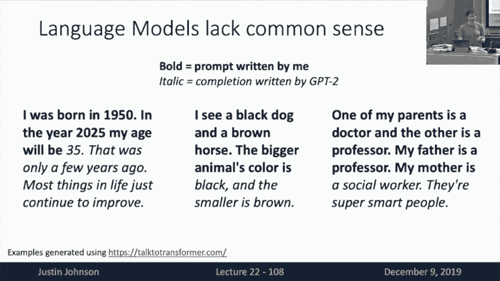

building instead，and i don't know so then kind of another，example more in computer vision。

um there's this really on the nose paper，called the elephant in the room。

because i think this is a problem that，everyone knows about who works with deep，learning models。

but we don't usually talk about it or，give it enough credit and that's this。

idea that just machine learning models，are brittle，they don't understand the world and they。

don't work when you train them on things，that were when you test them on things。

on which they were not trained，so as an example here's an image of some，people in a room。

and we ran a map a pretty good objective，texture on this image。

and it works great it tells that there's。

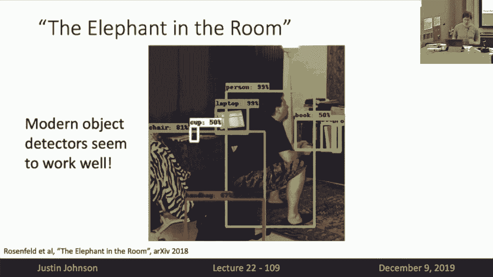

a person there's a laptop there's a cup，there's a chair there's a handbag，there's books。

it recognizes all the reasonable object，categories but now what we do。

is we just like photoshop in like do a，really bad photoshop job and just put in，this elephant，no。

trouble i mean maybe the contrast on the，screen is kind of bad so maybe you do，have some trouble。

but if the lights were maybe dimmed，properly in the room then you should。

have no trouble recognizing that there's，like hey there's a big elephant in the，back of this room。

and i think if the elephant appeared in，the back of the classroom like we would。

all notice it without any problem，um but and sometimes these object。

detectors will recognize novel objects，just fine sometimes it'll just miss it，completely。

so if you just move the elephant to a，slightly different position in the scene。

sometimes it's just like not detected at，all by the detector。

and that's just because this network has，never seen。

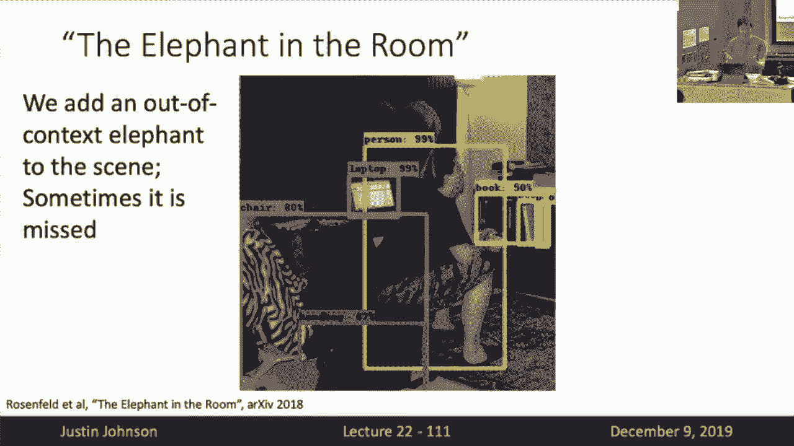

images with elephants in living rooms，and it's just not able to generalize in，that way。

or it gets even worse sometimes if you，put the elephant in a different place。

then it gets recognized as a chair and，also in recognizing the element at the，elephant as a chair。

it also messes up some of the other，predictions about that the model is。

making about the other objects in the，room，so now um you can see that it's flipped。

the chair to a couch，and it's no longer detecting the cup，so this is a big problem this means that。

convolutional neural networks and really，all of the vision systems that we know。

how to build with deep learning，are really seeing the world in a。

qualitative qualitatively different way，than humans are seeing the world。

and they just can fail catastrophically，when we apply them on。

data that is even slightly different in，some way on the data on which they're，trained。

and i don't know how to fix this but i，think this is a major problem that needs。

to be solved if we're going to，a build machine learning systems that。

are making intelligent decisions out in，the world for us，and this is just something fundamental。

that i think is maybe baked into some of，our current approaches。

so i don't know the solutions here but i，think that these are some of the biggest。

most pressing issues，some of the big picture issues in，computer vision and。

machine learning more broadly right now，so that's kind of my summary that we。

have to see these sort of boring safe，predictions，we'll see new models we'll see new。

applications we'll see bigger compute，but we also have some of these more。

fundamental problems that are facing the，field，that i don't have answers to and we。

people recognize that their problems but，i think there's a lot of room for people。

to come up with creative new solutions，that could radically have massive impact。

on this growing field of deep learning，so i think the summary is that i think。

now is a really great time to be getting，into this field，and a really great time for you to be。

learning about this field um so，hopefully with some of the the stuff。

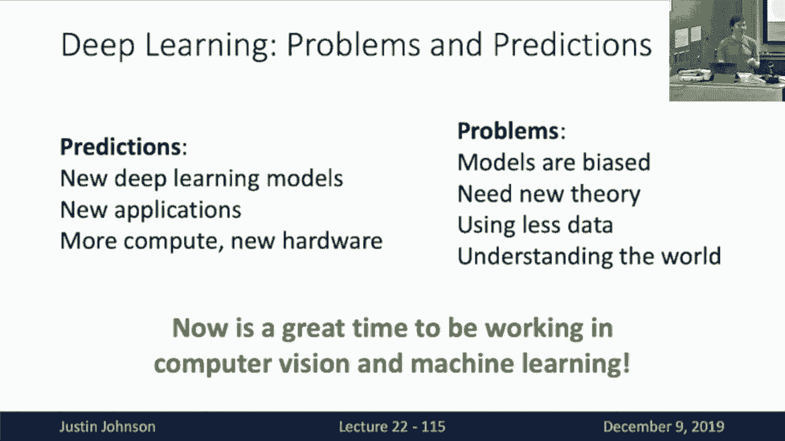

that you've learned in this class，maybe some of you will go out and solve。

some of these big challenges that are，facing the field so with that i'd like，to。

have a big round of applause for our，gsis who uh really made the，class actually work i don't know if。

they're actually here though but i，really wanted to give a shout out to，them and then。

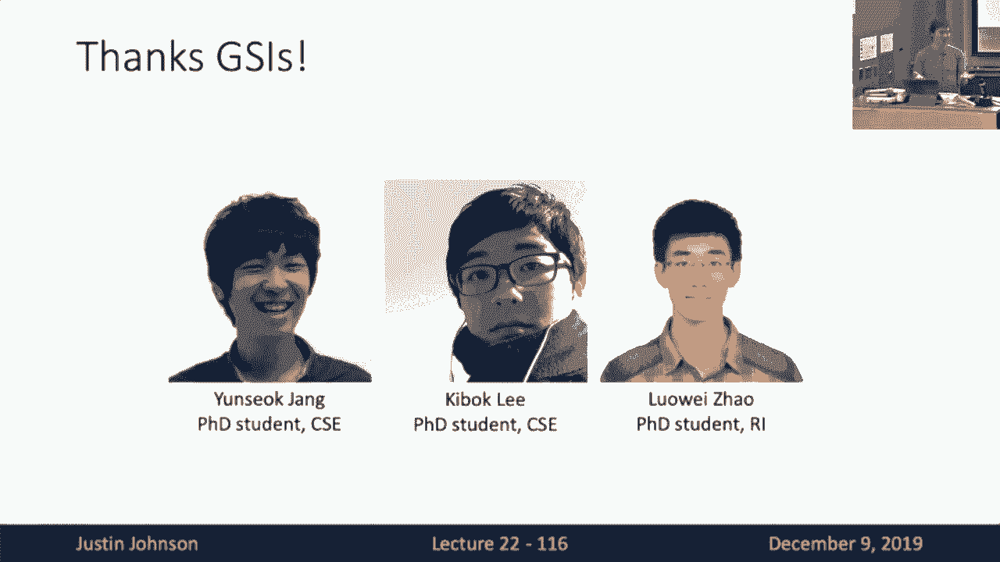

thank them for uh making the class，actually work um，and i wanted to thank you guys for uh。

putting up with the first class that，i've taught here at the university of，michigan。

