# P3：L3- 线性分类器 - ShowMeAI - BV13P4y1t7gM

so welcome back to welcome back to，so welcome back to welcome back to。

lecture three today we're going to talk。

about linear classifiers so a quick，recap let in the last lecture we talked。

about this image classification problem，and you'll recall that this was a。

foundational problem in computer vision，where we had to take this input image。

and then our network or system had to，predict a category label from one of a。

fixed set of categories for the input。

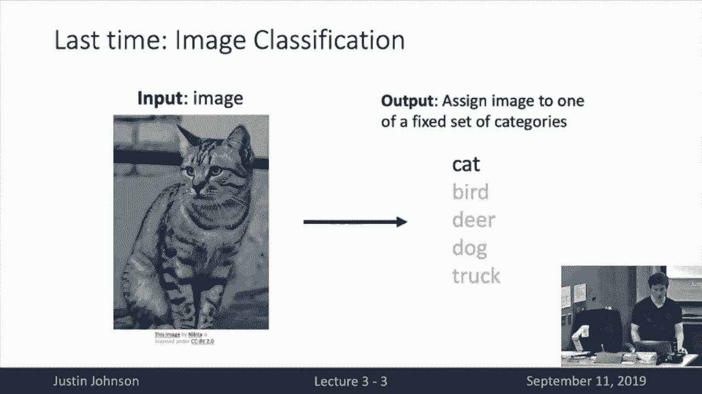

image and remember last time we talked，about various challenges of this image。

recognition or image classification，problem that we somehow need to build。

classifiers that can be robust all these，different sorts of variation that can。

appear in our input data things like，viewpoint to look with viewpoint changes。

illumination changes defamation etc that，somehow the challenge in building high。

performance recognition systems is，building systems that are robust all。

these different changes in the visual，input that they need to process so you。

would remember also last time we talked，about the data-driven approach to。

overcoming some of these challenges that，rather than trying to write down an。

explicit function that deals with all of，those hairy bits of visual recognition。

instead our approach is to collect a big，data set that hopefully covers all of。

the types of visual things that we want，to recognize and then to use some kind。

of learning algorithm to learn from the，data how to recognize various text。

images and it's a concrete example of，this pipeline in the last lecture we。

talked about the K nearest neighbor，classifier that was fairly simple that。

memorized the training data and then，output the label at test time that of。

the image most similar to in the，training set to the test data and we saw。

how this led to ideas of hyper，parameters and cross-validation and this。

was and we let and we went through this，entire pipeline of an image。

classification system in the last，lecture but remember when we left off we。

said that the K nearest neighbor，algorithm was actually not very useful。

in practice for a couple reasons，one was that it inverted this idea of。

what is slow and fast that it was very，fast at training but very slow to。

evaluate and the other problem was that，it wasn't very perceptually meaningful。

that sort of l2 Euclidean or l1，distances on raw pixel values was not a。

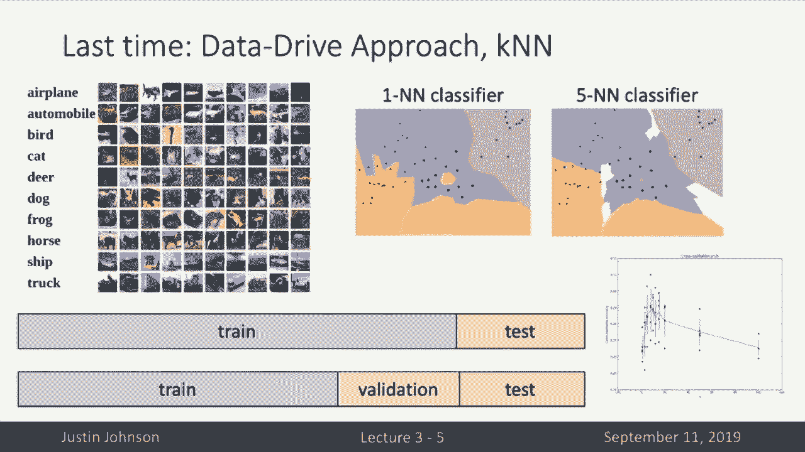

very perceptually meaningful thing to，measure so today we're going to talk。

about a different sort I mean a，different sort of classify classifier，the case。

his neighbors classified that we talked，about before so today we're going to。

talk about various types of linear，classifiers that we can use to solve。

this image classification problem so，linear classifiers might sound kind of。

simple but they're actually very，important when you're studying neural。

networks because sometimes when you，build new neural networks it's kind of。

like you want to stack all together your，layers as a set of Lego blocks and one。

of the most basic blocks that you're，going to have in your toolbox when you。

build these large complicated big neural，networks is a linear classifier so sort。

of speaking hoarsely once we move beyond，linear classifiers and move to these big。

complicated neural models then we'll see，that meant that the individual。

components of those neural network，models will look very similar to these。

linear classifiers that we'll talk about，today and indeed much of the intuition。

and technical technical bits that we'll，cover today will carry over completely。

as we start to move to neural network，systems in the next couple of lectures。

so as a quick recap remember with that，we've been working with this C part n。

dataset and that the C part then C part，n dataset is one of these standard。

benchmark data sets for image，classification that contains 50，000，training images and 10。

000 test images，where each of these images is little，little little tiny so it's 32 pixels by。

32 pixels and within each pixel we have，three scale your scalar values for the。

red blue and green color channels of the，pixels so in so the idea of a linear。

classifier is part of a much broader set，of approaches toward building machine。

learning models so that's the idea of a，parametric approach so the idea of a。

parametric approach is that we're going，to take our input image much as we've。

seen in the previous lecture but now，there's a new component in our system。

and that's these learn about stubble you，down in red at the bottom of the slide。

so then we're going so we're then going，to write this this function f which is。

going to somehow inputs the image the，the pixels of the image acts as well as。

well as these learn ablates w and the，functional form will somehow end up。

spinning out ten numbers giving some，classification scores for each of the。

categories that we want the system to be，able to recognize so this is a fairly。

general framework and a fairly general，set up and this this idea of a。

parametric classifier will carry over，completely to the neural network systems。

that we'll talk about but，we're going to talk about the possibly，the simplest the simplest possible。

instantiation of this parametric，classifier pipeline and that's the。

linear classifier where it has the，simplest possible functional form where。

this F of image acts and weights W is，just going to be a matrix vector。

multiply between the learn about weights，W and the pixels of the image X so to。

put to make this a little bit more，concrete and remember that the input。

image for something like C part n has is，a 32 by 32 by 3 which means that if we。

count the total number of scalar values，that are inside that each of those。

images we had kind of multiply it out，you end up with third with 3072。

individual scalar numbers that make up，the the pixels of that input image so。

now so then we will have a weight matrix，so then we'll take the the pixels of the。

image and stretch them out into a long，vector so this will completely destroy。

all of the spatial structure in the，image and we'll just reorganize all of。

the data in the input image into a long，vector that has 3072 elements and of。

course we'll need to do we'll need to do，this vector vector application of our。

image in a consistent way that every，time we take an image we always need to。

convert it into a vector in the，consistent same way every time and once。

we have chosen some way to to flatten，our image data into a vector then our。

noble weight matrix will be a two，dimensional matrix of shape 10 by 3072。

where 10 remember is the number of，categories that we that we want to。

recognize and 3072 is the number of，pixels in the image and this and when。

you perform this this matrix vector，multiplication the output will be again。

a vector of size 10 where 10 giving one，score for each of the ten categories we。

want our classifier to recognize so，sometimes you'll also see linear。

classifiers with a bias term that will，be a matrix vector multiply plus an。

additional bias term B where B is this，vector with ten elements giving offsets。

for one of each of the ten categories，that we wish to learn so this is a，fairly so this is a fairly。

straightforward way to think about，linear classifiers but over the next，this。

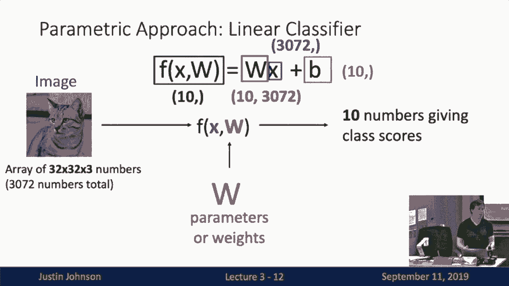

means in the context of image，classification so first as a concrete。

example suppose that we just want to，make this super concrete suppose that。

our input image is a 2 by 2 grayscale，image so then it has only 4 pixel values。

that give the full state of the image，then we want to stretch the pixels out。

into a vector form into a column vector。

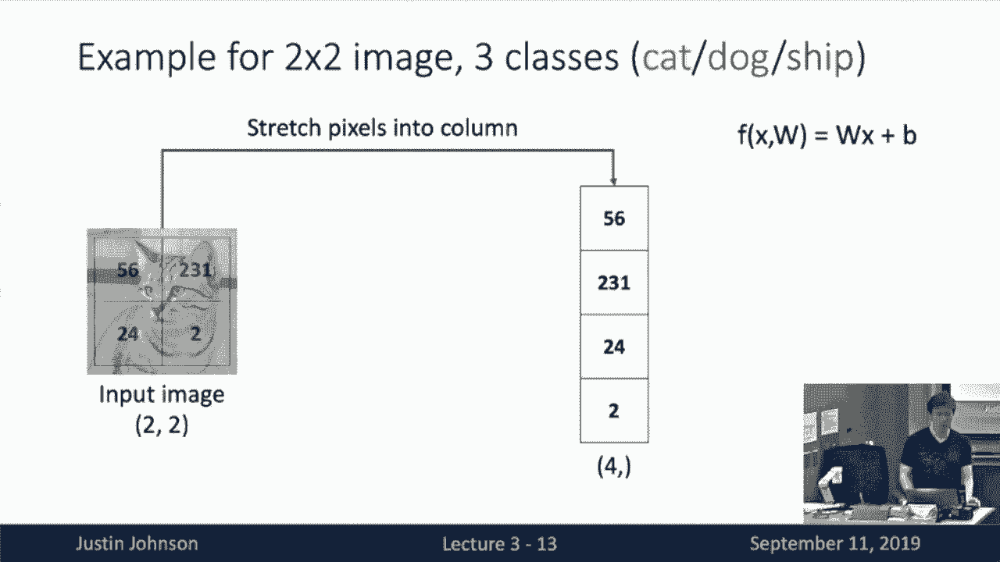

with four entries so here I've just，written out the exact values of each of。

the pixels in this in this image and，then our weight matrix is and then in。

this in this simple example will，consider classifying only three。

categories rather than ten may be cats，dog and ship shown in the three with。

these three corresponding colors now in，this simple example the weight matrix W。

will have shape 3 by 4 where 3 is the，number of categories we want to。

recognize and 4 is the total number of，pixels in our input image and then our。

bias will again of shape 3 because this，is the number of categories that we want。

to recognize so then we'll perform this，vector vector matrix multiplication and。

we'll output the specter of scores，getting one score for each category we。

want to recognize so when you look at，the problem in this way you can start to。

recognize a little bit of structure in，how we're breaking up this image。

classification problem so if you，remember the way that matrix vector。

multiplication works you know you take，the vector and you kind of multiple take。

inner products along each row the matrix，you recognize you realize that each row。

of this matrix corresponds to one of the，categories that our classifier wants to。

recognize so I think it's useful to，think about linear classifiers and a。

coupled a couple of different equivalent，ways and when you think and by using。

different viewpoints to think about，linear classifiers it can make certain。

properties of them very very obvious and，or not obvious so having different ways。

to think about a linear classifier can，help you understand it more intuitively。

so the first idea that the first way I，like to think of linear classifiers is。

what I call the algebraic viewpoint，which is exactly this this idea of a。

linear classifier as a matrix vector，multiply plus a vector offset and if you。

think about the algebraic viewpoint of a，linear classifier you reckon you there's。

a couple features or facts about linear，classifiers that immediately become。

obvious one is that we can equivalently，we can do what sometimes is referred to。

as the bias trick that eliminates the，bias as a separate learn will parameter。

and instead incorporates the bias，directly into the weight matrix W the。

way that we do this is that we，can augment our input image with an the。

the vector representation of our input，image with an additional constant one at。

the end of the vector and then augment，our weight matrix with an additional。

column corresponding to that that will，now perform the exact same computation。

as the W X plus B formulation that we，saw before so that's kind of a nice。

feature and this biased trick is quite，common is pretty common to use when your。

input data has a native vector form so，it's nice to be aware of as you think。

about building different types of，machine learning systems but in fact in。

computer vision this bias trick is less，common to use in practice because it。

doesn't carry over so nicely as we move，from linear classifiers to convolutions。

later on and furthermore it's nice，sometimes to separate the weight and the。

bias into separate parameters so we can，treat them differently and how they're。

initialized or regularize or other，things like that but nevertheless this。

bias trick is a fairly nice thing to be，aware of for linear classifiers and it's。

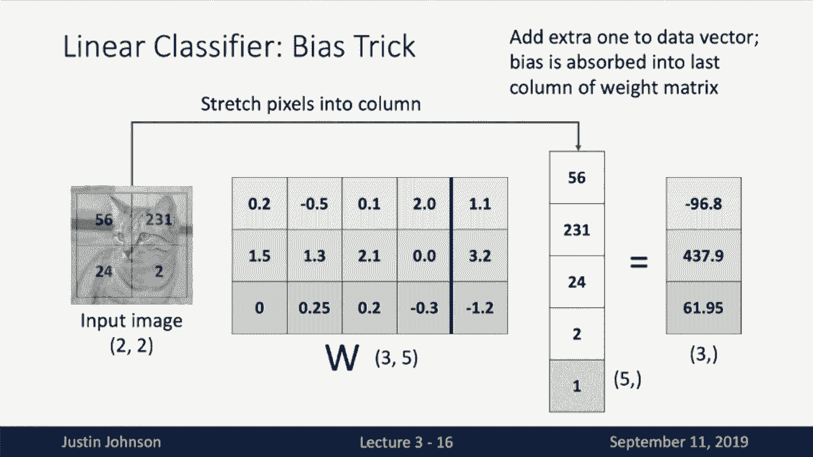

totally obvious when you think about it，when you think about linear classifiers。

through this lens of the algebraic，viewpoint another another thing that's。

very obvious when you think about linear，classifiers in this algebraic way is。

that the predictions are linear so what，this means is that isn't it so in is a。

simple example if we ignore the bias and，we imagine scaling our whole input image。

by some constant C then we could just，pull that constant out of the linear。

classifier and that means that the，predictions of the model will also be。

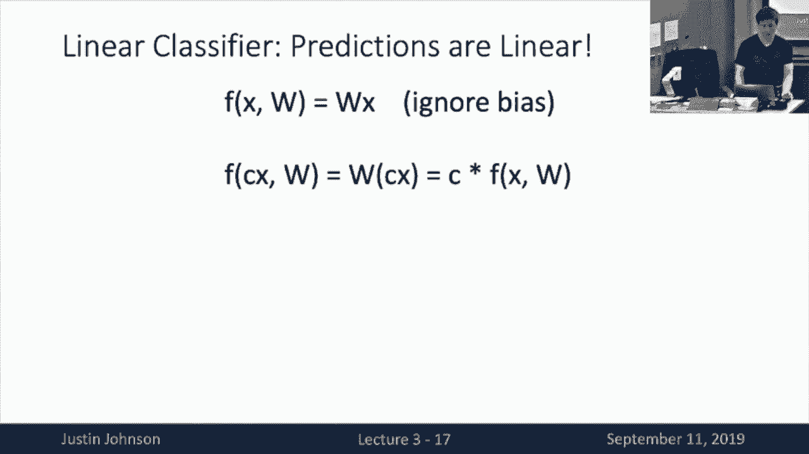

scaled by that by that scalar value C so，if you think about images that means。

that if we have some input in it some，original image on the left with some set。

with some predicted cat classifier，scores from a linear classifier then if。

we were to modify the image by sort of，desaturating it by multiplying all the。

pixels by some constant one half then，that then all of the predicted category。

scores from the classifier would all be，cut in half as well so this is maybe a。

bug maybe a feature but it feels kind of，weird for linear classifiers to behave。

in this way on image data because you，might think that just by scaling down。

all the pixels by a constant value we as，humans have can still recognize this as。

a cat just as easily but somehow it's a，bit unintuitive that just scaling down，all the pixels。

change the predictive scores from the，classifier so that's a look that's a。

kind of a weird feature of linear，classifiers that may or may not be。

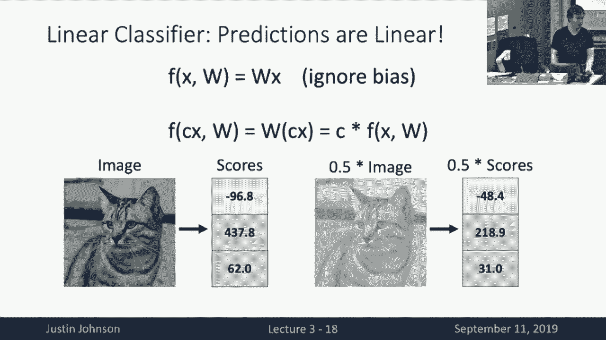

important depending on exactly what loss，function used to Train B's so we'll talk。

about that a bit later so that's the，algebraic viewpoint that I like to think。

about for linear classifiers but there's，a very there's a we can reformulate this。

computation in an equivalent but，slightly different way that will give us。

a slightly different way to think about，exactly what image linear classifiers。

are doing in the context of image data，so remember from the up this this。

algebraic viewpoint of a matrix vector，multiply we saw that the classification。

score that's predicted for each category，is the result of an inner product。

between the vector representation of the，image and one of the rows or the matrix。

right well in this algebraic viewpoint，recall that we had taken the pics the。

pixel values of our input image and，stretch them out into a column vector。

and then when we took this inner product，we ended up with an inner product of。

these these rows in the matrix and the，and the column of the stretched out。

version of the image well rather than，stretching out the image into a column。

vector we can instead think about Rieff，reshaping the rows of that matrix into。

the same shape as the input image then，we get a system that looks something。

like this on the right so here we've，taken each of the rows of the matrix and。

reshaped them to have this same，two-by-two shape as the image that we're。

trying to classify and now then we've，broken up these rows of the matrix into。

these four different sort of columns in，the diagram here and now the weight and。

now the bias vector has then been broken，up into these three separate elements。

that we split that we split along the，columns so then when we think about。

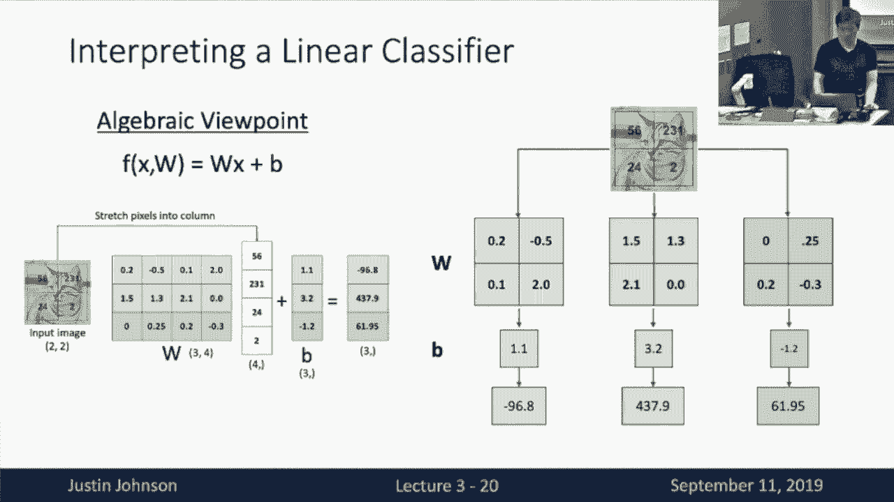

linear classifiers in this way it lets，us interpret that interpret their their。

behavior in a slightly different and，slightly perhaps more intuitive more。

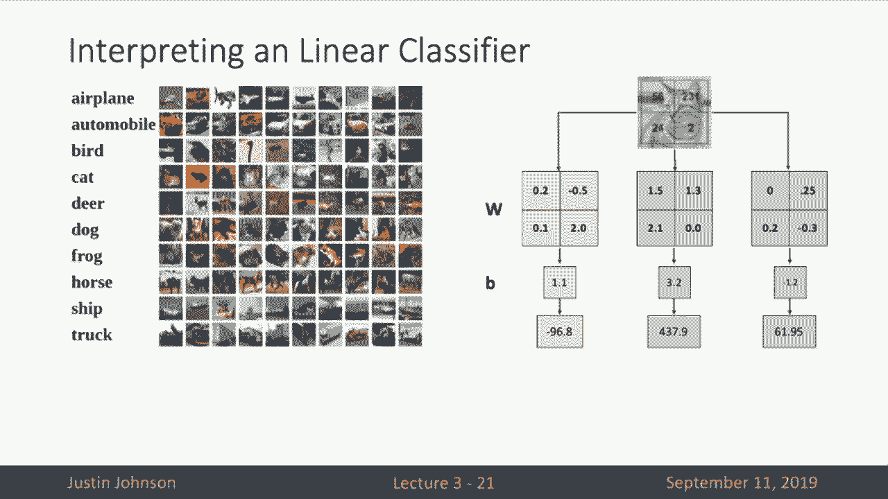

intuitive way so that's the what I like，to call the visual viewpoint of linear。

classifiers because if you think because，now that we've taken each of these rows。

of the weight matrix and stretch them，out to have the same shape as the image。

what we can then do is try to visualize，each of the rows of that matrix as an。

image itself and this interpretation of，a linear classifier looks kind of like。

template matching right because now the，classifier is learning one。

image template per category that we want，to recognize and each of these templates。

is then and then to produce the category，score for the template we simply match。

up the template for the class with the，pixels of the image by computing it and。

inner product between them and you might，remember that if you have two vectors。

that are maybe of unit norm then they，and you take the inner product of two。

vectors then they achieve their maximum，when they're all lined up which sort of。

fits with this idea of template matching，and now it's really interesting if you。

then you buy by visualizing these，tuppy's learned templates from the。

classifier as images themselves you get，a bit more intuition about exactly what。

this linear classifier is looking for in，images when it tries to recognize the。

different categories so for example on，the bottom left you can see that this。

plane category it's maybe looking for，some kind of a blob in the middle and。

it's generally looking for blue images，so any images that have a lot of blue in。

them are going to be very highly，received very high scores for the。

plate-glass using these particular，weight matrix for a linear classifier。

similarly the the the dear class is kind，of this green blobby background with。

kind of a brown blob in the middle but，it's maybe the deer so that's again。

gives us some more intuition about what，the linear classifier is looking at and。

one thing that's kind of interesting，from this viewpoint is that it's it。

becomes clear that even though we told，the classifier that we wanted to。

recognize object categories like planes，and dogs and deer in fact it's using a。

lot more evidence from the input image，than just the object itself and it's in。

fact relying very strongly on the，context cues from image so right if you。

so for example if you imagined putting，in an image that had a deep that had。

maybe a car in a forest that would be，kind of confusing for a linear。

classifier because the forest background，might be very green and then would。

achieve very high scores according to，the deer classifier where the car in the。

middle might match up more to the car，template so it in some kind of image。

with objects in unusual contexts it，would be very likely that if that a。

linear classifier would completely fail，to properly recognize those objects and。

that becomes very obvious when you think，about the visual viewpoint of these，linear classifiers。

so another sort of another，Henschel failure mode of linear，classifiers that becomes clear when you。

think about this visual view viewpoint，is that of mode splitting so our linear。

classifier is only able to learn one，template per category but there's a。

problem what happens if we have，categories that might appear in。

different types of ways so as a concrete，example think about horses so if you go。

and look at the CFR 10 dataset which，maybe you might have done if you started。

working on the first homework assignment，then you'll see that horses on C part n。

are sometimes looking to the left and，they're sometimes looking to the right。

and they're sometimes looking dead on，now if we have horses that are looking。

in different directions then the visual，appearance of the images of horses。

looking in different directions will be，very different but unfortunately the。

linear classifier has no way to，disentangle its representation and no。

way to separately learn templates for，horses that are looking in different。

directions so in fact if you look at，this example of a if you look at this。

learned template of a horse from this，one particular linear classifier you can。

kind of see that it actually has two，heads so if you look at the horse here。

he has kind of a brown blob in the，middle and green on the bottom which you。

might expect but now there's a black，blob of black blob on the left and a。

black blob on the right which might，court so then this is the linear。

classifier trying to do the best that it，can to match horses looking in different。

directions using only a single template，that it has the ability to learn so this。

is also somewhat visible in the car，example you can see that the car。

template doesn't actually look anything，like a car it just kind of looks like a。

red blob and a windshield and again if，the car template might have this funny。

shape because it's trying to use a，single template to cover all possible。

appearances of cars that you might see，in the data set this also gives us a。

sense that maybe see if our tent has a，lot of red cars because the car template。

that's learned is red and maybe if we，try to recognize green cars or blue cars。

then the classifier might fail and all，of these type of failure modes become。

very obvious when you think about the，linear classifier from this from this。

visual viewpoint so another a third way。

that we can think about linear，classifiers is what I like to call the。

geometric viewpoint so here we can，imagine drawing a plot where on the x，axis so here we pick。

we pick out a single pixel in the image，and now we draw a plot where the x-axis。

is the value of the pixel and the y-axis，is the value of the classifier as that。

pixel changes maybe as we keep all the，other pixels in the image fixed and now。

because this linear classifier is a，linear function then clearly the。

classifier score must vary linearly as，we change any of the individual values。

in the any of the individual pixel，values in the image so this is not very。

interesting when you think about this，this this example with only a single。

pixel so we can instead try to broaden，this viewpoint and incorporate multiple。

pixel simultaneously so then we can，imagine drawing a plot where the x-axis。

is maybe one pixel in the image and the，y-axis is a second pixel image and then。

now because I can't really draw three，dimensional plots on PowerPoint you have。

to live with some kind of a contour plot，so here then we could draw a line where。

the car score is equal to one half and，you can see that this this level set of。

the car score forms a line in this in，this pixel space and that and then the。

court because this is linear the car，school the cop there is a direction in。

this pixel space along which the car，score will increase linearly which is。

orthogonal to this line and kind of，tying this back to the template view the。

car template will lie saw the learned，car template will lie somewhere along。

this line which is orthogonal to the，level set of the of the car score and。

then similarly similarly for all the，scores for all the different categories。

that we're trying to recognize we'll end，up having different lines with different。

level sets and different and the cart，and the template the learned templates。

for those categories orthogonal to the，level sets in this pixel space now of。

course looking at only two pixel images，like we're doing in this example is not。

very intuitive but you can imagine that，this viewpoint would extend to higher。

dimensions as well so here the idea is，that we imagine a beriberi we imagine。

this linear classifier as taking the，whole space of images as this very very。

high dimensional Euclidean space and now，within that Euclidean space we have。

different hyper planes that are trying，to one hyperplane per category that we。

want to recognize and each of those，hyper planes we've try to recommend we。

each each of the hyperplane，for each of the categories who want to。

recognize are now cutting this high，dimensional Euclidean space into two。

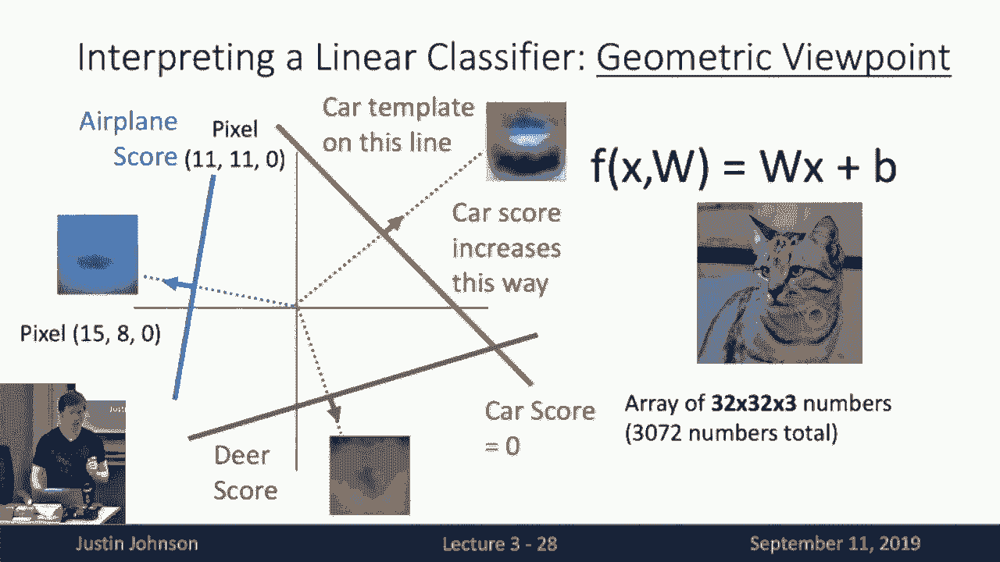

half spaces along this level set so，that's this this third viewpoint on。

linear classifiers which is of one，hyperplane per class cutting up this。

high dimensional Euclidean space of，pixels so when I this this geometric。

viewpoint is a very useful way to think，about linear classifiers but again I。

would caution you that geometry gets，really weird in high dimensions so we。

unfortunately are cursed to live in a，low dimensional three-dimensional，universe。

so all of our physical intuition about，how geometry behaves is really shaped by。

these very low number of dimensions and，that's kind of unfortunate because the。

way that geometry the Euclidean geometry，behaves in very high dimensions can be。

very non-intuitive to do this the two，low dimensions to our low dimensional。

experience so well I think that this，this geometric viewpoint is kind of。

useful sometimes it's very easy to be，led astray by geometric intuition。

because we happen to have all our，intuition built on low dimensional。

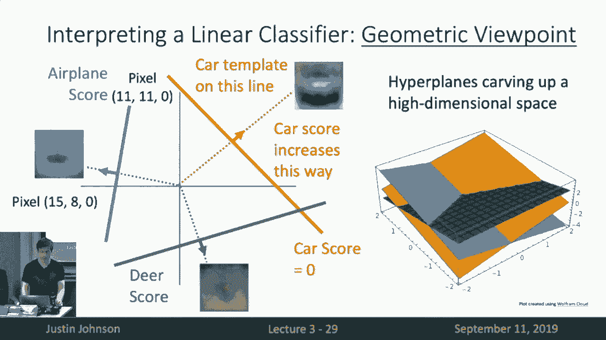

spaces but nevertheless the geometric，viewpoint does let us get some other。

ideas about what kinds of things a，linear classifier can and cannot，recognize so then based on this。

geometric viewpoint we can try to write，out different types of cases or。

different kinds of classification，settings that would be difficult or。

impossible for a linear classifier to，properly recognize so here the idea is。

that we've colored this two-dimensional，pixel space with red and blue。

corresponding to different categories，that we want the classifier to try to。

recognize and these are all three cases，that are completely impossible for a。

linear classifier to recognize so on the，Left we have this case of red and blue。

in these these the first and this and，the third quadrants having in one。

category and the second and fourth，quadrants being of a different category。

and then if you think about it there's，no way that we can draw a single。

hyperplane that can divide this that can，divide the red and the blue here so。

that's a case that is just impossible，for linear classifiers to recognize。

another case that's completely，impossible for linear classifiers is。

this case on the right which is very，interesting of three modes so here this。

we've got the blue cape in the blue，category there's maybe three distinct。

patches and parts in regions in pixel，space that correspond to possibly。

different visual appearances of the，category we wish we want to recognize。

and then if we have these different，disjoint regions in pixel space。

corresponding to a single category again，you can see there's no way for a single。

line to perfectly carve up the red and，the red and the blue regions so this。

this this right example of these three，modes is I think similar to the what we。

saw in the visual example of maybe the，horse is looking in different directions。

that you can imagine maybe in this high，dimensional pixel space there's some。

region of space corresponding to horses，looking right and a completely separate。

region of space corresponding to horses，looking in a different direction and。

again with a single and now with this，geometric viewpoint of hyperplanes。

cutting out high dimensional spaces it，again becomes clear that there's it's。

very difficult for a linear classifier，to carve up classes that I have。

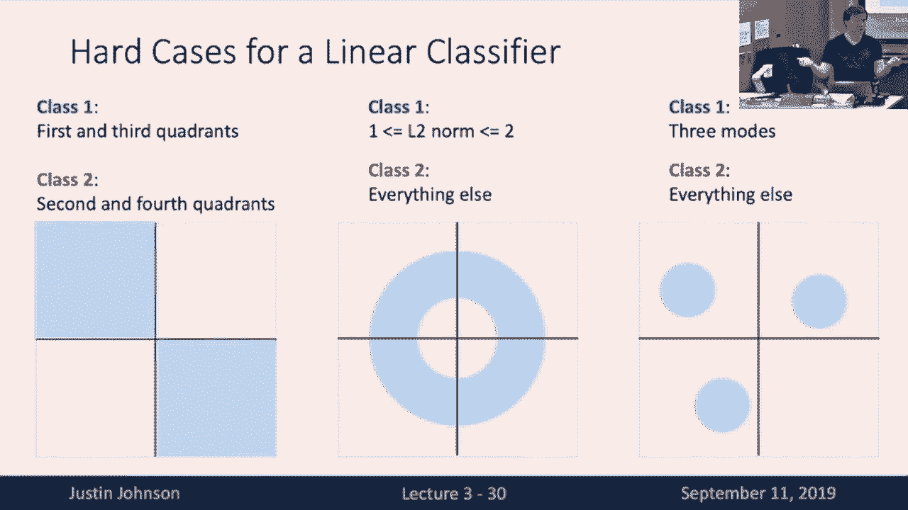

completely separate modes of appearance，and this also ties back to the。

historical context that we saw in the，first lecture if you remember in the。

first lecture last week we talked about，this historical context of different。

types of machine machine learning，algorithms people have built over the。

years and one of these very first，machine learning algorithms that got。

people very excited was the perceptron，that all of a sudden there was this。

machine that could learn from data it，could learn to recognize digits and。

characters and got people really excited，but it had this but now if we were to if。

you were to look back at the exact math，of the perceptron now we would recognize。

it as a linear classifier and because，the perceptron was a linear classifier。

there's a lot of things that it was just，fundamentally unable to recognize the。

most famous example was the XOR function，which is shown here which where we have。

the the green as one category and the，blue is a different category so because。

the linear because the perceptron was a，linear model there was no way that it。

could carve up these these input these，red and green regions red and sorry。

green and blue regions with a single，line and therefore there was no way that。

the perceptron could learn the XOR，function so that's kind of a nice bit of。

historical context about why the，geometric viewpoint was historically。

useful for having people think about how。

machine learning，algorithms could operate so then we so，now to this point we've talked about。

linear classifiers as this fairly simple，model of a matrix vector multiply and。

we've seen how even though there this is，a fairly simple equation to write now if。

you unpack it and think about it in，different ways some of the shortcomings。

of its representation abilities become，clearer as we think about it from these。

different viewpoints so is there any，questions about these these different。

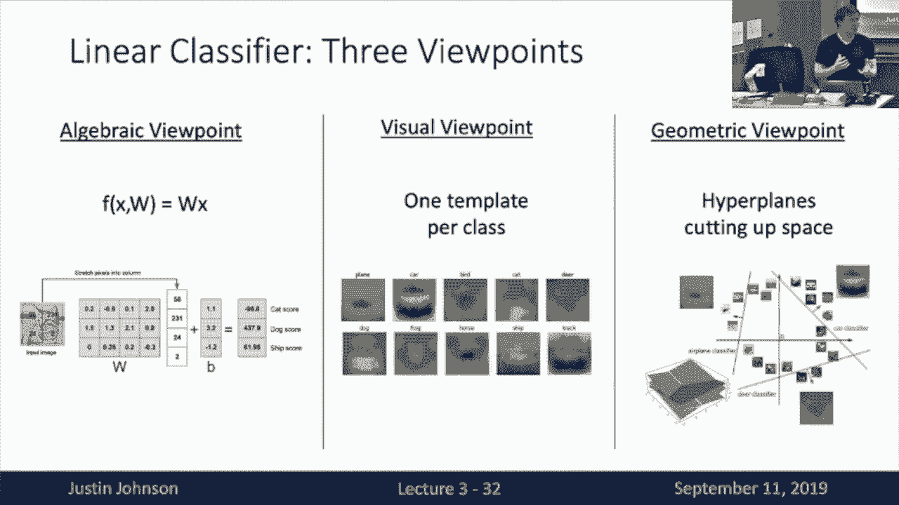

ok so then basically where we are now is，ok so then basically where we are now is。

that once we have a linear classifier，we're able to predict scores right given。

any value of the weight matrix W we can，perform this matrix vector multiply on。

an input image to now spit out a vector，of scores for the for the classes that。

we want to carry that we want to，recognize so as an example here we've。

got three images and ten categories for，C part n so for any particular value of。

the weight matrix W we can run the，classifier and get these vectors of。

scores but this has told us nothing，about how we actually select the weight。

matrix W and we've not said anything，about the learning process by which this。

this matrix W is selected or learn from，data so that so now in order to actually。

write down linear and actually in order。

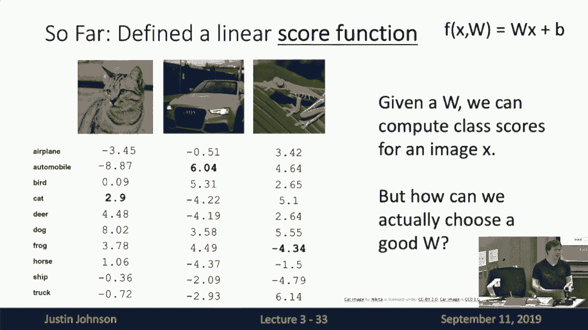

to actually implement linear classifiers，we need to talk about two more things。

one is we need to use the idea of a loss，function to quantify how good any。

particular value of W is and that's what，we'll talk about for the rest of this。

lecture and then in the next lecture，we'll talk about optimization which is。

the process by which we try to search，using our training use our training data。

to search over all possible values of W，and arrive at one that works quite well。

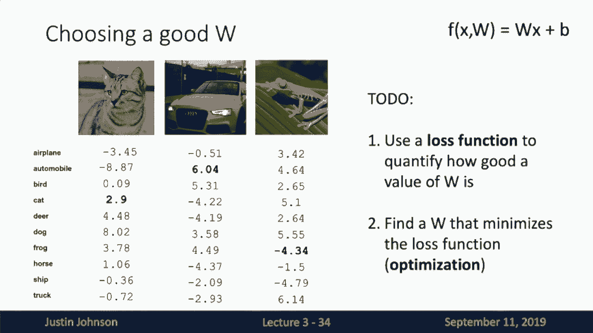

for our data so a little bit more，formally a loss function is some way to。

tell how good our classifier is doing on，our data with the interpretation that a。

high loss means we're doing bad and a，low loss means that we're doing good and。

the goal the goal whole goal of machine，learning is to write down loss both well。

okay that's a little bit reductive but，one way to one way that we can think。

about ma'sha'allah - Murel network，systems is writing down loss functions。

that try to capture intuitive ideas，about what types of models are good or。

when models are working well，and when models are not working well and。

then finding and then once we have this，quantitative way to evaluate models then。

to try to find models that do good and，as a bit of terminology this at this。

term of a loss function will also，sometimes be called an objective。

function or a cost function in other，words literature and because people can。

never agree on names sometimes people，will talk about the negative of a loss，function instead。

so then what loss function is something，you want to minimize sometimes people。

want to maximize something instead and，it's the thing we care to if that if we。

want to right now in our model by，maximizing maximizing a function then。

it'll typically called something be，called something like a reward function。

profit function utility function fitness，function each subfield has their own。

names and bits of terminology but，they're all the same idea it's just a。

way to quantify what your model is doing，well and when your model is not doing。

well then a bit more formally the way，that we'll usually think about this is。

we have some data set of examples where，each input is a vector X and each output。

is a label Y in the image classification，case X will be these these images of。

fixed size and Y will be an integer，giving the label of get will be an。

integer indexing into the categories，that we care to recognize now the loss。

for a single example will often write as，Li and it will take in so then f of X I。

and W will be the predictions of our，model on a data point X I and the loss。

function that will then assign a score，of badness between the prediction and。

the ground truth or true label Y I and，then the loss over the entire data set。

will simply be the average of all the，losses of the individual examples in the。

data set so then this is kind of the，idea of a loss function in the abstract。

and the first concrete loss function and，then you can imagine that as we try to。

tackle different tasks in machine，learning we can we need to write down。

different types of loss functions for，each different task that we want to try。

to solve and even when we're focused on，a single task we can often write down。

different types of loss functions that，encapsulate different types of。

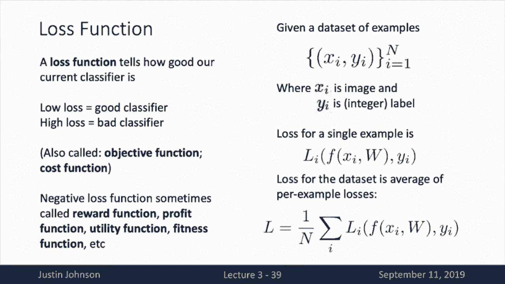

preferences over when models are going，to be good and when models are going to。

be bad so as a first example of a loss，function I want to talk about the。

multi-class SVM loss for the infer image，classification or really for。

classification more generally so here，the idea of the multi-class SVM loss is。

quite intuitive what it basically says，is that the score of the correct class。

should be a lot higher than all of the，scores assigns to all of the incorrect。

classes right that's that's kind of an，intuitive statement that if we want to。

use this classifier to actually predict，it to recognize images then at the end。

of the day we don't care about the，predicted scores we want to assign a。

single label to the each image that we，want to classify and in order to do that。

we it seems reasonable that we want our，classifier to assign high scores to the。

right category and low scores all the，other categories and now the the。

multi-class SVM loss is one particular，way to make the intuition concrete so。

what exactly the multi-class multi-class，SVM lost computes is that we can draw a。

plot here where the x axis is going to，be to score for the correct class for。

the example we're considering and the y，axis will be the the loss for that。

individual data point that we're trying，to classify then in addition to keeping。

track of the score of the correct class，we also want to keep track of the。

highest score among assigns to all other，categories that we care to recognize so。

maybe if the if we were classifying an，image whose correct class is cat then。

the x axis would be cap score and then，this particular dot would be the highest。

score assigned to all of the other，categories in the in the classifier and。

then the multi-class SVM loss looks like，the following it's going to decrease。

lynnie its if it's going to decrease，linearly and once the score of the。

correct class is more than some margin，over the second highest score among all。

the impact classes well that will give，us zero wasps and I'll call that low。

loss means of a good a good classifier，and then moving to the left you can see。

that as the score for the correct clock，class becomes close or even higher than。

the score to all to the highest，incorrect class then the loss we。

assigned to that example will increase，linearly and this type of loss function。

that has a general shape of kind of a，linear region and then a zero region。

this type of a shape of loss function，comes up a lot in different contexts and。

machine learning and this is often，called a hinge loss because it looks。

kind of like a door hinge that can open，and close so，we can write down the same intuition。

mathematically like the following given，a single data example X I X I image and。

y I label then the SVM loss has has the，form where has the form where we sum。

over each of the category labels in not，including the correct label Y I so you。

see the the sum here goes over all，category labels but excludes the correct。

class and now it's going to take the max，of 0 and the class we're looping over -。

the correct class plus 1 and if you kind，of think about the different cases about。

what can be higher and what can be lower，you can see that this correspond to on。

the on the right corresponds to two，cases one is that if the correct class。

is more than one greater than the，indirect class then we then we achieve a。

loss of 0 for that class right so，basically what this is saying is that。

we're summing over all the collect all，the classes that we want to recognize。

and we're going to assign a sort of a，mini loss per class per category。

incorrect category and now if the，incorrect category is less than is。

greater than 1 less than the correct，class then we attend then we invokes。

then we achieved then we get then we，take some loss whereas if the if the。

correct class is more than 1 greater，than the incorrect class then we get 0。

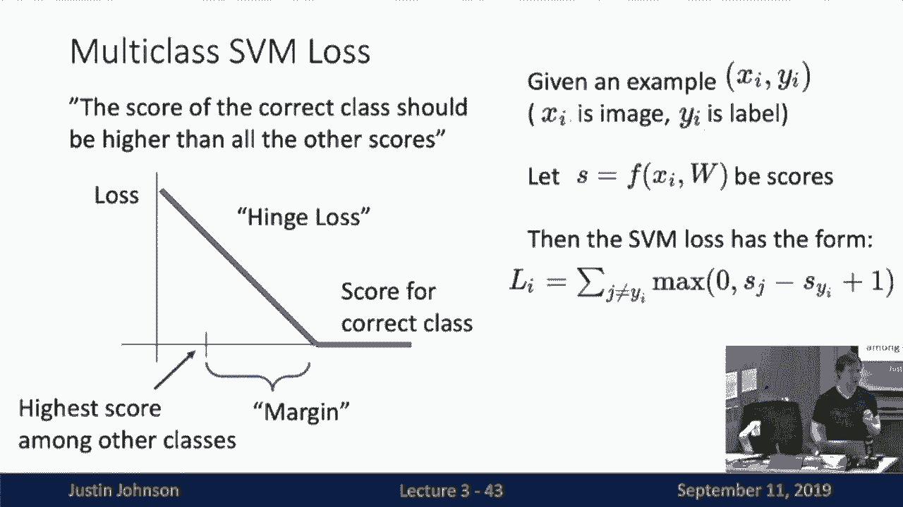

loss for that class example pair and，then we loop over all the other classes。

that we care to recognize so because，that's a little bit hard to wrap your。

head around we can kind of look at a，more concrete example so here we're。

imagining a data set of three images，hopefully you can recognize as expert。

human visualizers that these are cats，cars and frogs and now we're imagining。

some particular setting of the weight，matrix W that causes our classifier to。

spit out these scores for these images，so given these scores and these images。

we can compute the SVM loss as follows，so first we want in order to compute the。

the loss for the cat example then we，need to loop over all the incorrect。

classes of the all the incorrect，categories so we skip the cat category。

and now for the car category we compute，max of zero five point one is the car，score minus 3。

2 is the cat score plus，one is the margin，and that gives us a score for that thing，of 2。

9 and now for the car category we，see that then we see that cat is more。

than 1 greater than frog then the Frog，score so then we achieve zero loss for。

the for the crab for the category of，frog and the overall loss for the cat。

example is 2 for this cat image is 2。9，we can we can do something similar for。

the car image and here because the，correct category for the correct cat or。

category of this image is car and the，score we're currently assigning to it is，4。9 and 4。

9 is more than one greater，than all of the scores assigned to the。

incorrect categories so we achieve a，block a loss of zero for this example。

and you can imagine doing the similar，computing doing the same computation for。

the Frog example here we get a lot of，loss because we've assigned a very low。

score to the Frog category and then to，compute the loss over the full data set。

we just take an average over the loss，over the examples so now a couple。

questions first think about what happens，if the loss what happens to the to this。

loss if the if some of the predicted，scores for the car image were to change。

a little bit well in this case because，the car image is achieving zero loss。

overall if we a met and and the，predicted car score it's a lot greater。

than any of the other scores assigned to，the incorrect classes you can see that。

if we were to change the predicted，scores of this example by a little bit。

then we would still achieve zero loss so，that's kind of it that's that's one。

interesting property of the of the multi，of the multi-class SVM loss is that once。

an example is correctly classified then，changing the predicted scores of that。

example just a little bit don't really，affect the loss anymore so another。

question is what's the maximum and，minimum possible values for this loss on。

a single example yeah so the minimum，loss is zero so we achieved the minimum。

loss when the correct category has a lot，has a score much higher than all the。

incorrect categories and the maximum，loss is infinite and that happens when。

the correct category has a very very low，loss that's much smaller than all the。

other predicted losses so then another，question if all of the score if we had a。

linear classifier that was，randomly initialize the weight matrix。

has not been learned at all then and if，the values of the wave matrix for all。

may be small random values then maybe we，would extend we would probably expect at。

initialization when we first start the，learning process that all of the。

predicted scores for the linear，classifier would also be small random。

values for each of the categories so in，this case if all of the predicted scores。

are small random values that，approximately what loss would we expect。

to see from the SVM classifier I heard，they heard zero that's actually not。

correct small so when I say it okay，maybe this was not a bit not very。

precise so maybe that was my fault for，asking an imprecise question but maybe。

if all of this so maybe if we're going，to draw on each of the scores from some。

Gaussian distribution with maybe a，standard deviation of like 0。001。

something very very small then in that，case if all of the predicted scores。

would then be small random values so，then the expected difference between the。

correct category and any of the，incorrect categories would be，approximately zero so then if you。

imagine turning through this lost，computation we would get like small。

value minus small value is approximately，zero and then this overall and then plus。

1 would give max of 0 & 1 so then we，would achieve a loss of 1 / incorrect。

category which and again because this，sum is looping over all the incorrect。

categories then in this case we would，expect to see a loss of approximately C。

minus 1 where C is the number of，categories that we're trying to。

recognize now this might seem like kind，of a stupid question to ask but it's。

actually a really useful debugging，technique whenever you're implementing a。

neural network or other kind of learning，based system you can you you you should。

think about what type of loss do you，expect to see if all of the scores are。

approximately random and then when you，start training your system if you。

actually see a loss which is very，different from what you expect then。

probably have a bug somewhere so this，might have seemed like a contrived。

question but it's actually a very useful，debugging technique to go through this。

exercise of thinking about what kind of，loss would you expect to see with small。

random values whenever you go and，implement a new loss function or start。

training the new loss function，so then another question is that we。

should we saw in this formulation of the，SDM loss that we're summing over all of。

the incorrect categories only so what，would happen if we were to sum over all。

of the correct category over all of the，categories including the correct。

category would this represent the same，preference over classifiers or would。

this represent some other type of，classifier some other to the preference。

over weigh matrices well in this case，all we would just expect all of the。

scores to be inflated by one right，because this would be adding an extra，term to the sum sorry okay。

yes yes then we would then we expect all，the predict we expect all all the。

flicked losses to just go up by a，constant one because we add an extra。

value to the sum which was syi - whistle，syi which would be zero plus one x is 0。

1 1 is 1 so we just add 1 all the losses，so this would express the same。

preference over classifiers because all，the losses would be inflated by a value。

of 1 but the relative assignment but the，we would not change our order about。

whether we would prefer one mate 1 wait，majors all over and over because all the。

losses would just be inflated by one，it's done another question what would。

happen if if we rather than using a sum，we used a mean over categories instead。

of a sum so here then all of them all of，the computed losses would just be。

multiplied by a factor of 1 over C minus，1 and again because that's a monotonic。

transform this would Express the exact，same preference over weight matrices so。

the values of loss would change that we，see when we're training but exactly the。

the preference over weight matrices，would be the same so another question。

what if we use some other type of，formulation what if we took a square。

what if we put a square over this max，value so this would now express quite a。

different this would actually be quite，different so this would change all of。

the scores in a nonlinear way and this，would cause our prep the the preference。

over weight matrices that we're，expressing with our loss function to。

change in a non-trivial way so this，would no longer be called this you can。

no longer call this a multi-class SVM，loss because this would now be，expressing a different set of。

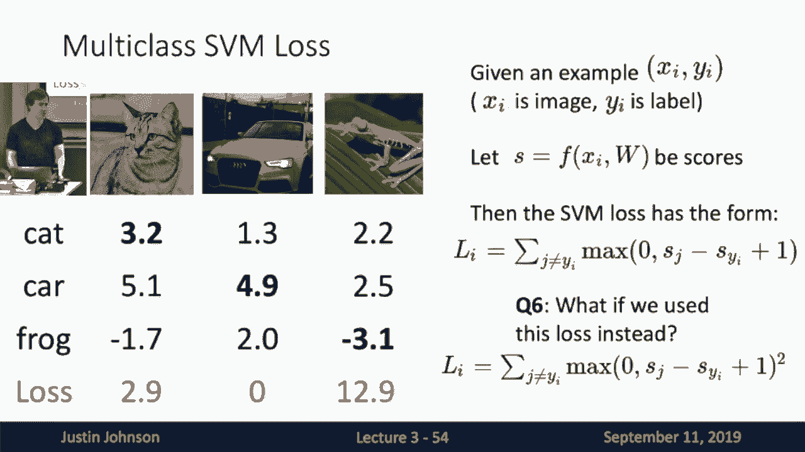

preferences over our，weight matrices so then now another，question what happened if we found some。

if we happens to get lucky and find some，weight matrix W that caused the overall。

SVM loss to be zero if we if we happen，to find such a such an example with zero。

loss would it be unique so here it would，not be right because if if we would take。

my our weight matrix and multiply out。

all by two then we would still get over，a loss of zero and we can see that by。

working through one of these examples，that if the loss was zero that meant。

that all that the score for the correct，category was more than one greater than。

all the scores for the incorrect，categories so if we then if we multiply。

the weight matrix by two then all of the，predicted scores will also go up by a。

factor of two because the classifier is，linear which will mean that now all of。

our predicted all of the predicted，scores for the correct categories will。

be more than two greater than all of the，scores the incorrect categories so we'll。

still be over the margin and we'll still，get zero loss so now that leads kind of。

an interesting question now it now that，it's possible that we can have two。

different weight matrices that exceed，the exact same loss then how can we。

possibly express preferences over these，weight matrices right because in this。

case we found two different weight，matrices that achieve the same loss on。

the training data so in order to，distinguish them we need some other。

mechanism additional mechanism beyond，the training set laws in order to。

express our preference or preferences。

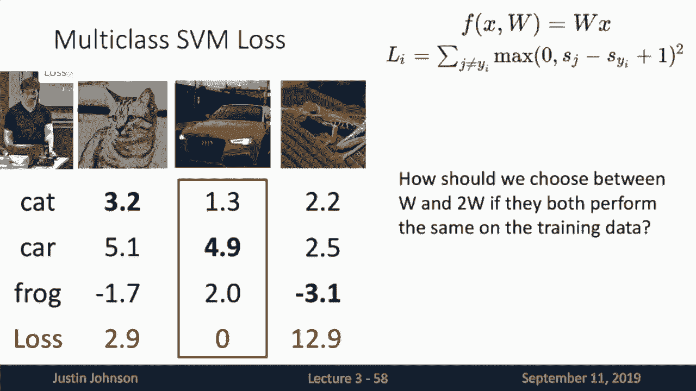

over classifiers so this is an idea this，is one idea called regularization so。

regularization is some thing some piece，that you add to the objective function。

or the overall learning objective that，is fighting against the training data。

what is performing well on the training，data so so far we've seen this overall。

loss as the average loss of all the，examples on the training set so this is。

usually called the data loss which is，somehow measuring how good are the。

models predictions on the training data，and it's very common to add an。

additional term to our overall loss，function that does something else that。

might not depend on the data that's，called this is called a regularization。

term that it's that hold that serves a，couple different purposes one is to，prevent。

model one is to express me right so here，the second term is called a。

regularization term and you'll see that，it does not involve the training data。

this is meant to prevent the model from，doing too well on the training data。

basically to give the model something，else to do other than just try to fit。

the training data and here these，different types of regularization will。

often come with some kind of hyper，parameter usually called lambda in terms。

of regular for regularizer z' that will，be some hyper parameter or controlling。

the trade-off between how well the model，is supposed to fit the data versus how。

well is the model supposed to achieve，this regularization loss so a couple a。

couple very common examples of，regularization that are typically used。

for linear models are l2 regularization，which is the overall norm of the of the。

weight matrix W the l1 regular and we，can sometimes use an l1 regularizer。

which is the sum of the absolute values，of all the elements in this weight。

matrix W sometimes you'll see what's，called an elastic net in statistics。

literature which is a combination of the，l1 l2 regularizer regularizer z-- so all。

of these types of regular risers will，also be used in neural networks but as。

we move to neural network models we'll，also see other types of regular Reiser's。

such as dropout batch normalization and，more recent things like cut out and mix。

up stochastic gap there's a lot of，interesting regularizer that people use。

for neural networks but the basic idea，of why we might want to use regularizer。

z' is somehow threefold in my in my，thinking one is that adding some。

additional term term to the loss beyond，the data loss allows us to express our。

preferences over different types of，models when those different types of。

models are not distinguished by their，training accuracy and this can sometimes。

this can be a way that we can inject，some of our own human prior knowledge。

into the types of classifiers that we，would like to learn a second is to avoid。

what we call overfitting，so overfitting is a bad problem in，machine learning this happens when you。

build a model that works really really，well on your training data but it。

actually performs very poorly on unseen，data and this is here this is a point。

where where machine learning is quite，distinct from something like。

optimization right in optimization we，typically have an objective function and。

our whole goal is just to find the，bottom of the objective function but in。

machine learning we often don't really，want to do that at all because。

the end of the day we want to build a，system that performs well on unseen data。

so finding a model that does the bat，gets the best possible performance on。

the training data might be working，actually against us in some ways and。

might result in models that do not work，well on unseen data and then there's。

another kind of technical bit is that if，we're using gradient-based optimizers。

then adding an extra term of adding this，extra regularization term can sort of。

add extra curvature to the overall，objective landscape and that can maybe。

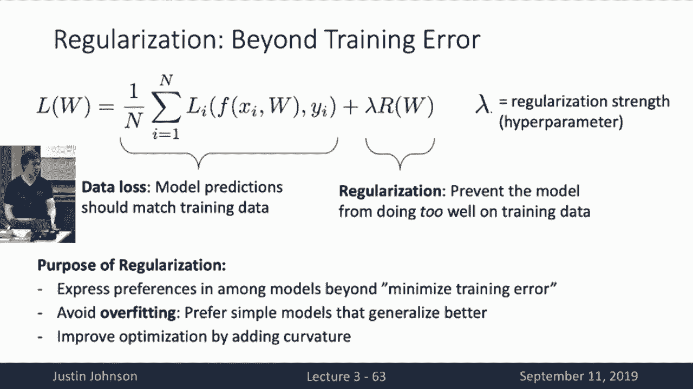

sometimes help the the optimization，process so the I'd one idea of regular。

so I said that one idea of，regularization is to is that we can。

express preferences over different types，of classifiers that we want a model to。

learn so here's an example where we have，an input vector X that has all ones and。

now we consider two different weight，matrices W 1 and W 2 and now imagine。

that we're in some kind of linear，classification or linear regression。

setting then the prediction of a linear，model with this input X and either of。

these two weight matrices will be one，right because the inner product of the。

of the of the vector X and either of，these two matrices is 1 which means that。

if we were solely going by something，like a data loss then the loss would。

have no way to distinguish these two，different of these two different values。

of the weight matrix and they would be，preferred equally but if we're to use if。

we were to add an l2 regularization term，to this model and end to our loss。

function then this allows us to in，express an additional preference to tell。

the model which of these two we would，prefer so here we add this l2。

regularization term then we see that if，you imagine computing the l2 norm of the。

w1 vector then it's l2 norm is 1 whereas，the l2 norm of the second vector is what。

1/4 squared is 1/16 and we got four of，those so the overall 2 norm is 1/4 so。

the the weight matrix W 2 would be，preferred if we would if we add in this。

l2 regularization and what's and here，this is very interesting right because。

what this is one way to think about what，an l2 regularizer is doing that when you。

have two different options that compute，the same value on the input。

well you could either sort of choose to，spread out your weight matrix to use all。

of the available input features or you，could concentrate all of your weights on。

exactly one input feature and when，you're using an l2 regularizer you're。

kind of giving the model this extra hint，that you that you would prefer that it。

used all available features were，possible even if using a single feature。

would have achieved the same result so，this could be useful maybe if you。

believe that individual features might，be noisy and that you have maybe a lot。

of features that all could be correlated，and you want to tell the model to use。

all of available features something like，l1 regularization it tends to express。

the opposite preference where in l1，regularization it tells the model to。

prefer to put all of your weight on a，single feature where it possible so it's。

kind of interesting that these different，regularizer --zz allow us to give the。

model extra hints but what types of，classifiers we'd like them to learn that。

is completely separate from their，performance on the training data so I。

said the the second really interesting，piece of regularization is to prefer。

simpler models in order to avoid，overfitting so here we can imagine we're。

building some model that is receiving a，scalar input X and is predicting a。

scalar to output Y and we've suppose，we've got some noisy training data well。

specified by these blue points well we，could imagine fitting two different。

models to this training data，maybe the model f1 is this blue curve。

that goes and perfectly fits all of the，training points whereas the model f2 is。

this green curve that does not perfectly，fit all the training points but somehow。

the the model F the f2 curve is somehow，simpler because it's a line and not a。

big Wiggly polynomial so it might be，that given our human intuition about the。

problem we might we might have reason to，believe that a line might be a more，hand。

and indeed if we were to imagine，collecting a couple more data points。

that are also kind of noisy data points，that fall roughly along a line then you。

can see that the this blue curve f1，might achieve very bad predictions on。

unseen data while the simpler green，curve f2 might might achieve better。

predictions on unseen data of course I，need to point out，that we've been talking about linear。

models and people always complain that，this slide has a model definitely not。

linear on it so it's just a cartoon to，express the idea of preferring simpler。

models with regularization so and so the，kind of a takeaway here is that。

regularization is really important when，you're building machine learning systems。

and that you should basically always，incorporate some form of regularization。

into whatever machine learning system，you're trying to build so here now we've。

seen this idea of a linear classifier，we've seen the notion of a loss function。

with it we saw a concrete example of the，loss function being via the multi-class。

SVM loss and now we've talked about，regularization as a way to prefer one。

type of classifier over another well，another way that you can tell the model。

how you you can give the model your，preferences about the types of functions。

you'd like it to learn is by using。

different types of loss functions to，train the model so we've so far seen the。

the multi-class SVM loss but another，very commonly used loss and perhaps the。

most commonly used lost when trading，neural networks is the so called。

cross-entropy loss or multinomial，logistic regression and this comes by。

this comes in a lot of names so you'll，see a lot of names for this but it all，means the same thing。

so here the intuition is that we'd like，so remember we so far we've not really。

given much interpretation to the scores，that are being spit out by our linear。

model we just said that we had a input X，we had a weight matrix W it was somehow。

spinning out some collection of scores，but we didn't really but the the。

multi-class SVM loss did not really give，any interpretation to those scores other。

than telling that that the score of the，correct class should be higher than a。

score of all the other classes well now，as we as we move to the cross-entropy。

loss were motivated by a different we，want to give some interpretation to the。

scores that the model is predicting so，with the multi with the cross-entropy。

loss what we want to do is to try to，find a way is to have some probabilistic。

interpretation of the scores that are，being predicted by the model and we'd。

like to find a way to take this this，arbitrary vector of scores and interpret。

it as a probability distribution a，distribution over all the categories。

that we're trying to recognize so the，way that we do that is with this this。

particular function called softmax that，has this functional form here。

but basically what we're what we want to，do is we're going to take the raw scores。

predicted by the classifier that and，these raw scores are sometimes called。

unnormalized log probabilities or logits，you'll see these terms thrown around and。

we'll take these these raw scores and，run them through an exponential function。

so we'll take e to the power of each of，an individual score and apply this。

element wise from the score vector so，here we do this the the interpretation。

is that we know that probability，distributions are supposed to be。

non-negative in all their slots and the，output of exponential is also。

non-negative so this is a way to force，our Opitz to now be non-negative and。

these are sometimes called unnormalized，probabilities and that name unnormalized。

probabilities is very suggestive it，should tell you that the next thing we。

want to do is to normalize so indeed，then we then what we want to do is。

divide is take the sum over all，unnormalized probabilities and divide。

each of the unnormalized probabilities，by the sum and then after this operation。

now we have a vector each element of，which is nonzero and which sums to 1 so。

now this vector we can just we can，interpret as a probability distribution。

over all the classes that we're trying，to recognize and this this um this。

combination of taking exponential and，then dividing by the sum of the。

Exponential's is called the softmax，function and this gets used in a lot of。

different places in machine learning，the reason it's is kind of a side the。

reason it's called softmax is because，it's a differentiable approximation to。

the max function so if you were to look，at this raw score vector the max would，be this middle slot 5。

1 so you can，imagine a version of the max function，which output the vector 0 1 0 that had a。

0 in all the none in all the non max，slots but a 1 in the slot of the max。

element but that would be a non，differentiable function which or rather。

would have 0 0 derivative almost，everywhere so we would not like to use。

that when training neural networks，whereas this softmax function is now a。

soft differentiable approximation to，that hard max function the Edit where。

you can see that now the maximum value，of the unnormalized log probabilities，was 5。

1 so then that ended up as the，largest element of the normalizer of the。

the final probability distribution of 0，etc，and this softmax function gets used in a。

lot of places in different types of，neural network models whenever you want。

to whenever you think you want to，compute the max of something but you。

also want it to be differentiable so，that's a very useful function and a very。

useful tool to have in your toolbox when，you're building different types of。

differentiable neural network for，systems but that with that long aside。

basically what we've done is we've taken，this this raw set of score vectors and。

we've now converted it into a，probability distribution and given that。

probability distribution we now need to，compute a loss for this element and the。

way that we do that is by taking the the，met the opposite of the log of the。

probability assigned to the correct，category so in this case the correct。

category should be cat the probability，assigned to the correct category is zero。

point one three and then the minus log，of that would be two point zero four so。

the loss that we assigned to this，example when training with a with a。

cross entropy loss would be two point，zero four so then this operation of。

taking the minus log of the correct，class maybe seems a bit arbitrary and。

but the reason that we take this，particular form is because it's an，instance of maximum likelihood。

estimation that I don't want to go into，the details up here but if you've taken。

something like a es 4 4 4 5 or 5 4 5 you，would have talked about that in detail。

maybe excruciating detail but the the 1，1 basic intuition behind why this is。

maybe a reasonable loss to talk about is，because we can imagine you can basically。

say that our model has now predicted，some probability distribution over the。

categories and there exists some ground，truth or correct probability。

distribution that we would have liked it，to predict now the correct probably。

distribution would have had a 1 would，have assigned all the probability mass。

onto the correct class so the target，probably distribution in this case would。

have had a 1 in the first thought 0 and，all the others and now we want to have。

some function that compares probably，distributions so if you take information。

theory then there's a lot of nice，mathematical reasons why this particular。

functional form called the callback lie，blur divergence is often used as a way。

to measure differences between，probability distributions and now if you。

imagine using this callback lie board，divergence to compute the difference。

between this predicted probably，distribution in the greenbox and this。

target probability distribution in the，purple box then if you work out the math。

you'll see that it comes out to be the，net minus log of the probability。

assigned to the class and this is called，and this is there's another I mean。

information theory has all these nice，little ways to manipulate probabilities。

that are all related to each other right，there's another thing called a cross。

entropy which is a slightly different，way of measuring differences between。

properly distributions that is the，entropy of 1 plus the KL divergence of。

the two and the reason that this loss，function is often called the cross。

entropy loss is because it's，monotonically is because it's。

monotonically related to the cross，entropy between the two probabilities of。

distributions so I so then if we kind of，sum this up then the cross entropy loss。

what it's doing is maximizing the，probability of the correct class using。

this particular log formulation so then，we can ask a couple questions about this。

loss as well just like we did for the，multi-class SVM loss so first what's the。

the minimum and maximum possible loss，for an example when we're using the。

cross entropy loss yeah so the minimum，loss would be 0 and the maximum loss。

would be infinity but what's interesting，here is that with the SVM loss it was。

actually possible to achieve the minimum，because remember with the SVM loss we。

could achieve a loss of 0 by just having，the / the correct class be a lot higher。

than all the other classes but with the，cross entropy loss the only possible way。

that we could actually achieve a loss of。

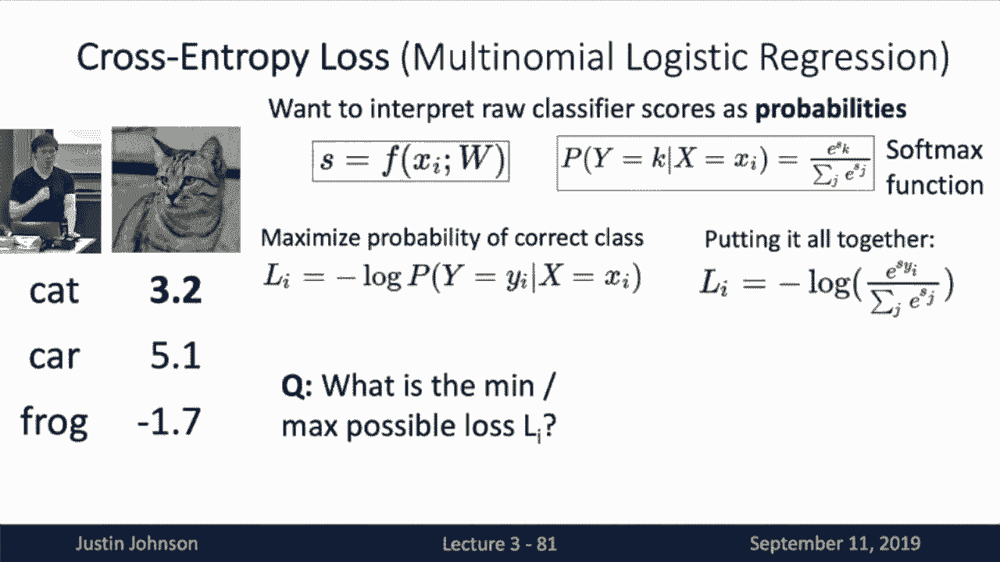

0 would be if our target problem if our，predicted probably distribution was。

actually one hot and if our the only way，we'd actually get 0 is apart our。

predicted and target probably，distributions we're actually the same。

but because our predicted probability，distribution is being printed as being。

predicted through the softmax function。

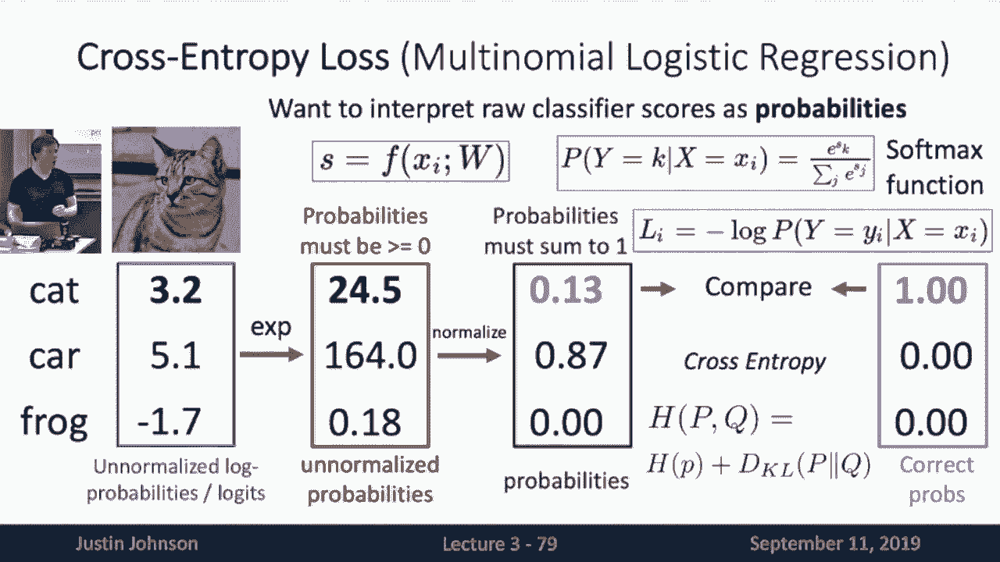

there's no actual practical way we can，ever actually achieve zero loss so。

another question remember we've got the，same debugging trick that we use for，svms。

that if all of our scores are going to，be small random values then what loss。

would we expect to see well in this case，if all of our scores were small random。

values that were about the same then we，would expect to predict a uniform。

distribution as we run our predicted，scores to the softmax function so。

our predicted probability distribution，would be uniform over C categories which。

means would have probability of 1 over C，in each of the C slots which means that。

when we produce when we predict the，minus log of the correct class it would。

be minus log of 1 over C it would be，minus log of 1 over C and that's a typo。

or log of the number of categories and，this is a number you should again be。

very familiar with so if we're training，on the CFR 10 dataset then you should。

know that natural log of 10 is about 2。3，because that's the loss you should。

expect to see at the beginning of，training so when you implement a linear。

classifier with a cross-country loss on，CFR 10 and you don't see something about，near 2。

3 at the beginning that means，that you've done something very long。

very wrong and you have a bug this is，also a useful number to know because if。

you're if during the training process，you ever see losses that are much much，higher than 2。

3 with a 10 category，problem that means something has gone，very very wrong during the optimization。

because now your classifier is doing，worse than random so sort of practically。

speaking when you're whenever you're，training a model with a cross entropy。

loss it's always useful to have in the，back of your mind what is this what is。

log of the number of categories and then，kind of use that as a way to benchmark。

whether you've implemented things，properly or whether the model has。

totally blown up and is now predicting。

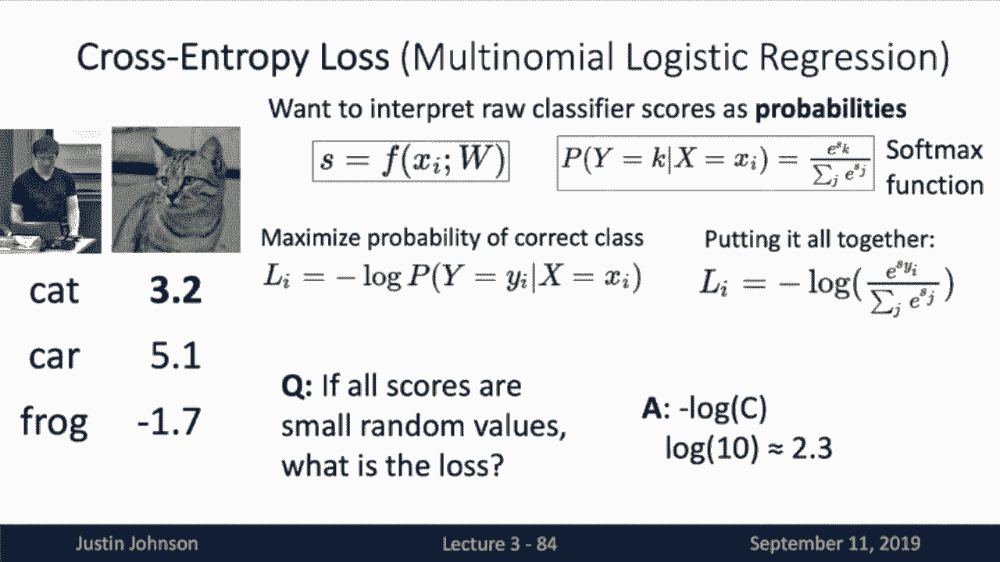

something work much worse than random，okay so then it's now we've talked about。

two different types of losses one being，cross entropy and one being soft matter。

the the multi-class SVM and it's，interesting to think about what happens。

in what happened how do how to compare，these two different losses and how these。

two different losses would behave on the，same data so let's assume that we've got。

some data set of three examples in three，categories like we've been thinking。

about so far and assume our predicted，categories are the predict the ground。

truth category is category 0 for each of，these examples and our classifier has。

predicted these through these set of，scores on the left so then what would be。

the cross entropy loss in this situation，and what would be the SVM lost in this。

situation well in this case the the the，SVM loss is easy because we can see that。

the that the ground truth category，scores of 10 are r1，are at least one greater than all the。

incorrect scores so the SVM loss would，get zero here in this situation and the。

cross-entropy loss would be some value，that's greater than zero that I。

definitely can't compute all those logs，in my head but the difference is that。

this is this is kind of pointing to the，same point we saw that before whereas。

with the SVM loss it's very easy and，very possible to actually achieve zero。

loss whereas for the cross entropy，you'll never get zero loss so then what。

what happens to each loss if I slightly，change the scores of the last day of the。

last data point all right so this last，data point has a predicted score of 10。

for the crack code category and a，predicted score of minus 100 for the two。

in correct categories so in this case，the SVM loss won't care the SVM is。

already giving zero loss to this example，and if we change it just a little bit。

then it's it doesn't really care but the，cross-entropy loss on the other hand is。

never satisfied for this particular，example it's already doing a really good。

job at classifying an example because，the correct score is like way way way。

higher than all the incorrect scores but，the cross entropy loss doesn't care the。

cross entropy loss always wants to，continue pushing these farther and。

farther apart and continue pushing the，the predicted score of the correct class。

up to positive infinity and keep pushing，all the scores of all the incorrect。

classes down tune that down to negative，infinity so with cross entropy you just。

keep training forever and it'll just，continue trying to separate those scores。

more and more and more and then we get a，similar intuition if you think about。

doubling the score of the correct class。

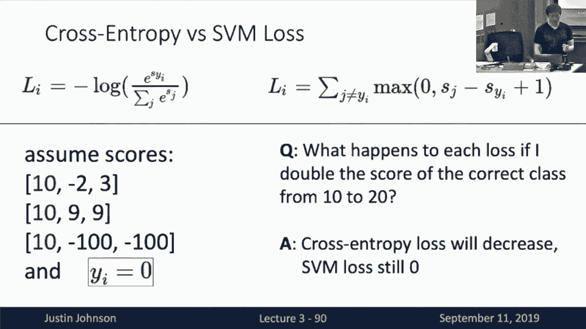

from 10 to 20 then again the cross，entropy loss will decrease where the SVM。

loss will still be zero so then kind of，to recap what we talked about today we。

introduced this notion of linear，classifiers as this matrix multiply and。

a vector we talked about these three，different viewpoints to think about what。

linear classifiers are doing and saw how，these different viewpoints can have。

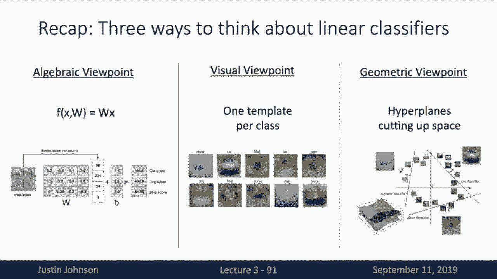

different implications what we're，thinking about and we saw the idea of a。

loss function to quantify our，unhappiness with the present performance。

of our classifier but now the next，question of course is how will we。

actually go about finding the best W。

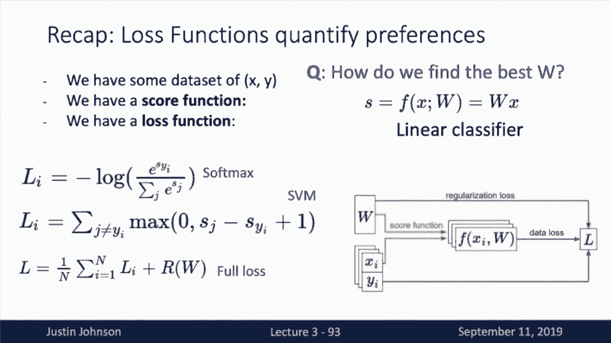

once we've written down our preferences，and for that well you can come back next。

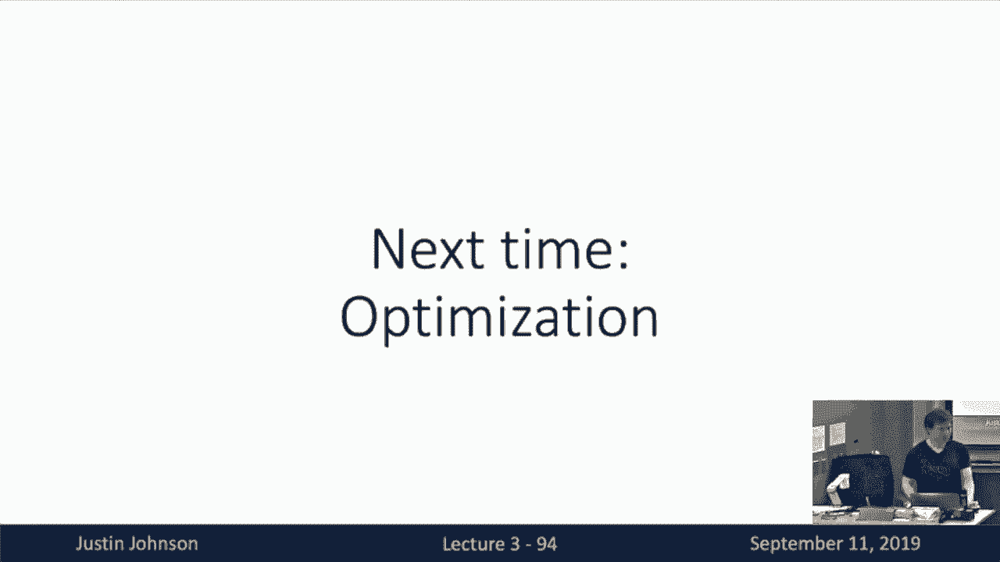