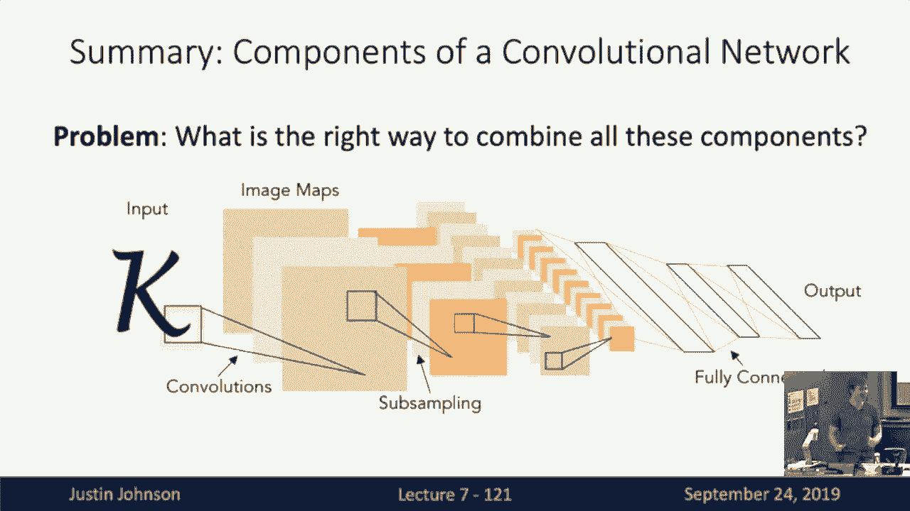

# P7：L7- 卷积神经网络 - ShowMeAI - BV13P4y1t7gM

all right welcome back to lecture seven，all right welcome back to lecture seven。

today we're going to talk about，convolutional neural networks which is。

finally the major class of models that，we'll use to process images going。

forward so if you'll recall at the last，lecture we were talking about the back。

propagation algorithm which we could use，to compute gradients in arbitrarily。

complex computational graphs in，particular we saw that the use of this。

computational graph data structure made，it very easy to compute gradients。

without having to use tons and tons of，paper or lots of white board space or。

something to derive these complex，expressions instead we were able to。

compute gradients in expressions of，arbitrary complexity by implemented by。

using the back propagation algorithm to，walk forward over the graph and then the。

forward pass to compute the outputs and，then walk backward over the graph in the。

backward pass to compute the gradients，and we had this local viewpoint of the。

back propagation algorithm where now in，order to imp in order to add a function。

or use a function inside of a，computational graph we needed to，implement this little tiny local。

operator that would come that would know，how to compute the app its outputs。

during the forward pass given the inputs，and then in the backward pass would know。

how to compute the gradients with，respect to its inputs given the upstream。

gradient of its out of the loss with，respect to its outputs so now now all we。

need to do in order to plug in new types，of functions into our computational。

graphs is just have them conform to this，little modular gate API that we talked。

about last time and then at the end of，last time we ran into a bit of problem。

so so far in this class we've talked，many times about the linear classifier。

and now we've hopefully gotten some，familiarity with these fully connected。

neural network classifiers we saw the，book that especially the fully connected。

neural network classifier was a very，very powerful model that could flexibly。

represent many different functions but，both of these classifiers had a problem。

so far and that problem is that neither，of these two classifiers worst respect。

the 2d spatial structure of our input，images if you'll recall both of these。

classifiers required us to take our，input image that has some spatial。

structure and has some color about some，RGB color values at every point in space。

and now destroy all of that spatial，structure by flattening our images。

this long vector that we could feed into，our linear classifiers or our fully。

connected networks and this seems like a，problem with we're going to work with。

image data that somehow whenever you，build a machine learning model it's very。

useful to build models that somehow take，advantage of the structure of the input。

data and now in order to make take，advantage of this spatial image。

structure of our input image data the，solution is relatively simple，now that we've built up all this。

machinery around computational graphs，and back propagation in order to build。

neural networks that respect the spatial，structure of our input data all we need。

to do is define a couple of new，operators that know how to operate on。

images or on spatially structured data，so that's what we're going to talk about。

today is a couple new operators that we，can introduce into our neural networks。

that will operate on this，two-dimensional spatial data in，particular so far when we talk about。

fully connected networks we're very，familiar with these two basic components。

of fully connected networks we have the，fully connected layer but gives the。

fully connected network its name which，is a matrix multiply between the input。

vector that now produces an output，vector and recall the other critical。

component of these fully connected，neural networks was this nonlinear。

activation function I'm showing the the，Ray Lu activation function here on the。

slide now when we move from fully，connected neural networks to。

convolutional neural networks we need to，introduce a couple extra basic。

operations that we can use inside the，computational graphs or models in。

particular so then today we'll talk，about three of these operations that let。

us move from fully connected to，convolutional networks in particular we。

talked about convolution layers pooling，layers and normalization layers so first。

let's see how we can extend the idea of，the fully connected layer which as。

you'll recall destroyed all of the，spatial information and input and move。

on to the convolution layer which will，serve a similar role in that it will。

have learn above eight that will now，respect the 2d spatial structure of our。

inputs so if you'll recall to look for，the fully connected layer the one one。

way to look at what it's doing is that，during the forward but it's in today's，lecture and going。

forward we're only talking about forward，passes and it's sort of up to you to use。

the machinery from last lecture to know，how to figure how to derive gradients。

for all of these expressions so we'll be，talking exclusively about four passes。

from this point on and now so then to，recap a little bit one way to look at。

the fully connected layer is that during，the forward pass it receives some vector。

if that vector is perhaps a flattened C，far ten image then it would be a vector。

of 3072 scalar diamond elements being 32，by 32 by 3 and now during the forward。

propagation operation of the fully，connected layer we just simply multiply。

that vector with a weight with a weight，matrix to produce an output vector now。

now the convolutional layer is still，going to have this flavor of operating。

on an input use doing so that have it，you have operating on it with a weight。

matrix in some way and then producing an，output of the same general type in。

particular the convolution layer now，will input a three-dimensional tensor。

that is a three-dimensional volume that，is no longer a flattened vector so for。

something like CFR 10 image the in at，the very first layer of a convolutional。

Network that's operating on a C part，time image that input volume would now。

be a three dimensional tensor of three，by 32 by 32 where that number three。

refers is is called the channel or depth，dimension of the input tensor in the。

case of a C part n image it has three，channels the red blue and green color。

channels for the raw input image and，then we the 32 and a third the other two。

thirty twos are the height and the width，of this three dimensional tensor and now。

the just as our input in our input，tensor has some three-dimensional。

spatial structure with a convolution，layer our weight matrix will also have。

some kind of three-dimensional spatial，structure in particular the the weight。

matrix also called sometimes a filter in，the terminology of a convolutional layer。

will be a little free dimensional chunk，in one example it would be that we might。

have a convolutional filter of size 3 by，5 by 5 and here the idea is that we're。

going to take this little convolutional，filter and we're going to slide it over。

all spatial positions in the input image，to compute another three-dimensional。

but here first notice that there's a，constraint here between the shape of the。

input sensor and the shape of one of，these convolutional filters in。

particular the depth dimension of the，the number of depth channels in the。

input tensor always has to match the，number of depth channels in one of our。

convolutional filters that is to say，that this that this that this。

convolution operation always extends，over the full depth of the input tensor。

we'll see some examples of convolution，operations that relax this and I think。

next lecture but for the purpose of，today you should always consider the。

convolution as extending over the full，depth of the input tensor and now in。

order to compute our output what we're，going to do is take that little five by。

five by three filter and stick it，somewhere inside the the input image and。

now that three by five by five chunk of，filter will then align itself to some。

little three by five by five chunk of，that input sensor and then once we've。

aligned the filter to some spatial，position in the input tensor then we can。

compute a dot product between the filter，and the corresponding elements of the。

input tensor and this is just a dot，product just as we've seen in fully。

connected networks before where but now，rather than taking an inner product。

between a row of a matrix and the entire，vector now it's an inner product between。

one filter and a little tiny locally，local spatial chunk of the input tensor。

and so in this example are three by a，five by five chunk of the input image。

would result in a dot product of seventy，five elements and it would also be。

common to add a bias as with most，machine learning models it's very。

comments have a bias whenever you have a，weight but for purposes of clarity on。

the slides will often omit biases but，you should remember that they're usually。

there so then by by positioning this，Spade this filter at one position and。

the input in computing this inner，product we end up computing a single。

scalar number that tells us effectively，how much does this position in the input。

tensor match up with this one filter，that we've computed so that will give us。

one element of the output tensor and now，to end now we will repeat this process。

and take this input filter and slide it，around at every，one of the every possible position in。

the input tensor and each one of those，positions will result in a single number。

giving the dot product between the，tensor the weight tensor and the local。

chunk of the input at that position so，in this example if we had a 32 by 32，input and a 5。

5 filter if you kind of，imagine how that's going to work in your。

head work it's going to result in 22 28，by 28 grid of possible positions at。

which we could stick that filter and for，each of those positions it results in a。

single number resulting from that dot，product so the result of convolving this。

one convolutional filter or kernel with，our input tensor will be an output。

tensor of shape one by 28 by 28 but of，course it's never enough to just have。

one convolutional filter so in fact a，convolutional layer will always involve。

convolving the input image with a set or，a bank of a different filters with。

different weight values so we can，consider convolving now our image with a。

second convolutional filter I'm shown，here in green to represent that it has。

though maybe different values of the，weights and but when we convolve with。

the second green convolutional filter we，perform the exact same operation we take。

this five three by five by five，convolutional filter and we slide it。

over all positions in the input and，compute an inner product at each。

position and this produces a second one，by 28 by 28 output plane giving all the。

responses of the input image to that，second convolutional filter and of。

course and these these are these 28 by，28 output planes we sometimes refer to。

as activation maps of the neural network，because these are somehow now。

two-dimensional maps showing how much，does each position in the input response。

to each one of our convolutional filters，in the in layer and of course we don't。

have to stop at two filters in general，week will come a convolutional layer。

will involve convolving with some，arbitrary number of filters that is a。

hyper parameter that you can set so in，this example we're showing convolving。

our input tensor with six convolutional，filters and now at the bottom you can。

see our six convolutional filters we，have six convolutional fill。

each of those convolutional filters has，size 3 by 5 by 5 3 being the number of。

inch input channels from the input，tensor divided by 5 being the spatial。

size of the filter and now we can，collect all six of our fill of our。

convolutional filters into a single four，dimensional tensor that now has shaped。

six by three by five by five and now，that and but this this four dimensional。

tensor has this particular structure，this in particular interpretation as。

being a set of three a set of six three，dimensional filters and then when we。

convolve each of those filters with the，input image we get one activation map。

for each filter now so now we can，consider concatenating all of those。

activation maps which are the responses，of the input image to each of our six。

convolutional filters and we can，concatenate all of those activation maps。

into a single three dimensional tensor，which in this example has size 6 by 28。

by 28 so now this looks just like，another input image because that mez。

convolutional layer has then taken a，three dimensional tensor with some depth。

dimension 3 and some height and width 33，by 32 and it's converted it into another。

3-dimensional tensor where now maybe the，height and the width have changed but。

the but the the spatial structure has，been preserved and all of the。

computation inside the computational，layer always written out respects the。

local structure of the image and of，course I mentioned that these。

convolutional layers always have a bias，so for completeness here we're showing，it explicitly。

now the bias we always have one bias，term per convolutional filter so in this。

example with six convolutional filters，the bias is simply a vector of six。

elements that gives us a constant offset，that we offset each of the feature maps。

in the output by each of the，corresponding bias values and of course。

this can write so then the output is，then a 28 by 28 grid and so far we've。

been there's there's kind of two useful，equivalent ways to think about the。

output of a convolutional layer one is，this note one is this notion of。

activation maps that we can think of，of the，output where each of those activation。

maps represents the degree to which the，entire input image had responded to one。

of those filters and that's one useful，way to think about the spatial structure。

of the output of a convolutional layer，but a second way to think about the。

output of a convolutional layer is that，it gives us a 28 by 28 grid which is a。

spatial grid get corresponds roughly to，the same spatial grid of the input。

tensor and now at each position in that，spatial grid the convolution layer。

computes a feature vector in this Dement，in this example a six dimensional。

feature vector which tells us something，about the structure of the structure or。

the appearance of that input tensor at，each position in the spatial grid this。

maybe seems kind of trivial about，whether you're slicing it this way or。

slicing it this way but depending on，whet how you're thinking about。

convolution in different contexts it's，sometimes useful to think of it either。

as a collection of feature Maps or as a，grid of feature vectors so it's useful。

to have both of those concepts in mind，when you think about the output of a。

convolutional layer and of course we，will almost we it's very common when。

actually performing convolution in，practice to perform it on batches of。

images so then rather than having rather，than operating on just a single three。

dimensional tensor giving us a single，input image instead it'll be common to。

operate on a batch of three dimensional，tensors and of course given a collection。

of three dimensional tensors we can，group them into a single four，dimensional tensor where the batch。

dimension at the beginning a corresponds，to independent images that were。

processing in this convolution layer so，the general form of a convolution layer。

looks something like this the it will，receive a four dimensional input a four。

dimensional tensor as input and that，four dimensional tensor as input will。

have shape n for the batch dimension the，number of elements in our mini batch by。

CN is the number of channels in each of，those input images in the batch then by。

it we'll have two spatial dimensions HW，that will give us the spatial size of。

each of the input elements and，and then the output will always have the。

same batch dimension because this，convolution layer processes each。

elements in the batch independently and，now the output will have a Willis that。

will have a channel dimension see out，and the see out channel dimension might。

be different than the C in channel，dimension and the output will of course。

also have some new spatial extent H，Prime and W Prime which might be。

different from the spatial extent of the，input image is this operation of what's。

happening inside the convolution layer，I'll clear very good so now because this。

convolutional layer it takes as input a，three dimensional or four dimensional。

tensor and then produces a four，dimensional tensor as output so we can。

imagine stacking a whole sequence of，these convolutional layers all ends to N。

and by doing so build up a neural，network whose basic elements are now no。

longer fully connected layers but are，instead convolutional layers so here's。

an example of what that might look like，for a little cartoon convolutional。

network with three convolutional layers，here we're imagining working on C part n。

so the input image has three channel，dimensions for red green and blue and 32。

height and width spatial dimensions then，we will operate on it with our first。

convolutional layer that we'll have now，the weight matrix here is six by three。

by five by five you should interpret，that recall as a set of six。

convolutional filters each of which has，an input channel dimension of three to。

match the input image and each of which，has a local spatial size of five by five。

so then we will convolve each of those，five by five filters with the input to。

get our 28 by 28 spatially sized output，and the depth channel of that output。

will now be 6 for those six filters in，that first convolutional layer and then。

we can repeat the process so now we've，just got another three dimensional。

tensor we can pass it on to another，another convolution operation and now。

for the second convolution operation we，can see the weight the weight matrix has。

shaped ten by six by three by three，which again means that we have ten。

convolutional filters each of those，convolutional filters has a depth。

dimension of six to match that that，input tensor and the spatial size of。

these filters is now three by three and，that would produce another output and，then that then we。

stacking more and more convolutions on，top of each other and there's of course。

many and just as we use this terminology，of hidden layers when we were talking。

about fully connected networks we can，use the exact same terminology with。

respect to these convolutional networks，so here this would be a 3 layer。

convolutional network with our input in，red our first hidden layer in blue and。

our second hidden layer in green but，there's actually a problem with this。

convolutional network that I've written，down on this slide can anyone spot what。

might be a bad thing about this，particular design yeah so what happens。

if we stack multiple convolution layers，directly on top of each other it's well。

Egypt convolution operation is itself a，linear operator so when we stack one。

convolution directly with another，convolution it actually is another。

convolution so just as just as you might，recall from the example of a linear。

classifier when we sorry of a fully，connected Network if we had tried to。

build a fully connected Network by，stacking two fully connected layers。

directly on top of each other then it，had the same representational power as。

just a single fully connected layer and，the same thing happens with convolution。

layers because they are also linear，operators so if we stack two。

convolutional layers directly on top of，each other the result is still has the。

same representational capacity as，another convolutional layer although。

perhaps with a different filter size or，a different number of channel dimensions。

but it's still a convolutional layer so，then to overcome this problem we use the。

exact same solution that we saw with the，fully connected networks which is that。

we in between each of our linear，convolution operations we need to insert。

some kind of nonlinear activation，function so we will very commonly use。

the rate of activation function that，operates element-wise on each element of。

this three dimensional tensor just as we，did in the exact same way for our fully。

connected networks yeah question the，question was why are there five bias。

terms for the first convolutional layer，and the answer is because I have a typo，on the slide。

so thank you for pointing that out right，so a very student that maybe I was。

testing you that was supposed to have，sixth bias terms for each of the six。

filters in that first convolutional lair，good that hopefully means that it's been。

very clear what these what these layers，are supposed to do so then another。

question you might ask is that as you，recall from our study of linear。

classifiers and fully connected neural，networks we always were able to somehow。

visually inspect the weights that were，learned at the first layer of the。

network so we might ask the same，question for a convolutional Network。

is there some way that we can visually，inspect or visually interpret what the。

weights at that first layer of the，convolutional neural network are so。

you're I think you've seen this many，times now the linear classifier we had。

this interpretation a learning a bank of，templates one template per class and。

then the this was expanded with our，fully connected neural networks but now。

learned a set of a set of templates in，the first layer which were not tied to。

any particular class but the each of the，templates in the fully connected network。

expanded extended over the full size of，the input image so the fully connected。

Network and the first layer learned this，Bank of templates each having the same。

size as the input image，well the convolutional network has a，very similar interpretation that except。

that now rather than learning a set of，templates that are the same size as the。

full input image instead now it's，learning a set of templates that are。

small and local in size so here I'm，showing some learned templates from Alex。

net trained on image net and in the，first layer of alex net it actually has。

an 11 by 11 convolution on the outputs，with 64 filters so then we can visualize。

each of those 64 filters as a little 11，by 11 RGB image and then we can get some。

sense for what these filters are，learning and these filters from Alex。

that are very typical of what you tend，to expect to learn in the first layer of。

a convolutional network we can see that，many of these filters learn something，like an oriented edge。

detector that they learn maybe edges，that detect maybe vertical horizontal。

edges or vertical edges in different，orientations and with different。

frequencies so you they they look sort，of like local edge edge detectors or。

local wavelets another thing that's very，common to see in convolutional network。

filters is this notice these opposing，colors so we can see that some of these。

filters have like a green blob next to a，red blob and that's somehow looking for。

up opposing colors in a particular，orientation in the image so then the。

interpretation of what is the feature，map at the second after we apply this。

first convolution operation each of the，maps in each of the activation maps in。

that 3d output tensor gives the degree，to which each position in the input。

image responds to each of these 64 by 64，filters or equivalently when we had this。

viewpoint of the output of the，convolution as a grid of feature vectors。

then that tells us that maybe for Alex，net it gives us a 64 dimensional feature。

vector at every position in the input，image and the court and the elements of。

that feature vector corresponds to the，degree to which the corresponding chunk。

of the input matches up with each of，these templates that's learned in the。

first layer and if you'll recall back to，Hubel and Wiesel experimenting on the。

cat they found that the cat visual，system tends to be tended to respond to。

these local regions of edges local，patterns in the visual field of the of。

the cat's eyes and that's kind of a，similar effect that's going on with。

these learned convolutional filters in，the first layer of a convolutional。

network so then we can dive in and look，a little bit in a little bit more detail。

at the exact spatial dimensions of a，convolution operation so here we have an。

input image that so now I've kind of，Trant transposed it and dropped the。

depth dimension so now the depth，dimension is going into the white into。

the into the screen and I'm hiding it，because that's kind of it's not relevant。

on your thinking about the spatial，dimensions so here we have an input。

image of spatial size seven by seven and，we imagine convolving with a。

convolutional filter of size three by，three so then to see what spatial size。

the output should be we just need to，count the number of spots that we can，drop down that fill。

in this input image so we've got one two，three four five so that means that there。

were five positions that we could have，dropped a 3x3 filter into a 7x7 image。

which means that the spatial size of our，output should be will be five by five。

and in general if our input has some，size W and the filter has a kernel size。

of K then the size of the output will be，w minus k plus 1 right the idea is that。

we've been right that the number of，positions we can drop the filter is。

actually less than the number of，positions in the input because it we。

bump up against the edge of the input，along the edges and corners of the input。

image now this seems like potentially a，problem this means that every time we。

perform a convolution operation in this，way every convolution operation is going。

to reduce the spatial dimensions or，input tensor so then that puts some。

constraints on the depth of the networks，that we might be able to train that for。

example if we use a three by three，convolution we're going to lose two。

pixels of resolution every time we do a，convolution which puts an upper bound on。

the number of layers that we could，potentially put in our network because。

eventually the spatial Dement the，spatial size of our image would just。

evaporate away to nothing if we used，enough convolutional layers and that。

seems like a problem we don't want the，number of layers in our model to be。

constrained by this evaporative nature，of the convolution operation so to fix。

that we often introduce padding around，the borders of the image before we apply。

the convolution operation so here's an，example where we're applying a padding。

of a padding of one which means that，before we do the cut before we perform。

the convolution operation we add a extra，of pixels around that around the border。

of the image and fill them all with，zeros this is called zero padding。

there's very you might imagine there's，different strategies you might use for。

how you might pad out the input you for，example you might think to maybe pull。

the nearest neighbor value from the，border of the image or you might imagine。

a circular padding value or you know you，you take as you go up the right-hand。

side of the image maybe you start，copying values over from the left。

or other other schemes like that but it，turns out in practice the most common。

thing that we do when training，convolutional neural networks for，padding is simply to add zeros it's。

simple it's easy and it seems to work，quite well so that's this now introduces。

an additional hyper parameter into a，convolution layer so now when we're。

building a convolution layer we need to，choose both the number of both the。

filter size and the number of filters in，the layer and also the amount of padding。

that we're going to apply in inside the，convolutional layer and now once we've。

generalized our convolution layer in，this way to accept padding then the。

output size now becomes W minus K + 1 +，2 P where P is the padding value and a。

very common way to set that high per，parameter P is to set it equal to the。

kernel size minus 1 over 2 that means，that suppose we're doing a 3x3。

convolution then we pad with 1 if we do，a 5x5 convolution you pad with 2 on each。

side and that that is called same，padding because it means that when we。

apply the convolution the output will，now have the exact same spatial size as。

the input so even though padding is an，extra hyper parameter technically that。

you can play around with the the most，common thing to do for padding is。

actually same padding so this this just，makes it easier to reason about the。

spatial sizes because it means that the，spatial size tends not to change when we。

perform our convolution operation now，another thing another useful way to。

think about what the convolution is，doing is this notion of a receptive。

field so here we're showing an input，grid I'm showing our input image and。

then the output grid the spatial grid of，the output after performing a。

convolution operation and recall that we，had this interpretation of the。

convolution as taking our convolutional，filter matrix and sliding it around and。

taking inner product sliding it around，every position of the input what this。

means is that each spatial position in，the output image now depends only on a。

local region of the input image in，particular for a three day 3x3。

convolution here one element of that，output tensor now only depends on a 3x3。

region in the input tensor and this 3x3，region is often called the。

cept afield of the convolution or of the，or of the receptive field of the value。

in the output tensor this is relatively，a relatively straightforward and easy。

thing to think about in the context of，one convolution layer but it's also。

interesting to think about what happens，these receptive fields as we start。

stacking convolution layers together so，what we can see is that here we're。

showing a stack of three convolution，layers and now on the very right hand。

side we see that one element in the very，rightmost output tensor depends on a。

three by three region in the，second-to-last activation map but and，each of those elements in that。

second-to-last activation map it in turn，depends on a three by three region in。

the input in the in the second，activation map with so that and that。

which in turn depends on a three by，three region in the beginning activation。

map so that means that transitively，this act this green region in the final。

output actually depends on a fairly，large spatial region in the input in。

there in this input tensor on the far，left so in this example with three by。

three convolutions you can sort of，visually see that when we stack to three。

by three convolutions on one after，another then the output of those two。

three by three convolutions now depends，on a five by five spatial region in the。

original input and if we stack three，convolute three three by three。

convolutions it now depends on a seven，by seven region in the input state。

feature map so then this is another this，is a but then the term receptive field。

is sometimes overloaded a little bit to，mean maybe two different things so then。

the receptive field of a neuron in the，previous layer would be equal to the。

kernel size of the convolution and，sometimes you'll also talk about the。

receptive field of an activation all the，way in the original image which is the。

spatial size in the input image that has，the potential to affect the value of。

that neuron after however many，convolution layers and what we can see。

from this diagram is that as we stack，convolution layers on top of each other。

the effective receptive fields in the，input is going to grow linearly with the。

number of convolution layers that we，we add but now this is maybe a slight。

problem because suppose we want to work，with very very high resolution images。

maybe we will want to work with 1024 by，1024 images now that means that in order。

for our out the values in that output，tensor to actually have the ability to。

see a large region in that high，resolution input image the only way that。

we can do that is by stacking up a very，very very large number of convolution。

layer a convolutional layers so then if，maybe we have a 1024 by 1024 image then。

every 3x3 convolution only adds two，pixels to the receptive field so we。

would need something like 500，convolutions in order to allow the out。

those final output features to depend on，the full input image and it is having。

these large receptive fields in the，input image maybe seems like a good idea。

because the neural network needs to be，able to get some global context about。

what is the full image that it's looking，at so then a solution to this problem is。

to add another hyper parameter to our，convolution operation yeah was there。

yeah the question is it's the zero，padding it doesn't seem like it's adding。

any information to the network well it's，actually not meant to add any。

information it's it's more about，notational convenience to prevent the。

shirt the features from shrinking inside，the network although there is actually a。

type of implicit way the zero padding，does actually add some information to。

the network and that's that it actually，breaks translation invariance so with a。

convolution it's it should be，translation invariant right if you，imagine shifting the whole image a。

translation equivariance to be more，technical if we shift the entire image。

then the output should shift，correspondingly but once you add a。

convolution layer it actually gives the，network the ability to kind of count out。

from the border that you could imagine，it learns a convolutional filter that it。

looks for that row of zeros to know，where it is in the input image so。

actually I think that adding zero，padding in this way somehow breaks the。

translational equivariance of the，convolution operation and gives the。

network some latent or implicit ability，to know exactly where it is in the input。

image I don't know if that's a bug or a，feature but how，punch that that's something that the。

zero padding actually is adding the，but then back to this back to this。

but then back to this back to this，problem we had this problem that in。

order to achieve these very large，receptive fields we need to stash many。

many convolution layers and now we can，open we can overcome that by adding。

another hyper parameter to our，convolution called stride so now we now。

we go back to our example of a seven by，seven input with a three by three。

convolutional filter but now we want it，to have a stride of two that means that。

rather than placing the convolutional，filter at every possible position in the。

input image instead we're going to place，it every two possible positions in the。

input image so then the output now then，are our first place we can stick it is。

in still in the upper left-hand corner，and now we actually skip over one。

percent shil one potential position to，place the filter because our stride is。

two and now we place it again，so then with a stride of two we can see。

that there are only three positions in，the input where we can place the。

convolutional filter which means that，when we use a stride of two then we are。

our output is now is quite a lot，spatially down samples and once we add。

stride to the network that means it can，build up receptive fields much more。

quickly because that that effectually，expected adding a layer of the stride of。

two effectively doubles that receptive，field at every layer in the network well。

rather at the layer in which we have，astride of two so now for a little bit。

of this this more general formulation of，how to compute the output shape or size。

of a convolution if our input has size W，our filter has size K our padding is P。

and we have a stride of s then we have，this expression for computing the size。

of the output and you might ask here，where you can see that the size is。

dividing by the stride and you might，wonder what happens if that integer。

that's not an integer that's actually，divisible by the stride well that's kind。

of people pay implementation independent，but usually you just like trunk you。

usually will truncate it or round down，or round up I don't know it depends on，the application。

but usually we don't do that and usually，we set up our convolutional layers in。

such a way that the stride always，divides that that expression that we're。

dividing W minus K plus two beats，so now here's a little excuse kind of。

recap all of that here's an example of a，convolution that you might use in a C。

part n network with our input volume of，size three channels 32 by 32 spatial。

size and now we might imagine a，convolutional filter with ten filters of。

five by five with stride one and pad two，so what we've given given these settings。

for the convolutional layer what should，the output size of this of this out of。

well here we can apply the formula on，well here we can apply the formula on。

the previous slide and it turns out that，in this case the spatial size is the。

same because we're using stride of one，and same padding and the number of。

channel dimensions is equal to the，number of filters so now the output size。

is 10 by 32 by 32 and now as a recap，what would be the number of learn about。

parameters in this layer well we have，our format we have our we have now ten。

convolutional filters each of those，filters has size three by five by five。

and each of those filters has an，Associated bias so that means each of。

the filters has 76 throwable parameters，since we've got ten filters we've got。

763 little parameters and now another，question how many multiply adds does。

this convolution operation take to，compute well to compute this you can。

think that the network that the output，tensor has shaped 10 by 32 by 32 and in。

order to compute each of those elements，at the output we need to compute an。

inner product between two tensors each，of shape three by five by five so then。

if you multiply all that together you，can see that this convolution operation。

takes quite a lot of multiply add，operations in order to compute its。

output and also by the way this is，something that sometimes trips people up。

but one thing that's actually used，sometimes is a one by one convolution。

where the kernel size is just one by one，and this seems kind of weird but it。

actually makes perfect sense so for a，one by one convolution we might have in。

this case a spatial input tensor with 32，channels and 56 by 56 in the spatial。

dimension and now a one by one combo，where would have a convolutional kernel。

where each with 32 filters each of those，filters would be one-by-one and spatial。

size and 60 and extent over the full 64，channels of the input depth and what。

this basically means is that we're doing，independent dots and then remember we。

had this interpretation of this these，three dimensional tensors as being a。

grid of feature vectors well when you，apply a one-by-one convolution that。

basically looks like a linear layer that，operates independently on each of the。

feature vectors in our one by one grid，in our in our three dimensional grid and。

because of that interpretation，sometimes it you might see neural。

network structures where we have a one，by one convolution and then array Lu and。

another one by one convolution and，another Ray Lu some sequence of one by。

one convolutions and Raley's and that's，sometimes called a network in network。

structure because it's effectively a，fully connected neural network that。

operates independently on each of the，feature vectors that appear at every。

position in space so this is seems like，kind of a weird thing to do but actually。

you'll see it in practice used sometimes，so then the recap of a convolution is。

that it takes this three-dimensional，input it has hydro parameters the kernel。

size in general you might imagine，actually non-square kernels that they do。

show up sometimes but the overwhelming，majority is for kernels to be square a。

number of filters of padding and stride，we have a four-dimensional weight matrix。

and a single bias factor and then it，produces an output of four of。

three-dimensional output according to，this particular formula then a couple。

very common settings to see with，convolutions because a lot of hyper。

parameters here would be to set oh it's，very common to use square filters。

there's some applications where you，might see non square filters it's very。

common to use same padding to of course，the output have the same size as the。

input and a couple very common patterns，in convolution would be it be very。

common to use like a three by three，stride one convolution or a three by。

four or five by five or one by one，stride one convolution you'll see these。

types of configurations very commonly，and you'll it's also very common to see。

a convolution layer with three by three，kernels padding of one and astride up to。

that then is a sort of a spatial down，sampling by a factor of two using a comm。

solution layer so these are all settings，that you'll see very commonly in。

convolution yeah the question is would，it be preferable to use a one by one。

convolution instead of a fully connected，layer and I think those have slightly。

different interpretations a one by one，convolution has the interpretation of。

changing the number of channel，dimensions in our three dimensional。

tensor whereas a fully connected layer，has the interpretation of flattening。

that whole tensor into one and then，producing a vector output so that fully。

connected layer is for cases where you，want where you want to destroy the。

spatial structure in the input so would，be common to see that at the end of the。

network when you need to produce，category scores whereas the one-by-one。

convolutions are very common when you，need to like when you need to they're。

often used as a kind of adapter inside，of a neural network when you need to。

have a convolutional a 3-dimensional，chunk of activation kind of match up。

with something else that expects a，different input number of input channels。

then it's very common to use a one by，one convolution to kind of adapt or。

change the number of input channels，enhancer so they're not they're not。

often used in the same way so they also，I should point out that so far we've。

talked about two-dimensional convolution，because we had the notion of this。

convolutional kernel so we have three，dimensional input and we had a。

convolutional kernel that we moved，around at every position in that 2d。

space but there are other types of，convolutions that you'll see used out。

there sometimes so you might imagine a，one-dimensional convolution with a。

one-dimensional convolution our input，would be two-dimensional the input would。

then be a number of channel a channel，dimension and one spatial dimension and。

now the weight matrix would be true of，the weight matrix would then be three。

dimensional so we would have again a，bank of filters so we might have C out。

filters and each of the independent each，of the individual filters would be CN so。

extend the full depth dimension and then，K would be the kernel size again so then。

it has the interpretation of plopping，down this filter and positioning it at。

every position in 1d space and moving it，sliding it over the input and these 1d。

convolutions are sometimes used to，process textual data that might occur as。

a sequence or they also will use it，sometimes to process audio data like if。

you have an audio waveform that you want，Network，you might use a one-dimensional。

convolution and we can go the other way，and it's sometimes you'll sometimes see。

a three-dimensional convolution so with，a three-dimensional convolution the each。

element of the batch will be a，four-dimensional tensor so now I can't。

really draw a four-dimensional tensor on，a two-dimensional whiteboard but what。

then then we had this interpretation of，the three dimensional tensor as a three。

dimensional grid where at every point in，the grid we have a feature vector of。

size C in and then the freedom and，become the three-dimensional convolution。

the filter is then a four dimensional is，then a three dimensional thing that's，expended。

sorry a five dimensional thing where the，kernel has three spatial dimensions it。

extends over the full number of feature，dimensions of the input vector and then。

we have a collection of those things so，it's been a five dimensional weight。

matrix and then each of those three，dimensional filters gets Lud's sled at。

every position in 3d space over that 3d，input tensor and these 3d convolutions。

are sometimes used in maybe to process，point cloud data or other types of 3d。

data where you actually where data，actually lives in some native 3d space。

and it's so then we've seen that these，convolution layers come with quite a lot。

of hyper parameters to set their inputs，and their outputs and their padding and。

their strides and whatnot so if you look，up for example the PI torch in PI torch。

if you look up the convolution operation，there you'll see that you can have all。

these settings to change all these，different settings in the convolutional。

layer and of course you'll find 1d and，2d convolutions as well so that brings。

us so then we can see that convolution，is this layer that has these learn about。

weight matrix matrices that are somehow，transforming as we go along which brings。

us to our next layer that's a key，ingredient of a convolutional Network。

which is a pooling layer and with the，way that you should think about pooling。

layers is that they are a way to down，sample inside your neural network in a。

way that does not involve any learn，about parameters we have already seen。

that we can spatially down sample our，inputs in a convolutional Network by。

using a convolution layer with a stride，greater than one well another way to。

downsample our spatial data our spatial，dimension dimensions of our tensor would。

be instead to use a pooling，fooling there so here it involves no。

learn herbal parameters we just have，hyper parameters which would be the。

kernel size there's also this the way，that this pooling layer is going to。

function is very similar to a，convolutional layer where we're going to。

operate on we're going to imagine look，local receptive fields in the input。

tensor of some local spatial size of，given by the kernel size and then within。

each of those local regions we will have，some pooling function which is some way。

to collapse those those set of input，values into one output value and then we。

will apply this this operation at every，slice of our input tensor that will then。

result in some spatially downsample，output and one very so one very common。

way to set up pooling that maybe makes，this more concrete would be an example。

of two by two max pooling with a stride，of two which means that our which means。

now the stride and the kernel size mean，the exact same thing as they did in。

convolution it means that we're going to，consider carving up our input tensor in。

two spatial regions each of psiy each of，size 2 by 2 and we will stride those。

spatial regions with they'll move by by，2 pixels each unit and now when the。

stride and the kernel size are equal to，each other that means that the the。

pooling regions will be non overlapping，so it's very common to use this setting。

of stride to kernel size to pooling and，now the now we use the maps so then that。

now we have this interpretation of if we，have a four by four spatial input then。

it gets carved up into two by two，regions given by the different colors。

here and then within each of those 2 by，2 regions we want to compute a single。

output number that summarizes the values，within that 2x2 spatially a spatial。

region and when we use max pooling we，use the max function to compute that one。

number so then within that 4x4 spatial，region we pick the biggest one and that。

ends up as the the corresponding bin in，the output so then the this what that。

means is that this this red region in，the input gets collapsed into this。

single number six because if the largest，the green region gets collapsed into the。

eight and so on so on and so forth and，one reason why we might prefer pooling。

over a strata convolution，one is that it's very it doesn't involve。

any learn about parameters and a second，is that it introduces some amount of。

invariance to translation especially in，the case of max pooling so then you can。

imagine that because the max operation，selects the largest value within each of。

these regions that if somehow the input，image would have been some of some of。

the stuff in the input image would have，moved around a little bit then it's。

conceivable that the max value might not，have changed within the region even if。

the exact position of something in the，image would have changed a little bit。

what that means is that when we use max，pooling it introduces some amount of a。

small amount of translational invariance，model which might be useful for four。

different types of problems so then，pooling has a very similar summary oh。

and by the way this is max pooling，another thing that's very common to see。

would be average pooling so here we're，computing that output by taking the max。

in the region it would also be common to，take the average of in the region so in。

this summary for pooling is that it ends，up looking quite similar to convolution。

that we have this V stride and kernel，size parameters but now rather than。

taking inner products instead we apply，some kind of fixed pooling function。

within each of those receptive fields to，compute sync our output values so now we。

now we've got fully connected layers，we've got activation functions we've got。

convolutional layers and we've got，pooling layers and given all of these we。

can now build a classical combat so，given it's now a convolutional network。

is some kind of neural network that is，us that is a composition or combination。

of all these different operations but，you've got a lot of freedom in how you。

might choose to hook these things up，right because a lot of hyper parameters。

there's a lot of different types of，layers but now a very classical design。

that you'll see in a convolutional，network is that we'll have some amount。

of of comrade liu pool comm really cool，Comrie little pool followed by some。

number of fully connected layers and，that's a very very classical design that。

you'll see in in convolutional networks，and there's a concrete example of that。

classical ComNet design we can look at，the Linette v network from jung that。

Yamla khun used for character，recognition back in 1998 so here。

with the Lynette five it takes as input，a single grayscale image that is 28 by。

28 in spatial size and because it's，grayscale there's only one input channel。

which is the intensity of each pixel the，first thing is a convolutional layer。

with 20 convolutional filters each of，5x5 spatial size and here they're not。

using a with with same padding and so，then our output of after the。

convolutional layer is then 20 by 28 by，28 and after the convolution we put we。

put a rail ooh it's pretty common to put，that's non-linearity right after a。

convolution layer and then the next，thing would be to apply this 2x2 stride。

to max pooling that halves the spatial，size of that tensor moving it from 20 by。

28 by 28 down to 20 by 14 by 14 then if，then we apply another convolutional。

layer that it has now has 50 filters so，now our output after that second。

convolutional layer and it's，corresponding gray liu would be 50/50。

filter 50 depth dimensions and 14 by 14，spatial dimensions then we have another。

max pooling that again halves the，spatial dimensions putting us down to 50。

by 7 by 7 then we'll then before we go，into these fully connected layers we。

have this flatten operation that takes，this three dimensional tensor and then。

flattens it out into a vector like we've，done in CFR ten perfectly connected。

networks so this flattens out this 50 by，seven by seven tensor into a single。

vector of size 24 50 then we have a，fully connected layer with 500 output。

channels followed by another ray loop，that converts us to a vector of size 500。

yeah what's your question，yeah so the question is what happens。

with a max pooling if their max is not，unique is I think the question then it's。

kind of implementation dependence so，often you'll just pick one and which one。

you pick will kind of depend on the，implementation but it's also I think。

it's also not very common for that to，happen in practice because I guess for。

that to happen it might be like the，entire region is zero from all Ray lose。

being zero I think that's real I think，that's quite rare to actually happen in。

practice so even if it happens once in a，while it probably shouldn't be a problem。

yeah yeah that's a good question，the question，as max cooling introduces some kind of。

non-linearity so why do we need the Ray，Lu here and I think you're right that。

you actually don't need the Ray live，here and if you actually I kind of put。

it in here because I think it's it's，common to use Ray Lou，in modern convolutional networks and。

everywhere but if you actually look and，at Yamla Queens paper they actually。

didn't use any non linearity in those，layers they just use the max the max。

cooling as the company arity so I think，you're right，but in more modern networks it's common。

to put the rail ooh even when you do，have a max pool and even if it might not。

be strictly necessary which kind of，gives you just more regularity in your。

in your network design and then of，course at the end we have another flame。

fully connected network to produce 10，class scores because we wanted to digit。

classification and recognized in the，cleavage of zero nine and one thing you。

can notice about this classical ComNet，design is that as we go through the。

network we tend to have the spatial size，decreasing either through pooling layers。

or through strata convolution layers and，the depth at the depth channel the。

number of filters is increasing which，means that as the spatial size decreases。

the depth increases so somehow this the，total volume is always sometimes。

preserved exactly we're just like，squeezing it down this way and。

stretching it out this way and that's a，very common paradigm to see in in。

convolutional networks yeah yeah the，question is how the hell'd you come up。

with one of these things right I think，that's there's that bassy of the。

question yeah well I think it's a lot of，trial and error but actually I think。

next lecture to save you that pain I，want to I'm going to talk about in。

detail the history of many convolutional，architectures and how they've evolved。

over the time so that but for the，purpose of today's lecture that you。

should just think of this as magic that，yah McCune handed to you in 1998 it。

happens to work pretty well um but now，there's a problem with this classical。

design we've seen that it's very common，to stack up like calm cool ray lucam。

cool ray Lujan cool ray Lou and you can，imagine writing down networks that are。

arbitrarily deep and arbitrarily big and，you'll be excited about your training。

deep networks on big data it's awesome，but you'll run into a problem that if。

you use this very classical design of a，comm net you'll find that it's very。

difficult to get networks to converge，one thing once they become the very deep。

so to overcome that it's this then this，is actually a more common in a more。

recent innovation is that we add some，kind of，zatia layer inside the network that。

makes it easier for us to train very，deep networks and the bat the very most。

common of these is called batch，normalization so the idea is that we。

want to receive the outputs from some，previous layer and we want to normalize。

those outputs in some way so that they，have a zero mean and unit variance。

distribution why that's a great question，if you read the original paper they say。

that it reduces something called，internal covariant shift which is not。

well understood exactly what that is or，exactly what they were trying to say but。

the rough idea is that when you're，training a deep neural network each。

layer is looking at the outputs of the，previous layer and because all these。

different weight matrices are training，simultaneously that means that as this。

way as the weight matrix from the，previous layer changes over the course。

of optimization the distribution of，outputs that the next layer will see is。

also going to change over the process of，optimization and somehow the fact that。

this second layer sees a changing，distribution of inputs over the process。

of training might be bad for，optimization in some way is the very。

course non rigorous idea of what they，mean by internal barriers shift so then。

to overcome this potential problem of，internal covariant shift the idea is。

that we want to standardize all of the，layers to all fit some target。

distribution in particular we want to，force all that the outputs from every。

layer to have some to be distributed，with zero mean and unit variance as that。

means that the next layer consuming，those activations is then hopefully。

seeing inputs that are from a more，stationary distribution over the process。

of training and this can hopefully，stabilize or accelerate the optimization。

process of these deep networks in some，way so then how exactly can we do this。

well we know that we can normal we can，given a set of samples XK from some。

distribution X we can normalize them by，we can empirically normalize them by。

reduce subtracting off the mean and，dividing by the standard deviation and。

it turns out that computing and，subtracting the mean and dividing by the。

standard deviation is itself a，differentiable，function and we know from the idea of。

computational graphs that when you have，a differential function you can just。

slide it as a layer into your neural，network so what we will do with batch。

normalization is just insert a layer，into the network whose purpose is to。

convert the inputs to have this more，standardized distribution more。

concretely you can imagine a fully，connected version of batch normalization。

that receive an input of size n for the，batch dimension and size D for the。

vector for the number of dimensions each，vector so it's a batch of n vectors each。

of each of size D and now what we're，going to do is along each element of the。

vector dimension we want to compute an，empirical mean over the batch dimension。

then we use the different samples in the，batch to compute what is the average。

value for each slot in that vector so，then we simply compute the empirical。

mean over the batch dimension to get，this vector mu of size D then given。

given that we can then look a look and，remember the expression for computing。

the standard deviation of variance and，then we know that we can compute the。

standard deviation in this way that will，then give us the the standard deviation。

of variants per channel for each of，those D slots and our input again。

averaging over the batch dimension and，then finally we can normalize to give us。

0 mean unit variance by subtracting the，empirical mean and dividing by the。

empirical standard deviation of course，you'll notice that in the denominator we。

have this plus epsilon term that's to，avoid dividing by 0 and that's a small。

constant it's a hyper parameter but，so now there's a slight problem that you。

so now there's a slight problem that you，know we said we wanted to make our。

inputs unit mean 0 variance and maybe，that will be a good thing for。

optimization but that's actually quite a，stiff constraint to place on the network。

to force all of these layers to always，have the exactly fit this unit normal to。

fit this is your mean unit variance of，constraint so in so in practice it's。

common to add an additional operation，after this normalization where we add。

learn about scale and shift parameters，gamma and beta into the network where。

each of these will now be vectors of，dimension D that we will take our。

normalized outputs in the X hat that now，the X hat，have 0 mean unit variance then we'll add。

back in this learn about bias and，multiply it by this learn about learning。

will shift a learnable scale parameter，and those are basically allowing the。

network to learn for itself what are the，means and variances that it wants to see。

in each of those elements of the vector，and in particular if the network now has。

the capacity to learn gamma equals Sigma，and beta equals mu which will requite n。

caused the batch normalization layer to，recover the identity function in。

expectation so that's one intuition，about why we want to add these learn。

about scale and shift parameters back，into the network but now there's a。

problem here with batch normalization，which is the batch part right so then。

this this mu and this Sigma we were，computing by averaging over the batch。

dimension of our input tensors and，that's a very very weird thing to do。

that's something that we have not seen，so far in any operation that we've。

talked about in neural networks thus far，so far whenever we've had a batch of。

inputs all of our operations always work，acting independently on every element to。

the batch what that meant is that we，could stuff whatever we wanted into a。

batch and it wouldn't like having a，picture of a cat in the same batch as a。

picture of a dog would not cause them to，have different classification scores and。

now once we have batch normalization，that's no longer the case that now the。

the outputs that you produce for each，element in the pack in the batch now。

depend on every other element in the，back and that is a very bad property to。

have a test time because suppose maybe，you're running a web service and you。

want to like compute like what users are，uploading at every point in time then it。

would be really bad if you had a network，that whose predictions now depended on。

what different users happen to be，uploading at the same time well that。

would be a very bad property to have in，a machine learning model that you're。

building so in any kind of test time，setting it's always preferable to have。

your models again become independent，over the over the elements in the batch。

so we need to find some so in batch，normalization we do that by having the。

layer actually operate differently，during training and during testing so，during training。

the batch normalization layer is going，to take these empirical means and。

standard deviations over the batch of，the data that it sees，but during testing it will not compute。

element it will not compute empirically，over the batch instead over the course。

of training we will keep track of some，running exponential mean of all of the。

average of all of those new vectors and，Sigma vectors that we had seen during。

training and then we will that will，become now a fixed scalar that is kind。

of like the average mu and the average，Sigma that had been seen over the course。

of training and those are now constants，so then at test time we rather than。

using the empirical means over the batch，instead we will use those constant mu。

and sigmaz which are the the average，means and standard deviations over the。

course of training and in doing that it，will allow us to again recover this。

independence among elements in the batch，a test time which is a very good。

property and there's actually another，really really nice property of these。

using these empirical rather using these，running means and very and variances at。

test time and that's that if now mu and，Sigma are actually constants then this。

batch normalization operation becomes a，linear operation right if you look that。

now we have our excise we're subtracting，a constant and we're dividing by a。

constant and then we're further for the，normalization step and then for the。

scale and shift step we're multiplying，by a learn weight and we're shifting by。

a learned weight so then a test time the，batch normalization operator becomes a。

linear operator which means that if we，put if we if in our convolutional。

Network we had a design that had，convolution followed by batch，normalization then we know that two。

linear operators can be fused into one，linear operator so then actually what's。

very common to do in practice is to，actually perform that fusion in。

inference time and then actually fuse，these these empirical meet these running。

means running standard deviations and，learned scale and ship parameters and。

actually fuse them into the previous，convolution operator in the network what。

that means is that now batch，normalization becomes free at test time。

it then has the zero computational，overhead at test time because we can，just fuse。

at test time into the the previous，linear operator so it's a very nice。

thing about batch paralyzation that，makes it very nice in practice so then。

we've seen batch normalization in the，context of fully connected networks it's。

also very common to use batch，normalization in convolutional networks。

to see how that works in the context of，convolutional networks in the context of。

fully connected networks we were，averaging over we had this input X of。

size n by D and then we were averaging，all over the batch dimension to produce。

these empirical means up size one by D，and then we at me scale and shift to。

produce the output now for convolutional，networks it looks very much the same。

except now rather than averaging only，over the batch dimension we will average。

over the batch dimension as well as over，both the spate both the spatial。

dimensions of the input which means that，now our our scale our mean and standard。

deviation will be vectors of size C on，our scale of shift learned scale and。

shifts will also be vectors of size C，and then we can compute these outputs。

using this broadcast functionality that，you're familiar with in pipe works by。

now so then it's very common to add，batch normalization in your networks。

directly after a convolutional or a，fully connected layer and what's very。

nice empirically about batch，normalization is that it makes your。

network strain a lot faster so here's a，plot from the paper that introduced。

batch normalization so here the the，black dashed line is this baseline。

network that is has it hosing only，convolution and pooling and these other。

operations with no batch normalization，and now the the the red dashed line is。

simply adding Bachelor malaysian after，all the convolution layers and making no。

other changes so the training or the，architecture of the network and you can。

see that simply by throwing bash，normalization into this model it trains。

much much faster but another property，another nice property about batch。

normalization is that empirically when，you are training networks that have。

batchman with normalization then you can，tend to increase the learning rates much。

much higher without diverging during，convert during during training so then。

here the then this other this blue solid，line is then the same network with the。

higher learning rates during training，and bash colonization and，you can see that by combining batch。

normalization in the model and higher，learning rates were able to train this。

deep network much much money master and，this is actually a very robust finding。

that occurs across many many different，convolutional network architectures but。

there are some big downsides in batch，normalization one is that it's really。

not very well understood theoretically，there's this kind of hand waving around。

internal covariant shift but I think it，there's not really a clear understanding。

of exactly why it helps optimization in，the way that it seems to and another。

problem with batch normalization is that，it actually does something different。

between training time and test time and，that seems like a problem that actually。

is a source of bugs in like many many，applications and like myself personally。

on like multiple different research，projects I've gotten bitten by this by。

this the fact that that penalisation，does different things during training at。

test time sometimes it's just like a bug，in your code and you forget to flip the。

mode between train and test and then，you're very sad or sometimes if your。

data is somehow imbalanced in a way that，it might actually be inappropriate for。

your model to be forcing this，normalization constraint on your data so。

then for maybe problems versus looming，like image classification with balanced。

image classes maybe this unit may be，this couch or this 0 main unit variance。

normalization is appropriate but for，other types of models where you expect。

very imbalanced inputs or very，imbalanced data sets that can actually。

be a big problem and I've been bitten by，batch normalization multiple times but。

for a code of feed-forward convolutional，networks that tinia set it to work。

now one variant on batch normalization，now one variant on batch normalization。

that you'll sometimes see right so we，said that one of the problems with batch。

normalization is that it behaves，differently during training time at test。

time and that's maybe bad for a lot of，reasons right you're because you want。

your network to do the same thing at，training and testing during training it。

was trained to do this thing and now at，test time if you swap out the way the。

one of the layers functions then it the，rest of the model wasn't trained to to。

operate productively with that moat that，layer in another mode so in general you。

we generally prefer layers that operate，the same way a training end test time so。

one variant of batch normalization，that's been proposed，that operates the same at training and。

test time is called lair normalization，and here the idea is very similar that。

we're still going to compute some means，and standard deviations and do this。

empirical normalization but the，difference is that rather than computing。

the average over the batch dimension，instead we'll compute the average over。

the the feature dimension D and now this，that now this this normalization no。

longer depends on the other amount all，our other elements in the batch so we。

can use the same operation at training，and test time and this layer。

normalization operator is actually used，fairly commonly in recurrent neural。

networks and transformers that we'll，talk about in later lectures another。

kind of a kind of equivalent one one，version of lair and of equivalent thing。

to layer normalization that you'll see，in images is called instance。

normalization here rather than averaging，over the batch and spatial dimensions we。

averaged only over the spatial，dimensions and then again we only buy it。

because our means and standard，deviations don't depend on the batch。

dimension we could do the same thing at，training a test time there's this。

beautiful figure that kind of gives us，some intuition of the under the the。

relationship between these different，types of normalization that if we have a。

tensor with a batch dimension a channel，dimension and some spatial dimensions。

then you can see that Bosch，normalization averages only over the bat。

over the batch and spatial dimensions，layer normalization is averaging over。

the spatial and channel dimensions and，instance normalization is averaging only。

over the channel dimension and because，there's an empty slot on the slide you。

should expect that there's another type，of normalization that was proposed to。

this paper are called group，normalization a couple years a year or。

so ago and here the idea is that you，split the channel dimension into some。

number of groups and you normalize over，different subsets of the channel。

dimension and that actually tends to，work quite well in some applications。

like object detection so now we've seen，these different components of a。

convolutional Network and you might be，wondering um do you have a lot of。

freedom here and how you can recombine，these things I've kind of given you a。

set of ingredients that you can use to，build neural network models that are。

aware of the 2d structure of images but，I haven't really told you any best。

principles about how actually to combine，them and go about，building neural networks that actually。

work well so that will be the topic of，next week's lecture so come back and。

actually learn how to build neural，networks I have a lot of other stuff。

here that we're not going to be able to，get to maybe that'll come some other。

time so let's skip to here and the，problem is how do we actually build。

these things in a way that makes sense。

and then we'll talk about that in next。

