# 【双语字幕+资料下载】CS231n进阶课 ｜ 深度学习与计算机视觉(2019·全22讲) - P10：L10- 训练神经网络(上) - ShowMeAI - BV13P4y1t7gM

okay welcome back to lecture 10 we made，okay welcome back to lecture 10 we made。

it to double digits that's very exciting，so today we're gonna be talking about。

lots of tips and tricks for how you。

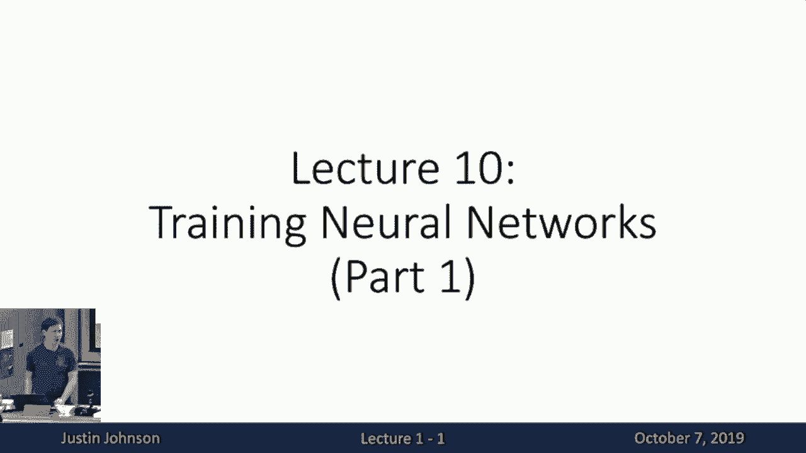

actually go about training neural，networks in practice so last time we。

left off we talked about the hardware。

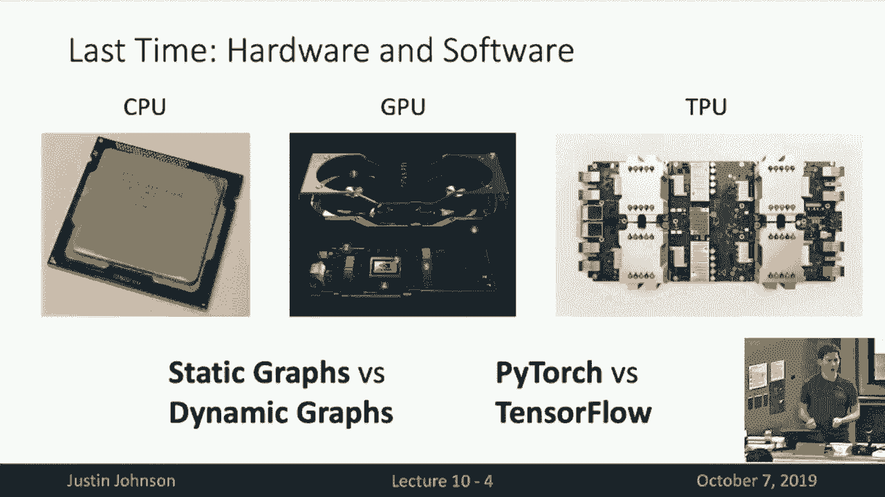

and software of deep learning and we，talked about different types of hardware。

that you run these things on like CPUs，and GPUs and TP use and we also talked。

about different software systems that，you can use for implementing these these。

networks in particular we talked about，stat the difference between static。

graphs and dynamic computational graphs，and we talked about some of the。

trade-offs of both pi torch and tensor，flow so now at this point we've pretty。

much seen all of the stuff that you need，to know to train neural networks but it。

turns out there's still a lot of little，bits and pieces that you need to。

actually be super effective and your，ability to train networks so I like to。

try to break this up into I mean this is，kind of like a bunch of potpourri that。

you need to know in order to be good at，training neural networks and I'd like to。

break this up into maybe three different，categories of things that you need to。

know about one is the one-time setup at，the beginning when you're before you。

start the training process that's where，you need to choose the architecture the。

activation functions you need to do a，lot of stuff before you will go and hit。

that train button and then once you，begin training there are certain things。

that you might need to do during the，process of optimization like schedule。

your learning rates or scale up too many，machines or things like that。

and then after you're done training you，might need to do some extra stuff on top。

of your Train networks like model，ensemble or chance for learning and over。

the course of today's lecture and，Wednesday's lecture we're going to walk。

through a lot of these little sort of，little nitty-gritty details about how。

you actually go about training neural，networks in practice so today let's。

start off by talking about activation，functions you'll recall that in our。

little model of an artificial neuron we，always have to have an activation。

function that we always have are some，kind of linear function coming in that。

color that collects the inputs from the，neurons in the previous layer and then。

those get summed and those gets，multiplied by your weight matrix and。

summed and then pass through some kind，of nonlinear activation function before。

they've being passed on to the next，layer and as we recall the having some。

nonlinear activation function in our，Network's was absolutely critical for。

their processing ability because if we，remove the activation function then all。

of our linear operations just collapse，onto a single linear layer so the。

presence of an of one of these，activation functions recall was。

absolutely critical in the construction，of our neural networks and we saw that。

there's this big zoo of activation，functions but we kind of left off we。

didn't really talk much about these，different types of activation functions。

and their trade-offs when we last saw，this slide so today I want to talk in。

more detail about some of the pros and，cons of these different activation。

functions and other considerations that，go into choosing or constructing。

activation functions for neural networks，so probably one of the most classic。

activation functions that have been used，in neural network research going back。

several decades is the sigmoid，activation function sigmoid because it。

has the sort of S curved shape this is，this was a popular activation function。

because one it has this interpretation，as a probability so you can one way that。

you might think about neural networks is，that at each of the neurons it's either。

on or off and maybe we want to have some，real some value between zero and one。

there represents the probability of that，feature being present so the sigmoid。

activation function has this nice，interpretation as the probability for。

the presence or absence of a boolean，variable it also had this it also has。

this interpretation as the firing rates，of a neuron if you recall these。

biological neurons they received signals，from other incoming neurons and then。

fire off signals at some rate but the，rate at which they fired off was non。

linearly dependent on the total rates of，all the inputs coming in and the sigmoid。

function is a simple way to model that，kind of nonlinear dependence on firing。

rates but so these are a couple reasons，why classically the sigmoid。

non-linearity had been very popular but，there are several reasons why it's。

actually not such a great non-linearity，in practice one problem is that it has。

these flat regimes at the beginning at，the end these saturated regimes with。

zero gradient and these kill the，gradient effectively and make it very。

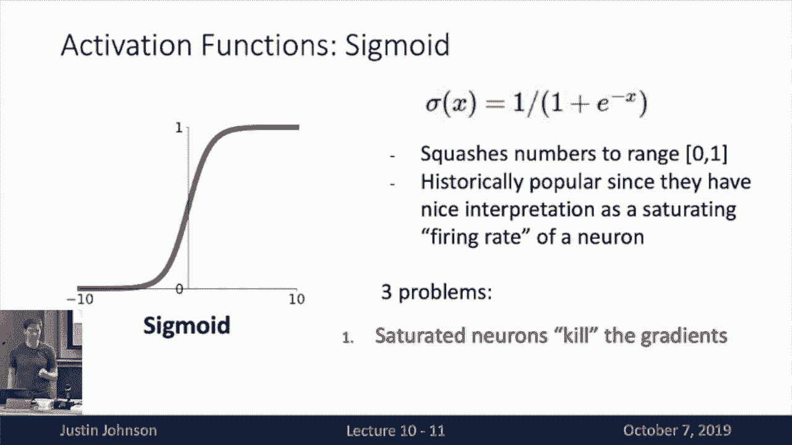

difficult to train networks in a very，robust way so to think about this what，happens。

sigmoid function when X is maybe very，very small like minus 10 or minus 100。

well in that case with us it will be in，this far left regime of the sigmoid。

non-linearity so the local gradient will，be very very close to zero and then that。

means that all of our weight updates，will also be very very close to zero。

because of the local gradient to zero，then it's just going to remember we're。

gonna take our upstream gradients，multiply that by the local gradients。

that's going to produce these downstream，gradients and at that local gradient。

this effect is a value very very close，to zero that means that no matter what。

the upstream gradients were the，downstream gradients will also be values。

that are very very close to zero this，will have the effect of making learning。

very slow because now all of the weight，updates onto our weight matrices all of。

all the gradients with of the loss with，respect to our weight matrices will be。

very low and it will also give very，problematic training dynamics once we。

move to deep networks suppose that we've，got a network that's maybe a hundred。

layers deep and then are we immediately，kill the gradient at some layer and then。

we'll basically have no signal to train，gradients at any of the lower layers and。

this problem happens both when X is very，very small like minus ten as well as。

very very large like plus ten but we're，the only regime so kind of when you have。

a sigmoid if X gets too big or too small，then it's if learning kind of dies for。

that layer and the only way in which，learning can proceed is if somehow the。

activation is somewhere within this，sweet spot near x equals 0 where anyway。

the rate of the sigmoid function behaved。

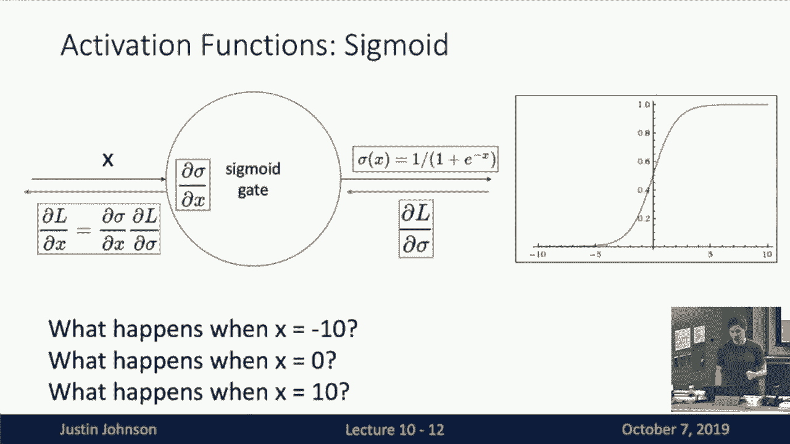

behaves somewhat linearly so that's the，first major problem with the sigmoid。

activation function is that these flat，regimes are going to kill the gradient。

and make learning very challenging a，second problem with the sigmoid。

non-linearity is that its outputs are，not zero censored you can because。

clearly the outputs for the sigmoid are，all positive right because it's all。

above the why the x axis and to think，about why this property of not having。

zero centered outputs is problematic，let's consider what happens when the。

inputs one of our neurons is always，positive remember here's our little。

diagram of one neuron inside our neural，network and we're zooming in on just one，of these things so。

now suppose that the input so suppose，we're building a multi-layer neural。

network where at every layer we use a，sigmoid non-linearity that means that。

the inputs to this layer the excise will，also be the result of applying a sigmoid。

function to the previous layer which，means in particular that all of the。

inputs X I to this layer will all be，positive now what can we say about the。

grate now given the fact that all of the，X eyes that are inputs to this layer are。

going to be positive then what can we，say about the gradient of the loss with。

respect to the W is that they'll so，remember that in order to compute the。

gradient of the W I of the loss with，respect to the W I will take the local。

gradient and multiply by the upstream，gradient now the local gradient is。

always going to be positive because the，local gradient of W I is just going to。

be X I and X I is positive which means，that the local gradients will all be。

positive but then we multiply this by，the upstream gradient which could be。

positive or negative but the upstream，gradient is just a scalar and if the。

upstream gradient is positive that means，that all of the gradients of loss with。

respect to W I will all be positive and，similarly if the upstream gradient is。

negative that means that all of the，gradients or the loss with respect to WI。

will be negative so what that means is，that all of the gradients with respect。

to WI are going to have the same sign，and this seems like this is kind of a。

this seems like kind of a bad property，for learning so for example suppose that。

that this means that it could be very，difficult to make gradient descent steps。

that reach certain values of the weights，that we might want to because of this。

constraint that the gradients are all，going to be positive or all going to be。

negative as kind of a pictorial example，of why this might be a problem。

suppose that we can we can have this，kind of cartoon picture on the right so。

here where this this picture is maybe a，plot of W 1 and W 2 and we imagine that。

our initial value for the weights W is，the origin and maybe the value of the。

weights that we want to get to in order，to minimize the loss is somewhere down。

to the bottom to the bottom right now in，order to move in order to traverse from。

the origin to the bottom right we need，to take some steps where we're going to。

take part we want to take positive steps，along double，one and negative steps along w-2 but。

with this constraint that the gradients，with respect the gradient of the loss。

with respect to the weights are always，going to have the same sign there's no。

way that we can take steps that aligned，in that quadrant so the only possible。

way for a gradient descent procedure to，make progress toward that direction is。

to have this very awkward zigzagging，pattern where it kind of moves up where。

all the gradients are positive and then，moves back down to the left where all。

the gradients are negative and then，moves up again and that's kind of a very。

awkward zig zaggy pattern so that makes，that that's kind of gives and by the way。

this maybe doesn't look so bad in two，dimensions but as we scale to weights。

with thousands or millions of dimensions，this property is going to be very very。

very bad because now if we have a weight，matrix with D dimensions then if you。

partition up all of the possible signs，of all of the elements of that weight。

matrix there's going to be two ^ d sort，of quadrant higher dimensional quadrants。

or orphans in that a high dimensional，weight space and under this constraint。

that they all have to be positive or，negative that means that any of our。

updates directions can only move in one，in two of those possible two to the D or。

fence high dimensional or fence so maybe，so even though this problem looks bad in。

two dimensions it gets literally，exponentially worse as we move to weight。

matrices of higher and higher and higher，dimension so that seems like a bad。

property of this sigmoid non-linearity，that the fact that it's not zero。

centered and the fact in particular that，its outputs are always positive leads to。

these very unstable and potentially，awkward dynamics during training I。

should point out though that that this，whole analysis about the gradients with。

the gradients on the weights being all，positive or all negative only applies to。

a single example however in practice，we'll often perform mini-batch gradient。

descent and once we take an average over，multiple elements in a mini batch then。

this we kind of relax this constraint so，even though for a single example in the。

mini batch we would end up with，gradients that are all positive or all。

negative on each layer when we consider，the gradients worth with respect to a，this。

less of a problem because you could，imagine that maybe even though the。

gradients with respect to each elements，are all positive or all negative when。

you average them out and sum them out，over the mini-batch then you could end。

up with gradients for the mini-batch，that are sometimes positive and。

sometimes negative so I think this is a，problem this is maybe less of a problem。

in practice than some of the other。

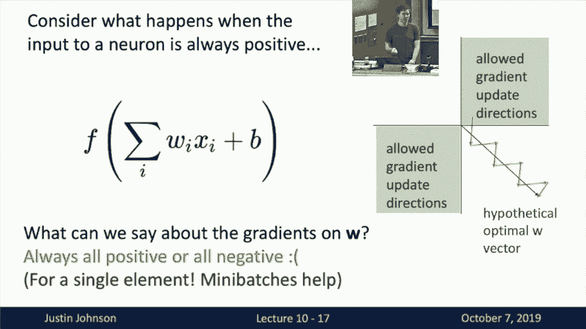

concerns around the sigmoid，non-linearity but it is something to。

keep in mind nevertheless so this get，that that was our second problem with。

the sigmoid non-linearity is the fact，that its outputs are not zero centered。

and now a third problem with the sigmoid，non-linearity is this extra function so。

I don't know if you know how these，mathematical functions get implemented。

on CPUs but something like the，exponential function is fairly expensive。

because it's it's a complicated，transcendental function so it can，actually take many clock cycles to。

compute an exponential function and when，I timed this what I did I did some small。

experiment on this on my macbook CPU the，other day and if I want to do know if I。

want to compare a sigmoid non-linearity，versus a Rayleigh non-linearity for a。

single tenth sort of a million elements，then on my Mac on this macbook CPU the。

REA loop ends up being about three times，faster than the sigmoid because the REA。

Lu just involves a sink a simple，threshold whereas the sigmoid needs to。

compute this kind very expensive，exponential function now I should also。

point out that of these three this this，third problem of exponential being。

expensive to compute is mostly a problem，for for mobile devices and for CPU。

devices for GPUs this ends up being less，of a concern because for GPU devices the。

cost of simply moving the data around in，memory between the global memory and the。

compute elements of the GPU ends up，taking more time for these。

nonlinearities than actually computing，the non-linearity so in practice if you。

try to time these different，nonlinearities on a GPU then you'll find。

that they often all come out to be about，the same speed so you really need to。

move to some kind of CPU device in order，to see speed differences between these。

different nonlinearities so that gives，us these three problems with the sigmoid。

function and of these three problems I，really think number one is the most。

problematic these number two and number，three are，that you should be concerned about or。

should be aware of but it's really I，think really this this saturation。

killing the gradient is the really the，most problematic aspect of the sigmoid。

non-linearity so then we can move on，from sigmoid and we can look at another。

popular non-linearity that people，sometimes use is the tan H non-linearity。

now tan age is basically just a scaled，and shifted version of sigmoid if you go。

and look up the definitions on paper，it's a definite the definitions of。

sigmoid and 1010 H in terms of，exponential functions you can do a bit。

of algebra and just show that a cat can，age is literally just a shifted and。

rescaled sigmoid so it inherits all many，of the same problems as the sigmoid。

non-linearity right it's still saturates，for very very large and very small。

values so it still results in count in，difficult learning if we're in those。

cases but it but unlike the sigmoid it，is zero centered so if for some reason。

you have the urge to use the saturating，non-linearity in your neural networks。

then I think tan H is a slightly better，choice than sigmoid but really it's。

still a pretty bad choice due to these，saturating regimes so now the the next。

non-linearity is our good friend or the，Ray Lu the rectified linear activation。

and this one is very nice I think we're，very familiar with this one by now it's。

very cheap to compute because it only，involves a simple threshold so you can。

imagine like for a binary implementation，all we have to do is check the sign bit。

of the floating-point number if it's，negative we set it to zero and if it's。

positive we leave it alone，so Ray Lu is like the cheapest possible。

nonlinear function you can imagine，implementing that it's very very fast。

can typically don't be done in one clock，cycle on most things it's does not。

saturate in the positive regime so as，long as our inputs are positive then we。

never have to worry about this，saturation problem of killing our。

gradients and in practice it could come，when you come when you try to train the。

same network architecture with a sigmoid，versus at an H versus array Lu it's very。

often to find that the Ray louver jeune，converges much much faster up to six。

times as reported by Alex net and when，you go to very deep networks like 50。

hundred layers then it can be very，challenging to get sigmoid networks to，like。

normalization so there are some problems，with Ray Lu one of course is that it's。

not zero centered so just like the，sigmoid non-linearity which we saw has。

all of its outputs always positive the，same applies to the Ray Lou，so the rate Lu clearly all of its。

outputs are also non-negative so that，means that Ray Lu suffers from the same。

problem of gradients being all positive，or gradients being all negative as the。

sigmoid but since we know in practice，that Rayleigh networks can be trained。

without much difficulty that suggests，that this actual nonzero centering。

problem was maybe less of a concern than，the other problems that we saw with the。

sigmoid function so the big problem with，Ray lieu of course is what happens when。

X is less than zero well here the，gradient is exactly zero so if you。

imagine what happens for training this，rayleigh function when X is very very。

large like plus ten then the local，gradient will be one and trained and。

learning will proceed just fine when the，gradient when X is very very small like。

minus 10 then the gradient will be，identically zero which means that our。

local gradient is exactly zero which，means that our downstream gradients are。

also exactly zero now this is somehow，even worse than a sigmoid because with a。

sigmoid in the very small regime we，weren't exactly zero we were just very。

very small so even if our gradients were，very very small we still had some。

potential hope that maybe learning could，proceed but with a ray Liu。

once our gradients are once are act once，our values are less than zero then all。

of our gradients are identically zero，and learning cannot proceed our。

gradients will be completely zero it，will be completely dead。

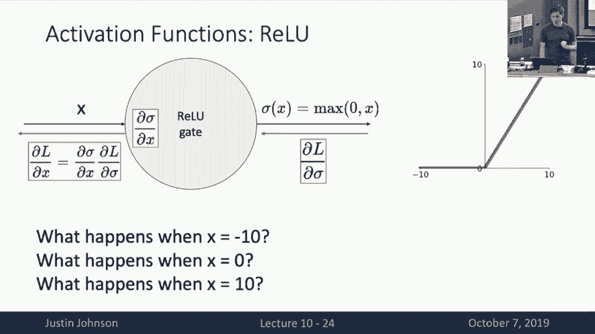

so then this leads to this potential，problem that people worry about。

sometimes called a dead ray Lu so the，idea here is that suppose in one of our。

Ray lute nonlinearities the weights of，that layer get totally large get very。

large and magnitude such that the neuron，in that layer has a negative activation。

for every data point in our training set，well in that case it means that the Ray。

Lu the the the weights corresponding to，that unit will always have gradients。

identically equal to zero as we iterate，over the training set and that that way，sometimes。

/ - as a dead rail Oh because it never，cat has the potential to learn once the。

rail ooh kind of gets knocked off this，data cloud of your training examples。

then all of the future updates it will，ever receive are going to be zero and it。

will be stuck off in limbo hanging，outside your data cloud for the rest of。

eternity no matter how long you train so，that seems like a problem in contrast we。

want our we need our Rea lose to always，somehow stay intersecting with some part。

of the data cloud those are active Rea，lose and they will receive gradients and。

they will train even if the permit and I，should point out this problem only。

occurs if your neuron if your activation，value is negative for your entire。

training set as long as there's some，element of your training set where you。

receive a positive activation then that，weight has the potential to get some。

gradient and has the potential to learn，so one trick that I've seen people。

sometimes do maybe I think it's less，popular now what but to avoid this。

potential problem of dead ray lose one，trick you might second you might think。

of is to actually initialize the biases，of layers that use Ray Lu to actually。

have a slightly positive value that，means that that gives you the that makes。

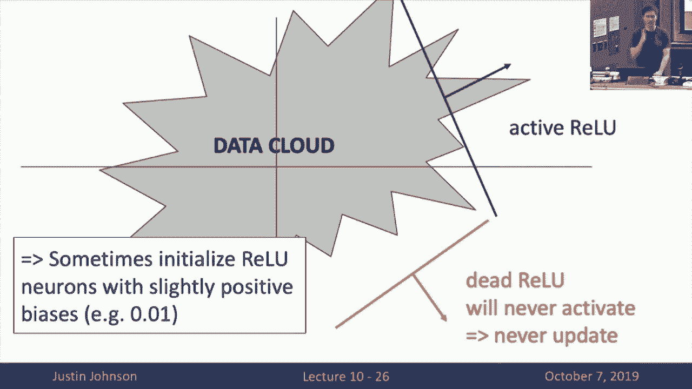

it harder to lie to fall into this，negative regime and harder to find。

harder to have dead raters we saw that，one problem with the Rayleigh。

non-linearity is the fact that it's not，like the two big problems with Ray Lu。

are that it's not zero centered and that，it has zero gradient in the in the。

negative regime so there was an，alternative proposed called the leaky。

ray Lu that solves both of these，problems leaky Ray Lu is very simple it。

looks just like Ray Lu except we're so，in the positive regime it computes the。

identity function and when the input is，negative then we're going to we're going。

to multiply it by a small positive，constant so rather than being。

identically zero then in the negative，regime the leaky Ray Lu is instead has a。

small positive slope and what this kind，of you can kind of imagine this as a ray。

loo that is not exactly 0 it kind of，like leaks out some of its information。

but just a little bit in the negative，regime and now this 0。01 this slope of。

the leaky Ray Lu in the negative regime，is a hyper parameter that you need to。

tune for your networks now the advantage，of a leaky rail ooh is that like the。

it does not saturate in the positive，regime it's still computationally。

efficient because it only takes a couple，instructions to execute and unlike the。

Ray Lu or the sigmoid it doesn't ever，die the gradient never actually build。

because our local gradients will never，actually be zero in the negative regime。

our local gradient will just be this，zero point zero one or whatever ever。

whatever other value for that high，program etre we could chosen what this。

means is that these lake these leaky Rea，lose and in fact don't suffer from this。

dying Ray Lu problem instead in the，negative regime they'll just receive。

smaller gradients and have the potential，to keep learning but now an annoyance。

with this leaky ray Lou is this 0。01，this kind of leaky hyper hyper parameter。

value that we need to set and as you've，probably experienced when trying to -。

and even Lin linear classifiers on us on，the first couple assignments the more。

hyper parameters you need to search over，the more pain and frustration you have。

when trying to train your models，so clearly whenever you see a hyper。

parameter your one instinct you should，have is that maybe we should try to。

learn that value instead so indeed this，is the exact idea behind the parametric。

the the parametric renew or Prelude，where now it looks just like the leaky。

ray Lu except this the slope in the，negative regime is now a learn about。

perimeter of the network which now this，is kind of a funny thing because now。

this parametric really with this prelude，is actually a non-linearity that itself。

has learn about parameters but we can，imagine computing that just fine then。

there in the backwards pass we'll just，back propagate our we'll just back。

propagate into this value of alpha，compute derivative of loss with respect。

to alpha and then also make gradient，sistah gradient descent steps on alpha。

and this alpha might be a single，constant for each layer or maybe this。

alpha could be a separate value for each，element of your for each channel in your。

convolution or each output element in，your fully connected layer so that's。

that's fine you'll see people work on，you'll see people use that sometimes but。

one problem you might have with any of，these rayleigh functions is that they。

actually have a kink at zero right，they're actually not differentiable。

there at all you might ask what happens，is zero well it actually doesn't matter。

what happens at zero because it does，happened very often so you can pretty。

much choose whatever you want to have it，happen to zero and it's probably going。

to be fine but in practice usually you。

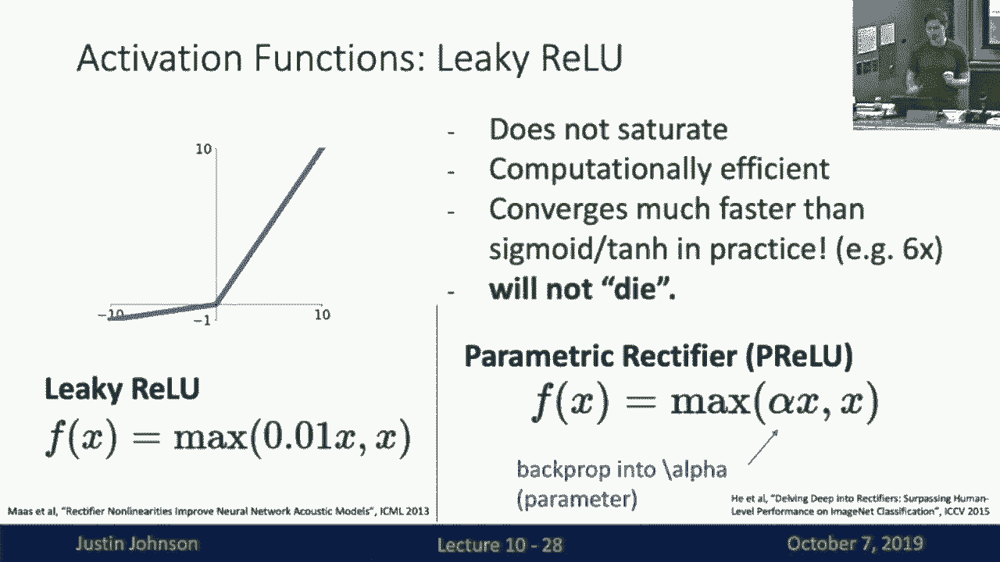

just pick one side with the other but，one kind of slightly more slightly more。

slightly more theoretically grounded，non-linearity that you'll see sometimes。

is the exponential linear unit and this，attempts to fix some of the problems of。

Ray Lu that it's basically like a ray Lu，but it's smooth and it has its it tends。

to be more zero centered so we you can，see the mathematical definition of the。

exponential linear unit here at the，bottom of the slide in the positive。

regime it just computes the identity，function just right just just like Ray。

Lu but in the negative regime it，computes this exponential value instead。

so on the left hand side it kind of，looks a little bit like the tail end of。

a sigmoid and in fact we also see that，it asymptotes to some two minus one or。

two some negative two some nonzero，negative value as we go to the left this。

is to avoid this problem of zero，gradients that we might have feelings。

concerned about with the normal radio so，if this was designed to kind of fix some。

of these problems with really the exact，it right that now because the negative。

regime actually is non zero then you can，imagine that the this this this。

non-linearity you might actually have，zero centered outputs and there's some。

math in the paper to support that，conclusion there's the problem here is。

that the computation still requires this，exponential function which is maybe not。

so good and it also has this additional，hyper parameter alpha that we mike that。

we need to set although I guess you，could try to learn alpha as well and。

come up with a parametric exponential，linear unit or pretty Lou but I've never。

actually seen anyone do that in practice，but maybe you could try it I write a。

paper who knows there's enough there's a，you know it doesn't stop there so there，was another paper。

there's people love to propose very I，mean I think you should get that we get。

this idea right now that this，non-linearity is kind of this small。

modular piece of a neural network that，you can take out to find new things and。

run controlled experiments so it's very，appealing for a lot of people to try to。

modify a neural networks by coming up，with new nonlinearities so you'll。

actually see a lot of papers that try to，come up with slight variance on them。

and try to argue for why their ideas are，slightly better than anyone became。

before so as a result there's a lot of，these things out there that you can find。

one that's kind of fun is the sailu or，scaled exponential linear unit this one。

is fun because it's just a rescale，version of a Luo that we just saw on the。

previous slide the only difference is，that we set alpha equal to this very。

long seemingly arbitrary constant and we，set lambda equal to this very long。

seemingly arbitrary constant and the，reason that we might want to do this is。

that this if you choose alpha and lambda，in this very particular way than a very。

deep neural network with this solute，non-linearity has a kind of self。

normalizing property that as you as your，layer depth goes to infinity then the。

statistics of your activations will be，well-behaved and even converged to some。

finite value as the depth of your，network goes Trent trends toward。

infinity and what this means is that if，you have very very deep Network very。

very deep networks with say looat，nominee era T's then sometimes people。

can get these things to Train very very，deep networks even without using batch。

normalization or other normalization，techniques now unfortunately in order to。

understand exactly why this is true you，have to work through 91 pages of math in。

the appendix of this paper so if you if，you have a lot of patience you can go。

through this and figure out exactly why，we set the values of these constants to。

those particular values but I think，that's a little kind of fun but I think。

the bigger takeaway around a lot of，these nonlinearities is that in practice。

they really don't vary too much in their。

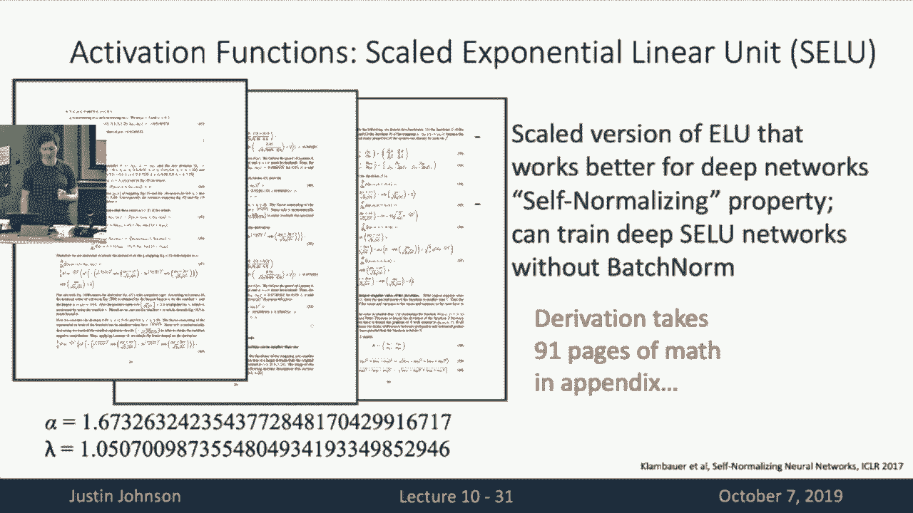

performance so here's a plot from a，paper from another paper that was，another of these papers about。

nonlinearities that actually compared，the effects of different nonlinearities。

on different network architectures on，all on the CFR 10 dataset and what's you。

what's if you look at this plot you see，that some of the bars are higher than。

some of the other bars but the most，important thing to take away from this。

plot is really just how close all of，these things are something like Ray Lu。

on ResNet is giving us 93。8 leaky Ray Lu，is 94 point to soft Plus as a different。

one is 94 point six so basically all of，these things are，within a percent of each other in final。

accuracy on CFR 10 so and the trends，here are just not consistent so if we。

look at a resonate then something called，a Galu or a swish non-linearity is gonna。

slightly outperform a rail ooh but if we，look at a dense net then rail ooh is。

slightly better or equal to anything，else，so the real takeaway I think for。

nonlinearities is just like don't stress，out about it too much because usually。

the your choice of non-linearity as long，as you don't make a stupid choice and。

choose sigmoid or 10h if you use any of，these more reasonable more modern。

nonlinearities your network is going to，work just fine and maybe for your。

particular problem you might see a，variance of maybe one or two percent on。

your final accuracy depending on which，non-linearity you use but that's going。

to be very dependent on your data set on。

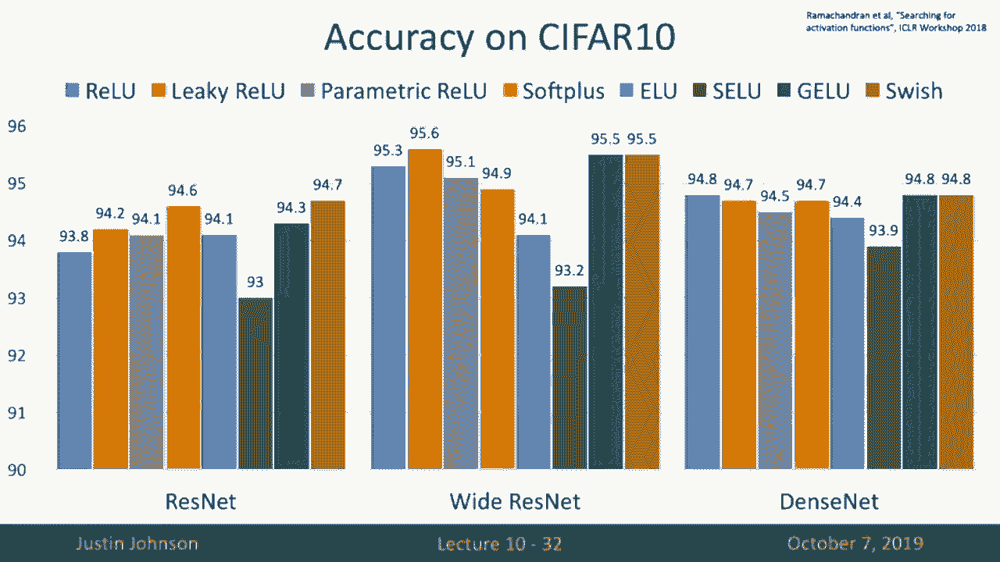

your model architecture and on all your，other hyper parameter choices so my。

advice is just don't stress out too much，about activation functions just in。

basically don't think too hard just use，rail ooh it'll work just fine and it'll。

probably it'll probably work now if，you're in some situation where you。

really really must squeeze out that one，last percentage point or that last half。

a percentage point or a tenth of a，percentage point of performance then I。

think is the time when you should，consider swapping out and experimenting。

with these different nonlinearities so，in that case something like a leaky rail。

ooh or in a loo or a sail ooh or a gale，ooh or whatever other thing you can。

think of that rhymes with a loo is，probably a reasonable choice to try but。

don't expect really too much too much，from it and basically don't use sigmoid。

or tan h those are terrible ideas your，network will not converge and just don't。

use those so that's kind of my my，executive summary on activation。

functions any questions on activation，functions before we move on yeah yeah。

the question was what all of these，activation functions are monotonic they。

increase well and why don't we use，something like sine or cosine well I。

actually lied to a little bit there's，this gallu non-linearity function that I。

didn't talk about that is actually non，monotonic but the reason is that if your，activation。

function is non-monotonic is something，like sine or cosine um if it increases。

and then decreases then there exist，multiple values of X that have the same。

Y and that can be problematic for，learning because that kind of destroys。

information in some way so if your，activation function is not invertible。

that means that it's destroying，information and we'd prefer and the。

reason we wanted activation functions in，the first place was not so much to。

perform useful computation it was more，just to add some non-linearity into the。

system to allow it to represent，non-linear nonlinear functions I have。

seen people try to show off and train，with sine or cosine or something if you。

use batch normalization and are very，careful I think you could probably get。

that to Train but I would not recommend，it，but I think that's that's a very astute。

observation and actually the the Galen，on the non-linearity is a slight。

slightly interesting one but to check，out so I think you should read that。

paper if you're interested but there the，idea is that they actually interpret the。

non monotonicity of the right of the，activation function as actually a bit of。

regularization and they view that as the，expectation they kind of combine it with。

something like drop out which we'll talk，about later and then show that if you。

take this expectation combined with some，stochastic not some stochastic stuff。

that is sort of equivalent in some rough，expectation way to a non monotonic。

activation function but in general，they're not very widely used and most。

activation functions you'll see in，practice are indeed monotonic or any of。

any other questions on activation，functions great just use Ray Lu so then。

the next thing we need to talk about is，data pre-processing and this is。

something that you've been doing already，in all the notebooks if you've been。

reading through maybe the starter code，and the data loading code and actually。

looked at the parts outside the code，where we asked you to write code which。

then you will have seen that you've been，already doing this thing called data。

pre-processing at the beginning of all，of your homework assignments already so。

what's the idea with that well basically，the idea is that we want to before we。

feed our data into the neural network we，want to perform some pre-processing on。

it to make it more amenable to efficient，training so the very cut so as kind of a，cartoon。

here you can imagine your data your data，cloud of your training set shown here in。

red on the Left where the X and the y，values are maybe two features of your。

maybe your one two features of your data，set so like maybe the red the red value。

of one pixel and the blue value of，another pixel if you're looking at。

images and the idea is that your，original data is going to be this data。

cloud which could be which could be very，long and skinny and shifted very far。

away from the origin so in particular if，we're thinking about images then the way。

we natively store image data is usually，as pixel values between 0 and 255 so if。

so our data cloud for raw image data，would be kind of located very far away。

from the origin and now before we come，before we feed the data into the neural。

network we want to standardize it in，some way and pull it closer to pull it。

into the origin by subtracting the，overall mean of the training data set。

and then sum and then rescale each of，the features so that each feature has。

the same variance and we can do this by，dividing by the by the standard。

deviations of each feature computed on。

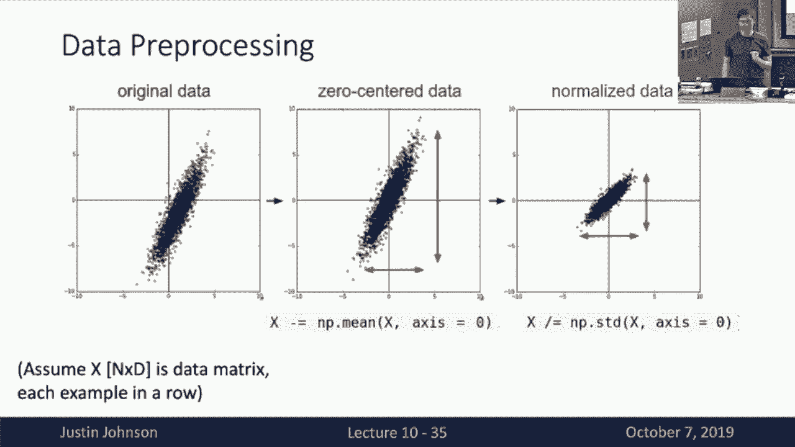

the training set and this is this this，idea of why we might want to perform。

pre-processing in this way also kind of，ties back to this discussion we had。

about this about the not about the zero，about the bias problem with sigmoid。

nonlinearities that recall if all of the，inputs are going to be positive then all。

of our gradient directions are going to，always be positive or negative and if。

similarly by the same logic if all of，our training data is always positive。

then all of our weight updates will also，be constrained to have either one sign。

or another sign but for the but for，training data we can easily fix this。

problem by just rescaling everything。

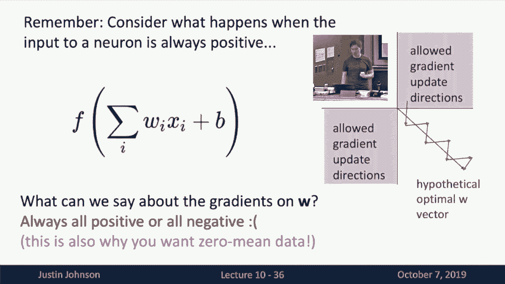

before we feed it into the neural，network so if for images it's very。

common to subtract the mean and divide，by the standard deviation but for other。

types of data you might see maybe non，image data you will sometimes see other。

types of pre-processing called D，correlation or whitening so here the，idea is that if we compute the。

covariance matrix of our data cloud of，the entire training set then we can use，that to rotate。

the data cloud such that the features，are uncorrelated and this would be the。

green this would be the the green data，cloud in the middle of the slide but now。

we've basically taken our input data，cloud and rotated it actually moved it。

to the centrum of to the origin and then，rotated it another thing you'll。

sometimes do is then have not not only，have unit mean 0 mean unit variance for。

each feature but actually perform this 0，mean unit variance fixing after D。

correlating the data and that would，correspond to this now stretching your。

data cloud out into this very，well-behaved circle at the center of the。

of the coordinate axis here on the right，shown in blue and if you're perfect if。

you perform both D correlation and this，normalization this is also this is often。

called whitening your input data so this，is sometimes pretty common to use if you。

have if you're working on non division，problems where maybe your inputs where。

your inputs are maybe specified as low，dimensional vectors in some way but for。

image data this is not so common another，way that you can think about why data。

pre-processing is helpful is to think，about what happens if we try to learn。

even a linear classifier on non，standardized data or non normalized data。

so here on the Left suppose that we have，this data cloud that is located very far。

from the origin and now we want to find，this linear classifier that is going to。

separate the blue class from the red，class now if our data cut now if we。

initialize our weight matrix with very，small random values as we've typically。

done then our we can expect that at，initialization the boundary the boundary。

that our linear classifier learns is，kind of near the origin and now if our。

data cloud is very very far away from，the origin then making very very small。

changes to the values of the weight，matrix will result in very drastic。

changes to the way that that decision，boundary cuts through the training data。

cloud and that can that means that kind，of intuitively if your data is not。

normalized then that leads to a more，sensitive optimization problem because。

very small changes in the weight matrix，can result in very large changes to the。

overall classification performance of，the system in contrast on the right if，before。

during training we had normalized our，data by moving it to the center now now。

our entire data cloud also is sitting，over the origin so we can expect this。

will result in a better conditioned，optimization problem yeah a question。

yeah the question is um do people ever，use other color spaces other than RGB I。

think people do use that sometimes in，practice I've seen that less for image。

classification I've sometimes seen that，for more image processing type tasks。

like super resolution or denoising and，there it's more common I think to feed。

raw inputs to the network as some other，color space but in practice I think it。

usually doesn't matter too much what，color space you use because in principle。

the equations for converting from one，color space into another color space are。

usually fairly compact simple equations，and you the network could kind of learn。

in the first couple of layers to perform，that kind of conversion implicitly。

within the first two layers or so if it，really wanted to so in practice you do。

see it sometimes see people feed input，data of different color spaces but in。

practice it usually is doesn't have，massive differences on the final results。

so then talking about a little bit more，concretely about what people actually do。

in practice for images there is a couple，things that are very common to do in。

images one is to is to compute the mean，image on the training set this for。

example was done in Alec's net where，they write if your if your training data。

set is something like n trained by 32 by，32 by 3 then if you average over the。

entire training data set then you get a，mean image of 32 by 32 by 3 and one。

thing you can do is just subtract that，mean image from all of your training。

samples another thing that's very common，is to subtract the per channel mean so。

you effectively compute the mean RGB，color across the entire training data。

set and then subtract only the mean，color from each pixel and this is the。

way that for example vgg was trained，another thing that's very common to do。

is to subtract the per channel mean and，the per channel standard deviation so。

that means we're going to compute the，mean RGB color over the tract entire。

training data set and we're going to，compute the standard deviation of the。

three colour channels over the training，data set and that gives us。

two three element vectors that we'll use，to subtract the mean and divide by the。

standard deviation and that's kind of，the standard pre-processing that's used。

for residual networks any any more，questions about data pre-processing yeah。

so the question is what do we do during，training and testing so whenever you're。

doing pre-processing you always compute，your statistics on the training set and。

the reason we do that is not necessarily，for computational efficiency it's。

because that's to simulate how we would，actually use the network out there in。

the wild because in the wild there is no，such thing as a training set there is。

just the real world upon which we want，to run this classifier and then there's。

no reasonable way that you could expect，to recompute those statistics all the。

time over whatever real-world data is，coming in so it's so to kind of simulate。

that process we will always compute our，statistics on the training set and then。

use the exact same normalization，statistics on the test set yeah so the。

question was if we're using batch，normalization do we still need to use。

data pre-processing I think so yeah this，is very intuitive you should think like。

what if I just put batch formalization，as the very first thing in my lower。

network before I do any convolution or，any fully connected layers or anything。

this is a very first thing I think，that'll actually work but I think it。

works a little bit less than a little，bit worse than actually doing this。

pre-processing explicitly so in practice，people will people still prefer to do。

this explicitly pre-processing and also，have batch normalizations okay so then。

the next thing we need to talk about is，weight initialization so whenever you。

start training your neural networks you，have to initialize your weights in some。

way so here's a question what happens if，we just initialize all of the weights to。

zero and all the biases to zero well，this is going to be very bad right。

because if all of the weights are zero，and all the biases are zero then you。

know assuming we have array Lu or some，other reasonable non-linearity then the。

out the outputs are all going to be zero，and the outputs will not depend on the。

inputs and even worse the gradients will，all be zero so we're like totally stuck。

so in practice we cannot initialize the，zero that's gonna be very bad and this。

problem of initializing to zero or more，generally of initializing to a constant。

is referred to sometimes as not having，have any，to distinguish among different elements。

in the training set or even among，different neurons in the network so if。

you have these constant initializations，that in a very common failure mode is。

that we'll compute the same gradient for，all of the training examples and the。

network doesn't it's not actually able，to learn in any way so in practice what。

we've got what we've always done instead，is just kind of hand wave and say let's。

initialize with small random numbers and，this is what you've mostly done on your。

homework assignments so far so for，example we could initialize with。

Gaussian with zero mean from a Gaussian，and maybe set the standard deviation as。

a hyper parameter and this is kind of，what you've done on your homework。

assignments so far but let's dig into，this a little bit more because it turns。

out that this strategy of initializing，with small random Gaussian values works。

fairly reasonably ok for shallow，networks but it's going to be not worked。

so well once you move to deeper and，deeper networks so to see why let's。

think about activation statistics and，how they propagate as we move forward。

through a deep network so here this，little snippet of code is computing the。

four paths for a six layer neural，network with hidden for a fully。

connected Network with hidden dimension，4096 and we're using at an age now。

non-linearity because we're not，following the advice I told you a couple。

slides ago and then what we're gonna do，is just plot the statistics of the。

hidden unit values at each of the six，layers in this deep network and here you。

can see that in now here each of these，plots is showing a histogram for the。

activation values for the six layers of，this deep neural network and what we can。

see is that for the first layer after a，single weight matrix anon and tannish。

non-linearity we get kind of a，reasonable distribution of values for。

the network but as we move deeper and，deeper into the network we see that the。

activations the the activations all，collapse towards zero and now this could。

be this is going to be very very bad for，learning because think about what this。

means for the gradients so in particular，if all of the activations are zero。

that's going to mean that all of the，gradients are also approximately going。

to be zero because remember whenever we，compute the local gradient on the。

weights the local gradient on the weight，is going to be equal to the activation，at the preview。

lare if you remember that equation from，a few slides back so what that means is。

that for this very thief network when，the activations collapse to zero then。

the gradient updates will also all be，very close to zero and the network will。

not learn very effectively okay maybe so，then maybe maybe this prop so kind of。

our problem here maybe is that this，weight initialization was maybe too。

small so instead of initializing with，0。01 standard deviation we could instead。

try changing that to initialize from，0。05 standard deviation instead because。

maybe the problem was that all of our，weights got too small because maybe our。

weight our weight values were just too，small now it turns out this is also。

really really bad and now if our weight，matrices are too big then all of our。

activations are going to be pushed into，the saturating regime of 10h。

non-linearity so if we look at these，histogram values again when we。

initialize for this larger with this，with these larger weight matrices then。

we see that all the activations are in，these saturating regimes of the tannish。

non-linearity and again this means that，now the local gradients will again be 0。

and everything will be 0 and learning，will also not work so we saw with that。

when the we'll want to initialize the，weights to be too small then they all。

collapsed a zero and when we initialize，the weights to be too big then the。

activations all spread out to these，saturating regimes of the non-linearity。

so somehow we need to find a value for，this weight initialization that is。

somehow in this Goldilocks zone in，between too small and too large and it。

turns out that the Goldilocks，initialization for these networks one。

one definition is so this is called the，Xavier initialization after the first。

author of this paper cited at the bottom，so here rather than setting the standard。

deviation as a hyper parameter instead，we're going to set the standard。

deviation to be 1 over the the square，root of the input dimension of the layer。

and it turns out that if we make this，sort of very special Goldilocks regime。

for initializing our weights then we'll，get very very nicely scaled。

distributions activations no matter how，deep our network goes and I should also。

that this this derivation is showing you，for a fully connected network but for a。

convolutional network that DN will now，be the number of inputs to each neuron。

so that will now be the number of input，channels times the kernel size times the。

kernel size if you want to do this exact。

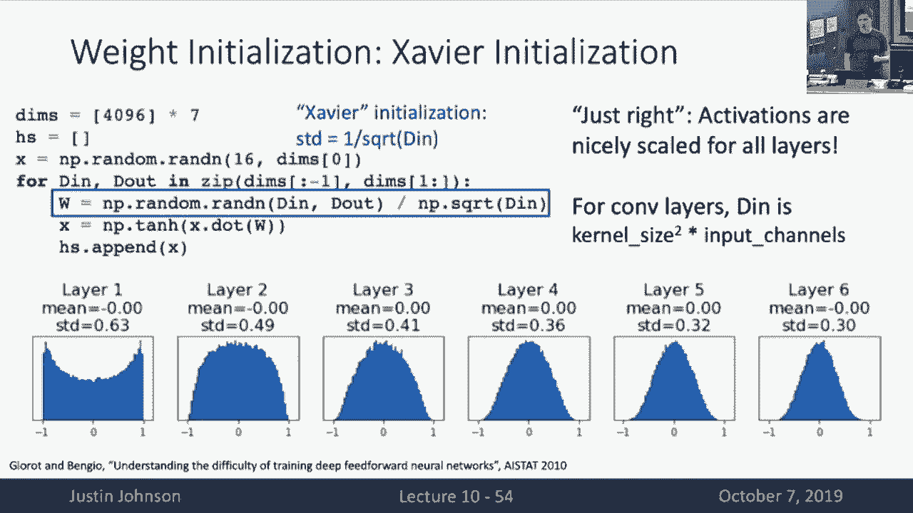

same thing for convolutional networks so，then to derive this Xavier。

initialization the trick is that we want，to have the variance of the output be。

equal to the variance of the input so，the way that we set this up is we。

imagine that this linear this linear，layer is going through you're going to。

compute y equals with matrix multiply of，make weight matrix W and input。

activation vector X so then each scalar，element of our next layer ignoring a。

bias will be this inner product between，one of the rows of W and the entire。

input vector X now if we you know if we，want to compute the variance of one of。

these outputs y I then if we make a，simplifying assumption that all of the。

X's and all the WS are independent and，identically distributed then we can use。

the properties of the variance to，simplify in this way and then we know。

that the variance of each one of the，elements of the output layer Y I will be。

equal to DN times the variance of X I，times WI and then we make a couple then。

we make a couple other simplifying，assumptions we assume that X and W are。

independent random variables and when，you take the variance of the product of。

two independent variables you look up on，Wikipedia what to do and you get a。

formula that looks something like this，then the next assumption is that we make。

another another simplifying assumption，that all of the inputs X are 0 mean。

which is may be reasonable if they're，coming out of a batch normalization。

layer and the previous layer and we also，assume that the WS are also going to be。

0 mean which is may be reasonable if we，assume that they were it may be。

initialized from some kind of Gaussian，distribution so then once we have all。

these assumptions we can see that if we，choose the the magical value of variance。

of standard deviation equal to 1 over，rather if if we set the variance of the。

w i's to be 1 over d n then we see that，the variance of Y I is going to be equal，to the variance of。

sigh so that bets that motivates this，derivation of the Xavier initialization。

it's this idea of trying to match，variances between the inputs of the。

layer and the outputs of the layer and，we see that if if we set the standard。

deviations in this very special way then，it won't work out but there's a problem。

what about rail ooh real ooh right this，this whole derivation not also hinges on。

the non-linearity and the reason I and，that's the reason why I actually use 10h。

in this experiment because this，derivation is only talking about the。

linear layer but that linear will be，followed by a non-linearity and for。

something like 10 H it's symmetric and，symmetric around zero so as long as are。

we match the variances of the linear。

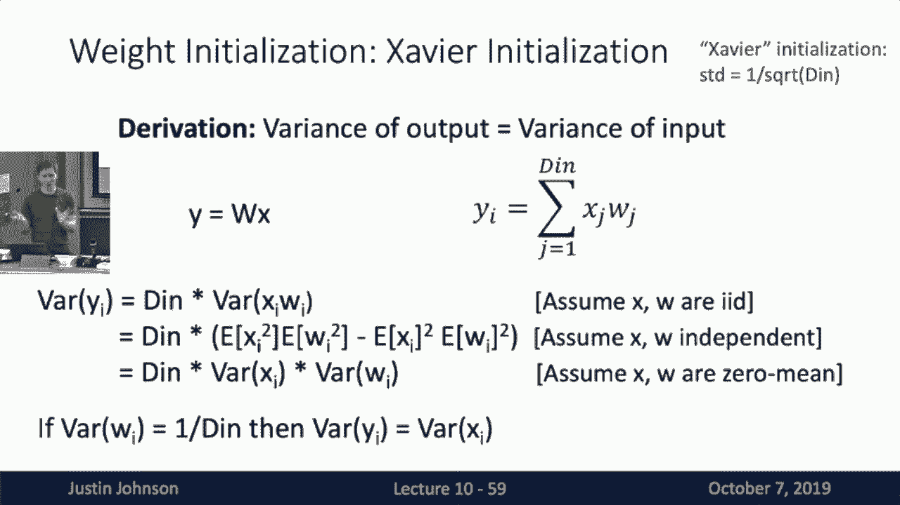

layer then things will generally be ok，as we move through this through this。

Center to non-linearity but for Rayleigh，with things would be very bad if we do。

this exact same initialization and now，use our deep network to be rail ooh。

instead of tan H then our activations to，statistics are again going totally out。

of whack here these histograms look a，little funny because there's a huge。

spike at zero because rail ooh kills，everything below zero but if you kind of。

zoom in on the non zero part of these，histograms you'll see that also for a。

deep network every all everything is，collapsing the algorithm the activations。

are all collapsing towards zero again，which will again give us zero local。

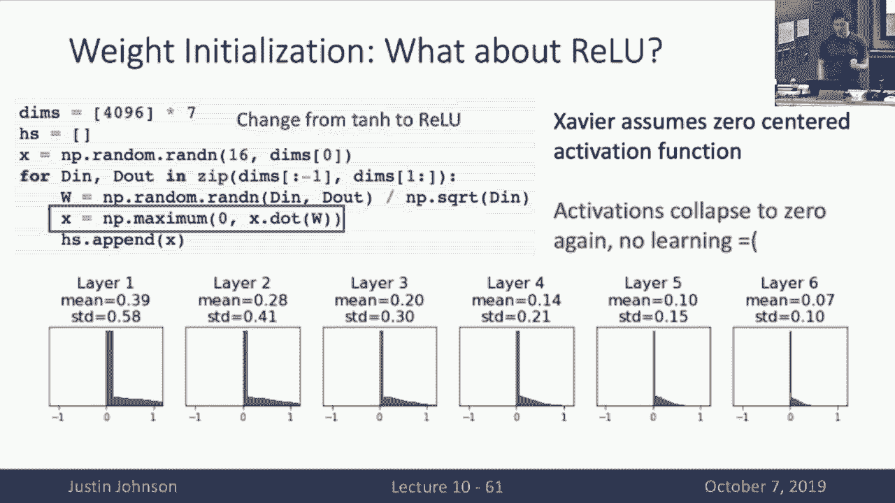

gradients and no learning so to fix this，we need to we need a slightly different。

initialization for for Rayleigh，nonlinearities and the fix is just to。

multiply our standard deviation by two，so now rather by square root 2 so for。

Xavier Xavier we have standard deviation，of square root 1 over D n now for a loop。

we have standard deviation 2 / DN and，intuitively that the factor of 2 is to。

deal with the fact that Ray Lu is，killing off half of the half of its。

inputs and setting them to 0 and this is，called a cunning initialization after。

the first author of the paper that，introduced it or sometimes MSR a。

initialization after Microsoft Research，Asia where he worked when writing this。

paper now this is so then when you're，initializing with really nonlinearities。

you need to use this MSR right，initialization for things too，work out well and it turns out that。

actually the remember a couple of，lectures ago we talked about vgg and。

that in 2014 there was no batch，normalization and people could not get。

the VG to converge without crazy tricks，well it turned out that actually once。

you have this timing wait initialization，scheme this is sufficient for getting。

vgg to train from scratch and actually，the the paper that introduced this their。

big claim to fame was that they got VG。

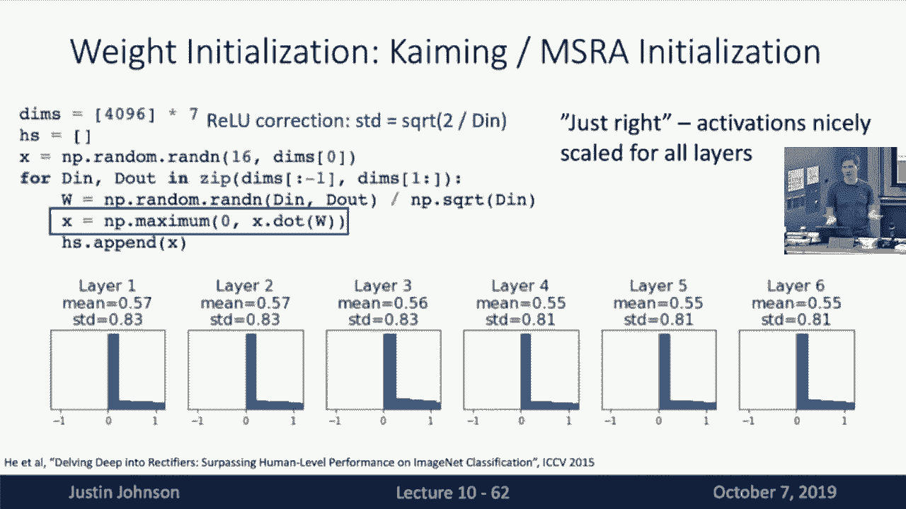

to train from scratch by simply changing，the initialization strategy but this but。

remember we've kind of moved on from bgg，now and we talked in the CNN。

architectures lecture that the kind of，standard baseline architecture you。

should only consider is a residual，network and it turns out that this MSR a。

or climbing initialization is not very，useful for residual networks and the way。

that we can see this is suppose we have，a residual Network and we've somehow。

constructed the act the initialization，of those internal convalesce such that。

the variance of the output matches the，variance of the input well if we if we。

wrap those layers with a residual，connection now that means that the。

variance of the output after the，residual connection will always be。

strictly greater because we're adding，the input again so that means that if we。

were to use this MSR a or Xavier，initialization with the residual Network。

then we would expect the variances of，our activations to grow and grow and。

grow and grow over many many layers of，bad，that would lead to explode ingredients。

and bad optimization dynamics again so，the solution for residual networks is。

fairly simple what we normally do for，residual networks is to initialize the。

although the first layer with your MSR a，initialization and then initialize the。

last layer of your residual block to be，zero because that means that admission。

at initialization this block will，compute the identity function and the。

variances will be again perfectly，preserved at initialization so that's。

the trick that that's the way that we，prefer to initialize residual networks。

and I'd also point out that this this，whole area of how to initialize your。

neural networks and the reasons that you，might prefer one initialization scheme。

over another is a super active area of，research and you can see papers even。

from this year that are giving new，just on the ways to initialize neural。

networks so are there any other，questions on initialization yeah。

that's not quite correct so that I so，yeah the idea was that oh maybe the idea。

with initialization is we just want to，be as close as possible to the global。

minimum of the loss function but before，we start training we don't know where。

that minimum is so instead the，perspective that we normally take on。

initialization is that we want to，initialize in such a way that all the。

gradients will be well behaved at，initialization and because if you choose。

maybe bad mountain air DS or bad，initialization schemes then you could。

end up with zero gradients or close to，zero gradients right off the bat at the。

beginning of training and then nothing，will train and you won't make any。

progress towards the goal the way I'd，like to think about it is that we want。

to initial so you imagine this like lost，landscape service that we're optimizing。

then we want to initialize in a place，where it's not flat so we preferred not。

to initialize in a local minima and，that's the main constraint that we want。

to take into account when constructing，initialization schemes so this is all。

about so so far we've talked about ways，for getting your model to Train we set。

up the activation function we set up the，initialization but then once you get。

your model to train you might if you've，done a really good job at optimizing it。

you might see it start to overfit and it，might start to perform better on the。

test set than it does on the training，set and this would be a bad thing so now。

it's overcome this we need some，strategies for regularization so we've。

already seen one simple scheme for，regularization which is to add another。

term to the loss function the very，common one that you've used on your。

assignments so far is l2 regularization，also sometimes called weight decay that。

just penalize --is the l2 norm of your，weight matrices this is very common and。

this is a very widely used regularizer，for deep neural networks as well but。

there's a whole other host of other，regularization schemes that people use。

in deep learning one of the most famous，is this idea called drop out so drop out。

is kind of a kind of a funny idea what，we're gonna say is that when we add drop。

out to a neural network we're going to，explicitly add some randomness to the。

way that the network processes the data，so in each forward pass we're going to。

randomly set some of the neurons in each，layer equal to zero so we're going to。

compute a layer a for pass，they're randomly set some of the neurons。

to zero and then compute another layer，now randomly set some of those to zero。

then compute another layer and so on and，so forth and in and then the probability。

of dropping into any individual neuron，is hyper parameter but a very common，choice would be 0。

5 but every any，individual neuron has probability 1/2 we。

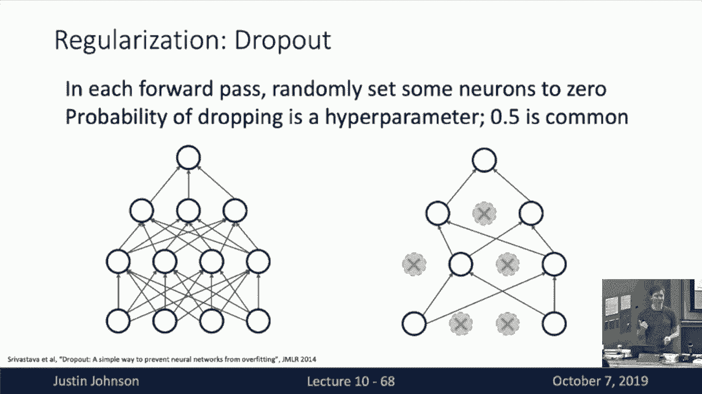

flip a coin，whether or not to keep it or throw it，away seems crazy right。

but it's very simple to implement right，this is implementing a two layer fully。

connected neural network with dropout，and you can see that the implementation。

is very simple we just compute this，binary mask after each layer and use。

that to kill off so half of the neurons，in each layer after we compute the。

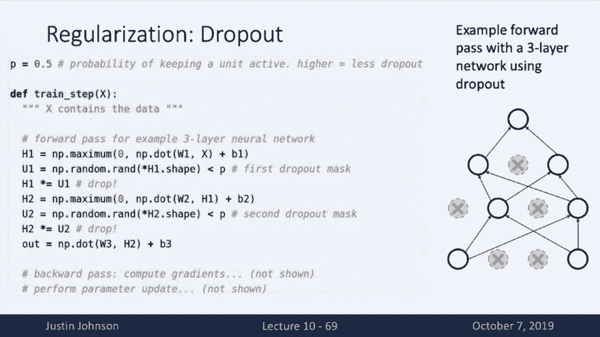

matrix multiply so then the question is，this，well one interpretation of what dropout。

is doing is that it prevents it forces，the network to have a kind of redundant。

representation another way this is，phrased is that we want to prevent the。

co-adaptation of features so we want to，encourage the network in some way to。

develop representations where different，slots in that vector represent maybe。

different robust ways of recognizing the，object so for example if we are building。

a cat classifier maybe maybe one maybe a，bad thing would be for each element of。

the vector to just learn independently，whether it's a cat but if we add，dropouts。

then maybe we want it to learn kind of，more robust representations maybe some。

neurons should learn about ears and some，should learn about furry and different。

neurons should maybe focus on different，high-level aspects of katniss such that。

if we randomly knock out half of these，neurons then it can still robustly。

recognize the cat in even if we mess，with its representation another。

interpretation of dropout is that it's，effectively training a large ensemble of。

neural networks that all share weights，because if you imagine this process of。

masking out half of the neurons in each，layer but we've affected what we've。

effectively done is built a new neural，network that is that is a somehow a sub。

Network of the original full network and，now at each forward pass we're going to。

train a separate sub Network of this，full network and then somehow we're。

going to have this very very large，exponentially large number of sub。

networks that all share weights and then，the full network will somehow be some，of sub。

networks that are all sharing weights so，these are both to kind of admittedly。

hand-waving explanations of what drop。

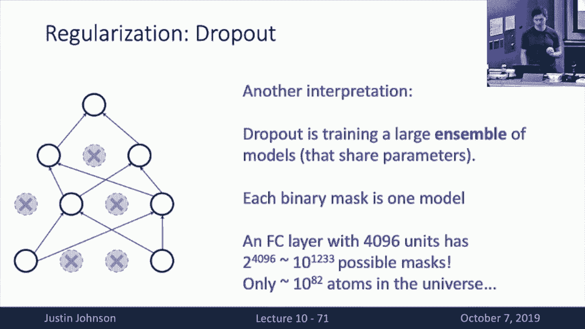

out might trip might be trying to do and，there's a whole host of theory papers。

that try to get more concrete，explanations for why this works but now。

a problem with dropout is that it makes，the test time operation of the neural。

network actually random right because we，were randomly knocking out half the。

neurons in each layer at each forward，pass and this seems bad because if。

you're deploying these networks in，practice you'd like their outputs to be。

deterministic you wouldn't want to，upload a photo to your your web hosting。

service one day and having recognized as，a cat and the next day the same photo is。

recognized as something else that would，be a bad property for your neural。

networks when they're deployed in，practice so a test time we want some way。

to make dropout deterministic and what，we really want to do is kind of average。

out this randomness because now once，we've rewritten those once we've built。

drop out into our neural network we can，imagine that we're rewriting our neural。

network to actually take two inputs one，is our actual input image X and the，other is this random。

mask z which is some random variable，that we are drawing before we run the。

forward pass the network and now the，output that our network computes is。

dependent both on the input data as well，as on this random variable so then in。

order to make the network deterministic，what we want to do is somehow average。

out the randomness a test time and what，we can do is then take we can have the。

test time forward pass be this，expectation of averaging out this random。

variable so then if we want to compute，this analytically we just want to。

compute this integral to marginalize out，this random variable Z but in practice。

actually computing this integral。

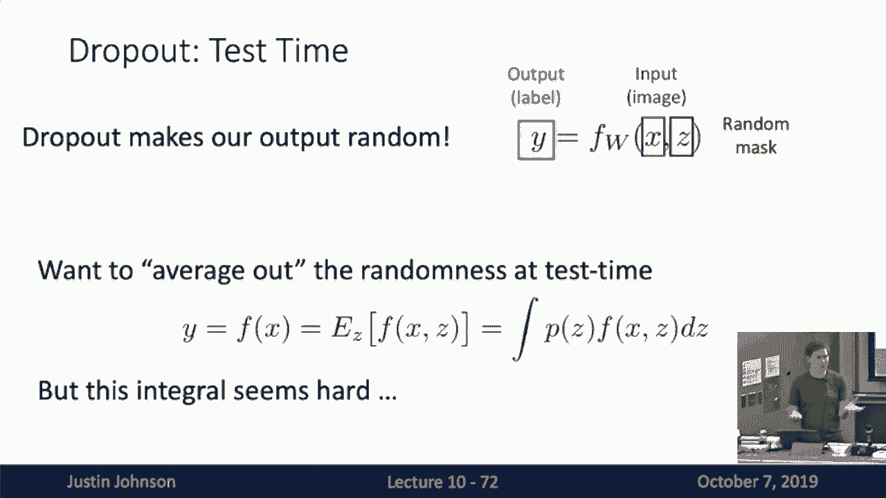

analytically is like we have no idea how，to do it that seems very hard and very。

intractable for rent for arbitrary，neural networks so in practice we will。

instead think about what happens well，how can we think about this integral for。

the for only a single neuron well for a，single neuron that receives two inputs x。

and y and has these connection strengths，w1 and w2 and then produces this single。

scalar output a then at kind of the，normal forward past we might imagine。

doing a test time is to take this inner，product of the weight matrix and the two，inputs X and y。

now if we're using dropouts then there，are four different random masks that。

we've made that we might have drawn，during training with equal probability。

where we could have kept them both we，could have knocked out X but kept Y。

knocked out why but kept X or knocked，out both of them and each of these four。

options can occur with equal probability，so then if we we can in this case we can。

write out this expectation exactly，because we've got exactly four outputs。

and they all have equal probability and，what we see is that for this example。

this output this expected output is，actually equal to 1/2 the probability of。

this normal forward pass and this turns，out to hold in general that if we want。

to compute the expectation of a single，layer with dropout then all we need to。

do is multiply by the dropout，probability so simply multiplying by the。

drop of probability allows us to compute，this expectation for a single dropout。

layer so that means that a test time we，just that that so this this derivation。

it means that we need to a test time we，want the output to be equal to be。

expected input a training time which，means that an output and at test time we。

want all neurons to be active we want，them all to action all of our learn ways。

to actually do something so at test time，we'll use all the neurons but then we'll。

rescale the output of the layer using，this drop this dropping probability that。

we've used to drop individual neurons so，this gives us our summary of。

implementing dropout that it's actually，quite straightforward that when。

implementing dropout during the forward，pass during training we're going to drop。

these random we're going to generate，these random masks and use those to。

dropout or zero out of random elements，of the of the activation of the。

activation factors and at test time，we'll simply use the proper probability。

to rescale the output and have no，randomness now this expectation is exact。

only for individual layers and this kind，of way of computing expectations is not。

actually correct if you imagine stacking，multiple dropout layers on top of each。

other but it seems to work well enough，in practice I'd also like to point out。

that a slightly more common thing that，you'll see for implementing dropout is。

another variant called inverted dropout，that's really fundamentally the same。

idea it's just a different implement，the same thing and the question is where。

do we want to do the rescaling we want，to do rescaling during test time or we。

want to do rescaling during training，time and maybe we would prefer to not do。

rescaling during test time because，during test time we want to really。

maximize the efficiency of the system，because maybe it's gonna run on mobile。

devices or in servers on lots of images，or whatever so we maybe prefer to pay a。

little bit of extra cost of training，time instead so in practice a very。

common thing you'll see with dropout is，to generate these random masks at。

training time and then actually then，like if you're having drop a probability。

1/2 then during training time we'll，we'll drop half the neurons and then。

we'll multiply all of the remaining，neurons by 2 and then at test time we'll。

have we'll just use all the neurons and，use our normal way matrix and in this。

way again the expected value the，expected value of the output at training。

time will be equal to the actual output，at test time but it's just a question of。

where do we put the rescaling we put it，during training time or test time then。

the question there's another question of，now that we've got this idea of a。

dropout layer where do we actually，insert it into our neural network。

architectures well if we remember back，to the Alex net and vgg architectures we。

remember that the vast majority of the，learn about parameters for those for。

those architectures lived in these fully，connected layers at the end of the。

network and that's indeed the exact，place where we tend to put dropout in。

practice is in these large fully，connected layers at the end of our。

convolutional neural networks but if，you'll remember that as we moved forward。

in time and looked at more recent，architectures things like ResNet or。

Google net actually did away with these，large fully connected layers and instead。

use global average pooling instead so，actually for these later network。

architectures so this actually did not，use dropout at all，but prior to something prior to 2014 or。

so dropout was really a critical，essential piece of getting neural。

networks to work because it actually，helped a lot for reducing overfitting。

and something like Alex net or bgg and，they've actually become it's actually。

become slightly less important in these，more modern architectures like res nets。

and so on and so forth now this idea of，dropout is actually something of a。

common pattern that we see repeated a，lot in different types of neural network，regularization。

basically during training we've added，some kind of randomness to the system。

like by adding a dependence on some，other random source of information and。

then at testing we average out the，randomness to make a deterministic for。

dropout we this randomness took the，source of random masks but you can see。

many other types of regularization that，use other sorts of randomness instead。

and we've actually seen another，regularizer，already in this class that has like this。

exact same flavor and that regularizer，is batch normalization because if you。

recall batch normalization adds，randomness during training time because。

it makes the outputs of each elements in，the batch depend on each other elements。

in the batch because during training，remember for batch normalization we。

compute these per mini batch means and，standard deviations which means that。

they depend on which random elements，happens to get shuffled into each mini。

batch at each iteration of training so，then at so Batchelor normalization is。

adding randomness by take by making by，depending on the weight which we form。

batch as a training time and then a test，time that averages out this randomness。

by using these running averages of means，and standard deviations and using these。

fixed values instead a test time to，average out this randomness and in fact。

for these later architectures like，residual networks and other types of。

more modern architectures batch，normalization has somewhat replaced。

dropout as the main regularizer in these，deep neural networks so for something。

like that for something like a residual，Network the regularizer is that it's。

used to train our l2 l2 weight decay and，best normalization and that's it and。

that tends to be actually a very useful，success way to successfully train large。

deep neural networks is actually just，relying on the stochasticity of batch。

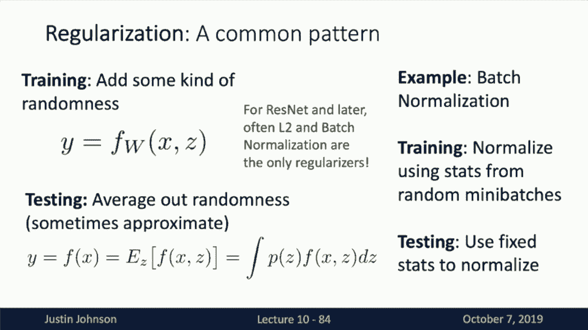

normalization but there's some actually，there I lied a little bit there's one。

other type of thing of one other source，of randomness that happens a lot in。

practice but most people don't refer to，it as a type of regularization and。

that's this notion of data augmentation，so so far in this class whenever we've。

talked about loading and training，iterations we always imagine that we。

load up our training data loading load，up the label for that training data like。

this picture of a cat and label cat，we're on the image through the network。

and then compare the predictive label to，the true label and then use that to get。

our loss and compute our gradients but，it's actually very common in practice to。

perform transforms on your data samples，before you feed them to the neural。

network and perform and somehow，manipulate or modify the input image in。

a random way that preserves the label of。

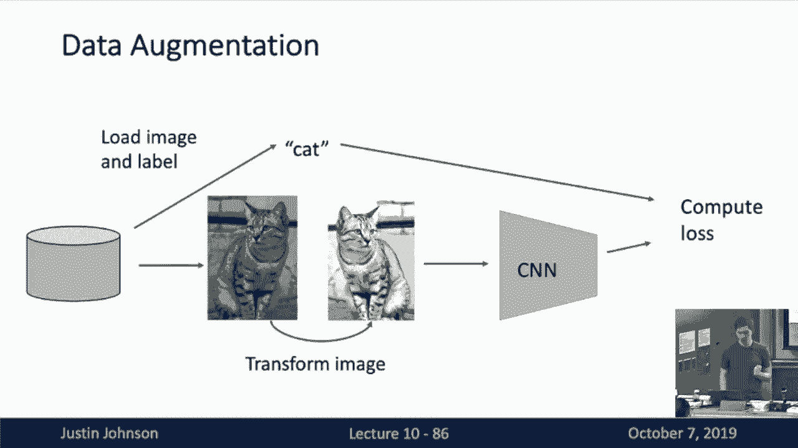

the of the data sample so for example，for images some comments some common。

things would be horizontal flips because，we as humans know that if we flip the。

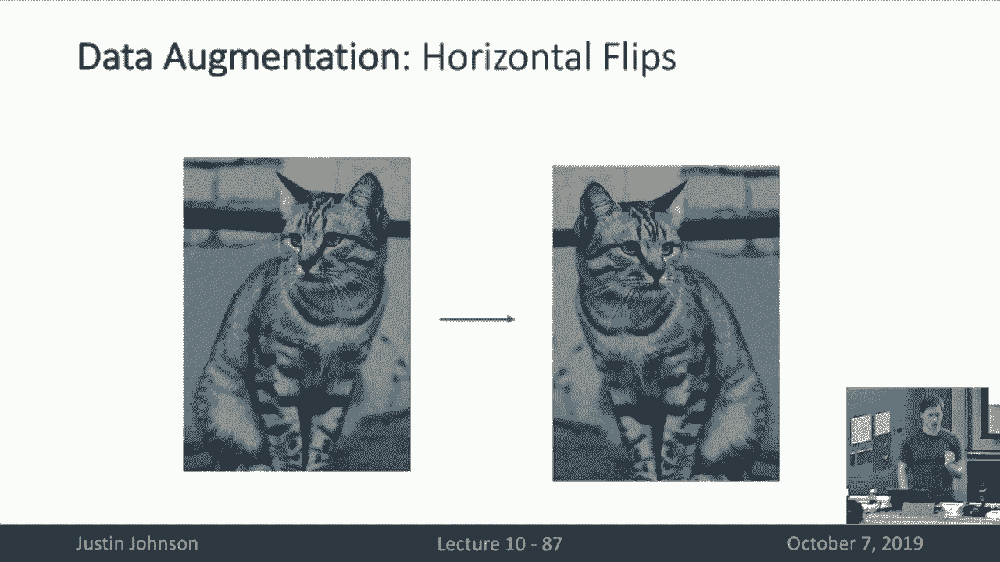

image horizontally then it's still a cat，other common things would be random。

crops and scales so at every training，iteration we might resize the image to。

have a random size or take a random crop，of the image because we expect that a。

random crop of a cat image should still。

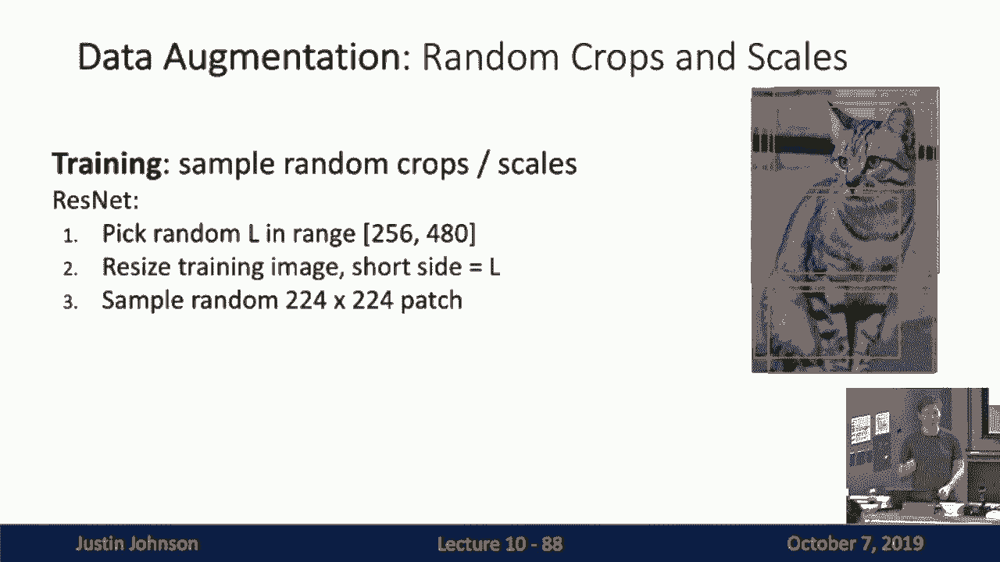

be a cat image and should still be，recognized as a cat by the neural。

network and the idea here is that this，adds a way this is this effectively。

multiplies your training set because we，add these data transformations to the。

model in a way that we know doesn't，change the training label and this。

somehow moult is kind of multiplies your，training set for free because now your。

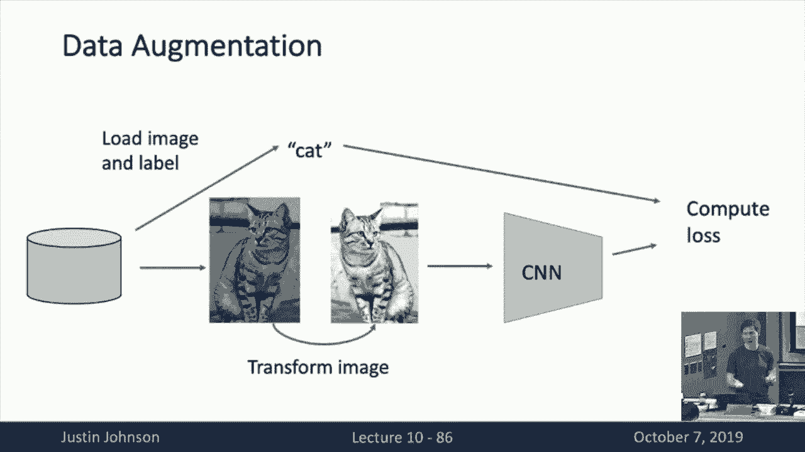

network is trained on more raw inputs，and then but this is again adding。

randomness at training time so for the，answer this example of random cropping。

and flipping and scaling for something，like res Nets the way that they're。

trained is that at every iteration every，training image we pick a random size。

resize it to a random size then take a，random two to four by two to four crop。

of this randomly resized image and this，and we just do this random cropping and。

random resizing and random flipping for，each element at every iteration but now。

again this is adding randomness to the，network in some way so we want to。

fitting with this idea of marginalizing，out randomness at test time we want some。

way to marginalize they get out this，other source of randomness in our neural。

network so then the way this is done in，data augmentation is to pick some fixed。

set of crops or scales to evaluate at a，test time so for example for in the。

ResNet paper they take these five，different image scales and then for each。

scale they evaluate five crops of the，image for the four-corners and the。

center as well as the horizontal flips，of all these things，and then average the predictions after。

running each of those different random，crops through the network and again and。

again this is a way that we are adding。

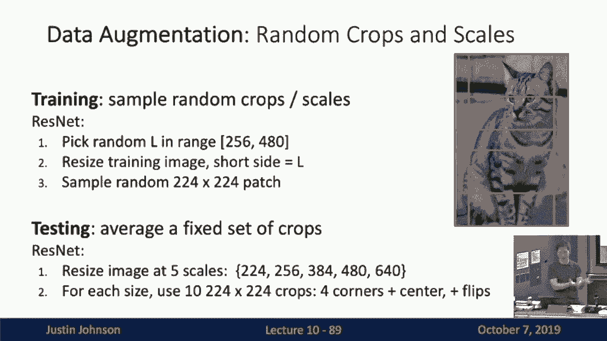

randomness to the network at training，time and then averaging out that。

randomness at test time there's some，other other times people play tricks。

around also randomly jittering the color。

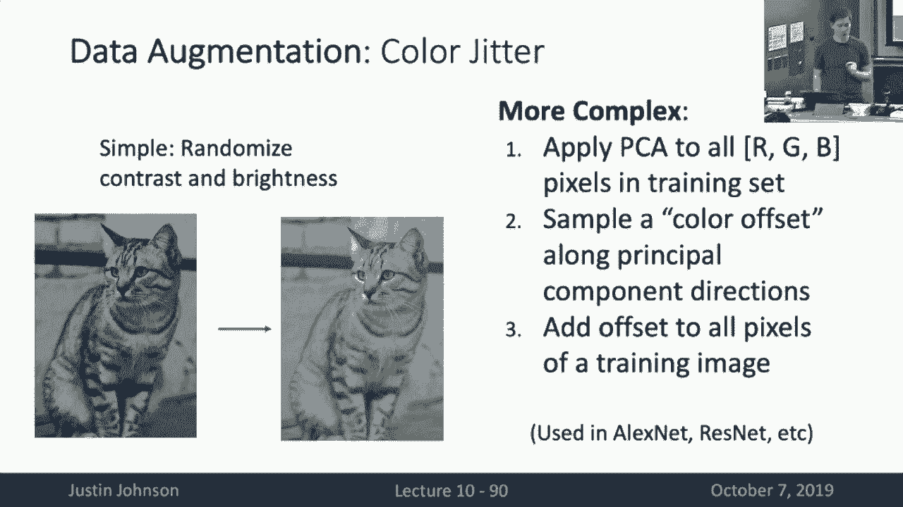

of your of your images during training，time but in general this this idea of。

data augmentation is a way that you can，get creative and add some of your own。

human expert knowledge to the to the to，the to the system because depending on。

the problem you're trying to solve，different types of data augmentation。

might or might not make sense so like，for example if you were building a。

classifier to try to tell right and left，hands apart then probably horizontal。

flipping would not be a good type of，data augmentation to use but if we want。

to recognize cats versus dogs then，horizontal flipping is maybe very。

reasonable or sometimes I've seen like，in like medical imaging context we want。

to recognize like slides or cells then，even performing random rotations is。

reasonable because depending on that for，that source of data you don't really。

know what orientation it might have come，in at so data augmentation is really a。

place where you can inject some of your，own human expert knowledge into the。

training of the system about what types。

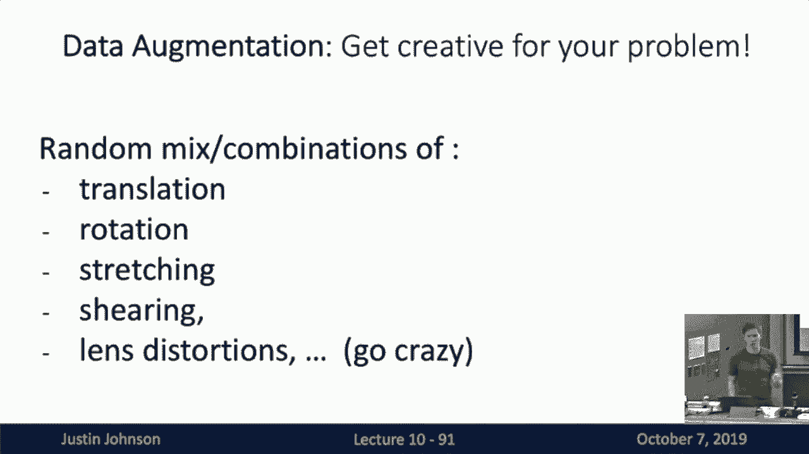

of transformations do and do not affect，the labels that you're trying to predict。

so now we've seen this pattern in，regularization of adding randomness at。

training time and then marginally，marginalizing out the randomness at test。

time so I just want to very quickly go，through like a couple other examples of。

this pattern but I don't expect you to，know in detail just to give you a flavor。

of other ways this has been instantiated，well one way another idea is drop。

connect so this is very similar to drop，out but rather than zeroing random。

activations instead we're going to zero，random weights during every four pass。

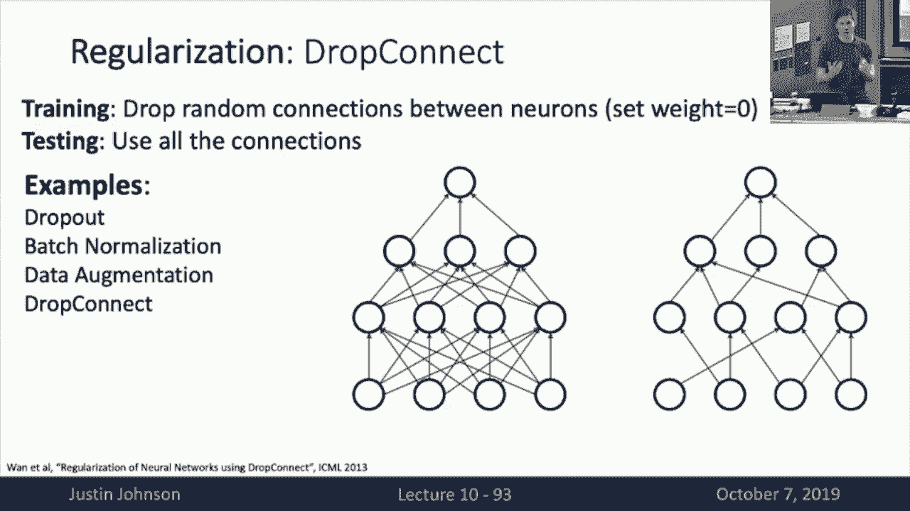

the network and again we'll have some，procedure to average out test elasticity。

at test time another idea is this that I，find very cute is this notion of。

fractional max pooling so here what，we're going to do is actually randomize。

the sizes of the receptive fields of our，pooling regions inside each of the。

pooling layers of the neural network so，that maybe some neurons will have a two。

by two portaling region some neurons，will have a one by one pooling region，and they'll be。

and every four pass and this is，fractional max pooling because this。

randomness between choosing a one-by-one，receptive field and a two-by-two。

receptive field means you can have like。

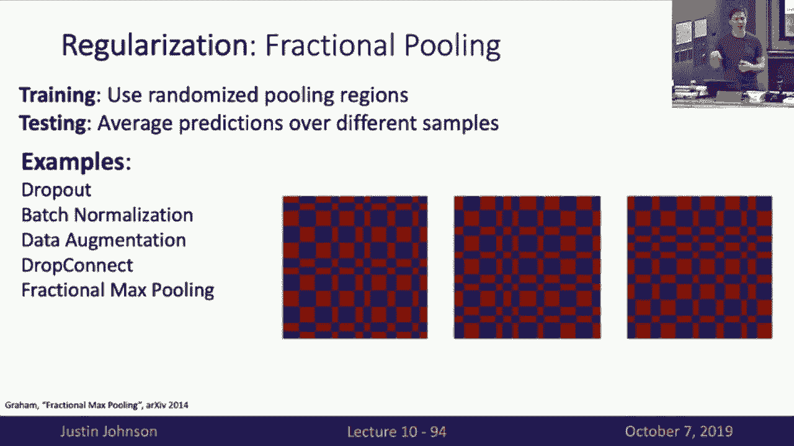

1。35 pooling in expectation so this is，sometimes referred to as fractional max。

pooling another crazy one is we can，actually build networks deep networks。

with stochastic death so we can build，something like a hundred layer ResNet。

and then every four pass will use a，different subset of the residual blocks。

during training and then a test time，will use all of the blocks so we saw。

kind of drop out that's dropping weights，dropping individual neuron values we saw。

a drop connect that's dropping，individual weight values this is。

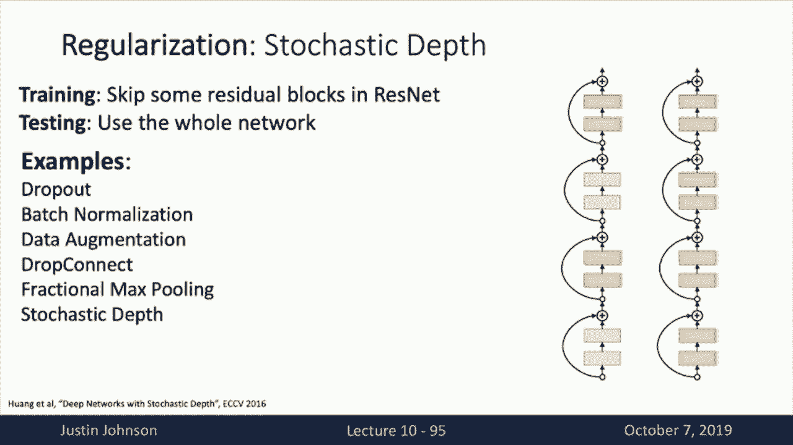

something like drop block it's dropping，whole blocks from this deep residual。

network architecture another one that's，actually more commonly used is this。

notion of cutout so here we're simply，going to 0 set random image regions of。

the input image to 0 at every at every，four pass during training and then at。

test time we'll use the whole image，instead and again you can see that we're。

performing some kind of randomness to，corrupt the the neural network at。

training time and then averaging out，that one that that randomness at test。

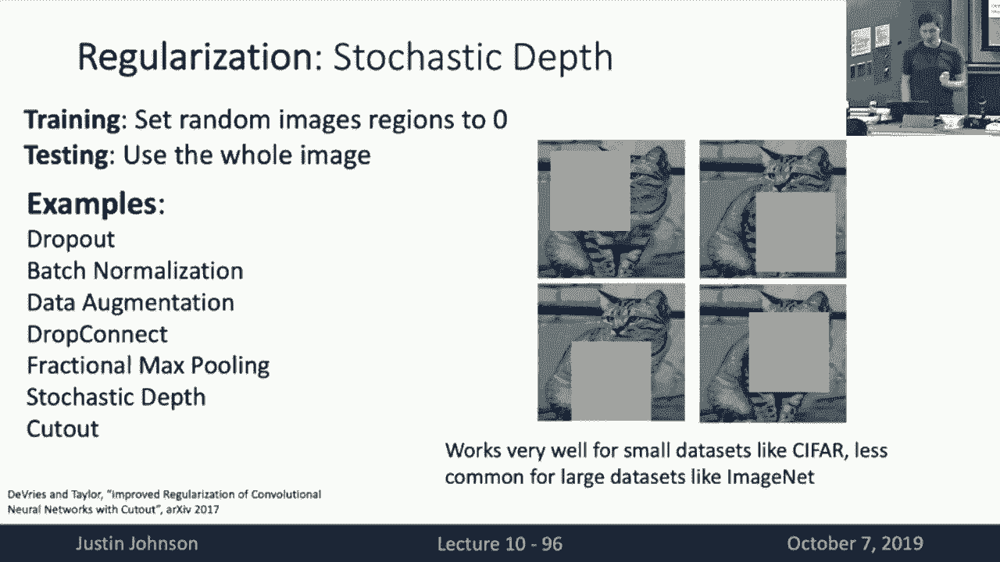

time and now this last one is really，crazy that I can't believe it works。

it's called mix up so here with mix up，what we're going to do is train on。

random blends of training images so now，rather than training on just a single。

image at a time we'll form our training，samples by taking a cat image and a dog。

image and then blending them and with a，with a random blend weight and then the。

predicted target should now be like 0。4，cat and 0。6 dog where that that that ran。

that that that target is now going to be，equal to the blend weight and this。

actually seems totally crazy like how，can this possibly work but the reason。

that it may maybe seems slightly more，reasonable is that these blend weights。

are actually drawn from a beta，distribution which we have the the PDF。

of the beta distribution up there which，means that in practice these blend。

weights are actually very close to zero，or very close very close to one so in。

practice rather than being 0。4 cat and，0。6 dog it's more likely to be like 0。95，cat and 0。

5 dog so it's not，as crazy as it initially seems but then，kind of my might your kind of takeaways。

for which regular answers should you，actually use in practice is that you。

should consider drop out if you have an，architecture if you're facing an。

architecture that has very very large，fully connected layers but for but but。

otherwise drop out is really not used，quite so much these days and in practice。

batch normalization l28 decay and data，and data augmentation are the main ways。

that we are regularizing neural networks，in practice today and actually。

surprisingly these two these two wild，ones of cut out and mix up actually end。

up being fairly useful for small data，sets like CFR 10 so I think state of the。

art and see part n actually uses both of，these techniques but for larger data。

sets like image net then these drop up。

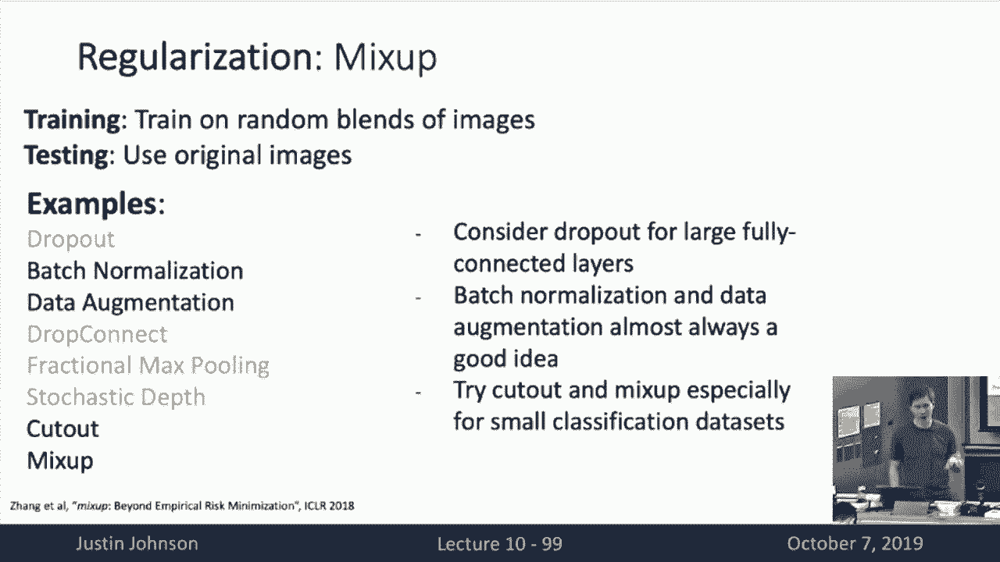

these cut up cut out and mix up are，usually not so helpful so that gives us。

our summary of part one of a lot of，these nitty gritty details about choices。

you need to make when training neural，networks and then on Wednesdays lecture。

we'll we'll talk about some more of。

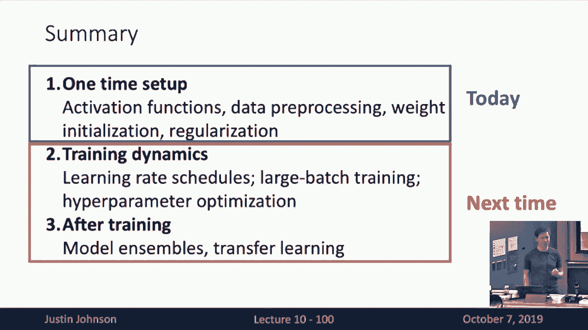

these details that you need to know in，order to get your neural networks to。

