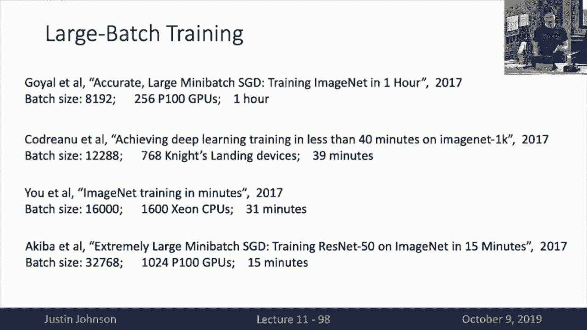

# P11：L11- 训练神经网络(下) - ShowMeAI - BV13P4y1t7gM

all right welcome back to lecture 11 and，all right welcome back to lecture 11 and。

today we're gonna continue our，discussion about all the little，nitty-gritty tips and tricks that you。

need to train neural networks I，apologize I couldn't come up with a。

better title for this lecture at last，lecture they just end up being kind of a。

bit of potpourri of a lot of little，things that you need that I think you。

need to know about training neural，networks but sort of had a hard time。

putting them into a good theme or a good，title other than that so to kind of。

recap last lecture and also this lecture，like I said it's been a bit of a。

potpourri of all a lot of different，topics that you need to know about about。

how to train their own networks so the，last time we talked we focused on some。

of these sort of one-time setup choices，about the architecture and whatnot but。

you need to make before you start，training so recall last time we talked。

about activation functions and we had a，lot to say about the different。

activation functions but at the end we，we talked about data pre-processing and。

we talked about data pre-processing and，we finally explained the mystery behind。

those means subtraction lines that have，been appearing on your homework。

assignments so far we talked about，weight initialization and then saw how。

we can use this Xavier or kind，initialization rules to force our，activations to be initialized torso。

activations to have good distributions，over many layers of a deep network and。

this was kind of a trade-off between too，small where things would collapse to。

zero or too large where things would，explode and then these these last two。

points I think we went a little bit fast，last time in lecture so if anyone have。

any had any lingering questions about，any of these points this would be your。

your in to ask those but then remember，we also talked last time about data。

augmentation which was this technique by，which we can artificially multiply the。

size of our training set by performing，random transformations on our training。

data before we feed it directly into the，network and again we saw that data。

augmentation was a way that you can，inject priors about your own knowledge。

about the structure of your data into，the training procedure of your neural。

network and that you could imagine，inventing different types of data。

augmentation for different types of，tasks then we also saw this very general。

concept of regularization where so far，in the in your homework assignments。

you've seen something like l2，regularization where we add an explicit，term and or explicit。

additional term on to our loss function，that for example penalize --is the norm。

of the weight matrix but last time we，saw this much more general class of。

regularizer z-- that are commonly used，in neural networks whereby in the。

forward pass we somehow inject some kind，of noise to mess up the processing of。

the neural network in some way and then，in the back in during testing then we。

somehow marginalize out or average out，that bit of noise and as examples of。

this sort of paradigm of regularization，we talked about things like dropouts。

fractional pooling drop connect，stochastic depth and these crazy ones。

like cut out and mix up that are，actually used in practice quite a bit so。

I realize we went a little bit fast，especially around regularization toward。

the end so I just wanted to make sure，there were no lingering questions about。

any of these topics before we move on to，new stuff ok very good。

so then that was kind of the the stuff，that we talked about last time and today。

we're gonna talk move on to some other，interesting topics about bits and pieces。

about how you train neural networks in，practice in particular we're going to。

talk about things that you need to worry，about during the process of training。

your model and getting your model to，Train that's sort of setting learning。

rate schedules and how to choose hyper，parameters I know this has been a very。

frustrating procedure so for some of you，and then some additional points that you。

might want to think about after you've，successfully trained your model those。

are questions about maybe model ensemble，incurring and how to scale up your model。

to train on maybe whole data center，levels of compute so the first of these。

topics is learning rate schedules so I，think at this point you've we've seen。

many different optimization algorithms，we've seen things like vanilla s GD H GD。

+ momentum biodegrade RMS from atom and，all of these have some kind of hyper。

parameter that's called a learning rate，and usually this learning right hyper。

parameter is probably the most important，hyper parameter that you need to set for。

most deep learning models and at this，point you've had the chance to use SGD。

for a variety of different types of，models and hopefully you've started to。

get some some intuition about what，happens when you set different values of。

a learning rate with different，optimizers so here on the left is a。

little bit of a cartoon picture of what，you can sometimes expect might happen，with。

optimize with with optimization as you，set different types of learning rates so。

here for example in yellow if you set，the learning rate too high then often。

things will just explode immediately and，the loss will escape to infinity or。

you'll get Nan's and it will very，quickly go very wrong very fast in。

contrast if you set something like in，blue a very low learning rate then。

you'll see that learning tends to，proceed very very slowly and this is。

good because you make progress things，don't explode to infinity but it might。

take a while to train for your loss，actually you drop to very low values and。

in contrast something like in green，might be learning it which is high but。

not so high that you explode to infinity，and there you see that in contrast to。

the blue learning rate setting a higher，learning rate might actually converge to。

a fat to a value faster but it might，actually not converge to as low of a。

lost value and and what we kind of like，is something like the red curve here。

which is some sort of ideal good，learning rate that you see it makes a。

quick progress towards this areas of low，loss while also not exploding to。

infinity and also actually training，reasonably quickly so obviously if we。

can we would prefer to choose this red，learning rate but if that's not always。

possible we have a sort of a question，here which is that if we can't find that。

one perfect learning rate that's going，to work for us then what are we supposed。

to do how are we supposed to trade-off，between these seemingly sub optimal。

choices and this is a bit of a trick，question it turns out because we don't。

actually have to make one choice for the，learning rate in fact it's very common。

to somehow choose all of them and to，basically the idea the basic idea here。

is to start with a relic with a，relatively high learning rate so that。

looks maybe something like the green，curve and that will allow our loss our。

optimization to make very quick progress，in the first iterations of training。

towards these areas of low loss and then，over time after maybe after this green。

curve is sort of plateauing then we want，to reduce the learning rate and continue。

training with these lower learning rates，maybe like this blue learning rate and。

this will hopefully let us get the best，of both worlds，that we can hopefully buy by starting。

with a high learning rate and then，lowering it over time that we can。

hopefully make a quick progress at the，beginning and also converge to very -。

Val - very low loss values at the end of，training but this has been sort of vague。

and not very specific so far I just said，we're gonna start with a high learning。

rate and then end with a low learning，rate but then what actually concretely。

is that going to look like well this，this process of so this process of。

choosing different mechanisms of，starting of changing the learning rate。

over the process of training these are，called learning rate schedules and。

there's several different forms of，learning rate schedules that are。

commonly in use when training deep，neural network models the perhaps the。

most commonly used learning rate，schedule is the so called step schedule。

so here what we're going to do is start，with what with some value of the。

learning rate for example in and for，example the residual networks are very。

famous for using this kind of step，learning rate schedule so with a step。

learning rate schedule we'll begin，training with some relatively high。

learning rate like ten to the minus one，for a residual networks and then at。

certain chosen points during the，optimization process we will decay the。

lurk we will just all of a sudden jump，to a brand new lower learning rate so if。

a residual networks the the schedule，that typically use here is to start with。

learning rate at zero point one and then，after 30 deep arcs of training all of a。

sudden restart the alert of drop the，learning rate to zero point zero one and。

continue training for another thirty，bucks and then again drop the learning。

rate again after 60 bucks and again，after ninety pox，we're basically after every 30 parts of。

training we're going to drop the overall，learning rate by a factor of ten and if。

you look at a training curve that is，here shown here on the left for one of。

these so called step learning rate decay，schedules you get this very。

characteristic curve of the of the loss，as a function of time that you get when。

using a step learning rate decay you can，see that in this first phase of training。

during the first 30 pox when we're using，this relatively high learning rate then。

we see we're making a very quick，progress where the lost soil starts from。

this high initial value and they make，sort of quick exponential progress，towards lower loss values。

but then after about 30 bucks you can，see that this this quick progress has。

somehow steadied off and we're no longer，making very fast progress after these。

first 30 parts of training and after，these 30 epochs this moment when we。

decay the learning rate and drop it by a，factor of 10 we see sort of another。

another a new exponential pattern begin，where once we drop the learning rate。

again it sort of decays and then，plateaus and then when we need the cable。

and learning rate again at 60 epochs，sort of decays quickly and then plateaus。

again so this is a very characteristic，schedule that you'll a very。

characteristic shape of learning curves，that you'll see when models are trained。

using this so-called step learning rate，schedule now one problem with this step。

learning rate schedule is that it，introduces a lot of new a lot of new。

hyper predators into the training of our，model now not only do we need to choose。

the regularization and the initial，learning rate like we did in all。

previous models we also need to choose，at which iterations are we going to。

decay the learning rate and what are the，new learning rates that we're going to。

choose at the iterations where we decay，it and that actually gives us a lot of。

choices so properly tuning one of these，step decay schedules can actually take a。

fair amount of trial and error so what，people usually do in practice is sort of。

look at these learning curves and let，things train with the high learning rate。

for quite a long time and then they get，a sense at which point the model tends。

to Plateau so if you read papers，sometimes they'll say that they use a。

heuristic where they keep training until，the lost plateaus or until the。

validation accuracy foot plateaus and，then they decay the learning rate well。

that usually means that they're using，some kind of heuristic we chosen step。

decay schedule but as you can imagine if，you're starting out at a new piranha new。

problem and you don't have a lot of time，to experiment with lots of different。

decay schedules then this step decay，schedule can actually be a little bit。

tricky because it introduces so many new，things into the model that you need to。

tune so it overcomes some of those，shortcomings of the step decay schedule。

one there's another learning rate，schedule that has become sort of trendy。

in the past couple of years which is the，the so-called cosine learning rate decay。

schedule so here rather than choosing，particular points particular iterations。

at which we're going to decay the，learning rate instead we want to we're。

going to write down some formula ahead，of time，that tells us what will the learning。

rate be at every epoch as a function of，the epoch number or the iteration number。

and then we need then then we only need，to choose some kind of functional form。

that is the shape of the curve along，which this learning rate will decay so。

one of these that's become very popular，is this cosa is this a half wave cosign。

learning rate schedule where you can see，that from the plot on the right where we。

show the the learning rate as a function，of time we can see that it starts off as。

some high value and then the shape at，which the learning rate decays is equal。

to one half of a period of a cosine wave，and this and then what this means is。

that we start out at some initial high，value of the learning rate and towards。

the end of training our learning rate，will decay all the way to zero as this。

wave of the cosine K is all the way to，zero and now this this cosine learning。

rate schedule is very is has is very，appealing because it has many many fewer。

hyper parameters than the step decay，schedule so in particular the cosine。

learning rate decay schedule only has，two hyper parameters that we need to。

choose one is the initial learning rate，on this alpha zero here on the equation。

and the other is the number of epochs，that were going to use to train the。

model which is this capital T but what's，particularly appealing about this cosine。

light rate schedule is that it actually，doesn't introduce any new hyper。

parameters when training the model，because whenever we're training we're。

not on the model we always need to，choose some initial some learning rate。

and we always need to choose some number，of iterations that we're going to train。

so those two hyper parameters so when，when using cosine learning rate schedule。

it doesn't introduce any new hyper，parameters，it just gives additional interpretation。

or additional meaning to some of these，other Kuyper parameters that we already。

were having to choose anyway before and，so that tends to make the cosine。

schedules a lot more ease a bit easier，to tune compared to step decay schedules。

and the general rule of thumb with，cosine schedules is just training longer。

tends to work better so in practice the，only thing you really need to tune is。

that initial learning rate and then sort，of come to grips with how long you're。

willing to wait for your model to train，so that I think those are some reasons。

why this hosiah learning wait just keep，the case schedule，has become reasonably popular in the。

last couple of years and here I put some，citations on the slide of some。

reasonably high profile papers from the，last year or two that have used this。

cosine learning rate to keep schedule，but this cosine shape is just one of。

many shapes that you might imagine using，for decaying learning rates over time。

so another decay schedule that people，sometimes use is a simple linear decay。

again we're going to start with some，initial learning rate and then decay it。

to zero over the course of training but，rather than following this cosine decay。

this gay decay learning schedule instead，will symbol simply decay the learning。

rate linearly over time and that seems，to work well for many problems I should。

point out that I think there has not，been super good studies that really。

compare these different schedules，head-to-head so I can't really tell you。

concretely when cosine is going to be，better or linear is going to work better。

I think what most people do in practice，is they build upon some prior work and。

then they sort of adopt whatever，whatever type of schedule happen to be。

used in the prior work that they're，building upon so what this means is that。

you'll see different areas of deep，learning tends to end up using different。

types of learning rate schedules but，it's not really clear to me that that's。

because they're intrinsically better for，that area it's often I think just。

because they want to have a fair，comparison with whatever a piece of work。

came beforehand so with that kind of in，mind if you kind of look at these。

citations and what type of problem，you'll see that a lot of computer vision。

type projects are often using this，cosine learning rate decay schedule。

whereas this linear learning rate to，case schedule is often used for。

large-scale natural language processing，instead that are also trained using deep。

neural networks and again I think that's，maybe not something fundamental about。

vision versus natural language I think，it's more a function of what paper what。

what how different researchers in，different areas have proceeded upon the。

paths so then another learning rate，schedule you'll sometimes see is this。

inverse square root schedule that sort，of decays the learning rate across a。

different functional form but again it，has this interpretation of starting out。

high and then ending up low now this，inverse square root schedule I'm only。

putting it in here because it was used，by one very high-profile paper in 2017。

but it's like I've actually seen it used，compare，to be less compared to linear decay。

schedules and the cosine learning rate，and the cosine decay schedules and I。

think the the potential pitfall with，this inverse square root schedule is。

that the model actually spends very，little time at that initial high，learning rate。

so with this inverse square root，schedule you can see that the the。

learning rate very quickly drops off，from its high initial value and then。

spends a lot of time at these lower，later values and if we compare that with。

the linear or the cosine schedule then，we see that in contrast with these with。

these other schedules that are a bit，more popular models tend to spend more。

time at those initial higher learning，rates and then I think with all this。

talk about different learning rate，schedules I think I need to point out。

another very probably the most common，real learning rate schedule is just the。

constant schedule and this is actually，and this one surprisingly actually works。

quite well for a lot of problems so here，you know we simply set some initial。

learning rate and then keep that that，same learning rate through the entire。

course of training and this is actually，what I recommend people do in practice。

until they have some reason to do，otherwise where I see people mess up a。

lot of times when they're starting new，deep learning projects is to fiddle use。

this to fiddle with learning rate，schedules too early in the process and。

typically fiddle changing learning rate，schedules should be something that you。

do rather far along into the process of，developing your model and getting it to。

work and you can usually get things to，work reasonably well just using a。

constant learning rate schedule and then，the difference between performance with。

a constant schedule versus performance，with one of these other more complicated。

schedules is usually not the difference，between your model working and not。

working usually moving from constant to，some more complicated schedule well。

maybe make things work a couple percent，better so it's important if you're。

really trying to push for the state of，the art on some problem but if your goal。

is just to get something to work as，quickly as possible with this little。

mess as possible then I think constant，learning rates are actually a pretty。

good choice although I should also point，out that there is a bit of complication。

between learning rates and the optimizer，that you choose so when using stochastic。

gradient descent with momentum then I，think using some kind of learning rate。

decay schedule is fairly important，but if we're using one of these more。

complicated optimizers like rmsprop or，Adam then you can go farther using only。

a constant learning rate so that's kind，of my caveat is that especially if。

you're using something like Adam then，you can you you can actually get pretty。

far using just a constant learning rate，so any questions about these learning。

rate schedules before we move on to some，other topic yeah yeah so the question is。

sometimes you'll train for a long time，loss will be going down you'll be very。

happy because you think you trained a，good model and then all of a sudden loss。

will go up things will explode and，you'll become sad yeah I think it's。

really hard to say anything general，about that case I think there's a lot of。

reasons why something like that can go，can go wrong，one case where I've run into a similar。

problem is if you forget the torch got，zero grad that I warned you guys。

multiple times about a couple lectures，ago，maybe that was not applicable to your。

case but then if you're accidentally，accumulating gradients over many。

iterations then things will tend to work，for a while but then after some point。

then gradients will explode and things，will be things will go wrong I think。

things can also blow up after depending，on the problem type that you're working。

on you might also see bad training，dynamics so for something like different。

types of generative models or especially，different types of reinforcement。

learning problems then you'll often see，very troubling behavior with these。

learning curves sometimes although if，we're kind of a standard well-behaved。

classification problem if there's the，loss is kind of blowing up after a long。

periods of training usually that，indicate that makes me suspect some kind。

of a bug either bad hyper parameters or，some bug in the way data is being loaded。

or maybe you're training on some kind of，corrupt data actually that I've seen。

that as a problem sometimes where maybe，one sample in your training set is。

actually corrupted one common cake one，common failure mode is like you know。

Flickr actually takes users on can，upload images to Flickr or different。

photo sharing sites and then later，decide to remove those images and then。

many data sets are constructed not by，distributing actual JPEG files by。

distributing links to Flickr images so，then if you go and naively try to。

download all the links in the data set，you'll choose sometimes try to download。

some images that have been removed by，users and then those will end up with。

some kind of default corrupted JPEG file，and then during the training process，maybe it's an。

Zero's with some non-trivial label and，then you'll explode when you try to。

train on we train with a mini batch that，includes one of these corrupted image。

files so sometimes sometimes data，corruption in your training set can。

cause things to explode all of a sudden，but I think there's really no general。

answer you need to dig in more to the，specifics of your problem ok but then。

another strategy oh yeah yeah yeah so，the question is about adaptive learning。

rates so that would be something like a，degrade or rmsprop or add-on are。

examples of adaptive adaptive learning，rate mechanisms and they're I think。

things can still blow up things can，still go wrong sometimes they tend to。

make things a bit more robust but they，definitely still solve all your。

optimization problems the question is，like oh maybe I want to write some。

heuristic that will look at the lost，curve and then determine for itself when。

the learning height will drop I've seen，people do this but I recommend against。

it because I think you can get yourself，into trouble too easily doing that I。

think it's very easy to try to code up，some clever solution that will try to。

smartly choose when to drop the learning，rate but there's a lot of corner cases。

that are difficult to account for for，example if you look at these curves。

they're actually very noisy so here I'm，actually each actually I'm plotting up a。

scatter plot with each dot being the，loss at a particular iteration but it's。

so noisy that to get any signal you need，to take some kind of a moving average。

over the the training iterations so then，they just end up being a lot of now sort。

of meta hyper parameters that go into，these heuristics about when to decay the。

learning rates and I think that you're，just again you're just setting yourself。

up for trouble there and you're better，off just looking at the lost curves and。

trying to make some expert determination，there yeah yes that's correct。

so the dark is actually a bunch of，circles that represent the loss of each。

iteration but they're extremely noisy so，these circles end up actually having a。

few a pretty huge variance between，iterations on the individual training。

losses so whenever I plot these things I，always like to plot both those losses at。

every iteration to get some general，sense of the variance but then I also。

like to plot a moving average so this is，usually a moving average of a window。

size of like a hundred or a thousand，iterations that tells the moving average。

of the losses over some some window and，that gives you a sense of both the。

overall variance of the training，as well as the the longer-term trends so。

I think that's very useful a very useful，thing when plotting losses to help you。

debug and and absolutely point out that，this is kind of a very fairly。

characteristic image that you get when，trading with a cosine schedule that it。

has a very funny shape and if you're，used to seeing plots like this with the。

stuff decay then the first time you，train with a cosine schedule you get。

very surprised so this is something I've，started to do recently and and it's。

always concerning to me when I see these，very weird-looking plots but I think。

another thing that you should always be，doing that really helps you to choose。

how long you should train is this notion，of early stopping and I think this is a。

good mechanism to also go back to this，exploding process during training so。

here the idea is that whenever you train，neural networks you want to look at two。

to the really three curves one is the，training loss as a function of iteration。

which is here on the left and if things，are healthy you should see this kind of。

decaying exponentially in some way，but what you should also always be。

looking at is the training accuracy of，your network maybe that you check every。

every epoch or so as well as in the，accuracy both on the training set as。

well as the validation set and the，looking at these curves can give you。

some other sense of the health of your，network throughout the training process。

so then what you'll typically do is you，you want to stop training you want to。

pick the net the check point the check，point of the model during training where。

you had the highest validation accuracy，so what you'll typically do is you'll。

typically set some number of max，iterations or met max epochs that you're。

going to train for and then just let，that thing train for that batch number。

epochs but every epoch or every five，epochs or ten epochs you should always。

check the valid the the training and，validation set accuracies and then save。

the model parameters at that points to，disk and then after the model finishes。

training then you can plot these curves，and then select the check point der it。

just select the point in time at which，your model performed the best on the。

validation set and then that's the check，point they should actually use when。

about when running the model in practice，so if you do a process like this then if。

the model happened to blow up late in，the training process then it's maybe not。

such a big deal you can just look at，model，check points from the point in training。

before the model blew up so this is a，really useful skill a really useful。

heuristic on how to train your networks，and how to select which check what to。

use at the end of the day so this is，something I really encourage people to。

use pretty much all the time whenever，you're training people networks so then。

that kind of leads into a bit of a，larger discussion of how are we supposed。

to go about choosing hyper parameters，for our neural networks well in kind of，1：

1 sit one thing that you'll come and，we commonly see people do is this notion。

of a grid search so here what we're，going to do is select some set of them。

we're gonna select some set of hyper，parameters that we care to tune and then。

for each of those hyper parameters we'll，select some set of values that we want。

to evaluate for that hyper parameter and，for and often many of these hyper。

parameters you should be searching in，kind of a log linear space rather than a。

linear space so then for example we，might want to evaluate here for examples。

of the learning rate for different，learning rates that are kind of spaced。

out log in a log in a log minier way and，also test out for different values of。

regularization strengths that again our，space sort of log linearly and then get。

given four values of the weight decay，and four values of the learning rate。

then that gives rise to 16 combinations，and if you have enough GPUs just try。

them all and see which one works best，and that actually is a fairly reasonable。

strategy that people sometimes do in，practice but the problem is that this。

strategy requires a number of GPUs which，is exponential in the number of。

hyperparameters that you want to tune so，this very quickly gets very infeasible。

very quickly so another strategy that，sometimes people employ instead is。

random search rather than grid search，and here again we're going to select the。

procedure is much the same we're going，to select some set of hyper primers that。

we want to tune and now rather than，selecting values that we want to try for。

each of those hyper parameters instead，we're going to select some ranges of。

those hyper parameters along which we，want to search and now we're going to。

develop during each time we train our，model we're going to select a random。

value for each of those type of，parameters that fall within that range，and again for。

like a learning rate and a weight decay，you'll often want to search in a log。

linear space whereas for other types of，hyper parameters like maybe with the。

network or model size or dropout，probability sometimes you'll see a。

linear rather than log rather than log，linear spacing and it kind of depends on。

what the hyper parameter is as to，whether it should be linear or log。

linear but now the idea is that with，this random search idea we set these。

ranges for different hyper parameters，and then during each training run we。

draw a random value for our high，parameter and then just let it go and。

then however many of trials of your，network you can afford to train you。

train that many and then whatever，happens to work best at the end that。

gives you some that that's the high，parameters that you use and there's been。

some maybe if you think about grid，search versus random search you know。

they're 4-minute very similarly on the，slide so you should think that so maybe。

you might think that they're very，similar in how they perform but there's。

actually a fairly strong argument for，using random search instead of grid。

search that comes from this 2010 paper，and the idea here is that if you have a。

lot of hyper parameters and you don't，really know which hyper parameters are。

in prop if you have a lot of high，parameters you need to tune probably。

some of those hyper parameters are going，to be very important for model。

performance whereas other of those hyper，parameters maybe it didn't really matter。

what value you were gonna set they were，all anything in that range would have。

been fine but ahead of time before you，train models you might not know which。

hyper parameter is in which category but，usually it's the case that some hyper。

parameters matter and some humber，parameters don't matter but now the idea。

is that if you are using a grid search，then we were always going to evaluate。

exactly the same grid of parameters on，the left so what this means is that in。

this sort of cartoon picture the the，parameter on the horizontal axis is ends。

up being very important for this，optimizing for getting good performance。

because you can see that this sort of，distribution that we draw on the top of。

the grid is sort of the the marginal，distribution of model performance as a。

function of that hyper parameter value，so you can see that in this toy example。

this horizontal hyper parameter is very，important for getting very good。

performance because if we go far to the，left there's low performance and there's。

kind of a sweet a small sweet spot，the middle that gives us very high model。

performance in contrast in this sort of，cartoon picture the vertical hyper。

parameter is maybe not so important for，model performance and you can you can。

see we've also drawn this sort of orange，marginal distribution on the left-hand。

side of the plot that shows that no，matter which value of this vertical。

hyper parameter we choose things are，going to perform about the same and now。

the problem is that if we do a grid，search we are not being very we're not。

gaining as much information as we could，from each trial of the model that we。

train because what we're going to try，the same values of the important type of。

parameter many many times repeated for，each about for each value of the。

unimportant parameter so what that means，is that for this important this。

distribution of the important parameter，we're going only going to get three。

samples in this cartoon example so that，means that maybe we don't have enough。

information to properly tune the right，value of the right setting of that。

important parameter now in contrast if，you're going to use random search on the。

right than every but every trial that we，run is going to have random hyper。

parameters for both the vertical and the，horizontal hyperparameters and what this。

means is that when we plot these，marginal distributions of model。

performance as a function of each hyper，parameter then we end up getting more。

samples for each hyper parameter，individually because the points on the。

grid don't align perfectly vertically or，horizontally so what that means is that。

in a situation like this where one hyper，parameter is important and the other。

peiper parameter is unimportant，then we end up getting using the。

multiple sample the multiple repeated，samples of the unimportant hyper。

parameter in order to give us more，effective samples of the important type。

of parameter so then if you look at，these four though for the right-hand。

plot giving this random grid search we，see we end up with many many samples of。

this important type of parameter that，allows us to sample more points on this。

curve and hopefully find a better value，overall so if you're in a setting where。

you need to sort of search randomly or，private over hyper parameters then。

usually using some kind of a random，search is much more important than using。

some kind of a grid search so here these，couple these this slide is showing you。

kind of a cartoon picture of some kind，of idealized situation of what might。

happen with a random search but here's，an example of an ax，we'll random search that I did at a。

project at Facebook so we could use a，lot of GPUs so here so here these plots。

we were evaluating the the learning rate，and the regularization strength for。

three different categories of models，that would be a feed-forward model a。

residual model and a different sort of，model architecture called darts that。

details of what that is is not important，for this purpose but what you can see is。

that each point on these plots is a，different model that we trained and the。

plot is quite dense as we trained a lot，of models and then the the color of the。

point gives you the the overall，performance of the model at the end of。

training and by looking at plots like，this you can get some sense of the。

interactions between different learning，rates that you might come across so what。

you can see here is that here the the，x-axis is a learning rate and the y-axis。

is the regularization strength along a，log scale and what we can kind of see is。

that there is some kind of non-trivial，interaction between these two parameters。

but there's this kind of sweet spot or，sweet River in the middle of good。

learning rates for each regularization，strength and vice versa，yeah was there a question yeah the。

question is should can you use gradient，descent to learn the hyper parameters。

yes you can and I think that's that's a，really cool area of research that I。

really enjoy and I think it's really，creative and really interesting so。

there's many different approaches to，that that I think are slightly beyond。

the scope of this lecture but to give，you a flavor of what that looks like I。

think that's actually a beautiful，situation where the software systems。

that we end up building to help us solve，our problems end up giving rise to new。

mathematical solutions as well and what，I mean by that is when you have。

something like PI torch it's very easy，to back propagate through arbitrary。

Python code and you know your，optimization is your optimization loop。

is again yet again just another bit of，Python code so in principle it's very。

easy in pi torch to write code which，will allow you to back propagate to sort。

of have to an inner loop and an outer，loop in the inner loop you're going to。

run optimization over your model，parameters but you'll actually back back。

propagate through that entire inner loop，in order to compute gradients of the。

final model performance on the initial，values of the hyper parameters and。

that'll and then in this outer loop then，you'll use gradient，to learn the hyper parameters and。

there's a bunch of really really cool，papers along this direction that I would。

love to find some way to sneak into one，of these lectures but then there's one。

paper I love there where they learn not，only the learning rates but they also。

use similar idea to learn the training，data because now if you can back。

propagate through the learning process，we can actually learn the optimal。

training set that will cause the trained，model to work well on the validation set。

oh so this is like very crazy and very，very very very fun to read papers in。

this direction so yes you can but it's，actually not commonly used in practice。

these things are super computationally，expensive and people only sort of at。

this point in time employ them for，relatively small toy problems to show。

off that they can but for very large，scale problems of these kind of。

automatic methods of learning hyper，parameters be a gradient descent are。

really not very practical to scale up to，very large scale problems yeah yeah the。

color scale is error rate but it looks，like this the color bar on the right。

doesn't quite match up to actual colors，in the plot so I apologize for that but。

clearly the point where we put the red，dot or the values we ended up choosing。

for the paper so that got to be the，highest one so you can see this dark。

purple means it's working well and then，moving towards yellow is things not。

working well so I think there's probably，some transparency issue between the。

actual color bar in the plot maybe I，need to talk to my co-author about that。

so but so this is this that's kind of a，good strategy to choose hyper parameters。

if you happen to be working at Facebook，or Google or another tech company I have。

access to a lot of GPU resources but if，that's not the case then you need to be。

a little bit smarter in the way that you，choose hyper parameters so this is but I。

think you should not despair it's，usually possible in my experience to。

choose pretty good hyper parameters for，your problem，without this massive massive hyper。

parameter search so this is the，procedure that I usually go about。

choosing hyper parameters when I don't，have access to a very large GPU cluster。

so the step one is that you ahve you，implement your model actually you need。

to like write some code first and once，you're done with that then you should。

always be checking your initial loss and，as we talked about multiple times so far。

usually by the structure of the loss，function that you're using you can kind。

of compute analytically what what sort，of initial lost you expect，at random initialization so for。

something like this cross entropy loss，you know it should be like minus log of。

the number of classes so then your first，step after implementing your model is。

you turn off weight decay and just check，this loss at initialization that only。

takes one iteration it's very cheap to，do very fast and if that loss is wrong。

you know you have a bug and you should，go back and fix the bug then the next。

step is to try to overfit a very small，sample of your training data so here the。

idea is that you want to take something，like between one and maybe five to ten。

mini batches of data like a very very，tiny sample of your training set and now。

try to overfit this to a hundred percent，and because and when you're doing this。

you always want to turn off the，regularization and your goal is just to。

over fit the training data and when，you're doing that then what you need to。

do is fiddle with the the precise，architecture of your model maybe the。

number of layers and the size of each，layer play with the learning weight will。

play with the method of weight，initialization and now when you're when。

you when you play around with these，different some of these different hyper。

parameters then you should be able to，usually get the get whatever model。

you're working on should be able to get，to like 100 percent accuracy on this。

very very tiny sample of the training，set within a very small amount of time。

your goal here is that you should be，able to over fit in something like five。

minutes of training and because you're，this sample training stuff you're。

working on is very very small and now，because the training times are very very。

short it allows you to kind of，interactively play around with different。

values of these settings in order to，find settings that cause you to overfit。

very quickly and the point of this stuff，is to just make sure that you don't have。

any bugs in your optimization loop，because if you can't over fit 10。

training examples or 10 batches of data，then you have no hope in actually。

fitting the training set for real and，it's surprising how often you can catch。

bugs in your optimization setup or in，your model architecture choices just in。

this stage and again this these training，loops run very very fast so you can do。

this interactively on a single GPU in，most cases and and and there in step two。

we don't care about regular we don't，care about generalization to the。

validation set at all we're just trying，to debug the over the optimization。

process on a small training set but once，we've done that then once we have to。

succeed it at Step two and be able to，overfit a very small amount of data。

then we want to do is take the，architecture from the previous step and。

now use all of the training data and now，your goal is to find a learning rate。

that will cause the loss to start to go，down quickly on your whole training set。

now hopefully from step two you found it，you you know that your code is correct。

you know that your optimization loop is，correct and you found a model。

architecture that you believe is，sufficient for modeling your data and。

now in step three you're going to take，all of those architectural parameters。

and copy them over and you're just going，to fiddle with the learning rate on the。

entire training set and the learning，rate is the only parameter you'll the。

alerting rates the only parameter you'll，change and in changing the learning rate。

your goal is to make the loss drop，significantly within the first say。

hundred iterations of training or so，because usually for most problems that。

are set up properly usually you'll see，some very high initial loss at the。

beginning and you'll tend to see some，kind of exponential decrease in loss。

within the first hundred to thousand，iterations of training and that's sort。

of empirically true across a wide，variety of problems and neural network。

architectures so at this K at this stage，again because you're only caring to。

train for something like a hundred or a，thousand iterations and again you can。

typically do this interactively and just，choose learning rates look at the。

learning curve and then based on what，the plots look like then go back and。

choose new learning rates and work，interactively until you can find a。

setting of the learning rate that causes，things to actually converge within the。

first start to converge within the first，100 or so iterations so now at this。

point we're in relatively good shape，we've got a architecture that we know。

has the potential to model our data，because it can over fit a couple。

training samples and we know our，optimization is in a pretty good state。

because we know it loss is starting to，go down at the beginning of training so。

now step four is to set up a very coarse，hyper parameter grid maybe like a very。

very small number of models maybe you，choose two different values of learning。

rates and two different values of，regularization strength or just choose a。

very very very tiny hyper parameter grid，to evaluate that is somewhere in the。

neighborhood of all the choices that you，have made up to this point and now。

hopefully because of the by following，these previous steps hopefully all of。

these hyper parameter choices within，this very small grid will all end up，being somewhat reasonable。

you will not have any catastrophic ly，bad models within this very type of tiny。

hyper parameter grid so then after you，have this course grid then you train on。

the full training set for something like，one to five or one to ten he pops and。

that should and that should be enough to，give you some sense of the。

generalization performance of your model，beyond the training set and actually see。

it start to look at how it performs on，the validation set and then at that bend。

and again this is something that you，probably cannot do interactively but at。

this point you've got enough familiarity，with your model but you know that all of。

these choices should hopefully work so，you set up this tiny hyper parameter。

grid depending on how many models you，can afford to train in parallel and then。

step back and then come back and I'll，come back after a coffee break or a。

night of sleep or a weeks vacation as，the case may be depending on how long。

your model takes to Train and then come，back and see how well these things did。

and then after you go to step four，then you enter this iterative loop of。

looking at the results of your previous，tiny hyper parameter grid and then。

adjust your hyper parameter grid and，then go back and train for longer and。

then see and then at this point you're，in this sort of interactive process but。

each iteration of this of this of this，procedure might take hours two days。

depending on exactly how long your model，takes to Train so always along the way。

your you're looking at the learning，curves and then use it and using that to。

make determinations about how you should，change your what time the changes you。

should make and your hyper parameter，grid going forward so when I say look at。

learning curves I mean that we need to，look at these plots that I mentioned。

earlier on that whenever you're looking，at these things you should always be。

plotting this training loss on the left，and again as I said I like to plot both。

the raw accuracies as a scatter plot as，well as a line plot of these moving。

average of losses and then on the right，I always like to plot the training and。

validation accuracies and check every，Deepak and then by looking at these。

learning curves you you can get usually，gained some sense about what could be。

going right or wrong with your model so，here so here I'll give you a couple。

cartoon pictures of different sorts of，shapes of learning curves that you。

should become familiar with so one，situation is when your learning curve。

looks something like this where it's，sort of very flat at the beginning and。

then makes a sharp initial drop，well if you see a shape like this that。

means that probably your initialization，was bad because the the law you were not。

making progress at the beginning of，training so you should often adjust your。

initialization and go back and try again，now another problem is when we see a。

loss like this where it's sort of making，good progress and then it plateaus after。

a while well and when you see a loss of，the lost curve like this that you should。

consider some kind of learning rate，decay because it's possible you're。

learning right was too high and maybe，around the around the time point where。

it tends to plateau is maybe the point，where you should introduce some kind of。

learning rate decay and lower the，learning rate now conversely if you have。

not followed my advice and have，introduced learning rate decay too early。

in the model development process then，you might see a learning curve that。

looks something like this so here the，model was making good progress and then。

at some point we hit our step decay or，our point at which we were applying a。

step decay on the learning rate and then，the loss made a small drop at the point。

where we stepped and then after that it，was completely plateaued now usually。

this means that you decayed too early，that if you look at the shape of the。

learning curve leading up to the point，in time where we apply the decay then。

you think then this looks like the loss，would have continued going down at the。

initial learning rate had we not applied，learning rate decay so this is a shape。

that you should watch out for and，usually means that you applied learning。

rate decay too early now these were all，shapes of the this moving average of。

training losses but you can also gain，some intuition by looking at these plots。

of training and validation accuracy over，time so one character one characteristic。

shape of these curves that you might see，here is often that they'll make some。

exponential increase at the beginning，and then they'll sort of slowly increase。

linearly over time now if you see a，shape like this there's some kind of。

non-trivial but maybe healthy gap，between train and bowel and they're both。

continuing to go up then when you see a，curve like this it means things are。

going well and you just need to train，for longer because it looks like these。

curves are still going up and hopefully，just do whatever you're doing keep doing。

it for longer and your models will，continue getting better so this is a。

curve that you like to see in these，training Valpo，now a plot like this means something。

very bad is going on so here this is a，characteristic plot of overfitting so。

here you can see that performance on the，training set has continued to increase。

over time but performance on the，validation set has either plateaued or。

even decreased over time now this，usually is some no it's it's very common。

to have some kind of a gap between train，and Val that's normal and healthy but。

when you see this very large and，increasing gap between train and Val。

that is a sign of overfitting and when，you see a learning curve like this that。

means that you need to either increase，your regularization strength collect。

more training data or maybe in some rare，cases decrease the size or capacity of。

your model but this is this is a，characteristic shape of overfitting in。

in contrast if you see a plot like this，where the training performance and the。

validation performance is almost exactly，the same you might think this is a good。

thing because there's no overfitting but，usually this is a bad sign usually if。

you see exactly the same performance on，the training set and the validation set。

usually that means you are actually，under fitting your data and in fact you。

would have been better off to increase，the capacity of your model or decrease。

the regularization and that will tends，to give you better overall performance。

on the validation set even if young even，if that results in a larger gap so this。

one is slightly kind of counterintuitive，that this is actually an unhealthy。

learning curve and usually means that，you are under fitting the training data。

any questions about these learning，curves yeah yeah the question is um can。

you also tell by looking at the absolute，accuracies and if they're particularly。

low and yeah that's also definitely a，good sign to know whether you're not。

you're under fitting the data but there，it requires you to have some prior。

knowledge about what is a reasonable，accuracy on this data set which you。

might not coming into a new problem well，so usually I mean this is kind of。

empirical so usually it turns out that，you know what we want is a model that。

achieves the best on unseen data and it，happens I mean I think there's not a。

strong theoretical reason for this but，the empirical fact is that usually when。

you find a model that achieves the best，accuracy on the unseen data then there。

typically is some kind of a non-trivial，gap between performance on the training。

and performance on the validation set，and that's kind of an empirical fact I。

think there's not really great theory，that I can point to you for that problem。

for that uh for that observation so then，this brings us to our final close our。

final step in this type of parameter，training policy you look at these lost。

curves and then based on your intuitions，about how things are going。

that should gives you some sense about，how to adjust your grids based on。

looking at these lost pots that we just，looked at then you go to step 5 and loop。

until you run into your paper submission，deadline and you have no more time to。

train models so basically what I like to，think about when you're tuning these。

things is that you're some kind of a DJ，tuning all these little knobs about your。

learning rate strength and your hyper，parameters strength and your dropout and。

your model architecture and then，hopefully if you tune all these knobs in。

just the right way you'll end up making，beautiful music in the form of a model。

that works really well and unseen data，and in order to do that it's often very。

helpful to set up some kind of a cross，validation command center where you need。

where you can look at very like you need，to train large numbers of models in。

parallel and then look at these learning，curves in parallel and then use this as。

a way to get some idea about what sets，of hyper parameters tend to be working。

well or tend to not be working well now，back in the day before things like。

tensorflow this was a pain in the butt，and you had we had to like write custom。

web code in order to visualize these，learning curves and like learn。

JavaScript plotting frameworks to plot，these things or set up your own custom。

jupiter notebooks for plotting these，things and you could end up spending a。

lot of time just on the infrastructure，of looking at the results of your。

experiments but now with things like，tensor board you a lot of that work has。

been done for you so it's usually a lot，more seamless nowadays to set up these。

kind of cross validation command centers，as they as you will another there's。

another cut there's some other，heuristics that you can sometimes look。

at that can help you diagnose things，that are going wrong and training so for。

example one thing you sometimes like to，do is look at the ratio between the。

values of the weights of your network，and the and the magnitudes of the。

updates that you're making onto those，same ways so that would be you know your。

gradients times their learning rates，gives you the overall delta that you're，going to use。

update each value of the way that each，iteration and generally speaking you。

want to AP's the value between the，absolute value of the weight and the。

absolute value of the update for each of，the scalar weights in your network to be。

not too large typically if you're making，updates that are of the same order of。

magnitude or larger in order in larger，in magnitude then the weight value。

itself that's usually some kind of a，sign that something bad is happening so。

looking at these ratios between weight，update magnitudes and weight magnitudes。

is sometimes some heuristic that people，look at and practice or maybe looking at。

other kinds of statistics of the，gradient and magnitudes or magnitude is。

something that can sometimes help you，debug problems that are going wrong。

during training so that gives us to，looking at these training dynamics and。

hopefully if you follow this simple step，a seven step procedure that I've。

outlined you'll be able to train really，good models even if you don't have。

access to a giant GPU cluster but then，the question happens is that after your。

after you've successfully trained some，models then what can you do after that。

now well now things get interesting，so one thing that you often want to do。

is to get a little bit better on your，train on your on your final test set and。

it turns out there's a very hip simple，heuristic that apply is almost across。

the board for getting a slightly better，performance on basically whatever。

problem you're considering and that is，that you train something like n。

independent models however many you can，afford to train and then rather than。

using one of them instead you just use，all of them at test time so that means。

for each sample in your test set you run，it through each of your trained models。

to get the predictions from each of your，trained models and then you average the。

predictions across all of your trained，models for something the exact mechanism。

of averaging kind of depends on the，exact problem you're trying to solve but。

for something like image classification，you could for example take an average of。

the probability distributions that are，output from each of the models because。

the average of probably distribution is，still a probability distribution and。

typically when you take an ensemble of a，bunch of different models you end up。

getting about one or two percent better，on your final test case on your final。

test set so that is pretty standard no，matter what the model architecture is or。

how many models you're honest not well，more is usually better but what tasks，working。

what's your underlying CNN architecture，typically you get about one to two。

percent better when you ensemble some，some set up models together so if you're。

really trying to squeeze out that last，bit of juice then this is a very common。

trick that you'll see people use one，kind of cute idea is that rather than。

training multiple independent models，sometimes you can get away with saving。

multiple check points of one model，during training and then actually。

average the results of those different，check points during training and that。

can also give you some some improved，performance and then one trick there is。

actually to Train with a very very，bizarre learning rate schedule that is。

actually periodic so this is like not，super mainstream but it's so crazy I。

wanted to point it out the idea is that，your learning rate schedule is now。

actually periodic but it starts high，goes low goes high again goes low again。

goes high again goes low again and then，the the check points that you take。

during training to form your kind of，ensemble are the values of the model。

weights that were at the the very low，point of each of those points in the。

learning rate schedule that's kind of a，cute idea that you might see people use。

sometimes another idea is to keep a，running average of the model weights。

that you see during training and this is，called polyak averaging and it's used。

actually pretty commonly in some large，skill generative models so here remember。

like in batch normalization we're always，keeping this running exponential average。

of the the means and the variances of，our features and then during testing we。

we use those that this exponentially，running mean of means and standard。

deviations for batch normalization，during test time well it turns out you。

can actually do the same thing with the，model weights so then rather than using。

the model weights that result from any，one iteration of gradient descent。

instead you can take an exponentially，running average of the model weights。

that you see during training and then，actually use the this exponential。

running average of the model weights at，test time instead and this can have the。

effect of helping you to smooth out some，of this iteration to iteration variation。

in the model that happens during，training right if you go back and look。

at these lost plots remember there was a，lot of variation in the loss between。

individual iterations of the model and，by applying some kind of sum this is。

this kind of averaging to the model，weights themselves it can help to。

average out some of that noise that，happens between individual iterations of。

so those are ways that you can squeeze，so those are ways that you can squeeze。

out just a little bit of extra juice on，whatever is the original task you were。

trying to solve was but there but，sometimes we actually want to use one。

trained model to help us solve a totally，different task and that is extremely an。

extremely powerful tool that has become，super mainstream in computer vision over。

the past several years and that's，basically the problem of transfer。

learning so here the idea is that so，here there's kind of a myth that goes。

around when training CN NS the myth is，that you'll often see people to see。

people say is that you need very very，large training sets if you want to。

successfully use deep learning for your，problem but I think this is actually。

false and I'd like to bust this myth so，the idea is that I think if you utilize。

transfer learning you can actually get，away with using deep learning for a lot。

of problems even in cases where you do，not have access to a very large training。

set so for this reason transfer learning，has become a critical part of pretty。

much all mainstream computer vision so，the basic idea is that we'll take step。

one is train a convolutional neural，network model on imagenet or some other。

a very large scale image classification，data set and then make that part work as。

well as you possibly can using all the，tricks that we've outlined and then step。

two is is to sis to realize that we，don't actually care about image net。

classification performance instead we，might care about classification。

performance on some other smaller data，set or some other task entirely well。

here the idea is that we will take our，trained network from image data and then。

remove the last fully connected layer，recall that for example the last fully。

connected layer in something like an，Alex net takes us from these 4096。

dimensional features into this a 1000，dimensional vector of class scores so in。

fact this last layer and then in the，network ends up being tied to the。

category identities of the categories on，which the model was trained but now what。

we can do is simply throw away that last，layer and delete it from the network and。

just use those 4096 dimensional vectors，at the second-to-last layer of the。

network as some kind of general feature，representation of our images and then。

you can just you run our like freeze，whole weights of the network and just。

use those extracted features as or，represent eighth as a feature vector。

that represents your images and what，people found out starting in about 2013。

22 2014 was that this seemingly simple，idea allows you to get very good。

performance on many many computer vision，problems so for example there was。

another data set that was called Caltech，101 that was unsurprisingly 101 object。

categories but overall a lot lot smaller，in size and image net and here what。

we're showing is the red curve so here，the x axis shows the number of training。

samples on Caltech 101 that we're using，per category and the y axis as though as。

the classification performance on this，Caltech 101 dataset and now the red。

curve was this a prior stated prior pre，deep learning method that was that was。

the state of the art on Caltech 101 that，was very particularly design set a。

feature extraction pipeline for this，particular data set and now the the blue。

and the green curves show this very，simple procedure of taking an Alex nest。

that was pre trained on image met and，then using the final the second to last。

layer of alex net features as this，predefined feature vector and then。

simply training a logistic regression，an SVM in this case so they trained。

either a logistic regression or a，support vector machine which of these。

simple linear models that work on top of，this fixed 4096 dimensional feature。

vector that was extracted from our pre，trained model and what they found is。

that using this very simple procedure of，training a linear model on top of these。

pre extracted feature vectors they were，able to significantly outperform the。

state of the art in this data set and in，particular they were able to get。

non-trivial performance even using，something like five to ten samples a per。

class on this new data set so this，actually is very common and if you are。

able if you use an image net pre trained，model to extract features then you can。

tend to get reasonably good performance，on many data stream tasks even when you。

don't have a very large training set and，this is definitely not particular to。

Caltech 101 we saw that this was also，similar on this other bird。

classification data set at that time，so here DPD and Pio and POF poof were。

existing methods that were very，particularly tuned for this task of。

recognizing birds and what they found is，that by simply training a logistic。

regression type of these pre extracted，features from an Alex that then they。

were able to outperform these previous，methods and if they were and by。

incorporating the Alex net features into，the previous method they were able to。

get an even larger boost and this was，simply swapping out the Alex net。

features for whatever else that previous，method was doing in their learning。

process and this applies across not just，a image Caltech 101 and birds this apply。

this this tends to apply across a very，large set of image classification。

problems so there was another another，another paper benchmarked this image。

this this idea of extracting features，and then training linear models on top。

of them for a whole suite of different，image classification problems so here。

you can see they got good performance on，objects scenes birds flowers human。

attributes and object attributes and in，all cases they were able to outperform。

the previous state of the art on those，data sets and what's astounding here is。

that each of those blue bars which is，the previous state of the art on one of。

those data sets was typically a，completely independent method that had。

been tuned independently for that one，particular data set and and here they。

were able to use this very very simple，procedure to you that utilizes fine。

tuning and outperform all of these，different methods using one simple。

procedure of extracting extracting，features from a pre trained model on。

imagenet and then simply training linear，models on top of those for the。

downstream tasks and this applies not，only to image classification but it。

turns out that this idea of utilizing，features from a pre trained Network。

applies to a wide variety of image，computer vision problems as well so that。

same paper in it I guess beating one two，three four five six state-of-the-art。

methods wasn't enough for them they also，benchmark a set of image retrieval tasks。

so the details is not super important of，how these works but basically the setup。

is that you for example get an image of，some building at Oxford and your task is。

to based on the pics，of the one building retrieve other，images from a database that are other。

images of the same building maybe from a，different viewpoint or different time of。

day or something like that，so this is some kind of a like search by。

image you know if you upload an image to，Google and then search for similar。

images and again here by using these，here the idea is that we're going to。

extract these features from our models，that are pre-trained on image dat and。

then we will simply use near some kind，of simple nearest neighbor procedure to。

perform this image retrieval tasks and，again by using simple nearest neighbors。

on top of these pre-trained feature，vectors from image that they were again。

able to outperform a large number of，previous methods on a large set of image。

retrieval datasets so this this is，probably the simplest example of this。

transfer learning tasks where we simply，extract feature vectors and then use。

them out of box and for some either a，linear about that or a retrieval。

baseline yeah question yeah so that yeah，thanks for pointing it out so for this。

paper in particular they had another，trick in their bag which was actually。

applying data augmentation to the raw，images before the extracted feature。

vectors and they found that this was，actually pretty important for for。

beating these pipe methods but again，this data augmentation is fairly simple。

and very fairly straightforward，these are mostly these random scales and。

flips and crops that we kind of talked，about in a previous lecture and then。

they kind of take it ensemble over many，different test time taking ensemble over。

many different random data augmentations，for the data point but again it's sort。

of a fairly simple straightforward，procedure that is very the same across。

all the data sense so that's kind of the，simplest procedure where we simply use。

the pre trained Network and just use to，extract feature vectors out of the box。

and plug those feature vectors into some，other algorithm but if your dataset is a。

little bit larger you can often do，better than that using this procedure we。

call fine tuning so here the idea is，that we will take our image our model。

which has been pre trained on something，like image net and then maybe throw away。

the last layer and reinitialize the last，layer to be maybe a new layer that。

pertains to the classification，categories on our new data set and now。

we will continue training the entire，model for our new，our new classification data set and in。

this problem and then rather than just，using it as a fixed feature extractor。

we'll actually back propagate into the，model and continue updating the weights。

of the model to continue improving，performance on this downstream task and。

here there's a couple tricks and tips，one is that sometimes you often need to。

reduce the learning rates a lot when，you're doing this fine tuning and。

another trick is that sometimes you，might want to first start from。

extracting features and then getting a，linear model to converge on top of。

features and then after you do that go，back and fine-tune the whole model so。

those are maybe some tips and tricks are，on this fine tuning that you might do in。

practice and it turns out that this，procedure of fine tuning can actually。

give pretty substantial gains in，performance of a lot of tasks so here。

for this task of object detection that，we'll talk about in more detail in a few。

lectures so you don't need to know how，this works or what is what this number。

on the vertical axis is just higher is，better at 100 is perfect so what this。

means is that the blue bar is using some，kind of transfer learning for object。

detection on two different data sets，this blue bar was using fixed feature。

vectors where we just freeze the entire，network and use it as a fixed feature。

extractor and now the orange bars are，where we actually continue training the。

entire neural network model on the new，on the new data set and what we can see。

is that by by a fine tuning actually，things are working a lot better than。

this this gives us a huge boost over，just using the network as a feature。

extractor another point here is that the，architecture that you use matters so I。

told you that step one was to train a，model on imagenet well it turns out that。

the model that you train matters a lot，and in general models that work better。

on imagenet tend to also work better for，many many other computer vision problems。

so this is why this is I think the，reason why many people in computer。

vision and basically everyone in，computer vision knows the exact relative。

order of all the models on image net and，the reason for that is not because。

they're obsessed with the image next，challenge it's instead because models。

that work better on image net for many，years tended to also work better on。

basically every other problem that you，tried so there was a period in time when，the。

latest and greatest model that worked，the best on imagenet and just apply it。

to whatever your problem at hand was and，things would would get better an example。

from that comes from again this object，detection problem so it's it's very。

difficult to find papers that make，controlled comparisons between different。

imagenet models so this object detection，comparison is not perfect but it's the。

closest I could find so here again the，y-axis is the performance on this object。

detection task zero is as terrible 100，is perfect and starting and like in。

around 2011 the best state of the art at，pre deep learning was getting something。

like 5 on this task and now when we use，an object detection method with Aleks。

that we got 15 and then using the exact，same object detection method but just。

swapping out looks that for vgg and，doing everything else the same gave they。

gave us a boost from 15 to 19 and that's，just the result of using a more powerful。

bigger network that works better an，image net also gave us improvements on。

this new task and then then if you，compare this 29 and is 36 again this is。

the exact same object detection method，one but one is using vgg and the other。

is using a 50 a 50 layer ResNet and，again the jump from vgg to ResNet gave。

huge gains in performance not just on，image net but also on a ton of ton of。

downstream tasks and this trend，basically continued that models that。

work better on image net tended to give，you gains nearly for free with very。

little effort on a wide range of，downstream tasks in computer vision so。

then kind of the the the quick guide of，how to approach transfer learning with，cnn's。

is i'd like to think about this little，two-by-two matrix where you can kind of。

think about your problem falling into，one of these buckets one is whether your。

data set is very similar to image net，and the other is how much data you have。

in this new data set well if your data，set is very similar to image net that is。

tends to contain objects that look kind，of like image net objects then if even。

if you have very very little data then，like maybe tens to hundreds per category。

then applying some kind of linear，classifier on top of your pre trained。

features tends to work quite well and if，you have a fairly large amount of data。

maybe hundreds to thousands of samples，per category then fine-tuning your an。

image that model on your new data set，to work quite well now if your dataset。

is fairly different from imagenet and，similar and different is not well。

defined in this context I have met but，if your dataset is fairly different from。

imagenet but you have a lot of data，often you can still initialize from an。

image net model and fine-tune and get，good performance now the danger zone is。

right here where you have a very small，data set and the nature of that data is。

somehow very different from the types of，images you see an image that and if。

that's the case then you're in trouble I，would I still think that some linear。

classifier from a pre trained model or，some fine-tuning approach will often。

give you reasonable results but this is，really the danger zone where you did you。

need to look out for so I'd also like to，point out that this idea of transfer。

learning in computer vision has really，become the norm and it has become the。

mainstream way that we operate on many，tasks in computer vision over the past。

several years that this is really the，norm not the exception that basically。

most computer very wide majority a very，wide set of computer vision papers are。

using some kind of transfer learning，these days so we've seen this already in。

object detection where it is using，somehow part of the model was pre。

trained on imagenet we'll also see this，again in things like image captioning。

where again part of the model it was pre，trained on imagenet and even what's even。

people get even wilder and sort of pre，trained different parts of the model on，together。

and achieve some end result so for some，some kind of image captioning model that。

we'll talk about in more detail may be，part of the model was pre tried on image。

net and then part of the model was pre，trained on some other data set and then。

you put them together and continue，training for some eventual downstream。

tasks so somehow I think one important，shift in computer vision over the past。

several years has actually been finding，pipelines of pre training and。

fine-tuning and possibly multiple，multiple rounds of it in order to make。

use of different types of data for your，eventual ends tasks and a very great。

recent example of this type of approach，in computer vision actually comes from a。

very recent paper from our very own GSI，go away where he has this very recent，image now。

step2 fine-tune that CNN for object，detection on another data set called，visual genome step 3。

train something called a language model，called Bert on a different type of data。

set the details of which are not，important right now step 4 you combine。

the results of two and three and then，fine-tune them for some kind of a joint。

vision language task and then step five，you fine-tune this eventual construction。

on your eventual downstream tasks be it，image captioning or visual。

question-answering or some other kind of，eventual downstream tasks and I don't。

intend for you to understand the full，details of what's going on in this model。

this is just to give you a sense that，these this procedure of fine-tuning and。

pre training and fine-tuning and，transfer learning has become a very。

critical part of mainstream computer，vision research and we'll have a guest。

lecture from blew away later in the，semester where I think he'll talk in。

more detail about this model in，particular so even though it transfer。

learning has become very very pervasive，there's been some very very recent。

results that have somewhat called it，into question so there's this there's。

this very interesting result from just，this year that shows that for the task。

of object detection you can actually you，don't you can actually get away without。

pre-training which is something everyone，thought was critical for many downstream。

tasks in computer vision the catch is，that in order to do as well on object。

detection but by training from scratch，you need to train for three times as。

long so you can do just as well without，pre-training but it requires you to。

train for many many more iterations and，the other takeaway from this paper is。

that in situations where you have a very，little training data then pre training。

also gives you some very good，performance over fine-tuning so that I。

think this actually meshes with some of，the earlier intuitions we had whereas if。

you have a very very small data set then，something like tens of samples per class。

then some then something like pre，training and fine tuning is very very。

effective and if you have larger data，sets if your data set size is larger。

then you can consider not only，fine-tuning the whole model or perhaps。

also training a brand new model from，scratch but the caveat here is that even。

in cases where you have a，large data sets I think pre-training and，fine-tuning is still an extremely。

effective recipe in computer vision，because it makes things trained a lot。

faster so even in cases where you do，have a fairly large data set at the end。

of the day for the task you care about，then initializing your model from a。

model pre trained on imagenet tends to，make things train much much faster so。

it's very very useful to do in practice，so I'd like to go I think this one this。

part is less critical so it's if there's，any sort of questions about transfer。

alright so then I guess if you can bear，alright so then I guess if you can bear。

with me for just like two minutes we can，blast through this stuff because you。

don't have enough GPUs to do this anyway，but but basically a couple lectures ago。

we talked about this notion of moving，from single device to entire sort of。

rack scale or data center scale machine，learning so the question is how do you。

actually do that so one idea is that，we'll split our model across GPUs maybe。

one thing you could imagine is you，partition put some of the layers on one。

GPUs some of the layers of other GPUs，and the players that I'm not on GPU this。

turns out to be a really bad idea，because your GPUs will spend a lot of。

time waiting that only one in this kind，of scheme only one GPU will be executing。

at a time so it'll be a very inefficient，use of your resources another idea that。

you'll see sometimes by the way this is，called model parallelism because the。

idea is that you're splitting up your，model to run different parts of your。

model on different devices，another thing that's another flavor of。

model parallelism that you'll see is to，use different parallel brant use the。

split up your model into multiple，parallel branches and then run those。

different parallel branches on different，GPU devices and this is the type of。

mechanism that was actually used by yeah，the original Alex that paper because if。

you recall the poor guy only had GPUs，with only three gigabytes of memory so。

this was really critical for training，Alex at that time but this ends up being。

a fairly inefficient way of paralyzing，across GPUs as well because it requires。

synchronizing it requires a lot of，communication between GPUs and in。

particular it requires communicating the，activations and the gradients of the。

loss with respect to those activations，within the forward and backward passes。

so this tends to be fairly expensive to，do so instead the way that people。

the way the typical way that people，instead paralyzed across multiple GPU。

devices is this idea called data，parallelism so here what we're going to。

do is take your batch of n images and，then if we're training on to GPU devices。

we'll replicate the model on each of，those two GPU devices and run and over。

to run a smaller mini mini batch of n，over two images on each of your。

independent GPUs and now after you split，if you split across the batch dimension。

now your GPUs can perform most of their，processing completely independently and。

there's much there's much less need for，communication across the GPUs so now。

these two GPUs can run forward pass，completely independently compute loss。

completely independently compute，gradient with respect to the parameters。

again without any communication between，GPUs and the only point where you need。

to communicate is at the end of each，forward and backward pass where these。

GPUs now need to communicate the，gradient of the loss with respect to the。

parameters and sum those gradients，across all the GPU devices in order to。

make a gradient step so this is the way，that people typically take you make use。

of multiple GPU devices these days and，this this approach actually scales very。

well to very very large numbers of GPUs，so you can imagine splitting this not。

just across two GPUs in your desktop but，across eight GPUs on a big server or。

maybe across hundreds of GPUs in a data，center and again the idea is the same。

that will take our batch of data split，it evenly across the GPUs do independent。

forward and backward passes on each，device and the only point of。

communication is where we need to sum，the gradients across the different。

elements or the different devices，another variant you'll somewhat，sometimes see is where you may be。

combined model parallelism within each，server and then do data parallelism。

across different servers in a data，center you can imagine this requires。

having a fairly large number of GPUs to，play with but this this whole prop but。

then basically this this idea of，training splitting you're utilizing。

multiple devices by splitting across the，batch dimension works really well but it。

requires you to be able to train with，very large mini batches so that so then。

basically the goal here is suppose，you've got a model that works really。

well on a single GPU and now we want to，scale up to train that same model on a，very very large。

gpus and the goal here is usually that，we want to reduce to reduce the overall。

training time of that model so rather，than training for a very long time on。

one GPU instead we'd like to train for a，very short amount of time on that larger。

set of GPUs so then hopefully the total，number of epochs the total number of。

times that we see each element in the，training set should be the same but we。

will instead form larger mini batches，and make fewer overall gradient descent。

steps and basically the way the one，really important trick to do this ends。

up being fairly straightforward and it，turns out that a very simple heuristic。

that works really well for this large，batch training is to scale the learning。

rate in the nearly so suppose that，you've got a model that trains really。

well on one GPU using a learning rate，alpha and a batch size of n then we can。

we you can usually train on K GPUs with，a batch size of KN and per GPU and a。

learning rate of K alpha so basically，you scale the number of devices by K you。

scale the batch size by K you also scale，the learning rate by K and this is the。

most important trick for getting things，to work in very with very large batches。

the other trick is that when if you，imagine our batches are very very large。

and we're maybe trading up that 1，000，GPUs then that learning rate is going to。

be very very large because now we're，training like 1000 times whatever our。

old learning rate was and then the，problem is that this very large learning。

rate can sometimes explode in the very，first iteration of training so then what。

people do is they often use a learning，rate warm-up sched well will where。

they'll start the learning rate from，zero and then gradually increase the。

learning rates over the first maybe，thousand or five thousand iterations of。

training or so and then at that point，they'll continue with whatever other。

learning rate schedule they would have，used originally there's a couple other。

tricks that you need to use to get this，to actually work and I would recommend。

you check out this paper if you're，interested in them but the basic idea is。

that once you can once you get all these，tricks to work people were able to train。

models on imagenet very very quickly，using a very very large number of GPUs。

so here this this relatively well-known，paper was able to train models on。

imagenet in just one hour but the trick，though that the secret is that they use，the batch size of 8。

192 and they，distributed this across 256 GPUs，and they had kind of a click bTW title。

of the paper called imagenet in one hour，and the problem is that once you write a。

paper are called imagenet in one hour，you are just begging for people to try。

to come and beat you so absolutely，so after this paper came out it seemed。

like all the big industrial labs were，just tripping over themselves to try to。

compete and see how many hardware，resources could they throw at this。

problem and how fast could they train on，imagenet yeah question yeah the question。

is um will you asymptotically reach a，limit as your hardware increases I think。

in theory yes but we haven't hit the，asymptotes yet so let's keep going so。

after this paper came out they got one，hour of training on 256 GPUs so not long。

after another paper train with a batch，size of 12，000 it was a group from。

Intel's they were pushing Intel's new，Knights landing devices that was kind of。

like a GPU and they got at the tree in，39 minutes does a great huge improvement。

then another group at Intel came out，they trained with a batch size of 16，000。

and they trained it on 1，600 Xeon CPUs，and they got off to train in 31 minutes。

and then another group came out and they，got it to train in 15 minutes。

but they trained with a batch size of，32，000 on a thousand GPUs and if you。

look this is like kind of linear right，if you compare this original image net。

in one hour then you know you can train，four times as fast with four times as。

big a batch size on four times as many，devices so in practice if you read。

papers from big industrial labs they'll。

