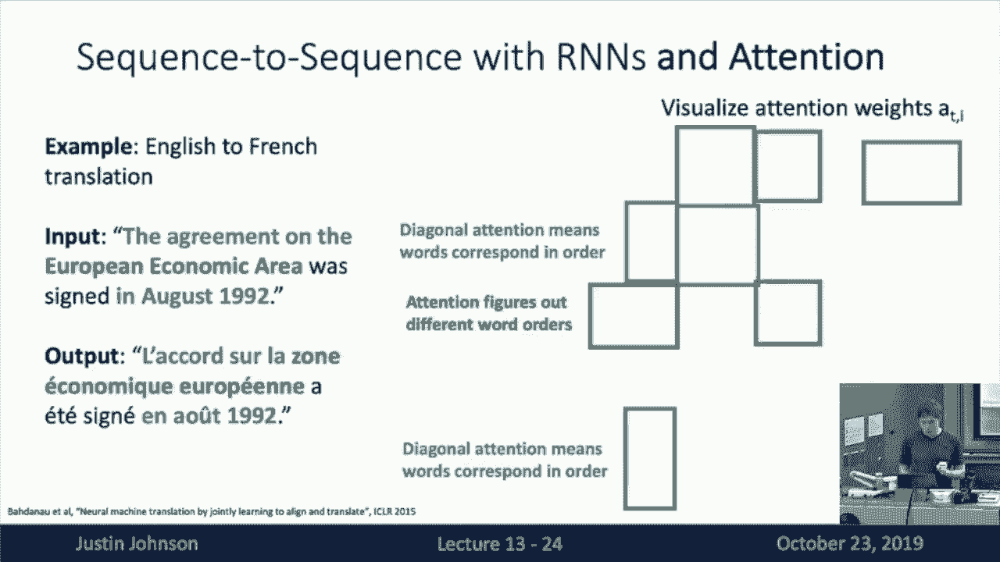
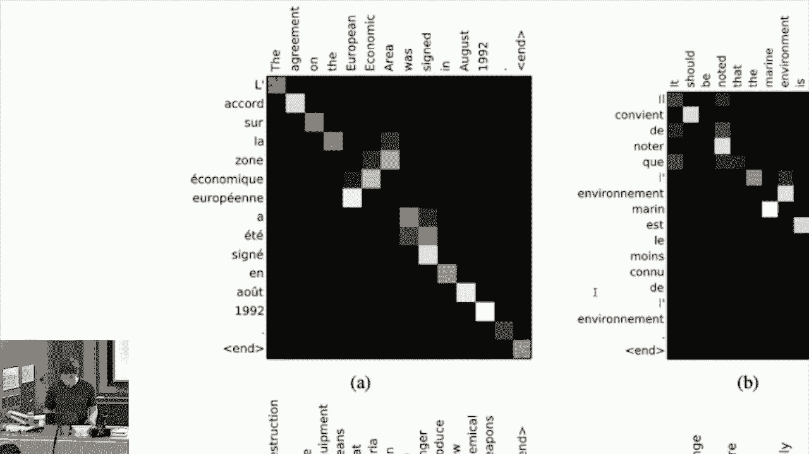
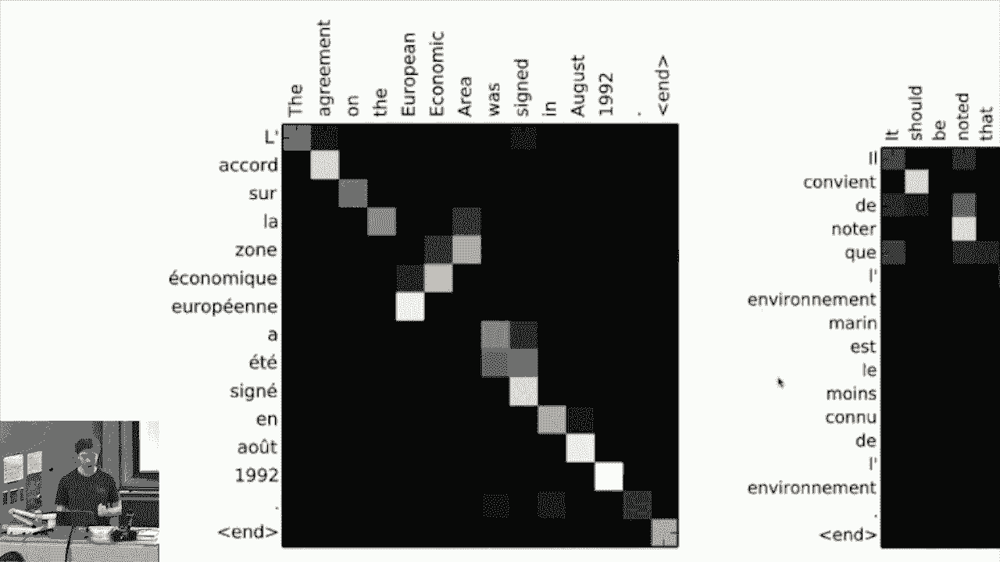
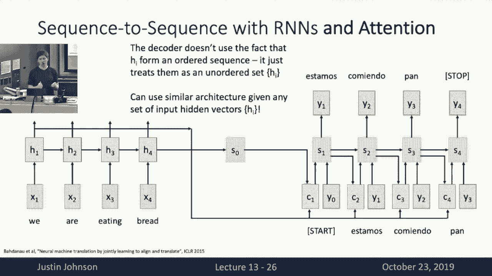
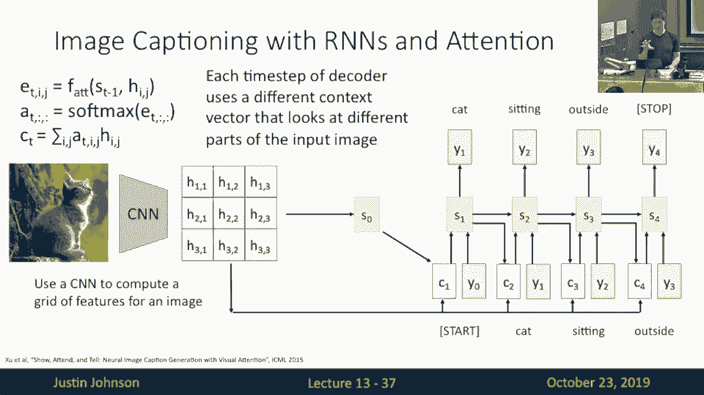
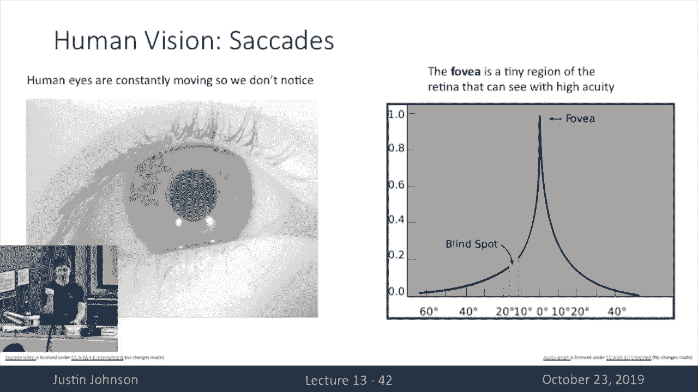
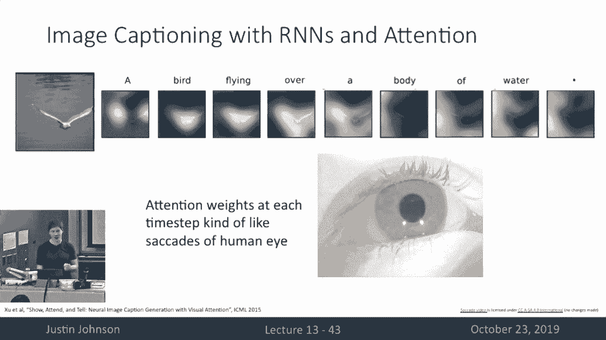
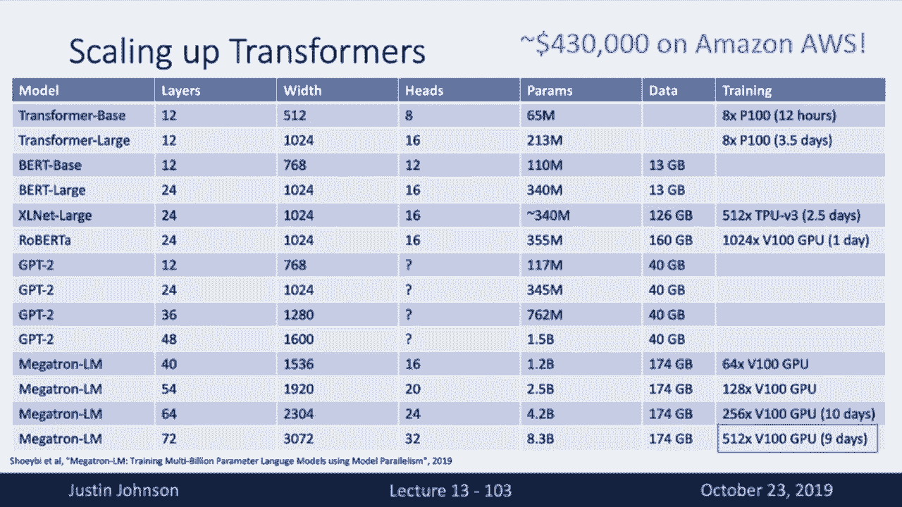
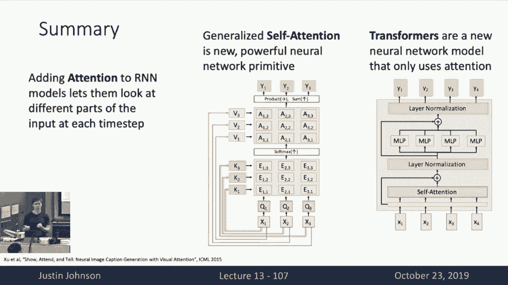

# P13：L13- 注意力机制 - ShowMeAI - BV13P4y1t7gM

okay it seems like a microphone is not，okay it seems like a microphone is not。

working today so i'll just have to，shout loud is that okay anyone can hear，me in the back。

okay good so today we're back at lecture，13。uh today we're going to talk about。

attention and i'll try to avoid making，bad jokes about，paying attention so last time before the。

midterm we left off by talking about，recurrent neural networks，and remember that we saw recurrent。

neural networks with this really，powerful new，type of structure that we could insert。

into our neural network models，that would let us process different the。

processed sequences of vectors，for different types of tasks um and we。

saw that by moving from these feed，forward neural networks，to recurrent neural networks that could。

process sequences this allowed us to，build neural networks to solve all kinds，of new types of tasks。

um so we saw examples of maybe machine，translation，where you want to transfer transform one。

sequence into another sequence，um or we saw examples like image。

captioning where you want to predict a，sequence of words，to write a natural language caption。

about input images，and today we're going to pick off pretty，much where we left off at the end of the。

recurrent neural networks lecture last，time，because that will lead very naturally。

into the discussion of attention，so to recap let's think back to this。

problem of sequence to sequence，prediction with recurrent neural，networks。

so here remember that the task is that，we receive，some sequence of input this is x1，through xt。

and this might be and then we want to，produce some output sequence。

y y y t where here maybe x the x's are，the words of a sentence in english。

and the y's are maybe the words of the，corresponding sentence in spanish。

and we want to do some translation that，converts the word that converts。

a sentence in one language into sentence，in another language，and of course because different。

languages use different words for，different concepts then of course the。

two sequences might be of different，length，so we represent that here by saying that。

the input sequence is like，x as length of capital t and the output，sequence y has length，last。

last lecture we talked about a sequence，of sequence recurrent neural network，architecture。

that could be used for this kind of a，sequences sequence translation problem，um so。

recall the way that work is that we use，um one，one neural network called one recurrent。

neural network called the encoder，which would receive the the x vectors，one at a time。

and produce this sequence of hidden，states h1 through ht，um and then at every time step we would。

use this for current neural network，formulation fw，that would receive the previous hidden。

state and the current input vector x，x i and then produce the next hidden，state。

so then we could apply this one，recurrent neural network to process this。

whole sequence of input vectors，um and now here's uh going a little bit。

more into detail on how this works，so then once we process the input vector。

then we want to somehow uh，summarize the entire the entire uh，content of that input。

sentence um with two uh vectors here，so one we need to produce because。

remember we're going to use another，recurrent neural network as a decoder。

that's going to be used to generate the，output sentence one word at a time。

so now we need to summarize the input，sentence in two vectors，um one we need to compute this uh this。

initial hidden state，of the decoder network which is shown，here as s0。

and we also would like to compute some，context vector c，passed，to every time step of the decoder and。

now here，it's often one common implementation，here would just be to set the context，vector。

equal to the final hidden state and，another common thing would be to set the，initial hidden state s0。

um to be predicted with some kind of，feed forward layer or like a fully，connected layer or two。

and now in our decoder what we're going，to do is we're going to start off by。

receiving some input start token，to say that we want to kick off the。

generation of this output sequence，and then at the first time step of our。

output recurrent neural network，of the decoder is going to receive both，the initial hidden state s0。

as well as this context vector c as well，as this，start token y0 and then it will generate。

the first word of the output sentence，so then this would repeat over time and。

now at the second time step of the，decoder remember it's going to again。

input the hidden state at the previous，timestep s1 uh the，the the the word the first word of the。

sentence and again we'll receive again，this context vector c，um so then we can run this for multiple。

we've，been able to translate this input，sentence we are eating bread into its，corresponding。

spanish translation which i'm hoping，getting right because i haven't taken，spanish in a while。

um but then one one thing to point out，about this architecture。

is that we're using this context vector，here in purple，serves this very special purpose of。

transferring information between the，encoded sequence，and the decoded sequence so now this。

context vector is supposed to somehow，summarize all of the information that。

the decoder needs to generate its，sentence，and then this context vector fed in at。

every time step of the decoder，um so this this is kind of this is a，fairly reasonable architecture。

that we left off on for last time but，there's a problem here，is that maybe this this kind of makes。

sense and we can imagine this，this working out if these sequences are，going to be fairly short。

um so for these these simple example any，kind of example that fits on a slide is。

only going to be sequences that are a，couple elements long，but in practice we might want to use the。

type of sequence of sequence，architectures，to process very very long sentences or。

very very long documents，so for example what if we were，translating not a short simple sentence。

but trying to translate an entire，paragraph or an entire book of text。

then this architecture becomes a problem，because，now what happens is that the entire uh。

information about that input sentence or，input document，is all being bottlenecked through this。

single context vector c shown in purple，and while it might while using a single。

vector to represent the entire，sentence might make sense for a single。

short sentence um it feels kind of，unreasonable，to expect the model to pack an entire。

paragraph or entire book worth of，content，into just a single context vector c。

um so that that seems like so in order，to overcome this shortcoming。

we want to have some mechanism to not，force the model to bottleneck all of its。

information into a single factor，c so there's a simple workaround that we，might imagine。

well what if rather than using a single，context vector c，what if instead we compute a new context。

vector，at every time step of the decoder，network and then we can sort of。

allow the decoder the ability to choose，or reconstruct a new context factor。

that focuses on different parts of the，input sequence at every time step of the，decoder。

well that's that seems like a pretty，cool idea um so the way that we，formalize this。

intuition is with a mechanism called，attention，um so here we're going to um still use a。

sequence to sequence recurrent neural，network we're going to have a recurrent，neural network。

as the encoder that will encode our，input sequence as a sequence of hidden，states。

and that we're again going to use a，decoder network that is again a，recurrent neural network that。

produces the output one at a time but，now the difference is we're going to add，network。

called an attention mechanism which will，allow it to recompute。

a new context vector at every time step，of the decoder，so to see how that works the encoder。

looks exactly the same，we still are going to produce the，sequence of hidden states of the input。

sequence，and then predict this initial hidden，state for the decoder sequence。

but now here's what here's where things，get different and here's where things，diverge。

from the the previous sequence of，sequence architecture that we've seen。

so now what we're going to do is we're，going to write down，some alignment function um here shown in。

the upper right hand corner，f sub att and now this alignment，function。

will maybe parametrize as a fully，connected neural network so you should。

think of this alignment function，as a little tiny fully connected network。

that's going to input two vectors，um one is the current hidden the current。

hidden state of the decoder，and the other is one of the hidden，states of the encoder。

and now this alignment function will，then output a score to say。

how much should we attend to each hidden，state of the，encoder given the current hidden state。

of the decoder，so for example when we're pro when we're，about to and then we'll use this。

information to somehow construct a new，context vector，at every time step of the decoder um so。

concretely the way that this looks at，the first，the very first time step of the decoder。

is that we've got our initial hidden，state our initial decoder hidden state s，sub zero here。

and now we'll we'll use this f sub ett，function，to compare s0 with h1。

and that will give us so this alignment，score e11，and that is basically how much does the。

model think that um，the hidden state h1 will be necessary，for predicting the word that comes after。

uh output hidden state s0 um this will，output a single sc，and this this this alignment function。

will output scalars um so then this will，output a scalar e11。

um a scalar e1 e12 that's again going to，say how much，does do we want to use the second hidden。

state of the encoder when we're，trying to produce the word at the first，hidden state of the decoder。

and then we'll just run this function，for every hidden state of the encoder。

i'm passing it in that hidden state of，the decoder，so now each now we've got now we've got。

an alignment score for each hidden state，in the encoded in the encoded sequence。

but these alignment scores are just，arbitrary real numbers because they're。

they're getting spit out from this feed，forward neural network f sub att。

so then the next step is that we'll，apply a soft max operation，to convert that um those set of。

alignment scores，into a probability distribution um，right so remember the softmap this is。

the exact same softmax function that，we've seen in the image classification，setup。

um that's going to in input a vector of，arbitrary scores，and then output a probability。

distribution with the intuition so that，means that higher scores will give，higher probabilities。

um each of the outputs will be real，numbers between zero and one。

and all of the output probabilities will，sum to one，so basically now we've converted we。

predicted this um，this probability distribution that says，for the first hidden state of the，decoder。

how much do we want to use how much，weight do we want to put on each hidden，state of the encoder。

so now that we've got these attention，and these uh these this color。

distribution is called attention weights，because this is how much we want to。

weight each of these hidden states，so now the next step looks a little bit，scary but it's basically。

we're going to take a weighted sum of，each of the hidden states of the encoded，sequence。

and we'll sum them up according to these，predicted probability scores。

and this will produce our context vector，c1 that we're going to use。

um for the first time stuff of the，decoder network，um and what this basically means is that。

we've used this，the network has sort of predicted for，itself how much weight do we want to put。

on each of the each of the hidden states，on the input sequence。

and we can dynamically shift that weight，around for every time step of the，decoder network。

that will allow us to predict a，different context vector for each，decoder time step。

and now we're and now um our d now we，can finally run the first，time step of our decoder or current。

neural network so this decoder network，will input the context vector that we。

just computed it will input the first，word which is the start token that i。

forgot to put on the slide，and then it will output this first，predicted word of the sentence。

and now the intuition here is that when，we're trying to generate，these output words of the output。

sentence then each word of the output，sentence，probably corresponds to one or multiple。

words in the input sentence，um so then we can we're trying to，dynamically generate。

this context vector that causes the，output uh the output the decoder network。

to allow it to focus on different parts，of the input of the encoder network。

for each time step um so maybe the kind，of concrete intuition here。

is that when we're trying to translate，this particular sentence um we are，eating bread。

then the first word we need to generate，is estamos，which means uh we which is sort of like，we are。

doing something in spanish um so then，the intuition is that，maybe we want to place some relatively。

high weights on these first two words，of the of the english sentence and。

relatively low weights on the latter two，words of the english sentence。

and that will allow the decoder network，in，the input sequence that are needed for。

producing this particular word of the，output sequence，and the other point is that these are。

all differentiable operations，we are not telling the neural network。

which things it is supposed to pay，attention to at every time step of the，decoder sequence。

instead we're just letting the network，decide for itself which parts it wants，to look at。

and because all of the operations that，are involved in this computational graph。

here all of these operations are，differentiable which means that we don't。

need to supervise or tell the network，which parts it's supposed to look at。

instead we can just write down this，whole big，mess of operations as one big，computational graph。

and then back propagate through each of，these operations to allow，all parts of this network to be uh。

jointly optimized，and it will decide for itself which，parts of the sequence it wants to to，focus on。

so now at the next so then at the next，time step we'll kind of repeat this a，very similar procedure。

so then we'll take so now we've got a，new hidden state of the decoder network。

s1 we'll again take that s1 hidden state，of the decoder，compare it to each hidden state of the。

input sequence this will produce a new，sequence of alignment scores e21。

e22 etc and then we'll again run the，softmax to get，a new probability distribution over the。

input sequence，the，second word of the alpha sequence which，words of the input sequence we want to。

focus on，and then we'll again use these predicted，probabilities to produce a new context，vector。

which is again a weighted sum of the，hidden states of the input sequence。

that are weighted by this new，probability distribution that our model，has predicted。

at the second time step of the decoder，and then we can kind of repeat this。

process over and over and then again，we'll run the next forward pass or the。

next time step of the decoder rnn，that will receive the nuke the second。

context vector receive the first input，word and then produce，the second output word and then again。

the intuition here is that maybe when，we're generating the second word。

comiendo means something like eating or，we are or are eating，so then when generating the second word。

then maybe the model might prefer to put，some more attention weight on the time，steps of our eating。

and then it might choose to ignore the，parts of wee and bread，which are not relevant for producing。

this particular word of the output，sequence，but again this is all sort of trained。

end-to-end differentiably，we're not telling the model which parts，it's supposed to focus on。

but the intuition is that this gives the，model the capacity，to choose to focus on different parts of。

the sequence when generating the output，sequence，um so then again we can then we can kind。

of unroll this for multiple time steps，and then we've got in this example of，sequence to sequence。

uh translate a sequence to sequence，learning with attention，um so now again this this this basically。

overcomes this problem of bottlenecking，that we saw with this vanilla sequence。

the sequence model because now，rather than trying to stuff all of the。

information about the input sequence，into just one single vector and then。

using that one vector at every time step，with the decoder，we're giving the decoder this。

flexibility to generate its own，new sequence of context vectors that are，going to vary with each。

time step of the decoder network so now，again the intuition，is that if we're working on very very。

long sequences then this will allow the，model to sort of，shift and shift its attention around and。

focus on different parts of the input，for each different part of the output，can。

do is have my slide completely messed up，okay so this is the image that。

powerpoint refused to display for me，um but basically what we're doing here。

is we've trained a sequence of sequence，for current neural network。

that's going to input a sequence of，words in english，and then output a sequence of words in。

french um，or maybe maybe it was the reverse i，can't actually remember um because this。

figure is not clear，but we're doing some translation tasks，between words in english and words in。

french，um so then one way one thing and then，this，sequence sequence attention so at each。

time step of the decoder network，it's generating this probability vector。

over all of the words of the input，sequence，that allow it to focus its attention on。

different words of the input sequence，while generating the output sequence and，weights。

to gain some interpretability into what，the model is doing，or how the model is making its decisions。

when doing this translation task，so you can see we've got this english，sentence at the top。

uh the agreement on the european，economic area was signed in august 1992。

period end and then down the the bottom，here we've got a corresponding sentence，in french。

which i will not attempt to pronounce，because i will horribly butcher it。

um but what's very interesting and now，this um this uh，this diagram here is then showing us for。

every time step of the output，what what are these attention weights。

that the model is choosing to produce，so there's a lot of interpretable。

structure in this figure that we can see，so the first thing is that up here in。

the upper left corner of the，of the of the thing we see this diagonal。

pattern of the attention weights，that means that when generating the word，the the uh。

the model put most of its attention on，the the french token，or apostrophe and when generating the。

english word agreement，then it put most of its attention on the，french word。

accord which i guess means agreement um，hopefully，right so that what this means is that。

this this gives us this interpretability，that while generating these first four。

words of the output sequence，those correspond in a one-to-one manner。

um to the first four tokens of the，french sequence，and again this correspondence was。

discovered by the model for itself，we're not telling the model which parts。

of sentences align to which other parts，but now the really interesting thing，happens with this。

zone economic europe sorry，the english is european economic area。

but the corresponding part of the french，sentence，has the three same words but they're in。

a different order so now i'm guessing，zone in french corresponds to area in，english and you can see。

that economic economic in english，corresponds to economic and french。

and european as this corresponding，structure as well so now，the model is sort of figured out that。

these three words correspond with the，order flips in the sentence。

and this this sort of trend continues，throughout the entire sentence。

so what's really cool about these，attention mechanisms is that now we've。

actually got some interpretability，into what the until we have some insight。

into how the model is choosing to make，its decisions，which is something that we haven't。

really gotten much we haven't really，been able to do before，with other types of neural network。

architectures so now we've got this，pretty cool setup right that we've got。

this attention mechanism that lets the，model generate sequences。

and then at each time step of generation，choose to look at different parts of the，input sequence。

but there's actually something that we，can notice about the mathematical，structure of this model。

which is that this attention mechanism，that we built，does not actually care about the fact。

that the input is a sequence，right it just so happens in this in this，task of machine translation。

that we're having our input is a，sequence and our output is a sequence。

but for the purpose of this attention，mechanism it didn't actually use the。

fact that the input vectors were a，sequence，right so in principle we can actually，use the exact same。

flavor of attention mechanism to build，models that attend，to other types of data which are not。

sequences right so here on the left，we're supposed to input this image of a。

bird and then we run it through a，convolutional neural network，and you should imagine that remember。

that a convolutional neural network，um if we take the outputs of the final，convolutional layer。

we can interpret that as a grid of，feature vectors so the second image you。

should imagine as a grid of feature，vectors，that correspond to a different feature。

vectors corresponding to each，uh spatial position of this invisible，image of a bird。

and now we're going to do is we're going，to use this exact same attention，mechanism。

that we did with with the sequence model，that is going to input。

the hidden the this so then we're going，to use that sequence of uh。

that grid of vectors to predict this，initial hidden state for a decoder rna。

and now this decoder rnn will use that，initial hidden state as 0。

to then predict um to then uh use our，comparison function f sub att。

to compute a pairwise alignment score，between every uh，position in the grid of features and our。

initial hidden state as zero，and that and again each of those outputs，will be a scalar that is high。

when we want to put high weight on that，part of the vector and we'll be low when。

we want to give low weight to that part，of the vector，and that will give us this grid of。

alignment scores so then above the grid，of features you should imagine a second。

grid of alignment scores，where each element in that grid again。

contains a scalar that is produced from，this f att mechanism，and now we have another image that we。

need to imagine is that we have that，grid of attention scores that will then，pass through a。

max operation that will again normalize，all of those scores to some probability。

distribution that sums to one，and again this will basically be a print，of the model predicting。

a probability distribution over all，positions in the input image。

that it will choose to attend to when，generating the first word of the output，caption。

um so then again we'll take a weighted，combination of those uh。

hidden vectors um that are uh we'll take，the，this grid of vectors and we'll have a。

linear combination of them that are all，weighted by these predictive。

attention probability scores and this，will produce this first context vector，c1。

that we will use when generating the，first token of the output sequence。

um and then we can pass that through the，the first layer of the rna decoder and。

generate the first word sql，so now you should imagine a sequel here，again。

so then again we can use uh the next，hidden state to compare the hidden state，s1。

with every position in the grid of，features to produce another grid of，alignment scores。

again normalized through a softmax to，give a new distribution。

over all positions in the image and then，give a new context vector。

the second time step of the decoder that，we'll use to generate the word over。

so now you're clarifying this picture in，your mind，and then continue forward and eventually。

generate this caption，seagull over water stop and you can see，that this this structure of the model。

is now very very similar to that which，we've done in the the sequence of，sequence translation case。

that we're generating this output，sequence which is a caption we generate，one word at a time。

and now at every time step of generating，this output sequence。

we're allowing the model the ability to，generate its own，new context vector by having a weighted。

recombination，of the grid of features of the input，image，then we can get up so this was the bird。

image you were supposed to be imagining，for，um and what you can imagine here is that。

now when generating this up so that the，model is receding this input bird image。

that you can now finally see，and then we're generating this output。

sequence of words one word at a time，a bird is flying over a body of water。

period and now at every time step of，generating this output sequence。

the model is predicting these attention，weights they give a probability，distribution。

over the positions of the the grid of，features，that are predicted by the convolutional。

network which is processing the input，image，so you can see that when when producing。

when predicting the words bird flying，over then the model tends to give。

attention to these positions in the，input image that correspond to the bird。

and then maybe when it predicts the word，weight，is sort of no but now ignoring a bird。

instead looking at the parts of the，image，that have the water around them instead。

yeah the question yeah so um the picture，the second row is something we were not。

supposed to talk about today，and it was actually not on the，powerpoint slide but since you asked。

the idea is that in this method in this，version of attention that we've seen so，far。

the model is actually using this，weighted recombination，of features at every point in the input。

image but what if instead，rather than having a weighted，recombination what if we wanted the。

model to just select，exactly one position in the in the input，grid of features。

and then rather than using a weighted，recombination instead just use the，features from。

exactly one position in the input and it，turns out that that's what the second，row is doing。

but the but training the model to do，such a thing，requires some additional techniques that。

we'll cover in a later lecture，um so that part was actually cropped out，in the image on the slide。

now the next slide was supposed to be，this figure which gives us a couple more，qualitative examples。

of this model um using its attention，mechanism to focus，its attention on different parts of the。

input image when generating uh text of，the output，so for example here when the model is。

looking at this image of these people，playing frisbees，then when generally it generates the。

caption a woman is throwing a frisbee in，the park，and then when generating the word。

frisbee you can see that the model，chooses to put its attention。

on the on the portion of the image that，actually corresponds to the fritz speech。

uh was there some question over here so，here um you would have。

seen if you were not if you were using，your imagination strong enough but but。

here um we actually would have a grid of，input，of features being predicted by the。

convolutional network where um，h i j is the i j feature and the grid of，features。

predicted by the network so it would be，one position in the feature map。

um so actually this was supposed to be a，three by three grid that was uh h11 h12，h23。

h21 h2823 then the idea is that we，predicted this，probability distribution which gives us。

a probability distribution，over all the positions in that in that。

grid um so then where the probability is，high that means we want。

to put a lot of a lot of attention or，emphasis on the，on the features from that position and。

where the attention weights are low，is going to have very little emphasis on。

the features at that position，uh so ct is a vector um，ct is a vector h-h-i-j is a vector。

um e i e t i j is a scalar，which tells us how much do we want to，emphasize the vector h i j。

um at time step t and now a t，we want，is a normalized scalar telling us how。

much we want to emphasize vector h，i j at time step t and then c。

t is a vector where we're summing over，all positions in the image i。

j um and then we have uh and now uh，a t i j is a scalar so we multiply by，the vector h。

i j so then this is a sum of vectors，then c t will be affected。

one uh one intuition around why we might，want to do this image captioning。

is it actually has a biological，motivation as well，so if you imagine on the left here a，diagram。

of the human eye then you know the human，eye is a sphere，and then you've got a lens at one side。

light comes in through the lens，and then at the back of your eye there's。

a there's a region of the eye called the，retina，um and then the light comes in through。

the lens is projected onto the retina，and the retina contains photosensitive，cells。

that actually detect the light and those，uh those signals from those。

photosensitive cells get sent back to，your brain and get interpreted as。

the stuff that we see um now it turns，out，that uh the retina is not create not all。

all parts of the retina are not created，equally and there's actually one，particular。

region of your retina in the very center，of the retina called the phobia。

which is much more sensitive than all，other parts of the retina。

um and what that means is that the graph，on the right，is supposed to be a graph of visual。

acuity um on the y-axis，and the x-axis is supposed to be the，position in the retina。

and what this means is that at the very，far parts of the retina you have very，low visual acuity。

as you move towards the phobia the，visual acuity goes up and up and up and，up and up。

and then right in the phobia you've got，this very very high visual acuity。

and then moving down from the phobia it，moves down down down down towards the。

edge of the retina on the other side，where you have very low visual acuity。

and what this means is that there's only，a very small，region in your eye that can actually see。

the world with high definition，um and you kind of have an intuitive。

sense here you kind of put something，right in front of you you can see it，with good detail。

as you move your hand to the side you，here，but you can't really see it you can't。

really maybe it's hard to count how many，fingers are way over here。

and that's because different parts of，your retina actually have different，amounts of sensitivity。

now actually to account for this problem，or this this design of the human retina。

your eyes actually do are actually，constantly moving around，very very rapidly in time periods of。

something like tens of milliseconds，your eyes are constantly moving even。

when you feel like you're looking at，something，um something stationary your eyes are。

actually constantly moving around，um taking in different parts of the。

visual scene and those very very rapid，eye emotions are called psychotics。

and they are not they're not something，that you have physically the digi that。

you have conscious control over，um but basically the those cicadas，mechanisms that your eyes do。

are a way that the human body tries to，overcome this design problem。

of only having very high sensitivity in。

a very small，portion of the of the retina of the eye，and now what this means。

and now image captioning with rnns um，actually is sort of，very loosely inspired somehow by these。

maybe cicada emotions that the human eye，makes，so that you know when you look at。

something um your eye sort of constantly，looks around different parts of the。

scene at every moment in time，and similarly when we're using an image，captioning model。

with attention then at every time step，then the model is also kind of looking。

around at different positions in space，very rapidly it's sort of very loosely。

like the psychotic motions that your。

human eyes can make，so then the first paper that introduced，that this idea。

was called show attend and tell right，because you're going to show。

the model some input image it's going to，attend to different parts of the image。

and then it will tell you what it saw by，generating words one at a time。

now this was such a catchy title that a，lot of other people started using titles，like this。

when building models that use attention，of different flavors。

so then we had ask attendant answer also，show ask attendant answer。

that you can kind of guess what these，are doing right these are models that，look at an image。

they're presented with the text of a，question about that image they attend to。

different parts of the image or，different parts of the question。

and they answer the question we've got，listen attend and spell。

this is going to process the raw audio，waveform of some piece of sound。

then it's going to generate letters to，spell out what words were spoken in that，piece of sound。

and it's going to attend at every and，when generating the words of the output，one at a time。

it's going to attend to different，spatial position different temporal，positions。

in the input audio file um we had a，listen attendant walk，that was a processing text and then。

outputting decisions about where a robot，is supposed to walk in some interactive，environment。

um we have show attend and interact um，that's also，supposed to uh output some robot，know。

these these paper titles got to be very，trendy after a while um but basically。

this is to say that this this mechanism，of attention，that we've seen so far is actually very。

for this，this machine translation problem where，we want to input a sequence into another，sequence。

and it can also be used for all these，other all these other tasks。

so basically anytime you want to convert，one type of data，into another type of data and you want。

to do it over time one time step at a，time，then often you can use some kind of。

attention mechanism to cause the model，to focus on different，chunks of the input or different parts。

of the，output so that gives us um that that，gives us this very general uh mechanism，of attention。

um and then they all work exactly the，same way um so you can kind of guess how。

the models work just by reading，the titles of these papers oh man this，image finally showed up。

and you can see the bird it's great um，okay so then uh，what so now we've seen this this。

mechanism of attention used for a bunch，of different tasks，um but over the past couple of years um。

what do you do in computer science once，you've got something that seems useful。

for a lot of different tasks，then you want to try to abstract it away。

and generalize it and apply that idea to，even more types of tasks，so then um we want i want to step。

through a couple steps，that we can start from this this piece，of this this mechanism of attention。

that we've used now for for image，captioning and machine translation。

and by generalizing it just a little bit，we'll end up with a very powerful。

new general purpose layer that we can，insert into our recurrent neural and。

into our into our neural networks so one，way to reframe，the type of attention mechanism that。

we've seen so far is that it inputs a，query vector，we're going to call it q um and in in。

the previous uh attention that would，have taken the place of these。

hidden state vectors that we had at each，time step at the output，we also have a collection of input。

vectors x，um that correspond to this this set of，hidden vectors。

that we want to attend over and we also，have some similarity function f sub att。

that we're going to use to compare the，query vector to each of our database of，input vectors。

so now this is uh the so then the，computation of this attention mechanism。

that we've seen several times now is，that in the computation，we want to produce this vector of。

similarities by run，by running this uh attention uh this f，att attention。

uh function um on the query vector and，on each element，of the the input vectors and then this。

will give us these these unnormalized，similarity scores，that we will run through a softmax。

function to give now a normalized，probability distribution，over each of the input vectors x and now。

the output now we will output a single，vector y，um that is a weighted combination of the。

vectors x in the input，okay so now the first generalization is，that we want to change the similarity。

function，so previously we had written down the，general，f sub att function but that's indeed。

what early，papers on attention had done but it，turns out it's much more efficient and。

works just as well，if we use the simple dot product between，vectors as our similarity function。

um and that's going to simplify things a，bit um so now，uh rather than running a neural network。

to compute these similarities，we can compute all these similarities。

all at once with some kind of matrix，multiplication，and that will be much more efficient but。

then there's actually a little，detail that people use rather than using。

the dot product instead people often use，what's called a scaled dot product for。

computing these similarity scores，so now when computing the similarity。

score between the query vector q，and one of our input vectors x i um the。

the similarity score will be uh q dot，product with x，i divide by square root dq where dq is。

the dimensionality of those two vectors，and now why would you want to do that。

well the intuition is that，we're going to take we're about to take。

those similarity scores and we're about，to run them through a slot max。

and we know that if elements of the soft，max are really large，then we'll have a vanishing gradient。

problem right if there's one element of，those uh ei of，in that attention weights e that is much。

much higher than all the others，then we will end up with a very very。

highly peaked soft max distribution，that will give us gradients very close。

to zero almost everywhere and that might，make that might make learning，challenging。

so what we want to do is um and another，problem is that as we consider vectors。

of very very high dimension，then their dot products are likely to，also be very high in magnitude。

so as a concrete example consider，computing the dot product of two vectors，a and b。

both of dimension d and suppose that，these are constant vectors，now the dot product of those two now。

remember the dot product of two vectors，is the product of their magnitudes。

multiplied by the cosine of the angle，between the vectors right。

um so then if suppose that we have these，two constant vectors。

um then the the the magnitude of one of，these vectors，now is going to scale with the square。

root of the dimension of the vector，which means that if we are going to work。

with neural networks that have very very，large dimensions，then then naturally we would expect。

these dot products of very high，dimensional vectors，to give rise to very high values so to。

counteract that effect，we're going to divide the dot product by，the square root of the dimension。

to counteract this of this effect by，which the dot product tends to scale as。

we scale up the dimension，and that will give us nicely more nicely。

behaved gradients as we flow through the，softmax function，okay so then the next generalization。

is that we want to allow for multiple，query vectors，right so previously we always had a。

single query vector at a time，right at each time step of the decoder，we had one query。

and then we use that query to generate，one probability distribution over all of，our input vectors。

well now we'd like to generalize this，notion of attention and，have a tension that has a set of query。

vectors，so now our inputs now we input a set of，query vectors q。

and a set of input vectors x and now for，each query vector we want to generate a。

probability distribution，over each of the input vectors so then。

we can compute all of these similarities，and，then we need to we need to compute a。

similarity between each query vector，and each input vector and because we're。

using the scale dot product as our，similarity function，we can compute all of these similarity。

scores all simultaneously，using a single matrix multiplication，operation um。

then remember we want to compute for，each query vector，we want to compute a distribution over。

the input vectors，so now we can achieve this by by doing a，softmax over these output。

attention scores where we take the，softmax over only one of the dimensions。

and then we want to generate our output，vectors as now now we want to generate。

previously we were generating one output，vector now because we have a set of，query vectors。

we want to generate one output vector，for each query vector，right where the output vector for query。

q i，will be a weighted combination of all of，the input vectors，and they will be weighted by the。

distribution that we predicted for，that query vector um and again we can，act if you're kind of。

careful with your matrix shapes you can，actually compute all of these linear，combinations。

all simultaneously using again a single，matrix multiplication operation。

between these predicted attention，weights a and the the input vectors x。

okay so then the next generalization is，okay so then the next generalization is。

the way that we use the input vectors，right so if you look at this formulation。

we're actually using the input vectors，in two different ways right now right。

first we're using the input vectors，to compute the attention weights by，comparing each input vector。

with uh each query vector and then we're，using the input vectors。

again to produce the output right and，this these actually are two different。

functions that we might want to serve，so what we can do is separate this input，vector into。

a key vector and a value vector right so，what we're going to do is we're still，going to input。

a set of query vectors q and a set of，input vectors x，but now rather than using the input。

vectors directly for these two different，functions，inside the inside of the operation。

instead we will use，we will have a learnable key matrix wk，and a learnable value matrix wv and then。

we will use these learnable matrices to，transform the input vectors。

into two new sets of vectors one of the，keys，and one of the values and now these now。

we use these two，keys and values for these two different，purposes in the。

in the computation of the layer so then，what we're going to do is we're going to，compare。

when in order to compute the similarity，scores we compare each query vector with，each key vector。

and then when computing the output，scores that the outputs are going to be，a weighted combination。

of the value vectors that are going to，be weighted by，the by the predicted similarity scores。

right and the intuition here is that，this gives the model more flexibility。

in how it uses its input data right，because，the query vector is kind of the model。

saying that i want to search for this，thing and then hopefully it needs to get。

back information which is different from，the thing it already knew。

right it's kind of like when you search，into google um uh，how tall is the empire state building。

that's your query，and then google goes and compares your，query to a bunch of web pages。

and then returns you the web pages but，you don't actually，care about web pages that match your。

query because you already know the query，you want to know something else about。

the data which is relevant to it which，is related to the query in some way。

so like in a web search application you，retrieve according to this query how。

tall is the entire state building，but the data you want to get back is。

actually a separate piece of data，which is that height like however many。

meters which maybe occurs in the text，that is next to the query in the text is。

that kind of distinction clear what we，might want to separate the key value。

and the value vector right it gives the，model then more flexibility to just use。

its inputs in two different ways，okay so then this is kind of a，complicated operation so we have a。

picture and this picture actually shows，up，um so we can kind of visualize this。

operation or we've got this set of query，vectors coming in，here at the bottom of q1 and q4 and then。

we've got the set of input vectors，x1 to x3 coming in on the left and now，the first thing we do。

is for each input vector we apply the p，matrix to compute，a key vector for each input and now we。

compare，each key vector to each query vector and，this gives us this matrix of。

unnormalized similarity scores，where now for each out where each，element in this similarity matrix。

is this a scale dot product between one，of the key vectors，and one of the query vectors and now the。

next thing we do is，these uh these attention scores are，unnormalized so the next thing we want。

to do is for each query vector，we want to generate a probability，distribution over each of the key。

vectors or each of the inputs，so the way that we do this is we perform。

a softmax operation over the vertical，dimension，of this of this alignment matrix e and。

this gives us our alignment scores，uh a so and now because we've done the。

soft max over the vertical direction，now each column of this alignment matrix。

gives us a probability distribution，over all of the inputs x1 x2 x3。

so now the next thing we do um is we've，got our alignments now we need to，compute the output。

so then we um again transform the input，vectors um into another。

into the we transform each input vector，into a value vector，that gives us these value vectors v1 v2。

v3，in purple and then we're going to，perform a weighted combination。

of the value vectors according to these，computed alignment scores，so then what we do is that um for。

example，when computing v1 um we'll will uh take，a product going going this way and then。

take a sum going this way，actually that's not quite right right so。

actually that's not quite right right so，what we want to do is we want to take a。

v1 multiplied by a1 v2 multiplied by a12，up，so it's kind of like we need to take。

their value vectors and then match them，up with each column and then take a sum，going up。

and then what you can see is that this，produces one output vector y。

for each query vector um q and these，output vectors y will be this linear，combination of。

value vectors where the weights are，determined by the dot products between，the key vectors。

and the query vectors okay，so now this is uh this is the this is an。

attention layer and now this is a very，general layer that you can imagine。

inserting into your neural networks，but now anytime you have sort of two。

sets of data on one that you want to，think of as a query，and one that you want to think of as the。

inputs then you can imagine，just inserting this attention layer that，computes this kind of。

this uh all pairs combination where each，query needs，recombined with each input and now one。

special case of this is the，self-attention layer，where we actually have as input only one。

set of vectors，and now what we want to do is compare，each input of。

each each vector in our input set with，each other vector in our input set。

and the way that we do this is we add，another learnable weight matrix。

layer so now rather than taking the，query vectors as input，we're going to again predict the query。

vectors by transforming the input，vectors one at a time，um and then everything else is the same。

as what we've already seen，so if you look at how this works，pictorially on the right we receive as。

input this，set of input vectors x1 x2 x3，and now for each input vector we convert。

it into a query vector by multiplying，with this uh with this query matrix。

and then similarly we also convert every，input vector，also into a key vector using the dip。

using the separate key matrix，and now we can now we compute these，alignment scores that gives us。

the similarity between each key vector，and each query vector。

which is then this pairwise similarities，between each pair of inputs in our input，sequence x。

now we do the exact same thing we do a，softmax to compute a，distribution over each column and then。

we take our input vectors and now，convert them again，into value vectors and then perform this。

again weighted similarity，um to uh produce this sequence this set。

of output vectors y um and now this，is a very very general mechanism right。

so what now we've got this is basically，a whole new type of neural network layer。

right because it's inputting a set of，vectors and it's outputting a set of，vectors。

and internally what it's doing is，comparing each vector，with each other vector in the input in。

this sort of nonlinear，way that is decided by the network for，itself actually this one really，layer。

is to think about what happens if we，actually change the order of the input，vectors。

right so what if we change the input，vectors and we have the same vectors but。

rather than presenting them in the order，one two three，we now present them in the order three。

one two so now what's going to happen，then we're going to compute the same key。

vectors and the same query vectors，because the computation of the key。

vectors and the query vectors was all，independent of each other。

so we'll end up computing exact same key，vectors and the exact same query vectors。

but we'll just have them，also permuted in the same way that the，input vectors were from unit。

and then similarly when we go to compute，our similarity scores between these，permuted vectors。

we will end up computing all the same，similarity scores but now again this。

matrix will be permuted because all the，rows and columns，are commuted but um but the values in。

this in this，matrix are the same and then similarly，the attention weights that we're going。

to compute will again all be the same，but permuted，the value vectors will all be the same。

but permuted and the output vectors will，all be the same，but permuted so what this means is that。

um one one technical way to talk about，layer，or self-attention operation is，permutation equivalent。

that means that if we take our input，vectors x and then apply some，permutation to them s。

then that then the output is going to be，the same as，uh applying the layer to the unpermuted。

inputs and then permuting the outputs，does that make does that make sense，right so。

and then another way to think about that，is that this self-retention layer。

doesn't care about these order of its，inputs it is somehow a new，type of neural network layer that。

doesn't care about order at all，it just operates on sets of vectors so。

what another one way to think about what，this self-attention layer is doing。

is that you get a set of vectors it，compares them all with each other and。

then gives you another set of vectors，layer，actually doesn't know what order the。

vectors appear and when it processes，them，um so but in some cases you actually。

might want to know the order of the，vectors，right so for example if you were。

imagining some kind of a translation or，captioning task，then you know maybe the further you get。

along in a sequence then the more likely，it becomes that you should。

generate a period or generate an edge，token so for some types of tasks。

it might actually be a useful signal to，the model to let it know。

which vectors appear in which positions，um but because，this self-potential layer is permutation。

equivariant，by default it has no way of telling，which vector is the first one and which。

vector is the last one，so then as kind of a half we can recover，some。

sensitivity to permutation by appending，each input vector，with some encoding of the position so。

there's different ways that this can be，implemented one way that you can，implement it is you just。

learn a lookup table and you add a，learnable weight to the metric to the to，the network。

we're going to learn a vector for，two，learn a vector for position three and so。

on and then when you perform the forward，pass of your network，you're going to append the learned。

position one vector onto the pert under，the first vector，we'll append to learn position two。

vector input and so on and so forth，and now this gives the model the ability。

to now distinguish which parts of the of，the sequence are at the beginning。

and which parts of the sequence are at，the end this is sometimes called，positional encodings。

and you'll see these sometimes used in，these self-attention models，now another variant on this。

self-attention layer that we'll，sometimes use，is called a masked self-attention layer。

so here the intuition，is that um when doing some kind of tasks，we actually don't。

we want we want to force the model to，only use information from the past。

so if you remember in our current neural，network this sort of happened by design。

by the way that we have this progression，of hidden states，so for some kind of task like language。

modeling we might want to try to predict，we want to ask the network to predict。

the next token given all of the previous，tokens，and using this default transformer of。

this default self-attention，layer um the the model the model is，allowed to use on every。

vector when producing every output，vector um so that it won't work for this。

kind of language modeling task，some，some structure to this attention matrix。

so if we want for example to force the，model to only use，information from the past then we can。

manually intervene，into this predicted matrix，matrix e what we can do is just put in a。

minus infinity，in every position we want to force the，model not to pay attention to things。

so then in this example we want to when，producing the output vector for the。

for the for the first input on q1 um，then we want it to only depend on uh we。

want the first output to only depend on，the first input，so we can do that what we do is then we。

block those parts of the matrix by，sliding a negative infinities，so then when we compute the softmax。

going up the column，then max of minus infinity will give us，a zero of the attention weight。

um and there's attention in the，attention weight matrix above，um so then this is a sort of structure。

that you'll see when you want，this is called a mask subattention layer。

because we're kind of masking out which，parts of input，the the model is allowed to look at when。

producing different parts of the output，and this is used very commonly for these。

language modeling tasks，where you want to force the model to，always predict the next word given all。

the previous words，another variant of this self-attention，layer you'll sometimes see。

um is a multi-headed self-attention so，what this means is we'll just。

run uh we'll you will choose a number of，heads h，and that will run h self-tensioned。

layers independently in parallel，so then given um our set input vectors x。

what we'll do is we'll split so if um，well if，our vector x has a dimension d then，we'll split。

each of our input vectors into equal，chunks，into h chunks of equal sides and then。

feed the chunks into these，separate parallel of self-retention，layers and now these will produce。

some each each parallel subatomic layer，we'll produce some set of outputs。

one output for each input and then we'll，concatenate those outputs to get the，final output。

from this multi-headed self-retention，layer，and now this this multi-headed。

self-attention layer is actually used in，practice quite commonly。

um and here there's basically two hyper，parameters that we need to set，when setting up one of these。

multi-headed self-detention layers，one is this all right so then the input。

and the output dimension are kind of，fixed，right the dimension of the query vector。

x is now the input dimension of our data，and the final dimension of y is our。

output dimension that we want to predict，and now internally in the model there's。

two hypogrammers we need to set，one is the query the dimension of the。

internal variable key vectors dq，and that's a hypergrammar that we can。

set and the other hyperparameter is the，number of heads that we want to use。

um so these are both when you look when，you see self-attention layers used in，practice。

you'll see people report to the overall，width of the overall width or size of，each flare。

that means the prayer dimension dq and，also report the number of heads and，self-attention their h。

so then as an example um this this，self-attention layer is this brand new。

primitive that we can imagine，inserting into our neural networks and，this is basically a whole new。

type of layer that we can slot into our，networks so as an example，we can see how we can build a。

convolutional neural network that，incorporates one of these self-attention，layers。

so here we can imagine some，convolutional network is taking a，acute cat as input and producing some。

vector，some grid of feature vectors of size c，cross h cross w，as the output of some stack of。

convolutional layers，now what we can do is we'll use uh three，different one-by-one convolutions。

to convert our grid of features into a，grid of queries，a grid of keys and a grid of values and。

these will have separate parallel and，separate，one-by-one convolutions with their own。

weights and biases that are learned，and now we'll compute this uh inner。

product between the queries and the keys，that will give us uh these attention and。

then we'll compute a softmax，that will give us um for every position，in the input image。

then how much does it want to attend to，every other position，in the input image so then this will。

generate this very very large matrix of，attention weights，of size h cross w by h cross w。

and now we'll use these attention，weights to then have this weighted。

linear combination of the value vectors，and will end up producing。

one a value vector for each position in，the in for each position in the input。

and what this means is that now after we，do this linear combination。

then every input vector from the feature，we're producing a new grid of feature，vectors。

but now every position in the output，grid now depends on，every position in the input grid and。

that's qualitatively a very different，type of computation than we have with。

something like convolution，and now in practice when people do these。

things they'll often insert maybe，another one by one convolution，after the end of this attention。

operation um and they'll also，and it's also very common to add a，self，all。

these pieces together this gives us this，new self-contained，self-attention module that is now this。

new neural network module you can，imagine sticking inside of your neural，networks。

and you can imagine building networks，that have maybe some convolution some，self-attention some more。

convolutions more self-attention and，this gives us basically a whole new type。

of layer that we can use to build neural，and now it's interesting to think that。

and now it's interesting to think that，basically at this point we've got three，process。

sequence of sequences of vectors with，neural networks，so the most obvious is um is these。

recurrent neural networks that we talked，about in the previous class。

right that given a sequence of input，vectors x it produces the sequence of，output vectors y or h。

and now what's nice about a recurrent，neural networks，is that they're very good at handling。

long sequences right when we use these，recurrent neural networks like an lstm。

and they're very good at carrying，information over very，over relatively long sequences and in。

particular um after a single r，m layer then the final output or the，final hidden state。

y t actually depends on all the on it，depends on the entire input sequence。

so in a single rnn layer is sort of able，to summarize an entire input sequence。

but there's a problem with recurrent，neural networks and that's actually that。

they're not very parallelizing，right because if you think about the way。

that a recurrent neural network is，computed，we need to compute hidden state 1 then。

hidden state two then hidden state three，that hit in state four。

and this is a sequential dependency in，the data that we just cannot get around。

so um if you recall back to the lecture，on gpus，um the way that we build really big。

neural network models is by taking，advantage of massive massive parallelism。

inside of our graphics processing units，or tensor processing units。

and somehow a recurrent neural network，is not able to do a very good job。

at taking advantage of this massive，parallelism with that we have in our，hardware。

so that's actually a problem for the，scalability of building very very large。

recurrent neural network models，so now we actually know another way of。

processing sequences so we could，actually use one-dimensional convolution，to process sequences。

so you could imagine using，one-dimensional convolution and then，kernel。

that we slide over the input sequence so，maybe each out each position in the。

output sequence depends on a local，neighborhood，of three uh three adjacent elements in。

the input sequence，and this is also something that we could，use to process sequences um。

now convolution is unlike recurrent，neural networks，using convolution to process sequences。

is highly paralyzable，right because each output element in the。

sequence can be computed independently，of all other output elements，so using convolution breaks the。

sequential dependency um that we had，with recurrent neural networks。

but the problem with convolution is that，it's not very good at very very long，sequences。

right because if we want to have a c if，we want um，if we want to have uh some output depend。

on the entire sequence，then we can't do that with a single，convolution layer um we're going to have。

to stack on many many many many，convolution layers on top of each other。

in order to have um see each point in，the sequence be able to see。

or talk to or depend on each other point，in the input sequence，so that's actually also a problem for。

using convolution to process sequences，but the the benefit is they're very。

paralyzable unlike required outputs，and now what you should think about is。

that self-attention is a new mechanism，that we can use，to process sequences or sets of vectors。

that overcomes both of these，shortcomings，one is that self-attention is good at，long sequences。

right because given a set of vectors it，compares every vector with every other，vector。

so then similar to an rnn after a single，self-attention layer，each output depends on each input okay。

so that's a good thing，but also like convolution self-attention，is highly highly paralyzable。

because if you saw the influence if you，recall the implementation of。

self-attention a couple of slides ago，self-attention is computed with these。

giant with these uh just a couple matrix，multipliers and，one suffix operation so um softmax uh so。

uh this self-attention operation，is highly highly paralyzable and it's。

very very well suited to run it on gpus，um so what you should think about is。

self-attention is now an alternative，mechanism we could use to process。

sequences or sets that overcomes both of，these shortcomings of convolution。

and uh recurrent neural networks the，downside with self-attention is that。

they take a lot of memory but gpus are，getting more and more memory all the，time so maybe we can uh。

ignore this point so then the question，is that if you're faced with a problem。

where you want to process sequences with，neural networks how should you combine，these things。

should you use rnns should you use，convolution should you use，self-attention。

should you use some combination of them，well it turns out there was a very，famous paper。

a couple years ago it's that attention，is all you need，and it turns out if we want to build。

neural networks that process，sequences we can do it using only，self-attention。

and the way that that works is that we，build a new primitive，block type called the transformer block。

and this transformer block is going to，depend on self-attention。

as the only mechanism to compare input，vectors so the way that it works。

is that we receive this input sequence，of vectors x1 to x4，we'll run all of our vectors through a a。

self-attention layer that might have，multiple heads，and now after the self-attention layer。

each output from the self-attention，layer will depend on each input。

so that gives us our interaction between，each element between all elements of the，sequence or set。

and now after self-attention we'll add a，residual connection around the，self-attention。

that will improve the gradient flow，through the model after，the residual connection we'll add layer。

normalization，recall that adding having some kind of，normalization in our deep neural。

networks is going to aid optimization，and it turns and in convolutional。

networks we'll often use batch，normalization，it turns out for these sequence models。

layer normalization，interesting，about it but what's interesting about。

the layer normalization the way that it，works out，is that um the output of self-attention。

is giving us a set of vectors，and now layer normalization does not，involve any interaction。

or any communication among those vectors，it's going to normalize each，of the output vectors from。

self-attention independently，so the layer normalization does not。

involve any any communication between，our vectors，after after layer normalization we're。

going to run a feed-forward，multi-layer perceptron that's what we'll。

call it's a fully connected neural，network，and right the output of layer。

normalization will be a set of vectors，then we'll take each of those set of。

vectors and run it through a little，fully connected network，and again this little fully connected。

network is going to operate，independently，for each sequence that is for each of。

each vector in our set，which is which is output from the，previous line normalization。

um we're going to add another residual，connection around these multiplier，perceptrons。

and then we'll add another layer，normalization output，after the output of this residual，connection。

and then we'll put all of these things，together into a block that called the，transformer block。

and this will be the basic building，block of these large of，this can be the basic building block for。

large scale models that process，sequences of vectors so now the input of，a transformer block。

is a set of vectors x the output is also，a set of vectors y，with the same where the out the number。

of output vectors is the same as the，number of input vectors，but the number of output but it might。

have a different dimensionality right，we could use uh you could imagine uh。

changing the dimensionality of these，vectors inside the model，um and now what's what's interesting。

about this self-attention block，is that the only interaction between the。

vectors occurs inside the self-attention，there，because the layer normalization and the。

multiple perceptrons all operate，independently on each vector。

on each input vector and because of the，because of these nice properties of。

self-attention that we saw，this transformer block will be highly，paralyzable。

and very amenable to gpu hardware um and，highly paralyzable highly scalable。

so this is going to be a very good fit，for our hardware，and now to now what we can do is just。

build a transformer model，is just a sequence of these transformer，blocks um and。

what we in in order to build a，transformer model we need to choose a，couple hyper crankers。

one is the overall depth of the model，the number of blocks that we use。

and the original attention is all you，can need in the original attention is，all you need paper。

they used as a sequence of 12 blocks，each of those blocks had a query，dimension of。

512 and they used six uh multi-head，attention layers，sorry six um multi-head attention heads。

inside each self-attention operation um，and that's，basically it right so then um what what。

it turns out is that，this transformer architecture has been，called somehow the the imagenet moment。

for natural language processing，um and it turns out that these，transformer models have been。

very very useful for natural language，processing tasks，so you know in computer vision it's very。

common to pre-train our models on，imagenet，and then fine-tune them for some other。

downstream task and it turns out that we，can use these transformer models to。

achieve a very similar effect，for a lot of sequence prediction or，language prediction tasks。

so the common paradigm that's emerged in，natural language processing。

maybe like this is all like really，really recent stuff right this is all。

basically researched in the last year，um but this there's been a whole bunch，of papers in last year。

that basically show that we can，pre-train a very large transformer model。

by downloading a lot of text from the，internet and then train a giant。

transformer model on a lot of text from，the internet，um that tries to predict the next word。

or do other types of language modeling，tasks，on a whole bunch of internet text then，model。

on whatever downstream language，processing task you want to use，you want to do whether it's machine。

translation or language modeling or，language generation or question，answering。

or whatever other type of task you might，want to do with natural language，processing。

and this has been remember a couple，lectures ago we talked about how。

imagenet in one hour was this like，really trendy thing that all the。

companies were getting behind and trying，to beat each other，well a very similar thing has happened。

with these transformer models in the，last year，that basically over the past year um。

every big ai lab has been competing with，each other to try to build bigger and。

bigger and bigger transformer models，so the original one was this uh，so-called transformer base and。

transformer large models，you，attention is all you need um their their。

large model had 213 million parameters，learnable parameters and they trained it，for 3。5。

for three and a half days on eight gpus，so that's like a lot of training a lot。

of gpus a lot of parameters but like，kind of reasonable for a lot of research。

groups but things got really crazy，really fast so the next one um there was，a so。

the original transformer paper it was，from folks at google so they had a lot，of gpus。

there was a follow-up paper called bert，that really introduced this pre-training。

and fine-tuning paradigm，um they had much bigger models that were。

up to 340 million vulnerable parameters，and they changed this thing on 13。

gigabytes of text that they download，from the internet，and you know text is small so 13。

gigabytes of text is actually a lot a，lot a lot of data，right um i couldn't actually find the。

training time or the hardware，requirements of this model in the paper。

but then um another group from google，came out，and a team from facebook kind of jumped。

on this as well and they had two new，models，called excellent large and roberta that。

were trained on about on more than 100，gigabytes of data，and each of these are now trained for。

fairly ridiculous amounts of time，so the google model was trained on 512。

tpu devices for three for two and a half，days，and the facebook model was trained for。

on uh 1024 gpus for one day，and you know that's how long it takes to。

chunk through 160 gigabytes of text，but not to be one-upped open ai came out。

and really decided to push the envelope，so they generated their own data set of，40 gigabytes of text。

and they trained uh transformer models，with up to a 1。5 billion learnable，parameters。

um and the model like i should point out，all these models are the same right the。

only thing they're doing is using，transformer models that have more layers。

have wider uh bigger query dimensions，inside each self-attention layer。

and use more self-attention heads but，all these models are fundamentally the，same。

um and now this openai model called gpt2，they trained uh，models with up to 1。5 billion parameters。

from，nvidia they came out just a month just，in august this year。

they had a transformer called megatron，right，if you guys watch transformers the movie。

you know that megatron is the leader of，the transformers in the movie the，transformers。

so nvidia wanted to build the biggest，baddest transformer model of them all。

so they built a transformer model called，megatron，and their biggest megatron model um has。

up has more than eight billion learnable，parameters，and they trained it for nine days on 512，gpus。

um so i went ahead and had went the，liberty of computing how much this would，cost。

to train this model on amazon web，services does anyone have a guess。

how much 500 000 anyone else kind of，okay 500 000 was actually a good guess。

okay 500 000 was actually a good guess，so if you were to train this model on。

amazon web services it would cost you，about 430 000，um using the pricing uh today so my。

research group will not be training this，model anytime soon，but really all these companies have been。

jumping all over each other to try and，train bigger and bigger and bigger，transformer models。

um and what's really amazing about these，transformer models，is that as they get bigger they seem to。

get better and the thing we are，bottlenecked right now on transformer，models。

is just how big of a model can we trade，how much data how much。

we're not bottlenecked by data because，we can download as much text as we want，on the web。

the only constraint on these models at，the moment seems to be how many gpus can。

you wrangle together and how how long，can you，how long can you patiently wait to have。

them trained um so i think this is a，really really exciting area，of really ai and machine learning。

research right now and i'm excited to，see where this goes in the next couple，of years。

now another really cool thing that we，can do with these transformer models。

is actually generate text from them，right um so actually open ai。

was very famous for this um with the，open ai model，they trained it to actually generate。

text from the internet um this is，using this language generation language。

models that's very very similar to the。

recurrent neural network models that，we've seen before，but basically with these uh these。

transformer models we can take，the model and give it some input text，model。

and then tap the model generate new text，that it thinks would be probable。

to happen after this query text so for，example what we can do is write some。

human product so this is going to be，written by a human，in a shocking finding scientists。

discovered a herd of unicorns，living in a remote previously unexplored，valley in the andes mountains。

even more surprising to the researchers，was the fact that the unicorns spoke，perfect english。

so this is a totally crazy sentence，right but this was written by a human。

but if you feed this sentence as seed，text into a transformed model and you。

sample from the transformer model to，generate more language，so now this next part is all written by。

the transformer，so it says the scientists named the，population after their distinctive horn。

or ovid's unicorn，these four horned silver white unicorns，were previously unknown to science。

now after almost two centuries the，mystery of what sparked this odd，phenomenon is finally solved。

and it goes on and it goes out and it，talks about dr jorge perez。

who's an evolutionary biologist who has，ideas about how where these unicorns，originated。

so somehow this transformer models，are able to learn a very very amazing。

representation of the text on which they，train，and their their ability to generate this。

very coherent long-term text，is just a way blows past all these，recurrent neural network models that。

people were using，for so this is this this idea of，on，different types of tasks has got a lot。

of people really excited right now，and i think this is a super open area。

for people to explore in research these，days，um and if you're interested to um write。

your own text and see what transformer，has to say，there's a website，talkthroughtransformer。com。

i i can't take credit for making this，but someone put up this website。

you can go on there you can write your，own c text and then see what type of。

text the transfer model will generate，after this stuff so then in summary what，we've seen today。

is that we can add this attention well，first off we saw i don't know how to use，powerpoint right。

but after that we saw because there's，supposed to be a picture here right but。

um we saw that we could add attention，models uh，that we can add attention to our rnn。

models and that allows them to，dynamically attend，different parts of their input then we。

started to generalize that attention，mechanism，to this new type of operation called。

self-attention to a new general，mechanism for building neural networks。

that operate on sensor vectors，then we saw that we could use this as。

the building block of these transformer，models。

which are basically the the thing，everyone's excited about，this that's our summary for today um and。

of town，in a conference so we're going to have，uh two guest lectures so on on monday。

our gs5 will be giving a guest lecture，on some of his research，in vision and language and then on。

wednesday we'll have a guest lecture，from professor arthur prakash。

um who's a professor here also michigan，and he'll be giving，he'll be telling you about adversarial。

machine learning and adversarial attacks，on these。

