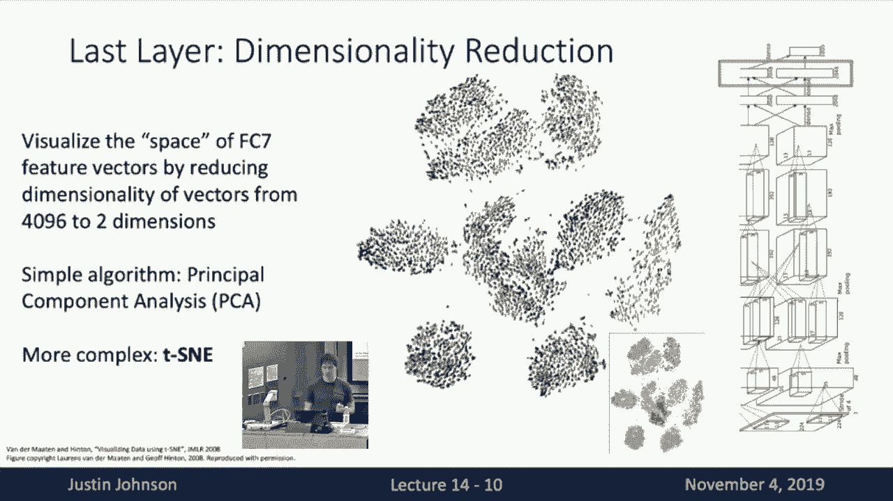
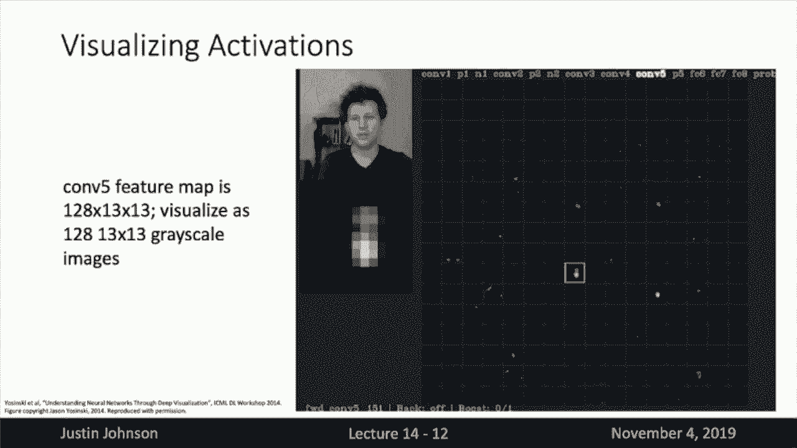

# P14：L14- 可视化与模型理解 - ShowMeAI - BV13P4y1t7gM

all right welcome back to lecture 14。 uh，all right welcome back to lecture 14。 uh。

today we're going to talk about a，visualizing，techniques for visualizing and。

understanding what's going on inside，convolutional neural networks。

um so this this title is actually a，little bit of a misnomer we're actually。

going to talk about really，really two major topics today um one is。

techniques for kind of peering inside of，neural networks and understanding what。

it is that they've learned about the，data that we train them on。

and then the second is um it turns out，that a lot of the techniques that you。

use for visualizing and understanding，neural networks，can also be used for some fun。

applications like deep dream and style，transfer so we're actually going to。

cover on both of those topics in today's，lecture，so the last lecture that you heard from。

me we talked about attention，um so we talked about how attention。

could be this mechanism that we can add，into our current neural networks。

to let them focus on different parts of，the input on different time steps。

and then we generalize this notion of，attention to build this new。

fundamental component that we could，insert into our neural network models。

called self-attention and then and then，remember that we saw that。

we could use self-attention to build，this new neural network model called the，transformer。

that relied entirely on attention to uh，to process its inputs。

and last week i hope you had a good time，with our guest lectures。

so on monday you heard from luway on，vision and language，and on wednesday you heard from。

professor prakash on adversarial machine，learning，so hopefully that was some really。

exciting interesting stuff for you to，hear about，and especially the adversarial machine。

learning i think uses some of the same，techniques that we're going to talk，about in today's lecture。

um so before we move on is there any，sort of uh，questions about logistics stuff that we。

need to talk about before we move on to，okay very good so i think this is a。

okay very good so i think this is a，question that so at this point in the。

class we've sort of learned how we can，build neural network models。

to process lots of different types of，data um we know how we can build use。

convolutional neural network models to，process images，we can use recurrent neural network。

models to process sequences and we can，use transformer or cell potential models。

to process uh sequences or even sets of，data，um but there's been this lingering。

question that i think a lot of people，have asked me after class and even，during lectures as well。

which is how do we tell what it is that，neural networks have learned once we've。

trained them for some visual recognition，task，um so once we write down this big。

convolutional neural network model，and we train it up on our big data set。

um what are all these intermediate，features looking for inside of the，neural network。

and how then then hopefully if we were，able to peer inside the neural network，that。

different features different layers are，looking for then it might give us some。

more intuition about maybe how it fails，or maybe，why it works or why it doesn't work so。

today we're going to talk about various，techniques that people have used。

to kind of peer inside this this depth，of this neural network and understand。

what it is that's actually going on，inside of it，so i should preface this that it's all。

sort of empirical we don't really have，super strong theory about exactly what's，going on in there。

but we have a set of empirical，techniques that can help us gain some。

intuition about the types of features，that these，layers are responding to so we've，actually seen。

one technique already that we can use to，get some basic idea of what's going on。

inside neural networks，and that's visualizing the the filters，at the first layer of the network。

so if you remember way way back to the，linear classifier remember we had this。

idea that the linear classifier was，learning a set of templates one template，for each class。

and that the class scores that were，computed by our linear classifier。

were simply the inner product of the，template that we learned for the class。

and the input image and then when we，generalized and，moved on to neural networks and。

convolutional neural networks，then this same idea the same notion of，template matching。

carries forward as well so recall that，for a convolutional neural network。

at the very first layer of the network，we learned this set of filters。

where these set of filters are going to，slid around the input image and we take。

it and at each point in the input image，we take an inner product between one。

between each of the learned filters，and the and the rgb pixels of the input。

image um so fitting along with this idea，of template matching，then we can actually gain some into we。

can actually visualize the first layer，of the convolutional network。

by simply visualizing those filters as，rgb images themselves。

um and recall that the idea here is that，when we take an inner product between。

the filter and the image then，when we try to visualize the image the，filter as an image。

then an image which matches the filter，is going to give a very strong response，to that filter。

so by visualizing these filters it gives，us some，some sense of what these very first。

layers these first features in the，neural network is looking for。

so here on the slide we're visualizing，we're doing exactly this and we're，visualizing the first。

the convolutional filters at the very，first layer for four different。

cnn models that were all pre-trained on，the imagenet data set，for image classification and what you。

can see is that um，even though these different network，architectures like alexnet。

whereas different different resnet，layers or a dense net these uh these，neural network architectures。

as we've seen are quite different but，the filters that they tend to learn at，the first layer。

are often very similar and we can see，that in these filters we often learn。

edges oriented filters that look for，edges of different orientations。

we see different filters that look for，different types of colors different。

types of opposing colors is a very，common pattern to see in these filters。

and if you recall all the way back to，the huble and weasel experiments on the。

mammalian visual system，you remember that the mammalian visual，system also has。

these cells that look for oriented edges，in the visual field of what we're，looking at。

which is somewhat similar to these，filters that tend to be learned at the。

first layer of convolutional networks，um so this this gives us some sense that。

the very first layer of comb nuts are，looking for maybe different，different color different types of。

colors and different types of oriented，edges，and you might wonder can we apply this。

exact same technique，to higher layers in the convolutional，network，well we can but it's not very。

informative right so，um if we here in this slide what we've，done is simply visualize。

the weights of the so here we've trained，a three-layer convolutional network on。

uh for cfar classification，um and for the very first layer we can。

visualize the weights just as we've done，in the previous slide。

and visualize them as little chunks of，rgb image but now the second，convolutional layer。

right because if in in this little toy，has，16 filters each of spatial size 7x7。

and now the second convolutional layer，um recall its input is the out is the。

raylude output of the first，convolutional layer，so the second layer is looking at it。

receives 16 input channels，and then has 20 convolutional filters。

each of those 20 convolutional filters，would stretch over all of the all of the，16 input channels。

so there's no really good way for us to，visualize that 16 channel。

input image it just just doesn't really，make sense as an rgb image。

so here what we've done instead to get，some really core sense of what's going，on in those filters。

is um for each of the 20 output filters，for each of the 16 slices of that filter。

we can visualize its 7x7 spatial extent，as a little grayscale image。

and it's maybe tough to see on the slide，here but you can see there is a little。

bit of spatial structure going on in，even these higher convolutional filters。

um that they're maybe still looking for，kind of blobby patterns or edges。

but now this is no longer looking for，edges or blobs in rgb feature space。

this is now looking for blobs or edges，in the feature space that was produced。

by the previous convolutional layer，so you can so with this kind of。

visualization you can tell that maybe，something is going on with these higher，convolutional filters。

but it doesn't really give you a strong，intuition for what exactly they're，looking for。

so we're going to need to use some other，going on，at other layers of the convolutional，network。

so one way that we often try to，understand what neural networks is doing。

is actually skipping these intermediate，convolutional layers and instead trying，very。

last fully connected layer so if you，recall something，and，has this fc7 layer that has a 4096。

features that then are transformed with，a final linear transform to give us our。

class scores for the 1000 classes in the，imagenet data set，um so one thing that we can try to do is。

understand what is being represented by，this，4096-dimensional vector that is being。

computed for each image，right because you know one one way to。

think about this what a trained alex net，is doing，is that it takes our input image and。

converts it into a 4096-dimensional，vector，and then applies a linear classifier on。

top of that 4096 dimensional vector，so then we can try to visualize what's。

going on by understanding what's，going on inside that 4096-dimensional，vector。

so then what we can do is sort of take，our trained alexnet model，and then run it on a whole bunch of。

images from the test set，um and then sort of record the 4096。

dimensional vector that the cnn computes，for each of those images in the test set。

and once we've collected this sort of，data set of images and their feature，vectors。

then we can try to visualize them using，various techniques，so one one really interesting thing that。

we can do is simply apply，uh nearest neighbors on top of this 4096，dimensional vector。

so if you recall way back to assignment，two and some of the early lectures。

we talked about applying these nearest，neighbor retrieval on top of the raw，pixel values。

and that's these examples here on the，left that we know when you。

apply a nearest neighbor retrieval on，top of raw pixel values，then you tend to retrieve other images。

that contain very similar pixels but，maybe not of the same class or semantic，category。

and now here in the middle instead what，we've done is we apply。

nearest neighbor retrieval using not the，raw pixels of the image，but instead using these 4096。

4096-dimensional vectors that are，computed by alexnet，and this gives us some sense for what。

images are close to each other，in this feature space that is learned by，the classifier。

and here we see some really interesting，stuff going on that if you look at these。

examples of images that are retrieved，using nearest neighbors search on。

with nearest neighbor on this last，dimensional this last，feature space we see that for example if。

you look at the uh，the elephant here in the second row then，element。

elephant image are also images of，elephants，but the pixels of the retrieved。

elephants could be very very different，right so the image that we're using to。

query with kind of has the elephant on，the left side of the image。

so the image has this kind of gray blob，on the left but now we're able to。

retrieve images maybe if you look at the，third column，now this actually has the elephant on。

the right side of the image the elephant，is a totally different color。

and the background is a totally，different color which is really amazing。

that means that somehow this 4096，4096-dimensional vector that has been，computed by alexnet。

is somehow ignoring a lot of the，low-level pixel content of the image。

and maybe it's encoding something like，elephantness somehow inside this vector。

so that when we retrieve an image of an，elephant then we actually get other。

images of elephants even though the raw，pixel values are quite different。

um and maybe uh sort of fitting with a，halloween theme maybe you were。

celebrating halloween last week，then in the second to bottom row we can。

actually see that actually these 4096，dimensional features space computed by，alex nat。

also kind of learns jack-o'-lantern-ness，and it can retrieve，other images of jack-o'-lanterns simply。

by looking for nearest neighbors in this，4086 dimensional feature space。

so oh yeah question how do you exactly，compare the，image with the other images and what。

features we consider，for the image and the train set to class，that's why yes oh so so here um so the。

question is how exactly do we compare，these images when doing nearest neighbor。

um so here what we're doing uh maybe i，should have made this。

more explicit so then we've got uh we've，got a one，with our query image then for the query。

image we run it through the trained，alexnet classifier，and then extract the 4086 dimensional。

vector at the last layer of the，classifier，and now that now without looking at this。

this 4006 exponential vector for our，query image，then we also do is run our whole other。

we run our whole test set through the，classifier as well，and record their 4096 dimensional。

vectors and now we do，l2 nearest now we do the nearest，neighbor retrieval。

using euclidean l2 distance on those，4096 dimensional feature vectors that，have been uh computed by。

the trained classifier um so here we're，not actually，doing we're not using this for uh class。

we're not using nearest neighbor for，classification like we did previously。

instead here we're just using nearest，neighbor as a way to get a sense of what。

types of images are considered nearby in，this feature space，so another kind of thing that we can do。

this，uh in this feature space is to use some，kind of dimensionality reduction，algorithm。

um so you know 4096 dimensional vector，4096 dimensional space is pretty high，dimensional。

we're um cursed to live in this low low，dimensional three-dimensional space。

so it's very difficult for our human，minds to understand 4086 dimensional，feature space。

but think what we can do is apply some，dimensionality reduction algorithm。

to reduce the dimensionality of those，vectors from 4096，down to two or three dimensions which is。

something that our our minds can，actually wrap around，um so one simple algorithm that you may。

have seen in other machine learning，classes is principal component analysis。

or pca which is a linear dimensionality，reduction algorithm，that the idea is you want to preserve as。

much of the structure of that high，dimensional feature space，while also projecting it linearly down。

to two dimensions so then you could，apply these dimensionality reduction，algorithms。

to this 4096-dimensional space giving a，sample of vectors from the training or，test set。

and then visualize actually the，resulting vectors down in this，two-dimensional space。

um so it turns out that uh there's，another kind of uh，you know in there's another kind of。

dimensionality reduction algorithm it's，very popular in deep learning papers。

um called t-sne that's uh t，t distributed stochastic neighbor，embeddings um the details i i don't。

really want to go into here，but it's basically a non-linear，dimensionality reduction algorithm。

that that inputs a whole set of vectors，in some high dimensional space。

then computes a two-dimensional，projection of those vectors that tries。

to maintain as much of the structure as，possible，as was present in the original high。

dimensional space，so then here what this visualization is，showing is what we've what we what we're。

doing is we're we've trained a cnn，classifier for digit recognition。

that recognizes the 10 mnist digits from，zero to nine，um and now the final now that network。

has some fully connected layer right，before the classifier，then what we've done is we take all the。

test set we run all images in the test，set through our classifier。

to get this this vector um this maybe，for i don't think it's fourth i don't。

think it's 496 in this 4096 in this，example，but then you run each image in the test。

set we get a vector then we apply this t，sne dimensionality reduction algorithm。

to convert all of those vectors from the，test set images from，some high dimensional embedding space。

down to two dimensions，and then um we actually visualize that，that now projects every point in the。

test set，to some point in two-dimensional space，and now what we do is we take。

our the image itself and plop it down at，that position in two-dimensional space。

that was computed by this uh by this，dimensionality reduction algorithm。

so i i don't think you can see it here，but if you uh maybe download the slides，and zoom in really。

really big on this slide you can see，that each of these points here in these。

in this diagram is actually a little，digit where the position of the digit in，2d space。

is now some a visualization of the，overall structure of the，that was learned by this uh by this cnn。

classifier，and what's amazing here is that actually，i told you that we were doing digit。

classification with 10 digits，and you can see that this the digit that，these。

10 regions that very roughly correspond，to the 10 digits，of the of the classification problem so。

then again this gives us some idea that，the feature space that was learned by，this network。

is somehow encoding the the identity of，the class。

and maybe not the raw of pixel values so，we can another way we can do a similar。

algorithm is not on this，this digit recognition problem but，actually for imagenet classification as。

well，so uh here we've done something very，similar we've taken，we've trained first in alex net on。

imagenet and then，extracted these 4096-dimensional vectors，for each uh。

image in the test set and that and then，we apply a dimensionality reduction，algorithm。

to lower the dimensionality from 4096，down to two dimensions while preserving。

as much structure as possible，and now uh now that gives us every point，in the tests that。

projected onto two-dimensional space and，then we actually visualize the image at。

those points in two-dimensional space，um so it's here i i there's a really，high resolution。

version of this image online that you，can check out but what's really cool，here is that it left。

if you kind of zoom in on this image you，can see that different regions of the，space。

now correspond to different sorts of，semantic categories，so like i think if you zoom in way at。

the bottom lower left corner，here of this of this space you see，different flowers。

and they kind of gradually transition，over into different dogs。

over in the upper right hand corner you，white，i think they have there's like different。

boats or sky images in there，um and this is really kind of fun to，zoom in and to this uh this。

visualization and kind of see this uh，space that the，that the neural network has learned and。

just kind of，walk around in there and see what types，of images are considered close to each。

other in this in this learned feature，space，so that gives us another so this idea of，extracting uh。

vectors from the last layer of the，network and then applying different，types of。

operations on these vectors again gives，us some way to，understand the feature space that has。

learned that has been learned，in the last layer of this neural network。

so there's another another kind of，technique we can use to understand。

what things are looking for is this idea，of visualizing not the weights of the。

neural network but the intermediate，convolutional activations，so here remember as we go through a。

convolutional neural network，then at each layer of the network we end。

up computing some activation volume，right say we've got a so for example in，an alex net。

after the fifth convolutional layer then，we compute this uh this convolutional，volume。

of spatial size 13 by 13 with 128，channels，which are then right those are then um。

those are that means that there's a，hundred there were 128 filters。

in this fifth convolutional layer of，alexnet um and that gives us a 13 by 13，grid。

um over which we've computed the values，of each of those filters。

so what one thing we can do is actually，visualize as images，each slight each 13 by 13 slice of that。

of that activation volume，and then visualize that as a grayscale。

image and the idea here is that things，very close to zero or，these are going through rayleigh so。

actually many of them will be exactly，zero，but um where where these feature maps，are non-zero。

then we can align it with the original，input image to get some sense of what，features。

in the input image these different，convolutional filters might be，responding to。

so here what we've done in this，visualization over here is，different。

slices of this activation volume each of，these slices corresponding to one of。

those convolutional filters，and now we've selected one of these one。

of the the outputs of one of these，filters in green here，and then visualize it over here on the。

left side underneath the original input，image，so here you can see that the regions in。

this 13 by 13 grid，that were turned on or activated by this，by this filter。

actually somehow line up with this with，the with the human face in the input，image。

so that gives us some sense that maybe，this one，filter inside this one layer of the。

neural network has somehow learned to，respond to human faces or maybe human。

skin tones it's hard to say，exactly but then what you can do is just，visualize these activation。

these slices of activation at different，layers for different images。

and that can give us give us some，intuition about what，different uh what these different。

filters might be responding to，so the question is uh why are the，majority of these black。

and i think that's uh due to the the，rayleigh non-linearity so remember that。

when we have relu then anything negative，will get set to zero，and anything positive will be uh we'll。

be left alone so that means that there's，actually a lot of，a lot of zeros in here i think um and。

that means that the non-zero stuff is，actually uh pretty important and pretty，interesting。

i think it also could be an artifact of，visualization um because exactly how you。

choose to scale the outright because，the neural network is outputting sort of。

arbitrary real numbers between zero and，plus infinity，um and then when we visualize the thing。

we need to squash it down into zero 255，in some way，so the way that you choose to squash。

those values down might also have some，effect on the overall brightness of the。

so then kind of fitting along with this，so then kind of fitting along with this。

idea another thing we can do is，not just sort of look at random images，and random filters。

but we can try to find um what right，if we want we want to get some idea for。

what is the the maximally activating，patch，that maximally activates different。

filters inside the neural network，so then here like in this previous slide，we had this intuition。

that this one filter inside this one，layer of the network。

might be responding to faces so if we，wanted to test that hypothesis。

one thing that we could do is um take，our whole training set，and then i'll run all of our training。

set images to the uh or run of all of，our training center all of our test set。

images through the network，and record for each uh for each image，the value of。

the field of that one chosen filter in，that one chosen layer，and then we can right we know that。

because this is a convolutional network，each element in that grid of feature in。

that grid of activation，actually corresponds to some finite，sized patch in the input image。

right um right give you great because if，you have like a three by three。

convolution it depends on a three by，three chunk of the input image you stack。

two by three two three by three，convolutions then it depends on a five。

by five chunk and the input image and so，on，so then what we can do is um for our。

chosen neuron in our chosen layer or our，chosen filter in our chosen layer in our，neural network。

we run all of the training set or run，all the tests and images through the，network。

and find the the patches of those，test set images that give the highest。

responses for our chosen neuron，and then record those and then record，done。

here on the in these visualizations on，the right so，here each uh in the in the top grid。

uh these are different neurons all from，one layer in the neural network。

that has been i think trained on，imagenet and then each row here，corresponds to a different filter。

in one of the one of our in our chosen，layer and now each column。

each uh element in the row course is a，patch of a training image。

that gave a very very high response to，that chosen filter in that chosen layer。

in the trained neural network，so these are the maximally activating，patches of the test set images。

that maximally activate our chosen，neuron inside the network，and then by visualizing those maximally。

activating patches，we can get some some sense of what that，chosen neuron is looking for。

so for example in this very top row here，we see that all of these。

all these things look like snouts of，dogs i think，so maybe there's some like dog snout。

detecting neuron that's somehow，somewhere deep in that network。

or if you look at the the one two three，the fourth row in this top grid。

then you can see that all of the，actually，text or chunks of english text and these，text might be。

might have different foreground，different background colors different，orientations。

but somehow it looks like this this one，chosen filter somewhere deep inside this，network。

is actually looking for text in，different colors and orientations。

or in the bottom grid here we've done，the exact same thing but now um。

run that same experiment for a deeper，layer in the neural network。

and because we've done that experiment，for a deeper layer in the neural network。

that means that each neuron value is，depends on a larger patch in the input，image so our。

maximally activating patches for the，deeper layer are going to be bigger。

um so then here if you look at the，bottom grid then some like the second，row。

all of the maximally activating patches，are human faces，which is pretty interesting and these。

faces have，sort of different skin colors and，different positions in the patch。

but somehow it looks like this one，neuron or this one filter deep inside，the network。

has somehow learned to identify human，faces，as a result of its training so that。

gives us so this this idea of maximally，activating patches，gives us another technique for。

understanding what is being，recognized by these intermediate layers，inside the network。

so then another thing that we can try to，do to understand，what these networks are computing is to。

ask which pixels in the input image，actually matter for the classification。

problem so here what we're doing well，here what we do，is we're going right suppose here on the。

left we've got this image of an elephant，and so and we then suppose that this。

image of an elephant is correctly，classified as an elephant，by the trained neural network now what。

we want to know is which pixels of this，input image，were actually important for the network。

making the decision to classify it as an，element as an elephant。

so now what we can do is we can take our，our elephant image，and then and then mask out some of the。

pixels and replace the pixels of the，image，with some gray square or some square of，uniform color。

equal to the imagenet mean or something，like that and now pass this masked image。

through the neural network again and，that will compute some，of some updated score for uh what the。

what the neural network wants to，classify this masked image as。

and then we can repeat this procedure by，by shifting around that square mask。

to a different position and then run the，run these different mask images to the，neural network。

so then if we repeat this procedure for，for moving the mask around every，position in the network。

and then again computing the probability，of elephant，for each position in the network then we。

can map out this，saliency map that tells us which pixels，matter the most for classification。

here in this image on the right here，what we've done is，for every position in the image we。

imagine putting that mask at that，position，and then running the running that mask。

image through and then the，this heat map the color of the heat map，corresponds to the probability of。

elephant，so you can see that if we mask out if we，position our mask。

over the over the elephant itself then，the predicted probability of elephant，drops a lot。

which is sort of intuitive right that，actually，looking at the right part of the image。

when making its classification decision，um so that's uh that's encouraging and。

now we've repeated this experiment again，for two other images on the slide。

the top is a schooner does anyone know，what is a schooner does anyone know that。

i guess it's a type of boat i don't，really know but，apparently this is the type of boat and。

now if we mask out the pixels，corresponding to the boat，that's going to cause the neural。

network's confidence in，schooner class go down a lot but if we，mask out the sky pixels for example。

then the neural network doesn't really，care and it still is able to confidently。

classify this as a schooner，so that that gives us another way to，understand what it is that neural。

networks are doing，so now again we're not sort of looking，at what activates the intermediate。

features，instead we were just trying to mutate，the input image，and see what parts of the input image。

are being used by the neural network，right and like i think this is kind of。

amazing like it didn't have to come out，this way，right like neural networks don't。

actually know what part of the image is，the object and the background。

so it could be the case that the neural，network is just like maybe it happens。

that all schooners always occur like in，water of a particular color。

and then it could classify as a schooner，by just looking at that particular color。

of the water that it's in and not，they're on，and if your data set has ways that。

neural networks can cheat，and like look at the wrong parts but，still get the right wrong part of the。

image but still get the right answer，they they tend actually will tend to。

learn to cheat quite easily，um so this type of visualization lets us。

kind of see whether or not they're，actually cheating，or whether whether or not they're。

actually looking at the part of the，image that we think that they should be。

looking at when making their decisions，was there question over here yeah the。

question is is this uh is that does this，was this kind of thinking。

some of the thought process that led to，adversarial examples um i think actually，yes it was。

because uh you know it turned and to，kind of understand why，um so this technique that we've shown。

here vm computing saline，via masking is actually like pretty，computationally expensive。

right because we have to run a like a，forward pass，for each possible position of the mask。

so computing saliency maps in this way，is fairly computational expensive。

and there's another way that we can，compute saliency maps via back，propagation。

right because um we know what we can do，is we know we can take our input image。

which is this adorable dog，and then run the dog through the neural。

network and compute probability of dog，and then during back propagation we can。

compute the gradient of the dog score，with respect to the pixels of the input。

image and that tells us，for every pixel in the input image if we。

were to change that pixel a little bit，then how much would it affect the the。

prop the dog's classification，score at the end of the network um and。

now this is exactly this kind of image，gradient that you could use。

uh to generate adversarial examples so i，think actually the thought process is uh，quite connected。

and you can see that in this in this，example actually we've，i don't know if you can see with the the。

contrast in the room here but uh there's，kind of a ghostly out in，here in the bottom we've actually。

visualized this uh this gradient image，that shows for each pixel uh the，gradient of the。

dog score with respect to the pixel um，and now，you can see that kind of maps out a。

ghostly outline of the dog a little bit，which which again gives us some sense，that the pixels。

that will change the classification，score the most are actually the pixels，inside the dog。

and if we were to change some of the，pixels outside the dog then the。

classification score would maybe not，change so much，so this again gives us some some idea。

that the neural network is looking at，the right part of the image。

we can repeat this not just for this dog，image but for different images and get，some。

and get these different kind of saliency，maps for what these different uh。

what the neural network is which pixels，of the of the image matter。

when networks are classifying these，different images，so i should point out that i think these。

examples are from the paper that，introduced this technique，and most real examples don't come out。

this nice，um so you may have seen that if you've，done the homework so far。

right because we asked you to implement，this on the homework and you may have。

been surprised that your，results were not as beautiful as these，results from the paper。

that probably does not mean you have a，bug that probably means that the authors。

of the paper were somewhat judicious，in the examples they selected to put in。

the paper so i think that's something to，be aware of but i think it's still a。

pretty cool technique that you can uh，you can use to get some intuition about。

what neural networks are learning，um so actually here there's kind of an，aside um。

one thing that you it's supposed that，this idea of sailing team apps。

actually works then one kind of cute，idea that we could do，is actually uh segment out the the。

object in the image，even without any any uh any supervision，of this of this flavor so then you know。

the image，here the we're maybe feeding this this，image of a grasshopper。

to the neural network and then it，classifies it as grasshopper and now。

what we want to do is sort of carve out，the exact，outline of that grass the pixels of the。

grasshopper image，from uh from the input image so you，could try to kind of do that。

using these saliency maps and using some，kind of image processing techniques。

on top of the saliency maps that are，computed by these neural networks。

and again and that kind of lets us take，a network that was trained for image，classification。

and then use it in a very different way，to actually segment out the sections of。

the input images that correspond to the，object categories，um although again i should point out。

that exam real example，these these are kind of really nicely，chosen examples and this technique。

maybe doesn't work as well in general as，you might want it to，okay so then this this kind of gave us。

this idea of um，computing for each pixel using gradient，information now。

um to compute for each pixel in the，image how much does changing that pixel。

affect the final output score and this，turns out to be a really powerful idea，of using。

gradient information on the images to，understand，what neural networks are doing so now we，can。

take this to another level and not and，ask，not just which pixels of the image，affect。

the final class score but now again we，want to return to this question of。

what are intermediate features inside，the network looking for，and we can use gradient information to。

help us answer this question as well，um so here what we can do is we can pick。

some again we can pick some layer of the，neural network，and pick some filter inside the neural。

network，and now what we can do is run the image，test，image run it through the neural network。

and then back propagate，uh and then ask which pixels of the of，the input image。

affect not the final class score but，affect this intermediate neuron value，instead。

um right so then you could ask maybe，which which pixels of the input image if，i were to change them。

would cause this uh this intermediate，neuron value to go up or down a lot。

well the question is are these saliency，maps before training or after training。

um definitely after training um so if，you try i i think if you try to compute。

these cnc maps before training，you'll get some pretty bad garbage。

although surprisingly i think they will，not be totally random even if you do it，before training。

just because the convolutional struct，strong，regularizing effect on the functions。

that are computed but i don't think，you'll get anything，so beautiful if you do this。

visualization before training，right so then again we can apply the。

right so then again we can apply the，same idea of using gradient information。

to understand what these intermediate，features are looking for，so we take our input image of the。

elephant run it through to some，intermediate layer，and then backprop not on the final score。

but backprop on one of these，intermediate neuron values to say，which pixels of the input image are。

going to affect this uh this output，this this intermediate neuron the most。

and it turns out that for these，intermediate features um，using normal back propagation tends to。

give kind of ugly results，so instead people do this kind of，horrible ugly hack called guided pack。

propagation，that i think i don't fully understand，why it works but it tends to make the。

images look prettier so we do it，but the idea with guided back，propagation is that you know normally。

when you，forward propagate through a relu then，anything below zero。

any any elements below zero are set to，zero and then when you back propagate，through a relu。

then any upstream gradients in positions，of the input that were set to zero。

are also set to zero right because on，you you take that same mask that you，used on the forward pass。

and apply it to your upstream gradients，um so that's kind of back propagation。

normal back propagation through a relu，so now in this idea of guided back，propagation。

we're going to we're going to apply，we're also going to mask out。

negative upstream gradients when we back，propagate through a relu。

so that means we're going to uh when we，receive our upstream gradients when we。

backpop through the relu we're going to，zero out，all the upstream gradients corresponding。

to zero values of the input activations，and we're also going to zero out all。

upstream gradients that are negative，so we're just going to eliminate all。

negative upstream gradients and，like add this extra masking in the，backward pass。

don't ask me why but this tends to make，images come out nicer when you do this。

idea of backpropagation to，visualize images um so now this so now。

when we apply this uh these guided back，propagation，to images then it lets us pick out the。

pixels of the image，that were uh caught that were causing，that neuron value to be changed。

to affect that neuron value um so here，on the left we're showing the same。

visualization that we saw before，of maximally activating tests that，patches for。

different neurons inside the network and，now on the right we've applied guided，back propagation。

to say which pixels of these patch，actually affect the value of the neuron。

um right so then remember on this，visualization from this from this maybe，top row。

by kind of looking at these images our，human intuition was that these neurons。

were kind of looking for，these these dog noses or eyes in these，patches。

and now when we do guided back，propagation we see that indeed the。

pixels corresponding to the interior of，those eyes，are indeed the ones that matter for this。

uh for this neuron value，and similarly similarly for this text，neuron at the bottom it actually is。

indeed the pixels of the text，that are causing this this neuron value。

to change so that gives us some，additional intuition about what these，neurons are looking for。

and we can apply that again to these，other deeper layers and get similar，intuitions。

so then you can see our human face，neuron from before，is indeed looking at the pixels of the。

human faces which is，encouraging to see okay so so far what，we've done is we've used gradient。

information，to pick out pixels of test set images，that affect different values of the。

neurons or of the class scores，but basically this is restricting us to，uh pick out。

this is sort of restricting us to，patches or images that actually appear，in the test set。

so now we could kind of take this idea a，step further，and ask um could we right so in guided。

back propagation what we were doing，is we were taking a test set image and。

then asking which pixels of that image，were responsible for causing neuron。

values to be one or to be some value，and now we could actually take this a。

step further and not restrict ourselves，to test to，all，would，maximally activate one of our neuron。

values and now what we want to do，is is actually generate a new synthetic，image that would cause。

one of our neuron values to be maximized，and we can do this using uh now gradient，a sent。

on the pixels of the image itself right，so here what we're doing is。

i star is an image that will maximally，activate some chosen neuron inside the，network。

and now f i is the value of the image，of the value of the chosen neuron uh。

when up when we run the network on that，image，and now ri is some regularizer that。

forces the image that we're generating，to be uh to be，somehow natural and now this this kind。

of what we're doing is this looks very，similar to the，the equation that we saw when we train。

weights of a neural network，but now rather than training the weights。

of a neural network instead we want to，train the image that will cause a。

trained network to maximally activate，one of its in one of its intermediate，features。

and now we can find this image using our，favorite gradient ascent algorithm。

where we just kind of change the image，one bit at a time using gradient，information。

so kind of the way this looks like is，that in order to generate an image via，gradient ascent。

what we're going to do is initialize our，original image to zero or maybe random。

noise or something like that，then we're going to run our image，through the network extract out the。

value of our chosen neuron，back propagate uh to find the the pixels，of the。

the image that would cause the neuron，value to change，and now make a small gradient step on。

the image itself，and then repeat this over and over again，until we've generated some synthetic，image。

that will cause that will cause that，chosen neuron value to be high。

and now what's really important it turns，out right because you saw in the last。

lecture that this looks very similar to，the procedure that we use for generating。

adversarial examples，so it turns out that if you kind of run，this procedure uh。

on its own you end up generating not，interesting images but instead，generating adversarial examples。

so to get good results out of this it's，important to choose some kind of，regularizer。

that will constrain our image that we're，generating in some way。

and force our generated image to look，natural in some way，and now a really stupid way that we can。

force the image to look natural，is just constrain its l2 norm of the，over of the overall image。

so now if we do this what we're going to，do is we want to find images。

that will maximize the class score for，one of the category labels on imagenet。

and also have low l2 norm for the for，the entire generated image。

and if we do that we end up generating，images that look something like this。

uh yeah a question yes yes all of this，on fully trained networks。

right right so the idea here is that we，want to fix the weights of the。

we have a trained network we're going to，fix the weights of the trained network。

and now we want to some we want to like，learn an image that would。

cause the image to have the network，respond in a chosen way，um so we're going to fix the nates of。

the weights of the network but we can，still back propagate through the network。

to compute gradients on the image，and now if we do this procedure then we，can generate these images。

that are images that we've invented from，scratch，that will cause the cause the network to。

recognize them as our chosen class，so if you look at this example on the。

upper left we've generated a novel image，that should be recognized。

confidently as dumbbell and you can see，there actually is kind of some dumbbell。

shapes going on in this thing，which is uh pretty exciting or if you，look over at the。

this upper right hand image we're trying，to generate uh dalmatian。

and you can see these kind of black and，out，scratch，this this dalmatian pattern that is。

pretty exciting，um so right this gives us some idea that，maybe that when neural network is。

looking for dalmatian，one of the key features that it's using，is just this kind of black and white。

pattern that dalmatians have on their on，their code，um so this gives us some way to。

visualize or understand，what features in the image that the，neural network is using to classify them。

um so here we're looking at some more um，i like the goose example here。

or the ostrich example here you can see，these ostriches kind of this this like。

it's kind of inventing ostriches all，over the image that's giving this。

sort of coarse overall ostrich shape，okay but now basically at this point。

we've used a pretty stupid regularizer，that these images don't look very，coarse。

shapes coming out of the image but they，don't look like super these images don't。

look like super realistic，so what we can do instead is play around，with better regularizers。

so there's a whole set of papers where，people try to invent，better natural image regularizers that。

force our generated images to look more，natural，and these like these regularizers can。

get kind of hacky um so，maybe just one flavor of a regularizer，is that um。

rather than just penalizing the l2 norm，maybe we want to make sure the image is。

smooth so we apply some，we apply some blurring and clipping of，the pixel values。

inside the optimization loop somehow i，think the details are not super，important。

the idea here is that if you hack around，with the image regularizer。

you can generate images that look even，more realistic so now if we apply this。

more sophisticated image regularizer to，the same idea of gradient ascent。

now we generate images that look maybe，even more realistic，so now we generate these these flamingos。

we can see these kind of pink，flamingo-like shapes kind of，emerging that are giving us some。

generated image that will be highly，confident that，the network will be highly confident。

these are flamingos，we can look at these uh these billiard，tables and kind of see these like pool。

tables kind of emerging out of nowhere，and now this idea of using gradient a。

sent plus image regularizers，we can apply this not just to right so，far we've applied this to。

find images that maximally activate a，class one of the，class scores at the end of the network。

we can also do the same thing to，visualize，to generate synthetic images that will，maximally activate。

interior uh interior neurons inside the，network as well，so here um you can see that maybe in。

layer five there's some nut，there's some layers that look for these。

kind of like spider-like patterns，or look for these kind of eye like。

patterns or maybe down on layer three，there's um some neurons that look for。

these kind of green blobs or red blobs，in the input image，so this gives us another technique that。

we can use to general to understand what，these intermediate features are looking，for。

and there's a like i said there's a，that，try to invent better and better natural。

image regularizers to make these types，of visualizations look better。

so there's another kind of regularizer i，don't want to go into at all here。

that kind of makes images look better or，one of my favorites um right so this is。

this idea of multi-faceted visualization，you can，now generate images that look even more。

realistic using a more sophisticated，natural image regularizer。

people go really crazy on this thing so，now here we're using a really really。

really fancy natural image regularizer，that's actually based on a generative。

adversarial network that we'll talk，about maybe in a few lectures but now，these are kind of。

images that we've invented from scratch，that will be highly recognized as the，target category。

and will be uh and should be natural or，realistic，so now these there's this kind of this。

like toaster image emerging from scratch，that is now a synthetic image that has。

been generated via gradient ascent，but will be uh recognized as toaster by，the neural network。

now when i read papers like this i，always feel like there's kind of a weird。

tension in these papers because the，original point of this kind of research，direction。

was to understand what neural networks，like，the more we put more intense image。

regularizers on the thing，kind of the more we lead ourselves，astray。

like the the the smarter an image，regularizer we put on the thing。

then the further away we get from what，the network is actually looking for。

um so somehow when when i look at images，like this，it's really hard for me to say like how。

much of this is due to this is what the，network is actually looking for。

versus how much have we just like used a，really really smart。

natural image regularizer to force us to，generate natural images。

so for me personally even though these，images maybe look more beautiful。

i kind of like the results that use very，simple image regularizers。

i think that gives us maybe a more pure，sense of what is the raw，the features and images that these。

networks are looking for，so i think you should maybe not get too。

led astray by these examples that look，super beautiful，okay so then i think you already talked。

about adversarial examples right so what，happens if you have no regularizer，whatsoever。

um then of course you end up with，adversarial examples um so then i i。

think you you talked you heard about，this in depth，from our guest lecture last week but you。

know we can start from an image，of one class like an african elephant，and then use gradient ascent。

on the class score of another class and，then cause，and then sort of imperceptibly change。

the pixels of the image，to cause it to be confidently，confidently classified。

as another class so then here we've，taken this image of an african elephant。

and now changed it just a little bit and，now it's classified very very，confidently as koala。

or we've taken this schooner image even，though we still don't know what a，schooner is。

and then classified it very confidently，as an ipod which maybe we do know what。

it is and it's not this，um and of course uh this these were very。

very tiny imperceptible differences uh，that were used to generate these，adversarial examples。

okay so now another kind of uh idea that，we can now another thing that we can do。

using this idea of gradient ascent and，using image gradients to。

understand what's going on in networks，is this idea of feature inversion。

so here what we can do is given an image，image，we're going to extract its feature。

representation at some layer of the，network and then set that feature，representation aside。

now what we want to do is use gradient，descent to generate a new image。

which matches that feature which has the，same feature representation as that，feature we've set aside。

so what we're trying to do is kind of，like invert the feature representation。

that has been computed by the neural，maybe，math on the slide but it's very like。

it's very simple it's the same idea of，gradient descent that we've been looking。

at before so here what we're going to do，is we're going to our loss function is，now whether。

our set aside feature of the original，image and the feature representation of。

our generated image are the same，in some l2 sense and then plus some，image regularizer。

and this will give us some sense of，what's going on or what's being，recognized at。

what what kind of information is being，preserved or thrown away at different。

layers of the neural network，so then here is a visualization of this。

idea using feature inversion or feature，reconstruction，from different layers of a trained vgg。

network，so here on the left we're showing our，original input image y。

and now this this first column relu 2 2，y，extracted the relu two two features from，the vgg network。

and then run feature inversion to，synthesize an image from scratch。

that will have the same relu two two，features as y，so when we do this procedure you see。

that the images we generate by inverting，relu 2，look pretty much identical to the。

original image y which means that，basically all of the image information。

is still it is still captured by these，low-level relu 2-2，features but now as we go up in the。

network maybe up to relu43，now if we try to invert these relu 4 3，features。

we see that some information has been，lost that now this the sort of the，overall。

shape or structure of the images are，still preserved，but somehow the low level texture and。

color information，has sort of been lost once we go to，these relu four three。

layers and if we go all the way up to，relu five three，we can see that basically all of the。

local color and texture information has，been lost，but kind of the global structure of。

these image of these uh the elephant and，the fruit，is still visible so that gives us um。

some sense that maybe the low layers of，the neural network，really preserve most of the information。

about the image and then the further we，go off the network the more in the more。

information is thrown away，about those raw input images，okay so now that we've kind of used。

these all these gradient techniques to，peer into trained networks it turns out。

we can use a lot of these same，techniques to now have some fun。

so one idea is this uh this project from，google from a couple years ago。

called deepdream so the idea in，deepdream is that，we want to take an existing image and，then amplify。

whatever features were present in the，original image so what we're going to do。

is take our original input image，um run it through the cnn extract。

features at some layer of the network，and now set the gradient of the layer。

equal to the activation values，themselves，and now back propagate and update the。

image and what this will do，is um basically whatever features were，recognized by the neural network。

we want to change the image to cause，those features to be activated even more，strongly。

and so basically this is also equivalent，to maximizing，the the l2 norm or is somehow equivalent。

to maximizing some some，uh l2 sense of the features of that，layer。

the code for this is relatively simple，um but we also need to use a couple。

image regularizers to get good results，um in this they used again a couple。

natural image regularizers to get a more，beautiful outputs，so then the way that this works is if。

you start with deep dream and uh，start with this this image of a，beautiful sky and then run。

deep dream to then we're going to run，this deep dream algorithm。

to amplify existing features um whatever，features are going to be recognized in。

this image we want to amplify them，and now modify the image to cause。

features those recognized features to be，amplified，so if we after we run deep dream on some。

layer of the network，we get some output like this so here，what what we've done is basically。

um we've we've run deep dream on a，relatively low layer of the network。

so then that layer of the network was，maybe recognizing different types of，edge information。

in the clouds and now for each of those，sort of nice swirly edge effect artistic。

sort of nice swirly edge effect artistic，edge effect applied to the input image。

so this is what happens if we apply the，deep dream at a relatively low layer of，the neural network。

and we kind of know that we are kind of，already know that low layers of neural。

networks are maybe looking for edge，information，um if we and we had this idea that。

higher layers and neural networks were，looking for maybe more abstract concepts，and images。

so now if we apply deep dream to some，higher layer in the neural network。

we get maybe some output like this so，now you can see that um。

now there's like whole structures being，emerged from this input image。

that the neural network is kind of like，looking up at the clouds and then kind。

of inventing stuff for itself that it，sees up in the clouds，um so if you look at these uh neural if。

you look at the pattern，there's actually some common patterns，that show up a lot in these deep dream。

images，so there's this kind of admiral dog over，here on the left there's this。

pig snail over here this camel bird or，this one on the right is this dog fish，that kind of has a。

head of a dog and then the tail of a，fish，um so these are kind of like pat if you。

look at a lot of deep dream images，you'll see a lot of these uh these。

patterns show up over and over again，so if you look at this i think you'll。

see a lot of kind of like mutant dogs，uh，psychedelic animals um so now。

if you if you run deep dream for even，longer then you start to deviate even。

further and further from the original，input image，so you if you kind of run deep stream。

for a very long time um and kind of do a，multi-scale and do some other stuff。

you can generate these like very crazy，images from scratch that are kind of。

like the neural network dreaming for，itself，um images that will cause its。

intermediate features to be highly，activated，um so i think uh this is an example of a。

deep dream image that was trained，using a network that was trained on。

imagenet and you know we know that，imagenet is a data set of objects。

but it turns out if we train a an image，classifier not on imagenet。

but on another data set of different，types of scenes，then we get deep dream images that look。

very different，so now these are images that were，generated from scratch using this deep。

dream algorithm，um using a cnn classifier that was，trained on images of different types of。

places or different types of scene，categories，and you can see that there's these sort。

of fantastical structures just emerging，from scratch，that are being generated using this uh。

using this deep dream algorithm，so this was uh this was really amazing。

when when this when this first came out，um，when some folks at google published this。

a couple years ago everyone was like，holy cow this is amazing we can use。

neural networks to generate these like，crazy pieces of artwork and that was，very exciting。

so it turned out that there's actually，uh more cool stuff that we。

more interesting ways that we can use，neural networks to generate cool。

interesting images um but to show，to give you another example well we need，network。

uh ideas so here's there's this very，classical idea，in uh computer graphics there's this。

task of texture synthesis，so now with texture synthesis what we，patch。

giving some regular texture and then we，want to generate some，text some some output image which is。

maybe much much larger，but kind of still matches the local，texture statistics of the input image。

and there's some classical algorithms，for doing this it turns out that we can。

actually use some nearest neighbor type，algorithms，to do texture synthesis pretty with。

pretty decent results，so now i don't want to go into the，details of this algorithm here。

um but these are papers from 1989 and，2000 so these are no neural networks。

here this is kind of like nearest，neighbor retrieval on raw pixel values。

but it turns out we can actually do like，pretty good texture synthesis。

using no neural networks and just like，pixel values，as long as our textures are simple so。

here using these kind of traditional，approaches to these traditional graphics，algorithms。

we can do texture synthesis on these，like green scales or on these bricks。

or here we're doing it on a printed text，and now we can generate new images that。

kind of match the spatial texture of the，input，but are much bigger and much more。

interesting but now of course because，this is a class about neural networks。

you we need to say um actually how can，we solve this texture synthesis problem，really。

nice paper that came out a few years ago，that showed how we can use a similar，idea。

of gradient a sent on pixels through，trained neural networks，to solve this task of texture synthesis。

as well，so here the idea is that um it's similar，to this idea of feature inversion right。

remember in feature inversion，we had some original some some input，image and we wanted to generate。

a novel image that matched the features，of our input now we want to use a，similar idea to generate。

textures but but now what is a texture，a texture is something that doesn't we。

don't want it to match the exact pixels，of the input image，we want it to match the overall spatial。

structure of the uh，match kind of the local texture features，of the input image but not care about。

the the，the spatial structure so then what we，want to do is we，use this construction called a gram。

matrix which is a way to capture，local texture information from cnn's。

while throwing away all the spatial，information，so how does this work well what we do is。

we choose some layer of the neural，network，and then run our our our texture image。

our target image through the network，and that extracts this feature volume of。

maybe height by width by number of，channels is the three-dimensional，feature volume。

that is computed by some convolutional，layer of the network，and now what we want to do is we take。

two of these c-dimensional feature，vectors，from two different points in space and。

now compute their outer product，and now their outer product is a c by c。

matrix and this c by c matrix，gives on all of the element wise，products between these two feature。

vectors，that we took out from two places in the，input image，and now what we want to do is use the。

across，all possible blue and red pairs right so，for each，pair in for each pair in the input image。

we want to compute this outer product，and then we want to average this outer。

product over all of the pairs，in this input volume and now if we do，this。

this gives us a c by c matrix giving，actually the unnormalized covariance。

between the feature vectors，computed by the image computed by this，neural network。

so now this c by c matrix is called the，gram matrix，and now it's a c by c matrix and it has。

basically thrown away all of the spatial，information，from this uh from this neural network。

feature representation，but it has somehow kept or what what the。

information being captured in this gram，matrix，is which pairs of features in this seed。

of these c filters in the layer which of，these pairs of filters tend to activate，together。

or tend to activate not together right，so this this gram matrix tells us。

something about which features are，correlated with each other。

in the input image and by the way we can，officially compute the scram matrix。

using some reshaping and matrix，multiplication，and now the idea is that this gram。

matrix is somehow a descriptor which is，telling us，which features tend to co-occur at。

different positions in the image，but it throws away all of the spatial，structure of the input image。

so now the idea is that we can use use，uh perform texture synthesis using，neural networks。

by trying to match the gram matrix of，some target image，using gradient ascend so now the way。

that this works is we can use，uh compute texture synthesis using，neural networks。

using this very simple gradient ascent，algorithm to match gram matrices。

so the way that this works is step one，we're going to pre-train a cnn on。

imagenet or some other data set，step two we're gonna have we're gonna。

have some target texture image that we'd，like to synthesize，a new image from which is this rock this。

image of rocks in this example，we're going to run that image through，the neural network and compute。

these these gram matrices for each for，each layer inside the neural network and。

then we're going to initialize our，generated image from scratch。

run our generated image through the same，neural network and again，compute the gram matrices for the。

generated image at each layer of this，neural network，and now our loss and now our loss。

function here is the，the weighted sum of the euclidean，distances between the。

the gram matrices of our original，texture image and the gram matrices of。

the image that we're synthesizing，um so then that then basically we were。

just comparing all the gram matrices，from these two images and using that to，compute a scalar loss。

and then once we have that scalar loss，we can back propagate into the pixels of。

the image that we're generating we can，get a，the gradient with this of that loss with。

respect to the image that we're，generating，and then make a gradient step on the。

image that we're generating and now，repeat this over and over again。

and hopefully generate some and now，hopefully our generated image。

will we've hopefully generated some，image that has the same gram matrices。

as uh this original input image that we，started from，and now if we do this it actually works。

pretty well and now with this this idea，of neural texture synthesis，us。

synthesize novel images that kind of，match the same，texture of an input image but look sort。

of very different in spatial structure，so um here in the top row we're showing。

different uh different images that we're，starting from，and now underneath we're showing um。

generating images，by matching gram matrices at different，layers of our pre-trained neural network。

so you can see that if we match if we，generate images that match gram matrices，at a very low layer。

then we tend to capture these like very，low level uh，patches of color and as we additionally。

match gram matrices from higher and，higher layers in the neural network。

we can see that we're now generating，novel images，that kind of match the overall texture。

of our input image，but have very different spatial，structures，so this was a pretty exciting result。

that got a lot of people，pretty excited that now we're able to。

generate novel images that uh actually，look quite realistic，and are able to synthesize textures of。

from pretty broad a variety of input，images，and now someone had some some really，brilliant person。

um had the idea of what if we set our，texture，we do texture synthesis but we set the，texture image。

to be a piece of artwork and now we're，actually going to do，two things jointly we want to combine。

this idea of feature reconstruction，with this idea of texture synthesis and，this actually。

is a beautiful matching right because，now what we want to do is we want to，synthesize an image。

that matches the features of one image，and also matches the grand matrices of，another image。

and now we saw from this feature，reconstruction example that when you。

recon when you try to invert relatively，high，features from relatively high layers of。

a neural network then it tends to keep，the overall coarse，spatial structure of the input image but。

it ignores all the all the，all the texture and color information。

and we see that when we perform gram，matrix matching，then it throws away all the spatial。

structure but it actually preserves a，lot of the texture and color information。

so when you combine these two ideas，together you actually get something very，magical。

so here what we want to do is this this，algorithm of neural style transfer。

that is we're going to generate an image，that matches the，the the the features of one image called。

the content image，and matches the gram matrices of another，image called the style image。

and now we can use gradient a sent to，match both of these things jointly。

and now generate a novel image that，matches the features，matches the features of one and the。

grand matrices of the other，and now this uh this sort of lets us。

generate novel images in this artistic，style，of an input style image。

and the way that this works is sort of，gradient ascent through this uh this，pre-trained network。

and now what's interesting is because，this is a gradient ascent procedure。

we're kind of starting the image from，some random initialization。

and then performing gradient steps over，time that are going to gradually change，the image bit by bit。

to generate this novel image that，matches the features of one and the gram，matrices of the other。

so this visualization shows the progress，of gradient ascent over many iterations。

as we kind of converge to this final，output，so this this idea of neural style。

transfer is something that i've actually，worked on quite a lot。

um so i have an implementation of this，neural style transfer algorithm。

um from a couple years ago that's，actually predates pytorch so i did it in。

lua it was that's what we did back in，the day，um and these are some example outputs of。

this neural style transfer algorithm，where we're transferring uh we're using。

this content image of this，uh this this street scene and then rent。

re-rendering it in the artistic style，of these different artistic images and。

now you can actually there's a lot of，knobs you can tune inside this style，transfer algorithm。

so because i told you that we're doing a，joint reconstruction of the。

trying to match the features of one and，the gram matrices of the other。

you can actually trade off between how，much do you want to reconstruct features。

versus reconstruct gram matrices and as，we kind of trade off between those two。

objectives using some scalar waiting，term，then on the left when you put a lot of。

weight on the the feature reconstruction，then you tend to reconstruct the feature。

image very well and on the right，if you set the the grand matrix uh。

reconstruction term to be very high，then it kind of throws away all the。

spatial structure and gives us just uh，just garbage，um so by the way this is brad pitt being。

rendered in the style of picasso，and on the right it's like super picasso。

and on the on the left it's like super，brad pitt，um so another knob we can tune here is。

actually we can we can change the scale，of the features，that are that we generate that we that。

we capture from the style image，by resizing the style image before we。

send it to the neural network to compute，the gram matrices，um so here on the left if we make this。

if so here we're rendering uh，the the golden gate bridge in the style，of van gogh's starry night。

and here on the left if we make the，style image very large then we tend to，capture these these big。

artists these big aggressive brush，strokes that van gogh uses in his，paintings。

and if we set the style image to be very，small then instead we're going to，transfer。

larger scale features from the style，image in this case the kind of stars。

from the starry night from from the，starry night photo，so another fun thing we can do is。

actually do multiple style images，so here we actually are going to jointly。

match two different gram matrices，from from two different pieces of，artwork so now here we can uh。

generate a novel style image that is，trying to，render an image jointly in a style of，starry night。

and of the screen or kind of any other，arbitrary artistic combination that you，can think of。

and here the here the way that we do，this is we just，have our target grand matrix be a。

weighted combination of gram matrices，coming from the two different style，images。

so another fun thing you can do with，this is that if you're kind of very。

careful with your implementation，and you have a lot of gpus with a lot of。

gpu memory you can run this thing on，very high resolution images。

um so here here's a nearly 4k image of，stanford i think i need to fix this to，be a michigan image。

but uh okay well we'll fix that for the，next time，but we can take this a very high。

resolution of an image of stanford，and then run it in the style of。

starry night and sort of capture all，these very high resolution。

uh interesting artistic features from，the style image，um or we can run it not in the style of。

van gogh，but in the style of um uh kanden，kandinsky and get this sort of very。

beautiful output result，okay but now a very fun thing we can do，is actually do style transfer。

and deep dream at the same time，so then what we can do is we can get，stanford with starry night。

with all the psychedelic dog mutant dog，mutant dog things coming out。

so this is like kind of a nightmare but，uh you can do it，okay so now this idea of neural style。

transfer got a lot of people really，excited when you kind of see images like。

maybe not this this one's terrifying but，um but like people saw images like this，cool。

um this is a thing that we might want to，actually deploy out there in the world。

but the problem is that this style，transfer algorithm is super slow。

that because we're doing this iterative，process of gradient ascent。

to generate any one of these images you，need to take many many gradient steps。

um doing many many four backward passes，through a bgg network。

um so to kind of put this in perspective，one of these high resolution images i，generated on i think。

so，that's gonna not scale if you wanna push，this thing out in production。

yeah question um professor um i was just，wondering um maybe not for general，like。

their their portrait in the style of，like a renaissance painter you know。

oh so actually renaissance painters，don't work too well with this algorithm。

um so this algorithm tends to capture，kind of color and texture patterns。

so it tends to work really well with，like impressionist painters。

um but like renaissance painters are，really about realism and that。

those tend not to get captured super，well by this algorithm，okay so this is a problem style trends。

are really cool but it's super slow，um takes a lot of gpus so um whenever。

as a deep learning practitioner when，you're presented with a problem。

your instinct should be to train another，neural network to solve the problem for，you，paper。

from johnson at all that that um，that shows how you can train a neural，network to。

perform this style transfer algorithm，for you，so the idea is that we're going to have。

uh have this this one，feed forward network that's going to，input the content image。

and then output the stylized result and，when training this thing it's going to。

maybe take a while to train，but after it's trained then we can just。

break away this feed forward network，and use it on and now it'll just stylize。

images for us in a single forward pass，um so now this this fast neural style，transfer algorithm。

is now fast enough to run real time um，and this algorithm actually got pushed，out to production。

um by pretty much all the big companies，so snapchat had this as a filter at one，point。

uh google had this as a filter at one，point uh facebook messenger had this as，a filter at one point。

so once style transfer was actually fast，enough to run in real time。

then it actually got got deployed by，everyone so that was super cool。

and there was there's a bunch of apps on，the app store that you can now find that。

can do these style transfer effects，um on your smartphone um so you can。

download those and play around with them，so um actually to kind of bring this。

back a little bit you remember these，different normalization methods that we。

talked about many lectures ago，batch normalization layer normalization，instance normalization group。

normalization，well it turns out that one of these，instance normalization was actually。

originally developed，for the task of fast of real-time style，transfer。

so it turns out that actually using，instance normalization，inside these style transfer networks is。

actually really important for getting，high quality results，from this fast neural style transfer。

algorithm，so that's that's where instance，normalization comes from。

so um there's kind of a downside here，which is that so far this，fast neural style transfer algorithm。

only trains one network，for each different artistic style and，now if you're like。

facebook and you want to ship these，shift lots of different styles out in。

your app then you'd have to deploy lots，and lots of different networks and that，would be expensive。

um so then some other folks figured out，how to train，one neural network that i could apply。

lots of different styles，and there's actually kind of a the way。

that they do it is actually kind of cool，the the idea is we're going to use this。

new neural network layer，called uh conditional instance，normalization what that means is that。

remember in，in something like batch normalization or，instance normalization。

we're going to learn these scale and，shift parameters that um we apply。

after we do the normalization step so，now um with conditional instance，normalization。

what we're going to do is learn a，separate scale and shift parameter。

for each different artistic style that，we want to apply all of the。

convolutional layers in the network will，have the same weights for all the styles。

and we'll just learn different uh，different scale and shift parameters。

for each style that we want to learn to，apply and it turns out that just simply。

learning different scale and shift，parameters inside the，these instance normalization layers um。

gives the network enough，flexibility to represent uh to apply，different style transfer effects。

using a single feed forward network so，then once we do this then it turns out。

not only can a single neural network，apply lots of different styles。

it can also blend different artistic，styles at test time，by using weighted combinations of these。

learned scale and shift parameters，so that gives us so that gives us kind。

of a brief overview of different ways，that we can，both understand what's going on inside。

neural networks，we talked about mechanisms like using，nearest neighbors dimensionality，reduction。

maximal patches and saliency maps to，understand what's going on inside neural，networks。

and we saw how a lot of these same ideas，of gradient ascent，could be used not only to aid our。

understanding of neural networks but，also to generate some some fun images。

so hopefully you enjoy looking at those。

psychedelic dogs，so come back next time and we'll talk。

