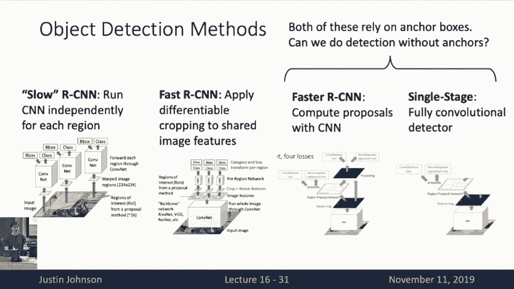
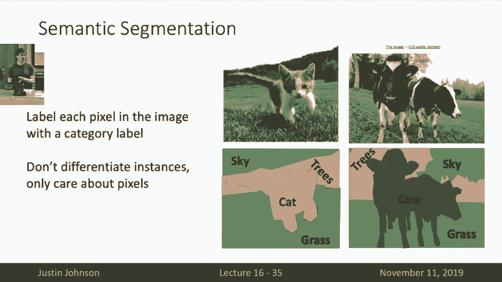
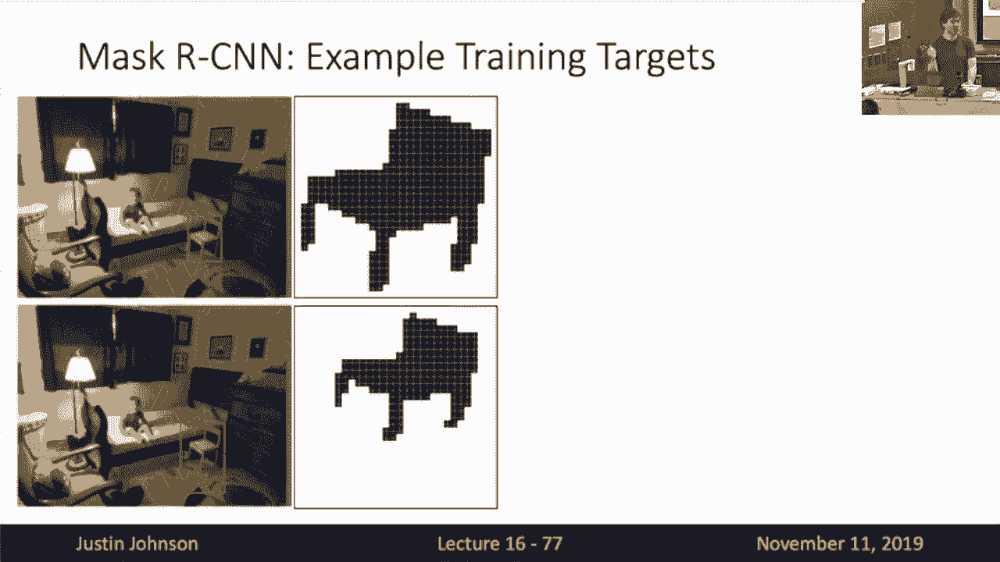
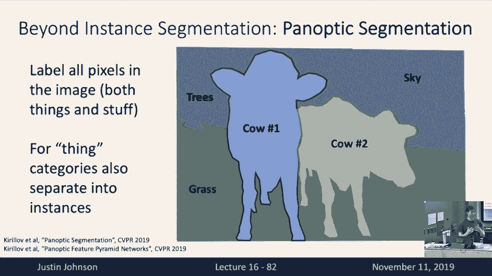

# 【双语字幕+资料下载】CS231n进阶课 ｜ 深度学习与计算机视觉(2019·全22讲) - P16：L16- 目标检测与图像分割 - ShowMeAI - BV13P4y1t7gM

so welcome back to lecture 16 today，so welcome back to lecture 16 today。

we're gonna talk about some more optical，section and as well as some different。

types of segmentation tasks so last，lecture recall that we started to talk。

about all these different types of，localization tasks that we can do in。

computer vision that go beyond this this，this image classification problem that。

assigns single category labels damages，and instead tries to localize objects。

within the input images and last time we，really focused on this object detection。

task where we have to input this a，single RGB image and then output a set。

of bounding boxes for giving all the all，the objects that appear in the image as。

well as a category label for each of，those boxes well I think that we went a。

bit fast through a lot of the concepts，in object detection in the last lecture。

so I wanted to kind of recap a little，bit on some of the important most。

important most salient points from last，lecture and one point that actually we。

forgot to make last lecture is just how，important deep learning has been to the。

task of object detection so this is a，graph that shows the progress on object。

detection for about 2007 up to 2015 and，you can see that from about 2007 to 2012。

people were using other oh and the，y-axis here is the is the performance on。

this object detection data set called，Pascal vo C and the metric here is of。

course the mean average precision that，we talked about in the last lecture and。

we can see that from about 2007 to 2012，people were using other types of non。

deep learning methods for object，detection and there was some pretty。

steady progress on this task from about，2007 to about 2010 but from about 2010。

to 2012 the progress has sort of，plateaued on this object detection。

problem and then starting in 2013 when，people first applied a deep learning to。

this object detection task then you can，see there was a huge jump over all of。

the previous non deep learning methods，and this jump was not a one-time of fact。

that as we moved on to better and better，object detection methods with deep。

learning then gains continued to go up，and up and up so by the way these dots。

that are in that are the the deep，commnets detection are the the familiar。

fast faster and slow are CN n methods，that we've talked about last time and。

each one of them just gave huge，improvements over the previous，generation and this led to a period。

from about 2013 to 2016 of just massive，massive improvements in object detection。

that really overcame this plateau that，the field had had from about 2010 to。

about 2012 um you'll notice here that，this plot actually ends at 2016 and the。

reason is that after about 2015 people，stopped working on this data set because。

this Pascale vo see data set was deemed，too easy at that point so about so。

progress in object detection definitely，did not stop in 2015 it's just sort of。

difficult to measure continuous progress，in this way because of about that time。

people switched over to start working on，more challenging data sets and the。

current state of the art on this on this，Pascale vo see benchmark is well over it。

is well over 80% I don't actually know，what the current state of the air is。

because most methods don't even bother，to test on this data set anymore。

since it's deemed to be a fairly easy，for object detection so then last time。

we really focused on this our CNN family，of models we saw this slow our CNN that。

was sort of this first major jump over，the non deep learning methods that was。

fairly slow but give debate but gave，fairly good results compared to。

everything else that had come before in，object detection and then we had seen。

this fast our CNN version that sort of，swapped the order of convolution and。

pooling and late gave some some accuracy，improvements but even more importantly。

gave some big speed gains but I actually，wanted to dive in a little bit more。

detail today on the training procedure，for these our CNN style networks because。

I realized that this is something we，glossed over a little bit at the end of。

lecture and then after class a lot of，students came up and asked questions so。

I realized that this was just something，that was not clearly discussed in the。

last lecture and this would also serve，as a nice recap of how these our CNN。

methods work as well so remember in slow，our CNN the way that it works is that。

during training time we're going to，receive an RGB input and are a single。

RGB input image and during training time，we have access to the ground truth。

bounding boxes of this image as well as，the category labels for each of those。

bounding boxes now then we'll run some，region proposal method on top of there。

our input image that will give us a set，of region proposals on the image that。

tell us regions that are likely to，contain objects and again we're just，sort of treating this。

region proposal method as a black box，because back in the days people used to。

use things like selective search that，were sort of heuristic methods but later。

on he's got replaced by neural network，methods as well and this is basically。

all we had said last time about how we，handle boxes in our CNN training um but。

there's actually another really，important step here which is that during。

the training end during each iteration，of training we need to decide whether。

each region proposal is either a，positive a negative or a neutral region。

proposal and we do this by comparing the，region proposals that we get with the。

ground truth boxes here so that then，here and now we've got kind of a lot of。

colored boxes going on in this image so，let's talk about them a little bit。

explicitly so here the grippe the bright，green boxes are the ground truth。

bounding boxes of the three objects that，we want to detect being the two dogs and。

the cat and now all of the we've get all，these region proposals here shown in。

cyan for all different but all the，different parts of the image so we can。

see that some of the region proposals，actually correspond pretty well to some。

of the ground truth objects so in，particular we've got some region。

proposals that are very close to eat to，each of the two dogs and to the cat but。

we also have some region proposals that，we got maybe one region proposal on the。

face of the dog that partially，intersects one of the ground troops but。

is pretty far from being perfect and we，also got this region proposal in the。

background that covers this piece of a，chair which is totally disjoint from all。

of positive projects that we wanted to，detect so now based on that done we need。

to categorize each of these region，proposals as being a true positive that。

is something relatively close to a，ground truth regen SB and that would be。

these blue boxes or I guess they're kind，of purplish but these blue boxes that。

are on region proposals that are very，close to a grouch earth bounding box and。

we and by very close we usually measure，that by with but with some threshold。

intersection over Union now some of the，boxes are going to be no so these will。

be positive boxes that we want the，network to classify as positive region。

proposals that do indeed contain an，object some of the region proposals。

however will be negative samples that do，not contain an object so an example here。

would be this red bounding box in the，background over the the portion of the。

chair because this region proposal does，not cover any ground truth bounding box，at all。

and the way that we usually determine，which bounding boxes are negative is。

also by setting a threshold on，intersection over Union so here it would。

be common to say for example that a，region proposal is considered negative。

if it has intersection over Union less，than 0。3 with all the other positive。

bounding boxes in the image where that，0。3 would be a hyper parameter you would。

need to set via cross-validation，but interestingly some of the region。

proposals are kind of in the middle，there neither positive nor negative so。

that's that that's an example of that is，this cyan bounding box ayan region。

proposal that we get over the face of，the dog so here it partially intersects。

a positive bounding box because it，partially intersects the dog so we don't。

really want to count it as a negative，but we also don't really want to count。

it as a positive because it's quite far，from being a perfect bounding box。

so actually we end up with these three，different categories of region proposals。

based on matching them up with the，ground truth we get positives that are。

that should contain an object negatives，that definitely do not contain an object。

and neutral boxes that are kind of，somewhere in the middle and now when we。

when we go and what we go ahead and，train this thing we're going to。

typically ignore the neutral boxes and，instead we will train the CNN to。

classify the positive region proposals，as positive and classify the negative。

region proposals as negative because，trying to train the network on the。

neutral boxes would likely confuse it，since these are kind of boxes that are。

neither positive nor negative so then，when we train this thing we will then。

tip will then tend to crop out all of，the region proposals corresponding to。

all crop out the pixels corresponding to，all of the positive region proposals and。

all of the negative region proposals and，each of these boxes will just crop out。

the pixels of the image and then reshape，them to be some fixed size like 2 to 4。

by 2 to 4 which is a standard resolution，that we use in our classification。

networks and then at this point it，basically looks like kind of an image。

classification problem where rather than，working on whole images instead we're。

training on these crops that are coming，out of these images but once we've。

decided on these crops then it looks，basically like an image classification。

problem with so then each of these，region proposals we pass into our。

convolutional neural network of course，we share the weights among all of these，and for each of the。

regions we want to predict two things，one is a category label and the other is。

a bounding box regression transform that，transforms from the region proposal to。

the but to the object bounding box that，we should have predicted so for the。

positive bounding boxes that for the，positive region proposals that did match。

up with some ground truth box we know，that they have a cat a target category。

label which is equal to the category，label of the ground truth box that they。

matched with so that would be for，example the dog the two dogs and the cat。

and for the negative bounding box that，did not the negative region proposal。

that did not match with any ground truth，box its we should classify it as a。

background region and remember we add，this extra background region to our set。

of categories when we're doing project，detection and now the other wrinkle is。

on predicting the bounding box because，we see that these region proposals that。

are coming out of our region proposal，method do not perfectly line up with the。

boxes of the objects that we wanted to，predict so then last time we talked。

about how we can parameterize this，bounding box regression that transforms。

the raw bounding box coordinates into，some target output bounding box that we。

actually will omit from the detector，yeah question the question is since。

we're using a black box region proposal，method how do we give the label to those，proposals。

yeah the positive negative label well，that really comes from this matching。

step because you imagine you kind of，mean you kind of like set up a by talk。

about bipartite matching where you've，got like all your region proposals over。

here and then all of your ground truth，objects over here and you need to kind。

of pair them up based on the inert based，on intersection over union between the。

reaching proposals and the ground truth，boxes so you know the label comes for。

treet because each region from H，positive region proposal ends up getting。

paired with the ground truth bounding，box that it has the highest overlap with。

so then we assign the category label to，the region proposal based on the。

category label of the ground truth，bounding box that it has the best match。

with and that's that's the part that we，could completely glossed over in in last。

times lecture is that a little bit more，clear so that gives us the label for the。

for the category label for each of these，bounding boxes but then there's also the。

trick of what should our regression，label be and now for each of these。

bounding boxes because each positive，bounding box each positive region。

proposal had been paired with a ground，truth，this lets us say what bounding box。

should we have predicted from this，region proposal so then we can use use。

our box transfer the box transform，target for the positive boxes will be。

will be the Box transform that would，have transformed from the coordinates of。

the raw region proposal into the，coordinates of the bounding box that。

that region proposal had been matched，with in the input image so that's a。

little bit subtle here because it，because then it's kind of weird right。

because the the targets for each of，these boxes depend on the ground truth。

box that we had matched the region，proposals to yeah it was another okay。

yeah yeah so then we need to do this，this pairing up before training is is。

one thing that you could something that，you have to do although one thing that。

can get kind of tricky so if you're，doing this before training then what we。

would typically do is run your region，proposal method offline on your entire。

training set and then do this matching，up a procedure offline so because this。

this matching is maybe kind of，complicated and if you have external。

region proposals then you can actually，do that offline and dump all these。

labels to disk before you start training，so that's how that's one way that you。

might implement this kind of method now，where it gets tricky is something like。

in faster are CNN where we are now，learning the region proposals jointly。

with the rest of the system so then you，need to do some of this matching online。

between the region proposals and the，ground truth boxes but that's only the。

case for something like faster our CNN，where we actually learning the region。

proposals online during training and，then the other bit of wrinkle here is。

that for boxes that are negative then，those it doesn't make sense to have any。

regression target because a box that，should have been classified as。

background does it does not was not，paired to any ground truth bounding box。

so for negative boxes we do not have any，regression loss the regression loss is。

only applied to the the region proposals，that were marked as positive during this。

this pairing up phase of the region，proposals and the boxes so that makes。

something if that makes calculating your，losses now a little bit more complicated。

than they have been in other in other，applications because now we have a。

classification loss for everything but，we have a regression loss only for some。

of the the inputs to the network and，maybe the fraction of positives and。

negatives is something that you use per，mini-batches now maybe another type of。

parameter that you often need to set and，tune when working with object detection。

methods so this is hopefully gives us a，little bit more clear detail on exactly。

what the training time operations are，when you're training one of these are。

CNN style networks yeah question yeah，that's the idea so then to kind of。

repeat that for is that we're kind of，making this assumption that our CNN is。

not inventing bounding boxes from，scratch are the way that our CNN。

generates bounding boxes is by refining，or perturbing the input region proposal。

boxes a little bit so then during，training we snap we kind of compute this。

this what was what was look what，transform what do we need to do to snap。

the input bounding box the input region，proposal to a ground truth region but to。

a ground truth object boundary box and，that a snapping transform becomes the。

target for the regression loss in our，CNN and now during test time we also。

assume that we have region proposals，that look similar as they did during。

training time so in our final so we get，our final output box as a test time we。

run the same region proposal method on，the image and then apply these same。

regression transforms that are predicted，per region proposal of course this this。

points to one obvious failure case of，one of these systems is what if the。

types of region proposals you use a test，time are very different from the types。

of region proposals that you use during，training time well then you would expect。

of course expect the system to fail，because you know one of the central。

assumptions of machine learning models，is that the type of data we get as input。

at test time is similar to the type of，data we get as input at training time。

and for one of these our CNN style，methods that rely on external region。

proposals the region proposals are，really part is really part of the input。

to the machine learning method they're，not part of the output so then it。

becomes very important that the，statistics of the region proposals the。

test time are very similar to they were，at what they were at training time yeah。

yeah I think the question is that how do，you actually validate this and that's。

that's this that's why we use this，metric of mean average precision that we。

talked about last time to evaluate，object detection and the problem is that。

like one way that you might imagine，evaluating these things is like some。

accuracy style metric where I have some，heuristic about maybe。

I extract a faxed set of boxes from each，image and then see whether or not they。

match with the ground truth but the，reason why that's a difficult and。

annoyed bad way to evaluate for object，detection is exactly as you said due to。

the large number of background boxes，what so the reason that we use this mean。

average precision metric instead is that，it helps us to factor out the effect of。

these large numbers of background boxes，in a more of us for in a more robust way。

so that's why we need this more，complicated mean average precision。

metric when we evaluate objects detected，object detection methods okay so then。

the story here for fast our CNN training，is basically exactly the same so as you。

remember fast the only main difference，between slow our CNN and fast our CNN is。

that we swapped the order of feature，extraction and cropping so with slow our。

CNN we were cropping independently the，pixels from each region proposal where。

is in fast our CNN we're going to run，the entire input image through this。

backbone CNN and get these whole，high-resolution image features and then。

we will crop out the features，corresponding to each of the region。

proposals from these image features and，but other other than this and other than。

that we still have the same procedure of，pairing up the positives and the。

negatives and although although all the，training targets for fast our CNN are。

going to be exactly the same as they，were in slow our CNN and now for faster。

our CNN remember that it's a two-stage，method that first we have this region。

proposal network that's going to work on，the backbone features and predict our。

region proposals and then from there we，have this second stage it's going to。

crop the features from the region，proposals and then make these final。

classification decisions so with faster，our CNN one way that you can think about。

it is that we have two stages of，transforming the boxes in the first。

stage we have these input anchors and，recall that the anchors are just these。

fixed set of boxes of fixed sizes and，aspect ratios that are spread over the。

entire input image and now in the first，stage what the region proposal network。

is doing is transforming this fixed set，of anchor boxes into a set of region。

proposals and now in the second stage we，want to transform the region proposals。

into our final output object boxes and，now the losses that we use that。

each of these two stages and faster are，CNN are is basically the exact same。

types of losses that we had used in slow，and fast our CNN that in order to write。

that in order to transform anchors into，region proposals we have we need to do a。

similar type of pairing up effect so in，order to train the RPN and faster our。

CNN this is where we're doing the，transform from this fixed set of anchor。

boxes into this these region proposals，and now again we need to the exact same。

pairing up where for each anchor box we，need to say whether or not it should be。

a positive or should be a negative or，should be a neutral the difference the。

only difference here is that rather than，working on region proposals coming out。

of selective search instead we're，working on this fixed set of anchor。

boxes that we had specified as hyper，parameters to the network and the other。

difference here is that now in the，region proposal network we are only。

making a two-way classification for each，region proposal or rather for each。

anchor box we need to say whether or not，it is positive or negative and so then。

we don't need to give a category label，at this in this in the region proposal。

network we just want to say whether each，positive each each anchor box should be。

classified as a positive region proposal，or a negative region proposal but other。

than that we use the exact same logic，for pairing off anchor boxes to ground。

with regions and the exact same logic，for determining the classification。

labels and the regression targets in the，region proposal network of Bastyr our。

CNN and then for the second stage in，faster our CNN it's exactly the same。

procedure again where now we need to do，a pairing up between the region。

proposals coming out of the RPM and the，ground truth boxes in the image and as。

we point as we discussed a little bit，earlier now this part you actually need。

to do online because the region，proposals that come out for each image。

will change over the course of training，because we're jointly training the。

region proposal network with the second，stage of this with the second stage so。

that actually becomes kind of a tricky，implementation detail as we move from。

fast to faster our CNN is that now this，pairing up between region proposals and。

and ground truth boxes actually needs to，happen online but other than that the。

logic is still the same that we pair up，our region proposals with our ground。

truth boxes and this and after we pair，them up that gives us our classification。

targets and our regression target，for the second stage in faster our CNN。

so I'm hopefully this this clears up cut，hopefully this this by walking through。

this a little bit more explicitly this，helps clear up a bit of the confusion。

from last time about exactly how these，different networks are trained are there。

any more sort of lingering questions on，these are CNN style methods okay I'm。

sure more will come up later okay，so then there's another remember the the。

kind of one of the important new，operators that we introduced as we moved。

from slow to fast our CNN was this，feature cropping right because in fast。

our CNN we had swapped the order of，convolution and cropping and last time。

we and and right the goal of feature，cropping is that we need to do this。

cropping of the read these cropping of，the image features into region based。

features in a way that is differentiable，so we can back propagate through this。

whole procedure and last lecture we had，talked about this ROI pool operation as。

one mechanism for cropping the feature，vector for cropping these for cropping。

the features corresponding to regions，and recall it the way that ROI pool。

worked is that we take our region，proposal from the image we project the。

region proposal from the image onto the，feature map and then from there we snap。

the region proposal onto the grid cells，of the feature map because the feature。

map is probably going to be at a lower，spatial resolution than the raw input。

image and now another of these key goals，of these these these cropping operations。

is that the output of the cropping，operation needs to be a feature map of a。

fixed size so that we can feed the，output of the cropping operation to our。

second stage Network downstream so then，say in this in this example we want the。

output to have a fixed spatial size of，two by two so then in order to make the。

output of a fixed spatial size of two by，two we're in the ROI pool operation。

we're going to divide up the the snapped，region proposal into into roughly equal。

sized regions but they won't be exactly，equal size because we're going to snap。

we're going to we divided up we're also，going to snap to the grid cells of the。

of the image features and then within，each so then within each of these sub。

regions these two by two sub regions，we're going to do a max pool operation。

so this this recall is this ROI pool，operation that we talked，but last time so that lets us do this。

feature cropping in a way in that lets，us swap the order of cropping and。

feature computation but there's actually，a couple problems with the ROI pool。

operator one is that these features are，actually misaligned due to all the。

snapping so there's actually two part，two ways in which we're snapping the。

region we're snapping onto the grid，cells in our eye pool one is that we。

take the whole region proposal and snap，it onto grid cells and then the other is。

that we divide up the region proposal，and then snap the subdivided regions。

also onto grid cells and because of，these two bits of snapping we actually。

end up with some misalignment in the，features that are computed by this ROI。

pool operation so now here we've kind of，done a double projection right so here。

what's going on in the visualization is，that the green the green box shows the。

original region proposal in the input，image and then we projected the original。

region proposal over onto the feature，map and then snapped the wreath and then。

in the feature map we snapped it to this，blue box and these blue in these。

different-colored sub regions and now，we're projecting the sub regions back。

into the original input image and now，this and now kind of the position the。

average position at which each of the，features for the sub regions is computed。

is going to be kind of the the middle，the midpoint of these some of these。

different colored sub regions so now we，can see that due to the effects of these。

snapping on the Centers of the sub，regions in the input image and up pretty。

misaligned with the actual input，bounding box that we that we originally。

wanted to work with and this this so，this this misalignment is one big。

potential problem when we're working，with when if we were going to use this。

ROI pool operation and now there's，another kind of subtle problem that。

seems a little bit weird with this ROI，pool operation if it is also related to。

the snapping one one so one way to look，at what this cropping operation is doing。

is that it's a function that takes two，inputs and produces one output the two。

inputs are the the feature map for the，entire image and the coordinates of the。

bounding box at which we want to crop，and the output are the features for the。

bounding before that bounding box but，now because of the snapping we cannot。

back propagate to the coordinates，of the bounding box right because the。

coordinates of the bounding box were，always snapped onto the grid cells of，the feature map。

so in this roi pool operation we can we，can back propagate to the from the。

region features back to the image，features but there's no way for us to。

back propagate from the region features，back to the coordinates of the bounding。

box at which we were doing this this，computation so that also gives us a hint。

that maybe something is a little bit，weird inside this are this roi pool。

operation because normally we like to，use operations that are fully。

differentiable and can properly pass，gradients between all of the inputs and。

all the outputs and that's not the case，with this ROI pool operation so the the。

fix for this is this ROI aligned，operation that we did not have time last。

time to talk about in detail but I，wanted to go over it today because you。

actually will be implementing it on your，homework and assignments I've so it。

actually seems like something we should，actually talk about in lecture so the。

idea with ROI aline is that we want to，over we want to fix these problems that。

are result we want basically want to，remove all the snapping that's happening。

inside roi pool so the way that we're，going to do this is make everything。

continuous have no snapping anywhere，inside of the operation so just as。

before we're gonna take our original，input region proposal and project it。

onto the onto the grid of features and，now rather than rather than doing any。

snapping instead we're going to sample a，fixed number of positions inside we're。

going to divide this the the projected，region proposal into equal sized regions。

and then within each of those equal，sized regions we're going to have some。

equal sized samples within each of those，equal sized regions and these samples。

are the places at which we want to，sample the image feature map but the。

problem is that because we didn't have，any snapping the positions at which we。

want to sample these features probably，do not align to grid cells or probably。

do not align to the grid of the actual，image features right so that's a problem。

how great the way that we normally think，about doing this this this sampling is。

that you just want to pull out the，features at one position in this grid of。

features but now we kind of want to，sample that feature map at，arbitrary real-valued positions in。

arbitrary real-valued spatial positions，in that feature map so now the way that。

we can do that is actually using，bilinear interpolation to interpolate in。

between the cells of the grid of our，image feature map so kind of - to zoom。

in on what that looks like for one，sample point in the in in so for one of。

these points we want to sample in this，very lower right hand so in the bottom。

right hand region we wanted to sample，four different points and then we're。

going to zoom in at the bottom-right，hand point in the bottom right hand。

region to see what's going on there so，basically we want to sample a feature。

vector from the image features at this，real valued position six point five。

comma five point eight but of course，it's a discrete grid so there's no we。

can't just pull out a feature vector at，that point but instead what we can do is。

approximate is do a locally linear，approximation to the feature grid and。

instead sort of compute a feature vector，at this real valued position as a linear。

combination of the nearest neighbor，features that actually do appear in the。

spatial grid and do it and the，particular way that we do this is by。

linear interpolation which means that in，the x-direction we're going to look at。

the two nearest neighbor features in the，x-direction and have a linear blend that。

the a blend weight that scales linearly，with the distance between the two。

nearest neighbor feature vectors in the，X direction and then similarly in the Y。

direction we're going to look at the two，nearest neighbor feature vectors and。

blend linearly according to the distance，between those so to kind of walk through。

this a little bit more explicitly in，order to compute this this feature。

vector at this real valued position six，point five comma five point eight it's。

going to be a some linear combination of，these four nearest neighbor feature。

vectors that actually do fall onto，integer valued positions of the of the。

grid so then the way and the way that we，compute the linear weighting the linear。

weights on these four nearest neighbor，feature vectors depends on the x and y。

distances between the point at which we，want to sample and the actual positions。

in the grid so now the weight for this，feature vector at integer grid cell six，comma five。

we'll the axe weight is going to be 0。5，because the point at the position of if。

we want to sample is exactly in between，two integer grid cells and the weight。

for the the vertical feature is going to，be and the vertical weight is going to。

be zero point eight because we're very，close to this six point this this uh。

this this grid cell and then this we，kind of repeat this for each of these。

four nearest neighbor grid four nearest，neighbor features in the spatial grid。

where the the linear weight for each of，these four features depends on the。

distance between the actual position of，the grid cell and the put in the green。

position at which we want to sample so，then what we can see is that one is that。

this is a differentiable operation so we，cannot we can back propagate both into。

the now we can back propagate both from，the upstream both from the right because。

they're now doing back propagation what，we're going to do is we're going to get。

a feature upstream gradient for this，sample point this sampled real-valued。

point in the in the grid and now we can，back propagate that upstream gradient。

both to the actual feature vectors in，the grid as well as the actual position。

of the bounding box because now the，actual position of the actual real。

valued position of the bounding box was，used to determine the the spatial。

position at which we were going to，sample so we can actually back propagate。

all the way into the coordinates of the，bounding box that we received as input。

to this our y align operation so this is，now this differential operation that we。

can back propagate through very nicely，and now they now basically we repeat。

this procedure so within our region，proposal we're going to divide it up in。

equal sized regions and then within each，of those equal size sub regions we're。

going to sample and equals equally，spaced no or appoints within each。

sub-region so and then within and then，once we've computed a feature vector for。

each of these green sample points this，gives us now an equal number of feature。

vectors for each of our sub regions so，now we can do max pooling on the sampled。

green points within each sub region to，give the final feature vector for Egypt。

to get one final feature vector for each，of these sub regions but then we can。

propagate forward into the rest of the，this R，alliant operation was a little bit。

complicated but it basically solves the，two problems that we had with the ROI。

pool operation now because we have no，snapping anywhere in this sampling。

procedure because we're using，real-valued sampling and bilinear。

interpolation now it means that all of，our sample features are going to be。

perfectly aligned to the positions in，the input image so it's going to solve。

this alignment problem that we have an，ROI pool and it's also going to solve。

this differentiability problem with ROI，pool that we can now back propagate。

upstream gradients both into the down，both into the image feature map as well。

as into the positions of the bounding，boxes that we that we had computed and。

you guys will get a chance to implement，this for yourself on assignment five so。

hopefully it will become clear by then，so that gives us kind of an overview of。

some of these object attack but actually，I wanted to pause here so maybe let this。

sink in it was there any questions on，this this ry aligned operation okay。

they'll probably be pep questions on，Piazza once we get to assignment five ok。

so then that then that then this returns，us to the set of object detection。

methods that we had talked about last，time so remember we talked about this。

slower CNN and fast our CNN and now，faster and single stage methods that you。

don't do not no longer rely on external，region proposals but one kind of。

interesting question about faster and，single stage rejection methods is that。

both of them still rely on some notion，of anchor boxes right because in faster。

our CNN we had this fixed set of anchor，boxes that we use inside the research。

proposal Network and in single stage，detectors we were just going to make it。

we're still going to use anchor boxes，and we just make a class a。

classification decision directly for，each of the input boxes so now there's a。

question there's kind of an interesting，maybe thought exercise is there any way。

that we can design an object detection，system that does not rely on anchor。

boxes at all and just kind of more。

directly predicts bounding boxes in a，nice natural way and there's actually a。

very cool paper that does that that did，this that was done right here at。

University of Michigan by Professor，professor John's group last year and。

their really cool idea was the，a corner nets architecture for object。

detection that is very different from，all of the approaches to object。

detection that we've seen so far I don't，want to go too much into the details of。

this I just want to give you a brief，flavor of kind of what this does and how。

it's very different from the object，detection methods that we've done。

previously and this one will not be on，the homework so it's fine if you don't。

understand all the details but the idea，with this corner net architecture is。

that we're going to change the way we，parameterize bounding boxes and we're。

going to now represent bounding boxes by，the upper left-hand corner and the lower。

right-hand corner and now in order to，detect a bounding box we need to just。

simply have each pixel of the image，decide what is the probability that I am。

the upper left-hand corner of each，object category and what is the，probability that I am the lower。

right-hand corner of each object，category so then we're going to run the。

image through some backbone CNN to get，image level features and then from these。

image level features we're going to，predict an upper left corner heat map。

for each object category that we want to，predict so now this upper left corner。

heat map is going to say for every，position in the feature map for every。

category that I wish to detect what is，the probability that this location in。

space is the upper left-hand corner of，some bounding box at this put at this。

point in space and this you can sort of，train with a per pixel cross-entropy。

loss and now similarly we have the，second branch that is a lit predicts for。

each position in space for each for each，category wanted attacked what is the。

probability that this position in space，is the lower right-hand corner of some。

bounding box and this you can also train，with the cross-entropy loss and now you。

can imagine training though you can，imagine training this thing right that I。

just say for every position in the Met，and in the feature map which should it。

predict either should what it just you，have targets for whether every position。

in space should be an upper left-hand，corner and should be a lower right-hand。

corner but now there's another problem，which is that at test time how do we。

actually need to pair up the upper each，upper left-hand corner with some lower。

right-hand corner and actually in to，actually emit a bounding box and the way。

that we overcome that problem is，actually predicting also an embedding。

vector for every position in space so，for every position in space we predict。

an upper left-hand corner embedding back，and then in the right corner detection。

branch we also emit a lower right corner，embedding vector and here the idea is。

that for each bounding box the embedding，vector predicted at its upper left-hand。

corner should be very similar to the，embedding vector predicted and its lower。

right-hand corner so then at test time，we can sort of use the hand waving this。

part a little bit but we can then use，distances between these embedding。

vectors - now pair up each upper，left-hand corner with some lower。

right-hand corner and now emit actually，a set of bounding box outputs so I。

thought this was a very clever a very，clever and very cool approach to object。

detection that was very different from，many of these other approaches that。

we've seen so far and of course it was，happened right here so I got to talk。

about it so that's I just wanted to give，you a brief sense of this very different。

flavor to object detection and I'd also，like to point out this was very recent。

this was just published last year so I，think it's remains to be seen whether。

this will become an important paradigm，in object detection moving forward but。

it's so different that maybe it could be，who knows so that gives us some more。

details on object detection and now，we've got a couple other computer vision。

tasks that we need to talk about so one，is this task of Simmons so next up is。

this task of semantic segmentation so to，define the task one problem what。

basically in semantic segmentation what，we want to do is label every pixel in。

the input image with a category label so，one interest of the for one of these。

input images of like this adorable，kitten while walking around on the on。

the grass we want to label every pixel，of that image as either kitten or grass。

or trees or sky or whatever given some，fixed set of object categories that our。

system is aware of and one important，points to make about this semantic。

segmentation task is that it does not，it's not aware of different object。

instances the only the only thing it，does is label all the pixels in the。

image so what that means is that if，we've got two objects of the same。

category next to each other in the image，like these two cows in this example on。

the right then semantic segmentation，does not distinguish the two instances，of the category。

it simply labels all the pixels so the，output of semantic segmentation gives us。

this kind of like mutant brown blob cow，blob in the middle of the end。

but it doesn't tell us which pixels，belong to which cow or even how many car。

cows there are so we'll overcome that。

with some later different tasks but for，now this is the semantic segment this is。

the definition of a semantic，segmentation task and now one way one，kind of maybe silly way you could。

imagine solving this semantic，segmentation task is again using this。

idea of sliding windows that you can，imagine for every pet for every pixel in。

the image we could extract a small patch，around that pixel and then and then feed。

that patch to a to a CNN and now that，CNN could just predict a category label。

and we could imagine extracting patches，around every pixel in the image and。

repeating this over and over and over，again and this would be like very very。

slow very very inefficient this would be，kind of the equivalent of slower CNN but。

for semantic segmentation so of course，we definitely don't actually use this。

method in practice but it's kind of，instructive to think that this in。

principle should work pretty well given，infinite amounts of computation so。

instead what we do what's very commonly，used in semantic segmentation is instead。

to use a CNN architecture called a fully，convolutional network and this is a。

convolutional network that does not have，any fully connected layers or any kind。

of global pooling layers it's just a big，stack of convolution layers and all。

convolutional stuff so then the input to，the image is as an image is an image of。

some fixed spatial size and the final，output of the image is a set of class。

scores for every pixel so as an example，you can imagine running this if you can。

imagine stacking a whole bunch of three，by three stride one pad one convolutions。

and then the output would have the same，spatial size as the input and now we。

want the final convolution in the net，with the final convolution layer in the。

network to have a number of output，channels equal to the number of。

categories that we want to detect and，then we can interpret the output of this。

final convolutional layer as a score per，for each pixel in the image for each。

category that we want to detect and then，you can imagine doing a soft max over。

each of the scores at each pixel to give，us a probability distribution over the。

we're labels at each pixel in the image，and then we can train this thing using a。

cross entropy loss per pixel yeah yeah，the question is how do we know how many。

categories we have in the image so here，whenever you're training a system for。

semantic segmentation it's just like，image classification in that we select a。

set of categories beforehand and that's，there's going to be some fixed set of。

categories that our system is going to，be aware of so I so then that would be。

determined by the data set on which you，train there'll be some set of categories。

that it that the data set has labels for，and then and then unlike bounding ball a。

cop to detection we don't have any kind，of variable size output problem because。

we know a fixed number of ajik object--，categories that the system is aware of。

and we simply want to make a prediction，for every object category for every。

pixel so then the output is the size of，the output is fully determined by the。

size of the input and we want to work on，this variable output problem like we did。

it in detection so then we can imagine，training this thing with a cross entropy。

loss function per pixel and then that，should go quite nicely but there's a bit。

a couple problems with this sort of，cilium with this with this architecture。

I've actually drawn on the screen one is，that we act in order to make good。

cyclomatic segmentation decisions we，actually might want to make decisions。

based on relatively large regions in the，input image so if we if we imagined this。

stack if we mention stacking up a whole，bunch of 3x3 convolutions with stride。

one pad one then the number of effective，receptive field size is going to grow。

linearly with the number of convolution，layers remember that if we stack two 3x3。

convolutions on top of each other then，the output of those second through by。

through convolution is effectively，looking at a 5x5 region in the input and。

if we stack three three of my through，convolutions on top of each other then。

the output is effectively looking at a，seven by seven region in the input so if。

you kind of generalize that argument，then you see the stacking of stacking a。

stack of l3 Lurkey convolutions on top，of each other will give us an effective。

receptive field size of one plus two owl，and that means we've actually need a。

very large number of layers in order to，get a very big receptive field size and。

the other problem here is with，computation so in，segmentation we'd often want to work on。

relatively high resolution images and，like people would sometimes apply this。

not just to like internet images but，also to like maybe satellite images that。

are like megapixels in alter in all in，all directions so it's important to it。

that this be relatively computationally，efficient and doing all of this。

convolution at the original image，resolution will be very problematic and。

very expensive computationally so as a，result nobody actually uses。

architectures that look like this for，semantic segmentation instead you'll。

often see architectures that have more，of this flavor that use some kind of。

down sampling and then some kind of up，sampling and the advantage you the。

advantages here are twofold one is that，/ down sampling in the beginning of a。

network we get a lot of computational，gains just as we did in the image。

classification setting and then，similarly by down sampling it also。

allows our effective receptive field，size to grow much more quickly as a。

result of this of these down sampling，operations and now down sampling we're。

very familiar with from convolutional，neural networks for classification we。

know that we can use something like，pooling even at either average or max。

pooling or straight at convolution to，deal with down sampling inside a neural。

network model but up sampling is，something we really haven't talked about。

so much and we don't really have any，tools in our neural network bag of。

tricks that allow us to perform up，sampling inside of a neural network so。

then let's talk about a couple options，that we can use for actually performing。

op sampling inside of a neural network，so one relative so because because that。

down sampling is often called pooling，then up sampling should clearly be。

uncool because it's like the opposite of，pooling right so one option for unpolite。

is this so-called bed of nails on，pooling so here given an input of。

spatial sighs let me see is the number，of channels and spatial signs two by two。

we want to produce an output which is，twice as large spatially with the same。

number of channels at each position and，now what we're going now this is called。

a bed of nails up on pooling is because，we're going to have the output be filled。

with all zeros and then copy the feature，vector for each region in the input for。

each position in the input into the，upper left hand corner of。

each correspondent region the output so，that looks kind of like one of these。

like bed of nails that people lay on，sometimes that it's like zero everywhere。

and then we've got these feature vectors，sticking up in kind of a grid-like。

pattern this is actually not such a，great idea probably there probably is。

too bad aliasing problems so people，don't actually use this too much in。

practice anymore one upset another up，sampling method or unpooled method that。

people use more commonly is nearest，neighbor own pooling so here we're just。

going to duplicate so then each each，feature vector in the input becomes some。

is copied a fixed number of times to，produce some larger output so then this。

two by two inputs becomes a four by four，output and each position in the two by。

two input gets copied four times to give，rise to a two by two region in the。

output now there's actually remember we，went through all this song and dance。

about bilinear interpolation inside ROI，inside the ROI align operation and it。

turns out that we can also use bilinear，interpolation for up sampling as well so。

here what we can do is we've got our，input is now a fix is now C channels and。

2x2 in space and we could imagine，putting dropping a four by four grid of。

equally spaced sampling points in the，input feature grid and then for each of。

those points in the four in the in the，four by four sampling grid we can。

compute use by linear interpolation that，again to compute these output features。

and this is going to give maybe a more，smooth version of up sampling compared。

to nearest neighbor up sampling and if，you're familiar with image processing。

you know that another thing we can，actually do is by cubic interpolation so。

one way to think about bilinear，interpolation is that we're using the。

the the the nearest the one nearest，neighbor in the the one nearest neighbor。

is in a little two-by-two region to，compute a locally linear approximation。

to the input and now with by with by，cubic instead what we're going to do is。

come is use a larger region in the input，region in the in the input feature map。

to compute a locally cubic approximation，to the inputs and then use that and then。

sort of sample according to this cubic，approximation rather than a linear。

approximation and I don't want to go，into the details here but this is。

basically the stand if you basically，whatever you resize an image and your。

browser or an image editing program it's，usually using you it's usually using by。

cubic interpolation by default and if，it's good enough for resizing JPEG。

images to put on the web then it's maybe，a reasonable thing to try for resampling。

or resizing feature Maps inside of your，neural network so these are all on。

fairly simple approaches to up sampling，and they're all kind of implemented in。

standard frameworks like pi towards your，tensor flow another slightly more exotic。

version of upsampling，is kind of the opposite of max pooling。

and this is of course that's because the，opposite is called max on pooling and。

the idea here is that now the unbeli，operation is actually no longer going to。

be an independent operator in the，network instead each unpooled or up。

sampling operation will be tied to a，corresponding down sampling operation。

that took place earlier in the network，so that gives and then then when we do a。

max pooling operation to down sample，we're going to remember the position in。

each inside the grid that where the max，value occurred and then when we do。

uncool we're going to do kind of like a，bed of nails I'm pulling except rather。

than placing each feature vector into，the upper left hand corner of the region。

instead we're going to place it into the，position where we found the max value in。

the corresponding downsampling max，pooling region that happen earlier on in。

the network and the reason that this，might be kind of a good idea is that if。

you're training a network with max，pooling then in the forward pass of max。

pooling you get this kind of like weird，a misalignment due to the max pooling。

selecting different points in the，pooling region and then if we unpooled。

in the same way that that matched the，match the positions that we took the。

maxes from in the in the corresponding，pooling operation then we'll hopefully。

end up with better alignment between the，feature vectors compared to something。

like bed of nails or bilinear so kind of，the rule of thumb here is that if you if。

if in the down sampling portion used，something like average pooling then for。

up sampling you should probably consider，like nearest neighbor or bilinear or by。

cubic but if you on the other hand if，you're down sampling operation was max。

pooling then you should probably，consider max unpooled as your up。

sampling operation so then which up，sampling operator you choose kind of。

depends on your choice of which down，other，of your of your network so these are all。

options for up sampling that do not have，any learn about parameters these are all。

just fixed functions there's no，parameters that we need to learn for any。

of these up sampling operations on the，contrast there's another up sampling。

operator that people use sometimes that，is some that is somehow a learn about。

form of up sampling and that is called，transposed convolution and to see and。

we'll see in a couple slides why it has，this this funny kind of name but to kind。

of motivate transpose convolution let's，kind of remember how normal convolution。

works so here let's consider a 3x3，convolution with stride 1 and pad 1 so。

then we know that each position in the，output is the result of a dot product。

between the filter and some spatial，region in the input and then there's a。

because its stride one we're going to，move one position in the input for each。

position that we move in the output ok，this should be very familiar at this。

point but it's just kind of walking，through very very clearly，now let's changes to a stride to。

convolution then with stripe to，convolution it's exactly the same except。

we have a except because it's tried to，we're going to move two pixels in the。

input for every one pixel that we move，in the output and now the stride kind of。

gives us a ratio between number of，pixels that we move in the input and。

number of pixels that we move in the，output so then basically in in your。

normal convolution when we set the，stride greater than one we're going to。

end up down sampling the input feature，map because of this ratio between the。

strides but then is there some way that，we could set the stride less than one。

and somehow stride multiple multiple，points in the output for every one point。

in the input and if we could figure out，a way to do that that would be kind of。

like a learner Belov sampling operation，that we could learn with a convolution。

and that operation is transposed，convolution and the way that it works is。

that now our input is going to be a low，resolution thing of maybe two by two。

spatial size and our output is going to，be a higher resolution thing here of。

maybe four by four spatial size and then，here the OP the way that if the input。

interacts with the filter is going to be，a little bit different so here we're。

going to take our three by three filter，and we're going to multiply the 3 by 3，filter。

the input element in the input tensor，and then and that's going to be a scalar。

tensor product between the scalar value，in the input and the filter value in。

that we place in the output and then we，copy and then we copy this weighted。

version of the filter into that position，in the output and then for the event。

we're going to move to put two positions，in the output as we move one position in。

the input so now for this second，position what we're going to do is again。

take the filter value and now weight it，by the second blue pixel in the input。

and then multiply that pixel the input，by the filter value and then copy the。

weighted filter into this move into this，moved position in the output and then in。

these two regions where we have the，outputs from two different filter values。

we're going to sum where they overlap，and now if now if we kind of repeat this。

procedure over each of the over each of，the two by two regions in the input then。

we see that it gives rise to this kind，of native 5x5 output where that is like。

this overlapping sum of these three four，different 3x3 regions and now we can。

actually get a 4x4 output by just like，trimming two of the two the one of the。

rows and one two columns and this，trimming operation is kind of akin to。

padding in this transpose copied，convolution operation and now let's make。

this a little bit more concrete we can，look at a concrete example in one。

dimension so then here we're looking at，transpose convolution in one dimension。

so the input is a vector of length two，the filter is going to be a filter of。

length three and then you can see that，we are going to need to compute the。

output but we're going to do is take the，filter XYZ multiply it by the first。

position that the first value a in the，input and then copy it into these these。

three positions in the output and then，we're going to move two positions in the。

output for every one position of the，move in the input and now in the second。

position will again take the filter，value weighed it by the value of the。

input and copy it into this position，this moved position in the output and。

then at this overlapping region we will，sum where these two things overlapped is。

this operation and clear what's what's，going on with transpose convolution okay。

now actually if you read different，papers you'll find that this this。

operation goes by different authors call，it different things sometimes people。

call it deconvolution which is like a，really technically wrong name in my。

opinion but you'll see that used in，papers sometimes people sometimes call。

it up convolution which is kind of，catchy people sometimes call it。

fractionally strided convolution because，it's kind of like a convolution with a。

fractional stride which is kind of nice，people sometimes call it backward stride。

of convolution and this is because，actually it turns out that this。

operation of transpose convolution，forward paths is actually the same as a。

stride as the backward pass of a stride，at convolution so that's actually a deal。

arias a reasonable name but the name，that I think is that I like the best and。

I think the community has converged on，is transposed convolution now why the。

heck would we call this thing a，transpose convolution well it turns out。

that because we can actually write we，can actually express convolution the。

convolution operator as a matrix，multiply so here here we're showing an。

example in one dimension so here we're，showing the convolution between a 3 a 3。

length vector X X Y Z and which is y a，should be X Y Z naught X Y X as it is on。

the slide I think I've had this typo on，there for like two years ok but on where。

this should be a vector X Y Z that is a，three length vector X and convolving。

with this filter a ABCD and you can see，that the output here is going to be the。

normal convolution operator that we're，familiar with with zero padding but what。

we can see is we can if we can perform，this whole this whole convolution。

operation as a matrix multiply where we，need to duplicate the the vector along。

the diagonal of the matrix on the left，and then we can do a matrix more a。

matrix vector multiply between this this，matrix or copy portions of the input and。

this vector which is the the filter that，we want to multiply with and this lets。

us do convolution all in one matrix，vector multiply and now transpose。

convolution means we're going to do the，exact same thing except we're going to。

transpose our X matrix before we perform，the matrix multiply operation and if you。

look at the the form of this of this，matrix multiply you can see that。

reduce convolution stride 1 and vs。transpose convolution with stride 1。

transpose convolution with stride 1，actually corresponds to a different sort。

of normal stride 1 convolution and the，way that we can see that is because the。

transposed data matrix X has the same，kind of sparsity pattern in the。

transpose forum as it did in the，untransformed and what that means is。

that for stride one that convolution and，transpose convolution are basically the。

exact same thing modulo maybe a slightly，different rules for how padding works。

but mathematically they're basically，identical or equivalent but now things。

get interesting when we consider stride，greater than one so here we're showing。

an example of stride 2 convolution on，the left being expressed as a matrix。

multiply and now on the right if we do a，transpose convolution of the same。

operator we can see that now the the，sparsity pattern in the trans post。

stride 2 data matrix does is very，different from we there's no way we。

could get this kind of sparsity pattern，with any kind of striding pattern of。

normal convolution so then this shows us，that transposed convolution with stride。

greater than 1 actually corresponds to，some new novel operator that we cannot。

express with normal convolution and by，the way the fact that by looking at。

convolution in this way it's kind of，another easy way to maybe derive the。

backward pass for convolution and in，particularly looking at convolution this。

way makes it really easy to see that the，forward pass of transpose convolution is。

the same as the backward pass as normal，convolution so it's kind of a nice。

another nice symmetry between these two，operators so that's basically it for a。

semantic segmentation right we know that，we we can build a network that involves。

some kind of down sampling and some kind，of up sampling and we talked about many。

different choices for up sampling and，then we use our loss function as our per。

pixel across entropy but of course，semantic segmentation is not really the。

end of it so so far we're talking about，object detection that's going to detect。

individual object instances and draw，bounding boxes around them and we talked。

about semantic segmentation that's going，to give per pixel labels but it's not。

aware of different object instances so，you might wonder if there's some way。

that we can overcome this problem and，kind of get these of these fine object，boundaries as。

semantic segmentation while also keeping，the the object identities as we have。

from object detection well let's talk，about that there's actually another bit。

of technical wrinkle here which is that，computer vision，people often categorize object。

categories into two different types of，object categories one are thing object。

categories so things are things that can，be that actually makes sense to talk。

about instances so like coffee cups or，cans or dogs or cats or people kind of。

awkward terminology but I guess people，are things in the mind of a computer。

vision researcher but what that means is，that a thing object category is one that。

it makes sense to talk about discrete，object instances and on the other hand a。

stuff object category are more amorphous，and it doesn't make sense to talk about。

individual instances so on stuff would，be objects like sky or grass or water or。

trees where it doesn't make sense to，talk about individual object instances。

and instead there's kind of like an，amorphous blob of stuff in the image so。

computer vision researchers often，distinguish between these two types of。

object categories and now one of the，this brings us to another distinction。

between object detection and spandex，segmentation which is that object。

detection only handles feign categories，because it needs to distinguish。

individual object instances on the other，hand semantic segmentation handles both。

things and stuff but it doesn't care，because it throws away the notion of。

object instances so then kind of a，hybrid task is that of instance。

segmentation which is kind of like a，joint object what we're going to jointly。

detect objects and then for each object，that we detect we're going to output a。

segmentation mask for the detected，object and this will this up this。

instance segmentation task will only，apply to feign categories because it。

only makes sense for types of objects，that we can talk about individual。

instances so for example running instant，segmentation on these images of the two。

cows we would get two cow tection to，detected cows and for each detected cow。

it would tell us which pixels of the，image belong to each of two cows and。

kind of the approach here is going to be，fairly straightforward what we're going。

to do is do object detection and then，for each opt for each attack，object we're going to do semantic。

segmentation to determine which pixels，of the detected object correspond to the。

object versus the background so then to，do this we're going to build on our。

favorite our favorite object detector，faster our CMN so remember that up。

faster are CNN I think you should be，familiar with by now and now to move。

from object detection to instant，segmentation it's going to get a new。

name it's going to go from faster our，CNN now it's gonna be called mask our。

CNN but the main difference in the，method is that we're just going to。

attach an extra branch or an extra head，that works on the the the features of。

each region that's going to now predict，a segment a foreground background。

segmentation mask for each of the，objects that we detect and other than。

that everything is going to be the same，as object detection with faster arcing。

on so then the way that this works is，that well will still take our input。

image we'll run it through the backbone，to get our image level features we'll。

run our region proposal network to get，our region proposals and then we'll use。

our align to get these feature maps for，each region proposal and now once now。

for each region proposal will basically，run a little tiny semantic segmentation。

network that will predict a segmentation，mask for for each of our detected。

objects and now you can imagine training，this thing using sort of just it's。

photos now it's just sort of like，jointly training object detection and。

semantic segmentation where we're just，doing a semantic segmentation for each。

object that we detect so what this means，is that now the training targets for。

these for these segmentation masks are，going to be aligned to the bounding。

boxes of the region proposals so then，for example if our region proposal was。

this with red box in the image and the，category were trying to detect was chair。

then the segmentation mask that we would，that would be our target for mask our。

CNN would be this foreground background，segmentation mask that was warped to fit。

within the chair bounding box and you，know had our region proposal been。

different than our target segmentation。

mask for for instance segmentation would，have been different as well and then。

similarly if we were to try to detect a，maybe a couch then the segmentation mask。

is going the segmentation mask that we，asked it to predict is going to depend。

on the category of the object so the，sight the target segmentation mask for。

for this this red bounding box for the，class couch would be the pixels of the。

the pixels within the box that，correspond to the couch class and，similarly if we were detecting the。

person then the target segmentation mask，would be the pixels of a person within。

the bounding box so that's basically it，for masks are CNN like you thought this。

is going to be challenging but I mean，turns out there's actually are a lot of。

small details in the paper that mattered，a lot but the big picture is that we're。

just basically attaching an extra head，on top of our favorite mask our scene。

insists on top of faster our CNN to now，predict an extra thing per per region。

and this actually gives like really good，results when you train it up so these。

are some actual predicted instance，segmentation outputs from NASCAR CNN so。

you can see that it's both jointly，detecting bounding boxes using all the。

object detection machinery and then for，each bounding box it's actually。

outputting this segmentation mask to say，which pixels of the bounding box。

actually correspond to the detected，object so this this works really well。

and it's like a pretty good，state-of-the-art fairly close to，state-of-the-art baseline for instant。

segmentation and object detection these，days okay now there's this other thing。

you know into the segmentation we said，only works on things and semantic。

segmentation does things and stuff yeah，question oh yeah so the question is can。

we do instance a sort of single stage，instant segmentation and that turns out。

there are yes there are a couple methods，that work for that but that's like very。

very recent so that's something that，actually I think the first like really。

successful single stage instance，segmentation method was just published。

like a month ago so that's something，that people are like right now actively。

trying to figure out so actually，remember like a couple weeks ago when。

you had guest lectures for a week I was，away at a conference and actually there。

was like one of the first may really，successful on single stage incident。

segmentation methods was presented at，that conference，so this is like super hot off the。

presses stuff so I didn't I wasn't quite，comfortable yet to put it on slides so。

yes people are working on it but I think，it doesn't quite work super robustly yet。

so then there's kind of a hybrid task，that people work on sometimes called。

Penn optic segmentation which kind of，blends semantic segmentation and instant。

segmentation so the idea here is we want，to label every pic，in the image but for the thing。

categories we actually want to，distinguish the object instances so I。

don't want to go into any details of how，these methods work I just want to give。

you this reference to let you know that。

this is a task that people sometimes，work on and I again don't want to tell。

you how it works but some of these，methods for Panoptix segmentation。

actually work like really really well so，these are now predicted outputs from a。

pretty high performance method for，Panoptix segmentation so you can see。

that it's labeling all the pixels in the，image and for the thing categories like。

the people and the zebra it's actually，disentangling the different instances。

but for the stuff categories like the，grass or the trees or the road then it's。

just giving us this amorphous blobs so，again I don't want to go into details on。

this just to have you a point give you a，pointer to let you know that this is a。

thing that exists so then another kind，of cool task that people work on。

sometimes is key point destination so，you saw here that we were able to output。

these these segmentation masks for，people but for people sometimes people。

want people want to have more，interesting or fine-grained detail about。

the exact pose of people in images so，one way that we can frame this is as a。

key point estimation problem so in，addition to detecting all the people in。

the image in addition to saying which，pixels belong to each person in the。

image we might want to say like what is，their pose and where are their arms and。

legs and how is their body situated in，the image and one way that we can。

formulate that is by detect is by，defining a set of key points like the。

ears and the nose and the eyes and all，of the joints and then we want to。

predict where it were the locations of，each person's joint in each of these。

joints for each person in the image and，we can it turns out we can actually do。

this with masks our CNN as well so，basically to move from instance。

segmentation to key point estimation，we're just going to again attach an。

additional head on top of mask our CNN，that is going to predict these key。

points for each of our detected people，in the image so then the way that that。

works is that we have this same sort of，formalism for mask our CNN except rather。

than predicting these semantic，segmentation masks instead we're going。

to predict a key point mask for each of，the fixed number proof for each of the K。

key points so remember there's like，seventeen key points for the different。

body parts so for each of those body，parts we're going to predict a segment。

keypoint segmentation masks and then we，can train these things up with with a。

cross-entropy boss and this actually and，so I'm sort of intently going fast over。

some of these later examples so these，are things that I don't really expect。

you to know in detail just to let you，know what's out there，so then this so then then if we use this。

this idea of key point estimation now we，can do joint object detection and key。

point estimation and instant，segmentation，all with a single mask our Siena network。

and these can give like really pretty，amazing results so it can detect all。

these people sitting in a classroom and，it tells us how many instances there are。

and for each of those people what is，their exact pose in the image and that。

actually works pretty well so this is，now this is kind of like a general idea。

right is that anytime you want to have a，computer vision task where you want to。

make sort of novel types of predictions，for different regions in the input image。

you can kind of frame it as an object，detection task where you now attach an。

additional head onto an object detector，that is going to make additional new。

types of outputs per per region in the，input image so another cool example from。

Johnson at all is this idea of dense，captioning so here we actually want to。

merge object detection and image，captioning and then actually want to。

output a natural language to script，description for lots of different。

regions in the input image so this is a，thing you can do by just following this。

paradigm of attaching now an LS TM or，other kind of Argan and captioning model。

on top of each region that is being，processed by an object detector and we。

don't have time to watch the video but，maybe you so then I kind of wrote this。

web demo that would like run the thing，real time on a laptop and then stream it。

to a server then we could like watch，Walker on the lab and like watch in real。

time what kind of op what kind of，sentences were being described so then。

you can see it's making it's having a，lot to say about my lab base this is。

actually Andre carpathia who was my，co-author on this on his paper so you。

can see that it's detecting him as like，man with beard man in a blue shirt it's。

talking about the black monitor screen，so it like is doing joint optic。

detection and then for each detected，region it's now making a natural。

language description so that that's，pretty cool so then kind of another。

recent example I mean here I'm just like，shamelessly promoting my own work。

you don't live we don't mind that too，much but but kind of another kind of。

recent example from a tall comma Johnson，is a 3d shape prediction so here we want。

to do joint optic detection and a for，each predicted object we actually want。

to predict a full 3d shape so we can do，this kind of following the exact same。

paradigm of doing an object section，system and then attaching this new。

additional head on top that works on top，of each region and now it predicts a 3d。

shape and we'll talk in more details，about different I will talk about more。

details about how to handle 3d shapes in，next next times lecture so then our。

summary from today is that we had kind，of a whirlwind tour of a whole bunch of。

different computer vision tasks of these，I think object detection is the one that。

you'll be expected to know most the most，uh be most familiar with for the。

homework but I think being aware of all，these different computer vision tasks。

and just having a brief flavor of the，fact that they exist and very briefly。

how they're done is kind of useful，education if when you consider applying。

at different types of computer vision，models in practice so that was our。

whirlwind tour of a lot of different，localization tasks and computer vision。

and then next time we'll talk more about，how we can process 3d data with deep。

throat networks that it will also see，for example how to predict meshes with。

neural networks so then come back on。

