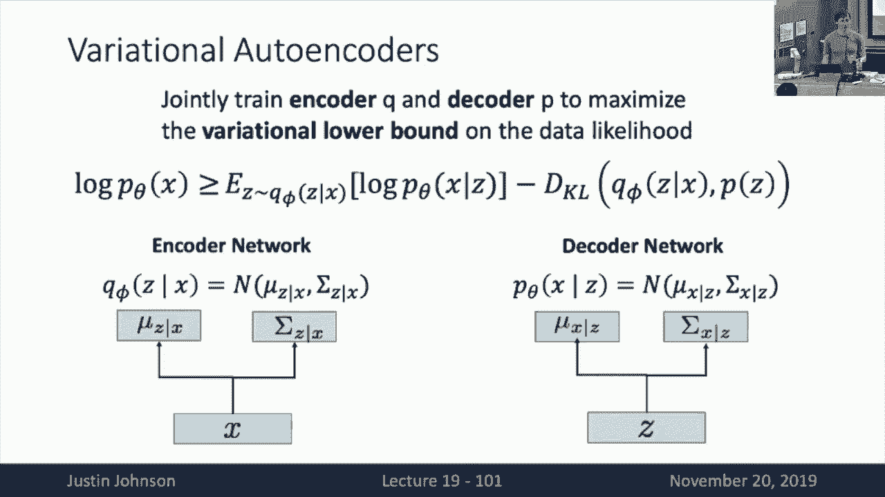

# P19：L19- 生成模型(上) - ShowMeAI - BV13P4y1t7gM

alright let's get started so welcome，alright let's get started so welcome。

back to lecture 19 and today we're going，to talk about generative models part one。

and then coming up after this will be，generative models part two next time as。

you could probably guess so last time we，talked as a as a recap last time we。

talked about different ways to deal with，videos with convolutional neural。

networks so we saw a bunch of different，strategies for extending our neural。

networks from working with two spatial，dimensions to working with two spatial。

dimensions and one temporal dimension so，you'll recall that first off we saw the。

super simple method of a single frame，CNN actually worked really well and we。

should always use that the first time we，try to do any kind of video tasks and。

then we saw other techniques like late，fusion early fusion 3d CNN's to stream。

networks CN n plus RN n convolutional，ardennes all these different mechanisms。

for fusing in spatial and temporal，information so that was all I was all。

really good stuff that hopefully will be，useful if you ever find yourself。

confronted with the need to process，videos with deep neural networks but。

today we're gonna take a kind of，different approach and talk about a very。

broadly of a very different sort of，problem than we have the rest of the。

semester so this will be the problem of，generative models and what exactly a。

generative model is we'll take a little，bit of unpacking but I do feel the need。

to warn you on this lecture that there's，gonna be a bit more math in this lecture。

than we have seen throughout the most of，the semester so I think we'll see more。

equations and fewer pretty pictures but，we'll hopefully try to get through it。

together and then so this lecture a next，lecture we're going to talk about。

different approaches to generative，models last lecture I promised that。

today would be generative adversarial，networks while I was going over the。

material I realized that that was not a，good idea so today I'm gonna talk about。

so I'm going to talk about the minute，different order today we're gonna talk。

about variational auto-encoders and auto，regressive models and then next time。

we'll cover variation we'll cover cover，generative adversarial networks so it's。

kind of unpack what is a generative，model I think we need to step back a。

little bit and talk about two sorts of，distinctions to keep in mind when。

training neural network systems or，really machine learning systems more。

broadly so one big distinction that we，need to think about is the distinction。

between supervised learning，unsupervised learning so supervised。

learning is what we've been doing the，majority of the semester so in。

unsupervised learning the setup is that，we're given some data set and this data。

set consists of tuples so each each，element in our data set gives us some。

input piece of data X which might be an，image as well as some kind of output Y。

that we want to predict from that input，and that might be a label like like cat。

or something like that and the general，goal of supervised learning is to learn。

some function that maps from the inputs，X to the outputs y and the protego and。

one thing to keep in mind about，supervised learning is that most。

supervised learning datasets require，humans to annotate them right so we can。

go on the internet and we can download，lots and lots of images to give us lots。

of examples of X but in order to get the，labels Y that we want our system to。

predict we typically have to have people，go out and annotate all of that pop all。

of the outputs that we want for all of，our training images so supervised。

learning is really really effective as，we've seen over and over and over again。

this semester that if you have access to，a big data set of X's and Y's that have。

been labeled by people then you can，usually train a good neural network to。

predict that to learn some - mapping and，predict the Y's given the X's so we've。

seen examples of supervised learning，over and over again this semester so far。

the canonical example has been something，like image classification where X is an。

image Y is a categorical label this can，be something like object detection where。

X is an image Y is a set of boxes in the，image of categorical labels this can be。

something like semantic segmentation，where X as an image why is this list。

label this semantic category label per，pixel in the image or this can be even。

something like image captioning where，then acts as an image and Y is some。

natural language description of the，input image that has been written by。

people and the kind of underlying thing，to remember about this is that this we。

can train on big datasets using neural，networks but with supervised learning we。

need someone to annotate the datasets，for us so this data annotation can put。

be a potential barrier in our ability to，scale up models to the extent that we，really liked。

like to sew of course um we need to，contrast this with a different approach。

to machine learning which is that of，unsupervised learning，so unsupervised learning I think is a。

little bit of a nebulous term right so，sort of unsupervised learning is like。

everything that's not supervised to some，extent but the general idea with。

unsupervised learning is that we only，get raw data we don't get we only get。

for example a large collection of images，X and we do not get access to any kind。

of ground truth labels or outputs Y we，only get the raw images X and the goal。

and unsupervised learning is to somehow，build a model that can process this。

large set of images and uncover some，kind of hidden structure in that data。

now hidden structure is a little bit of，a fuzzy term which is why I think that。

unsupervised learning as a whole is a，little bit of a fuzzy term and the。

important part but unsupervised learning，is that we don't require human。

annotation so the kind of the dream of，unsupervised learn learning is that we。

like to build systems where we can just，download all the possible data that's。

out there on the web or all bits of data，that we get access to and then train。

models the kind of uncover structure on，these large quantities of data without。

having to go through and label them one，by one with human annotators so if so。

this is kind of like a holy grail of，machine learning in some way is that we。

want to discover methods that can just，slurp in as much unsupervised data as we。

can and use that unsupervised data to，make them better and better and better。

so I think we're a little bit far away，from achieving that sort of holy grail。

task and unsupervised learning but，that's kind of where we strive towards。

when we think about this unsupervised，learning problem so then to kind of make。

this a little bit more concrete we can，talk about maybe a couple concrete。

examples of unsupervised learning tasks，that you may have seen that you may。

maybe have seen before in other contexts，so one example is something like。

clustering so in clustering we just get，a whole bunch of data samples and the。

goal is to break the data samples into，clusters now note that there's no labels。

here we're just trying to uncover this，this latent structure in the data which。

are these sort of clusters that might，naturally alert emerge from the image。

pair from from the raw data another，example of an unsupervised learning。

problem would be dimensionality，reduction which if you've taken an，introductory。

machine learning class you may have seen，techniques like principal component。

analysis which can be used to project，high dimensional data down into lower。

dimensional spaces and they are the kind，of objective in these dimensionality。

reduction tasks is that we've got this，large set of data points that maybe live。

in some very high dimensional space and，we'd like to find some very low。

dimensional subspace within the high，dimensional space that sort of captures。

most of the structure or most of the，variability of the raw input data set so。

then somehow discovering this low，dimensional sub manifold of data would。

be some way that we could try to，discover structure in the raw data。

without requiring labels to make our，predictions another example today that。

will actually cover in more detail today，is this idea of an autoencoder so this。

is a special type of neural network that，tries to reconstruct its input and in。

doing so it tries to learn a latent，representation in the middle that can be。

useful for other downstream applications，and again this can be done using only。

raw data X and no labels Y whatsoever，and then another example would be。

something like density estimation where，suppose we are given a large selection。

of the collection of data samples and，our goal is to learn a probability。

distribution that puts high probability，mass on all the data samples that we see。

in our data set and low probability mass，on all of the other on all other。

potential points that correspond to，images or our samples that did not。

appear in our data set so this gives us，this this big contrast between。

supervised and unsupervised learning，where you know supervised learning is。

what we've done and it actually works，very well but it relies on these large。

quantities oh not just large not just，big data but requires on but requires a。

big label data and that's a big，constraint and where we want to get to。

with unsupervised learning is to develop，techniques that can uncover or learn。

useful latent structure using very large，quantities of unlabeled data so I think。

this is a big distinction that we need，to keep in mind because this distinction。

of supervised purses so it turns out，that our topic today of generative。

models is going to be one way that we，can try to approach these these。

unsupervised learning tasks so by，learning large large scale generative。

models will be a way that we can try to，learn structure in our data using a lot，of label data。

but without requiring human annotation，on that data so then that's that's the。

first major distinction that I wanted to，point out and was this was clear to。

everyone was any kind of questions on，this supervised versus unsupervised the。

distinction all right then let's then，let's talk about our second big。

distinction in machine learning models，that we need to be clear on so this is。

so here the distinction is we want to，sort of think about different sorts of。

probabilistic frameworks that we can use，to represent different types of machine。

learning models so in particular it's，often we often like to think about a。

distinction in discriminative models，versus generative models and the。

distinction here is in the type of，underlying probability structure that。

these different type of models are，trying to learn so one kind of lens。

through which we can view a lot of，different machine learning models is。

that we're trying to fit some under some，some probabilities some kind of。

probability distribution to the data，that we're training on and now the exact。

structure of what we're trying to model，in that probability distribution has。

these different names so in a，discriminative model what we're trying，to do is learn a probability。

distribution that predicts the，probability of the label y conditioned。

on the input image x and this is，something that we've seen over and over。

again so discriminative models sort of，go hand-in-hand with supervised learning。

that whenever you build a discriminative，model like an image classifier it's。

going to input the image and then output，a probability distribution over all。

possible labels for that image so then a，generative model on the other hand is。

going to try to learn a probability，distribution over images X and there's。

another thing called a conditional，generative model which is going to try。

to learn a probability distribution over，images X conditioned on labels Y and it。

seems like these three different，categories of probabilistic machine，learning models don't seem that。

different when you just look at the，symbols on the page because it seems。

like we've got an X on a Y we kind of，swapped the order what's the big deal。

but it turns out that there's actually a，huge mathematical distinction between。

these three different categories of，machine learning models so the reason。

for that is this we need to do a really，quick recap on what is the what what is。

a density function in probability right，so anytime we're kind of working with。

probabilistic models the mathematical，objects that we often use to model。

probability distributions are these，these functions called density functions。

so a density function P of X what it's，going to do is input some kind of piece。

of data ax and then output some positive，number that sort of tells us how likely。

was that piece of data under this，probability distribution and the where。

we're higher numbers mean that it's more，likely and lower numbers mean that that。

piece of data was less likely yeah，question the question is do we need to。

use supervised learning to learn，conditioner conditional generative。

models so there you tell you typically，would need to use supervised learning。

because it needs access to both the data，and the labels so a conditional。

generative model will will typically，require require human labels but now the。

critical aspect about probability，distribution functions is that they're。

normal APIs right so if you take your，you're completely distributed function。

your probability density function it，needs to integrate to one so if you。

integrate over all possible inputs to，the distribution and we'll just run that。

integral it might be finite fin there's，some sum over oh if you're doing a。

distribution over a finite set or and or，a continuous integral if you're。

integrating over some some infinite sets，like a vector space but the key。

distinction is that these density，functions need to be normalized so they。

need to they need to they need to，integrate to one and that's a really。

critical piece that leads to huge，distinctions between these different。

categories of probabilistic machine，learning models what this means is that。

because of probability distribute but，because of probability density function。

needs to integrate to one it means that，different elements within the support of。

the probabilities reduce distribution，need to compete with each other for。

probability mass so because the，distribution because the density。

functions integrate to one in order to，assign higher probability to one element。

we must by design assign lower，probability to a different element so。

this this this into this normalization，constraint introduces some kind of。

competition among the different elements，over which we are modeling probabilities，and this。

this this this question of what is，competing under the probability。

distribute distribution leads to pretty，huge implications in the different in。

the differences between these different，kinds of probabilistic models so that。

first let's let's think about this this，idea of discriminative models or super。

supervised classification through this，lens of probability distribution。

functions and labels competing with each，other well here what we're doing is that。

we input a piece of data acts like an，image and then it outputs of。

probabilities just distribution over all，of the labels that could potentially be。

assigned to that in the input image and，width and so in this toy example or。

where may be modeling to different out，labels a cat and a dog and we're just。

outputting a binary decision a binary，distribution over these two different。

types of labels and because the density，function is normalized then in when we。

assign a higher probability mass to cat，then by design we must assign lower。

probability mass to dog because it has，to integrate to one but what's critical。

right and but what's what's what's，critical here is that under this and if。

we assign and if we run our run a，different image like this image of a dog。

through the same classifier then we，would produce a different probably。

distribution probability of cat，conditioned on the dog image probability。

of dog conditioned on the dog image and，in under that second probably。

distribution again the labels would have，to compete with each other but the。

critical that the critical thing to，realize about about discriminative。

models is that images don't ever have to，compete with each other under an under a。

discriminative model there's no，competition among different types of。

images there's only competition among，different types of labels that could。

potentially be assigned to each，different image and that has a couple。

important distinctions so one is like，what happens if we try to run an image。

into a discriminative model that just，doesn't fit the label set so for example。

in this image on the top we were，training a binary classifier that knows。

how to recognize cats and dogs and if we，feed an image of a monkey then there's。

nothing the classifier can do to sort of，tell us that this was an unreasonable。

image that did not fit its label space，because the way that a discriminative。

model works is that for every possible，image，it's forced to output a normalised。

probably distribution over the labels，and now another and this this gets even。

more extreme when you imagine feeding，like totally crazy or totally wild。

images into a discriminative model so if，we feed these like really abstract。

images that clearly have no business，being called either a monkey or a cat。

then again our model is still forced to，output a normalized distribution over。

these two different types of labels so，um personally I think that this is one。

reason why things like adversarial，attacks are possible on discriminative。

models because when you generate an，adversarial attack on a supervised。

machine learning model what you're doing，is kind of synthesizing an unreasonable。

image which is sort of not in the，support of the types of images that that。

model was trained on so then when you，pass this sort of unreasonable image to。

a discriminative model then it's still，forced to output some normalized。

distribution over the possible label，space so I think that this this this。

fact that so there's this fundamental，shortcoming with discriminative models。

is that they just have no capacity to，tell us when we feed them with an。

unreasonable input image so then let's，think about what happens with a。

generative model in contrast well a，generative model is learning a probably。

distribution over all possible images，that could exist in the world and now so。

what this means is that for each，possible input image that we could。

imagine feeding to the system this model，needs to assign a number to say how。

likely is this image to exist and what's，really fundamental is that this is a。

really hard problem because it needs to，tell us forever because because these。

these probability these are these，likelihoods that are being output from。

the density function are sort of need to，tell us whether any pair of images is。

going to be more likely than another so，this is like a really really hard。

problem that requires some kind of，really really deep visual understanding。

right so if you train a generative model，on images it kind of needs to be able to。

know what is more likely in the world，maybe a three-legged dog or a three。

armed monkey because a generative model，needs to kind of input any image that we。

could possibly throw at it and then，output this this likelihood value that。

tells us how probably probable was that，image，so then even sort of then with a。

generative model different potential，images are competing with each other for。

probability mass and in order to assign，reasonable probabilities to all possible。

input images that it's very likely that，this generative model would actually。

need to have a very deep understanding，of the visual world so even in this。

example I kind of I can this is not a，real generative model I just kind of。

like put bars and PowerPoint right but，even in deciding this it's like kind of。

tricky right so I decided that maybe the，the dog bar should be the highest in。

this example because I think probably，dogs are more likely to be outside than。

cats or maybe this is an adult dog and，it's more likely to see adults dogs。

outside than it is to see like kidneys，outside because I know that this is a。

kitten and I know that cats are only，kittens for a very small period of their。

life span and then maybe photos of，monkeys are maybe less likely than。

either dogs or kittens just because，people tend to take less photos of。

monkeys and then this may be abstract，our image is maybe even less likely。

because I don't know what this is I，think it's maybe very unlikely to see。

images that look exactly like this yeah，questions yes so you got you got to be。

careful that on a density function over，an infinite space there's not actually a。

sign of probability instead it assigns a，likelihood or is it apply of science。

among some amount of density so once，you're operating over an infinite。

dimensional space it doesn't make sense，to talk about the probability of a。

single data point instead what you can，do is integrate the density function。

over some finite region and then，integrating a density function will。

actually give us a probability of，observing some piece of data that lies。

within the region over which we，integrate so you need to be very careful。

with the word probability when you talk，about density functions over infinite。

infinite dimensional spaces yesterday，that's a fantastic question it's very。

insightful so the question is how can we，tell how good is a generative model and。

that's an extremely challenging question，that I think a lot of people struggle。

with but one sort of mechanism that we，use to evaluate generative models is。

often this idea of perplexity so then if，I train a generative model on some。

training set and then I present the，generative model with a unseen test。

images then if it did a good job of，learning the underlying visual structure。

of the world then it should assign，relatively high probability density to，unseen。

images even if those particular images，had not been seen during training time。

so that's kind of the best I think，that's the gold standard evaluation。

metric that we have for generative，models so then another interesting fact。

about generative models is that they，have the capacity to reject samples that。

they think are just unreasonable so for，example if we maybe put in this abstract。

art then the generative model can just，tell us that this was an unreasonable。

input that had very little to do with，any of the inputs that it saw during。

training so a generative model has his，capacity to tell us when inputs that we。

present it with are maybe very unlikely，under the training data that it was that。

it was trained on so then we have this，third category of model called a。

conditional generative model so now a，conditional generative model is learning。

for every possible label why it's，learning a probably distribution over。

all possible images acts which means，that now every possible label that we。

could learn is going to induce a，separate competition among all possible。

images so then for example in the top，row we're showing that the probability。

of each image conditioned on the fact，that that image is a cat and we see that。

maybe the cat is a very high density，under the under the top distribution and。

now in the but in the middle we're，showing probability of each image given。

that it's a dog and now again now the，dog should have a higher density and all。

the other images should be lower but now，what's interesting is that a conditional。

generative model sort of has this，capacity to tell us when inputs were so。

you could imagine doing classification，with a conditional probability with a。

conditional generative model you could，take your input image X and then。

evaluate the likelihood of that image，and evaluate probability of our input。

image x over each you over each possible，label Y and then you could make a。

classification decision based on which，one of those were higher so you could。

indeed imagine training a supervised，classifier using a conditional。

generative model but the distinction is，that if you were to train a classifier。

using a conditional generative model，then it would actually have the capacity。

to reject unlikely data samples because，with a conditional generative model it's。

possible that an input that some input，image could have a low density under all。

possible labels and we see that for，example with the abstract art example in，this slide so then this。

tract art image is given a very low，likelihood under each different under。

both of the probability of distributions，which leads us to which so that if you。

imagine building a classifier that was，based on conditional generative models。

then you can imagine like maybe there's，a threshold under which we say this is。

an unreasonable image and I refuse to，classify it so that's kind of a big。

distinction between these different，categories of models although I think。

it's also important and interesting to，realize that these different types of。

models are actually not fully distinct，so if you recall Bayes rule then Bayes。

rule lets us sort of flip around the，conditioning in a properly distribution。

so Bayes rule tells us that the，probability of X given Y is equal to the。

probability of Y given X divided by the，probability of Y times the probability。

of X and what this means is that using，Bayes rule we can actually build a。

conditional generative model out of，existing pieces that we've already seen。

so this this expression on the Left，probability of X given Y is a。

conditional generative model now the top，expression in this the numerator in this。

fraction is the discriminative model，probability of Y given ax the term on。

the right in purple is an unconditional，generative model and the term at the。

bottom probability of Y is some prior，distribution over labels so prior。

distributions over labels you can sort，of just count up the number of labels。

that occur in the training set so this，is kind of a nice beautiful relation。

among these different types of，probabilistic models and it shows that。

shows us that maybe the really the two，most fundamental types are the。

discriminative model and the generative，model and if you can build those two。

then you can build a conditional general，a conditional generative model as well。

so then kind of a big thing that we want，to do is learn how to build these。

unconditional generative models because，we already know how to build。

discriminative models and then if we，could build both then we could put them。

together to build a conditional，generative model so then it's sort of。

interesting to think about what we can，do with these different types of。

probabilistic models once we've learned，them so discriminative models we've seen，many times already。

basically what they can do is we can，learn we can assign labels to new data。

at test time we've also seen that they，can be used for a type of supervised。

feature learning so for example we can，using，images and labels on the image net data。

set and that we can strip off the final，classification layer and then use the。

body of our neural network as a kind of，feature extractor so then this tells us。

that as a discriminative model can learn，to extract useful meaningful semantic。

features from images assuming that it's，allowed to be trained with a lot of。

label data now a generative model we can，do a lot of we can do a lot of more。

interesting things one that we've，already kind of mentioned these one it。

can detect outliers that is it can tell，us when input images are very unlikely。

given the data on which it was training，um it also can potentially let us do。

feature learning without labels right，because if we could learn a really good。

generative model that could assign，really meaningful probability or really。

sorry you I almost got myself really，meaningful likelihoods to all the。

different images that we could pass it，then it's very likely that a model which。

was good at this generative modeling，task mutt might also have been good at。

learning useful feature representations，for its images and now another really。

cool thing we can do with generative，models is actually sample from the。

generative models to actually synthesize，new data that kind of matches the input。

data on which it was trained now because，generative models are actually learning。

a distribution over images then we can，sample from a learned generative model。

to synthesize new images which is a，really cool application and now a。

conditional generative model we've sort，of already seen that it can be used to。

assign labels while also simultaneously，rejecting outliers and then similarly。

conditional generative models can be，used to synthesize novel images that are。

conditioned on labeling date on label on，a label value so for example with a。

conditional generative model you could，you could you could ask it to generate。

new cats or new dogs or if maybe Y was a，sentence rather than a label then you。

could learn to generate images that were，conditioned on natural language inputs。

like give me a cat give me an image of a，cat with four legs and a purple and a。

purple tail or something like that，I don't think that would actually work。

unfortunately so then this this kind of，gives us a lens through which we can。

view different types of machine learning，models do a bit of probabilistic。

formalism ok so then actually it turns，out that this this this idea of。

generative models is so important that，it's a massive topic and there's really，even in。

to lectures so to give you a sense of，the different types of generative models。

that live out there I wanted to go，through this very brief sort of family。

tree of different categories of，generative models to give you a bit of。

the lay of the land so it's a very it's，a very root node we've got this。

generative models and then a big split，that we get is between what are called。

models that have explicit density，functions versus models which have。

implicit density functions so I told you，that a generative model was all about。

assigning density functions to images，well it turns out that there there are。

some categories of generative models，where after training you can input a new。

image and then it spits out this this，likelihood value but there and that's。

those are these explicit density these，gendered models with explicit density。

functions and now on the right hand side，models with implicit density functions。

we do not week there's no way we can，extract a likelihood value but we can。

sample from the underlying distribution，after the models been trained now with。

even within explicit density functions，there's sort of two categories that you。

need to think about one are tractable，density models here are models where you。

know it sort of does what you expect you，can actually input a new image at test。

time and receive the actual value of the，density function on that image now with。

an approximate now there's also models，that use approximate density functions。

that have no way to efficiently spit out，an actual value of the density function。

but instead can compute some kind of，approximation to the density function。

and now within those maybe there's two，categories of methods one there's sort。

of different ways that you can make，these approximations so one category our。

variational methods and we'll actually，see an example of that later and the。

other may be Markov chain models that I，don't expect you to know too much about。

and then over on the implicit density，side again these are models where you。

can sample from the underlying density，function but you cannot get out the。

value of the function so maybe examples，here would be some kind of Monte Carlo。

chain methods where you have to you can，sample from it or these direct methods。

where you can just directly sample from，the function so within this big taxonomy。

we're going to cover sort of three，different pieces three different types。

of generative models within this，taxonomy that will help you to get get a。

flavor of these different types of，generative models and what powered。

he's one of these different things mean，so today we'll talk about auto。

regressive models which are examples of，explicit a generative model with an。

explicit and tractable density function，and we'll also talk about variational。

auto-encoders which an example of an，exposure of model with an approximate。

but explicit density function and then，next lecture we'll talk about generative。

adversarial networks which are our，example of a generative model with an。

implicit density functions then we can't，get out of a Lu of the density function。

but we can sample from it yeah yeah so，whenever you generate a sample that。

means that I want to generate a random，value and the probability they're things。

that I generate are what I'm going to，I'm going to be more likely to generate。

things which have high values of the，density function and less likely to。

generate things which have low values of，the density function and that's what I。

mean by sample it was it was there a，question in the back or is it just。

retching yeah so I think the question is，you don't quite see the distinction of。

being implicit in approximate density I，think that's fine at this point but if。

you still are confused maybe at the end，of this lecture that I think a really at。

the end of next lecture I think that's，going to be a problem so this is meant。

to be kind of a lay of the land so and，that hopefully you can return to this。

map once we've seen exam or concrete，examples and then you'll be able to。

better understand the distinctions，between them okay so then with this and。

a book any more questions and this kind，of overview of generative models all。

right then let's actually talk about our，first generative model so this is an。

example of an autoregressive so we're，going to talk about auto regressive。

models so an auto regressive model as we，talked about is an example of a。

generative model it has an explicit，density function which is tractable so。

this is kind of like the easiest type of，generative model to wrap your brain。

around basically the idea is that we，want to write down some parametric。

function that's going to input a piece，of data X and a learnable settlor noble。

weight matrix W and it's going to spit，out the value of the density function。

for that image and then what we're going，to do is we're going to train this model。

by taking some data set of data samples，X and we're going to try to maximize the。

the value of the density function we're，trying to maximize the likelihood of the。

observed data so we want to observe a，science sort of high probability。

to all of the samples in our dataset and，we and then because of the normalization。

constraint that will by design force the，model to assign low-mass to things that。

were not in the training dataset，and if we make this so then this is sort。

of sort of very standard probabilistic，formalism and whenever we're training。

any kind of probabilistic model then we，can assume that the samples of our。

dataset are independent so then the，probability of observing the data set is。

just the product of the probabilities of，all of the independent samples and then。

we want to learn the value of the weight，matrix that will maximize the likelihood。

of the maximum that will cause the，likelihood of the datasets to be，maximized。

of course products are a little bit ugly，to work with so it's common to do a log。

transform on this to transform the，product into a sum and we want to find。

the value of the weight matrix that，maximize the sum of a log probability。

over our data set and now now our log，probability is going to be represented。

with some kind of parametric function，that inputs the data and input in inputs。

to the training sample and inputs the，weight matrix and it's going to spit out。

the value of the density function on，that piece of data and spoiler alert。

this F is going to be a neural network，for us so then the question is that we。

need some way to write so this is kind，of um this is kind of a general。

formalism for any kind of explicit，density estimation so this is this will。

apply to any kind of explicit density，estimation where we can actually。

evaluate and compute and back propagate，through the value of this density。

function which is parametrized by a，neural network so now we need to。

actually write down some concrete，mathematical form for this density。

function so an autoregressive model is a，particular way of writing down and。

parameter izing these these likelihood，these these density functions so here。

the assumption is that each train each a，piece of data acts so access like an。

image each piece of data is going to be，composed of different sub pieces of data。

or sub parts so for an image on each of，these X 1 X 2 X 3 might be the different。

pixels that make up an image and what，we're going to do is sort of assume that。

there are raw data samples ax just，consists of these many different sub。

parts and then what we want to know is，that the the probability of an image is。

equal to the probability of observing，all the sub parts in the right order and，then based。

the chain rule we can write we can，factor this joint distribution over all。

the sub parts in a particular way so，then the joint distribution over all the。

sub parts we can factor out as the，probability of the first one times the。

probability of the second one，conditioned on the first times the。

probability of third conditioned on the，second and the first so on and so on and。

so forth and this sort of holds in，general right this is the this is the。

this is the chain rule that we can use，to factor joint probability。

distributions so this is always true and，then if you kind of iterate this then it。

means that the we're going to write down，the probability of the density function。

of our data sample X is going to be，equal to a product where each term in。

the product is going to be the the，probability or likelihood of observing。

the current piece of data conditioned on，observing all the previous pieces of。

data and now this formula actually，should remind you of something that。

we've seen already can you what can，anyone guess it Bayes rule not not quite。

not this lecture something we've seen in，previous lecture recurrent neural。

network yep that's it right so this this，this structure that we've gotten auto。

regressive model is that we want to，break down this probability of a，sequence by modeling it as the。

probability of the current token，conditioned on all the previous tokens。

and it turns out that's the exact，structure that we have in a recurrent。

neural network so then what we can do is，build a recurrent neural network that's。

going to input that every time step the，one of the tokens and then output the。

probability of observing the next token，and through the recurrent design of the。

network then each prediction is going to，be implicitly conditioned on all of the。

sequence of sub parts that occurred，before so it turns out we've already you。

guys have already trained autoregressive，generative models for generating。

sequences of words and sequences of，letters so this is actually not a new。

not a new concept it's just an old idea，that we're sort of couching in different。

mathematical formalism and now the idea，is that we connect so so far we've used。

this idea of autoregressive sequence，models to model probabilities of。

captions and probabilities of sequences，of words and now it turns out we can。

actually use the exact same thing the，exact same mechanism to model。

probabilities of images but now all we，need to do is write down sort of break。

up our image into pixels and then，iterate over the pixels in some。

meaningful order and now we can use this，exact same mechanism of recurrent。

networks plus an autoregressive model to，generate to build a density to train a。

density function that is an explicit，density function of a generative model。

of images so then we can train a pixel，RNN which is going to be a generative。

model with an explicit that's an，explicit and tractable density function。

that we can train on input images so，here the idea is that we're going to。

generate image pixels one at a time，starting from the upper left-hand corner。

and now we're going to compute sort of，an RNN hidden state for every pixel in。

our grid of pixels and it with within，each within each of those hidden states。

it's going to be conditioned on the，hidden state of the pixel directly above。

it as well as the hidden state of the，pixel directly to the left of it and。

then within each pixel we're going to，output the colors one at a time so first。

it's going to output the red the value，of the red channel of the pixel then the。

value of the blue Channel the pixel then，the value of the green Channel of the。

pixel and for each of these color，channels we're going to divide it up。

into this discrete space over values，from 0 to 255 and and within each pixel。

it's going to predict a soft max，distribution over each of these discrete。

values 0 to 255 for each of the three，color channels and now to kind of see。

how this generation proceeds then we're，going to start by kind of generating the。

pixel of the colors of this very upper，left-hand pixel and then we're going to。

march sort of run one RNN LST M over，each row of the image and one on another。

RN n over each going down over each，column of the image so then after we。

generated the value of the RGB the RGB，value of the pixel in the upper。

left-hand corner then we can condition，the the pixel immediately below and the。

pixel immediately immediately to the，right and compute their hidden States。

and predict their pixel values then once，we've got all three of these computed。

and we can kind of expand out in a going，diagonally across the image so then for。

each pixel that we want to generate the，color of we're going to compute a new。

sort of RN and hidden state for the，pixel that is conditioned on the hidden。

state of the pixel directly above and，the hidden state of the pixel directly。

to the left and then after we predict，the hidden state for the pixel then。

we're going to generate the colors of，that pixel so this is going to sort of。

march from the upper left to the lower，right sort of down over the entire image。

and now due to the structure，the RNN that means that the the，prediction that we make for each pixel。

is going to have an implicit dependency，on all of the pixels above it and all of。

the pixels to the left of it so it will，have an explicit dependency on the。

hidden state immediately above and the，hidden state immediately to the left but。

because those in turn depend on other，hidden states then each pixel will have。

an implicit dependency over all of the，previously generated pixels that occur。

up in to the left and now we can and，then then this sort of occurs for all of。

the images and then to train this thing，it's going to look exactly like training。

these RN ends that we've done for tasks，like image captioning except rather than，time。

instead we're going to be generating，values of pixels of an image one at a。

time and other than that it's going to，look very similar to what you've already。

seen in the context of captioning but，now a big problem with these pixel RN。

ends is that they're very very slow，during both training and testing right。

because this is sort of a continual，problem that we've seen with ardennes。

is that they have a sequential，dependency because each hidden state。

depends on the value of the hidden state，before it in time so that means that。

during training if we want to model an，n-by-n image then we need to mock tape。

like 2 n minus 1 steps in order to sort，of march all the way down and all the。

way on the bottom so this is going to，get expensive if we want to generate。

really high resolution images so these，pixel RN models are super slow for both。

training and evaluate and and evaluation，a test time when we want to sample new。

images so then there's there's an，alternative formulation called a pixel。

CNN which does a very similar mechanism，and is still going to generate pixels。

one at a time starting from the upper，left-hand corner but rather than using a。

recurrent neural network to model this，dependency instead we're going to use a。

sort of masked convolution to handle，this dependency so then here then to。

generate the the new hidden state and，the pixel values of this highlighted。

pixel in red we're going to run sort of，a convolution where the convolution only。

is looks over the pixels to the left of，it in the same row and the pixels above。

it in within some finite receptive field，and then using this formalism you can。

actually compute all these receptive，fields kind of in parallel so it makes a。

pixel CNN is much much much much faster，to train although they're still quite，slow at。

at sampling time so then at training the，pixel CNN can kind of paralyze these。

receptive fields over all regions of the，of the training image but at test time。

we kind of to generate pixels one at a，time so it's al it's still quite slow at。

test time and now if we actually look at，some generated samples from a pixel our。

gannett model then on the Left what，we've done is we've trained well not me。

but like the people who wrote the paper，then they were they trained a pixel RNN。

model on the Seafarer data set that，we've been that we've used on our。

homework so far and then and then here，we see generated samples that are kind。

of like new c4 images that the model has，invented for itself and on the right we。

do the exact same thing except we train，the model on a Down sample image net。

images and you can see that it's it's，kind of hard to tell what's going on in。

these images so like it clearly there's，some interesting structure like they're。

modeling edges they're modeling colors，like if you kind of step back they look。

like images but if you kind of like zoom，in then you realize they're like full of。

garbage so it looks like they're kind of，learning something some kind of。

reasonable high level stuff about images，but they're kind of not really。

generating really really high quality，images at this point so this kind of。

gives us kind of our our summary of，maybe auto regressive models so one of。

the pros of auto regressive models is，that because they're they have this。

explicit density function then we can，actually event a test time we can feed。

them in a new image and then actually，compute out the value of the density。

function for every new image that we，want that we might pass at a test time。

and then actually it's these are these，are among the easiest generative models。

to evaluate because of this this，property that we can directly evaluate。

the density function so then we can，evaluate these these these these Auto。

regressive models like we said by just，like training them on some data set and。

then evaluating the density function on，unseen test images and then it should do。

it and then it should assign high high，probability mass to unseen test images。

and that's actually a fairly reasonable，evaluation metric for these auto。

regressive models um and actually the，samples are fairly reasonable I I mean I。

made fun of them a little bit but these，are actually like pretty reasonable。

samples I think from a generative model，because they actually do kind of model。

they have a lot of diversity then，they model edges they kind of model both。

load like local structure as well as，global structure so it seems like even。

though they're not generating like，photorealistic images at this point they。

are adding some some really non-trivial，modeling of the underlying images。

themselves yeah question yes that's a，great question the question was for。

these kind of methods where we're kind，of generating pixels one of the time you。

have to generate the first pixel and，that's actually the same problem that we。

already had in something like like，generating language so there it's common。

to maybe add a special kind of start，pixel token that you feed to the RNN。

that kind of you pad the the outside，boundaries with some special tar start。

pixel value and sort of feed that at the，very first time step yeah that's true so。

this is so this is an unconditional，general generate this is an，unconditional generative model so we。

have no control at test time over what，is being generated although there are。

conditional variants of a pixel art and，a pixel CNN so for example there's ways。

that you can sort of thread in label，information or other type of。

conditioning information into these，generative models that we haven't talked。

about here so you can do you can train，conditional generative model versions of。

these auto regressive models and then，you do get some control over what you。

just wait generate a test time ok so，then there's also a lot of things that。

you can do to improve these these auto，regressive models so these samples that。

I showed you were from a very first，pixel art on paper and there's been a。

lot of improvements since then so，there's sort of different architectures。

you can use multi scale resolution to a，multi scale generation to make things。

more efficient and there's a lot of，training tricks that you can use to。

improve the quality of these things so，you can check out some of these。

references if you're interested in those，although one thing that is a big。

negative about these auto regressive，models is that they tend to be very slow。

at test time because we need to sample，the pixels one by one then it's actually。

very slow for us to generate these，images at test time yeah it's a good。

question the question is can these，models generalize to different image。

resolutions than the resolutions on，which they were trained so basically so。

this is for this I'm very vanilla a，pixel RNN model I think it probably。

cannot generalize to new resolutions，because the RNN kind of expects the rows。

to be certain lengths but I think there，are other variants especially these。

multi scale pixel are these multi scale，auto regressive，that actually can do better。

generalization the test time so I think，the vanilla version that we presented。

here cannot but multi-resolution，versions I think could okay so then if。

then let's move on to our second，generative model of variational。

autoencoders so I think there's a chance，we may not actually get through all this。

material in which case some of it will，get a booted into next week next lecture。

which is fine because we have two，lectures for generate models anyway so。

with very with with pixel RN and pixel，CNN what we did is that what we saw is。

that we wrote down some parametric model，that was able to compute the value of。

the density function on arbitrary input，images and then what we wanted to do。

with these these explicit density models，is then just train the model to maximize。

the the density value at all the，training samples and that actually。

worked pretty well for this case of，pixel art ends and pixel cnn's。

so now with variational auto-encoders，it's going to do something a little bit。

different with a variational auto，encoder we actually will not be able to。

access or compute the the true value of，the density function in any reasonable。

or computationally efficient way but，with a variational auto encoder it turns。

out that even though we cannot compute，the exact value of the density function。

we can compute some lower bound on the，density function so then what we're。

going to do is rather than maximizing，the true density instead what we're。

going to do is maximize this lower bound，to the density and then kind of hope。

that like if the true density is here，and the lower bound is here that you。

know if we maximize lower bound then it，should sort of push up the true density。

as well so that's kind of the vague，intuition with these variational。

auto-encoders now to understand these，variation auto-encoders there's sort of。

two loaded words in this term one is，this term just this the word variational。

and the other is this word auto encoder，so I think we need to talk about these。

two different words sort of one at a，time to understand this this model so。

first let's talk about non variational，auto-encoders sort of normal。

auto-encoders as to kind of set us up，for the variational flavor so then with。

a with a regular non variational auto，encoder，this is not a probabilistic model。

instead of ver a regular auto-encoder is，an unsupervised learning method that。

aims to learn feature representations，for images in an unsupervised way so we。

want to learn useful latent，representations for images even if we。

don't have access to any any any meaning，any any labelled labels Y so here kind。

of what we want to do is build a model，that's build some neural network is。

going to input the in the the the raw，images X and an output some some useful。

features Z that tell us something，interesting about that image and kind of。

the hope is that these these these，features that we can learn from this。

unsupervised learning method might be，useful for some downstream supervised。

learning tasks so kind of the idea with，autoencoders is that we want to train up。

this model using a lot of unlabeled data，and then learn this good feature。

representation and then use that good，feature representation for kind of。

transfer learning approaches to other，downstream tasks so that maybe rather。

than pre training on imagenet as a，supervised training task instead we want。

to do our pre training on a large，collection of unlabeled images so now。

the problem is that we want to learn，this feature transform from raw data and。

of course we can never observe these，feature vectors z because if we got the。

feature vector Z in the training data，then our problem would have been solved。

for us already so somehow we need to，learn a neural network is going to。

output this feature vector Z sort of，without any without any help from from。

labels so how are we gonna do that and，architectural why is this this neural。

network that goes from X to Z is sort of，like any sort of convolutional any kind。

of neural network architecture that you，want so original it might have been sort。

of a fully connected network with，sigmoid learned nonlinearities sort of a。

long time ago but more recent，instantiations would have some kind of。

like deep residual network with reloj，and batch norm and all that other good。

stuff so the architecture here is sort，of CNN architectures that we've seen。

many times already but now so now the，idea with an auto encoder is that what。

we're trying going to try to do is force，the model to learn to reconstruct the。

original training data so what it's，going to do is have one portion of the。

model called the encoder and the encoder，is going to input them，put the raw data and then output the。

feature vector and now we're going to，also train a second component of the。

model called the decoder and the decoder，is going to input this feed this feature。

vector and then try to spit out the try，to reconstruct the the raw data that we。

fed to the encoder and the decoder is，sort of again a neural network that。

architectural II we've seen many times，before and if it's convolutional maybe。

the encoder would kind of have down，sampling where's and the decoder we kind。

of have transposed convolutional near，stop sample and now we would train this。

thing using where our loss function it，would now be that the output from the。

decoder should match the input to the，encoder and this just it should sort of。

learn to it should sort of learn the，identity function that it should learn。

to just reconstruct whatever we put into，the model so then maybe if we look an。

example of an auto encoder on the right，trained on C part n then at the bottom。

it's going to input some raw images from，the C part n data set it's going to go。

through an encoder that maybe has four，convolutional layers and then a decoder。

that goes maybe for our transpose，convolution layers and then it's going。

to try to reconstruct the input data now，this seems like kind of a stupid。

function to learn right like we actually，don't need to learn the identity。

function we know how to compute the，identity function we just like return。

the thing that we that we output that we，just return us output the thing that we。

presented as input so the point with，these auto-encoders is not that learning。

the identity function is a useful thing，instead what we want to do is force this。

feature vector Z to be very low，dimensional compared to the raw input。

data ax so what this Auto encoders are，really trying to do is somehow compress。

the input data so then if we have maybe，a very high resolution input image X but。

we can compress it down to some very low，dimensional latent code Z then。

reconstruct the original input image，with very high fidelity from this low。

dimensional latent code then in that，case we've probably learned something。

non-trivial about the data so in this，case it's very important when you train。

an auto encoder to have some kind of，bottleneck in the middle between the。

encoder and the decoder so often this，bottleneck will be some kind of size。

constraint so just like the size of the，layer the number，Asians should be it should be much much。

smaller than the number of raw pixels in，the input but you can imagine sort of。

but in a variational auto encoder we，will add a different sort of constraint。

inside the middle of this in between the，encoder and the decoder and with a。

variational auto encoder we'll add a，kind of probabilistic constraint in。

between the encoder and the decoder but，then the key is that this just needs to。

be very low dimensional or have some，kind of bottleneck to force the network。

to learn how to compress the data in a，useful way and then after we train we're。

going to throw away the decoder because，we don't care about predicting the。

identity function and instead we're，going to use the encoder to initialize。

part of some other model than maybe，train it on some other data set so the。

whole point of auto-encoders is to learn，some useful representation that we can。

use for downstream transfer learning，applications but here of course we can。

do this with a lot of unlabeled data，which is a really exciting part about。

learning auto-encoders yeah the question，is what's the structure of the encoder。

compared with the structure of the，decoder so that's that's a lot of hyper。

parameters but um typically the decoder，will be some kind of flipped version of。

an encoder so a very common，architectural patterns you'll see for。

these things with convolutional models，is this kind of like down sampling and。

up sampling type of type of architecture，that we saw for example and semantic。

segmentation so you recall that，architectures for semantic segmentation。

would often take the input and then kind，of down sample with convolution and then。

up sample again using transpose，convolution so then the encoder will。

often have sort of striated convolution，or pooling to gonna do down sampling and。

then the decoder will kind of have some，kind of up sampling models like the。

second half of a semantic signal model，so typically the the encoder and the。

decoder kind of mirror each other，architectural II although there's。

nothing in the formalism that forces，that to be true yeah so the question is。

if you have one encoder but different，decoder then so actually that's another。

interesting idea there's actually sort，of variants of auto-encoders where you。

train like encoders for different types，of data but they all have to go through。

a shared decoder so you kind of learn a，shared latent space which can be，understood or。

or or represented or generated by lots，of different encoders on different types。

of data but then you kind of need to，train them jointly in a way to encourage。

them to learn the same space yeah yeah，so the encoder in the decoder are both。

neural networks and the architectures，are just going to be whatever kind of。

neural network architecture that you，want so if we're modeling images these。

will typically be convolutional networks，that are pretty deep in many cases but a。

critical component with these things is，that there's some bottleneck between the。

encoder and a decoder ok so then a big，so then these Auto encoders are kind of。

a nice formalism that lets us sort of，have the capacity to learn。

representations with a lot of data and，then transfer them to downstream tasks。

although I should point out that even，though they have this nice made they。

seem like an awesome mechanism to learn，from unlabeled data in fact in practice。

I think they haven't worked out as much，as people would have liked because I I。

can't really there's really no，state-of-the-art systems that rely on，training autoencoders on large。

unsupervised data so it's a really，beautiful idea but I think that the。

current formulations of it that we have，now just sort of don't seem to actually。

live up to the dream of unsupervised，learning so I think they're a really。

useful thing to know about but I think，they're actually not right now a very。

practical approach to unsupervised，feature learning um so that's a big。

caveat that I want to I want to point，out about auto-encoders but now a big。

downside of auto-encoders is that they，are not probabilistic right so there are。

an unsupervised learning model in that，they can train they can learn this。

feature representation without any，labeled samples without any labels for。

our data but there's no way that we can，sort of sample new images from a trained。

auto encoder um the only thing that they，could do is Jenner is a predict features。

for new images a test time there's no，way that we can use them to generate new。

images so then that moves that then that，moves us on to this idea of a，variational auto encoder so a。

variational auto encoder is going to be，a probabilistic sort of a probabilistic。

upgrade to these auto to these non，variational auto-encoders so with。

variational encode autoencoders we want，to do two different not be able to do。

two different types of things one is to，learn latent features zi from raw data。

just as we did in the non，variational flavor so we want to retain。

that capacity and but the second thing，we want to be able to do is to samp be。

able to sample from the trained model，after training just people to generate。

new data so now what we're going to do，is assume that we have maybe some。

training data set with a bunch of，unlabeled samples and we're going to。

assume that each each of the each of，those samples in the training data set。

was generated from some latent vector Z，that we cannot observe so this is kind。

of similar to what we saw in the non，variational auto encoder so then kind of。

what we want to do at test time after，training our variational auto encoder is。

maybe something like this so that we，want to write down some prior。

distribution overs over the latent，variable z and then at test time we want。

to sample a new latent variable from the，prior distribution and then feed that。

latent variable to some decoder model，which will take the latent variable z。

and then predict the image x so that，looks kind of like the second the。

decoder that we saw from the non，variational auto encoder the difference。

is that now it's probabilistic，and we both have a probability，distribution over the late the latent。

variables z a prior distribution over Z，and the output from the the decoder is。

actually not a single image instead the，output from the model is itself a。

distribution over images so then to，handle this then the to handle the prior。

will often assume some sort of very，simple prior on the ladie variables so。

it's very common to assume that the，latent variables might be a vector of。

dimension D then you assume that is very，common to assume that the prior。

distribution over Z is just like a，standard unit diagonal Gaussian over in。

n dimensional space so we typically，assume a very simple prior over the。

latent variable Z something we can，compute with very easily and now what we。

want to do is we want to the the second，half who wants to input this this。

decoder wants to input a latent variable，and then output of probabilities。

distribution over images and this thing，will model with a neural network but now。

how the heck are we going to output a，probability to distribution from a。

neural network and that's sort of a，tricky thing we've never really seen。

before so then here the trick is that，we're going to sort of assume。

a parametric form for the probability，distributions over images so in。

particular we're going to assume that，like for the probability distribution。

over image we're going to have a it's，going to be a Gaussian distribution with。

a number of units in with a number of，dimensions in the Gaussian equal to the。

number of pixels in the image and now we，can parameterize that Gaussian。

distribution using a mean value for each，pixel as well as a standard deviation。

value for each pixel so then what this，neural network is going to do is output。

a got a high dimensional Gaussian，distribution where where it's going to。

output a mean value for each pixel and a，sander deviation or covariance value for。

each pixel and then we can combine the，predicted mean the predicted per pixel。

means with the predicted per pixel，standard deviations to give us this high。

dimensional Gaussian distribution which，is going to be a distribution over。

images that is conditioned on a latent，variable Z is this construction clear so。

it's yeah yeah so I'm for a kind of a，general Gaussian distribution it would。

be a full covariance matrix over all the，over all the dimensions but if you want。

to model like five twelve squared pixels，that means our covariance matrix would。

be like five twelve squared times 512，squared and now that's a thing that we。

need to output from a neural network so，then the weight matrix that predicts。

that thing is going to be like size of，the hidden of the previous hidden layer。

times 512 times 5/12 squared so then the，width at weight major is going to be。

absolutely astronomically large so as a，simplifying assumption we're going to。

not use a general Gaussian distribution，we're going to assume it's a diagonal。

Gaussian distribution so that assumes，that this that there's no covariance。

between the pixels that means that on，the so that there's an underlying。

probability in there's an underlying，independence assumption here which is。

that conditioned on the latent variable，z the pixels of the generated image are。

conditionally independent and that's，kind of the there's that's the。

independence assumption that we're，making when we when we get back to the。

distribution in this form yeah yeah the，question is is that this seems like a。

pretty restrictive assumption to put in，our images that the pixels are。

conditionally independent given the，latent variable and I think you'll find。

that the generated images we tend to，generate from，auto-encoders tend to be kind of blurry。

and I think that's exactly why is that，because that's a very strong assumption。

that we're putting on the model so I，think that the kind of caricature of。

airing of Chillon Tobin coders is that，the math is very beautiful and they're。

very nice they're a very beautiful way，to learn late representations but they。

tend not to generate the most beautiful，images although we'll see that we can。

actually combine variational，autoencoders with other approaches to。

actually get high quality images as well，okay so then now the question is how do。

we actually train this variational，autoencoder model well our basic idea is。

that we want to maximize the likelihood，of the training data set so then what we。

want to do is to try to write if we，could observe a like if for example we。

were able to observe the Z for each X，during training then we could train this。

thing as a conditional generative model，and then then the training would be。

fairly straightforward we could just，sort of directly maximize the，probability of each of each X。

conditioned on its observed Z and that，would actually work quite well but the。

problem is that we cannot observe Z，right if we could observe Z then the。

problem we kind of be already solved，what we want to do is train the model to。

discover for itself this latent space Z，and latent latent vector Z so what we。

need to do is right then our our，approach is we're going to try to write。

down a function write down the，probability density function of X so。

what we can do is sort of one thing we，can try to do is like marginalize out。

the unobserved Z so then you could sort，of write down a joint distribution over。

X and Z and then the distribution over，just X we could to get it to get the。

density over just X we could integrate，out that latency but the brand now and。

then you could factor that that a joint，distribution inside the integral into。

using the chain rule into this this，conditional probability of x given Z。

times the prior distribution over Z and，now the things the terms inside the。

integral are friendly because this，probability of x given Z is exactly what。

we can compute with our decoder and this，prior is something that we've assumed。

has a nice functional form like a couch，time but this integral is the part that。

kills us right because Z is some like，high dimensional vector space and。

there's no tractable way that we can，actually compute this integral in any。

kind of finite amount of time so we'll，need to come up with some other approach。

so another thing we can try to do is go，back to Bayes rule and then Bayes rule。

is a way the Bayes rule gives us another，form to kind of write down the density。

over X so then the density over X we can，write as write out as in Bayes rule。

using this form and then we can look at，these terms again so then again we see。

if we use Bayes rule we again get the，same term pop up probability of x given。

Z and this is a friendly term because，this term is exactly what our decoder。

network is predicting so this is a term，that we like to see and again we have。

another friendly term which is the the，prior distribution over Z which again we。

can easily compute because we assumed，that it was had a nice functional form。

but now this term of the bottom is like，the one that really kills us because。

this term on the bottom we want to，compute the distribution the the。

probability of Z conditioned on X so，that's the probability of the latent。

variable conditioned on the image so，that's kind of like the opposite of what。

our neural network is predicting and，there's like again if we wanted to。

compute that thing we'd have to do it，with some kind of infinite integral over。

all of ax or all of Z and there's just，like no no tractable way that we can。

actually compute that bottom term in，Bayes rule so then what we're gonna do。

is cheat a little bit and we're going to，train another neural network that is。

going to try to predict that bottom term，for us so then we're going to have。

another neural network q that is，parameterize by a different set of。

parameters P and now this Q of V this，this is going to be a neural network。

that is going to input the image X and，then output a distribution over the。

latent variables Z and this is going to，be a completely separate neural network。

with its own ways but we want to train，it in such a way that will cause its。

output to be approximately equal to this，to this marginal distribution over the。

decoder which we cannot track tably，compute so this is the way that we cheat。

inside a variational auto encoder is，that there's this term in the in Bayes。

rule that we just can't compute so，instead we're going to just introduce。

another neural network that is going to，try and compute this incomputable term。

for us and then once we have this other，term then we can compute this。

approximate density over X where we，replace this intractable，term in the denominator of Bayes rule。

with this approximation that is coming，through our auxilary neural network and。

this auxilary neural network by the way，what it's doing is it's in putting the。

the latent variable Z sorry it's in，putting the image X and it's outputting。

a distribution over latent variable Z so，that is an encoder right because it's。

inputting the image and it's outputting，the latent variables so that has a。

structure very similar to what we saw in，already so then this is going to look。

this is going to have the same sort of，structure it's going to be a neural。

network that inputs the inputs the image，X and then uses the same sort of。

diagonal covariance trick to output a，distribution over Z that is conditioned。

on the input image X ok so then what，we're gonna do is that if somehow we。

want to jointly train this encoder，network and this decoder network in such。

a way that this decoder network that，sorry the encoder network will。

approximately equal this this this this，posterior term of the decoder that we。

cannot track tably compute so then what，we're gonna do is kind of jointly train。

both the encoder and the decoder to make，all of these things happen so then more。

concretely we need to do a little bit of，math on this slide so then here we have。

Bayes rule so this is the log，probability of our data and then using。

youth breaking it up using Bayes rule，and then here what we want to do is just。

multiply the top and bottom by this new，term that we introduced so here we're。

just multiplying the top and bottom by a，Q Phi of Z given X where Q Phi of Z。

connect z given x is the thing that we，can compute with the with the this new。

network that we've introduced and now，this is an equality because we're。

multiplying top and bottom by the same，thing and now we use the magic。

logarithms to break this term up to，break this equation up into three terms。

so if you kind of do the math over on，your own you can see that we kind of。

match up these different terms from this，from this top and break it up into this。

this sum of three different terms okay，so that's kind of step one then we kind。

of realize another probabilistic fact，which is that the log probability of X。

actually does not depend on Z so，whenever you have a Rand，variable that does not depend on another。

random variable then you can kind of，wrap that whole thing in expectation。

right that means we're taking an，expectation of a thing which does not，depend on the variable of the。

expectation so like that's kind of dumb，but it's a thing that's mathematically。

true so in particular what we're going，to do is look at the expectation of the。

log probability of X where the the，variable over which we're taking the。

expectation is is the distribution is，the expectation over Z using the。

distribution which is output from the，new network so this seems like kind of a。

strange thing to do but it's，mathematically true because the thing。

inside the expectation does not depend，on the variable outside but now we know。

that this log probability is actually，equally mad eclis equal to this do these。

three terms so then we can actually，apply this expectation over Z directly。

to these three terms and then we've just，said that that's what we've done exactly。

here we've just applied this expectation，over Z to these three logarithmic terms。

and now we can actually simplify it we，can actually put some interpretation on。

these three terms so this first term，actually is a type of data。

reconstruction term that you'll have to，maybe take my word for at this time and。

the second term is actually a KL，divergence between the distribution。

which is output from the encoder network，and the prior distribution over the。

latent variable Z so this is also，something that we can compute so。

actually this first term is something we，can compute this is kind of like a data。

reconstruction term so we can compute，this first term this second term we can。

compute because this is a sort of a，distance between the distance that is。

the distribution that is output from the，encoder Network and the prior。

distribution so this one we can compute，and now this last term is something that。

we can cannot compute because this last，term involves this this really awful P。

theta Z given X so that was that that，posterior of the of the decoder that we。

just cannot compute so this last term is，something that we cannot compute but the。

first two terms are something that we，can compute and we also know because。

this last term is a KL divergence of two，probability distributions then we know，that in fact。

this last term has to be greater than，equal to zero because one of the。

properties of the KL divergence between，these two distributions is that it's。

always greater than or equal to zero so，now when we combine all these facts。

together we get this this final equation，here at the bottom so this is the lower。

bound on our density that we can now，actually compute so now on the Left we。

have the actual true density of the of，the data under the probabilistic model。

that we've set up and on the right is a，lower bound to that density that。

involves a reconstruction term and a KL，divergence term and both of these two。

terms on the right are things that we，can actually compute using our encoder。

network and our decoder network so now，the hope is that what we what we want to。

do is train our variational auto encoder，we're going to jointly train both the。

encoder network and the decoder network，in a way that tries to maximize this。

this lower bound so this lower bound is，a very standard probabilistic trick so。

this is called a variational lower bound，and this trick are kind of introducing。

an auxilary network or an auxilary，function to compute this intractable。

posterior distribution is called a，variational inference so that's kind of。

a very standard probabilistic trick that，people use a lot in the days of。

probabilistic graphical models which was，a really a prevailing machine learning。

paradigm that occurred that people used，a lot before a deep learning became。

popular so one kind of beautiful thing，about these variations autoencoders is。

that they're kind of using this like，very this trick of variational inference。

that was very popular for graphical，models but now actually incorporating。

that cool mathematical trick into neural，networks so now the idea is that we have。

these two neural networks one of the，encoder what is the decoder and we can。

compute kids and together they can，compute this lower bound on the。

probability so then we can't actually，compute the true probability of the data。

we can compute this lower bound and as，we modify the parameter what we're going。

to do is maximize the lower bound and，learn them learn the parameters of these。

two networks that will that will，maximize the lower bound and then。

hopefully in maximizing lower bound that，will also push up the true density of。

the data that we observe so I think I，think we are about at time so then let's。

leave variational Auto and，here for today and then we'll pick up。

with exactly this mechanism exactly how，to train them in the next lecture。

so then come back next time for，generative models part two when we'll。

talk about some more we'll sort of go，over the rest of variational。

autoencoders and then we'll also talk，about a generative adversarial networks。

