# 【双语字幕+资料下载】CS231n进阶课 ｜ 深度学习与计算机视觉(2019·全22讲) - P20：L20- 生成模型(下) - ShowMeAI - BV13P4y1t7gM

and this appears that the microphone is，and this appears that the microphone is。

gone from the room today so i'll just，have to shout and hopefully everyone can。

hear me and that'll work okay，uh but everyone in the back you can hear，me okay yeah okay good。

so today we're up to lecture 20 and，we're going to continue our discussion。

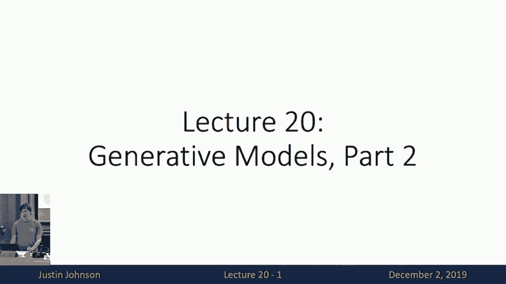

of generative models，so this will be generative models part，two um so remember last time we started。

our discussion of generative models by，recapping a couple big distinctions in。

machine learning that we need to，that we need to be aware of so one of。

these was this distinction between uh，supervised learning and unsupervised，learning。

so then you'll recall that in supervised，learning we have um，both the data the raw data x which is。

like our image，as well as the label y which is the，thing we want to predict and in。

supervised learning what we wanted to do，was learn some function that predicts。

the label from the image，and this has been very successful this。

works well this is we've seen throughout，the semester，this concept of supervised learning lets。

us solve a lot of different types of，computer vision tasks，but supervised learning of course。

requires us to build a big data set，of images that have been labeled by。

people in some kind of label watch，so we'd like to figure out so kind of。

one of these holy gale holy grail，problems，in computer vision or even machine，learning more broadly。

is figuring out ways that we can take，that we can learn useful representations，of data。

without those labels wide which brings，us to unsupervised learning。

where we have no labels just data and，somehow our goal is to learn some。

underlying structure of the raw data，even without any human provided labels。

and if we could do this this would be，awesome，right because you can know you can go。

out on the internet and just download，tons and tons and tons of data。

and hopefully if we did um if we could，way，then we could just download more and。

more data we don't have to label it so，it comes for free，and then we our models can just get。

better and better and better so this is，kind of the one of the holy grail。

challenges in machine learning，um and i think we're not there yet but。

that's kind of one direction that we're，pushing with。

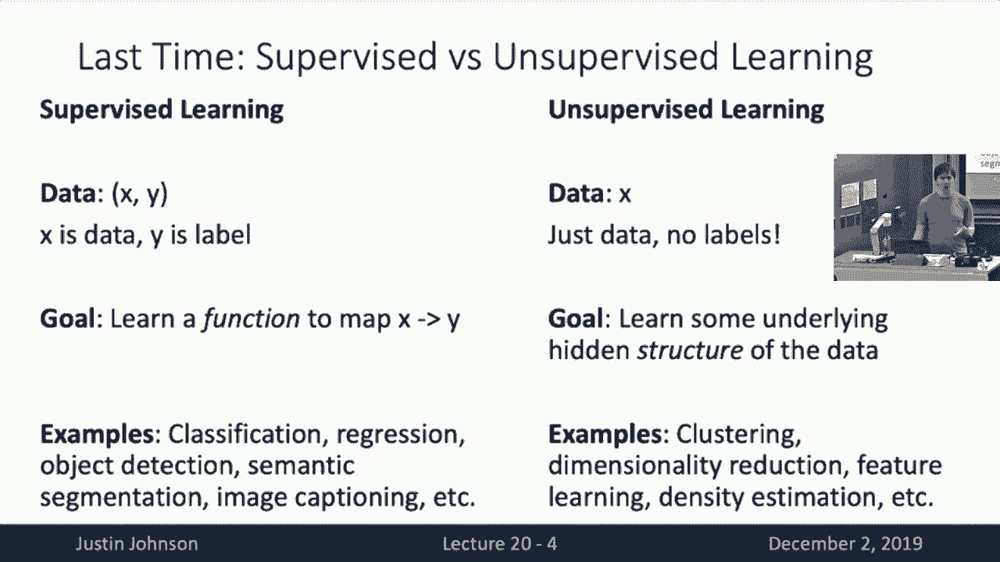

generative models so remember last time，we also talked about this station。

between distributor models and，generative models and this is more of。

the problem and this was about the，probabilistic formalism，that we use when building our concrete。

machine learning models，so remember that a discriminative model，is trying to model the probabilities。

distribution of the output or the label，y conditioned on the input image x。

and that because of the way probability，distributions work we know that。

probability distributions have to be，normalized they have to integrate to one。

so then this this constraint on，probability distributions that they need，to integrate to one。

induces a sort of competition among the，support or among the elements of the of。

the probability distribution，so then recall that when we're building。

a discriminative model this means we，have a competition among the different。

labels that the model might choose to，assign to the input image。

so for this input input image of a cat，then the labels dog and cat。

are kind of competing with each other。

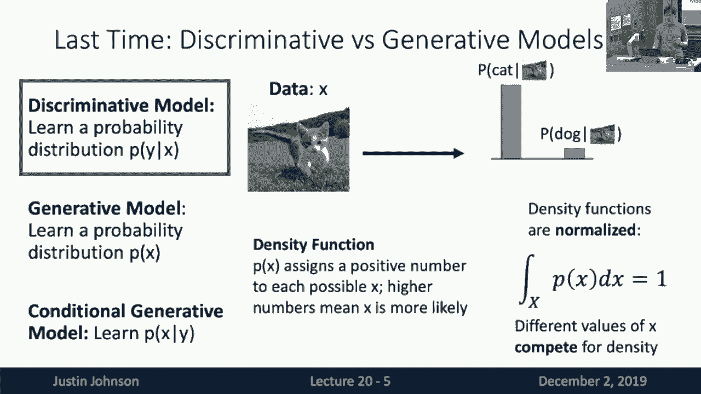

for probability mass，and then remember that for，discriminative models this fact that the。

labels are competing with，each other was a bit of a downside，because it meant that discriminated。

models had no way to like，reject unreasonable data so if we gave，this like an image of a monkey。

that even though monkey is not a valid，label the model has no choice but to。

force the labels to integrate to one，and it still force the model to like，output a full valid。

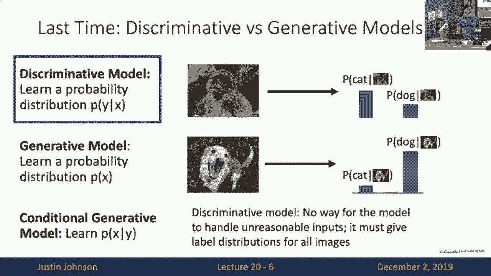

probability distribution over the label，set even though the image itself was，unreasonable。

so then of course with a generative，model what we were going to do is learn。

a just a probability distribution or a，density function over the images，themselves。

and now again because of this constraint，that density functions need to integrate，to one。

now but now the things that are，competing with each other are the images，themselves。

so then with a with a generative model，we need to assign a likelihood to each。

possible image that could possibly，appear in the universe，and those those all those all those all。

those densities for all of those images，need to integrate out to one。

so that means that the model needs to，decide without any labels which。

combinations of pixels are more likely，to be valid images，and this requires a very deep。

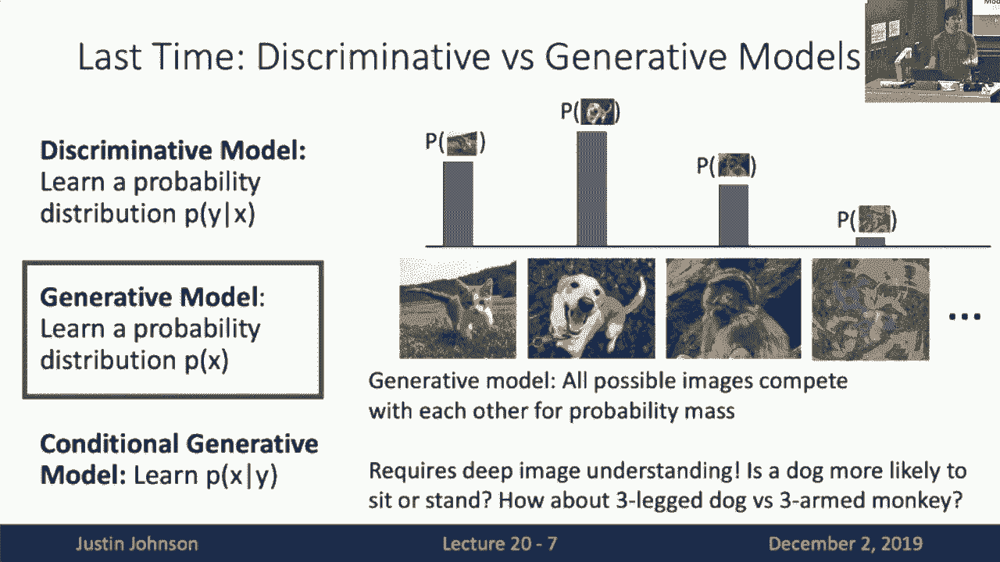

understanding of the types of visual，data，so that's our generative model that。

we're trying to learn of course we also，saw the this third option of a，conditional generative model。

which is trying to model the images，conditioned on the label，and of course we we saw that we can use。

bayes rule to write out a conditional，generative model，in terms of these other components um。

like the，the a discriminative model and in terms，of an unconditional generative model。

and later in this lecture we'll see，actually some some more concrete。

examples of conditional generative，models，um that are built out of out of neural。

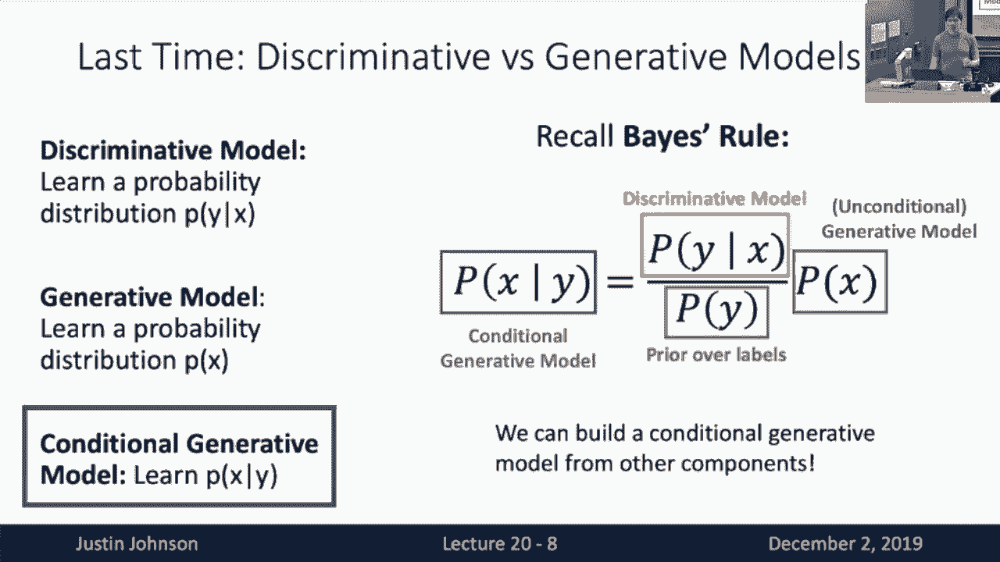

networks，so then after this kind of introduction，we saw this big taxonomy of generative，models。

right that this this idea of building，probability distributions over our raw，data。

is quite a large and rich area of，research and a lot of smart people have，spent a lot of effort。

trying to build build different sorts of，generative models with different sorts，of properties。

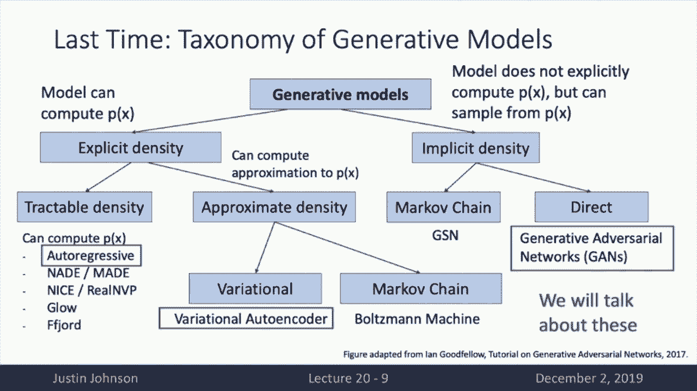

so last time we talked about um one type，of generative model which is the auto。

aggressive generative model，so now if you'll remember in an auto，regressive generative model。

it's explicitly writing down some，parametric form of this density function。

so then if we're trying to model the the，the likelihood of an image x。

we break the image x down into a set of，pixels，x1 through xt and then we assign some。

kind of order to those pixels，and we always say that the problem that，the likelihood of a pixel。

is um is we write down a function that，the，the likelihood of a pixel conditioned on。

all of the previous pixels in the image，and this was just like the the types of。

models that we had built for for，modeling sequences with recurrent neural，networks。

so remember that we saw this exact same，type of model when for example doing。

image captioning or language modeling，with recurrent neural networks um but。

then with these with these auto，regressive models then we wanted to kind，of um just。

model the pixels of the image one at a，time and we could use that either with，some kind of recurrent。

recurrent neural network which gave rise，to this pixel rnn，or this um pixel cnn where we modeled。

this kind of dependence，using a convolutional neural network。

over a finite window rather than using a，recurrent neural network。

but either way um we're either these，either these types of autoregressive，models。

what we're doing is we're writing down，this parametric function，with a neural network that is just。

directly parametrizing the likelihood of，an image，and then we train the model by just。

doing a very straightforward maximum，likelihood estimation，so we just want to maximize the。

likelihood that the model，assigns to all of the training data and，in doing that um。

it'll allow us to then sample or，generate new data at test time。

after the model is trained so these auto，regressive models we saw are kind of。

simple and straightforward they're just，kind of，directly learning a density function，over images。

and maximizing it on the training data，so then after we after we saw these。

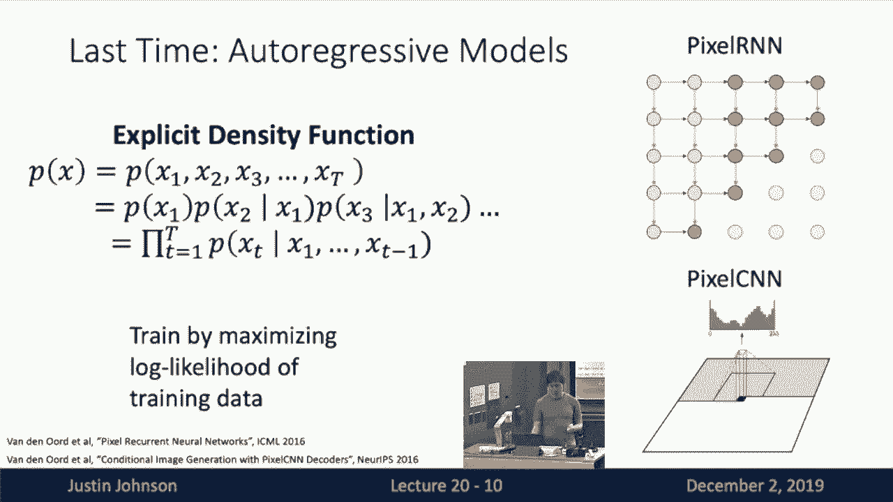

auto-aggressive models，we moved on to this this more，interesting。

category of degenerative models called，variational auto encoders。

so then in variational auto encoders，remember we kind of lost，something compared to auto aggressive。

models but we also gained something，so what we gained with respect to uh，with auto arrested models。

is that in addition to modeling the，likelihood of the data，we've also introduced this late variable。

z，which is supposed to be some late，representation，that uh that assigns sort of。

characteristics that contains，characteristics or attributes，of the data that are hopefully of a。

higher semantic level compared to the，raw pixel values，and now with a variational autoencoder。

what we wanted to do，was learn a generative model that could，that was um。

could produce images conditioned on this，latent variable c，but we found that in trying to like。

manipulate the math，we saw that it was completely，intractable to both to just directly。

maximize the likelihood of the data once，we introduced this notion of this。

this latent variable z so then last time，we saw that we，kind of went through this long extended。

proof that we could that you could，look back at the slides but at the end。

of the day we derived this lower bound，on the on the data likelihood so then。

we'll remember that we have this data，likelihood term on the left which is。

or the log likelihood of the data on the，bound，on this data likelihood that consists of。

these two terms，and in order to derive this lower bound，we had to introduce an auxiliary network。

called the decoder network and this is，so then now our encoder network on the，left here。

is trying to predict the the likelihood，of the latent variable z。

conditioned on the image x and now the，decoder network on the right here。

is trying to model the likelihood of the，data x conditioned on the lathe variable，c。

and where we kind of left off with last，time is that we had，introduced these two networks and we。

used these two networks to derive this，lower bound on the likelihood。

and then remember what we're trying to，try to do with a variation auto encoder。

is then train these two networks the，input the encoder，and the decoder we want to learn the。

parameters of these networks jointly，to maximize this lower bound on the data，like。

because we can't actually access the we，can't compute the true likelihood of the，data。

but we can compute this lower bound so，that maybe the true likelihood of the，data is here。

and this data likelihood is some lower，bound now we're going to train the。

train the two networks to maximize the，lower bound so then hopefully。

when we train these networks to maximize，the lower bound on the likelihood。

that will hopefully also in some，indirect way，also hopefully maximize the likelihood，of the data。

so that sort of then that this so then，here，gives us our training objective for a。

variational auto encoder，so now um when we had we're talking，about variation auto encoders。

we need both of these both the encoder，network and the decoder network。

they need to input a piece of like a for，the encoder for example，it needs to output a probability。

distribution which is a different sort，of thing that we've seen with most of，our neural networks。

right so with the encoder network if we，wanted to input a concrete sample of，data x。

and we wanted to output a full，probability distribution，over the potential latent variables z。

and now now this now，outputting a probability distribution，from a neural network is kind of a funny。

thing that we haven't really seen，in other contexts so far so then we need。

to we needed to do an additional trick，in order to allow neural networks to。

have probability distributions，as their outputs so then the trick that，we used。

is that we just we just we just decided，that the all of these probability，distributions。

would be gaussian um and in particular，would be diagonal gaussian，and now we would train the encoder。

network to output both，the mean and the diagonal covariance，matrix。

of this gaussian distribution and to，maybe look at，what and then the decoder is going to be。

similar that it wants to input a，concrete sample of the latent variable z。

and then output a distribution over the，images x and the way that we do that is。

again just decide that this distribution，is going to be，a diagonal gaussian and we have the。

neural network output the mean，and the covariance of the diagonal。

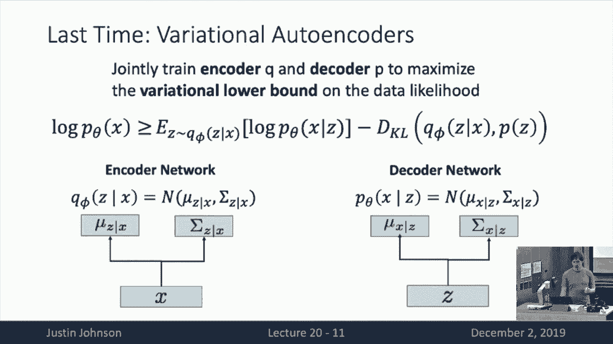

covariance matrix of that gaussian，so then to be a little bit more concrete，than if we were。

we could imagine sort of writing down a，fully connected variation auto encoder，architecture。

to train it up on the mnist data set for，example，so then if we were training on this，mnist data set。

then all of our images are a grayscale，images of size 28 by 28，so we can flatten those to a single。

vector of size 784，and now we could decide that our，dimension of our latent variable z。

is going to be a 20 dimensional latent，variable and that that dimension of the。

latent variable is of the late，that latent that size and late variable。

z is a hyper parameter that we would，need to set before we started training。

so then a concrete architecture for what，this could look like，is that the encoder network then needs。

then inputs this vector x，it could pass through some linear layer，to go from 784 down to 400。

units and then from that hidden layer we，have two other，linear layers that are going from the。

400 hidden units，into 20 units where where one of those，mean。

of this of this of this distribution and，the mean，for because z is a 20 dimensional vector。

then the mean of the diagonal covariance，the the mean of the gaussian is just。

another 20 dimensional vector so then，the network will just have a linear。

layer that out directly outputs the mean，of that distribution。

and then there's a parallel layer which，is also going to output the diagonal，covariance matrix。

of that gaussian distribution and then，again because z，is a 20 dimensional vector then the。

covariance matrix is a，full covariance matrix would be a 20 by，20 matrix。

but because we made this simplifying，assumption of diagonal covariance。

then the then all the off diagonal，entries are zero，so the only non-zero entries on that。

matrix is the diagonal，so there's 20 elements along the，diagonal so then we just need to have。

our neural network then output sort of，20 numbers for the mean。

and 20 numbers for those elements of the，diagonal along the，diagonal of the covariance matrix so。

that would give us this concrete，architecture，of of an encoder network for this fully。

connected variational autoencoder，and now the decoder would look very。

something very similar then it's going，to input a vector z，and then it's going to have a couple。

linear layers that will uh，output the the mean and the covariance，of the pixels themselves。

where we again use this simplifying，assumption that the pixels are，distributed according to。

a gaussian distribution with some mean，that as output by the network and some。

diagonal covariance which is output by，the network，and of course um i've sort of omitted。

the fact that i've written down linear，layers on the slide here but of course。

out every linear layer should have some，kind of non-linearity between them。

so that's kind of implied in this。

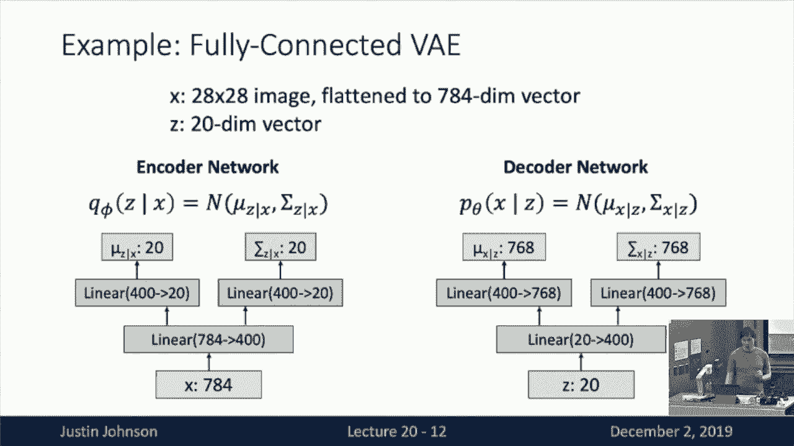

diagram，okay so then once we've got this sort of，concrete architecture for a variational。

auto encoder。

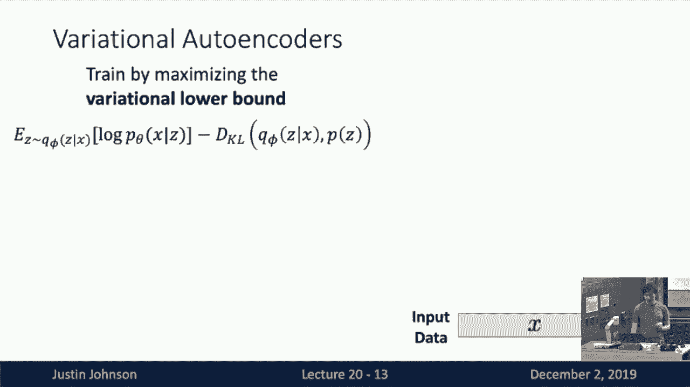

then we need to think about how to train，it so recall that we're going to train，oh yeah question。

oh so the dimension of the output the，decoder is 768，because we assumed that we're working。

with a 20 28 by 28，image and 28 by 28 is 768 i'm outside of，the math problem。

uh maybe i did the math wrong what is it，28 times 28，7 784 okay yeah i did that i messed up。

the multiplication，okay thank you uh it's more common to，use 768 because 768 is like two。

512 plus 256 that's actually a pretty，common number to use so i think i just。

typed that and actually multiply it。

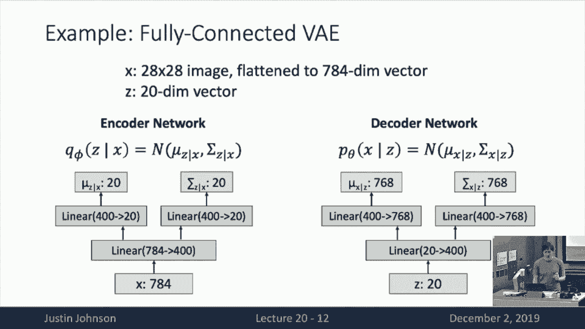

but thanks for pointing that out okay so，then how do we actually train this thing。

now that we've got a concrete，architecture，so remember that our training objective。

is that we want to maximize this，variational lower bound，and this variation lower bound looks。

kind of scary it has an expectation as a，that we，usually don't see in loss functions but。

it turns out it's actually，not as bad as it looks so that we can，kind of walk through。

then what it actually looks like when，we're training a variational autoencoder。

so when we train a variational，autoencoder first we take，some mini batch of data um x here。

which is our input data from our data，from our training data set。

and then we pass that input data or that，midi batch input data，through our encoder network and that。

encoder network is then going to spit，out a probability distribution。

over the latent variable z for for our，in for that input element x。

and now we now immediately we can use，this this predicted probability，distribution。

to compute the second term in the very，in the in the variational lower bound。

so what is this what is the second term，in the variation lower bound saying。

it's it's saying that we want to compute，the kl divergence between two，distributions。

one distribution on the left here is，this q theta，of z given x so that is the predicted。

distribution of，z um that is predicted by the the，encoder network。

when we feed it with the with the input，data x so that distribution is just this，diagonal gaussian。

that our encoder that our encoder has，spit out for us，and now the second the second。

distribution p of z is the prior，distribution over the latent variable z。

which we decided is going to be some，simple distribution like a unit gaussian。

and that is not learned that that prior，distribution over z is something that we。

fix at the beginning of training，so now we all we need to do is compute，the kl divergence between。

uh this this distribution that was，output by the network which is a，diagonal gaussian。

and this prior distribution which is a，unique gaussian，and now it's clear why we chose。

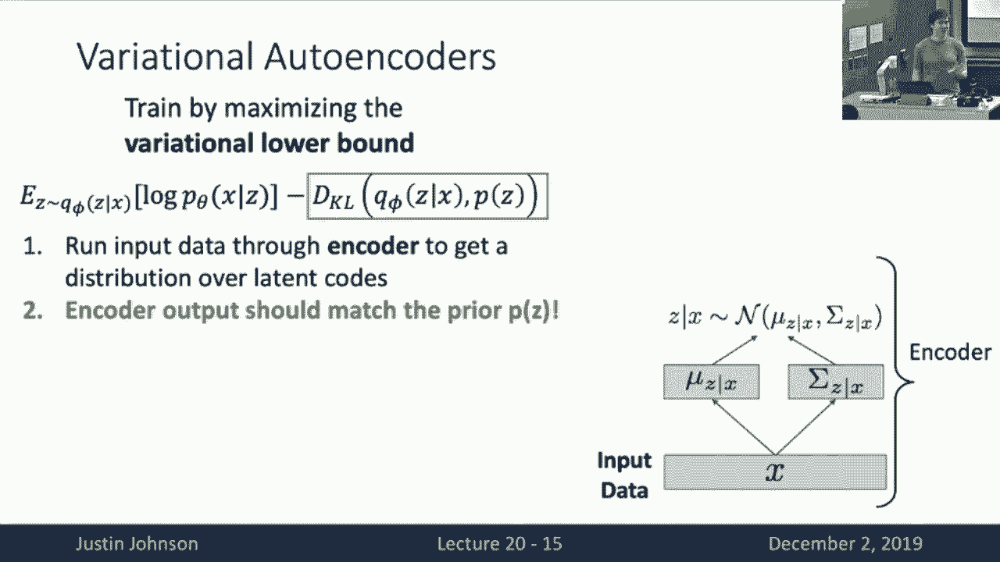

everything to be gaussian，because if we all choose all these。

distributions to be gaussian then we can，actually compute this kl divergence in，closed form。

so i don't want to walk through exactly，the derivation here but it turns out。

that um if you sort of expand out the，definition of the kl divergence。

then by the fact that these two，distributions are both diagonal，gaussians。

then we can just compute this kl，divergence in closed form，so then uh yeah question yeah the，other。

prior distributions for p of z so i，think in a classical variational auto。

encoder we we tend to use a unit，gaussian because，it allows us to compute this term in。

close form but it's definitely an active，area of research to，choose other types of prior。

distributions for z，um and the problem is that so sometimes，you'll see people you try to use like a。

bernoulli distribution and then you have，categorical，variables or maybe like a laplacian。

distribution and it implies some like，different sparsity pattern of late，variables。

so you definitely can choose different，prior distributions for z，in a variational autoencoder but。

being able to compute this kl divergence，term might become difficult。

depending on the particular prior，distribution that you choose um so we。

often use the gaussian just for，computational simplicity but it allows。

us to compute this term in closed form，yeah yeah so the question is should we。

assume sort of different priors for，different data sets，well i think this is actually that's。

actually a very interesting question，because this this prior is over the，latent variables。

right so what does it mean if we have a，diagonal，gaussian and so one is that this priors。

over the latent variables，and the latent variables are not，observed in the data set the model is。

sort of learning the latent variable，representation，jointly with everything else so actually。

um the choice of prior，is sort of our way to tell the model，what sorts of latent variables that we。

want it to mark so then when we，if we choose this like diagonal this，unit uh this unit。

gaussian as a prior then that's telling，the model that we want it to learn。

uh latent variables which are，independent because it's a u because，it's a diagonal gaussian。

and then all have zero median of，variance um，so i think that because the latent。

variables are being discovered jointly，by the model for the data。

that's why i think it's okay maybe to，use the same prior distribution even for，different data sets。

but again it's sort of active area of，research to try out different sorts of。

prior distributions in variational，models，yeah question question is um could we。

train sort of z different binary，z dimension of z different binary，classifiers instead of a diagonal。

gaussian，and i think that would be equivalent but，the difference is that um we actually，want to。

we want to share the computation within，the encoder network，so right now the variation auto encoder。

sort of，two levels of modeling inside the model，one is like the neural network。

which is computing many layers and the，other is kind of the probabilistic，formulation。

so it's true that even though we want，that we're telling the model we wanted，to learn。

a set of latent variables that are，uncorrelated the way that we're，computing。

those means and standard deviations of，those latent variables，is through a neural network that is。

going to share a lot of parameters and a，lot of weights through shared hidden，layers。

so i think it's a computational reason，okay that gives us our first term of our。

okay that gives us our first term of our，very of our variation objective。

and really what this term what this term，is just saying is that we want the。

distributions which are predicted by the，encoder，to sort of match the prior that we've。

chosen and the kl divergence is just，penalizing the difference with disparity。

between the predicted distribution and，the prior distance，okay so then once we've got a player so。

that that allows us to compute this，first term of the loss，so then once we've got um now that we've。

got our distributions over those things，over those over those latent variable z。

then we can sample from the predicted，distribution，to actually generate some concrete，samples z。

which are now sampled from the，distribution which was predicted by the，encoder network。

and then we can take these samples z and，feed them to the decoder network。

and now the decoder network is going to，predict a distribution，over the images x and now this。

this leads us to our second term in the，objective so what does this second term，in the objective say。

well it's we're taking an expectation，and this expectation the variable over。

which we're taking the expectation，is z the latent variable and the。

distribution over which z is drawn，should be q theta of z given x so um。

sorry a q phi of z given x so q phi，of z given x is the predicted，distribution over z。

that is predicted by the encoder q when，presented with the input，uh with the with the with the input。

x right so then we fee was that that's，exactly what we've done is that。

we've fed the input x to the encoder，we've gotten this distribution。

z given x and now we've taken uh some，samples from that distribution。

in order to have some sampling based，approximation to this to this objective。

right so then this this term isn't a is，an is expectation and the thing over。

which we're taking the expectation，are latent variables which have been。

sampled according to the predicted，distribution，okay so that's kind of the the first。

half of the of this objective，now the second question is what is the，thing inside the expectation。

so now the thing inside that expectation，is that we want to maximize the，likelihood of the data x。

under the predicted distribution of the，decoder when we feed，it a sample z so then we want to uh so。

that this is kind of an auto encoder，objective right that basically this is a。

data reconstruction term，then it's saying that what we want to do，is we take the data x。

we feed it to the encoder we sample some，and then we get a predictive，distribution over。

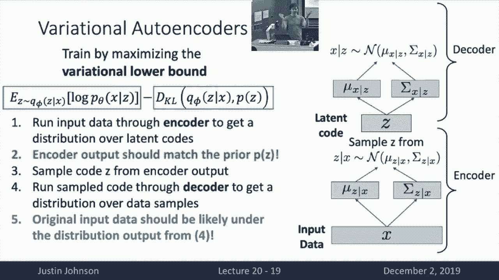

z we sample some z according to the，distribution，we feed those samples back to the。

decoder and now we，and now the d now the predicted，distribution of the z of the decoder。

um under that predicted distribution，over x，the original data x should have been。

likely so this is really a data，reconstruction term，it means that if we take our data and。

then use it to get a latent code，and then use that that same latent code。

the original data should be likely again，so that's that so this term is really。

why this is called an autoencoder，right because remember an autoencoder。

was a function that tried to predict its，input，by bottlenecking through some latent。

representation and that's exactly what，this term is doing，except now it's sort of a probabilistic。

formulation of an autoencoder，but it looks exactly the same it's a，data reconstruction term。

but now um then then then we can easily，compute this，this uh this second term in the loss。

function right because we've got some，samples from our latent codes。

and then we can run those samples，through the decoder to get our，distribution。

and then we can just use a maximum，likelihood estimate like a maximize the。

likelihood of the predicted data，under the predicted distribution from。

the decoder um so that we can then we，can compute the second term in the，objective。

once we've gotten these predicted，distributions of x given z，and that gives us our full training。

objective for the variational auto，encoder，so then uh the kind of every forward。

pass in our variation auto encoder we，would give these two terms in the loss。

and then we would use that to train the，to train the two networks jointly。

so then basically these two objectives，are kind of fighting against each other。

right because the the blue term is this，data reconstruction term。

it's telling us that if we take the data，give it back to the latent code and then。

get the latent code it should be easy to，reconstruct the data，but now the the green term is kind of。

saying that，the predicted distribution over the，latent variables should be simple。

and it should be gaussian so that's sort，of could it putting some kind of，constraint。

on the types of latent codes that the，encoder is allowed to predict。

right so then the the the kl divergence，is sort of like forcing the latent codes。

to be as simple as possible by forcing，it to be close to this this simple prior。

and the data reconstruction term is，encouraging the latent codes to contain，enough information。

to reconstruct the input data so somehow，these two terms in the variational，autoencoder。

are kind of fighting against each other，but then once this thing is trained then。

of course we could uh，sample a reconstruction of our original，data by sort of sampling from。

a new reconstructed data from this uh，this final predictive distribution of，the data。

okay so then this is how you would train，a variational auto encoder but once it's。

trained we can actually do some cool，things，so one thing is that we can generate new，data。

um from the to the trained variational，auto encoder so we can ask the。

variational auto encoder to just invent，new data for itself，that is sort of sampling from the。

underlying distribution from which the，training data was drawn。

so the way that we can do that is that，we we're going to use only the decoder。

so here we're going to first，sample a a random latent variable from，the prior distribution over z。

and then we'll take that random latent，variable and then feed it to the decoder，network。

to get a distribution over the over new，data x，and then we can sample from that。

predicted distribution over new data x，to give some some invented sample from，the from the data set。

so this means that after we've trained a，variational auto encoder。

we can use it to just like synthesize，new images，that are hopefully similar to the images。

that were seen during the training set，so now first now we actually get to see。

some some example results of exactly，this process，so now these are example images which。

have been synthesized from a variational，auto encoder which has been trained。

on different data sets so on the left we，see um some examples where we。

well not me but the authors of the paper，had trained some variational autoencoder。

on the cfar data set，and then these are now generated images。

which kind of look like cfar images that，have been invented by the model。

and now on the right um they've trained，it on a data set of faces。

and now you can see the model is kind of，inventing new images um。

new faces that kind of look similar to，the faces that it had seen。

during training so this is um this is，like a it's a generative model so we。

should be able to generate data，and that's exactly what we're doing here，but now another。

like but now or another really cool，thing we can do with variational auto，encoders。

is actually play around with that uh，that latent variable z，so remember we um in our we forced some。

structure on the latent variables，because we we put a prior distribution。

that the model was supposed to，to to match over the latent variables。

so in particular with the fact that we，chose the the prior distribution。

to be an independent to be a diagonal，gaussian means that each of the latent。

variables should somehow be independent，so what this means is not now um here。

we're doing a visualization，where we're varying two dimensions in，this latent code。

and then feeding different different，latent vectors z，to the decoder that will generate new，images。

and we can see that as we vary on the，horizontal direction，as we vary z2 maybe the second dimension。

of the latent code，then the images kind of translate from，sort of smoothly transition from a seven。

on the left to some kind of a slanted，one on the right，and now on the vertical direction if we。

vary a different dimension of that，latent code z，then we can see the generated images are。

going to smoothly transition from a six，at the top，um sort of down through fours in the。

middle through nines in the middle and，then down to sevens at the bottom。

so now this this is now something that，we could that this is now showcasing。

some of the power of the variational，auto encoder，over something like the pixel cnn that。

because the variational auto encoder，is not just learning to generate data。

it's also learning to represent data，through these through these latent codes。

z and by manipulating the latent codes，we can then have some effect on the way。

that the data is generated，so that's a really powerful aspect of，the variational auto encoder。

that the the something like the the like，the auto aggressive models just just。

so now another thing we can do with，so now another thing we can do with。

variational autoencoders is actually，edit images so we can take an input。

image and then modify it in some way，using a variational auto encoder so the，way that we can do that。

is that first we need to train it on our，data set with an after training what we，can do。

is say we've got an image x that we'd，like to edit somehow，then what we can do is take that image x。

pass it through the encoder of the，variational autoencoder，to now predict this latent code z for。

that image，x and now we can sample a latent code，from that，distribution and now we can modify that。

latent code in some way，like maybe change around some of the，values in that predicted latent code。

and then we can take that edited latent，code and feed it back to the decoder。

to now generate a new edited data sample，x，so now because we want and then why does，this make sense。

this makes sense because we wanted the，latent codes to somehow，represent some kind of higher order。

structure in the data and the generator，model is supposed to discover this，higher order structure。

in the data through the latent codes by，through the process of maximizing this。

variation of lower bound，so then um but then after it's trained，then we can actually edit images。

using variational autoencoders using，this kind of approach，so then here we have like maybe some。

some uh some initial image which is a，face，and then we take that initial image feed。

it to our variation auto encoder to get，the latent code for the face。

and then here we can then change around，different elements of the predicted，label code。

and feed them back to the decoder to get，a new uh edited version of that initial，image。

so you can see that maybe as we vary，along the horizon along the vertical。

direction because we're then we're，varying one dimension in that late。

code then we can see that at the top the，guy looks really angry and he's not，really smiling at all。

and at the bottom he's sort of smiling，and looks very happy，so somehow this this one dimension of。

laden code，somehow seems to encode something like，the facial expression or the happiness。

level of the，face and now as we vary z2，uh which is along the horizontal。

direction then we're then we're editing，we're modifying a different dimension of。

this predicted laser code，and then you can see that the guy is。

actually like turning his face from one，side to another，that somehow the model has learned to。

sort of encode，the pose of the person's face into one，of the dimensions of the latent code。

and now by editing that dimension of a，latent code then we can actually edit。

input images using a variation auto，out，that we have no control we don't know。

upfront which elements of the latent，code will correspond to which properties，of the input image。

those are decided by the model for，itself but by kind of playing around，with them after the fact。

then we can see that the model has sort，of assigned in many cases。

some kind of semantically meaningful，data to the different dimensions of that，latent code。

so here's another example from a，slightly more powerful version of，variational autoencoder。

where we're doing this idea of image，editing again so then in the left column。

we have the original image，um the next the second column shows the。

the reconstruction of the original image，if we sort of take the unedited latent。

code and feed it back to the decoder，and then the next five columns are all。

showing uh edited versions of that，initial image，where we change one of the values in the。

predicted leak code，so you can see on the left that um by，changing one of the dimensions in the。

latent code，we're again sort of changing the，direction of the head and now in the。

example on the right，we see that a different dimension of a，lame code corresponds to the direction。

of the illumination，the direction of the light in the scene，use。

um sort of variational auto encoders to，actually do image editing。

through these latent codes and this is a，and this is really kind of the reason，why we want like。

variation encoders took a lot of ugly，math right like there's a lot more，complicated conceptually。

than something like the autograph models，but this is the re this is the payoff，right here。

that we went through all that additional，work with the variation auto encoder。

so that we could learn these useful，leaking codes for images，in addition to to a sampling problem um。

so i think that's that's kind of，most of what we want to say about，variational autoencoders。

so in kind of a summary of variation，auto encoders is that they're kind of a。

probabilistic spin on these traditional，auto encoders，um that they're kind of a principled。

approach to generative models is kind of，a good thing，and that they they're really powerful。

because they learn these distributions，over latent codes from the data itself。

now one of the one of the downsides of，variational autoencoders，is that um they're not actually。

maximizing the data likelihood，they're only maximizing a lower bound to，the data likelihood。

so all the probabilistic stuff is sort，of approximate when we're working with。

variational autoencoders，another problem with with variational，encoders is that the generated images。

often tend to be a bit blurry，and i think that has to do with the fact。

that we're making sort of diagonal，gaussian assumptions about the data when。

we're working with variational，autoencoders，okay so then so far we've seen two。

different types of generated models，we saw these auto-regressive models that。

are directly maximizing the probability，of the data，and they give us pretty high quality。

sharp images but they're sort of slow，they don't give us latent codes。

and we saw a variation and we saw these，variational auto encoders。

that maximize the lower bound the images，are kind of blurry，but they're very fast to generate images。

because it's just like four pass through，this through the speed forward neural，network。

and they learn these very rich latent，codes which is very nice，so then is there some way that we can。

just like get the best of both worlds，and actually combine，the auto-aggressive models with the。

variational models，and this i think is a bit of a teaser i，don't want to go into this in too much。

detail，but there's a very cool paper that，actually will be presented at a，conference next month。

that does this exact approach so this is，called a vector quantized variational，auto encoder。

vq vae2 and kind of the idea is that we，want to get kind of the best of both。

worlds of both variation a lot of，encoders，and auto regressive models so what we're。

doing is kind of on the left，first we train some kind of variational，autoencoder type method。

that learns a grid of latent feature，vectors um as sort of the first that。

looks kind of like training a variation，auto encoder，but rather than learning a latent vector。

instead we learn a latent grid of，feature vectors，and now on the right once you've learned。

that latent grid of feature vectors，then we can use a pixel cnn um。

as an autoregressive model that is now，doing that is now an autoregressive，model that operates。

not in raw pixel space but instead，operates in the，latent code space so then it's kind of。

like sampling a latent code and then，based on the predicted latent code it。

steps to the next element in the grid，samples the next latent code and so on。

and so forth so this actually speeds up，generation a lot，and now the hope is that this kind of。

will hopefully combine and give us，best of both worlds between variational。

autoencoders and pixel cnns，and actually this model gives amazing，results。

so these are actually generated images，using this vector quantized variational，auto encoder model。

so these are 256 by 256 generated images，um that are conditioned they're actually。

this is a conditional generator model，so the model is conditioned on the class。

that it's trying to generate from，but the but this model is super。

successful it's able to generate really，high quality images so i think this is a，pretty exciting。

direction of future research for generic，models，so you can see that this model is able。

to generate really high quality，of high resolution 256 by 256 generated，images。

when we train it on even large scale，complicated data sets like imagenet。

and now where this model works really，really well is actually on human faces。

so these are actually generated faces，these are not real people，these are fake people that have been。

invented by this vector quantized，variational autoencoder model。

um that's working at this extremely high，resolution of 1024x1024。

and you can see that um you know it's，like it's can model people with crazy。

hair colors it can model like facial，hair with a lot of detail。

these are also generated bases from this，model um so it's kind of。

astounding to me just how well this，model is able to do，in modeling these very complicated。

structures of people's faces，so so personally i'm pretty excited，about this as a。

possible future direction for generative，models but like i said this paper is。

yet to be it will be presented at a，conference next month so it's sort of，this will。

this will become the next big thing in，general models，okay but this i just this i just wanted。

to serve as kind of a sneak peek as kind，of state of the art in uh。

in auto aggressive and variational，models，so kind of where we are so far in。

generative models is that you know we've，seen these auto regressive models。

that are directly maximizing the，likelihood of the training data。

and then we've seen these variational，autoencoder models that，give up directly maximizing the。

likelihood of the data and instead um，and instead maximize this variational。

lower bound and this allows them to，learn these latent codes，jointly while maximizing this variation。

of lower power，now the now so now we need to talk about，another category another big category of。

generative models，and that's these generative adversarial，networks organs。

so these are a very different idea here，we're going to completely give up。

on trying to model explicitly the，density function of the images。

so instead we don't we no longer care，about being able to compute。

um the the density over images or even，some lower bound or some approximation，to the density。

instead with a with a generic，adversarial network the only thing we。

care about is being able to sample，data from some some density of the。

well we care about sampling we don't，care about actually writing down or，spitting out。

the likelihood of our training data so，then how do we do that。

so then the kind of setup with very with，a general adversarial networks。

is that we assume that we've got some，some training data，xi some finite sample of training data。

that have been drawn from some true，distribution，true，probability distribution of images in。

the world um and this density function，is like the density function of nature。

so there's no way that you can actually，evaluate this density or write it down。

but we just assume that the natural，images in our data set have been sampled，from this。

like natural density of data and now，what we want to do is somehow learn a，model。

that allows us to draw samples from p，data，um but and we don't actually care about。

evaluating the likelihoods all we want，to do is be able to draw new samples。

from this probability distribution data，okay so now the way that we're going to。

do this is that we're all，like a variational auto encoder we're。

going to introduce a latent variable z，but the way that we use the latent。

variable z is going to be a bit，different，so here we're going to um we're just。

like in various log encoders we're going，to assume late variable z。

with some fixed prior pz and this can be，something simple like a uniform。

distribution or a diagonal gaussian，or some other kind of simple，distribution。

so now what we want to do is we want to，sample a latent variable z from our，prior distribution。

and then pass a sample through some，function，g capital g called the generator network。

and by passing the latent variable，through the generator network。

it should output it's going to output，some sample of data，x and now um now because。

now because now the generator network is，g is sort of implicitly defining。

some probability distribution over，images that we're going to call p。

sub g and p sub g it's sort of difficult，to write down that exact density you'd。

have to use kind of like the change of，variables function，um from probably distributions but um。

because，because the generator we're like，sampling some some we're sampling some。

latency from the prior，passing the latent variable through the。

generator function and that gives us a，data sample x，so then the generator kind of implicitly。

defines，this distribution p sub g over data，samples，and now we can't explicitly write down。

the value of p sub g，but we can sample from p sub g because，we just sample from the prior then pass。

it through the generator，and now what we want to do is somehow，train this generator network。

g such that uh this the p the p sub g，which is implicitly modeled by the，generator network。

we want it to be equal to this true，distribution piece of data。

of the the the distribution of the data，coming from nature，so then pictorially what this looks like。

is that we want to draw some sample z，from this prior pc feed it to our，generator network g。

and that will give us some generated，sample and then what we，then the generator's job is what it。

takes a prior from pz，and turns it into a sample from pg，but now now we need some mechanism to。

force pg，to end up being close to p data so then，to do that，we're going to introduce a second neural。

network called the discriminator network，so what the discriminator network is。

doing is performing an image，classification task，the discriminator network is going to，input images。

and try to classify whether or not they，are real or fake，and now the so then the discriminator。

network will be trained both on samples，from the generator，as well as on our real or real samples。

from the data set，and then this is sort of a supervised，learning problem for the discriminator。

network，we've got sort of samples from the，generator that we know are fake we've。

got samples from the real data that we，know are real，and now the discriminator network should。

be trained to do a binary classification，task，to classify images as either real or，fake。

and now uh the gen but now we're going，to actually train these two networks。

jointly we're going to train the，generator to try to，fool the discriminator so the。

discriminator is trying to learn whether，classified images are as real or fake。

and the discriminator is trying to get，its images classified as real。

so then intuitively these two networks，are kind of fighting against each other。

the discriminator is trying to learn all，the ways in which the disc in which the。

generator's images look fake，and the generator is trying to learn how。

to have its images passed as realistic，by the generator or by the discriminator。

so then hopefully kind of the intuition，is that if both of these networks get。

really good at their jobs，then hopefully uh this pg will somehow。

converge to p data and hopefully after，by training these two networks jointly。

then hopefully the the samples from the，generator，will end up looking a lot like the。

samples from the real data，and this is the intuition behind，generative adversarial network。

now kind of more concretely like the，train，gener the general adversarial network is。

called is this a following mini max game，between g and d so there's this big。

hairy objective function in the middle，that will go，through piece by piece and now now the。

discriminator d，is trying to maximize all the terms in，this objective and the generator g。

is trying to minimize all the terms in，this objective and now we can color code。

this a little bit based on our previous，picture to make these each of these。

terms a little bit easier to understand，so then we can look at these two these。

these terms one by one，of，x drawn according to p data so that's，just sort of。

then we can approximate this expectation，by just uh taking the sum or the average，over the real。

our real data samples from our training，set um and now，the the discriminator now this term the。

discriminator is trying to maximize this，term，so the discriminator is trying to，maximize log of dx。

and dx is a number between zero and one，log is a monotonic function。

so what this term is saying is that when，the when the discriminator tries to，maximize this term。

it's trying to get the real data，classified as real，that the discriminator is trying to make。

sure that the discriminator，output on real data is one and the，generator is trying to minimize this。

term，but this term does not depend on the，generator so in fact the generator。

doesn't care about this term at all，this term is just saying that the。

discriminator is trying to correctly，classify the real data as real。

okay now the second term is that the，discriminator is trying to map。

again maximize this term so now again，this is an expectation，but the expectation is over latent。

variables z that have been drawn，according to the prior pz，and now given uh given a sample of z。

from the prior，we're going to pass the latent variable，through the generator to get a fake，sample。

and then take that fake sample and pass，it to the discriminator which will give。

us a number between zero and one，so now the discriminator is trying to。

maximize this term which means that this，that log is log of something is。

maximized when log of one minus，something is maximized，when the something is minimized which。

means that the discriminator is trying，to，set d of x equal to zero when when acts，as a fake data。

so this term when the discriminator is，maximizing this term it's trying to make。

sure that the fake data is classified as，fake as a binary，classification problem okay but then we。

can look at this term from the，generator's perspective，so the generator remember is trying to。

minimize this whole objective function，and now the so then the generator is。

looking at this exact same term in the，objective，we're trying to minimize it so that。

means that the generator is trying to，adjust itself，such that the generated samples are。

classified by the discriminator，as real so that gives us our training，objective for。

this for this minimax game so then the，kind of idea，is that we'll uh train this thing using。

alternating gradient descent，that will will jointly train both the，generator and the discriminator。

so that they're both trying to one is，trying to maximize this objective and。

one of the others trying to minimize，this objective，so then for a notational convenience we。

can write down that whole messy，expression as v，of g and d and then our training。

objective is we run in a loop，and then for each for each time in the，loop we come we want to first。

update the discriminator so then we，v，with respect to the discriminator。

weights and now we're trying to maximize，the objective for the discriminator。

so we want to do gradient ascent so then，we move in the direction of the gradient。

and take a gradient step，to do a gradient ascent step on d and，then once we update d。

then we compute the gradient of，objective with respect to the generator，weights。

and now the generator is trying to，minimize this objective so then we need，to take a gradient。

descent step on this objective to update，the weights of the generator g。

and then we'll just kind of update these，two one after another and we'll loop，forever。

and hopefully things will uh end up，happy，but it turns out there's actually a。

problem right that actually um you know，normally when you're training neural。

networks you can just like look at the，loss and the loss is kind of going down。

like this and that means you know that，everything is working well。

but uh it turns out that's not the case，at all for these generative adversarial，networks。

because the loss of the two of the，generator like the law the generator has，its own loss。

the discriminator has its own loss and，they depend on each other。

right because when the gen for example，if the discriminator is really good。

and the generator is really bad then the，discriminator will have low loss and the。

generator will have high loss，but if the generator is really but like。

the two losses sort of depend on each，other in complicated ways，so when you're training gender。

adversarial networks usually the loss，does not go down like this。

usually if you plot the losses of these，two things they're like all over the，place。

and you can't really you can't really，gain any intuition by looking at the。

loss curves when training these things，so training generator ever serial。

networks tends to be a pretty tricky，process that i，i don't know if i can actually give you。

that great of advice on how to train，these things properly，but suffice to say is challenging。

okay but there's actually kind of，another problem here is that um。

this so this term on the right this log，of one minus d of g of z。

um we can actually plot this um as a，curve，so here on the x axis we're plotting d，of g of z。

um and on the y y-axis we're plotting，log of one minus d of g of z。

um and now at the start of the training，you have to think about what's gonna。

happen at the very start of training，at the very start of training the。

generator is probably gonna produce like，random garbage，and then that random garbage will be。

very easy for the discriminator to tell，whether it's real or fake。

because sort of classifying real data，versus random garbage is very easy。

the discriminator will usually get that，within a couple gradient steps。

so now at the very beginning of training，d of g of z is close to zero。

because the discriminator is like really，good at catching the fake data。

so then d of g then if d of g of x is，close to zero，that means that this term is like over。

here on this uh，in this red this red arrow for the，generator and now that's really bad。

because the gradient is flat so that，means that at the very beginning of，training。

the generator will get almost no，gradient we'll have a we have a。

vanishing gradient problem at the very，beginning of training，so that's so that's that's bad so then。

to fix this，we actually uh in practice we often we，train the generator。

to uh to minimize a different function，so rather so in this sort of raw。

formulation that i've written up here，the generator is trying to minimize log。

of one minus d of g of z，but in practice we want what we're going。

to do instead is train the generator to，maximize，minus log of d of g of z which is still。

has the same interpretation，of having the generator's data be，classified as real。

but the way that that's realized into，the objective function is a little bit，different。

so now if we plot a minus log of d of g，of z we see that at the beginning of，training。

then the generator actually gets good，gradients so that so this is actually。

how we're going to train generative，adversarial networks in practice。

um that the the the generator the，discriminator is trying to classify data，as real as fake。

the generator is trying to get its data，classified as real by the discriminator。

but the exact objective that the two are，optimizing is a little bit different。

just to account for the spanish，ingredient problem yeah，of g，z so we want to maximize minus log of d。

of g of c，i think actually maybe that should be uh，maybe that should be a minimize。

yeah i think you could be right let me，double check and get back to me。

yeah okay so then there's sort of，like we have this intuition that。

generator is generated trying to full，discriminator，and there's a question of like why is。

this particular objective，a good idea to accomplish this goal，and now it turns out that this。

particular objective this particular，mini max game，actually achieves its global minimum。

when p of g is equal to p data，and now to see this we need to do a。

little bit of math so then here's our，objective so far，um and we're kind of ignoring the fact。

that generators actually optimizing a，different objective we're just。

pretending that they're both optimizing，this this one objective。

so here's our objective so far now what，we can do is we can do a change of。

variables on the second expectation，so now rather than writing it as an。

expectation over z drawn according to，the prior，we can write it as an expectation of x。

drawn according to the p of g，which is this distribution that the，generator is implicitly modeling。

so we're just kind of doing a change of，variables on the second expectation。

now we can expand out these two now we，can expand out the definition of the。

expectation into an integral，and that gives us this expanded version，and now。

if all of our functions are well behaved，we can push the max we can exchange the。

order of the max in the integral，and push the max inside the integral and，now we actually want to。

actually now what we have is that we，want to actually compute this max。

so the discriminator is trying to，perform the maximum um but the integral，is over all of x。

so now we want to write down what is the，optimal value of the discriminator。

for each possible value of x so now we，can do that with a little bit of side，computation。

so we can write down that we can really，recognize this this thing。

inside the max as a function that looks，kind of like a log y。

plus b log one minus y where a is p data，of x，b is pg of x and y is d of x。

and now this this function f of y we can，just compute the derivative set it equal，to zero。

and then find we'll find that this，function f has a local max，go back。

and plug that back in and then that，tells us that that gives us。

the value of the optimal discriminator，that is the discriminator which is。

actually satisfying this maximum inside，the integral，so that the optimal discriminator which。

is achieving this maximum value，um depends on the generator so now the，optimal discriminator。

d star for the generator g up has its，value of p data of x，over p data of x plus pg of x so that's。

the the value of the optimal，discriminator for any value of x，um so it's important to point out that。

we can compute that this is the optimal，value for the discriminator。

but we can't actually like evaluate this，value，right because this this d g at this d，star sub g of x。

involves p data of x which we already，can't evaluate，and involves p g of x which we also。

can't evaluate，so this is kind of a nice mathematical，formalism we know that this is the value。

the optimal discriminator must take，but we can't actually compute that value。

because it involves terms that we can't，actually compute，but then what we can do is sort of sub。

that val that optimal discriminator，back into the model and that sort of。

eliminates that inner maximization，right so then we've sort of performed，that inner maximization。

we found the value of the optimal，discriminator now we can plug in the。

value of that optimal discriminator，in every term of that integral so now，we've got um。

now this is the same the same objective，function but we've just kind of like。

done the inner maximization over the，discriminator uh for us automatically。

now this is getting messy so let's push，this up and then，uh then we can use the definition of。

expectation to sort of rewrite this，integral，back as a pair of expectations so now we。

now we're sort of pulling this back out，and now we write this as two，expectations one expectation is。

x over p data of log of this ratio，and the other is x according to pg log，of this ratio。

um and this is again using the，definition of expectation，now we need to do a little bit of。

algebraic nonsense multiply it by，constant，pull it out then we kind of pull out。

this log four and then we end up with，this particular mathematical formalism。

this is getting messy so let's push it，up again um and now，now this is something that maybe if。

you've taken enough information theory，you could recognize this as an important，term um so now。

it turns out there's this thing called，the collag library divergence or kl，divergence。

which somehow measures the distance，between two probability distributions。

and now we can recognize that we've，actually got two kl divergence terms。

sitting here right here so then by the，definition of the kl divergence。

um it's over a distribution p and a，distribution q，and then it's the expectation of x drawn。

according to p of log of the ratio，between them，and now we can see we've got two pale。

divergence terms sitting right here，inside these two expectations so then we，can rewrite this as uh。

there's the two kl divergence one is the，kl divergence between p。

data and this average of p data and pg，the other is the outlook the other way，the average of pg。

and this average distribution then we，saw this log4 hanging out。

now we can recognize another uh sort of，fact from information theory。

there's another distribution we can，recognize called the jensen shannon，divergence。

which is yet another way to measure，distances between different probability。

distributions and the jensen shannon，divergence is just defined in terms of，the kl divergence。

and now we can see we've actually got a，jensen shannon divergence sitting right。

here on this equation，so then we can simplify this even，further and write down this whole，objective。

as just this jensen shannon divergence，between uh p data，and pg so that means that um。

now this is actually quite interesting，right because we've taken this like mini。

max objective function that we're trying，to minimize and maximize。

we reshuffle things we actually computed，the maximum with respect to the，discriminator。

and then we boiled this all down so now，we just need to fight and then this。

whole objective reduces to，the minimum of the jensen shannon，divergence between the true data。

distribution p data，and the implicit distribution the，generator is modeling pg。

minus this constant log four and now，there's an amazing fact about the jensen。

shannon divergence that i'm sure you're，all aware of，is that the jensen shannon divergence is。

always non-negative so it's always，greater than equal to zero，and in fact it only achieves zero when。

the two distributions are equal，so that means that the that now this，whole expression。

we were trying to minimize find the，generator that minimizes this expression。

and it turns out that the unique，minimizer of this expression，occurs when p data is equal to pg。

qed right so that means that um the，optimal so，the unique that means that the global。

solution the global，the global minimizer of this whole，objective。

happened so then kind of summarizing，this we kind of rewrote this whole thing，as this。

minimum as this this minimization，function now the summary of all this。

is that the overall global minimum of，this minimax game happens。

is that when the discriminator assigns，this particular value this is。

this particular ratio um to all of to，any data sample，and then when the when the generator。

just models directly the true data，distribution，so that's kind of the beautiful math。

that underlies why generative，adversarial networks，have the potential to work and why。

training with this midi max objective，actually has the capacity to cause the。

generator to learn the true data，distribution，but of course there's a lot of caveats。

here right so that um，this this is sort of a proof that makes，us feel good but。

there's some holes in this when it comes，to applying this proof in practice。

so one is that in fact um we've kind of，done this minimization assuming that g。

and d can just represent any arbitrary，function but in fact g and d。

are represented by neural networks with，some fixed fixed and finite architecture。

and we're only allowed to optimize the，weights so it's possible that the。

optimal the generator and the optimal，discriminator，just might not be within the space。

expressible functions，for our generator and discriminator so，that's a problem so it doesn't actually。

tell us，whether or not fixed architectures can，represent these optimal solutions。

and it also doesn't tell us anything，about convergence so this does not tell，us about whether。

we can actually converge to this，solution in any kind of meaningful，amount of time。

so i think this this proof is nice to be，aware of it shows us that p。

that we are hopefully learning the true，of，caveats left okay so that's hopefully。

enough math for one lecture and let's，look at some pretty pictures。

so then uh here's some results from the，very first paper on general adversarial。

networks back in 2014，and you can see that um back in 2014 we，were able to generate these gender。

adversarial network，samples that could um reproduce faces to，some extent。

and reproduce these images these uh，these handwritten digits to some extent。

and then for comparison we're showing，for，each of these generated samples um so。

the fact that the nearest neighbor is，not exactly the same as the generated，image。

means that this model is not just，regurgitating trading samples。

that it's hopefully learning to generate，new samples that just look like，plausible training。

like plausible uh samples from the，training set，okay so this was kind of um the。

beginning of generative adversarial，networks，but this was 2014 five years ago and。

this is a fast-moving field so we've got，a lot of advancements since then。

so then kind of the first really big，successful result in general adversarial，networks。

was this so-called dc gantt architecture，which used，like a five-layer convolutional network。

for both the generator and the，discriminator，and they got this thing to train。

actually much better than some of the，original papers，and now some of the generated samples。

from dc dan ended up looking，quite nice so here what we're doing is。

we're training dc gan on a data set of，image of photos of bedrooms。

and now we're sampling new photos of，bedrooms from a trained dc game model。

and you can see that these generated，samples are actually quite complicated。

they're capturing a lot of structure of，bedrooms，you can see that there's like beds and。

windows and furniture and a lot of，interesting structure being captured by，this generic model。

but what's even cooler about this this，these networks，is that we can do interpolation in the。

latent space，so remember that a general member serial，network is taking a latent variable z。

and then passing it to the generator to，generate a data sample x。

so now what we can do is we can sample a，z over here，and a z over here and then linearly。

interpolate a bunch of z's in between，and then feed each of those linearly。

interpolated z's the generator，to now generate interpolated images。

along this uh this latent path in the，late space，so then each row in this figure is。

showing us an interpolation in latent，space，between a one bedroom on the left and a。

different bedroom on the right，and you can see that the images are。

somehow like continuously morphing into，each other in a really non-trivial way。

so that suggests that this adversarial，network has learned something really。

non-trivial about the underlying，structure of bedrooms，it's not just doing like an alpha。

transparency blend with the two images，it's like learning to warp the spatial。

structure of those images into each，other，another really cool thing we could do。

with gender adversarial networks is some，kind of vector map，on these line vectors so what we can do。

is we um can sample a bunch of，a bunch of samples from the network and。

then sort of manually categorize them，into a couple different categories。

so here on the left we've got a bunch of，samples of smiling women they look kind。

of like smiling women if we look at the，generated images，in the middle we've got sort of。

non-smiling women on the right we've got，non-smiling men，and then each of the free these data。

samples we have the latent vector which，generated it，so then for each of these different。

columns we can compute，the average latent vector along the，column and then uh。

refeed that average latent vector back，to the generator to generate kind of an。

average smiling woman an average neutral，woman and an average neutral man。

from according to this trained model and，now we can do vector math。

so what happens if we take a smiling，woman subtract a neutral woman and then，add a neutral man。

smiley man there we go and then you，could sort of sample some new vectors。

around that smiling man vector and sort，of get other smiling man images。

or we could do something similar to man，of glasses，minus man without glasses plus women。

without glasses，women with glasses there we go so then，women with glasses there we go so then。

somehow these uh gender members here oh，that works，let us do some kind of。

semi-interpretable vector map in latent，vector space which is really cool。

so this was in 2016 and i think after，this paper，people got really really excited about。

gender adversarial networks，and the field went crazy so this is a，graph showing the number of。

jan papers as a function of year from，2015 to 2018，and you can see that the number of gan。

papers being published is just like，exploding at a ridiculous rate。

so there's a there's a website called，the gan zoo where they try to keep track。

of all the different papers that are，being published about gans。

so here i sort of took a screenshot of，the gansu，this goes through b and they're。

alphabetized so there's，the the gansu just captured like，hundreds and hundreds and hundreds of。

research papers that are，being written about hands so there's no。

way that we can possibly talk about all，the advancements in gans，since 2016。

 but i wanted to try to hit a，couple of the highlights，so one is that we've got improved loss。

functions for gans now，so uh now we there there's an，improvement called the wazerstein gam。

which is which uh sort of changes the，loss function that we use for generating，gams。

for for training dans and you can see，that as we use this wazer scene loss，function。

then the generated samples tend to work，tend to be a little bit better。

another thing we've gotten better at is，improving the resolution of images。

with dance so uh here are some samples，from this model called the progressive，gan。

which was published just last year in，2018。 so the progressive gan。

on the left we're showing 256 by 256，generated images of bedrooms。

on this same bedroom data set that we've，been sitting that we've been working on。

so these are like fake images of，bedrooms and these look like i would。

like i would stay there if that was on，airbnb，um those look pretty good and on the。

right we're seeing these high resolution，1024x1024 generated faces by this。

progressive gan architecture，but of course that was 2018 and we're in，2019。

so things have gotten even better since，then so then the same authors behind，progressive gan。

wrote this new one called stylegan which，was published just this year in 2019。

which is also pushing towards higher，resolution so here are some results of，style gan。

generating images of cars which i don't，know look pretty realistic to me。

and on the right are again 10 24 by 1024，generated faces，using this style gan model and now。

what's really cool is we saw that gans，could be used for interpolation and，latent space。

well we can apply interpolation and，latent space to these high resolution。

faces that are being generated by style，gan，so you can see that a style gain is kind。

of like learning to warp，in by warping by continuously moving the，latent vector in that z。

in latent space you can see that the，generated faces，are kind of continuously deforming into。

each other，so the fact that this that the，transitions between the faces are so，smooth。

gives us a very strong indication that，this model is not，memorizing the training data oh no this。

model seems to be learning some，important structure of the generated，faces。

because otherwise there's no way it，could possibly interpolate between them，in such a smooth way。

so these so this is sort of like 2019，gans or early 2019 gans。

okay so then another thing we might want，to do is do conditional gains so。

all of these samples we've seen so far，have been unconditional we train it on a。

data set and then we just sample to get，new images from that data set。

but what we might want to do is be able，to get more control over the types of。

images that are generated from gans，so to do that we can use a conditional，generative model and。

and model uh the the the distribution of，x the image x，conditioned on some label y so then the。

way that we do that is we change the，architecture of our generator。

to input both the the random noise c，along with the label y in some way。

and the particular way that we tend to，input the label information into gans，these days。

is this trick called conditional batch，normalization，so we know so recall we have batch。

normalization on the left remember in，batch normalization we're always going。

to do a scale and a shift，and then multiply by alert we do the，normalization of the data。

then we add and multiply by a learn，scale and shift gamma and beta。

so now what we do is we learn a separate，gamma and beta，for each clap for each category label y。

that we want the model，to model so then the way that we input，the lay the label。

y into the generator is just by swapping，out a different uh，gamma or beta um that we learned。

separately for each class，and this seems like kind of a weird，trick but it actually seems to work。

quite well，in fusing label information into gans，so then once we once we have this trick。

of conditional batch normalization，we can train conditional gans so then。

these are um this is an example of a，conditional gam model which was trained，on imagenet。

but now rather than just inputting，random noise we actually tell the，generative model which。

category we want it to generate so then，on the left we have generated a welsh，springer spaniels。

in the middle we have generated fire，trucks and on the right we have，generated daisies。

and all these images are generated from，the same model but we control which。

type of category we want it to generate，by feeding different uh different wides，to the model。

and this paper also introduced this new，normalization method called spectral。

normalization which we can't get into，um we've seen actually self-attention be，really important。

for different types of applications，throughout the semester um we saw this。

in transformers we saw this，also uh in other contexts and it turns。

out the self-attention is also useful，for gans，so if we put self-attention into our big。

gant models then we can train，even better conditional gam models on，imagenet so again these are all。

conditional samples from the same dm，model but we're telling the generator。

which category we wanted to generate，from a test time，and now here i think is the current。

state of the art in gann technology，is the so called big gan paper from a。

broken all that was just published，earlier this year in 2019，so these are all these are again，images。

from from a conditional gan model that，was trained on imagenet，and now these are 500 and 512 images。

that are all generated from the same，model but where we tell the generator。

which category we want to generate at，test time，so i think if you want to re if you want。

to understand all the latest and，greatest tricks to get your gans to work，really well。

i think this is the paper to read right，now then of course，gans don't have to stop with images。

there's some initial work on generating，videos，with gans um so this uh here on the left。

are some generated videos from gans，where we're generating，48 frames of 64x64 images i'm using some。

kind of uh，gan model and on the right we're，generating 128 by 128。

images and only 12 frames so i think，this is maybe the next frontier in gan，technology。

so hopefully we'll come back in 2020 and，like be able to see even more beautiful，videos like this。

so then it turns out people want to use，gans to generate，more to condition on more types of。

information than just labels，so there's been work on where we want to。

we want to train models that are p of x，given y，where y is not just a category label but。

it's some other type of information，so that y can be a whole sentence so。

there's work that tries to input a，sentence，and then outputs an image using a gan。

using some kind of conditional gan model，we can also have that conditioning。

variable y be an image itself，so one example is image super resolution，image。

as the conditioning variable y then have，the model output a realistic high，resolution image。

um as the output x so then here the the，bicubic would be the input x which is。

the input y which is a low resolution，input and then，the gan generator will then output this。

uh this high resolution，up sampling of the image we can also do，image editing with gans。

so we can uh train gans that convert，like uh，different types of image we can change。

train gans that can for example，convert google street view images into，street view map images。

or convert semantic label maps into real，images or convert sketches of handbags，into real handbags。

and we can do all of these with some，kind of conditional gan formulation。

a really famous example of this is this，so-called cyclogan work that is actually。

able to train these translations in an，unpaired way which i think we don't have，time to get into。

but what's really cool is they can sort，of train these gan models that can，convert。

images of horses into images of zebras，using some kind of conditional gan，formulation。

so then here the input y is the image of，a horse and the output x is the image of，a b。

and is the image of a zebra and they're，able to train they found a very clever。

way to train this thing，even when we don't have sort of paired。

couples of zebra images and horse images，we could there's also work on converting。

label maps to images，so here the input there's sort of two，inputs y。

one is the layout of the scene that we，want on the top，so then like the blue is the sky the。

green is the grass and the purple like，the the，the the maroon is the clouds and then on。

the left is a second，input y that gives us the type of，artistic style that we want that image。

to be rendered in，so then we can train again model that，then generates images。

which match the layout given by the，semantic map，the，input style images on the left so then。

there's this is just so there's just a，whole wide world of work on different。

types of models that we can build with，gans，then i'd also like to point out that。

gans are not just for images you can，actually use gans for just。

generating any type of data really so，this is a paper that i did last year。

where we want to use gans to generate uh，predictions of where。

people might want to walk in the future，so the input to the model。

is some uh history of the previous few，seconds where，a group of people are walking and what。

it tries to predict is where the people，will walk going into the future。

and we can train this up as some kind of，conditional gann model，where the conditioning variable y is。

kind of a pass to where people are，walking，and the generated data x is the future。

where they will walk，and this needs to be uh realistic as，judge by the discriminator。

so kind of the summary of gans is that，you know we're jointly training these。

two networks the generator and the，discriminator，um and that under some assumptions um。

the the generator learns to capture the，true uh，the true data distribution and then if。

we kind of like zoom out this taxonomy，of generative models，now at this point we've seen these three。

different we've seen of three different，uh types three very different flavors of，generative models。

with neural networks so we've seen these，auto aggressive models that are going to。

directly maximize the life，of the data we've seen these variational，models that are going。

to jointly learn these latent variables，z together with the data x and maximize。

this variational lower bound，and we saw these generative adversarial，networks which。

uh give up totally on modeling pmx and，instead just want to，learn to draw samples and these gam。

models as we've seen，have tons and tons of applications and，they can be used to generate。

really really high quality images so，that's pretty much all we have to say，about generic models。

and then next time we'll talk about，mechanisms for dealing with，non-differentiability。

inside your neural network models that，will lead us to some discussion on。

stochastic computation graphs，and i think we'll also touch a little。

bit on reinforcement learning as well，so come back and come back on that and。

