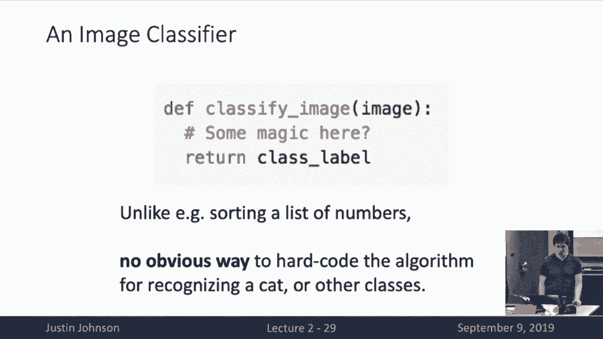
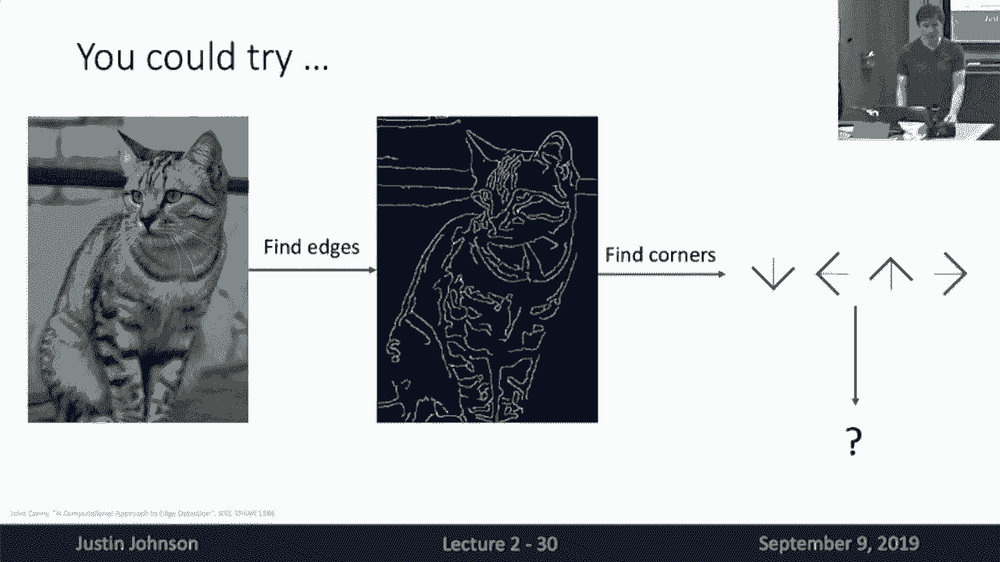
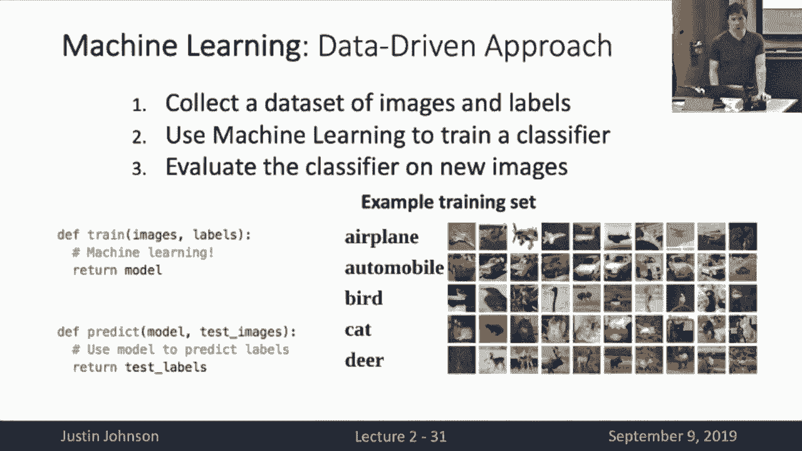
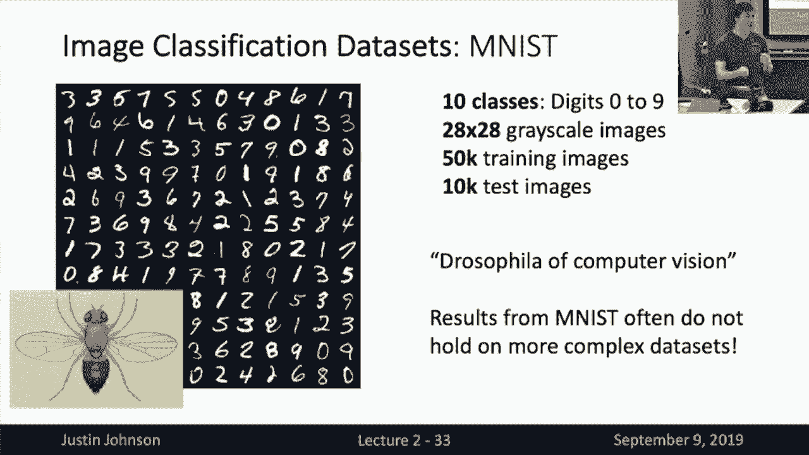
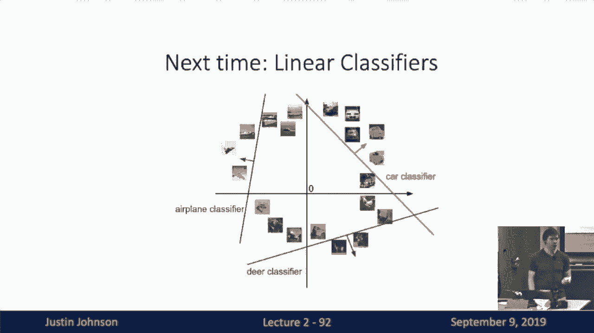

# 【双语字幕+资料下载】CS231n进阶课 ｜ 深度学习与计算机视觉(2019·全22讲) - P2：L2- 图像分类 - ShowMeAI - BV13P4y1t7gM

so welcome back to GE cs4 9800 7/5 9800，so welcome back to GE cs4 9800 7/5 9800。

v welcome back this is now lecture 2 so，remember last time we talked about a。

historical overview of the fields of，computer vision and of deep learning and。

machine learning and now starting this，lecture we're going to talk about image。

classification and we're gonna start，diving into the technical material of。

the course and today we'll see our first，learning algorithm so today we're going。

to talk about image classification so，image classification is really a really。

important core task in computer vision，and really machine learning more broadly。

so image classification is really quite，a simple task to state so what we do is。

our algorithm is going to take as input，an image on the left and then the output。

is the algorithm needs to assign a，category label to that input image so。

when we talk about image classification，we typically have some fixed set of。

category labels in mind but the，algorithm is aware of so in this example。

maybe the algorithm is aware of these，five labels cat bird deer dog and truck。

and the and the during the as the，algorithm performs image classification。

what it needs to do is simply assign one，of these five labels to the image that。

it sees in this case is cat so for all，of us this is a really trivial task。

right you can do this almost without，thinking about it you just immediately。

know that this is a cat when you look at，the image but for the computer that's。

not so easy and the main challenge in，image recognition and image。

classification when we try to do it on，machines is this problem we call the。

semantic gap so for us when we look at，this image we immediately recognize that。

as a cat we get these perceptions of all，these photons run and they hit our。

retina they go through our brain they go，through a lot of complex processing but。

we're not really aware of that，consciously when we look at these images。

instead we just kind of intuitively know，what we see but the computer doesn't。

have that kind of intuition so when the，computer looks at such an image what all。

it gets is a giant - tomato is a giant，grid of numbers so first for an image。

like this the it's just a giant grid of，800 by 600 by 3 numbers where at each。

pixel we have a single call，value represented with three three。

numbers between 0 and 255 so the problem，is that if you look at these grid of。

numbers it's really not obvious at all，that this number that this grid of。

numbers should represent a cat and，there's no obvious way to convert this。

grid of this this grid of raw pixel，values into this semantically mean a。

meaningful category label of cat and，what's even worse is that this entire。

grid of numbers can change drastically，as we make relatively unassuming changes。

to the image so for example if you were，to imagine if you if we were to imagine。

changing the viewpoint of this image，maybe if we were to take an image of a。

photograph of this exact same cat from，just a slightly different angle then to。

all of us we would probably recognize it，definitely would still recognize it as a。

cat for sure and we would probably still，recognize it as this exact same cat。

because we could recognize the markings，on its face and whatnot but the problem。

is that due to this this semantic gap，this difference between what we。

understand when we look at images and，what they and what is represented in。

this raw grid of pixel values that if we，were to make even a simple change this。

image like photographing from a slightly，different angle all of the pixel values。

would change in a very unintuitive way，and it's and we somehow need to be able。

to design algorithms that are robust to，these massive changes in the raw pixel。

values that can arise from relatively，simple changes to the images themselves。

so there's a lot more we need to deal，with beyond viewpoint variation in order。

to perform image classification we also，need to deal with things like intra。

class variation so if we look at，different images different different。

cats all look very different and each of，these different adorable cats all。

produces very different grids of pixel，values on the raw sensor of the camera。

so we somehow need to build our systems，that are robust to these massive。

variations that can occur within，categories so there's another problem。

which is sometimes we want to recognize，fine grained categories so so far we've。

talked about recognizing maybe cats，versus dogs verse trucks but depending。

on the task at hand we might want to，recognize different categories that。

appear very visually similar so for，example if we were to try if we we might。

want to recognize different breeds of，cats in some applications so he。

we have different categories that appear，very visually similar and this is gonna。

this is again a huge practical problem，and it's not clear at all how to write。

algorithms that are robust image to，changes in image pixels in this way we。

also need to we need our algorithms to，be robust to background clutter so。

sometimes the objects in the image that，we want to recognize somehow blend into。

the background maybe due to natural，camouflage or other sorts of crazy。

things going on in the scene we need our，we need our classifiers to be robust to。

illumination change as we change the，lighting conditions in the scene turn on。

and turn off lights take pictures in the，dark take pictures in the daylight the。

underlying semantics of the image of the，objects in the images do not change so。

our algorithm should be robust these，massive changes in different lighting。

conditions so our algorithms need to，deal with information so the objects。

that and maybe cats are particularly，deformable object categories but we need。

to be but but sometimes the the objects，that we want to recognize in images。

might appear in very different view very，different poses very different position。

positions in the image we might somehow，need to deal with occlusion so sometimes。

the object that we want to recognize in，the image might not be visible hardly at。

all and I think this example on the，right is really interesting right this。

is basically a couch and we see a tail，sticking out from underneath the couch。

cushion now you probably intuitively，thought that that was a cat right。

because we've seen a lot of images of，cats because you know that cats usually。

live in houses because you know that，maybe cats like to burrow down under。

things sometimes but actually if you，think about the evidence in the raw。

image evidence of this image we don't，even know that this is a cat this could。

be a raccoon this could be some other，kind of a crazy animal with a tail right。

so somehow even this is relatively，simple problem of giving category labels。

to objects and images can involve a lot，of common-sense reasoning about the。

world your knowledge that cats live in，houses and raccoons are unlikely to live。

under cushions of couches right so even，this relatively unassuming problem of。

classifying images becomes very，challenging very quickly if we want to，recognize the full breadth of。

Boreas that exist in the world and all，the variations and positions and。

appearances and changes in ways of those，objects and appear in images around in。

the world so if we were if we were，somehow able to overcome all of these。

problems and write down algorithms that，could perform robust image。

classification and recognize lots of，aaja categories and lock them in lots of。

different situations it would be really，really useful so we already saw in the。

last lecture how some applications of，computer vision can unlock may be many。

different scientific questions so we，could use image classification for。

things like medical imaging medical，diagnosis maybe we could take pictures。

of skin lesions and diagnose them as，malignant or non malignant tumors maybe。

we could take pictures of x-rays and try，to classify what types of problems could。

exist in medical images on this case the，robust image classification could be。

useful for astronomers who want to go，out and collect visual data of from。

telescopes and other types of sensors，and then classify what types of。

phenomenon are out there in the sky，these could also be useful for many。

other scientific applications like maybe，recognizing whales or categorizing many。

different types of animals that could，appear in sensors so image。

classification on its own is this really，really useful problem and if we could。

solve it it can unlock a lot of really，powerful and useful applications but。

what I think is possibly even more，interesting and maybe less intuitive is。

that image classification is also a，fundamental building block of different。

algorithms we might want to perform，inside computer vision so as an example。

so far we've talked about image，classification so there's a related task。

in computer vision called object，detection so in object detection what we。

want to do is draw boxes around the，objects that in images and say not just。

what objects are present in the image，but where are they located in the image。

and it turns out that one that image，classification is itself a sub or a sub。

part that can be used to build up to，more complex applications like object。

detection so as an example one way to，perform object detection is via image。

classification of different sliding，windows in the image so one one way to，perform。

detection is to just classify different，sub-regions of the image so we could。

look at a sub reach sub region over here，and then classify it as background horse。

person car or truck in this case it's，classified as background because there。

there's no objects here if we were to，classify this box we should classify it。

as person etc etc so you can see that if，we had the ability to build really。

powerful image classifiers that would，again let us build other applications。

like object detectors even something，like image captioning is often framed as。

a classification as an image，classification problem so here the idea。

is that given an input image we might，want to write a natural language。

sentence to describe what is in the，image and here this can be framed as a。

sequence of classification problems just，as in the object detection case so here。

we've got maybe some fixed vocabulary of，words in English language at the club。

that the algorithm is aware of and the，question is what word should I say next。

and this is again a classification，problem so then first we would classify。

and select this word man using an image，classifier maybe select the word writing。

select the word horse and then select，the word stop to me know that's the end。

of the sentence so you can see that，image so even maybe another even work we。

did even slightly more outlandish，application is playing computer games，like go。

so people have built AI systems that can，learn to play go and even outperform。

many of the best human experts in the，world and this is basically a，classification problem too。

here the input is now an image where the，pic each pixel of the image describes。

the state of the game board at some，position and now the output is a。

classification problem about which，position on the board should I place my。

next stone on so you can see that，throughout these different applications。

this relatively unassuming problem of，image classification is a really really。

powerful building block that we can use，to build up to many months to many more。

interesting problems in computer vision，so given all of that we we really want。

people to write algorithms that can，perform image classification really well。

but it's really not obvious at all how，we should do this right if you were to，just sit down。

your computer and start typing code you，need to write this class this magical。

Python function that's going to input，this giant grid of pixel values perform。

some magical computation and then，somehow spit out cat or place the gold。

piece at position five nine or this this，piece of image is or is not a piece of。

background and it's really not obvious，at all，what code you should type here right。

because unlike for something like，sorting a list of integers there's。

really no well-defined algorithm for how，to convert grids of numbers into caps so。

we need to do something so it's really，not not clear at all how we should。

approach this problem so one thing you，might do is maybe just try to use your。

own human knowledge about what cats and，other objects look like in order to hand。

code classifiers that try to pick out。

different object categories so one thing，you might imagine doing is you know we。

talked in the last lecture about how，edges in images are really important so。

maybe what we could try to do is first，take the image and then convert it and。

then extract edges using some kind of，edge detection algorithm and then maybe。

you try to find corners or other types，of interpretable patterns in those edges。

right you know that may be cats of，triangular pointy ears and you should。

hope that those ears come out in the，edges so maybe you could kind of look。

for corners and then draw out right，rules about what angles cat's ears are。

allowed to be maybe cats are supposed to，have whiskers in different positions。

maybe the whiskers would come out and，edges so you could imagine maybe like。

really trying to go in there and a hard，code all your own human knowledge about。

what cats look like and try to write，down some explicit algorithm for。

detecting them but this is not a very，good approach right it's going to be。

brittle there's going to be a cat's，without whiskers or cats without pointy。

ears or sometimes the edge detector will，fail and won't give you when they won't。

detect the edges that you wanted it to，and maybe you spend a lot of time trying。

to figure out all those corner cases for，cats but now tomorrow we want to。

classify galaxies and probably all of，the hard work that you put into your。

algorithm for that for recognizing cats，from images it's going to be completely。

thrown away tomorrow when we want to，recognize galaxies instead so we really，want some。

that is more robust some approach which，is more scalable and some approach which。

doesn't require us to write down all of，our own human knowledge about what。

different types of objects look like so，here's where we come to machine learning。

right so the idea is that rather than，trying to explicitly encode our own。

human knowledge about what different，types of objects look like instead we're。

going to take a data-driven approach and，have algorithms that can learn from data。

how to recognize different types of，objects in images so the basic pipeline。

for this machine learning system that，we're going to build is that first we。

want to collect a large data set of，images and label them with the types of。

labels we want our algorithm to predict，right so maybe if we want to build a cat，that a cat vs。

 dog detector we need to，go out and collect a lot of images of。

cats and dogs and hot dogs and not hot，dogs and then class and then and then go。

and collect human labels for which，images or cats and dogs and hot dogs and。

whatnot and then once we collect this，large data set we're going to deploy。

some kind of machine learning algorithm，which we'll try to learn statistical。

dependencies between the input images，and the data set and the output labels。

that we you that we wrote down during，the data collection process so then once。

we do and then once we've used our image，our machine learning algorithm to。

extract these statistical dependencies，we can then evaluate this classifier on。

new images so what this looks so then，basically instead of writing this single。

monolithic function called classify，image instead we have this really two。

piece API one is this we need to write，one function called train which is going。

to input us now a collection of images，and their associated labels it's going。

to perform some magical machine learning，and then it's going to return some。

statistical model then our second piece，of API is this predict function which。

going which is going to input the model，that we produced during the training。

phase as well as new images on which to，evaluate that model this will run the。

model on the new images and then spit，out the labels as they have been learned。

from the training set so what's really，interesting about this approach is that。

it's kind of a different way to program，computers right when，think about writing algorithms to sort。

images - sorry - sort numbers and lists，or perform other kinds of classical。

algorithms you're basically using your，own human knowledge to tell the computer。

exactly what steps it needs to perform，in order to produce the output that you。

want it to produce but now when we take，a data-driven machine learning approach。

instead what we're basically doing is，programming the computer via the data。

that we feed it in and now if we want to，program the computer to recognize cats。

we feed it in images of cats if we want，to tomorrow，use with then tomorrow if we want to。

recognize galaxies instead which all we，need to do is collect a new data set of。

galaxies we don't need to recode our，machine learning algorithm hopefully and。

instead we can just feed a new data and，then change the behavior of the program。

so now this is a really powerful，paradigm for a lot of problems where we。

don't know how to write down an explicit，programs to solve them so this is the。

approach that will be taking through so，this this has become the dominant。

approach for basically all visual，recognition problems image，classification included so now that。

we've sort of settled on this machine，learning data-driven approach to。

recognize images we need to talk about，sources of data right so there's a。

couple comment image classification data，sets that you'll tend to come across so。

one of the most common is the Emnes data，set so Amnesty has ten cat ten classes。

digits 0 to 9 the images are 28 by 28，pixels grayscale images so they're very，tiny it gives us 50。

000 training images，and 10，000 test images so if you'll，recall in the last lecture we talked。

about how convolutional neural networks，were developed in the 80s and 90s and。

and deployed in commercial products in，order to read check handwritten digits，on checks。

well this MMS dataset was really used，for that industrial application of。

recognizing handwritten digits on，cheques and was deployed out there in。

the world so even though this seems like，kind of a toy dataset it really has a。

lot of rich history behind it and and，has been very useful in the development。

of many machine learning algorithms but，that said the end this data set has。

sometimes been called the Drosophila of，computer vision so you know that。

biologists often will go in for，form a lot of initial experiments on。

fruit flies and then they could have，work up to more interesting animals as。

they make their discoveries and this is，really this is really similar to the way。

that a lot of practitioners work on em，mist so em missed because it's。

relatively small and simple data set，it's very quick to try out new ideas on。

this data set but you have to be really。

careful when you're reading papers that，only show results on a mist because it's。

very very common that may be I mean，basically everything works on that mist。

right you can write down sort of any，reasonable machine learning algorithm。

will get very high performance on the，end mist so this is treated really as。

sort of a proof of concept but just，getting something to work here isn't。

really enough to impress people anymore，so instead another data set that you'll。

see very commonly used is see part n so，see part n has is again very small。

images 32 by 32 but their color rather，things rather than greyscale and now。

rather than handwritten digits the，categories are much more interesting。

their airplanes automobiles birds cats，deer you can read it on the slide and。

this is a fairly decently sized data set，50，000 training 10，000 tests and this is。

a and even though it's relatively small，compared to other large-scale data sets。

it's it's reasonably challenging since，these categories are reasonably。

difficult to recognize so as a result，we'll be using the C for 10 data set for。

most of the homework assignments，throughout the semester so see if our 10。

has a cousin called C 400 that's，basically similar statistics except。

we've got a hundred categories rather，than ten so I think people use C 500 a。

little bit less than C far 10 but you'll，sometimes see people working on this and。

it's nice to be aware of it so another，super so we talked last lecture of it。

about the image net data set and this，has become something of the gold。

standard for image classification，datasets so basically when you try to。

submit a research paper that proposes，some new tweak to an image。

classification algorithm if you don't，show results on image net reviewers will。

probably complain and your paper will，probably be rejected，so it's consist so image pet is really。

considered a super important data set to，benchmark image classification。

algorithms these days so image net is，very interesting barry chow。

because it contains a thousand different，categories this is much much more than。

the ten categories in CPR or earnest and，it's all and it's very very large so，we've got about 1。

3 million training，images with about 1，300 exam 1，300，training images per category and it，sets。

now one ôs yeah question yeah so that，was the question was how big are the。

images in image net well the the issue，is that image net images were sort of。

downloaded from the web's they actually，different resolution quite a lot but in。

but for most practical applications，people resize them to either 256 by 256。

or sometimes 2 to 4 by 2 to 4 when，training on those images so one。

interesting bit about image net is that，the is the the accuracy metric metric。

that people report here so because，there's a thousand different categories。

on image net it's very on it's very，difficult and possibly unreasonable to。

expect algorithms to pick out the exact，one correct category especially because。

you know some of the neat labels are a，little bit noisy anyway so what people。

do in practice here is have the，algorithm predict 5 category labels and。

then we count the algorithm as having，made its credit made a correct。

prediction if the correct category is in，any one of those five predictions so。

that's just a little bit of nuance to，the way image net is typically evaluated。

so there's so those are kind of the the，most standard image classification data。

sets that you'll see out there another，interesting one is MIT places so this so。

image net images tend to focus on，objects like cats and dogs and fish and。

trucks and things like that so there's，another related data set that tries to。

focus on scene categories like，classrooms and fields and buildings and。

things like that so it's nice to be，aware of now one thing that's really。

interesting is to try to compare these，classification data sets in terms of。

their size so here this is the number of，pixels in the training set for these。

different data sets and this is assuming，256 256 for imagenet in places and what。

you'll note here is the y-axis is on a，log scale so some so you'll see that CFR。

is maybe about an order of magnets，ref lee an order of magnitude bigger。

than m nest image net is roughly two，orders of magnitude bigger than c far。

and then places is yet another order of，magnitude，than imagenet so this kind of drives。

home the point about why imagenet is，somehow a qualitatively different data。

set than these other ones that you'll，see people work on sometimes so that。

makes results on imagenet much more，convincing but unfortunately very。

computationally expensive to work with，sometimes so as a result we're kind of。

sticking with CFR is kind of a sweet，middle ground in this course that kind。

of splits the difference between the，complexities of the visual recognition。

tasks that show up an image net and the，computational affordability of smaller。

data sets like a mist so what's also，interesting to see from this chart is。

this increasing trend of datasets，getting bigger and bigger and bigger。

over time so that's definitely so that's，definitely one interesting direction for。

research how can we use they ever bigger，and bigger data sets to enhance the。

abilities of our algorithms to perform，robust classification but people have。

also started thinking in the other，direction as well so one interesting。

data set to be aware of there is the，Omniglot data set so here Omniglot kind。

of pushes things to the extreme，and wants to benchmark the ability of。

algorithms to learn with relatively，little data so on omni Glatt we've got，more than 1。

600 different categories，each of these categories is a letter in，some alphabet from some language。

somewhere on earth so they've got，letters from more than fifth so from 50。

different alphabets of different written，languages and the really interesting。

thing about Omniglot is that rather than，giving you tons and tons of examples of。

each image of each category it only，gives you 20 examples for each of these。

letters and somehow the challenge is to，build algorithms that can really that。

can learn very robustly from relatively，few examples of each image category so。

this this social this so-called low shot，classification problem is a really huge。

and emerging key area of research where，a lot of researchers are starting to。

think about these days so now that we so，now that we've talked about some of the。

common data sets that you'll run into，for image classification it's time to。

think about our first classification，far，you need some algorithm to actually make。

use of that data so I really so，first algorithm the first learning。

algorithm that we're going to talk about，is nearest neighbor and this one is so。

simple it might not even deserve the，name of a learning algorithm right so。

what it does is remember I told you that，when we implement a machine learning。

system we need to implement these two，functions one called train and one。

called predict well for nearest neighbor，the train function is trivial we're。

simply going to memorize all the，training data we're not gonna send that。

we're not going to process it we're not，going to do anything with it we're just。

going to memorize all of our training，data and now in the predict in the。

predict side what we're going to do is，take our new image that we want to。

predict a label for compare it to each，one of our images in the training set。

using some kind of comparison or，similarity function and now we're going。

to keep track of the most similar image，in the training set to our test image。

and now we're so going to simply return，the label of the most similar training。

image so this is like I said very very，simple straightforward learning。

algorithm and it only learns in the，sense that it kind of memorizes the。

training data but in order to implement，this algorithm we need to actually write。

down some function that can compute the，similarity between two input images so。

some very common choice so basically we，need to write down some kind of distance。

distance metric which can input a pair，of images and then spit out some number。

representing how semantically similar，are those two pairs of images in order。

to perform this nearest neighbor，classification so one very common choice。

of this distance metric is a very simple，one just use the l1 or Manhattan。

distance between the pixels of images so，here what we're going to do is take our。

test image here we're imagining a very，simple four by four by four test image。

that we've written down the values of，all of them all of its pixels explicitly。

and to compare it to a training image we，simply sum we take simply take the。

absolute value of the differences，between all the corresponding pixels in。

the two images and then sum up all of，these absolute values of all the。

differences in the corresponding pixels，and that gives us a single number。

representing two different the the the，distance or difference between those two，images so。

one thing to point out here is that you，know if we've this kind of satisfies all。

the normal rules for a metric from from，from mathematics right so if we've got。

two images that are exactly the same，we'll have a distance of zero things。

like a triangle inequality are satisfied，this is a reasonably well mathematically。

defined metric so now basically with，these couple bits of information we this。

that's enough to implement your first，learning algorithm and indeed the。

nearest neighbor classifier is such a，simple and straightforward algorithm。

that we can fit a full implementation on，a slide and I think people can with even。

with some comments and even better I，think you might even be able to read it。

so here in our nearest neighbor，classifier I told you we need to。

implement two things one is this train，step which is trivial here we just。

memorize the training data see we assign，the images X and their labels Y to some。

number of variables of our class then in，the predict we have is again very simple。

we take some new images some new test，images X we simply iterate all over all。

the images in the training set compute，this l1 distance and then return the。

label of the most similar image so，that's it that's nearest neighbor you。

can now implement your own machine，learning systems so a couple questions。

so with this nearest neighbor classifier，suppose we have a training set of n。

examples then how fast is training no no，it seems tricky well I guess it kind of。

depends on your copy semantics but I，would say that this is maybe constant。

time training if we're just going to，store pointers to all of the training。

dates all the training data and that，could be done in constant time if you。

were to make a deep copy that maybe be，linear time but let's not do that so。

then the question is again with n n with，n examples how fast is testing going to。

be well this one's going to be linear，time right because kind of folding the。

size of the image and computation of nor，of the norm we're going to call that a。

constant which means that now for every，testing example we need to compare it to。

each of the n training examples which，means that compare that at test time。

we're going to pay a performance penalty，that's linear in the size of the，training set。

now this is actually really bad this is，like really really really bad this is。

actually the opposite of what we want，from machine learning systems right。

because if you think about how we want，to deploy a machine learning system what。

we want to do is somehow collect as much，data as we possibly can about our task。

at hand and then maybe use this large，amount of data and train a big powerful。

model and it's okay of training that，model takes a long long time but when we。

finally deploy that model and actually，use that model at test time we'd like it。

to be very fast we'd like to be able to，run these models maybe on your mobile。

phone in real time we'd like to run it，for millions or billions of users on the。

web for all photos that are getting run，around on the internet so somehow this。

is the exact opposite characteristics of，what we'd usually like for in a machine。

learning system and we'll see that as we，move to neural network based approaches。

we'll see that they kind of invert this，this this bit of hierarchy and these。

neural network systems that we'll end up，using will be relatively long to train。

but then relatively fast at inference，time so of course I also need to point。

out that sort of for completeness that，there are many amount that many。

interesting algorithms for computing，approximate nearest neighbors and when。

you perform approximate nearest neighbor，computation this can be done maybe much。

more faster than these full brute-force，approaches and these are kind of beyond。

the scope of this class but it's nice to，be aware of in case you find yourself in。

a situation where you really really need，to perform some large-scale nearest。

neighbor search for some reason so now，once we've got this this image this this。

idea of nearest neighbor classification，we can think about how does it actually。

perform on images so here what we're，showing is the results of nearest。

neighbor classification on the C part n，dataset so here on the Left column we're。

seeing a bunch of test example a bunch，of examples from the C part n test set。

and then along each row we're seeing the，nearest neighbors from the training set。

to each of those test examples and，because as you might assume as is sort。

of intuitive because we're computing the，distance between met between images by。

literally comparing the values of their，pixels the nearest neighbors tend to be。

images that look very visually similar，right so if you look at maybe the third。

row you've got this orange blob in the，look，the row you see other images the nearest。

the nearest neighbors that we retrieve，are kind of things that have maybe。

orange or reddish blobs in the middle，and then kind of a green or brownish。

background so this nearest this this l1，distance that we're using to compute。

nearest neighbors is really not very，smart and it doesn't know much about。

what it's looking at and we can kind of，look we can kind of get a sense for。

maybe how poorly this might perform if，we look at which of these one nearest。

neighbors are correct or incorrect so，it's kind of tough to actually tell what。

these images are sometimes just by，looking at them because they're。

relatively low resolution but what I've，tried to do is draw red boxes around the。

one nearest neighbors that are incorrect，and green boxes are on the one nearest。

neighbors that are correct and this，gives you a sense that even though。

images can look very visually similar as，measured by this l1 depth this distance。

they actually can sometimes have very，different semantic meanings so this is。

clear maybe in the fourth row when you，see this kind of or this kind of brown。

blob surrounded by a white background I，think it's a frog right I think it's a。

frog actually for the for the test image，but then its nearest neighbor is。

actually a cat so then the cat is also a，brown blob on a white background but so。

it looks very visually similar by this，l1 by this l1 metric but the label is。

different so it would be to the R we，would make an incorrect classification。

on this on this thing so this is one way，to think to sort of get an intuitive。

understanding for what a nearest，neighbor classifier is doing another way。

to think about nearest neighbor，classifiers，is through this notion of decision。

boundaries that we can see in this plot，that needs a bit of unpacking so what。

we're showing here is we're imagining，performing a nearest neighbor。

classification over images over images，with two pixels so then the x axis here。

is the maybe the value the intensity，value of one of our pixels and the y。

axis here is the intensity value of，another of our pixels and now each of。

these dots each of these colored dots，that we're seeing are examples of。

training images where the color of the，dot maybe represents the category of the。

of the training image so maybe red dots，are cats and blue dots are dogs and so。

on and so forth and now the color of the，background region represents the。

category label that would be assigned to，that point in space，we were to have if we were to run the。

test if you were to run nearest-neighbor，classification for one of those test。

images so for example in this red X here，we can see that the nearest neighbor to。

the the nearest neighbor in the training，set is maybe this this this red dot here。

which means that if we were to perform，nearest neighbor classification for this。

red X we would predict this we would，predict the red category so then what's。

interesting to look at here is the，decision boundaries between different。

categories so here we've drawn out this，this region in space that carves up。

between regions and space that would be，classified as green and regions in space。

that would be classified as purple and，when we look at the nearest neighbor。

classifier in this way we can recognize，a couple interesting things one is that。

these decision regions can be very very，noisy and are subject to outliers so for。

example we see that in our training set，we've got this one yellow point kind of。

sitting out in the middle of a whole，bunch of green points and maybe that's。

noise maybe actually it should have been，labeled as green instead of yellow it's。

kind of hard to say but when we use this，nearest neighbor classifier the presence。

of a single yellow point in this cloud，of green is going to cause a bunch of。

test examples around that yellow point，to be classified as yellow maybe that's。

good maybe that's bad we can also see，over here on the left side of the screen。

we've got this kind of jagged，discouraged decision boundary between。

the red class and the blue class and，maybe and again this is because this。

relying on only the nearest neighbor to，perform the classification can be a bit。

noisy so the question is what might，maybe what might we be able to do to。

kind of smooth out these decision，boundaries and maybe give us a more。

robust to the classification so one idea，is to simply use more neighbors so so。

far we've talked about the nearest，neighbor classifier as simply parroting。

out the label that has attached to the，nearest training example to each test。

example but what we can do instead is，use more than just that one nearest。

neighbor instead we can consider some，set of K nearest neighbors and then take。

maybe a would and then imagine some way，of combining the the category labels of。

each of our K nearest retrieval with，nearest retrieved results so one there's，many different ways。

you might imagine doing this but one，simple idea is to simply take a majority。

vote among all the category labels of，each of our K nearest neighbors so then。

it's kind of interesting so then once，this this this picture of the nearest。

neighbor classifier using decision，boundaries lets us see some the。

difference between k equals 1 and k，equals 3 so one is that our decision。

boundaries got a lot smoother so you can，see that when we use k equals 1。

recall that our decision boundaries were，very noisy as a result of only using 1。

neighbor and now as we if we use 3，neighbors instead to perform a。

classification on the same data set we，can see we've smoothed out the decision。

boundary between these two categories，quite a lot we can also see that we've。

this has helped to reduce the effect of，outliers on our classification。

performance so now even though we still，have this one yellow point hanging out。

in a cloud of green it no longer affects，it no longer results in this yellow。

classification region and similarly this，region between red and blue has somehow。

got a little bit smoothed out by using，more than one nearest neighbor but。

there's another problem which is that，when K is greater than 1 there might be。

ties between classes so in this，visualization with these white regions。

all have three nearest neighbors that，are better all of different categories。

so somehow you need those you need some，mechanism for breaking ties and maybe。

you could have you can imagine maybe，having some heuristic then based on the。

distance maybe you back off and use the，one nearest neighbor result there's。

different heuristics you might imagine，in this situation so another thing。

another thing that we might want to，change or play around with as we when we。

do the nearest neighbor classifier is，changing the distance metric that we use。

to compute similarity between images so，so far we've talked about using this l1。

distance between images which recall was，the app the sum of the absolute，differences between all the。

corresponding pixels and the two images，another common choice is the l2 or。

Euclidean distance between the images，between the pixels of the image so this。

has the effect of you know taking，basically what we're doing here is。

taking the the pixels of the image，stretching it onto a long vector then。

imagine computing the Euclidean distance，between points in a high dimensional。

space for those two images and what's，interesting is if we flip back to this，this。

picture of nearest neighbors using，decision boundaries you can see that as。

we use different distance metrics we get，sort of qualitatively different。

properties in the decision boundaries，that arise so I'll kind of leave this as。

an exercise to the reader but with l1，classification we can see that all of。

the decision boundaries between，categories are all composed of access。

aligned chunks they're either vertical，line segments horizontal line segments。

or vertical lines or 45-degree angle，line segments but when we use the l2 or。

Euclidean distance class if we use the，Euclidean distance instead to compute。

nearest neighbors then now our decision，boundaries are still piecewise linear。

but those lines can appear at any，orientation in the input in the input so。

somehow using different distance using，different distance metrics somehow is a。

way that you as the human as the as the，human expert can imbue some of your own。

human knowledge into the structure that，you want the algorithm to take account。

of so it's a little bit unclear maybe，for whether l1 or l2 whether that's。

going to make big differences it's sort，of not really intuitively clear what。

semantic differences in l1 versus an l2，distance the metric is going to be is。

going to result in for the case of image，classification but what's really。

interesting about the K nearest neighbor，algorithm is that basically if we choose。

different types of distance metrics we，can imagine applying K nearest neighbors。

just about any type of data imaginable，so so far we've talked about these kind。

of using traditional maybe vector norms，for a back door vector a vector metrics。

to compute distances between points but，you can imagine using very strange or。

interesting types of data and writing，down very sophisticated distance。

functions between them in order to，perform nearest neighbor classification。

on many different types of data sets so，one example here is comparing research。

papers um so there's this cool site，called archive sanity that lets you go。

and and kind of have some interesting，exploration around around research。

papers that are coming out each day and，one interesting feature of this date of。

this website is that lets you show so，papers that are similar to another paper。

so here I looked up on archived sanity a，paper that I wrote last year called，measure R CNN。

and then if we click show similar then，what this does is basically does。

nearest-neighbor retrieval on these PDF，on these PDF files and the way that it。

does that is by using an interesting，distance metric so the distance metric。

here is called tf-idf similarity that's，a term frequency inverse document。

frequency that's very commonly used in a，lot of NLP applications that I won't。

tell you how it works but it's just kind，of a distance metric that works on。

pieces of text that encodes human，knowledge about the the frequency that。

words appear in different documents and，what's interesting is that doing。

nearest-neighbor retrieval I'm using，this tf-idf metric on research papers。

actually gives really good results so if，I look at if we look at the four nearest。

neighbors to my own most recent paper，then we see these four papers they don't。

they're meaningless to you but actually，three of these were like things that we。

directly compared against and cited and，like really try it hard to make sure we。

beat them in order to get our paper but，interestingly the nearest neighbor here。

is something that we didn't cite so we，should I should maybe go back and read。

that one but the point here is that the，nearest neighbor algorithm even though。

it seems relatively simple can be fairly，powerful and can be applied to fairly。

robust and different types of data as，you change the way that you compute。

distance between between elements so，this is also a bit of fun a couple years。

ago I wrote this interactive web demo in，JavaScript but lets you kind of produce。

these visualizations for nearest，neighbor so you can go on this link and。

play around with this you can，interactively drag points around and see。

the decision boundaries move you can，change the number of categories you can。

change the number of training points you，can change the number or the value of K。

for the nearest neighbors that we use，and you can try to flip back and forth。

between l1 and l2 metrics to try to get，a sense of qualitatively what all these。

choices do and how they change the，decision boundaries of your K&N。

classifier so coding this thing off was，like two days in my life so I really。

hope someone looks at it some time so I，think this can be a useful tool to help。

you gain a little bit of intuition into，what this cannon house fire is doing so。

by now we've seen a couple different，choices that we have to make when。

performing when doing this cannon，classification，we've seen that apart from the training。

data we need to choose a value of K that，is how many different neighbors are。

going to consider when doing this，algorithm we've also seen we need to。

choose the distance metric should we use，l1 l2 should we try to cook something up。

that incorporates our own domain，knowledge and it's not really clear how。

we should set these for different，problems so these choices of K and of。

the distance metric are examples of what，we call hyper parameters so a hyper。

parameter is a choice that we need to，make in our learning algorithm that we。

cannot necessarily learn directly from，the training data because they somehow。

interact with the way the algorithm，works in a deep fundamental way so these。

hyper parameters we can't really set，them directly through learning so we。

need some other mechanism to choose，which values of hyper parameters are。

going to work best on our data and，unfortunately there's not a lot of great。

ways in practice to choose hyper，parameters the kind of simplest approach。

is that they're very problem dependent，so we basically need to try out。

different values and see whatever is，going to work best for our data and our。

task but there's some nuance here in，what exactly we mean by try out。

different values and what exactly I mean，by decide which one works best so here's。

a couple ideas for how we might try to，go about setting hyper parameters so。

idea number one would be maybe we should，select the values of hyper parameters。

that will cause our learning algorithm，to give us the highest accuracy on our。

training set this seems reasonable right，do we want we want our algorithm to do。

well we have a training set training set，is met for training we need to suite and。

then maybe we should just set the hyper，parameters to give us the best。

performance on the training set so even，though this seems reasonable it's，actually a terrible idea。

like never do this just like simply，never do this so the reason is this this。

can lead you very very far astray so in，a concrete example for K nearest。

neighbor classification if you were to，try to set hyper parameters by。

maximizing accuracy on the training set，you would always choose K equals 1 right。

because imagine what happens if you use，the training use actually use a training。

point in the K&N classifier if you use K，equals 1 it will try to find the nearest，it will。

always return the correct label so canon，classifier with k equals one always gets。

100% on the training set but as we've，seen some these qualitative examples。

that probably intuitively is not correct，because we've seen how maybe smoothing。

out the setting higher values of K can，maybe cause decision boundaries to be。

smoothed out and we that actually might，be the correct thing to do for some。

problems but we'll never get to know，that for looking at the training set。

accuracy only so instead better idea is，idea number two maybe what we need to do。

is split our data set into two，components one we're going to maybe。

reserve something like 90% of our data，set and called up the training set and。

then reserve maybe 10% of our data and，call it the test set because again，algorithm is，algorithm is。

learn that learn the learning algorithm，algorithm to learn from the training set。

and then see what the accuracy is on the，test set and then as we vary the values。

of the hyper parameters we'll choose the，values of the hyper parameters that work。

the best on the test set now this is，more reasonable because the point of。

machine learning out the point of using，machine learning algorithms overall is。

to generalize to unseen data we don't，care about performance on the training。

set because we already have those labels，in our data set we care about the。

performance on unseen data and somehow，this approach gives us some estimate of。

our algorithms performance on data that，it had not seen during training question。

so basically you're absolutely correct，and even though I told you this seems，very reasonable。

it seems very logical this is wrong and，you should not do this this is actually。

again equally as bad as training on the，training set if you do this you will。

have you will draw incorrect conclusions，about the performance of your learning。

algorithm because basically what we've，done in this approach is a different way。

of learning on the test set right，because once you look at the test set。

your algorithm is polluted with，knowledge of that test set and if you。

are using the test set in any way to，make decisions about your learning。

algorithm then you're cheating because，again that then it pollutes your idea of。

how well that algorithm is，we're going to perform on unseen data。

because once you use the test set to set，values of your hyper parameters the test。

set is no longer unseen data and you no，longer have any estimate you no longer。

have any idea about how your algorithm，is actually going to perform when you。

deploy it out there in the wild and run，it on new images that did not appear in。

your data set at all so even though this，idea idea too seems logical and seems，plausible。

this is a fundamental cardinal sin in，machine learning models and if you do。

this you're making a fundamental error，when you in the way that you're。

preparing your model so a much better，approach is idea number three so here。

what we're going to do is split our data，now into three sets we're gonna have a。

training set that we use to train our，algorithm we're gonna have a validation。

set that we use to set the values of our，high parameters and then we'll reserve a。

test set to use only once at the very，very end now，so then basically what we do right is。

kind of this kind of similar is what we，did before right we trained our。

algorithm on the test set we tried，different values of hyper parameters we。

evaluate the performance of different，hyper parameter values by checking the。

accuracy on the validation set now and，now we select the value select the。

values of hyper parameters that have the，highest performance on the validation。

set and now once you've chosen those，hyper once you've chosen all the values。

for all of your hyper parameters once，you've fixed everything then only once。

at the very very end of your pipeline do，you ever touch the test set and then you。

touch it only once you run your，algorithm exactly once on the test set。

and that gives you a single number that，now gives you a very proper estimate of。

your algorithms performance on truly，unseen data so even though this is the。

correct thing to do it's actually，completely terrifying in practice right。

so when you do when you're writing a，research paper you've been working on。

this project for months you've been，working on this project for years and。

that entire time you've been tweaking，your algorithm you've been tuning it。

you've been lovingly trying to improve，it and throughout the entire process of。

developing your algorithm you as a good，machine learning practitioner have never。

touched the test set you've only，evaluated on evaluation on the。

validation set and then it's the week of，the deadline all of your hard work has。

finally come to fruition you it's，finally time to see how well your。

them actually does and then a week，before the deadline is the only time you。

should run it on the test set even，though this is terrifying，right Davian tuition you you it's right。

you think what if my number is bad what，if my entire life's work has been wasted。

on this algorithm well if it turns out，that well actually even this is the。

right way to solve that problem right so，if it turns out that you get a bad。

performance in the test set that means，your algorithm was bad and maybe it。

shouldn't be published so this is，actually this is very terrifying to work。

with in practice but this is the correct，way to do data hygiene and machine。

learning and projects have been sunk by，getting this wrong if you get this wrong。

you not only I mean you might get your，papers accepted but you'll be。

fundamentally dishonest about how well，your algorithm performs out there in the。

wild and that's actually the point of，building machine learning models at all。

so even though this is terrifying this，is the right thing to do and you should。

always do it when you're working on，machine learning problems so we said。

that idea 3 was better an idea 3 the，basic trick was to split our dataset。

into three chunks but we can do even，better why stop there，we can split our dataset into ever more。

chunks and get ever better estimates of，our generalization performance so that's。

that's idea number four called，cross-validation which is maybe even the。

best idea that we really should all be，doing so here the idea is we'll split。

our dataset into many many different，chunks called folds and now what we're。

going to do is iterate through them and，it and use and maybe in this example we。

have five folds so we'll try out five，different versions of our algorithm one。

that one that uses fold 5 as a，validation set and trains on folds 1。

through 4 one that uses full 4 as a，validation set and trains on folds 1 2 3。

5 etcetera etc and then what you can do，is then now you get a slightly more。

robust idea of how hyper parameters are，going to perform on unseen data because。

now you get maybe one sample per fold，for each setting of the hyper parameters。

and then maybe you select your best type，of parameters using the highest using。

some metric maybe the the the highest，accuracy across all folds something like。

that so this is a really this is，probably the most robust way to choose。

hyper parameters but it's fairly，because it requires actually training or。

algorithm on many different folds of the，data so for many so even though this is。

definitely the most correct thing you，can do in practice this doesn't。

typically get done in most machine，learning projects just because the。

training can be very expensive for many，of those models but if you're using。

smaller models or smaller data sets or，if you can afford if you can。

computationally afford to do it then，some kind of cross-validation is really。

the correct way to set hyper parameters，for your machine learning models so when。

you run cross-validation you end up，getting a plot like this so then here。

maybe on the x-axis is a value is，different values for one of our hyper。

parameters K and on the y-axis we see，it's in each dot is then one of the。

validation set performances for each of，those different trials of the algorithm。

that we've run so here's an example of，five fold cross validation on K and the。

line here maybe gives the mean across，all the folds for each setting of hyper。

parameters so then here we can see that，the the it maybe Peaks around K equals。

seven ish so based on this example of，cross-validation then k equals seven is。

the correct value to set for this type，of parameter then we should run our。

model so then once we set that value of，k equal seven we should then run our。

model exactly once on a test set and，that's the number we report for our。

algorithm so another interesting feature，of the K nearest neighbor algorithm is。

this property of universal approximation，so what's really interesting is that K。

nearest neighbor actually makes very few，assumptions but the types of functions。

that it can represent so in fact as we，take the number of training samples to。

infinity then K nearest neighbor can，actually represent any function of。

course any is here with a mathematical，asterisk because anytime you make。

statements like this people who've taken，a real analysis course will start。

pointing out all the corner cases where，it might fail so I've tried to cover my。

cover myself a little bit here but，basically for all practical algorithm。

after all practical functions you might，encounter in nature you can expect this。

to work quite well so as a kind of，intuitive example of how this universal，approximation property。

can work for k-nearest neighbors here's，an example of maybe doing a continuous。

valued prediction using a nearest，neighbor approach so here we maybe have。

a one pixel image so just a single skate，a single floating-point number is our。

input X and now we want to predict a，single floating-point number Y so then。

the blue curve here shows some，underlying true function that we want。

our machine learning model to learn but，we only have access to a finite number。

of data samples so here the black points，represent this finite number of samples。

from this underlying true function and，now the green curve represents the value。

of a came here of a one nearest neighbor，classifier one nearest neighbor。

regressor I guess in this case if we，were to use this finite training sample。

to approximate this underlying true，function using this finite sample using。

this finite number of training samples，and because it's a one nearest neighbor。

we have sort of has a flat constant，region around each of the training。

samples and areas and discontinuities，wherever it's exactly between two of the。

training samples now this example uses，only five points for training so the。

quality of our function approximation，here is quite bad but as we increase the。

number of training samples you're，doubling to 10 again doubling to 20 and。

now doubling and now going up again to，100 we can see that this one nearest。

neighbor classifier basically is doing a，very very good job at approximating this。

underlying function and you can imagine，we're not going to go through a formal。

proof here but kind of intuitively，speaking if you're able to kind of paper。

the space and kind of cover the entire，training space with all of your data。

points with enough data points then your，nearest neighbor algorithm your nearest。

neighbor classifier will actually learn，some arbitrarily correct approximation。

of a true underlying function so that，seems to be really good news right all。

right this nearest neighbor is maybe，this is the only learning algorithm we。

need right it can represent any function，all we need to do is collect a lot of。

data but there's a catch here and that，catch is called the curse of。

dimensionality so the problem is that in，order to get a kind of uniform coverage。

of the full space of a training set we，need a number of training samples which。

is exponential in the dimension，the underlying space so in the example。

from the previous slide our input space，was only one dimensional so then suppose。

that here maybe we don't need we，actually don't need that many training。

samples to get a relatively dense，coverage of a one dimensional space。

suppose we had a two dimensional space，and we wanted to achieve a similar。

density in our training samples over a，two dimensional space now we would need。

that now would now instead of meeting，for examples in this in this example we。

know it would need something like 4，squared training samples and as we move。

to three dimensions we would now need 4，to the Q 4 to the power of 3 training。

samples to again achieve a similar，density in in covering our space but。

also you think ok maybe this is ok we，need a lot of data sure but the。

Internet's really big right maybe，there's enough inner maybe there's。

enough images out there to cover the，space of all visual things we might care。

about and this would be very wrong to，assume right let's kind of put some。

numbers on this if we're imagining，relatively low resolution images。

something like CFR 10 images that are，only 32 by 32 pixels then the number of。

binary images that are 32 by 32 is 2 to，the power of 32 times 32 which is about。

10 to the 308 now that's a pretty big，number and to get a get a sense of just。

how big that number is realize that the，number of elementary particles in the。

visible universe is about 10 to the 97，what that means is that if we took our。

entire our visible universe and we put a，copy of our entire visible universe into。

every elementary particle in our，universe and if our universe was then。

again a copy our universe was yet，another elementary particle in some。

larger universe then every elementary，particle in this entire massive。

collection of universes would be the，same would be actually still less than。

the number of 32 by 32 binary images so，this is not going to work right we can。

never collect enough data to densely，cover the entire space of images because。

forget about 32 by 32 we want that we，want our algorithms to work on things。

that are much much higher dimension and，we don't care about just binary images。

we care about real-valued color in，so this is not gonna work and this is in。

fact one reason why in fact a nearest，neighbor algorithm even though nearest。

neighbors is this very nice algorithm to，think about in practice it's very rarely。

used on raw pixels so for a couple of，reasons one as we've seen it's very slow。

at test time yeah and that's kind of the，opposite of what we want from machine。

learning systems other is that the other，is just we it's very hungry for data and。

it's very difficult to get enough data，to cover the space of all possible。

images a third reason is that these，distance metrics on raw pixel values is。

just not very semantically meaningful so，as kind of a trivial example of this if。

we look at this original image on the，right on the left and compute the l2。

distance from the original image to each，of these three perturbed images will。

find that the l2 distance is the same，across all of these three pairs and this。

is not very intuitive right the middle，the this this shifted image for example。

to us appear is very very similar to，this original image on the left so you。

might intuitively hope that any，reasonable metric of comparing image。

similarity should say that the original，image and the shifted image are very，very similar。

while this boxed image or this tinted，image should be much larger in distance。

but unfortunately these kind of raw，pixel wise L 2 or L 1 metrics between。

raw pixels of images is just not very，sensitive and is not able to capture。

these kind of perceptual or semantically，meaningful distances between images so。

even though raw pixel raw even though，nearest neighbor classifiers on raw。

pixel values do not work very well，actually it turns out somewhat。

surprisingly that one thing that does，work quite well is nearest neighbors。

using feature vectors computed from deep，convolutional neural networks so of。

course over the next couple of weeks，we'll talk about exactly how these might。

be computed but as just a hint here，here's an example of doing nearest。

neighbor retrieval using not the raw，pixel values but instead using feature。

vectors computed for these images with a，deep network and what you can see is。

that now our nearest neighbors that we，retrieve are quite semantically。

meaningful so here we given a picture of，a train we're able to retrieve trains，even。

they are from different viewpoints and，different different different angles。

have trained and even have trains in，different positions of the image or if。

we look at this image of a baby we can，see that we're able to retrieve other。

images of babies even though they look，very but even though the the raw pixel。

values are completely different what I，think is particularly interesting here。

is the example on the far right of the，baby row where you can see that we've。

retrieved a baby which is actually，rotated 90 degrees so here the pixels of。

those two images are completely，different yet somehow the the features。

computed by this deep network were able，to bridge this semantic gap to some。

extent and what's interesting here is，that sometimes even though using。

nearest-neighbor on raw pixel values is，not used that often in fact using some。

nearest neighbor retrieval with，convolutional neural network features is。

actually a very strong baseline for a，lot of problems so there was this very。

nice paper from a few years ago where，they actually performed image captioning。

using a nearest neighbor approach so，here you know we've got a large data set。

of images and captions we retrieved，nearest neighbors using features。

computed from deep networks and we just，returned the caption of the nearest。

neighbor from the training set and even，though this is a relatively simple。

nearest neighbor algorithm it actually，could give some pretty good captions so。

it can direct you can say things like a，bedroom with a bed and a couch on the。

upper left or a cat sitting in a，bathroom sink on the upper right which。

maybe says more about the distribution，of images of cats that people upload on，the Internet。

this sort of suggests that there's a lot，of examples of cat sitting and sinks in。

the training set but the point here is，that even though nearest neighbor is。

maybe not the best thing to do on raw，pixels you should actually definitely。

consider giving it a try for more，complex problems using better features。

so then to kind of summarize what we，talked about today we talked about this。

overall problem of image classification，we saw how it can be a building block。

for many other problems in computer，vision and then we saw the the K nearest。

neighbor algorithm as our kind of first，example of a learning algorithm and that。

was simple enough for us to walk through，the full floor and at learning pipeline。

in just this one lecture we talked a bit，about hyper parameters we talked a bit。

about data hygiene on how to properly，deal with your training and validation。

sets so you'll get if you do the first，if you now you have enough knowledge to。

go and do the first Homer，assignment which will be due over the，weekend and then we can come back on。

Wednesday and start talking about that。

our next learning algorithm about linear。

