# 【双语字幕+资料下载】CS231n进阶课 ｜ 深度学习与计算机视觉(2019·全22讲) - P4：L4- 训练与优化 - ShowMeAI - BV13P4y1t7gM

so welcome back to lecture four uh today，so welcome back to lecture four uh today。

we're going to talk about optimization，and it seems like the the mic in the。

room doesn't have full clip so i'm just，going to talk out loud hopefully，everyone can hear me。

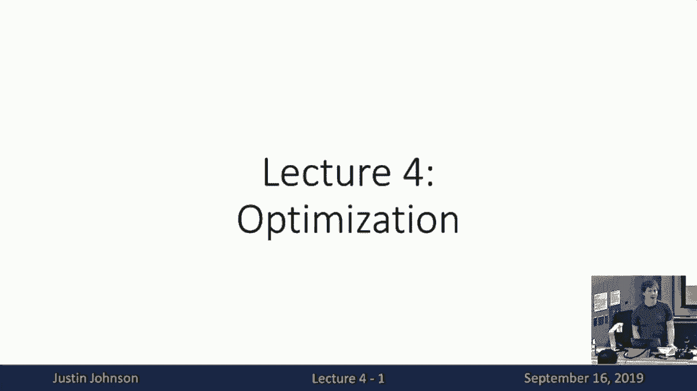

yes in the background okay good so as，you recall last the last couple lectures。

we've been developing this idea of，linear classifiers，so first we talked about how we can use。

linear classifiers to solve this，this image classification problem and。

that we can view in linear classifiers，from，these three different perspectives，algebraic visual。

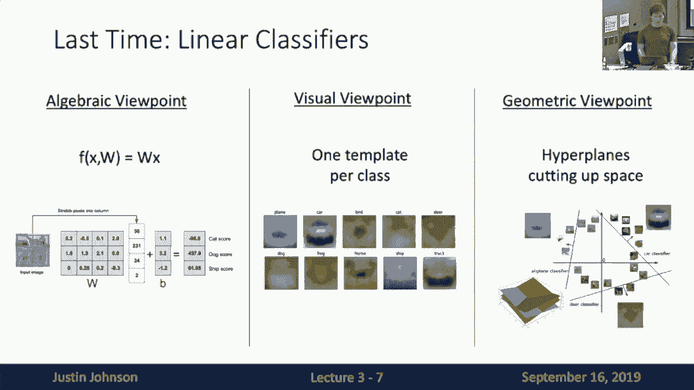

and geometric and in the last lecture we，then also talked about how we can use，loss functions。

to quantify our preferences over，different values of the weights when，we're using linear classifiers。

so in particular we talked about the，softmax and the svm loss functions。

which impose different preferences over，the sets of weights that we're going to，use。

in our in our linear classifiers and we，also also talked about the use of，regularization。

that can also express some preference，over which values of weights we prefer，and not prefer。

um where we have this intuition that，regularization helps us maybe。

uh generalize beyond the training set，and build classifiers that can。

that are simpler and thus generalize，better to the test set，but at the end of last lecture we were。

left with this open question，of how given uh given some some。

linear classification set up and given a，loss function，how do we actually go about finding a。

value for this weight matrix w，that satisfies this loss how do we，actually fit。

our linear classifier to the data that，we have in our training set。

well that's going to be the topic of，today's lecture so broadly we're going。

broadly this question of finding weight，matrices that minimize a loss function。

is this topic of optimization so the，general framework here，is that we have some loss function l of。

w，that's going to input our weight matrix，and output our scalar loss。

and in the last lecture we talked about，the internal components of that loss but。

for the purpose of today we're mostly，going to，extract all those away and just think。

about the loss function as，an abstract function that inputs the，weight matrix and outputs the scalar。

value of the loss，and now during the process optimization，what we want to do is find this value of。

the weight matrix w star，that minimizes the loss function and，this is，is。

indeed very general it's a very broad，topic across all of mathematics。

and applied computational mathematics，and things like that um so we're going。

to so we there's no way we can cover，all possible part pieces of optimization，of one lecture。

so instead we're going to focus on the，that，will become more salient for training。

large neural network models as we move，forward in the semester。

so this is kind of the formal way that，we write down an optimization problem。

but we often think about it intuitively，as traversing a very large，high-dimensional landscape。

so we often think and i often think，about this process of optimization。

as trying to walk towards the bottom of，some beautiful landscape，point。

each xy point on the ground is a，different value of our weight matrix w。

and the height of that point on the，ground is the value of the loss function，l of w。

and now during the process of，optimization we're going to be some。

little blindfolded person with no eyes，because he has no eyes if you look i've，used it on the slide。

then you can see that there's no he，doesn't actually know which direction。

where is exactly the bottom of this，valley and somehow what we need to do。

is despite having no eyes we need to，somehow explore around，through this high dimensional landscape。

and find this point at the very bottom，of this optimization，landscape um and that looks like a nice。

place to visit so maybe we'd like to get，to the bottom somehow，so then the question is how do we。

actually get to the bottom，well one thing you might hope so one one，kind of。

uh hope thing we might be able to do in，some special situations。

is to just write down the answer right，so for certain，types of optimization problems like。

might arise in linear classification if，you're familiar，linear regression we might be able to。

just write down an explicit，equation for the for the bottom of this。

uh for the bottom of this objective，landscape，but in general that's not going to work。

so we need to find，more so we're going to use iterative，methods instead to try to。

iteratively uh iteratively improve our，solutions and go towards the bottom of。

this objective landscape，so the first iterative algorithm that，you might imagine。

to optimize an objective landscape which，by the way is a terrible idea。

but it's instructive to think about is，random search，so here what we might try to do is，simply um。

generate many many random values of the，weight matrix and then。

evaluate their loss their loss value of，these different random matrices on the，training set。

and just keep track of the overall，lowest value of loss that we find over。

this random search procedure，um and if we've abstracted away our loss，function into a into a。

into a single function like we've been，talking about then the such a procedure。

can be implemented in just a couple，lines of python，um so here we're using random search to。

train some linear model，on cfr10 dataset um and after running，this for some amount of time。

we actually maybe are able to get，something like 15。5 percent accuracy。

which you know is not bad because this，is a pretty stupid algorithm pretty。

stupid optimization algorithm，but even random search is actually to，make able to make some kind of。

non-trivial progress，course，on this on this data set state of the，art is something like 95。

percent so we've got a little bit of gap，to close on the rest of this lecture。

so then idea num so this idea of random，search is really a stupid algorithm that。

you probably don't want to use in，practice but it maybe doesn't work。

quite as bad as you might think so that，kind of motivates，the use of slightly smarter algorithms。

than random search，so idea number two is actually what we，will do in practice。

so here we're going to try to follow the，slope of this landscape downhill。

so here we believe that even though this，little man walking around the objective。

landscape doesn't have eyeballs，he can somehow feel with his feet around，on the ground。

and feel which direction is sloping that，which direction the ground is sloping in。

a local region around where he's，currently standing，so given only this local information。

about how the objective landscape is，changing in a local neighborhood of our，current point。

then our strategy is to simply step a，little bit，in the in the direction of greatest。

decrease and then we can repeat this，over and over，and hopefully this will lead us towards。

some lower point in the objective，landscape，so this this gen this is a fairly simple。

straightforward algorithm but it，actually works，quite well um so here to make this a，little bit more。

formal um we recall that in we need we，need to like we need to talk about，derivatives right。

because if you recall for a single for a，single value，for a scalar value function that inputs。

a single scalar and outputs a single，scalar，we can define the derivative which tells。

us the slope at any point，in uh in this in this in this on the，domain of this function。

where the slope tells us for any point，in the domain，for any point for any any uh any point。

how if we，change x by a little bit then how much，is y going to change a little bit in，correspondence。

um so that's the sink that's the，familiar gradient that's the familiar。

derivative that we have from single，variable calculus，and of course this extends very。

naturally to multiple dimensions as well，so if you'll recall for a vector-valued。

function that inputs a vector，and outputs a scalar which is what we're。

talking about in this optimization setup，then we can define the gradient where。

the gradient at a point，is now a vector telling us the direction。

of greatest increase in the function，so now the gradient tells us the，direction of greatest increase。

and if you'll recall your vector，calculus you'll know that，the the magnitude of the gradient tells。

us the slope in the direction of，greatest increase，so um and it's also kind of a nice fact，that the。

direction we actually care about the，direction of greatest decrease because。

we want to walk downhill this objective，landscape，and it turns out the direction of。

greatest decrease is opposite the，direction of greatest increase which is。

maybe not obvious but it happens to be，true um and then，so we can simply step in the direction。

of the negative gradient，and this will lead us downhill down our，objective landscape。

so then the question is how might we，actually go about computing。

these gradients for arbitrary val for，arbitrary vector。

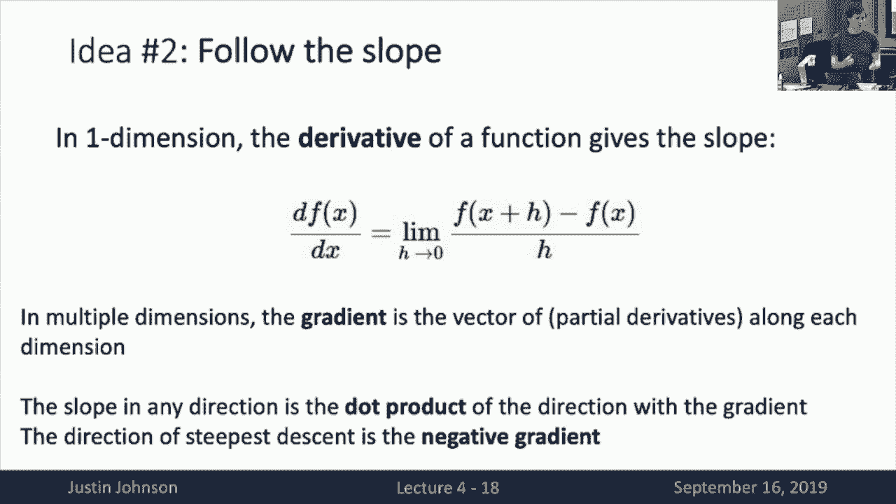

input for arbitrary functions that input，a vector and output a scalar。

well we can actually implement this uh，limit definition of the gradient。

directly in software so you could，imagine that we have some，value of the some current value of the。

weight matrix w，here on the left shown as a big vector，and now on the right we want to compute。

this gradient，and the the gradient of the loss with，respect to the weight matrix。

and recall that the loss is a single，scalar value so the gradient of the loss。

with respect to the weight matrix，will be a vector that has the same shape。

as the weight matrix itself，where each element each slot in that，gradient vector。

will tell us the slope if we change one，element of that corresponding part of。

the weight matrix by just a little bit，so we could just implement this limit。

definition of a gradient numerically，so given our function that computes the。

loss what we could do is compute the，loss at our current w，then we could perturb the value of w by。

increasing the first slot of the weight，matrix by a small step each。

and now run that perturbed value of w，through our，loss function to compute a new loss and。

then apply the limit definition of the，derivative，to compute some approximation to the。

gradient in the，to some approximation to the first slot，of the gradient。

and here remember that it's maybe rise，over run so we look at the difference in，loss value。

divided by the difference in amount in，which we change that，slot of the input weight matrix w so。

that gives us some approximation to the，slope of that function。

along the coordinate axis of the first，slot of the weight matrix，and of course we can repeat this。

procedure for then second dimension，uh perturb the second dimension。

recompute a new value of the loss，and then again apply limit definition of，the derivative to get。

this numeric approximation to the second，slot we can repeat for the。

third slot etcetera etcetera so this is，called the numeric gradient。

and it's a reasonable thing to think，about but the problem is that it's very，slow。

so in this particular example our weight，matrix w，has maybe 10 or 12 slots i don't。

remember exactly how many i wrote down，so if this would actually not be super，expensive to compute。

but as we move to larger neural network，based systems our weight matrices will。

become very very large，they might have thousands or millions or，tens of millions。

or in the biggest cases perhaps even，billions of learnable parameters。

and now in order to compute a gradient，using this numeric，approximation this limit definition we。

need to compute，a separate forward pass of our loss，function，once for each slot in our gradient in。

our weight matrix，so this will become very impractical as，we move to very high dimensional。

optimization problems，and it's also approximate because we，were relying upon。

a finite differences approximation to，this gradient，to this full true end to this full true，gradient。

so this numeric gradient not only is it，slow but it's also not even。

computing the correct thing at all but，it's still useful to think about。

in terms of what is actually going on，when we try to compute gradients in。

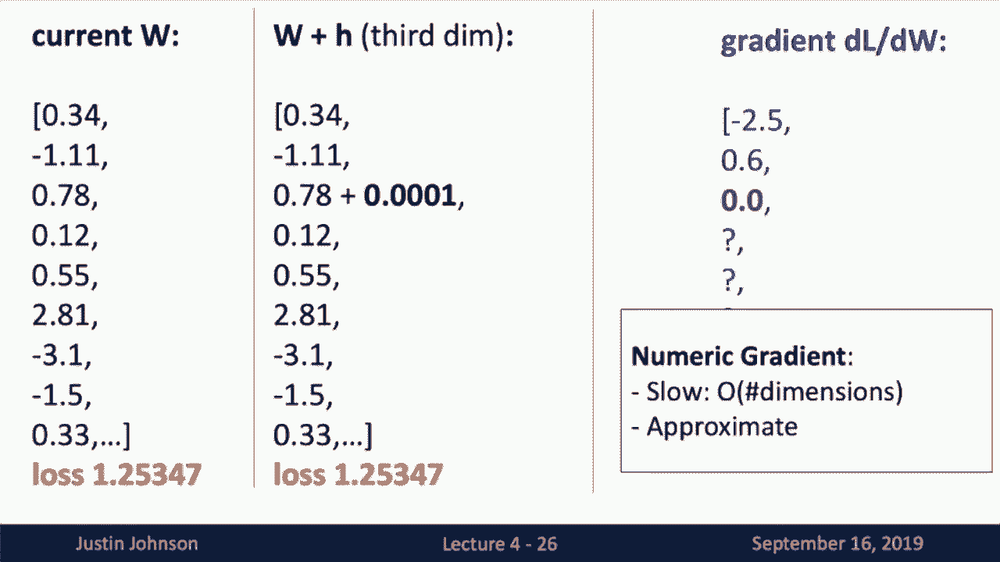

these large scale systems，so okay so now at this point you might，have thought that。

this was kind of a stupid thing to have，done right we all，hope because we all should have taken。

some vector-valued calculus because i，think i put that down as a prereq for，the class。

and now you know that you could just，write down the loss function as some，equation。

and now what we want to do is derive the，gradient and you could。

as the gradient of this loss function，with respect to the weight matrix w。

and if you're familiar with all the，proper rules of manipulating these uh。

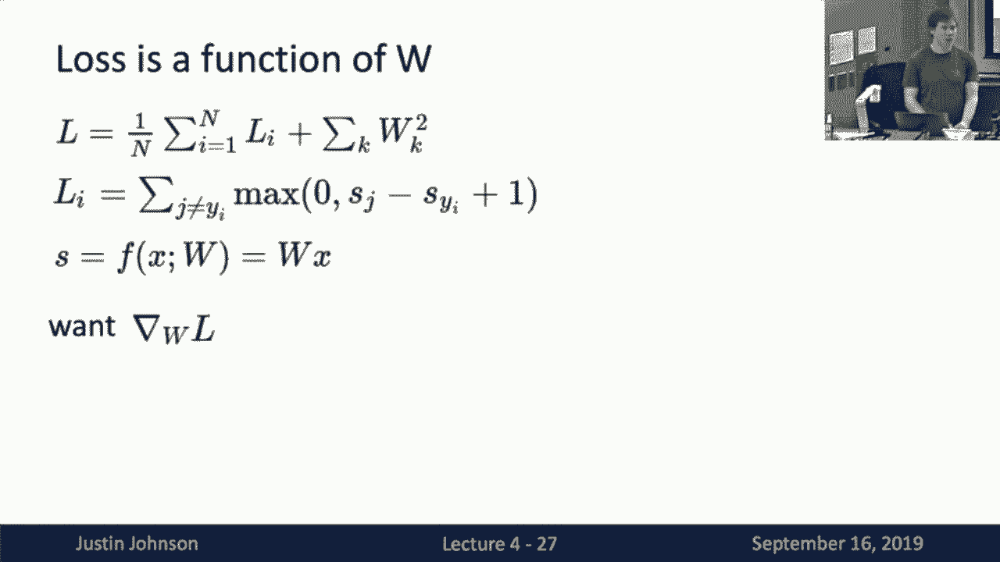

vector or matrix equations then we can，get some help from these guys。

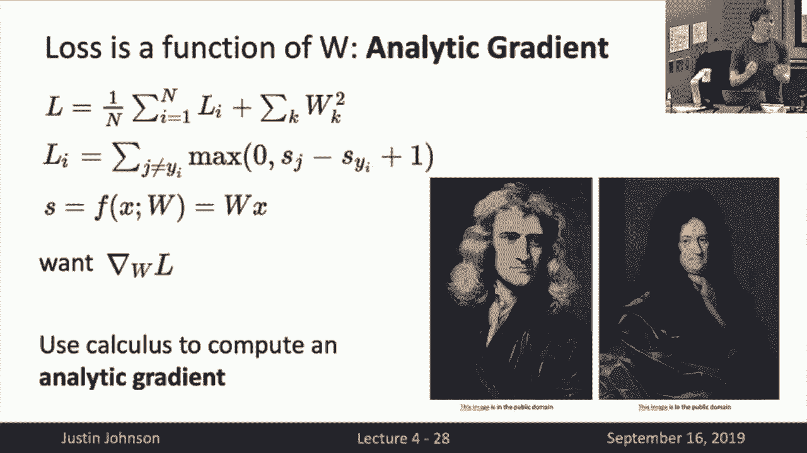

and just write down an equation that，helps that directly defines the value of，this loss function。

newton and liveness you know which one，newton and liveness you know which one，is which yes。

okay yeah i think they all look kind of，people have looked kind of funny back in，those days。

but uh now what we want to do is then，hopefully we can then，just use our knowledge of vector。

calculus to write down an expression，that tells us directly，what is the what is a an algebraic or。

analytic expression，for the exact gradient at a as a，function of the weight matrix w。

so then what this looks like is back to，our current picture we will。

have our current weight matrix w that，will then then will then somehow derive，this expression for。

the derivative of the loss with respect，to the weight matrix and that will allow。

us to compute this gradient the ldw，in a single operation or a single pass。

that hopefully now it will no longer，require a number of four passes linear。

in the number of dimensions of the，weight matrix，and the details of exactly how we will，derive these。

these gradient expressions and in，practice will often rely on back，propagation。

which we'll talk about in much more，detail and i think one，a week from today's lecture lecture six。

so for the time being you can just hope，to fall back on your。

knowledge of calculus but moving forward，we'll use math propagation as a more，structured algorithm。

to derive gradients for arbitrarily，large and arbitrarily complex，expressions。

but for the linear classification for，the linear classifiers we've considered，so far。

hopefully you should be able to work it，out on paper or if not then you can use，background。

propagation even for those as we'll talk。

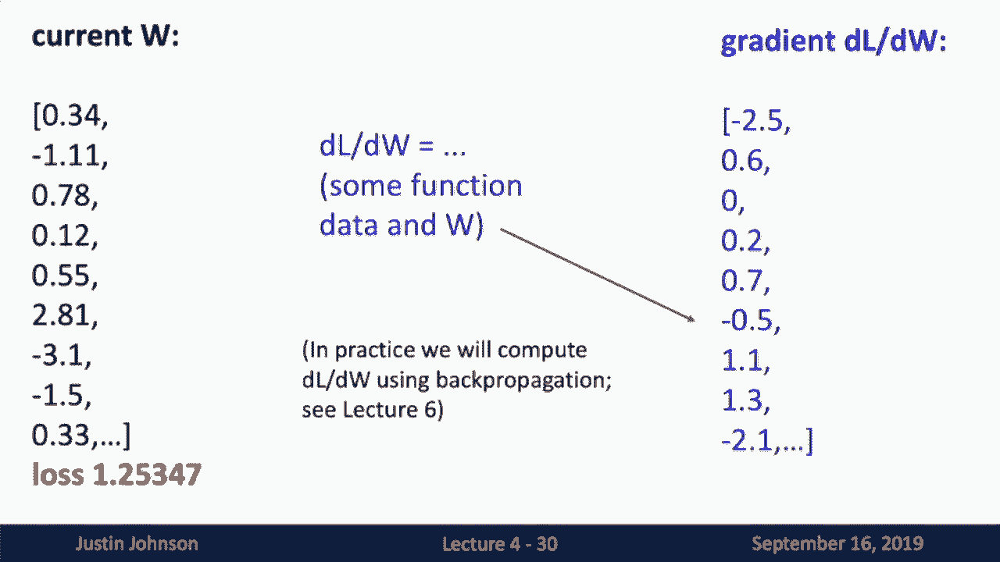

so now the summary up to this point is，so now the summary up to this point is，that uh now。

we've decided upon this strategy of，minimizing a loss function，by using gradient information that is。

we're going to take，we're going to compute gradients at，every point and then use that gradient。

to iteratively improve our estimate of，where exactly we want to fall in the，long's landscape。

and now we've talked about two different，methods of computing gradients，function。

that you might imagine in general so we，is，very very simple to understand very。

intuitive very easy to implement，but it's approximate that it's slow so。

in practice we'll typically use the，analytic gradient，which will be exact and fast but because。

it requires you because deriving，analytic，gradients requires you to actually maybe。

do some calculus on paper sometimes，it can sometimes be error-prone and can。

right because you might just make a，mistake and，make a mistake in your computation make。

a mistake in your derivation，which definitely happens when you're。

trying to think about how to compute，gradients of these large complicated，expressions。

so in practice what we'll often do is，actually use both，so in practice what we'll typically do。

is use the numeric gradient，as a debugging tool to make sure that we。

properly implemented the analytic，gradient，so here we would typically then write。

our code in a way that's，agnostic to the number of dimensions in。

the weight matrix so and then we can，test the analytic version of our。

gradient of our gradient computation，on a very low dimensional version of the。

problem where computing a numeric，gradient might be feasible，and then we can check that we're。

computing the same approximately the，same value，between this numeric approximation and。

between this analytic gradient that will，derive on paper so this is always a。

really good idea that you should，almost all you should always do this。

whenever you're implementing your own，gradient code，and this is just a really good way to。

make sure that you don't have any stupid，mistakes when you've，implemented gradients um。

so we will use this strategy on the，homework assignments and you'll see。

starting on assignment two that again，will be released later today，you will be implementing your own。

gradient computations for linear，classifiers，and now to debug those linear。

classifiers we've written this grand，check function，that will come internally compute the。

numeric gradient，and then compare it to the analytic，gradient that you guys will derive。

this is a very useful strategy and it's，applicable beyond homework assignments。

as well if you look in the pytorch，documentation，you'll also find that pytorch provides a。

function called grad check，that does something very similar so if。

you ever find yourself writing your own，gradient computations for code out there。

in the wild i would strongly，encourage you to use this grad check，function provided by pytorch。

to make sure that you properly，implemented your gradients，and if you look all further in the。

documentation，you'll also find a grant grad check that，helps you。

properly implement second derivatives，which is also a thing that you sometimes。

need to do in pytorch i think we'll see，a couple examples of that later in the，course。

but surprisingly there's no grad grad，grad check，because it turns out that because of the。

way high torch implements gradients，once you've got grad check to pass and，grad grad check to pass。

then grad star check will definitely，work for any any number of grads that，you want to take。

so again if you ever find yourself，implementing gradient code out there in，the wild。

you should probably use these tools to，make sure that they're implemented，properly。

so now that we have some sense of how to，compute gradients，it finally brings us to this algorithm。

of gradient descent，so recall that we had talked about this，this way this strategy for optimizing。

the loss function，we're going to start somewhere and then，deal with our b to see what is the local。

gradient direction，and then step in that direction and then，repeat it turns out that this。

algorithm actually is very simple to，implement right it fits on，four lines of code here so this this。

very simple algorithm of gradient，descent，um we're going to initialize the weight。

somewhere we're going to loop for some，fixed number of iterations。

then we will compute the gradient at our，current point and then step in the。

negative gradient direction，uh after we've computed our data in some。

way this algorithm you'll notice has a，couple hyper parameters。

and um unlike the k n hyper parameters，that you probably，in fact won't play around with too much。

in practice these hyper parameters，involved in gradient descent。

will become some of your best friends or，maybe worst enemies，as you're trying to build neural。

network-based systems，so here when we're talking about，gradient descent。

hyper parameters that come to mind one，would be your method of initializing the，weights。

it turns out that intuitively we want to，initialize the weights to be some。

random values but it turns out that for，various applications，the exact mechanism the exact。

distribution from which you draw those，random values，turns out to matter quite a lot in。

downstream applications so，we will talk in a little bit later，lectures about the proper way to。

initialize weights when we're training，neural network systems。

the second hyperparameter is the number，of steps we will need to run this out we，time。

because we actually want our homework we，want our models to converge before the，homework is due。

so we need to run this algorithm for，some finite number of steps。

there's many different stopping criteria，you might imagine using ingredient，descent。

but the most common one in deep learning，is simply to run for some fixed number，of iterations。

and this hyperparameter is usually，usually running more iterations tends to。

work better for most deep learning，applications，um so this this hyperparameter is。

usually constrained by your，computational budget，and how long you're willing to wait for。

your models to train，and the third hyper parameter here is，the learning rate so。

uh when we come when we take this step，in the negative gradient。

we actually need to say how much do we，actually trust this gradient。

how big of a step do we want to take the，greatest，decrease for our function but we need to。

actually decide，how much we want to step in that，direction of greatest decrease。

the hyper parameter controlling this，rate，because it controls how fast your，network learns where。

higher learning rates means we're taking，larger steps and maybe you might hope。

that your algorithm would，converge faster lower learning rates are，maybe。

less prone to numeric explosion but will，take longer to converge will take longer，to learn。

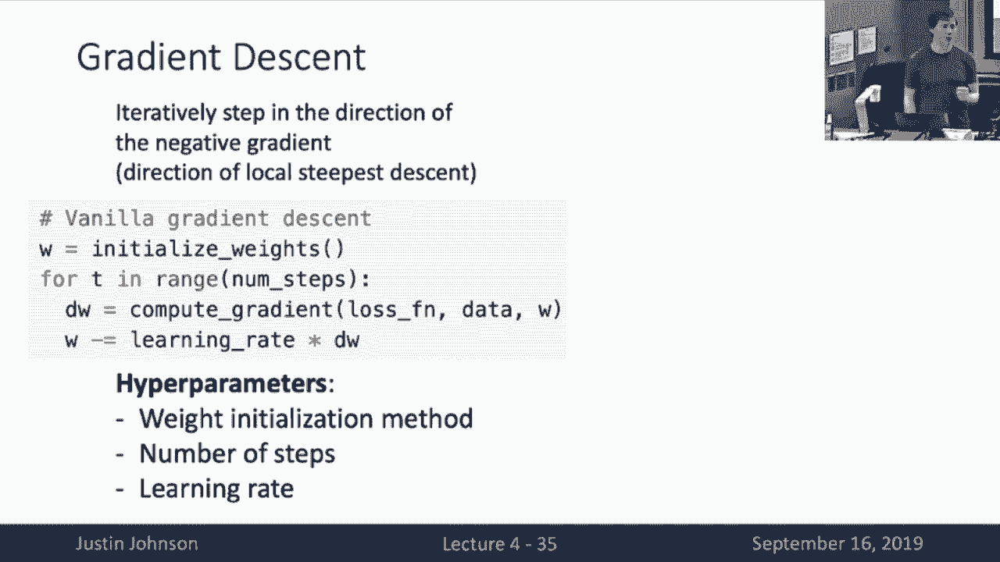

so these three hyper parameters will be，some of your friends。

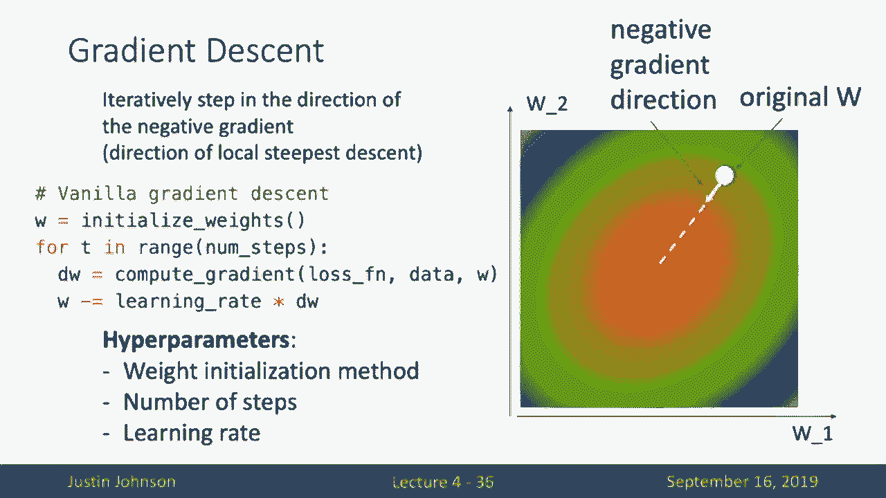

throughout the rest of the semester，and you can again look at this sort of。

pictorially we can imagine this，algorithm of gradient descent by looking，at one of these，tell。

show us the values of two dimensions of，the weight matrix，and the color at each point represents。

the height of the objective function，and we can imagine starting at some，white point here。

we compute our negative gradient which，is now the direction of greatest。

decrease in the loss function，then we'll take some small step size，along this gradient direction。

and iteratively repeat as we step，downhill so，as we actually run this algorithm it。

might look something like this，where we will start at some point in the，blue region，taco。

shell shaped or bowl shape objective，landscape and we'll start at some high，point in the blue region。

and then by iteratively following the，gradient direction you can see that this。

this algorithm very quickly converges，to this red region of low loss at the，middle of the tackle。

and what's kind of just by looking at，this uh at this time at this animation。

you can recognize a couple interesting，features of the gradient descent，algorithm。

one is that it does not go straight to，the bottom um，because this is sort of a taco bowl。

shaped landscape，the gradient direction is actually at an，angle to the direct to going straight to。

the bottom，so it does not go straight to the bottom，instead it kind of arcs and curves。

around to the side，before coming back into the bottom of，the objective landscape，out。

going very fast oh no maybe i didn't set，up the powerpoint to loop properly oh，well。

well because of the way that we，formulated this gradient descent by。

having a multiplicative learning rate on，top of the steps，on top of the gradient what this means。

is that when the gradient has a large，magnitude，we'll end up taking larger steps and as，we get as we。

approach this bottom of the bowl the，objective landscape will flatten out。

and the magnitudes of our gradients will，become small and now our step sizes will。

also naturally become smaller，it's kind of nice this this is a kind of。

nice way to parameterize gradient，descent，because it lets the algorithm somehow，naturally slow down。

as we approach flat regions or as we pro，maybe approach minima of the objective。

this version of gradient descent that，this version of gradient descent that。

we've some so far been talking about，is sometimes called batch gradient。

descent or full batch gradient descent，because as you recall our loss function。

is this giant sum over the individual，loss functions for all the examples in，our training data set。

where l i is where x i y i is one of the，training pairs in our data set。

and l i is the loss function um how well，our classifier is doing on that。

one individual example and now our faux，loss function on the training set as，you'll recall。

is a sum over all parts over all the the，individual elements or。

training examples in our data set but，and，corresponding correspondingly because。

the gradient is a linear operation，you can see that the gradient is again a，sum of the gradients。

over all of the individual examples in，our training set，the problem here is that this can become。

very this sum can become very very，if，n is something like a million or 10，million or a billion。

if you're lucky enough to have a very，very large data set then simply。

computing the value of this loss，function，will involve a loop over tens of。

thousands or millions or billions of，training samples，so in order to compute just a single。

step of gradient descent you'd be，waiting a very very long time to loop，through your entire data set。

in practice this will therefore not be，very feasible。

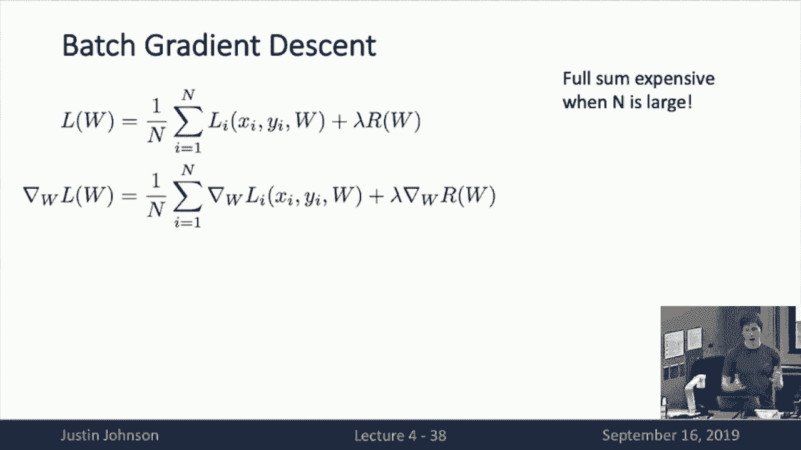

for running on for training on the large，data sets that we want to in order to，get good performance。

in practice then we often use a variant，of gradient descent，called stochastic gradient descent or。

sgd，here the idea is that rather than，computing a sum over the full training，data set。

instead we will approximate this loss，function，and approximate the gradient by drawing。

small subsamples of our full training，data set，the typical sizes here in these small。

sub samples are called mini batches，the and the typical sizes of these will。

often be something like 32 or 64，or 128 elements at a time that then。

what we will basically do is modify our，algorithm，so that in each iteration rather than。

computing the loss on the full data set，instead we'll sample a small mini batch。

of items from the data set，and then compute our gradient and our，loss using only this small。

sampled the sampled set of elements this，version and this is a much this is a，very common version。

this is this type of stochastic gradient，descent is in practice what we'll almost，always use。

once we move from full batch to，stochastic gradient descent we introduce。

a couple more hyper parameters into the，system，we still have our old friends of weight。

initialization number of steps and，learning rate，we've also introduced batch size as a。

new hyper parameter，that is how when we're computing these，mini batches how many elements should be。

in each mini match，thankfully it turns out empirically that，this one tends not to be too sensitive。

of a hyper parameter，and the general heuristic here is just，make the bit the mini batch size as。

large as you can，until you run out of gpu memory or if，you happen to have access to multiple。

gpus or multiple machines，um it turns out that you can distribute。

this and have very very large batches，that are distributed，over multiple gpus or multiple machines。

um and it turns out，sort of this is all empirically speaking，that for many neural network systems。

the exact batch the exact batch size you，use doesn't work doesn't matter。

too much as long as you properly account，for other things in the system。

so we'll talk more about those details，later in the class but the general rule，of thumb here is。

don't worry too much about the batch，size as a hyper parameter instead just。

try to make it as big as you can fit，and then we've introduced another hyper。

parameter here which is the method by，which we're going to sample our training。

data at every iteration，for classification problems like we've，been talking about so far。

this tends not to matter too much um on，the homework assignments what we'll do，is just draw the data。

at random for each iteration another，common strategy would be to。

shuffle the data set at the beginning of，we're going to shuffle the data set and。

then march through that shuffle data set，in order，and then shuffle the data set again and。

then march through it again in order，um for classification problems like，we've been considering。

the latter is more is more common but i，think it tends not to matter too much。

for your final results um but if you，think about other types of uh。

problems then uh things like structured，prediction problems or maybe。

triplet matching problems or ranking，problems then the way in which you。

iterate over your data can sometimes be，an important type of parameter。

but but thankfully that's not the case。

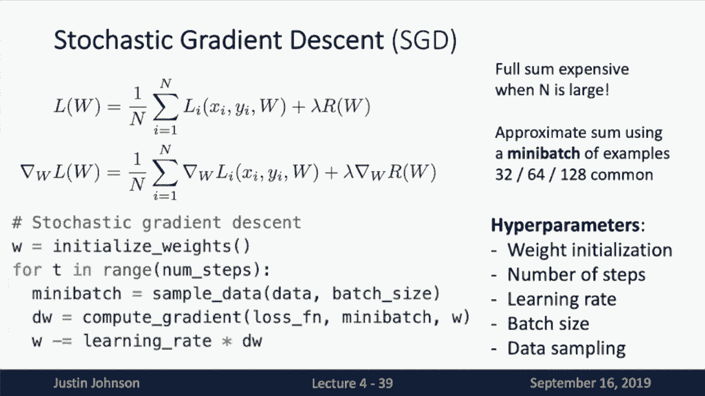

for many image classification problems，so you might be wondering why this is。

called stochastic gradient descent it's，kind of a funny name。

the reason for that is that we now think，of our loss function probabilistically。

so we then sometimes think of a data of，an underlying，probability probably joint probability。

distribution over the data x and the，labels y，from which our training sum was sampled。

when we think about the，our data as having been sampled from，some underlying probabilities。

probability distribution then we can，write down our loss function，as this expectation as we take an。

expectation over all possible samples，from some true underlying data，distribution and then。

the the form of the loss function that，we've seen thus far，which is an average over the independent。

loss functions，on all of the samples from our data set，is then a monte carlo estimation to this。

full expectation，over the full probably probability，distribution。

and then clearly when you think about，loss functions in this way then we have，take。

in order to approximate this full，expectation for computing law's function。

that's and that's that this this notion，of thinking probabilistically。

is therefore what is named stochastic，where this term stochastic comes from。

in the names to cast a gradient descent，and of course，the the gradient is much the same so。

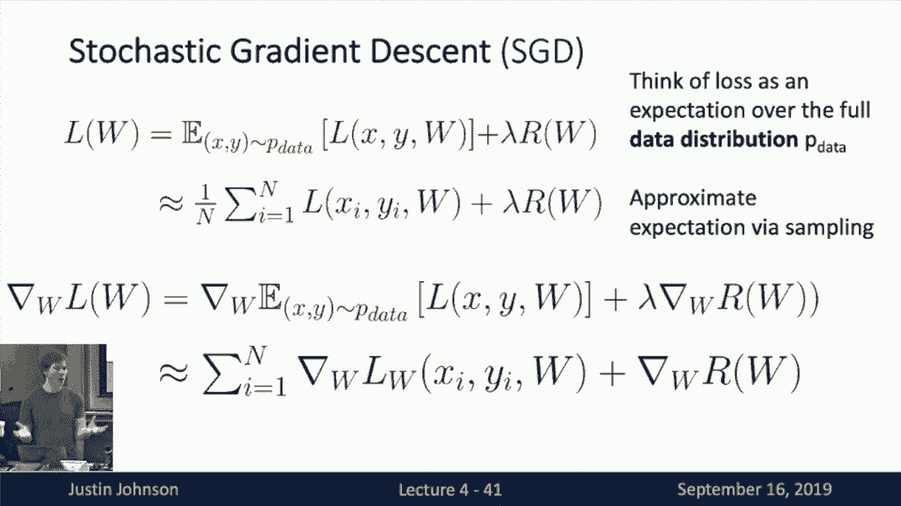

then we can approximate the gradient as，well by taking a small monte carlo。

estimate of samples over this whole。

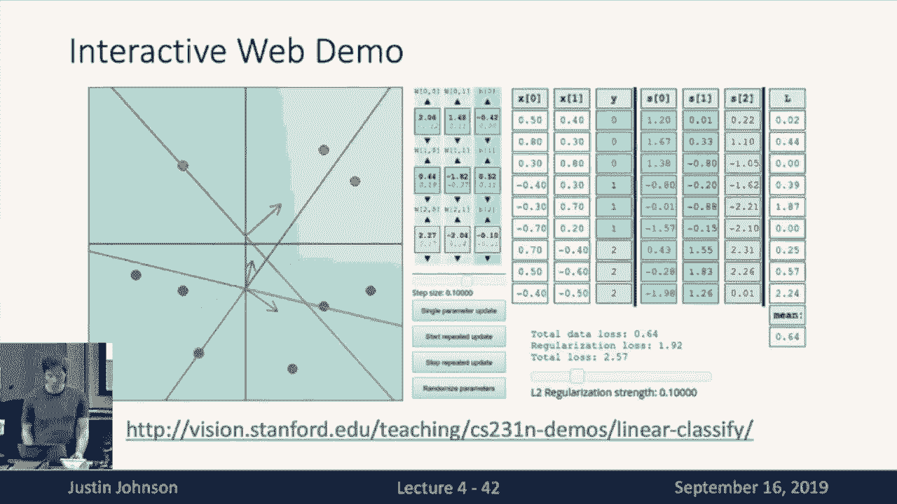

distribution，we have an interactive web demo demo up，here that you can，if it's still on stanford。

edu i guess i，need to fix that，um that you can play around with that，will let you play with linear。

classifiers，and using gradient descent to train，different types of linear classifiers。

interactively in a web browser，and i would encourage you to check this。

out to gain some intuition about，how you can change the loss function。

change the values of the weights change，the step size，and sort of see interactively how。

changing all these hyperparameters，will affect the ways in which decision，boundaries shift around。

and affect the training of linear，classifiers，so it turns out that this is actually。

this actually works now at this point，you you know enough to go and implement。

the linear classifier portion on，assignment two，but it turns out that this this simple。

algorithm of stochastic radiant descent，even though it's actually quite。

effective there are some potential，problems with stochastic gradient，descent。

and let's think about so let's think，about a couple situations。

where this basic version of stochastic，radiant descent，might run right might run us into，trouble。

well one problem is what might happen if，our lost landscape looks something like，this。

so here we're showing a contour plot of，a lost landscape，this lost landscape is therefore a kind。

of very exaggerated taco shell type，landscape，where it's changing very quickly in one。

direction and then changing very slowly，in another direction。

and the question is what might happen if，we apply，a stochastic reading descent or full。

batch gradient descent，on an objective landscape that has this。

well one problem is that our steps might，well one problem is that our steps might，oscillate around。

if our step size is too large then right，we kind of have a trade-off we need to。

set our step side if our step size is，too large，then when we compute the gradient um it。

we might overshoot in the，and then，have to correct our overshoot and come。

back in the other direction，and now if the display and this this can。

cause a kind of zigzagging pattern，as we then zigzag towards the minimum。

that can cause us to take many more，steps than we might otherwise have，needed to take。

if we were somehow have been able to use，the smarter object，optimization algorithm and we kind of。

have a trade-off here，because we could have then we could have，maybe avoided this。

by setting the step size very very small，but if we set the step size very very，small。

that might prevent this overshoot，zigzagging pattern，but it would then cause the algorithm to。

just converge very very slowly，and now you're kind of in you're kind of。

in a tough spot in this situation，if you've got an objective landscape。

that's very exact very fast moving in，one direction，and very slow moving in the other，direction then。

you're kind of screwed no matter how you，set the weight the the step size。

right if you set it too big you're going，to overshoot the fast moving convention。

if you set it too small then you'll make，no progress towards the goal。

and this problem is called uh this is，this is technically，sometimes referred to as the problem。

having a high condition number，um which you can estimate uh numerically。

by looking at the ratio between the，singular values of the hessian matrix at，any point。

um that we don't need to go into detail，here about that，but this is one potential problem for。

using this vanilla stochastic gradient，descent problem or the。

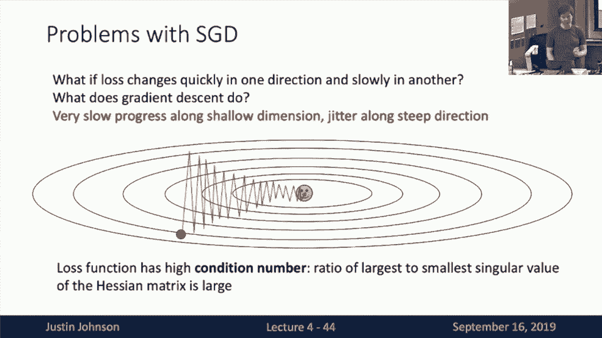

another potential problem with，another potential problem with，stochastic gradient descent。

is functions that exhibit local minimum，or saddle points，a local minima is a point on the。

function where，the function has zero gradient but it's，not actually the bottom of the function。

and here we show a one-dimensional，example where uh we kind of go down and，then there's a。

local minimum and then in order to，escape that local minimum we would need，to go over some。

some hill or something so you can，imagine that if we were using this basic。

stochastic gradient descent algorithm，on some function that had a local，stuck。

in this local minimum because the，gradient is zero there so our step size，would converge to zero。

and we might end up stopping this local，minimum and be unable to escape。

since the gradient there is zero as well，we can have a similar problem。

in uh there's another problem that i，think is much more common in high，dimensional optimization。

which is the notion of a saddle point so，here a saddle point is a point where。

in one direction the function is，increasing and in another direction the，function is decreasing。

and as it's called a saddle point it，looks kind of like a saddle on a horse。

and the problem here is that at the tip，of this saddle，the gradient is also zero so if we were。

to imagine，trying to optimize a function that had a，saddle point you can imagine。

you can imagine we might get stuck in，the saddle point similarly as we might。

get stuck in a local minimum，because the gradient at the saddle point，is identically zero。

so the problem in both these situations，is that because they have zero gradient。

um we might get stuck and uh just to，point out um this notion of a saddle，point actually i think。

becomes much more common in high，dimensions because if our optimization，landscape is very。

a saddle point is basically a point，where in one direction，the objective function is increasing and。

in another direction the，objective function is decreasing if we，have an objective lens if we。

have an objective landscape with，something like 10 000 dimensions or a，million dimensions。

then it seems very plausible then，actually very frequent that at many。

points in the objective landscape，we might be increasing in some of those。

dimensions and decreasing in other of，those dimensions，so the intuition is that somehow perhaps。

saddle points are maybe a big problem in。

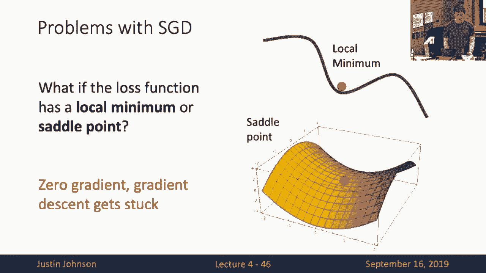

high dimensional optimization，another potential problem with，stochastic gradient descent。

is that s that that stochastic part，because we are computing our gradients。

using only a small estimate of our full，data set，those gradients are noisy and the。

gradients that we're using to make our，updates at any step of the algorithm。

may not correlate very well with the，true direction that we want to go to in。

order to go to the bottom，on the right here on the right we're。

showing an animation here that simulates，this problem，where we're running a gradient descent。

on this uh same，bowl shape objective landscape as before，but now we're adding some amount of。

noise to the gradients that we're，computing，um when running the algorithm and you。

can see that in contrast to the version，of stochastic gradient descent。

previously that was kind of marching，down towards the bottom，instead we see that once our gradients。

are noisy then our algorithm is somehow，kind of meandering around this objective，landscape。

and kind of taking its time towards，getting toward to the bottom。

and you might maybe if maybe you might，hope that if you wait long enough。

this will kind of average out and get us，towards the bottom but it's still not。

exactly obvious what the trade-offs，problem，potentially that our gradients in。

stochastic gradient descent。

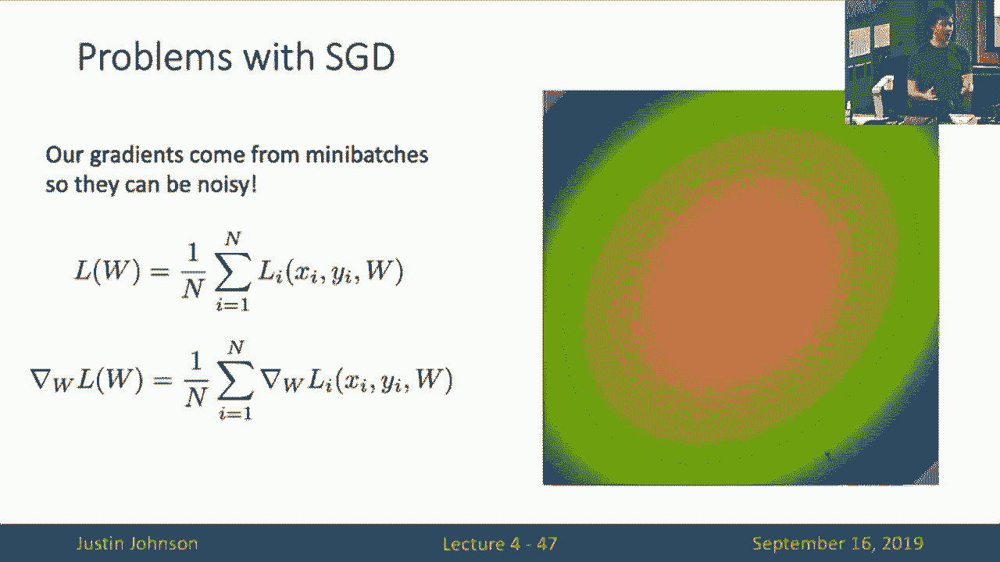

are not exact that they are stochastic，approximations to the true gradient that，we want to。

to overcome all these problems therefore，to overcome all these problems therefore。

it's actually not so common to use this，very，vanilla form of stochastic gradient。

descent we'll often use，slightly smarter versions of stochastic。

gradient descent when training our when，training neural networks in practice。

the most common of these is called sgd，plus momentum，so here on the left we're showing our。

old friend the stochastic gradient，descent algorithm，and now i've for the remainder of the。

slides i've cut out the weight，initialization step because that's going。

to be common to all algorithms，and on the on the left with our familiar。

friend stochastic gradient descent，you see that at every iteration we're。

simply stepping in the direction of the，gradient，as has been computed with our with our。

mini batch of examples，now with sgd plus momentum on the right，we imagine。

a a kind of physical intuition here of，actually a ball rolling down this high，dimensional surface。

so now at every point we imagine，integrating the gradients over time。

to compute some kind of a velocity，vector for this ball，rolling down a hill and now at every。

point in time，we will then update this velocity vector，by taking it by taking some weighted。

combination of the current value of the，gradient，and this historical for this historical。

velocity this historical moving average，of gradients，and then when we take our gradient step。

we will not use the exact，uh we will not use the true gradient。

direction instead we will step in this，vector，that we've computed over the whole。

course of training and you should，imagine，this as like a marble rolling downhill。

that now as it kind of speeds downhill，it picks up some velocity，and now it continues moving in that。

direction，even if the local gradient is not，directly aligned with its direction of，motion。

and concretely we implement this in we，implement this on the right，by introducing a new scalar。

hyperparameter，called row which is uh something，like you can think of as like a friction。

or a decay rate，so now at every point in time um we're，going so now we're going to keep track。

of two things，we're going to keep track of our，positions x t um。

and as well as our velocity vector vt，and now at every point in time。

we're going to update our velocity，vector by first，we'll first decay it by multiplying by。

this scalar friction value，and then we'll add back in the the the。

value of the gradient computed at the，step，we'll step according to this velocity，vector。

um and as kind of a technical note，depending on which papers or which，textbooks you'll read you read。

you'll sometimes see to these two，slightly these two different，formulations of sgd plus momentum。

that have slightly different looking，equations but as an exercise to the。

reader you can go back and work this out，at home，and show to yourself that these two。

formulations are actually equivalent，um and in the sense that um you'll act，you'll they'll actually。

visit the same sequence of weight values，uh，no matter which formulation you're using。

so it's something of an implementation，detail as to which of these two，formulations you choose。

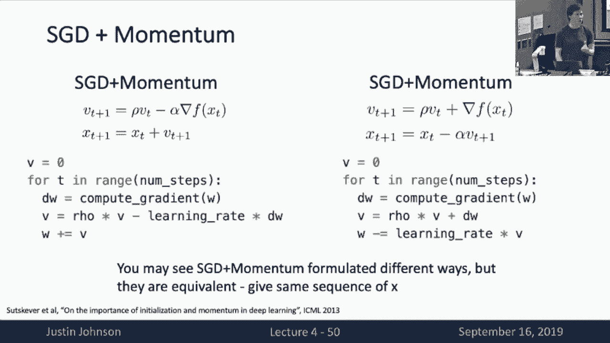

but i wanted you to be aware that you，might see different formulations，depending on。

now once we have this notion of sgd plus，now once we have this notion of sgd plus，momentum。

we can think about how it helps to solve，all three of these problems that we，pointed out，we talked。

about one potential problem with sgd as，local minimum，where because the gradient was zero at。

the bottom of a local minima，then there's zero gradient so if we step。

according to the true gradient we'd be，stuck forever，but now once we augment the stochastic。

gradient to set algorithm with momentum，now because now you should imagine this。

as like a ball rolling down the hill，that as the as the as we kind of descend，from the top。

and come down to the local minimum then，even as we pass that local minimum。

our our point might still have some，velocity that can help carry us up the，other other side。

and to hopefully escape from that local，minimum um you by using our velocity to。

kind of power through it，in some way and a similar intuition，applies for saddle points。

um again once we start building up，velocity by rolling down，l then we can hopefully roll right over。

those saddle points and continue，descending down，along a different direction uh momentum。

can also help us，help us overcome a little bit this，problem of poor conditioning。

because it because what you can imagine，this velocity vector，is kind of like a weighted move an。

exponentially weighted moving average，all the gradients that we see during。

training so now if we see gradients，so now if we start off in this uh。

oscillate if we see this oscillatory，behavior during training。

then you could imagine that our velocity，vector would help smooth that out。

and the the quick oscillations along the，y axis here，would then be averaged out to give us。

maybe hopefully relatively low velocity，or relatively low velocity in that。

direction um and then maybe we might，even accelerate our velocity along the，horizontal direction。

and help us smooth out or deal better，with these，objective landscapes with high condition，number。

gradient descent with momentum can also，help us with this problem of，stochasticity。

so here on the right we're showing again，this this same animation。

of adding using gradient descent so the，black line is showing gradient descent。

where we're adding some amount of，stochasticity some amount of random，noise。

to the gradient at every point and as we，saw before the black line is kind of。

meandering all over the objective，landscape，due to the effect of the noise on the。

gradients in the blue we're instead，showing，the same sequence of gradient updates。

but instead using stochastic gradient，descent with momentum，and here we can see that by adding。

momentum to the algorithm，it's somehow able to smooth out the。

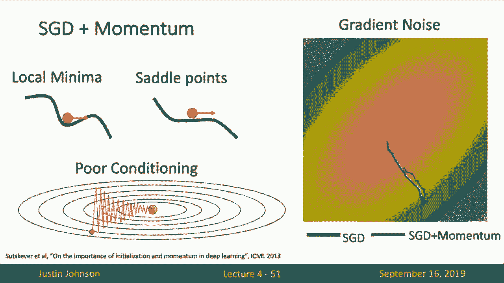

noise and take a more direct path，towards the bottom of the objective。

another way to think about what the，another way to think about what the。

momentum update is doing is somehow with，this little uh diagram here。

where we imagine that at every point in，time we're sitting at this。

red we're sitting at this red dot and，then at this red dot，we can compute we have this uh green。

vector which is some direction giving us，our velocity，which is something like our historical。

averages of the gradients we've seen，during training，and now we will also then compute this。

red vector which tells us the，instantaneous gradient at this point。

and then we will average them to get，this to get this new velocity，in blue which is the actual step。

direction that we'll use to update our，weight matrix，so the intuition here is that we're，point。

with this historical average of，gradients and this helps us smooth out，the object uh smooth out our。

optimization procedure，there's another version of momentum that，you'll sometimes see。

called nesterof momentum that has，something of a similar intuition。

but it kind of interleaves these steps，in a slightly different order。

with nestor of momentum what we do is，it's kind of a，we kind of imagine a bit of a look ahead。

so now we're still starting at this red，point at every iteration，we still have this historical green。

vector of velocities at every at every，uh，that is our moving average somehow of。

all the directions we've seen during，training，but now the difference between nestorov。

and traditional stochastic gradient，descent plus momentum，is that with mesterod momentum we。

imagine looking ahead into the future，and computing what would the gradient，direction have been。

if i would have stepped according to the，velocity vector so we kind of look ahead。

in the direction of the velocity vector，and compute the new value of the，gradient in that loop ahead。

and then when we take the actual step，our actual step is then a。

a linear combination of this velocity，direction，as well as this direction that was。

computed via this lookahead step，and this next-door momentum then somehow。

has a similar effect as gradient descent，with momentum，it just integrates the integrates the。

past and the present versions of the，gradient，in a slightly different way so you'll。

sometimes see people use these two，different formulations for optimizing。

things so if we want to look at that we，can write this down we can write this，down mathematically。

and look at master of and look at nestor，of momentum in the following way。

so here we see that we still keep a，running tally of our velocity vector as。

well as our position vector，but now when we update our velocity，vector we。

take we compute the gradient at this，look ahead point，um so this look ahead point is now x t。

plus rho v，t which is now what the gradient would，have been as we step in the direction of。

the velocity vector then we compute the，gradient there，and then our velocity is then a。

combination of our old velocity plus the，velocity at the lower head point。

and then we update the x the position x，using this，velocity computer this is kind of an。

awkward formulation unfortunately for an，optimization algorithm，usually it's more convenient to。

implement optimization algorithms，when they take when they only depend。

upon the current point and the gradient，at the current point，which this nest drop function doesn't。

seem to be right because it has this，gradients，to look ahead it doesn't fit nicely into。

this api of objective，of optimization functions that we expect，yeah question。

so the the question is um is our，velocity vector in the direction of the，gradient。

or is our velocity vector in the，direction of the negative gradient。

and the other choice is whether your，velocity vector incorporates the。

learning rate or do you incorporate the，learning rate after you do the。

velocity vector so these are all kind of，equivalent they all kind of you can，out。

um so they're all kind of equivalent and，it doesn't really matter which one you，use。

but i think that's that's what's going，on here so in this version of nestor。

what we're doing is we're having the，velocity be actually the negative，direction of the gradient。

and we're rolling the and we're rolling，the learning rate alpha into the，velocity vector as well。

um so then when we take this step in the，direction of velocity vector。

it's actually stepping in the negative，direction of the gradient but uh thanks，for pointing that out。

um so then we said that we saw that this，this nest drop update has a slightly。

awkward formulation it doesn't quite fit，into the api of，uh functions that we might want to write。

so it turns out there's a simple change，of variables we can use。

that i don't want to work through here，um but just for you to be aware。

it's kind of fun to work through this on，paper and see with this change of，variables。

actually nester of momentum can be，rewritten in terms of only the current，gradient。

and the and the current position which，is kind of cool given that it actually。

has this intuition of a look ahead，and there's some right so this is a。

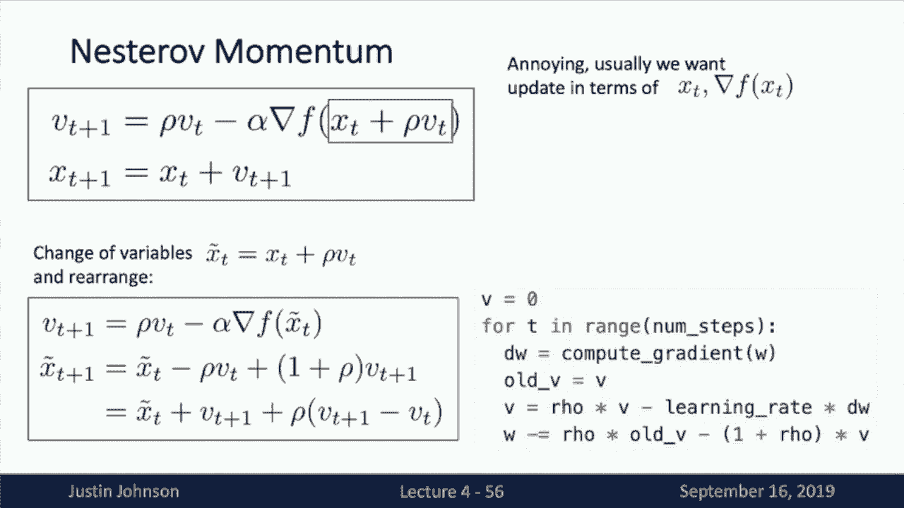

track that you'll sometimes see，now we can return to this uh our our，friend。

uh we can return to this simple example，and now compare，our uh sgd algorithm in black with sgd。

plus momentum in blue，and nestor of momentum in green and we，can see that。

they both accelerate the training，process quite a lot，that because we're building up this。

velocity vector over time，they're somehow able to accelerate in。

quick and quickly moving regions of the，objective landscape，and then uh slow down and sort of。

converge towards the end，uh you can see another feature here of，that's very common with。

momentum methods is that they tend to，overshoot at the bottom，so because we're building up this。

velocity over time，either with traditional or nestor，momentum then we've actually got some。

non-trivial velocity by the time that we，get to the bottom of the bowl。

uh yeah question the question is why is，the nest drug lime，green with a black overlay i think it's。

because i'm bad at javascript and i，didn't implement this in a good way。

but um yeah that's not significant it，should just be a nice clean green line。

um so but then you can see that that uh，both，they've had both nesterod and，traditional momentum。

kind of have a slightly similar，character in that they build up the，velocity over time。

and then overshoot at the bottom and can，so any any questions about these。

so any any questions about these，momentum-based methods，well these are okay so then these are。

these are actually very commonly used in，practice to train not only linear models。

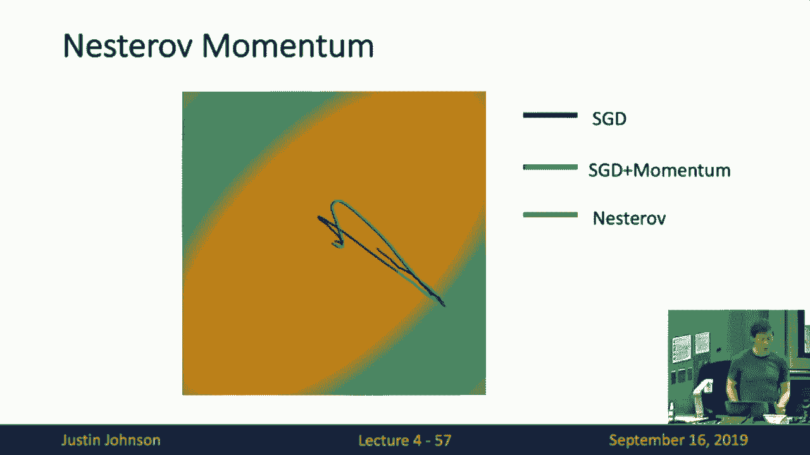

um but also a lot of deep learning，models as well，so then moving ahead there's another。

kind of category of object，optimization functions that we sometimes，see um which is this notion of。

sometimes called adaptive learning rates，and a classic example here is the，atograd algorithm。

here we similarly want to find some way，to overcome some of these problems that。

we talked about with sgd，but now with autograph we're going to。

overcome it in a slightly different way，so rather than tracking this whole this。

this historical average of，gradient values instead we're going to，keep track of a historical average。

of squares of gradient values and now，when we make，then you can see up here in the in this。

in this algorithm，we're keeping a running average a，running sum of all the element y。

squared values of the gradients that we，see during overtime，and now when we make our step then we。

end up dividing by the square root of，this historical sum，so this seems like kind of a funny thing。

to do and it's not exactly clear what's，going on here，so to motivate this at a grad。

optimization algorithm we can think back，to this taco shell-shaped landscape。

and you can think about what happened，what does the autograd algorithm。

do in this in this uh in in uh when we，have this objective landscape。

well what's going on is remember the，problem here was that we had。

in this in this objective landscape we，had one direction where the gradient was，changing very fast。

so then if the gradient was changing，very fast then um，this anagram will then end up dividing。

by a large value，so it will help damp down progress in，directions where the gradient is。

changing very fast，and now in the other direction where the，gradient is changing very slowly。

then add a ground will end up dividing，by a large value，so oh right no it will not dividing by a。

small value see this stuff is confusing，right you ought to work it through for，yourself。

um then you end up dividing by a small，value so it has the effect of，accelerating motion。

along directions where the gradient is，very small so then，we can hope that uh this can help us。

overcome these kind of ill-conditioned，types of objective landscapes um but now。

there's maybe a problem with autograph，so，what might happen if we run this adoge。

well if we run at a grad for a very long，well if we run at a grad for a very long。

time you can see that，our grad squared will just continue，accumulating continue accumulating。

um because squares are always positive，so then this grad square will just grow，and grow and grow。

over the course of optimization which，means that we're going to be dividing by。

a larger and larger and a larger thing，so which means that that that has this，effect of um。

sort of effectively decaying the step，size or decaying the learning rate。

um continually over the course of，learning and it's possible that，this um grad squared might end up。

getting too big，and might cause us to stop making，progress in the direction we want to。

make progress and so we could end up，stopping somewhere that's，before we get to the bottom of the。

objective landscape so，so um to overcome this problem people，sometimes use。

uh a variant or sometimes people don't，use at a grad directly。

um a way to fix this problem is this uh，another another optimization algorithm，called rms prop。

that you can kind of think of as a leaky，version of at a grad。

so just as you recall that in stochastic，gradient descent plus momentum。

we had some kind of friction coefficient，that was uh decaying the velocities。

at every iteration before we come before，we compute them，and now with rms prop it looks very much。

like adding like a atograd，with this extra friction term that's，going to decay。

our running average of square gradients，and here the hope is that by adding some。

kind of friction to our autograd，algorithm。

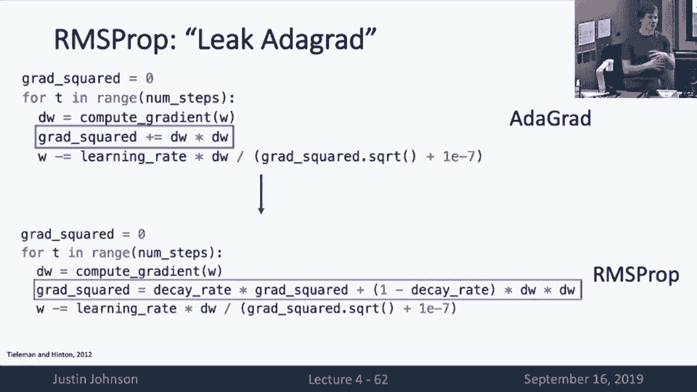

then it will cause it to make better，progress and not slow down。

all the time over the course of training，and then it's kind of instructive to。

then look back at the same example of，this，optimization problem now comparing sgd，in black。

sgd plus momentum in blue and rms prop，in red，and here we can see that they have。

fairly sorry about the red on orange，color choice maybe that was not so great。

but what hopefully you might be able to，make out if you've got really good color，vision。

is that the blue and the red have sort，of qualitatively different behavior in。

how they navigate this landscape，so when we use um this momentum-based，method in blue。

you can see that it tends to overshoot，and then come back，this，adaptive learning rates idea from。

atograd or rms proc，you can see that it sort of arrests，progress along the facts moving，direction。

while simultaneously accelerating，progress along slow moving direction。

which helps it kind of bend directly，towards the bottom，okay so that's cool now basically we've。

got two different ways that we can，augment this basic sgd algorithm。

to hopefully improve its convergence and，improve uh its。

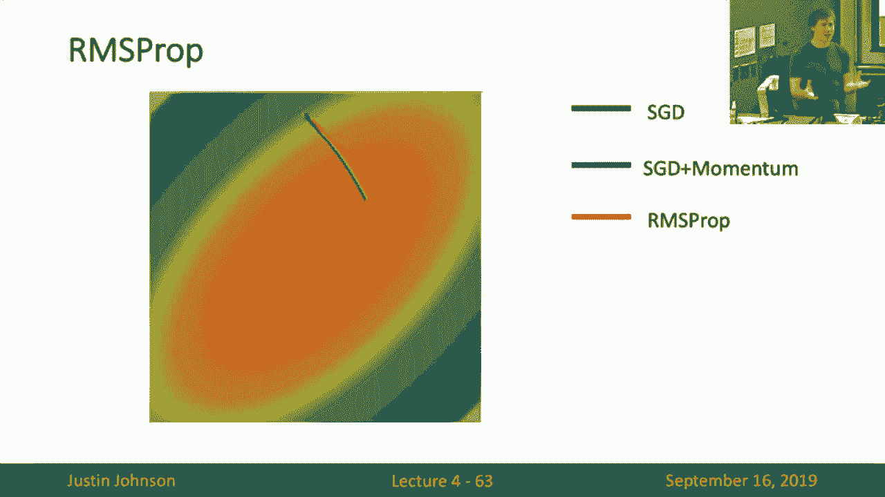

stability in these weird situations so，now that we've got these two good ideas。

um why not put them together，so there's another very common，optimization algorithm that you'll see。

used in deep learning a lot called atom，and atom is，basically rms plot rms plus momentum so。

it's basically combining these two good，ideas that we've seen，into one learning one optimization。

algorithm that uses both momentum，um as well as this adaptive learning，rate's idea our pattergrad。

so the exact formulation here is that we，keep track of，two things two running quantities during。

optimization，one is the first moment which is，somewhat analogous to the velocity that。

we saw in our in sgd plus momentum，and the other is the second moment which。

is the same as this uh leaky，exponential average of squared gradients，that we saw in rms crop。

and then when we make our final learning，step then we end up。

doing both so then you can see here this，part in red is kind of the momentum。

idea the from from sgd momentum the blue，part here is kind of this adaptive。

learning rates idea from rms prop，and we basically put it together and。

hopefully that gives us a really good，optimization algorithm since we put two，good ideas together。

um but there's a bit of oh sorry was，there a question，okay so but there's uh maybe a slight a，happen。

with add-on um that also by the way，applies to rms problem，so that's the question of what might。

happen at the very beginning of，optimization，um especially thinking that what happens。

if our beta2 constant，which is our friction on the second，moment what if that value is some very。

large value like 0。999，well now something very bad could happen。

at the very beginning of optimization，because if you look where if you look at，the algorithm again。

we're initializing the second moment，with zero，and that's then when we make this when。

we make this first gradient step，um our if our beta two is some very some，value very close to one。

then our second moment will still be，very very close to zero at the very，first step。

so then when we take our very first，gradient step we'll be dividing by the。

square root of something very very close，to zero，so that means that we could end up。

taking a very very large gradient step，at the very beginning of optimization。

and that could stop that could some that，can sometimes lead to very bad results。

so the full form of atom actually has a，third good idea，which is to add a bit of bias correction。

to overcome this problem，that might happen at the very beginning，of optimization。

so here the the the basic idea is that，we want to make smaller steps at the。

very beginning of optimization，as we as we try to build up robust。

estimates of those first and second，moments，um so there's you can look at the paper。

for a full derivation of exactly why，this form of bias correction is correct。

but the idea is just to overcome this，problem of uh，your your moment estimates are biased。

towards zero at the beginning of，optimization，so by the way this this um this atom。

algorithm actually works really well in，practice for a lot of deep learning，systems。

so this is definitely my go-to optimizer，when i'm trying to build a new deep，learning system。

and as a bit of a pro tip um if you use，atom with beta 1 is 0。9，beta 2。999 and learning rate is。

somewhere in the regime of 1 minus 10 to，the minus 3 or 10 to the minus 4。

that actually seemed that surprisingly，tends to work kind of out of the box。

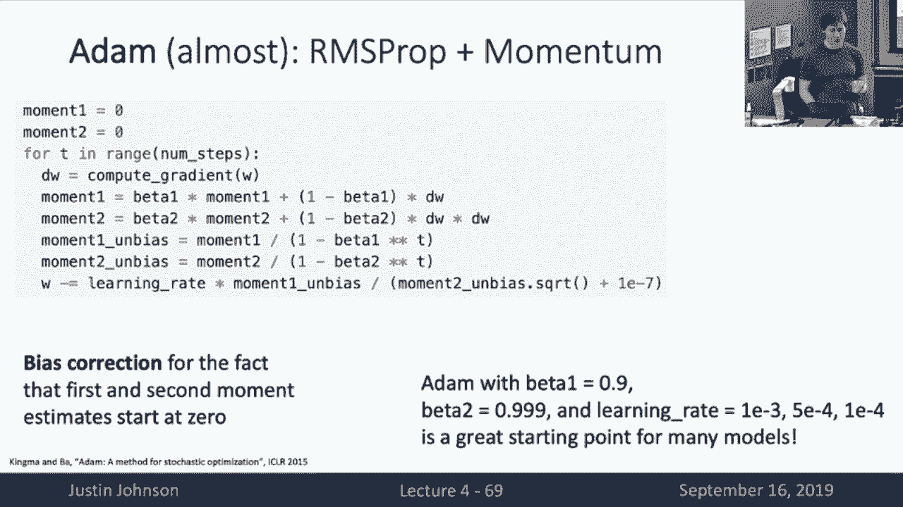

on a very wide variety of different deep，learning problems，and um to kind of drive that point home。

i took some excerpts from some of my own，recent papers，where we showed like these five。

different papers that are using deep，learning systems for very different，types of systems。

but they're all using atom this one uh，this one we did a bad job didn't record。

the learning rate that was bad，um this one we were using atom one minus，four out of one minus four。

atom ten to the minus three uh adam and，the minus three，so uh these papers were all doing very。

different tasks，but it turns out that atom is a very，robust optimization algorithm。

that tends to work across a wide variety，of tasks with fairly minimal hyper，parameter tuning。

so when you're designing your own，network from scratch it's usually a，pretty。

good go-to optimizer when you're first，and now after hyping up adam we've got。

and now after hyping up adam we've got，to look at this diagram to see actually，what it does。

and now because we remember we had this，notion of atom，as trying to combine the good parts of。

momentum as well as these adaptive，learning rates，at a grad and when we look at this at。

this picture here，we can some we can somehow see that it，has properties of both of those。

optimization algorithms，so we can see that some somehow like the，momentum based method。

it tends to build up some velocity and，overshoot and come back，but its overshoots are maybe less。

drastic than in the full then using，and，like rms prop or atograd it tends to。

kind of bend in the right way towards，the minimum，and you can it tends to work well for a。

lot of problems for that reason，so again um i i kind of need to caution，you again against。

making intuitions about high dimensional，spaces，based on low dimensional problems um so。

even when i'm putting all these pictures，like this about how these optimization，algorithms behave。

you really should take this with a huge，shaker of salt，um because remember at the end of the。

day we're really training we're going to，be training on very high dimensional，spaces。

so the behavior in those very high，dimensional spaces could look quite。

different than in these low dimensional，projections that i'm showing you。

but i think it's still useful to look at，these kinds of things to at least get a，very coarse。

sense of intuition about what these，algorithms are doing but try not to put。

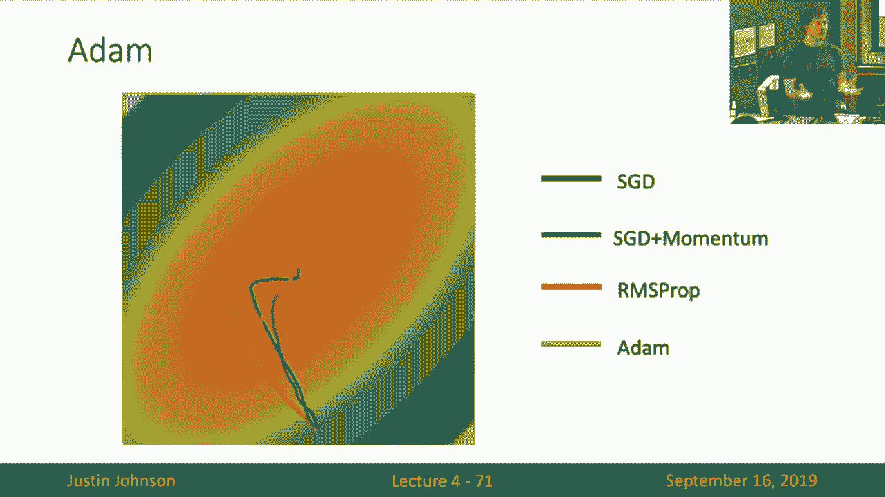

too much faith in，exactly what you see in these animations，okay so as a bit of summary then we've。

seen this uh，i put together this little comparison，table of these different optimization。

algorithms that we've talked about，and we can see that they kind of build。

up and iteratively add more features as。

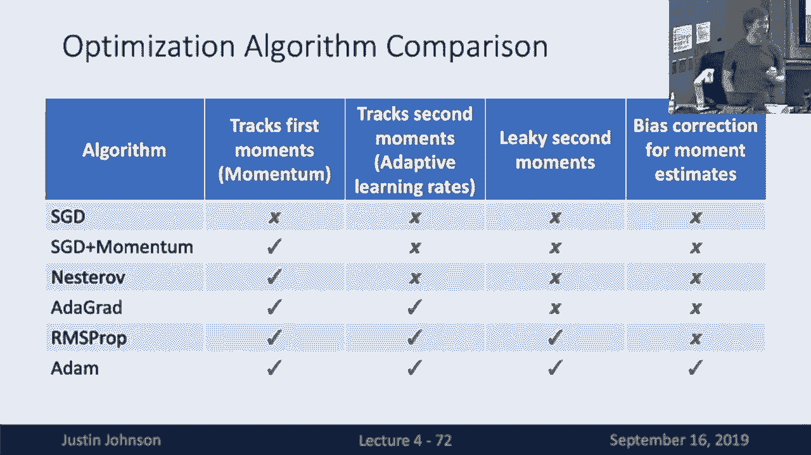

we go along，but this is maybe meant as a bit more，review for you guys。

so so far all these algorithms are what，we call first order optimization，algorithms。

because basically what they're doing is，they're using information about the，gradient。

and only the only the first derivative，to make their gradient steps。

so what we can think about them as doing，is basically they're forming a linear。

approximation to the function，and then they they form this linear。

approximation to the objective function，we're trying to minimize。

which are using the gradient so then in，a high dimensional situation you might。

imagine that we have this tangent，hyperplane which is computed using the。

value of the gradient at the current，point，and then we step down on this tangent。

hyperplane in order to try to minimize，can，easily naturally extend this thinking to。

use higher order gradient information，so in addition to using the gradient。

which is the first derivative，we might also form we then could form a，quadratic。

approximation to our objective function，using both the gradient，as well as the hessian which is the。

second derivative at every point，and then the idea here is that now we。

could form some quadratic surface，which locally approximates our our，objective function in question。

and then step towards minimizing this uh，this quadratic approximation。

and this idea is nice because it lets us，let the algorithm more adaptively choose。

how big it could it should step，because uh maybe at a point like this。

where the gradient is rather high and，the curvature is rather high。

maybe we should take a fairly small step，but at a point over here。

um we by looking at the second order，curvature information，we can see that maybe it might be safer。

to take a larger step，so this idea of second order，optimization um。

is uh maybe more robust in setting，learning rates or in setting step sizes，for itself。

and indeed you can see algorithms like，autograd and sgd momentum。

as some kind of diagonal approximation，to these second order algorithms because。

they're trying to use by integrating，first order information over time。

that's somehow forming some type of，approximation to the second order，curvature information。

which again gives us a bit more，intuition about why these，momentum based methods or adaptive。

learning based methods，might be a good idea so then a permanent，math we could write down the second。

order order optimization，by uh writing down this quadratic taylor，approximation to our function。

and then solving to write this w star，value um，that was step to the minimum of the。

quadratic optimizer，but there's a problem is that this is，actually not。

used so much in practice for a lot of，deep learning systems，and the problem here um can anyone spot。

it，well the problem is that there we want，to work in high dimensional spaces。

right so when we want to work we want to，be able to optimize models with tens of。

thousands or millions of parameters，and now the hessian nature the gradient。

is fine the gradient has the same number，of elements as the wave matrix itself。

so if we can store and manipulate the，weight matrix we can also store and，manipulate the gradient。

but the problem is now the hessian，matrix is a matrix，so if we if our objective if our uh。

weight matrix has n values，then the second order repression matrix，has n squared values。

and now if we have like a hundred，million parameters 100 million squared。

is like way too big you're not going to，have enough memory，and now even worse is if you look at。

this at this equation，we actually need to invert the hessian，and now inverting that inverting a。

general matrix，is now cubic in the size of the matrix，so now inverting this thing is going to。

be like 100 million cubes like heat，death of the universe situation like we，don't want to go there。

so in practice um these second order，optimizers are sometimes used for low。

or low dimensional optimization problems，um but they're not used so much in。

practice for very high dimensional，um let's uh let's get that so then in。

um let's uh let's get that so then in，practice，kind of when you're training your own。

models then adam is a very，nice default choice in a lot of a lot of，situations um。

and so that's kind of a good go-to，algorithm when you're trying to build a，new deep fighting system。

um although i should also point out that，uh sgd plus momentum。

is also used in practice quite a lot as，well，so in practice you'll typically see most。

deep learning papers use，one of these two optimization algorithms。

um so my general rule of thumb is to go，with adam at the very beginning。

because it's fairly easy to get to work，and it tends not to require too much。

tuning of those hyperparameters，those default values that i gave you，some pro tips about。

tend to work out of the box for a lot of，different problems um whereas sgd pulse，momentum。

can sometimes actually give better，results but might require a bit more。

tuning of the hyperparameters，and in future lectures we'll talk more。

about some of the strategies you might，employ，um for using as for uh hype for tuning。

the hyper parameters of something like，sg momentum，um and in if for some reason you can。

if for some reason you can afford some，kind of second order optimization。

um that maybe your problem is low，dimensional uh maybe your problem is not。

stochastic because second order，optimizers tend not to do well with，stochasticity。

then you might consider yourself using，some kind of second order optimizer。

lbfgs is a good uh is a good one for，that。

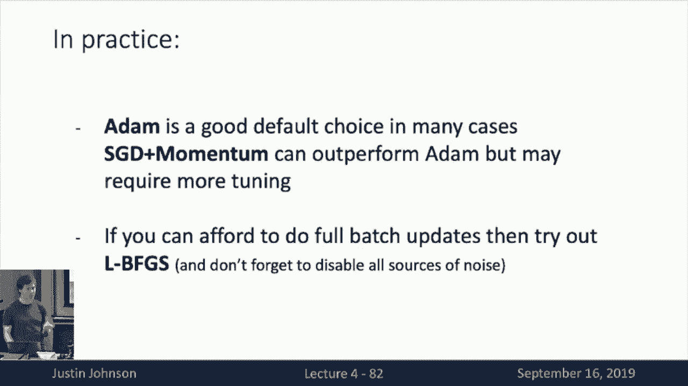

but in practice the ones you'll usually，see are atom and sgd momentum。

but by this point now we've talked about，how we can use linear models。

to solve image classification problems，then in the last lecture we talked about，how we can use。

loss functions to quantify how much we，care about，different values of the weight matrix in。

our linear models and now in today's，lecture we've seen how we can use。

stochastic gradient descent and its，cousins to efficiently optimize these。

high dimensional loss surfaces，so now the next so now we've kind of，equipped ourselves with a lot of。

different tools。

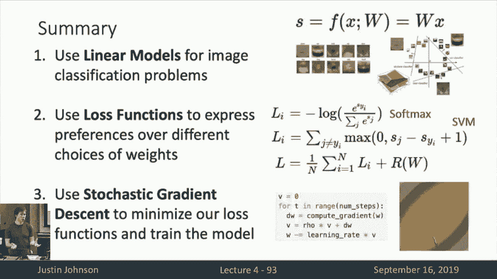

working up towards solving this deep，learning problem so now in the next。

lecture we'll finally start talking，about neural networks，and we'll see that by we can just simply。

replace，this linear classifier with more，powerful neural network classifiers。

and the rest of what we've been talking。

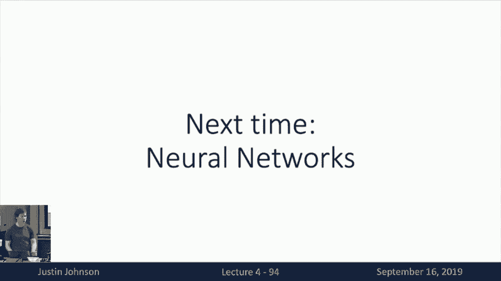

about will allow us to train much more。