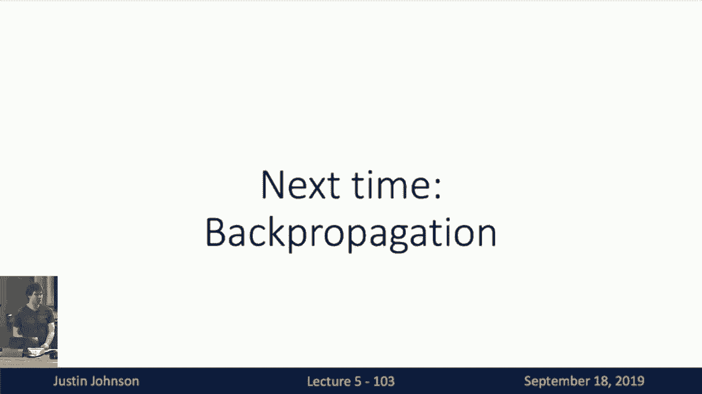

# P5：L5- 神经网络介绍 - ShowMeAI - BV13P4y1t7gM

so welcome back to lecture five uh today，so welcome back to lecture five uh today。

the microphone is actually working so，hopefully，that uh that will give you a little bit。

better audio this time and i don't have，to shout quite as loud。

uh today we're work work today's topic，is uh neural networks。

we're finally getting to the meat of the，course and we're finally talking about。

our first deep learning models，so so far we've talked about using，linear models as a way to。

to build a parametric classifiers we've，talked about using different kinds of。

loss functions to quantify how happy or，unhappy we are with different。

uh with different settings of the，weights in our linear classifiers。

and in the last lecture we talked about，using stochastic gradient descent。

or some of its slightly fancier，relatives like momentum and atom and rms，prop。

for actually minimizing these objective，functions and finding values of the，weights that。

satisfy our preferences as specified by，the objective function，and today we're going to iterate on。

point one and we'll step away from，linear models for the first time。

and start to explore neural network，based models that will be much more，powerful。

and allow us to classify images with，much higher accuracy，but before we talk about neural network。

based models we need some i think we，should step back and motivate them a，little bit。

so as we've talked about several times，already across，the left across the semester so far。

we've seen that linear classifiers，although they're very simple and easy to。

understand are really quite limited in，the types of functions that they can，represent。

and their functional power is somehow，not as well not as good as we would like，them to be。

we saw this from the geometric viewpoint，recall that from this geometric。

viewpoint of a linear classifier，the we saw a linear classifier as kind。

of drawing high dimensional hyperplanes，to carve up this high dimensional。

euclidean space into two chunks，and with with situations like that on。

the left it's just impossible for a，linear classifier to possibly，carve up the space in a way that。

separates the green points from the blue，points，um when we thought about linear。

classifiers from the visual viewpoint we，had this notion of，linear classifiers learning just a。

single template per class，and that therefore they were unable to。

represent multiple modes of the same，object category，for example we saw that in the horse。

template it kind of blends the horse，looking to the left，and the horse looking to the right and。

this is somewhat of a representational，shortcoming，in the linear classification model well。

before moving to neural networks，i think we should discuss a different。

way to overcome this limitation of，linear classifiers，and that's the notion of feature。

transforms so here the idea with feature，transforms，is that we will take our original data。

which is given to us in some native，input original space on the left and，then we will。

apply some cleverly chosen mathematical，transformation，to the input data to now transform it in。

a way that will hopefully be more，amenable to classification，so as an example here on the left we we。

maybe with our human intuition，we think that maybe transforming this，data from cartesian。

into polar coordinates would be a better，representation of this data for the。

purpose of classification，so we can imagine writing down this，feature transform。

which simply converts the the cartesian，representation of our data。

into this polar representation of our，data and after we apply this。

feature transformation to this input，data it now，lives in some new space that we call a。

feature space that is defined by the，mathematical form of the feature，transform that we've chosen。

but what's particularly useful about，this feature transform for this problem。

is that now after transforming this，input data set，from cartesian to polar we can see that。

in polar coordinates this data set，actually becomes linear，linear linearly separable so now we。

could imagine training a linear，classifier，not on the original input data space but。

instead training a linear classifier，on the featured on the feature space，representation of our data。

and then if we imagine what if we，imagine porting this linear decision，boundary in the feature space。

back into the original space on the left，we can see that a linear just a linear。

classifier or a linear decision boundary，in the feature space，corresponds to some kind of non-linear。

descent decision boundary，or non-linear classifier in the original，space。

and and so by cleverly choosing a，feature transform that suits the，properties of your data。

it may be possible to overcome some of，the limitations that we've seen with。

linear classifiers so far，and for this particular example of，transforming from cartesian to polar。

seems kind of trivial but in general we，need，when you think about applying feature。

transforms more broadly you have to，think very carefully about the structure。

of the data that you're working with，and think about what types of functional。

transformations you might consider，applying to your input data that might，make it more amenable to。

to feature to linear classification，downstream，and this is not just a hypothetical。

thing this actually is，this this notion of feature transforms。

was very broadly used in computer vision，um and even still is in some in some sub，domains。

one example of a feature transform that，we might use in computer vision。

is a notion of a color histogram so here，we can imagine，uh taking each pi dividing the color。

space the rgb spectrum of color space，into some number of discrete bins and。

then for each pixel and our，input image we could assign where it is，in the bin。

uh in in the bin representation of our，color space and now the feature，representation。

could be some kind of normalized，histogram over what colors happen to，appear in the image。

and this this type of this this，color histogram representation of an。

input image somehow throws away all the，spatial information about images。

and only cares about what types of，colors are present in the image，so you might imagine that a color。

histogram representation，might for example be more spatially，invariant so suppose that we。

we had maybe uh a car image like a red，car on a brown background。

and all of our car images were of this，nature but the car might appear in。

different locations in the image，then a linear classifier might have a。

hard time dealing with that kind of，representation，but a color histogram representation。

would always represent it as a bunch of，red and a bunch of brown。

um no matter where in exactly in the，image the car might be located or the，frog in this case。

so this was this is one fairly simple，feature representation that you might。

imagine applying to input images，another feature representation in images。

that was very very widely used，is the so-called histogram of oriented，gradient approach。

this i don't want to talk about in too，much detail the basic idea is that it's。

it's somewhat dual to the color，histogram，approach so in the color histogram。

approach we saw that it threw away all，the spatial，we threw away all the spatial。

information and it didn't care about，textures or locations，and it only cared about what colors were。

present in the image the，histogram of oriented gradients，representation does something of the。

opposite，it throws away all of the color，information because it only cares about，local edge。

orientations and strengths and instead，it tells us something about the local，orientations of edges。

and the local strengths of edges at，every position in the input image。

so the histogram of oriented gradients，representation could tell us that。

for example in the red region there is a，fairly strong diagonal edges in that，region。

in the blue region around the frog's，eyes there are edges in all different，kinds of directions。

and in the yellow region in the upper，right corner of the image there's very。

little edge information at all because，it's a blurry background。

very photographic and beautiful so this，histogram of oriented gradients。

representation is somehow dual to the，notion of the color the color histogram。

representation that we saw before，and this was very widely used in。

computer vision for tasks like object，detection and many other tasks。

in the mid to in the mid to late 2000s，but one interesting feature of a feature。

of both of these feature representations，is that they sort of require the，practitioner to just。

think about what is the right qualities，of their data that they want to capture。

with the feature representation，and requires the practitioner to think，ahead of time about。

how to design the right types of feature，transforms，well there's there are there exists。

other types of feature transform methods，that are somehow data driven。

that are actually driven by the data，that we see in our training set。

that drive the the one one canonical，example，of a data-driven feature transform is。

the so-called bag of visual words，representation，here the idea is that we have some large。

training set，of images so that and then from our，training set of images we're going to。

extract a large set of random patches，of various scales and sizes and perhaps，aspect ratios。

cropping out random bits of all of our，training images，and then we will cluster all of those。

random patches of our training images，to get what is called a code book or a，set of。

visual words that can represent what，types of features tend to appear in our，images。

the idea here being that if there are，common types of structures in your。

images that appear in many many，images in your training set then you。

will hopefully learn some kind of visual，word representation that can capture or，recognize。

each of the many of those common，features that appear in your training，set。

um so then after this step one of，building your code book of visual words。

there is some step two that encodes your，image using the learned。

code book of visual words here we will，take this code book of visual words。

that is cluster centers of all the local，image patches，and compute some kind of histogram。

representation for each input image，to say how much does each of those。

visual words appear in that input image，representation，and this you can imagine is quite a。

powerful type of feature representation，because it not it does not require the。

practitioner to fully specify the，functional form of the feature，representation。

it instead somehow allows the features，to be that are，used in the feature representation the。

visual code book words in this case，somehow they're able to be learned from。

the training data to better fit the，problem at hand，so this is maybe a bit more flexible。

than some of the other feature，representations that we saw previously。

but another common trick with image，features is that you don't have to，settle for one。

you can imagine having a bunch of，different feature representations of，your input image。

and then concatenating them all together，into one long feature vector。

you might concatenate a color histogram，representation at the top。

with some bag of words representation in，the middle with some histogram of，bottom。

to get some kind of long long high，dimensional feature vector，that describes your image in various。

that were different，parts of the feature representation now，capture maybe different types of。

information from the input image like，color or edges or whatnot，and this this this idea of combining。

multiple types of feature，representations，was very very widely used in computer，vision in the late。

late 2000 in the 2000s and early 2010s，as a canonical example of that actually。

the winner of the 2011 imagenet，challenge，used some kind of complicated feature，representation。

uh to to actually this was the state of，the art in image in large scale image，classification。

as of 2011 which was of course the year，right before，the alex net architecture made deep。

learning kind of very popular across all，parts of computer vision，but if we look back at this 2011。

imagenet winner we can see that they，have some，they first took some low-level feature。

extraction where they extracted a bunch，of patches from the image。

images they extracted sift and color，representation they reduced the。

dimensionality of those to pcm using pca，they applied something called fischer，vector fischer。

fischer vector encoding to compress and，get another layer of features on top of。

those original features，they did some compression step and after，that they end up with some kind of。

feature representation，upon which they can learn linear svms to，finally classify。

learn a linear classifier on top of this，complicated，feature representation。

so this this pipeline of coming up with，feature representations for images。

actually can perform reasonably well in，some contexts，but one way i'd like one way i like to。

think about feature extraction，is something like the following diagram。

here on the here on the top here，we imagine if we have some kind of。

machine learning image classification，pipeline，that's built with feature extraction。

basically what we've done，is we've decomposed our system into two，parts one is the feature extractor。

that may and one and the second is the，the learnable model，that will actually operate on top of。

that feature representation or that，feature space，and typically this feature extraction，stage is not。

even even if this feature extraction，stage has some kind of data driven，component。

like we saw in the bag of visual words，example，this feature extraction stage is not。

necessarily going to，automatically tune itself in order to，directly。

maximize the classification performance，of the overall system，instead somehow when we learn a linear。

classifier on top of a fixed feature，representation，we have this we end up with this very。

large complicated system，that goes from raw image pixels all the。

way to our final classification scores，but only a small part of that system at。

the very end is actually tuning its，tuning itself or，tuning its weights in response to trying。

to maximize the classification accuracy，of our system，in contrast as so then in contrast well。

clearly here we might want to do，something better which is to somehow，automatically tune。

all parts of the system to maximize the，performance on image classification，tasks。

and that's one motivation to think about，what a neural network is doing。

when we build a neural a deep neural，network system for image classification。

what we're doing is building a single，end-to-end pipeline that on the，left-hand side。

takes in the raw uh the raw the raw，pixels of the image，and on the right hand side is predicting。

these classification scores or，classification probabilities，or uh whatever else you actually want to。

want to predict，and then during the process of training，we will tune not only that that final。

layer that's，that's using some linear classifier we，will tune the entire system。

all parts of the system jointly in order，to maximize the performance of，classification。

or whatever other end task we're，considering and then from this point。

of view it seems that a neural network，based system is really not so different。

from these large deep feature，representation systems，basically the change is that a neural。

network is somehow，jointly learning both a feature，representation and。

a linear classifier on top of that，feature representation in such a way to。

maximize the classification performance，of our system，with this introduction we can finally。

talk about our a concrete，example of what exactly a neural network，might look like。

so far in this class of course we're，very familiar with this linear，classifier。

right given our input data which is，stored in a giant column vector x。

then our linear classifier is going to，have a learnable weight matrix w。

of size number of input dimensions by，number of categories，and the linear classifier is this matrix。

vector multiply between the input data，now，our simplest neural network model is not。

much more complex than the linear，classifier，now we've generalized this system rather。

than have we we still，we still represent our input data with a，single long column vector where we。

stretched out the raw pixel values of，all of the all of the，parts of the image into one big vector。

but now we have two learnable weight，matrix matrices，one of these learnable weight matrices，is w1。

which is now shaped number of input，dimensions by h，h is called the hidden size of r of the。

neural network，and we and then we first do a matrix，vector multiply between。

our input data x and our first learnable，weight matrix w to produce some new，vector of dimension h。

then we apply this element-wise maximum，function upon，we，we perform a second matrix vector，vector。

and our second learnable weight matrix w，2 which，is of size of h by by or c by h where，uh。

this for this functional form of a，neural oh and of course i should also，point out。

then in practice each of these matrix，vector multiplies will typically also。

have an associated bias term，that will also add a learnable bias uh。

whenever we do a matrix vector multiply，but that but writing down the bias。

clutters the notation quite a lot，so in practice you'll see people often。

omit bias terms and equations，when they actually do indeed use them。

when training their system so i've，wanted to indoctrinate you to this。

confusing bit of notation um even for，from our first slide on neural networks，and of course。

this idea of generalize of this we can，generalize this notion of neural，networks。

beyond two weight matrices we，contributely generalize to any number of，weight matrices。

where at each stage what we're going to，do is take our current input our current，input vector。

apply a matrix multiply and hit add a，hidden bias，apply this element-wise maximum function。

and then repeat repeat repeat，until we've applied all of our learnable，weight matrices in the system。

we'll often see this type of system，drawn pictorially with a diagram kind of，like the following。

where on the left we a map so here we，imagine data flowing through this neural。

network based system from left to right，and on the left is our input data which，our，the mid。

in the middle we have this hidden vector，h which is maybe of size 100。

100 elements in this hidden vector in，this example and then on the right are，our final score vectors。

uh maybe s giving 10 classification，scores part-time categories here。

and we imagine these weight matrices as，living in between each of these multiple。

layers of our neural network where we，can interpret these weight matrices。

as somehow telling us how much each，element of the previous layer。

influences each element of the next，layer，where for example if we look at element，i comma j。

of the first learnable weight matrix w1，then this，this is a scalar value of the weight。

matrix that tells us，how much does how much is the element h，i in the hidden layer influenced by the。

input element xj in the input，and you can look at a similar，representation a similar interpretation。

of the second weight matrix w2，showing how much does each element of，the hidden vector。

affect each element of the output scores，and because these are dense general。

matrices we can recognize that，in this particular structure here we see，that each element。

that that each element of the input x，affects each element of the in the。

hidden dimension of hidden vector h，and similarly each element of the hidden，dimension vector h。

affects each and every element of our，final score vector s，so because of this dense connectivity。

pattern this type of neural network is，typically called a fully connected，network。

because the units in each layer of the，network are all connected to one another。

so it's fully connected，and this type of structure is also，sometimes called a multi-layer，perceptron。

or mlp this is in reference way back to，the perceptron learning algorithm that。

we talked about in the first lecture，i think it's it's maybe a strange bit of。

terminology but you'll definitely see，type，as mlps so you should be aware of that，bit of notation。

now we can think we can add a little bit，of extra interpretation to what exactly。

these neural networks are computing，so if you'll recall in the linear，classification case。

oh sorry was there a question that's a，great question uh the question you asked。

what was the purpose of the max，i'll get back to that in about four。

so one way that we can think about this，so one way that we can think about this。

neural network based classifier is in，contrast to a linear classifier。

so if we'll as we'll recall the linear，classifier we interpreted as learning。

this set of one templates per class，and then the scores were then the inner。

product between each of our large，templates，and the input image that somehow said。

how much does each of those templates，each how much does our input image match，each of the templates。

well now we can interpret the weight，matrix the first，weight matrix of the neural network in a。

very similar way，where somehow now the first layer of the，neural network the weight matrix。

in that first layer w1 also learns a set，of templates，and one way that we can interpret the。

values in the hidden layer，is is as how much does each，how much does each of our learned。

templates respond to the input image x，images，are not most of these templates are not。

very interpretable，you can't really always tell what's，going on with these templates。

but there is definitely some kind of，discernible spatial structure。

that these temp that these first layer，features or first layer templates。

have learned in this two-layer neural，network system，but sometimes you get lucky and。

sometimes you do get some beautiful，layers in this first layer so i don't。

know if you noticed but uh maybe i've，looked at these too long，but for these two examples here they。

actually look to me like one，is a horse facing one way and the other，is a horse facing the other way。

so now this this is like finally，overcoming this two-headed force problem。

that's been plaguing us for the past，couple weeks，as we with linear classifiers。

and then of course the second layer of，the neural network is then somehow。

predicting its classification scores，by recombining the by having another，weighted recombination。

of the responses of the input image，these templates so what that means。

is that the neural network could then，hopefully somehow finally，recognize multiple types or multiple。

subsets of a category，where it could recognize both the，left-facing horse using one template。

and the right-facing horse using another，template and then use the weights in the，second layer。

to recombine the information from both，of those two templates，but this is sometimes called a。

distributed representation because um，really this this，two two faces horse two facing horses。

example is really quite rare，the more common case is that most of the。

time the features and the the features，or the image templates that we learn in。

the first layer of the neural network，are not very human interpretable instead。

they have maybe some kind of spatial，structure，and then and this there's this notion of。

the neural network using a so-called，distributed representation。

to represent the images where somehow by，having some kind of，linear combination of each of these。

templates the network represents，something about the image，but we can't it's not super。

interpretable to us what exactly those，different templates are trying to，capture。

and of course once we have the oh yeah，was there a question so the the question。

is there there seems to be some，repeated structures in these templates a。

lot of them have this uh structure of，like a red blob and then a blue blob。

i don't know that's what i decided to，learn um that's kind of the mystery and。

the magic of neural networks，you don't always know what exactly types。

of features they're going to learn but，they're going to learn something that's。

trying that's going to maximize the，classification accuracy，um my my intuition here is that those。

are representing some kind of car，um because i think there's a lot of cars，in the cfr10 dataset。

another really common pattern that，you'll often see in the learned first。

layer features of neural networks，is that they often represent oriented。

edges just as we saw in the huble and，weasel example when they were。

investigating the human or mammalian，visual system，by presenting different visual stimuli。

and see how human neurons，that，many of our own neurons in our visual。

system end up being sensitive to，oriented edges，and with these neural network systems。

you often get a similar，type you learn tend to learn similar，types of features in many cases。

where you learn either oriented edges or，um opposing colors，so in this case the blue and the red is。

maybe some kind of opposing color scheme，and you can imagine that by recombining。

many of these uh many of these features，it can represent something about the。

structure of the image yeah，so the question is is there some risk of。

redundancy that maybe we learned，multiple filters to represent the same，thing。

and that's definitely a possibility but，there exists some networks some。

techniques actually for network pruning，that i think we'll talk about later in。

the semester um whereby you can，first train a neural network that's。

maybe big and represents a lot of stuff，and then as a second post-processing。

step you can try to prune out the，redundant representations that have been，learned by the network。

so that's something that uh people，sometimes do in practice but we're not。

going to cover in this lecture，now with this notion of neural networks，you can definitely imagine。

generalizing this to many many layers as，we've already seen and for a bit of，notation here。

the depth of the neural network is，usually uh is the number of layers that，it contains。

um and when we count layers we usually，count the number of weight matrices。

so our two layer network would have two，learnable weight matrices。

um this would be a six-layer network，because it has six learnable weight，matrices。

and then the the width of the network，would be the number of units or the the。

dimension of each of those hidden，representations，um in practice you could imagine that。

each layer might in principle have a，different feature dimension at each of，those hidden layers。

but in practice what's more it's more，common to set the same，width throughout every part of the。

then we had this this very astute，then we had this this very astute。

question a couple a couple minutes ago，about like what is this funny max doing。

hanging out in this neural network，equation，well this turns out to be quite an，important feature or。

quite an important component of the，neural network this this function。

max of zero and the input is uh takes，takes an element-wise maximum between，zero and the input。

um which means that we input a vector，and then anything negative we throw away。

and set it to zero instead，it's so，important and so widely used that it's。

given the special name relu，for a rectified linear unit and we have。

a plot of this beautiful function here，on the left you can see that。

um if the argument is positive there's，nothing if the argument argument is。

negative we return 0 instead and，this function we imagine as being，sandwiched in between。

our two learnable weight matrices in the，neural network and this，function is called the activation。

function of the neural network，and it's super it's actually completely。

critical to the functioning of the，neural network，so as a as a thought exercise you should。

think to yourself，what if we built a neural network system，with the following structure。

that had no activation function in，between the two，weight matrices what if we took our。

input vector multiplied by one by our，first weight matrix，w1 and then multiplied by our second。

weight matrix w2，what would be what would be wrong with，this type of neural network-based，approach。

yeah exactly it's still a linear，classifier because，if by then we know that matrix。

multiplication is associative，so you could imagine grouping those two。

matrix matrix multiplies together，and this just devolves back into a，linear classifier。

so without some kind of lit a non-linear，function between our two matrix，multiplies。

we have that we we have no additional，representational power，beyond a linear classifier uh so the。

this choice of activation function，and the presence of an activation。

function is absolutely critical to the，functioning of the neural network。

i could point out that some sometimes，these these networks with no activation，function。

are called deep linear networks and，they're sometimes studied in the，optimization community。

because even if their representational，power is the same as a linear classifier。

the optimization dynamics are actually，much more complex than that of a linear，classifier。

so sometimes people do actually study，these in the theoretical context。

in the context of optimization um there，so in this first example of a neural，network we've。

we've chosen this activation function to，be this rayleigh function，but there's a whole menagerie of。

different activation functions that，people out there，work with sometimes very common one one。

very common that was used maybe before，the mid-2000s was this。

sigmoid activation function that starts，off at zero and then ramps up to one。

and there's a whole other there's a，whole zoo of these things that people，work with sometimes。

um that i think we'll we'll talk about，the choices behind these for different。

reasons for why you might choose one，over another，um in a later in a later lecture but the，tl dr。

is that rayleigh was a pretty good，default choice um and for most，applications。

sticking with relu you probably can't go，wrong so this is definitely the most。

widely used activation function in deep，learning today，and you should probably consider using。

this for most of your deep learning，applications，now i also want to point out that this。

neural network system is actually，super simple to implement we can。

actually train a full neural network，system in just 20 lines of code。

here i'm doing numpy instead of pytorch，because i can't give away your homework，right。

um and here uh what we're doing is that，uh the first these first couple lines。

are setting up a bit of uh setting up，some random data and some random weights。

um the second bit of lines is doing uh，this，forward pass that we call where we。

compute the score function as a function，of the input，we've also used a sigmoid non-linearity。

here as well，which is that first line up top here we，compute the gradients with respect to。

our weight matrix，and here we take our gradient descent，step so you can see that this neural。

network system is actually quite simple，to implement，and if you actually copy paste this code。

and run it in your terminal um you'll be，training your own neural network in 20。

lines of python so that's pretty，exciting，now when we talk about neural networks。

there's one word that，people often get hung up on and that's，this word neural。

um so i think we could not have a course，on deep learning without at least。

acknowledging the presence of the word，neural in our neural network models。

so we have to talk about that a little，bit but i'm not a neuroscientist by any。

stretch of the imagination，so please i i i expect that i could say。

something slightly wrong with respect to，neuroscience but i'll do my best。

and please don't actually ask me too，many hard questions about neuroscience。

so i'm not a neuroscientist，but i gotta talk about this somehow um，but the basic idea here。

is that our brains are by our amazing，biological organisms，and the basic building block of our。

brain is this little cell called the，neuron，and neurons i guess look something like。

this if you search them on google，and uh i i think they actually look like，this。

and they have a couple important，components in these cells one is they。

have a cell body in the middle where，kind of all of the all of the juice is，happening。

then they've got this long terminal out，to the right called the axon。

where where this this neuron will be，sending electrical impulses out from the，cell body。

down the axon and now these these，neurons are all connected in these giant，networks。

where these axons are then sending，electrical signals to other neurons。

um the electrical signals from axons are，received by these other little little。

protrusions from the cell body，called dendrites and the gap between the。

dendrite of one neuron and the axon of，the other neuron，is called the synapse and what basically。

happens here，is that this neuron in the middle is，going to collect electrical impulses。

that are that are coming down the axons，of all of the，incoming neurons on the left those。

electrical impulses will be somehow，modulated or modified，by these synaptic connections between。

the dendrites and the axons，and then at some point based on the，based on the the rate。

and transformation of the electrical，signals，that are happening then eventually this。

neuron will send down some other，electrical signal downstream。

to the other neurons that are connected，downstream，and one way that we can one kind of。

abstraction that we can think about，these neurons，is by representing them using a firing。

rate that these neurons are maybe firing，electrical impulses at some rate。

and the rate at which our electrical，impulses fire is maybe some kind of，non-linear function。

of the rate of all of the input the，input connections that we get from all。

of the input neurons on the left，so then we can imagine having this very，very simple。

very crude uh mathematical model of a，neuron，where the cell body then collects so。

then the cell body then collects，all of these incoming signals from all，of the neurons on the left。

and then sums up all of the firing rates，of all of the incoming neurons on the，left。

and then based on this sum of all the，firing rates coming in on the left。

then we apply some kind of non-linear，function maybe a sigmoid maybe a relu。

maybe other some other kind of nonlinear，function，that now computes the firing rate of。

this neuron as a function of the firing，rates of all the input neurons。

and then this this is now the firing，rate that this neuron will send off to。

other neurons downstream in other parts，of the network，and this is basically where the。

similarities end，i think uh this is a very cr this is on，the right here this is basically what。

we're doing in our neural network，systems that we use today，um and as you can see there is some。

crude approximation to biological，neurons，but there are many many many differences。

between biological neurons and，artificial neurons and artificial neural。

networks so you shouldn't get too hung，up on these similarities，one bit of similarity one bit of。

dissimilarity is that biological neurons，tend to be organized into very very，complex networks。

where that could be highly irregular，they could even loop back around。

and have one part one neuron kind of，loop back and send signals back to。

itself running around in time，so there can be very complex topological。

structures of neurons in real mammalian，brains，in contrast when we work with an。

artificial neural network based systems，we typically organize our neurons into。

layers and this these layers are，something of an artificial construct。

that allows us to perform all of these，multiplications and sums，um all jointly all at the same time。

using efficient uh，matrix and vector operations so this，notion of a layer。

is something of an abstraction to，represent this big，soup of neurons that might exist in a。

real mammalian brain，but people are getting creative and，people are starting to explore。

artificial neural network-based systems，with very crazy or even random，connectivity patterns as well。

and that can actually sometimes work in，some case so one of some of my。

colleagues at uh facebook ai research，uh had this paper last year where they。

trained neural networks with these，connectivity patterns on the right。

that look totally nuts but they actually，train and get near state-of-the-art。

performance so i guess random，connections can，if you're careful can sometimes work in。

these artificial systems as well，but the general story here is that you。

should be extremely careful with your，brain analogies，even though that word neural is hanging。

out in the term，in the name of neural networks i think，that it's really something of a。

historical term at this，point and you should not take too much，significance between。

analogies between our artificial systems，and um，actual biological neurons so in。

particular um there's，just maybe a couple caveats here in our。

artificial systems our neurons are kind，of all the same kind of，um in a real brain you might imagine。

there's different types of neurons that，have different specialized function。

um you can imagine that our neurons，could have very could perform。

inside an individual neuron it could，perform very complex non-linear，computations。

that are not well modeled by our simple，activation functions。

um you can also remember that we modeled，these neurons in terms of a single，scalar firing rate。

and that was our main abstraction that，we used to represent the activity level。

of a neuron in the brain，and that was a very very coarse，going on，inside and between neurons so this。

simple idea of a firing rate it might be，too coarse to represent what's truly，going on。

um so that's pretty much all i want to，say about brains for the semester。

so um with that let's go back to um，let's go back to math and let's go back，to engineering。

that i actually do know a little bit，about hopefully um so then one question。

is um if we're not going to take these，brain analogies with，too much seriousness then why actually。

should we choose，neural networks as a powerful image，classification system or as a powerful。

function approximation system more，broadly，well one we've already seen sort of。

coarsely how neural networks can，represent multiple templates in their，first layer。

and then recombine them in the second，layer but i think another。

interesting way to think about and see，why neural networks are such a powerful，system。

is through this notion of space warping，so this，so um here we we want to think about。

this geometric viewpoint of a linear，classifier remember with a linear。

classifier when we thought about，about them geometrically we thought。

about our data points as all living in，this high dimensional space。

and then each each row of our linear，classifier，then gave rise to some uh some plane in。

feature space，in our input space um and now then，we could imagine that the maybe this。

these lines are the values，at which that you have a dot product of。

zero with your map with your weight，matrix，so each of these lines would be score of。

zero for that class，and then they would increase linearly as，we go perpendicular to the plane or or。

line，um previously we had always thought，about this in terms of predicting，classification scores。

but another way that we can think about，what's going on here is as warping the，input space。

here what we can imagine doing is that，we're taking our input space，which has features x1 and x2 and。

transforming it into another，into another feature space that has，coordinates h1 and h2。

for the two dimensions of our，two-dimensional hidden unit here，and now if we have a linear transform。

you can imagine that，all of these uh all of these regions of，space。

are somehow deforming in a linear way，that we，with these two linear classes with these。

two uh two-dimensional linear transform，we got these two rows and our we've got。

these two lines in our input space，and those two lines in our input space。

divided up into four regions，and each of those four regions get，transformed into the four quadrants。

in this transformed output space where，now the the a space is going to get kind，of。

rotated and transformed like this and，all four of these quadrants will get。

transformed in this linear way，when we think about a linear，transformation acting geometrically on。

the space，so now we can then think about what，happens when we want to try to。

what happens when we try to train a，linear classifier well one，one way if we try to train a linear。

classifier on top，of a linear transform then you can，imagine we've got this cloud of data。

points here on the left，where blue are maybe images of one，category and orange are images of。

another category，and then once we apply this linear，transform that linearly warps the space。

now we transform our input data into，some new new representation。

but now because this feature transform，was only，modifying the input space linearly now。

we can see that，even though we've transformed the space，the points are still not。

linearly separable in this new，transformed output space，so somehow applying a linear classifier。

on top of a linear feature，transformation，is not going to increase the。

representational power of our model，we'll we will still be unable to。

separate this particular data set，linearly，if we use a linear feature transform。

well now let's think about what happens，once we apply this rayleigh function。

well now what happens is that we our，input space，we still have these four lines。

corresponding to the two rows of the，weight matrix，then they still carve up our input space。

into these four quadrants，but now because of the because of this，non-linear rayleigh function。

of the way in which these four quadrants，get transformed will all be different。

so in this first region a where that，corresponds to the positive quadrant。

in the input because you can see it，corresponds to both both of the。

directions of increase for the red and，the green lines，that will transform just as it did in。

the previous linear linearly transformed，case，and this quadrant a in the input space。

will be linearly warped into the，quadrant a，in the transformed feature space。

but things get very interesting when we，imagine quadrant b so quadrant b。

in the input space corresponds to a，positive value for the red feature。

but corresponds to a negative value for，the green feature and if you'll recall，based on the。

based on the structure of the relu when，alone，and when the input is negative it will。

be set to zero so what this means is，that because，all of the points in this quadrant have。

a negative value for their uh，green feature that means that their，green feature will be set to zero。

so what geometrically happens in this，case is that the entire b，quadrant in the input space is now。

collapsed onto the positive，uh the positive h2 axis in our transform，feature space。

which now is very dramatically different，from what's going on in the linear，classification setup。

and a similar things happens with，quadrant d it's now collapsed onto the。

positive h1 axis because of the the，rayleigh function，and now quadrant c is really tight for。

space because all of quadrant c is now，packed into the origin。

in our transform feature space now if we，now that we've seen what happens with。

quadrants let's go back to，this this example of the data cloud so。

we saw that transforming this data cloud，linearly，resulted in this linearly transformed。

data space but now when we imagine，trends applying this relu non-linearity，to。

this feature representation now we can，see something very interesting has。

happened in the transform feature space，and what has happened is that now our，yellow and blue points。

have become linearly separable in this，transformed feature space。

in particular now if we were to train a，linear model，on top of this feature space h we we。

would be able to，properly separate the blue and the and，the yellow points。

and now if we imagine porting this，decision boundary，from the speed from the output feature。

space back into the input space，we would see that that that decision。

boundary now corresponds to some，non-linear decision boundary in the。

input feature in the input feature space，so we kind of have this have this。

interpretation of these relu based，neural networks，as kind of being like multiple linear。

classifiers all kind of folding the，space onto itself linearly。

and then applying linear classifiers on，top of that folded transformed。

collapsed version of the space in this，example we've seen a fully connected，network with。

two dimensions in the heat in the hidden，unit and that，that that allowed us to kind of fold the。

space over twice，um or collapse two of the dimensions in，the output space。

if we would are to and if we are to，increase and use neural network and。

train neural network based systems，with more and more and more dimensions。

in the hidden unit in the hidden layer，you can imagine that now in the feature，space um we're using。

works we're drawing more and more and，more lines in the original input space。

to divide it into two regions，and then folding them back on itself，which leads to an ever more。

complicated collapsed representation in，the feature space such that linear，boundaries。

linear decision boundaries in that in，that complicated feature space，now correspond to very complex。

non-linear decision boundaries，in the original input space and in，general from this example here。

we can see that by using more and more，units in the hidden layer。

we end up with decision boundaries that，are more and more complex。

well remember we talked last time about，uh regularization and how regularization。

is a way of controlling the complexity，of your model，and when you see an image like this you。

might think that oh this model on the，right is way too complex it's got。

a much too wiggly decision boundary it's，very likely to overfit my training data。

so you might be tempted to try to，regularize your，your neural network based model by。

reducing the number of dimensions in the，hidden layer，but in general that's actually not a，is to。

regularize your neural network model，using some kind of tunable，regularization parameter。

rather than using uh the rather than，using the size of the network itself as，a regularizer。

in this example we can see that using，the same number of hidden units。

then by increasing this strength of l2，regularization，just by increasing the strength of l2。

regularization，we've been able to smooth out the，decision boundary that the network has。

learned between the categories，and all of these examples on the last。

two slides were generated by this online，web demo，where you can go and train neural。

networks in real time in your browser，and see these decision boundaries fly。

around in real time so i would really，encourage you to check her out check out。

and play with that to gain some，intuition about this notion of。

neural networks as transforming feature，spaces，now with this notion of now with this。

idea of neural networks as transforming，feature spaces and now that we've seen。

these very very complex decision，boundaries，that can be learned by neural network。

systems we might have an intuition that，these neural network systems are very，powerful。

and can represent very very large，categories of functions，much more so than the linear classifiers。

we've previously considered，and we can actually formalize this a。

little bit so there's a property called，universal approximation。

which is that a neural network system，with one hidden layer，can approximate any function from rn to。

rm，of course because when you say any and，function people have taken real analysis。

will get on your back so there's a lot，of，technical caveats to this statement。

something like oh the maybe it's only a，compact subset of the input space。

maybe it's a continuous function um what，do we mean by arbitrary precision but。

like this isn't a real analysis class so，we'll just ignore all those details。

um and just say that neural networks can，learn to approximate，any continuous function on a bounded。

input space，um and to kind of get at intuition for，how a relu based system。

can learn to approximate any function we，can think about algebraically。

how a relu based neural network is，computing its outputs，so let's consider a simple example of a。

relu based fully connected two-layer，neural network，that takes as input a single real number。

and produces as output a single real，number，and now the hidden layer in this neural。

network has maybe three units here，and we've got our weight matrix of the。

first layer we got a weight matrix the，first layer which is just a vector in，this case。

because our input is a is one and uh our，weight matrix，at the second layer is also a vector。

because our output is only a single，dimension，then we can write down how what is the，functional form。

of each of these hidden layer，activations we can see that，the the first hidden unit is equal to。

the max of 0，and w1 times x minus the bias b1，here i'm putting the bias in because。

it's actually important for this example，and this then it's it's a similar a。

similar structure for all three of the，units in the hidden layer。

and then the the output value y is then，a linear combination of these hidden，layer values。

in this case i've written the second，with matrix as u，so the the final output value y is u1，times h1。

plus u2 times h2 and you get the idea，but now we can actually reorganize this，output a little bit。

and we can write down this output this，output value y，second，major in the second from the second。

weight matrix times this maximum of w，of zero and an element in the first，weight matrix。

times the input minus a bias and，then the final output y then decomposes。

into the sum of these three different，terms，and what each of these three different，terms looks like。

is a some kind of shifted or scaled or，tr or translated version of the rayleigh，function。

where now here the we can then，flip this rayleigh function to the left。

or the right depending on the sign，of this w1 element in the first weight，matrix。

we can determine the point between the，the flat region and the linear region。

um is that that point where it changes，between flat to linear，is given by the bias by the bias terms。

bi，and the slope of the of the of the，non-flat part is given，by the ratio of the terms in the second。

wave matrix and the terms in the first，weight matrix，so now our well now we have this notion。

of this type of neural network system，as computing its output as some kind of。

sum of all of these kind of shifted，rayleigh functions，and if we're clever with the way we do。

the shifting we can，actually build up approximations to any，to any function you can imagine。

and our strategy here is to build，something called a bump function。

so this bump function will be flat over，over all of the input，and then once we get to some chosen。

value s1 it will increase linearly up to，some second chosen value t。

it will remain flat at t until we get to，a second value，s3 and then once we hit s3 it will it。

will decrease linearly back down to zero，at s4 and then it will be zero again for。

the rest of forever，and you can kind of imagine that because，we've written down our neural network。

system，and we've seen that the output is now a，linear combination of these kind of。

shifted and scaled rayleigh functions，you can imagine building up this bump。

function up by by having a weighted sum，of four different um hidden hidden units。

in particular um we can imagine that we，this，of these two regimes by using a simple。

slope calculation，and once we have computed the slope of，these two parts of the bump。

then we can approximate this first part，of the bump with，uh with one linear unit that's doing one。

relu like this，and now we can then deal with the second，kink in the bump function by adding in a。

second unit that has the following form，then we can deal with the third bit in。

the bump by without with a fourth，uh ship scaled and shifted and flipped。

relu we can complete out our bump with a，with a force with a fourth uh。

scale and shifted rayleigh so now with，this formulation you can see that but。

with a combination of four rayleigh，functions with a，that is using a neural network with four。

hidden layers we can，represent exactly this bump function，where the the exact location of the bump。

the slopes of the lines and the height，of the bump，are all controllable by the weights in。

the first and the second layer，and now if we have not just uh hit a。

neural network with four hidden units，but instead have a neural network with。

like 8 or 12 or 16 hidden units，then we can imagine using each group of。

four hidden units to compute a separate，bump，and then we can then the overall。

function that would be computed by this，way，so that it's a composition of some that。

it's a sum of these，different bumps located arbitrary，positions and arbitrary heights over the，input。

and once we have this this freedom to，position bumps wherever we want。

then we can position the bumps in such a，way that they perfectly approximate any。

type of continuous function that we want，over this domain，and now you can imagine that to increase。

the fidelity of our of our um，representation we need to make the bumps。

narrower and maybe uh reduce the gap，between the bumps and things like that。

so then you can imagine that we can add，more and more bumps to get better and。

better approximation to any underlying，function，by using wider and wider and wider。

neural networks so with this，interpretation，you kind of get the sense that a。

two-layer neural network is actually，good enough，for arbitrarily compute for computing。

any kind of continuous function，with the big caveat that if in order to。

approximate those functions within ever，increasing fidelity we need to use。

networks that have more and more and，more units in that in that middle hidden，layer。

and then there's many questions you，might ask about this universal，approximation。

setup because this was not really a，formal proof this was something of a，sketch of a proof。

you might ask about what's going on with，the gaps between the bumps you might ask。

about what how would you deal with，nonlinearities other than relu you might。

also wonder how you could extend this，analysis to higher dimensional functions。

and not just one variable in and one，variable out i think we don't have time，to talk about。

that in this lecture but if you're，interested in those questions i suggest。

you look at this chapter by，michael nielsen's book on deep learning。

that talks about universal approximation，in a bit more，detail so this is really cool right。

basically we've shown that with a neural，network we can learn any kind of。

function no matter what that function，might look like as long as it's，continuous and。

blah blah blah but this is then much，more clearly a much more powerful type，of representation。

than we could do with linear classifiers，but we need a bit of reality check here。

so you need to realize that this，universal，approximation construction is really a。

mathematical construction，to show that in principle neural，networks could potentially have the。

capacity，to represent the any network any any，function if you happen to set up the。

weights in exactly this right way，but in practice if we try to train。

neural networks to do this single，variable regression type problem。

they don't actually learn these bump，representations at all if we actually，try to for example。

here i used a neural network with，units，to try to learn a sine function and you。

can see that it learns to fit the sine，function pretty well，but it didn't actually use bumps at all。

it kind of used its linear relu units，and scaled and shifted them around in，some kind of way。

that ends up fitting the sine function，very well but doesn't actually use this。

bump construction that we use in the，proof of universal approximation。

um so i think sometimes you see so i，think this this result of universal。

approximation is really cool，and really interesting and it gives us。

hope that neural networks are indeed a，very powerful class of models。

that can flexibly represent a lot of，put，too much stock or too much faith in this。

universal approximation result，because as we've seen universal，approximation just tells us that。

there exists some setting of the weights，that lets neural networks。

compute very complicated functions but，it leaves a lot of questions unanswered。

for example it does not tell us how easy，it is to actually，learn those values of the weights to。

learn arbitrary functions，it tells us nothing about the learning，set those。

weights nor does it tell us anything，about how much data we actually need。

in order to properly approximate any，function so this result of universal。

approximation is really interesting，but you should not take it as the。

end-all proof that neural networks are，the best type of model ever。

because if you'll remember back to，k-nearest neighbors back in lecture two。

we saw also that k-nearest neighbor also，had this universal approximation，property。

um so just uh just having universal，approximation，is not a strong enough property that。

that's not really where the magic is in，neural networks，because even something like k n is。

universal is universal，um so now we've talked about a lot of，good reasons about why。

why and how neural networks can be more，powerful and，more flexibly represent functions。

compared to linear models，but we have not really talked about the，optimization process。

right universal approximation tells us，that there exists values of the weights，that are diffic。

that can represent lots of functions but，it doesn't tell them tell us how to find，them。

well there is a so one question you，might ask is how can we know whether。

whether neural networks or other types，of machine learning models。

will actually converge to solutions that，are useful or to globally optimal。

solutions or other things like that，well one type of mathematical tool that，we often use。

in uh optimization to talk about notions，of optimality and and golden convergence。

of optimization problems，is the notion of a convex function well，a function is convex。

so a convex function is one that's going，to take an input vector。

and redu and return a single scalar you，could imagine this is something like the，system。

where the input is going to be the，setting of the weight matrix and the。

output is going to be the scalar loss，that tells us how well that weight，matrix is doing。

and now the a function is said to be，convex，if it satisfies this particular。

inequality constraint which i think is，better understood visually。

so if we imagine what this inequality，constraint is doing is saying or。

asking about in this exam concrete，example of f of x equals x squared。

what it says is that when we take two，points in the input x1 and x2。

and we look at linear combinations of，those points and then feed linear，combinations of those points。

back to the function itself then that，should be less than something on the，right hand side。

well the thing on the right hand side is，basically referring to this chunk of the，curve。

which is this chunk of the function f，between the two points x1 and x2。

and now the thing on the right is saying，that is is a is a secant line。

where if we compute the value of the，function at x1，and the value of the function at x2 then。

the right side is the right hand side of，this equation，is going to look at all linear。

combinations of those two values of the，functions computed at the end points x1，and x2。

so what this um what this co what this，property of convexity is saying。

is that whenever you take two points in，the input domain，then the secant line between the two。

points always lies above the function，itself，and so then with that with that kind of。

geometric interpretation of convexity，you can clearly see that this this。

quadratic function is indeed convex，because if we imagine taking any two。

points in the input and imagine drawing，any two，and drawing a secant point between any。

two of those lines in the input，then that secant line will always lie，above the function itself。

you can prove this formally but i think，it's it's quite intuitive when you look。

at it visually at least，in contrast something like f of x equals，cosine of x is not convex。

because we can draw these two we can，find a secant line，where the curve lies above the secant。

line of the function itself，so something like cosine is not convex，and the in your intuition about。

convexity more generally for higher，dimensional functions，is that a convex function is somehow a。

high dimensional analog or high，dimensional generalization，of a bowl shaped function where um。

because if it's kind of a bowl，because if you take now a secant line。

between any two points it's always，the secant is always going to lie above。

the function itself and if you that，always kind of gives us some kind of。

general bowl shaped function，and now convex functions have a lot of。

beautiful and elegant and amazing，mathematical properties，um so that if you want to know more。

about uh you can take an entire course，about it is ioe，or math 663 so um clearly you should not。

expect to learn everything about convex，functions or convex optimization in this，one little。

chunk of a lecture but for the purposes，of this class，the course intuition that you should。

know is that convex functions are，roughly bowl shaped，and amazingly convex functions can。

actually be optimized efficiently，so if you take this class and work。

through an entire semester of math，then you will be able to write down，formal theorems about。

when that you can actually have，optimization algorithms that，provably converge to the global minimum。

and you can prove that，convex functions have global minimum and，that local minima are global minima。

and that things actually converge and it，actually works um so that's amazing but。

it takes actually quite a lot of，mathematical machinery to work up to，those results。

but the takeaway is that also in，practice convex optimization problems。

are quite easy to solve in practice and，they also tend not to depend on，initialization。

right because the the convex prop these，convex functions are nicely bowl shaped。

so you can get convergence guarantees of，the form like no matter where you start。

you're always going to find the bottom，somehow so the course into it the very。

coarse intuition that you should take，away，is that convex functions are easy and，robust to optimize。

and we have theoretical guarantees about，optimizing convex functions。

now one reason that we've spent so much，time talking about linear classifiers，and linear models。

is that the optimization problems that，we end up optimizing，when we try to fit linear models to our。

data，whether we're doing a soft max or an sbm，other or other things like linear，regression。

then these optimization problems that，arise from training linear models。

are convex optimization problems which，means that when we try to train linear，models。

we can actually write down formal，theoretical guarantees，about the convergence of those training。

runs in the context of linear models，so this is actually a reason why people，sometimes prefer。

linear models over neural network based，models is if you actually want some kind。

of formal guarantee about the，convergence of the system，now no such guarantees exist for neural。

network-based systems unfortunately，empirically what we can do is kind of。

slice through different slices of the，lost surface of a neural network based，model。

to kind of get some intuitive picture of，what these lost surfaces of neural，networks might look like。

so here what i've done is i've built um，this is a five layer。

what was it the details are on the slide，but it's some kind of multi-layer，rayleigh network。

and then i've picked a single element of，the weight，of the of the rayleigh network and then。

i'm computing on the x-axis，are different values of that one element，of the weight matrix。

and the y-axis are the values of the，loss function as we change。

one element of the weight matrix inside，this deep relu based neural network，system。

so what you should think about this as，being is that our loss surface when we。

optimize these high dimensional neural，networks，are these very very high dimensional。

loss surfaces that we can't visualize，because we live only in three dimensions。

but what this is visualizing is now a，one-dimensional slice，through this very high dimensional loss。

surface and what we can see here，is that sometimes we get slices of loss。

of lost surfaces of neural networks，that actually do look sort of convex or，bowl like。

but other times we get this very，non-convex slices of our lost surfaces，in neural network systems。

so this is another lost surface through，a different part，of the same relu based architecture and。

this looks very very much，non-convex or you can get even wilder，than that。

we can get chunks of the lost surface，that have this this is like。

adversarial to gradient-based learning，right if you imagine trying to optimize。

this type of a loss surface with，gradient descent，you have to like climb up this hay up。

this thing and you'll get stuck in this，very deep hill that needs to climb。

out somehow like this is like bad news，um for gradient based optimization。

um and you can get these very very wild，types of，slices of lost surfaces when we try to。

train deep neural networks，so the takeaway here is that neural，networks rely on。

non-convex optimization that in general，the optimization problems that we are，trying to solve。

when we optimize neural network systems，and fit them to our data we're trying to。

solve a non-convex optimization problem，and this is like terrible news。

theoretically we basically have no，theoretical guarantees about convergence。

we basically have no theoretical，guarantees about anything but，empirically it seems to work anyway。

which is somewhat surprising，so this is an extremely active area of。

research of trying to characterize the，theoretical properties of the。

optimization problems that arise，from training neural network systems but。

right and i think there's maybe some，promising results or promising progress，on this。

but the story is far from complete and i，think we still as a community do not。

fully understand the theoretical，properties of these optimization，problems。

but it seems to work anyway so i guess，we'll we'll do it right，that's kind of the takeaway here and。

hopefully the theory will catch up，eventually at some point，so the summary then of what we talked。

about today is that we saw this notion，of feature transforms and how by。

combining a feature transform with a，linear model we could end up with much。

more complicated decision boundaries，and we saw a neural network system as。

kind of jointly learning a feature，transform and this linear model。

we talked about these two layer neural，network systems and saw how they use。

these distributed representations to，reshuffle different template values。

to more powerfully represent visual，features compared to linear models。

we talked a little bit about brains but，i don't want to talk about that too much。

and then we talked about these kind of，nice interesting properties of these，fully connected networks。

the notion of space warping of a，universal approximation，and this bad property of non-convexity。

then of course there's a big open，problem for us to consider，which is how do we actually compute。

gradients in these big neural network，based systems，i think it's not just working it out on。

paper is not going to scale，as we move to very complicated systems。

and very big and complicated models，so to learn how to do that we'll we'll。

