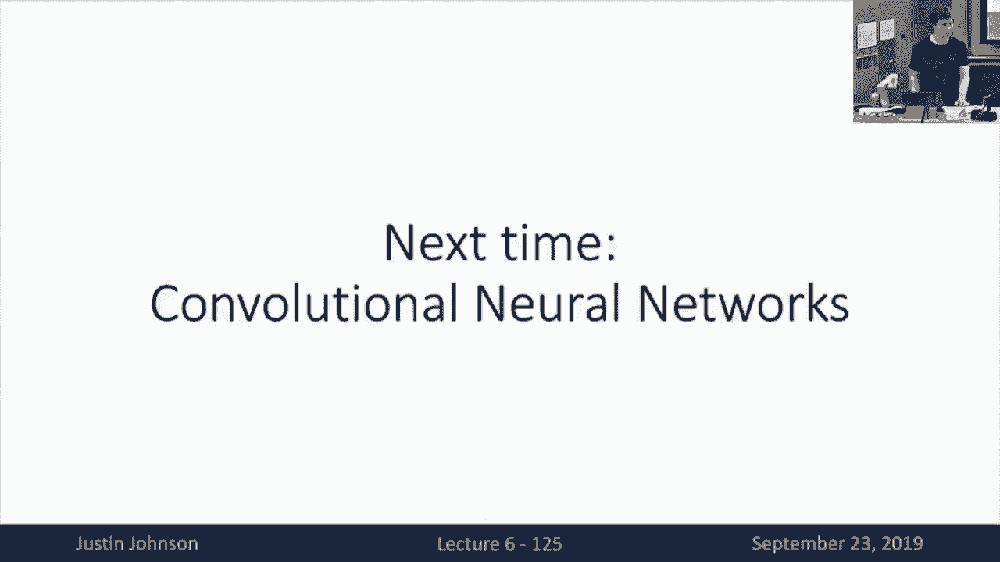

# P6：L6- 反向传播 - ShowMeAI - BV13P4y1t7gM

so welcome back to the welcome back to，so welcome back to the welcome back to。

the class we're up to lecture six and，today we're going to talk about that。

propagation so where we are in this，class is that now last time we talked。

about neural networks and we saw that，neural networks with this very powerful。

class a category of classifiers that let，us do a lot more powerful computation。

than had been possible with the linear，classifiers that we have been。

considering so far you'll recall that，neural networks had this fairly simple。

functional form of a matrix multiply，this element wise non-linearity that we。

called an activation function together，with another matrix multiply and then we。

could change these things together to，get really deep neural networks and we。

saw this notion of space warping to，recall that to demonstrate the way one。

way in which neural networks were much，more powerful than any of linear。

classifiers where neural networks are，now able to have these nonlinear。

decision boundaries to be input space，and we also talked about you neural。

networks are the universal approximator，to give another notion in which neural。

networks are a very powerful class of，functions we also saw this notion of non。

convexity that neural networks despite，their very powerful ability to represent。

many functions resulted in non convex，optimization problems that have very few。

theoretical guarantees and now we're，then we were kind of left with a bit of。

a problem here at the end of the last，lecture which is that now we have the。

ability to write down these very，complicated expressions that describe。

loss functions that we want to minimize，using stochastic gradient descent in。

order to train our classifiers be they，neural networks or linear classifiers or。

other types of deep learning models the，problem here is how do we actually go。

about computing gradients in these，models we know that we can write down。

arbitrary loss functions and if we can，find some way to compute the gradient of。

a loss with respect to all the weight，matrices of a model then we know that we。

can use the optimization algorithm as we，talked about a few lectures ago in order。

to actually minimize the loss and find，good models that fit our training data。

and the topic of today's lecture is how，do we actually go about computing these。

gradients these derivatives for，arbitrarily complex types of neural。

networks or other types of functions the，first strategy that you might be。

familiar with that you might try to try，try to adopt if you just attack this。

problem naively is to just derive the，gradients on paper right you know that，we can write。

down these scooby's functions these lost，functions and expand out the loss。

function on paper as an equation with，many terms and here I've expanded out。

the SP I think if this is an SVM loss，function with a linear classifier and。

one one strategy you might go about，doing this is you just write it all down。

on paper you expand out all the terms，and you end up with a giant equation。

that represent the loss as a function of，your data and your and your the weights。

of your model and then if you're very，familiar with the rules of matrix。

calculus you could imagine trying to，churn through this and just compute。

expressions on paper for all the learn，about weight matrices that that appear。

in the model this is turns out to not be，a very scalable solution so I apologize。

if anyone actually attempted this for，the second of it a second assignment if。

you did go this route and try to compute，these weight matrices on paper for the。

second assignment you will have noticed，some of the potential shortcomings of。

this approach one is that it's extremely，tedious you likely you probably needed。

quite a lot of paper to get this thing，right as you are working with loss。

functions like the cross entropy loss，function or the SVM loss another problem。

is that it's not very feasible for，complex models for something like a。

linear model I think you can probably，get by with this approach but as we。

scale to much more complex models it，really visit this approach of writing。

down gradients and deriving them on，paper will just not scale to more。

complex models and a final somewhat，subtle problem with deriving everything。

on paper is that it does not lead to a，modular design now suppose that once。

you've derived your loss function for a，linear classifier with an SVM loss and。

now tomorrow you want to derive the，gradients for a linear classifier with a。

salt with a soft mass softmax loss or a，two layered neural network with a soft。

max loss or a five layer neural network，with an SVM loss or any other kind of。

combination of losses and architectures，and regularizer z' that you might。

imagine if you were deriving these，things on scratch on paper for every。

combination of loss function and，architecture you would have to read。

arrive everything from scratch every，time and in practical situations it's。

much nicer to have some modular approach，where you can just swap in and slot out。

different types of models and，architectures and loss functions that。

will allow you to iterate much more，quickly as you as you try to find models，that work well fared。

the approach that we tends to take in，deep learning is actually you may have。

guessed not deriving gradients on paper，and since we're computer scientists we'd。

like to try to find data structures and，algorithms that can help us solve。

tedious problems and the the data，structure that we use to help us solve。

this problem of computing gradients is，called a computational graph now a。

computational graph is a directed graph，that represents the computation we were。

performing inside our model and here on，the Left we can see the the inputs to。

the model the data X and the labels Y，maybe not in this graph but maybe here。

we have the data X and the learn of a，weights W coming in as nodes on the left。

of the graph and now as we perceived，through the right as we proceed from。

left to right in this graph we see nodes，that represent bits of fundamental。

computation that we want to perform in，those in the process of computing this。

function so we see that there's this，blue node that represents the matrix。

multiplication between the input X and，the weight matrix W we have this this。

red node that represents our hinge loss，if we're using an SVM classifier we have。

this green node that represents the，regularization term in our model we have。

a sum that represents the sum of the，data loss and the regularization loss。

and then finally on the right we have，the output of the computational graph。

which is the scalar loss L that we want，to compute when training our model now。

this this computational graph formalism，when applied to something like a linear。

model might seem a little bit silly and，a little bit trivial because in a linear。

model as we said there's only a couple，operations that we need to perform in。

order to compute the loss and the，formalism of writing the bound as a。

graph might seem a little bit like a，little bit of overkill but this will。

become critical as we move to more，complex and larger models for example。

something like Alix net is a deep，convolutional neural network with seven。

convolutional layers and a non-linearity，and regularizer is at every layers and a。

loss function at the end where now the，images are coming in at the top and it's。

going through many many layers of，processing and our final scalar loss is。

coming out at the bottom and something，like this you probably do not want to。

derive the gradients on paper instead，you really want to use this，computational graphic formalism。

track the data structure to build up a，data structure that represents all of。

the computation that the model will，perform in order to compute the loss。

this will and this these things can get，arbitrarily crazy so here's an example。

of a model called a neural Turing，machine if you remember your theory of。

intro of theory to computation class you，remember that I destroy a machine is。

this a formalized model of computation，well it turns a couple years ago some。

folks wrote a neural network that is，kind of like a soft differentiable。

approximation to the Turing machines，that you learn in this intro the。

computation class and the here on the，screen we're showing the computational。

graph that arises from this，differentiable neural Turing machine。

extend you can see that it's very big，and complex and you definitely want。

don't want to compute gradients in this，model by hand you really want to rely on。

the computational graph formalism to，compute gradients for you but actually。

it gets even worse than this because for，the neural Turing machine this is。

showing only one time step of the model，and in practice this model gets unrolled。

over many time steps as a kind of，recurrent Network so you can see that。

this this you bury once you get into，these very complex models you very。

quickly get computational graphs that，are much much too large even to fit on a。

slide so you definitely want to use this，some kind of direct graph traversal。

algorithms to help us automatically，compute gradients for us on top of this。

computational graph structure hopefully，this has probably motivated why it's。

really going to be really critical for，us to use computational graphs in order。

to compute gradients in our big complex，neural network models now that we've got。

this motivation let's actually see a，concrete example of how we can use a。

computational graph to help us compute，gradients in a little tiny neural。

network model here in order to fit in，order to actually fit an example on a。

slide we're having to use a very trivial，computation but as you've seen we're in。

real models we'll be doing much more，complicated processing here we're。

showing a very simple function of three，scalar variables XY and Z that simply a。

the output is now we're gonna add x and，y and then multiplied by Z to compute。

the loss this is maybe a weird loss，function a weird learning problem that。

doesn't make sense but hopefully this，simple example will help us walk through。

exactly what it means to compute，gradients in a computational craft。

well when we're when we're using the，source and by the way this back，you。

for computing out gradients in a，computational graph now suppose that we。

want to evaluate this function at the at，a particular set of it at a particular。

point in the input space say X is minus，2 y is 5 and Z is minus 4 now the first。

step in using this computational graph，is called the forward pass in the。

forward pass our will proceed with，preceding computation from left to right。

and we will perform all of the，operations specified by the nodes of the。

graph in order to compute the output，values from the input values so in this。

example we'll simply add x and y and，we'll get this intermediate that we're。

called we're going to give the name of Q，and then to compute the final output。

value F we're going to multiply Q by the，input value Z and by running the forward。

pass of this graph we'll end up，computing our final our final output。

value of minus 12 in this case now in，the backward pass our goal is to compute。

all of the gradients of the great the，derivatives of all of the sorry the。

derivative of the output with respect to，each of the inputs so in this case our。

output was f so we want to compute the，derivatives DF DX DF dy and the f DZ。

which are the three inputs that appear，on the left on the left side of the。

graph and we'll proceed from left to，right because this is back propagation。

so it needs to proceed backward compared，to the forward pass we always start with。

the base case so in the base case on the，right we want to compute the derivative。

of F with respect to F anyone got an，trivial，that's one because if we change one a。

little bit if we change a little bit，then F is gonna change by the same。

amount so the derivative is 1 and when，we're computing by the way when we're。

computing back derivatives or using back，propagation in a graph will often write。

a little diagram like this where we show，the for the values that are computed at。

each node above the corresponding line，and then we'll come right down the。

gradients or the derivatives below the，corresponding line it was during the。

backward pass so now the second step is，we need to come want to compute the。

derivative of F with respect to Z and we，in order to do this we know we can look。

at this little intermediate computation，we know that F was Q times Z so we know，respect。

to Z should just be Q and and based and，then we can go back and look into the。

computational graph and look up what the，value of Q was in this case it was three。

so in this so now the derivative of F，with respect to Z in this little piece。

of the graph is now going to be three，and that's now we've got one of our。

three gradients that we needed to，compute the next piece we need to。

compute the derivative of F with respect，to Q you can see that we're kind of。

marching backward in an in bryn opposite，topologically sorted version of the。

graph and in order to compute the，gradient of derivative of F with respect。

to Q we again know that F is Q Z so this，local derivative should be Z we can look。

up the value of Z from the for pass of，the graph and compute the derivative as。

minus 4 we can consider continued，proceeding to the left now we want to。

compute the derivative of F with respect，to Y and here things get a little bit。

interesting because now we need to，remember the chain rule from calculus。

because here the the value Y is not，directly connected to the output value F。

so in order to compute the derivative of，F with respect to Y we need to compute。

we need to take into account the，influence of Y on the intermediate。

variable Q so then the chain of the，single variable chain rule from calculus。

tell us that tells us that DF dy is，equal to D of DQ dy times DF DQ and this。

is very intuitive right the idea is that，if Y it changes by a little bit then Q。

is going to change by some a little bit，DQ dy and then if Q changes then f is。

going to change some little bit which is，which is the other derivative so then to。

take into account these two effects we，need to multiply them and now here in。

this case we know and now in the in the，context of neural networks these three。

different terms in this equation have，particular names that we'll use over and。

over again so this this left-hand term，the f dy will often call the downstream。

gradient because this is the value of，the derivative that we're computing at。

this step in the process this value DQ，dy is going to be called the local。

gradient because this is the local，effect of how much this value of Y。

affects this next intermediate output Q，and this value d f dy is going to be。

called the upstream gradient because，this is the effect where because network，will kind of a match。

zooming in on this little piece of the，graph around Y and the upstream crazy。

and tells us how much does the output of，this piece of the graph affect the final。

output at the very end of the graph that，piece is going to be called the upstream。

gradient and then of course the chain，rule tells us that we to get the。

downstream gradient we just need to，multiply this local upstream derivatives。

and then of course here we know that the，local gradient in this case we know that。

Q is equal to X plus y so the local，gradient or local derivative in this。

case is just one so when we multiply，these two together we know that the。

derivative of F with respect to Y is the，same as the derivative of F with respect。

to Q so we get our downstream gradient，of minus four was that clear to everyone，okay good。

and now that now it's very similar when，we want to compute this other thing we。

again need to multiply the upstream and，local gradients again the local gradient。

is one because this was a simple，addition and we compute our final output。

value so here you can see in this，relatively simple example，well how we can use computational graphs。

to help us mechanize the process of，computing derivatives in very complex。

functions during the forward pass we're，going to compute all everything from。

left to right and then the backwards，pass we're going to step backwards。

throughout the step backwards backwards，through the rap and then compute these。

little derivatives at every point in the，graph now this method this way of。

thinking about computing gradients is，very useful because it's modular and now。

one way to think about it is we can zoom，in on one little node inside this。

computational graph and what's really，great about this mechanism for using。

back propagation to compute gradients is，that each little piece of the graph does。

not need to know or care about the rest，of the graph we can just perform local。

processing within each node and then by，aggregating all this local processing we。

can end up computing these global，derivatives throughout the entire graph。

now if we kind of step through this，exact same process that we talked about。

in the previous slide but in the context，of a single local node it looks。

something like this for each node in the，graph we're computing some little local。

function f this local function f takes，two inputs x and y and now during the。

forward pass will apply the local，function to compute the local output Z，now this now that's what。

forward operation of this in little，independent node after the forward。

operation of this node runs this output，Z will be passed off to some other part。

of the graph and that might be reused by，other nodes and Moulton arbitrary。

complex ways we don't know we don't care，from the perspective of this one node we。

just know that we computed an output and，we passed it on to someone else then but。

at the end of the process eventually，somehow at the end of the graph。

someone will compute someone far away，from us will compute some final loss l。

and and then back propagation will start，and somewhere outside of us will just。

pass these gradients back to us outside，of the purview of this little node and。

eventually this back propagation process，will hit this one node that we care。

about and this one node will receive a，message from upstream in the graph which。

tells us the derivative of the loss with，respect to Z that is how much does this。

this loss which may be very very far，away from this node somehow we're going。

to be told how much will this very far，away loss，change if we change the local output of。

our node by a little bit and that's，exactly what this upstream gradients the。

ldz tells us now at this point we can，compute the local gradients that are。

internal to this node which tell us for，each output of the node how much is how。

much is each output of the node affected，by each input of the node do those these。

local these local gradients and now this，node can simply compute the downstream。

gradients by multiplying the local，gradients and the upstream gradients and。

now these downstream gradients then get，passed along to other no it's backwards。

in the graph that are somehow again this，node doesn't need to know or care。

exactly how those downstream gradients，will be used elsewhere in the graph。

they're simply used somewhere and went，by the end when this final dot。

propagation process terminates we'll be，left with the having computed the。

gradients of the loss with respect to，all of the original inputs of the graph。

and this we were able to compute this，local this global property without。

really reasoning at all about the global，structure of the function we were trying。

to compute it only required us to think，about locally what's going on inside。

each node of the graph and then have，some data structure to track how all。

those nodes are connected together so，hopefully this is going to be a big。

improvement what we're trying to derive，those big gradient expressions on paper。

here's another example of running，computational graph here this should。

look something like a logistic，classifier you kind of care about these。

equations but the details of exactly，what the functions are computing for the。

purpose of this lecture are somewhat，irrelevant we just care about computing。

gradients and arbitrarily complex，functions but here on the Left we're。

showing we've got a function that takes，for what 1 2 3 4 5 inputs our 5 inputs。

are W 0 X 0 W 1 X 1 W 2 and now in the，forward pass we're going to compute this。

inner product between these first two，elements of the weight and the first two。

elements of the X and then we're going，to compute this bias term to add W 2。

then we're going to compute some kind of，e to the minus something on this。

computational graph and here the，computation will proceed much as we saw。

in a previous example in the forward，pass we'll compute the outputs of the。

graph by evaluating the forward function，for each of these nodes and this will。

end up computing this final scalar，output value on the right and then，during the backward pass we'll。

iteratively think about how it will it，early multiply the upstream gradient by。

the local gradient at each node in the，graph to compute the downstream。

gradients so we'll always start with，this base case base case of derivative。

of output with respect to itself is，always 1 next we'll look at this 1 over。

X we know that the local gradient of 1，over X is minus 1 over x squared which。

gives us the local gradient we can，multiply these to get the downs two。

ingredients we can step through again，you know the adding a constant has local。

gradient of 1 so we that we can easily，pass those gradients backward we can。

compute the local gradient this，exponential function which is trivial。

so that just lets us easily compute，downstream gradient and this kind of。

like process sort of steps backward，backward backward one node at a time。

where at each point were just computing，these local gradients and then。

multiplying the upstream and local，gradients but what's really interesting。

about this particular computational，graph is that there's multiple ways in。

which we could have thought to structure，this computation in this graph as I've。

written it I've written it out in terms，of very basic very primitive very。

fundamental arithmetic operators of，addition and multiplication，exponentiation division adding a。

constant a，have broken down this computation into，its barest fundamental pieces of。

arithmetic primitives and as you saw as，you kind of noticed by looking at this。

graph breaking everything down into the，barest arithmetic primitives at every。

graph ends up a little bit tedious and，sometimes it we actually have our。

freedom to define for ourselves what the，types of primitive operations we want to。

use in our graph so in this example so，here we've kind of broken everything。

down into the basic primitives but we，also have the freedom to define。

arbitrary new types of nodes that can，independent can internally compute more。

complicated functions an example of why，this might be useful is that this little。

chunk of the graph that I've outlined in，blue locally comes it independently。

computes this so-called sigmoid function，that is 1 over 1 plus e to the minus。

it's art it's argument this sigmoid，function shows up all the time in。

machine learning we've seen it in the，context of the of the this this shows up。

for a binary cross-entropy when you're，doing a two class logistic regression。

this also shows up in many other，contexts and what's kind of nice is that。

we have the freedom as the designers of，this little graph language to pick。

elements to pick primitive out graph，elements that will be useful or easy to。

compute in the backpropagation process，and in particular we can choose。

primitive no primitive functions to，assign to nodes in the graph such that。

the local gradients become easy to，compute and this turns out to be the。

case for the sigmoid function so the，sigmoid function if you kind of work。

through some math on paper you can see，that the sigmoid I don't want to work。

through the details of this expression，here but if you work through on paper。

computing the derivative of the sigmoid，function with respect to its input you。

can see that the local gradient of the，sigmoid function actually has a very。

simple functional form that the local，gradient of the sigmoid function is。

simply equal to the output of the，sigmoid function multiplied by 1 minus。

the output of the sigmoid function what，this means is that we can very easily。

compute the local gradient of this，entire blue chunk of the graph without。

storing this without storing this whole，intermediate chunk of the graph and。

this is an example of ours ourselves of，the graph designers cleverly choosing。

the primitives that we want to use in，our graph language in such a way that。

will make it easy or more efficient to，compute the derivatives during the。

backwards pass so this is definitely，something you should consider doing and。

now if we were to imagine kind of an，aggregate you could imagine an。

equivalent version of this graph which，collapsed this whole blue box onto a。

single node that would then receive the，upstream gradients on the right and now。

compute the the local gradient using，this expression we've derived at the。

bottom of the slide and then immediately，returned the downstream gradient on the。

Left kind of skipping over all of that，intermediate computation inside the box。

so this idea of defining more complex，primitives to use in our graphs is。

something that we'll use quite a lot in，general in order to make our。

computational graphs have them either be，more efficient or have more semantic。

meaning another thing we can start to，notice when we look at these。

computational graphs is that there's，some patterns that become apparent when。

you look at the patterns of how，information propagates forward during。

the forward pass and then during the，backward pass what you can kind of think。

of what I sometimes think about this is，like a little circuit that during the。

forward pass we're kind of flowing，information forward from the input to。

the output and then during the backward，pass we're kind of flowing information。

backward from the loss through each of，these intermediate nodes backwards to。

the original parameters of the model for，which we wanted to compute gradients and。

when you have this kind of circuit，interpretation of these computational。

graphs you start to notice some patterns，about how gradient flow how some duality。

is between how information flows during，the forward and backward passes so the。

simplest example of this is that this，add gate or add function acts as a。

gradient distributor during the backward，pass so if we have a little function。

which locally computes the output as the，sum of its two inputs maybe here seven。

is three plus four then during the，backward pass we know that as we saw in。

the first example of our very first，computational graph recall that the。

derivative of X plus y with respect to X，is 1 and derivative of X plus y over y。

is also 1 so the local gradients are，both the inputs are 1 so that means the。

downstream gradients for both，inputs are both equal to the upstream。

gradient and this would generalize to a，sum with an arbitrary number of terms。

what this means is that during the，backward pass when you have a sum node。

during the backward pass that some node，is going to distribute and copy those。

gradients from the upstream into the，downstream which is kind of a nice。

intuition about what's happening when，you have addition inside of your model。

now kind of dual to the some node is the，copy node this is kind of a trivial node。

that in during its input maybe receive，some input and then has two output。

values that are both equal to identical，copies of the input this seems like。

maybe a stupid operation at first glance，why would you ever introduce such an。

operation in your graph well you might，want to do this if you want to use one。

term of your model in multiple places，downstream in the graph for example you。

might imagine in a regularization，setting we actually want to use each of。

our weight matrices in two ways in our，model we want to use the weight matrix。

one to compute scores in in kind of the，main branch of the model and second we。

need to use the weight matrix to compute，our regularization term like L 2 or L 1。

regularization so in order to use our，weight matrix in to downstream parts in。

the graph we might imagine inserting a，copy node somewhere in the graph that。

now makes two identical copies of the，weight matrix that now can be used in。

different parts of the graph and the，important bit is that even when we've。

produced these two copies because they，may have been used in different ways we。

might end up computing different，gradients with respect to the two copies。

and now is then during the backward pass，the the upstream gradients that the copy。

node receives might be different for the，two outputs that it's produced but now。

during the backward pass we simply need，to sum those two gradients which shows。

that kind of the the ad rate the add，gate on a copy gate are somehow dual。

that the add gate forward operation is，kind of the same as the copy gate。

backward operation and vice versa so，these two operations are somehow dual to，each other。

another another kind of funny thing，that's going on is the multi is a。

multiplication you can think of this as，a kind of swap multiplier because you。

know that the derivative of X Y with，respect to X is y and derivative of X Y。

with respect to Y is X which means the，local gradient is，for one of the inputs is the other input。

and the local grading for the second，input is the first input which means。

that when we compute the downstream，gradient the downstream gradient is。

equal to the upstream gradients times，the other input and this has kind of a。

funny implication if you think about now，we have a multiplication inside your。

model it's gonna mix the gradients all，up in some kind of a funny way and。

because during the backward pass the，multiple multiple the backward pass of a。

multiplication gate also involves，multiplication you can see that you're。

going to end up with some very law very，large products in the backward pass I。

mean this can be of this you can imagine，might be a problem in certain types of。

models another one that you might see a，lot is a map ski so here the map skate。

is gonna take it to scaler inputs and，return the maximum of the two inputs and。

here what what does that function look，like that looks kind of like a Rayleigh。

function a little bit and you can，imagine that for the input that was。

indeed the maximum the local gradient，was one and for the input which was not。

the maximum the local gradient was zero，so this so that then this has the。

interpretation that during the backward，pass a Maps gate acts as a gradient。

router that it's going to take the，upstream gradient and route that。

upstream gradient towards the one input，that happens to be two that happens to。

be the max and the downstream gradients，of all the other inputs that were not。

the max are all being are all going to，be set to zero so then you can imagine。

that if we had a model that was taking a，max of like many many many things then。

during the backward pass we'll end up，with a gradient that is mostly zero so。

you can imagine maybe that's a problem，for getting good grade and flow。

throughout the entire model so maybe we，might not prefer to use max for that。

reason so this is these are all it'd be，obviously sort of trivial mathematical。

expressions but it's sort of interesting，to think about how these trivial。

derivatives of scalar functions actually，can have non-trivial consequences for。

the way in which gradients tend to flow，through these giant neural network。

models so now that we've hopefully，gotten a bit of intuition about what is。

back propagation and how can it help us，automate the process of computing。

gradients and big models I think it's，helpful for you guys to talk about how。

you actually might implement this stuff，in code because that's something you。

have to do in your homework so hopefully，you will get good at that well I think，there's。

I think about at least two major ways in，which people tense in which I tend to。

think about you're amending，backpropagation the first is what I what，I call a flat implementation of。

backpropagation so here the idea is，we're gonna write a single Python。

function that computes the entire，computational graph maybe this Python。

function is computing a linear，classifier at an input so mini-batch of。

data and your weights and then it，data，sound familiar from homework to。

hopefully those of you who looked at it，and now you're asked to compute a single。

have a single function that is going to，both compute the loss and compute the。

derivative of the loss with respect to，each of those weight matrices well the。

way you would the way that you - I mean，one thing you can do is kind of go to。

town on paper and kind of like you do，your derivatives and it's a mess and。

hopefully you'll eventually pass the，gradient check but you can try to。

structure this computation in a much，simpler way that I think makes writing。

this different this backward pass code，actually very simple very simple in this。

case so here we'll have a we're gonna as，an example we're going to have this。

little computational graph on the Left，which is the sigmoid example from a。

couple slides ago so we're going to，input our two weights W 0 W 1 or 2。

inputs X 0 X 1 and our bias term W to，the forward pass of our code is simply。

going to apply this AB mult add a，multiply these things and compute our。

long L and now the backward pass code is，going to be right after the forward pass。

code and the trick is that the backward，pass code is going to look like a。

reversed version of the forward pass，code what do I mean by that well the you。

can see that the very first thing we do，in the backward pass is compute this。

trivial base case of grad of output，respect to itself as one you might you。

probably should actually omit this line，and your actual implementation but I。

wanted to be super pedagogical here but，here you can see that this first line in。

the backward pass code corresponds to，this really rightmost thing in the。

computational graph now this second line，in the backward pass code corresponds to。

back propagate back back propagating，through this sigmoid function and you。

can see that the back propagation lined，the sigmoid function corresponds to the。

last line of the forward pass，and here what we notice is that in the。

forward pass the sigmoid function was，taking as input as three and returning。

as output L and now the corresponding，line in the bit of backward。

implementation kind of inverts that，around a little bit here the backward。

pass takes as input grad al and produces，as output grad s3 so you can see that，there's a 1：

1 correspondence between，this line and the forward pass and this。

line in the backward pass and now the，inputs and the outputs are somehow。

swapped between the these two，corresponding lines then this，correspondence continues that in the。

second to last line in our forward we，wanted to add these two things s 2 and W。

2 and now because this was an operation，with two inputs it gives rise to two。

lines in the output in the corresponding，backward code and again we can see that。

we have this intuition of the the add，gate as a gradient distributor so you。

can see that we're simply distributing，or copying the gradient to the two，inputs in each two lines。

a similar thing happens with this third，to last line in the forward and now very。

similar things happen in this fourth，Follette in this fourth to last line in。

the forward but again now we've got a，multiplication gate we've got this。

interpretation of this local gradient，add multiply swapper and then finally。

we've got this this final output that，does it the same thing it's also a。

multiplication and now this is kind of，amazing right we actually wrote a，correct implementation of。

backpropagation without writing out any，math we didn't write down any equations。

on paper all we had to do is think about，transfer we wrote the code for our。

broadcast and then we just transformed，in our mind the code that we wrote in。

the four pass we just transformed it to，generate the passed the code for the。

backward pass this is the way that you，should actually go about doing homework。

two if you have not completed those，assignments yet and this will make your。

life much much easier when it comes to，computing gradients um it turns out that。

if once you get enough practice with，this you almost never need to do math on。

paper in order to write gradient code，you simply look at the code that you。

wrote for the forward pass and you just，invert it using all these little local。

rules that you that you pick up over，over time so this flap this this this。

idea of flat back by back propagation，that you implement by inverting the code，from therefore。

is something that you should do in，assignment two so for example for the。

SVM you could imagine that we might，compute the scores my computer margins。

my compute the data loss and now in the，backward pass you'll just do all of。

those things in Reverse except the exact，will operation that occurs during each。

line in backward pass will be this local，this local computation which is the。

multiplication of the upstream gradient，and the local gradient in order to。

compute the downstream gradient and you，can see that you know you can do this。

for an SVM you can do this for a two，layer neural network interesting that I。

chose these examples so I would highly，recommend that you become familiar with。

this way of sort of transforming your，for pass code in order to compute the。

backward pass but of course this this，kind of mechanism of transforming your。

this way of doing flat back propagation，is really useful when you just need to。

write a gradient function and to end but，it kind of fails this modularity test。

because here with this input with this，version a flat back back propagation you。

know if we change the model or we change，the activation function we change the。

loss with you to change the regularizer，we're gonna have to rewrite our code and。

that's going to be a little bit painful，and a little bit annoying so there's a。

second way which is kind of like the，more industrial-strength way to。

implement back propagation which is to，use a more modular API and this fits。

very much with this idea that we saw a，local computation around nodes so here。

with this modular implementation of，backpropagation we will typically define。

some kind of computational graph object，and this computational graph object will。

be able to do forward and backward，passes throughout the entire graph by。

doing some topological sort operation on，all of the nodes of the graph and then。

calling these little forward operations，on each node and during a forward pass。

and then calling the corresponding，backwards operations on each node during。

the backward pass now this piece of code，that I'm showing you here is just。

pseudocode like this is not actually，real code it could have typos I don't。

know but this one this one actually is，real code so in pi torch you can。

actually define your own functions using，this API，so by sub-classing torch dot autograph。

function now you are defining your own，little computational node object which。

represents a node in a computation，Graff and now you can see that this。

object defines two functions forward and，backward forward takes three inputs the。

interesting ones are x and y which，correspond to the input values that this。

node will receive during the forward，pass and these will be specified as。

torch tensors in this case we're just，working with scalars so this would be。

torch scalars in this case we also，received this context object that we can。

use to stash arbitrary bits of，information that we want to remember for。

the backward pass so you can see that in，the forward pass were simply defining。

this output Z equals X plus y and，returning Z these are all operations on。

torch tensors that you got familiar with，in the first two assignments and now in。

the backward pass we rewrite this，function called backward that receives。

that same context object from the，forward pass so we can use that context。

object to pop off any stuff that we，needed to remember from the four pass in。

order to compute our derivatives in this，case we need to remember x and y and now。

we also receive grad Z which is this，upstream gradient also stored in a。

torque tensor and now internally we，locally compute this product of the。

local gradient and the upstream gradient，to compute our downstream gradients。

which are which are the derivatives of，the two inputs and we simply return。

those and now this is like real torch，code that you could use to implement。

your own scalar sum of two tenths of two，scalars so that's how actually our léo。

already implemented in TOR so I don't，recommend you actually use this。

implementation but if for some reason，you did want to define your own。

arbitrary function in torch and define，the forward and backward passes of your。

new of your new operation this is how，you can actually do it inside large and。

now if you look into a like deep in the，guts of the PI torch code base basically。

what is pi torch is this Auto read opera，this auto grad engine and a ton of these。

little off of these little functions，that define paired forward and backward。

functions so here I'm showing you is，just like a there's a lot of files in。

here and if we this is somewhere on the，PI torch github repo and if we zoom into。

one of these files this is actually the，implement one of many implementations of。

sigmoid it's actually deep inside the，guts of pipe work somewhere so you can。

see that here we are she defining the，forward pass of sigmoid，I mean using like deepens C++ or C or。

something deep in the guts of Pi torch，that's computing the forward pass of the。

sigmoid lair unfortunately it calls into，this other function which is to find。

somewhere else it's a bit of spaghetti，code if you actually ever looked at the。

backend of pi torch but we can ignore，that and now there's the second pared。

function which is a th NN sigmoid update，grad input which computes the backward。

pass and it does some boilerplates you，know unpack tensors and do some checking。

of input this is a real instant us triol，strength code base but now there's this。

critical line where you can see that it，actually is at like right here is where。

pipes which is actually computing the，backward pass of the sigmoid layer like。

deep inside c like nested inside some，macros and like some crazy stuff going。

on but basically what is pi torch is，these paired forward and backward。

functions that can then be changed，together into these big computational。

graphs so basically up to this point，we've really only talked about the。

notion of using back propagation and，computational graphs using scalars which。

is really easy and intuitive if you kind，of remember everything from single。

variable calculus but in practice we，often want to work with vector valued。

functions or functions that operate on，vectors or matrices or tensors of。

arbitrary dimension so we also need to，think about what does it mean to do back。

propagation in computational graphs with，vector or tensor valued with vector ax。

tensor values as well well here we need，to recap a little bit some of these。

different flavors of multivariable，derivatives well you remember the normal。

single variable derivative given a，function that given a single a scalar。

and put in a scalar output the，derivative of the output with respect to。

the input tells us this local linear，approximation if we change the input by。

a little bit then how much does the，output change we've got this familiar。

gradient operation and a gradient is the，type of derivative that is appropriate。

where our function takes a vector as an，input and produces a scalar as an output。

and then this gradient of dy/dx in this，case is then a vector of the same size。

of the input where each element of the，vector of the gradient vector says how。

much does the output change if the，corresponding element of the input。

changes by a little bit so it's a vector，of these sort of classical single value。

derivatives and now the generalization，is，that inputs a vector and outputs a。

vector possibly of a different dimension，and here the I mean these things all。

have different names but they're all，basically the same idea they're all。

derivatives and this one is called a，Jacobian now the Jacobian is a matrix。

where it has a number of elements which，is n times M if those are the two。

dimensions are dimensions of our input，and our output and the idea of the。

Jacobian is that it says for each，element for the input and for each。

element of the output how much does，changing one of the elements of the。

input affects that element to the output，and now because we've got an input。

elements and output elements meet and，end times and scalar values in order to。

represent all those possible effects of，inputs on all the outputs ok so then now。

suppose where we got the same picture，that's kind of right we know that we。

don't really need to think about graphs，as a whole we only need to think about。

how does back propagation work for one，node as a time so then what does it mean。

to do back propagation in this，vector-valued case kind of zooming in on。

one node again well here we've got now，our little function f is earth is。

inputting two vector values X is now a，vector of dimension D X Y is now a。

vector with the dy elements and we're，producing a vector output Z with DZ。

elements and now this is our forward，paths it's very easy things are。

happening eventually we receive this，gradient map from upstream now this。

upstream gradient now in this vector，valued case it's important to remember。

that the loss we compute is always a，scalar no matter whether we're working。

with vectors or tensors or whatever this，final loss we compute with the end at。

the end of the graph is always going to，be a scalar and now this upstream。

gradient that we receive is going to be，the gradient of that the derivative of。

the loss with respect to our outputs so，that's going to tell us for each of the。

outputs from this node if we were to，change those each of our outputs by a。

little bit how much would they affect，the loss way down to the right of the。

graph at the very end of our computation，and now the local ingredients in this。

case become these Jacobian matrices，because in this case now our function is。

a vector valued function that takes two，vectors as input produces one vector as。

output so now our local derivatives，become these Jacobian matrices that。

again tell us for each element for each，output element from this node how much。

is it affected by changing each input，element of this node and now during the。

back now the downstream gradients that，we want to，are always going to be the derivative of。

the loss with respect to the inputs and，now the derivative of loss with respect。

to a vector input is now again going to，be a vector of the same size as the。

inputs so the downstream gradient that，we produce for X is going to be DL DX。

which will have be a vector of the same，size of X the downstream gradient we。

produce for Y will be DL dy which is a，vector of the same size as Y and now to。

actually produce these downstream，gradients we know we know we need to。

multiply the local and upstream，gradients but now that we're working。

with vectors we're not it's not a scalar，multiplication anymore now this becomes。

a vector a matrix vector product where，the local gradient is now this Jacobian。

matrix and the upstream gradient is this，gradient vector the downstream gradient。

the downstream gradient is a gradient，vector and the way that we produced this。

downstream gradient is doing as a matrix，vector multiply between the upstream and。

gradient vector and the local Jacobian，matrix in in such a way that the shapes。

work out so if you're ever confused，about this，I always just recommend writing out the。

shapes of all eeper things and hopefully，that will help you clarify what's going。

on now as a concrete example of doing，back propagation with vectors we can。

imagine what this looks like for the，rayleigh function so for the rayleigh。

function remember that it's an，element-wise max of where we clip，everything below a zero so given an。

example input vector X so 1 minus 2 3，minus 1，applying the rate of function to this。

vector would replace all the negative，values by 0 so our output Y would be the。

vector 1 0 3 0 and now this Ray loop，function this kind of vector valued。

rayleigh function is one little，computational node embedded somewhere in。

our graph and now eventually will be，returned this upstream gradient which。

tells us how much with that final loss，change if any of our little outputs from。

our rayleigh function changed and these，could be arbitrary values positive or。

negative we don't know or care how，they're computed they're just handed to。

us by the auto above a differentiation，engine and now this Jacobian matrix。

tells us for each input of our local，function how does each output of our。

local function change and what we can，start to notice here is that the。

Jacobian matrix of this element-wise，radial function has some special。

structure so because this is an，element-wise function we know that the。

first output of the function depends，only on the first input，and the second output depends only on。

the second input in particular the first，input does not affect the effect the。

second output or the third output or the，fourth output each input only affects。

its corresponding output in the same the，same position in the vector what does。

that structure look like in a Jacobian，matrix that means that the Jacobian。

matrix is diagonal that all of the off，because the off diagonal elements of the。

Jacobian tell us maybe how does element，I of the input affect element J of the。

output where I and J are not equal so，for this element wise function all those。

off diagonal elements of the Jacobian，are 0 and now for the on diagonal。

elements that's the fact that becomes，this scalar value derivative which tells。

us how much does the railey change as a，function of changing the input so then。

for the positive value of inputs they'll，have a local gradient of 1 on the。

diagonal and for the negative value for，the negative inputs they'll have a local。

gradient or the local derivative of 0 on，the diagonal unless UK and then this。

this by by working through this and lets，us form this full Jacobian matrix for。

the input and now remember to compute，the downstream gradient we need to。

compute this matrix vector multiply，between the upstream gradient vector and。

the local Jacobian matrix so you can，compute that thing offline and then the。

art then we can produce this downstream，gradient vector that will be passed to。

the other nodes that were feeding into，us as input and now we start to realize。

something interesting is that this is，actually in this case for this rate of。

function we saw that the input that the，Jacobian matrix was sparse that the。

Jacobian matrix had a lot of zeroes in，it and this isn't this is actually the。

common case for most of the functions，that we use in deep learning in general。

most of the local Jacobian matrices that，we use are going to be very very very。

sparse so in practice we will almost，never explicitly form which is this。

Jacobian matrix and we will almost never，explicitly perform this matrix vector。

multiply between the Jacobian and the，upstream gradient so you can imagine。

that for this really example it's may be，fine to form the Jacobian for a for a。

vector of four inputs but what if our，inputs was like a mini batch of a，thousand of 128 elements。

and each of all those elements was a，vector of like 4096 dimensions now this。

Jacobian matrix would be like super，super gigantic and super super sparse。

like only the diagonal would be nonzero，so in general actually explicitly。

forming those matrices would be super，wasteful and explicitly performing that。

multiplication with a general matrix，multiply function would be super。

inefficient so really the big trick in，back prop is figuring out a way to。

express these Jacobian vector multiplies，in an efficient implicit way and for the。

example of Ray Lu this is trivial，because we know that Ray Lu has this。

structure where the output where the，diagonal entries are either 1 or 0 so。

this means that for the real ooh we can，we can compute this local we can compute。

this downstream gradient by either，passing on the upstream gradient or。

killing the upstream ingredients and，clipping it to 0 depending on the sign。

of the corresponding value of the input，and what you what you can the way that。

you should think about this off this，expression is that this is a very。

efficient implementation of an implicit，multiplication between this large sparse。

local Jacobian and this upstream，gradient vector is this clear so then so。

then now this is talking this has been，talking about vectors but of course we。

need to work with tensors of rank，greater than 1 we need to work with。

matrices and 3-dimensional tensors and，four dimensional tensors and like。

arbitrary things now the picture is very，much the same so to understand how to。

work with back propagation with tensors，of arbitrary with matrices or tensors of。

arbitrary dimensions we have very much，the same picture that now we have our。

local function like deleted the FX，identity that inputs to values x and y。

in this case they're going to be，matrices X will have will be a matrix of。

size DX by M X Y will be a matrix of，size dy by my and the output will also。

be a matrix now remember the loss is，still a scalar and all the gradients of。

the loss with respect to something will，always be a tensor of the same shape as。

something which will tell us how does，the final down stream loss change as we。

vary each of the independent elements of，that input of that tensor so then when。

we finally receive this upstream grade，it will be a matrix now of size DZ by MZ。

which will tell us again how if we，change any of the elements of our output。

how much will that loss change and now，these local Jacobian matrices get very。

interesting in this sort of tensor case，because recall these Jacobian matrices。

need to be able to tell us for each，scalar elements of the input how much。

does each scalar element of the output，change which means that the Jacobian。

matrix is now a kind of like generalized，matrix type of thing so the number of。

elements of these local Jacobian，matrices is maybe like DX times M X。

times DZ times NZ for those local，Jacobian matrix between X and Z and we。

often I often think about in this case，grouping the dimensions of the Jacobian。

matrix where we have one group of，dimensions corresponding to the shape of。

the input and one group of dimensions，corresponding to the shape of the output。

and in that way we get we get this，Jacobian matrix is this very high rank。

tensor that has its kind of the product，of the sizes of the input and the output。

and now the the downstream gradient，proceeds in much the same way that the。

downstream gradients are then going to，be again tensors of the same shape as。

the inputs giving us these downstream，gradients and in order to compute them。

we still need to do a kind of matrix，vector multiply between these local，jacobians。

and these upstream gradients the problem，is that now we need to they're not quite。

vectors and are not quite matrices so we，need to think of these as a kind of。

generalized form of a matrix product or，a general right where now the local。

Jacobian matrix you can imagine kind of，flattening these two groups of。

dimensions corresponding to the input in，the output they would actually give us a。

literal matrix you could imagine，flattening the output to be a high。

dimensional vector and flattening the，input to be a high dimensional vector。

and then that kind of results that then，you can after flattening actually。

literally perform a matrix vector，multiply and get these demonstrating。

gradients but I don't know about you but，whenever I think about these like higher。

dimensional implicit Jacobian matrix，vector multiplies between like super。

high dimensional tensors like my brain，ends up exploding and it becomes very。

difficult to actually think about how to，write down an expression for implicitly。

computing this like giant sparse matrix，vector multiply thing like it's a mess。

so to help you out I'm going to work，help you，implement these types of operations。

without actually thinking about really，high dimensional high high rank tensors。

so for that we're going to work through，a concrete example of deriving the。

backpropagation expression for the case，of matrix multiplication and and this is。

going to be a super pedagogical but this，will be a general strategy that you can。

apply for trying for deriving these，these back propagation operations for。

kind of arbitrary value arbitrary，functions of tensors and crazy crazy。

shapes so here we're doing a matrix，vector multiplication between an input X。

which is a matrix of size n by D and，I've written out a concrete example of a。

matrix of size 2 by 3 we have a weight，matrix of size D by M and again we have。

three of a three by four clunky example，now our little computational node is。

going to do matrix multiplication and，produce this output Y that hopefully I。

got the I did the math right and then，during the then during the backward。

during the backward pass we're gonna，receive this upstream gradient from。

somewhere out in the graph it's gonna，tell us how much do each element of Y。

affect that final boss L and again these，can be arbitrary values and our goal is。

to compute this downstream gradient，which is how much does each of our。

inputs affect the lot I think you I，think you got that by this point。

hopefully and now if you imagine，actually what are the sizes of these。

jacobians they're going to be pretty big，so like n by D times n by M and here on。

the slide I've shown you kind of these，simple small examples but for a real。

neural network we might have like n is，like 64 and D is and a might be like。

4096 so if you multiply those out each，of those jacobians is gonna be like 256。

gigabytes of memory in epi32 and the，biggest GPU you can buy on the market。

today I think has like 48 gigabytes of，memory so it's like this is clearly not。

gonna work to explicitly form these，jacobians，and that's like pretty small neural。

network anyway but so basically the，whole trick here is to find a way to。

express this computation without，explicitly forming the Jacobian and。

without explicitly doing that matrix，vector multiply so you need to find a。

way to do that implicitly and the way，that you can think about doing this is。

kind of element wise on the input so，what you can think about doing is think。

about one element of the input think，about x11 and now we want to think about。

how what is gonna happen just thinking，about x11 and now we can compute a slice。

of the local gradient this local，gradient was this like really big thing。

of the shape of the input times the full，shape of the output but this slice of。

the local gradient what I mean by that，is the derivative of the output matrix。

output Y with respect to the single，scalar input element x11 and now because。

this is the derivative of a matrix by a，scalar it's going to be an object of the。

same shape as that matrix telling us how，much does each element of the output Y。

on get affected by that one scalar，element of the input X and now to make。

matters further then we can think how，what is this what is this first element。

of this local gradient slice this first，element of this local gradient slice。

tells us how much does y how much is y 1，1 effected by X 1 1 well we know that。

matrix multiplication in order to，compute that value y 1 1 what we，computed would join nature's。

multiplication was an inner product，between the first row of X in the first。

column of W so then we can write out，this expression on the bottom here for。

how we actually computed y 1 1 and then，we can imagine computing the derivative。

of y 1 1 with respect to X 1 1 and we，can see that all of these other terms。

fall away and the only part that matters，is this first term of X 1 1 times W 1 1。

and we know how to take derivatives of，product of two scalars so we know that。

that local gradient if that that piece，of the slice of the local gradient is。

now just equal to W 1 1 so in this case，is going to be 3 now we can repeat this。

process for the second element of this，local gradient slice and now the story。

is very much the same this second piece，of the local greeting at slice says oh。

man oh yeah yeah then this then this，says how much does this blue element of。

the input affect this purple element in，the output and again this purple。

elements in the output was an inner，product in the first row of X M now the。

second column of Y so then again it，looks this like this inner product and。

again all about one term vanishes and it，sees then we see that the gradient we。

just pick out this value of W 1 1 so the，second element of the slice is is 2 so。

it's just going to copy all，one of those elements are the weight。

matrix and I'm not gonna bore you with，the next two but basically at this point。

you should see the pattern that this，first row of the local gradient slice is。

just copying over this first row of the，weight matrix W and now what about the。

second row of the local gradient slice，well the second lower alert row of the。

local gradient slice is going to ask the，question how much does this again we're。

still working member was Thor working on，one element of the input how much does。

the blue element of the input affects，the purple element of the output well。

remember now the purple element of the，output is computed by an inner product。

between the second row of X and first，column of Y but what you'll notice is。

that it doesn't involve that x11 term at，all，so here the local gradient is zero for。

this little chunk of the local gradient，slice and now you can expect that this。

pattern will repeat for all of the other，elements in the second row of the local。

gradient slice so then now through that，like excessively verbose explanation。

we've finally computed this local，gradient slice and now we're ready to。

compute the down one element of the，datastream gradient so this so we can。

finally now compute this blue element of，the downstream gradient by computing an。

inner product between this local，gradient slice and the full upstream。

gradient and now this will tell us how，much does this one element of the input。

get affect a affect of the final loss of，a very end of the end of the thing so。

then you can see that this local，gradient slice is now ends up being this。

this inner product between the two ball，between his local gradient slice and the。

Fluxion gradient but because the local，gradient slice was copying one row of。

the weight matrix and the rest of it was，zeros what this means is that this。

element of the input of the downstream，gradient is really an inner product。

between the first row of the weight，matrix W and the first row of the。

upstream gradient DL dy so now at this，point we can kind of like throw away。

this local gradient slice and forget，about it and we could realize that we。

only needed to look at that one row of，weight matrix on the one row of upstream。

gradient to compute the downstream，grades and now we could imagine doing。

the same thing for another element of，the another element of the in。

and we could go through this whole same，song and dance to compute the same to。

compute this local gradient slice but，kind of reasoning one element at a time。

and now you can see that if we were to，pick now the local gradient slice 4x - 3。

that is this like bottom right element，of the input X now our local gradient。

slice has the same kind of structure，that this local gradient slice is now。

copying one of the one of the rows from，the weight matrix and it is it is zero。

everywhere else so then but when we take，this inner product we see that this。

other element of the downstream gradient，is again an inner product in one of the。

rows of the weight matrix and one of the，rows with the upstream gradient and now。

you could kind of work through this with，some complicated indexing expressions on。

paper but it ends up that you kind of，get this general expression that now you。

can kind of jump and see that for any，individual element of the downstream。

gradient it ends up being an inner，product between one of the rows of the。

weight matrix and one of the rows of the，upstream gradient and once you realize。

this relationship you don't actually，have to form that upstream gradient that。

that local gradient slice at all and we，can compute all of these inner products。

between the rows of the weight matrix，and the rows of the upstream gradient。

compute them all at once using the，single matrix product between DL dy the。

upstream gradient and W transpose the，transpose of the weight matrix and what。

should be what you should be people get，confused about this sometimes and people。

look at this expression and think that，we are somehow forming the Jacobian here。

and we are not forming the Jacobian here，what this expression is doing is that by。

taking this matrix product between the，option gradient and the weight matrix。

this is actually an implicit matrix，vector multiplication between this very。

large high dimensional sparse Jacobian，and the upstream gradient，even though it looks like a matrix。

product this is actually not that this，is not explicitly the Jacobian ties。

depth ingredient this is somehow an，exhibition way to compute on that sparse。

sparse product and by the way a really，easy mnemonic to remember this。

expression is that it's the only way the，shapes can work out so you know that，when you compute。

a product of two things then the，derivative should involve the upstream。

gradient and because product is a，gradient swapper it should involve the。

other input value so then in order to，compute the downstream gradient for X we。

know it has to involve the upstream，gradient and we know it has to involve W。

and then like there's only one way to，multiply them that results in shapes of。

the same shape as X so that's the protip，is like yeah this is a actual trick to。

remember matrix multiplication just，match up the shapes and it turns out。

that the exact same heuristic also works，for the other input right so if we want。

to compute now the ldw again we know it，has to involve you upstream gradient has。

to involve the other input and there's，only one way to match up this effect。

this product in a way that makes the，shapes work out so this is a super easy。

way to remember how to compute these，things so another view of back。

propagation is that we have this long，chain of functions we've got like F 1。

and F 2 and F 3 and F 4 and we，eventually produced this scalar loss L。

and now by the multivariate chain rule，we know we can expand out this gradient。

expression and write DL DX 0 as this，product of all of these Jacobian。

matrices which are the intermediate，Jacobian matrices and this final。

gradient matrix gradient vector on the，very far right and we also know that。

matrix vector products are all，associative so we in principle could。

choose to perform this multiplication of，all these Jacobian matrices and this。

final vector in any grouping or in any，grouping that makes sense and what's。

happening in back propagation is that，we've chosen the particular grouping of。

computing these products right to left，and what's really nice about computing。

these products right to left is that we，never have to do any matrix matrix。

multiplication because if we compute，these products right to left then we。

only ever end up having to do matrix，vector multiplication which is much more。

efficient but this whole thing hinges on，right this is this is a very nice。

algorithm but for that to work out it，means that we always need to be。

computing a final scalar loss at the，very end and this algorithm only works。

for computing the derivatives of that，final scalar loss with respect to。

everything else in the graph and there，might be other situations where you。

might want to do something else what if，for instance you，want to compute the derivative of a。

scalar input and get the derivatives of，everything in the graph with respect to。

a single scalar input now that might，that was that corresponds to a different。

version oh and by the way this this this，back propagation algorithm because of。

this method of multiplying the G code，because of this interpretation of。

multiplying the Jacobian matrices in，this right-to-left way，um this is sometimes referred to as。

reverse mode automatic differentiation，so fancy as this is saying fancy。

sounding name and from the name you know，there's explicitly calling it out。

reverse mode and there should be forward，mode as well and it turns out there is。

so the forward mode automatic，differentiation is for this slightly off。

other case where we want we have a，scalar input value and now we want to。

compute the derivative of that scalar，input value with respect to everything。

else in a graph and then you can see，that if we kind of work it will think。

about it in this view point of vectors，and jacobians then again we can multiply。

these things in any way but if we，perform the multiplication left to right。

then we again get kind of only major，expected multipliers and by the way you。

might ask why I would want to do this，and machine learning we always want to。

compute the we always have a loss at the，end we want to compute derivatives with。

respect to that loss in order to do a，gradient descent well I know it's hard。

to believe but there's actually more to，the world than machine learning and。

sometimes it's useful to have computer，systems that can automatically compute。

gradients for us when we're doing things，that are not minimizing a loss function。

so an example here might be we have some，physical simulation and yeah that's this。

input a is maybe like a scalar parameter，giving the gravity or the friction or。

something of that physical simulation，and now we want to compute how much。

would all of the outputs of the，simulation change had one of those。

scalar inputs so controlling gravity，with a friction or something changed so。

this because this is this kind of idea，of automatic differentiation is。

generally useful far beyond machine，learning it's really useful anytime you。

want to compute derivatives for any kind，of scientific computing application but。

the downside is that a forward mode，differentiation is not implemented by a。

PI torch and tensor flow and all the，other big frameworks so unfortunately。

even though it has these really cool，applications and maybe scientific，computing and whatnot。

it's not super easy to use because they，don't implement Ford Motor versus dotto。

Mac differentiation and they've had，issues about this open up on Gish you，give up like they。

released but it still hasn't been merged，in but thankfully there's a clever。

algebraic trick you can actually do to，compute forward mode gradients actually。

using two back propagation operations，and there's a link to that here it's a。

super clever piece of algebra that I'd，really encourage you to check out if you。

ever happen to find yourself wanting to，compute forward mode gradients in in a。

deep learning framework now another kind，of really useful trick that we can use。

once we have this viewpoint of back，propagation is kind of multiplying。

veteran tensors and jacobians and，vectors and what not is we can actually。

use this same back propagation algorithm，to compute not only gradients but also。

higher-order derivatives as well so as，an example here we're showing a very。

amended computational graph where we，have an input X of a vector of size d1。

that goes through f1 to produce another，intermediate vector of size d0 d1 then。

we go for f2 to produce a scalar loss，and now what if so far we've always。

talked about first derivatives we always，talked about gradients and jacobians and。

normal derivatives but in this case the，second derivative of the loss with。

respect to the input x0 is now a matrix，that tells us all of these second。

derivatives right well that's if we were，to kind of like if we were to change x0。

by a little bit like change one element，of x1 by a little bit and change another。

element of x1 by a little bit，simultaneously and kind of how much is。

the loss changing or equivalently if we，were to change one of the elements of x1。

then how fast would the gradient change，is another way to think about this。

Jacobian matrix or sorry this passion，matrix see these things are easy to get。

mixed up very carefully passion matrix，the second derivative Jacobian matrix is。

first derivative Jacobian matrix is，vector and vector out Hessian matrix is。

vector in scalar out simple but it turns，out sometimes you might want to compute。

elements in your computational graph，that are a function of this Hessian。

matrix so as an example it would be a，hessian vector multiplied say we will。

have this Hessian matrix that we want to，compute the the Hessian is a matrix we。

have a vector and we want to compute，this patient vector product what why。

would you ever want to do this it turns，out there's reasons for instance there's。

an iterative an iterative algorithm to，complete to approximate the singular。

values of a matrix using kind of these，nature expected products so for example。

you could of what if you wanted to，compute the some kind of second order。

information about the singular values of，the optimization landscape then you。

might want to compute hash inductor，products to approximate those singular。

values and it turns out through but，about through a bit of clever algebraic。

transform you know derivatives are，linear and gradients Alinea linear。

linear functions are amazing so we can，actually rewrite this second derivative。

of this nature expector product as the，derivative of the inner product between。

the gradient and the vector and I'm，pretty sure this works out right but of。

course this is only true if the vector，is a constant and doesn't depend on X 0。

if it does and you get another cross，term but now we can do something very。

clever in our computational graph so we，can extend our computational graph with。

these back propagation functions so now，what we can do what we can think about。

is extending our computational graph so，after we compute the loss then we use。

this function f2 prime to compute the，gradient of the loss with respect to X 1。

we can use f1 prime to compute the，gradient of a loss with respect to x0。

these are these little backward，functions that were implemented by the。

backward pass of the little F gates and，then we can implement this dot this dot。

product with F and think about that as，another node in the computational graph。

and then this final output is going to，be the inner product between the。

gradient the LV x0 and the vector and，this vector we've chosen V and now we in。

order to compute the derivative of x of，that thing with respect to x0 we just。

need to back propagate through this，graph so what this immediately this is。

like kind of magical the first time I，saw it but basically what this means is。

that if all of your backward paths，operations when you implement your。

little gradient knows if the backward，pass is itself implemented using。

differentiable primitive operations then，you get all these higher-order gradients。

for free and you can use back，propagation through these computational。

graphs to compute functions of second，derivatives and by the way you can。

similarly do higher order derivative，things as well you can imagine computing。

a third derivative is now going to be a，three-dimensional tensor and you can，compute bilinear form。

on top of the third derivative which is，like kind of hard to think about but you。

could imagine extending this this type，of operation in order to compute。

derivatives of arbitrarily high values，using the same simple back propagation。

algorithm and unlike forward mode，automatic differentiation this actually。

is implemented in all of the major deep，learning frameworks like tensor flow and。

pipe arch so you can do some crazy，shenanigans and write down loss。

functions that involve gradients why，would you ever want to do that it turns。

out people actually do want to do that，sometimes so an example here that from。

this paper called improved training of，weather Steen Ganz they actually write a。

regularization term that depends on the，gradient of the loss with respect to the。

weight matrix so here that has the，interpretation that we want to write。

down a regularization term that can，eliza's the the magnitude of the。

gradient which means that we kind of，want to find weight matrices that result。

in well-conditioned optimization，landscapes which is a pretty cool idea。

and then you can actually implement this，kind of crazy regularizer。

by using this idea of higher order，differentiation through these。

computational graphs so then kind of the，summary of what we saw today is that we。

could represent these very complex，functions using this computational graph。

abstraction that is hopefully going to，be a lot nicer than working out things。

on paper where then it's going to have，this forward pass that computes，gradients in this back sorry。

forward pass that computes values，backward pass that computes gradients。

and then you don't even really need to，think about the full graph most of the。

time you only need to kind of zoom in，and think about this local picture of。

little computational graph nodes that，compute outputs and then multiply the。

local gradients to compute downstream，gradients and then hopefully the really。

important part for your homework that's，due in a week will be this idea of。

implementing back propagation using this，kind of flat back pathway where them。

your back pop code looks like an，inverted version of your forward。

possibility and then we also talked，about this this more modular eyes API。

which will where we work with it lets，you be more modular and swap things out。

in a more and better in a better way and，actually on assignment 3 we'll implement。

a more modular API for other types of，neural networks so now kind of at this。

point in the class we've seen linear，classifiers we've seen neural networks。

we've seen how to compute gradients and，these things but we've had a big problem。

which is that both of these networks had，this operation where we kind of stretch。

out the pixels of the input image and，take our input image and stretch it out。

into a vector which basically destroys，the spatial information of the image。

that seems like a bad thing and we'll，fix that in next lecture and we talked。

