# P8：L8- CNN典型结构 - ShowMeAI - BV13P4y1t7gM

okay welcome back to lecture eight today，okay welcome back to lecture eight today。

we're going to talk about CN n，architectures and this is really this is。

really getting into the details of，convolutional neural networks hopefully。

this will be pretty interesting so the，last in the last lecture we left we left。

off talking about convolutional networks，in particular in the last lecture we。

talked about these different in these，different building blocks that we can。

use to build up convolutional networks，and we saw that convolutional neural。

networks are just neural networks that，are built up of convolution layers。

pooling layers fully connected layers，some activation function probably Ray Lu。

and some normalization layer often batch，normalization but we were left with a。

big question of how do we actually，combine these basic ingredients to，actually hook up and make big。

high-performing convolutional neural，networks even once you've defined these。

operations you have a lot of freedom and，how you might just choose to stick them。

together what the hyper parameters are，going to be and just knowing these basic。

ingredients is far from enough to know，how to actually get good performance out。

of convolutional neural networks so，rather than leaving you totally in the。

dark today we're going to cover a，historical overview of many different。

types of deep convolutional neural。

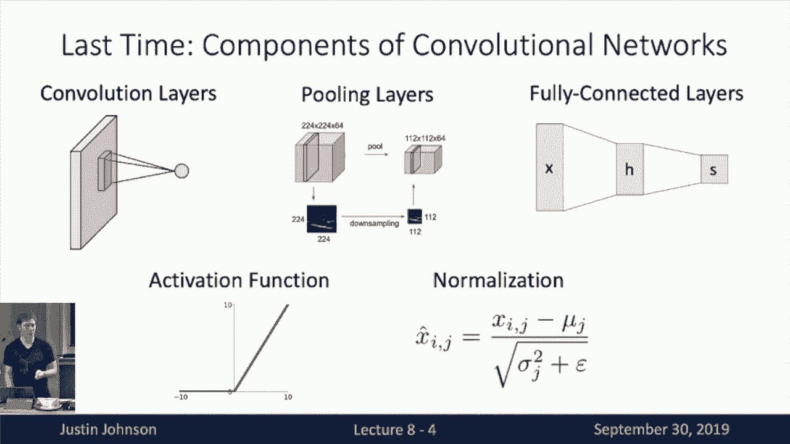

network architectures that people have，used over the past few years or so and a。

good way to ground this discussion is in，the imagenet classification challenge。

remember we talked about the image net，data set in the first two lectures that。

it was this very large scale data set，for image to classify Kait，classification that had about 1。2。

million training images and classifiers，and classification networks had to，recognize about 1。

000 different，categories in this one 1。2 million data，image data set for training and imagenet。

was very what was it was a huge，benchmark for image classification。

because they held a yearly challenge，from 2010 to 2011 teen where different。

teams would enter their best performing，image classification system and everyone。

around the world would compete against，each other to try to build the best。

classification system and the image that，classification challenge really drove a。

lot of research and a lot of intense，progress in convolutional neural neural。

network design over the past several，years so I thought it would be useful to。

ground this discussion by stepping，through and，about some of the some of the highest。

performing winners in the different，years of the imagenet competition as。

we've already seen in 2010 and 2011 the，first two years the competition was run。

the the winning systems were not neural，network based at all。

they were these compositions of multiple，layers of feet of hand design features。

together with some linear crossfire on，top but in 2012 as you should probably。

remember by now was the year that，convolutional neural networks first。

became a huge mainstream topic in，computer vision research when the alux。

net architecture just crushed all the，other competition on the image net。

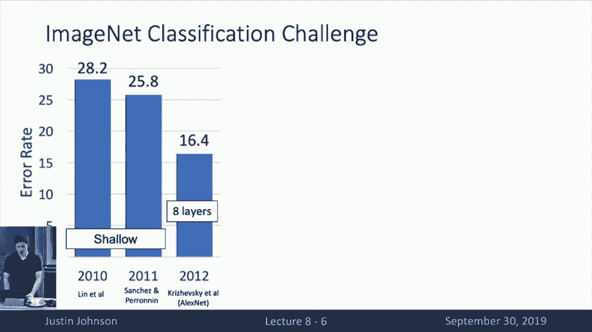

challenge in 2012 so what is Act so what，actually did Alex net look like well。

Alex net was a deep convolutional neural，network by today's standards I think it。

actually wouldn't be considered that，deep those who as we'll see as we go on。

to a lecture but Alex not accepted to 27，by 227 pixel inputs it had five。

convolutional layers they used max，pooling throughout and it had three。

three fully connected layers that，followed the convolutional layers and it。

used rayleigh nonlinearities throughout，and in fact alex net was one of the。

first major convolutional neural，networks that use Rayleigh，nonlinearities there's a couple other。

kind of quirks and features of the Alex，net architecture that are not so much。

used anymore one is that it had this，funny layer called local response。

normalization which has not really been，used to date anymore，so we won't talk about it in detail but。

it was a different type of normalization，and maybe as a very early precursor to。

something like batch norm but nowadays，we preferred use batch normalization。

instead another piece another kind of，quirky bit about Alex net is that when。

he when alex tkachev ski and his，collaborators were working on this。

network back in 2012 back in 2011 and so，Brett it was trained on graphics cards。

GPUs and the biggest GPU that they had，at the time was a GTX 580 which had only。

three gigabytes of memory if you look at，maybe the GPUs you guys are using on。

colab today they have something like，twelve or sixteen gigabytes of memory so。

back in 2011 the GPU is available just，didn't have very much GPU memory so in。

order to get this this neural network，fit into GPU memory it was actually。

distributed across two different，physical GTX 580 cards in kind of a。

complicated scheme where some of the，network ran on one card and some of the。

network ran on another card and this was，kind of an implementation detail that。

was required in order to fit the，cheapest this network onto the GPU。

hardware that was available at that time，this this this idea of splitting neural。

networks across GPUs is still sometimes，used today but in general it's not a。

very common thing to see with most of，the networks that we'll see in this。

lecture and of course at the top of the，slide here is this very very famous。

figure from the Alex net paper that，shows this convolutional neural network。

design of the Alex net and you can see，that it has these five convolutional。

layers and it's split into two chunks at，the top in the bottom to fit onto the。

two GPUs that it was distributed against，but one kind of funny thing about this。

figure is that it looks it's actually。

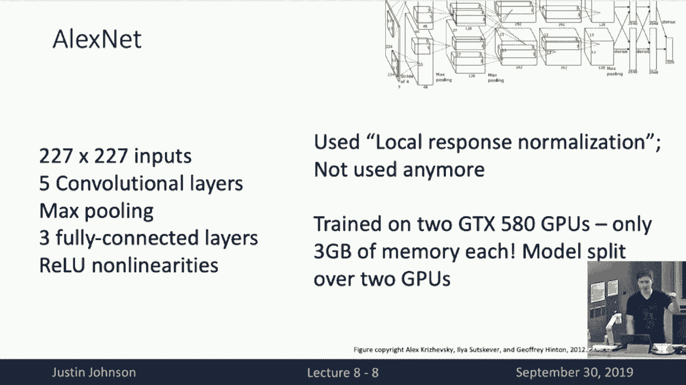

kind of clipped at the top and if you，look at the paper itself even in the。

Alex in that paper itself this figure，was actually clipped at the top so even。

though this is one of the most even，though this is a very important paper。

now where everyone is stuck looking at，this clipped figure because that's the。

version of the figure that actually was，published in the paper and I'd also like。

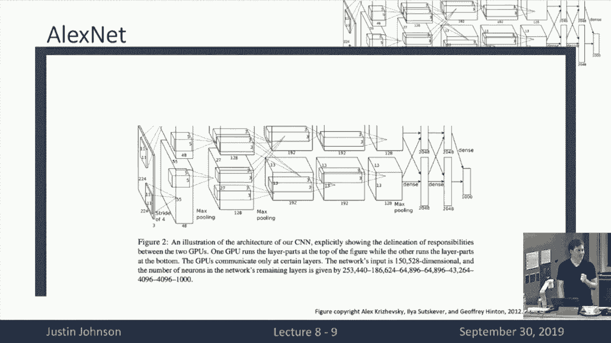

to point out just as a historic note，Alex net I think is it's hard to。

overstate just how influential this，paper has been if you look at the number。

of citations that this paper has gotten，per year since it was published in 2012。

it's already gotten something like，46，000 citations，since 2012 and if you look at this。

citation trend it seems to be still，growing exponentially so this is。

certainly one of the most highly cited，papers post in computer science but okay。

I think across all disciplines in all，areas of science in the last few years。

and to put this into context I think，it's also interesting to compare these。

citations with some other famous，citation with some other famous。

scientific papers throughout history for，example if we look at Darwin's Origin of。

Species back in 1859 has something like，a similar number of citations as Alex。

that does today or Claude Shannon's a，mathematical theory of，of communication which invented the。

field of information theory had，something like 69 has something like。

69000 citations and it was published in，1948 if we look at contemporary research。

there was another extremely important，piece of scientific research published。

in 2012 which was the experimental，discovery of the Higgs boson particle at。

the Large Hadron Collider this was，published the same year as the alux net。

paper and this is a fundamental this is，a fundamentally important advance in。

basic science that we observe a new，fundamental particle in the universe and。

this has only 14 thousand citations，compared to Alex that's 46，000 so um I。

need to caveat here that psyche looking，at citation counts for papers is really。

not is really kind of a very coarse，measure of their impact and it's really。

unfair to compare citation counts across，time and across different disciplines。

but that said I think it's think it's，pretty clear to many people that this。

alex net paper in this Alex that，architecture represents an important。

advance not just with in computer vision，or computers or computer science but。

really across all of human knowledge as，a whole hopefully that's not overstating。

up too much but with that with that。

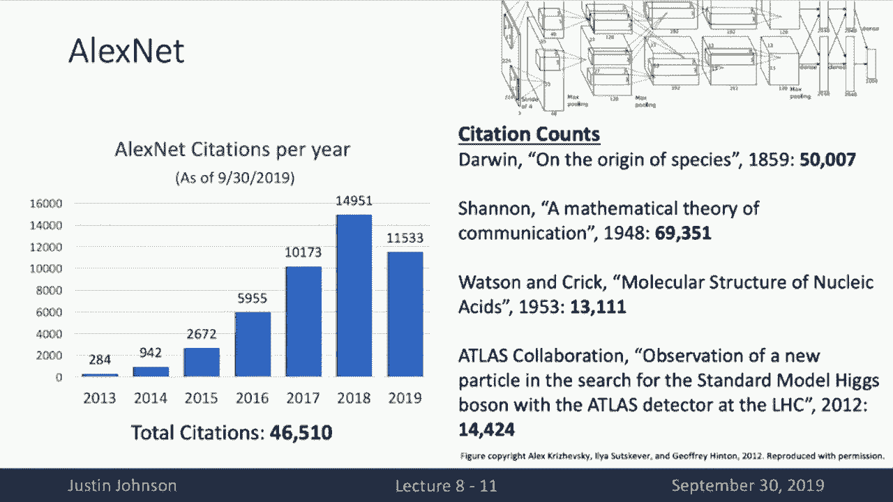

historical context in mind what actually，is what does the Alex net architecture，actually look like。

well this so Alex net starts off with an，input image of to 27 by 227 pixels and。

has works on RGB images so it has three，input channels the first convolutional。

layer has so this is by the way should，be a bit of recap from the convolution。

layer that we talked about in the，previous lecture but the first。

convolution layer in alex net has 64，filters a kernel size of 11 by 11。

astride of four and a pad for so given，those settings for this first。

convolutional layer what is the number，of channels in the output of that first。

convolutional layer yeah it should be 64，because recall that for a convolution。

layer the number of channels is always，equal to the number of filters now the。

next question is what is the what is the，output size here in this table at clacks。

collapsed height and width into one，column because that work everything is。

squared out this retexture anyone want，anyone take one thing I guess at the。

output spatial size of this，convolution layer yeah 56 so if you。

remember this formula from the slide on，the last lecture we know that the output。

size is equal to the input size minus，the kernel size plus 2 times the padding。

divided by the stride plus 1 if you plug，in those numbers you see that we get 56。

for the output of this first layer now，another question how much memory would。

this output feature map to consume in，kilobytes well I don't I don't know if。

it's reasonable to do this，multiplication in your head but the。

number of elements in that output tensor，is going to be C by output size by。

output size so the number of elements in，that output tensor is something like，200。

000 and we typically store these，elements in 32-bit floating-point so。

each element takes 4 bytes of memory so，multiply that by 4 and divide out and。

you see that this layer takes about 700，takes about seven hundred eighty four。

kilobytes of memory to store the output，of this layer now the next question how。

many parameters are how many learn about，parameters are in this layer of a。

network well for this one we remember，this what is the shape of a wait for a。

convolutional layer and we remember that，the shape of the wage for a，convolutional layer is a four。

dimensional tensor of size output，channels by input channels by kernel。

size by kernel size so output channels，of 64 input channels is three kernel。

sizes 11 plus there's just learn of a，bias which is a vector of the same。

number of channel width of the number of，output channels so the total number of。

learn about ways here is about 23，000，next how many floating-point operations。

does it take to compute this this，convolution layer well again I think。

it's maybe tricky to this multiplication，in your head but in order to compute。

this we so by the way this this idea of，floating-point operations and counting。

floating-point operations for layers in，a neural network will be in a very。

important topic throughout today's，lecture so first off when we talk about。

floating-point operations in a neural，network we usually count the number of。

multiply ads where a multiplied together，with an ad counts as one floating-point。

operation for the purpose of counting，operations in a neural network this is。

because many many actual bits of，computing hardware can perform a。

floating point multiplication and an，accumulation in a single。

cycle so we tend to account multiply and，an ADD as a single operation now to。

count the number of operations that it，costs to perform this convolution layer。

we think how many output elements are，there in the tensor and that's see out。

by output size by oversize and how many，operations does it take to compute each。

element of that output tensor well，recall that each element of that output。

tensor is computed by taking the，convolutional filter and slapping it。

inside the input dimension some at some，time somewhere，so each element of the output tensor。

results is the result of computing an，inner product between a convolutional。

filter which has size CN by K by K and，another chunk of the input which has。

size CN by K by K and and a dot product，taking a dot product of two vectors with。

n elements takes n multiplies and adds，once you count bias term so when you。

multiply all that out you see that this，first convolutional layer takes。

something like 73 mega flops in order to，compute the convolution of this first。

layer so now the second layer in Alec's，net is a pooling layer immediately。

following oh I mean this actually goes，there's a visiray Lu so I'm sort of。

omitting the reimu's from many of the，many of the architectures in this。

lecture because it's always assumed，it'll be summer a Lu or some。

non-linearity immediately following the，convolution layer so immediately after。

the Ray Lou and the first convolution，Alec's net has its first pooling layer。

and the pooling layer here for Alex the，first pooling layer has a kernel size of。

three a stride of two and a pad of one，so given those parameters what should。

the output shape of this first layer in，Alec's net be well the number of channel。

dimensions is the same because recall，that pooling layers operate。

independently on each input channel so，cooling layers don't change the number。

of channels and here this pooling layer，has the effect of down sampling the。

input spatially by a size by a factor of，two Alex that's kind of a funny。

architecture and all the numbers don't，actually divide evenly in alex net which。

is a little bit annoying so here we have，to actually after we do have to be。

divided by the stride we also have to，round down to get the output spatial，size of 27 by 27。

how much memory does the output of the，pooling layer take and we see that we。

have the same procedure of four bytes，per element multiplied by the number of。

elements in the tensor gives us the，amount of memory usage of this layer。

next how many learn about more in this，this pooling layer is zero because we're。

call pooling layers have no learn double，parameters they simply take a max over。

their receptive field then how many，floating-point operations does it take。

to compute this pooling there well here，it's begun difficult to do the。

multiplication in your head but again we，have this similar way of thinking about。

how many up how many elements are in the，output tensor which is number of output。

channels by output size by open size and，how many floating-point operations does。

it take to compute one element in the，output tensor well recall that each。

element in the output tensor is the，result of taking a max over the。

receptive field within one channel so we，have to take the max of three by a three。

by three grid of elements so we need to，find the maximum of nine elements you。

can imagine that taking approximately，nine floating-point operations may be。

eight but for simplicity we'll just say，that it's equal to the curl size square。

so if you multiply this out we see that，the float that this max cooling layer。

takes only about a balmy about 0。5 only，what 0。4 megaflops，which you should notice is very very。

small compared to the convolution layer，so this is a fairly general trend in。

convolutional neural networks that the，convolution layers tends to have a lot。

of contains tend to cost a lot of，compute tend to take a lot of。

floating-point operations where the max，pooling layers or other types of pooling。

layers generally cost very little，floating-point operations so much so。

that when sometimes people write papers，and calcium operations in a neural。

network they'll even not even count，upload the maximum of the max pooling。

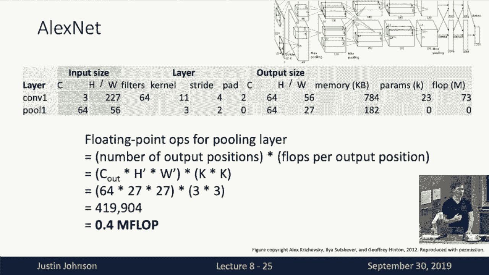

layers just because the number of，operations there is so small compared to。

the number of convolution layers now，alex net has five more convolution。

layers i'm not going to walk through，this exact procedure for each one of。

those layers but we can similarly，compute the output size and the number。

of and the the number of memory and，parameters and flops for each one of。

these five convolution layers and alex，paths and interspersed with these，convolution layers are。

or pooling theirs and by the time we，finish with all the convolution layers。

and all of the pooling layers Alex that，is left with an output tensor with 256。

channels and a 6x6 and spatial size and，after all of these convolution layers。

terminates then we have this flattening，operation that flattens out all of the。

that destroys all the spatial structure，in that input tensor and just flattens。

it out into a vector so then this，flatten layer just flattens everything。

into a vector and it has no it has no，parameters and no flops now after the。

flat after this flattening operation we，have our first fully connected layer。

with 496 hidden units again we can，compute the memory the parameters and。

the flops for this fully connected for，this first fully connected layer after。

the first fully connected layer we've，got two more fully connected layers one。

more with 496 hidden units and the final，fc8 layer with 1，000 units to produce，the 1。

000 scores for our 1000 categories，so this is the Alex that architecture。

and the question is like how it was this，designed the unfortunate reality I think。

behind Alex net is that the exact，configuration of these convolution。

layers was really a lot of trial and，error so the exact settings of these are。

somewhat mysterious but it seems to work，well in practice as we'll see moving。

forward people wanted to try to find，principles for designing neural networks。

that let them scale up and scale down，and didn't rely so much on extensive。

trial and error of explicitly tuning the，filter sizes and strides and everything。

for every individual layer but for Alex，that I think the best answer is that。

these settings are really trial and，error but if we look over at this at。

these last three columns and look at the，memory the parameters and the flops。

marching down through the network then，we start to see some very interesting。

trends that hold true not just an Alex，net but also across a lot of different。

convolutional neural network，architectures here we've already pointed。

out one trend that see the as we，mentioned all of the pooling layers take。

such little floating-point operations，that they all round down to zero so we。

can so we can effectively discount the，floating-point the the pooling layers。

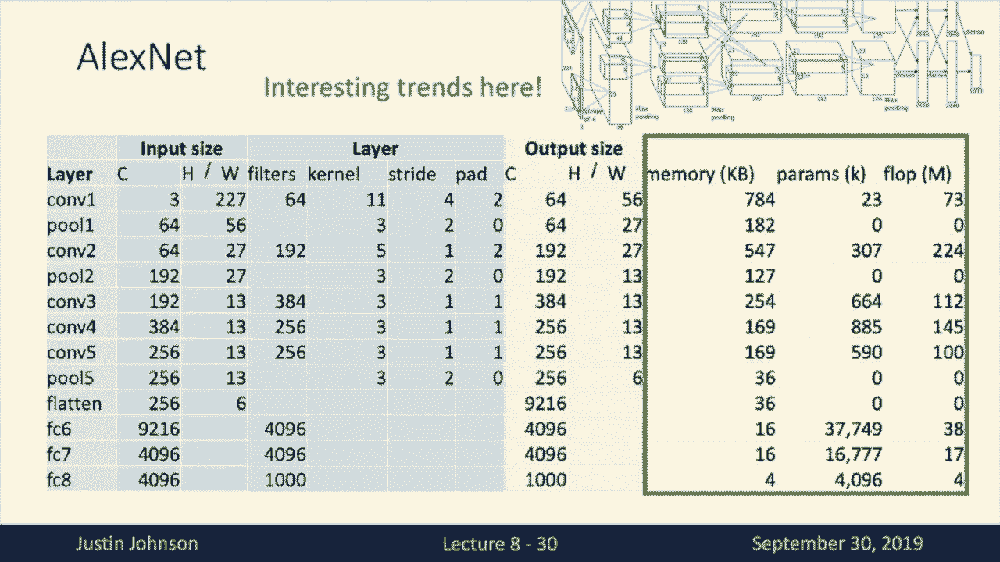

when trying to count the number of，operations in an ER Marc，and here we can read and we can redraw。

that exact same data of the number of，members the amount of memory the number。

of parameters and the number of flops，for each layer of this network and。

convert it into some bar charts so here，we see a couple very interesting trends。

so here if we look at the chart on the，left this shows the amount of memory。

that is used but at the outputs of the，first cut the first five the five。

convolutional layers and at the outputs，of the three fully connected layers and。

here we see this very clear trend that，the vast majority of the memory usage in。

Alex NAT actually comes from storing the，activations at the early convolutional，layers。

this happens because at those early，convolutional layers we the outputs are。

have a relatively high spatial，resolution and a relatively high number。

of filters so when you multiply that out，it happens that most of the memory usage。

happens in the very first couple of，layers of the network now if we look at。

the middle plot this shows the number of，parameters in each layer and this shows。

the opposite trend with from compute，this shows that for the convolutional。

layers have very very few parameters，whereas the fully connected layers。

actually take a very very large number，of parameters and the layer with a。

single largest number of parameters is，that very first fully connected layer。

that happens after the flattening，operation because what if you look at if。

you think about what happens in an FC，six layer we had this spatial tensor of。

six by six by what was it six by six by，256 and that gets fully connected into。

400 4096 hidden dimensions so the weight，matrix is now six times six times 256。

times 4096 so that one weight matrix of，FC six has something like 37 million。

print as almost 38 million parameters in，just that one fully connected layer of。

the neural network and in fact basically，all of the blur Nobel parameters and。

Alex Net come from these fully connected，layers whereas if you look at the owner。

of computation that each layer costs，then you see yet another trend which is。

that the fully connected layers take，very little computation because they're。

just multiplying a very large matrix，whereas the vast majority of the，from。

all the convolutional layers and，especially layers that take a lot of。

computation our layers that have，convolutions with large numbers of。

filters at high spatial resolutions and，this is quite a general trend across。

many different neural network design，it's not just Alex Matt that you can。

you'll you'll have most of the memory，usage in the early convolutional layers。

most of the parameters and the floyd，connected layers and most of the。

computation in the convolutional layers，so these trends are kind of interesting。

to keep in mind as we move on to later。

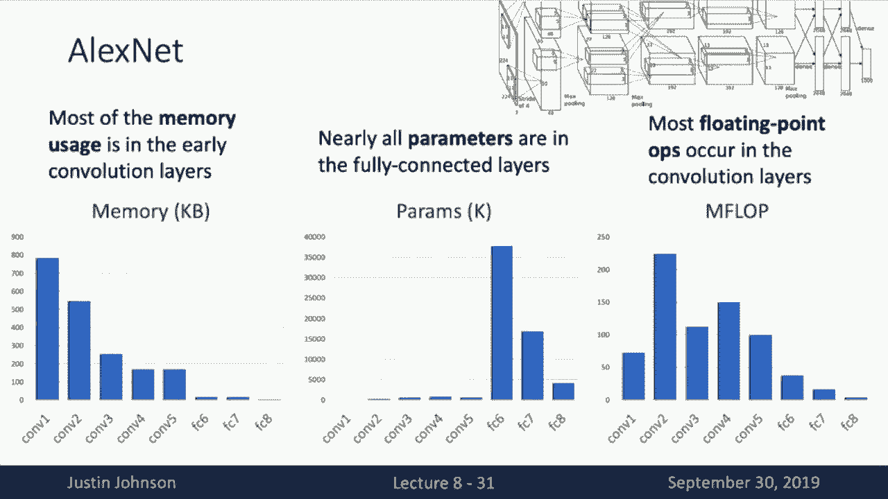

architectures that try to address more，efficient architectures that try to fix。

some of these trends so that that's our，brief overview of the alex net。

architecture so that well that's what，happened in 2012 what happened in 2013。

well in 2013 pretty much all of the，entrants to this competition now。

switched over to using neural networks。

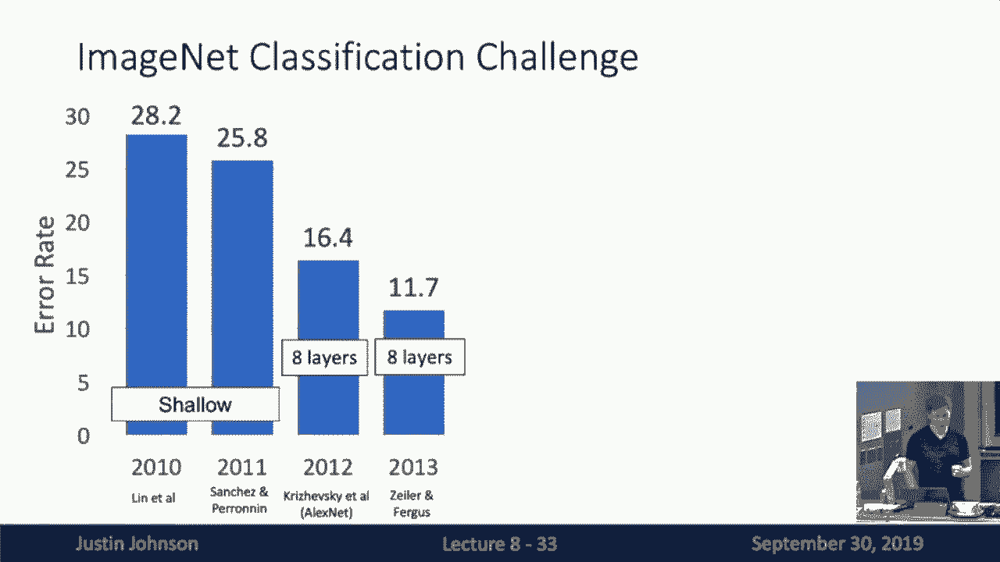

and the winner of the competition was，also an 8 layer network called ZF net。

after the authors of Matt Zeiler and Rob，Fergus ZF net is basically a bigger Alex。

net I told you that Alex net was，essentially produced via trial and error。

well ZF net is more trial and less error，so basically in ZF net it's the same。

basic idea as Alex net except they，between some of the layered，configurations in particular in the。

first convolutional layer alex net had，11 by 11 stride for turns out it so it。

works better if you use 7 by 7 stride to，who'da thunk and for those later。

convolutional layers in convolutional，layers 3 4 & 5，instead of using 384 384 256 filters。

like an Alex net instead we increase the，number of filters and use 512 1024 512。

and who knows this also tends to work，better so to be a little bit less。

facetious the truck I think the takeaway，from the F net is that it makes it's。

just a bigger version of Alex net so if，you look at the first convolutional。

layer if we when we change from strive，for to stride 2 that means that we are。

aggress aggressively down sampling the，input in space at the very first layer。

so that on this 11 by 11 strive for in，Alex net well immediately spatial。

spatially down sampled by a factor of 4，whereas for Zee，and that that first convolutional layer。

will only downsample by a factor of two，which means that all the other feature。

maps moving throughout naziha that will，now have a higher spatial resolution and。

higher spatial resolution means more，receptive fields means more compute so。

the Xia that actually is going to cost a，lot more computation than Alex net and。

for the later convolutional layers by，increasing the number of filters this。

also just makes the network bigger it，has more learn about parameters it takes。

more memory it takes more compute so I，think the takeaway from alex net to ZF。

net is that bigger networks tend to work，better but at this point in time there。

was not really a principal mechanism for，making the networks bigger or smaller at。

will instead they kind of had to reach。

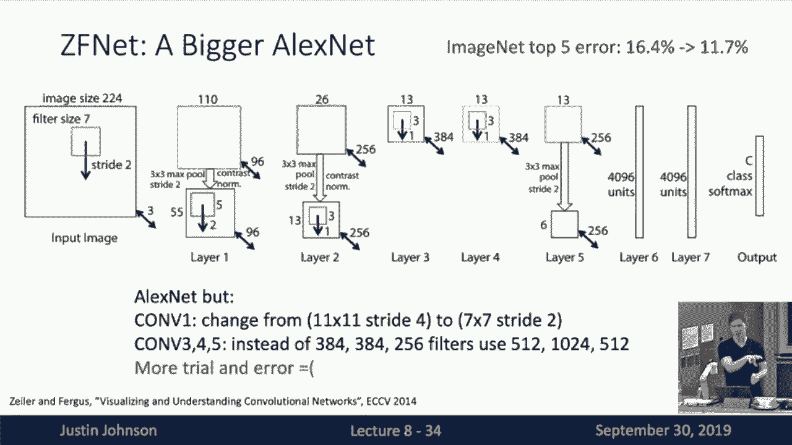

into individual layers and tunes both，the individual parameters one at a time。

in order to make the network's bigger，but in doing so they were you able to。

achieve a fairly large increase in，performance over Alex net and we saw the。

error rate on this image net challenge，dropped from sixteen point four down to。

eleven point seven with Zi net now 2014，was when things started to get very very。

interesting and 2014 brought around the。

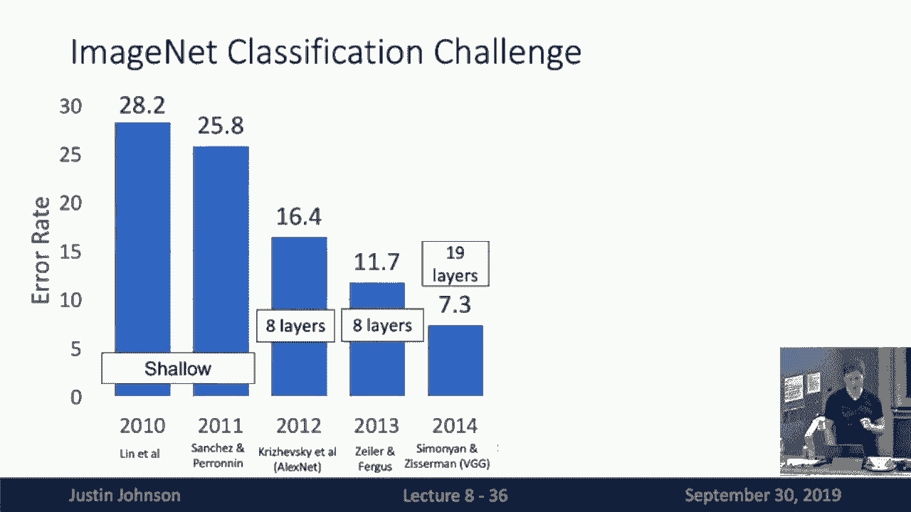

the so called vgg architecture from，Karen Simonian and andrew zisserman now。

vgg was really one of the first，architectures to have a principal design。

throughout so we saw that alex net and，ZF net were designed in somewhat of an。

ad hoc way that there was some number of，convolution layers there was some number。

of pooling layers but the exact，configurations of each layer were set。

independently by hand through trial and，error and this makes it very hard to。

scale networks up or down so instead as，we moved into now it's starting in 2014。

people started to move away from these，hand designed bespoke convolutional。

architectures and instead wanted to move，to architectures that had some design。

principles that were used to guide the，overall configuration of the network and。

the bjg networks were particularly just，followed a couple very very clean and。

simple design principles the design，principles of bgg were that all。

convolution layers are going to be three，by three stride to all pooling layers。

are going to be max pooling layers 2x2，stride - and every，after a max pooling layer you're gonna。

we're gonna double the number of，channels and then we're going to have。

some number of convolution layers and，eventually some fully connected layers。

and the number of hidden units and the，Holy Tech layers were the same as Alex。

NAT so these with these simple designer，rules it lets you design it lets you not。

have to think so hard about the exact，configuration of each layer in your。

neural network but let's think about so，and also this this network had five，convolutional stages。

remember that alex net had 5，convolutional layers now vgg pushed that。

forward and moves deeper networks we're，now rather than five individual。

convolutional layers we have five stages，where each stage consists of a couple。

convolution layers and a pooling there，so the vga architecture is like calm。

calm cool calm calm pool calm calm pool，and for however many state ever。

performing stages you're going to have，there were exam several different bgg。

architectures that were tested but the，ones that were most popular with the 16。

layer and the 19 layer bgg architectures，which had always two convolutional。

layers in the first few stages and，either three or four convolutional。

layers in the last two stages so that's，pretty much all you need to know in。

order to know how to build a bgg network，but it's useful to think about why。

people chose these particular design，principles for designing the network in。

this way well first let's think about，why it makes sense to have only 3x3。

convolutions in your network so you saw，in alex nets and nzf net that this。

number of the size of a convolutional，kernel in each layer was a hyper。

parameter and people played around with，different convolutional kernel sizes at。

different layers well let's let's let's，think about two different options that。

we could have as alternatives for as one，alternative we could imagine a。

convolutional layer with five by five，kernels that takes see it's the channels。

of input and produces C channels of，output that operates on an input of size。

H by W and here we can assume that we，have padding of two in strategy lines。

with the output size is the same spatial，size as the input well this this，of。

the number of parameters is 25 C squared，because we each we've got a c。

convolutional filters each one has five，by five by CS or 25 C squared learn。

about parameters in this layer ignoring，bias and the number of floating-point。

operations that it costs to compute this，convolutional layer is now 25 C squared。

HW because the number of outputs from，the layer is going to be H by W by C and。

the cost of computing every one of those，outputs will be five by five by C so the。

overall cost of the layer is twenty five，C squared HW now let's contrast this。

with a stack of two convolutional layers，that each have kernel size three by。

three that also produce input the Tagus，C channels as input and produce C。

channels as output well as we remember，from our discussion of receptive fields。

in the previous lecture we know that if，we stack up to three by three。

convolutions then it has an effective，receptive field size of five by five so。

in terms of how much of the input can we，see after this number of layers in terms。

of receptive fields this is five by five，convolutional layer and this pair of。

three by three convolutional layers is，somehow equivalent in terms of the。

amount of the input that are able to see，but but if we compute the number of。

parameters for these things we see that，each of these two convolutional layers。

the number of parameters is 9c squared，so the total number of parameters for。

the for the stack of 2 comma 3 by 3，comma is 18 C squared and similarly the。

number of floating-point operations for，this stack of 2 convolutional layers is。

only 18 C squared HW because again the，output is C HW and the cost of computing。

any one of those outputs is 3 by 3 by C，so each output costs 9 C and multiply it。

all out we've got two layers so the，overall cost of the stack of to cure。

become is 18 C squared HW and now we see，something interesting is that even。

though these two layers have the same，receptive field size the stack of 2 3x3。

convolutions has fewer noble parameters，and TN costs less computation so the。

insight from the bgg network is that，well maybe there's no reason to have。

larger filter sizes at all because，anytime you wanted to have a 5x5 filter。

you could have instead replaced with 2，private，right three builders and by a similar。

argument rather than a single seven by，seven filter you could have replaced。

with a stack up three by up three three，by three convolution layers so with that，in mind。

it lets us sort of throw away the kernel，size as a hyper parameter and the only。

thing we need to worry about is how many，of these 3x3 conv layers are going to。

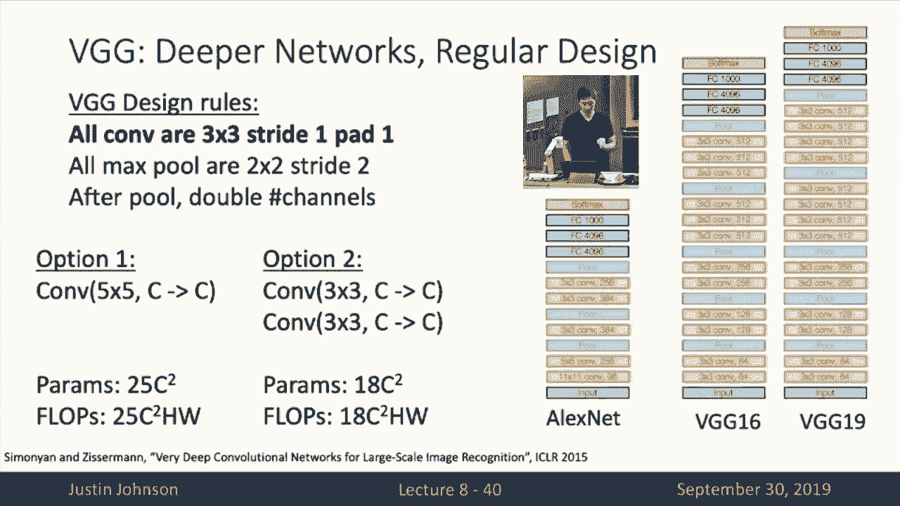

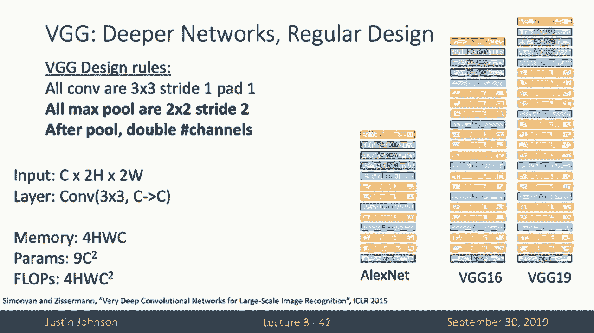

stack within each stage and right so，then the turning to the second design oh。

right the other piece about this is that，if we stack two 3x3 convolutional filled。

layers after one another we can actually，insert rail ooze in between those two。

convolutional layers which actually，provides us more depth and more。

nonlinear computation compared to a，single 5x5 convolution so not only is。

the is the stack of two 3x3 convolutions，has fewer parameters it has fewer plot。

flops and it allows more nonlinear，computation so it just seems like a，clear win over a single 5x5。

convolutional layer so that's the idea。

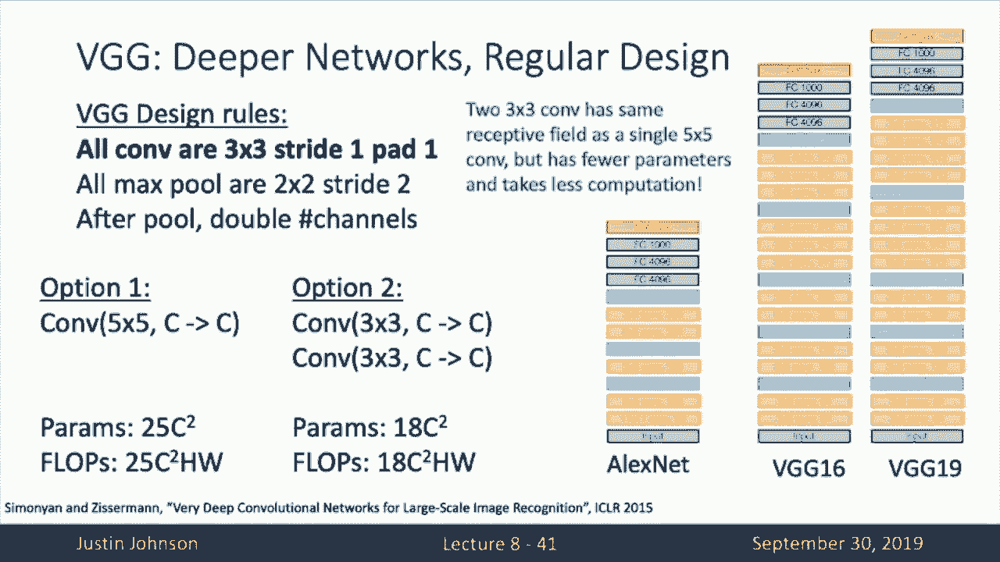

behind this first design rule and so，then let's think about the second design。

rule in vgg it says that all of our all，of our pooling layers are going to be。

2x2 max pooling stride to pad 0 which，means that every pooling layer is going。

to have the spatial resolution，of the input feature map and the other。

the other rule here is that every time，after we pool we will double the number。

of channels so then let's think about，what happens between two stages when we。

follow these rules so for let's think，about the computation at stage one for。

instance the one that one of our layers，inside stage one would have an input of。

size C by 2 H by 2 H and the layer would，be a 3 by 3 convolution with C input。

channels and C alpha channels if you，multiply all this out we see that the。

amount of memory consumed by this output，tensor is going to be 4 HW C it's the。

number of elements in the output tensor，after this convolution the number。

parameter noble parameters is 9 C，squared excluding the bias and the。

number of floating-point operations is 4，HW C squared using right actually that's。

that doesn't seem right，I think that's an error but that's ok。

the same errors propagated over here so，the argument still holds so。

so if they're both off by the same，concept I'll fix this after after the。

lecture now after we go to the second，after we move to the next stage then the。

number of channels would be doubled and，the number spatial resolution would be。

halved well when this happens we can see，that the memory is reduced by a factor。

of two and the number of parameters，increases by a factor of four but the。

number of floating-point operation stays，the same now here's the error is that。

these two number of floating-point，operations I think are both off by a。

factor of nine but since they're both，off by a factor of nine it's still true。

that they both these these two layers in，two subsequent stages still cost the。

same number of loading off point，operations so this design principle has。

actually followed along Metin it's been，followed by many many many convolutional。

architectures following vgg the basic，idea is that we want to preserve this。

equipment we want each convolutional，layer to cost the same amount of。

floating-point operations and we can do，that by having a spatial size and double。

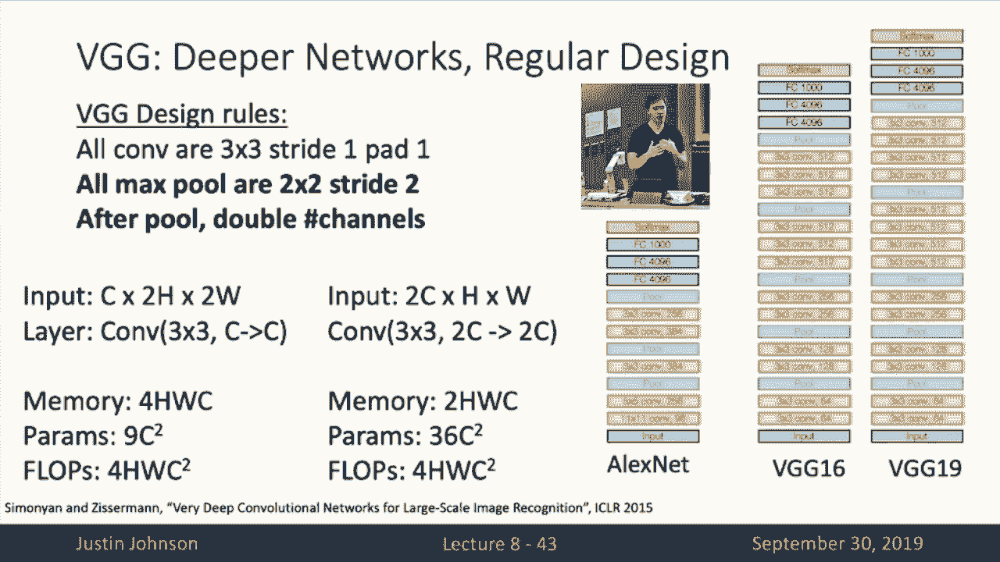

younger channels at the end of each，convolutional stage so then another。

thing to point out is that we can，compare Alec's net and bgg sixteen head。

by side to side remember that Alex net，had five convolutional layers and three。

fully connected layers and now all of，the bgallagh vgg networks also have five。

convolutional stages and three fully，connected layers and now we can draw。

this same plot of memory parameters and，and floating-point operations to compare。

at a comma at a stage by stage basis，between Alex net and vgg and here the。

overwhelming result from these graphs is，that vgg is just a gigantic network。

compared to Alex net if we look at the，number of member like you can't even see。

these blue bars on these on these graphs，like alec vgg is just dwarfing Alex that。

on all of these different accents of，computation it takes dramatically more。

memory if you look at the total amount，of memory consumed by storing。

activations for all these outputs then，bgg is something like 25 times greater。

if you look at the total number of learn，about parameters Alex that had about 61。

million vgg 16 has 138 million so more，than twice as many learn about。

parameters and the real killer is that，computation at these two things cost if。

you if you add up the total number of，floating-point operations that cost that。

it takes to compute a single four pass，Alex net versus a single for pass in bgg。

we see that vgg is more than 19 times，more expensive in terms of。

floating-point operations so vgg 16 is，just this absolutely massive network and。

again we still get this story that we，saw moving from alex net to ZF is that。

bigger networks tends to achieve better，results on these large-scale image net。

challenge but now with bgg it gives us a，guiding principle a couple of guiding。

design principles but let us easily。

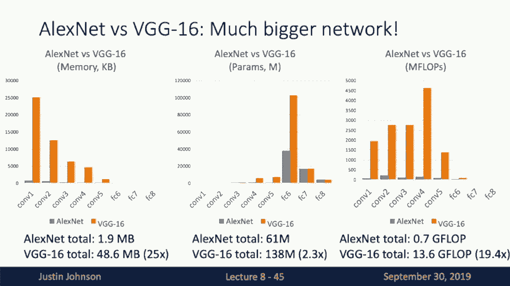

scale up or scale down the network and，we no longer have to go in and fiddle。

with the individual hyper parameters of，every layer now 2014 was such an。

interesting layer such an interesting，year that there's actually two，convolutional neural network。

architectures that came out of that，year's challenge that we need to talk。

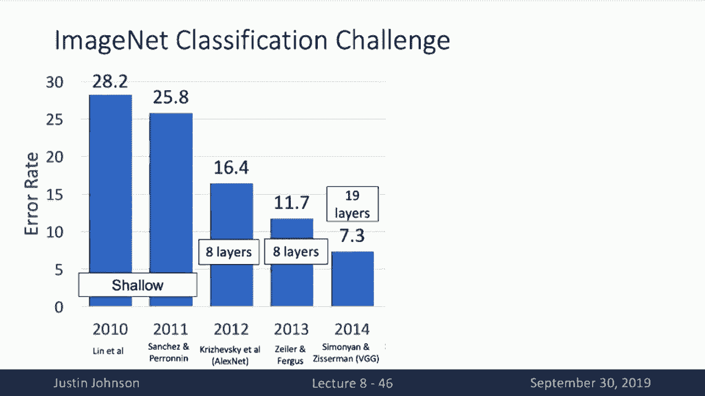

about one was vgg oh I should point out，another very amazing thing about this。

bgg architecture is that it was done in，academia by one grad student and one。

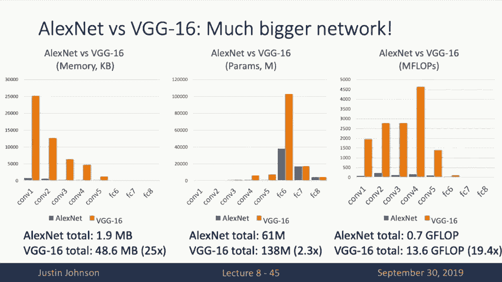

faculty member so that was quite a，heroic effort on their part the other。

network that we need to talk about from，2015 from 2014 was from Google this was。

a very large team with access to a very，large amount of computation so I think。

it was quite a testament to the the bgg，team in 2014 that even though they。

didn't win the image that classification，challenged that year they really held。

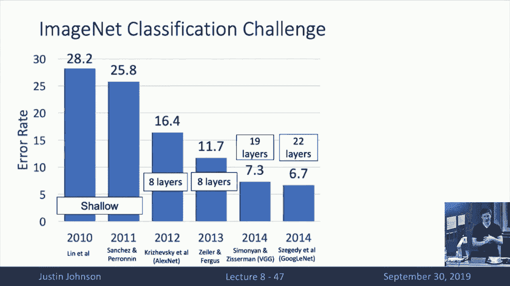

their own against this this this，corporate team with access to many more。

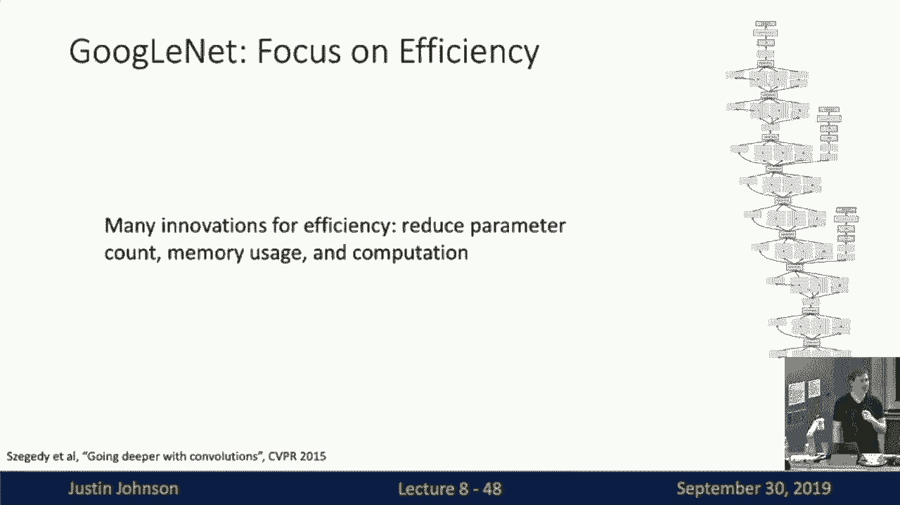

resources now the main takeaway of，Google net is that so because they。

wanted to be cute remember there was，this oh sorry was our question yeah the。

question was was vgg also split across，multiple GPUs well from starting around。

that time well I think we'll talk about，this more later but there it was it was。

split across multiple GPUs but it was it，was a it was data parallelism so they。

basically take the batch of data you，split the batch and compute different。

elements of the batch on different GPUs，so each so you no longer split the model。

across GPUs instead you split your mini，batch across GPUs so that required，that's that's my。

simpler to implement compared to the，model parallelism that was used and how。

it's not yeah question that's a great，question so BJ yeah so bgg stands for。

the visual geometry group which is the，name of the academic lab that this。

network came out of so it's I guess the，the name of the lab is now intrinsically。

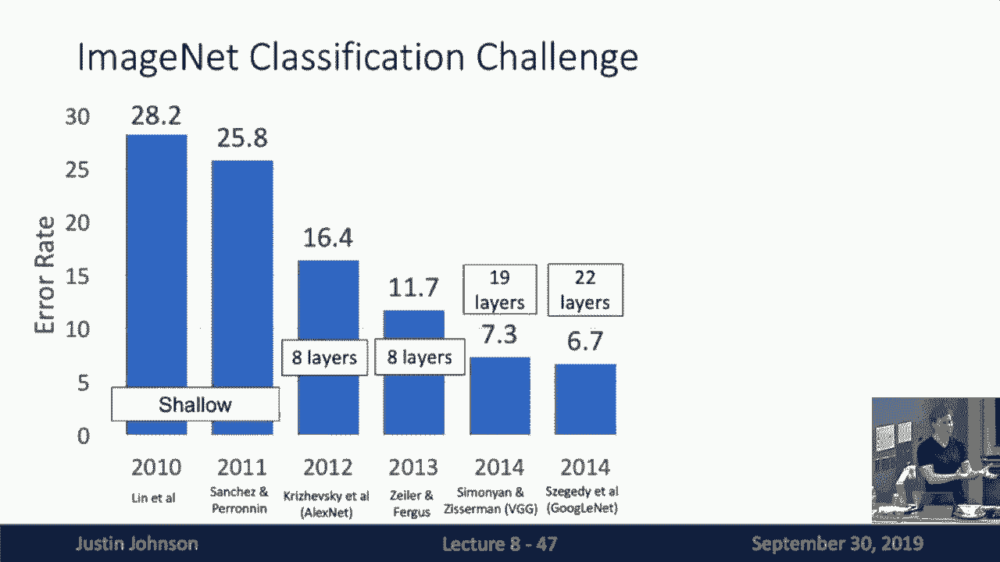

linked to this particular convolutional，neural network design I'm not sure if。

it's good or bad but that's what that's。

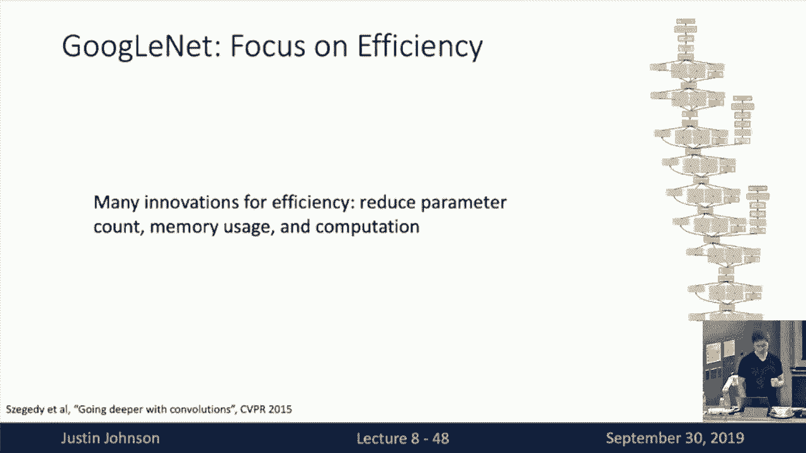

what it stands for so in the other the，other architecture we need to talk about。

from 2014 is Google net it's a cute name，remember that there was one of the。

earliest convolutional neural network，architectures was Lynette that was。

created by Yann laocoön and now in，homage to Lynette and Yann Laocoon this。

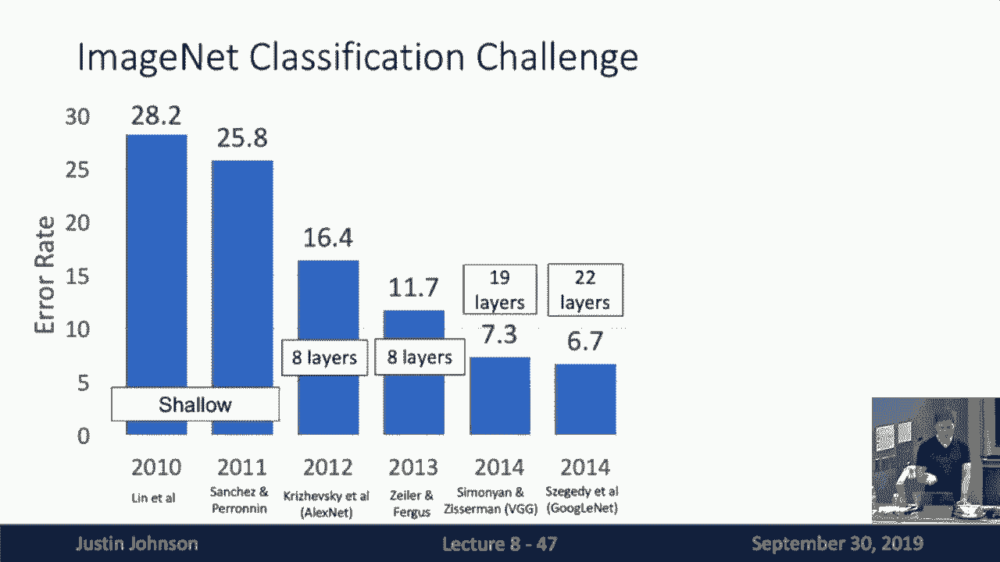

Google team decided to name their，network Google net it's very cute and。

the idea the the overwhelming idea，behind Google net was to focus on。

efficiency if you look at the trend from，Alex net to ZF to be Gigi the trend that。

we can see is that bigger networks，perform better but with Google net the。

the team was really focused on trying to，design efficient convolutional neural。

network because Google actually wants to，run these things for real in data。

centers and on mobile phones so they，save a lot of money if they can get the。

same performance with a cheaper，convolutional network design so they。

were really focused on trying to build a，network that worked really really well。

while also minimizing the overall，complexity of the network so they had a。

couple innovations that were really，started out were made popular by the。

Google net architecture that were，carried forward to a lot of other。

following neural network architectures，one is the use of a stem Network at the。

very at the very first couple of，convolutional layers which very，aggressively down samples the input。

image and very in order to aggressively，downsample the spatial resolution of the。

input very quickly because as you'll，recall with vgg or alex that the very。

expensive layers were those big，convolutions on a lan feature maps of。

very large spatial size so to avoid，those expensive convolutions on large。

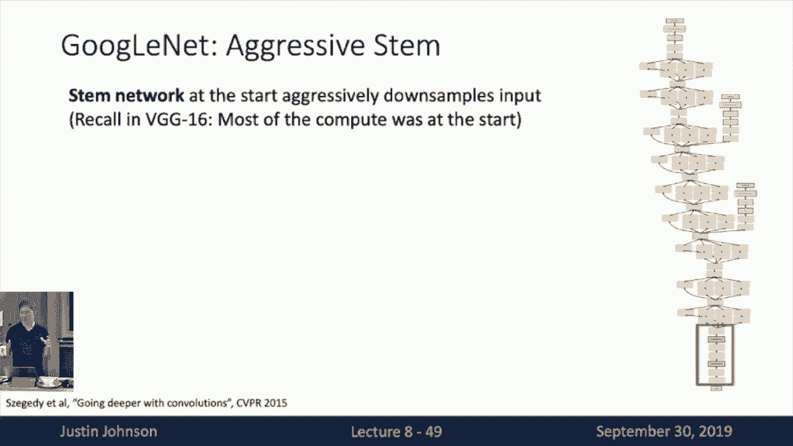

spatial feature maps they use a，lightweight stem that quickly down。

samples the input so I'm not going to，walk through the stem design in in。

in detail but you can see that it very，quickly down samples from the input。

resolution station resolution of two to，four by two to four all the way down to。

28 by 28 using only a couple layers that，really so that you can spend the bulk of。

computation now operating at this lower，spatial resolution and you no longer。

have to do expensive convolutions at a，high spatial resolution so here we could。

actually compare two vgg 16 so if you，look at the the component of Google net。

that down samples from 2 to 4 down to 28，in spatial resolution that entire part。

of the network costs about four hundred，eighteen next flops for Google net if。

you look at the equivalent spatial，downsampling in bgg 16 that goes from 2。

to 4 down to 228 you can see that that，same amount of spatial down sampling and。

vgg 16 costs more than 7 gigaflops so，that that same amount of spatial down。

sampling was nearly 18 times as，expensive if you look at on Google net。

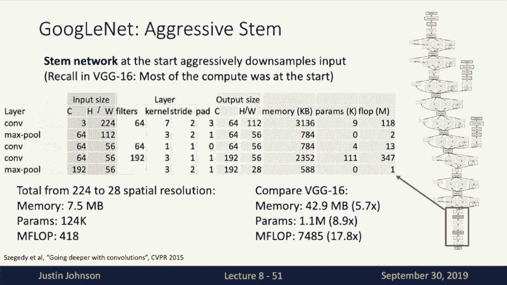

against BGT the other innovation in，Google Maps is this so-called。

inception module they were very clever，because they got to go deeper as they。

called it inception yeah I don't know，but the idea is that they had this。

little module that they called Inception，that had that was this local structure。

that was repeated throughout the entire，network we saw just as vgg use this。

simple repeated structure of calm calm，pool now google map used this little。

inception module design that was，repeated throughout the entire architect。

do you have the entire network many，times the inception architecture the。

this inception module is kind of funny，it had it also introduced this idea of。

parallel branches of computation so，you're in VG remember that the kernel。

size the convolutional kernel size，there's always a hyper parameter that we。

want to try to avoid in bgg they took，the approach of replayed you know we it。

turns out that we can replace kernels of，any not any any convolutional size with。

a stack of three by three and it's kind，of equivalent well google net took a。

different approach and they said that in，order to eliminate the kernel size as a。

hyper parameter we're just going to do，all the kernel sizes all the time so。

they've been inside this inception，module they had four parallel branches，one that does a one by one。

evolution one that does a 3x3，convolution one of those a 5x5，convolution and one that does a max。

pooling with a stride of one so within，every one of these layers it does all。

the things so there's no need to tune，hybrid kernel sizes a hyper parameter。

because you've got all the kernel sizes，in all the places and the other bit of。

innovation in the inception module was，the use of one-by-one convolutions。

before expensive spatial convolutions，that was used to reduce the number of。

channels before doing is these expensive，spatial convolutions and we'll we'll。

revisit this idea of convolution。

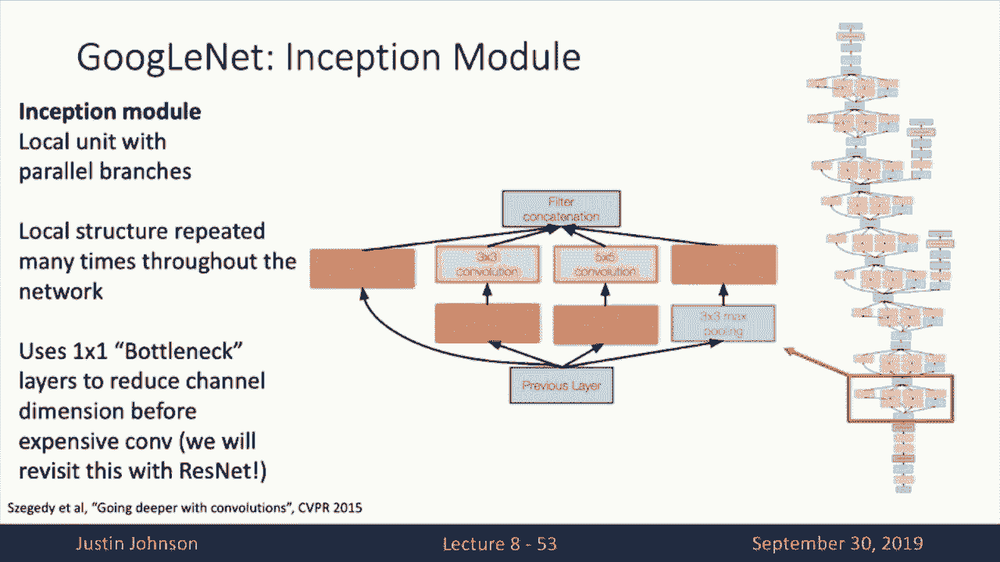

one-by-one convolutional bottlenecks，when we talk about residual networks in。

a few minutes so I don't want to talk，about that in detail here the other。

innovation in Google meant is the use of，global average pooling at the very end。

of the network if you remember back to B，Gigi and Alex net we saw that the vast。

majority of the parameters in V Gigi and，Alex that were coming from these giant。

fully connected layers at the very end，of the network well in because one of。

the ways that we might what focused on，efficiency is by reducing the number of。

parameters in the network so in order to，do that Google Nets simply eliminates。

those large fully connected layers so，remember in Alex net and B Gigi at the。

end of the network at the end of the，convolution layers we had this flatten。

operation that destroyed spatial，information by flattening the。

convolutional tenser into a giant vector，well Google net uses a different。

strategy for destroying spatial，information rather than flattening the。

tensor instead they use an average，pooling with a kernel size equal to the。

final spatial size of the last，convolutional there so in in particular。

the last convolution at the at the end，of this last inception module in Google。

met the the output tensor is has a，spatial size of seven by seven with 1024。

convolutional with 1024 feature maps now，then they apply an average pooling with。

kernel size equal to seven by seven and，the stride doesn't matter because it。

only fits in one place so what that，means is within every of those 1024。

channels they average out they take the，average of the the values of those。

channels across all the spatial，positions in the input tensor this now。

reduced this this now also destroys，spatial information but，rather than flattening into a giant。

tenser instead it actually reduces the，total number of elements so it ends up。

with this compact vector with only 1024，elements so then there's only one fully。

connected layer in Google net which then，goes from this 1024 output from global。

average pooling that gun converts to the，1000 that goes from 1024 into 1000 where。

again 1000 is the number of categories，in the image net data set so Google net。

is able to eliminate a huge number of，learn about parameters by simply。

eliminating this fully connected layers，and instead replacing them with idea of。

global average pooling and this is。

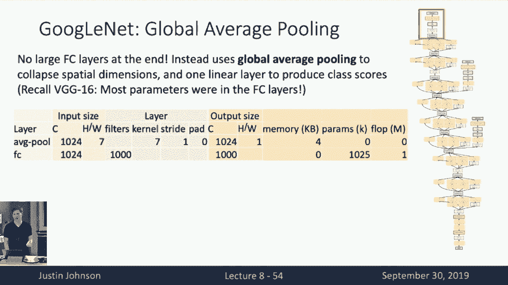

something that got picked up by a lot of，different convolutional neural networks。

on the following Google Maps we can also，compare this side by side with vgg and。

just see how profoundly this affects the，number of parameters in last couple of。

layers another piece of awkwardness in，Google net is that they had to rely on。

this idea of auxilary classifiers so one，should point I ate to point out that in。

Google net actually occurred before，batch normalization so before the。

discovery of batch normalization it was，very very difficult to train networks。

that had more than about 10 layers or so，and whenever people tried wanted to。

train deeper networks than about 10，layers without batch normalization they。

had to resort to some ugly hacks and one，of the ugly hacks that was used in。

Google net is this idea of auxilary，classifiers so here what they did is。

they attack you know at the end of the，Google net they had a global average。

pooling and a fully connected layer that，produced class scores well they had。

auxilary global average pooling and，fully connected layers at several and。

several internal points in the network，so this thing was actually outputting。

three different sets of class scores one，from the end of the network and one and。

two from these intermediate parts of the，network and then for these intermediate。

classifiers they also compute loss and，propagate gradients coming back through。

all three of these classifiers and this，had the effect of making gradients。

propagate more more easily through the，network because they now they're in if。

you think about what happens in the，backward pass they inject gradient at。

the very top of the network at the final，classifier and they also inject gradient。

directly in these according to these two，auxilary classifiers，and this was a trick that they used in。

order to get things to converge in order，to get deep networks to converge at that。

time yeah so yeah that was very astute，the question is that I said that Network。

before batch normalization training，networks of more than 10 layers was very。

tricky and people had to have it and VT，you're right VG also hacked it in some。

way what they did is that they trained a，shallow vgg network on something with。

like the 11 layer variant of VG G and，then they first trained that to。

convergence and then they inserted new，layers in between the already trained。

layers of the 11 layer bgg and then，continued training from that point。

although you can imagine that there's，some definite tricks in optimization。

that are needed in order to get things，to converge after you stick in new。

layers in the middle of an already，trained network so that was a bit of。

hairiness in vgg that they had to use in，order to get their networks to converge。

so you can see that 2014 was kind of a，dark time for a neural network print。

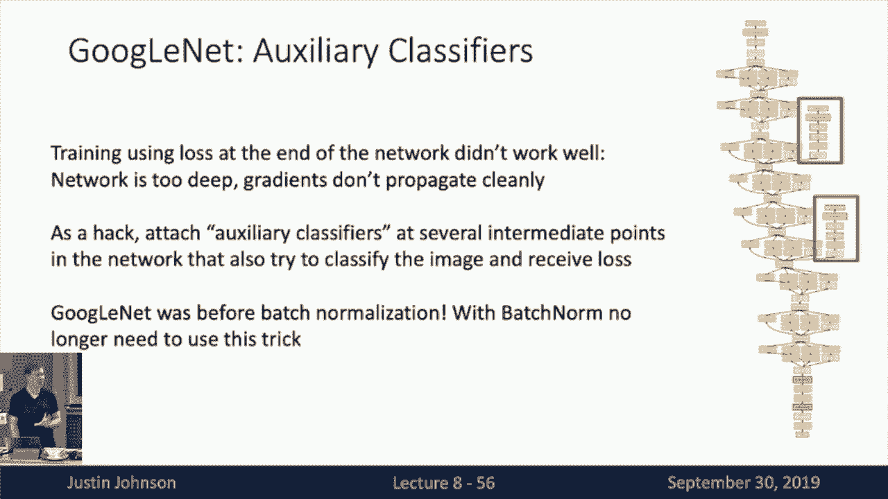

practitioners we went to resort to all，these crazy hacks to get your networks。

to converge once they got beyond a，certain depth thankfully things changed。

in 2015 so by so actually one of the，important things that between 2014 and。

2015 is when bash normalization was，discovered，so once batch normalization was。

discovered people found that they were，able to Train vgg and train Google net。

from scratch without any of these tricks，by just using batch normalization。

instead but then there was an extremely，important innovation in neural network。

architecture design that happened in the，2015 iteration of the image net。

challenge and those were called residual，networks or res nests and here you can。

see something amazing happen the number，of layers jumped in one year from 22 all。

the way up to 152 so people so this was，a very important innovation in the。

history of neural network architecture，design you can also see that the error。

dropped dramatically again from 6。7 an。

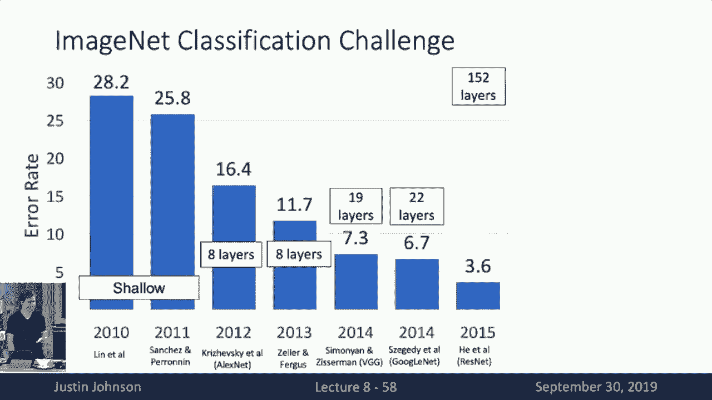

almost hat down to three point six so，res Nets were we're kind of a very。

important moment in neural network，architecture design so as we mentioned。

once once batch normalization had been，discovered people realized that they。

were able to train networks that were，layers，so then the question is what happens if。

we just keep stacking layers and，stacking layers and train try to Train。

very very deep networks well here is，kind of a cartoon picture of the types。

of plots people saw at that time here's，the training curve where the x-axis the。

number of training iterations and the，y-axis is the test error and we're。

comparing a 56 layer model and a 20，layer model and here's something very。

strange happens we see that the 56 layer，model actually performs worse than the。

20 layer model and this is surprising，because the previous trend that we had。

talked about was that bigger neural，networks tended to work better up to。

this point in time so it was very，surprising to all of a sudden see the。

bigger deeper networks now performing，worse once you got past a certain point。

so the initial guess of what was going，on is that maybe these networks had。

started overfitting that you can imagine，maybe once once you got to a 56 layer。

network and you have batch normalization，maybe this was just such a large network。

that it was now overfitting just image，that training set but we in order to。

test this hypothesis we can look at the，training performance of these same。

networks and if you look at the training，the performance on the training set of。

the same 20 layer and 56 layer networks，you see that the network was not over。

today that in fact this 56 layer network，was somehow under fitting the training。

set that somehow there's a problem in，optimization that somehow this deeper。

model even once we have batch，normalization once you get to a certain。

depth were no longer able to efficiently。

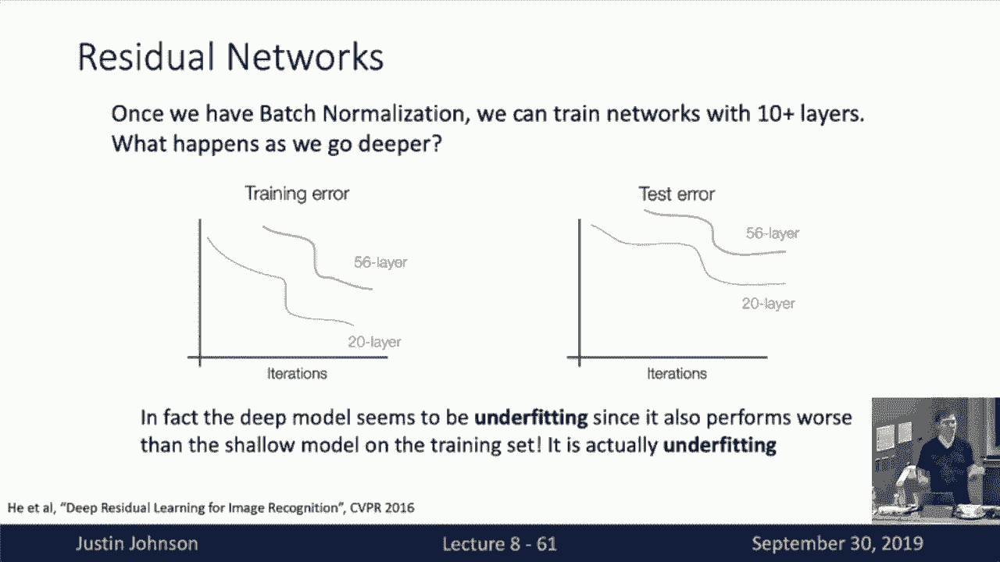

optimize very deep networks this is a，problem and this is also surprising。

because we should expect that a deeper，model should have the capacity to。

emulate a shallower model what do I mean，by that um so you could imagine that a。

56 layer network could emulate a 20，layer Network because we could imagine。

taking the 20 layer Network copying all，of its layers into the 56 layer network。

and have all of the other remaining，layers just learn the identity function。

so in principle if our optimizers were，working properly then the the deeper the。

network goes the deeper network should，always have the capacity to represent。

the same functions as the shallower，networks so if we are actually。

underfitting then it means that we have，an optimization problem that somehow。

these deeper networks are not able to，efficiently learn these identity。

functions in order to in order to，emulate shallower networks so the。

solution is to change the design of the，network to make it easier for it to。

learn identity functions on unused，layers and this should make it easier。

for deeper networks to learn to emulate。

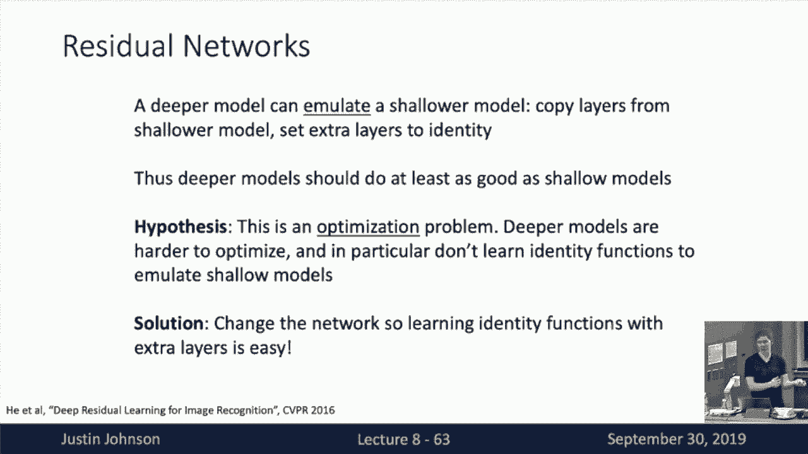

shallower networks in case they have too，many layers and more layers than they。

actually needed so here is the is the，design change that was proposed by。

residual networks so previously on the，left here we have the kind of plain。

convolutional block that we had seen in，vgg that is a stack of two consecutive。

convolutional layers maybe with array lu，in between maybe some batch。

normalization in between as well，now residual networks should propose the。

this residual block design on the right，which still has a stack of 2。

convolutional layers but now rather than，now at the end we take our input X and。

actually add it to the output of the，second convolutional layer this means。

that the overall block computes this，function f of X plus X where f of X is。

the output from the this basic in，displaced basic block inside of the。

corridor through the residual there's a，residual additive short map and what。

this means is that this the idea behind，this is that this layer can now very。

easily learn the identity function if we，set the weights of those two。

convolutional layers to 0 then this this，block should compute the identity and。

now this should make it easier for deep，networks to emulate shallower networks。

this should also help improve the，gradient flow of very deep networks。

because you remember that if you，remember in what happens in the backward。

pass of an add gate well as we back，propagate through an ad it copies the。

gradients to both of the inputs so you，can imagine that now when we back。

propagate through this residual block it，actually copies the gradients it。

shortcuts the gradients through those，convolutions and this again helps to。

improve the propagation of gradient。

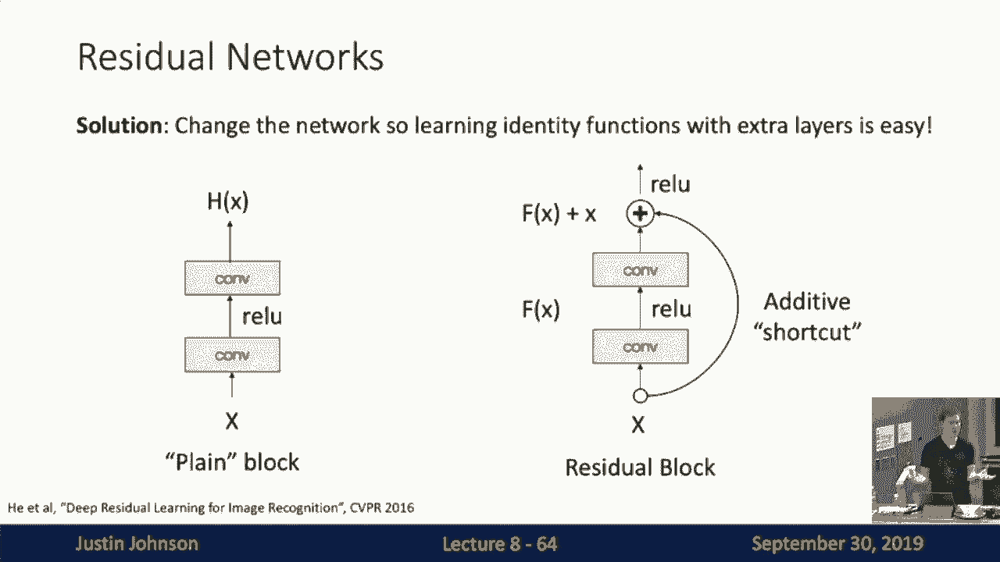

information throughout these very very，deep networks so then a residual network。

is a stack of residual blocks residual，networks were sort of inspired by the。

best parts of vgg and Google Maps in my，opinion so they combined this idea of，simple。

design principles from bgg with a couple，of these innovations from Google maths。

so this network much like bgg this，network was divided into stages within。

each state with between each stage we，are going to have the spatial resolution。

and double the number of channels just，like bgg and all of our convolutions。

inside these stages will be through 3x3。

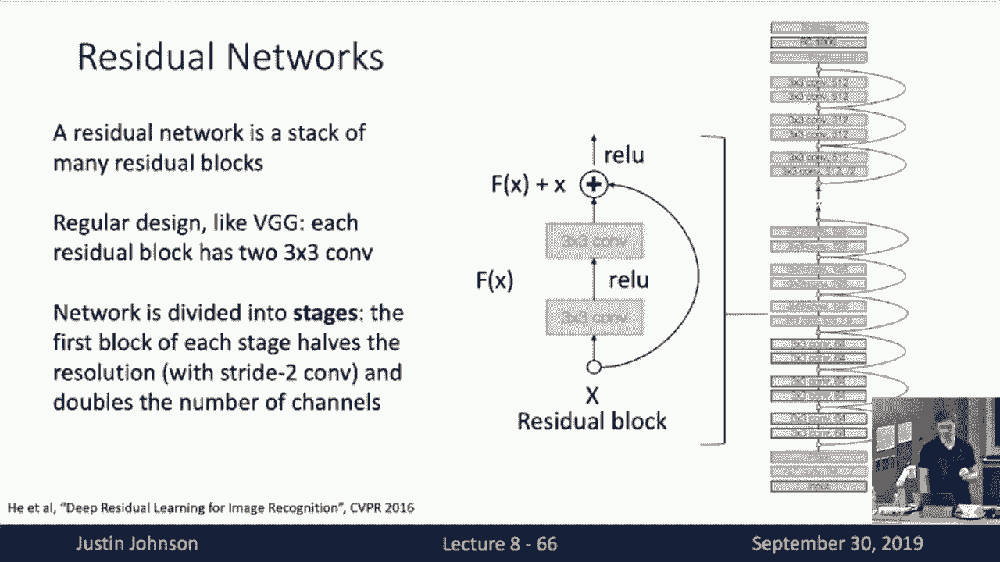

convolution is just like in dgg but each，of these blocks will now be these。

residual shortcut blocks residual，networks also it takes some innovations。

from Google Maps they use they like。

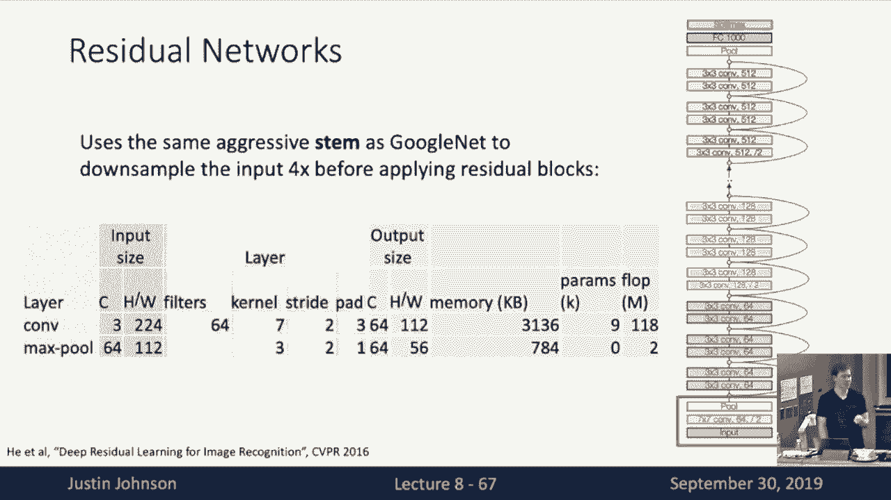

Google Map they also use this aggressive，stem in the first couple layers that。

aggressively down samples the input and，residual networks also took this idea of。

global average pooling from Google net，that again eliminates the fully。

connected layers and reduces the total，number of parameters in the network so。

so then with these simple patterns the，only thing you need to choose is the。

initial width of the network which was，64 and all their experiments and the。

number of blocks per stage so this gives，us the resident 18 which has two。

residual blocks per stage which means，for convolutions per stage four times。

four is sixteen convolutions there's the，convolution in the stem there's linear。

at the end so if you add that together，that's 18 layers with learn up awaits，yeah。

the question is what do we mean by down，sampling in this context we mean any。

operation that reduces the spatial，extent of the image so that could be。

strided convolution that could be max，pooling that could be average pooling。

I'm taking every other pixel is not used，I don't think that's I've ever seen that。

use in a neural network context but it's，differentiable you could try it I don't。

recommend it yeah so in this context it，means any operation that reduces the。

spatial size of the inputs so what's，interesting about this ResNet is that。

now they become very efficient so now，we're able to achieve very low errors on。

image net with very few amount of，floating-point operations there's also a。

34 layer version of ResNet which just，adds more blocks to some of the stages。

but otherwise the design is exactly the，same and again we can compare this to。

vgg which had now something like 13，gigawatts for the whole network and got，errors of about 9。

6 whereas the reson at，34 got was only 3。6 he go for gigaflops，and actually had lower errors。

and a lot of these gains and efficiency，were due to these regressive down。

sampling at the beginning and this。

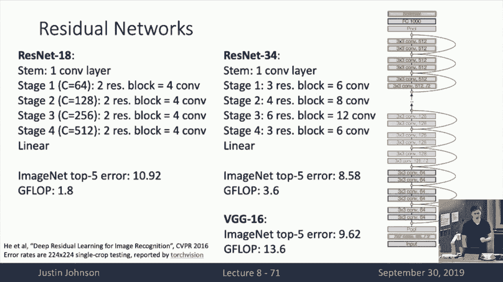

global average pooling at the end so so，there's as we go to deeper residual。

networks they actually modified the，block design so here on the left is the。

so-called basic block that is used in，residual networks this has to that this。

basic block has a 3x3 convolution and，another 3x3 convolution and railers and。

batch farms in between them and this，residual shortcut around the 3x3。

convolutions well then we can compute，the amount of total floating-point。

operations for this block again only，counting the convolutional layers and we。

see that each of these convolutional，layers has costs 9hw C squared so the。

total computational cost of this thing，is 18 HW C squared now in for deeper。

residual networks they introduced an，alternative block design called a。

bottleneck bottleneck block so here in，the bottom of the bottleneck block now。

consists of three convolutional layers，the first is a so it accepts an input。

tensor with four times as many spatial，channels as the basic block the first。

layer is a one by one convolution that，acts to reduce the number of channels。

that are that are that are contained in，the tensor so the first one by one。

convolution reduces the number of，channels from 4c down to C and then once。

we reduce the number of channels then we，perform this 3x3 convolution and then we。

have another one by one convolution that，expands the number of channels again。

increasing the number of channels from C，up to four C again so now if we come now。

we can use the same procedure to compute，the computational cost of the bottleneck。

design block design and we can see that，each of these bottleneck these。

one-by-one bottleneck and unbought elect，convolutions each cost for HW C squared。

and this middle convolutional layer has，the same cost of 9hw C squared so。

actually the overall cost of this，bottleneck design is 17 HW C squared。

which is slightly less than this bait，then then the computational cost of this。

bottleneck residual block but at so this，means that we get less computation but。

again more non-linearity and more，sequential computation and somehow the。

intuition is that deeper layers should，the，charity should be able to perform more。

complex types of computation so by，switching from this basic block to this。

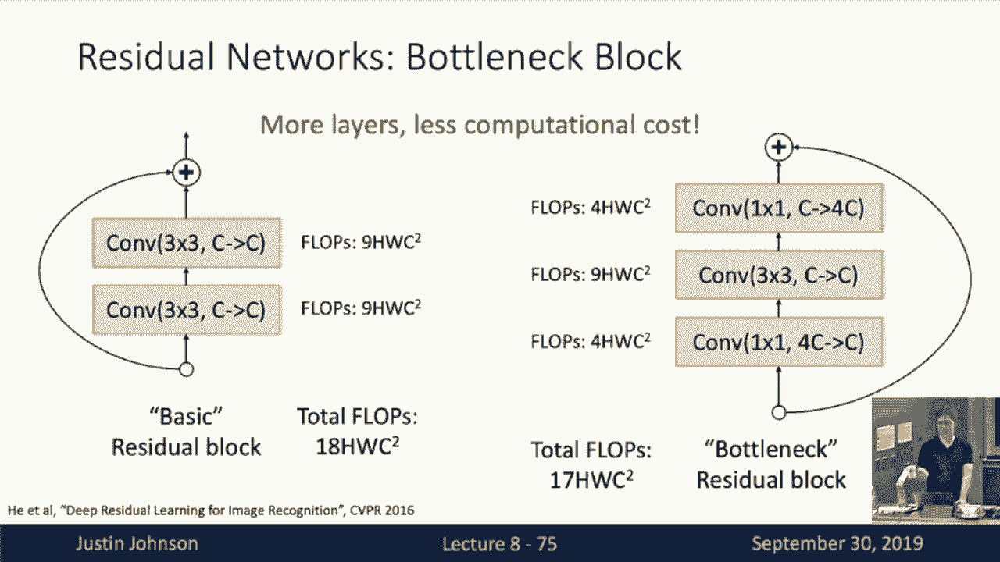

bottleneck block it lets us build，networks that are deeper well not it。

while not increasing the computational，cost so then so far we've seen the 18。

layer and the 34 layer residual networks，that use this basic block then if we。

simply take the 34 layer ResNet and，replace all the basic blocks with。

residual block with the with bottleneck，blocks now this increases the total。

number of layers in the network from 34，to 50 but does not really change the。

overall computational cost of the，network and now by making this change。

that increases the number of layers，without increasing computation you can。

see that the the open the error on image，net actually decreases so that by simply。

making it deeper without increasing，computation we're able to decrease the。

error on image net from five point eight，five down to seven point one three which。

is actually a fairly large reduction in，error given that these two networks。

actually have a similar computational，cost now this residual networks we can。

actually go deeper than that and we can，define hundred and one layer and hundred。

and fifty two layer versions of residual，networks that have the same basic design。

they use bottleneck blocks they just use，more bottleneck blocks per stage and you。

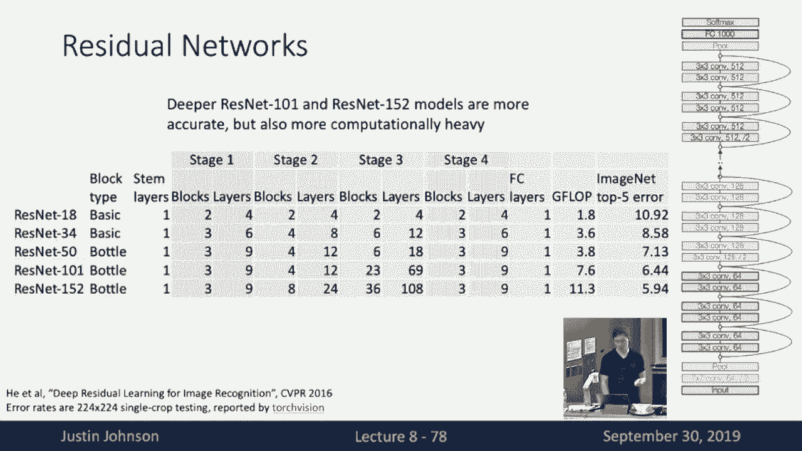

can see the clear trend with residual，networks is that as you stack these。

layers to go deeper and deeper the，networks tend to work better and better。

so this was a big deal in 2015 so in，previous competitions there's always a。

bunch of computer vision competitions，every year and usually one team will win。

one competition another team will win，another competition but in 2015。

Reza Nets who crushed everything they，won every track in the imagenet。

competition that's the classification，challenge the localization challenge。

which we have not talked about and the，detection challenge which we have not。

talked about there was also a concurrent，set of challenges run by or on a。

different data set called Microsoft Coco，the same team that built residual。

networks also swept every challenge in，Cocoa winning the detection challenge。

and the semantic segmentation challenge，in the cocoa dataset as well and there。

the main thing that they did is took，existing methods for all these different。

tasks and just swap in there 152 layer，residual Network，and in doing so they just crushed。

everyone that year so this was a very，big deal it got everyone to wake up and。

pay attention and from that time forward，residual networks became a baseline that。

is a really widely used even still to。

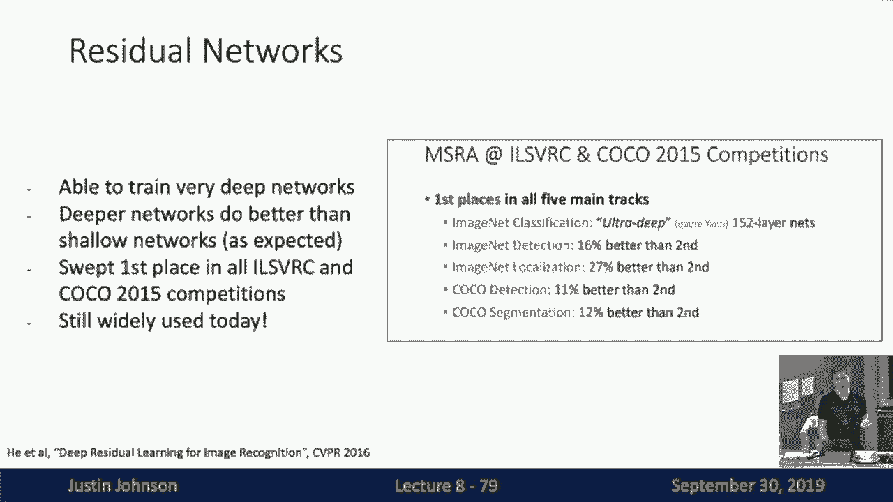

this day for a wide variety of different，tasks in computer vision so there was a。

follow-up paper in residual networks，that played a little bit with the exact。

organization of Bachelor the exact order，of convolution bachelor-man Dre Lou and。

they found it by shuffling the orders of，these things you could get it to work a。

little bit better so which was kind of，interesting to see that I think is maybe。

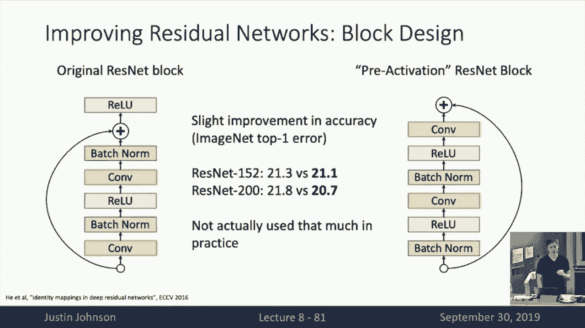

useful if you're trying to squeeze out，that little last percentage of。

performance or a mere residual networks，now it was kind of a summary of where。

we've gotten to today you can see this，comparison of computational complexity。

so here on the right is this very nice，plot where on the x axis so each dot。

here is a different neural network，architecture the x axis is the number of。

floating-point operations that it takes，to compute afford paths of that。

architecture the y axis is the accuracy，on the image net challenge and the size。

of the dot is the number of learn about，parameters so this is a really nice。

visualization that packs a lot of，lessons that we've seen into one nice。

diagram so here you can see that Oh，Google has been going on they have。

inception versions 2 3 & 4 and inception，version 4 plus ResNet we haven't talked。

about that we don't want to talk about，the details of those but here you can。

see from this plot is that vgg has a，very high memory takes a ton of。

computations and is just kind of an，inefficient Network design overall。

Google meant is this very small very，efficient but not quite as，high-performing as some of the later。

later networks，Alex Knapp down here in the corner is，relatives very low in compute lower than。

any of the other variants that we see，here but it still has quite a lot of。

parameters due to the large fully，connected layers and we can see that。

residual networks give us this fairly，simple design moderate efficiency but。

able to give us high accuracy as we。

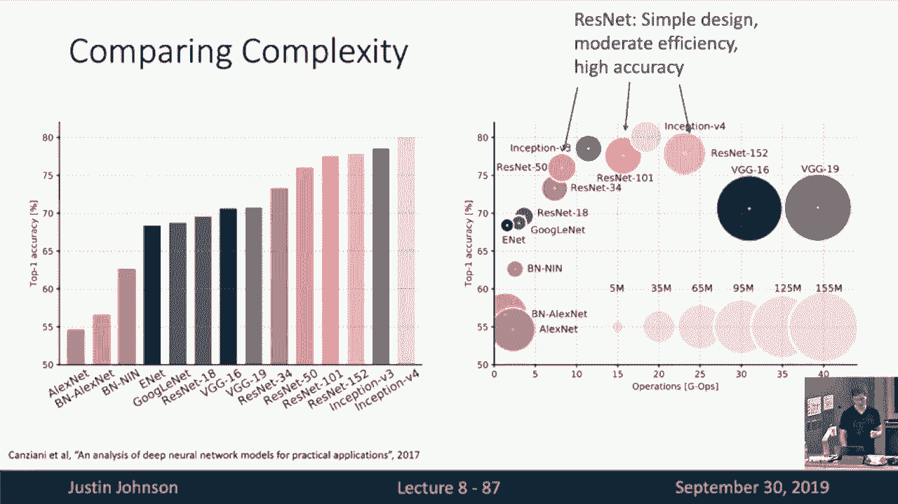

scale to deeper and deeper residual，networks so then moving forward what。

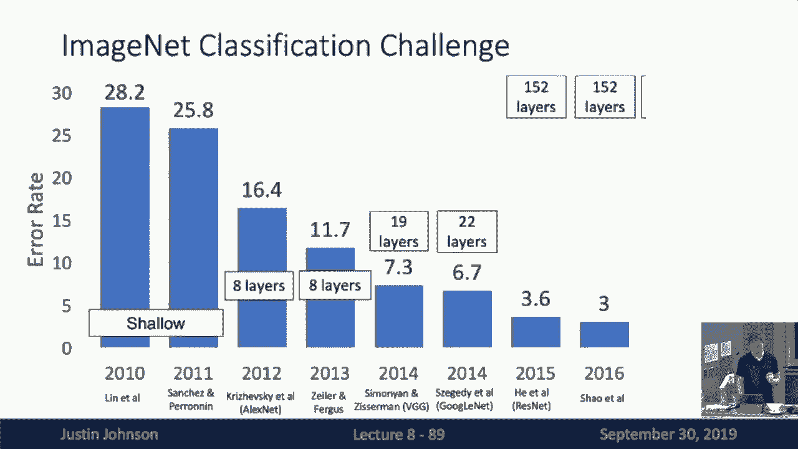

happened in 2016 nothing much that was，very exciting the winner in 2016 was。

model ensemble Aang I don't know if，you've ever done like Cagle challenges。

or whatever but basically it took all，the winning there，word architectures in last couple of。

years I'll move them together and。

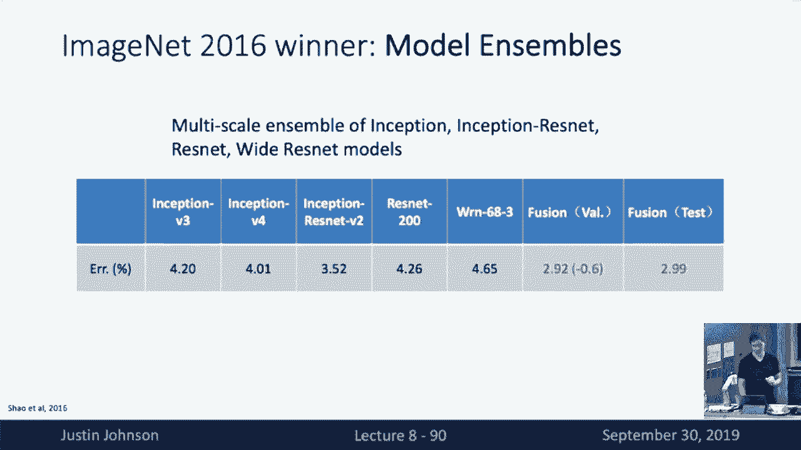

slightly better so that was not very，exciting but there were a couple。

attempts to moving forward to improve，residual networks so recall that we've。

seen this bottleneck residual block that，was the building block of the 152 layer。

residual networks well if one bottleneck，branch is good then why not have。

multiple bottleneck branches in parallel，and that was the idea behind res next。

which was supposed to be the next，generation of residual networks so here。

the idea is that we will have our basic，building block for the rest next network。

will have G parallel pathways and each，parallel pathway will itself be a little。

bottleneck block but now the inner，channel dimension of that of these。

parallel bottleneck blocks will be a new，constant called little C so now we can。

compute the total flux of this and then，at the end after we compute the output。

from these different parallel pathways，these parallel battle back blocks the。

outputs will all be added together and，now we can compute the total。

computational cost of this of this，strange multi pathway design and you can。

see that each of these individual，bottleneck each of these individual。

branches has a computational cost of，eight big C little C plus nine little C。

squared which you can kind of multiply，out and see the pattern here and that。

what's interesting is that we can，actually set up a quadratic equation and。

find and once we set the channel，dimension C and the number of parallel。

pathways G then we can set up a，quadratic equation and solve for little。

C such that this parallel this this，multi path architecture with G parallel。

branches will have the same，computational cost as this original。

bottleneck design so then it turns out，that if you kind of solve these things。

the integer they don't work out exactly，but if you kind of round to the nearest。

integer then if we have for example 64，channels and for parallel pathways then。

we can set little C to be 24 channels on，each of those parallel pathways does the。

same computational cost or if we have，maybe 32 parallel pathways then we could。

have each of those pathways have little，C plus 4 channels so，this basically gives us another。

mechanism that lets us modify the design，of our network now in addition to。

setting the number of channels we can，also set the number of parallel pathways。

and by solving the equation in this way，we can set the number of parallel。

pathways in a way that also preserves，the amount of computation that's being。

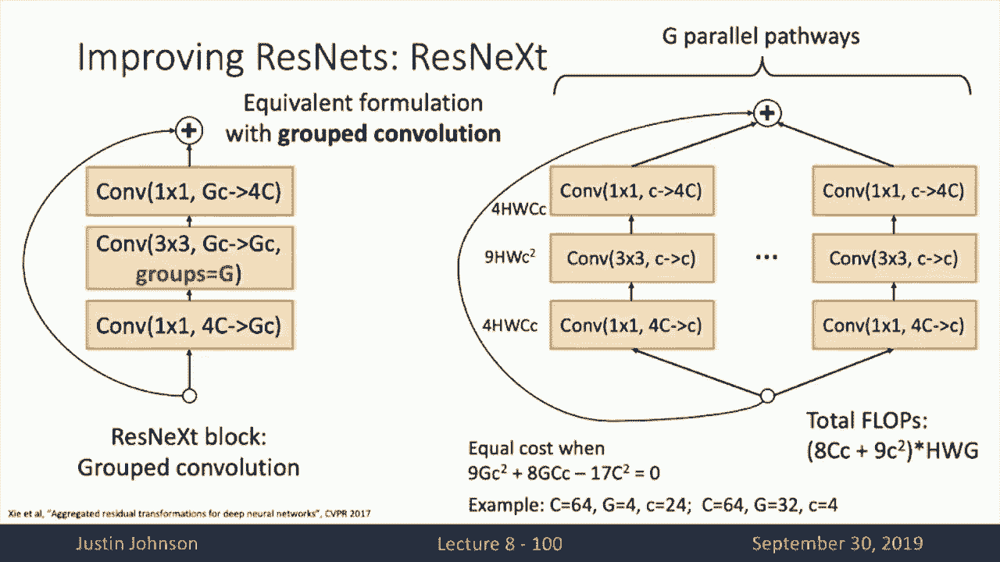

done and it turns out that there's an up，there's a there's an operation in pipe。

in convolution called grouped，convolution that lets us implement this。

equivalent this this idea of parallel，pathways using this idea of route。

convolution that I don't have time to，talk about the specifics here but the。

idea is that now we've modified our our，design to effectively have these。

multiple parallel pathways that gives us，another axis on which we can modify our。

network so then what the in this res，next design this res next architecture。

you see that we can as we keep the same，computational cost but increase the。

number of parallel pathways within each，block actually that leads to an increase。

in performance so even though the good，so then we can have we can start with a。

baseline 50 layer ResNet model and then，increase the number of parallel pathways。

and as we do so the accuracy actually，increases and the same trend holds for。

the hundred one layer ResNet that we can，increase the number of pathways and get。

improved performance even while，maintaining the same computational。

complexity for the network so then what，happened in 2017 people built on top of。

this idea of res next and added another，little bell and whistle called squeeze。

and excitation that made things work a，little bit better and 2017 was the end。

of the road after 2017 people decided，that the Jews had been squeezed out of。

the image that dataset and the challenge，was shutting down so it will live on on。

Kaggle as a cackle challenge but it's no，but there was kind of an end of the air。

end of an era when the image net，challenge ended in 2017 but design but。

even though the image net challenge，ended people still been going nuts。

trying to design ever bigger and more，interesting neural network architectures。

so a couple you might want to be aware，of one is this so-called and by the way。

a lot of these lessons are sort of，carried on to further neural network。

architectures this idea of aggressive，down sampling of trading computation of。

trying to maintain computation，we're trying to build networks that were。

efficient and performing well while，maintaining or reducing computation this。

idea of having repeated block structures，throughout the network that could be。

repeated in order to design your，networks without having to tune every。

layer all of these design parameters and，design ideals were carried forward into。

later neural network designs one that，you might see floating out there in the。

wild sometimes is this densely connected，neural network the idea here is that。

just let it's a different it's sort of a，different way of doing shortcut。

connections or skip connections so as we，saw in residual networks we were able to。

propagate gradients better by having，this additive shortcut connection。

well densa that these densely connected，neural networks instead use a。

concatenation shortcut so rather than，adding previous features two later。

features instead they contaminate，previous features with later features in。

order to reuse the same features at，different parts in the network and again。

they repeat this little dense block at，multiple stages throughout the network。

then another trend that became very，important in the last couple of years。

has been that so so far we've kind of，been operating in this high parameter。

regime of people trying to just get，trying to max out the accuracy on。

imagenet while also minimizing the the，couple of the flops but the over but the。

overarching design was always to get，high accuracy now kind of happening in。

parallel was this idea of you know maybe，it's okay to trade-off some accuracy in。

some contexts and maybe what we want to，do is try to get the absolute tiniest。

network possible that still performs，okay but has a very very minimal。

computation such that you can run it on，mobile devices or run it in a betta in。

embedded applications so there's been a，whole sequence of works around designing。

very efficient very copied convolutional，neural networks that have very very low。

computational cost but maybe are willing，to sacrifice some accuracy and no longer。

beat these big residual networks one，very famous example is this so-called。

mobile net and again it has this idea of，repeated blocks so we can look at this。

basic 3x3 convolution on the left that，has convolution batching Andre Lu as you。

should know by now the computational，cost of this layer is 9c squared HW now。

on the right we replace this convolution，with two different convolution。

one is a so-called depth-wise，convolution that come that you can look。

at the details I think offline we don't，have time to go through that and there's。

been a whole of sequence of papers that，have been trying to design very。

efficient neural networks that can run，on mobile devices so now at this point。

it's kind of seems that there's been a，lot of activity around designing。

different neural network architectures，but it still takes a lot of work and a。

lot of human effort and a lot of human，activity to design a neural network。

architectures so as another hint of，something that has been very popular the。

last few years has been automating this，process of designing architectures and。

actually training one neural network，that outputs the architecture of another。

neural network and we don't have time to，go through the full details of this idea。

in this in this lecture but the basic，idea is that we'll have one neural。

network called a controller and this，controller will output the architecture。

for another neural network so then the，training process here is that we'll take。

the controller Network we'll sample a，bunch of architectures from the。

controller we'll train all of those，architectures on our data set and then。

after we train all of those child，networks we'll see how well they did and。

use that to compute a gradient for the，controller network and the exact。

mechanism of computing that gradient，requires a is a policy gradient approach。

that we'll talk about in a little bit，later but what that means is that after。

training a batch of child networks then，we can make a single gradient step on。

the controller so then in order to，perform gradient descent on that。

controller it's going to be very very，very computational expensive but over。

time this controller should learn to，produce good neural network architecture。

the initial version this was a really，cool idea but the initial version of。

this was just unbelievably，computationally expensive because now。

each gradient step on the controller，takes so the initial version of this。

trained on 800 GPUs for 28 days and that，is just an amount of computational。

resources that I'm sorry I cannot give，you for your homework but if you're at。

Google and you've got free GPUs laying，around then this is the kind of。

experiments that people are trying but，and follow-up research has actually this。

this paper has become kind of a joke in，the community，just because the the unbelievable scale。

of resources that were used in this，paper but actually follow-up papers。

under architecture search have，significantly reduced this search time。

so but people always love to compare to，this paper and say like oh look for ten。

thousand times more efficient than this，previous one if that's a good way to get。

your papers accepted but the takeaway is，that if you are if you have the。

resources to burn then neural，architecture search actually has been，used to find neural network。

architectures which are themselves very，efficient so this is kind of another。

plot that is nice to summarize a lot of，the architectures that we've seen so far。

in this lecture so here on the x-axis，we're showing the computational cost of。

running the running the neural network，that is the number of multiplied adds。

and the y-axis now is the accuracy on，imagenet and you can see that this all。

these dots correspond to different，neural network architectures that we've。

talked about in this lecture and all，these red lines corresponds to different。

neural network architectures that were，learned using a neural architecture。

search method and what you can see is，that this neural architecture search。

method was able to learn a set of，different architectures that，achieved higher accuracy at a lower。

computational cost compared to other，architectures so that's that's kind of a。

next frontier in neural network，architecture design and the kind of。

summary from what we've seen today is，that in the kind of early days of。

convolutional neural networks as we move，from alex net to xia net to vgg people。

were just focused on training ever，bigger and ever bigger neural networks。

in order to get higher and higher，accuracies google net was one of the。

first to focus on efficiency and in，doing so they wanted to get high。

accuracy while also being aware of the，computational cost residual networks。

gave us a way to scale networks to，become very very big and we were able to。

Train layer 4 networks with hundreds of，layers once we had this IDs ingredients。

of batch normalization and residual，networks and after ResNet people started。

to focus on efficiency more and more and，more and somehow that became the guiding。

principle of a lot of neural network，architecture design after residual。

networks so so then things then with the，we saw this huge proliferation of。

different architectures that we're，trying to achieve，higher or same accuracy at lower。

combinational cost this includes neural，these tiny networks like mobile nuts and。

shuffle Nets and neural architecture，search promises to maybe one day design。

all of our time no networks for us but，now the final question is you know this。

is all great but what architectures，should I actually use in practice well。

my advice is don't be a hero，so for most applications don't try to，design your own neural network。

architecture you're going to cause，yourself sadness and you don't have 800。

GPUs to burn for a month I think so what，you should probably do in most。

situations is take an existing neural，network architecture and adapt it for。

your problem and for that and that's，what I do in my research and that's what。

I recommend you guys do for your for any，projects that you undertake in。

particular despite the number of things，that have come after I think ResNet will。

resonate 50 and resident 101 are still，really really great solid choices that。

work if you want something to just work，and not have to fill with it too much。

those are the choices that I usually，grab for if you are concerned about。

computational cost for some reason then，look to some kind of mobile network。

shuffle net but in general you really，shouldn't be trying to design your own。

neural network architectures so that，kind of is all the stuff we wanted to。

cover today and next time we'll talk，about some of the actual software and。

hardware that we use to actually train，[Applause]。