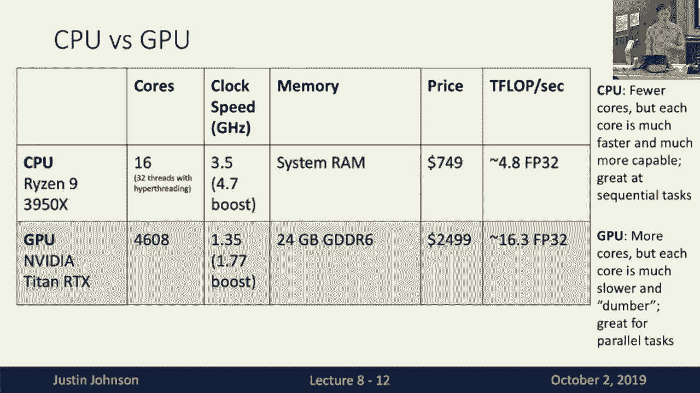
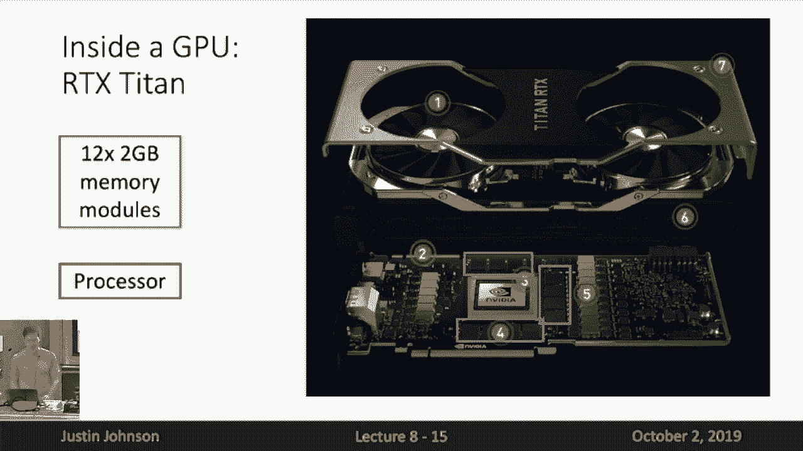
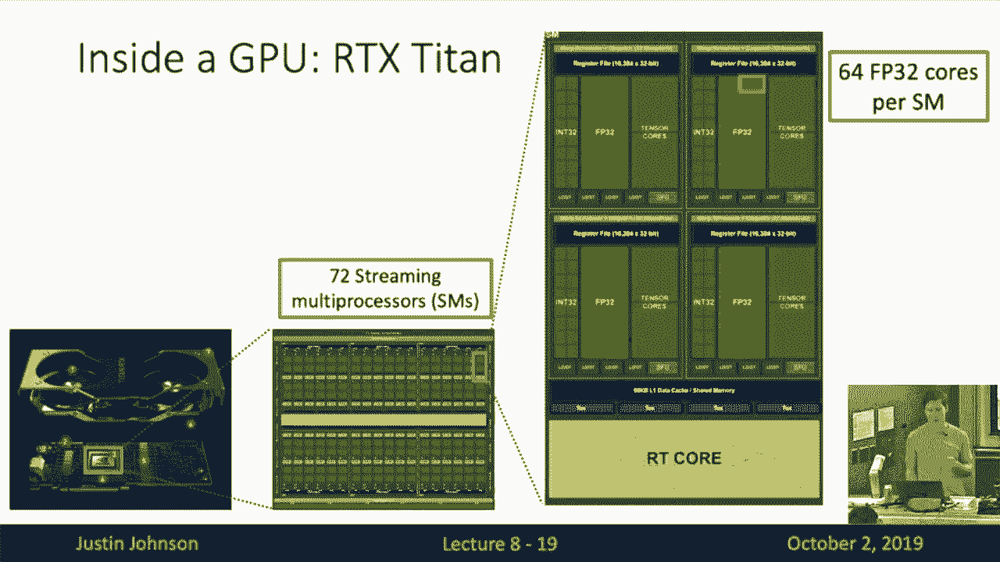
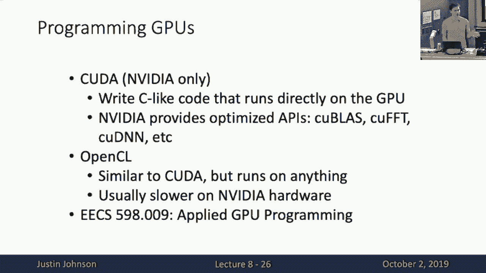
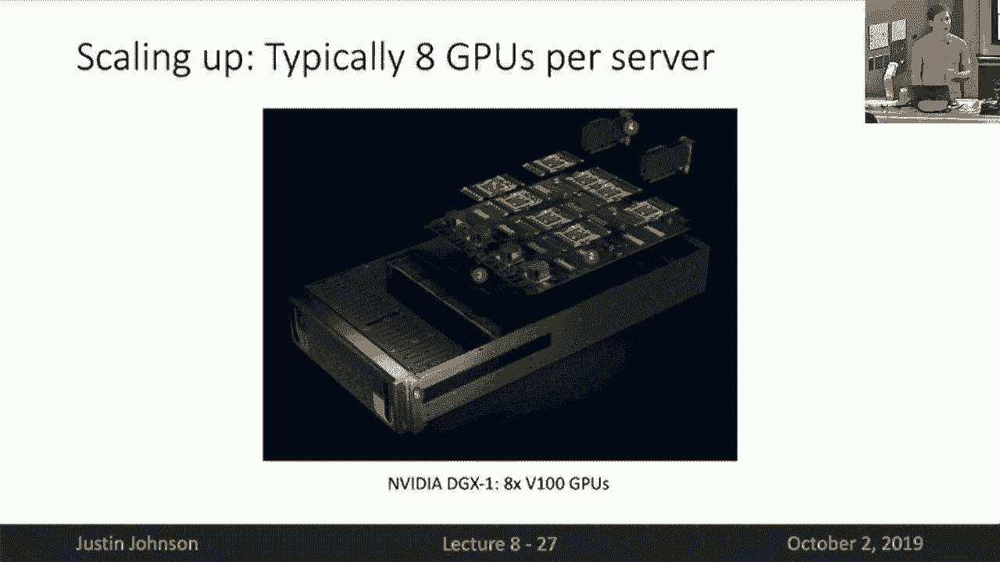
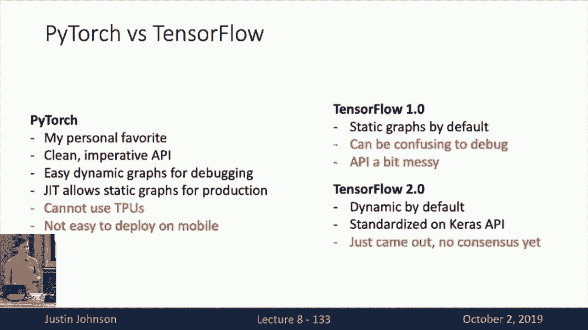
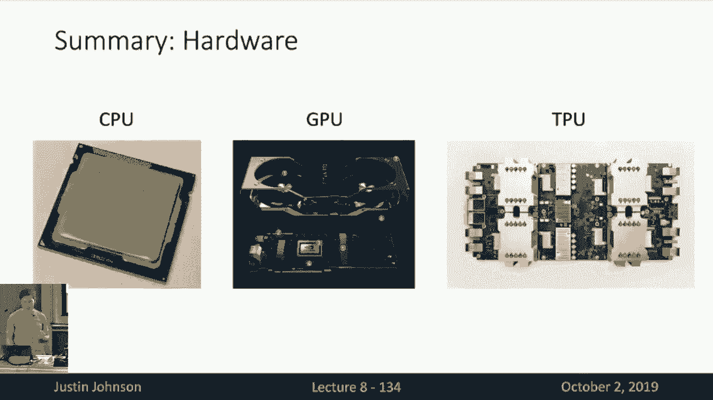
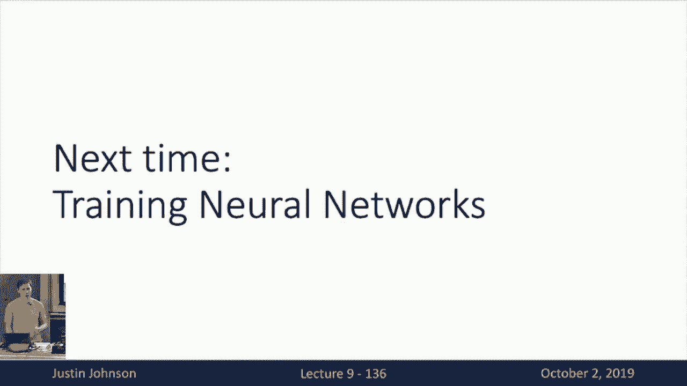

# 【双语字幕+资料下载】CS231n进阶课 ｜ 深度学习与计算机视觉(2019·全22讲) - P9：L9- 深度学习硬件与软件 - ShowMeAI - BV13P4y1t7gM

today we're going to talk about or today，today we're going to talk about or today。

is lecture nine of the class and today，we're going to talk about deep learning。

hardware and software so this will be，hopefully a very applied practical。

lecture we'll be seeing lots of code on，the screen and walking through that so。

hopefully that'll be fun so as you'll，recall last lecture we talked about CN n。

architectures and we saw how the field，has progressed from from architectures。

like alex not to be GG to ResNet and on，this huge proliferation of different。

convolutional neural network，architectures that people have used。

throughout the years and we talked about，the trade-offs of compute computation。

and memory and just and saw how future，advancements like vgg and especially。

ResNet gave us via regular designs for，CN NS that allowed it that made it very。

easy for us to scale up and scale down，their their sizes but now that we have。

some understanding of the types of，architectures that people implement with，CN NS。

it's useful to think about the actual，hardware and software systems on which。

those architectures will ultimately run，so that will be the topic of today's。

lecture we're going to talk about first，hardware and then software。

so first is deep learning hardware so，here's a picture of a computer this is。

actually my computer from grad school，and you can see that there's a couple。

interesting components inside this，computer one is the the central。

processing unit or CPU at the top um，it's stuck under this giant heatsink and。

fan but underneath that you see these，two giant other things that say GeForce。

GTX on them and those are graphics，processing units or GPUs and just by。

looking at the size of these things in，the space they take up in the case you。

can see that the GPUs actually take a，lot more physical space than the CPU in。

the machine so that should maybe give，you some hint that these are very。

important components now if you're，perhaps an avid computer gamer you're。

probably very familiar with GPUs and，different models of GPUs and if that's。

the case you know that there's a big a，long bit of tension in the GPU Gate in。

the gaming community around GPUs and，that's the question of Nvidia versus AMD。

so I'm guessing people are familiar with，this debate and maybe fanboys on one。

side or the other when it comes to，gaming but when it comes to deep。

learning there's a clear winner in this，in this fight and that's Nvidia that。

whenever people are running，GPU whenever people using GPUs to，accelerate their computation on for。

neural networks it's almost exclusively，on NVIDIA GPUs I think an AMD actually。

has really great hardware but the，software stack for utilizing that。

hardware for general-purpose computing，and especially for deep learning is。

really just not as advanced as the，software stack on NVIDIA society so for。

that purpose for that reason whatever，you see here is GPUs and deep learning。

it really just means NVIDIA GPUs and any，other type of GPU be integrated Intel or。

AMD it is just really not not a，mainstream thing at all when it comes to。

deep learning now it's also interesting，to think about we saw in this in this。

case how we had both CPU and a GPU now，it's interesting to look historically at。

the trends of the computational power of，both CPUs and GPUs so I made this plot a。

couple years ago it's a little bit out，of date now because you can see the。

x-axis ends at 2017 but here the the the，metric we want to look at is gigaflops。

per dollar so each point on this graph，is either a CPU model or a GPU model at。

the time at the time it was released and，then for each of these models we compute。

the total computing power in gigaflops，per gigaflops which is what is Giga that。

was Cahill a thousand mega there's，millions of Giga is billion this is the。

number of billions of floating-point，operations that these things can do per。

second so then we take the that peak，computing capability of the device and。

then divide it by the number of dollars，that it costs at the time the time the。

device was released and this gives you a，sense for what is the cost of computing。

over time with but also with respects to，different types of computing devices and。

you can see some clear trends here one，is that both flops per dollar has been。

increasing over time come for both CPUs，and GPUs but when it comes to GP when it。

comes to GPUs there's been a dramatic，explosion in the dramatic reduction in。

the cost of computing since around 2012，so if you can if we rewind back to about。

2006 was this GeForce GTX 8800 GPU from，Nvidia that was our amazing great。

graphics card for gaming but it was also，notable for being one of the I think the。

first Nvidia graphics card that，supported CUDA which is their，general-purpose。

framework so about that time this was，2006 so this was well before Alex that。

became mainstream but even at that time，and video was investing heavily in this。

idea of using GPUs not just for gaming，but for really general purpose。

scientific computing and on the whole，software stack that we use now was。

really started to develop around that，time in 2006 and then you can see that。

as we move from 2006 to 2012 there was a，huge divergence in the cost of computing。

between CPUs and GPUs and here I've，pointed out to the GTX 580 GPU that Alex。

could chess be used for training Alex，net which as we saw last lecture was。

this absolutely breakthrough result in，deep learning and you can see that by。

the time we got to 2012 and the GTX 580，there was a performing logical。

computation on GPU was much much cheaper，than performing computation on CPU which。

gives us some sense for why alex net was，able to be so much larger than any of。

the other convolutional neural network，models that come before and now if we。

fast-forward from 2012 up to 2017 you，can see that GPU even though CPUs have。

somewhat flattened in their in their，cost per click cost of computing GPUs。

have been continually accelerating and，you may have heard that Moore's law is。

dead that is really not not seems not to，be the case with GPUs they continue to。

get faster and better and cheaper every，year and I think my personal opinion is。

that on this period from 2012 up until，now has been this massive explosion in，deep learning。

people have been training ever bigger，bigger models on bigger datasets and I。

think a big reason for that has just，been the low the rising availability of。

very cheap compute due to these，advancements in GPU computing between。

2012 and now so this this gives you a，sense of the general trends。

let's also drill down into a couple，specifics so that this previous chart。

was a we said a little bit out of date，but I went and pulled some numbers for。

some actually current CPUs and GPUs so，if we look at this a top-of-the-line。

consumer CPU today actually not today，this this thing will be released a month。

from now in November but this is the，horizon 990 3950 X CPU that seems pretty。

cool it's will again will be released a，month from now，and this thing has 16 cores it runs at a。

base clock of 3。5 gigahertz it relies on，the system RAM in the memory it the。

memory of the the overall computer，doesn't have its own integrated memory。

and it runs it will retail I guess for，about $750 and now if you and then this。

so actually I said this this chart is a，little bit out of date I think actually。

there's been a pretty dramatic increase，in the compute capability of CPUs in the。

last couple of year in the last couple，of years I think especially as the rise。

in line has really shaken up the the CPU，field and you're right if previously。

Intel was kind of the winner on CPUs and，that was kind of they were kind of the。

undisputed champions of CPUs which I，think explains maybe this flattening of。

progress for several years in CPUs but，since I made this chart about now。

there's a competitor to Intel they，produce really good CPUs and they've。

actually become very very cost efficient，as well so if we multiply all this out。

we see that this top of the line comes，consumer CPU hits about 4。8 teraflops。

for a second so which is fairly fast，that's a lot of computation but if we。

compare that to the current，top-of-the-line consumer GPU which is。

the NVIDIA Titan RDX which is a bit more，expensive but you'll see that it is。

civics it has is significantly more，powerful computationally and can achieve。

more than three times the total number，of floating point operations per second。

now kind of the the the parrot the the，kind of cartoon picture that you should。

have in your head of what a CPU can do，versus what a GPU can do is that CPUs。

tend to have fewer cores but those cores，tend to be much faster and those cores。

tend to be much more powerful they have，maybe better branch prediction they have。

maybe better caching strategies for，memory and the individual cores in a cpu。

tend to be able to do a lot more GPUs on，the other hand have cores that run our。

relatively stupid cores compared to the，the innovations you see in CPU cores and。

they run at lower clock speeds so you，can see that if in this consumer CPU，they run at maybe 3。

5 gigahertz and the，GPU runs over like 1。3 5 gigahertz so，the individual cores are running。

something like 2 to 3 times slower on a，GPU but there's just a lot of these。

cores so if we compare these 16 cores on，the CPU versus，4608 course on a GPU you can see that。

the GPU just has a lot more individual，compute elements in it that let it do。

more computation overall I should also，point out that this head butt head head。

is sometimes you'll see these，side-by-side comparisons of core。

accounts between CPUs and GPUs and it's，actually a little bit unfair because the。

the CPUs actually have these vector，arithmetic units now as well they can do。

multiple instruction to operate on，multiple instructions in a single clock。

cycle so it's not really fair I think to，compare the core content of CPU to these。

CUDA cores that you'll see advertised by。

Nvidia but still it is it is true that，GPUs tend to have a lot more computing。

elements we're all to make that a little，bit concrete we can dive inside this。

r-tx Titan GPU so if you are if you have，if you have all these GPUs and you crack。

it open you'll see something like this，you see that this GPU is basically a。

little like a little mini computer unto，itself that inside the GPU it has its。

own fans because it gets really hot so，it needs to cool itself and those are。

integrated into the unit and then it has，its own memory modules so if you look at。

these blue boxes these are each of these，is a 2 gigabyte memory module and。

there's 6 of them in here for 24，gigabytes of memory inside the GPU。

device itself and if you look inside，this red box this is the actual heart of。

the GPU this is the actual processor so，these GPUs are really like in like。

little tiny mini computers that can that，have everything they need to do。

computation inside one little compact。

device and if we zoom into this，processor we see this giant grid of。

compute elements and you can see that，it's very heterogeneous there's a lot of。

these repeated compute elements stacked，side-by-side and a grid and in。

particular the the core computing，element of an NVIDIA GPU are these。

so-called streaming multi processors or，sms and you can see that in this RTX。

Titan GPU it has 72 of these identical，streaming multi processors inside of it。

and now these streaming multi processors，are maybe somewhat more akin to a CPU。

core on a traditional CPU so if we zoom，inside of one of these extreme multi。

processors we see that there is even yet，still more heterogeneous rather。

homogeneous compute elements inside each，of these compete the little streaming，movie。

inside the GPU so in particular here is，actually finally after zooming in。

multiple levels of zoom we finally found，the actual out computing elements inside。

the GPU so this little red box is one of，the below to 32-bit floating-point cores。

that actually performs floating floating，point arithmetic deep inside the GPU and。

you can see that this inside each of，these stringy multi processors they have。

64 of these 32-bit floating-point units，per string the multi processor so then。

when you multiply all this out we saw we，know that there is what seventy-two。

stream and multi processors in the GPU，each of those multi processors has 64。

floating FP 32 cores and each of those，little individual cores can do two。

floating-point operations per clock，cycle because they can do a multiply and。

and accumulate in a single clock cycle，so that counts us to is multiply and an。

ADD so when you multiply all that，together you get the this number of 16。3。

Terra clocks per second that Nvidia，advertises but if we look at this。

streaming multiprocessor you can see，that there's a lot there's more going on。

inside of this thing beyond just these，Athlete 32 cores I'm not sure if the。

text is big enough for you to read maybe，in the back but next to the FT 32 cores。

is something with a very suggestive name，called a tensor core so these this is a。

new bit of architectural elements that，NVIDIA has introduced into its GPUs in。

the last several years and this is，basically a specialized bit of hardware。

deep inside the GPU that that's，specifically meant for deep learning so。

deep learning has been so important to，Nvidia that they've actually changed the。

underlying architecture of their，hardware to be better suited to deep。

learning so in particular these these，tensor cores are specialized hardware。

that do little chunks of matrix multiply，so in particular if we have a 4 by 3 4。

by 4 matrices a B and C then this tensor，core can compute a times B plus C or。

that each of them is a four by four，matrix it does that matrix multiply plus。

an addition in a single clock cycle so，it's a special little purpose bit of。

hardware this only point in life is to，do four by four matrix multiply plus a。

bias term and you can imagine that we've，seen in deep learning，we use a lot of matrix multiplication。

and we use convolution which is，basically multiple matrix multiplication。

plus a bias so you can imagine how you，could you could break up the。

implementation of a matrix multiply or a，convolution to make to do it all in。

terms of little 4x4 matrix multiplies，that could then be mapped onto the。

tensor core elements deep in these，essence so if you count the nut so if。

you count the number of operations that，it takes to do to multiply to 4x4。

matrices plus an add plus adding another，4x4 matrix with bias you can see that it。

takes 128 floating-point operations to，do that matrix multiplication plus a。

bias so if so then that that can do a，lot of computation per clock cycle so。

you might have add so you can imagine，that these seem like they can do a lot。

more computation than the epi32 elements，in the GPU so there we actually equate。

and there's got to be some catch we've，got to give up something and it turns。

out that what we give up is the，precision of the arithmetic that we use。

for computing these things so normally，when we do deep learning we do our。

arithmetic in 32-bit floating-point，which means that each number is。

represented by four bytes but when，inside the tensor cores they actually。

use multiple levels of precision for，computing this matrix multiply and that。

allows them to build more compact，hardware that is faster more energy。

efficient so in particular these little，tensor core units actually perform all。

multiplication steps using 16-bit，floating point and then they perform。

addition steps using that they're using，32-bit floating point and doing using。

this idea of mixed precision it lets，them pack a lot more compute into a very。

tiny and efficient space so then if we，multiply all these things out then we。

see then we want to ask how much，computation does this device have when。

we consider it the tensor core units and，so we still have seventy-two string。

multi processors within each of those，streaming multi processors there are。

eight tensor cores each of those tensor，cores can do 128 floating-point。

operations per cycle so if you multiply，multiply by the by the boost clock speed。

of one point seven seven seven gigahertz，then you get a total throughput for this。

device of 130 teraflops per second which，is a lot of computation so now if we。

return to this table of CPU versus GPU，you can see that we were actually on。

quite under estimating the true power of，these GPUs in this previous table so。

it's true that when you consider only，32-bit floating-point arithmetic then I。

think some of these modern CPUs with a，lot of clocks and a lot of vector。

arithmetic are actually maybe catching，up to some extent to GPUs but when you。

consider this special-purpose tensor，core hardware that is now shipping。

inside nvidia gpus then you can see that，see that GPUs are still dramatically。

more efficient and have dramatically，more computational ability than in CPUs。

um so then if we revise our chart we can，add we can actually add a new green dot。

on the upper right here showing the，first NVIDIA GPU that actually the。

consumer and be the GPU that ship these，tensor cores yeah yeah the question is。

how do you utilize these tensor cores in，pi torch and all you have to do is flip。

your input data type to 16-bit and then，if you've got the prop if you've got the。

right Hardware installed and the right，or the right and video drivers installed。

then it will automatically accelerate，any computation that can be accelerated。

it will automatically go in that sensor，cores so it's actually very easy to。

utilize these tensor cores from the user，perspective although I should point out。

that optimizing these models now when，you're doing come to earth matech in。

mixed precision actually optimization，becomes a little bit more finicky so。

there are some tricks that people play，around like which parts of the model do。

you want to compute in full precision，which parts do want to compute in mixed。

precision and sometimes people to play，some tricks with the optimization。

techniques in order to make the，optimization more numerically stable as。

you move to lower precision but that，said I think it's worthwhile because as。

you can see the tensor cores give nearly，a 10x speed up over the epi32 cores in。

the GPU so as kind of an example of why，matrix multiple like the prototypical。

example of a operation that is much much，faster on a GPU compared to the CPU is。

matrix multiplication and you'll you can，recall that matrix multiplication if we。

have two matrices then each element in，the output matrix is an inner product。

between two big vectors and this is a，trivially paralyzed of the problem。

because each elements in the output，matrix is can be computed independently。

because it's just an inner product of，different rows and columns of the input。

matrices so you can imagine that this，type of problem Maps very perfectly on，to a GPU。

that what you can do is take each of，these output elements in the output。

matrix and assign them to different，string multiprocessors or different at。

the different sets of epi32 cores within，the streaming multiprocessor processors。

for the GPU and in doing so it's kind of，a perfectly paralyzed double problem。

that is extremely well suited to the，hardware that is present in GPUs if you。

contrast this with kind of a single a，traditional single core cpu model it has。

to iteratively compute each of these，outputs one by one and it doesn't have。

as much ability to paralyze over many，many computing elements and you can also。

see how matrix multiplication is a，perfect example of an operation that can。

be accelerated by these tensor cores，because now if we have in a little。

computing element inside our GPU that，can compute four by four matrix matrix。

matrix multiplies plus abayas in a，single clock cycle then you can imagine。

breaking up this output matrix into 4 by，4 matrix chunks and then assigning those。

little chunks into different tensor core，elements and again perfectly。

distributing this matrix multiplication，over all the available computing。

elements yeah question yeah the question，is is 4 by 4 the limit for what we can。

do in a single round and that's that's，true for these for the current。

generation of tensor cores because，basically this thing is like a。

specialized piece of hardware that like，takes in like different different for。

like takes literally a 4 by 4 matrix and，another 4 by 4 matrix and then produces。

an output 4 by 4 matrix so it's kind of，hard what that size is hardwired into。

the into the into the hardware of course，you can emulate different matrix。

multiplies in software so say if you，wanted to do for about 5 by 5 matrix。

multiply and you could simulate that，with 4 4 by 4 matrix multiplies where。

you pad them out with zeros and I think，the if you for example actually compute。

large matrix multiplies in pipe arch，with funny sizes then the underlying。

matrix multiplication routines will do，this ought to do this padding and。

splitting up are graphing for you but，that's actually a good point that you'll。

sometimes see that powers of 2，especially large powers of 2 are the。

most efficient on GPUs and that's，because then you don't end up wasting。

compute in the way that you split things，up across the across the device so。

you'll often see neural networks that，have their sizes of everything in powers。

of 2 and that's really a result of this，underlying，you hardware that they're running on so。

GPUs can be programmed and in order to，program GPUs in order to program NVIDIA。

GPUs we write in a programming language，called CUDA and CUDA is kind of like an。

extension it's sort of like an extension，of C or C++ that lets you write code。

that runs directly on the GPU I think，it's actually pretty fun to write CUDA。

code it's sort of a different method of，programming and it kind of is a very。

different way of thinking about，decomposing problems but CUDA。

programming is unfortunately beyond the，scope of this class however there is。

another EECS 598 running this semester，applied GPU programming that the whole。

thing is about CUDA programming so I，don't that I think that could be a good。

resource for learning how to program in，CUDA if you're so inclined but in。

practice it's actually relatively rare，for deep learning practitioners to need。

to program in CUDA because Nvidia，provides very heavy heavily optimized。

routines for matrix multiplication and，convolution and batch normalization and。

all these other operations that we want，to use in neural networks so in practice。

you most people will just stick with PI，torch and then even in PI torch they。

don't implement everything in CUDA they，often even inside PI torch they'll rely。

on these heavily optimized matrix，multiply or convolution routines that。

are written by Nvidia so I think it's，kind of a fun exercise to learn how to。

program in CUDA but it's not always a，necessary skill for being productive in。

deep learning now so far we've talked，about only single GPU devices and how。

great they are but that's not really the，end of the story people more and more。

these days are interested in scaling up，their compute beyond single GPU devices。

so in practice it's very common to buy，servers that actually have eight GPUs。

per server and then distribute your，comity computation across all of the。

GPUs in a server or even stack multiple，eight GPU servers in a data center and。

then distribute your training across，multiple GPUs across multiple servers。

across an entire data center so it's，interesting to think so then you kind of。

get this hierarchical decomposition of，like servers and two GPUs into tensors。

into string multi processors into tensor，cores and it's just like lots of levels。

of hierarchy in parallel computing so，for the longest time for for many many。

years and Vidya had sort of been the，only game in town，when it，comes to hardware that people use for。

deep learning but in the last couple of。

years another competitor came onto the，scene that was a key Google so the last。

several years Google has been producing，their own specialized pieces their own。

specialized hardware devices for do it，for performing deep learning computation。

they're the the first publicly the first，such piece of hardware that they talked。

about publicly was the cloud TPU v2 that，has about 100 it has 180 teraflops of。

compute for one of these boards so，that's sort of on a similar order of。

magnitude as the tensor cores inside the，the latest Nvidia cards and it also has。

quite a lot of memory inside inside the，card itself and the Google is a little。

bit secretive about exactly what how，these chips work but my impression is。

that they are fairly somewhat similar in，design to the tensor cores inside of the。

Nvidia cards that they also contain，specialized hardware that performs low。

precision or mixed precision matrix，multiply in sync in single or a few。

numbers of clock cycles and you can you，can't you cannot buy these things but。

you can rent them on Google cloud for，four dollars and fifty cents an hour or。

I don't know if you poked around into，settings on colab but there's actually。

an option for you to use these cloud CPU，v2s，for free on colab which we have not done。

for assignments but it's I think very，cool that you can use these for free on。

collab but as we said people are more，and more interested in scaling beyond。

single compute devices and scaling to，entire data center level compute so。

teeth the TPU is really shine when they，are assembled into these so-called TPU。

pods so Google creates these large rack，scale solutions on pull a TPU pod that。

has 64 of these chips in one machine one，integrated machine and if you add these。

things all up together then it gets 100，or 11。5 petaflop spur second of。

computation and if you can rent them on，Google cloud with a low low price of 384。

dollars per hour now，this is the Google cloud TPU v2 so you，can imagine that the following year they。

followed it up with the cloud TPU v3，which just multiply all the numbers on。

the previous slide by some large factor，so the cloud TPU v3 now has 420，teraflops on one of these。

and and it rents for $8 an hour and the，cloud TP uv3 pod has 256 of these。

teepees and v3 devices for a total，compute of more than a hundred petaflop。

of compute all in one piece of，programmable hardware that you can run。

your neural network models on but，unfortunately for the TPU v3 pop pod。

you're gonna need to call for pricing，those are too expensive I guess to even。

put pricing on the website so you need，to talk to a sales rep if you think that。

you're willing to spend enough to，purchase one of those things one big。

downside one big caveat about TPU is，that in order to use TP use you need to。

use tensorflow so we'll talk a little，bit more about tensorflow later in the。

lecture but that is Google's deep，learning framework however that might。

not always be the case if you go on PI，towards github and you kind of look。

through some of the commits that have，been happening over the last couple of。

months months you start to see some，suggestive commits in the PI torch。

commit log like this one that purports，to add a TPU device type and back-end。

type refer for pipe or spencer's so，maybe one day oh maybe this is something。

they're working on I don't know but it's，kind of fun to look at the commit log of。

these open source projects and you can，get some sense of what features might be。

upcoming in the future yeah yeah so the，question is that when you compare GPU is，learning。

they often differ in their memory the，memory actually differs in two ways one。

is the amount of memory so the GPU is，built for compute compute。

tend to have more memory that allows you，to train bigger models on the device。

because if you remember how back，propagation works that when you perform。

the forward pass you're building up this，computational graph that needs to store。

all the activations and those，activations are getting stored in the。

GPU memory and then so then you're the，size of the monthly depth or size the。

model that you can train is somehow，constrained by the amount of GPU memory，on the device itself。

so consumer GPUs tend to have less，memory because they're really meant for。

gaming and you don't need 60 gigabytes，of GPU memory to play games but for for。

deep learning then you want a lot of GPU，memories you can store that all these。

activations of your computational craft，and memory for that propagation but。

actually the other big difference，between consumer great GPUs and compute。

GPUs is not just the amount of memory，but also the type of memory so if you。

look at the consumer GPUs they'll often，use something like GDD our six in the。

the recent the most recent consumer GPUs，whereas the the compute oriented GPUs。

will use something called high bandwidth，memory instead and the difference is the。

bantam the bandwidth of the memory，between the compute elements and the。

memory of the GPU because it turns out，that GPUs are actually so fast that in。

many is coming in maze for many，operations inside the GPU I'm actually。

moving the data for between the GPU，memory and the compute elements is。

actually much more expensive than，performing the computation itself so for。

something like a that only，performs one floating-point operation on。

each element in the tensor it's actually，not bound by the GP by the compute speed。

those are actually bound by just the，speed at which people the the GPU can。

shuffle the data back and forth between，the compute elements and the memory so。

having increased memory speed an，increased memory bandwidth also。

increases the overall speed of training，these devices even though the compute。

speed might look the same on paper so，that that's pretty much all I have to。

say about deep learning hardware are any，questions about GPUs or。

GPUs or CPUs before you move on ok but I，think I think there are I think those。

those are super fun to think about so，the next question is deep learning。

software so probably you maybe won't，have a lot of chance to play on a lot of。

different card where computing，environments because these things are。

pretty expensive but on the software，side you actually have a lot of choices。

when you're when you're doing deep，learning so the deep learning has been。

had this kind of zoo of different deep，learning frameworks that have popped up。

over the years in the early days a lot，of these some of the big ones that were。

used a couple years ago were things like，cafe and torch and piano they came out。

of academic groups like UC Berkeley NYU，and Montreal but increasingly as we。

moved to second and third generation，deep learning software systems we。

increasingly see that these are no，longer built in academia and maintained。

by grad students but instead these are，built in in big industry groups that。

have a lot of staff on-site to properly，engineer these things and support them，so some of the bigger。

deep learning frameworks that you've，seen in recent years are cafe 2 and pi。

torch that are produced that are built，by Facebook Google builds tensorflow。

Amazon's does a lot of support of MX net，Microsoft had this one called CNT K the。

cognitive computing toolkit and Baidu，had this one called paddle paddle and。

there's some other ones like chainer，and Jax is this really cool upcoming。

framework from Google but we'll see if，it gets traction in the next few years。

so for the longest so for a while in，deep learning it felt like every time。

you did a project do it to learn a new，deploying framework and because these。

things were constantly evolving over，time um but and that also made it hard。

to give this lecture because I needed to，redo everything at least every year but。

thankfully I think the last few years，things have settled a bit and kind of。

the mainstream deep learning the two big，mainstream deep learning frameworks。

today our PI torch and tensor flow so，these are the ones that I want to focus。

on now recall that one of these central，ideas in deep learning is this notion of。

a computational graph that when we want，to when we build and train a neural。

network models we want to but we have，this notion of building up computational。

graphs in the forward pass for each of，the operations that we perform inside of。

our model and then during the backward，pass we want to traverse back traverse。

backwards this computational graph in，order to compute the gradients of the。

loss with respect to weights and then，ultimately make our gradient step to。

update the model so this idea of a，computational graph is really central to。

all deep learning frameworks and if you，think about what is the point or what。

are the big killer features that we，expect from any deep learning framework。

I think it boils down to these three one，is that we want rapidly want the。

framework to enable us to perform rapid，prototyping of new ideas that means that。

it should provide a lot of common layers，and utilities for us so we don't have to。

rewrite them ourselves for every project，second is that it should be able to。

automatically compute gradients for us，using this abstraction of a。

computational graph in this class we've，sort of forced you to write gradients。

for yourself because I think it's very，instructive for you to do but when。

you're out there in the world it's，actually much more efficient in practice。

to not drive those things yourself and，instead let the software compute them。

for you so a really efficient and，effective，mechanism for computing gradients with。

backpropagation and computational graphs，is the second key feature of all of。

these frameworks and finally the the，third major feature is running all this。

stuff on GPUs or TP use or what other，other exotic hardware devices might come。

out in the future I mean this is maybe a，little bit hard to appreciate today。

right because in pi torch it's so easy，to just run things on GPUs that it just。

it's so trivial why wouldn't you do it，but if you look at the development of。

deep learning frameworks over time and，the history of GP GPU computing in。

general it wasn't so long ago that，running general-purpose code on GPUs was，do。

so I think things like tensorflow and pi，torch have really been a triumph not。

just for deep learning but also for GPU，computing more generally that they've。

made it really easy and really，accessible to write code that is able to。

run paralyze at operation over GPUs even，without knowing I need the specifics。

about how the hardware works so with，that kind of context in mind let's dig a。

little bit more into some parts of，height works that we haven't explored，yet。

so a big one big caveat that we always，need to mention is software versions so。

for this class we are now using PI torch，version 1。2 because apparently colab。

updated in the last week or so from one，point one to one point two so now we're。

using one point two from now on sorry，about that，actually I was surprised by this I was。

running some examples and I saw all of a，sudden PI torch was the new version。

there was no public announcement there，was no release notes they just silently。

swapped the PI torch version on everyone，using collab and it was a surprise so I。

think that actually bit some people on，the homework around random seeds because。

when PI Tork switched from one point one，to one point two then itched I think the。

written that what outputs you get for，the fixed random seed actually changed。

and I think we saw some confusion on，Piazza around that point because when PI，torch updated to 1。

2 then we had，developed the assignment on one point，one and the random seeds changed a。

little bit so I apologize for that but，it just happened silently also a big。

caveat is that if you're looking at，older pipe PI charge code especially pre，1。

0 there was a lot of breaking changes，in the pie torch API，especially between one between 10。1 and，0。

4 so I think PI toward，1。0 has been relatively stable in api，for about the last year or so but if。

you're out there in the wild on the，internet looking at random github repos。

you'll still see a lot of really old，outdated PI torch code that might not。

work under the the more stable releases，today so that's just a copy up to watch。

out for so I think the way I think about，PI torch is that there's kind of three。

different levels of abstraction that it，gives you for building your neural。

network models the the top level the，lowest level of abstraction is the idea。

of a tensor and that's the level of，abstraction that you've been working。

with so far and all the homework，assignments where a PI Jewish cancer is。

just a just an array kind of like a，multi-dimensional array that runs on。

GPUs and you can do operations on it，it's basically like numpy but runs on。

the GPU if you're familiar with other，other libraries but piped which gives。

you two other levels and and in the，first couple homework assignments you've。

seen how you can use only this tensor，API for building neural network models。

and computing gradients and performing，gradient descent and you can do all of。

that stuff using just this tensor API，but PI torch gives us a couple other。

higher levels of abstraction for，thinking about building neural network。

models the second is this auto grad，level for automatic gradients and this。

is a pack this is the heart high torch，that lets us automatically build up。

computational graphs and back propagate，through them in order to compute。

gradients and finally there's yet，another level of abstraction called。

module level where a module is now is，now something like an object-oriented。

neural network layer that actually，stores inside of itself State like learn。

about ways and by composing modules it，makes it very easy to build big neural。

network models so basically the way this，breaks down is that on the first three。

assignments we constrained you to only，use this tensor interface in pi torch。

but starting on assignments 4 5 & 6 then，you'll be using the full generality of。

these different layers of abstraction to，perform different types of computation。

so as kind of a running example，throughout the rest of the lecture we're。

gonna use this this example of training，a two layer fully connected Network with。

written automatic linearities with an l2，loss function as kind of a running。

example to see how this works both in，different frameworks and in different，layers of abstraction。

so something like this code on the，screen now is something that you should。

be very familiar with by this point in，the class this is basically training a。

neural network using only this only，these tensor operations so at the top。

we're kind of creating random tensors，for our data and our weights here we're。

doing a forward pass where it's a fully，a matrix multiply and array Lu and other。

matrix multiply and an l2 loss function，and then here is use it is computing the。

backward pass where we mainly manually，compute the gradients of the loss with。

respect to the weights and then here is，a gradient descent to step where we。

actually update the weights and this，type of code should be very familiar to。

you at this point in the semester and，again you know that in order to flip in。

order to move and do all this，computation on GPU all you need to do is。

change this device arguments that the，tensors are placed on and then all of。

your compute transparently runs on GPU，now we can move to the next level of。

abstraction which is autorad and first，observation is that the code is quite a。

lot shorter so that's hopefully a good，thing and the idea with Auto grad is。

that tensor was so far we've constructed，tensors in various ways but whenever you。

construct a tensor in type I torch，there's always another flag you can set。

called requires grab and all you have to，do to make pi torch build computational。

graphs for you is set requires grad，equals true on the parts on the tensors。

that you want to build computational，graphs so here is an example of now。

training the exact same fully connected，neural network model but using the pipe。

of the auto grad level of abstraction in，high torch so here we can see that we're。

still initializing random date random，tensors for the weights and the data but。

now for our weight matrices w1 and w2，when we construct them we passed this。

additional flag requires grad equals，true when constructing the tensor and。

this tells PI torch that these tensors，are ones that it we want it to track and。

build computational graphs for us and，now our forward pass is actually very。

much abbreviated because every because，we no longer need to explicitly keep。

track of all these intermediate results，in the computation ourself because any。

intermediate results that will be needed，for back propagation will be stored by。

PI torch automatically somewhere in this，computational graph that is being built，up in the back。

for us so to think and then so these，these lines are then computing the。

fordpass it's the exact same sequence of，operations that you saw in the non。

autocrat example the only difference is，that now we can we can just throw away。

these intermediates because we don't，need to explicitly store them and now。

after we've computed the forward pass，and the loss then we have this very。

magical line in a called lost a，backwards and this one line of code is a。

telling PI torch to traverse the graph，for us and compute all the gradients。

with respect to all of the weights that，were taken as input，so it's walked us through this a little。

bit more concretely the way that this，works is that whenever a PI torch。

whatever height which performs a，primitive operation on tensors it checks。

whether any of the inputs that operation，have this requires grad equals true flag。

set and if any of the inputs to a PI，torch operator have requires grad equals。

true that means then PI torch will in，the background build up start building。

up a computational graph data structure，that represents that computation so when。

this first little in this first function，of this matrix multiplication between X。

and w1 runs then because w1 has requires，grant equals true then pie charts will。

silently start building up this，computational graph in the background。

that has the inputs X and w1 has a node，for matrix multiplication and then has。

an output which is something on this，tensor that is sort in the graph but。

it's not given a name because we don't，have any need for it in our code then。

when we perform the clamp operation then，well the output of this so the other。

rule is that when PI torch what，when Petrich performs an operation on。

any input that has requires grad equals，true then the output also has requires。

grad equals true so there's all kind of，works out recursively so then the next。

thing is that when this dot clamped line，executes then it's operating on this。

anonymous output tensor that also has，requires grad equals true so this line。

will build up a new chunk of the，computational graph when this matrix。

multiplied a line runs then we build up，more computational graph and now rope in。

w2 when we perform the subtraction we，get more computational graph this power。

adds more to the graph and finally this，sum built perform is the final part of，time。

Piper hydroids performs a primitive，operator is just adding more on to。

whatever computational graph has been，built so far and now when you call law。

stop backwards more concretely you can，see that we're calling loss stop。

backwards and loss is kind of the end，thing which is a scaler at the very end。

of the computational graph and then when，you call law stop backwards。

a couple things happen one is that PI，torch searches through the graph to find。

any leaf nodes that have requires grad，equals true so the leaf nodes are the。

inputs of the thing all of the inputs to，the graph that would be x w1 w2 and y in。

this case and now it searches for any of，those inputs that have requires grant。

equals true set in this case w1 and w2，have requires grad equals true set which。

means that now it will automatically do，some graph search to find out the path。

between that output load node loss and，all of the input nodes that have。

requires grad equals true set and then，after finding these paths between the。

output and the inputs that need gradient，it will actually perform back。

propagation and back propagation through，one of each of these nodes one at a time。

and then after back propagation finishes，it actually will throw away that graph。

and just like free all the memory that，was used for that computational graph。

and it will store the gradients that，were computed for the inputs in these in。

w1 grad and w2 grad which will now be，new tensors that contain the computation。

that will contain the gradients computed，during back propagation and now that。

this lost backward has magically，computed all the gradients for us then。

now we can use this w1 grad MW to Dodge，to perform our gradient descent stab and。

then a very important step and a very，common source of errors is that you need。

to explicitly set those gradients to，zero after you perform your gradient。

descent step the idea is that when we，perform back propagation it actually if。

some of your tensors might already have，some gradients hanging around in their。

Associated tensors and when you perform，when you call loss backward it actually。

doesn't it doesn't overwrite the，existing gradients instead it computes。

the new gradients and adds them to，whatever old gradients were already。

there so that means that if you want so，if the normal thing is we want to。

compute fresh gradients at every，iteration which means you need to，tensors。

on every iteration um and I'm in barely，I'm embarrassed to admit I've made this。

bug more times than I want to say um but，it's easy to forget these lines and。

sometimes things will still train，without even if you forget to zero the。

gradient so that can be very very，difficult to debug I think it's maybe a。

bit of a design flaw in PI torch I think，it maybe would have been better to。

overwrite by default and accumulate if，if you want to opt into that but this is。

the API that we have to live with now，because it's 1。0 and it's supposed to be。

stable and now another bit of weirdness，that you see in this code is that these。

gradient updates actually are scoped，under this with torch no grad a context。

manager and what this means is that any，operations that fall under a no grad。

context manager mean that we're telling，high torch to just don't track don't。

build computational graph for any，operations that happen within this。

context even if those even if some of，the OP the tensors did indeed have。

requires graddic was true so this，context manager just overrides whatever。

the requires grad flag was on individual，tensors and the reason for this is that。

we don't want to back propagate through，our SGD steps that would cause memory to。

leak from iteration to iteration and it，would just be very confusing and it。

would not be the SGD algorithm that we，mean to implement so whenever you're so。

kind of is a rule of thumb whenever，you're doing an update rule or zero in。

gradients or anything that is outside，the computational graph then you want to。

scope it under one of these no grad，context managers now PI torch is all hi。

George autocrat is also extensible in，this example we've kind of written out。

before pass by calling these basic PI，torch operators uh yeah I was there。

questions the question was are the，gradients calculated numerically or an。

igloo analytically well they use the，back propagation algorithm that we've。

talked about so far in this class which，is not wait it's not finite differences。

it that that's that's what we usually，think of when we say numeric out numeric。

gradients right it's not really either，it's a different thing right numeric。

gradients is usually something like a，finite differences approximation using。

the limit definition of the derivative，and back propagation is not fat when you。

say symbolic differentiation that，usually means you build up some symbolic。

data structure and then manipulate those，structures symbolically to compute some。

new expression for the gradients，and back propagation is also not quite。

that back propagation is instead this，structured application of the chain rule。

in order to compute it sort of use the，chain rule in the right way at every。

point in the computation in order to，compute our gradients so it looks a。

little bit like symbolic differentiation，but it's not quite traditional symbolic。

differentiation either but it's the back，propagation algorithm that we've talked。

that we've been covering so far in this，in this class now in this example we've。

implemented our forward path of the，network using only these basic operators。

in pi torch like matrix multiplication，clamping of subtraction etc and it would。

be kind of a pain if you had to do all，of your computation that way thankfully。

PI torch integrates very nicely with，sort of basic abstract software。

abstractions in Python so for example，you can define a Python function which。

inputs pi george tensors and outputs pi，torch tensors and then use that python。

function inside the neural map inside，the for pass of your neural network and。

this will work just fine so in this，example we're defining a sigmoid。

function and using this mathematical，definition of the sigmoid in order to。

define a new function that we can then，use in the four pass of our network but。

when you when you define new and this，allows us to have some modularity in the。

way that we implement our our neural，networks but it's important to point out。

that when you use Python functions to，perform modular computation inside。

neural networks or modular Li structure，your neural networks then they're still。

at the computation the computational，graph level does not know about Python。

functions then really the way this works，is that when you call the Python。

function then each of each primitive PI，torch operation that happens inside of。

your Python function will just keep on，adding to the overall computational。

graph so that means that another way to，put that is that defining things using。

pipes using Python functions lets your，code look sort of nice and modular and。

structured but then every time your code，runs there will just be some giant。

computational graph that is kind of like，a flattened version of all of the。

operations that you've performed through，through the as your program traced。

through all the different functions that，you called，so in particular when this sigmoid。

function runs then you can see that it，will just add on more and more nodes the。

computational graph for each of these，primitive operations that we use to。

implement the sigmoid function so we've，got this this minus 1 this exponential。

this plus 1 and this division and you，may know that the sigmoid function is。

actually if it's that then when，computing back proper computing。

gradients through the sigmoid function，it will back propagate through each of。

these primitive nodes one by one using，normal back propagation but you may know。

that computing gradients through the，sigmoid function in this way will。

actually be very numerically unstable，and actually if you implement the grid。

the backward pass of sigmoid by back，propagating through this graph then。

you'll very frequently get Mane's in or，not a number overflow errors or。

infinities or other bad numerical things，in your computation so PI torch also。

gives you and if you'll recall from the，last look from a couple lectures ago we。

saw that for the particular case of the，sigmoid function the local gradient of。

the sigmoid function has this very nice，mathematical form that you can work out。

on paper which is that back propagating，through the sigmoid as an entire unit。

unto itself then we get this very nice，expression for the the local gradient of。

the sigmoid function and in cases like，this where if we do not where we。

actually have some special knowledge，about the way that gradients should be。

computed then we can W then PI torch，gives us another layer of abstraction to。

implement this and that is to implement，a new auto grad function that is very。

similar to these little forward and，backward modular api's that we've talked。

about previously so you can so by，defining a new autocrat function this。

lets you define new primitive operations，that will give rise to just one node in。

the computational graph so when defining，a new autocrat function you can see that。

we define a forward which computes the，forward pass but then we also define an。

explicit backward function which is，receiving the upstream gradients。

computing local gradient and returning，the downstream gradients and now if we。

were to use this auto grant function，version of sigmoid in our computational。

graph then this would give rise to only，a single node in the computational graph。

and in order to back propagate through，it it would back it would just use this。

backward function that we hit，fermented for this one note so but in。

practice so it's very nice the PI torch，gives you this flexibility and this。

freedom to very easily implement new，fund of new basic elements of。

computational graphs but in practice，this is less common to see I think it's。

much more common in practice to just use，Python functions to implement most。

things but sometimes you need to，actually use the mechanism on the right。

to define your own new primitive，operators of course then the next layer。

of abstraction in PI torch is the NN，module which gives us some kind of。

object-oriented API for building up，neural network models and now that this。

becomes very expressive very quickly so，here you can see that MN left gives us。

this object-oriented API we're now in，torch dot n and sequential is some。

container object that is meant to make，that maintains a sequence of layer。

objects and then within each of each of，the then we provide it layer objects。

like a linear layer that it stores the，learn about sandler novel bias as。

attributes inside of that object which，means that we can now define our。

structure of our neural network model by，just composing these layer objects and。

sticking them into containers and now，when we compute the forward pass all we。

need to do is pass the data to this，object that we built and that computes。

the forward pass for us then torched n n，also gives you common loss functions so。

you don't need to implement those，anymore from scratch then we can still。

call loss backward to compute gradients，and then the the gradient descent Seth。

now looks very similar we iterate all，over all the learn about parameters in。

this model and update them using our，gradient descent rule of course it's。

kind of annoying to implement your own，gradient descent rules all the time so。

pie charts also provides optimizer，objects that implement common gradient。

descent rules so here you can see that，we can build an optimizer object that。

encapsulates the atom optimization，algorithm and we pass it the model。

parameters that we'd like to optimize as，well as the hyper parameters like the。

learning weight and now when in our，training loop all we need after calling。

the after computing gradients by calling，loss talk backwards all we need to do is。

call optimize or not step and that will，automatically make the gradient step for。

us and of course we also need to，remember to explicitly zero the，gradients。

we step and this is again a common，source of bugs another very common thing。

to do in pi torch is actually define，your own new n n modules in this example。

our model had a structure that was that，kind of made sense as a sequential。

sequence of layer objects but in more，general situations that don't that。

aren't just sequences then you'll need，to define your own module subclass that。

represents your computation so here，we're all so we're again defining a two。

layer neural network with a，non-linearity as by defining our own。

custom subclass of the module class so，in particular you can see that here the。

initializer of our custom subclass takes，in the the sizes of the sizes of the。

hidden layers and the sizes of the，outputs that we need and then it。

actually constructs layer objects that，are these linear objects that are built。

that are constructed in the initializer，and then assigned as member variables。

inside our own module object and now in，this forward pass we can use any of。

those module objects that were built in，the initializer to perform our。

computation so you can see that we，compute the forward pass by calling by。

passing the input to the first layer，object then calling then clamping the。

output AB app to do array Lu and passing，the output of that to the next layer。

object to perform to predict the final，scores and then the rest of the training。

loop looks very similar I should also，point out that a very common pattern is。

that you'll see people mix and match，modules and sequential Zoar nest custom。

modules inside of other custom modules，and this is a way to very powerfully and。

very quickly and very easily build up，very complex neural network。

architectures so here's a kind of a，little toy example that gives you a hint。

of what you can do with this so here，we're define we're defining an remember。

in the last lecture we talked about how，many neural network modules are built up。

of these homogeneous blocks right，something like a residual Network it has。

this residual block design and then the，overall network is repeating that same。

block design over and over again so in，situations like that it would be very。

common to define a custom module，subclass for the block that you want to。

use and then to build your model by，instantiating multiple，that subclass and stacking them together。

in maybe a sequential container so here，in this example we've defined a kind of。

a weird little neural network block，structure that I don't think is actually。

a good idea but it fits on the slide，here that we were imagining a little。

kind of block design that computes to，linear layers in parallel so our input。

is multiple we go through one fully，connected layer on the left then a。

separate fully connected layer on the，right with different weights and biases。

and then the outputs of those two fully，connected layers are multiplied。

element-wise and the results of those，multiplication then goes through array。

through non-linearity I suspect that，this would actually not perform very。

well at all but it's kind of a little，instructive example but you can look at。

and then you can see that it's very easy，to implement this idea by a subclass by。

defining our own module subclass that，again in the initializer we define two。

separate and n dot linear objects and，then in the forward pass we use those。

two linear objects to compute two，parallel outputs and then do this。

element wise multiplication between them，and then you can see that when we build。

the model we building we build a，sequential container that contains。

multiple instantiations of this little，parallel block design and this is a。

paradigm that you'll see very commonly，in pi torch code that kind of mix and。

match your own custom module subclasses，with sequential sequential containers pi。

torch also gives you some nice，mechanisms for loading data that make it。

easy that can automatically build mini，batches and iterate through data sets。

and all that kind of good stuff for you，pi torch also provides a bunch of。

pre-trained models that you can，literally get all these pre trained。

models in one line that all you have to，do is import torch vision then if you。

want a pre trained alex net you just say，alex net equals torch vision models got。

alex net free train equals true it will，go out on the internet and download the。

pre train weeks of the model，automatically and cache them on disk for。

you and then return those waits for you，to use right away in your code so this。

so this makes it very easy for you to，quickly use pre trained models to build。

up your own different designs in，different architectures now a big point。

a major point of a major point of the，design in PI torch is this idea of a。

dynamic computation graph what this，means is that every time we run the four。

we build up a new graph data structure，and then when we call loss we throw away。

that debt graph data structure and the，next time we run our iteration we're。

gonna build up another new graph data，structure from scratch and then again。

throw it away when we call when we call，it loss again this maybe seems a little，bit inefficient。

that it seems kind of silly to just，build up the debt graph graph data。

structure on every iteration and then，throw it away at every iteration again。

just to rebuild the exact same thing at，the next iteration but what this means。

but kind of the the benefit of dynamic，computation graphs is that it lets you。

use normal regular Python control flow，to control the flow of information。

through your neural network models and，that lets you do very strange and funny。

and crazy things using very simple and，intuitive code so here's an example that。

again doesn't make sense and I really，don't recommend anyone use in practice。

but here what we're doing is we're，actually initializing two different。

weight matrices for the second layer of，our fully connected Network this is w2 a。

and W 2 B and now the choice of which，weight matrix we use at every iteration。

of training is going to depend on the，loss at the previous iteration of。

training again this is probably a，terrible idea and I don't encourage。

anyone to write models that do this but，if you have such a crazy idea that you。

want to implement you can see that it's，very easy to do in pi torch just by。

using normal regular Python control flow，and now in this way on one iteration we。

might build up a computational graph，that involves w2 a and and then we'll。

throw it away and the next iteration，will build up a new graph to confirm。

that that has w2 b instead and the main，benefit of these dynamic computational。

graphs is that it lets the computation，be deterred the structure of the。

computational graph be determined by，normal regular Python control flow in。

cases where you want to maybe perform，slightly different operations on。

different iterations yeah question，yeah the question was what about tester。

well I think I think we'll hopefully get，to that the quick answer is that yes it。

does now as of yesterday，so the big alternative to dynamic，computation graphs is this notion of a。

static computation graph so here what we，want to do is have a two-stage procedure。

one stage where we build up a graph and，then fix the graph for all time and then。

in the second stage we iterate through，and reuse the same computational graph。

many of these lines and actually high，torch this is a kind of a new。

functionality in more recent versions of，a torch PI torch now gives you the。

ability to perform to use static TOC，computation graphs using the JIT or。

just-in-time compiler so what this means，is that we can define our model as a。

Python function that takes input tensors，as input and returns tensors as output。

then there's this very very very magical，line called graph equals torch it。

descriptive model and what this very，magical line does is it introspects the。

Python source code for that function it，parses the abstract syntax tree of the。

Python source code of that function and，then it builds a computational graph for。

you automatically after traversing the，the source code of your Python function。

and then returns that thing to you as a，graph object that you can call and in。

particular in in this in this model，function we see it has this conditional。

statement for this funny thing we were，doing and now the graph that is built。

for you has to now include the some node，in the graph that captures that。

conditional statement and now every time，in every forward pass we'll simply reuse。

that same graph object and this can be，even more succinct we can just you don't。

even have to compile this thing just，explicitly you could just add a torch。

type gypto script annotation to your，code and it'll have this compilation。

process will happen for you，automatically when the Python process。

when the function is first imported into，Python now one big benefit of the static。

computation graphs over dynamic is the，potential for optimization that you can。

imagine that maybe the graph you write，is some long sequence of convolutions。

and batch forms and Ray Lewis and things，like that and if we have a static。

computation graph you can imagine using，some compiler techniques to try to。

rewrite that graph in a way that might，be more efficient computationally for。

example you might want to fuse some，operations like convolution and Ray Lu。

and actually rewrite the graph in some，non-trivial way that would make the。

computations be faster and and with a，static computation graph you can kind of，a more。

the cost of computing those，optimizations were those graph rewrites。

and just do it once at the beginning of，the program and then enjoy the speed ups。

for the rest if every iteration where it，might not make sense to separately。

reoptimize the graph at every iteration，that might be too slow another big。

benefit of static computation graphs is，this idea of serialization so what。

happens in practice with machine，learning models is that people will want。

to train their models in some very，expressive programming language like。

Python but once they have their models，trained they would like to deploy those。

models in environments that do not，repent depend on Python so for example。

what you can do with the static，computation graph is train up your model。

in Python then export the static，computation graph as a data structure on。

disk and then load up that static，computation graph object into a C++ API。

to then run your trained model in a way，that does not depend on the Python。

interpreter anymore and this is again，whereas with dynamic computation graphs。

the code that builds the graph and the，code that executes the graph is all kind。

of intertwine so if you want to use this，thing in production you'll probably need。

to depend on a Python interpreter and，this was a big motivation for all of。

these tech companies really building in，strong static graphical functionality to。

their deep learning frameworks a big，downside of static computation graphs is。

debugging so if any of you have used，tensorflow before you see that it's。

sometimes very difficult to debug，because there ends up with a lot of。

indirection between the Python code that，you write and the code that eventually。

ends up getting executed so you can come，to sometimes get very difficult very。

confusing error messages it can be very，hard to know what's going on and what。

broke and very difficult to profile，performance or other things like that。

whereas with a dynamic computation graph，the code you write is pretty much the。

code that runs so they tend to be much，easier to debug now some applications of。

dynamic computation graphs are things，where the structure of a model depends。

in some way on the input to the model a，canonical example of this is a recurrent。

neural network where maybe the number of，time step and we'll talk about these in。

detail in a later lecture but the idea，is that we input a sequence and now the。

number of time steps in the model is，equal to the number of steps in the。

sequence and we want to perform，different amounts of computation。

depending on the length of the sequence，has passed into the model there are also。

examples like recursive neural networks，that maybe get used in NLP so now the。

input to the model is some kind of，semantic parse of a sentence and now the。

structure like the the way that the，neural network model performs its。

computation is going to vary dynamically，based on the structure of the parse tree。

that gets passed as input so these are，by the way I don't expect you to know。

understand the details of these these，are just two meant to give you some。

flavor of where dynamic computation，graphs can really shine and here's an。

example from Johnson at all two years，ago that is another example of dynamic。

computation graphs so here we have，actually one part of the model。

predicting what structure the second，part of the model should use so the。

first part of the model actually，predicts some kind of program and then。

that program is then implemented by the，second part of the neural network model。

so in order to do this not only does the，computation of the neural network model。

depend on the input the computation that，the model performs depends on output of。

a previous part of the model and in，order to implement models like this I。

use PI torch because you need to you，need this heavily heavy dependence on。

dynamic computation graphs to perform，crazy models like this and I think。

there's a lot of open open area for，people to try out really crazy ideas。

once we have this ability to build，dynamic computation graphs very。

efficiently so that gives us just a，couple minutes to talk about tensor flow。

so tensor flow I mentioned has actually，been going through kind of a schism in。

the last year or so and the kind of the，classic version of tensor flow is tensor，flow 1。

0 and actually yesterday was the，final release or the release candidate。

of the final release of tensor flow 1。0，tensor flow 1。0 actually used static。

computation graphs by default everywhere，and later versions let more recently。

come to some of the later versions of，tensor flow 1。0 added some options to。

use dynamic computation graphs but the，main mode for doing computation in，tensor flow 1。

0 was actually static，computation graphs now tensorflow 2。0，was actually released this week on。

Monday and in tensorflow 2。0 dynamic，computation graphs are the default and，there is instead option。

to use static computation graphs so I，think right now is a very dangerous time。

to read tensorflow code on the internet，because you'll see you'll see some。

horrible horrible mix of 10 of 1。0 and，2。0 and sometimes even when you google。

bits of documentation they link between，each other and it's just a complete mess。

so I think maybe you should be careful，they be very careful about reading。

tensorflow code over the next couple of，months but hopefully in a year or so。

maybe we will settle on the 2。0 API so，kind of to give you a flavor of this，classic tensorflow 1。

0 then it had the，structure kind of like this that I don't，want to walk through the details here。

but in tensorflow 1。0 your code always，had two big chunks one at the top is。

this stage where you define your，computational graph and then at the。

bottom is where you actually repeatedly，run your computational graph and this is。

kind of the the classic way that，tensorflow code was written and this。

became this can be very difficult to，debug now because what can happen is。

that in the piece of your code where you，build the computational graph maybe you。

have a shape error or a data type error，or you mismatching the API in some way。

and you pass a tensor that doesn't make，sense to some function well then you。

don't actually get the error in the line，of your code that caused the problem。

instead you only get an error message，when you actually try to run the graph。

so what that means is that when you have，an error then either your your stat。

trace will actually point to this，mysterious session dot run lion and。

you'll get a stack trace deep into the，guts of tensorflow，and the thing that caused the problem。

was maybe you had a shape error on one，of the lines 10 out of 10 lines earlier。

here and that can make debugging this，classic tensorflow code very challenging。

but now in tensorflow 2。0 it seems like，they basically copy by tortious API to，some extent。

because the dynamic graph API and PI，Church had been very popular very widely。

very popular and very easy to work with，and very easy to debug so now if you。

look at this 2 layer Network example in，tensorflow 2。0 it actually looks a lot。

like pi torch then you can see that here，at the top we're kind of defining some。

tensor flow tensors not pi towards，tensors that we're gonna use to store。

our weights in our data now remember in，pi torch in order to track radians we。

needed to set requires grad equals true，well the equivalent in tensor flow is to。

wrap them in a TF that variable object，it turns out pi toward 0。4 used to wrap。

things in a in a pie chart variable，object but that was annoying API and it。

deprecated it maybe tensorflow will，catch up in 3。0 but then once we've done。

that then in tensor in tensor flow we，can we tell tensor floats that we wanted。

to track gradients for us by scoping our，computation under this TF gradients tape。

object and that means that any，operations that happen under this TF。

gradients tape scope are going to build，up a computational graph much like the。

way that pi torch builds up，computational graphs when it encounters。

tensors with requires radical truth and，now to compute our gradients um after we。

exit the TF gradient tape scope and call，grad 1 and call taped-up gradient of。

loss with respect to the parameters and，that's a very nice line let's you。

remember what you're taking derivatives，of what with respect to and that returns。

us new tensor flow tensors containing，the gradients and then we can perform。

our gradient descent step as usual so，this should look very similar to this。

kind of auto grad version of Pi torch，code that we've seen actually and now，pipe tensor flow 2。

0 also offers a very，similar annotation based jetting based，thing for static computation graphs that。

is very very similar to the torch script，annotation that we saw in PI torch so。

it's kind of nice to see these two，frameworks kind of converging on some。

similar ideas when in the past they used，to be very different but now we can use。

static computation graphs in tensorflow，2。0 by defining our our our our step。

function as some Python function that，takes the inputs and then annotating it。

with this TF dot function annotation and，again this will perform a lot of magic。

and introspect the Python source code，and build up a Python and build up a，interest。

the Python source code one thing to note，about the tensorflow version of these。

things is that in tensorflow，actually the gradient computation and。

the update actually can be part of your，static graph as well so that kind of。

folds the entire everything you do in，one training iteration is now folded。

into the computational graph so then in，the training loop all you need to do is。

call the step function and now inside，the step function it will compute the。

forward pass compute the gradients and，make a gradient step for all for us，tensorflow 2。

0 also has standardized on，Kara on this package called Kara's that。

gives a high level API for working with，neural network models that is very。

similar to that that is similar in some，ways to the nm package in pi torch so。

now here's an equivalent of training，this two layered neural network in，pike-perch 2。

0 where we're using care，offs so you can see that there is again。

now an object-oriented API that lets us，build up our models as some sequence of。

layer objects now it also defines loss，functions and optimized objecto Rian's。

and optimizers for us and now our and，now our training loop we need to just。

call compute the for passed the model，computer gradients and use the optimizer。

to make our great net stuff and then it，turns out there's a slightly a bit。

different bit of API that we can use，that actually has the optimizer called a。

backward call backward for us so this，lets you then in very similar this ends。

up looking very similar to this training，loop using NN and autocrat in hi George。

but again that lets you build up very，powerful complex neural network models。

with very small amounts of code another，very nice thing that I should mention，about tensorflow。

is the tensor board functionality so，this is basically a web server that lets。

you track statistics about your model，and it's really great and a lot of。

people use it and a lot of people love，it basically what you do is you add some。

logging code inside your for pass of，your model that says like log I'm at。

iteration 10 my loss was 25 the gradient，or this I'm a teapot one my accuracy was。

50% or any other statistics that you，want to track over the course of。

training and after you just import add，this little bit of logging into your。

into your training loop then you can，start up the tensor boards，server and get all these beautiful。

graphs to visualize the results of your，models and tensor board was so widely。

loved that the PI torch folks actually，provided API to let pie charts talk to。

tensor board so that's one really really，nice really so intense report is this。

very nice thing a lot of people are，using actually in both frameworks now so。

then kind of my summary of hi torch，versus tensor flow I think you should。

have guessed that PI torch is my，personal favorite because we've used it。

for all the homework assignments in the，class and I talked about it first before。

tensor flow but I think one of the big，some of the big downsides about PI torch。

right now are that it cannot use TP use，although maybe that's coming so today if。

you want to use TP use to accelerate，your machine learning models you have to。

use tensor flow another big downside，about PI torch right now is that I think。

it's not very easy to run PI torch，models on mobile devices I think that。

the torch chip the the jetting，mechanisms in pipe arch have made it。

fairly easy to deploy PI torch models in，some non mobile contexts but if you want。

to deploy your train models I got an，iPhone or something then it's actually。

quite difficult to do in PI torch right，now so in tensorflow tensorflow 1。0 is。

very confusing very is static graphs by，default very confusing api is pretty。

messy difficult to debug but this is，where you'll find if you look at any。

tensor flow code online right now it'll，mostly be test for a 1。0 code I think，tensorflow 2。

0 actually looks quite nice，but the jury is kind of still out it's。

very new and we'll see whether or not，this ends up getting adoption or or。

being smoother way to develop models in。

tensorflow so I'm hoping that tensorflow。

2。0 will be great but we'll see so then，to kind of summarize today we talked。

about these three different bits of，hardware we talked about CPUs GPUs and。

TP use we talked about in a software，that may in takeaways the main takeaways。

or static versus dynamic graphs and hi，torch for Spencer flow so with all of。

that in mind come back next time and，we'll talk about some nuts and bolts。

detail is about getting your neural。

