# P10：L7- 如何从结构化数据中构建知识图谱 - ShowMeAI - BV1hb4y1r7fF

欢迎来到今天的知识图研讨会，我们在第四周，我们的重点是如何从结构化数据中创建知识图，如你所知，呃，我们通过定义什么是知识图来开始研讨会，上周我们讨论了模式设计，今天的焦点是，从结构化数据中创建KG知识。

下周我们将讨论如何从文本和图像中创建一个知识图表，所以今天我打算，呃，从给嗯开始，从结构化数据创建知识图的问题概述，其中一些材料是从去年不同演讲者所说的话中合成的，材料上显然有一些洞。

这就是为什么我们很幸运有，呃，和我们一起邀请的客人，呃，Ehab，Elias，他将会告诉我们，结构化数据清理，所以我将从我的概述演示开始，我大约需要三十分钟左右，然后我会把它交给Ehab。

我们将从那里开始，所以在我的片段中，嗯，我将首先解决从结构化数据创建知识图的问题，我将确定两个高级问题，模式映射和记录链接，然后我总结一下我的部分，今天的大型组织有很多内部数据，比如说，客户档案。

产品提供，他们与客户的交易，也有很多关于他们客户的数据，在现实世界中，这些组织本身无法获得，这些数据可能会出现在新闻报道中，可能会有，呃，精心策划的，结构化数据提要，捕捉关于融资决策或供应链关系的信息。

等，这是那个问题的一个具体例子，它有时也被称为呃，创建360度的客户视图，那就是，创建关于客户的完整图片，通过结合外界对客户的了解，与公司内部对该客户的了解，和呃，这样一个360度的客户视图，呃。

在这种情况下碰巧是一个组织，金融机构可以使用这个示例用例中的信息，ACMA是一家申请破产的公司，此信息出现在财务，结果，他们会突然失去一个顾客，这将给他们带来经济困难，还有这个，呃。

财务约束可以在供应链中递归传播，这可能是一个非常关键的信息，金融机构可能想告诉它的信用，参与风险分析的官员或人员，但是要有效地做这种事情，他们真的必须能够将新闻信息与这个数据集集成在一起，例如事实集。

它利用公司内部的知识来整理供应链的数据，现在你可能会说，虽然财经新闻不是真正的结构化数据，它只是纯文本，你会是对的，除了外面有小贩，他们将创建一个结构化的数据源，并将其出售给金融机构。

所以为了这个讲座的目的，我们要假设，我们得到的所有输入都是以某种结构化的形式，下周我们当然会处理非结构化信息，好的，所以在呃的背景下，结合来自这些多个来源的信息，创造一个360度的客户视图。

我们至少要解决两个问题，模式映射和通过模式映射的记录链接，我们的意思是呃，我们得到了关于公司或客户的外部信息，我们的系统内部也有一些关于该客户的信息，如果你要把两者组合成一个知识图。

我们必须弄清楚这些外部信息和我们的内部信息是如何联系的，我们把它称为模式映射问题，我们将更详细地讨论这一点，一旦你有了一个统一的模式，或者将外部模式与内部模式联系起来的某种方式，我们将导入数据。

当我们导入数据时，我们将有公司和客户的实际例子，这些例子也存在于我们自己的内部系统中，我们需要弄清楚哪个外部实例，我们应该连接到我们自己系统中存在的实例，这被称为记录链接问题。

接下来我要更深入地研究这两个问题，呃，问题，所以对于模式映射，我先开始，呃呃，描述一些实际挑战，然后我们将举一个模式映射问题的具体示例，嗯，我们将讨论管家映射可以指定，和不同的技术，我们可以使用，嗯。

使开发模式映射变得更加容易，其中一些实际挑战，它们是基于我们从，呃，一旦后遗症，呃，去年他是我们邀请的演讲者之一，他就这个主题作了一次精彩的演讲。他真的说得很好，首先出现的一些问题，这些图式很难理解。

你知道吗，真实的系统，他们有很多桌子，有时他们有，呃，非常无益的名字，你不知道数据里到底是什么，有时开发系统的人，他们已经不在那里了，所以公司里没有人真正理解数据中的内容，在某些情况下，呃。

即使您可以将外部信息映射到内部信息，但是映射并不总是一对一的，您必须使用某种业务逻辑来处理数据，在它忠实地映射到，呃，您的内部信息，有些人喜欢声称所有这些映射过程都应该自动完成，不应该涉及人类的努力。

我是说，显然你知道，人的努力越少越好，但这里真正的问题是，要自动化这些映射过程，你必须使用某种学习算法，学习算法由数据驱动，在模式级别，现有的数据更加稀缺，所以即使你有一个超级骗子花哨的机器学习算法。

不会有任何数据来训练它，尤其是数据，它概括了很多很多不同的问题，所以这就是为什么，完全自动化模式映射问题是非常困难的，如果你听了一个人去年的演讲，他争论知识科学家的角色，就像我们有数据科学家一样。

有一位知识科学家对应用领域有很好的理解，他们了解信息技术，谁可以在定义这样的模式映射中发挥关键作用，现在我将举一个集成两个不同来源的例子，我在我的例子中，我在使用关系关系表，很容易把它们变成三元组。

并有一个知识图，问题的核心，模式映射问题在技术上与知识图没有任何关系，这是数据集成问题的一个更一般的实例，所以你很快就会看到当我们处理细节的时候，所以在我们要举的例子中，我们有呃信息源有关于书展的信息。

它存储名称，类型，材料和价格，我们有第二个信息源有关于，炊具的种类和价格，这是重叠的信息，只是储存方式有点不同，我们想做的是，我们希望将来自这两个来源的信息集成到一个知识图模式中，如图所示。

我们有产品的地方，我们有一个类型产品的节点，我们有一个类型供应商的节点，两者是利用关系连接的，有供应商，产品节点没有属性，就像呃，类型和价格，同样，供应商也有属性，例如供应商名称。

知识图模式以属性图表示法表示，但正如我们一直在谈论的，知识图模式的本质是一组三元组，好吧，在剩下的讨论中，我假设我们要把这些，嗯嗯，两个信息来源，我们要把它们映射成三元组。

这些三元组你可以把它们加载到属性图系统中，或者您可以将它们加载到RDF系统或任何其他系统中，那是你的选择，但我们的讨论要保持一般的讨论，我们会这么说，你知道我们有兴趣将这两者结合起来，我们想出一个。

呃呃，将此信息集成为一组三元组，这种转变非常简单，只有一件小事，我想指出，嗯，所以如果你看这个表中的第三行，C零一有供应商，供应商下划线一，这是新的东西，我们加了，因为这里的供应商对应于左边的信息源。

供应商二对应于右边的信息源，这在每一个单独的来源中都是隐含的，但是当我们把它们整合在一起的时候，我们通过介绍这个有供应商来跟踪，呃，两者之间的关系，指定为模式映射的一种常见方法是使用数据日志规则，嗯。

如果您真的想了解数据日志，你可以去迈克的逻辑编程课程，但我要在这里给你上一堂速成班，这将足以理解这里发生了什么，所以在数据日志规则中，我们有一个头和一个身体，用冒号减去右分开，所以这有点像一个规则。

所以在你在屏幕上看到的第一条规则中，在右手边，这是规则的主体，我们正在其中一个来源中查找信息，对呀，我们在找炊具桌，我们看到ID类型，对应于左手边每一列的材料和价格，我们将信息映射到知识图中。

这里的参数是id类型小d类型和大写d类型小t类型，这里是谓词，就在我们的知识图中，我们有一个主谓宾语三元组，所以这里的第二个参数对应于类型，第三个参数是实际类型，可以是平底锅，平底锅，等。

我们正在从源表查找，同样，在这里的第三条规则中，呃，我们在介绍，谓词有提供者，然后我们引入新的常量供应商下划线一，这样我们就可以捕捉到这三个来自，一号来源，以类似的方式，我们可以写呃。

将第二个源映射到第一个源的规则，好的，一旦我们有了这些映射，然后使用规则引擎，我们可以自动将这些资源加载到我们的知识图中，现在就可以获得一个集成的视图，在这一点上，问题出现了，这种映射是如何完成的。

你知道的，这将是手动的吗，还是有很贵的，就像我一样，正如我前面提到的，嗯，谁想要一个非常紧密地嵌入这个空间的人，他已经做了很长时间了，非常雄辩地论证了编写这样的规则有相当强大和必要的手工元素。

但是有一些技术可以让这个过程变得不那么痛苦，这些技术被称为模式映射技术，我认为这些技术，嗯，呃，启发式或速记，当你，如果你在工作，开始在一个新的领域工作，使用这些技术，您可以更快地开始。

但最终你需要一些人来验证，是否呃，这些技术所建议的映射实际上是，我会试着给你每种的味道，方法类，语言映射方法，基于实例的映射和基于约束的映射，所以我们，呃语言映射，嗯，首先也是最重要的。

就是利用这个名字，看看他们的名字中是否有两个消息来源，理想情况下，最好的解决方案是，如果这两个来源使用的是正确的，如果这两个源足够聪明，可以使用虹膜，正如呃所倡导的那样，呃，资源说明框架，数据模型。

或者我们使用相同的链接，我们的生活很轻松对吧，但大多数消息来源都做得不对，然后你必须使用这些语言技巧，并在一定程度上，我们可以对名字进行任何匹配，这是第一个，然后一个人就会尝试。

我们要尝试的第二件事是像阻止这样的技术，同义词与超音，例如，在一个源中，我们有一个名为C name的谓词，在另一个中，我们有谓词名--客户名，通过阻止，我们可以很好地猜测，你知道吗。

客户名称可能与cn相同，呃，我们可以用同义词，呃，在一个源中，我们有一个谓词，呃，或者类名或产品名，或类别命名车辆，在另一个我们有汽车，因为它们碰巧是同义词，我们可以很好地猜测。

它们可能指的是同一种物体，或者我们可以在一本书和出版物中使用Hypernyas，我们可以通过使用公共子字符串来变得更花哨一点，呃，比如说，在我们的一个来源中，呃，在另一个中收到的预测金额。

我们有应收帐款，我是说，从语义上来说，我们知道它们是不一样的，但是它们在两者之间共享一个很大的子字符串，我们可以假设他们可能指的是非常相似的东西，或者靠得很近，然后我们有时也可以用，呃。

谓词是如何发音的，就像贝尔对芭蕾舞一样，终于，最华丽的语言映射技术是，尝试对文档字符串进行某种相似性匹配，这些谓词名可能有一些文档，从那里我们可以提取关键字，然后我们可以尝试做一些呃。

我们从文档字符串中提取的关键字之间的语义相似性，现在我们还可以利用数据的形状，对我们可能不能通过看名字来弄清楚任何事情，属性名称，或者谓词名，但是比如说，在两个来源中查看数据，我们可能会意识到，哦。

你知道，它们已经满足了拉链支撑的条件，如果两列或两个特定谓词中的数据，值满足邮政编码的属性，我们可以猜到，嗯，你知道的，这些可能应该相互映射，还有其他我们可以做的事情的例子，比如电话，呃，电话号码，等。

好的，最后这是，呃，一种更奇特的映射技术，这是为了利用约束，例如，我们可能有消息来源，其中我们无法弄清楚这些谓词指的是什么，但我们可能会注意到，这些值总是在一百到两百之间，对呀，它们满足相同的约束。

是的，正如我们所观察到的，约束是相同的，我们可以以此为信号，至少向一个人类提议，呃，当你知道，这些谓词实际上可能指的是同一件事，它们应该相互映射，我喜欢说我不能，嗯强调得足够多了。

这些引导绑带技术是不精确的，因为本质上它们是猜测，你在猜事情可能意味着什么，它们最终需要人类的验证，取决于，在应用程序中对准确性的需要，你可能会让他们通过的人类验证水平不同，对吧，在某些情况下。

你可能会对70%的准确率感到高兴，或者百分之八十的准确率，你不必验证一切，但如果真的需要准确性，然后他们必须由一个人检查，他们可以省力，在许多情况下，他们，至少你知道，给你一些人类可以看的建议。

也许可以进一步提炼，总的来说，它们导致了一个更好的故事，如果你推销你的项目或想法，说着，哦，你知道的，我们要开发这些映射，你知道的，你会被批评为不太实用或不太可伸缩性，但只要你在这个过程中有某种自动化。

它使故事变得更好，所有的权利，这就是我想说的模式映射，呃，我现在要继续记录链接，甚至用于记录链接，我将在关系表上下文中使用一个示例，我将举这道题为例。

然后我会带你通过一个示例算法来连接两个不同来源的记录，这个演示实际上是基于，嗯，呃，阿纳海·多恩去年的一次演讲，他做了一次精彩的演讲，事实上，我很受他演讲中清晰的启发，我试着综合一些关键的外卖信息。

我接下来要说什么，作为一个具体的例子，我们要取两个来源，呃，中的表A和表B，在第一张表中，我们有三条记录，一二三，在第二个来源中，我们有两个记录，b一和b二，记录链接问题是为了识别。

a指的是与b one相同的现实世界对象，三指的是，呃，与B 2相同的现实世界对象，好的，就像在模式映射中一样，作为自动推理，这是一个不精确的推论，我是说，你真的需要一个人类。

或者一些非常强烈的信号告诉你它们是完全一样的，例如，如果两家公司有相同的邓斯数字，这将是一个非常明确的信号，他们是同一家公司，却缺席，那种独特的唯一识别信息，这是一个精确的推论。

另一个大挑战或者说更大的挑战，因为计算机模式映射是数据的大小是巨大的，因为你可能有数百万，呃，一个源的记录和另一个源的数百万条记录，很难将两者进行交叉比较，和，你必须更聪明地解决这个问题，所以呃。

用于此目的的算法的一般结构是，呃，一个两步的过程，拦阻步，然后是一个匹配的步骤，和一个阻塞步骤中的基本思想，我们要用一种非常便宜的启发式，这将减少，呃，记录。

我们必须从非常大的数字到一个小得多的数字进行比较，好的，所以在这个玩具的例子中，一个阻断启发式是两个公司对两个公司是相同的，互相连接，它们必须处于相同的状态，如果我们用启发式。

那么我们就知道只有两个候选人，a可以和b 1一样，a 3可以和b 2一样，剩下的我们现在不用担心了，在这一点上，你说得很好，你知道你想这么做，我们不得不做，呃，嗯，也许不是详细的比较。

但我们还是要做交叉比较，他们的索引拯救了我们，对，如果你被索引在，呃，状态属性，然后我们可以做那种检查，呃，很快，我们可以减少比较的次数，从全叉积到，你知道的，小得多的子集，所以在这种情况下。

而不是做六次比较，我们只需要做两个比较，然后我们会在匹配的步骤中进行比较看看它们是否真的，相同或不相同，因此，算法在阻塞和匹配步骤中的结构实际上是相同的，主要区别在于您使用的方法，呃，检查，我在做比较。

它们在阻塞阶段更便宜，它们在匹配阶段更贵，我们将这些阻塞和匹配规则表示为随机森林，我们使用主动学习技术来构建这个随机森林，然后我们使用索引来有效地应用这些规则，所以随机森林本质上是一组规则的花哨名称。

我们来看一个例子，随机森林，每个规则都是由一组廉价的相似性度量构建的，这些相似性度量又是近似的启发式，这些是像编辑距离这样的东西，重叠相似性，余弦相似性，这些是人们在信息检索中使用了很长时间的东西。

我们使用这些的一些组合来构建我们的匹配规则，所以这里有一个呃的例子，随机森林的，呃，这些规则，呃，我正在显示，呃，使用树状结构，但它可以很容易地阅读，我要读这棵树最左边的，这意味着如果编辑之间的距离。

两个，我们比较的东西不到三个，重叠相似度大于零点八，我们可以把两者联系起来，或者它们可能是匹配的，这基本上就是我们这里的RTwo，我们可以使用其他类似的方法来读取这个随机森林中的其他路径。

我们可以到达R2和R3，所有的权利，你会说好，我们从哪里弄到这些呃，相似函数，或者我们如何选择相似函数，基本思路是好的，你知道的，对于特定数据类型，有众所周知的，呃，相似函数，所以对于数字。

我们可以用完全匹配的，菌株绝对差，我们可以用编辑距离，余弦相似度，一个粗略的近似是使用一大堆它们，对了，我为什么选了他们中的一个，因为在学习过程中我们会发现哪一种效果更好。

我们从一大堆不同的相似性度量开始，取决于类型，不管是字符串还是数字，然后呃，学习过程会帮助我们弄清楚该保留哪一个，哪一个，学习过程的工作方式是，我们从两个数据集中随机选择一对。

我们要求用户最初给它们贴上标签，然后我们将应用相似度函数来获得与它们相对应的特征，然后我们学习一个随机的森林，然后我们将应用它，呃，一个随机的森林来观察看不见的例子，看看它有多好，取决于它的工作效果。

我们就会，呃要求用户向我们提供额外的训练数据，我们吃了，好的，这个过程会迭代到呃，我们得到了一套规则，在看不见的例子上给我们相当好的性能，我只是想给你一个味道，这是如何工作的。

我只是要一步一步地完成这个过程的几个步骤，呃，呃，我们有两个消息来源，一个来源有三个记录，或者三件事我们想比较abc，在第二个来源中，我们有两个东西，一个DNA，好的，在第一次迭代中，我们选择两个示例。

两对，a和d和c和d，用户通过说A和D应该相互链接来给它们贴上标签，和c和d不应该对应于这两个，我们比较一下，我们用了一大堆呃，相似函数，我们计算一个特征向量，然后利用这些特征向量，我们会引出一套规则。

我们称那个随机森林为F，然后我们把它应用在看不见的例子上，在这种情况下，我们将其应用于，e，b和d和b和e，我们的规则预测任何应该联系在一起，B和E应该是联系在一起的，用户同意，是啊，是啊，1。

这是正确的，B和D不应该联系在一起，算法预测它们不应该被链接，但用户说不，否，否，它们应该是联系在一起的，然后它成为我们下一次迭代的输入数据，我们不断重复这个过程，直到我们得到一个相当好的，呃，预测。

我认为关键是一旦我们有了一套稳定的规则，或者一个稳定的随机森林，我们将其呈现给用户进行验证，即使在那个阶段，用户也有选择，他们是否会保留所有这些规则，或者有些规则是否没有意义，最终的验证是由，呃。

由用户，一旦我们有了这些规则，那么问题是，你知道吗，我们如何有效地应用这些规则，因为我们还有，你知道的，一边可能有数百万张唱片另一边可能有数百万张唱片，我们不能简单地做一个交叉产品类型的应用程序，呃。

即使我们把它们过滤掉，呃，通过阻塞，所以你又来了，呃，有一些技术巧妙地利用了索引，所以让我们说，在我们的规则中，其中一个谓词或犹豫是呃，我们必须检查夹克与电影音乐之声的相似性，对，相似度需要大于零点七。

我们的规矩是这么说的，给出了提花相似性的计算，我们可以计算出它将只匹配那些电影，它的长度可能在2到4之间，如果一部电影只有一个词，它不会匹配夹克相似度将小于零点七，如果超过四个字。

那么夹克的相似性不会超过零点七，如果我们有一个关于电影长度的索引，我们可以做得很快，好的，因此，这必须基于应用程序来设计，基于规则的结构和我们试图做的事情，呃，相互联系。

但是这个索引步骤对于我们能够在一个，在庞大的数据集上以可伸缩的方式，呃，正如我前面提到的，呃，嗯嗯，算法的结构在块和块上是相同的，呃，呃，匹配，唯一的区别是匹配规则是精确的，它们更贵，在某些情况下。

匹配规则可能是人类看着，两个东西是否匹配，但策略又是，同样的，你从一些，呃，呃，启发式，你，你试着，呃，学习一个随机的森林，使用少量的例子，你迭代直到你得到一套人类喜欢的规则，好的。

所以我在结束时结束了，呃，我的概述部分，所以总结一下，嗯，从结构化数据源创建知识图，从根本上说，这是一个数据集成问题，唯一不同的是在这里我们将以一组三重奏结束，而不是一组表或其他目标表示形式。

目标模式是三倍，但是在数据集成中你必须解决的所有其他问题，你得解决它，这里还有模式映射问题，这是它需要大量关于该领域的知识，有些你知道你可以，嗯嗯，自动化其中的一些，你可以引导，呃。

但取决于应用程序中的准确性要求，你必须在这个过程中投入一些人力来解决记录链接问题，呃，效率是一个关键的考虑因素，呃，因为你要处理一个巨大的数据集，所以呃，这就是为什么你知道有一个两步的方法首先做，呃。

阻塞，这样您就有了一个小得多的数据集，然后你可以在那里有一个匹配的步骤，你能负担得起的地方，呃更多的努力，你的呃，比较可以彻底得多，呃，但是呃的结构，技术就是利用随机森林和主动学习，迭代学习这些规则集。

嗯嗯，根据用户提供的标签。

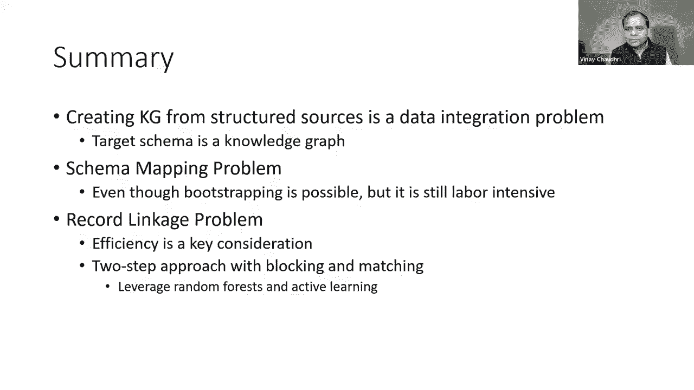

所以我将结束，我会把它交给Ehab，呃，呃，他将告诉我们结构化数据，给你打扫卫生，Ahab，太厉害了，谢谢。嗯维奈，我要分享我的屏幕，非常感谢你邀请我，嗯，这是一个伟大的晚上介绍，因为我要说的是，嗯。

我刚才说的那种问题的延续，我们一遍又一遍地看到它，不仅在数据库论文和学术界的机器学习论文中，但它是所有数据集成的面包和黄油，管道和数据集成也在工业中发挥作用，但我今天要告诉你一个不同的，呃。

但高度相关的问题，我们将把它与结构化数据集成的类型联系起来，当我谈到知识图的构建时，呃，这也是这门课的主题，所以我不必为这个团体加油，数据清理和数据准备有多重要，包括模式映射和重复数据删除。

还包括一般预测和数据估算，离群点检测，因为大多数时候，我们准备这些数据，只是为了让它作为输入有用，机器学习的有用输入，嗯，模型和预测模型，获得洞察力并决定，如果我要在不同的业务部门投资，比如说。

或者我应该对一个产品或类似的东西出价，在那个空间里有成吨的，你知道的，十亿美元，数百亿美元的初创企业正是这样做的，其中一些初创公司只专注于一个单一的问题，喜欢数据，呃，重复，比如说，而另一些人在做转换。

你会在上面看到很多很多熟悉的名字，像SAP和IBM，但在过去的十年左右，有多家公司来自，呃，学术界喜欢三连胜，就是正角项目，和定时器，我和迈克·斯通布雷克·安迪·帕尔默共同创建的，呃。

我的博士生和迈克·皮奇在波士顿的学生，这是一家正在构建模式映射的公司，数据集成软件，然后呃，仍然有一百多名员工在做这件事，我们这样做的原因是依赖于机器学习模型，鲁棒性，机器学习模型。

一个通常在高冗余数据中工作，喜欢视频和图像，或者你有机会，1。成功的希望不大，以及结构化数据的稀疏性，其中错误可能是致命的，很明显，甚至呃，即使它很小。

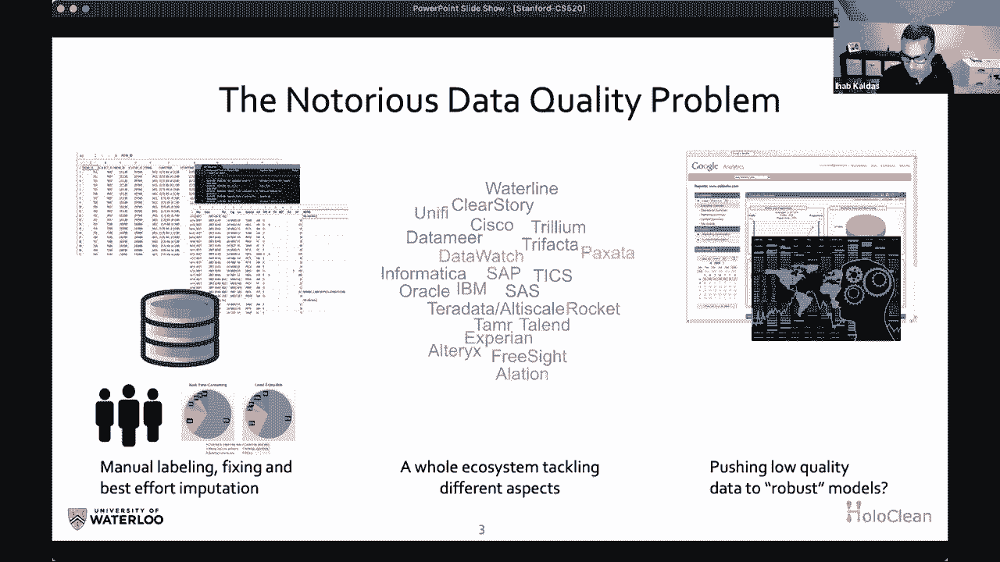

它会破坏你的分析管道，所以问题就来了为什么我们在建立机器学习方面取得了长足的进步，像Pytorch这样的供应软件，张量流、欧弗顿和路德维希，和其他工具让我们提供机器学习。

复杂的机器学习模型在不到一天的时间里，为什么我们不对数据清理和数据准备做同样的事情，为什么机器学习和人工智能没有推动，嗯，清理数据，准备数据并将其放入知识图中，甚至把它留在里面，关系数据还落后。

为什么它非常，非常劳动密集型和昂贵，这是一个玩具例子，呃，正确看待事物，我们在零敲碎打地进来时从来没有这种类型的问题，的，你没有一张表或一堆输入，只有重复的，或者只需要模式映射，通常情况下。

您会出现值和语法错误，如，比如说，New York在这里拼错了，所以你会把所有关于纽约的分析都搞错，嗯，和缺少的值，但也有微妙的完整性约束违反，这是函数依赖关系冲突，比如说，我们应该把它放在哪里。

作为任何两个同意的记录，邮政编码应该同意，也在城市上，在这种情况下，他们没有，所以说，不管是洛杉矶还是旧金山都是错的，或者邮政编码错了，我们不知道，但数据不能共存，和数据准备。

或者数据清理基本上是摆脱这些垃圾，把一张好看的桌子放在没有错误的地方，呃，已推出符合完整性约束和重复的，所以从Vinay你。

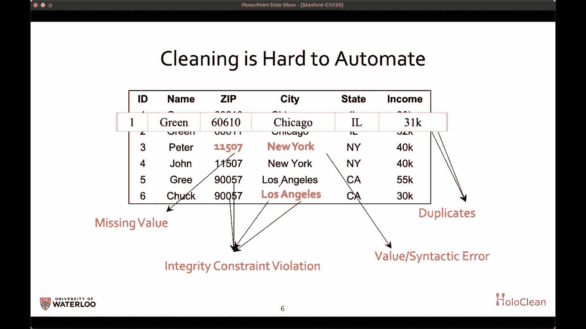

你知道你，呃，暴露于此记录链接管道，通常你得到的数据，你做配对，你做特征提取，橙色的块通常是主动学习的，呃，循环，那里的机器学习没有那么复杂，如你所知，刚刚好，传统，呃。

随机的森林和人工种植的树木会做得很好，但问题在于这种数据集成，问题是规模，因为n平方，呃通常你的脸是蓝色的，你需要像阻塞和局部敏感哈希这样的技术和其他东西，呃能够提供一个工作的。

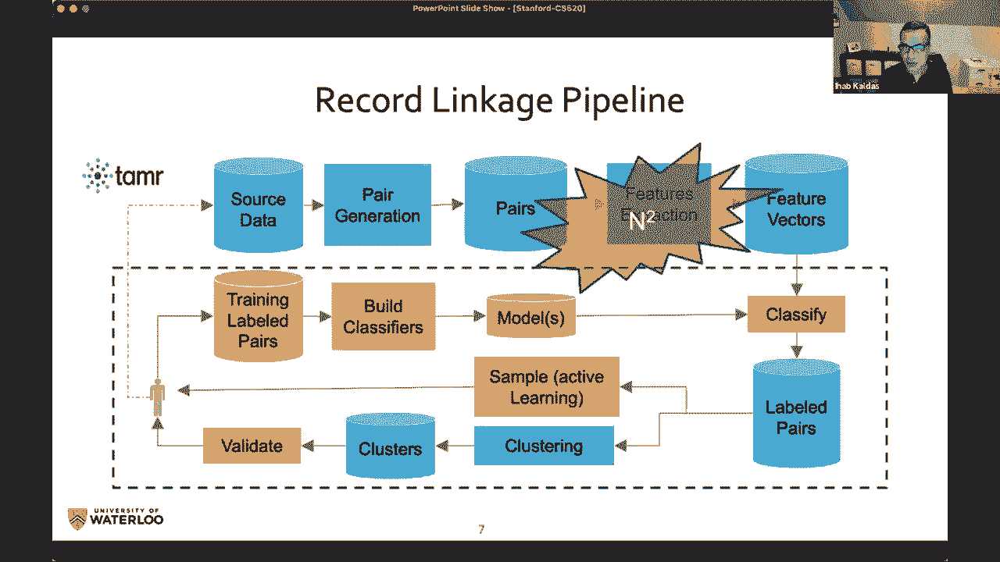

但在统一之后，我想说服你，在处理结构化数据方面有两种不同的类别，不管是在知识图上还是在很好的旧桌子上，关于具有模式映射的数据统一和集成的一类问题，重复，分类，等级和问题，通常有组合问题和输入的大小。

因为你需要把一切都和其他一切进行比较，机器学习要求不是很高，即使你有半结构化的数据或文本，新的嵌入模型将允许您，表示层捕获非结构化数据，不知何故然后任务本身就是我们的两件事是一样的。

但在一般的数据清理中，我们在这里所说的，数据清理，也就是第二类，基本上只是发现数据的错误和违规行为，更重要的是，你能修复数据吗，在那里，你不必把所有的东西都和其他的东西进行比较。

你只需要想出一个生成模型，或者任何机器学习模型来理解数据是如何产生的，错误是如何引入的。

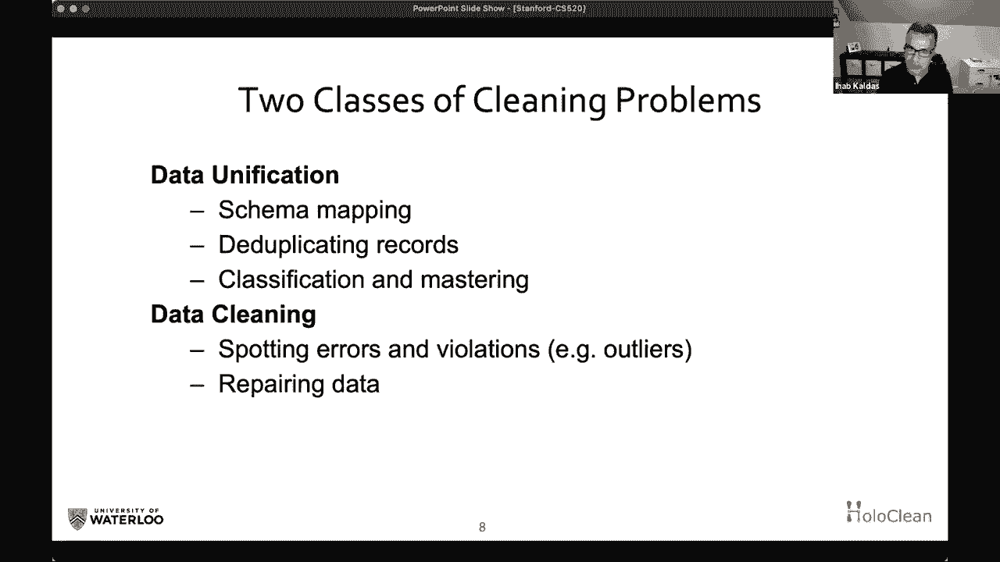

你能做些什么呢，它是一个例子，呃，我给所有在这个行业的人，它是，它是，认识到我们在数据库课程中教的东西是很重要的，关于空值和三值逻辑，虽然很耐人寻味，在工业和真实数据中通常不会发生。

因为没有真正的NUL，它总是被称为约翰或变体或圆点，点、点或问号，所以有很多有趣的错误，其中一些甚至是法律价值，可以放在那里，你需要明白这不是真的。

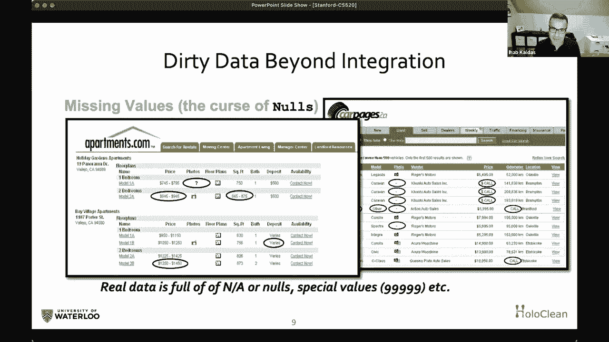

这就是我今天要告诉你们的内容，然后我要解释，全息数据这个词是什么，我们为什么要这么做，我们想自动化，我们对数据建模，修理，数据估算，一个伞下的知识建设，其中呃，它允许大模型了解数据是如何产生的。

结合所有信号和上下文规则，制约因素，开始，呃，预测数据中应该有什么，呃，财产应该是什么，应该是柱子，这样就避免了这个规则爆炸，呃生意，因为你知道，规则是系统上的附加，你知道如果你继续增加这个专家。

很好的老规则专家系统，你有矛盾的规则，规则变得比数据更难管理，更重要的是，如果你能做到这一点，你将能够传达一些类似于自信的东西，呃，或者你那种真理的可能性，如果你喜欢，如果你能做到这一点。

而不是现代逻辑或嗯，扣除方法，但我们需要解决一堆问题，首先我们需要对数据和背景进行编码，呃，模型内部的知识，因为数据很稀疏，如果你想象你知道，三百，呃，每个类的不同性质是知识图，比如说，那是你的维度。

这是一个巨大的观察空间，所以你不能，真的，只是，呃，依靠冗余来学习任何东西，您需要注入某种图形结构或模式，或者本体论或类型和其他领域的知识，以确保你可以学到一些东西。

我们还需要在存在肮脏观测的情况下这样做，有时根本没有训练数据，你应该知道，最后我们需要解决缩放问题，因为，因为我们不能，我们不能想出一个普通的模型，需要你知道，几周来训练和过度适应数据集。

然后数据集发生变化。

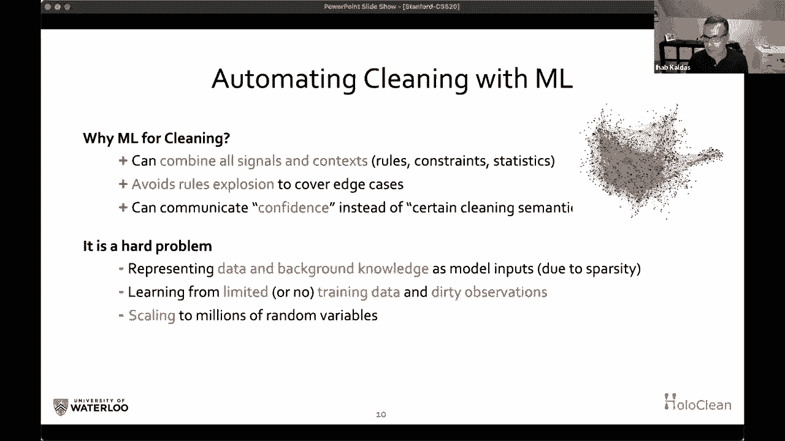

呃，比那快得多，所以我们试图做这个问题有多干净，那是我们2000年开始的一个项目，呃，十七，呃，与嗯，呃，是克里斯·雷，他实际上在斯坦福大学，然后嗯，和理论，他曾是斯坦福大学的一名博士后。

然后去威斯康星州当教授，然后嗯，我们三个，和一群同事、合作者和学生开始着手，构建一个模型，它可以学习数据是如何生成的，并开始处理数据，清洁，数据预测，把构建新知识作为一个问题，呃，就是预测。

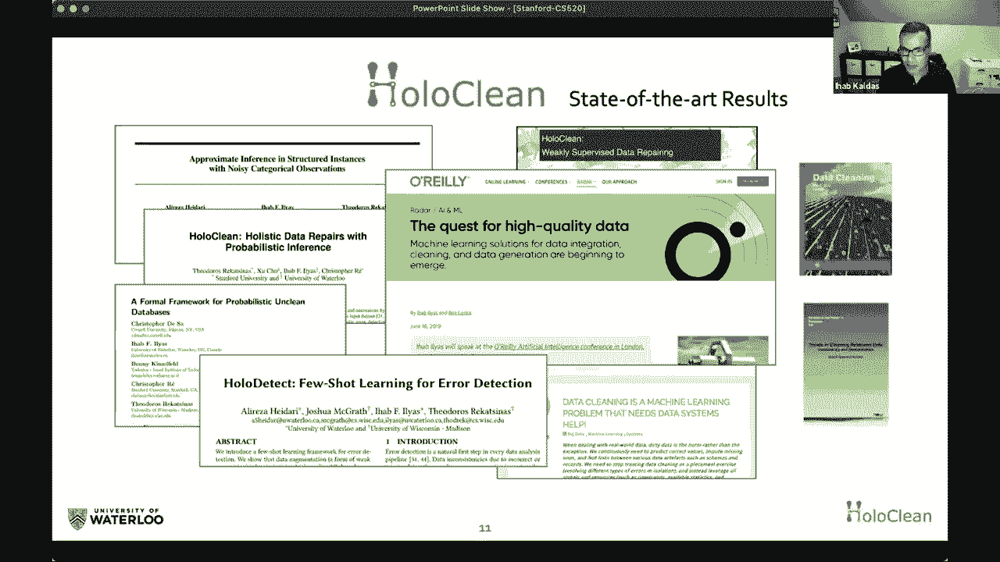

嗯，这是我们为什么可以这样做的一个例子，嗯，一次又一次，我在用这里的桌子，只是为了简单，你可以很容易地把这看作是知识图的发挥，或者嗯，只是会更稀疏一点，但有办法绕过它，但这里的基本思想是。

如果你相信数据是干净的，嗯，由数据上帝和它的意图是干净的，但后来它穿过了一个嘈杂的通道，在此数据中引入错误的地方，通过无知或通过错别字，或者呃，甚至通过恶意玩弄数据，然后你观察到一个肮脏的版本，呃。

纯真J星，基本上，如果你能弄清楚生成实例的生成过程，通过观察j星，那么您就对如何处理数据清理任务有了很好的了解，所以如果我们能管理R，哪个是数据魔鬼，增加的实现者，包括诱导噪声，我们对生成过程进行建模。

嗯，通过参数化这些模型并尝试学习参数，那么数据清理只不过是，是什么数据使我的，什么是干净的数据集，使我目前的观察最大化，或者我现在看到的可能性，这是它背后的理论想法，并详细公布，在一篇ICT论文中。

如果你，如果你有兴趣知道这个嘈杂的信道模型是什么，以及它如何简化我们的呃，处理所有这些不同的问题，作为一个问题，就是弄清楚，什么是正确的数据，从脏数据，我们在观察，模型可能很复杂，我不去。

我不打算详述这些细节，但是呃，看起来很复杂，但实际上根本不是，最后的公式告诉你，任何数据集的概率都只不过是一种封闭的形式，你知道满是指数家族，比如说，但我假设每一个元组。

或者你在知识图中看到的每一个事实都是，都是，都是，呃，有点提前发生的可能性，但它们也共存在一起，被这些违反诚信的行为所支配，告诉你什么可能同时发生的约束，他们不可能或不太可能想到的事情，呃。

学习这些特征重要性的权重，呃，管理数据生成，你知道，只是一个背景，因为这是一个长期研究的话题，尤其是它在数据库社区中的逻辑方面，这就是所谓的否认约束和包容，如果你熟悉功能依赖之类的东西，并检查约束。

这个呃是一个更富有的，呃呃，一阶逻辑公式，允许你说，呃呃，很酷的东西和很酷的商业规则，比如说，你可以说，嗯，像你不能有两个员工，一个在纽约，另一个不在纽约工作，呃在同一个角色。

纽约和纽约的员工赚的钱更少，或者类似复杂的人力资源规则，um可以编码为公式，就像这个，如果你同意城市，第一行告诉你，如果你在城市同意，你必须在状态上同意，第二个告诉你复杂的东西，我只是冲突。

我刚刚告诉你的一个真正的人力资源规则，但无论如何，它们可以以封闭的方式表示，封闭形式，然后呃，如果我们能把这个注射到机器里，学习模型或者我们对建模的追求，数据是如何生成的，那么嗯。

那我们就完成了一个非常好的任务，这是一个啊，我的一个医生也是，去年毕业，采取否认约束，并看到否认约束和在枷锁中的相似之处，这是诚信的新标准，对RDF和知识图的约束，我鼓励你去读它，这是一个非常干净的。

在知识图上描述事物的方式，你不能有同一个人的两个出生日期，或者你可以让一个人死后出生，诸如此类的东西，所以它允许你表达这些质量规则，但它们是表达你想做什么的好方法，但它不是，你甚至可以发现，自动发现它。

有时就像采矿一样，像算法，但它们对告诉你如何纠正事情没有帮助，如何估算丢失的东西，以及如何纠正违反这些约束的事情，所以在全息纸里，我们有很多关于如何建模的想法，呃，其中之一是尝试建模数据是如何在。

通过在图形模型中建模这些数据单元之间的交互，所以如果我们假设数据中的每个单元格，知识图中的每个属性都是随机变量，那么是什么支配着，呃，呃，的，这个随机变量可以从域中获取的可能值，一堆因素，比如说，模型。

它应该与其他值共存，或者它不应该，呃，不应该是，呃，违反完整性约束，所以当我试图弄清楚某人的城市时，或者某人的邮政编码，我们想确保如果我们试图预测这些事情，他们不会在数据中引入违规行为，我们在一个。

你知道作为因子图中的因子，然后基本上学习就是学习这些因素的权重，一旦你知道那种呃，生成数据的模型，那么运行推理基本上是在问，这个邮政编码最有可能的值是多少，我只想让你，即使你不明白我刚才在这里做的。

想象一下我造了一台机器，你可以问这台机器，关于知识图中每个单元格或每个属性的特定问题，那个人最可能的地址是什么，那个人最有可能的薪水是多少，最可能的颜色是什么，呃，为了这栋楼，这首歌最可能的流派是什么。

如果你能做到这一点，您可以使用这台机器修复您看到的错误，或者构建缺失的新知识，通过编码上下文，呃，你知道你的邻近节点，在关系的情况下，同一表中的其他行和其他列，我们在全息清洁中做了很多技巧来制作这个。

呃规模，例如，我们寻找嗯，我们已经观察到的局部最优，而不是试图，呃，你知道的，把海洋煮沸然后猜测所有这些未知的值，这里我就不告诉你细节了，但我们的想法是把这个规模扩大到2000，我们搬到了另一个地方。

呃，模型，试图编码更多的上下文，所以在呃，在呃，在冲动中，二十二十我们呃，我们发表了一篇关于如何建立一个基于你知道的模型的论文，它的基于注意力的模型，用于上下文地表示每个目标周围的上下文。

呃手机这样我就可以通过你知道的，代表呃，输入，考虑图中最重要的列或属性，这就是为什么这里要注意的是模式级别不是，不是传统的自我关注，例如，在价值层面上，它足够强大，可以猜测，例如在呃，归责于某一性质。

最重要的属性是某某，所以这里有一个例子，如果我们想用这个呃，基于注意的机制来估算特定的，呃，呃价值，然后呃我们开始，嗯我是说，你实际上不需要做剖析器，但你可以做很酷的事情，比如，分析数据以了解，呃。

每列如何，每列对任何其他列的预测能力是什么，但让我给你另一个直接应用的例子，假设它们有一个具有一堆属性的实体，例如，城市是芝加哥，县是未知的，它从我的知识图表中消失了，在我的桌子上邮政编码是60或63。

那个人的年龄是三五岁，我想知道，我能把失踪的县，这里的想法是，如果我对行中的每个值都有一个表示形式，我知道，所以我有一个代表，和一些嵌入，使我能够代表这个城市，表示邮政编码以表示年龄。

然后我在模式层面上学会了一种注意力机制，它告诉我，1。县在城市发展中的作用有多大，所以说，比如说，如果你把右边桌子上的第一排，你就会知道预测城市，县很重要，拉链很重要，年龄不是那么重要，这是有道理的。

如果我们以自动的方式从数据中了解到这一点，所以我学会了这些重量，我学会了输入的表示，然后我可以表示我不知道的每个目标属性的上下文，我以一种专注的方式把它聚集在一起。

所以我现在可以有一个缺少什么的上下文表示，我可以添加到这个其他稀疏的功能，像违反镣铐约束，或您想要的任何其他功能，在这种情况下，我们可以开始把它输入，嗯嗯，呃，在预测层中提供上下文，比如说。

试图得到最有可能的县，那个，呃符合那个，呃代表，所以你可以在最后做回归或分类，去找回丢失的东西，这里的想法不是让你了解细节，有人想抓住你，你能做的把戏的味道，知识图或结构化数据工件，了解它是如何生成的。

学习如何表示上下文并使用它来预测丢失的上下文，判断某个值是否错误，或者呃，或者呃，或者呃，或者纠正，或者那个，或者推荐可以去那里的可能候选人，这样你就可以，呃，把它运到一个Q，一个团队，并帮助他们挑选。

呃，缺少什么或构造缺少什么，呃，以半自动的方式，然后呃，你知道吗，像你知道的简单的技术，输入的上下文表示，呃，呃，你知道吗，学习嵌入可以捕获的空间，呃，的，呃，这些背景的特点，例如。

我们需要某种语言模型，或者嗯，或者这些东西中的任何一个，这个想法是如何以一种有趣的方式将这些结合起来，呃，我们也遇到了一个有趣的问题，呃，后面是什么，如果我真的对预测或修复不感兴趣，呃，特定值。

我是什么，如果我有兴趣只是判断，如果有什么可疑的地方，我们能不能让问题更容易，呃我们能做错误检测吗，不是真的在修复，我能建立一个模型来分类吗，如果这个特定的属性或这个特定的值是错误的，你可以想象。

这将是一个，嗯嗯一个非常标准的方式，我代表了整个，尽可能多的上下文，一堆属性级表示，比如说，呃字符或令牌级别，呃嵌入模型，我也可以呃进入一些元组级别的功能，像与其他群体共存，所以如果我。

如果一个非常罕见的值出现，并且从来没有与我的，呃是我的其他财产，那就有鱼腥味了，但也有一种数据集或全局属性，喜欢我喜欢我违反约束的可能性，例如，好吧如果你知道船所有这些，呃或者代表所有这些。

这就成了我的表示层，但我想把，一旦我看了那幅画，我说有些不对劲，或者呃，或者这看起来不像是一件错误的事情，事实证明，问题实际上并不在于结构或架构，那个型号那是标准型号，模型越丰富，它的力量就越大。

问题是你如何训练这样一个模型，问题是错误检测，你可以使用的错误数量，因为例子不够大，不能训练模型，比如，如果你有很多错误，你都认识，那就好了，但却挫败了整个目的，整个想法是，我有一个知识图，或数据集。

其中我很少有错误的例子，我通常会随着时间的推移而发现，他们永远不足以训练这样一个模特，所以我们有了这个想法，我们能用数据增强来制造假错误吗，这看起来像我们看到的极少数例子。

我们用这些人为的错误来训练一个强大的模型来告诉我们哪里出了问题，什么是正确的，我们证明了这个想法是可行的，呃，训练啊，捕捉某些类型错误的强大模型，唯一的问题是你要受那个增强引擎的摆布，例如。

这是一个示例策略，它将采用正确的数据集，用不同的方式继续捣乱，如添加字符或删除字符，然后你会生成很多错误的例子，你训练模型，这将概括，呃不仅仅是写一个规则，呃只是错别字，或者类似的东西，但它没有。

比如说，捕获与交换值有关的错误，或，或者其他类型的奇怪错误，那不一定，呃错过了角色，所以这给了我们一些疑问，如果是，嗯，如果是，呃完全适用于，呃在现实中，然而，我刚才给你们看的前一个模型。

这个关注罐是模型和全息清洁，呃，我们创造了商业价值，呃它，而我们，呃，我们去年把它放在一个叫做归纳的初创公司，被苹果收购了，和，现在，嗯，它有，呃，更多，嗯，在真实数据集中的牵引。

因为它直接试图建立一个模型来描述数据是如何。

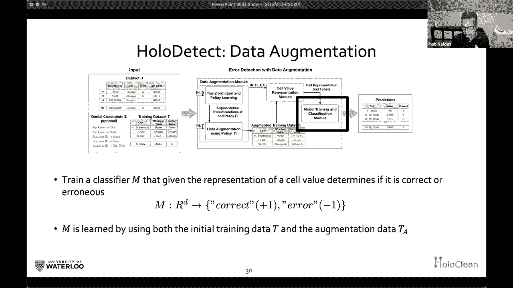

正如我所说产生的，我们用它直接预测模型，就像我之前说过的管道，和类型的事情，你我告诉你，也像计划集成和和D复制，有管道，你知道，其他用于错误检测的管道，呃生成，呃，可信数据或数据增强，这是一个例子。

这不是最新的东西，在那里或绝不是标准的做事方式，我只是告诉你，嗯，它仍然符合这种数据操作的心态，你正在建造的地方，获取数据工件的框，稍微操作一下，试着多理解一点，生成事实的另一个数据，你把它运到下一个。

呃，呃盒子等等，其中一些盒子是检测模型，其中一些盒子正在训练一个模型，其中一些盒子在运行推理，这个想法是提出维修和建议。

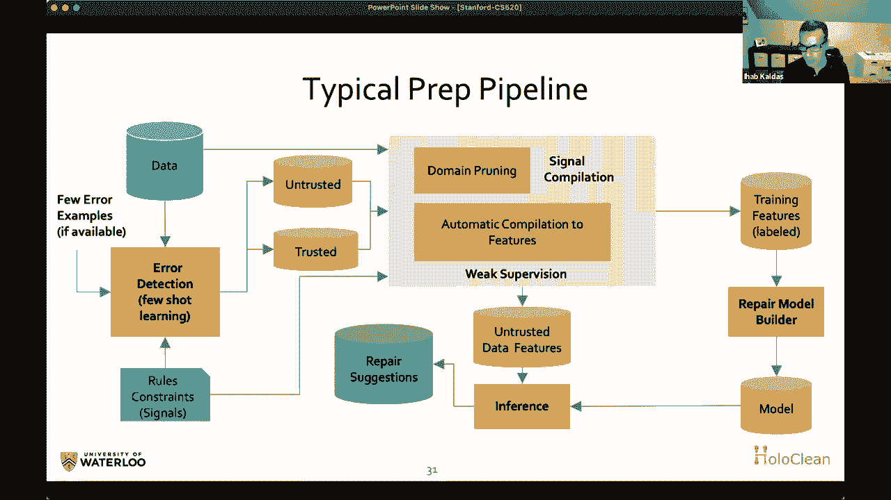

在嗯，在最后，我将给你留下两种用例，它们超越了，嗯，呃，清洁，只是为了让你相信清洁归责，离群点检测，呃，数据修复构造，他们有点呃，高度相关的问题，可能可以用同样的，一个强大的，呃，预测模型。

在这种特殊的情况下，我们，我们与一个，呃，做市场调查的公司，在那里他们并不像你知道的那样对清洁感兴趣，预测每一个呃的特定STU的结构，他们的产品，比如说，所以我们达成了，你知道，可笑，自信，呃。

准确不是不是不是因为喜欢，你知道，我们，我们做了一些惊天动地的事情，只是数据太多余了，模特拿起了，呃，这些图案很快，这样它，你只需要对上下文建模，然后模型可以立即告诉你，呃，那种特殊药物的SCU，呃。

这帮助他们填补了报告中大量缺失的数据，否则他们要花六个月的时间来估算。

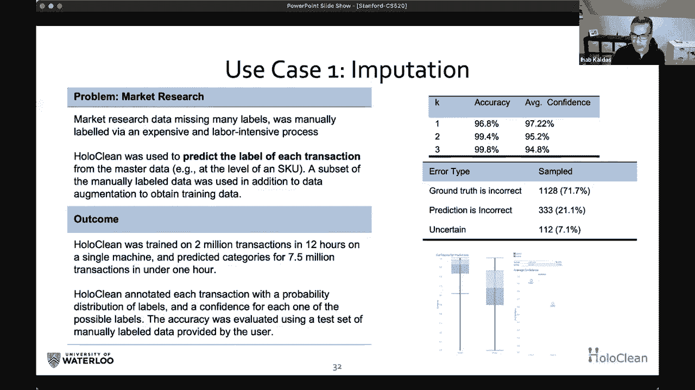

呃，按年级划分，使用预测的一种有趣的方法，如果你不想直接做错误检测，也要对所有东西运行预测，如果你喜欢喜欢，利用你所知道的一切来预测，呃，特定的靶细胞，如果你的预测与细胞的预测不同，那它就是一个。

有一点可以说，这些数据看起来不像，它来自那个分布，我们用，那是一家保险公司，模型选择了一些细微的错误，一些地址在邻近的邮政编码中被错误分类，人类很难看到这些，因为这条街有两个邮政编码，基本上，呃。

但是其他的特点，呃，呃，预测那是错误的，呃。

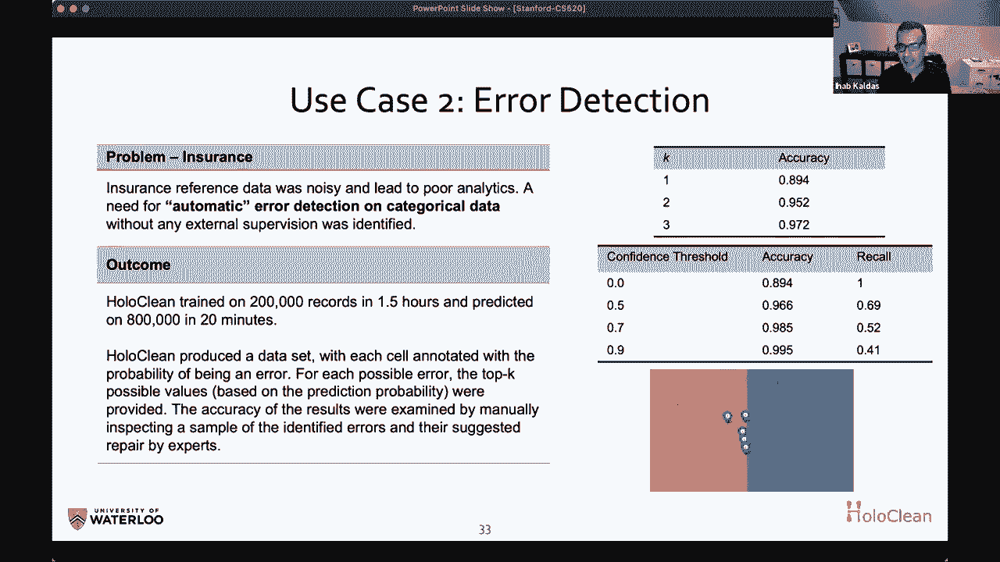

标签，呃，就像在不同的区号里一样，所以这很酷，所以呃，只是总结一下，只是呃，可伸缩预测是一个非常强大的，呃，知识建构之路，知识归责，你知道，一般的清洁和修理，必须解决监督不力的问题。

你只是没有足够的训练数据，然后嗯，你需要，你经常需要满足，是一个封闭的假设，你过度适应了你所有的观察，试着用这个过度拟合的模型来检测你知识中的错误，或推定失踪，呃，缺失的知识，游戏是一个上下文表示。

怎么呃，你在表示一个丰富的上下文时是否小心，该上下文可以预测缺少什么，它直接应用于，在很多事情上，一体化，清洁与知识建设，这项工作继续取代，很多会工作，在几个月的体力劳动中，然后呃。

而且你通常使用的硬件配置比大规模的要温和得多，呃，模特们正在尝试，比如说，从事视频和媒体工作，结构化数据一般较小，但是呃，稀疏，需要大量的爱和关注，我希望这至少能引起你的兴趣，一堆话题，呃读到关于。

还有一堆文件要检查，我很乐意回答问题，但谢谢你再次邀请我，所有的权利，呃，谢谢。亚哈，是啊，是啊，我们有二十分钟左右的时间来提问或讨论，有几个问题要问你，是啊，是啊，所以我可以马上带他们去。

自举也是自举。

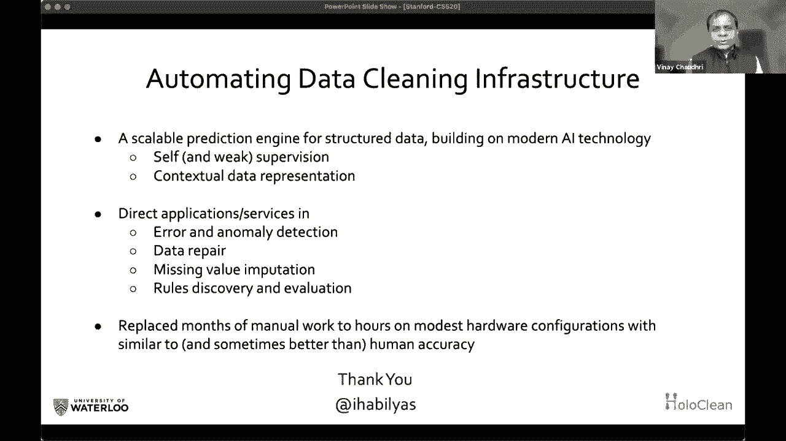

与我们在机器学习中使用的过程相同，我是说我在一个稍微不同的上下文中使用了它，我在这里使用引导的上下文是，您正在开发模式映射，你意识到，嗯，你知道我可能得手动验证一切，但不是手工开发一切。

我们进行一些启发式，它建议了一些映射，可以在人类的验证过程中使用，所以我使用的是他们意义上的引导，你正在使用这些自动启发式向人类提出建议，谁可以在核查过程中使用它们，我认为在机器学习中使用的引导方式。

一种稍微不同的感觉，第二个问题是在一个给定的领域，有多少人在模式映射上工作，人类的努力有多大，有很多不同的领域，需要人类付出多少努力的一个重要因素是准确性水平，呃。

至少我熟悉模式的一些项目倾向于非常简单，它可能有五个，六，八，十，数据往往是巨大的，就像有大量的记录，但它们以非常有趣的方式联系在一起，用这五六种不同的关系，这是知识图类型应用程序的一个可能的甜点，对。

在那些应用程序中，在模式映射上投入的精力非常小，对呀，你只是在前面，你知道的，你设置了你的知识图式，然后剩下的工作进入记录链接和加载过程，和运行图形算法，做有趣的事情，呃，模式检测。

但显然有不是那样的问题，模式在哪里，数百个表和数千个属性，我个人没有，呃，第一次和这些问题的经验，但我想，嗯，至少去年听了一个，你确实需要敬业的人，像知识科学家，谁有应用知识，他们也了解软件。

谁能开发集成图式，好的，所以有一个问题是没有标签数据密钥的挑战，创建不同领域的知识图，所以你有你想谈的吗，呃，数据标签挑战，嗯嗯是的，绝对是，这取决于取决于取决于任务，嗯和嗯，你知道，在今天的谈话中。

我试图证明你可以在没有标签数据的情况下做很多事情，因为你已经在可用的知识图中看到了很多好的数据，所以人们用掩蔽之类的东西，你知道的，试图预测，用你知道的一切，因为已经呃，然而，标签和嗯。

获取图表的分层样本，并获得人类评分器，它仍然是一个是一个是一个主要的努力，但这仍然是一种标准做法，对许多人来说要做的是引导，其中一些，尤其是头脑和知识，你想在大脑中获得高质量的数据，我知道你。

你在摩根大通的团队做了很多这样的工作，你想对此发表评论吗，是啊，是啊，绝对，所以我认为这对每个项目来说都是一个很大的挑战，嗯，我们用了，嗯，标签在某种形式上很重要，显式隐式标记，我们在摩根大通用过。

甚至以前的公司，在整个项目或产品生命周期中进行许多不同形式的标签，嗯，第一个标签往往是，当然啦，就像数据科学家实际上创建，嗯，产品的第一个版本，他或她会做的，标签本身，然后有一个系统，嗯。

在那里我们让所有的专家Labeer或众包参与进来，有时即使这样也不够，我们必须发布产品，让用户使用它，然后像你一样通过显性的或隐性的，当你使用这些产品时，选择竖起大拇指，拇指朝下。

或者你向社区要求更正或搜索排名，你实际上没有任何明确的东西，你只是从人们的排名方式来推断，然后嗯，你从人们点击的方式推断，嗯，是啊，是啊，您生成这个标记的训练数据，只是呃，这就是所谓的隐式，隐式。

UM隐式标记，所以我们在整个生命周期中使用所有这些技术来生成标记数据，然后有一个问题，标签是否超越了自然语言，我不太确定，如果我完全明白，这个问题大家听懂了吗，我觉得，嗯，如果这个问题意味着，呃，就像。

是标签吗，总是有点标记，呃，自然语言问题，或者它超越了任何其他类型的方法或类似的事情，呃，中使用的语言，呃，嗯好吧，我我可能是一个相关的答案，我不知道它是否回答，但是有很多标签工作围绕着分类和嗯。

还有布尔问题，比如说，这两件事是一样的吗，呃，这就是我之前说的，删除知识图中的重复实体，例如，有很多标签，他们不一样，他们是一样的，或者把这个实体一分为二，或者类似的东西，但在归责中。

比如全息清洗法和诱导法，你想要呃，也知道很多分类，呃，标签，嗯，某人出生的年份，或者邮政编码什么的，但与用户的交互往往是自然语言问题，因为否则你就得不到，嗯，至少在明确的标签中在监管不力中，那个，呃。

你写规则，你经常，您还可以由用户验证这些规则，但那也是自然语言，我不确定这是否准确地回答了一个问题，所以我有个问题要问你，你对你的创业有什么看法，我只是好奇想知道，呃，它有多大，是以滑铁卢为基础的吗。

是硅谷的吗，感应的，是滑铁卢基地，那是，嗯嗯主要是嗯，呃看你和和我和嗯，呃，我想说两个笨手笨脚的学生，因为他们中的某个人，嗯因为这个没有完成，和两个硕士生，所以它很小，就像六七人公司克里斯参与了。

呃也是，但是好消息是，它很快就得到了很大的牵引力，我认为Holoclean已经被一群人采用了，所以我们开始引起注意，但后来我们被苹果选中了，当然，所以有一个问题，是啊，是啊，去吧，嗯。

所以你运行全息清洁的方式，当然可能是一个项目接一个项目，在像我们这样的公司里，它根据特定的数据学习项目的功能，像摩根大通，我们有很多相关的项目，呃，使用相似列名的，相似数据分布。

值就像HoloLens不断从项目A中学习的模式一样，然后当你开始项目B的时候，它积累了一些知识，你能说当然吗，我们经常被问到这个问题，然后呃，简短的回答是某种远程学习，呃或者有点，呃。

在不同的数据集上微调模型，嗯你你考虑一下，你从初始模型开始，而不是一堆随机的权重，比如说，然后你，呃，一种开始，呃，用高度相关的，高度相关的项目，呃，答案很简单，的，你知道这取决于我们有多依赖，就像。

比如说，如果有嵌入模型，所有的值都已经出现了，我们没有词汇表之类的东西，那就比你知道的容易多了，看起来很有关系，但这是一个非常不同的词汇和非常不同的价值观，在这种情况下，呃，我们经常重新训练。

然后然后去做，但它是一个，人们发现了什么，呃，非常，呃，呃可以横穿，是对本体论的见解，是对数据的洞察力，比如特定的列或属性在预测某个属性时有多重要，如果分布没有改变，这是非常可转移的知识。

从一个项目到另一个项目，很多人，呃用的，呃用那个，我在这里看到一个问题，我想相关的，这是输出的可解释性，那个，比如说，银行的客户之一，他们说，当然啦，我们不会把一台估算价值的机器放在银行里。

然后我们把它运送给人们，这是不会发生的，呃，但他们的用法不同，他们用它来解释，为什么某个属性是错误的，他们使用不同类型的解释级别，模式的注意力权重，例如，对他们来说是一个很好的解释，这是不对的。

因为在输入此特定属性或列时，最高的重量落在另一根柱子上，这个专栏说了别的，和，你知道QA的人逆转了这一点，虽然这不是很好写的规则，但它帮助他们诊断，这帮助他们解释了为什么会发生指责。

因为这个属性依赖于另一个属性，因为我所观察到的价值，我预测会这样，这对他们中的一些人来说已经足够好了，一个更好的用例是，我不会马上相信你要说的话，但我要把它作为一个建议。

所以每当Holoclean说我们不确定是什么的时候，或者在预测的可能候选者中有一种很大的熵，他们利用这一点，你知道的，他们需要关注的红色病例和橙色病例，而绿色的箱子是，当模型真的确定。

它告诉你有足够的冗余，他们可以动脉检查，所以他们用它来管理他们的QA时间，人工查询时间和专家时间，不确定是这样，我想什么，另一件一直困扰我的事，对于这些大规模的数据清理问题，归根结底。

你确实需要知道基本的真相，或者人们不关心地面真相，他们只是，呃，从干净的数据计算紧急度量，并假设它比他们开始的时候更干净，是的是的，这是个有趣的问题，所以呃，你知道吗，在大规模数据集中。

就像你去问几个人类一样，你创建一个小的金色套装，这主要是为了训练模型或验证，你所做的是否正确，但是关于整个数据集的基本真理的概念稍微，很难动手术，呃，我有，你知道的，太字节数据，我我知道大部分都很好。

但我不知道它有多像没有装满垃圾，你能恢复多少，呃，只要你，是啊，是啊，所以我的意思是，看来你的数据清理，所以说，假设你想出了一个新的数据清理算法，它将被购买或不购买，基于它在目标设定上做得有多好，绝对。

是啊，是啊，你是，你绝对是，它在验证你在做什么，是你，你知道，它在评判一个模特，呃，监视一个模型或评估你有多有价值，呃，但它不能成为你行动的一部分，不能是数据管道的一部分，这不是一个。

这不是一个可扩展的概念，对嗯，所以迈克，我知道，我知道，你有，呃，建立并出售了一家数据集成公司，在你看来，你认为自从你做这项工作以来，这里的景观发生了什么变化，我们参与的大部分工作是。

我们不能有系统猜测的情况，它必须是正确的，因此，这就产生了激励，以确保像它们这样的映射，数据是干净的，模式之间的映射等等被保证是可靠的等等，所以我要提几件事，关于模式映射的讨论，是呀。

这些技术在建议可能的映射方面很有用，但最终他们都需要接受审查，你所说的一些技术的缺点是，它们太弱了，无法表示一些必要的映射，很多时候你需要加入，呃，而不仅仅是映射，对象对对象，或与关系或某事的关系。

这需要各种不同的剑或结合的复杂连接，嗯，因此，这些技术虽然在暗示某些情况下有用，但并不足够，让我有点不安的是，我想你的演示文稿是几十年来在数据方面的工作，在数据库社区中已经完成的UM集成。

ETL系统提取传输形式和加载系统，而我们，当然我在这方面也做了一些工作来弄清楚如何进行转换，做数据转换，保存丢失的数据，防止数据丢失，但这确实需要更多的体力劳动，我认为你所说的很有趣。

让系统建议一些事情通常是有用的，但还是得有人看着他们，如果你关心可靠的答案，关于数据清理问题，我们发现这是一个重大的挑战，也是最大的绊脚石之一，我们所做的是数据通常是脏的，这还不够好。

解决方案不是试图手动清理数据，当然机器学习在那个年代并不流行，但我们更关注的是所谓的正确捕捉，首先以正确的形式捕获数据，所以人们不会写任意的字符串，你永远不会想象拼错New York，因为机器正在进入。

而你，你在输入的时候检查它，而不是，而不是必须清理太字节的数据，以一种有缺陷的方式创造的，所以要尝试的解决方案是避免数据清理问题，通过在捕获上做正确的部分，所以我，我很同情你的问题，你。

你们两个都在处理，呃，在我们的例子中，更重要的是数据是可靠的，集成是可靠的，这确实需要更大的，强调可验证的映射规则，通常是机器人手动生成的规则，其中数据由，情况并不总是这样，当然。

外面有这么多不干净的数据，这就是为什么全息清洁是无价的，希望未来我们能以干净的形式捕捉更多的数据，我们不需要猜测数据意味着什么，更确切地知道我们一开始就做对了，无论如何，是啊，是啊，这些是我的评论。

呃好吧，我想最坏的情况，有趣的是，嗯，呃，有一些领域和应用程序，人们似乎可以猜测，是的，他们似乎对呃没意见，对这个黄金数据集进行验证，我也知道域名，呃那里，猜测是可以的。

但他们还是会把一切都通过百分之百的人类验证对吧，这取决于，呃，问题和你试图使用这些技术的背景，绝对是这样，这两个都是正确的，但我想我想说的是，我想我们在这次讨论中改变得太少了。

我们已经改变了关于经过充分验证的数据集成技术的大量文献，支持今天更流行的东西，也就是猜测数据集成，模式映射规则是什么，这是非常重要的，我喜欢它，我认为这很酷，新的事情正在发生。

但是如果我们有学生在看这个，他们没有听到众所周知的事情，怎么做，意识到我们只是在谈论提高艺术水平，他们了解了最先进的两个，外面有一种最先进的技术，超越了我们今天刚刚讨论的，是啊，是啊，所以耶。

我想我只是想承认这一点，然后可能会有一个关于数据集成的完整课程，对呀，对，我们只做一节课，对和呃，担心的是我们可能会给人留下的印象，不是因为不引用其他材料，我想我想这也是在清洁中的一些，呃。

但还有更多更多，那里有很多文学作品可以看，也很有趣，你说这个迈克尔，我觉得很好，谢谢你先做了这枚硬币，因为顺便说一句，我的职业生涯都是这样做的，其他，修理的限制和最低限度，和TGDS和GDS用于，呃。

呃，你知道有信息交换文献，就是这么大，我有一句话要说，如果不注入一些，呃技术，所以全息清洁的竞争优势之一是，我们可以添加拒绝约束作为特性，而大多数你知道的，如果你只是一个从业者，你想说，哦。

下面是Pytorch中的一个模型，我要向它展示一切，希望，他是个自动编码器，或者类似的东西，会成功的，你永远学不会像你知道的那样，模特永远学不会，利用这种有原则的做事方式是有巨大价值的。

也许转变是不要把它当作做事的唯一方式，或者很多逻辑的方法是做事的唯一方法，甚至将每一个约束都视为软约束，或图形模型中的先验，那只是操作语义，它不是，呃，这是你如何对这些知识进行操作，呃。

这种细微的差异是极其重要的，任何绝对的情况，我百分之百地同意你刚才说的意思，对我来说，从我的角度来看，这些技术的融合是我们现在需要的，当我们谈论一个研究社区时，你和Vinay谈论的那些事情。

我认为是前沿的，真的很酷，令人兴奋，因为我们也有学生在听这个讲座，他们可能没有意识到这一切，我只想确定，呃，每个人都知道这个事实，有大量积压的文献，呃，关于我们正在谈论的新想法的研究，呃，他们所反对的。

那是耶，我认为这很公平，这是一个很好的观点，但是我们今天的课已经结束了，所以我想，呃，以…结束，呃，注意到我们将在周四和周四继续，我们有两位优秀的演讲者，呃，劳伦·奥尔和米克里瓦尔，呃。

他们都会更详细地讨论这个记录链接问题，比如，我认为劳伦的谈话是这样做的，以完全无人监督的方式，Mike将讨论实体解析问题，因此，我们将继续在今天开始的讨论的基础上再接再厉，所以谢谢大家，我们周四见。

非常感谢你抽出时间，了解你所做的工作真的很迷人，尤其是你在建立公司和对现实世界产生影响方面取得的成功，所以非常感谢大家，我们星期四见。

